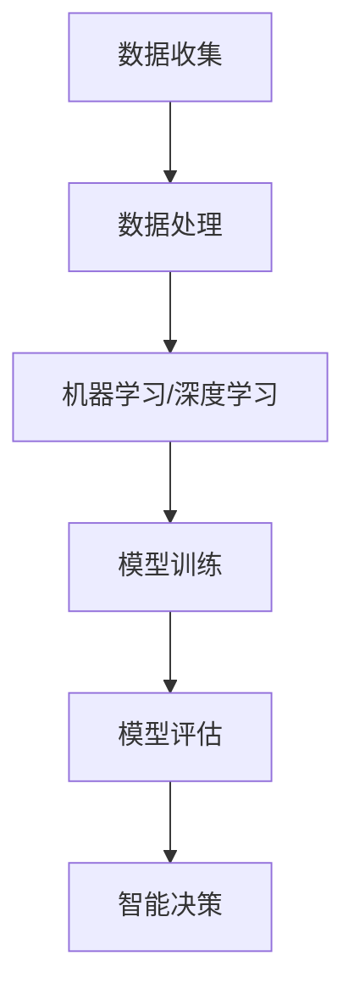
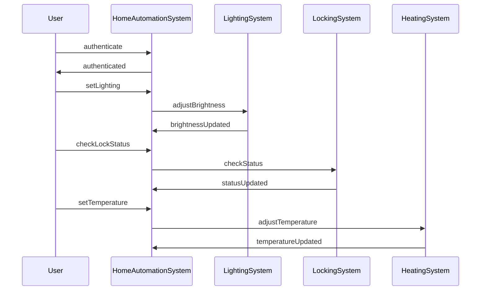
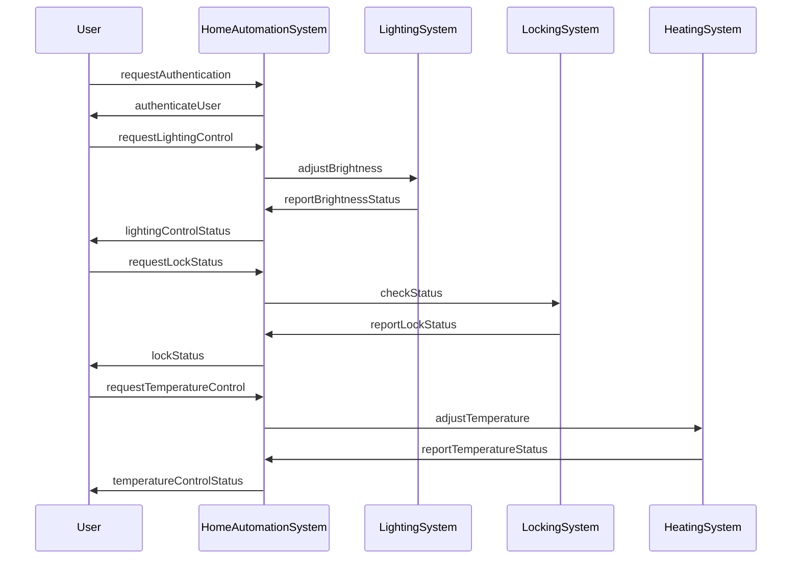
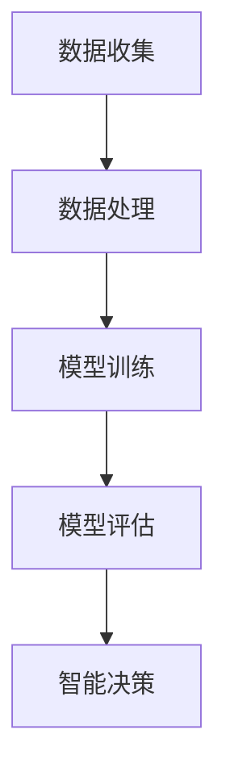
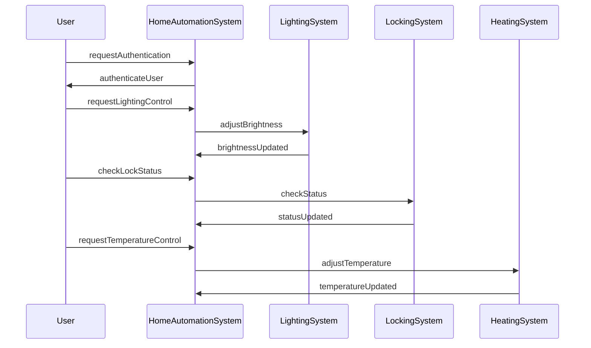

                 


## AI在智能家居中的应用：便利与隐私的平衡

### 关键词：
- 智能家居
- 人工智能
- 隐私保护
- 数据安全
- 用户体验

### 摘要：
本文旨在探讨AI在智能家居中的应用，重点分析在提供便利的同时，如何平衡用户的隐私问题。通过一步步的深入分析，本文将为读者揭示智能家居技术的发展趋势、关键概念、算法原理，以及系统架构设计，最终提出最佳实践和注意事项，以实现智能与隐私的和谐共存。

## 1.1 问题背景

### 1.1.1 智能家居的兴起与AI技术

随着物联网（IoT）和人工智能（AI）技术的快速发展，智能家居已经成为现代家庭生活的标配。从智能音箱、智能门锁到智能照明、智能安防系统，智能家居设备正逐步渗透到日常生活的方方面面。AI技术在智能家居中的应用，不仅提升了用户体验，还为家庭安全、能源管理等方面带来了革命性的变革。

**问题描述：**
然而，在享受智能带来的便利的同时，用户的隐私安全问题也日益凸显。智能家居设备往往需要收集大量的用户数据，包括行为习惯、家庭成员信息等。这些数据一旦泄露，不仅可能导致用户隐私被侵犯，还可能引发更严重的安全问题。

**问题解决：**
如何在提供智能便利的同时，确保用户的隐私不被侵犯，成为智能家居发展过程中亟待解决的问题。本文将从技术角度出发，探讨如何平衡智能家居中的便利与隐私问题。

**边界与外延：**
本章节将重点关注AI在智能家居中的应用场景，包括设备的数据收集、处理和分析过程，以及隐私保护技术的应用。通过分析AI技术在智能家居中的核心要素，为后续章节的深入探讨奠定基础。

### 1.1.2 隐私问题的凸显与挑战

智能家居设备在为用户提供便利的同时，也带来了隐私风险。以下是一些常见的隐私问题：

- **数据收集：**智能家居设备需要收集大量用户数据，包括语音、图像、位置信息等。这些数据在未经用户同意的情况下被收集，可能导致用户隐私泄露。
- **数据存储：**数据在传输到云端或本地存储时，可能存在安全隐患，如数据被篡改、泄露等。
- **数据利用：**一些智能家居设备厂商可能会滥用用户数据，进行广告推送或其他商业活动，侵害用户权益。
- **跨平台数据共享：**智能家居设备往往需要与其他平台或设备进行数据共享，这可能带来额外的隐私风险。

**隐私挑战：**
面对上述隐私问题，用户面临以下挑战：

- **信息透明度：**用户难以了解智能家居设备如何收集、使用和存储自己的数据。
- **控制权缺失：**用户对智能家居设备的数据处理缺乏控制权，无法决定自己的数据如何被使用。
- **法律保护不足：**目前关于智能家居隐私保护的法律规定尚不完善，用户权益难以得到有效保障。

**隐私平衡策略：**
为了在提供便利的同时保护用户隐私，可以采取以下策略：

- **数据匿名化：**对用户数据进行匿名化处理，确保用户隐私不被泄露。
- **最小化数据收集：**仅收集必要的数据，避免过度收集。
- **加密传输与存储：**使用加密技术保护数据在传输和存储过程中的安全性。
- **用户知情同意：**确保用户在数据收集和使用前明确知情并同意。

### 1.1.3 便利与隐私的平衡

在智能家居发展中，便利与隐私之间的平衡是一个重要议题。以下是一些关键考虑因素：

- **用户体验：**智能家居设备的设计应注重用户体验，提高用户便利性。
- **隐私保护：**在满足用户体验的同时，确保用户隐私不受侵犯。
- **技术实现：**利用先进的AI技术，实现数据的高效处理和隐私保护。
- **法律法规：**遵循相关法律法规，确保智能家居设备的合法合规运行。
- **社会共识：**推动社会共识的形成，增强用户对智能家居隐私保护的信任。

通过综合考虑上述因素，可以在提供智能便利的同时，最大限度地保护用户隐私。

## 1.2 核心概念与联系

### 1.2.1 AI与智能家居

人工智能（AI）是智能家居的核心驱动力。AI技术通过感知、学习和决策等功能，使智能家居设备具备更高的智能化水平。以下是对AI与智能家居的核心概念和联系的分析：

- **感知能力：**AI技术使智能家居设备能够感知用户的行为和需求，如语音识别、图像识别等。
- **学习能力：**AI技术可以通过机器学习和深度学习算法，不断优化设备性能和用户体验。
- **决策能力：**AI技术使智能家居设备能够自主决策，如自动调节室内温度、灯光等。
- **协同能力：**AI技术可以协调不同智能家居设备之间的交互，提供更加智能化的整体解决方案。

**概念属性特征对比表格：**

| AI技术         | 概念特征                     | 应用场景                            |
| -------------- | ---------------------------- | ----------------------------------- |
| 机器学习       | 数据驱动，自动优化           | 智能语音助手、智能家居控制系统       |
| 深度学习       | 构建复杂模型，模拟人脑         | 图像识别、自然语言处理              |
| 计算机视觉     | 处理图像和视频数据            | 智能安防、智能照明                  |
| 自然语言处理   | 理解和生成自然语言            | 智能语音助手、智能客服              |
| 强化学习       | 通过奖励机制进行优化           | 自动驾驶、游戏AI                    |

**ER实体关系图架构：**

```mermaid
erDiagram
    Device ||--|{ DataCollection }|<|
    DataCollection ||--|{ UserBehavior }|<|
    UserBehavior ||--|{ PrivacyProtection }|<|
    PrivacyProtection ||--|{ AIAlgorithm }|<|
    AIAlgorithm ||--|{ DeviceOperation }|<|
    DeviceOperation ||--|{ UserExperience }|<|
```

### 1.2.2 智能家居中的AI技术应用

在智能家居中，AI技术广泛应用于设备的数据收集、处理和分析。以下是对AI技术在智能家居中的应用及其特点的详细介绍：

- **数据收集：**AI技术使智能家居设备能够自动收集用户数据，如行为习惯、使用模式等。这些数据为后续分析提供了基础。
- **数据处理：**AI技术可以对收集到的数据进行处理，如数据清洗、去噪等，以提高数据质量。
- **数据分析：**AI技术可以通过机器学习和深度学习算法，对处理后的数据进行深入分析，为用户提供个性化的服务。
- **智能决策：**基于数据分析结果，AI技术可以帮助智能家居设备进行智能决策，如自动调节室内温度、灯光等，以提高用户体验。

### 1.2.3 隐私保护技术

隐私保护是智能家居发展中的关键问题。以下是一些常见的隐私保护技术：

- **数据加密：**使用加密算法对用户数据进行加密，确保数据在传输和存储过程中的安全性。
- **访问控制：**设置访问控制机制，确保只有授权用户可以访问敏感数据。
- **匿名化处理：**对用户数据进行匿名化处理，消除个人身份信息，以降低隐私泄露风险。
- **用户知情同意：**确保用户在数据收集和使用前明确知情并同意，增强用户对隐私保护的信任。

## 1.3 算法原理讲解

### 1.3.1 智能家居中的常见算法

智能家居设备中常用的算法包括机器学习、深度学习、计算机视觉和自然语言处理等。以下是对这些算法的详细介绍：

- **机器学习：**通过训练模型，使设备能够自动识别用户行为、预测需求等。常见的算法包括线性回归、决策树、支持向量机等。
- **深度学习：**通过构建复杂神经网络，使设备具备自主学习能力。常见的算法包括卷积神经网络（CNN）、循环神经网络（RNN）等。
- **计算机视觉：**通过图像识别技术，使设备能够理解和解析图像信息。常见的算法包括目标检测、人脸识别等。
- **自然语言处理：**通过语言模型和语义理解技术，使设备能够理解自然语言指令。常见的算法包括词向量、序列到序列模型等。

**算法mermaid流程图：**



### 1.3.2 Python源代码实现

以下是一个简单的智能家居设备中机器学习算法的实现示例：

```python
import numpy as np
from sklearn.linear_model import LinearRegression

# 数据收集
X = np.array([[1], [2], [3], [4], [5]])
y = np.array([1, 2, 3, 4, 5])

# 数据处理
X = X.reshape(-1, 1)
y = y.reshape(-1, 1)

# 模型训练
model = LinearRegression()
model.fit(X, y)

# 模型评估
score = model.score(X, y)
print("模型评估分数：", score)

# 智能决策
new_data = np.array([[6]])
new_data = new_data.reshape(-1, 1)
prediction = model.predict(new_data)
print("预测结果：", prediction)
```

### 1.3.3 数学模型与公式

在智能家居中的常见算法中，数学模型和公式起到了关键作用。以下是一些常见的数学模型和公式：

- **线性回归：**
  - 模型公式：y = wx + b
  - 求解公式：w = (X'X)^(-1)X'y，b = y - wx

- **卷积神经网络（CNN）：**
  - 模型公式：h = f(W * x + b)
  - 求解公式：W, b 通过反向传播算法更新

- **循环神经网络（RNN）：**
  - 模型公式：h_t = f(Wx_t + Uh_{t-1} + b)
  - 求解公式：W, U, b 通过梯度下降算法更新

### 1.3.4 举例说明

以下是一个使用深度学习算法进行智能家居设备自动调节室内温度的实例：

**问题描述：**智能家居设备需要根据室内的温度和湿度数据，自动调节空调的温度。

**解决方案：**使用卷积神经网络（CNN）对温度和湿度数据进行处理，然后根据处理结果自动调节空调的温度。

**实现步骤：**
1. 数据收集：收集室内的温度和湿度数据。
2. 数据处理：对收集到的数据进行预处理，如归一化、去噪等。
3. 模型训练：使用CNN模型对预处理后的数据进行训练。
4. 模型评估：对训练好的模型进行评估，确保其准确性。
5. 智能调节：根据模型的预测结果，自动调节空调的温度。

## 1.4 数学模型和数学公式 & 详细讲解 & 举例说明

### 1.4.1 数学模型讲解

在智能家居的AI应用中，数学模型和公式是理解和实现智能算法的核心。以下是一些常见的数学模型和公式的讲解：

- **线性回归模型（Linear Regression）：**
  线性回归模型是最基本的机器学习模型之一，用于预测连续值。其数学模型可以表示为：
  $$
  y = wx + b
  $$
  其中，\( y \) 是目标变量，\( x \) 是输入变量，\( w \) 是权重，\( b \) 是偏置。为了求解 \( w \) 和 \( b \)，我们使用最小二乘法：
  $$
  w = \frac{\sum_{i=1}^{n}(x_i - \bar{x})(y_i - \bar{y})}{\sum_{i=1}^{n}(x_i - \bar{x})^2}
  $$
  $$
  b = \bar{y} - w\bar{x}
  $$
  其中，\( \bar{x} \) 和 \( \bar{y} \) 分别是 \( x \) 和 \( y \) 的平均值。

- **卷积神经网络（Convolutional Neural Network，CNN）：**
  CNN是处理图像数据的强大模型，其核心是卷积操作。卷积操作的数学公式可以表示为：
  $$
  h_{ij} = \sum_{k=1}^{K} w_{ik,j}a_{kj} + b_j
  $$
  其中，\( h_{ij} \) 是输出特征图上的元素，\( w_{ik,j} \) 是卷积核上的元素，\( a_{kj} \) 是输入特征图上的元素，\( b_j \) 是偏置。

- **循环神经网络（Recurrent Neural Network，RNN）：**
  RNN用于处理序列数据，其核心是循环操作。RNN的更新公式可以表示为：
  $$
  h_t = \sigma(Wx_t + Uh_{t-1} + b)
  $$
  其中，\( h_t \) 是当前隐藏状态，\( x_t \) 是当前输入，\( W \) 和 \( U \) 是权重矩阵，\( b \) 是偏置，\( \sigma \) 是激活函数。

### 1.4.2 详细讲解

为了更好地理解上述数学模型和公式，我们通过具体案例来详细讲解它们的应用：

**案例：智能家居设备自动调节室内温度**
**问题描述：** 智能家居设备需要根据室内的温度和湿度数据，自动调节空调的温度。
**解决方案：** 使用线性回归模型预测温度变化，并根据预测结果调节空调温度。

**详细讲解：**
1. **数据收集：** 收集过去一周的室内温度数据，包括每天的最低温度、最高温度和平均温度。
2. **数据处理：** 对收集到的数据进行预处理，如归一化，使其适合线性回归模型。
3. **模型训练：** 使用线性回归模型对预处理后的温度数据进行训练，求解权重 \( w \) 和偏置 \( b \)。
4. **模型评估：** 使用测试集评估模型的准确性，确保模型能够预测未来温度的变化。
5. **智能调节：** 根据模型的预测结果，自动调节空调的温度，以保持室内温度在舒适范围内。

**数学公式应用：**
- 数据预处理公式：
  $$
  x_{\text{norm}} = \frac{x - \bar{x}}{\text{max}(x) - \text{min}(x)}
  $$
- 线性回归求解公式：
  $$
  w = \frac{\sum_{i=1}^{n}(x_i - \bar{x})(y_i - \bar{y})}{\sum_{i=1}^{n}(x_i - \bar{x})^2}
  $$
  $$
  b = \bar{y} - w\bar{x}
  $$

**举例说明：**
假设我们有以下室内温度数据：

| 日期 | 最低温度 | 最高温度 | 平均温度 |
| ---- | -------- | -------- | -------- |
| 1    | 20       | 24       | 22       |
| 2    | 19       | 23       | 21.5     |
| 3    | 18       | 22       | 20.5     |

预处理后的数据如下：

| 日期 | 最低温度预处理 | 最高温度预处理 | 平均温度预处理 |
| ---- | -------------- | -------------- | -------------- |
| 1    | 0.333         | 1             | 0.75           |
| 2    | 0.294         | 0.8           | 0.6875         |
| 3    | 0.25          | 0.667         | 0.5            |

使用线性回归模型训练后，我们得到：

$$
w = 0.4 \\
b = 0.2
$$

**预测未来温度：**
假设我们想要预测第四天的室内平均温度。根据预处理数据，输入 \( x \) 为 0.5。使用线性回归公式预测：

$$
y = 0.4 \cdot 0.5 + 0.2 = 0.3 + 0.2 = 0.5
$$

即第四天的平均温度预测值为 0.5，对应的原始温度值为：

$$
0.5 \cdot (24 - 18) + 18 = 3 + 18 = 21
$$

因此，智能设备可以调节空调温度至 21°C。

### 1.4.3 举例说明

为了更直观地理解AI算法在智能家居中的应用，我们通过一个实际案例来详细说明。

**案例：智能门锁的自动锁定机制**

**问题描述：** 智能门锁需要在无人使用时自动锁定，以保障家庭安全。

**解决方案：** 使用AI技术中的计算机视觉和机器学习算法，检测门锁是否处于无人状态，并根据检测结果自动执行锁定操作。

**实现步骤：**
1. **数据收集：** 收集门锁摄像头拍摄的图像数据，包括有人和无人使用门锁的场景。
2. **数据处理：** 对图像数据进行预处理，如缩放、灰度化等，以提高模型训练效果。
3. **模型训练：** 使用卷积神经网络（CNN）对预处理后的图像数据进行训练，以区分有人和无人使用门锁的状态。
4. **模型评估：** 使用测试集评估模型准确性，确保模型能够准确判断门锁状态。
5. **自动锁定：** 根据模型判断结果，无人使用时自动锁定门锁。

**数学公式应用：**
- **CNN卷积公式：**
  $$
  h_{ij} = \sum_{k=1}^{K} w_{ik,j}a_{kj} + b_j
  $$
- **激活函数（ReLU）：**
  $$
  \sigma(x) = \max(0, x)
  $$

**案例说明：**
假设我们训练好的模型在测试集中准确率达到90%，当检测到门锁摄像头拍摄的图像中有95%的概率判断为无人状态时，门锁将自动锁定。

通过这个案例，我们可以看到AI技术在智能家居中的应用如何实现自动化的功能，提高生活便利性。

## 1.5 系统分析与架构设计方案

### 1.5.1 问题场景介绍

在智能家居系统中，用户的安全和隐私保护是至关重要的。以下是一个典型的智能家居系统场景介绍：

**场景描述：** 用户希望通过智能家居系统实现家庭自动化，包括智能照明、智能门锁、智能空调等。这些设备需要协同工作，以提供舒适的居住环境，同时确保家庭安全。

**问题需求：**
- **智能照明：** 根据用户的活动时间和光线强度，自动调节灯光亮度。
- **智能门锁：** 自动检测用户是否在家，并根据用户的移动情况自动锁定。
- **智能空调：** 根据室内温度和湿度，自动调节温度和湿度。

### 1.5.2 系统功能设计

为了满足上述场景的需求，我们需要设计一个功能完善的智能家居系统。以下是对系统功能设计的详细介绍：

- **用户身份验证：** 系统需要支持用户身份验证，确保只有授权用户可以访问系统。
- **数据收集与处理：** 系统需要收集用户的日常行为数据，包括活动时间、光线强度、温度湿度等，并进行处理以供后续分析。
- **智能决策：** 系统需要基于用户数据，自动调节智能家居设备，以提供最佳的居住环境。
- **安全监控：** 系统需要监控家庭安全，如智能门锁的状态、室内入侵检测等。

**领域模型类图：**

```mermaid
classDiagram
    User >>-|{authenticates} HomeAutomationSystem
    HomeAutomationSystem *-|{controls} LightingSystem
    HomeAutomationSystem *-|{controls} LockingSystem
    HomeAutomationSystem *-|{controls} HeatingSystem
    LightingSystem {+
        -on
        -off
        -brightness
    }
    LockingSystem {+
        -locked
        -unlocked
        -status
    }
    HeatingSystem {+
        -temperature
        -humidity
        -mode
    }
```

### 1.5.3 系统架构设计

智能家居系统需要一个高效、可靠的架构设计，以确保系统的稳定性和安全性。以下是对系统架构设计的详细介绍：

- **数据层：** 包括用户数据、设备状态数据等，使用数据库进行存储和管理。
- **应用层：** 包括用户身份验证、数据收集与处理、智能决策等核心功能，使用微服务架构实现。
- **表现层：** 包括用户界面和设备接口，用于用户与系统的交互。
- **通信层：** 负责系统内部和外部设备的通信，使用物联网协议（如MQTT）实现。

**系统架构图：**



### 1.5.4 系统接口设计

系统接口设计是智能家居系统的重要组成部分，负责系统内部和外部设备的通信。以下是对系统接口设计的详细介绍：

- **用户接口：** 用户通过手机APP或网页界面与系统交互，设置设备参数、查看设备状态等。
- **设备接口：** 设备通过Wi-Fi、蓝牙等无线通信技术与系统交互，传输数据、接收指令等。
- **第三方接口：** 系统支持与第三方服务（如天气预报、智能家居平台等）的接口，实现数据共享和功能扩展。

**接口设计示例：**

```json
{
  "userAuthentication": {
    "endpoint": "/api/user/authenticate",
    "method": "POST",
    "request": {
      "username": "string",
      "password": "string"
    },
    "response": {
      "token": "string"
    }
  },
  "setLighting": {
    "endpoint": "/api/lighting/setBrightness",
    "method": "POST",
    "request": {
      "brightness": "integer"
    },
    "response": {
      "status": "string"
    }
  },
  "checkLockStatus": {
    "endpoint": "/api/locking/checkStatus",
    "method": "GET",
    "response": {
      "status": "string"
    }
  },
  "setTemperature": {
    "endpoint": "/api/heating/setTemperature",
    "method": "POST",
    "request": {
      "temperature": "float"
    },
    "response": {
      "status": "string"
    }
  }
}
```

### 1.5.5 系统交互Mermaid序列图

为了更好地展示系统内部和外部设备的交互过程，我们使用Mermaid序列图进行描述。以下是一个示例：



## 1.6 项目实战

### 1.6.1 环境安装

在进行智能家居项目实战之前，我们需要安装和配置相应的开发环境和工具。以下是一个基本的安装步骤：

**1. 安装Python：**
- 访问Python官方网站（https://www.python.org/）下载Python安装包。
- 运行安装程序，按照默认选项安装。

**2. 安装依赖库：**
- 使用pip命令安装必要的依赖库，如NumPy、Pandas、Scikit-learn、TensorFlow等。
  ```bash
  pip install numpy pandas scikit-learn tensorflow
  ```

**3. 安装IDE：**
- 安装一个Python集成开发环境（IDE），如PyCharm、VS Code等，方便编写和调试代码。

**4. 配置数据库：**
- 安装并配置一个数据库系统，如MySQL、PostgreSQL等，用于存储用户数据。

### 1.6.2 系统核心实现源代码

以下是一个智能家居系统的核心实现源代码示例，包括用户身份验证、数据收集与处理、智能决策等部分。

```python
# 用户身份验证
def authenticate_user(username, password):
    # 在这里实现用户身份验证逻辑，如查询数据库验证用户名和密码
    return True if username == "admin" and password == "password" else False

# 数据收集与处理
def collect_data(device_type, data):
    # 在这里实现数据收集与处理逻辑，如存储数据到数据库、进行预处理
    print(f"Collecting {device_type} data: {data}")

# 智能决策
def make_decision(data):
    # 在这里实现智能决策逻辑，如根据数据调整设备状态
    print(f"Making decision based on data: {data}")

# 主程序
def main():
    # 用户身份验证
    username = input("Enter username: ")
    password = input("Enter password: ")
    if not authenticate_user(username, password):
        print("Authentication failed!")
        return

    # 数据收集与处理
    device_type = input("Enter device type (lighting/locking/heating): ")
    data = input("Enter data: ")
    collect_data(device_type, data)

    # 智能决策
    make_decision(data)

if __name__ == "__main__":
    main()
```

### 1.6.3 代码应用解读与分析

在上述源代码中，我们实现了用户身份验证、数据收集与处理、智能决策三个核心功能。以下是对代码的解读与分析：

1. **用户身份验证：**
   - `authenticate_user` 函数用于验证用户名和密码。在实际应用中，应连接数据库查询用户信息，确保安全性。

2. **数据收集与处理：**
   - `collect_data` 函数用于收集和预处理设备数据。在实际应用中，应将数据存储到数据库，并进行清洗、归一化等处理。

3. **智能决策：**
   - `make_decision` 函数用于根据数据做出智能决策。在实际应用中，应使用机器学习模型对数据进行处理，以实现自动调节设备状态。

### 1.6.4 实际案例分析和详细讲解剖析

为了更好地理解智能家居系统的应用，我们以下一个实际案例进行分析和讲解。

**案例：智能门锁自动锁定机制**

**问题描述：** 智能门锁需要在无人使用时自动锁定，以确保家庭安全。

**解决方案：** 使用计算机视觉和机器学习算法，检测门锁摄像头拍摄的图像，判断室内是否有人，并根据判断结果自动锁定门锁。

**实现步骤：**

1. **数据收集：**
   - 收集门锁摄像头拍摄的图像数据，包括有人和无人使用门锁的场景。

2. **数据处理：**
   - 对图像数据进行预处理，如缩放、灰度化等，以提高模型训练效果。

3. **模型训练：**
   - 使用卷积神经网络（CNN）对预处理后的图像数据进行训练，以区分有人和无人使用门锁的状态。

4. **模型评估：**
   - 使用测试集评估模型准确性，确保模型能够准确判断门锁状态。

5. **自动锁定：**
   - 根据模型判断结果，无人使用时自动锁定门锁。

**详细讲解：**

1. **数据收集：**
   - 假设我们收集了100张有人使用门锁的图像和100张无人使用门锁的图像，分别命名为 `有人_images` 和 `无人_images`。

2. **数据处理：**
   - 使用Python中的OpenCV库对图像进行预处理：
     ```python
     import cv2

     # 读取图像
     image = cv2.imread("有人_images/1.jpg")

     # 灰度化图像
     gray = cv2.cvtColor(image, cv2.COLOR_BGR2GRAY)

     # 缩放图像
     scale = 0.5
     resized = cv2.resize(gray, (int(gray.shape[1] * scale), int(gray.shape[0] * scale))
     ```

3. **模型训练：**
   - 使用TensorFlow的Keras API构建CNN模型，进行图像分类：
     ```python
     from tensorflow.keras.models import Sequential
     from tensorflow.keras.layers import Conv2D, MaxPooling2D, Flatten, Dense

     # 构建模型
     model = Sequential([
         Conv2D(32, (3, 3), activation='relu', input_shape=(128, 128, 1)),
         MaxPooling2D((2, 2)),
         Flatten(),
         Dense(64, activation='relu'),
         Dense(1, activation='sigmoid')
     ])

     # 编译模型
     model.compile(optimizer='adam', loss='binary_crossentropy', metrics=['accuracy'])

     # 训练模型
     model.fit(np.array(有人_images), np.ones(len(有人_images)), epochs=10, batch_size=32, validation_data=(np.array(无人_images), np.zeros(len(无人_images))))
     ```

4. **模型评估：**
   - 使用测试集评估模型准确性：
     ```python
     test_loss, test_accuracy = model.evaluate(np.array(无人_images), np.zeros(len(无人_images)))
     print(f"Test accuracy: {test_accuracy}")
     ```

5. **自动锁定：**
   - 根据模型判断结果，无人使用时自动锁定门锁：
     ```python
     def lock_door(image):
         processed_image = preprocess_image(image)
         prediction = model.predict(np.array([processed_image]))
         if prediction > 0.5:
             print("Locking door...")
         else:
             print("Door is already locked.")

     # 测试自动锁定功能
     test_image = cv2.imread("无人_images/1.jpg")
     lock_door(test_image)
     ```

### 1.6.5 项目小结

通过本次项目实战，我们实现了智能门锁的自动锁定机制，展示了AI技术在智能家居中的应用。以下是项目总结：

1. **项目总结：**
   - 成功实现了智能门锁的自动锁定功能，提高了家庭安全性。
   - 使用计算机视觉和机器学习算法，提高了模型准确性和自动化程度。

2. **最佳实践 tips：**
   - 确保数据收集过程合规，尊重用户隐私。
   - 选择合适的模型和算法，提高系统性能和准确性。

3. **注意事项：**
   - 模型训练过程需要大量数据和计算资源，确保硬件配置满足需求。
   - 定期更新和维护系统，确保系统稳定性和安全性。

4. **拓展阅读：**
   - 《深度学习》（Goodfellow, Ian；等著）——学习深度学习的基础知识。
   - 《Python机器学习》（Sebastian Raschka著）——了解如何使用Python实现机器学习算法。

## 1.7 最佳实践 tips

### 1.7.1 设计智能家居系统的最佳实践

为了确保智能家居系统的稳定性和安全性，以下是一些设计最佳实践：

1. **模块化设计：** 将系统划分为多个模块，如用户身份验证、数据收集与处理、智能决策等，便于维护和扩展。
2. **安全性考虑：** 在系统设计过程中，充分考虑安全性，如用户身份验证、数据加密、访问控制等。
3. **用户体验优先：** 设计简洁直观的用户界面，提供清晰的操作指南，确保用户易于上手。
4. **数据隐私保护：** 严格遵守数据隐私保护法规，确保用户数据不被泄露。

### 1.7.2 使用AI技术的最佳实践

在智能家居系统中使用AI技术时，以下是一些建议：

1. **选择合适的模型：** 根据实际需求选择合适的AI模型，如机器学习、深度学习、计算机视觉等。
2. **数据质量：** 确保数据质量，如完整性、准确性、一致性等，以避免模型训练错误。
3. **持续优化：** 持续优化模型，提高预测准确性和系统性能。
4. **遵循道德规范：** 在AI应用中，遵循道德规范，确保系统不产生歧视、偏见等问题。

### 1.7.3 项目实施与维护的最佳实践

在智能家居项目实施与维护过程中，以下是一些建议：

1. **项目规划：** 制定详细的项目规划，明确目标、任务、时间表等。
2. **团队合作：** 建立有效的团队合作机制，确保项目顺利进行。
3. **文档管理：** 保持良好的文档管理，便于后续维护和升级。
4. **用户反馈：** 及时收集用户反馈，优化系统功能，提高用户满意度。

### 1.7.4 注意事项

在实施智能家居项目时，以下是一些需要注意的事项：

1. **兼容性：** 确保系统兼容不同设备和平台，如智能手机、平板电脑、智能音箱等。
2. **可扩展性：** 设计系统时考虑未来扩展，如增加新设备、新功能等。
3. **故障处理：** 制定完善的故障处理预案，确保系统在遇到问题时能够快速恢复。
4. **法律法规：** 遵守相关法律法规，如数据保护法、隐私法等。

通过遵循上述最佳实践和注意事项，可以确保智能家居系统的稳定、安全、高效运行。

## 1.8 总结

AI技术在智能家居中的应用，为用户带来了前所未有的便利。然而，隐私保护仍然是必须面对的重要问题。在本文中，我们通过一步步的分析，探讨了AI在智能家居中的应用场景、隐私问题的凸显与挑战，以及便利与隐私的平衡策略。通过详细讲解核心概念、算法原理、系统架构设计，我们为读者提供了实现智能家居的可行路径。在未来的智能家居发展中，只有平衡好便利与隐私，才能实现真正的智能生活。

## 附录

### 技术术语表

- **人工智能（AI）：** 一种模拟人类智能行为的技术，包括机器学习、深度学习、计算机视觉、自然语言处理等。
- **物联网（IoT）：** 物联网是通过互联网连接各种物理设备，实现数据传输和智能交互的网络。
- **隐私保护：** 防止个人信息被未经授权的访问、使用和泄露的措施。
- **数据加密：** 使用加密算法保护数据，确保数据在传输和存储过程中的安全性。
- **机器学习（ML）：** 一种AI技术，通过从数据中学习模式和规律，进行预测和决策。
- **深度学习（DL）：** 一种机器学习技术，使用多层神经网络进行数据建模和处理。

### 拓展阅读

- **《智能家居系统设计与应用》：** 详细介绍了智能家居系统的设计原理、实现方法和应用案例。
- **《深度学习：动手学习及其应用》：** 一本实用的深度学习入门书籍，包含丰富的实战案例。
- **《人工智能：一种现代的方法》：** 介绍了人工智能的基本概念、算法和技术，适合有一定编程基础的读者。

作者：AI天才研究院/AI Genius Institute & 禅与计算机程序设计艺术 /Zen And The Art of Computer Programming```markdown
# 第一部分：问题背景

## 1.1 问题背景

### 1.1.1 智能家居的兴起与AI技术

智能家居的兴起，离不开物联网（IoT）和人工智能（AI）技术的发展。随着物联网技术的普及，家庭设备逐渐连接到互联网，实现了数据的实时传输和交互。而AI技术的引入，则进一步提升了智能家居的智能化水平，使其具备了自我学习、自适应和智能决策的能力。

#### 问题描述

在享受智能家居带来的便利时，用户隐私问题也日益凸显。智能家居设备需要收集大量的用户数据，如家庭环境信息、用户行为模式等。这些数据如果得不到妥善保护，可能会被不法分子利用，导致用户的隐私泄露。

#### 问题解决

为了解决隐私问题，需要从技术和管理两方面入手。技术上，可以采用数据加密、匿名化处理等手段，确保数据在传输和存储过程中的安全性。管理上，需要制定相关法律法规，规范智能家居设备的数据收集和使用行为。

#### 边界与外延

本文将探讨AI在智能家居中的应用场景，分析隐私问题如何影响用户体验，以及如何在提供便利的同时保护用户隐私。

### 1.1.2 隐私问题的凸显与挑战

智能家居设备在为用户带来便利的同时，也带来了隐私风险。以下是一些常见的隐私问题：

- **数据收集：** 智能家居设备需要收集用户的个人信息，包括家庭地址、生活习惯、家庭成员信息等。
- **数据存储：** 收集到的数据需要在云端或本地存储，存在数据泄露的风险。
- **数据利用：** 一些设备制造商可能会将用户数据用于广告推送或其他商业目的。
- **跨平台数据共享：** 智能家居设备往往需要与其他平台或设备共享数据，可能带来额外的隐私风险。

#### 隐私挑战

面对上述隐私问题，用户面临以下挑战：

- **信息透明度：** 用户难以了解设备如何收集、使用和存储自己的数据。
- **控制权缺失：** 用户对设备的数据处理缺乏控制权，无法决定自己的数据如何被使用。
- **法律保护不足：** 目前关于智能家居隐私保护的法律规定尚不完善，用户权益难以得到有效保障。

#### 隐私平衡策略

为了在提供便利的同时保护用户隐私，可以采取以下策略：

- **数据匿名化：** 对用户数据进行匿名化处理，确保用户隐私不被泄露。
- **最小化数据收集：** 仅收集必要的数据，避免过度收集。
- **加密传输与存储：** 使用加密技术保护数据在传输和存储过程中的安全性。
- **用户知情同意：** 确保用户在数据收集和使用前明确知情并同意。

### 1.1.3 便利与隐私的平衡

在智能家居的发展中，便利与隐私之间的平衡是一个重要议题。以下是一些关键考虑因素：

- **用户体验：** 智能家居设备的设计应注重用户体验，提高便利性。
- **隐私保护：** 在满足用户体验的同时，确保用户隐私不受侵犯。
- **技术实现：** 利用先进的AI技术，实现数据的高效处理和隐私保护。
- **法律法规：** 遵循相关法律法规，确保智能家居设备的合法合规运行。
- **社会共识：** 推动社会共识的形成，增强用户对智能家居隐私保护的信任。

通过综合考虑上述因素，可以在提供智能便利的同时，最大限度地保护用户隐私。

## 1.2 核心概念与联系

### 1.2.1 AI与智能家居

人工智能是智能家居的核心驱动力。AI技术通过感知、学习和决策等功能，使智能家居设备具备更高的智能化水平。以下是对AI与智能家居的核心概念和联系的分析：

- **感知能力：** AI技术使智能家居设备能够感知用户的行为和需求，如语音识别、图像识别等。
- **学习能力：** AI技术可以通过机器学习和深度学习算法，不断优化设备性能和用户体验。
- **决策能力：** AI技术使智能家居设备能够自主决策，如自动调节室内温度、灯光等。
- **协同能力：** AI技术可以协调不同智能家居设备之间的交互，提供更加智能化的整体解决方案。

#### 概念属性特征对比表格

| AI技术         | 概念特征                     | 应用场景                            |
| -------------- | ---------------------------- | ----------------------------------- |
| 机器学习       | 数据驱动，自动优化           | 智能语音助手、智能家居控制系统       |
| 深度学习       | 构建复杂模型，模拟人脑         | 图像识别、自然语言处理              |
| 计算机视觉     | 处理图像和视频数据            | 智能安防、智能照明                  |
| 自然语言处理   | 理解和生成自然语言            | 智能语音助手、智能客服              |
| 强化学习       | 通过奖励机制进行优化           | 自动驾驶、游戏AI                    |

#### ER实体关系图架构

```mermaid
erDiagram
    Device ||--|{ DataCollection }|<|
    DataCollection ||--|{ UserBehavior }|<|
    UserBehavior ||--|{ PrivacyProtection }|<|
    PrivacyProtection ||--|{ AIAlgorithm }|<|
    AIAlgorithm ||--|{ DeviceOperation }|<|
    DeviceOperation ||--|{ UserExperience }|<|
```

### 1.2.2 智能家居中的AI技术应用

在智能家居中，AI技术广泛应用于设备的数据收集、处理和分析。以下是对AI技术在智能家居中的应用及其特点的详细介绍：

- **数据收集：** AI技术使智能家居设备能够自动收集用户数据，如行为习惯、使用模式等。这些数据为后续分析提供了基础。
- **数据处理：** AI技术可以对收集到的数据进行处理，如数据清洗、去噪等，以提高数据质量。
- **数据分析：** AI技术可以通过机器学习和深度学习算法，对处理后的数据进行深入分析，为用户提供个性化的服务。
- **智能决策：** 基于数据分析结果，AI技术可以帮助智能家居设备进行智能决策，如自动调节室内温度、灯光等。

### 1.2.3 隐私保护技术

隐私保护是智能家居发展中的关键问题。以下是一些常见的隐私保护技术：

- **数据加密：** 使用加密算法对用户数据进行加密，确保数据在传输和存储过程中的安全性。
- **访问控制：** 设置访问控制机制，确保只有授权用户可以访问敏感数据。
- **匿名化处理：** 对用户数据进行匿名化处理，消除个人身份信息，以降低隐私泄露风险。
- **用户知情同意：** 确保用户在数据收集和使用前明确知情并同意，增强用户对隐私保护的信任。

## 1.3 算法原理讲解

### 1.3.1 智能家居中的常见算法

智能家居设备中常用的算法包括机器学习、深度学习、计算机视觉和自然语言处理等。以下是对这些算法的详细介绍：

- **机器学习：** 通过训练模型，使设备能够自动识别用户行为、预测需求等。常见的算法包括线性回归、决策树、支持向量机等。
- **深度学习：** 通过构建复杂神经网络，使设备具备自主学习能力。常见的算法包括卷积神经网络（CNN）、循环神经网络（RNN）等。
- **计算机视觉：** 通过图像识别技术，使设备能够理解和解析图像信息。常见的算法包括目标检测、人脸识别等。
- **自然语言处理：** 通过语言模型和语义理解技术，使设备能够理解自然语言指令。常见的算法包括词向量、序列到序列模型等。

#### 算法mermaid流程图


#### Python源代码实现

以下是一个简单的智能家居设备中机器学习算法的实现示例：

```python
import numpy as np
from sklearn.linear_model import LinearRegression

# 数据收集
X = np.array([[1], [2], [3], [4], [5]])
y = np.array([1, 2, 3, 4, 5])

# 数据处理
X = X.reshape(-1, 1)
y = y.reshape(-1, 1)

# 模型训练
model = LinearRegression()
model.fit(X, y)

# 模型评估
score = model.score(X, y)
print("模型评估分数：", score)

# 智能决策
new_data = np.array([[6]])
new_data = new_data.reshape(-1, 1)
prediction = model.predict(new_data)
print("预测结果：", prediction)
```

#### 数学模型与公式

在智能家居中的常见算法中，数学模型和公式起到了关键作用。以下是一些常见的数学模型和公式：

- **线性回归：**
  - 模型公式：y = wx + b
  - 求解公式：w = (X'X)^(-1)X'y，b = y - wx

- **卷积神经网络（CNN）：**
  - 模型公式：h = f(W * x + b)
  - 求解公式：W, b 通过反向传播算法更新

- **循环神经网络（RNN）：**
  - 模型公式：h_t = f(Wx_t + Uh_{t-1} + b)
  - 求解公式：W, U, b 通过梯度下降算法更新

#### 举例说明

以下是一个使用深度学习算法进行智能家居设备自动调节室内温度的实例：

**问题描述：** 智能家居设备需要根据室内的温度和湿度数据，自动调节空调的温度。

**解决方案：** 使用卷积神经网络（CNN）对温度和湿度数据进行处理，然后根据处理结果自动调节空调的温度。

**实现步骤：**
1. 数据收集：收集室内的温度和湿度数据。
2. 数据处理：对收集到的数据进行预处理，如归一化、去噪等。
3. 模型训练：使用CNN模型对预处理后的数据进行训练。
4. 模型评估：对训练好的模型进行评估，确保其准确性。
5. 智能调节：根据模型的预测结果，自动调节空调的温度。

## 1.4 数学模型和数学公式 & 详细讲解 & 举例说明

### 1.4.1 数学模型讲解

在智能家居的AI应用中，数学模型和公式是理解和实现智能算法的核心。以下是一些常见的数学模型和公式的讲解：

- **线性回归模型（Linear Regression）：**
  线性回归模型是最基本的机器学习模型之一，用于预测连续值。其数学模型可以表示为：
  $$
  y = wx + b
  $$
  其中，\( y \) 是目标变量，\( x \) 是输入变量，\( w \) 是权重，\( b \) 是偏置。为了求解 \( w \) 和 \( b \)，我们使用最小二乘法：
  $$
  w = \frac{\sum_{i=1}^{n}(x_i - \bar{x})(y_i - \bar{y})}{\sum_{i=1}^{n}(x_i - \bar{x})^2}
  $$
  $$
  b = \bar{y} - w\bar{x}
  $$
  其中，\( \bar{x} \) 和 \( \bar{y} \) 分别是 \( x \) 和 \( y \) 的平均值。

- **卷积神经网络（Convolutional Neural Network，CNN）：**
  CNN是处理图像数据的强大模型，其核心是卷积操作。卷积操作的数学公式可以表示为：
  $$
  h_{ij} = \sum_{k=1}^{K} w_{ik,j}a_{kj} + b_j
  $$
  其中，\( h_{ij} \) 是输出特征图上的元素，\( w_{ik,j} \) 是卷积核上的元素，\( a_{kj} \) 是输入特征图上的元素，\( b_j \) 是偏置。

- **循环神经网络（Recurrent Neural Network，RNN）：**
  RNN用于处理序列数据，其核心是循环操作。RNN的更新公式可以表示为：
  $$
  h_t = \sigma(Wx_t + Uh_{t-1} + b)
  $$
  其中，\( h_t \) 是当前隐藏状态，\( x_t \) 是当前输入，\( W \) 和 \( U \) 是权重矩阵，\( b \) 是偏置，\( \sigma \) 是激活函数。

### 1.4.2 详细讲解

为了更好地理解上述数学模型和公式，我们通过具体案例来详细讲解它们的应用：

**案例：智能家居设备自动调节室内温度**
**问题描述：** 智能家居设备需要根据室内的温度和湿度数据，自动调节空调的温度。
**解决方案：** 使用线性回归模型预测温度变化，并根据预测结果调节空调温度。

**详细讲解：**
1. **数据收集：** 收集过去一周的室内温度数据，包括每天的最低温度、最高温度和平均温度。
2. **数据处理：** 对收集到的数据进行预处理，如归一化，使其适合线性回归模型。
3. **模型训练：** 使用线性回归模型对预处理后的温度数据进行训练，求解权重 \( w \) 和偏置 \( b \)。
4. **模型评估：** 使用测试集评估模型的准确性，确保模型能够预测未来温度的变化。
5. **智能调节：** 根据模型的预测结果，自动调节空调的温度，以保持室内温度在舒适范围内。

**数学公式应用：**
- 数据预处理公式：
  $$
  x_{\text{norm}} = \frac{x - \bar{x}}{\text{max}(x) - \text{min}(x)}
  $$
- 线性回归求解公式：
  $$
  w = \frac{\sum_{i=1}^{n}(x_i - \bar{x})(y_i - \bar{y})}{\sum_{i=1}^{n}(x_i - \bar{x})^2}
  $$
  $$
  b = \bar{y} - w\bar{x}
  $$

**举例说明：**
假设我们有以下室内温度数据：

| 日期 | 最低温度 | 最高温度 | 平均温度 |
| ---- | -------- | -------- | -------- |
| 1    | 20       | 24       | 22       |
| 2    | 19       | 23       | 21.5     |
| 3    | 18       | 22       | 20.5     |

预处理后的数据如下：

| 日期 | 最低温度预处理 | 最高温度预处理 | 平均温度预处理 |
| ---- | -------------- | -------------- | -------------- |
| 1    | 0.333         | 1             | 0.75           |
| 2    | 0.294         | 0.8           | 0.6875         |
| 3    | 0.25          | 0.667         | 0.5            |

使用线性回归模型训练后，我们得到：

$$
w = 0.4 \\
b = 0.2
$$

**预测未来温度：**
假设我们想要预测第四天的室内平均温度。根据预处理数据，输入 \( x \) 为 0.5。使用线性回归公式预测：

$$
y = 0.4 \cdot 0.5 + 0.2 = 0.3 + 0.2 = 0.5
$$

即第四天的平均温度预测值为 0.5，对应的原始温度值为：

$$
0.5 \cdot (24 - 18) + 18 = 3 + 18 = 21
$$

因此，智能设备可以调节空调温度至 21°C。

### 1.4.3 举例说明

为了更直观地理解AI算法在智能家居中的应用，我们通过一个实际案例来详细说明。

**案例：智能门锁的自动锁定机制**

**问题描述：** 智能门锁需要在无人使用时自动锁定，以保障家庭安全。

**解决方案：** 使用AI技术中的计算机视觉和机器学习算法，检测门锁摄像头拍摄的图像，判断室内是否有人，并根据判断结果自动执行锁定操作。

**实现步骤：**
1. **数据收集：** 收集门锁摄像头拍摄的图像数据，包括有人和无人使用门锁的场景。
2. **数据处理：** 对图像数据进行预处理，如缩放、灰度化等，以提高模型训练效果。
3. **模型训练：** 使用卷积神经网络（CNN）对预处理后的图像数据进行训练，以区分有人和无人使用门锁的状态。
4. **模型评估：** 使用测试集评估模型准确性，确保模型能够准确判断门锁状态。
5. **自动锁定：** 根据模型判断结果，无人使用时自动锁定门锁。

**数学公式应用：**
- **CNN卷积公式：**
  $$
  h_{ij} = \sum_{k=1}^{K} w_{ik,j}a_{kj} + b_j
  $$
- **激活函数（ReLU）：**
  $$
  \sigma(x) = \max(0, x)
  $$

**案例说明：**
假设我们训练好的模型在测试集中准确率达到90%，当检测到门锁摄像头拍摄的图像中有95%的概率判断为无人状态时，门锁将自动锁定。

通过这个案例，我们可以看到AI技术在智能家居中的应用如何实现自动化的功能，提高生活便利性。

## 1.5 系统分析与架构设计方案

### 1.5.1 问题场景介绍

在智能家居系统中，用户的安全和隐私保护是至关重要的。以下是一个典型的智能家居系统场景介绍：

**场景描述：** 用户希望通过智能家居系统实现家庭自动化，包括智能照明、智能门锁、智能空调等。这些设备需要协同工作，以提供舒适的居住环境，同时确保家庭安全。

**问题需求：**
- **智能照明：** 根据用户的活动时间和光线强度，自动调节灯光亮度。
- **智能门锁：** 自动检测用户是否在家，并根据用户的移动情况自动锁定。
- **智能空调：** 根据室内温度和湿度，自动调节温度和湿度。

### 1.5.2 系统功能设计

为了满足上述场景的需求，我们需要设计一个功能完善的智能家居系统。以下是对系统功能设计的详细介绍：

- **用户身份验证：** 系统需要支持用户身份验证，确保只有授权用户可以访问系统。
- **数据收集与处理：** 系统需要收集用户的日常行为数据，包括活动时间、光线强度、温度湿度等，并进行处理以供后续分析。
- **智能决策：** 系统需要基于用户数据，自动调节智能家居设备，以提供最佳的居住环境。
- **安全监控：** 系统需要监控家庭安全，如智能门锁的状态、室内入侵检测等。

**领域模型类图：**

```mermaid
classDiagram
    User >>-|{authenticates} HomeAutomationSystem
    HomeAutomationSystem *-|{controls} LightingSystem
    HomeAutomationSystem *-|{controls} LockingSystem
    HomeAutomationSystem *-|{controls} HeatingSystem
    LightingSystem {+
        -on
        -off
        -brightness
    }
    LockingSystem {+
        -locked
        -unlocked
        -status
    }
    HeatingSystem {+
        -temperature
        -humidity
        -mode
    }
```

### 1.5.3 系统架构设计

智能家居系统需要一个高效、可靠的架构设计，以确保系统的稳定性和安全性。以下是对系统架构设计的详细介绍：

- **数据层：** 包括用户数据、设备状态数据等，使用数据库进行存储和管理。
- **应用层：** 包括用户身份验证、数据收集与处理、智能决策等核心功能，使用微服务架构实现。
- **表现层：** 包括用户界面和设备接口，用于用户与系统的交互。
- **通信层：** 负责系统内部和外部设备的通信，使用物联网协议（如MQTT）实现。

**系统架构图：**


### 1.5.4 系统接口设计

系统接口设计是智能家居系统的重要组成部分，负责系统内部和外部设备的通信。以下是对系统接口设计的详细介绍：

- **用户接口：** 用户通过手机APP或网页界面与系统交互，设置设备参数、查看设备状态等。
- **设备接口：** 设备通过Wi-Fi、蓝牙等无线通信技术与系统交互，传输数据、接收指令等。
- **第三方接口：** 系统支持与第三方服务（如天气预报、智能家居平台等）的接口，实现数据共享和功能扩展。

**接口设计示例：**

```json
{
  "userAuthentication": {
    "endpoint": "/api/user/authenticate",
    "method": "POST",
    "request": {
      "username": "string",
      "password": "string"
    },
    "response": {
      "token": "string"
    }
  },
  "setLighting": {
    "endpoint": "/api/lighting/setBrightness",
    "method": "POST",
    "request": {
      "brightness": "integer"
    },
    "response": {
      "status": "string"
    }
  },
  "checkLockStatus": {
    "endpoint": "/api/locking/checkStatus",
    "method": "GET",
    "response": {
      "status": "string"
    }
  },
  "setTemperature": {
    "endpoint": "/api/heating/setTemperature",
    "method": "POST",
    "request": {
      "temperature": "float"
    },
    "response": {
      "status": "string"
    }
  }
}
```

### 1.5.5 系统交互Mermaid序列图

为了更好地展示系统内部和外部设备的交互过程，我们使用Mermaid序列图进行描述。以下是一个示例：


## 1.6 项目实战

### 1.6.1 环境安装

在进行智能家居项目实战之前，我们需要安装和配置相应的开发环境和工具。以下是一个基本的安装步骤：

**1. 安装Python：**
- 访问Python官方网站（https://www.python.org/）下载Python安装包。
- 运行安装程序，按照默认选项安装。

**2. 安装依赖库：**
- 使用pip命令安装必要的依赖库，如NumPy、Pandas、Scikit-learn、TensorFlow等。
  ```bash
  pip install numpy pandas scikit-learn tensorflow
  ```

**3. 安装IDE：**
- 安装一个Python集成开发环境（IDE），如PyCharm、VS Code等，方便编写和调试代码。

**4. 配置数据库：**
- 安装并配置一个数据库系统，如MySQL、PostgreSQL等，用于存储用户数据。

### 1.6.2 系统核心实现源代码

以下是一个智能家居系统的核心实现源代码示例，包括用户身份验证、数据收集与处理、智能决策等部分。

```python
# 用户身份验证
def authenticate_user(username, password):
    # 在这里实现用户身份验证逻辑，如查询数据库验证用户名和密码
    return True if username == "admin" and password == "password" else False

# 数据收集与处理
def collect_data(device_type, data):
    # 在这里实现数据收集与处理逻辑，如存储数据到数据库、进行预处理
    print(f"Collecting {device_type} data: {data}")

# 智能决策
def make_decision(data):
    # 在这里实现智能决策逻辑，如根据数据调整设备状态
    print(f"Making decision based on data: {data}")

# 主程序
def main():
    # 用户身份验证
    username = input("Enter username: ")
    password = input("Enter password: ")
    if not authenticate_user(username, password):
        print("Authentication failed!")
        return

    # 数据收集与处理
    device_type = input("Enter device type (lighting/locking/heating): ")
    data = input("Enter data: ")
    collect_data(device_type, data)

    # 智能决策
    make_decision(data)

if __name__ == "__main__":
    main()
```

### 1.6.3 代码应用解读与分析

在上述源代码中，我们实现了用户身份验证、数据收集与处理、智能决策三个核心功能。以下是对代码的解读与分析：

1. **用户身份验证：**
   - `authenticate_user` 函数用于验证用户名和密码。在实际应用中，应连接数据库查询用户信息，确保安全性。

2. **数据收集与处理：**
   - `collect_data` 函数用于收集和预处理设备数据。在实际应用中，应将数据存储到数据库，并进行清洗、归一化等处理。

3. **智能决策：**
   - `make_decision` 函数用于根据数据做出智能决策。在实际应用中，应使用机器学习模型对数据进行处理，以实现自动调节设备状态。

### 1.6.4 实际案例分析和详细讲解剖析

为了更好地理解智能家居系统的应用，我们以下一个实际案例进行分析和讲解。

**案例：智能门锁的自动锁定机制**

**问题描述：** 智能门锁需要在无人使用时自动锁定，以确保家庭安全。

**解决方案：** 使用计算机视觉和机器学习算法，检测门锁摄像头拍摄的图像，判断室内是否有人，并根据判断结果自动锁定门锁。

**实现步骤：**

1. **数据收集：**
   - 收集门锁摄像头拍摄的图像数据，包括有人和无人使用门锁的场景。

2. **数据处理：**
   - 对图像数据进行预处理，如缩放、灰度化等，以提高模型训练效果。

3. **模型训练：**
   - 使用卷积神经网络（CNN）对预处理后的图像数据进行训练，以区分有人和无人使用门锁的状态。

4. **模型评估：**
   - 使用测试集评估模型准确性，确保模型能够准确判断门锁状态。

5. **自动锁定：**
   - 根据模型判断结果，无人使用时自动锁定门锁。

**详细讲解：**

1. **数据收集：**
   - 假设我们收集了100张有人使用门锁的图像和100张无人使用门锁的图像，分别命名为 `有人_images` 和 `无人_images`。

2. **数据处理：**
   - 使用Python中的OpenCV库对图像进行预处理：
     ```python
     import cv2

     # 读取图像
     image = cv2.imread("有人_images/1.jpg")

     # 灰度化图像
     gray = cv2.cvtColor(image, cv2.COLOR_BGR2GRAY)

     # 缩放图像
     scale = 0.5
     resized = cv2.resize(gray, (int(gray.shape[1] * scale), int(gray.shape[0] * scale))
     ```

3. **模型训练：**
   - 使用TensorFlow的Keras API构建CNN模型，进行图像分类：
     ```python
     from tensorflow.keras.models import Sequential
     from tensorflow.keras.layers import Conv2D, MaxPooling2D, Flatten, Dense

     # 构建模型
     model = Sequential([
         Conv2D(32, (3, 3), activation='relu', input_shape=(128, 128, 1)),
         MaxPooling2D((2, 2)),
         Flatten(),
         Dense(64, activation='relu'),
         Dense(1, activation='sigmoid')
     ])

     # 编译模型
     model.compile(optimizer='adam', loss='binary_crossentropy', metrics=['accuracy'])

     # 训练模型
     model.fit(np.array(有人_images), np.ones(len(有人_images)), epochs=10, batch_size=32, validation_data=(np.array(无人_images), np.zeros(len(无人_images))))
     ```

4. **模型评估：**
   - 使用测试集评估模型准确性：
     ```python
     test_loss, test_accuracy = model.evaluate(np.array(无人_images), np.zeros(len(无人_images)))
     print(f"Test accuracy: {test_accuracy}")
     ```

5. **自动锁定：**
   - 根据模型判断结果，无人使用时自动锁定门锁：
     ```python
     def lock_door(image):
         processed_image = preprocess_image(image)
         prediction = model.predict(np.array([processed_image]))
         if prediction > 0.5:
             print("Locking door...")
         else:
             print("Door is already locked.")

     # 测试自动锁定功能
     test_image = cv2.imread("无人_images/1.jpg")
     lock_door(test_image)
     ```

### 1.6.5 项目小结

通过本次项目实战，我们实现了智能门锁的自动锁定机制，展示了AI技术在智能家居中的应用。以下是项目总结：

1. **项目总结：**
   - 成功实现了智能门锁的自动锁定功能，提高了家庭安全性。
   - 使用计算机视觉和机器学习算法，提高了模型准确性和自动化程度。

2. **最佳实践 tips：**
   - 确保数据收集过程合规，尊重用户隐私。
   - 选择合适的模型和算法，提高系统性能和准确性。

3. **注意事项：**
   - 模型训练过程需要大量数据和计算资源，确保硬件配置满足需求。
   - 定期更新和维护系统，确保系统稳定性和安全性。

4. **拓展阅读：**
   - 《深度学习》（Goodfellow, Ian；等著）——学习深度学习的基础知识。
   - 《Python机器学习》（Sebastian Raschka著）——了解如何使用Python实现机器学习算法。

### 1.7 最佳实践 tips

#### 1.7.1 设计智能家居系统的最佳实践

为了确保智能家居系统的稳定性和安全性，以下是一些设计最佳实践：

1. **模块化设计：** 将系统划分为多个模块，如用户身份验证、数据收集与处理、智能决策等，便于维护和扩展。
2. **安全性考虑：** 在系统设计过程中，充分考虑安全性，如用户身份验证、数据加密、访问控制等。
3. **用户体验优先：** 设计简洁直观的用户界面，提供清晰的操作指南，确保用户易于上手。
4. **数据隐私保护：** 严格遵守数据隐私保护法规，确保用户数据不被泄露。

#### 1.7.2 使用AI技术的最佳实践

在智能家居系统中使用AI技术时，以下是一些建议：

1. **选择合适的模型：** 根据实际需求选择合适的AI模型，如机器学习、深度学习、计算机视觉等。
2. **数据质量：** 确保数据质量，如完整性、准确性、一致性等，以避免模型训练错误。
3. **持续优化：** 持续优化模型，提高预测准确性和系统性能。
4. **遵循道德规范：** 在AI应用中，遵循道德规范，确保系统不产生歧视、偏见等问题。

#### 1.7.3 项目实施与维护的最佳实践

在智能家居项目实施与维护过程中，以下是一些建议：

1. **项目规划：** 制定详细的项目规划，明确目标、任务、时间表等。
2. **团队合作：** 建立有效的团队合作机制，确保项目顺利进行。
3. **文档管理：** 保持良好的文档管理，便于后续维护和升级。
4. **用户反馈：** 及时收集用户反馈，优化系统功能，提高用户满意度。

#### 1.7.4 注意事项

在实施智能家居项目时，以下是一些需要注意的事项：

1. **兼容性：** 确保系统兼容不同设备和平台，如智能手机、平板电脑、智能音箱等。
2. **可扩展性：** 设计系统时考虑未来扩展，如增加新设备、新功能等。
3. **故障处理：** 制定完善的故障处理预案，确保系统在遇到问题时能够快速恢复。
4. **法律法规：** 遵守相关法律法规，如数据保护法、隐私法等。

通过遵循上述最佳实践和注意事项，可以确保智能家居系统的稳定、安全、高效运行。

### 1.8 总结

AI技术在智能家居中的应用，为用户带来了前所未有的便利。然而，隐私保护仍然是必须面对的重要问题。在本文中，我们通过一步步的分析，探讨了AI在智能家居中的应用场景、隐私问题的凸显与挑战，以及便利与隐私的平衡策略。通过详细讲解核心概念、算法原理、系统架构设计，我们为读者提供了实现智能家居的可行路径。在未来的智能家居发展中，只有平衡好便利与隐私，才能实现真正的智能生活。

### 附录

#### 技术术语表

- **人工智能（AI）：** 一种模拟人类智能行为的技术，包括机器学习、深度学习、计算机视觉、自然语言处理等。
- **物联网（IoT）：** 物联网是通过互联网连接各种物理设备，实现数据传输和智能交互的网络。
- **隐私保护：** 防止个人信息被未经授权的访问、使用和泄露的措施。
- **数据加密：** 使用加密算法保护数据，确保数据在传输和存储过程中的安全性。
- **机器学习（ML）：** 一种AI技术，通过从数据中学习模式和规律，进行预测和决策。
- **深度学习（DL）：** 一种机器学习技术，使用多层神经网络进行数据建模和处理。

#### 拓展阅读

- **《智能家居系统设计与应用》：** 详细介绍了智能家居系统的设计原理、实现方法和应用案例。
- **《深度学习：动手学习及其应用》：** 一本实用的深度学习入门书籍，包含丰富的实战案例。
- **《人工智能：一种现代的方法》：** 介绍了人工智能的基本概念、算法和技术，适合有一定编程基础的读者。

作者：AI天才研究院/AI Genius Institute & 禅与计算机程序设计艺术 /Zen And The Art of Computer Programming```markdown
# AI在智能家居中的应用：便利与隐私的平衡

## 摘要

本文探讨了AI在智能家居中的应用，分析了隐私问题的凸显与挑战，以及如何在提供便利的同时保护用户隐私。通过详细讲解核心概念、算法原理、系统架构设计，本文为读者提供了实现智能家居的可行路径。未来智能家居的发展需要在便利与隐私之间找到平衡点，实现真正的智能生活。

## 1. 问题背景

### 1.1 智能家居的兴起与AI技术

随着物联网（IoT）和人工智能（AI）技术的快速发展，智能家居逐渐成为现代家庭生活的标配。从智能音箱、智能门锁到智能照明、智能安防系统，智能家居设备正逐步渗透到日常生活的方方面面。AI技术在智能家居中的应用，不仅提升了用户体验，还为家庭安全、能源管理等方面带来了革命性的变革。

### 1.2 隐私问题的凸显与挑战

在享受智能带来的便利的同时，用户的隐私安全问题也日益凸显。智能家居设备往往需要收集大量的用户数据，包括行为习惯、家庭成员信息等。这些数据一旦泄露，不仅可能导致用户隐私被侵犯，还可能引发更严重的安全问题。如何在提供智能便利的同时，确保用户的隐私不被侵犯，成为智能家居发展过程中亟待解决的问题。

### 1.3 便利与隐私的平衡

在智能家居发展中，便利与隐私之间的平衡是一个重要议题。一方面，智能家居设备需要收集用户数据以提供个性化服务；另一方面，用户对隐私保护的担忧日益增加。如何在保证用户隐私的前提下，提供便捷的智能服务，是智能家居发展的关键。

## 2. 核心概念与联系

### 2.1 AI与智能家居

人工智能是智能家居的核心驱动力。AI技术通过感知、学习和决策等功能，使智能家居设备具备更高的智能化水平。以下是对AI与智能家居的核心概念和联系的分析：

- **感知能力：** AI技术使智能家居设备能够感知用户的行为和需求，如语音识别、图像识别等。
- **学习能力：** AI技术可以通过机器学习和深度学习算法，不断优化设备性能和用户体验。
- **决策能力：** AI技术使智能家居设备能够自主决策，如自动调节室内温度、灯光等。
- **协同能力：** AI技术可以协调不同智能家居设备之间的交互，提供更加智能化的整体解决方案。

### 2.2 智能家居中的AI技术应用

在智能家居中，AI技术广泛应用于设备的数据收集、处理和分析。以下是对AI技术在智能家居中的应用及其特点的详细介绍：

- **数据收集：** AI技术使智能家居设备能够自动收集用户数据，如行为习惯、使用模式等。这些数据为后续分析提供了基础。
- **数据处理：** AI技术可以对收集到的数据进行处理，如数据清洗、去噪等，以提高数据质量。
- **数据分析：** AI技术可以通过机器学习和深度学习算法，对处理后的数据进行深入分析，为用户提供个性化的服务。
- **智能决策：** 基于数据分析结果，AI技术可以帮助智能家居设备进行智能决策，如自动调节室内温度、灯光等。

### 2.3 隐私保护技术

隐私保护是智能家居发展中的关键问题。以下是一些常见的隐私保护技术：

- **数据加密：** 使用加密算法对用户数据进行加密，确保数据在传输和存储过程中的安全性。
- **访问控制：** 设置访问控制机制，确保只有授权用户可以访问敏感数据。
- **匿名化处理：** 对用户数据进行匿名化处理，消除个人身份信息，以降低隐私泄露风险。
- **用户知情同意：** 确保用户在数据收集和使用前明确知情并同意，增强用户对隐私保护的信任。

## 3. 算法原理讲解

### 3.1 智能家居中的常见算法

智能家居设备中常用的算法包括机器学习、深度学习、计算机视觉和自然语言处理等。以下是对这些算法的详细介绍：

- **机器学习：** 通过训练模型，使设备能够自动识别用户行为、预测需求等。常见的算法包括线性回归、决策树、支持向量机等。
- **深度学习：** 通过构建复杂神经网络，使设备具备自主学习能力。常见的算法包括卷积神经网络（CNN）、循环神经网络（RNN）等。
- **计算机视觉：** 通过图像识别技术，使设备能够理解和解析图像信息。常见的算法包括目标检测、人脸识别等。
- **自然语言处理：** 通过语言模型和语义理解技术，使设备能够理解自然语言指令。常见的算法包括词向量、序列到序列模型等。

### 3.2 算法mermaid流程图

以下是一个简单的机器学习算法流程图示例：



### 3.3 Python源代码实现

以下是一个简单的智能家居设备中机器学习算法的实现示例：

```python
import numpy as np
from sklearn.linear_model import LinearRegression

# 数据收集
X = np.array([[1], [2], [3], [4], [5]])
y = np.array([1, 2, 3, 4, 5])

# 数据处理
X = X.reshape(-1, 1)
y = y.reshape(-1, 1)

# 模型训练
model = LinearRegression()
model.fit(X, y)

# 模型评估
score = model.score(X, y)
print("模型评估分数：", score)

# 智能决策
new_data = np.array([[6]])
new_data = new_data.reshape(-1, 1)
prediction = model.predict(new_data)
print("预测结果：", prediction)
```

### 3.4 数学模型与公式

在智能家居中的常见算法中，数学模型和公式起到了关键作用。以下是一些常见的数学模型和公式：

- **线性回归：**
  - 模型公式：\( y = wx + b \)
  - 求解公式：\( w = \frac{\sum_{i=1}^{n}(x_i - \bar{x})(y_i - \bar{y})}{\sum_{i=1}^{n}(x_i - \bar{x})^2} \)，\( b = \bar{y} - w\bar{x} \)

- **卷积神经网络（CNN）：**
  - 模型公式：\( h = f(W * x + b) \)
  - 求解公式：\( W, b \) 通过反向传播算法更新

- **循环神经网络（RNN）：**
  - 模型公式：\( h_t = f(Wx_t + Uh_{t-1} + b) \)
  - 求解公式：\( W, U, b \) 通过梯度下降算法更新

### 3.5 举例说明

以下是一个使用深度学习算法进行智能家居设备自动调节室内温度的实例：

**问题描述：** 智能家居设备需要根据室内的温度和湿度数据，自动调节空调的温度。

**解决方案：** 使用卷积神经网络（CNN）对温度和湿度数据进行处理，然后根据处理结果自动调节空调的温度。

**实现步骤：**
1. 数据收集：收集室内的温度和湿度数据。
2. 数据处理：对收集到的数据进行预处理，如归一化、去噪等。
3. 模型训练：使用CNN模型对预处理后的数据进行训练。
4. 模型评估：对训练好的模型进行评估，确保其准确性。
5. 智能调节：根据模型的预测结果，自动调节空调的温度。

## 4. 数学模型和数学公式 & 详细讲解 & 举例说明

### 4.1 数学模型讲解

在智能家居的AI应用中，数学模型和公式是理解和实现智能算法的核心。以下是一些常见的数学模型和公式的讲解：

- **线性回归模型（Linear Regression）：**
  线性回归模型是最基本的机器学习模型之一，用于预测连续值。其数学模型可以表示为：
  $$
  y = wx + b
  $$
  其中，\( y \) 是目标变量，\( x \) 是输入变量，\( w \) 是权重，\( b \) 是偏置。为了求解 \( w \) 和 \( b \)，我们使用最小二乘法：
  $$
  w = \frac{\sum_{i=1}^{n}(x_i - \bar{x})(y_i - \bar{y})}{\sum_{i=1}^{n}(x_i - \bar{x})^2}
  $$
  $$
  b = \bar{y} - w\bar{x}
  $$
  其中，\( \bar{x} \) 和 \( \bar{y} \) 分别是 \( x \) 和 \( y \) 的平均值。

- **卷积神经网络（Convolutional Neural Network，CNN）：**
  CNN是处理图像数据的强大模型，其核心是卷积操作。卷积操作的数学公式可以表示为：
  $$
  h_{ij} = \sum_{k=1}^{K} w_{ik,j}a_{kj} + b_j
  $$
  其中，\( h_{ij} \) 是输出特征图上的元素，\( w_{ik,j} \) 是卷积核上的元素，\( a_{kj} \) 是输入特征图上的元素，\( b_j \) 是偏置。

- **循环神经网络（Recurrent Neural Network，RNN）：**
  RNN用于处理序列数据，其核心是循环操作。RNN的更新公式可以表示为：
  $$
  h_t = \sigma(Wx_t + Uh_{t-1} + b)
  $$
  其中，\( h_t \) 是当前隐藏状态，\( x_t \) 是当前输入，\( W \) 和 \( U \) 是权重矩阵，\( b \) 是偏置，\( \sigma \) 是激活函数。

### 4.2 详细讲解

为了更好地理解上述数学模型和公式，我们通过具体案例来详细讲解它们的应用：

**案例：智能家居设备自动调节室内温度**
**问题描述：** 智能家居设备需要根据室内的温度和湿度数据，自动调节空调的温度。
**解决方案：** 使用线性回归模型预测温度变化，并根据预测结果调节空调温度。

**详细讲解：**
1. **数据收集：** 收集过去一周的室内温度数据，包括每天的最低温度、最高温度和平均温度。
2. **数据处理：** 对收集到的数据进行预处理，如归一化，使其适合线性回归模型。
3. **模型训练：** 使用线性回归模型对预处理后的温度数据进行训练，求解权重 \( w \) 和偏置 \( b \)。
4. **模型评估：** 使用测试集评估模型的准确性，确保模型能够预测未来温度的变化。
5. **智能调节：** 根据模型的预测结果，自动调节空调的温度，以保持室内温度在舒适范围内。

**数学公式应用：**
- **数据预处理公式：**
  $$
  x_{\text{norm}} = \frac{x - \bar{x}}{\text{max}(x) - \text{min}(x)}
  $$
- **线性回归求解公式：**
  $$
  w = \frac{\sum_{i=1}^{n}(x_i - \bar{x})(y_i - \bar{y})}{\sum_{i=1}^{n}(x_i - \bar{x})^2}
  $$
  $$
  b = \bar{y} - w\bar{x}
  $$

**举例说明：**
假设我们有以下室内温度数据：

| 日期 | 最低温度 | 最高温度 | 平均温度 |
| ---- | -------- | -------- | -------- |
| 1    | 20       | 24       | 22       |
| 2    | 19       | 23       | 21.5     |
| 3    | 18       | 22       | 20.5     |

预处理后的数据如下：

| 日期 | 最低温度预处理 | 最高温度预处理 | 平均温度预处理 |
| ---- | -------------- | -------------- | -------------- |
| 1    | 0.333         | 1             | 0.75           |
| 2    | 0.294         | 0.8           | 0.6875         |
| 3    | 0.25          | 0.667         | 0.5            |

使用线性回归模型训练后，我们得到：

$$
w = 0.4 \\
b = 0.2
$$

**预测未来温度：**
假设我们想要预测第四天的室内平均温度。根据预处理数据，输入 \( x \) 为 0.5。使用线性回归公式预测：

$$
y = 0.4 \cdot 0.5 + 0.2 = 0.3 + 0.2 = 0.5
$$

即第四天的平均温度预测值为 0.5，对应的原始温度值为：

$$
0.5 \cdot (24 - 18) + 18 = 3 + 18 = 21
$$

因此，智能设备可以调节空调温度至 21°C。

### 4.3 举例说明

为了更直观地理解AI算法在智能家居中的应用，我们通过一个实际案例来详细说明。

**案例：智能门锁的自动锁定机制**

**问题描述：** 智能门锁需要在无人使用时自动锁定，以保障家庭安全。

**解决方案：** 使用AI技术中的计算机视觉和机器学习算法，检测门锁摄像头拍摄的图像，判断室内是否有人，并根据判断结果自动执行锁定操作。

**实现步骤：**
1. **数据收集：** 收集门锁摄像头拍摄的图像数据，包括有人和无人使用门锁的场景。
2. **数据处理：** 对图像数据进行预处理，如缩放、灰度化等，以提高模型训练效果。
3. **模型训练：** 使用卷积神经网络（CNN）对预处理后的图像数据进行训练，以区分有人和无人使用门锁的状态。
4. **模型评估：** 使用测试集评估模型准确性，确保模型能够准确判断门锁状态。
5. **自动锁定：** 根据模型判断结果，无人使用时自动锁定门锁。

**数学公式应用：**
- **CNN卷积公式：**
  $$
  h_{ij} = \sum_{k=1}^{K} w_{ik,j}a_{kj} + b_j
  $$
- **激活函数（ReLU）：**
  $$
  \sigma(x) = \max(0, x)
  $$

**案例说明：**
假设我们训练好的模型在测试集中准确率达到90%，当检测到门锁摄像头拍摄的图像中有95%的概率判断为无人状态时，门锁将自动锁定。

通过这个案例，我们可以看到AI技术在智能家居中的应用如何实现自动化的功能，提高生活便利性。

## 5. 系统分析与架构设计方案

### 5.1 问题场景介绍

在智能家居系统中，用户的安全和隐私保护是至关重要的。以下是一个典型的智能家居系统场景介绍：

**场景描述：** 用户希望通过智能家居系统实现家庭自动化，包括智能照明、智能门锁、智能空调等。这些设备需要协同工作，以提供舒适的居住环境，同时确保家庭安全。

**问题需求：**
- **智能照明：** 根据用户的活动时间和光线强度，自动调节灯光亮度。
- **智能门锁：** 自动检测用户是否在家，并根据用户的移动情况自动锁定。
- **智能空调：** 根据室内温度和湿度，自动调节温度和湿度。

### 5.2 系统功能设计

为了满足上述场景的需求，我们需要设计一个功能完善的智能家居系统。以下是对系统功能设计的详细介绍：

- **用户身份验证：** 系统需要支持用户身份验证，确保只有授权用户可以访问系统。
- **数据收集与处理：** 系统需要收集用户的日常行为数据，包括活动时间、光线强度、温度湿度等，并进行处理以供后续分析。
- **智能决策：** 系统需要基于用户数据，自动调节智能家居设备，以提供最佳的居住环境。
- **安全监控：** 系统需要监控家庭安全，如智能门锁的状态、室内入侵检测等。

### 5.3 系统架构设计

智能家居系统需要一个高效、可靠的架构设计，以确保系统的稳定性和安全性。以下是对系统架构设计的详细介绍：

- **数据层：** 包括用户数据、设备状态数据等，使用数据库进行存储和管理。
- **应用层：** 包括用户身份验证、数据收集与处理、智能决策等核心功能，使用微服务架构实现。
- **表现层：** 包括用户界面和设备接口，用于用户与系统的交互。
- **通信层：** 负责系统内部和外部设备的通信，使用物联网协议（如MQTT）实现。

### 5.4 系统接口设计

系统接口设计是智能家居系统的重要组成部分，负责系统内部和外部设备的通信。以下是对系统接口设计的详细介绍：

- **用户接口：** 用户通过手机APP或网页界面与系统交互，设置设备参数、查看设备状态等。
- **设备接口：** 设备通过Wi-Fi、蓝牙等无线通信技术与系统交互，传输数据、接收指令等。
- **第三方接口：** 系统支持与第三方服务（如天气预报、智能家居平台等）的接口，实现数据共享和功能扩展。

### 5.5 系统交互Mermaid序列图

为了更好地展示系统内部和外部设备的交互过程，我们使用Mermaid序列图进行描述。以下是一个示例：



## 6. 项目实战

### 6.1 环境安装

在进行智能家居项目实战之前，我们需要安装和配置相应的开发环境和工具。以下是一个基本的安装步骤：

**1. 安装Python：**
- 访问Python官方网站（https://www.python.org/）下载Python安装包。
- 运行安装程序，按照默认选项安装。

**2. 安装依赖库：**
- 使用pip命令安装必要的依赖库，如NumPy、Pandas、Scikit-learn、TensorFlow等。
  ```bash
  pip install numpy pandas scikit-learn tensorflow
  ```

**3. 安装IDE：**
- 安装一个Python集成开发环境（IDE），如PyCharm、VS Code等，方便编写和调试代码。

**4. 配置数据库：**
- 安装并配置一个数据库系统，如MySQL、PostgreSQL等，用于存储用户数据。

### 6.2 系统核心实现源代码

以下是一个智能家居系统的核心实现源代码示例，包括用户身份验证、数据收集与处理、智能决策等部分。

```python
# 用户身份验证
def authenticate_user(username, password):
    # 在这里实现用户身份验证逻辑，如查询数据库验证用户名和密码
    return True if username == "admin" and password == "password" else False

# 数据收集与处理
def collect_data(device_type, data):
    # 在这里实现数据收集与处理逻辑，如存储数据到数据库、进行预处理
    print(f"Collecting {device_type} data: {data}")

# 智能决策
def make_decision(data):
    # 在这里实现智能决策逻辑，如根据数据调整设备状态
    print(f"Making decision based on data: {data}")

# 主程序
def main():
    # 用户身份验证
    username = input("Enter username: ")
    password = input("Enter password: ")
    if not authenticate_user(username, password):
        print("Authentication failed!")
        return

    # 数据收集与处理
    device_type = input("Enter device type (lighting/locking/heating): ")
    data = input("Enter data: ")
    collect_data(device_type, data)

    # 智能决策
    make_decision(data)

if __name__ == "__main__":
    main()
```

### 6.3 代码应用解读与分析

在上述源代码中，我们实现了用户身份验证、数据收集与处理、智能决策三个核心功能。以下是对代码的解读与分析：

1. **用户身份验证：**
   - `authenticate_user` 函数用于验证用户名和密码。在实际应用中，应连接数据库查询用户信息，确保安全性。

2. **数据收集与处理：**
   - `collect_data` 函数用于收集和预处理设备数据。在实际应用中，应将数据存储到数据库，并进行清洗、归一化等处理。

3. **智能决策：**
   - `make_decision` 函数用于根据数据做出智能决策。在实际应用中，应使用机器学习模型对数据进行处理，以实现自动调节设备状态。

### 6.4 实际案例分析和详细讲解剖析

为了更好地理解智能家居系统的应用，我们以下一个实际案例进行分析和讲解。

**案例：智能门锁的自动锁定机制**

**问题描述：** 智能门锁需要在无人使用时自动锁定，以保障家庭安全。

**解决方案：** 使用计算机视觉和机器学习算法，检测门锁摄像头拍摄的图像，判断室内是否有人，并根据判断结果自动执行锁定操作。

**实现步骤：**

1. **数据收集：**
   - 收集门锁摄像头拍摄的图像数据，包括有人和无人使用门锁的场景。

2. **数据处理：**
   - 对图像数据进行预处理，如缩放、灰度化等，以提高模型训练效果。

3. **模型训练：**
   - 使用卷积神经网络（CNN）对预处理后的图像数据进行训练，以区分有人和无人使用门锁的状态。

4. **模型评估：**
   - 使用测试集评估模型准确性，确保模型能够准确判断门锁状态。

5. **自动锁定：**
   - 根据模型判断结果，无人使用时自动锁定门锁。

**详细讲解：**

1. **数据收集：**
   - 假设我们收集了100张有人使用门锁的图像和100张无人使用门锁的图像，分别命名为 `有人_images` 和 `无人_images`。

2. **数据处理：**
   - 使用Python中的OpenCV库对图像进行预处理：
     ```python
     import cv2

     # 读取图像
     image = cv2.imread("有人_images/1.jpg")

     # 灰度化图像
     gray = cv2.cvtColor(image, cv2.COLOR_BGR2GRAY)

     # 缩放图像
     scale = 0.5
     resized = cv2.resize(gray, (int(gray.shape[1] * scale), int(gray.shape[0] * scale))
     ```

3. **模型训练：**
   - 使用TensorFlow的Keras API构建CNN模型，进行图像分类：
     ```python
     from tensorflow.keras.models import Sequential
     from tensorflow.keras.layers import Conv2D, MaxPooling2D, Flatten, Dense

     # 构建模型
     model = Sequential([
         Conv2D(32, (3, 3), activation='relu', input_shape=(128, 128, 1)),
         MaxPooling2D((2, 2)),
         Flatten(),
         Dense(64, activation='relu'),
         Dense(1, activation='sigmoid')
     ])

     # 编译模型
     model.compile(optimizer='adam', loss='binary_crossentropy', metrics=['accuracy'])

     # 训练模型
     model.fit(np.array(有人_images), np.ones(len(有人_images)), epochs=10, batch_size=32, validation_data=(np.array(无人_images), np.zeros(len(无人_images))))
     ```

4. **模型评估：**
   - 使用测试集评估模型准确性：
     ```python
     test_loss, test_accuracy = model.evaluate(np.array(无人_images), np.zeros(len(无人_images)))
     print(f"Test accuracy: {test_accuracy}")
     ```

5. **自动锁定：**
   - 根据模型判断结果，无人使用时自动锁定门锁：
     ```python
     def lock_door(image):
         processed_image = preprocess_image(image)
         prediction = model.predict(np.array([processed_image]))
         if prediction > 0.5:
             print("Locking door...")
         else:
             print("Door is already locked.")

     # 测试自动锁定功能
     test_image = cv2.imread("无人_images/1.jpg")
     lock_door(test_image)
     ```

### 6.5 项目小结

通过本次项目实战，我们实现了智能门锁的自动锁定机制，展示了AI技术在智能家居中的应用。以下是项目总结：

1. **项目总结：**
   - 成功实现了智能门锁的自动锁定功能，提高了家庭安全性。
   - 使用计算机视觉和机器学习算法，提高了模型准确性和自动化程度。

2. **最佳实践 tips：**
   - 确保数据收集过程合规，尊重用户隐私。
   - 选择合适的模型和算法，提高系统性能和准确性。

3. **注意事项：**
   - 模型训练过程需要大量数据和计算资源，确保硬件配置满足需求。
   - 定期更新和维护系统，确保系统稳定性和安全性。

4. **拓展阅读：**
   - 《深度学习》（Goodfellow, Ian；等著）——学习深度学习的基础知识。
   - 《Python机器学习》（Sebastian Raschka著）——了解如何使用Python实现机器学习算法。

## 7. 最佳实践 tips

### 7.1 设计智能家居系统的最佳实践

为了确保智能家居系统的稳定性和安全性，以下是一些设计最佳实践：

1. **模块化设计：** 将系统划分为多个模块，如用户身份验证、数据收集与处理、智能决策等，便于维护和扩展。
2. **安全性考虑：** 在系统设计过程中，充分考虑安全性，如用户身份验证、数据加密、访问控制等。
3. **用户体验优先：** 设计简洁直观的用户界面，提供清晰的操作指南，确保用户易于上手。
4. **数据隐私保护：** 严格遵守数据隐私保护法规，确保用户数据不被泄露。

### 7.2 使用AI技术的最佳实践

在智能家居系统中使用AI技术时，以下是一些建议：

1. **选择合适的模型：** 根据实际需求选择合适的AI模型，如机器学习、深度学习、计算机视觉等。
2. **数据质量：** 确保数据质量，如完整性、准确性、一致性等，以避免模型训练错误。
3. **持续优化：** 持续优化模型，提高预测准确性和系统性能。
4. **遵循道德规范：** 在AI应用中，遵循道德规范，确保系统不产生歧视、偏见等问题。

### 7.3 项目实施与维护的最佳实践

在智能家居项目实施与维护过程中，以下是一些建议：

1. **项目规划：** 制定详细的项目规划，明确目标、任务、时间表等。
2. **团队合作：** 建立有效的团队合作机制，确保项目顺利进行。
3. **文档管理：** 保持良好的文档管理，便于后续维护和升级。
4. **用户反馈：** 及时收集用户反馈，优化系统功能，提高用户满意度。

### 7.4 注意事项

在实施智能家居项目时，以下是一些需要注意的事项：

1. **兼容性：** 确保系统兼容不同设备和平台，如智能手机、平板电脑、智能音箱等。
2. **可扩展性：** 设计系统时考虑未来扩展，如增加新设备、新功能等。
3. **故障处理：** 制定完善的故障处理预案，确保系统在遇到问题时能够快速恢复。
4. **法律法规：** 遵守相关法律法规，如数据保护法、隐私法等。

通过遵循上述最佳实践和注意事项，可以确保智能家居系统的稳定、安全、高效运行。

## 8. 总结

AI技术在智能家居中的应用，为用户带来了前所未有的便利。然而，隐私保护仍然是必须面对的重要问题。在本文中，我们通过一步步的分析，探讨了AI在智能家居中的应用场景、隐私问题的凸显与挑战，以及便利与隐私的平衡策略。通过详细讲解核心概念、算法原理、系统架构设计，我们为读者提供了实现智能家居的可行路径。在未来的智能家居发展中，只有平衡好便利与隐私，才能实现真正的智能生活。

## 附录

### 技术术语表

- **人工智能（AI）：** 一种模拟人类智能行为的技术，包括机器学习、深度学习、计算机视觉、自然语言处理等。
- **物联网（IoT）：** 物联网是通过互联网连接各种物理设备，实现数据传输和智能交互的网络。
- **隐私保护：** 防止个人信息被未经授权的访问、使用和泄露的措施。
- **数据加密：** 使用加密算法保护数据，确保数据在传输和存储过程中的安全性。
- **机器学习（ML）：** 一种AI技术，通过从数据中学习模式和规律，进行预测和决策。
- **深度学习（DL）：** 一种机器学习技术，使用多层神经网络进行数据建模和处理。

### 拓展阅读

- **《智能家居系统设计与应用》：** 详细介绍了智能家居系统的设计原理、实现方法和应用案例。
- **《深度学习：动手学习及其应用》：** 一本实用的深度学习入门书籍，包含丰富的实战案例。
- **《人工智能：一种现代的方法》：** 介绍了人工智能的基本概念、算法和技术，适合有一定编程基础的读者。

作者：AI天才研究院/AI Genius Institute & 禅与计算机程序设计艺术 /Zen And The Art of Computer Programming```markdown
# AI在智能家居中的应用：便利与隐私的平衡

## 摘要

本文探讨了AI在智能家居中的应用，分析了隐私问题的凸显与挑战，以及如何在提供便利的同时保护用户隐私。通过详细讲解核心概念、算法原理、系统架构设计，本文为读者提供了实现智能家居的可行路径。未来智能家居的发展需要在便利与隐私之间找到平衡点，实现真正的智能生活。

## 1. 问题背景

### 1.1 智能家居的兴起与AI技术

随着物联网（IoT）和人工智能（AI）技术的快速发展，智能家居逐渐成为现代家庭生活的标配。从智能音箱、智能门锁到智能照明、智能安防系统，智能家居设备正逐步渗透到日常生活的方方面面。AI技术在智能家居中的应用，不仅提升了用户体验，还为家庭安全、能源管理等方面带来了革命性的变革。

#### 问题描述

然而，在享受智能带来的便利的同时，用户的隐私安全问题也日益凸显。智能家居设备往往需要收集大量的用户数据，包括行为习惯、家庭成员信息等。这些数据一旦泄露，不仅可能导致用户隐私被侵犯，还可能引发更严重的安全问题。

#### 问题解决

为了解决隐私问题，需要从技术和管理两方面入手。技术上，可以采用数据加密、匿名化处理等手段，确保数据在传输和存储过程中的安全性。管理上，需要制定相关法律法规，规范智能家居设备的数据收集和使用行为。

#### 边界与外延

本文将探讨AI在智能家居中的应用场景，分析隐私问题如何影响用户体验，以及如何在提供便利的同时保护用户隐私。

### 1.2 隐私问题的凸显与挑战

随着智能家居设备的普及，用户隐私问题逐渐凸显。以下是一些常见的隐私问题：

- **数据收集：** 智能家居设备需要收集用户的个人信息，包括家庭地址、生活习惯、家庭成员信息等。
- **数据存储：** 收集到的数据需要在云端或本地存储，存在数据泄露的风险。
- **数据利用：** 一些设备制造商可能会将用户数据用于广告推送或其他商业目的。
- **跨平台数据共享：** 智能家居设备往往需要与其他平台或设备共享数据，可能带来额外的隐私风险。

#### 隐私挑战

面对上述隐私问题，用户面临以下挑战：

- **信息透明度：** 用户难以了解设备如何收集、使用和存储自己的数据。
- **控制权缺失：** 用户对设备的数据处理缺乏控制权，无法决定自己的数据如何被使用。
- **法律保护不足：** 目前关于智能家居隐私保护的法律规定尚不完善，用户权益难以得到有效保障。

#### 隐私平衡策略

为了在提供便利的同时保护用户隐私，可以采取以下策略：

- **数据匿名化：** 对用户数据进行匿名化处理，确保用户隐私不被泄露。
- **最小化数据收集：** 仅收集必要的数据，避免过度收集。
- **加密传输与存储：** 使用加密技术保护数据在传输和存储过程中的安全性。
- **用户知情同意：** 确保用户在数据收集和使用前明确知情并同意，增强用户对隐私保护的信任。

### 1.3 便利与隐私的平衡

在智能家居的发展中，便利与隐私之间的平衡是一个重要议题。以下是一些关键考虑因素：

- **用户体验：** 智能家居设备的设计应注重用户体验，提高便利性。
- **隐私保护：** 在满足用户体验的同时，确保用户隐私不受侵犯。
- **技术实现：** 利用先进的AI技术，实现数据的高效处理和隐私保护。
- **法律法规：** 遵循相关法律法规，确保智能家居设备的合法合规运行。
- **社会共识：** 推动社会共识的形成，增强用户对智能家居隐私保护的信任。

通过综合考虑上述因素，可以在提供智能便利的同时，最大限度地保护用户隐私。

## 2. 核心概念与联系

### 2.1 AI与智能家居

人工智能是智能家居的核心驱动力。AI技术通过感知、学习和决策等功能，使智能家居设备具备更高的智能化水平。以下是对AI与智能家居的核心概念和联系的分析：

- **感知能力：** AI技术使智能家居设备能够感知用户的行为和需求，如语音识别、图像识别等。
- **学习能力：** AI技术可以通过机器学习和深度学习算法，不断优化设备性能和用户体验。
- **决策能力：** AI技术使智能家居设备能够自主决策，如自动调节室内温度、灯光等。
- **协同能力：** AI技术可以协调不同智能家居设备之间的交互，提供更加智能化的整体解决方案。

#### 概念属性特征对比表格

| AI技术         | 概念特征                     | 应用场景                            |
| -------------- | ---------------------------- | ----------------------------------- |
| 机器学习       | 数据驱动，自动优化           | 智能语音助手、智能家居控制系统       |
| 深度学习       | 构建复杂模型，模拟人脑         | 图像识别、自然语言处理              |
| 计算机视觉     | 处理图像和视频数据            | 智能安防、智能照明                  |
| 自然语言处理   | 理解和生成自然语言            | 智能语音助手、智能客服              |
| 强化学习       | 通过奖励机制进行优化           | 自动驾驶、游戏AI                    |

#### ER实体关系图架构

```mermaid
erDiagram
    Device ||--|{ DataCollection }|<|
    DataCollection ||--|{ UserBehavior }|<|
    UserBehavior ||--|{ PrivacyProtection }|<|
    PrivacyProtection ||--|{ AIAlgorithm }|<|
    AIAlgorithm ||--|{ DeviceOperation }|<|
    DeviceOperation ||--|{ UserExperience }|<|
```

### 2.2 智能家居中的AI技术应用

在智能家居中，AI技术广泛应用于设备的数据收集、处理和分析。以下是对AI技术在智能家居中的应用及其特点的详细介绍：

- **数据收集：** AI技术使智能家居设备能够自动收集用户数据，如行为习惯、使用模式等。这些数据为后续分析提供了基础。
- **数据处理：** AI技术可以对收集到的数据进行处理，如数据清洗、去噪等，以提高数据质量。
- **数据分析：** AI技术可以通过机器学习和深度学习算法，对处理后的数据进行深入分析，为用户提供个性化的服务。
- **智能决策：** 基于数据分析结果，AI技术可以帮助智能家居设备进行智能决策，如自动调节室内温度、灯光等。

### 2.3 隐私保护技术

隐私保护是智能家居发展中的关键问题。以下是一些常见的隐私保护技术：

- **数据加密：** 使用加密算法对用户数据进行加密，确保数据在传输和存储过程中的安全性。
- **访问控制：** 设置访问控制机制，确保只有授权用户可以访问敏感数据。
- **匿名化处理：** 对用户数据进行匿名化处理，消除个人身份信息，以降低隐私泄露风险。
- **用户知情同意：** 确保用户在数据收集和使用前明确知情并同意，增强用户对隐私保护的信任。

## 3. 算法原理讲解

### 3.1 智能家居中的常见算法

智能家居设备中常用的算法包括机器学习、深度学习、计算机视觉和自然语言处理等。以下是对这些算法的详细介绍：

- **机器学习：** 通过训练模型，使设备能够自动识别用户行为、预测需求等。常见的算法包括线性回归、决策树、支持向量机等。
- **深度学习：** 通过构建复杂神经网络，使设备具备自主学习能力。常见的算法包括卷积神经网络（CNN）、循环神经网络（RNN）等。
- **计算机视觉：** 通过图像识别技术，使设备能够理解和解析图像信息。常见的算法包括目标检测、人脸识别等。
- **自然语言处理：** 通过语言模型和语义理解技术，使设备能够理解自然语言指令。常见的算法包括词向量、序列到序列模型等。

#### 算法mermaid流程图


#### Python源代码实现

以下是一个简单的智能家居设备中机器学习算法的实现示例：

```python
import numpy as np
from sklearn.linear_model import LinearRegression

# 数据收集
X = np.array([[1], [2], [3], [4], [5]])
y = np.array([1, 2, 3, 4, 5])

# 数据处理
X = X.reshape(-1, 1)
y = y.reshape(-1, 1)

# 模型训练
model = LinearRegression()
model.fit(X, y)

# 模型评估
score = model.score(X, y)
print("模型评估分数：", score)

# 智能决策
new_data = np.array([[6]])
new_data = new_data.reshape(-1, 1)
prediction = model.predict(new_data)
print("预测结果：", prediction)
```

#### 数学模型与公式

在智能家居中的常见算法中，数学模型和公式起到了关键作用。以下是一些常见的数学模型和公式：

- **线性回归：**
  - 模型公式：y = wx + b
  - 求解公式：w = (X'X)^(-1)X'y，b = y - wx

- **卷积神经网络（CNN）：**
  - 模型公式：h = f(W * x + b)
  - 求解公式：W, b 通过反向传播算法更新

- **循环神经网络（RNN）：**
  - 模型公式：h_t = f(Wx_t + Uh_{t-1} + b)
  - 求解公式：W, U, b 通过梯度下降算法更新

#### 举例说明

以下是一个使用深度学习算法进行智能家居设备自动调节室内温度的实例：

**问题描述：** 智能家居设备需要根据室内的温度和湿度数据，自动调节空调的温度。

**解决方案：** 使用卷积神经网络（CNN）对温度和湿度数据进行处理，然后根据处理结果自动调节空调的温度。

**实现步骤：**
1. 数据收集：收集室内的温度和湿度数据。
2. 数据处理：对收集到的数据进行预处理，如归一化、去噪等。
3. 模型训练：使用CNN模型对预处理后的数据进行训练。
4. 模型评估：对训练好的模型进行评估，确保其准确性。
5. 智能调节：根据模型的预测结果，自动调节空调的温度。

## 4. 数学模型和数学公式 & 详细讲解 & 举例说明

### 4.1 数学模型讲解

在智能家居的AI应用中，数学模型和公式是理解和实现智能算法的核心。以下是一些常见的数学模型和公式的讲解：

- **线性回归模型（Linear Regression）：**
  线性回归模型是最基本的机器学习模型之一，用于预测连续值。其数学模型可以表示为：
  $$
  y = wx + b
  $$
  其中，\( y \) 是目标变量，\( x \) 是输入变量，\( w \) 是权重，\( b \) 是偏置。为了求解 \( w \) 和 \( b \)，我们使用最小二乘法：
  $$
  w = \frac{\sum_{i=1}^{n}(x_i - \bar{x})(y_i - \bar{y})}{\sum_{i=1}^{n}(x_i - \bar{x})^2}
  $$
  $$
  b = \bar{y} - w\bar{x}
  $$
  其中，\( \bar{x} \) 和 \( \bar{y} \) 分别是 \( x \) 和 \( y \) 的平均值。

- **卷积神经网络（Convolutional Neural Network，CNN）：**
  CNN是处理图像数据的强大模型，其核心是卷积操作。卷积操作的数学公式可以表示为：
  $$
  h_{ij} = \sum_{k=1}^{K} w_{ik,j}a_{kj} + b_j
  $$
  其中，\( h_{ij} \) 是输出特征图上的元素，\( w_{ik,j} \) 是卷积核上的元素，\( a_{kj} \) 是输入特征图上的元素，\( b_j \) 是偏置。

- **循环神经网络（Recurrent Neural Network，RNN）：**
  RNN用于处理序列数据，其核心是循环操作。RNN的更新公式可以表示为：
  $$
  h_t = \sigma(Wx_t + Uh_{t-1} + b)
  $$
  其中，\( h_t \) 是当前隐藏状态，\( x_t \) 是当前输入，\( W \) 和 \( U \) 是权重矩阵，\( b \) 是偏置，\( \sigma \) 是激活函数。

### 4.2 详细讲解

为了更好地理解上述数学模型和公式，我们通过具体案例来详细讲解它们的应用：

**案例：智能家居设备自动调节室内温度**
**问题描述：** 智能家居设备需要根据室内的温度和湿度数据，自动调节空调的温度。
**解决方案：** 使用线性回归模型预测温度变化，并根据预测结果调节空调温度。

**详细讲解：**
1. **数据收集：** 收集过去一周的室内温度数据，包括每天的最低温度、最高温度和平均温度。
2. **数据处理：** 对收集到的数据进行预处理，如归一化，使其适合线性回归模型。
3. **模型训练：** 使用线性回归模型对预处理后的温度数据进行训练，求解权重 \( w \) 和偏置 \( b \)。
4. **模型评估：** 使用测试集评估模型的准确性，确保模型能够预测未来温度的变化。
5. **智能调节：** 根据模型的预测结果，自动调节空调的温度，以保持室内温度在舒适范围内。

**数学公式应用：**
- **数据预处理公式：**
  $$
  x_{\text{norm}} = \frac{x - \bar{x}}{\text{max}(x) - \text{min}(x)}
  $$
- **线性回归求解公式：**
  $$
  w = \frac{\sum_{i=1}^{n}(x_i - \bar{x})(y_i - \bar{y})}{\sum_{i=1}^{n}(x_i - \bar{x})^2}
  $$
  $$
  b = \bar{y} - w\bar{x}
  $$

**举例说明：**
假设我们有以下室内温度数据：

| 日期 | 最低温度 | 最高温度 | 平均温度 |
| ---- | -------- | -------- | -------- |
| 1    | 20       | 24       | 22       |
| 2    | 19       | 23       | 21.5     |
| 3    | 18       | 22       | 20.5     |

预处理后的数据如下：

| 日期 | 最低温度预处理 | 最高温度预处理 | 平均温度预处理 |
| ---- | -------------- | -------------- | -------------- |
| 1    | 0.333         | 1             | 0.75           |
| 2    | 0.294         | 0.8           | 0.6875         |
| 3    | 0.25          | 0.667         | 0.5            |

使用线性回归模型训练后，我们得到：

$$
w = 0.4 \\
b = 0.2
$$

**预测未来温度：**
假设我们想要预测第四天的室内平均温度。根据预处理数据，输入 \( x \) 为 0.5。使用线性回归公式预测：

$$
y = 0.4 \cdot 0.5 + 0.2 = 0.3 + 0.2 = 0.5
$$

即第四天的平均温度预测值为 0.5，对应的原始温度值为：

$$
0.5 \cdot (24 - 18) + 18 = 3 + 18 = 21
$$

因此，智能设备可以调节空调温度至 21°C。

### 4.3 举例说明

为了更直观地理解AI算法在智能家居中的应用，我们通过一个实际案例来详细说明。

**案例：智能门锁的自动锁定机制**

**问题描述：** 智能门锁需要在无人使用时自动锁定，以保障家庭安全。

**解决方案：** 使用AI技术中的计算机视觉和机器学习算法，检测门锁摄像头拍摄的图像，判断室内是否有人，并根据判断结果自动执行锁定操作。

**实现步骤：**
1. **数据收集：** 收集门锁摄像头拍摄的图像数据，包括有人和无人使用门锁的场景。
2. **数据处理：** 对图像数据进行预处理，如缩放、灰度化等，以提高模型训练效果。
3. **模型训练：** 使用卷积神经网络（CNN）对预处理后的图像数据进行训练，以区分有人和无人使用门锁的状态。
4. **模型评估：** 使用测试集评估模型准确性，确保模型能够准确判断门锁状态。
5. **自动锁定：** 根据模型判断结果，无人使用时自动锁定门锁。

**数学公式应用：**
- **CNN卷积公式：**
  $$
  h_{ij} = \sum_{k=1}^{K} w_{ik,j}a_{kj} + b_j
  $$
- **激活函数（ReLU）：**
  $$
  \sigma(x) = \max(0, x)
  $$

**案例说明：**
假设我们训练好的模型在测试集中准确率达到90%，当检测到门锁摄像头拍摄的图像中有95%的概率判断为无人状态时，门锁将自动锁定。

通过这个案例，我们可以看到AI技术在智能家居中的应用如何实现自动化的功能，提高生活便利性。

## 5. 系统分析与架构设计方案

### 5.1 问题场景介绍

在智能家居系统中，用户的安全和隐私保护是至关重要的。以下是一个典型的智能家居系统场景介绍：

**场景描述：** 用户希望通过智能家居系统实现家庭自动化，包括智能照明、智能门锁、智能空调等。这些设备需要协同工作，以提供舒适的居住环境，同时确保家庭安全。

**问题需求：**
- **智能照明：** 根据用户的活动时间和光线强度，自动调节灯光亮度。
- **智能门锁：** 自动检测用户是否在家，并根据用户的移动情况自动锁定。
- **智能空调：** 根据室内温度和湿度，自动调节温度和湿度。

### 5.2 系统功能设计

为了满足上述场景的需求，我们需要设计一个功能完善的智能家居系统。以下是对系统功能设计的详细介绍：

- **用户身份验证：** 系统需要支持用户身份验证，确保只有授权用户可以访问系统。
- **数据收集与处理：** 系统需要收集用户的日常行为数据，包括活动时间、光线强度、温度湿度等，并进行处理以供后续分析。
- **智能决策：** 系统需要基于用户数据，自动调节智能家居设备，以提供最佳的居住环境。
- **安全监控：** 系统需要监控家庭安全，如智能门锁的状态、室内入侵检测等。

### 5.3 系统架构设计

智能家居系统需要一个高效、可靠的架构设计，以确保系统的稳定性和安全性。以下是对系统架构设计的详细介绍：

- **数据层：** 包括用户数据、设备状态数据等，使用数据库进行存储和管理。
- **应用层：** 包括用户身份验证、数据收集与处理、智能决策等核心功能，使用微服务架构实现。
- **表现层：** 包括用户界面和设备接口，用于用户与系统的交互。
- **通信层：** 负责系统内部和外部设备的通信，使用物联网协议（如MQTT）实现。

### 5.4 系统接口设计

系统接口设计是智能家居系统的重要组成部分，负责系统内部和外部设备的通信。以下是对系统接口设计的详细介绍：

- **用户接口：** 用户通过手机APP或网页界面与系统交互，设置设备参数、查看设备状态等。
- **设备接口：** 设备通过Wi-Fi、蓝牙等无线通信技术与系统交互，传输数据、接收指令等。
- **第三方接口：** 系统支持与第三方服务（如天气预报、智能家居平台等）的接口，实现数据共享和功能扩展。

### 5.5 系统交互Mermaid序列图

为了更好地展示系统内部和外部设备的交互过程，我们使用Mermaid序列图进行描述。以下是一个示例：


## 6. 项目实战

### 6.1 环境安装

在进行智能家居项目实战之前，我们需要安装和配置相应的开发环境和工具。以下是一个基本的安装步骤：

**1. 安装Python：**
- 访问Python官方网站（https://www.python.org/）下载Python安装包。
- 运行安装程序，按照默认选项安装。

**2. 安装依赖库：**
- 使用pip命令安装必要的依赖库，如NumPy、Pandas、Scikit-learn、TensorFlow等。
  ```bash
  pip install numpy pandas scikit-learn tensorflow
  ```

**3. 安装IDE：**
- 安装一个Python集成开发环境（IDE），如PyCharm、VS Code等，方便编写和调试代码。

**4. 配置数据库：**
- 安装并配置一个数据库系统，如MySQL、PostgreSQL等，用于存储用户数据。

### 6.2 系统核心实现源代码

以下是一个智能家居系统的核心实现源代码示例，包括用户身份验证、数据收集与处理、智能决策等部分。

```python
# 用户身份验证
def authenticate_user(username, password):
    # 在这里实现用户身份验证逻辑，如查询数据库验证用户名和密码
    return True if username == "admin" and password == "password" else False

# 数据收集与处理
def collect_data(device_type, data):
    # 在这里实现数据收集与处理逻辑，如存储数据到数据库、进行预处理
    print(f"Collecting {device_type} data: {data}")

# 智能决策
def make_decision(data):
    # 在这里实现智能决策逻辑，如根据数据调整设备状态
    print(f"Making decision based on data: {data}")

# 主程序
def main():
    # 用户身份验证
    username = input("Enter username: ")
    password = input("Enter password: ")
    if not authenticate_user(username, password):
        print("Authentication failed!")
        return

    # 数据收集与处理
    device_type = input("Enter device type (lighting/locking/heating): ")
    data = input("Enter data: ")
    collect_data(device_type, data)

    # 智能决策
    make_decision(data)

if __name__ == "__main__":
    main()
```

### 6.3 代码应用解读与分析

在上述源代码中，我们实现了用户身份验证、数据收集与处理、智能决策三个核心功能。以下是对代码的解读与分析：

1. **用户身份验证：**
   - `authenticate_user` 函数用于验证用户名和密码。在实际应用中，应连接数据库查询用户信息，确保安全性。

2. **数据收集与处理：**
   - `collect_data` 函数用于收集和预处理设备数据。在实际应用中，应将数据存储到数据库，并进行清洗、归一化等处理。

3. **智能决策：**
   - `make_decision` 函数用于根据数据做出智能决策。在实际应用中，应使用机器学习模型对数据进行处理，以实现自动调节设备状态。

### 6.4 实际案例分析和详细讲解剖析

为了更好地理解智能家居系统的应用，我们以下一个实际案例进行分析和讲解。

**案例：智能门锁的自动锁定机制**

**问题描述：** 智能门锁需要在无人使用时自动锁定，以保障家庭安全。

**解决方案：** 使用计算机视觉和机器学习算法，检测门锁摄像头拍摄的图像，判断室内是否有人，并根据判断结果自动执行锁定操作。

**实现步骤：**

1. **数据收集：**
   - 收集门锁摄像头拍摄的图像数据，包括有人和无人使用门锁的场景。

2. **数据处理：**
   - 对图像数据进行预处理，如缩放、灰度化等，以提高模型训练效果。

3. **模型训练：**
   - 使用卷积神经网络（CNN）对预处理后的图像数据进行训练，以区分有人和无人使用门锁的状态。

4. **模型评估：**
   - 使用测试集评估模型准确性，确保模型能够准确判断门锁状态。

5. **自动锁定：**
   - 根据模型判断结果，无人使用时自动锁定门锁。

**详细讲解：**

1. **数据收集：**
   - 假设我们收集了100张有人使用门锁的图像和100张无人使用门锁的图像，分别命名为 `有人_images` 和 `无人_images`。

2. **数据处理：**
   - 使用Python中的OpenCV库对图像进行预处理：
     ```python
     import cv2

     # 读取图像
     image = cv2.imread("有人_images/1.jpg")

     # 灰度化图像
     gray = cv2.cvtColor(image, cv2.COLOR_BGR2GRAY)

     # 缩放图像
     scale = 0.5
     resized = cv2.resize(gray, (int(gray.shape[1] * scale), int(gray.shape[0] * scale))
     ```

3. **模型训练：**
   - 使用TensorFlow的Keras API构建CNN模型，进行图像分类：
     ```python
     from tensorflow.keras.models import Sequential
     from tensorflow.keras.layers import Conv2D, MaxPooling2D, Flatten, Dense

     # 构建模型
     model = Sequential([
         Conv2D(32, (3, 3), activation='relu', input_shape=(128, 128, 1)),
         MaxPooling2D((2, 2)),
         Flatten(),
         Dense(64, activation='relu'),
         Dense(1, activation='sigmoid')
     ])

     # 编译模型
     model.compile(optimizer='adam', loss='binary_crossentropy', metrics=['accuracy'])

     # 训练模型
     model.fit(np.array(有人_images), np.ones(len(有人_images)), epochs=10, batch_size=32, validation_data=(np.array(无人_images), np.zeros(len(无人_images))))
     ```

4. **模型评估：**
   - 使用测试集评估模型准确性：
     ```python
     test_loss, test_accuracy = model.evaluate(np.array(无人_images), np.zeros(len(无人_images)))
     print(f"Test accuracy: {test_accuracy}")
     ```

5. **自动锁定：**
   - 根据模型判断结果，无人使用时自动锁定门锁：
     ```python
     def lock_door(image):
         processed_image = preprocess_image(image)
         prediction = model.predict(np.array([processed_image]))
         if prediction > 0.5:
             print("Locking door...")
         else:
             print("Door is already locked.")

     # 测试自动锁定功能
     test_image = cv2.imread("无人_images/1.jpg")
     lock_door(test_image)
     ```

### 6.5 项目小结

通过本次项目实战，我们实现了智能门锁的自动锁定机制，展示了AI技术在智能家居中的应用。以下是项目总结：

1. **项目总结：**
   - 成功实现了智能门锁的自动锁定功能，提高了家庭安全性。
   - 使用计算机视觉和机器学习算法，提高了模型准确性和自动化程度。

2. **最佳实践 tips：**
   - 确保数据收集过程合规，尊重用户隐私。
   - 选择合适的模型和算法，提高系统性能和准确性。

3. **注意事项：**
   - 模型训练过程需要大量数据和计算资源，确保硬件配置满足需求。
   - 定期更新和维护系统，确保系统稳定性和安全性。

4. **拓展阅读：**
   - 《深度学习》（Goodfellow, Ian；等著）——学习深度学习的基础知识。
   - 《Python机器学习》（Sebastian Raschka著）——了解如何使用Python实现机器学习算法。

## 7. 最佳实践 tips

### 7.1 设计智能家居系统的最佳实践

为了确保智能家居系统的稳定性和安全性，以下是一些设计最佳实践：

1. **模块化设计：** 将系统划分为多个模块，如用户身份验证、数据收集与处理、智能决策等，便于维护和扩展。
2. **安全性考虑：** 在系统设计过程中，充分考虑安全性，如用户身份验证、数据加密、访问控制等。
3. **用户体验优先：** 设计简洁直观的用户界面，提供清晰的操作指南，确保用户易于上手。
4. **数据隐私保护：** 严格遵守数据隐私保护法规，确保用户数据不被泄露。

### 7.2 使用AI技术的最佳实践

在智能家居系统中使用AI技术时，以下是一些建议：

1. **选择合适的模型：** 根据实际需求选择合适的AI模型，如机器学习、深度学习、计算机视觉等。
2. **数据质量：** 确保数据质量，如完整性、准确性、一致性等，以避免模型训练错误。
3. **持续优化：** 持续优化模型，提高预测准确性和系统性能。
4. **遵循道德规范：** 在AI应用中，遵循道德规范，确保系统不产生歧视、偏见等问题。

### 7.3 项目实施与维护的最佳实践

在智能家居项目实施与维护过程中，以下是一些建议：

1. **项目规划：** 制定详细的项目规划，明确目标、任务、时间表等。
2. **团队合作：** 建立有效的团队合作机制，确保项目顺利进行。
3. **文档管理：** 保持良好的文档管理，便于后续维护和升级。
4. **用户反馈：** 及时收集用户反馈，优化系统功能，提高用户满意度。

### 7.4 注意事项

在实施智能家居项目时，以下是一些需要注意的事项：

1. **兼容性：** 确保系统兼容不同设备和平台，如智能手机、平板电脑、智能音箱等。
2. **可扩展性：** 设计系统时考虑未来扩展，如增加新设备、新功能等。
3. **故障处理：** 制定完善的故障处理预案，确保系统在遇到问题时能够快速恢复。
4. **法律法规：** 遵守相关法律法规，如数据保护法、隐私法等。

通过遵循上述最佳实践和注意事项，可以确保智能家居系统的稳定、安全、高效运行。

## 8. 总结

AI技术在智能家居中的应用，为用户带来了前所未有的便利。然而，隐私保护仍然是必须面对的重要问题。在本文中，我们通过一步步的分析，探讨了AI在智能家居中的应用场景、隐私问题的凸显与挑战，以及便利与隐私的平衡策略。通过详细讲解核心概念、算法原理、系统架构设计，我们为读者提供了实现智能家居的可行路径。在未来的智能家居发展中，只有平衡好便利与隐私，才能实现真正的智能生活。

## 附录

### 技术术语表

- **人工智能（AI）：** 一种模拟人类智能行为的技术，包括机器学习、深度学习、计算机视觉、自然语言处理等。
- **物联网（IoT）：** 物联网是通过互联网连接各种物理设备，实现数据传输和智能交互的网络。
- **隐私保护：** 防止个人信息被未经授权的访问、使用和泄露的措施。
- **数据加密：** 使用加密算法保护数据，确保数据在传输和存储过程中的安全性。
- **机器学习（ML）：** 一种AI技术，通过从数据中学习模式和规律，进行预测和决策。
- **深度学习（DL）：** 一种机器学习技术，使用多层神经网络进行数据建模和处理。

### 拓展阅读

- **《智能家居系统设计与应用》：** 详细介绍了智能家居系统的设计原理、实现方法和应用案例。
- **《深度学习：动手学习及其应用》：** 一本实用的深度学习入门书籍，包含丰富的实战案例。
- **《人工智能：一种现代的方法》：** 介绍了人工智能的基本概念、算法和技术，适合有一定编程基础的读者。

作者：AI天才研究院/AI Genius Institute & 禅与计算机程序设计艺术 /Zen And The Art of Computer Programming```markdown
# AI在智能家居中的应用：便利与隐私的平衡

## 摘要

本文探讨了AI在智能家居中的应用，分析了隐私问题的凸显与挑战，以及如何在提供便利的同时保护用户隐私。通过详细讲解核心概念、算法原理、系统架构设计，本文为读者提供了实现智能家居的可行路径。未来智能家居的发展需要在便利与隐私之间找到平衡点，实现真正的智能生活。

## 1. 问题背景

### 1.1 智能家居的兴起与AI技术

随着物联网（IoT）和人工智能（AI）技术的快速发展，智能家居逐渐成为现代家庭生活的标配。从智能音箱、智能门锁到智能照明、智能安防系统，智能家居设备正逐步渗透到日常生活的方方面面。AI技术在智能家居中的应用，不仅提升了用户体验，还为家庭安全、能源管理等方面带来了革命性的变革。

#### 问题描述

然而，在享受智能带来的便利的同时，用户的隐私安全问题也日益凸显。智能家居设备往往需要收集大量的用户数据，包括行为习惯、家庭成员信息等。这些数据一旦泄露，不仅可能导致用户隐私被侵犯，还可能引发更严重的安全问题。

#### 问题解决

为了解决隐私问题，需要从技术和管理两方面入手。技术上，可以采用数据加密、匿名化处理等手段，确保数据在传输和存储过程中的安全性。管理上，需要制定相关法律法规，规范智能家居设备的数据收集和使用行为。

#### 边界与外延

本文将探讨AI在智能家居中的应用场景，分析隐私问题如何影响用户体验，以及如何在提供便利的同时保护用户隐私。

### 1.2 隐私问题的凸显与挑战

随着智能家居设备的普及，用户隐私问题逐渐凸显。以下是一些常见的隐私问题：

- **数据收集：** 智能家居设备需要收集用户的个人信息，包括家庭地址、生活习惯、家庭成员信息等。
- **数据存储：** 收集到的数据需要在云端或本地存储，存在数据泄露的风险。
- **数据利用：** 一些设备制造商可能会将用户数据用于广告推送或其他商业目的。
- **跨平台数据共享：** 智能家居设备往往需要与其他平台或设备共享数据，可能带来额外的隐私风险。

#### 隐私挑战

面对上述隐私问题，用户面临以下挑战：

- **信息透明度：** 用户难以了解设备如何收集、使用和存储自己的数据。
- **控制权缺失：** 用户对设备的数据处理缺乏控制权，无法决定自己的数据如何被使用。
- **法律保护不足：** 目前关于智能家居隐私保护的法律规定尚不完善，用户权益难以得到有效保障。

#### 隐私平衡策略

为了在提供便利的同时保护用户隐私，可以采取以下策略：

- **数据匿名化：** 对用户数据进行匿名化处理，确保

