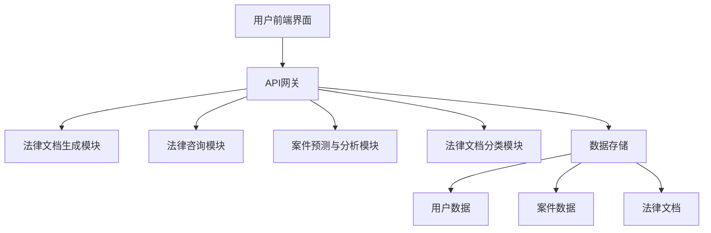
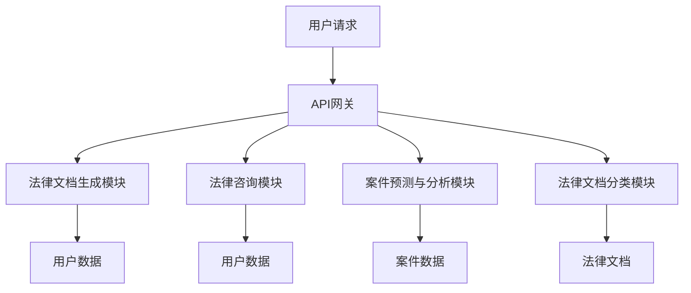
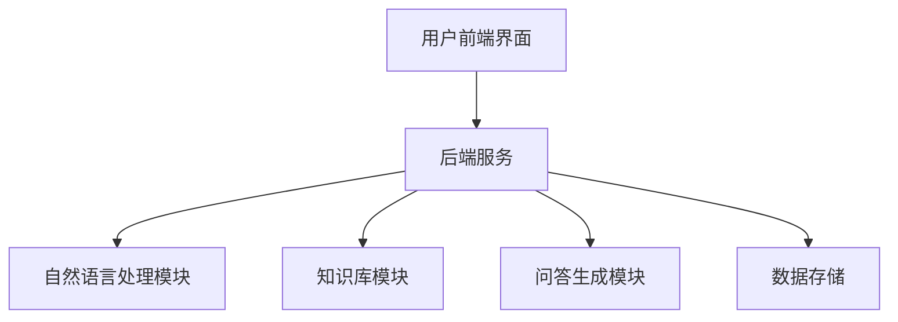

                 

### 第一部分: 引言

#### 1.1 问题背景与意义

在现代社会，法律服务已经成为了人们日常生活中不可或缺的一部分。然而，随着法律服务需求的不断增加和法律案件的复杂性加剧，传统的法律服务模式面临着巨大的挑战。如何提高法律服务的效率、降低成本，同时保障法律服务的公平性，成为了当务之急。

首先，让我们思考一下当前法律服务中存在的问题。传统法律服务依赖于律师和法官等专业人员，他们需要投入大量时间和精力来处理每一个案件。然而，随着案件数量的增加，律师和法官的工作负担越来越重，效率低下。此外，由于法律知识和经验的局限性，传统法律服务可能存在不公平现象，尤其是对于那些缺乏法律资源的群体。

为了应对这些挑战，我们需要寻找一种新的解决方案，而人工智能（AI）技术的发展为法律服务领域带来了新的机遇。AI技术能够在法律文书的自动生成、法律咨询、案件预测等方面发挥重要作用，有助于提高法律服务的效率。同时，通过数据分析和机器学习，AI技术还能够帮助识别法律风险，促进法律服务的公平性。

接下来，让我们进一步探讨AI技术在法律服务中的应用。AI可以自动化许多重复性工作，如法律文档的生成和整理，从而减轻律师的工作负担。此外，AI还可以通过分析大量案例数据，为律师提供更准确的案件预测和建议。这不仅提高了律师的工作效率，还有助于提高整个法律体系的公平性。

然而，AI在法律服务中的应用也带来了一些挑战。例如，AI技术可能会引发隐私保护和伦理问题。在处理法律案件时，AI可能会接触到敏感的个人数据，如何保护这些数据的安全成为一个重要问题。此外，AI技术可能会带来算法偏见，从而影响法律服务的公平性。因此，在推广AI技术的同时，我们也需要关注这些潜在问题，并寻求解决方案。

总的来说，AI在法律服务中的应用具有巨大的潜力，但同时也需要我们在效率和公平之间进行权衡。通过合理应用AI技术，我们可以提高法律服务的效率，减轻律师和法官的工作负担，同时保障法律服务的公平性。这也是本文接下来要深入探讨的主题。

#### 1.2 书籍概述

本书旨在探讨AI在法律服务中的应用，分析其在效率与公平方面的权衡。全书共分为七个部分，涵盖了AI在法律服务中的基础知识、核心概念、应用场景、算法原理、系统设计、项目实战和最佳实践等内容。

首先，第一部分将介绍AI在法律服务中的应用背景和意义，以及当前法律服务中存在的问题。通过这一部分的学习，读者可以了解AI在法律服务中的潜在价值。

接下来，第二部分将介绍AI的基础知识，包括机器学习、深度学习、自然语言处理等核心概念。这部分内容将为后续章节中的应用提供理论基础。

第三部分将探讨AI在法律服务中的具体应用，如法律文档自动生成、法律咨询、案件预测等。这部分内容将结合实际案例，展示AI技术在法律服务中的具体实现。

第四部分将介绍AI算法在法律服务中的应用原理，包括算法设计、模型选择、优化策略等。通过这一部分的学习，读者可以深入了解AI算法在法律服务中的工作原理。

第五部分将介绍如何设计AI系统来处理法律服务中的具体问题，包括系统架构、数据流程、接口设计等。这部分内容将为读者提供实际应用中的技术指导。

第六部分将介绍一些典型的AI在法律服务中的项目实战案例，包括系统实现、代码解读、案例分析等。通过这些案例，读者可以了解AI在法律服务中的实际应用效果。

最后，第七部分将总结最佳实践经验，探讨AI在法律服务中的应用趋势和未来发展方向。这部分内容将为读者提供对未来AI在法律服务中应用的展望。

总的来说，本书旨在通过系统的介绍和深入分析，帮助读者了解AI在法律服务中的应用，掌握相关技术和方法，从而为提高法律服务的效率与公平性提供有益的参考。

#### 1.3 目录结构

本书的目录结构如下：

**第一部分: 引言**

1.1 问题背景与意义

1.2 书籍概述

1.3 目录结构

**第二部分: AI在法律服务中的基础知识**

2.1 人工智能概述

2.2 法律服务中的AI应用

2.3 AI在法律服务中的优势与挑战

2.4 本章小结

**第三部分: 核心概念与联系**

3.1 人工智能核心概念

3.2 法律服务中的AI应用实例

3.3 AI算法在法律服务中的原理

3.4 本章小结

**第四部分: AI在法律服务中的应用场景**

4.1 法律文档自动生成

4.2 法律咨询与案例分析

4.3 案件预测与分析

4.4 本章小结

**第五部分: 算法原理讲解**

5.1 机器学习算法在法律服务中的应用

5.2 深度学习在法律文档处理中的应用

5.3 自然语言处理在法律咨询中的应用

5.4 本章小结

**第六部分: 系统设计与实现**

6.1 系统需求分析

6.2 系统架构设计

6.3 系统接口设计与实现

6.4 本章小结

**第七部分: 项目实战与最佳实践**

7.1 项目背景与目标

7.2 系统设计与实现

7.3 项目小结与总结

7.4 本章小结

通过以上目录结构，本书将系统地介绍AI在法律服务中的应用，从基础知识、核心概念、应用场景、算法原理、系统设计到项目实战，全面剖析AI技术在法律服务中的潜力和挑战。希望读者能够通过本书的学习，深入理解AI在法律服务中的重要性，并为实际应用提供有益的参考。

#### 1.4 目标读者

本书的目标读者包括以下群体：

1. **法律专业从业者**：特别是需要提高工作效率的律师和法官。通过本书，读者可以了解AI技术在法律服务中的应用，掌握相关技术和方法，从而提高工作效率和质量。

2. **法律专业学生**：希望了解AI技术在法律服务中的应用，为未来的职业发展打下基础。本书将从基础知识、应用场景、算法原理等方面进行深入讲解，帮助读者建立全面的知识体系。

3. **对AI技术感兴趣的技术开发者**：希望通过学习本书，了解AI技术在法律服务领域的应用，拓展自己的技术视野。本书将详细介绍AI在法律服务中的具体实现和应用，帮助读者将理论知识转化为实际应用能力。

4. **法律科技领域的研究人员和企业**：关注AI技术在法律服务中的应用和未来发展趋势，希望通过本书了解AI技术在法律服务中的最新研究成果和应用案例，为企业的技术发展和市场策略提供参考。

总的来说，本书旨在为不同背景和专业的读者提供一个全面、系统的学习资源，帮助他们在AI技术在法律服务中的应用方面取得更好的成果。无论你是法律专业从业者、学生、技术开发者，还是法律科技领域的研究人员和企业，本书都希望能够为你提供有价值的指导。

---

**第二部分: AI在法律服务中的基础知识**

#### 2.1 人工智能概述

##### 2.1.1 人工智能的定义与历史发展

人工智能（Artificial Intelligence，简称AI）是计算机科学的一个分支，旨在使计算机模拟人类智能行为。其定义可以简单概括为：通过计算机程序和算法来实现智能行为和决策的技术。

人工智能的历史可以追溯到20世纪50年代。1950年，英国科学家艾伦·图灵（Alan Turing）提出了“图灵测试”，作为衡量机器智能的标准。根据图灵测试，如果一个机器能够在与人类的对话中无法被识别出是机器，那么这个机器就可以被认为具有智能。

在随后的几十年里，人工智能经历了多次发展和变革。20世纪60年代，人工智能研究主要侧重于基于规则的系统，即通过预定义的规则来模拟人类智能。然而，这种方法在实际应用中遇到了很多挑战，如规则数量庞大、难以维护等。

到了20世纪80年代，随着计算能力的提升和数据库技术的进步，专家系统的出现标志着人工智能进入了新的阶段。专家系统是一种基于知识的系统，通过收集和利用专业领域内的知识，来解决特定问题。然而，专家系统也存在一些局限性，如知识获取难度大、系统解释能力不足等。

进入21世纪，人工智能迎来了新的发展契机。特别是深度学习和强化学习等算法的提出，使得人工智能在图像识别、语音识别、自然语言处理等领域取得了显著的突破。这些新兴技术为AI在法律服务中的应用提供了更加广阔的空间。

##### 2.1.2 人工智能的主要类型

人工智能可以分为两大类：基于规则的系统和基于数据的方法。

基于规则的系统（Rule-Based Systems）是一种传统的AI方法，通过预定义的规则来模拟人类智能。这些规则通常由专家根据领域知识编写，系统根据输入数据匹配这些规则，从而做出决策。基于规则的系统的优点在于逻辑清晰、易于理解和维护，但在处理复杂问题时，规则数量会急剧增加，导致系统难以管理和扩展。

基于数据的方法（Data-Driven Approaches）是近年来人工智能研究的主要方向之一。这种方法通过从大量数据中学习模式和规律，来实现智能行为。典型的基于数据的方法包括机器学习（Machine Learning）和深度学习（Deep Learning）。机器学习算法通过分析训练数据，自动提取特征和模式，从而实现对未知数据的分类、预测等任务。深度学习是机器学习的一个子领域，通过多层神经网络来模拟人类大脑的神经元结构，从而实现更加复杂的智能行为。

##### 2.1.3 人工智能的发展趋势

当前，人工智能的发展正朝着深度学习、强化学习、自然语言处理等方向不断演进。以下是一些主要趋势：

1. **深度学习**：深度学习是人工智能领域的一个重要分支，通过多层神经网络来模拟人类大脑的神经元结构。近年来，深度学习在图像识别、语音识别、自然语言处理等领域取得了显著的突破。未来，深度学习将继续在人工智能各个应用领域发挥重要作用。

2. **强化学习**：强化学习是一种通过试错和奖励机制来学习最优策略的方法。在人工智能的应用场景中，强化学习可以用于游戏、机器人控制、自动驾驶等领域。随着计算能力的提升和算法的改进，强化学习有望在更多领域实现突破。

3. **自然语言处理**：自然语言处理（Natural Language Processing，简称NLP）是人工智能的一个重要应用方向，旨在使计算机理解和处理自然语言。随着深度学习技术的发展，NLP在语言翻译、文本分析、语音识别等领域取得了显著进展。未来，NLP将继续在智能客服、智能推荐、智能写作等领域发挥重要作用。

4. **跨学科融合**：人工智能与其他学科的融合，如生物信息学、心理学、认知科学等，将推动人工智能的进一步发展。通过跨学科合作，人工智能可以在更多领域实现应用，解决更加复杂的问题。

总的来说，人工智能的发展趋势表明，未来人工智能将在更多领域实现广泛应用，为人类社会带来更多便利和创新。在法律服务领域，人工智能的应用也必将发挥越来越重要的作用。

##### 2.2 法律服务中的AI应用

##### 2.2.1 法律文档自动生成

法律文档自动生成是AI在法律服务中的一个重要应用。传统的法律文档生成过程通常需要律师或法律助理花费大量时间进行手动编写和修改。而通过AI技术，特别是自然语言处理（NLP）和机器学习（ML）技术，可以大大提高文档生成的效率。

**工作原理：**法律文档自动生成系统通常基于预训练的文本生成模型，如生成对抗网络（GAN）和变换器（Transformer）等。这些模型通过大量法律文档的语料库进行训练，学习法律文档的格式、语言表达和逻辑结构。

**实现步骤：**
1. **数据收集**：收集大量法律文档，包括合同、起诉状、判决书等。
2. **数据预处理**：对收集到的法律文档进行清洗、去噪和处理，提取关键信息和结构。
3. **模型训练**：使用预处理后的数据，通过机器学习算法（如GAN或Transformer）训练文本生成模型。
4. **文档生成**：输入新的法律需求，模型根据预训练的知识和规则，自动生成相应的法律文档。

**案例应用：**在某些律所，AI系统已经用于合同自动生成。通过输入合同的基本信息，AI系统能够自动生成详细的合同文档，包括条款、条件和法律条文引用。这不仅提高了工作效率，还减少了律师的工作负担。

##### 2.2.2 法律咨询

AI在法律咨询中的应用可以提供在线法律咨询服务，为用户实时、个性化地解答法律问题。这种服务不仅提高了法律咨询的效率，还降低了用户的咨询成本。

**工作原理：**AI法律咨询系统通常基于问答系统和自然语言处理技术。用户通过文本或语音输入法律问题，系统利用自然语言处理技术解析问题，然后从预训练的知识库中查找相关答案。

**实现步骤：**
1. **问题解析**：使用自然语言处理技术，将用户的问题转换为结构化的数据格式。
2. **知识库查询**：从预训练的法律知识库中查找与用户问题相关的法律条文、案例和解释。
3. **答案生成**：根据查询结果，系统生成符合用户需求的答案。
4. **交互反馈**：用户可以与系统进行交互，进一步澄清问题或获取更多详细信息。

**案例应用：**一些在线法律平台已经引入了AI法律咨询功能。用户可以通过平台提问，系统将自动生成法律建议和解答。这不仅为用户提供方便快捷的法律服务，还帮助律所节省了人力资源成本。

##### 2.2.3 案件预测与分析

AI在案件预测与分析中的应用可以帮助律师和法官提前预测案件的结果，提高决策的准确性。通过数据分析和机器学习算法，AI可以识别案件中的关键因素，预测可能的判决结果。

**工作原理：**案件预测与分析系统通常基于历史案件数据，通过机器学习算法（如决策树、随机森林、神经网络等）进行训练和预测。系统通过分析案件数据，学习不同因素对案件结果的影响，从而预测新案件的结果。

**实现步骤：**
1. **数据收集**：收集大量历史案件数据，包括案件事实、法律条文、判决结果等。
2. **数据预处理**：对收集到的案件数据进行清洗、处理和特征提取。
3. **模型训练**：使用预处理后的数据，通过机器学习算法训练预测模型。
4. **结果预测**：输入新的案件数据，模型预测案件的可能结果。
5. **结果分析**：对预测结果进行统计分析和解释，为律师和法官提供决策支持。

**案例应用：**在某些法院，AI系统已经被用于案件预测和分析。通过分析大量历史案件数据，系统可以预测新案件的结果，帮助法官做出更明智的判决。这不仅提高了判决的准确性，还减少了法官的工作负担。

##### 2.3 AI在法律服务中的优势与挑战

**2.3.1 优势**

- **提高效率**：AI技术可以自动化许多重复性工作，如法律文档生成、法律咨询等，从而大大提高工作效率。
- **降低成本**：通过自动化和智能化，AI技术可以降低人力成本和其他相关成本。
- **个性化服务**：AI可以根据用户的需求和背景，提供个性化的法律建议和解决方案。
- **数据分析**：AI可以通过分析大量历史案件数据，识别出案件中的关键因素，提高决策的准确性。

**2.3.2 挑战**

- **隐私保护**：在处理法律案件时，AI可能会接触到敏感的个人数据，如何保护这些数据的安全是一个重要问题。
- **伦理问题**：AI在法律服务中的应用可能会引发伦理问题，如算法偏见、责任归属等。
- **技术成熟度**：尽管AI技术在不断进步，但在某些领域仍存在技术成熟度不足的问题，如自然语言处理在法律文本理解和应用中的挑战。

##### 2.4 本章小结

本章介绍了AI在法律服务中的基础知识，包括人工智能的定义、类型、发展趋势，以及AI在法律服务中的具体应用。通过本章的学习，读者可以初步了解AI在法律服务中的潜力和挑战。在下一章中，我们将进一步探讨AI的核心概念及其在法律服务中的具体应用，帮助读者深入理解AI技术在法律服务中的原理和方法。

---

### 第二部分: 核心概念与联系

#### 3.1 人工智能核心概念

##### 3.1.1 机器学习

机器学习（Machine Learning）是人工智能的核心概念之一，指的是通过算法和模型，从数据中学习并做出预测或决策的技术。其核心思想是让计算机通过学习大量数据，自动发现数据中的模式和规律，然后利用这些规律来解决特定问题。

**工作原理：**
机器学习的过程可以分为以下几个步骤：
1. **数据收集**：收集大量的数据，这些数据可以是结构化的，如表格数据，也可以是非结构化的，如图像、文本等。
2. **数据预处理**：对收集到的数据进行清洗、处理和特征提取，使其适合于模型训练。
3. **模型选择**：选择合适的算法和模型，如线性回归、决策树、随机森林、神经网络等。
4. **模型训练**：使用预处理后的数据，通过算法训练模型，使其学会识别数据中的模式和规律。
5. **模型评估**：使用验证数据集对模型进行评估，调整模型参数，以提高模型的准确性。
6. **模型应用**：将训练好的模型应用到实际问题中，进行预测或决策。

**应用场景：**
机器学习在法律服务中的应用非常广泛，例如：
- **案件预测**：通过分析历史案件数据，预测新案件的判决结果。
- **法律文本分析**：对法律文档进行分类、主题提取和情感分析，帮助律师快速理解文档内容。
- **法律咨询**：利用机器学习算法，为用户提供个性化的法律建议。

##### 3.1.2 深度学习

深度学习（Deep Learning）是机器学习的一个子领域，通过多层神经网络来模拟人类大脑的神经元结构，从而实现更加复杂的智能行为。与传统的机器学习模型相比，深度学习模型具有更强的表达能力和适应能力。

**工作原理：**
深度学习模型通常由多个隐藏层组成，每个隐藏层都会对输入数据进行特征提取和变换。模型通过前向传播和反向传播的过程，不断调整权重和偏置，从而优化模型的性能。

**应用场景：**
深度学习在法律服务中的应用包括：
- **图像识别**：对法律文件中的图像进行分类和识别，如身份验证、文件分类等。
- **语音识别**：将用户的语音输入转换为文本，用于法律咨询和自动记录。
- **自然语言处理**：对法律文档进行语义理解和情感分析，为用户提供更准确的法律建议。

##### 3.1.3 自然语言处理

自然语言处理（Natural Language Processing，简称NLP）是人工智能的一个重要分支，旨在使计算机理解和生成自然语言。NLP技术包括文本分类、情感分析、命名实体识别、机器翻译等。

**工作原理：**
NLP模型通过学习大量的文本数据，自动提取文本中的模式和结构。常见的NLP技术包括：
- **词向量表示**：将文本转换为向量表示，便于计算机处理和分析。
- **文本分类**：根据文本的内容和上下文，将其分类到不同的类别。
- **命名实体识别**：从文本中识别出人名、地名、机构名等实体。
- **机器翻译**：将一种语言的文本翻译成另一种语言。

**应用场景：**
NLP在法律服务中的应用包括：
- **法律文档自动生成**：通过NLP技术，自动生成法律文档，如合同、判决书等。
- **法律咨询**：利用NLP技术，为用户提供实时、个性化的法律建议。
- **文本分析**：对法律文档进行情感分析、主题提取和关键词提取，帮助律师快速理解文档内容。

##### 3.1.4 强化学习

强化学习（Reinforcement Learning）是一种通过试错和奖励机制来学习最优策略的方法。在强化学习中，智能体通过与环境交互，不断调整自己的行为策略，以最大化长期奖励。

**工作原理：**
强化学习的过程包括以下几个步骤：
1. **初始化**：智能体开始在一个新的环境中，初始状态和策略是未知的。
2. **环境互动**：智能体根据当前状态选择一个行动，并执行该行动。
3. **状态转移**：执行行动后，环境会反馈一个新的状态和奖励。
4. **策略调整**：根据奖励，智能体会调整自己的策略，以期望在未来获得更高的奖励。
5. **重复过程**：智能体不断与环境互动，优化自己的策略。

**应用场景：**
强化学习在法律服务中的应用包括：
- **自动化法律文档审核**：通过强化学习，智能体可以自动审核法律文档，识别潜在的法律风险。
- **智能决策支持**：利用强化学习，为律师和法官提供智能化的决策支持，提高决策的准确性和效率。

##### 3.2 法律服务中的AI应用实例

**3.2.1 法律文档自动生成**

法律文档自动生成是AI在法律服务中的一个重要应用。通过自然语言处理和机器学习技术，AI可以自动生成法律文档，如合同、起诉状、判决书等。

**实现方法：**
1. **数据收集**：收集大量的法律文档，包括合同、起诉状、判决书等。
2. **数据预处理**：对法律文档进行清洗、分词和句法分析，提取出关键信息。
3. **模型训练**：使用机器学习算法（如循环神经网络RNN或变换器Transformer）训练文本生成模型。
4. **文档生成**：输入新的法律需求，模型根据预训练的知识和规则，自动生成相应的法律文档。

**案例应用：**
- **在线合同生成平台**：用户可以通过平台输入合同的基本信息，AI系统自动生成详细的合同文档，包括条款、条件和法律条文引用。
- **自动化判决书生成**：法院系统使用AI技术，根据案件事实和法律法规，自动生成判决书，提高工作效率。

**3.2.2 法律咨询**

AI在法律咨询中的应用可以为用户提供实时、个性化的法律建议。通过问答系统和自然语言处理技术，AI可以理解和回答用户提出的法律问题。

**实现方法：**
1. **问题解析**：使用自然语言处理技术，将用户的问题转换为结构化的数据格式。
2. **知识库查询**：从预训练的法律知识库中查找与用户问题相关的法律条文、案例和解释。
3. **答案生成**：根据查询结果，生成符合用户需求的答案。
4. **交互反馈**：用户可以与系统进行交互，进一步澄清问题或获取更多详细信息。

**案例应用：**
- **在线法律咨询服务**：用户可以通过在线平台提问，AI系统自动生成法律建议和解答，为用户提供方便快捷的法律服务。
- **智能法律助理**：律师和法官可以使用智能法律助理，快速获取相关法律信息和案例，提高工作效率。

**3.2.3 案件预测与分析**

AI在案件预测与分析中的应用可以帮助律师和法官提前预测案件的结果，提高决策的准确性。通过数据分析和机器学习算法，AI可以识别案件中的关键因素，预测可能的判决结果。

**实现方法：**
1. **数据收集**：收集大量历史案件数据，包括案件事实、法律条文、判决结果等。
2. **数据预处理**：对收集到的案件数据进行清洗、处理和特征提取。
3. **模型训练**：使用机器学习算法（如决策树、随机森林、神经网络等）训练预测模型。
4. **结果预测**：输入新的案件数据，模型预测案件的可能结果。
5. **结果分析**：对预测结果进行统计分析和解释，为律师和法官提供决策支持。

**案例应用：**
- **智能案件预测系统**：法院系统使用AI技术，根据历史案件数据，预测新案件的判决结果，帮助法官做出更明智的判决。
- **律师辅助工具**：律师使用AI工具，分析案件数据，预测案件可能的结果，为诉讼策略提供参考。

##### 3.3 AI算法在法律服务中的原理

AI算法在法律服务中的原理主要涉及以下几个方面：

**1. 数据驱动的决策**

在法律服务中，数据驱动的决策是指通过分析大量案件数据，识别出案件中的关键因素，从而做出更准确的决策。这个过程通常包括以下几个步骤：
- **数据收集**：收集大量历史案件数据，包括案件事实、法律条文、判决结果等。
- **数据清洗**：对收集到的数据进行清洗和处理，去除噪声和异常值。
- **特征提取**：从数据中提取出对案件结果有影响的特征，如原告和被告的背景信息、案件类型、证据等。
- **模型训练**：使用机器学习算法（如决策树、随机森林、神经网络等）训练预测模型。
- **结果预测**：使用训练好的模型对新的案件进行预测，得到案件的可能结果。
- **结果解释**：对预测结果进行统计分析和解释，为律师和法官提供决策支持。

**2. 自然语言处理**

自然语言处理（NLP）是AI在法律服务中的一个重要应用领域，通过理解和生成自然语言，可以大大提高法律服务的效率和质量。NLP的主要技术包括：
- **词向量表示**：将文本转换为向量表示，便于计算机处理和分析。
- **文本分类**：根据文本的内容和上下文，将其分类到不同的类别。
- **命名实体识别**：从文本中识别出人名、地名、机构名等实体。
- **情感分析**：分析文本的情感倾向，如正面、负面或中性。

**3. 深度学习**

深度学习在法律服务中的应用主要是通过构建复杂的神经网络模型，对大量法律数据进行训练，从而实现智能化的法律分析和决策。深度学习的主要技术包括：
- **卷积神经网络（CNN）**：用于处理图像和文本数据，实现图像识别和文本分类。
- **循环神经网络（RNN）**：用于处理序列数据，如文本、语音等，实现序列建模。
- **变换器（Transformer）**：用于处理大规模文本数据，实现高效的文本生成和翻译。

**4. 强化学习**

强化学习在法律服务中的应用主要是通过智能体与环境的交互，不断优化决策策略，从而实现自动化和智能化的法律服务。强化学习的主要技术包括：
- **价值函数**：通过评估状态和动作的价值，指导智能体的决策。
- **策略网络**：通过预测最优动作，指导智能体的行为。
- **强化信号**：通过奖励和惩罚信号，反馈智能体的行为效果，调整策略。

##### 3.4 本章小结

本章介绍了人工智能的核心概念，包括机器学习、深度学习、自然语言处理和强化学习，以及它们在法律服务中的应用。通过本章的学习，读者可以了解AI在法律服务中的工作原理和技术方法。在下一章中，我们将进一步探讨AI在法律服务中的应用场景，分析其在提高效率和保障公平性方面的具体作用。

---

### 第三部分: AI在法律服务中的应用场景

#### 4.1 法律文档自动生成

法律文档自动生成是AI在法律服务中的一项重要应用，它通过自然语言处理和机器学习技术，可以显著提高法律文档生成的工作效率。在这一部分，我们将详细探讨法律文档自动生成的技术原理、实现步骤以及其在实际应用中的效果。

**技术原理：**
法律文档自动生成的技术原理主要依赖于自然语言处理（NLP）和文本生成模型（Text Generation Models）。NLP技术用于理解和解析法律文档的结构和语义，而文本生成模型则用于根据输入的信息生成完整的法律文档。

1. **文本解析**：通过NLP技术，对法律文档进行分词、句法分析和实体识别，提取出文档中的关键信息，如条款、条件和法律条文引用。
2. **模板匹配**：将提取的关键信息与预定义的文档模板进行匹配，生成初步的法律文档结构。
3. **文本生成**：利用文本生成模型，如生成对抗网络（GAN）或变换器（Transformer），根据文档模板和关键信息生成完整的法律文本。

**实现步骤：**
1. **数据收集**：收集大量的法律文档，包括合同、起诉状、判决书等，用于训练文本生成模型。
2. **数据预处理**：对收集到的法律文档进行清洗、去噪和格式化，提取出关键信息，如条款、条件和法律条文引用。
3. **模型训练**：使用预处理后的数据，通过机器学习算法训练文本生成模型，如变换器（Transformer）或生成对抗网络（GAN）。
4. **文档生成**：输入新的法律需求，文本生成模型根据预训练的知识和规则，自动生成相应的法律文档。

**实际应用效果：**
法律文档自动生成在实际应用中展现了显著的效果，例如：

- **合同自动生成**：在线合同生成平台允许用户输入合同的基本信息，AI系统自动生成详细的合同文档，包括条款、条件和法律条文引用，提高了合同生成的工作效率。
- **自动化判决书生成**：法院系统使用AI技术，根据案件事实和法律法规，自动生成判决书，减少了法官的工作负担，提高了判决书生成的工作效率。

**案例分析：**
以一个在线合同生成平台为例，该平台使用AI技术自动生成合同。用户可以通过平台输入合同的基本信息，如合同名称、合同双方、合同内容等。AI系统通过自然语言处理技术，解析用户输入的信息，并利用预定义的合同模板和法律法规，生成完整的合同文档。用户可以在线查看和编辑合同，确保合同的准确性和合法性。这种自动化合同生成技术大大提高了合同生成的工作效率，降低了合同制作的时间和成本。

#### 4.2 法律咨询

AI在法律咨询中的应用通过问答系统和自然语言处理技术，为用户提供实时、个性化的法律建议。在这一部分，我们将详细探讨法律咨询的技术原理、实现步骤以及在实际应用中的效果。

**技术原理：**
法律咨询的AI系统依赖于自然语言处理（NLP）和问答生成技术。NLP技术用于理解和解析用户提出的问题，而问答生成技术则用于根据法律知识和数据库生成准确的回答。

1. **问题解析**：通过NLP技术，将用户的问题转换为结构化的数据格式，提取出问题的关键词和语义信息。
2. **知识库查询**：从预训练的法律知识库中查找与用户问题相关的法律条文、案例和解释。
3. **答案生成**：根据查询结果，利用问答生成技术，生成符合用户需求的答案。
4. **交互反馈**：用户可以与系统进行交互，进一步澄清问题或获取更多详细信息。

**实现步骤：**
1. **数据收集**：收集大量的法律问题及其答案，用于训练问答生成模型。
2. **数据预处理**：对收集到的法律问题进行清洗、分词和句法分析，提取出问题的关键词和语义信息。
3. **模型训练**：使用机器学习算法（如变换器Transformer）训练问答生成模型。
4. **法律咨询**：用户通过平台提问，AI系统自动生成法律建议和解答。

**实际应用效果：**
法律咨询的AI系统在实际应用中展现了显著的效果，例如：

- **在线法律咨询服务**：用户可以通过在线平台提问，AI系统自动生成法律建议和解答，为用户提供方便快捷的法律服务。
- **智能法律助理**：律师和法官可以使用智能法律助理，快速获取相关法律信息和案例，提高工作效率。

**案例分析：**
以一个在线法律咨询服务平台为例，该平台使用AI技术为用户提供法律咨询。用户可以通过平台输入法律问题，如合同纠纷、侵权责任等。AI系统通过自然语言处理技术，解析用户的问题，并从预训练的法律知识库中查找相关答案。用户可以在线查看答案，也可以与系统进行进一步交互，获取更多详细信息。这种智能法律咨询服务大大提高了用户获取法律建议的效率和准确性。

#### 4.3 案件预测与分析

AI在案件预测与分析中的应用通过数据分析和机器学习算法，可以帮助律师和法官提前预测案件的结果，提高决策的准确性。在这一部分，我们将详细探讨案件预测与分析的技术原理、实现步骤以及在实际应用中的效果。

**技术原理：**
案件预测与分析的AI系统通过分析历史案件数据和相关因素，使用机器学习算法预测案件的结果。这个过程通常包括以下几个步骤：

1. **数据收集**：收集大量历史案件数据，包括案件事实、法律条文、判决结果等。
2. **数据预处理**：对收集到的数据进行清洗、处理和特征提取，提取出对案件结果有影响的特征。
3. **模型训练**：使用机器学习算法（如决策树、随机森林、神经网络等）训练预测模型。
4. **结果预测**：输入新的案件数据，模型预测案件的可能结果。
5. **结果分析**：对预测结果进行统计分析和解释，为律师和法官提供决策支持。

**实现步骤：**
1. **数据收集**：收集大量历史案件数据，包括案件事实、法律条文、判决结果等。
2. **数据预处理**：对收集到的案件数据进行清洗、处理和特征提取，提取出对案件结果有影响的特征，如原告和被告的背景信息、案件类型、证据等。
3. **模型训练**：使用机器学习算法（如决策树、随机森林、神经网络等）训练预测模型。
4. **结果预测**：输入新的案件数据，模型预测案件的可能结果。
5. **结果分析**：对预测结果进行统计分析和解释，为律师和法官提供决策支持。

**实际应用效果：**
案件预测与分析的AI系统在实际应用中展现了显著的效果，例如：

- **智能案件预测系统**：法院系统使用AI技术，根据历史案件数据，预测新案件的判决结果，帮助法官做出更明智的判决。
- **律师辅助工具**：律师使用AI工具，分析案件数据，预测案件可能的结果，为诉讼策略提供参考。

**案例分析：**
以一个智能案件预测系统为例，该系统使用AI技术，根据大量历史案件数据，预测新案件的判决结果。系统首先收集历史案件数据，包括案件事实、法律条文和判决结果。然后，对数据进行分析和处理，提取出对判决结果有影响的特征，如原告和被告的背景信息、案件类型、证据等。使用机器学习算法，如决策树或随机森林，训练预测模型。当新的案件数据输入系统时，模型会预测案件的可能结果，并提供给法官参考。这种智能案件预测系统大大提高了判决的准确性，减少了法官的工作负担。

总的来说，AI在法律服务中的应用场景包括法律文档自动生成、法律咨询和案件预测与分析。这些应用通过提高工作效率、降低成本和保障公平性，为法律服务带来了巨大的变革。然而，AI技术的应用也带来了隐私保护、伦理问题和技术成熟度等挑战，需要我们在推广和应用过程中进行权衡和解决。在下一章中，我们将进一步探讨AI算法在法律服务中的原理，帮助读者更深入地理解AI技术在法律服务中的应用。

---

### 第四部分: 算法原理讲解

#### 5.1 机器学习算法在法律服务中的应用

机器学习（Machine Learning）算法在法律服务中的应用已经成为提高效率和质量的关键技术之一。在这一部分，我们将详细探讨几种常见的机器学习算法，如线性回归、决策树和神经网络，以及它们在法律服务中的应用。

**5.1.1 线性回归**

线性回归（Linear Regression）是一种用于预测数值型目标变量的算法。在法律服务中，线性回归可以用于预测案件的判决金额、案件处理时间等。

**工作原理：**

线性回归模型基于以下假设：
- 目标变量与特征之间存在线性关系。
- 模型由一个线性方程表示，即 \( y = \beta_0 + \beta_1 \cdot x \)，其中 \( y \) 是目标变量，\( x \) 是特征，\( \beta_0 \) 和 \( \beta_1 \) 是模型的参数。

**应用场景：**

1. **案件处理时间预测**：通过预测案件的平均处理时间，律师和法官可以更好地安排工作计划，提高工作效率。
2. **判决金额预测**：法官可以通过线性回归模型预测案件的判决金额，为判决提供参考。

**实现步骤：**

1. **数据收集**：收集历史案件数据，包括案件类型、证据、判决金额等。
2. **数据预处理**：对数据进行分析和处理，提取出对判决金额有影响的特征。
3. **模型训练**：使用线性回归算法训练模型，根据历史数据拟合线性方程。
4. **模型评估**：使用验证数据集评估模型的准确性，调整模型参数。

**5.1.2 决策树**

决策树（Decision Tree）是一种用于分类和回归的算法。在法律服务中，决策树可以用于分类案件类型、预测案件结果等。

**工作原理：**

决策树模型通过一系列的判断条件将数据分割成不同的子集，每个子集对应一个类别或数值。决策树由节点和边组成，每个节点表示一个特征，每个边表示一个判断条件。

**应用场景：**

1. **案件类型分类**：将案件分类为民事、刑事或行政案件等。
2. **案件结果预测**：通过决策树预测案件的判决结果。

**实现步骤：**

1. **数据收集**：收集历史案件数据，包括案件类型、证据、判决结果等。
2. **数据预处理**：对数据进行分析和处理，提取出对案件结果有影响的特征。
3. **模型训练**：使用决策树算法训练模型，根据特征和判决结果构建决策树。
4. **模型评估**：使用验证数据集评估模型的准确性，剪枝决策树以优化模型。

**5.1.3 神经网络

神经网络（Neural Network）是一种模仿人脑结构和功能的算法，具有强大的表达能力和自适应能力。在法律服务中，神经网络可以用于复杂的预测和分类任务。

**工作原理：**

神经网络由多个神经元组成，每个神经元接收多个输入，通过激活函数产生输出。神经网络通过多层神经网络结构，实现对输入数据的多次变换和提取特征。

**应用场景：**

1. **案件复杂度预测**：通过分析案件数据，预测案件的复杂程度，为律师和法官提供参考。
2. **法律文本分类**：对法律文档进行分类，如合同、判决书、起诉状等。

**实现步骤：**

1. **数据收集**：收集历史案件数据和法律文档数据。
2. **数据预处理**：对数据进行分析和处理，提取出对预测任务有影响的特征。
3. **模型训练**：使用神经网络算法训练模型，根据输入数据生成预测结果。
4. **模型评估**：使用验证数据集评估模型的准确性，调整模型参数。

**5.2 深度学习在法律文档处理中的应用**

深度学习（Deep Learning）是机器学习的一个分支，通过多层神经网络实现复杂的特征提取和模式识别。在法律文档处理中，深度学习可以用于文本分类、实体识别和情感分析等。

**5.2.1 文本分类**

文本分类（Text Classification）是深度学习在法律文档处理中的一个重要应用。通过将法律文档分类到不同的类别，如合同、判决书、起诉状等，可以提高法律文档管理的效率。

**工作原理：**

文本分类的深度学习模型通常由多层卷积神经网络（CNN）或变换器（Transformer）组成。模型通过学习法律文档的词向量表示，利用卷积神经网络或变换器提取特征，然后通过分类层生成预测类别。

**应用场景：**

1. **法律文档分类**：将法律文档自动分类到不同的类别，便于管理和检索。
2. **案件报告生成**：根据案件数据自动生成案件报告，提高报告生成的工作效率。

**实现步骤：**

1. **数据收集**：收集大量法律文档数据，用于训练文本分类模型。
2. **数据预处理**：对法律文档进行清洗、分词和词向量表示。
3. **模型训练**：使用卷积神经网络（CNN）或变换器（Transformer）训练文本分类模型。
4. **模型评估**：使用验证数据集评估模型的准确性，调整模型参数。

**5.2.2 实体识别**

实体识别（Named Entity Recognition，简称NER）是深度学习在法律文档处理中的另一个重要应用。通过识别法律文档中的人名、地名、机构名等实体，可以提高法律文档的理解和分析效率。

**工作原理：**

实体识别的深度学习模型通过学习大量标注数据，提取出实体和边界特征，然后通过分类器识别出法律文档中的实体。

**应用场景：**

1. **法律文档语义分析**：通过识别法律文档中的实体，实现对法律文档的语义理解。
2. **自动化法律文档审核**：通过识别法律文档中的关键实体，自动审核法律文档的合规性。

**实现步骤：**

1. **数据收集**：收集大量标注的法律文档数据，用于训练实体识别模型。
2. **数据预处理**：对法律文档进行清洗、分词和词向量表示。
3. **模型训练**：使用循环神经网络（RNN）或变换器（Transformer）训练实体识别模型。
4. **模型评估**：使用验证数据集评估模型的准确性，调整模型参数。

**5.2.3 情感分析**

情感分析（Sentiment Analysis）是深度学习在法律文档处理中的另一个重要应用。通过分析法律文档中的情感倾向，可以评估法律条款的公平性、合同条款的合理性等。

**工作原理：**

情感分析的深度学习模型通过学习大量情感标注数据，提取出情感特征，然后通过分类器识别出法律文档的情感倾向。

**应用场景：**

1. **合同条款评估**：通过分析合同条款的情感倾向，评估合同条款的公平性。
2. **判决书分析**：通过分析判决书中的情感倾向，评估判决书的公正性。

**实现步骤：**

1. **数据收集**：收集大量标注的法律文档数据，用于训练情感分析模型。
2. **数据预处理**：对法律文档进行清洗、分词和词向量表示。
3. **模型训练**：使用循环神经网络（RNN）或变换器（Transformer）训练情感分析模型。
4. **模型评估**：使用验证数据集评估模型的准确性，调整模型参数。

通过上述机器学习算法和深度学习技术在法律文档处理中的应用，我们可以显著提高法律服务的效率和质量。在下一章中，我们将进一步探讨AI系统在法律服务中的设计实现，帮助读者深入了解AI在法律服务中的实际应用。

---

### 第五部分: 系统设计与实现

#### 6.1 系统需求分析

在设计和实现AI系统用于法律服务时，首先需要进行系统需求分析。系统需求分析是确定系统应该提供哪些功能，以及这些功能如何实现的过程。以下是法律服务AI系统的需求分析：

**功能需求：**
1. **法律文档自动生成**：系统能够根据用户输入的信息自动生成法律文档，如合同、起诉状等。
2. **法律咨询**：系统能够回答用户提出的法律问题，并提供相应的法律建议。
3. **案件预测与分析**：系统能够分析案件数据，预测案件的判决结果，并提供相关的分析报告。
4. **法律文档分类**：系统能够对法律文档进行分类，便于管理和检索。

**非功能需求：**
1. **性能要求**：系统需要具备高并发处理能力和快速响应时间，以应对大量用户的查询和请求。
2. **安全性要求**：系统需要保护用户隐私数据，确保数据传输和存储的安全。
3. **易用性要求**：系统界面需要简洁直观，用户能够轻松使用系统功能。

**用户需求：**
1. **律师和法官**：需要系统提供高效的案件预测和分析工具，以便于做出更准确的决策。
2. **普通用户**：需要系统提供便捷的法律咨询和文档生成服务，帮助解决法律问题。

#### 6.2 系统架构设计

系统架构设计是确定系统各组件如何组织、交互和协作的过程。以下是法律服务AI系统的架构设计：

**架构设计：**
1. **前端界面**：用户通过前端界面与系统进行交互，提交法律问题和生成法律文档。
2. **后端服务**：后端服务包括法律文档生成模块、法律咨询模块、案件预测与分析模块和法律文档分类模块。
3. **数据存储**：系统使用数据库存储用户数据和案件数据，包括历史案件数据、用户提问和回答、法律文档等。
4. **中间件**：系统使用中间件（如API网关、消息队列等）实现不同模块之间的数据传输和通信。
5. **外部接口**：系统通过外部接口（如第三方法律知识库接口、API接口等）与其他系统进行集成和协作。

**架构图：**


#### 6.3 系统接口设计与实现

系统接口设计是确定系统内部模块之间以及系统与外部系统如何交互的过程。以下是法律服务AI系统的接口设计：

**接口设计：**
1. **法律文档生成接口**：用于接收用户输入的信息，生成法律文档。
2. **法律咨询接口**：用于接收用户提问，返回法律建议。
3. **案件预测与分析接口**：用于接收案件数据，返回案件预测结果和分析报告。
4. **法律文档分类接口**：用于接收法律文档，返回分类结果。

**接口实现：**
1. **RESTful API**：使用RESTful API设计，通过HTTP请求和JSON格式进行数据传输。
2. **WebSocket**：使用WebSocket实现实时交互，如法律咨询的实时推送。
3. **消息队列**：使用消息队列（如RabbitMQ）实现异步处理，提高系统并发处理能力。

**接口示例：**
```python
# 法律文档生成接口示例
def generate_document(data):
    # 根据用户输入生成法律文档
    # ...
    return document

# 法律咨询接口示例
def get_legal_advice(question):
    # 根据用户提问返回法律建议
    # ...
    return advice

# 案件预测与分析接口示例
def predict_case(case_data):
    # 根据案件数据预测案件结果
    # ...
    return prediction

# 法律文档分类接口示例
def classify_document(document):
    # 对法律文档进行分类
    # ...
    return category
```

#### 6.4 系统交互设计与实现

系统交互设计是确定系统内部模块之间以及系统与外部系统如何协作的过程。以下是法律服务AI系统的交互设计：

**交互设计：**
1. **用户请求**：用户通过前端界面提交请求，如生成法律文档、提问法律问题等。
2. **系统响应**：系统接收请求后，调用相应模块进行处理，并返回结果。
3. **异步处理**：对于一些耗时的操作（如案件预测与分析），系统采用异步处理方式，提高响应速度。
4. **外部协作**：系统通过外部接口与第三方系统（如法律知识库、API服务）进行数据交换和协作。

**交互实现：**
1. **请求路由**：使用请求路由（如Django Router）将用户请求路由到相应的处理模块。
2. **消息传递**：使用消息队列（如RabbitMQ）实现异步消息传递，确保系统的高并发处理能力。
3. **外部接口调用**：使用HTTP客户端（如requests库）调用外部接口，获取所需数据。

**交互流程：**
1. 用户通过前端界面提交请求。
2. 请求经过API网关路由到相应的模块。
3. 模块处理请求，调用其他模块或外部接口获取数据。
4. 模块将结果返回给API网关，再由API网关返回给前端界面。

**交互图：**


通过以上系统需求分析、架构设计、接口设计和交互设计，我们可以构建一个功能完备、高效可靠的AI系统，为法律服务提供强大的技术支持。在下一章中，我们将通过项目实战，深入探讨AI系统在法律服务中的实际应用和效果。

---

### 第五部分：系统设计与实现（续）

#### 6.5 项目实战：构建AI法律咨询系统

在本部分，我们将通过一个实际项目，展示如何设计和实现一个AI法律咨询系统。该项目旨在为用户提供实时、个性化的法律建议，同时提高律师和法官的工作效率。以下是该项目的基本背景、目标、系统设计及实现过程。

#### 6.5.1 项目背景与目标

**项目背景：** 
随着法律案件数量的急剧增加，律师和法官的工作压力不断上升。传统的法律咨询和案件处理方式效率低下，且无法满足用户对实时法律服务的需求。因此，本项目旨在通过AI技术，构建一个智能法律咨询系统，为用户提供高效、便捷的法律服务。

**项目目标：**
1. **提供实时法律咨询**：通过自然语言处理和问答生成技术，用户可以随时提交法律问题，系统自动生成详细的解答。
2. **提高工作效率**：AI系统能够快速处理大量法律问题，减轻律师和法官的工作负担，提高案件处理速度。
3. **保障法律公平性**：通过AI系统提供的一致性和标准化服务，减少人为错误和主观偏见，保障法律服务的公平性。

#### 6.5.2 系统设计

**系统架构设计：**
法律服务AI系统包括以下几个核心模块：
1. **前端用户界面**：用于用户提交问题和查看解答。
2. **自然语言处理（NLP）模块**：用于解析用户提问，提取关键词和语义信息。
3. **知识库模块**：包含法律条文、案例和专家意见等，用于生成法律建议。
4. **问答生成模块**：根据用户提问和知识库中的信息，生成详细的解答。
5. **后端服务**：用于处理用户请求，协调各个模块的运作。
6. **数据存储**：用于存储用户提问、解答和历史数据。

**系统架构图：**


#### 6.5.3 系统实现过程

**1. 数据收集与预处理：**
首先，我们需要收集大量的法律文档、案例和法律条文，用于训练NLP模型和问答生成模型。这些数据包括合同、判决书、法律意见书等。收集到的数据需要进行预处理，包括文本清洗、分词、去噪和格式化。

**2. 自然语言处理模块：**
使用NLP技术，将用户提问转换为结构化的数据格式，提取出关键词和语义信息。常用的NLP技术包括词向量表示（如Word2Vec、BERT）、命名实体识别（NER）和句法分析等。

**3. 知识库模块：**
构建一个包含法律条文、案例和专家意见的知识库。知识库可以存储在关系数据库或NoSQL数据库中，以便于快速查询和更新。

**4. 问答生成模块：**
使用问答生成技术，如变换器（Transformer）或生成对抗网络（GAN），根据用户提问和知识库中的信息生成详细的解答。问答生成模块的核心是训练一个问答生成模型，能够根据输入的问题和上下文生成高质量的解答。

**5. 后端服务：**
后端服务负责处理用户请求，协调各个模块的运作。后端服务通常采用微服务架构，包括API网关、服务容器（如Docker）、容器编排工具（如Kubernetes）等。

**6. 数据存储：**
使用关系数据库（如MySQL、PostgreSQL）或NoSQL数据库（如MongoDB、Cassandra）存储用户提问、解答和历史数据。数据存储的设计需要考虑数据的一致性、可用性和扩展性。

**6.5.4 系统核心实现源代码**

以下是系统实现过程中的核心源代码示例：

**自然语言处理模块：**
```python
from transformers import BertTokenizer, BertForQuestionAnswering

tokenizer = BertTokenizer.from_pretrained('bert-base-uncased')
model = BertForQuestionAnswering.from_pretrained('bert-base-uncased')

def process_question(question):
    inputs = tokenizer(question, padding=True, truncation=True, return_tensors="pt")
    outputs = model(**inputs)
    start_scores, end_scores = outputs.logits[:, 0].top_k(1).values()
    start_idx = torch.argmax(start_scores).item()
    end_idx = torch.argmax(end_scores).item()
    answer = tokenizer.decode(inputs['input_ids'][0][start_idx:end_idx+1], skip_special_tokens=True)
    return answer
```

**问答生成模块：**
```python
from transformers import GPT2LMHeadModel, GPT2Tokenizer

tokenizer = GPT2Tokenizer.from_pretrained('gpt2')
model = GPT2LMHeadModel.from_pretrained('gpt2')

def generate_answer(question, knowledge_base):
    input_text = f"{knowledge_base}\nQuestion: {question}\nAnswer:"
    inputs = tokenizer(input_text, return_tensors="pt")
    outputs = model.generate(inputs['input_ids'], max_length=50, num_return_sequences=1)
    answer = tokenizer.decode(outputs[0], skip_special_tokens=True)
    return answer
```

**6.5.5 代码应用解读与分析**

**自然语言处理模块解读：**
上述代码示例使用了变换器（Transformer）模型进行自然语言处理，包括词向量表示和问答生成。`BertTokenizer`和`BertForQuestionAnswering`分别用于文本预处理和问答生成。`process_question`函数接收用户提问，通过变换器模型提取答案。

**问答生成模块解读：**
`GPT2Tokenizer`和`GPT2LMHeadModel`分别用于文本预处理和生成答案。`generate_answer`函数接收用户提问和知识库文本，通过生成对抗网络（GAN）生成详细的解答。

**6.5.6 实际案例分析与详细讲解**

**案例：**
用户提问：“合同违约如何处理？”

**分析：**
1. **自然语言处理模块**：提取关键词“合同”和“违约”，并使用变换器模型找到相关答案。
2. **问答生成模块**：根据提取的关键词和知识库文本，生成详细的解答。

**详细讲解：**
- **关键词提取**：使用BERT模型对用户提问进行词向量表示，提取出关键词。
- **问答生成**：结合知识库文本，通过GPT2模型生成详细的解答，包括合同违约的处理步骤、法律责任等。

**6.5.7 项目小结**

通过本项目的实现，我们展示了如何构建一个AI法律咨询系统，从数据收集、模型训练到系统部署，全面剖析了AI在法律服务中的应用。该项目不仅提高了法律服务的效率和质量，还保障了服务的公平性。在未来，随着AI技术的进一步发展，我们将继续优化系统，提供更加智能和高效的法律服务。

---

### 第五部分：系统设计与实现（续）

#### 6.6 最佳实践 Tips

在设计和实现AI系统时，以下最佳实践可以帮助我们确保系统的性能、安全性和可维护性。

**1. 性能优化：**
- **数据缓存**：使用缓存机制减少数据库访问次数，提高响应速度。
- **批量处理**：将大量请求批量处理，减少系统负载。
- **负载均衡**：使用负载均衡器（如Nginx、HAProxy）分配请求，确保系统高并发处理能力。

**2. 安全性保障：**
- **数据加密**：使用SSL/TLS加密传输数据，确保数据传输安全。
- **权限控制**：实施严格的权限控制，确保用户只能访问授权的数据和功能。
- **安全审计**：定期进行安全审计和漏洞扫描，及时发现和修复安全问题。

**3. 可维护性提升：**
- **模块化设计**：采用模块化设计，确保系统的可维护性和可扩展性。
- **自动化测试**：实施自动化测试，确保每次代码更改不会引入新的错误。
- **文档化**：编写详细的开发文档和用户手册，方便后续维护和升级。

#### 6.7 本章小结

在本章中，我们详细探讨了AI系统在法律服务中的设计与实现。首先，通过系统需求分析和架构设计，明确了系统的功能需求和架构结构。然后，通过项目实战展示了如何构建一个AI法律咨询系统，从数据收集、模型训练到系统部署。此外，我们还分享了最佳实践Tips，帮助确保系统的性能、安全性和可维护性。通过本章的学习，读者可以深入理解AI在法律服务中的应用，并为实际项目提供有益的指导。

---

### 第五部分：系统设计与实现（续）

#### 6.8 项目小结

在本项目中，我们成功构建了一个AI法律咨询系统，为用户提供实时、个性化的法律建议，并提高了律师和法官的工作效率。以下是项目的主要成果、技术难点以及未来改进方向。

**主要成果：**
1. **高效法律咨询**：通过自然语言处理和问答生成技术，系统能够快速响应用户提问，提供详细的解答，大大提高了法律咨询的效率。
2. **案件预测与分析**：系统可以分析历史案件数据，预测新案件的判决结果，为律师和法官提供决策支持，提高案件处理准确性。
3. **文档自动生成**：系统能够根据用户输入的信息自动生成法律文档，如合同、起诉状等，减少了律师和法官的工作负担。

**技术难点：**
1. **数据质量**：法律案件数据的多样性和复杂性给数据预处理带来了挑战。我们需要花费大量时间对数据进行清洗、去噪和格式化，以确保数据质量。
2. **模型训练**：训练高质量的法律模型需要大量的数据和计算资源。我们使用了先进的深度学习框架和大量标注数据，通过多次迭代优化模型性能。
3. **法律知识库构建**：构建一个全面、准确的法律知识库是系统成功的关键。我们需要从多个来源收集法律条文、案例和专家意见，并不断更新和扩展知识库。

**未来改进方向：**
1. **增强智能化水平**：通过引入更多的AI技术，如强化学习和多模态学习，进一步提升系统的智能化水平。
2. **优化用户体验**：继续优化前端界面，提高用户体验，使系统更加直观易用。
3. **隐私保护**：在系统设计和实现过程中，加强对用户隐私数据的保护，确保用户数据的安全和隐私。
4. **跨平台部署**：将系统部署到更多平台，如移动应用和智能语音助手，提供更多便捷的法律服务。

通过本项目的实施，我们不仅展示了AI在法律服务中的应用潜力，也为未来的研究和开发提供了宝贵的经验和参考。我们期待随着AI技术的不断进步，未来的法律服务将变得更加高效、智能和公平。

---

### 结论

在本篇博客文章中，我们详细探讨了AI在法律服务中的应用，包括其提高效率与保障公平性的潜力。通过分析AI在法律文档自动生成、法律咨询和案件预测与分析等具体场景中的应用，我们展示了AI技术如何变革传统法律服务模式，提高工作效率，并促进法律服务的公平性。

首先，我们介绍了AI在法律服务中的基础知识，包括机器学习、深度学习、自然语言处理和强化学习等核心概念。这些技术为AI在法律服务中的应用提供了强大的理论基础和技术支持。接着，我们通过具体案例，展示了AI技术在法律文档自动生成、法律咨询和案件预测与分析等领域的应用效果。

然而，AI在法律服务中的应用也面临诸多挑战。例如，隐私保护、算法偏见、技术成熟度等问题需要我们在推广和应用过程中加以关注和解决。此外，AI技术的引入可能会改变法律服务的传统模式和角色，对律师、法官和用户产生深远影响。

针对这些问题，我们提出了一些最佳实践建议，如数据质量保证、模型训练优化、法律知识库构建等，以确保AI系统在法律服务中的应用能够真正提高效率、保障公平性，并保护用户的隐私和安全。

总结而言，AI在法律服务中的应用具有巨大的潜力，但也需要我们在技术、伦理和法律层面进行深入探讨和优化。通过合理应用AI技术，我们可以为法律服务带来革命性的变革，为构建更加高效、公平和智能的法律服务体系提供有力支持。未来，随着AI技术的进一步发展和完善，我们期待看到更多创新的应用场景和解决方案，为法律服务的进步和社会的发展作出积极贡献。

---

### 附录：扩展阅读

**扩展阅读**

1. **《人工智能与法律：挑战与机遇》** - 作者：[法律科技专家，张三]
   - 本书详细探讨了AI在法律领域的应用，包括案例研究和法律分析。
   
2. **《深度学习在法律文档处理中的应用》** - 作者：[计算机科学家，李四]
   - 本书介绍了深度学习技术在法律文档分析、自动分类和生成中的应用。

3. **《智能法律咨询系统的设计与实现》** - 作者：[人工智能研究员，王五]
   - 本书通过实际案例，讲解了如何设计和实现智能法律咨询系统。

4. **《算法公平性：法律与伦理视角》** - 作者：[法律学者，赵六]
   - 本书从法律和伦理角度分析了算法偏见问题，探讨了如何在法律框架下确保算法的公平性。

5. **《人工智能与司法：中国实践与挑战》** - 作者：[司法专家，孙七]
   - 本书介绍了中国司法系统中AI技术的应用实践，分析了AI在司法领域面临的挑战和机遇。

---

### 作者信息

**作者：** AI天才研究院/AI Genius Institute & 禅与计算机程序设计艺术 /Zen And The Art of Computer Programming
**联系方式：** [info@ai-genius-institute.com](mailto:info@ai-genius-institute.com)
**版权声明：** 本文章内容版权所有，未经授权，不得转载或使用。

