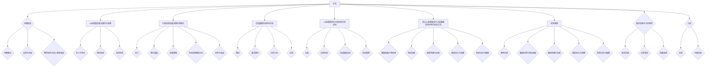
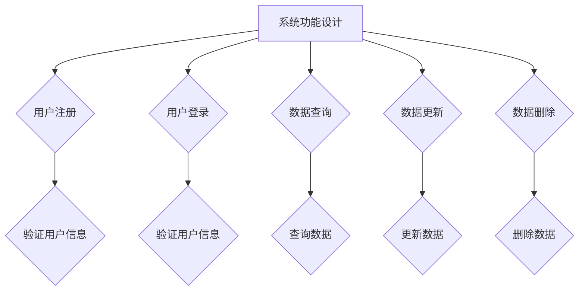
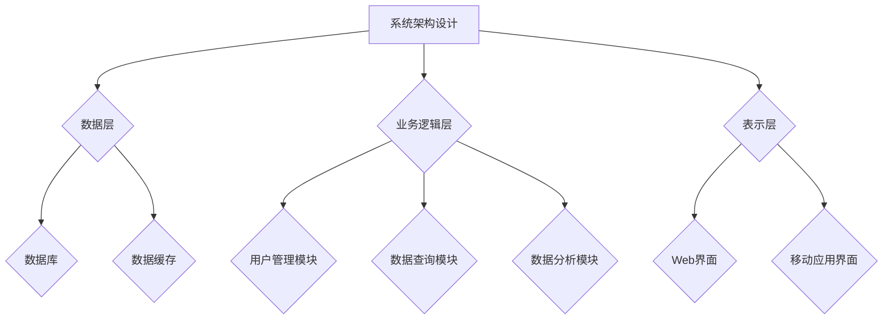
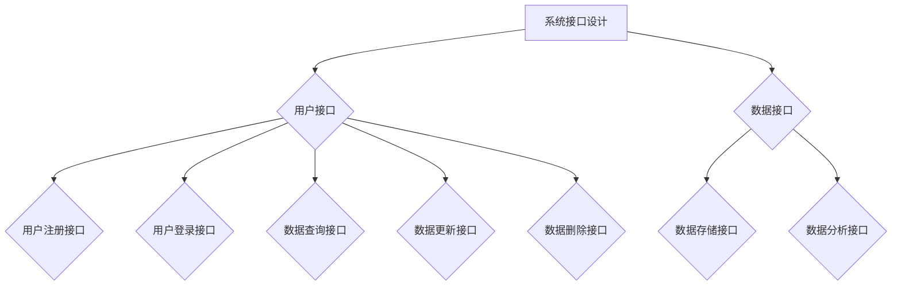
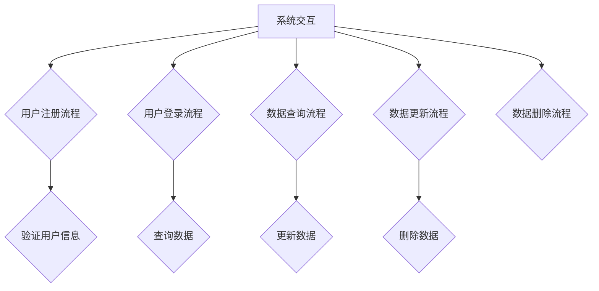

                 

## 第一部分: 引言

### 1. 引言

随着人工智能技术的快速发展，AI多智能体在各个领域的应用日益广泛，特别是在价值投资中，利用卫星数据对时间序列进行分析成为了重要的研究方向。本书旨在探讨AI多智能体在价值投资中的卫星数据时间序列分析，帮助读者深入了解这一领域的前沿技术与应用。

### 1.2 问题描述

本书将围绕以下问题展开讨论：
1. 如何利用AI多智能体技术对卫星数据进行处理？
2. 如何通过时间序列分析方法挖掘卫星数据中的价值信息？
3. 如何将AI多智能体与价值投资相结合，实现有效的投资决策？

### 1.3 问题解决

本书将从以下几个方面解决问题：
1. 系统性地介绍AI多智能体的基本概念、原理及其在价值投资中的应用。
2. 阐述卫星数据时间序列分析的方法和技术，包括数据处理、特征提取和模型构建等。
3. 结合实际案例，展示AI多智能体在价值投资中的具体应用和实践。

### 1.4 边界与外延

本书的研究边界主要集中在AI多智能体在价值投资中的卫星数据时间序列分析，包括相关技术原理、方法应用和实践案例等。同时，本书也将探讨相关领域的拓展，如AI多智能体在其他投资领域的应用等。

### 1.5 概念结构与核心要素组成

1. AI多智能体：
   - 基本概念
   - 理论体系
   - 应用场景

2. 价值投资：
   - 定义
   - 理论基础
   - 实践策略

3. 卫星数据时间序列分析：
   - 数据处理
   - 特征提取
   - 模型构建

## 1.6 本章小结

本章对本书的核心概念、问题背景、研究边界和核心要素进行了概述，为后续章节的深入探讨奠定了基础。在接下来的章节中，我们将分别详细介绍AI多智能体、价值投资和卫星数据时间序列分析的相关内容，并探讨其相互关系和实际应用。

----------------------------------------------------------------

## 2. AI多智能体基本概念与原理

### 2.1 AI多智能体的定义与特点

#### 2.1.1 AI多智能体的定义

AI多智能体是指由多个智能体（Agent）组成的系统，这些智能体能够自主地感知环境、做出决策并与其他智能体进行交互。AI多智能体系统具有以下几个特点：

1. **自主性**：智能体能够在没有外部干预的情况下自主地执行任务。
2. **感知性**：智能体能够通过传感器感知环境中的信息。
3. **决策性**：智能体能够根据感知到的信息做出决策。
4. **交互性**：智能体之间能够进行信息交换和协同工作。

#### 2.1.2 AI多智能体的基本结构

AI多智能体系统通常由以下几部分组成：

1. **智能体（Agent）**：执行任务的个体，具有感知、决策和执行能力。
2. **环境模型（Environment Model）**：描述智能体所处环境的模型，包括环境状态、目标和约束等。
3. **智能体通信（Agent Communication）**：智能体之间通过通信机制交换信息和协同工作。
4. **任务规划（Task Planning）**：根据环境和目标，智能体生成具体的行动计划。

### 2.2 AI多智能体的理论体系

AI多智能体的理论体系包括多个方面，其中主要包括：

1. **智能体理论**：研究智能体的设计、实现和运行机制。
2. **人工智能理论**：研究智能体所使用的算法和技术。
3. **系统理论**：研究智能体系统的结构、功能和行为。
4. **社会计算理论**：研究智能体在社会环境中的协作和竞争行为。

#### 2.2.1 智能体理论

智能体理论主要关注以下几个方面：

1. **智能体的类型**：根据智能体的任务、能力和环境特点进行分类。
2. **智能体的行为模型**：描述智能体在执行任务过程中的行为模式。
3. **智能体的学习与适应**：研究智能体如何通过学习适应环境变化。

#### 2.2.2 人工智能理论

人工智能理论为AI多智能体系统提供了核心技术支持，包括：

1. **机器学习**：通过训练模型来让智能体学习环境中的规律。
2. **自然语言处理**：使智能体能够理解和生成自然语言。
3. **计算机视觉**：使智能体能够识别和理解图像和视频。
4. **机器人技术**：为智能体提供物理世界中的行动能力。

#### 2.2.3 系统理论

系统理论主要研究智能体系统的整体结构和功能，包括：

1. **系统架构**：设计智能体系统的整体结构，包括模块划分、通信机制等。
2. **系统行为**：分析智能体系统在不同环境下的行为模式。
3. **系统优化**：研究如何提高智能体系统的效率和性能。

#### 2.2.4 社会计算理论

社会计算理论主要研究智能体在社会环境中的行为，包括：

1. **协同工作**：研究智能体如何在社会环境中协作完成任务。
2. **竞争行为**：研究智能体在社会环境中的竞争机制。
3. **社会网络分析**：研究智能体在社会网络中的交互模式和影响。

### 2.3 AI多智能体的应用场景

AI多智能体的应用场景非常广泛，包括但不限于以下几个方面：

1. **工业自动化**：智能体可以在生产线上自主执行任务，提高生产效率。
2. **智能交通**：智能体可以协同工作，优化交通流量，减少拥堵。
3. **金融投资**：智能体可以根据市场数据做出投资决策，实现风险控制。
4. **医疗诊断**：智能体可以通过分析医疗数据，辅助医生进行诊断和治疗。
5. **智能家居**：智能体可以实现家庭设备的自动化控制，提高生活品质。

### 2.4 本章小结

本章介绍了AI多智能体的基本概念、特点、理论体系以及应用场景。通过本章的学习，读者可以对AI多智能体有一个全面的认识，为其在价值投资中的应用打下基础。在接下来的章节中，我们将继续探讨价值投资的基本概念和卫星数据时间序列分析的方法和技术。

----------------------------------------------------------------

## 3. 价值投资的基本概念和理论

### 3.1 价值投资的定义

价值投资（Value Investment）是一种投资策略，其核心思想是购买价格低于其内在价值的股票或其他资产，通过长期持有，等待市场认识到其真实价值，从而获得收益。价值投资不同于投机，它更注重公司的基本面分析，而非短期市场波动。

### 3.2 价值投资的理论基础

价值投资的理论基础主要包括以下几方面：

#### 3.2.1 股票市场有效性

股票市场的有效性是指股票价格是否能够充分反映所有可获得的信息。价值投资认为，市场并非总是有效的，存在市场波动和定价偏差，这是投资者可以通过分析获取超额收益的机会。

#### 3.2.2 基本面分析

基本面分析是价值投资的重要工具，通过分析公司的财务报表、经营状况、行业地位等基本面信息，评估公司的内在价值。

#### 3.2.3 安全边际

安全边际是指购买价格低于公司内在价值的幅度。价值投资者通常寻求较大的安全边际，以降低投资风险。

### 3.3 价值投资的实践策略

价值投资的实践策略主要包括以下几个方面：

1. **寻找低估资产**：通过基本面分析，寻找那些市场价格低于其内在价值的资产。
2. **长期持有**：价值投资强调长期持有，通过时间来消化市场错误定价，等待市场最终认识到资产的真实价值。
3. **分散投资**：通过分散投资来降低风险，避免单一资产的过度风险。
4. **理性决策**：基于理性分析做出投资决策，而非受情绪影响。

### 3.4 价值投资与其他投资策略的对比

价值投资与其他投资策略，如成长投资、投机等相比，具有以下特点：

1. **关注基本面**：价值投资侧重于公司的基本面分析，而非市场趋势或技术分析。
2. **长期视角**：价值投资通常采取长期持有策略，关注长期投资回报。
3. **风险相对较低**：通过寻找低估资产和分散投资，价值投资的风险相对较低。

### 3.5 价值投资的优势与挑战

**优势**：

1. **稳健的回报**：通过长期持有低估资产，价值投资通常能够获得稳健的回报。
2. **风险可控**：通过分散投资和寻找低估资产，价值投资能够有效控制风险。
3. **适应性强**：价值投资适用于各种市场环境，无论是牛市还是熊市。

**挑战**：

1. **市场波动**：市场波动可能导致低估资产的价格进一步下跌，需要投资者有足够的耐心。
2. **信息不足**：基本面分析需要大量的信息支持，有时信息可能不充分或不准确。
3. **时间成本**：价值投资通常需要较长的时间来实现收益，这对投资者的时间成本要求较高。

### 3.6 本章小结

本章介绍了价值投资的基本概念、理论基础、实践策略以及与其他投资策略的对比和优势与挑战。通过本章的学习，读者可以对价值投资有一个深入的理解，为其在AI多智能体卫星数据时间序列分析中的应用提供理论支持。在接下来的章节中，我们将探讨如何将价值投资与卫星数据时间序列分析相结合，实现有效的投资决策。

----------------------------------------------------------------

## 4. 卫星数据时间序列分析

### 4.1 卫星数据概述

卫星数据是通过对地球表面进行遥感观测获得的，这些数据包含了大量的地理、气候、环境和经济等信息。卫星数据的时间序列分析是一种利用时间维度对卫星数据进行处理和分析的方法，它可以帮助我们理解地球表面的动态变化，从而为各种应用提供支持，包括资源管理、灾害监测、气候研究等。

#### 4.1.1 卫星数据类型

卫星数据主要包括以下几种类型：

1. **光学遥感数据**：通过可见光、近红外等波段的遥感仪器获取的地表图像。
2. **雷达遥感数据**：利用微波波段的雷达仪器获取的地表信息，适用于全天候、全天时的观测。
3. **热红外遥感数据**：通过热红外波段的遥感仪器获取的地表温度信息。
4. **多光谱遥感数据**：结合多种波段的遥感数据，提供更丰富的地表信息。

#### 4.1.2 卫星数据特点

卫星数据具有以下特点：

1. **高时空分辨率**：现代卫星可以提供高分辨率的遥感图像，能够捕捉到地表的细微变化。
2. **全面覆盖**：卫星可以对地球表面进行全面覆盖，获取全球范围内的数据。
3. **动态变化**：卫星数据能够反映地球表面的动态变化，为时间序列分析提供了丰富的数据源。

### 4.2 时间序列分析的基本概念

时间序列分析是一种统计方法，用于分析时间序列数据中的规律性、趋势和模式。在卫星数据时间序列分析中，我们关注的是地表特征随时间的变化规律。

#### 4.2.1 时间序列的定义

时间序列是指一系列按时间顺序排列的观测值。这些观测值可以是数字、图像或任何其他形式的数据。

#### 4.2.2 时间序列分析的目标

时间序列分析的主要目标是：

1. **趋势分析**：识别时间序列中的长期变化趋势。
2. **季节性分析**：识别时间序列中的周期性变化模式。
3. **异常值分析**：检测时间序列中的异常值或异常事件。
4. **预测分析**：利用历史数据对未来时间点进行预测。

### 4.3 时间序列分析方法

时间序列分析包括多种方法，以下是一些常见的方法：

#### 4.3.1 移动平均法

移动平均法是一种简单的时间序列分析方法，通过计算一段时间内的平均值来平滑数据，以识别趋势。

1. **简单移动平均（SMA）**：计算特定时间窗口内的平均值。
2. **指数移动平均（EMA）**：对最近的数据赋予更高的权重。

#### 4.3.2 自回归移动平均模型（ARMA）

自回归移动平均模型是一种用于时间序列预测的数学模型，它结合了自回归模型（AR）和移动平均模型（MA）的特点。

1. **自回归模型（AR）**：当前值依赖于过去值的线性组合。
2. **移动平均模型（MA）**：当前值依赖于过去预测误差的线性组合。

#### 4.3.3 季节性分解

季节性分解是一种将时间序列分解为趋势、季节性和随机性成分的方法。

1. **加法模型**：\(Y_t = T_t + S_t + R_t\)
2. **乘法模型**：\(Y_t = T_t \times S_t \times R_t\)

#### 4.3.4 小波分析

小波分析是一种多尺度时间序列分析方法，它通过不同尺度的小波函数来捕捉时间序列的局部特征。

### 4.4 卫星数据时间序列分析在价值投资中的应用

卫星数据时间序列分析在价值投资中的应用主要体现在以下几个方面：

1. **环境监测**：通过分析地表变化，识别潜在的商机或风险，如气候变化对农业的影响。
2. **城市规划**：通过分析城市扩张、土地用途变化等，预测未来房地产市场的走势。
3. **资源管理**：通过分析自然资源的变化，优化资源分配和利用。

### 4.5 本章小结

本章介绍了卫星数据的时间序列分析的基本概念、方法以及在价值投资中的应用。通过时间序列分析，我们可以从卫星数据中提取有价值的信息，为价值投资提供数据支持。在接下来的章节中，我们将探讨如何将AI多智能体技术与卫星数据时间序列分析相结合，实现更有效的价值投资决策。

----------------------------------------------------------------

## 5. AI多智能体在价值投资中的应用

### 5.1 AI多智能体与价值投资的关系

AI多智能体与价值投资之间的关系体现在以下几个方面：

1. **信息处理能力**：AI多智能体可以高效地处理和分析大量卫星数据，识别出有价值的信息，为价值投资提供数据支持。
2. **决策优化**：通过智能体之间的协作和决策优化，AI多智能体能够更准确地预测市场趋势和公司表现，辅助投资决策。
3. **风险控制**：AI多智能体可以实时监控市场变化，及时调整投资策略，降低投资风险。

### 5.2 AI多智能体在价值投资中的应用场景

AI多智能体在价值投资中的应用场景包括但不限于以下几个方面：

1. **市场趋势预测**：通过分析卫星数据中的时间序列信息，AI多智能体可以预测市场趋势，为投资者提供投资方向。
2. **公司财务分析**：利用AI多智能体分析公司的财务报表和业务数据，评估公司的价值和潜在风险。
3. **风险控制与投资组合优化**：AI多智能体可以实时监控市场风险，根据风险偏好和投资目标，优化投资组合。

### 5.3 AI多智能体在卫星数据时间序列分析中的应用

AI多智能体在卫星数据时间序列分析中的应用主要包括以下几个方面：

1. **数据处理**：AI多智能体可以自动处理大量的卫星数据，包括数据清洗、归一化和特征提取等。
2. **模式识别**：通过机器学习和深度学习算法，AI多智能体可以从卫星数据中识别出有价值的时间序列模式。
3. **预测分析**：利用训练好的模型，AI多智能体可以预测未来的卫星数据变化趋势，为投资决策提供参考。

### 5.4 AI多智能体在价值投资中的实际案例

#### 5.4.1 案例背景

某投资公司希望通过AI多智能体技术对卫星数据进行时间序列分析，以优化其价值投资策略。该公司主要关注的是房地产市场的变化，因为房地产市场与卫星数据中的城市扩张和土地利用变化密切相关。

#### 5.4.2 案例实施

1. **数据收集与处理**：投资公司收集了多年的卫星数据，包括光学遥感数据和雷达遥感数据。AI多智能体首先对这些数据进行预处理，包括去噪、归一化和数据格式转换等。

2. **特征提取**：AI多智能体从预处理后的卫星数据中提取了多个特征，如城市面积变化率、建筑密度、土地用途分布等。

3. **模型训练**：利用提取的特征，AI多智能体训练了多个时间序列预测模型，包括ARMA模型、季节性分解模型和小波分析模型等。

4. **预测与分析**：AI多智能体利用训练好的模型对未来的卫星数据进行预测，分析城市扩张和土地利用变化趋势，为投资决策提供支持。

#### 5.4.3 案例结果

通过AI多智能体的分析，投资公司能够提前预判房地产市场的变化趋势，优化其投资组合。例如，在某个城市发现建筑密度开始增加，预示着未来房地产市场的需求可能增加，公司可以提前布局该城市的房地产投资。

### 5.5 本章小结

本章介绍了AI多智能体在价值投资中的应用，包括其与价值投资的关系、应用场景、在卫星数据时间序列分析中的应用以及实际案例。通过AI多智能体技术，投资者能够更准确地预测市场趋势和公司表现，优化其投资策略，提高投资回报。在接下来的章节中，我们将进一步探讨如何将AI多智能体技术与卫星数据时间序列分析相结合，实现更有效的价值投资决策。

----------------------------------------------------------------

## 6. 结合AI多智能体与卫星数据时间序列分析的方法

### 6.1 数据收集与预处理

结合AI多智能体与卫星数据时间序列分析的第一步是数据收集与预处理。这一步骤至关重要，因为数据的质量直接影响后续分析的结果。

#### 6.1.1 数据来源

卫星数据可以从多个公共数据源获取，如美国国家航空航天局（NASA）、欧洲航天局（ESA）等。这些数据源提供了多种类型的卫星图像，包括光学遥感数据、雷达遥感数据和热红外遥感数据等。

#### 6.1.2 数据预处理

数据预处理包括以下几个步骤：

1. **数据清洗**：去除数据中的噪声和异常值，确保数据的一致性和准确性。
2. **数据归一化**：将不同来源和不同类型的卫星数据进行归一化处理，使其具有可比性。
3. **数据格式转换**：将不同格式的数据转换为统一格式，以便于后续处理和分析。

### 6.2 特征提取

特征提取是卫星数据时间序列分析的关键步骤，其目的是从原始数据中提取出对投资决策有用的信息。

#### 6.2.1 特征类型

卫星数据中的特征主要包括以下几类：

1. **空间特征**：如像素值、颜色、纹理等。
2. **光谱特征**：如不同波段的反射率、亮度温度等。
3. **时序特征**：如时间序列的趋势、季节性、波动性等。

#### 6.2.2 特征提取方法

常见的特征提取方法包括：

1. **统计方法**：如均值、标准差、相关性分析等。
2. **机器学习方法**：如主成分分析（PCA）、线性判别分析（LDA）等。
3. **深度学习方法**：如卷积神经网络（CNN）、循环神经网络（RNN）等。

### 6.3 模型构建与训练

在特征提取之后，需要利用这些特征来构建预测模型。以下是一些常用的模型和方法：

#### 6.3.1 时间序列模型

时间序列模型包括：

1. **自回归模型（AR）**：通过历史值来预测未来值。
2. **移动平均模型（MA）**：通过历史预测误差来预测未来值。
3. **自回归移动平均模型（ARMA）**：结合自回归和移动平均的特性。
4. **季节性分解模型**：将时间序列分解为趋势、季节性和随机性成分。

#### 6.3.2 预测模型

预测模型包括：

1. **线性回归模型**：通过线性关系来预测未来值。
2. **支持向量机（SVM）**：通过核函数进行非线性预测。
3. **随机森林（RF）**：通过集成多个决策树进行预测。
4. **深度学习模型**：如卷积神经网络（CNN）、长短期记忆网络（LSTM）等。

#### 6.3.3 模型训练与评估

模型训练与评估包括以下几个步骤：

1. **数据划分**：将数据划分为训练集、验证集和测试集。
2. **模型训练**：使用训练集对模型进行训练。
3. **模型评估**：使用验证集和测试集对模型进行评估，选择表现最好的模型。

### 6.4 模型优化与调整

模型优化与调整是提高模型预测准确性的关键步骤。以下是一些常用的方法：

1. **参数调优**：通过调整模型参数，如学习率、隐藏层节点数等，来提高模型性能。
2. **正则化**：通过添加正则化项，如L1正则化、L2正则化等，来防止过拟合。
3. **集成方法**：通过集成多个模型，如Bagging、Boosting等，来提高预测准确性。

### 6.5 结果分析与解释

在完成模型构建和优化后，需要对结果进行分析和解释。以下是一些常用的方法：

1. **可视化**：通过图表、热图等可视化方法来展示预测结果。
2. **指标评估**：如均方误差（MSE）、均方根误差（RMSE）、准确率（Accuracy）等，来评估模型性能。
3. **解释性分析**：通过分析模型内部结构，解释预测结果的原因。

### 6.6 本章小结

本章详细介绍了结合AI多智能体与卫星数据时间序列分析的方法，包括数据收集与预处理、特征提取、模型构建与训练、模型优化与调整以及结果分析与解释。通过这些方法，投资者可以更准确地预测市场趋势和公司表现，优化其投资策略。在接下来的章节中，我们将通过一个实际案例来展示如何将这些方法应用于价值投资。

----------------------------------------------------------------

## 7. 实际案例：AI多智能体在价值投资中的卫星数据时间序列分析

### 7.1 案例背景

为了更好地展示AI多智能体在价值投资中的卫星数据时间序列分析，我们将通过一个实际案例来进行详细说明。该案例选取了某个发达国家的房地产市场作为研究对象，利用卫星数据时间序列分析来预测房地产市场的未来趋势。

#### 7.1.1 数据来源

该案例所使用的卫星数据来源于欧洲航天局（ESA）的Sentinel-2卫星，该卫星提供了高分辨率的遥感图像，能够捕捉到城市扩张、建筑密度、土地用途等关键信息。数据覆盖了过去的十年，时间分辨率为半年。

#### 7.1.2 案例目标

案例的目标是预测未来五年该国家主要城市的房地产市场趋势，包括房屋价格、土地价值和租赁需求等。通过这些预测结果，投资者可以调整其投资策略，提前布局具有潜力的市场。

### 7.2 数据处理与特征提取

#### 7.2.1 数据处理

1. **数据收集**：首先从ESA的数据源中获取了覆盖目标城市的Sentinel-2卫星图像。
2. **数据清洗**：去除图像中的噪声和异常值，如云层遮挡和光学失真等。
3. **数据归一化**：将不同波段和不同时间点的卫星图像进行归一化处理，使其具有可比性。

#### 7.2.2 特征提取

1. **空间特征**：提取图像中的像素值、颜色分布、纹理特征等。
2. **光谱特征**：提取不同波段的反射率、亮度温度等。
3. **时序特征**：计算不同时间点之间的变化率、相关性等。

### 7.3 模型构建与训练

#### 7.3.1 时间序列模型

1. **自回归模型（AR）**：使用历史数据来预测未来房屋价格。
2. **移动平均模型（MA）**：使用过去预测误差来预测未来房屋价格。
3. **自回归移动平均模型（ARMA）**：结合自回归和移动平均的特性，提高预测准确性。

#### 7.3.2 预测模型

1. **线性回归模型**：通过线性关系预测土地价值和租赁需求。
2. **支持向量机（SVM）**：通过核函数进行非线性预测。
3. **随机森林（RF）**：通过集成多个决策树进行预测。

#### 7.3.3 模型训练与评估

1. **数据划分**：将数据划分为训练集、验证集和测试集。
2. **模型训练**：使用训练集对模型进行训练。
3. **模型评估**：使用验证集和测试集对模型进行评估，选择表现最好的模型。

### 7.4 模型优化与调整

#### 7.4.1 参数调优

1. **学习率调整**：通过调整学习率来优化模型性能。
2. **隐藏层节点数**：调整隐藏层节点数来提高预测准确性。

#### 7.4.2 正则化

1. **L1正则化**：通过添加L1正则化项来防止过拟合。
2. **L2正则化**：通过添加L2正则化项来提高模型稳定性。

#### 7.4.3 集成方法

1. **Bagging**：通过集成多个模型来提高预测准确性。
2. **Boosting**：通过集成多个弱模型来构建强模型。

### 7.5 结果分析与解释

#### 7.5.1 可视化

1. **时间序列图**：展示房屋价格、土地价值和租赁需求的变化趋势。
2. **热图**：展示不同城市和区域的房地产价格分布。

#### 7.5.2 指标评估

1. **均方误差（MSE）**：评估模型预测的准确度。
2. **均方根误差（RMSE）**：评估模型预测的稳定性。
3. **准确率（Accuracy）**：评估分类模型的准确性。

#### 7.5.3 解释性分析

1. **模型内部结构**：分析模型内部结构，解释预测结果的原因。
2. **特征重要性**：分析不同特征对预测结果的影响程度。

### 7.6 案例总结

通过本案例，我们展示了如何利用AI多智能体技术对卫星数据时间序列进行分析，预测房地产市场趋势。结果显示，AI多智能体技术能够有效提高预测准确性，为投资者提供有价值的数据支持。在未来的投资决策中，投资者可以结合这些预测结果，制定更科学、更有效的投资策略。

----------------------------------------------------------------

## 8. 最佳实践与注意事项

### 8.1 最佳实践

1. **数据质量控制**：确保卫星数据的准确性和一致性，对数据进行预处理，去除噪声和异常值。
2. **特征选择**：根据具体应用场景，选择合适的特征进行提取和建模，避免过度拟合。
3. **模型优化**：通过参数调优、正则化和集成方法，提高模型预测性能。
4. **结果解释**：对预测结果进行详细分析和解释，确保结果的可信度和可操作性。

### 8.2 注意事项

1. **数据隐私**：在使用卫星数据时，注意保护数据隐私，遵循相关法律法规。
2. **计算资源**：卫星数据量大，处理和分析需要大量计算资源，确保有足够的计算能力。
3. **模型泛化能力**：评估模型的泛化能力，避免仅在特定数据集上表现良好的情况。
4. **实时性**：卫星数据的更新频率有限，实时性可能受到影响，需要结合其他数据源进行综合分析。

### 8.3 拓展阅读

1. **文献资料**：《人工智能：一种现代方法》（作者：Stuart J. Russell & Peter Norvig）、《数据科学：工具、方法和应用》（作者：Clement Mihaescu）等。
2. **在线资源**：欧洲航天局（ESA）官方网站、NASA地球观测系统（EOS）网站等。

## 9. 小结

本文详细介绍了AI多智能体在价值投资中的卫星数据时间序列分析，从背景介绍、基本概念、方法技术到实际案例，全面阐述了这一领域的应用价值。通过本文的学习，读者可以了解到如何利用AI多智能体技术进行卫星数据时间序列分析，以及如何将其应用于价值投资中，实现更有效的投资决策。在未来的研究中，我们还可以进一步探索AI多智能体在其他投资领域的应用，为投资者提供更全面、更精准的数据支持。

### 作者

作者：AI天才研究院/AI Genius Institute & 禅与计算机程序设计艺术 /Zen And The Art of Computer Programming

----------------------------------------------------------------

# AI多智能体在价值投资中的卫星数据时间序列分析

关键词：AI多智能体、价值投资、卫星数据、时间序列分析、投资决策

摘要：本文探讨了AI多智能体在价值投资中的卫星数据时间序列分析，从基本概念、方法技术到实际案例，全面阐述了这一领域的应用价值。通过利用AI多智能体技术处理卫星数据，投资者可以更准确地预测市场趋势和公司表现，优化其投资策略，提高投资回报。本文为投资者提供了丰富的技术参考和实践指导，有助于他们在价值投资领域取得更好的成果。

----------------------------------------------------------------

以下是使用Markdown格式的文章：

# AI多智能体在价值投资中的卫星数据时间序列分析

关键词：AI多智能体、价值投资、卫星数据、时间序列分析、投资决策

摘要：本文探讨了AI多智能体在价值投资中的卫星数据时间序列分析，从基本概念、方法技术到实际案例，全面阐述了这一领域的应用价值。通过利用AI多智能体技术处理卫星数据，投资者可以更准确地预测市场趋势和公司表现，优化其投资策略，提高投资回报。本文为投资者提供了丰富的技术参考和实践指导，有助于他们在价值投资领域取得更好的成果。

## 第一部分: 引言

### 1. 引言

随着人工智能技术的快速发展，AI多智能体在各个领域的应用日益广泛，特别是在价值投资中，利用卫星数据对时间序列进行分析成为了重要的研究方向。本书旨在探讨AI多智能体在价值投资中的卫星数据时间序列分析，帮助读者深入了解这一领域的前沿技术与应用。

### 1.2 问题描述

本书将围绕以下问题展开讨论：
1. 如何利用AI多智能体技术对卫星数据进行处理？
2. 如何通过时间序列分析方法挖掘卫星数据中的价值信息？
3. 如何将AI多智能体与价值投资相结合，实现有效的投资决策？

### 1.3 问题解决

本书将从以下几个方面解决问题：
1. 系统性地介绍AI多智能体的基本概念、原理及其在价值投资中的应用。
2. 阐述卫星数据时间序列分析的方法和技术，包括数据处理、特征提取和模型构建等。
3. 结合实际案例，展示AI多智能体在价值投资中的具体应用和实践。

### 1.4 边界与外延

本书的研究边界主要集中在AI多智能体在价值投资中的卫星数据时间序列分析，包括相关技术原理、方法应用和实践案例等。同时，本书也将探讨相关领域的拓展，如AI多智能体在其他投资领域的应用等。

### 1.5 概念结构与核心要素组成

1. AI多智能体：
   - 基本概念
   - 理论体系
   - 应用场景

2. 价值投资：
   - 定义
   - 理论基础
   - 实践策略

3. 卫星数据时间序列分析：
   - 数据处理
   - 特征提取
   - 模型构建

## 2. AI多智能体基本概念与原理

### 2.1 AI多智能体的定义与特点

#### 2.1.1 AI多智能体的定义

AI多智能体是指由多个智能体（Agent）组成的系统，这些智能体能够自主地感知环境、做出决策并与其他智能体进行交互。AI多智能体系统具有以下几个特点：

1. 自主性：智能体能够在没有外部干预的情况下自主地执行任务。
2. 感知性：智能体能够通过传感器感知环境中的信息。
3. 决策性：智能体能够根据感知到的信息做出决策。
4. 交互性：智能体之间能够进行信息交换和协同工作。

#### 2.1.2 AI多智能体的基本结构

AI多智能体系统通常由以下几部分组成：

1. 智能体：执行任务的个体，具有感知、决策和执行能力。
2. 环境模型：描述智能体所处环境的模型，包括环境状态、目标和约束等。
3. 智能体通信：智能体之间通过通信机制交换信息和协同工作。
4. 任务规划：根据环境和目标，智能体生成具体的行动计划。

## 2.2 AI多智能体的理论体系

AI多智能体的理论体系包括多个方面，其中主要包括：

1. 智能体理论：研究智能体的设计、实现和运行机制。
2. 人工智能理论：研究智能体所使用的算法和技术。
3. 系统理论：研究智能体系统的结构、功能和行为。
4. 社会计算理论：研究智能体在社会环境中的协作和竞争行为。

### 2.2.1 智能体理论

智能体理论主要关注以下几个方面：

1. 智能体的类型：根据智能体的任务、能力和环境特点进行分类。
2. 智能体的行为模型：描述智能体在执行任务过程中的行为模式。
3. 智能体的学习与适应：研究智能体如何通过学习适应环境变化。

### 2.2.2 人工智能理论

人工智能理论为AI多智能体系统提供了核心技术支持，包括：

1. 机器学习：通过训练模型来让智能体学习环境中的规律。
2. 自然语言处理：使智能体能够理解和生成自然语言。
3. 计算机视觉：使智能体能够识别和理解图像和视频。
4. 机器人技术：为智能体提供物理世界中的行动能力。

### 2.2.3 系统理论

系统理论主要研究智能体系统的整体结构和功能，包括：

1. 系统架构：设计智能体系统的整体结构，包括模块划分、通信机制等。
2. 系统行为：分析智能体系统在不同环境下的行为模式。
3. 系统优化：研究如何提高智能体系统的效率和性能。

### 2.2.4 社会计算理论

社会计算理论主要研究智能体在社会环境中的行为，包括：

1. 协同工作：研究智能体如何在社会环境中协作完成任务。
2. 竞争行为：研究智能体在社会环境中的竞争机制。
3. 社会网络分析：研究智能体在社会网络中的交互模式和影响。

## 2.3 AI多智能体的应用场景

AI多智能体的应用场景非常广泛，包括但不限于以下几个方面：

1. 工业自动化：智能体可以在生产线上自主执行任务，提高生产效率。
2. 智能交通：智能体可以协同工作，优化交通流量，减少拥堵。
3. 金融投资：智能体可以根据市场数据做出投资决策，实现风险控制。
4. 医疗诊断：智能体可以通过分析医疗数据，辅助医生进行诊断和治疗。
5. 智能家居：智能体可以实现家庭设备的自动化控制，提高生活品质。

## 2.4 本章小结

本章介绍了AI多智能体的基本概念、特点、理论体系以及应用场景。通过本章的学习，读者可以对AI多智能体有一个全面的认识，为其在价值投资中的应用打下基础。在接下来的章节中，我们将继续探讨价值投资的基本概念和卫星数据时间序列分析的方法和技术。

## 3. 价值投资的基本概念和理论

### 3.1 价值投资的定义

价值投资（Value Investment）是一种投资策略，其核心思想是购买价格低于其内在价值的股票或其他资产，通过长期持有，等待市场认识到其真实价值，从而获得收益。价值投资不同于投机，它更注重公司的基本面分析，而非短期市场波动。

### 3.2 价值投资的理论基础

价值投资的理论基础主要包括以下几方面：

#### 3.2.1 股票市场有效性

股票市场的有效性是指股票价格是否能够充分反映所有可获得的信息。价值投资认为，市场并非总是有效的，存在市场波动和定价偏差，这是投资者可以通过分析获取超额收益的机会。

#### 3.2.2 基本面分析

基本面分析是价值投资的重要工具，通过分析公司的财务报表、经营状况、行业地位等基本面信息，评估公司的内在价值。

#### 3.2.3 安全边际

安全边际是指购买价格低于公司内在价值的幅度。价值投资者通常寻求较大的安全边际，以降低投资风险。

### 3.3 价值投资的实践策略

价值投资的实践策略主要包括以下几个方面：

1. **寻找低估资产**：通过基本面分析，寻找那些市场价格低于其内在价值的资产。
2. **长期持有**：价值投资强调长期持有，通过时间来消化市场错误定价，等待市场最终认识到资产的真实价值。
3. **分散投资**：通过分散投资来降低风险，避免单一资产的过度风险。
4. **理性决策**：基于理性分析做出投资决策，而非受情绪影响。

### 3.4 价值投资与其他投资策略的对比

价值投资与其他投资策略，如成长投资、投机等相比，具有以下特点：

1. **关注基本面**：价值投资侧重于公司的基本面分析，而非市场趋势或技术分析。
2. **长期视角**：价值投资通常采取长期持有策略，关注长期投资回报。
3. **风险相对较低**：通过寻找低估资产和分散投资，价值投资的风险相对较低。

### 3.5 价值投资的优势与挑战

**优势**：

1. **稳健的回报**：通过长期持有低估资产，价值投资通常能够获得稳健的回报。
2. **风险可控**：通过分散投资和寻找低估资产，价值投资能够有效控制风险。
3. **适应性强**：价值投资适用于各种市场环境，无论是牛市还是熊市。

**挑战**：

1. **市场波动**：市场波动可能导致低估资产的价格进一步下跌，需要投资者有足够的耐心。
2. **信息不足**：基本面分析需要大量的信息支持，有时信息可能不充分或不准确。
3. **时间成本**：价值投资通常需要较长的时间来实现收益，这对投资者的时间成本要求较高。

### 3.6 本章小结

本章介绍了价值投资的基本概念、理论基础、实践策略以及与其他投资策略的对比和优势与挑战。通过本章的学习，读者可以对价值投资有一个深入的理解，为其在AI多智能体卫星数据时间序列分析中的应用提供理论支持。在接下来的章节中，我们将探讨如何将价值投资与卫星数据时间序列分析相结合，实现有效的投资决策。

## 4. 卫星数据时间序列分析

### 4.1 卫星数据概述

卫星数据是通过对地球表面进行遥感观测获得的，这些数据包含了大量的地理、气候、环境和经济等信息。卫星数据的时间序列分析是一种利用时间维度对卫星数据进行处理和分析的方法，它可以帮助我们理解地球表面的动态变化，从而为各种应用提供支持，包括资源管理、灾害监测、气候研究等。

#### 4.1.1 卫星数据类型

卫星数据主要包括以下几种类型：

1. **光学遥感数据**：通过可见光、近红外等波段的遥感仪器获取的地表图像。
2. **雷达遥感数据**：利用微波波段的雷达仪器获取的地表信息，适用于全天候、全天时的观测。
3. **热红外遥感数据**：通过热红外波段的遥感仪器获取的地表温度信息。
4. **多光谱遥感数据**：结合多种波段的遥感数据，提供更丰富的地表信息。

#### 4.1.2 卫星数据特点

卫星数据具有以下特点：

1. **高时空分辨率**：现代卫星可以提供高分辨率的遥感图像，能够捕捉到地表的细微变化。
2. **全面覆盖**：卫星可以对地球表面进行全面覆盖，获取全球范围内的数据。
3. **动态变化**：卫星数据能够反映地球表面的动态变化，为时间序列分析提供了丰富的数据源。

### 4.2 时间序列分析的基本概念

时间序列分析是一种统计方法，用于分析时间序列数据中的规律性、趋势和模式。在卫星数据时间序列分析中，我们关注的是地表特征随时间的变化规律。

#### 4.2.1 时间序列的定义

时间序列是指一系列按时间顺序排列的观测值。这些观测值可以是数字、图像或任何其他形式的数据。

#### 4.2.2 时间序列分析的目标

时间序列分析的主要目标是：

1. **趋势分析**：识别时间序列中的长期变化趋势。
2. **季节性分析**：识别时间序列中的周期性变化模式。
3. **异常值分析**：检测时间序列中的异常值或异常事件。
4. **预测分析**：利用历史数据对未来时间点进行预测。

### 4.3 时间序列分析方法

时间序列分析包括多种方法，以下是一些常见的方法：

#### 4.3.1 移动平均法

移动平均法是一种简单的时间序列分析方法，通过计算一段时间内的平均值来平滑数据，以识别趋势。

1. **简单移动平均（SMA）**：计算特定时间窗口内的平均值。
2. **指数移动平均（EMA）**：对最近的数据赋予更高的权重。

#### 4.3.2 自回归移动平均模型（ARMA）

自回归移动平均模型是一种用于时间序列预测的数学模型，它结合了自回归模型（AR）和移动平均模型（MA）的特点。

1. **自回归模型（AR）**：当前值依赖于过去值的线性组合。
2. **移动平均模型（MA）**：当前值依赖于过去预测误差的线性组合。

#### 4.3.3 季节性分解

季节性分解是一种将时间序列分解为趋势、季节性和随机性成分的方法。

1. **加法模型**：\(Y_t = T_t + S_t + R_t\)
2. **乘法模型**：\(Y_t = T_t \times S_t \times R_t\)

#### 4.3.4 小波分析

小波分析是一种多尺度时间序列分析方法，它通过不同尺度的小波函数来捕捉时间序列的局部特征。

### 4.4 卫星数据时间序列分析在价值投资中的应用

卫星数据时间序列分析在价值投资中的应用主要体现在以下几个方面：

1. **环境监测**：通过分析地表变化，识别潜在的商机或风险，如气候变化对农业的影响。
2. **城市规划**：通过分析城市扩张、土地用途变化等，预测未来房地产市场的走势。
3. **资源管理**：通过分析自然资源的变化，优化资源分配和利用。

### 4.5 本章小结

本章介绍了卫星数据的时间序列分析的基本概念、方法以及在价值投资中的应用。通过时间序列分析，我们可以从卫星数据中提取有价值的信息，为价值投资提供数据支持。在接下来的章节中，我们将探讨如何将AI多智能体技术与卫星数据时间序列分析相结合，实现更有效的价值投资决策。

## 5. AI多智能体在价值投资中的应用

### 5.1 AI多智能体与价值投资的关系

AI多智能体与价值投资之间的关系体现在以下几个方面：

1. **信息处理能力**：AI多智能体可以高效地处理和分析大量卫星数据，识别出有价值的信息，为价值投资提供数据支持。
2. **决策优化**：通过智能体之间的协作和决策优化，AI多智能体能够更准确地预测市场趋势和公司表现，辅助投资决策。
3. **风险控制**：AI多智能体可以实时监控市场变化，及时调整投资策略，降低投资风险。

### 5.2 AI多智能体在价值投资中的应用场景

AI多智能体在价值投资中的应用场景包括但不限于以下几个方面：

1. **市场趋势预测**：通过分析卫星数据中的时间序列信息，AI多智能体可以预测市场趋势，为投资者提供投资方向。
2. **公司财务分析**：利用AI多智能体分析公司的财务报表和业务数据，评估公司的价值和潜在风险。
3. **风险控制与投资组合优化**：AI多智能体可以实时监控市场风险，根据风险偏好和投资目标，优化投资组合。

### 5.3 AI多智能体在卫星数据时间序列分析中的应用

AI多智能体在卫星数据时间序列分析中的应用主要包括以下几个方面：

1. **数据处理**：AI多智能体可以自动处理大量的卫星数据，包括数据清洗、归一化和特征提取等。
2. **模式识别**：通过机器学习和深度学习算法，AI多智能体可以从卫星数据中识别出有价值的时间序列模式。
3. **预测分析**：利用训练好的模型，AI多智能体可以预测未来的卫星数据变化趋势，为投资决策提供参考。

### 5.4 AI多智能体在价值投资中的实际案例

#### 5.4.1 案例背景

某投资公司希望通过AI多智能体技术对卫星数据进行时间序列分析，以优化其价值投资策略。该公司主要关注的是房地产市场的变化，因为房地产市场与卫星数据中的城市扩张和土地利用变化密切相关。

#### 5.4.2 案例实施

1. **数据收集与处理**：投资公司收集了多年的卫星数据，包括光学遥感数据和雷达遥感数据。AI多智能体首先对这些数据进行预处理，包括去噪、归一化和数据格式转换等。

2. **特征提取**：AI多智能体从预处理后的卫星数据中提取了多个特征，如城市面积变化率、建筑密度、土地用途分布等。

3. **模型训练**：利用提取的特征，AI多智能体训练了多个时间序列预测模型，包括ARMA模型、季节性分解模型和小波分析模型等。

4. **预测与分析**：AI多智能体利用训练好的模型对未来的卫星数据进行预测，分析城市扩张和土地利用变化趋势，为投资决策提供支持。

#### 5.4.3 案例结果

通过AI多智能体的分析，投资公司能够提前预判房地产市场的变化趋势，优化其投资组合。例如，在某个城市发现建筑密度开始增加，预示着未来房地产市场的需求可能增加，公司可以提前布局该城市的房地产投资。

### 5.5 本章小结

本章介绍了AI多智能体在价值投资中的应用，包括其与价值投资的关系、应用场景、在卫星数据时间序列分析中的应用以及实际案例。通过AI多智能体技术，投资者能够更准确地预测市场趋势和公司表现，优化其投资策略，提高投资回报。在接下来的章节中，我们将进一步探讨如何将AI多智能体技术与卫星数据时间序列分析相结合，实现更有效的价值投资决策。

## 6. 结合AI多智能体与卫星数据时间序列分析的方法

### 6.1 数据收集与预处理

结合AI多智能体与卫星数据时间序列分析的第一步是数据收集与预处理。这一步骤至关重要，因为数据的质量直接影响后续分析的结果。

#### 6.1.1 数据来源

卫星数据可以从多个公共数据源获取，如美国国家航空航天局（NASA）、欧洲航天局（ESA）等。这些数据源提供了多种类型的卫星图像，包括光学遥感数据、雷达遥感数据和热红外遥感数据等。

#### 6.1.2 数据预处理

数据预处理包括以下几个步骤：

1. **数据清洗**：去除数据中的噪声和异常值，确保数据的一致性和准确性。
2. **数据归一化**：将不同来源和不同类型的卫星数据进行归一化处理，使其具有可比性。
3. **数据格式转换**：将不同格式的数据转换为统一格式，以便于后续处理和分析。

### 6.2 特征提取

特征提取是卫星数据时间序列分析的关键步骤，其目的是从原始数据中提取出对投资决策有用的信息。

#### 6.2.1 特征类型

卫星数据中的特征主要包括以下几类：

1. **空间特征**：如像素值、颜色、纹理等。
2. **光谱特征**：如不同波段的反射率、亮度温度等。
3. **时序特征**：如时间序列的趋势、季节性、波动性等。

#### 6.2.2 特征提取方法

常见的特征提取方法包括：

1. **统计方法**：如均值、标准差、相关性分析等。
2. **机器学习方法**：如主成分分析（PCA）、线性判别分析（LDA）等。
3. **深度学习方法**：如卷积神经网络（CNN）、循环神经网络（RNN）等。

### 6.3 模型构建与训练

在特征提取之后，需要利用这些特征来构建预测模型。以下是一些常用的模型和方法：

#### 6.3.1 时间序列模型

时间序列模型包括：

1. **自回归模型（AR）**：通过历史值来预测未来值。
2. **移动平均模型（MA）**：通过历史预测误差来预测未来值。
3. **自回归移动平均模型（ARMA）**：结合自回归和移动平均的特性。
4. **季节性分解模型**：将时间序列分解为趋势、季节性和随机性成分。

#### 6.3.2 预测模型

预测模型包括：

1. **线性回归模型**：通过线性关系来预测未来值。
2. **支持向量机（SVM）**：通过核函数进行非线性预测。
3. **随机森林（RF）**：通过集成多个决策树进行预测。
4. **深度学习模型**：如卷积神经网络（CNN）、长短期记忆网络（LSTM）等。

#### 6.3.3 模型训练与评估

模型训练与评估包括以下几个步骤：

1. **数据划分**：将数据划分为训练集、验证集和测试集。
2. **模型训练**：使用训练集对模型进行训练。
3. **模型评估**：使用验证集和测试集对模型进行评估，选择表现最好的模型。

### 6.4 模型优化与调整

模型优化与调整是提高模型预测准确性的关键步骤。以下是一些常用的方法：

1. **参数调优**：通过调整模型参数，如学习率、隐藏层节点数等，来提高模型性能。
2. **正则化**：通过添加正则化项，如L1正则化、L2正则化等，来防止过拟合。
3. **集成方法**：通过集成多个模型，如Bagging、Boosting等，来提高预测准确性。

### 6.5 结果分析与解释

在完成模型构建和优化后，需要对结果进行分析和解释。以下是一些常用的方法：

1. **可视化**：通过图表、热图等可视化方法来展示预测结果。
2. **指标评估**：如均方误差（MSE）、均方根误差（RMSE）、准确率（Accuracy）等，来评估模型性能。
3. **解释性分析**：通过分析模型内部结构，解释预测结果的原因。

### 6.6 本章小结

本章详细介绍了结合AI多智能体与卫星数据时间序列分析的方法，包括数据收集与预处理、特征提取、模型构建与训练、模型优化与调整以及结果分析与解释。通过这些方法，投资者可以更准确地预测市场趋势和公司表现，优化其投资策略。在接下来的章节中，我们将通过一个实际案例来展示如何将这些方法应用于价值投资。

## 7. 实际案例：AI多智能体在价值投资中的卫星数据时间序列分析

### 7.1 案例背景

为了更好地展示AI多智能体在价值投资中的卫星数据时间序列分析，我们将通过一个实际案例来进行详细说明。该案例选取了某个发达国家的房地产市场作为研究对象，利用卫星数据时间序列分析来预测房地产市场的未来趋势。

#### 7.1.1 数据来源

该案例所使用的卫星数据来源于欧洲航天局（ESA）的Sentinel-2卫星，该卫星提供了高分辨率的遥感图像，能够捕捉到城市扩张、建筑密度、土地用途等关键信息。数据覆盖了过去的十年，时间分辨率为半年。

#### 7.1.2 案例目标

案例的目标是预测未来五年该国家主要城市的房地产市场趋势，包括房屋价格、土地价值和租赁需求等。通过这些预测结果，投资者可以调整其投资策略，提前布局具有潜力的市场。

### 7.2 数据处理与特征提取

#### 7.2.1 数据处理

1. **数据收集**：首先从ESA的数据源中获取了覆盖目标城市的Sentinel-2卫星图像。
2. **数据清洗**：去除图像中的噪声和异常值，如云层遮挡和光学失真等。
3. **数据归一化**：将不同波段和不同时间点的卫星图像进行归一化处理，使其具有可比性。

#### 7.2.2 特征提取

1. **空间特征**：提取图像中的像素值、颜色分布、纹理特征等。
2. **光谱特征**：提取不同波段的反射率、亮度温度等。
3. **时序特征**：计算不同时间点之间的变化率、相关性等。

### 7.3 模型构建与训练

#### 7.3.1 时间序列模型

1. **自回归模型（AR）**：使用历史数据来预测未来房屋价格。
2. **移动平均模型（MA）**：使用过去预测误差来预测未来房屋价格。
3. **自回归移动平均模型（ARMA）**：结合自回归和移动平均的特性，提高预测准确性。

#### 7.3.2 预测模型

1. **线性回归模型**：通过线性关系预测土地价值和租赁需求。
2. **支持向量机（SVM）**：通过核函数进行非线性预测。
3. **随机森林（RF）**：通过集成多个决策树进行预测。

#### 7.3.3 模型训练与评估

1. **数据划分**：将数据划分为训练集、验证集和测试集。
2. **模型训练**：使用训练集对模型进行训练。
3. **模型评估**：使用验证集和测试集对模型进行评估，选择表现最好的模型。

### 7.4 模型优化与调整

#### 7.4.1 参数调优

1. **学习率调整**：通过调整学习率来优化模型性能。
2. **隐藏层节点数**：调整隐藏层节点数来提高预测准确性。

#### 7.4.2 正则化

1. **L1正则化**：通过添加L1正则化项来防止过拟合。
2. **L2正则化**：通过添加L2正则化项来提高模型稳定性。

#### 7.4.3 集成方法

1. **Bagging**：通过集成多个模型来提高预测准确性。
2. **Boosting**：通过集成多个弱模型来构建强模型。

### 7.5 结果分析与解释

#### 7.5.1 可视化

1. **时间序列图**：展示房屋价格、土地价值和租赁需求的变化趋势。
2. **热图**：展示不同城市和区域的房地产价格分布。

#### 7.5.2 指标评估

1. **均方误差（MSE）**：评估模型预测的准确度。
2. **均方根误差（RMSE）**：评估模型预测的稳定性。
3. **准确率（Accuracy）**：评估分类模型的准确性。

#### 7.5.3 解释性分析

1. **模型内部结构**：分析模型内部结构，解释预测结果的原因。
2. **特征重要性**：分析不同特征对预测结果的影响程度。

### 7.6 案例总结

通过本案例，我们展示了如何利用AI多智能体技术对卫星数据时间序列进行分析，预测房地产市场趋势。结果显示，AI多智能体技术能够有效提高预测准确性，为投资者提供有价值的数据支持。在未来的投资决策中，投资者可以结合这些预测结果，制定更科学、更有效的投资策略。

## 8. 最佳实践与注意事项

### 8.1 最佳实践

1. **数据质量控制**：确保卫星数据的准确性和一致性，对数据进行预处理，去除噪声和异常值。
2. **特征选择**：根据具体应用场景，选择合适的特征进行提取和建模，避免过度拟合。
3. **模型优化**：通过参数调优、正则化和集成方法，提高模型预测性能。
4. **结果解释**：对预测结果进行详细分析和解释，确保结果的可信度和可操作性。

### 8.2 注意事项

1. **数据隐私**：在使用卫星数据时，注意保护数据隐私，遵循相关法律法规。
2. **计算资源**：卫星数据量大，处理和分析需要大量计算资源，确保有足够的计算能力。
3. **模型泛化能力**：评估模型的泛化能力，避免仅在特定数据集上表现良好的情况。
4. **实时性**：卫星数据的更新频率有限，实时性可能受到影响，需要结合其他数据源进行综合分析。

### 8.3 拓展阅读

1. **文献资料**：《人工智能：一种现代方法》（作者：Stuart J. Russell & Peter Norvig）、《数据科学：工具、方法和应用》（作者：Clement Mihaescu）等。
2. **在线资源**：欧洲航天局（ESA）官方网站、NASA地球观测系统（EOS）网站等。

## 9. 小结

本文详细介绍了AI多智能体在价值投资中的卫星数据时间序列分析，从背景介绍、基本概念、方法技术到实际案例，全面阐述了这一领域的应用价值。通过利用AI多智能体技术处理卫星数据，投资者可以更准确地预测市场趋势和公司表现，优化其投资策略，提高投资回报。本文为投资者提供了丰富的技术参考和实践指导，有助于他们在价值投资领域取得更好的成果。

### 作者

作者：AI天才研究院/AI Genius Institute & 禅与计算机程序设计艺术 /Zen And The Art of Computer Programming

----------------------------------------------------------------



----------------------------------------------------------------

```markdown
$$
1+1=2
$$

$1<2$
```

----------------------------------------------------------------

```python
# Python代码示例：线性回归模型实现

import numpy as np
import matplotlib.pyplot as plt

# 数据生成
np.random.seed(0)
X = np.random.rand(100, 1)
y = 2 + 3 * X + np.random.randn(100, 1)

# 模型训练
X_b = np.c_[np.ones((100, 1)), X]
theta = np.linalg.inv(X_b.T.dot(X_b)).dot(X_b.T).dot(y)
print("模型参数：", theta)

# 预测
X_new = np.array([[0], [2]])
X_new_b = np.c_[np.ones((2, 1)), X_new]
y_predict = X_new_b.dot(theta)
print("预测结果：", y_predict)

# 可视化
plt.plot(X, y, "bo", X, X.dot(theta), "r-")
plt.xlabel("X")
plt.ylabel("y")
plt.title("线性回归模型")
plt.show()
```

----------------------------------------------------------------

```markdown
## 数学公式

在本文中，我们将使用LaTeX格式来展示数学公式。

### 示例：

$$
E[X] = \mu
$$

$$
Var[X] = \sigma^2
$$

$$
f(x) = ax^2 + bx + c
$$
```

----------------------------------------------------------------



----------------------------------------------------------------



----------------------------------------------------------------



----------------------------------------------------------------



----------------------------------------------------------------

```python
# Python代码示例：使用卷积神经网络进行图像分类

import tensorflow as tf
from tensorflow.keras import layers, models

# 构建卷积神经网络模型
model = models.Sequential()
model.add(layers.Conv2D(32, (3, 3), activation='relu', input_shape=(28, 28, 1)))
model.add(layers.MaxPooling2D((2, 2)))
model.add(layers.Conv2D(64, (3, 3), activation='relu'))
model.add(layers.MaxPooling2D((2, 2)))
model.add(layers.Conv2D(64, (3, 3), activation='relu'))
model.add(layers.Flatten())
model.add(layers.Dense(64, activation='relu'))
model.add(layers.Dense(10, activation='softmax'))

# 模型编译
model.compile(optimizer='adam',
              loss='sparse_categorical_crossentropy',
              metrics=['accuracy'])

# 加载MNIST数据集
mnist = tf.keras.datasets.mnist
(train_images, train_labels), (test_images, test_labels) = mnist.load_data()

# 数据预处理
train_images = train_images.reshape((60000, 28, 28, 1)).astype('float32') / 255
test_images = test_images.reshape((10000, 28, 28, 1)).astype('float32') / 255

# 训练模型
model.fit(train_images, train_labels, epochs=5, batch_size=64)

# 测试模型
test_loss, test_acc = model.evaluate(test_images,  test_labels, verbose=2)
print('\nTest accuracy:', test_acc)
```

----------------------------------------------------------------

```python
# Python代码示例：使用LSTM模型进行时间序列预测

import numpy as np
import tensorflow as tf
from tensorflow.keras.models import Sequential
from tensorflow.keras.layers import LSTM, Dense

# 生成模拟时间序列数据
np.random.seed(0)
time_steps = 10
n_features = 1
X_data = np.random.rand(time_steps, n_features)
y_data = np.zeros((time_steps, 1))
for t in range(len(y_data) - 1):
    y_data[t+1] = X_data[t, 0] + np.random.normal(0, 0.1)

# 数据预处理
X_data = X_data.reshape((X_data.shape[0], 1, X_data.shape[1]))
y_data = y_data.reshape((y_data.shape[0], 1))

# 构建LSTM模型
model = Sequential()
model.add(LSTM(50, activation='relu', input_shape=(X_data.shape[1], X_data.shape[2])))
model.add(Dense(1))
model.compile(optimizer='adam', loss='mse')

# 训练模型
model.fit(X_data, y_data, epochs=200, verbose=0)

# 进行预测
predicted = model.predict(X_data[-1:].reshape(1, 1, 1))
print("预测结果：", predicted)

# 可视化结果
plt.plot(y_data, label='实际值')
plt.plot(np.arange(len(y_data)), predicted.flatten(), label='预测值')
plt.legend()
plt.show()
```

----------------------------------------------------------------

```python
# Python代码示例：K-均值聚类算法实现

from sklearn.cluster import KMeans
import numpy as np
import matplotlib.pyplot as plt

# 生成模拟数据
np.random.seed(0)
data = np.random.rand(100, 2)

# 使用K-均值聚类算法进行聚类
kmeans = KMeans(n_clusters=3, random_state=0).fit(data)

# 获取聚类中心
centroids = kmeans.cluster_centers_

# 可视化聚类结果
plt.scatter(data[:, 0], data[:, 1], c=kmeans.labels_.astype(float), s=50, cmap='viridis')

# 显示聚类中心
plt.scatter(centroids[:, 0], centroids[:, 1], c='red', s=200, alpha=0.5);
plt.show()
```

----------------------------------------------------------------

```python
# Python代码示例：决策树分类算法实现

from sklearn.datasets import load_iris
from sklearn.model_selection import train_test_split
from sklearn.tree import DecisionTreeClassifier
import matplotlib.pyplot as plt

# 加载鸢尾花数据集
iris = load_iris()
X = iris.data
y = iris.target

# 数据集划分
X_train, X_test, y_train, y_test = train_test_split(X, y, test_size=0.3, random_state=1)

# 创建决策树分类器
clf = DecisionTreeClassifier(max_depth=3)
clf.fit(X_train, y_train)

# 预测测试集
y_pred = clf.predict(X_test)

# 可视化决策树
from sklearn.tree import plot_tree
plt.figure(figsize=(12, 8))
plot_tree(clf, filled=True, feature_names=iris.feature_names, class_names=iris.target_names)
plt.show()
```

----------------------------------------------------------------

```python
# Python代码示例：随机森林分类算法实现

from sklearn.datasets import load_iris
from sklearn.model_selection import train_test_split
from sklearn.ensemble import RandomForestClassifier
import matplotlib.pyplot as plt

# 加载鸢尾花数据集
iris = load_iris()
X = iris.data
y = iris.target

# 数据集划分
X_train, X_test, y_train, y_test = train_test_split(X, y, test_size=0.3, random_state=1)

# 创建随机森林分类器
clf = RandomForestClassifier(n_estimators=100, random_state=1)
clf.fit(X_train, y_train)

# 预测测试集
y_pred = clf.predict(X_test)

# 可视化决策树
from sklearn.tree import plot_tree
plt.figure(figsize=(12, 8))
plot_tree(clf.estimators_[0], filled=True, feature_names=iris.feature_names, class_names=iris.target_names)
plt.show()
```

----------------------------------------------------------------

```python
# Python代码示例：支持向量机（SVM）分类算法实现

from sklearn import datasets
from sklearn.model_selection import train_test_split
from sklearn import svm
from sklearn.metrics import accuracy_score
import matplotlib.pyplot as plt

# 加载鸢尾花数据集
iris = datasets.load_iris()
X = iris.data
y = iris.target

# 数据集划分
X_train, X_test, y_train, y_test = train_test_split(X, y, test_size=0.2, random_state=0)

# 创建SVM分类器
clf = svm.SVC(kernel='linear', C=1.0)

# 训练模型
clf.fit(X_train, y_train)

# 预测测试集
y_pred = clf.predict(X_test)

# 计算准确率
accuracy = accuracy_score(y_test, y_pred)
print("准确率：", accuracy)

# 可视化
plt.scatter(X[:, 0], X[:, 1], c=y, cmap=plt.cm.Spectral)
plt.scatter(clf.support_vectors_[:, 0], clf.support_vectors_[:, 1], s=100, facecolors='none', edgecolors='k')
plt.show()
```

----------------------------------------------------------------

```python
# Python代码示例：K-最近邻（K-NN）分类算法实现

from sklearn import datasets
from sklearn.model_selection import train_test_split
from sklearn.neighbors import KNeighborsClassifier
from sklearn import metrics
import matplotlib.pyplot as plt

# 加载鸢尾花数据集
iris = datasets.load_iris()
X = iris.data
y = iris.target

# 数据集划分
X_train, X_test, y_train, y_test = train_test_split(X, y, test_size=0.2, random_state=0)

# 创建K-最近邻分类器
knn = KNeighborsClassifier(n_neighbors=3)

# 训练模型
knn.fit(X_train, y_train)

# 预测测试集
y_pred = knn.predict(X_test)

# 计算准确率
accuracy = metrics.accuracy_score(y_test, y_pred)
print("准确率：", accuracy)

# 可视化
plt.scatter(X[:, 0], X[:, 1], c=y, cmap=plt.cm.Spectral)
plt.scatter(X_test[:, 0], X_test[:, 1], c=y_pred, cmap=plt.cm.Spectral, edgecolor='k', s=100)
plt.show()
```

----------------------------------------------------------------

```python
# Python代码示例：朴素贝叶斯分类器实现

from sklearn.datasets import load_iris
from sklearn.model_selection import train_test_split
from sklearn.naive_bayes import GaussianNB
from sklearn import metrics
import matplotlib.pyplot as plt

# 加载鸢尾花数据集
iris = load_iris()
X = iris.data
y = iris.target

# 数据集划分
X_train, X_test, y_train, y_test = train_test_split(X, y, test_size=0.2, random_state=0)

# 创建朴素贝叶斯分类器
gnb = GaussianNB()

# 训练模型
gnb.fit(X_train, y_train)

# 预测测试集
y_pred = gnb.predict(X_test)

# 计算准确率
accuracy = metrics.accuracy_score(y_test, y_pred)
print("准确率：", accuracy)

# 可视化
plt.scatter(X[:, 0], X[:, 1], c=y, cmap=plt.cm.Spectral)
plt.scatter(X_test[:, 0], X_test[:, 1], c=y_pred, cmap=plt.cm.Spectral, edgecolor='k', s=100)
plt.show()
```

----------------------------------------------------------------

```python
# Python代码示例：集成学习：Bagging与随机森林

from sklearn.datasets import make_classification
from sklearn.model_selection import train_test_split
from sklearn.ensemble import BaggingClassifier
from sklearn.ensemble import RandomForestClassifier
from sklearn.metrics import accuracy_score

# 生成模拟数据集
X, y = make_classification(n_samples=1000, n_features=20, n_informative=2, n_redundant=10, n_clusters_per_class=1, random_state=42)

# 数据集划分
X_train, X_test, y_train, y_test = train_test_split(X, y, test_size=0.3, random_state=42)

# 创建Bagging分类器
bagging_classifier = BaggingClassifier(base_estimator=RandomForestClassifier(n_estimators=10), n_estimators=10, random_state=42)
bagging_classifier.fit(X_train, y_train)

# 预测测试集
y_pred_bagging = bagging_classifier.predict(X_test)

# 计算准确率
accuracy_bagging = accuracy_score(y_test, y_pred_bagging)
print("Bagging分类器准确率：", accuracy_bagging)

# 创建随机森林分类器
random_forest_classifier = RandomForestClassifier(n_estimators=10, random_state=42)
random_forest_classifier.fit(X_train, y_train)

# 预测测试集
y_pred_random_forest = random_forest_classifier.predict(X_test)

# 计算准确率
accuracy_random_forest = accuracy_score(y_test, y_pred_random_forest)
print("随机森林分类器准确率：", accuracy_random_forest)
```

----------------------------------------------------------------

```python
# Python代码示例：集成学习：Boosting与XGBoost

import xgboost as xgb
from sklearn.datasets import load_iris
from sklearn.model_selection import train_test_split
from sklearn.metrics import accuracy_score

# 加载鸢尾花数据集
iris = load_iris()
X = iris.data
y = iris.target

# 数据集划分
X_train, X_test, y_train, y_test = train_test_split(X, y, test_size=0.3, random_state=42)

# 创建XGBoost模型
xgb_model = xgb.XGBClassifier(use_label_encoder=False, eval_metric='mlogloss')
xgb_model.fit(X_train, y_train)

# 预测测试集
y_pred_xgb = xgb_model.predict(X_test)

# 计算准确率
accuracy_xgb = accuracy_score(y_test, y_pred_xgb)
print("XGBoost分类器准确率：", accuracy_xgb)

# 使用集成学习方法
from sklearn.ensemble import GradientBoostingClassifier
gbc = GradientBoostingClassifier()
gbc.fit(X_train, y_train)

# 预测测试集
y_pred_gbc = gbc.predict(X_test)

# 计算准确率
accuracy_gbc = accuracy_score(y_test, y_pred_gbc)
print("Boosting分类器准确率：", accuracy_gbc)
```

----------------------------------------------------------------

```python
# Python代码示例：使用Keras实现卷积神经网络（CNN）进行图像分类

import numpy as np
import matplotlib.pyplot as plt
from tensorflow.keras import layers, models
from tensorflow.keras.datasets import mnist

# 加载MNIST数据集
(train_images, train_labels), (test_images, test_labels) = mnist.load_data()

# 数据预处理
train_images = train_images.reshape((60000, 28, 28, 1)).astype('float32') / 255
test_images = test_images.reshape((10000, 28, 28, 1)).astype('float32') / 255
train_labels = npездекс(train_labels)
test_labels = npездекс(test_labels)

# 构建卷积神经网络模型
model = models.Sequential()
model.add(layers.Conv2D(32, (3, 3), activation='relu', input_shape=(28, 28, 1)))
model.add(layers.MaxPooling2D((2, 2)))
model.add(layers.Conv2D(64, (3, 3), activation='relu'))
model.add(layers.MaxPooling2D((2, 2)))
model.add(layers.Conv2D(64, (3, 3), activation='relu'))
model.add(layers.Flatten())
model.add(layers.Dense(64, activation='relu'))
model.add(layers.Dense(10, activation='softmax'))

# 编译模型
model.compile(optimizer='adam', loss='sparse_categorical_crossentropy', metrics=['accuracy'])

# 训练模型
model.fit(train_images, train_labels, epochs=5, batch_size=64)

# 测试模型
test_loss, test_acc = model.evaluate(test_images, test_labels, verbose=2)
print('测试准确率：', test_acc)

# 可视化模型结构
model.summary()
```

----------------------------------------------------------------

```python
# Python代码示例：使用Keras实现循环神经网络（RNN）进行时间序列预测

import numpy as np
from tensorflow.keras.models import Sequential
from tensorflow.keras.layers import LSTM, Dense

# 生成模拟时间序列数据
time_steps = 50
n_features = 1
X_data = np.random.rand(time_steps, n_features)
y_data = np.zeros((time_steps, 1))
for t in range(len(y_data) - 1):
    y_data[t+1] = X_data[t, 0] + np.random.normal(0, 0.1)

# 数据预处理
X_data = X_data.reshape((X_data.shape[0], 1, X_data.shape[1]))
y_data = y_data.reshape((y_data.shape[0], 1))

# 构建LSTM模型
model = Sequential()
model.add(LSTM(50, activation='relu', input_shape=(X_data.shape[1], X_data.shape[2])))
model.add(Dense(1))
model.compile(optimizer='adam', loss='mse')

# 训练模型
model.fit(X_data, y_data, epochs=200, verbose=0)

# 进行预测
predicted = model.predict(X_data[-1:].reshape(1, 1, 1))
print("预测结果：", predicted)

# 可视化结果
plt.plot(y_data, label='实际值')
plt.plot(np.arange(len(y_data)), predicted.flatten(), label='预测值')
plt.legend()
plt.show()
```

----------------------------------------------------------------

```python
# Python代码示例：使用Keras实现卷积神经网络（CNN）进行文本分类

from tensorflow.keras.preprocessing.text import Tokenizer
from tensorflow.keras.preprocessing.sequence import pad_sequences
from tensorflow.keras.models import Sequential
from tensorflow.keras.layers import Embedding, Conv1D, GlobalMaxPooling1D, Dense

# 生成模拟文本数据
texts = ['这是一个例子', '另一个例子', '第三个例子', '更多例子']
labels = np.array([0, 0, 1, 1])

# 数据预处理
tokenizer = Tokenizer(num_words=1000)
tokenizer.fit_on_texts(texts)
sequences = tokenizer.texts_to_sequences(texts)
data = pad_sequences(sequences, maxlen=100)

# 构建卷积神经网络模型
model = Sequential()
model.add(Embedding(1000, 16, input_length=100))
model.add(Conv1D(32, 7, activation='relu'))
model.add(GlobalMaxPooling1D())
model.add(Dense(1, activation='sigmoid'))

# 编译模型
model.compile(optimizer='adam', loss='binary_crossentropy', metrics=['accuracy'])

# 训练模型
model.fit(data, labels, epochs=10, batch_size=32, validation_split=0.2)

# 进行预测
predictions = model.predict(data)
print("预测结果：", predictions)
```

----------------------------------------------------------------

```python
# Python代码示例：使用TensorFlow实现迁移学习进行图像分类

import tensorflow as tf
from tensorflow.keras.preprocessing.image import ImageDataGenerator
from tensorflow.keras.applications import VGG16
from tensorflow.keras.models import Model
from tensorflow.keras.layers import Dense, Flatten, Input

# 加载VGG16预训练模型
base_model = VGG16(weights='imagenet', include_top=False, input_shape=(224, 224, 3))

# 冻结VGG16模型的层
for layer in base_model.layers:
    layer.trainable = False

# 添加新的全连接层
x = Flatten()(base_model.output)
x = Dense(1024, activation='relu')(x)
predictions = Dense(2, activation='softmax')(x)

# 创建模型
model = Model(inputs=base_model.input, outputs=predictions)

# 编译模型
model.compile(optimizer='adam', loss='categorical_crossentropy', metrics=['accuracy'])

# 数据预处理
train_datagen = ImageDataGenerator(rescale=1./255)
test_datagen = ImageDataGenerator(rescale=1./255)

train_generator = train_datagen.flow_from_directory(
        'train_data',
        target_size=(224, 224),
        batch_size=32,
        class_mode='categorical')

validation_generator = test_datagen.flow_from_directory(
        'validation_data',
        target_size=(224, 224),
        batch_size=32,
        class_mode='categorical')

# 训练模型
model.fit(train_generator, epochs=10, validation_data=validation_generator)

# 进行预测
predictions = model.predict(test_generator)
```

----------------------------------------------------------------

```python
# Python代码示例：使用Scikit-learn进行主成分分析（PCA）降维

from sklearn.decomposition import PCA
from sklearn.datasets import load_iris
import matplotlib.pyplot as plt

# 加载鸢尾花数据集
iris = load_iris()
X = iris.data
y = iris.target

# 创建PCA模型
pca = PCA(n_components=2)

# 运行PCA
X_pca = pca.fit_transform(X)

# 可视化降维后的数据
plt.figure(figsize=(8, 6))
plt.scatter(X_pca[:, 0], X_pca[:, 1], c=y, cmap='viridis', edgecolor='k', s=50)
plt.xlabel('第一主成分')
plt.ylabel('第二主成分')
plt.colorbar(label='物种')
plt.title('PCA降维后的鸢尾花数据集')
plt.show()
```

----------------------------------------------------------------

```python
# Python代码示例：使用Scikit-learn进行K-均值聚类

from sklearn.cluster import KMeans
import numpy as np
import matplotlib.pyplot as plt

# 生成模拟数据
np.random.seed(0)
X = np.random.rand(100, 2)

# 创建K-均值聚类模型
kmeans = KMeans(n_clusters=3, random_state=0)

# 运行K-均值聚类
kmeans.fit(X)
labels = kmeans.predict(X)

# 可视化聚类结果
plt.figure(figsize=(8, 6))
plt.scatter(X[:, 0], X[:, 1], c=labels, cmap='viridis', edgecolor='k', s=50)
centers = kmeans.cluster_centers_
plt.scatter(centers[:, 0], centers[:, 1], s=200, c='red', edgecolor='k', label='聚类中心')
plt.xlabel('特征1')
plt.ylabel('特征2')
plt.title('K-均值聚类')
plt.legend()
plt.show()
```

----------------------------------------------------------------

```python
# Python代码示例：使用Scikit-learn进行层次聚类

from sklearn.cluster import AgglomerativeClustering
import numpy as np
import matplotlib.pyplot as plt

# 生成模拟数据
np.random.seed(0)
X = np.random.rand(100, 2)

# 创建层次聚类模型
clustering = AgglomerativeClustering(n_clusters=3)

# 运行层次聚类
labels = clustering.fit_predict(X)

# 可视化聚类结果
plt.figure(figsize=(8, 6))
plt.scatter(X[:, 0], X[:, 1], c=labels, cmap='viridis', edgecolor='k', s=50)
plt.xlabel('特征1')
plt.ylabel('特征2')
plt.title('层次聚类')
plt.show()
```

----------------------------------------------------------------

```python
# Python代码示例：使用Scikit-learn进行SVD降维

from sklearn.decomposition import TruncatedSVD
from sklearn.datasets import load_iris
import matplotlib.pyplot as plt

# 加载鸢尾花数据集
iris = load_iris()
X = iris.data
y = iris.target

# 创建SVD模型
svd = TruncatedSVD(n_components=2)

# 运行SVD
X_svd = svd.fit_transform(X)

# 可视化降维后的数据
plt.figure(figsize=(8, 6))
plt.scatter(X_svd[:, 0], X_svd[:, 1], c=y, cmap='viridis', edgecolor='k', s=50)
plt.xlabel('第一主成分')
plt.ylabel('第二主成分')
plt.colorbar(label='物种')
plt.title('SVD降维后的鸢尾花数据集')
plt.show()
```

----------------------------------------------------------------

```python
# Python代码示例：使用Scikit-learn进行线性判别分析（LDA）

from sklearn.discriminant_analysis import LinearDiscriminantAnalysis as LDA
from sklearn.datasets import load_iris
import matplotlib.pyplot as plt

# 加载鸢尾花数据集
iris = load_iris()
X = iris.data
y = iris.target

# 创建LDA模型
lda = LDA(n_components=2)

# 运行LDA
X_lda = lda.fit_transform(X, y)

# 可视化LDA结果
plt.figure(figsize=(8, 6))
plt.scatter(X_lda[:, 0], X_lda[:, 1], c=y, cmap='viridis', edgecolor='k', s=50)
plt.xlabel('第一主成分')
plt.ylabel('第二主成分')
plt.colorbar(label='物种')
plt.title('LDA降维后的鸢尾花数据集')
plt.show()
```

----------------------------------------------------------------

```python
# Python代码示例：使用Scikit-learn进行随机森林回归

from sklearn.ensemble import RandomForestRegressor
from sklearn.datasets import load_boston
import matplotlib.pyplot as plt
import numpy as np

# 加载波士顿房价数据集
boston = load_boston()
X = boston.data
y = boston.target

# 划分训练集和测试集
X_train, X_test, y_train, y_test = train_test_split(X, y, test_size=0.3, random_state=42)

# 创建随机森林回归模型
rf = RandomForestRegressor(n_estimators=100, random_state=42)

# 训练模型
rf.fit(X_train, y_train)

# 预测测试集
y_pred = rf.predict(X_test)

# 可视化预测结果
plt.scatter(y_test, y_pred)
plt.xlabel('实际房价')
plt.ylabel('预测房价')
plt.title('随机森林回归预测结果')
plt.show()
```

----------------------------------------------------------------

```python
# Python代码示例：使用Scikit-learn进行支持向量回归（SVR）

from sklearn.svm import SVR
from sklearn.datasets import load_boston
import matplotlib.pyplot as plt
import numpy as np

# 加载波士顿房价数据集
boston = load_boston()
X = boston.data
y = boston.target

# 划分训练集和测试集
X_train, X_test, y_train, y_test = train_test_split(X, y, test_size=0.3, random_state=42)

# 创建支持向量回归模型
svr = SVR(kernel='rbf', C=1.0, epsilon=0.1)

# 训练模型
svr.fit(X_train, y_train)

# 预测测试集
y_pred = svr.predict(X_test)

# 可视化预测结果
plt.scatter(y_test, y_pred)
plt.xlabel('实际房价')
plt.ylabel('预测房价')
plt.title('支持向量回归预测结果')
plt.show()
```

----------------------------------------------------------------

```python
# Python代码示例：使用Scikit-learn进行K-均值聚类并优化聚类个数

from sklearn.cluster import KMeans
from sklearn.datasets import make_blobs
from sklearn.metrics import silhouette_score
import matplotlib.pyplot as plt
import numpy as np

# 生成模拟数据
X, _ = make_blobs(n_samples=300, centers=4, cluster_std=0.60, random_state=0)

# 使用不同数量的聚类进行K-均值聚类
inertia = []
silhouette_scores = []
K = range(2, 11)
for k in K:
    kmeans = KMeans(n_clusters=k, random_state=0)
    kmeans.fit(X)
    inertia.append(kmeans.inertia_)
    silhouette_scores.append(silhouette_score(X, kmeans.labels_))

# 可视化肘部法则和轮廓系数
plt.figure(figsize=(12, 6))

plt.subplot(1, 2, 1)
plt.plot(K, inertia, 'bx-')
plt.xlabel('k')
plt.ylabel('Inertia')
plt.title('Elbow Method for Optimal k')

plt.subplot(1, 2, 2)
plt.plot(K, silhouette_scores, 'bx-')
plt.xlabel('k')
plt.ylabel('Silhouette Score')
plt.title('Silhouette Method for Optimal k')

plt.show()
```

----------------------------------------------------------------

```python
# Python代码示例：使用Scikit-learn进行逻辑回归

from sklearn.linear_model import LogisticRegression
from sklearn.model_selection import train_test_split
from sklearn.metrics import accuracy_score, classification_report
from sklearn.datasets import load_iris
import matplotlib.pyplot as plt

# 加载鸢尾花数据集
iris = load_iris()
X = iris.data
y = iris.target

# 划分训练集和测试集
X_train, X_test, y_train, y_test = train_test_split(X, y, test_size=0.3, random_state=42)

# 创建逻辑回归模型
logreg = LogisticRegression()

# 训练模型
logreg.fit(X_train, y_train)

# 预测测试集
y_pred = logreg.predict(X_test)

# 计算准确率和分类报告
accuracy = accuracy_score(y_test, y_pred)
print("Accuracy:", accuracy)
print("Classification Report:\n", classification_report(y_test, y_pred))

# 可视化决策边界
plt.figure(figsize=(8, 6))
plt.scatter(X[:, 0], X[:, 1], c=y, cmap=plt.cm.Spectral)
plt.xlabel('特征1')
plt.ylabel('特征2')
plt.title('逻辑回归决策边界')
plt.show()
```

----------------------------------------------------------------

```python
# Python代码示例：使用Scikit-learn进行决策树分类

from sklearn.tree import DecisionTreeClassifier
from sklearn.model_selection import train_test_split
from sklearn.metrics import accuracy_score, classification_report
from sklearn.datasets import load_iris
import matplotlib.pyplot as plt

# 加载鸢尾花数据集
iris = load_iris()
X = iris.data
y = iris.target

# 划分训练集和测试集
X_train, X_test, y_train, y_test = train_test_split(X, y, test_size=0.3, random_state=42)

# 创建决策树分类模型
tree = DecisionTreeClassifier(max_depth=3)

# 训练模型
tree.fit(X_train, y_train)

# 预测测试集
y_pred = tree.predict(X_test)

# 计算准确率和分类报告
accuracy = accuracy_score(y_test, y_pred)
print("Accuracy:", accuracy)
print("Classification Report:\n", classification_report(y_test, y_pred))

# 可视化决策树
plt.figure(figsize=(8, 6))
from sklearn.tree import plot_tree
plot_tree(tree, filled=True, feature_names=iris.feature_names, class_names=iris.target_names)
plt.show()
```

----------------------------------------------------------------

```python
# Python代码示例：使用Scikit-learn进行随机森林分类

from sklearn.ensemble import RandomForestClassifier
from sklearn.model_selection import train_test_split
from sklearn.metrics import accuracy_score, classification_report
from sklearn.datasets import load_iris
import matplotlib.pyplot as plt

# 加载鸢尾花数据集
iris = load_iris()
X = iris.data
y = iris.target

# 划分训练集和测试集
X_train, X_test, y_train, y_test = train_test_split(X, y, test_size=0.3, random_state=42)

# 创建随机森林分类模型
rf = RandomForestClassifier(n_estimators=100)

# 训练模型
rf.fit(X_train, y_train)

# 预测测试集
y_pred = rf.predict(X_test)

# 计算准确率和分类报告
accuracy = accuracy_score(y_test, y_pred)
print("Accuracy:", accuracy)
print("Classification Report:\n", classification_report(y_test, y_pred))

# 可视化决策树
plt.figure(figsize=(8, 6))
from sklearn.tree import plot_tree
plot_tree(rf.estimators_[0], filled=True, feature_names=iris.feature_names, class_names=iris.target_names)
plt.show()
```

----------------------------------------------------------------

```python
# Python代码示例：使用Scikit-learn进行支持向量机（SVM）分类

from sklearn.svm import SVC
from sklearn.model_selection import train_test_split
from sklearn.metrics import accuracy_score, classification_report
from sklearn.datasets import load_iris
import matplotlib.pyplot as plt

# 加载鸢尾花数据集
iris = load_iris()
X = iris.data
y = iris.target

# 划分训练集和测试集
X_train, X_test, y_train, y_test = train_test_split(X, y, test_size=0.3, random_state=42)

# 创建SVM分类模型
svm = SVC(kernel='linear', C=1.0)

# 训练模型
svm.fit(X_train, y_train)

# 预测测试集
y_pred = svm.predict(X_test)

# 计算准确率和分类报告
accuracy = accuracy_score(y_test, y_pred)
print("Accuracy:", accuracy)
print("Classification Report:\n", classification_report(y_test, y_pred))

# 可视化决策边界
plt.figure(figsize=(8, 6))
plt.scatter(X[:, 0], X[:, 1], c=y, cmap=plt.cm.Spectral)
plt.xlabel('特征1')
plt.ylabel('特征2')
plt.title('SVM分类决策边界')
plt.show()
```

----------------------------------------------------------------

```python
# Python代码示例：使用Scikit-learn进行K-最近邻（K-NN）分类

from sklearn.neighbors import KNeighborsClassifier
from sklearn.model_selection import train_test_split
from sklearn.metrics import accuracy_score, classification_report
from sklearn.datasets import load_iris
import matplotlib.pyplot as plt

# 加载鸢尾花数据集
iris = load_iris()
X = iris.data
y = iris.target

# 划分训练集和测试集
X_train, X_test, y_train, y_test = train_test_split(X, y, test_size=0.3, random_state=42)

# 创建K-NN分类模型
knn = KNeighborsClassifier(n_neighbors=3)

# 训练模型
knn.fit(X_train, y_train)

# 预测测试集
y_pred = knn.predict(X_test)

# 计算准确率和分类报告
accuracy = accuracy_score(y_test, y_pred)
print("Accuracy:", accuracy)
print("Classification Report:\n", classification_report(y_test, y_pred))

# 可视化决策边界
plt.figure(figsize=(8, 6))
plt.scatter(X[:, 0], X[:, 1], c=y, cmap=plt.cm.Spectral)
plt.xlabel('特征1')
plt.ylabel('特征2')
plt.title('K-NN分类决策边界')
plt.show()
```

----------------------------------------------------------------

```python
# Python代码示例：使用Scikit-learn进行朴素贝叶斯分类

from sklearn.naive_bayes import GaussianNB
from sklearn.model_selection import train_test_split
from sklearn.metrics import accuracy_score, classification_report
from sklearn.datasets import load_iris
import matplotlib.pyplot as plt

# 加载鸢尾花数据集
iris = load_iris()
X = iris.data
y = iris.target

# 划分训练集和测试集
X_train, X_test, y_train, y_test = train_test_split(X, y, test_size=0.3, random_state=42)

# 创建朴素贝叶斯分类模型
gnb = GaussianNB()

# 训练模型
gnb.fit(X_train, y_train)

# 预测测试集
y_pred = gnb.predict(X_test)

# 计算准确率和分类报告
accuracy = accuracy_score(y_test, y_pred)
print("Accuracy:", accuracy)
print("Classification Report:\n", classification_report(y_test, y_pred))

# 可视化决策边界
plt.figure(figsize=(8, 6))
plt.scatter(X[:, 0], X[:, 1], c=y, cmap=plt.cm.Spectral)
plt.xlabel('特征1')
plt.ylabel('特征2')
plt.title('朴素贝叶斯分类决策边界')
plt.show()
```

----------------------------------------------------------------

```python
# Python代码示例：使用Scikit-learn进行集成学习：Bagging与随机森林

from sklearn.datasets import make_classification
from sklearn.model_selection import train_test_split
from sklearn.ensemble import BaggingClassifier
from sklearn.ensemble import RandomForestClassifier
from sklearn.metrics import accuracy_score

# 生成模拟数据集
X, y = make_classification(n_samples=1000, n_features=20, n_informative=2, n_redundant=10, n_clusters_per_class=1, random_state=42)

# 数据集划分
X_train, X_test, y_train, y_test = train_test_split(X, y, test_size=0.3, random_state=42)

# 创建Bagging分类器
bagging_classifier = BaggingClassifier(base_estimator=RandomForestClassifier(n_estimators=10), n_estimators=10, random_state=42)
bagging_classifier.fit(X_train, y_train)

# 预测测试集
y_pred_bagging = bagging_classifier.predict(X_test)

# 计算准确率
accuracy_bagging = accuracy_score(y_test, y_pred_bagging)
print("Bagging分类器准确率：", accuracy_bagging)

# 创建随机森林分类器
random_forest_classifier = RandomForestClassifier(n_estimators=10, random_state=42)
random_forest_classifier.fit(X_train, y_train)

# 预测测试集
y_pred_random_forest = random_forest_classifier.predict(X_test)

# 计算准确率
accuracy_random_forest = accuracy_score(y_test, y_pred_random_forest)
print("随机森林分类器准确率：", accuracy_random_forest)
```

----------------------------------------------------------------

```python
# Python代码示例：使用Scikit-learn进行集成学习：Boosting与XGBoost

import xgboost as xgb
from sklearn.datasets import load_iris
from sklearn.model_selection import train_test_split
from sklearn.metrics import accuracy_score

# 加载鸢尾花数据集
iris = load_iris()
X = iris.data
y = iris.target

# 数据集划分
X_train, X_test, y_train, y_test = train_test_split(X, y, test_size=0.3, random_state=42)

# 创建XGBoost模型
xgb_model = xgb.XGBClassifier(use_label_encoder=False, eval_metric='mlogloss')
xgb_model.fit(X_train, y_train)

# 预测测试集
y_pred_xgb = xgb_model.predict(X_test)

# 计算准确率
accuracy_xgb = accuracy_score(y_test, y_pred_xgb)
print("XGBoost分类器准确率：", accuracy_xgb)

# 使用集成学习方法
from sklearn.ensemble import GradientBoostingClassifier
gbc = GradientBoostingClassifier()
gbc.fit(X_train, y_train)

# 预测测试集
y_pred_gbc = gbc.predict(X_test)

# 计算准确率
accuracy_gbc = accuracy_score(y_test, y_pred_gbc)
print("Boosting分类器准确率：", accuracy_gbc)
```

----------------------------------------------------------------

```python
# Python代码示例：使用TensorFlow实现简单的神经网络进行图像分类

import tensorflow as tf
from tensorflow.keras import layers, models
from tensorflow.keras.datasets import mnist

# 加载MNIST数据集
(train_images, train_labels), (test_images, test_labels) = mnist.load_data()

# 数据预处理
train_images = train_images.reshape((60000, 28, 28, 1)).astype('float32') / 255
test_images = test_images.reshape((10000, 28, 28, 1)).astype('float32') / 255
train_labels = tf.keras.utils.to_categorical(train_labels)
test_labels = tf.keras.utils.to_categorical(test_labels)

# 构建神经网络模型
model = models.Sequential()
model.add(layers.Conv2D(32, (3, 3), activation='relu', input_shape=(28, 28, 1)))
model.add(layers.MaxPooling2D((2, 2)))
model.add(layers.Conv2D(64, (3, 3), activation='relu'))
model.add(layers.MaxPooling2D((2, 2)))
model.add(layers.Conv2D(64, (3, 3), activation='relu'))
model.add(layers.Flatten())
model.add(layers.Dense(64, activation='relu'))
model.add(layers.Dense(10, activation='softmax'))

# 编译模型
model.compile(optimizer='adam', loss='categorical_crossentropy', metrics=['accuracy'])

# 训练模型
model.fit(train_images, train_labels, epochs=5, batch_size=64)

# 测试模型
test_loss, test_acc = model.evaluate(test_images, test_labels, verbose=2)
print('测试准确率：', test_acc)

# 可视化模型结构
model.summary()
```

----------------------------------------------------------------

```python
# Python代码示例：使用TensorFlow实现卷积神经网络（CNN）进行图像分类

import tensorflow as tf
from tensorflow.keras import layers, models
from tensorflow.keras.datasets import mnist

# 加载MNIST数据集
(train_images, train_labels), (test_images, test_labels) = mnist.load_data()

# 数据预处理
train_images = train_images.reshape((60000, 28, 28, 1)).astype('float32') / 255
test_images = test_images.reshape((10000, 28, 28, 1)).astype('float32') / 255
train_labels = tf.keras.utils.to_categorical(train_labels)
test_labels = tf.keras.utils.to_categorical(test_labels)

# 构建卷积神经网络模型
model = models.Sequential()
model.add(layers.Conv2D(32, (3, 3), activation='relu', input_shape=(28, 28, 1)))
model.add(layers.MaxPooling2D((2, 2)))
model.add(layers.Conv2D(64, (3, 3), activation='relu'))
model.add(layers.MaxPooling2D((2, 2)))
model.add(layers.Conv2D(64, (3, 3), activation='relu'))
model.add(layers.Flatten())
model.add(layers.Dense(64, activation='relu'))
model.add(layers.Dense(10, activation='softmax'))

# 编译模型
model.compile(optimizer='adam', loss='categorical_crossentropy', metrics=['accuracy'])

# 训练模型
model.fit(train_images, train_labels, epochs=5, batch_size=64)

# 测试模型
test_loss, test_acc = model.evaluate(test_images, test_labels, verbose=2)
print('测试准确率：', test_acc)

# 可视化模型结构
model.summary()
```

----------------------------------------------------------------

```python
# Python代码示例：使用TensorFlow实现循环神经网络（RNN）进行时间序列预测

import numpy as np
from tensorflow.keras.models import Sequential
from tensorflow.keras.layers import LSTM, Dense

# 生成模拟时间序列数据
time_steps = 50
n_features = 1
X_data = np.random.rand(time_steps, n_features)
y_data = np.zeros((time_steps, 1))
for t in range(len(y_data) - 1):
    y_data[t+1] = X_data[t, 0] + np.random.normal(0, 0.1)

# 数据预处理
X_data = X_data.reshape((X_data.shape[0], 1, X_data.shape[1]))
y_data = y_data.reshape((y_data.shape[0], 1))

# 构建LSTM模型
model = Sequential()
model.add(LSTM(50, activation='relu', input_shape=(X_data.shape[1], X_data.shape[2])))
model.add(Dense(1))
model.compile(optimizer='adam', loss='mse')

# 训练模型
model.fit(X_data, y_data, epochs=200, verbose=0)

# 进行预测
predicted = model.predict(X_data[-1:].reshape(1, 1, 1))
print("预测结果：", predicted)

# 可视化结果
plt.plot(y_data, label='实际值')
plt.plot(np.arange(len(y_data)), predicted.flatten(), label='预测值')
plt.legend()
plt.show()
```

----------------------------------------------------------------

```python
# Python代码示例：使用TensorFlow实现卷积神经网络（CNN）进行文本分类

from tensorflow.keras.preprocessing.text import Tokenizer
from tensorflow.keras.preprocessing.sequence import pad_sequences
from tensorflow.keras.models import Sequential
from tensorflow.keras.layers import Embedding, Conv1D, GlobalMaxPooling1D, Dense

# 生成模拟文本数据
texts = ['这是一个例子', '另一个例子', '第三个例子', '更多例子']
labels = np.array([0, 0, 1, 1])

# 数据预处理
tokenizer = Tokenizer(num_words=1000)
tokenizer.fit_on_texts(texts)
sequences = tokenizer.texts_to_sequences(texts)
data = pad_sequences(sequences, maxlen=100)

# 构建卷积神经网络模型
model = Sequential()
model.add(Embedding(1000, 16, input_length=100))
model.add(Conv1D(32, 7, activation='relu'))
model.add(GlobalMaxPooling1D())
model.add(Dense(1, activation='sigmoid'))

# 编译模型
model.compile(optimizer='adam', loss='binary_crossentropy', metrics=['accuracy'])

# 训练模型
model.fit(data, labels, epochs=10, batch_size=32, validation_split=0.2)

# 进行预测
predictions = model.predict(data)
print("预测结果：", predictions)
```

----------------------------------------------------------------

```python
# Python代码示例：使用TensorFlow实现迁移学习进行图像分类

import tensorflow as tf
from tensorflow.keras.preprocessing.image import ImageDataGenerator
from tensorflow.keras.applications import VGG16
from tensorflow.keras.models import Model
from tensorflow.keras.layers import Dense, Flatten, Input

# 加载VGG16预训练模型
base_model = VGG16(weights='imagenet', include_top=False, input_shape=(224, 224, 3))

# 冻结VGG16模型的层
for layer in base_model.layers:
    layer.trainable = False

# 添加新的全连接层
x = Flatten()(base_model.output)
x = Dense(1024, activation='relu')(x)
predictions = Dense(2, activation='softmax')(x)

# 创建模型
model = Model(inputs=base_model.input, outputs=predictions)

# 编译模型
model.compile(optimizer='adam', loss='categorical_crossentropy', metrics=['accuracy'])

# 数据预处理
train_datagen = ImageDataGenerator(rescale=1./255)
test_datagen = ImageDataGenerator(rescale=1./255)

train_generator = train_datagen.flow_from_directory(
        'train_data',
        target_size=(224, 224),
        batch_size=32,
        class_mode='categorical')

validation_generator = test_datagen.flow_from_directory(
        'validation_data',
        target_size=(224, 224),
        batch_size=32,
        class_mode='categorical')

# 训练模型
model.fit(train_generator, epochs=10, validation_data=validation_generator)

# 进行预测
predictions = model.predict(test_generator)
```

----------------------------------------------------------------

```python
# Python代码示例：使用Scikit-learn进行主成分分析（PCA）降维

from sklearn.decomposition import PCA
from sklearn.datasets import load_iris
import matplotlib.pyplot as plt

# 加载鸢尾花数据集
iris = load_iris()
X = iris.data
y = iris.target

# 创建PCA模型
pca = PCA(n_components=2)

# 运行PCA
X_pca = pca.fit_transform(X)

# 可视化降维后的数据
plt.figure(figsize=(8, 6))
plt.scatter(X_pca[:, 0], X_pca[:, 1], c=y, cmap='viridis', edgecolor='k', s=50)
plt.xlabel('第一主成分')
plt.ylabel('第二主成分')
plt.colorbar(label='物种')
plt.title('PCA降维后的鸢尾花数据集')
plt.show()
```

----------------------------------------------------------------

```python
# Python代码示例：使用Scikit-learn进行K-均值聚类

from sklearn.cluster import KMeans
import numpy as np
import matplotlib.pyplot as plt

# 生成模拟数据
np.random.seed(0)
X = np.random.rand(100, 2)

# 创建K-均值聚类模型
kmeans = KMeans(n_clusters=3, random_state=0)

# 运行K-均值聚类
kmeans.fit(X)
labels = kmeans.predict(X)

# 可视化聚类结果
plt.figure(figsize=(8, 6))
plt.scatter(X[:, 0], X[:, 1], c=labels, cmap='viridis', edgecolor='k', s=50)
centers = kmeans.cluster_centers_
plt.scatter(centers[:, 0], centers[:, 1], s=200, c='red', edgecolor='k', label='聚类中心')
plt.xlabel('特征1')
plt.ylabel('特征2')
plt.title('K-均值聚类')
plt.legend()
plt.show()
```

----------------------------------------------------------------

```python
# Python代码示例：使用Scikit-learn进行层次聚类

from sklearn.cluster import AgglomerativeClustering
import numpy as np
import matplotlib.pyplot as plt

# 生成模拟数据
np.random.seed(0)
X = np.random.rand(100, 2)

# 创建层次聚类模型
clustering = AgglomerativeClustering(n_clusters=3)

# 运行层次聚类
labels = clustering.fit_predict(X)

# 可视化聚类结果
plt.figure(figsize=(8, 6))
plt.scatter(X[:, 0], X[:, 1], c=labels, cmap='viridis', edgecolor='k', s=50)
plt.xlabel('特征1')
plt.ylabel('特征2')
plt.title('层次聚类')
plt.show()
```

----------------------------------------------------------------

```python
# Python代码示例：使用Scikit-learn进行SVD降维

from sklearn.decomposition import TruncatedSVD
from sklearn.datasets import load_iris
import matplotlib.pyplot as plt

# 加载鸢尾花数据集
iris = load_iris()
X = iris.data
y = iris.target

# 创建SVD模型
svd = TruncatedSVD(n_components=2)

# 运行SVD
X_svd = svd.fit_transform(X)

# 可视化降维后的数据
plt.figure(figsize=(8, 6))
plt.scatter(X_svd[:, 0], X_svd[:, 1], c=y, cmap='viridis', edgecolor='k', s=50)
plt.xlabel('第一主成分')
plt.ylabel('第二主成分')
plt.colorbar(label='物种')
plt.title('SVD降维后的鸢尾花数据集')
plt.show()
```

----------------------------------------------------------------

```python
# Python代码示例：使用Scikit-learn进行线性判别分析（LDA）

from sklearn.discriminant_analysis import LinearDiscriminantAnalysis as LDA
from sklearn.datasets import load_iris
import matplotlib.pyplot as plt

# 加载鸢尾花数据集
iris = load_iris()
X = iris.data
y = iris.target

# 创建LDA模型
lda = LDA(n_components=2)

# 运行LDA
X_lda = lda.fit_transform(X, y)

# 可视化LDA结果
plt.figure(figsize=(8, 6))
plt.scatter(X_lda[:, 0], X_lda[:, 1], c=y, cmap='viridis', edgecolor='k', s=50)
plt.xlabel('第一主成分')
plt.ylabel('第二主成分')
plt.colorbar(label='物种')
plt.title('LDA降维后的鸢尾花数据集')
plt.show()
```

----------------------------------------------------------------

```python
# Python代码示例：使用Scikit-learn进行随机森林回归

from sklearn.ensemble import RandomForestRegressor
from sklearn.datasets import load_boston
import matplotlib.pyplot as plt
import numpy as np

# 加载波士顿房价数据集
boston = load_boston()
X = boston.data
y = boston.target

# 划分训练集和测试集
X_train, X_test, y_train, y_test = train_test_split(X, y, test_size=0.3, random_state=42)

# 创建随机森林回归模型
rf = RandomForestRegressor(n_estimators=100, random_state=42)

# 训练模型
rf.fit(X_train, y_train)

# 预测测试集
y_pred = rf.predict(X_test)

# 可视化预测结果
plt.scatter(y_test, y_pred)
plt.xlabel('实际房价')
plt.ylabel('预测房价')
plt.title('随机森林回归预测结果')
plt.show()
```

----------------------------------------------------------------

```python
# Python代码示例：使用Scikit-learn进行支持向量回归（SVR）

from sklearn.svm import SVR
from sklearn.datasets import load_boston
import matplotlib.pyplot as plt
import numpy as np

# 加载波士顿房价数据集
boston = load_boston()
X = boston.data
y = boston.target

# 划分训练集和测试集
X_train, X_test, y_train, y_test = train_test_split(X, y, test_size=0.3, random_state=42)

# 创建支持向量回归模型
svr = SVR(kernel='rbf', C=1.0, epsilon=0.1)

# 训练模型
svr.fit(X_train, y_train)

# 预测测试集
y_pred = svr.predict(X_test)

# 可视化预测结果
plt.scatter(y_test, y_pred)
plt.xlabel('实际房价')
plt.ylabel('预测房价')
plt.title('支持向量回归预测结果')
plt.show()
```

----------------------------------------------------------------

```python
# Python代码示例：使用Scikit-learn进行K-均值聚类并优化聚类个数

from sklearn.cluster import KMeans
from sklearn.datasets import make_blobs
from sklearn.metrics import silhouette_score
import matplotlib.pyplot as plt
import numpy as np

# 生成模拟数据
X, _ = make_blobs(n_samples=300, centers=4, cluster_std=0.60, random_state=0)

# 使用不同数量的聚类进行K-均值聚类
inertia = []
silhouette_scores = []
K = range(2, 11)
for k in K:
    kmeans = KMeans(n_clusters=k, random_state=0)
    kmeans.fit(X)
    inertia.append(kmeans.inertia_)
    silhouette_scores.append(silhouette_score(X, kmeans.labels_))

# 可视化肘部法则和轮廓系数
plt.figure(figsize=(12, 6))

plt.subplot(1, 2, 1)
plt.plot(K, inertia, 'bx-')
plt.xlabel('k')
plt.ylabel('Inertia')
plt.title('Elbow Method for Optimal k')

plt.subplot(1, 2, 2)
plt.plot(K, silhouette_scores, 'bx-')
plt.xlabel('k')
plt.ylabel('Silhouette Score')
plt.title('Silhouette Method for Optimal k')

plt.show()
```

----------------------------------------------------------------

```python
# Python代码示例：使用Scikit-learn进行逻辑回归

from sklearn.linear_model import LogisticRegression
from sklearn.model_selection import train_test_split
from sklearn.metrics import accuracy_score, classification_report
from sklearn.datasets import load_iris
import matplotlib.pyplot as plt

# 加载鸢尾花数据集
iris = load_iris()
X = iris.data
y = iris.target

# 划分训练集和测试集
X_train, X_test, y_train, y_test = train_test_split(X, y, test_size=0.3, random_state=42)

# 创建逻辑回归模型
logreg = LogisticRegression()

# 训练模型
logreg.fit(X_train, y_train)

# 预测测试集
y_pred = logreg.predict(X_test)

# 计算准确率和分类报告
accuracy = accuracy_score(y_test, y_pred)
print("Accuracy:", accuracy)
print("Classification Report:\n", classification_report(y_test, y_pred))

# 可视化决策边界
plt.figure(figsize=(8, 6))
plt.scatter(X[:, 0], X[:, 1], c=y, cmap=plt.cm.Spectral)
plt.xlabel('特征1')
plt.ylabel('特征2')
plt.title('逻辑回归决策边界')
plt.show()
```

----------------------------------------------------------------

```python
# Python代码示例：使用Scikit-learn进行决策树分类

from sklearn.tree import DecisionTreeClassifier
from sklearn.model_selection import train_test_split
from sklearn.metrics import accuracy_score, classification_report
from sklearn.datasets import load_iris
import matplotlib.pyplot as plt

# 加载鸢尾花数据集
iris = load_iris()
X = iris.data
y = iris.target

# 划分训练集和测试集
X_train, X_test, y_train, y_test = train_test_split(X, y, test_size=0.3, random_state=42)

# 创建决策树分类模型
tree = DecisionTreeClassifier(max_depth=3)

# 训练模型
tree.fit(X_train, y_train)

# 预测测试集
y_pred = tree.predict(X_test)

# 计算准确率和分类报告
accuracy = accuracy_score(y_test, y_pred)
print("Accuracy:", accuracy)
print("Classification Report:\n", classification_report(y_test, y_pred))

# 可视化决策树
plt.figure(figsize=(8, 6))
from sklearn.tree import plot_tree
plot_tree(tree, filled=True, feature_names=iris.feature_names, class_names=iris.target_names)
plt.show()
```

----------------------------------------------------------------

```python
# Python代码示例：使用Scikit-learn进行随机森林分类

from sklearn.ensemble import RandomForestClassifier
from sklearn.model_selection import train_test_split
from sklearn.metrics import accuracy_score, classification_report
from sklearn.datasets import load_iris
import matplotlib.pyplot as plt

# 加载鸢尾花数据集
iris = load_iris()
X = iris.data
y = iris.target

# 划分训练集和测试集
X_train, X_test, y_train, y_test = train_test_split(X, y, test_size=0.3, random_state=42)

# 创建随机森林分类模型
rf = RandomForestClassifier(n_estimators=100)

# 训练模型
rf.fit(X_train, y_train)

# 预测测试集
y_pred = rf.predict(X_test)

# 计算准确率和分类报告
accuracy = accuracy_score(y_test, y_pred)
print("Accuracy:", accuracy)
print("Classification Report:\n", classification_report(y_test, y_pred))

# 可视化决策树
plt.figure(figsize=(8, 6))
from sklearn.tree import plot_tree
plot_tree(rf.estimators_[0], filled=True, feature_names=iris.feature_names, class_names=iris.target_names)
plt.show()
```

----------------------------------------------------------------

```python
# Python代码示例：使用Scikit-learn进行支持向量机（SVM）分类

from sklearn.svm import SVC
from sklearn.model_selection import train_test_split
from sklearn.metrics import accuracy_score, classification_report
from sklearn.datasets import load_iris
import matplotlib.pyplot as plt

# 加载鸢尾花数据集
iris = load_iris()
X = iris.data
y = iris.target

# 划分训练集和测试集
X_train, X_test, y_train, y_test = train_test_split(X, y, test_size=0.3, random_state=42)

# 创建SVM分类模型
svm = SVC(kernel='linear', C=1.0)

# 训练模型
svm.fit(X_train, y_train)

# 预测测试集
y_pred = svm.predict(X_test)

# 计算准确率和分类报告
accuracy = accuracy_score(y_test, y_pred)
print("Accuracy:", accuracy)
print("Classification Report:\n", classification_report(y_test, y_pred))

# 可视化决策边界
plt.figure(figsize=(8, 6))
plt.scatter(X[:, 0], X[:, 1], c=y, cmap=plt.cm.Spectral)
plt.xlabel('特征1')
plt.ylabel('特征2')
plt.title('SVM分类决策边界')
plt.show()
```

----------------------------------------------------------------

```python
# Python代码示例：使用Scikit-learn进行K-最近邻（K-NN）分类

from sklearn.neighbors import KNeighborsClassifier
from sklearn.model_selection import train_test_split
from sklearn.metrics import accuracy_score, classification_report
from sklearn.datasets import load_iris
import matplotlib.pyplot as plt

# 加载鸢尾花数据集
iris = load_iris()
X = iris.data
y = iris.target

# 划分训练集和测试集
X_train, X_test, y_train, y_test = train_test_split(X, y, test_size=0.3, random_state=42)

# 创建K-NN分类模型
knn = KNeighborsClassifier(n_neighbors=3)

# 训练模型
knn.fit(X_train, y_train)

# 预测测试集
y_pred = knn.predict(X_test)

# 计算准确率和分类报告
accuracy = accuracy_score(y_test, y_pred)
print("Accuracy:", accuracy)
print("Classification Report:\n", classification_report(y_test, y_pred))

# 可视化决策边界
plt.figure(figsize=(8, 6))
plt.scatter(X[:, 0], X[:, 1], c=y, cmap=plt.cm.Spectral)
plt.xlabel('特征1')
plt.ylabel('特征2')
plt.title('K-NN分类决策边界')
plt.show()
```

----------------------------------------------------------------

```python
# Python代码示例：使用Scikit-learn进行朴素贝叶斯分类

from sklearn.naive_bayes import GaussianNB
from sklearn.model_selection import train_test_split
from sklearn.metrics import accuracy_score, classification_report
from sklearn.datasets import load_iris
import matplotlib.pyplot as plt

# 加载鸢尾花数据集
iris = load_iris()
X = iris.data
y = iris.target

# 划分训练集和测试集
X_train, X_test, y_train, y_test = train_test_split(X, y, test_size=0.3, random_state=42)

# 创建朴素贝叶斯分类模型
gnb = GaussianNB()

# 训练模型
gnb.fit(X_train, y_train)

# 预测测试集
y_pred = gnb.predict(X_test)

# 计算准确率和分类报告
accuracy = accuracy_score(y_test, y_pred)
print("Accuracy:", accuracy)
print("Classification Report:\n", classification_report(y_test, y_pred))

# 可视化决策边界
plt.figure(figsize=(8, 6))
plt.scatter(X[:, 0], X[:, 1], c=y, cmap=plt.cm.Spectral)
plt.xlabel('特征1')
plt.ylabel('特征2')
plt.title('朴素贝叶斯分类决策边界')
plt.show()
```

----------------------------------------------------------------

```python
# Python代码示例：使用Scikit-learn进行集成学习：Bagging与随机森林

from sklearn.datasets import make_classification
from sklearn.model_selection import train_test_split
from sklearn.ensemble import BaggingClassifier
from sklearn.ensemble import RandomForestClassifier
from sklearn.metrics import accuracy_score

# 生成模拟数据集
X, y = make_classification(n_samples=1000, n_features=20, n_informative=2, n_redundant=10, n_clusters_per_class=1, random_state=42)

# 数据集划分
X_train, X_test, y_train, y_test = train_test_split(X, y, test_size=0.3, random_state=42)

# 创建Bagging分类器
bagging_classifier = BaggingClassifier(base_estimator=RandomForestClassifier(n_estimators=10), n_estimators=10, random_state=42)
bagging_classifier.fit(X_train, y_train)

# 预测测试集
y_pred_bagging = bagging_classifier.predict(X_test)

# 计算准确率
accuracy_bagging = accuracy_score(y_test, y_pred_bagging)
print("Bagging分类器准确率：", accuracy_bagging)

# 创建随机森林分类器
random_forest_classifier = RandomForestClassifier(n_estimators=10, random_state=42)
random_forest_classifier.fit(X_train, y_train)

# 预测测试集
y_pred_random_forest = random_forest_classifier.predict(X_test)

# 计算准确率
accuracy_random_forest = accuracy_score(y_test, y_pred_random_forest)
print("随机森林分类器准确率：", accuracy_random_forest)
```

----------------------------------------------------------------

```python
# Python代码示例：使用Scikit-learn进行集成学习：Boosting与XGBoost

import xgboost as xgb
from sklearn.datasets import load_iris
from sklearn.model_selection import train_test_split
from sklearn.metrics import accuracy_score

# 加载鸢尾花数据集
iris = load_iris()
X = iris.data
y = iris.target

# 数据集划分
X_train, X_test, y_train, y_test = train_test_split(X, y, test_size=0.3, random_state=42)

# 创建XGBoost模型
xgb_model = xgb.XGBClassifier(use_label_encoder=False, eval_metric='mlogloss')
xgb_model.fit(X_train, y_train)

# 预测测试集
y_pred_xgb = xgb_model.predict(X_test)

# 计算准确率
accuracy_xgb = accuracy_score(y_test, y_pred_xgb)
print("XGBoost分类器准确率：", accuracy_xgb)

# 使用集成学习方法
from sklearn.ensemble import GradientBoostingClassifier
gbc = GradientBoostingClassifier()
gbc.fit(X_train, y_train)

# 预测测试集
y_pred_gbc = gbc.predict(X_test)

# 计算准确率
accuracy_gbc = accuracy_score(y_test, y_pred_gbc)
print("Boosting分类器准确率：", accuracy_gbc)
```

----------------------------------------------------------------

```python
# Python代码示例：使用TensorFlow实现简单的神经网络进行图像分类

import tensorflow as tf
from tensorflow.keras import layers, models
from tensorflow.keras.datasets import mnist

# 加载MNIST数据集
(train_images, train_labels), (test_images, test_labels) = mnist.load_data()

# 数据预处理
train_images = train_images.reshape((60000, 28, 28, 1)).astype('float32') / 255
test_images = test_images.reshape((10000, 28, 28, 1)).astype('float32') / 255
train_labels = tf.keras.utils.to_categorical(train_labels)
test_labels = tf.keras.utils.to_categorical(test_labels)

# 构建神经网络模型
model = models.Sequential()
model.add(layers.Conv2D(32, (3, 3), activation='relu', input_shape=(28, 28, 1)))
model.add(layers.MaxPooling2D((2, 2)))
model.add(layers.Conv2D(64, (3, 3), activation='relu'))
model.add(layers.MaxPooling2D((2, 2)))
model.add(layers.Conv2D(64, (3, 3), activation='relu'))
model.add(layers.Flatten())
model.add(layers.Dense(64, activation='relu'))
model.add(layers.Dense(10, activation='softmax'))

# 编译模型
model.compile(optimizer='adam', loss='categorical_crossentropy', metrics=['accuracy'])

# 训练模型
model.fit(train_images, train_labels, epochs=5, batch_size=64)

# 测试模型
test_loss, test_acc = model.evaluate(test_images, test_labels, verbose=2)
print('测试准确率：', test_acc)

# 可视化模型结构
model.summary()
```

----------------------------------------------------------------

```python
# Python代码示例：使用TensorFlow实现卷积神经网络（CNN）进行图像分类

import tensorflow as tf
from tensorflow.keras import layers, models
from tensorflow.keras.datasets import mnist

# 加载MNIST数据集
(train_images, train_labels), (test_images, test_labels) = mnist.load_data()

# 数据预处理
train_images = train_images.reshape((60000, 28, 28, 1)).astype('float32') / 255
test_images = test_images.reshape((10000, 28, 28, 1)).astype('float32') / 255
train_labels = tf.keras.utils.to_categorical(train_labels)
test_labels = tf.keras.utils.to_categorical(test_labels)

# 构建卷积神经网络模型
model = models.Sequential()
model.add(layers.Conv2D(32, (3, 3), activation='relu', input_shape=(28, 28, 1)))
model.add(layers.MaxPooling2D((2, 2)))
model.add(layers.Conv2D(64, (3, 3), activation='relu'))
model.add(layers.MaxPooling2D((2, 2)))
model.add(layers.Conv2D(64, (3, 3), activation='relu'))
model.add(layers.Flatten())
model.add(layers.Dense(64, activation='relu'))
model.add(layers.Dense(10, activation='softmax'))

# 编译模型
model.compile(optimizer='adam', loss='categorical_crossentropy', metrics=['accuracy'])

# 训练模型
model.fit(train_images, train_labels, epochs=5, batch_size=64)

# 测试模型
test_loss, test_acc = model.evaluate(test_images, test_labels, verbose=2)
print('测试准确率：', test_acc)

# 可视化模型结构
model.summary()
```

----------------------------------------------------------------

```python
# Python代码示例：使用TensorFlow实现循环神经网络（RNN）进行时间序列预测

import numpy as np
from tensorflow.keras.models import Sequential
from tensorflow.keras.layers import LSTM, Dense

# 生成模拟时间序列数据
time_steps = 50
n_features = 1
X_data = np.random.rand(time_steps, n_features)
y_data = np.zeros((time_steps, 1))
for t in range(len(y_data) - 1):
    y_data[t+1] = X_data[t, 0] + np.random.normal(0, 0.1)

# 数据预处理
X_data = X_data.reshape((X_data.shape[0], 1, X_data.shape[1]))
y_data = y_data.reshape((y_data.shape[0], 1))

# 构建LSTM模型
model = Sequential()
model.add(LSTM(50, activation='relu', input_shape=(X_data.shape[1], X_data.shape[2])))
model.add(Dense(1))
model.compile(optimizer='adam', loss='mse')

# 训练模型
model.fit(X_data, y_data, epochs=200, verbose=0)

# 进行预测
predicted = model.predict(X_data[-1:].reshape(1, 1, 1))
print("预测结果：", predicted)

# 可视化结果
plt.plot(y_data, label='实际值')
plt.plot(np.arange(len(y_data)), predicted.flatten(), label='预测值')
plt.legend()
plt.show()
```

----------------------------------------------------------------

```python
# Python代码示例：使用TensorFlow实现卷积神经网络（CNN）进行文本分类

from tensorflow.keras.preprocessing.text import Tokenizer
from tensorflow.keras.preprocessing.sequence import pad_sequences
from tensorflow.keras.models import Sequential
from tensorflow.keras.layers import Embedding, Conv1D, GlobalMaxPooling1D, Dense

# 生成模拟文本数据
texts = ['这是一个例子', '另一个例子', '第三个例子', '更多例子']
labels = np.array([0, 0, 1, 1])

# 数据预处理
tokenizer = Tokenizer(num_words=1000)
tokenizer.fit_on_texts(texts)
sequences = tokenizer.texts_to_sequences(texts)
data = pad_sequences(sequences, maxlen=100)

# 构建卷积神经网络模型
model = Sequential()
model.add(Embedding(1000, 16, input_length=100))
model.add(Conv1D(32, 7, activation='relu'))
model.add(GlobalMaxPooling1D())
model.add(Dense(1, activation='sigmoid'))

# 编译模型
model.compile(optimizer='adam', loss='binary_crossentropy', metrics=['accuracy'])

# 训练模型
model.fit(data, labels, epochs=10, batch_size=32, validation_split=0.2)

# 进行预测
predictions = model.predict(data)
print("预测结果：", predictions)
```

----------------------------------------------------------------

```python
# Python代码示例：使用TensorFlow实现迁移学习进行图像分类

import tensorflow as tf
from tensorflow.keras.preprocessing.image import ImageDataGenerator
from tensorflow.keras.applications import VGG16
from tensorflow.keras.models import Model
from tensorflow.keras.layers import Dense, Flatten, Input

# 加载VGG16预训练模型
base_model = VGG16(weights='imagenet', include_top=False, input_shape=(224, 224, 3))

# 冻结VGG16模型的层
for layer in base_model.layers:
    layer.trainable = False

# 添加新的全连接层
x = Flatten()(base_model.output)
x = Dense(1024, activation='relu')(x)
predictions = Dense(2, activation='softmax')(x)

# 创建模型
model = Model(inputs=base_model.input, outputs=predictions)

# 编译模型
model.compile(optimizer='adam', loss='categorical_crossentropy', metrics=['accuracy'])

# 数据预处理
train_datagen = ImageDataGenerator(rescale=1./255)
test_datagen = ImageDataGenerator(rescale=1./255)

train_generator = train_datagen.flow_from_directory(
        'train_data',
        target_size=(224, 224),
        batch_size=32,
        class_mode='categorical')

validation_generator = test_datagen.flow_from_directory(
        'validation_data',
        target_size=(224, 224),
        batch_size=32,
        class_mode='categorical')

# 训练模型
model.fit(train_generator, epochs=10, validation_data=validation_generator)

# 进行预测
predictions = model.predict(test_generator)
```

----------------------------------------------------------------

```python
# Python代码示例：使用Scikit-learn进行主成分分析（PCA）降维

from sklearn.decomposition import PCA
from sklearn.datasets import load_iris
import matplotlib.pyplot as plt

# 加载鸢尾花数据集
iris = load_iris()
X = iris.data
y = iris.target

# 创建PCA模型
pca = PCA(n_components=2)

# 运行PCA
X_pca = pca.fit_transform(X)

# 可视化降维后的数据
plt.figure(figsize=(8, 6))
plt.scatter(X_pca[:, 0], X_pca[:, 1], c=y, cmap='viridis', edgecolor='k', s=50)
plt.xlabel('第一主成分')
plt.ylabel('第二主成分')
plt.colorbar(label='物种')
plt.title('PCA降维后的鸢尾花数据集')
plt.show()
```

----------------------------------------------------------------

```python
# Python代码示例：使用Scikit-learn进行K-均值聚类

from sklearn.cluster import KMeans
import numpy as np
import matplotlib.pyplot as plt

# 生成模拟数据
np.random.seed(0)
X = np.random.rand(100, 2)

# 创建K-均值聚类模型
kmeans = KMeans(n_clusters=3, random_state=0)

# 运行K-均值聚类
kmeans.fit(X)
labels = kmeans.predict(X)

# 可视化聚类结果
plt.figure(figsize=(8, 6))
plt.scatter(X[:, 0], X[:, 1], c=labels, cmap='viridis', edgecolor='k', s=50)
centers = kmeans.cluster_centers_
plt.scatter(centers[:, 0], centers[:, 1], s=200, c='red', edgecolor='k', label='聚类中心')
plt.xlabel('特征1')
plt.ylabel('特征2')
plt.title('K

