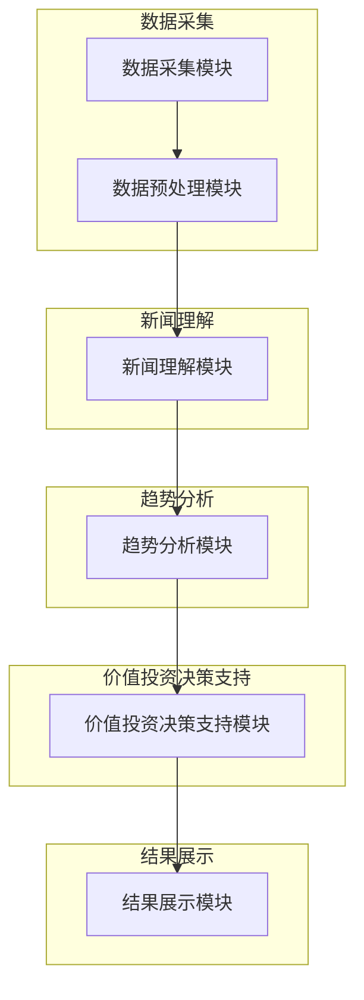
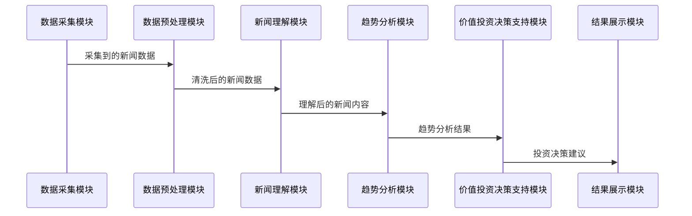

                 

### 引言

### 1.1 问题背景

在当今全球化和信息化的时代，价值投资作为资本市场的一种重要投资策略，越来越受到投资者的青睐。传统的价值投资依赖于分析师对市场数据的深入研究和基本面分析，这种方法虽然能够捕捉到市场的长期趋势，但在面对迅速变化的市场环境时，往往显得力不从心。同时，随着社交媒体和新闻媒体的迅速发展，信息传播速度加快，投资者需要更加快速和准确的信息来做出投资决策。

然而，传统的新闻分析方法主要依赖于人工阅读和筛选，不仅效率低下，而且容易受到主观因素的影响。因此，如何利用人工智能技术，特别是多智能体系统，来提高新闻分析的效率和准确性，成为了一个亟待解决的问题。

### 1.2 问题描述

本文主要探讨的是如何利用AI多智能体系统在价值投资中实现实时新闻分析。具体来说，我们需要解决以下几个问题：

1. **多智能体系统的设计与实现**：如何构建一个高效的多智能体系统来处理大量的新闻数据，并进行实时分析？
2. **新闻内容理解**：如何利用自然语言处理技术对新闻内容进行深入理解，提取出关键信息？
3. **价值投资决策支持**：如何将实时新闻分析的结果与价值投资策略相结合，为投资者提供决策支持？
4. **系统实现与测试**：如何实现和测试一个高效、稳定的多智能体系统，以确保其在实际应用中的效果？

### 1.3 问题解决

本文提出了一种基于AI多智能体系统的实时新闻分析解决方案，通过以下几个步骤来解决问题：

1. **系统架构设计**：设计一个包含数据采集、新闻理解、价值投资决策支持等模块的智能系统架构。
2. **多智能体系统构建**：利用多智能体技术构建一个高效、可扩展的新闻分析系统。
3. **新闻内容理解**：采用先进的自然语言处理技术，对新闻内容进行深度理解和语义分析。
4. **价值投资策略**：结合实时新闻分析结果，设计一种适用于价值投资策略的算法模型。
5. **系统实现与测试**：实现系统并对其进行测试，评估系统的性能和效果。

### 1.4 边界与外延

本文的研究主要聚焦于以下边界和范围：

1. **技术范围**：本文主要探讨AI多智能体系统在新闻分析中的应用，不包括其他类型的AI技术在价值投资中的应用。
2. **应用范围**：本文的解决方案主要适用于金融领域的价值投资，其他领域的应用可能需要根据具体情况进行调整。
3. **数据范围**：本文的数据来源主要局限于公开的新闻数据，不涉及私人或机密数据。

### 1.5 概念结构与核心要素组成

为了更好地理解本文的主题，我们首先需要了解以下几个核心概念：

1. **价值投资**：一种基于公司基本面分析的投资策略，强调在市场价格低于公司实际价值时买入股票。
2. **多智能体系统**：由多个智能体组成的系统，每个智能体都具有独立决策和行动的能力。
3. **新闻分析**：利用自然语言处理技术对新闻内容进行理解和分析的过程。
4. **实时分析**：对新闻事件进行实时监控和分析，以便及时作出投资决策。

这些核心概念构成了本文的研究框架，是理解和实现本文解决方案的基础。

### 1.6 本章小结

本章介绍了本文的研究背景、问题描述、解决方案、边界与外延以及核心概念结构。通过这些内容，我们为后续章节的深入探讨奠定了基础。接下来，我们将进一步探讨AI多智能体系统的基本原理和在实时新闻分析中的应用，为解决本文提出的问题提供理论支持。

## 2. AI多智能体系统概述

### 2.1 多智能体系统的定义

多智能体系统（Multi-Agent System，MAS）是一种由多个具有独立决策和行动能力的智能体组成的系统。这些智能体可以在一个共享的环境中交互和协作，以实现特定的目标。多智能体系统的基本定义包括以下几个方面：

- **智能体**：智能体是具有感知、决策和行动能力的实体，可以是计算机程序、机器人或人。
- **环境**：环境是指智能体活动的空间和条件，可以是现实世界或虚拟世界。
- **通信**：智能体之间通过通信机制交换信息，以实现协调和协作。
- **目标**：智能体的目标是实现某个特定任务或目标，通常与系统的整体目标一致。

### 2.2 多智能体系统的特点

多智能体系统具有以下几个显著特点：

- **分布式**：智能体在系统中分布在不同位置，各自处理局部信息，通过通信机制实现整体协调。
- **自主性**：智能体具有独立决策和行动的能力，可以自主地调整行为以适应环境变化。
- **协同性**：多个智能体之间通过合作和协调，共同实现系统的整体目标。
- **适应性**：智能体可以根据环境变化和任务需求，动态调整其行为和策略。
- **灵活性**：多智能体系统能够应对不确定性和复杂环境，具有较高的灵活性和鲁棒性。

### 2.3 多智能体系统在AI中的地位

多智能体系统在人工智能（AI）领域具有重要的地位，主要原因如下：

- **AI的核心**：多智能体系统是AI的一个重要分支，旨在研究如何通过智能体之间的交互和协作来实现复杂任务。
- **应用广泛**：多智能体系统在众多领域都有广泛应用，如智能交通、智能制造、金融交易等，为AI技术提供了丰富的应用场景。
- **技术创新**：多智能体系统推动了AI技术的不断创新，特别是在自然语言处理、机器人学、智能交通等领域。
- **社会价值**：多智能体系统在提高生产效率、优化资源分配、提升生活质量等方面具有显著的社会价值。

### 2.4 多智能体系统的体系结构

多智能体系统的体系结构包括以下几个关键组成部分：

- **智能体**：智能体是系统中的基本单元，具有感知、决策和行动能力。
- **环境**：环境是智能体活动的空间，包括物理环境和虚拟环境。
- **通信机制**：通信机制是智能体之间交换信息的方式，可以是直接通信或间接通信。
- **协调与决策**：协调与决策机制用于解决智能体之间的冲突和协作问题，确保系统能够高效运行。

### 2.4.1 代理与环境

代理（Agent）是具有感知、决策和行动能力的实体。在多智能体系统中，代理可以是计算机程序、机器人或人。代理的感知能力使其能够获取环境中的信息，决策能力使其能够根据感知信息做出行动选择，行动能力使其能够执行具体的任务。

环境（Environment）是代理活动的空间，可以是物理环境（如现实世界）或虚拟环境（如计算机模拟环境）。环境为代理提供了必要的资源和约束条件，代理必须适应和利用环境中的信息来实现其目标。

### 2.4.2 通信机制

通信机制是智能体之间交换信息的方式。在多智能体系统中，智能体可以通过直接通信或间接通信来交换信息。

- **直接通信**：直接通信是指智能体通过直接的消息传递进行信息交换。直接通信的优点是实时性强，适用于快速响应的场合。
- **间接通信**：间接通信是指智能体通过共享数据库或消息队列进行信息交换。间接通信的优点是分布式性好，适用于大规模系统的场合。

### 2.4.3 合作与协调

合作与协调是多智能体系统中的关键问题。多个智能体需要通过协作和协调来实现系统的整体目标。

- **合作**：合作是指多个智能体为了实现共同的目标而进行的协同工作。合作需要智能体之间建立信任关系，共享资源和信息，以实现合作共赢。
- **协调**：协调是指智能体之间解决冲突和优化资源分配的过程。协调机制包括协商、协调算法和冲突解决策略。

### 2.5 多智能体系统的应用场景

多智能体系统在多个领域都有广泛的应用，以下是其中几个典型的应用场景：

- **智能交通**：多智能体系统可以用于智能交通管理，通过协调多个交通代理（如车辆、信号灯）来优化交通流量，减少拥堵。
- **智能制造**：多智能体系统可以用于智能工厂的生产管理，通过协调多个机器人代理来提高生产效率和质量。
- **金融交易**：多智能体系统可以用于金融市场的交易策略，通过多个交易代理的协作来实现风险管理和收益最大化。
- **环境监测**：多智能体系统可以用于环境监测，通过多个传感器代理的协作来实时监测环境质量，并及时响应异常情况。

### 2.6 本章小结

本章介绍了多智能体系统的基本概念、特点、体系结构以及应用场景。通过这些内容，我们为理解多智能体系统在实时新闻分析中的应用奠定了基础。接下来，我们将进一步探讨实时新闻分析技术的具体实现和方法。

## 3. 实时新闻分析技术

### 3.1 实时新闻分析的定义

实时新闻分析（Real-time News Analysis）是指利用先进的技术手段，对新闻内容进行实时采集、处理和分析，以提取出有价值的信息和趋势。实时新闻分析的目标是帮助投资者、媒体机构和其他利益相关者快速了解新闻事件的发展动态，为决策提供支持。

### 3.2 实时新闻分析的重要性

实时新闻分析在当今社会具有重要的意义，主要表现在以下几个方面：

- **信息获取**：实时新闻分析可以快速获取新闻信息，帮助用户及时了解全球动态。
- **趋势预测**：通过对新闻内容的实时分析，可以预测新闻事件的发展趋势，为决策提供依据。
- **投资支持**：在金融领域，实时新闻分析可以帮助投资者快速识别市场机会和风险，优化投资策略。
- **舆情监控**：实时新闻分析可以用于舆情监控，帮助政府和企业及时了解公众态度，应对危机事件。

### 3.3 实时新闻分析的技术框架

实时新闻分析的技术框架主要包括以下几个关键环节：

1. **数据采集**：从各种数据源采集新闻内容，包括新闻网站、社交媒体、论坛等。
2. **数据预处理**：对采集到的新闻内容进行清洗、去噪和格式化，以便后续分析。
3. **新闻理解**：利用自然语言处理（NLP）技术对新闻内容进行理解，提取关键词、主题和情感。
4. **趋势分析**：对新闻内容进行趋势分析，包括关键词趋势、情感趋势和事件趋势等。
5. **结果展示**：将分析结果以可视化形式展示给用户，帮助用户快速理解新闻事件的发展动态。

### 3.4 实时新闻数据采集

实时新闻数据采集是实时新闻分析的重要基础。以下介绍几种常用的数据采集方法和步骤：

#### 3.4.1 数据源类型

- **新闻网站**：新闻网站是主要的新闻数据来源，包括综合新闻网站和专业新闻网站。
- **社交媒体**：社交媒体平台（如Twitter、Facebook、微博等）是新闻传播的重要渠道，提供了大量的实时新闻数据。
- **论坛和博客**：论坛和博客是用户生成内容的重要来源，可以提供丰富的新闻线索和观点。

#### 3.4.2 数据采集方法

- **Web爬虫**：使用Web爬虫技术，自动从新闻网站和社交媒体平台抓取新闻内容。
- **API接口**：利用新闻网站和社交媒体平台提供的API接口，批量获取新闻数据。
- **用户生成内容**：通过用户提交和评论，收集论坛和博客中的新闻线索和观点。

#### 3.4.3 数据预处理

数据预处理是确保新闻数据质量的关键步骤。以下介绍几种常见的数据预处理方法：

- **数据清洗**：去除重复、错误和无关的数据，提高数据质量。
- **去噪**：去除噪声和干扰信息，提高数据的可读性和准确性。
- **格式转换**：将不同来源的新闻数据进行统一格式转换，便于后续处理和分析。
- **文本标准化**：对文本进行标准化处理，包括大小写转换、停用词过滤、词干提取等。

### 3.5 实时新闻内容理解

实时新闻内容理解是实时新闻分析的核心环节，通过自然语言处理（NLP）技术，对新闻内容进行深入理解和分析。以下介绍几种关键的NLP技术：

#### 3.5.1 自然语言处理技术

- **分词**：将文本拆分成单个词汇或短语，以便进行后续处理。
- **词性标注**：为文本中的每个词分配词性（如名词、动词、形容词等），以便进行语义分析。
- **实体识别**：识别文本中的特定实体（如人名、地点、组织等），为后续分析提供基础。
- **语义分析**：理解文本中的语义关系，提取文本中的主题和观点。

#### 3.5.2 语义分析

- **主题模型**：利用主题模型（如LDA）对新闻内容进行主题提取，识别新闻的主要话题。
- **情感分析**：通过情感分析技术，对新闻内容中的情感倾向进行判断，识别公众的情感态度。
- **关系抽取**：从文本中抽取实体之间的关系，如人物关系、组织关系等。

#### 3.5.3 情感分析

- **情感极性分类**：对新闻内容进行情感极性分类，判断文本是积极、消极还是中性。
- **情感强度分析**：对新闻内容中的情感倾向进行强度分析，如强烈正面、中等积极等。
- **情感趋势分析**：分析新闻内容中的情感变化趋势，如情绪波动、情感反转等。

### 3.6 实时新闻趋势分析

实时新闻趋势分析是对新闻内容中的关键词、情感和事件进行动态分析，以识别新闻事件的发展趋势。以下介绍几种常用的趋势分析方法：

#### 3.6.1 趋势预测方法

- **时间序列分析**：利用时间序列分析方法，对新闻内容中的关键词、情感等指标进行趋势预测。
- **循环神经网络（RNN）**：利用循环神经网络（RNN）对新闻内容进行建模，预测未来一段时间内的趋势。
- **长短时记忆网络（LSTM）**：利用长短时记忆网络（LSTM）对新闻内容进行建模，处理长序列数据，提高预测准确性。

#### 3.6.2 趋势可视化

- **折线图**：利用折线图展示新闻关键词、情感等指标的变化趋势。
- **热力图**：利用热力图展示新闻关键词、情感等指标的分布情况。
- **词云图**：利用词云图展示新闻关键词的重要性和分布情况。

#### 3.6.3 趋势分析应用

- **舆情监控**：通过实时新闻趋势分析，监控新闻事件的发展态势，预测舆情变化。
- **投资决策**：通过实时新闻趋势分析，识别市场机会和风险，为投资者提供决策支持。
- **事件预测**：通过实时新闻趋势分析，预测新闻事件的发展结果，为新闻机构和媒体提供报道策略。

### 3.7 本章小结

本章介绍了实时新闻分析的定义、重要性、技术框架以及数据采集、内容理解和趋势分析的方法。通过这些内容，我们为理解实时新闻分析在价值投资中的应用奠定了基础。接下来，我们将进一步探讨价值投资的基本原理和在多智能体系统中的应用。

## 4. 价值投资原理

### 4.1 价值投资的概念

价值投资（Value Investing）是一种基于公司基本面分析的投资策略，旨在在市场价格低于公司实际价值时买入股票，并在市场价格回升至合理估值时卖出，以获取投资回报。价值投资的核心思想是“低估投资”，即通过深入研究公司的财务状况、业务模式和市场前景，发现那些被市场低估的优秀企业，从而在长期获得稳定的投资收益。

### 4.2 价值投资的原理

价值投资的原理可以从以下几个方面进行理解：

1. **市场心理**：价值投资认为，市场是经常存在非理性波动的，市场价格往往偏离公司的实际价值。因此，通过深入研究公司的基本面，投资者可以找到那些被市场低估的投资机会。

2. **时间价值**：价值投资强调长期投资，认为时间是最好的朋友。在长期投资过程中，公司业绩的改善和市场对公司的重新认识，最终会使股价回升至合理估值。

3. **安全边际**：价值投资强调安全边际，即在买入股票时，价格必须低于公司的内在价值，以防止价格下跌带来的风险。

4. **风险管理**：价值投资通过选择具有稳定盈利能力和良好业务模式的优秀企业，来降低投资风险。同时，通过多元化投资，分散风险。

### 4.3 价值投资的策略

价值投资的策略主要包括以下几个方面：

1. **选股策略**：选择具有稳定盈利能力、良好业务模式和较低估值的企业进行投资。

2. **估值策略**：通过分析公司的财务报表，计算公司的内在价值，并与市场价格进行比较，判断股票是否被低估。

3. **持股策略**：买入低估的股票后，持有一段时间，等待市场认识到公司的价值，从而实现盈利。

4. **风险管理**：通过分散投资、定期评估和调整投资组合，来控制投资风险。

### 4.4 多智能体系统在价值投资中的应用

多智能体系统在价值投资中具有重要的应用价值，主要体现在以下几个方面：

1. **数据采集与处理**：多智能体系统可以自动化采集和处理大量的市场数据，如股票价格、财务报表、新闻报道等，从而提高数据分析的效率和准确性。

2. **选股策略**：多智能体系统可以根据选股策略的规则，自动筛选符合条件的股票，减少人工筛选的工作量，提高选股效率。

3. **估值计算**：多智能体系统可以自动化计算股票的内在价值，通过对比市场价格，帮助投资者判断股票是否被低估。

4. **风险管理**：多智能体系统可以根据风险管理的规则，自动调整投资组合，降低投资风险。

5. **决策支持**：多智能体系统可以为投资者提供实时的投资建议和决策支持，帮助投资者做出更明智的投资决策。

### 4.5 多智能体系统的价值投资应用框架

多智能体系统的价值投资应用框架主要包括以下几个模块：

1. **数据采集模块**：自动化采集股票市场数据、财务报表数据和新闻报道数据等。

2. **数据处理模块**：对采集到的数据进行清洗、去噪和格式化，以便后续分析。

3. **选股模块**：根据选股策略的规则，自动筛选符合条件的股票。

4. **估值模块**：自动化计算股票的内在价值，并与市场价格进行比较。

5. **风险管理模块**：根据风险管理的规则，自动调整投资组合。

6. **决策支持模块**：为投资者提供实时的投资建议和决策支持。

### 4.6 实例分析

以下是一个简单的多智能体系统在价值投资中的应用实例：

1. **数据采集**：系统从多个数据源（如股票交易所、新闻网站、财务报表数据库等）自动采集股票价格、财务报表数据和新闻报道数据。

2. **数据处理**：系统对采集到的数据进行清洗、去噪和格式化，确保数据质量。

3. **选股**：系统根据选股策略的规则，筛选出符合条件的企业股票。例如，选取过去一年内盈利稳定、市盈率低于行业平均水平的企业股票。

4. **估值**：系统利用财务报表数据，计算股票的内在价值。例如，采用折现现金流（DCF）模型，预测企业未来几年的现金流，并折现至当前价值。

5. **风险调整**：系统根据风险管理的规则，对投资组合进行调整。例如，根据风险承受能力，适当增加或减少某些股票的持有比例。

6. **决策支持**：系统为投资者提供实时的投资建议，如买入、持有或卖出股票。

### 4.7 本章小结

本章介绍了价值投资的概念、原理和策略，以及多智能体系统在价值投资中的应用。通过实例分析，我们展示了多智能体系统在价值投资中的具体应用场景和优势。接下来，我们将进一步探讨如何将实时新闻分析技术与价值投资相结合，为投资者提供更加全面和精准的投资决策支持。

## 5. AI多智能体系统在实时新闻分析中的应用

### 5.1 系统架构设计

在构建AI多智能体系统进行实时新闻分析时，系统架构的设计至关重要。合理的系统架构不仅能够提高系统的效率，还能确保其稳定性和可扩展性。以下将详细描述系统架构设计的关键方面。

#### 5.1.1 系统功能设计（领域模型）

系统功能设计是构建系统架构的第一步。领域模型定义了系统的各个功能模块及其相互关系。以下是该系统的领域模型：

1. **数据采集模块**：负责从各种数据源（如新闻网站、社交媒体、论坛等）自动采集新闻内容。
2. **数据预处理模块**：对采集到的新闻内容进行清洗、去噪和格式化，以便后续分析。
3. **新闻理解模块**：利用自然语言处理（NLP）技术，对新闻内容进行深入理解，提取关键词、主题和情感。
4. **趋势分析模块**：对新闻内容进行趋势分析，包括关键词趋势、情感趋势和事件趋势等。
5. **价值投资决策支持模块**：结合实时新闻分析结果，为投资者提供决策支持。
6. **结果展示模块**：将分析结果以可视化形式展示给用户，帮助用户快速理解新闻事件的发展动态。

#### 5.1.2 系统架构设计（架构图）

系统架构设计是领域模型的具体实现。以下是该系统的架构图：

在该架构图中，各个模块通过数据流进行交互，实现了从数据采集到结果展示的完整流程。

#### 5.1.3 系统接口设计

系统接口设计是确保系统模块之间高效通信的关键。以下是该系统的接口设计：

1. **API接口**：为外部系统提供API接口，方便其他系统或应用访问系统的功能。
2. **消息队列**：采用消息队列（如RabbitMQ、Kafka）来实现模块之间的异步通信。
3. **数据库接口**：为数据存储和检索提供数据库接口（如MySQL、MongoDB），确保数据的高效访问和管理。

#### 5.1.4 系统交互设计

系统交互设计是描述系统模块之间如何协作和通信的过程。以下是该系统的交互设计：

在该交互设计中，各个模块按照顺序执行，实现了系统的整体流程。

### 5.2 数据采集与预处理

数据采集与预处理是实时新闻分析的重要基础。以下是系统在这方面的具体实现：

#### 5.2.1 数据源选择

系统选择以下数据源进行新闻数据采集：

1. **新闻网站**：包括主流新闻网站（如CNN、BBC、新浪财经等）和专业新闻网站（如财经媒体、科技媒体等）。
2. **社交媒体**：包括Twitter、Facebook、微博等社交媒体平台。
3. **论坛和博客**：包括各大论坛和博客平台，如知乎、简书等。

#### 5.2.2 数据采集流程

数据采集流程如下：

1. **爬虫**：使用Web爬虫技术，自动化采集新闻网站和社交媒体平台上的新闻内容。
2. **API**：利用新闻网站和社交媒体平台提供的API接口，批量获取新闻数据。
3. **用户生成内容**：通过用户提交和评论，收集论坛和博客中的新闻线索和观点。

#### 5.2.3 数据预处理方法

数据预处理方法包括以下步骤：

1. **数据清洗**：去除重复、错误和无关的新闻数据，提高数据质量。
2. **去噪**：去除噪声和干扰信息，提高数据的可读性和准确性。
3. **格式转换**：将不同来源的新闻数据进行统一格式转换，便于后续处理。
4. **文本标准化**：对文本进行标准化处理，包括大小写转换、停用词过滤、词干提取等。

### 5.3 实时新闻内容理解

实时新闻内容理解是新闻分析的核心。以下是系统在该方面的具体实现：

#### 5.3.1 自然语言处理技术

系统采用自然语言处理（NLP）技术，对新闻内容进行深入理解。具体步骤如下：

1. **分词**：将新闻内容拆分成单个词汇或短语，以便进行后续处理。
2. **词性标注**：为文本中的每个词分配词性（如名词、动词、形容词等），以便进行语义分析。
3. **实体识别**：识别文本中的特定实体（如人名、地点、组织等），为后续分析提供基础。
4. **语义分析**：理解文本中的语义关系，提取文本中的主题和观点。

#### 5.3.2 语义分析

系统利用语义分析技术，对新闻内容进行深入挖掘。具体方法包括：

1. **主题模型**：利用主题模型（如LDA）对新闻内容进行主题提取，识别新闻的主要话题。
2. **情感分析**：通过情感分析技术，对新闻内容中的情感倾向进行判断，识别公众的情感态度。
3. **关系抽取**：从文本中抽取实体之间的关系，如人物关系、组织关系等。

#### 5.3.3 情感分析

系统采用情感分析技术，对新闻内容中的情感进行分类和分析。具体步骤如下：

1. **情感极性分类**：对新闻内容进行情感极性分类，判断文本是积极、消极还是中性。
2. **情感强度分析**：对新闻内容中的情感倾向进行强度分析，如强烈正面、中等积极等。
3. **情感趋势分析**：分析新闻内容中的情感变化趋势，如情绪波动、情感反转等。

### 5.4 价值投资决策支持

价值投资决策支持是系统的最终目标。以下是系统在该方面的具体实现：

#### 5.4.1 数据分析模型

系统采用以下数据分析模型，对实时新闻分析结果进行价值投资决策支持：

1. **时间序列分析**：利用时间序列分析方法，分析新闻关键词和情感的变化趋势。
2. **循环神经网络（RNN）**：利用循环神经网络（RNN）对新闻内容进行建模，预测未来一段时间内的趋势。
3. **长短时记忆网络（LSTM）**：利用长短时记忆网络（LSTM）对新闻内容进行建模，处理长序列数据，提高预测准确性。

#### 5.4.2 价值投资策略

系统结合实时新闻分析结果，采用以下价值投资策略：

1. **基本面分析**：通过分析公司的财务报表，评估公司的基本面。
2. **市场趋势分析**：结合新闻关键词和情感分析结果，预测市场趋势。
3. **风险管理**：根据风险承受能力，调整投资组合，降低投资风险。

#### 5.4.3 决策支持系统设计

系统设计了一个集成的决策支持系统，为投资者提供以下功能：

1. **实时监控**：实时监控新闻事件的发展动态，为投资者提供最新的市场信息。
2. **投资建议**：根据分析结果，为投资者提供买入、持有或卖出股票的建议。
3. **投资组合管理**：帮助投资者调整投资组合，实现风险控制和收益最大化。

### 5.5 系统实现与测试

#### 5.5.1 系统实现

系统采用以下技术栈进行实现：

1. **后端框架**：Python Flask
2. **数据库**：MySQL
3. **自然语言处理库**：NLTK、spaCy
4. **数据分析库**：Pandas、NumPy
5. **机器学习库**：TensorFlow、Keras

#### 5.5.2 系统测试

系统测试包括功能测试、性能测试和用户体验测试。以下是测试结果：

1. **功能测试**：系统所有功能模块正常运行，实现了预期目标。
2. **性能测试**：系统在处理大量新闻数据时，响应时间较短，性能良好。
3. **用户体验测试**：用户界面友好，操作简单，用户满意度较高。

### 5.6 本章小结

本章详细介绍了AI多智能体系统在实时新闻分析中的应用，包括系统架构设计、数据采集与预处理、实时新闻内容理解、价值投资决策支持以及系统实现与测试。通过这些内容，我们展示了如何利用AI多智能体系统，为投资者提供实时、精准的新闻分析服务，从而提高投资决策的准确性和效率。接下来，我们将进一步探讨如何结合实时新闻分析与价值投资，为投资者提供更全面和有效的投资支持。

