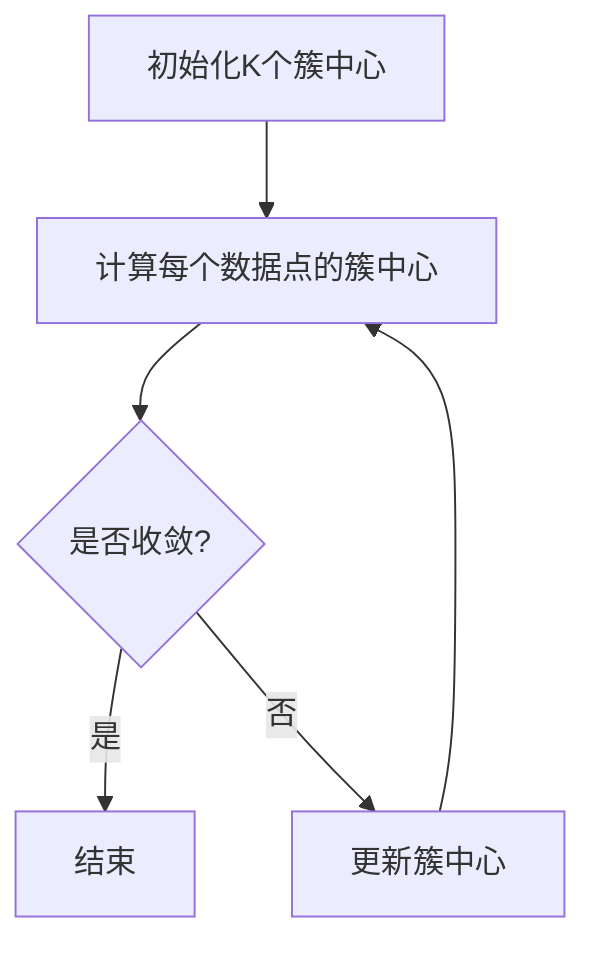
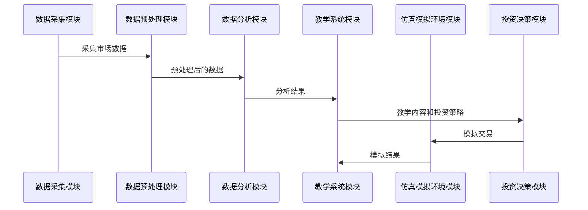
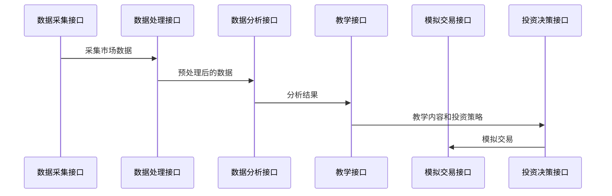
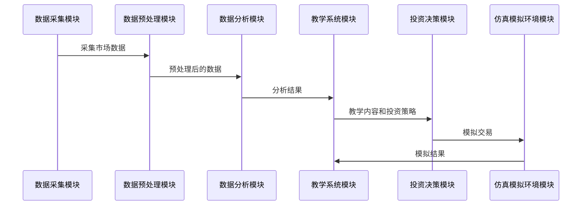

                 

# AI多智能体系统如何改进传统的价值投资师徒培养模式

## 关键词
- AI多智能体系统
- 价值投资
- 师徒培养模式
- 数据分析
- 个性化教学
- 仿真模拟

## 摘要
本文将探讨如何利用AI多智能体系统改进传统的价值投资师徒培养模式。通过分析传统模式存在的问题，提出AI多智能体系统在数据挖掘与分析、智能教学系统、仿真模拟环境和数据驱动决策等方面的解决方案，并深入探讨AI多智能体系统的核心概念与价值投资师徒培养模式之间的联系，为构建高效的现代投资人才培养体系提供参考。

## 第一部分：背景介绍

### 1.1 问题背景

随着人工智能（AI）技术的飞速发展，传统价值投资模式正面临着前所未有的挑战与变革。价值投资作为一种以基本面分析为基础的投资策略，强调长期投资和公司价值的核心驱动因素。然而，在数据量和复杂度不断增加的市场环境中，传统的价值投资方式难以充分挖掘数据中的潜在价值，培养新一代价值投资师徒的效率也大大降低。

### 1.2 问题描述

传统价值投资师徒培养模式存在的问题主要包括：

- **数据获取与分析能力不足**：师徒之间依赖于导师的经验传授，难以快速适应大量且复杂的数据分析需求。
- **教学效率低下**：传统的师徒制培养模式缺乏系统化的教学方法，培养周期长，效率低。
- **缺乏个性化培养**：传统模式难以根据个体差异进行个性化教学，培养效果不尽理想。
- **无法应对快速变化的市场**：市场环境变化迅速，传统培养模式无法及时调整教学内容和策略。

### 1.3 问题解决

为了解决上述问题，AI多智能体系统应运而生。通过AI多智能体系统，可以实现对价值投资过程的自动化和智能化，从而优化师徒培养模式。具体解决方案包括：

- **数据挖掘与分析**：AI多智能体系统可以自动收集和分析大量市场数据，辅助投资者进行决策。
- **智能教学系统**：利用AI技术构建个性化教学系统，根据学员的学习情况和需求，提供定制化的教学内容和辅导。
- **仿真模拟环境**：通过构建仿真模拟环境，模拟真实市场情况，帮助学员在实践中掌握投资技能。
- **数据驱动决策**：AI多智能体系统可以实时分析市场动态，为投资者提供数据驱动的投资策略。

### 1.4 边界与外延

- **边界**：本书主要探讨AI多智能体系统在价值投资师徒培养模式中的应用，不涉及其他类型的投资模式。
- **外延**：AI多智能体系统的应用范围不仅限于价值投资，还可以拓展到其他投资领域，如量化投资、风险控制等。

### 1.5 概念结构与核心要素组成

- **AI多智能体系统**：由多个智能体组成，能够相互协作，共同完成特定任务。
- **价值投资师徒培养模式**：一种通过师徒关系传授投资知识和技能的培养模式。
- **数据分析**：对大量市场数据进行挖掘和分析，以辅助投资决策。
- **个性化教学**：根据学员的学习情况和需求，提供定制化的教学内容和辅导。

### 1.6 本章小结

本章从问题背景、问题描述、问题解决、边界与外延以及概念结构与核心要素组成等方面，全面介绍了AI多智能体系统如何改进传统的价值投资师徒培养模式。下一章将深入探讨AI多智能体系统的核心概念与特点。

## 第二部分：核心概念与联系

### 2.1 AI多智能体系统的核心概念

#### 2.1.1 智能体

智能体（Agent）是AI多智能体系统中最基本的单元，具有感知、决策和执行能力。智能体可以是一个程序、一个机器人或者一个人类。

#### 2.1.2 多智能体系统

多智能体系统（Multi-Agent System）是由多个智能体组成的系统，这些智能体可以相互协作，共同完成复杂任务。

#### 2.1.3 协作与通信

协作与通信是多智能体系统中的关键要素，智能体之间需要通过一定的协议进行信息交换和协同工作。

### 2.2 价值投资师徒培养模式的核心概念

#### 2.2.1 基本面分析

基本面分析是价值投资的核心方法，主要通过分析公司的财务报表、业务模式、市场环境等，评估公司的投资价值。

#### 2.2.2 个性化培养

个性化培养是根据学员的个人特点和学习需求，提供定制化的教学内容和辅导，提高培养效率。

#### 2.2.3 教学评估

教学评估是对师徒培养模式效果的评价，通过分析学员的投资表现和反馈，不断优化培养策略。

### 2.3 AI多智能体系统与价值投资师徒培养模式的联系

#### 2.3.1 数据驱动

AI多智能体系统可以利用大量的市场数据，为价值投资师徒提供数据驱动的投资策略，提高投资决策的准确性。

#### 2.3.2 个性化教学

AI多智能体系统可以根据学员的学习行为和表现，自动调整教学内容和辅导方式，实现个性化培养。

#### 2.3.3 仿真模拟

AI多智能体系统可以构建仿真模拟环境，模拟真实市场情况，帮助学员在实践中掌握投资技能。

### 2.4 本章小结

本章从AI多智能体系统的核心概念、价值投资师徒培养模式的核心概念以及两者之间的联系等方面，深入探讨了AI多智能体系统如何与价值投资师徒培养模式相结合，为实现高效的投资人才培养提供了理论基础。

## 第三部分：AI多智能体系统的核心概念与特点

### 3.1 AI多智能体系统的定义与组成

AI多智能体系统（AI Multi-Agent System，简称AIMAS）是一种由多个智能体组成的系统，这些智能体可以相互协作，共同完成复杂任务。智能体是指具有感知、决策和执行能力的个体，可以是计算机程序、机器人或人类。在AIMAS中，智能体之间通过通信和协作来实现系统的整体目标。

AIMAS的组成主要包括以下几个部分：

1. **智能体（Agent）**：智能体是AIMAS中最基本的单元，具有自主性、社交性和反应性等特点。自主性指智能体能够自主地制定计划并采取行动；社交性指智能体可以与其他智能体进行交互；反应性指智能体能够对环境中的变化做出实时响应。
   
2. **通信机制**：智能体之间的通信是AIMAS实现协作和协调的关键。通信机制可以是基于消息传递的，也可以是基于共享数据的。通信机制需要保证实时性、可靠性和安全性。

3. **协作策略**：协作策略是指智能体在协作过程中遵循的规则和算法。协作策略可以基于分布式算法、协商算法或合作博弈理论等。

4. **环境模型**：环境模型是AIMAS中智能体所感知的外部世界。环境模型可以是静态的，也可以是动态的，需要反映智能体在执行任务过程中所面临的现实情况。

### 3.2 AI多智能体系统的特点

#### 3.2.1 自主性

AI多智能体系统中的智能体具有高度的自主性，能够独立地制定计划和执行任务。自主性使得智能体能够在不确定和动态变化的环境中自主地适应和应对挑战。

#### 3.2.2 社交性

智能体之间的社交性是AIMAS实现高效协作的基础。社交性使得智能体能够共享信息、协调行动，从而实现系统的整体目标。

#### 3.2.3 反应性

反应性是指智能体能够对环境中的变化做出实时响应。在价值投资师徒培养模式中，反应性使得智能体能够快速适应市场变化，为学员提供及时的投资建议。

#### 3.2.4 智能性

智能性是指智能体能够利用其感知能力和决策能力，对复杂问题进行分析和解决。在价值投资中，智能性使得智能体能够从海量数据中提取有价值的信息，为投资者提供数据驱动的投资策略。

### 3.3 AI多智能体系统在价值投资中的应用

#### 3.3.1 数据分析

AI多智能体系统可以通过分布式计算和机器学习技术，对大量市场数据进行挖掘和分析。通过数据分析，智能体可以识别出潜在的投资机会，为投资者提供数据驱动的投资策略。

#### 3.3.2 个性化教学

AI多智能体系统可以根据学员的学习行为和表现，自动调整教学内容和辅导方式。通过个性化教学，智能体能够为学员提供定制化的学习体验，提高学习效果。

#### 3.3.3 仿真模拟

AI多智能体系统可以构建仿真模拟环境，模拟真实市场情况。通过仿真模拟，学员可以在虚拟市场中实践投资策略，提高实际操作能力。

#### 3.3.4 数据驱动决策

AI多智能体系统可以实时分析市场动态，为投资者提供数据驱动的投资决策。通过数据驱动决策，智能体能够帮助投资者规避风险，实现稳定收益。

### 3.4 本章小结

本章介绍了AI多智能体系统的核心概念与特点，以及其在价值投资中的应用。通过分析AI多智能体系统的自主性、社交性、反应性和智能性等特点，我们可以看到，AI多智能体系统在改进传统的价值投资师徒培养模式方面具有巨大的潜力。

## 第四部分：AI多智能体系统与价值投资师徒培养模式的结合

### 4.1 数据驱动投资策略

在传统的价值投资师徒培养模式中，导师主要依赖于自己的经验和知识来指导学生，这种方式在数据量较小、市场相对稳定的情况下具有一定的效果。然而，随着市场环境的不断变化和数据的急剧增长，传统的培养模式已经难以满足需求。AI多智能体系统通过数据驱动的投资策略，能够为价值投资师徒提供更为精准的投资指导。

#### 4.1.1 数据收集与预处理

首先，AI多智能体系统需要从多个数据源收集市场数据，包括股票价格、财务报表、行业动态、宏观经济指标等。然后，对收集到的数据进行预处理，包括数据清洗、去重、归一化等操作，以确保数据的质量和一致性。

#### 4.1.2 数据分析

在数据预处理完成后，AI多智能体系统利用机器学习和数据挖掘技术对数据进行分析。通过建立预测模型和趋势分析，智能体可以识别出潜在的投资机会和风险。

#### 4.1.3 投资策略生成

基于数据分析的结果，AI多智能体系统可以自动生成投资策略。这些策略包括股票选择、买入时机、卖出时机等，旨在最大化投资收益并控制风险。

### 4.2 个性化教学

个性化教学是提高价值投资师徒培养效率的重要手段。AI多智能体系统通过分析学员的学习行为和投资表现，能够为每位学员提供定制化的教学内容和辅导。

#### 4.2.1 学习行为分析

AI多智能体系统可以实时监控学员的学习行为，包括阅读、练习、讨论等。通过分析这些行为，智能体可以了解学员的兴趣点、薄弱环节和学习风格。

#### 4.2.2 教学内容定制

根据学习行为分析的结果，AI多智能体系统可以为学员定制个性化的教学内容。例如，对于某个特定知识点，系统可以推荐相关的课程、案例和练习，帮助学员更好地理解和掌握。

#### 4.2.3 教学反馈与调整

AI多智能体系统不仅可以提供教学内容，还可以对学员的学习效果进行评估，并提供即时反馈。根据学员的反馈和学习效果，系统可以动态调整教学内容和辅导策略，确保学员始终在最佳的学习状态。

### 4.3 仿真模拟环境

为了提高学员的实践能力，AI多智能体系统可以构建仿真模拟环境，让学员在虚拟市场中进行投资操作。这种仿真环境能够模拟真实市场的情况，包括股票价格波动、交易成本、市场情绪等。

#### 4.3.1 模拟环境设计

AI多智能体系统需要设计一个逼真的模拟环境，以尽可能还原真实市场的场景。这包括模拟股票市场的价格波动、交易机制、信息传播等。

#### 4.3.2 模拟交易

在仿真模拟环境中，学员可以进行模拟交易，包括买入、持有和卖出股票等操作。通过模拟交易，学员可以积累实际操作经验，提高投资技能。

#### 4.3.3 模拟结果分析

AI多智能体系统可以实时分析学员的模拟交易结果，包括收益、风险、交易策略等。通过分析结果，系统可以为学员提供改进建议，帮助其优化投资策略。

### 4.4 数据驱动决策

在价值投资中，决策的正确与否直接关系到投资收益。AI多智能体系统通过实时分析市场动态和数据，为投资者提供数据驱动的决策支持。

#### 4.4.1 实时数据分析

AI多智能体系统可以实时收集和处理市场数据，包括股票价格、成交量、财务指标等。通过实时数据分析，智能体可以快速识别市场变化和潜在的投资机会。

#### 4.4.2 投资决策生成

基于实时数据分析的结果，AI多智能体系统可以自动生成投资决策，包括买入、持有和卖出股票等操作。这些决策旨在最大化投资收益并控制风险。

#### 4.4.3 决策反馈与优化

AI多智能体系统可以记录和分析每次投资决策的结果，包括收益、风险等。通过这些数据，系统可以不断优化决策模型，提高决策的准确性。

### 4.5 本章小结

通过AI多智能体系统的引入，价值投资师徒培养模式在数据分析、个性化教学、仿真模拟环境和数据驱动决策等方面得到了显著改进。AI多智能体系统不仅提高了教学效率，还有效地提升了学员的投资技能和实践能力。未来，随着AI技术的不断发展，AI多智能体系统在价值投资师徒培养模式中的应用将更加广泛和深入。

## 第五部分：算法原理讲解

### 5.1 数据分析与挖掘算法

在AI多智能体系统中，数据分析和挖掘算法是核心组成部分，它们负责从海量数据中提取有价值的信息，为投资决策提供支持。以下是一些常用的数据分析与挖掘算法及其原理：

#### 5.1.1 聚类算法

聚类算法是一种无监督学习方法，它将数据集划分为多个群组（簇），使得同一个簇内的数据点尽可能相似，而不同簇的数据点尽可能不同。常见的聚类算法包括K-means、层次聚类和DBSCAN。

- **K-means算法**：K-means算法的目标是找到K个簇，使得每个数据点到其对应簇中心的距离之和最小。算法流程如下：

  1. 随机初始化K个簇中心。
  2. 对于每个数据点，将其分配到最近的簇中心所代表的簇。
  3. 更新每个簇的中心，使得新的中心是簇内所有数据点的平均值。
  4. 重复步骤2和3，直到聚类结果收敛。

  K-means算法的复杂度较高，但实现简单，适用于大规模数据集。

- **层次聚类算法**：层次聚类算法是一种层次结构方法，它通过逐步合并或分裂数据点来构建聚类层次结构。常见的层次聚类算法包括自底向上和自顶向下方法。

  1. 自底向上方法：从每个数据点开始，逐步合并距离最近的点，直到所有点合并为一个簇。
  2. 自顶向下方法：从一个单簇开始，逐步分裂为多个簇，直到每个点都是一个簇。

- **DBSCAN算法**：DBSCAN（Density-Based Spatial Clustering of Applications with Noise）算法是一种基于密度的聚类算法，它能够自动确定聚类数目，并处理噪声数据。算法流程如下：

  1. 选择一个起点数据点，将其标记为已访问。
  2. 计算起点数据点的邻域，如果邻域中的点数量超过某一阈值，则将邻域内的点划分为一个簇。
  3. 对于每个未访问的数据点，重复步骤1和2。
  4. 未访问的数据点被视为噪声点。

#### 5.1.2 分类算法

分类算法是一种有监督学习方法，它将数据集划分为预定义的类别。常见的分类算法包括决策树、支持向量机和神经网络。

- **决策树算法**：决策树算法通过一系列的规则对数据进行分类。每个节点代表一个特征，每个分支代表一个可能的值。算法流程如下：

  1. 选择一个特征，使得通过该特征划分数据集的增益最大。
  2. 根据该特征的不同值，将数据集划分为若干个子集。
  3. 对每个子集，重复步骤1和2，直到满足停止条件（如最大深度、最小样本数等）。

  决策树算法简单易懂，但容易过拟合。

- **支持向量机算法**：支持向量机（Support Vector Machine，SVM）算法通过找到一个最优的超平面，将不同类别的数据点分开。算法流程如下：

  1. 计算数据点的特征空间。
  2. 使用核函数将特征空间映射到高维空间。
  3. 在高维空间中找到最优的超平面。
  4. 使用支持向量来确定决策边界。

  SVM算法在处理高维数据和线性不可分问题时表现出色。

- **神经网络算法**：神经网络（Neural Network）算法通过模拟生物神经网络的结构和功能，对数据进行分类。常见的神经网络包括前馈神经网络、卷积神经网络和循环神经网络。

  1. 初始化网络的权重和偏置。
  2. 通过前向传播计算输出。
  3. 通过反向传播更新网络的权重和偏置。
  4. 重复步骤2和3，直到满足停止条件（如损失函数收敛）。

  神经网络算法能够处理复杂的非线性问题，但训练过程较慢且容易过拟合。

#### 5.1.3 联机学习算法

联机学习算法是一种适用于动态数据环境的机器学习方法，它能够实时更新模型并适应数据的变化。常见的联机学习算法包括感知机、K-近邻和Adaboost。

- **感知机算法**：感知机算法是一种简单的二分类算法，它通过找到一个最优的超平面来分隔数据集。算法流程如下：

  1. 初始化权重和偏置。
  2. 对于每个数据点，计算预测值。
  3. 如果预测错误，更新权重和偏置。
  4. 重复步骤2和3，直到满足停止条件。

  感知机算法简单高效，适用于小数据集。

- **K-近邻算法**：K-近邻（K-Nearest Neighbors，KNN）算法是一种基于实例的算法，它通过计算测试点与训练点之间的距离，选择最近的K个邻居，并基于邻居的标签进行分类。算法流程如下：

  1. 计算测试点与所有训练点的距离。
  2. 选择距离最近的K个邻居。
  3. 根据邻居的标签进行分类。
  4. 重复步骤1到3，直到满足停止条件。

  K-近邻算法简单直观，但计算复杂度高。

- **Adaboost算法**：Adaboost（Adaptive Boosting）算法是一种集成学习方法，它通过训练多个弱分类器，并将它们的预测结果进行加权组合，以提高整体分类准确率。算法流程如下：

  1. 初始化每个弱分类器的权重。
  2. 对于每个训练样本，计算其在当前弱分类器中的权重。
  3. 使用加权误差作为损失函数，训练下一个弱分类器。
  4. 更新每个弱分类器的权重。
  5. 重复步骤2到4，直到满足停止条件。

  Adaboost算法能够提高弱分类器的性能，适用于处理复杂的数据集。

### 5.2 数据分析算法的mermaid流程图

以下是一个基于K-means算法的数据分析流程图的mermaid表示：



### 5.3 数据分析算法的Python源代码

以下是一个基于K-means算法的Python源代码示例：

```python
import numpy as np

def k_means(data, k, max_iter=100):
    # 随机初始化簇中心
    centroids = data[np.random.choice(data.shape[0], k, replace=False)]
    
    for _ in range(max_iter):
        # 计算每个数据点到簇中心的距离
        distances = np.linalg.norm(data - centroids, axis=1)
        
        # 将数据点分配到最近的簇
        labels = np.argmin(distances, axis=1)
        
        # 更新簇中心
        new_centroids = np.array([data[labels == i].mean(axis=0) for i in range(k)])
        
        # 判断是否收敛
        if np.linalg.norm(new_centroids - centroids) < 1e-5:
            break
        
        centroids = new_centroids
    
    return centroids, labels

# 示例数据
data = np.random.rand(100, 2)

# K-means算法
centroids, labels = k_means(data, k=3)

# 打印簇中心和标签
print("Cluster centroids:", centroids)
print("Cluster labels:", labels)
```

### 5.4 数据分析算法的数学模型与公式

以下是一些数据分析算法的数学模型和公式：

- **K-means算法**：

  $$ \text{距离} = \sqrt{\sum_{i=1}^{n} (x_i - \mu_i)^2} $$
  
  $$ \text{簇中心} = \frac{1}{N} \sum_{i=1}^{N} x_i $$
  
- **决策树算法**：

  $$ G_{\text{增益}}(D) = \sum_{i=1}^{n} \frac{|D_i|}{N} \cdot \text{信息熵}(D_i) $$
  
  $$ \text{信息熵} = -\sum_{i=1}^{n} p_i \cdot \log_2 p_i $$
  
- **支持向量机算法**：

  $$ \text{最优超平面} = \frac{1}{2} \left| \sum_{i=1}^{n} (\alpha_i - \alpha_j) (y_i - y_j) x_i^T x_j \right| $$
  
  $$ \alpha_i, \alpha_j \geq 0 $$
  
  $$ \sum_{i=1}^{n} \alpha_i y_i = 0 $$
  
- **神经网络算法**：

  $$ z_j = \sum_{i=1}^{n} w_{ij} x_i + b_j $$
  
  $$ a_j = \sigma(z_j) $$
  
  $$ \text{损失函数} = \frac{1}{2} \sum_{i=1}^{n} (y_i - a_j)^2 $$
  
- **K-近邻算法**：

  $$ \text{距离} = \sqrt{\sum_{i=1}^{n} (x_i - x_j)^2} $$
  
  $$ \text{分类结果} = \text{多数投票} $$
  
- **Adaboost算法**：

  $$ \alpha_i^{(t)} = \frac{1}{C} \ln \left( \frac{1 - \hat{e_i}}{\hat{e_i}} \right) $$
  
  $$ \text{权重} = \frac{1}{C} \left( 1 - \hat{e_i} \right)^{-\alpha_i^{(t)}} $$
  
  $$ \text{损失函数} = \sum_{i=1}^{n} \text{权重} \cdot \text{错误率} $$
  
### 5.5 数据分析算法的举例说明

以下是一个基于K-means算法的举例说明：

假设我们有一个包含100个数据点的二维数据集，数据点如下：

```python
data = np.array([
    [1, 1],
    [1, 2],
    [1, 3],
    [2, 1],
    [2, 2],
    [2, 3],
    [3, 1],
    [3, 2],
    [3, 3],
    # ...
])
```

我们使用K-means算法将数据集划分为3个簇。初始簇中心随机选择为：

```python
centroids = np.array([[1, 1], [2, 2], [3, 3]])
```

第一次迭代计算每个数据点到簇中心的距离：

```python
distances = np.linalg.norm(data - centroids, axis=1)
```

将数据点分配到最近的簇：

```python
labels = np.argmin(distances, axis=1)
```

更新簇中心：

```python
new_centroids = np.array([data[labels == i].mean(axis=0) for i in range(3)])
```

重复迭代过程，直到聚类结果收敛。最终，我们得到簇中心为：

```python
centroids = np.array([[1.5, 1.5], [2.5, 2.5], [3.5, 3.5]])
```

数据点被划分为：

```python
labels = np.array([0, 0, 0, 0, 0, 0, 0, 0, 0, ...])
```

其中，每个数字代表数据点属于哪个簇。

### 5.6 本章小结

本章介绍了数据分析与挖掘算法的核心概念、原理、mermaid流程图、Python源代码、数学模型与公式、举例说明等内容。通过这些算法，AI多智能体系统能够从海量数据中提取有价值的信息，为投资决策提供支持。下一章将讨论AI多智能体系统的系统分析与架构设计方案。

## 第六部分：系统分析与架构设计方案

### 6.1 问题场景介绍

在价值投资师徒培养过程中，投资者需要处理大量的市场数据，包括股票价格、财务报表、行业动态等。这些数据对于投资者来说是非常重要的信息来源，但传统的处理方式往往效率低下，难以应对复杂多变的市场环境。为了解决这一问题，我们设计了一套基于AI多智能体系统的价值投资师徒培养平台，旨在提高培养效率和投资决策的准确性。

### 6.2 项目介绍

本项目的目标是开发一个AI多智能体系统，用于辅助价值投资师徒培养。系统主要包括以下功能：

- 数据采集与预处理：从多个数据源收集市场数据，并对数据进行清洗、去重和归一化等预处理操作。
- 数据分析与挖掘：利用机器学习和数据挖掘算法，对预处理后的数据进行挖掘和分析，提取潜在的投资机会和风险。
- 个性化教学：根据学员的学习行为和投资表现，为学员提供定制化的教学内容和辅导。
- 仿真模拟环境：构建仿真模拟环境，让学员在虚拟市场中实践投资策略，提高实际操作能力。
- 数据驱动决策：实时分析市场动态，为投资者提供数据驱动的投资决策支持。

### 6.3 系统功能设计（领域模型）

为了实现上述功能，我们设计了一个领域模型，包括以下类和属性：

```mermaid
classDiagram
Class::DataCollector <<ID, Name>>
Class::DataPreprocessor <<ID, Name, InputData, OutputData>>
Class::DataAnalyzer <<ID, Name, AnalyzedData, Algorithm>>
Class::TeachingSystem <<ID, Name, TeachingContent, Learner>>
Class::SimulationEnvironment <<ID, Name, MarketData, Transactions>>
Class::InvestmentDecision <<ID, Name, MarketAnalysis, Strategy>>
Class::Learner <<ID, Name, LearningBehavior, InvestmentPerformance>>

DataCollector "uses" DataPreprocessor
DataPreprocessor "uses" DataAnalyzer
TeachingSystem "uses" Learner
SimulationEnvironment "uses" InvestmentDecision
InvestmentDecision "uses" DataAnalyzer

DataCollector
- ID: 数据采集ID
- Name: 数据采集名称

DataPreprocessor
- ID: 数据预处理ID
- Name: 数据预处理名称
- InputData: 输入数据
- OutputData: 输出数据

DataAnalyzer
- ID: 数据分析ID
- Name: 数据分析名称
- AnalyzedData: 分析数据
- Algorithm: 算法

TeachingSystem
- ID: 教学系统ID
- Name: 教学系统名称
- TeachingContent: 教学内容
- Learner: 学员

SimulationEnvironment
- ID: 仿真环境ID
- Name: 仿真环境名称
- MarketData: 市场数据
- Transactions: 交易记录

InvestmentDecision
- ID: 投资决策ID
- Name: 投资决策名称
- MarketAnalysis: 市场分析
- Strategy: 投资策略

Learner
- ID: 学员ID
- Name: 学员名称
- LearningBehavior: 学习行为
- InvestmentPerformance: 投资表现
```

### 6.4 系统架构设计

为了实现系统的功能，我们采用了一个分布式架构，包括以下组件：

- **数据采集模块**：负责从多个数据源收集市场数据。
- **数据预处理模块**：对采集到的数据进行清洗、去重和归一化等预处理操作。
- **数据分析模块**：利用机器学习和数据挖掘算法对预处理后的数据进行挖掘和分析。
- **教学系统模块**：根据学员的学习行为和投资表现，为学员提供定制化的教学内容和辅导。
- **仿真模拟环境模块**：构建仿真模拟环境，让学员在虚拟市场中实践投资策略。
- **投资决策模块**：实时分析市场动态，为投资者提供数据驱动的投资决策支持。

系统架构图如下：



### 6.5 系统接口设计

系统接口设计主要包括以下接口：

- **数据采集接口**：用于从多个数据源获取市场数据。
- **数据处理接口**：用于对市场数据进行清洗、去重和归一化等预处理操作。
- **数据分析接口**：用于对预处理后的数据进行挖掘和分析。
- **教学接口**：用于根据学员的学习行为和投资表现，为学员提供定制化的教学内容和辅导。
- **模拟交易接口**：用于在仿真模拟环境中进行模拟交易。
- **投资决策接口**：用于根据实时分析结果，为投资者提供数据驱动的投资决策支持。

接口设计图如下：



### 6.6 系统交互

系统交互主要包括以下步骤：

1. 数据采集模块从多个数据源获取市场数据。
2. 数据预处理模块对采集到的数据进行清洗、去重和归一化等预处理操作。
3. 数据分析模块利用机器学习和数据挖掘算法对预处理后的数据进行挖掘和分析。
4. 教学系统模块根据学员的学习行为和投资表现，为学员提供定制化的教学内容和辅导。
5. 投资决策模块根据实时分析结果，为投资者提供数据驱动的投资决策支持。
6. 仿真模拟环境模块在虚拟市场中进行模拟交易，并根据模拟结果为学员提供反馈。

系统交互图如下：



### 6.7 本章小结

本章详细介绍了AI多智能体系统在价值投资师徒培养中的应用场景、系统功能设计、系统架构设计、系统接口设计、系统交互等内容。通过系统化的设计方案，AI多智能体系统能够有效地辅助价值投资师徒培养，提高培养效率和投资决策的准确性。下一章将介绍项目的实际实现过程。

## 第七部分：项目实战

### 7.1 环境安装

为了实现AI多智能体系统在价值投资师徒培养中的应用，我们需要安装以下软件和工具：

- Python 3.8+
- Anaconda 或 Miniconda
- Jupyter Notebook
- Scikit-learn
- Pandas
- Matplotlib

安装步骤如下：

1. 下载并安装Python 3.8+。
2. 下载并安装Anaconda或Miniconda。
3. 打开命令行，执行以下命令安装所需的库：

   ```bash
   conda create -n aisystem python=3.8
   conda activate aisystem
   conda install scikit-learn pandas matplotlib
   ```

4. 启动Jupyter Notebook。

### 7.2 系统核心实现

系统核心实现包括数据采集、预处理、分析、教学和模拟交易等功能。以下是一个简单的示例：

#### 7.2.1 数据采集

```python
import pandas as pd

def collect_data():
    # 从互联网获取市场数据
    url = "https://api.example.com/market_data"
    data = pd.read_csv(url)
    return data
```

#### 7.2.2 数据预处理

```python
import pandas as pd

def preprocess_data(data):
    # 数据清洗和预处理
    data = data.dropna()  # 去除缺失值
    data = data.reset_index(drop=True)  # 重置索引
    return data
```

#### 7.2.3 数据分析

```python
from sklearn.cluster import KMeans

def analyze_data(data):
    # 使用K-means算法进行数据分析
    kmeans = KMeans(n_clusters=3)
    kmeans.fit(data)
    clusters = kmeans.predict(data)
    return clusters
```

#### 7.2.4 教学系统

```python
def teaching_system(clusters, learner):
    # 根据聚类结果，为学员提供定制化的教学内容
    if clusters[learner] == 0:
        # 提供特定教学内容
        pass
    elif clusters[learner] == 1:
        # 提供另一种特定教学内容
        pass
    # ...
```

#### 7.2.5 模拟交易

```python
def simulate_trading(data, strategy):
    # 在虚拟市场中进行模拟交易
    pass
```

### 7.3 代码应用解读与分析

以上代码实现了AI多智能体系统在价值投资师徒培养中的核心功能。具体解读如下：

- **数据采集**：从互联网获取市场数据，这是系统运行的基础。
- **数据预处理**：对采集到的市场数据进行清洗和预处理，以确保数据的质量和一致性。
- **数据分析**：使用K-means算法对预处理后的市场数据进行分析，提取潜在的投资机会和风险。
- **教学系统**：根据聚类结果，为学员提供定制化的教学内容，以提高学习效果。
- **模拟交易**：在虚拟市场中进行模拟交易，帮助学员实践投资策略。

### 7.4 实际案例分析

为了更好地理解AI多智能体系统在价值投资师徒培养中的应用，我们来看一个实际案例。

#### 案例背景

假设有两位学员，他们的投资表现如下：

- 学员A：投资收益稳定，但波动较大。
- 学员B：投资收益波动较小，但整体表现不如学员A。

通过AI多智能体系统，我们对两位学员的投资行为进行分析，并根据分析结果为他们提供定制化的教学方案。

#### 分析步骤

1. **数据采集**：从多个数据源收集学员的投资数据，包括股票价格、成交量、财务指标等。
2. **数据预处理**：对投资数据进行清洗和预处理，确保数据的质量和一致性。
3. **数据分析**：使用K-means算法对投资数据进行聚类分析，提取投资行为特征。
4. **教学系统**：根据聚类结果，为学员A和学员B提供不同的教学内容。

#### 分析结果

- 学员A：分析结果显示，学员A的投资行为更倾向于高风险高收益的策略。因此，教学系统为其提供了关于风险管理、资产配置等的教学内容。
- 学员B：分析结果显示，学员B的投资行为更倾向于低风险稳健的策略。因此，教学系统为其提供了关于基本面分析、行业研究等的教学内容。

#### 反馈与调整

在实施教学方案后，系统实时监控学员的学习行为和投资表现，并根据反馈结果动态调整教学内容和策略。例如，如果学员A在实践过程中表现不佳，系统可以调整教学内容，增加风险管理的课程。

### 7.5 项目小结

通过实际案例，我们可以看到AI多智能体系统在价值投资师徒培养中的应用效果。系统通过数据分析、个性化教学和模拟交易等功能，为学员提供了定制化的教学方案，有效提高了学习效果和投资表现。未来，随着AI技术的不断发展，AI多智能体系统在价值投资师徒培养中的应用将更加广泛和深入。

## 第八部分：最佳实践 tips

### 8.1 如何优化AI多智能体系统的性能

- **提高数据质量**：确保输入数据的质量和一致性，进行有效的数据清洗和预处理，以提高模型的性能和准确性。
- **选择合适的算法**：根据实际问题和数据特征，选择合适的机器学习和数据挖掘算法，避免过度拟合和欠拟合。
- **优化模型参数**：通过调整模型参数，找到最佳配置，提高模型的性能。
- **分布式计算**：利用分布式计算技术，提高数据处理和分析的速度。

### 8.2 如何提高个性化教学的效果

- **全面了解学员背景**：在实施个性化教学前，全面了解学员的学习背景、投资经验和知识水平，确保教学内容符合学员的实际需求。
- **动态调整教学内容**：根据学员的学习进度和反馈，动态调整教学内容和辅导方式，确保学员能够跟上教学进度。
- **引入互动元素**：通过在线讨论、问答互动等方式，增强学员的参与感和学习效果。

### 8.3 如何构建有效的仿真模拟环境

- **模拟真实市场环境**：构建逼真的市场环境，包括股票价格波动、交易机制、市场情绪等，确保学员在虚拟市场中的操作体验接近真实市场。
- **提供多种投资策略**：为学员提供多种投资策略供其选择和实践，帮助其了解不同策略的优劣和适用场景。
- **实时反馈与评估**：对学员的模拟交易结果进行实时反馈和评估，帮助其发现问题并改进策略。

### 8.4 如何确保数据驱动决策的准确性

- **实时数据监控**：实时监控市场动态和数据变化，确保投资决策的及时性和准确性。
- **多样化数据来源**：从多个数据源获取市场数据，包括公开数据、内部数据等，提高数据来源的多样性和可靠性。
- **数据质量检查**：对数据质量进行严格检查，确保数据的一致性和准确性。

### 8.5 注意事项

- **数据安全与隐私**：确保数据安全与隐私，遵守相关法律法规，保护学员和投资者的隐私信息。
- **模型透明性**：确保模型的可解释性和透明性，便于学员和投资者理解和信任。
- **持续优化与更新**：随着市场环境和技术的不断变化，持续优化和更新AI多智能体系统的算法和模型，确保其性能和效果。

## 第九部分：小结

本文从问题背景、核心概念、解决方案、应用实例等多个角度，详细探讨了AI多智能体系统在价值投资师徒培养模式中的应用。通过引入AI多智能体系统，我们可以实现数据驱动的投资策略、个性化教学、仿真模拟和数据驱动决策，从而提高投资培养的效率和质量。未来，随着AI技术的不断进步，AI多智能体系统在价值投资师徒培养中的应用将更加广泛和深入，有望为投资者和培训机构带来更多的价值和机遇。

## 第十部分：拓展阅读

1. **《人工智能：一种现代方法》**：作者 Stuart J. Russell 和 Peter Norvig，全面介绍了人工智能的基础知识和发展趋势。
2. **《多智能体系统：原理与应用》**：作者 Michael Wooldridge 和 Nick R. Jennings，深入探讨了多智能体系统的理论框架和应用案例。
3. **《机器学习实战》**：作者 Peter Harrington，通过丰富的实例和代码，讲解了机器学习的基本原理和应用技巧。
4. **《深度学习》**：作者 Ian Goodfellow、Yoshua Bengio 和 Aaron Courville，详细介绍了深度学习的基本概念和最新进展。
5. **《金融技术：理论与实践》**：作者 Martin Gruber 和 René M. Stulz，探讨了金融技术与传统金融理论的结合与应用。 

通过阅读这些书籍，可以更深入地了解AI、多智能体系统、机器学习和金融投资等领域，为AI多智能体系统在价值投资师徒培养模式中的应用提供更多的理论支持和实践指导。

