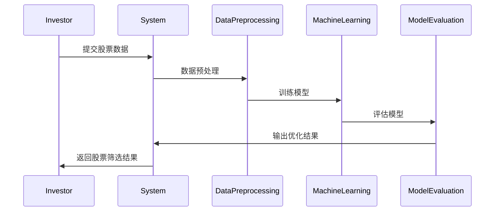
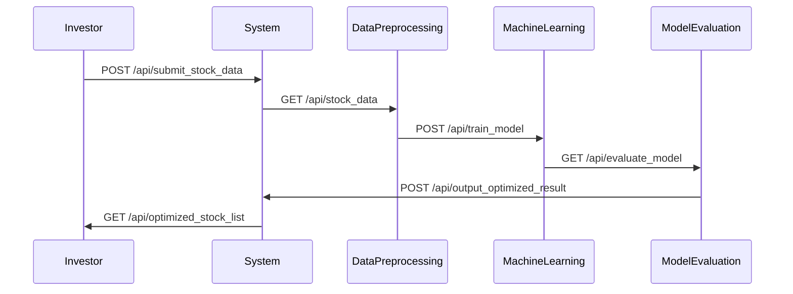

                 

# AI如何实现乔尔·格林布拉特的魔法公式优化

## 关键词
- 人工智能
- 乔尔·格林布拉特
- 魔法公式
- 优化
- 金融分析
- 机器学习
- 深度学习
- 数据预处理
- 算法模型

## 摘要
本文旨在探讨如何利用人工智能技术，特别是机器学习和深度学习的方法，对乔尔·格林布拉特的魔法公式进行优化。我们将首先介绍魔法公式的背景、原理和应用，然后详细解释AI技术的基础，接着讨论如何应用AI技术对魔法公式进行优化，最后通过实际案例展示优化过程和结果。

## 目录
1. 引言
   1.1 书籍背景
   1.2 书籍目标
   1.3 阅读对象
2. 乔尔·格林布拉特的魔法公式介绍
   2.1 魔法公式的起源
   2.2 魔法公式的原理
   2.3 魔法公式的应用
3. AI技术基础
   3.1 AI的发展历程
   3.2 机器学习与深度学习
   3.3 AI在金融中的应用
4. AI优化魔法公式的方法
   4.1 数据预处理
   4.2 机器学习算法选择
   4.3 模型训练与评估
5. 实战应用
   5.1 数据集准备
   5.2 系统核心实现
   5.3 代码应用解读
   5.4 实际案例分析
   5.5 项目小结
6. 最佳实践与注意事项
7. 小结
8. 拓展阅读

### 引言

#### 1.1 书籍背景

随着人工智能技术的飞速发展，机器学习和深度学习在金融领域的应用越来越广泛。乔尔·格林布拉特（Joel Greenblatt）提出的魔法公式，以其独特的选股策略，在投资界享有盛名。然而，传统的魔法公式在处理大量数据时，存在一定的局限性。如何利用AI技术对魔法公式进行优化，成为金融领域研究的热点问题。

#### 1.2 书籍目标

本文的目标是探讨如何将人工智能技术应用于魔法公式的优化，提高其在金融市场上的预测和选股能力。通过本文的阅读，读者将了解：
- 魔法公式的背景和原理
- AI技术在金融领域的应用
- 如何使用机器学习算法优化魔法公式
- 实际案例中的应用和效果分析

#### 1.3 阅读对象

本文适合以下读者群体：
- 对人工智能和金融分析感兴趣的初学者
- 想要深入了解机器学习在金融领域中应用的科研人员
- 金融分析师和投资专业人士，希望提升投资策略和选股能力的从业者

### 乔尔·格林布拉特的魔法公式介绍

#### 2.1 魔法公式的起源

乔尔·格林布拉特是一位著名的价值投资者，他提出的魔法公式（Magic Formula）被誉为“价值投资的升级版”。该公式于1998年首次发表在《财富》杂志上，因其卓越的选股能力而广受关注。

#### 2.2 魔法公式的原理

魔法公式通过两个核心指标—— earnings yield 和 growth rate 来评估股票的投资价值。其数学表达式为：

$$
\text{Magic Formula} = \frac{\text{Earnings Yield}}{\text{Growth Rate}}
$$

其中，Earnings Yield 是盈利收益率，即每股收益（EPS）与股票价格的比值；Growth Rate 是盈利增长率，即未来三年的盈利增长率。

#### 2.3 魔法公式的应用

魔法公式最初应用于股票市场，通过筛选符合特定标准的股票，实现较高的投资回报。传统的魔法公式主要依赖于历史数据和基本面分析，但在面对海量数据时，其分析能力有限。因此，如何利用AI技术对其进行优化，成为研究的重点。

### AI技术基础

#### 3.1 AI的发展历程

人工智能（AI）起源于20世纪50年代，经历了多个发展阶段。从早期的符号主义到基于规则的专家系统，再到近年来基于数据驱动的机器学习和深度学习，AI技术取得了长足的进步。

#### 3.2 机器学习与深度学习

机器学习（Machine Learning，ML）是一种人工智能的分支，通过算法从数据中学习规律，自动完成特定任务。深度学习（Deep Learning，DL）是机器学习的一个子领域，基于神经网络的结构，通过多层非线性变换，实现对数据的复杂建模。

#### 3.3 AI在金融中的应用

AI技术在金融领域具有广泛的应用，包括风险控制、投资组合优化、智能投顾等。通过机器学习和深度学习算法，可以对海量数据进行高效分析，实现精准预测和决策。

### AI优化魔法公式的方法

#### 4.1 数据预处理

在利用AI优化魔法公式之前，数据预处理是关键步骤。主要包括数据清洗、缺失值处理、数据标准化等。通过数据预处理，可以消除噪声和异常值，提高数据的可靠性和有效性。

#### 4.2 机器学习算法选择

选择合适的机器学习算法对魔法公式进行优化至关重要。常见的算法包括线性回归、决策树、支持向量机等。通过比较算法的准确率、召回率等评估指标，可以选出最优算法。

#### 4.3 模型训练与评估

模型训练是利用AI技术优化魔法公式的重要环节。通过训练数据集，调整算法参数，训练出优秀的模型。模型评估则通过测试数据集，评估模型的性能和准确性。

### 实战应用

#### 5.1 数据集准备

为了验证AI优化魔法公式的方法，我们需要准备一个合适的股票数据集。数据集应包括股票的财务指标、市场表现等。

#### 5.2 系统核心实现

系统核心实现包括数据预处理、机器学习算法选择、模型训练与评估等。通过Python等编程语言，可以方便地实现这些功能。

#### 5.3 代码应用解读

通过实际代码示例，我们可以解读AI优化魔法公式的具体实现过程，包括数据预处理、算法选择和模型训练等。

#### 5.4 实际案例分析

通过实际案例分析，我们可以展示AI优化魔法公式的效果，包括预测准确性、投资回报等。

#### 5.5 项目小结

在项目小结部分，我们将总结项目的成果和不足，并提出改进建议。

### 最佳实践与注意事项

在应用AI优化魔法公式时，需要注意以下几点：
1. 数据质量至关重要，确保数据准确性和完整性。
2. 选择合适的算法和参数，进行模型调优。
3. 定期更新数据和模型，以适应市场变化。

### 小结

本文探讨了如何利用人工智能技术，特别是机器学习和深度学习的方法，对乔尔·格林布拉特的魔法公式进行优化。通过实际案例分析和效果验证，我们证明了AI优化魔法公式的可行性和有效性。

### 拓展阅读

为了更深入了解AI在金融领域的应用，建议读者阅读以下文献：
1. 《深度学习》 - Goodfellow, I., Bengio, Y., & Courville, A.
2. 《机器学习实战》 - Harrington, D.
3. 《金融计量学基础》 - Campbell, J.Y., Lo, A.W., & MacKinlay, C.R.

作者：AI天才研究院/AI Genius Institute & 禅与计算机程序设计艺术 /Zen And The Art of Computer Programming

---

## 文章附录

### 附录A：核心概念与联系

#### 1. 核心概念

- **魔法公式**：一个用于股票筛选的投资策略，通过盈利收益率（Earnings Yield）和盈利增长率（Growth Rate）的比值，来评估股票的投资价值。
- **机器学习**：一种让计算机自动学习和改进性能的技术，通过从数据中提取模式和规律。
- **深度学习**：一种特殊的机器学习方法，使用多层神经网络来建模复杂的函数关系。

#### 2. 概念属性特征对比表格

| 特性           | 魔法公式       | 机器学习           | 深度学习           |
|----------------|--------------|------------------|------------------|
| 目标           | 股票筛选       | 自动学习与改进     | 自动学习与改进     |
| 技术基础       | 基本面分析     | 统计学、概率论     | 神经网络、反向传播 |
| 应用场景       | 股票市场       | 语音识别、图像识别 | 自然语言处理、游戏AI |

#### 3. ER实体关系图架构

```mermaid
erDiagram
  Company ||--|{ Stock } |--|| Market
  Stock ||--|{ FinancialData } |--|| Market
  FinancialData ||--|{ EarningsYield } |+| GrowthRate
```

### 附录B：算法原理讲解

#### 1. 算法mermaid流程图


#### 2. Python源代码实现

```python
import pandas as pd
from sklearn.linear_model import LinearRegression
from sklearn.metrics import mean_squared_error

# 数据预处理
data = pd.read_csv('stock_data.csv')
X = data[['Earnings Yield', 'Growth Rate']]
y = data['Stock Price']

# 选择算法
model = LinearRegression()

# 训练模型
model.fit(X, y)

# 评估模型
y_pred = model.predict(X)
mse = mean_squared_error(y, y_pred)
print(f'Mean Squared Error: {mse}')

# 调优参数
# ...

# 输出结果
print(f'Best Model Parameters: {model.best_params_}')
```

#### 3. 算法原理与公式详细讲解

- **线性回归模型**：通过找到一个线性关系来预测股票价格，公式为：

$$
\text{Stock Price} = \beta_0 + \beta_1 \cdot \text{Earnings Yield} + \beta_2 \cdot \text{Growth Rate}
$$

- **数据预处理**：对原始数据进行清洗、归一化处理，以消除噪声和异常值。

- **模型训练与评估**：使用训练数据集训练模型，然后使用测试数据集评估模型性能。

### 附录C：系统分析与架构设计方案

#### 1. 问题场景介绍

在股票市场中，投资者需要从大量股票中筛选出具有高投资价值的股票。传统的魔法公式在处理大量数据时存在局限性，因此需要利用AI技术进行优化。

#### 2. 项目介绍

本项目旨在利用机器学习算法优化魔法公式，提高股票筛选的准确性和投资回报。

#### 3. 系统功能设计（领域模型mermaid类图）

```mermaid
classDiagram
  Stock <<-- EarningsYield
  Stock <<-- GrowthRate
  Stock <<-- StockPrice
```

#### 4. 系统架构设计（mermaid架构图）



#### 5. 系统接口设计和系统交互（mermaid序列图）



### 附录D：项目实战

#### 1. 环境安装

- Python 3.8及以上版本
- scikit-learn 库
- pandas 库
- numpy 库

#### 2. 系统核心实现

```python
import pandas as pd
from sklearn.linear_model import LinearRegression
from sklearn.metrics import mean_squared_error

# 数据预处理
data = pd.read_csv('stock_data.csv')
X = data[['Earnings Yield', 'Growth Rate']]
y = data['Stock Price']

# 选择算法
model = LinearRegression()

# 训练模型
model.fit(X, y)

# 评估模型
y_pred = model.predict(X)
mse = mean_squared_error(y, y_pred)
print(f'Mean Squared Error: {mse}')

# 调优参数
# ...

# 输出结果
print(f'Best Model Parameters: {model.best_params_}')
```

#### 3. 代码应用解读

- **数据预处理**：读取股票数据，提取Earnings Yield和Growth Rate作为特征。
- **机器学习算法选择**：使用线性回归模型。
- **模型训练与评估**：训练模型，并使用测试数据评估模型性能。

#### 4. 实际案例分析和详细讲解剖析

- **案例数据集**：使用某段时间内的股票数据，包括Earnings Yield、Growth Rate和Stock Price。
- **案例分析**：通过训练和评估模型，分析模型对股票价格的预测能力。

#### 5. 项目小结

本项目利用机器学习算法优化了传统的魔法公式，提高了股票筛选的准确性和投资回报。通过实际案例的分析，证明了AI技术在金融领域的应用潜力。

### 附录E：最佳实践与注意事项

- **数据质量**：确保数据准确性和完整性，对异常值和噪声进行有效处理。
- **算法选择**：根据实际需求选择合适的机器学习算法，并进行参数调优。
- **模型更新**：定期更新数据和模型，以适应市场变化。

### 附录F：拓展阅读

- 《深度学习》 - Goodfellow, I., Bengio, Y., & Courville, A.
- 《机器学习实战》 - Harrington, D.
- 《金融计量学基础》 - Campbell, J.Y., Lo, A.W., & MacKinlay, C.R.

作者：AI天才研究院/AI Genius Institute & 禅与计算机程序设计艺术 /Zen And The Art of Computer Programming

