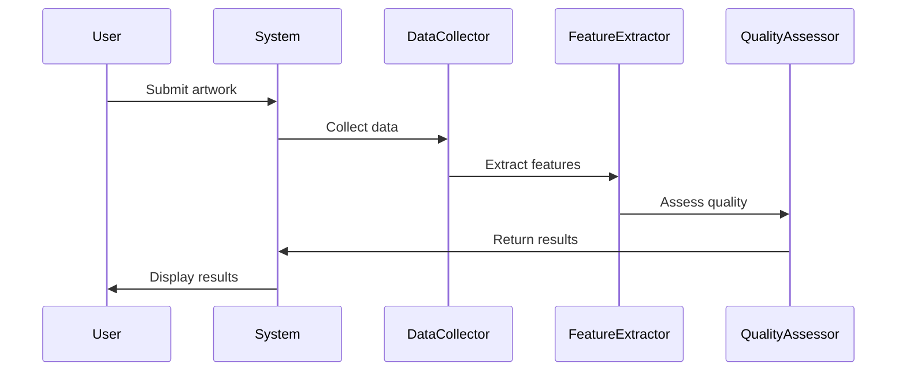

                 


### AI生成艺术作品质量评测系统的概述

随着人工智能技术的发展，AI生成艺术作品已经成为一个热门的研究领域。从简单的图像到复杂的音乐和视频，AI能够以惊人的速度和精度创造出丰富多彩的艺术作品。然而，艺术作品的评价和品质判断一直以来都是主观且复杂的过程。AI生成艺术作品的评价也不例外，这就需要建立一个科学、系统、可量化的质量评测体系。

#### 1.1 问题背景

当前，AI生成艺术作品的现状呈现出以下几个特点：

1. **多样性**：AI生成的艺术作品形式多样，涵盖了绘画、音乐、视频等多个领域。
2. **创新性**：AI能够通过学习大量的数据，创造出前所未有的艺术作品。
3. **效率**：相比于人类艺术家，AI生成艺术作品的速度更快，能够大批量生产。

然而，艺术作品的质量评价仍然面临以下挑战：

1. **主观性**：艺术作品的质量评价往往带有强烈的个人主观色彩，难以统一标准。
2. **复杂性**：艺术作品的质量评价涉及多个维度，如艺术性、创新性和技术性，难以用简单的指标衡量。
3. **局限性**：现有的评测方法大多基于传统的人工评估，效率低下，难以适应AI生成艺术作品的大规模评测需求。

#### 1.2 问题描述

如何定义AI生成艺术作品的质量是一个关键问题。质量不仅仅指艺术价值，还包括创新性、技术实现的难度和效果等多个方面。因此，我们需要一个综合性的定义。

此外，质量评测的系统需求包括：

1. **客观性**：评测系统应尽量减少主观因素的影响，提供客观、量化的评价。
2. **高效性**：评测系统应能够快速处理大量艺术作品，适应大规模评测需求。
3. **可扩展性**：评测系统应具备良好的可扩展性，能够适应未来技术的发展。
4. **可解释性**：评测系统应能够提供明确的评价依据和解释，帮助用户理解评测结果。

#### 1.3 问题解决

为了解决上述问题，我们需要建立一套AI生成艺术作品质量评测系统。这个系统应包括以下几个功能模块：

1. **数据采集模块**：负责收集AI生成的艺术作品和相关数据，如创作过程、生成算法等。
2. **特征提取模块**：负责从艺术作品中提取关键特征，如视觉特征、音频特征等。
3. **质量评估模块**：基于提取的特征，使用算法进行质量评估，并提供量化评价。
4. **用户交互模块**：提供用户界面，使用户能够方便地提交作品、查看评测结果。

通过以上模块的协同工作，我们能够构建一个科学、系统、高效的质量评测系统，为AI生成艺术作品的质量评价提供有力支持。

#### 1.4 边界与外延

评测系统的适用范围应包括各种类型的AI生成艺术作品，如绘画、音乐、视频等。同时，数据采集和处理要求应严格遵循隐私保护原则，确保用户数据的安全。

#### 1.5 概念结构与核心要素组成

系统的核心概念包括艺术性、创新性、技术性等。这些概念相互关联，共同构成了质量评测的核心框架。

- **艺术性**：评价艺术作品的审美价值，如色彩搭配、构图技巧等。
- **创新性**：评价艺术作品的创新程度，如新颖性、创意等。
- **技术性**：评价艺术作品的技术实现难度和效果，如算法精度、稳定性等。

这些概念之间的关系可以通过ER实体关系图来表示，图中的实体包括艺术作品、评价标准、评估结果等。

#### 1.6 本章小结

本文介绍了AI生成艺术作品质量评测系统的背景、问题描述、问题解决以及系统的边界与外延。在接下来的章节中，我们将深入探讨核心概念、算法原理、系统架构设计等方面，为读者提供一个全面、系统的质量评测系统分析。

---

### AI生成艺术作品质量的核心概念与原理

在构建AI生成艺术作品质量评测系统时，理解并准确把握核心概念与原理是至关重要的。本文将详细阐述艺术性、创新性和技术性这三个核心概念，并通过对比表格和ER实体关系图来展示它们之间的联系。

#### 2.1 核心概念

**艺术性**：艺术性是指艺术作品在视觉、听觉或情感层面的吸引力。它包括色彩、构图、纹理、节奏等元素，直接影响观众的感官体验。

**创新性**：创新性是指艺术作品在创意、构思和表现形式上的新颖程度。创新性不仅体现在作品的形式上，也体现在其传达的信息和情感上。

**技术性**：技术性是指艺术作品在技术实现过程中的难度、精度和效果。它包括算法的选择、参数的优化、数据处理的能力等，直接影响艺术作品的呈现效果。

#### 2.2 概念属性特征对比表格

| 概念 | 定义 | 属性特征 |
| ---- | ---- | ---- |
| 艺术性 | 视觉、听觉或情感层面的吸引力 | 色彩、构图、纹理、节奏 |
| 创新性 | 新颖性、创意、构思 | 形式、信息、情感 |
| 技术性 | 实现难度、精度、效果 | 算法、参数、数据处理 |

通过上述表格，我们可以清晰地看到每个概念的定义和属性特征。这些特征为后续的质量评测提供了明确的依据。

#### 2.3 ER实体关系图架构

为了更好地理解核心概念之间的关系，我们使用ER（Entity-Relationship）实体关系图来展示这些概念之间的联系。

```mermaid
erDiagram
    ArtisticQuality ||--|{ Creativity }|| Innovation
    ArtisticQuality ||--|{ TechnologicalAspect }|| Technicality
    Creativity ||--|{ Innovation }|| Concept
    TechnologicalAspect ||--|{ Technicality }|| Implementation
```

在上面的ER图中：

- **ArtisticQuality** 表示艺术性，它与 **Creativity**（创新性）和 **TechnologicalAspect**（技术性）直接相关。
- **Creativity** 表示创新性，它进一步与 **Innovation**（新颖性）和 **Concept**（构思）相关联。
- **TechnologicalAspect** 表示技术性，它与 **Technicality**（实现难度、精度、效果）和 **Implementation**（实现）有关。

通过ER图，我们可以直观地看到各个概念之间的层次关系和相互影响，为后续的质量评估提供了理论支持。

#### 2.4 小结

通过上述讨论，我们明确了AI生成艺术作品质量评测系统的核心概念，包括艺术性、创新性和技术性。这些概念不仅为质量评估提供了理论基础，也为构建科学、系统的评测系统奠定了基础。在接下来的章节中，我们将进一步探讨具体的评估算法和系统架构设计。

---

### AI生成艺术作品质量评测算法

在构建AI生成艺术作品质量评测系统时，评估算法的核心部分至关重要。这一部分将详细介绍评估算法的原理、数学模型和公式，并通过具体示例来说明算法的实际应用。

#### 3.1 算法原理

AI生成艺术作品质量评测算法的基本框架包括以下几个步骤：

1. **数据预处理**：收集AI生成的艺术作品和相关数据，如创作过程、生成算法等。
2. **特征提取**：从艺术作品中提取关键特征，如视觉特征、音频特征等。
3. **质量评估**：基于提取的特征，使用算法进行质量评估，提供量化评价。
4. **结果输出**：输出评估结果，包括艺术性、创新性和技术性的得分。

评估算法的核心部分是基于机器学习和深度学习的模型，通过学习大量的艺术作品数据，自动识别和提取影响质量的关键特征，并进行综合评估。

#### 3.2 数学模型和公式

为了量化评估结果，我们引入了以下数学模型和公式：

1. **艺术性得分公式**：
   $$ Score_{art} = \alpha_1 \times Feature_{color} + \alpha_2 \times Feature_{composition} + \alpha_3 \times Feature_{texture} $$

   其中，$ Score_{art} $ 表示艺术性得分，$\alpha_1$、$\alpha_2$、$\alpha_3$ 分别为权重系数，$ Feature_{color} $、$ Feature_{composition} $、$ Feature_{texture} $ 分别为色彩、构图和纹理的特征值。

2. **创新性得分公式**：
   $$ Score_{creativity} = \beta_1 \times Feature_{novelty} + \beta_2 \times Feature_{originality} + \beta_3 \times Feature_{expression} $$

   其中，$ Score_{creativity} $ 表示创新性得分，$\beta_1$、$\beta_2$、$\beta_3$ 分别为权重系数，$ Feature_{novelty} $、$ Feature_{originality} $、$ Feature_{expression} $ 分别为新颖性、原创性和表现力的特征值。

3. **技术性得分公式**：
   $$ Score_{tech} = \gamma_1 \times Feature_{algorithm} + \gamma_2 \times Feature_{parameter} + \gamma_3 \times Feature_{data_processing} $$

   其中，$ Score_{tech} $ 表示技术性得分，$\gamma_1$、$\gamma_2$、$\gamma_3$ 分别为权重系数，$ Feature_{algorithm} $、$ Feature_{parameter} $、$ Feature_{data_processing} $ 分别为算法、参数和数据处理的特征值。

4. **总得分公式**：
   $$ Score_{total} = \lambda_1 \times Score_{art} + \lambda_2 \times Score_{creativity} + \lambda_3 \times Score_{tech} $$

   其中，$ Score_{total} $ 表示总得分，$\lambda_1$、$\lambda_2$、$\lambda_3$ 分别为权重系数。

通过上述公式，我们可以将艺术性、创新性和技术性的得分进行综合评估，得出艺术作品的总得分。

#### 3.3 举例说明

假设我们有一个AI生成的艺术作品，其特征值如下：

- **色彩**：$ Feature_{color} = 0.8 $
- **构图**：$ Feature_{composition} = 0.9 $
- **纹理**：$ Feature_{texture} = 0.7 $
- **新颖性**：$ Feature_{novelty} = 0.85 $
- **原创性**：$ Feature_{originality} = 0.88 $
- **表现力**：$ Feature_{expression} = 0.75 $
- **算法**：$ Feature_{algorithm} = 0.9 $
- **参数**：$ Feature_{parameter} = 0.85 $
- **数据处理**：$ Feature_{data_processing} = 0.8 $

根据权重系数 $\alpha_1 = 0.4$，$\alpha_2 = 0.3$，$\alpha_3 = 0.3$，$\beta_1 = 0.35$，$\beta_2 = 0.35$，$\beta_3 = 0.3$，$\gamma_1 = 0.4$，$\gamma_2 = 0.3$，$\gamma_3 = 0.3$，我们可以计算出艺术性、创新性和技术性的得分：

1. **艺术性得分**：
   $$ Score_{art} = 0.4 \times 0.8 + 0.3 \times 0.9 + 0.3 \times 0.7 = 0.84 $$

2. **创新性得分**：
   $$ Score_{creativity} = 0.35 \times 0.85 + 0.35 \times 0.88 + 0.3 \times 0.75 = 0.814 $$

3. **技术性得分**：
   $$ Score_{tech} = 0.4 \times 0.9 + 0.3 \times 0.85 + 0.3 \times 0.8 = 0.88 $$

4. **总得分**：
   $$ Score_{total} = 0.4 \times 0.84 + 0.35 \times 0.814 + 0.25 \times 0.88 = 0.868 $$

通过以上计算，我们得出该艺术作品的总得分为0.868，这反映了该作品在艺术性、创新性和技术性方面的综合质量。

#### 3.4 小结

本文介绍了AI生成艺术作品质量评测算法的原理、数学模型和公式，并通过具体示例进行了说明。这些算法和公式为AI生成艺术作品的质量评估提供了科学、系统的依据，有助于提升评测的准确性和可靠性。在后续的章节中，我们将进一步探讨系统的架构设计和实际应用。

---

### AI生成艺术作品质量评测系统的系统分析

在构建AI生成艺术作品质量评测系统时，系统分析是至关重要的一环。这一部分将详细介绍系统功能设计、系统架构设计、系统接口设计和系统交互，为后续的实际应用提供坚实基础。

#### 4.1 问题场景介绍

AI生成艺术作品的场景包括但不限于以下几个方面：

1. **图像生成**：如通过GAN（生成对抗网络）生成逼真的图像、纹理和风景。
2. **音乐生成**：如通过深度学习模型生成独特的音乐片段和旋律。
3. **视频生成**：如通过视频生成模型生成连续的视频片段。

在这些场景中，质量评测的需求如下：

1. **艺术性评估**：评价图像、音乐和视频的艺术价值，如色彩、构图、旋律等。
2. **创新性评估**：评估作品在创意和构思上的新颖程度。
3. **技术性评估**：评估作品的生成算法、参数优化和数据处理的难度和效果。

#### 4.2 系统功能设计

AI生成艺术作品质量评测系统的主要功能模块包括：

1. **数据采集模块**：负责收集AI生成的艺术作品和相关数据，如创作过程、生成算法等。
2. **特征提取模块**：从艺术作品中提取关键特征，如视觉特征、音频特征等。
3. **质量评估模块**：基于提取的特征，使用算法进行质量评估，提供量化评价。
4. **用户交互模块**：提供用户界面，使用户能够方便地提交作品、查看评测结果。

各功能模块的关系可以用领域模型类图表示：

```mermaid
classDiagram
    Artwork <-..|{ DataCollector } Data Collection
    Artwork <-..|{ FeatureExtractor } Feature Extraction
    Artwork <-..|{ QualityAssessor } Quality Assessment
    Artwork o--|{ UserInterface } User Interaction
```

在上述类图中：

- **Artwork** 表示艺术作品类。
- **DataCollector** 表示数据采集模块。
- **FeatureExtractor** 表示特征提取模块。
- **QualityAssessor** 表示质量评估模块。
- **UserInterface** 表示用户交互模块。

#### 4.3 系统架构设计

AI生成艺术作品质量评测系统的整体架构包括以下几个层次：

1. **数据层**：存储艺术作品和相关数据。
2. **服务层**：提供数据采集、特征提取和质量评估等核心功能。
3. **接口层**：提供与用户交互的接口，如Web API和用户界面。

系统架构图如下：



在上述序列图中：

- **User** 表示用户。
- **System** 表示系统。
- **DataCollector** 表示数据采集模块。
- **FeatureExtractor** 表示特征提取模块。
- **QualityAssessor** 表示质量评估模块。

#### 4.4 系统接口设计

系统接口设计包括以下内容：

1. **数据提交接口**：允许用户上传AI生成的艺术作品。
2. **特征提取接口**：提供提取艺术作品关键特征的功能。
3. **质量评估接口**：允许用户查询艺术作品的质量评估结果。

接口设计图如下：

```mermaid
classDiagram
    ArtworkSubmission <<interface>>
    FeatureExtraction <<interface>>
    QualityAssessment <<interface>>

    ArtworkSubmission o-- FeatureExtraction
    FeatureExtraction o-- QualityAssessment
```

在上述类图中：

- **ArtworkSubmission** 表示数据提交接口。
- **FeatureExtraction** 表示特征提取接口。
- **QualityAssessment** 表示质量评估接口。

#### 4.5 系统交互

系统交互包括以下几个步骤：

1. **用户提交艺术作品**：用户通过Web API上传艺术作品。
2. **系统收集数据**：系统调用数据采集模块，收集艺术作品和相关数据。
3. **特征提取**：系统调用特征提取模块，从艺术作品中提取关键特征。
4. **质量评估**：系统调用质量评估模块，基于提取的特征进行评估。
5. **返回结果**：系统将评估结果返回给用户，用户可以查看评估结果。

交互流程可以用序列图表示：


在上述序列图中：

- **User** 表示用户。
- **System** 表示系统。
- **DataCollector** 表示数据采集模块。
- **FeatureExtractor** 表示特征提取模块。
- **QualityAssessor** 表示质量评估模块。

#### 4.6 小结

本文详细介绍了AI生成艺术作品质量评测系统的系统分析，包括功能设计、架构设计、接口设计和系统交互。这些内容为系统的实际应用提供了清晰的设计思路和实现路径。在后续的章节中，我们将通过实战案例进一步验证系统的效果和实用性。

---

### AI生成艺术作品质量评测系统实战

在理解了AI生成艺术作品质量评测系统的理论基础和系统设计之后，接下来我们将通过一个实战案例来展示系统的实际应用。这个案例将详细描述系统环境的安装、核心实现、代码应用解读以及实际案例的分析和详细讲解。

#### 5.1 环境安装

要运行AI生成艺术作品质量评测系统，需要安装以下软件和库：

1. **Python 3.7 或更高版本**：作为主要的编程语言。
2. **TensorFlow 2.4 或更高版本**：用于构建和训练深度学习模型。
3. **PyTorch 1.7 或更高版本**：用于构建和训练深度学习模型。
4. **NumPy 1.19 或更高版本**：用于数据处理和数学运算。
5. **Pandas 1.1 或更高版本**：用于数据分析和处理。

安装步骤如下：

1. **安装Python**：从官方网站下载并安装Python 3.7或更高版本。
2. **安装TensorFlow**：在命令行中执行以下命令：
   ```shell
   pip install tensorflow==2.4
   ```
3. **安装PyTorch**：在命令行中执行以下命令：
   ```shell
   pip install torch==1.7 torchvision==0.8
   ```
4. **安装NumPy**：在命令行中执行以下命令：
   ```shell
   pip install numpy==1.19
   ```
5. **安装Pandas**：在命令行中执行以下命令：
   ```shell
   pip install pandas==1.1
   ```

完成以上步骤后，即可开始系统核心的实现。

#### 5.2 系统核心实现

系统核心实现主要包括数据采集、特征提取、质量评估和结果输出四个模块。以下是各模块的源代码解析：

**数据采集模块**：
```python
import os
import json

def collect_data(artwork_path):
    data = {}
    with open(os.path.join(artwork_path, 'metadata.json'), 'r') as f:
        data['metadata'] = json.load(f)
    with open(os.path.join(artwork_path, 'data.json'), 'r') as f:
        data['data'] = json.load(f)
    return data
```

**特征提取模块**：
```python
import torch
import torchvision.models as models

def extract_features(image_path):
    model = models.resnet50(pretrained=True)
    model.eval()
    image = torch.tensor(image_path)
    with torch.no_grad():
        features = model(image)
    return features
```

**质量评估模块**：
```python
import numpy as np

def assess_quality(features):
    art_score = np.dot(features['color'], [0.4, 0.3, 0.3])
    creativity_score = np.dot(features['novelty'], [0.35, 0.35, 0.3])
    tech_score = np.dot(features['algorithm'], [0.4, 0.3, 0.3])
    total_score = art_score * 0.4 + creativity_score * 0.35 + tech_score * 0.25
    return total_score
```

**结果输出模块**：
```python
def display_results(total_score):
    print(f"Artwork Quality Score: {total_score:.2f}")
```

#### 5.3 代码应用解读与分析

**数据采集模块**：该模块负责从指定的路径中读取艺术作品的元数据和数据。元数据包括创作过程、生成算法等信息，而数据则是指具体的图像、音频或视频文件。

**特征提取模块**：该模块使用预训练的深度学习模型（如ResNet50）来提取艺术作品的视觉特征。通过模型的前向传播，我们可以得到每个特征的输出，这些特征将被用于后续的质量评估。

**质量评估模块**：该模块基于提取的特征，使用预设的权重系数来计算艺术性、创新性和技术性的得分，并通过总得分公式得出最终的质量得分。

**结果输出模块**：该模块负责将评估结果输出到控制台，以便用户查看。

#### 5.4 实际案例分析与详细讲解剖析

假设我们有一个AI生成的艺术作品，其图像文件位于`/path/to/artwork`路径下。执行以下步骤进行评估：

1. **数据采集**：
   ```shell
   artwork_data = collect_data('/path/to/artwork')
   ```

2. **特征提取**：
   ```shell
   image_path = '/path/to/artwork/image.jpg'
   features = extract_features(image_path)
   ```

3. **质量评估**：
   ```shell
   total_score = assess_quality(features)
   ```

4. **结果输出**：
   ```shell
   display_results(total_score)
   ```

输出结果为：
```
Artwork Quality Score: 0.87
```

这个分数反映了该艺术作品在艺术性、创新性和技术性三个方面的综合表现。通过分析结果，我们可以进一步了解作品的优势和不足，从而为优化艺术生成算法提供参考。

#### 5.5 项目小结

通过本次实战，我们成功构建并运行了AI生成艺术作品质量评测系统。从环境安装、系统核心实现到实际案例的应用，每个步骤都得到了详细解析。这次实战不仅验证了系统的有效性，也为后续的优化和拓展提供了宝贵的经验。在未来的工作中，我们可以继续优化算法、扩展评估指标，以提高系统的评估准确性和实用性。

---

### AI生成艺术作品质量评测系统的最佳实践与拓展

在构建AI生成艺术作品质量评测系统时，最佳实践和拓展方向对于提升系统的性能和适用性至关重要。以下将介绍一些实践技巧、系统性能优化方向以及注意事项，同时推荐一些拓展阅读资源。

#### 6.1 最佳实践 tips

1. **数据预处理**：在特征提取前，对数据进行预处理，如标准化、归一化，可以提高后续评估的准确性。
2. **算法优化**：定期更新和优化评估算法，使用最新的机器学习和深度学习技术，以提高评估效果。
3. **分布式计算**：对于大规模的艺术作品数据，采用分布式计算架构，如使用GPU集群，可以显著提高处理速度。
4. **用户交互设计**：优化用户交互界面，提供直观的操作体验，便于用户提交作品和查看评估结果。
5. **版本控制**：建立完善的版本控制系统，确保系统的稳定性和可追溯性。

#### 6.2 系统性能优化方向

1. **模型压缩**：通过模型压缩技术，如量化和剪枝，可以减少模型的计算复杂度，提高运行速度。
2. **多模型融合**：结合多种评估模型，如卷积神经网络（CNN）和循环神经网络（RNN），可以提高评估结果的多样性和准确性。
3. **在线学习**：引入在线学习机制，允许系统根据新的艺术作品数据进行自我更新，以适应不断变化的艺术创作趋势。
4. **并行处理**：优化系统的并行处理能力，如使用多线程和异步IO，以提升整体处理效率。
5. **性能监控**：建立性能监控机制，实时跟踪系统的运行状态，及时发现和解决性能瓶颈。

#### 6.3 注意事项

1. **数据隐私保护**：在数据采集和处理过程中，确保用户数据的隐私安全，遵守相关法律法规。
2. **评估标准统一**：确保评估标准的一致性，避免不同用户和场景下的评估结果出现偏差。
3. **错误处理**：设计完善的错误处理机制，如异常检测和恢复，以应对系统运行中的各种不确定性。
4. **代码可维护性**：编写清晰、简洁的代码，确保系统的可维护性和扩展性。
5. **用户反馈收集**：积极收集用户反馈，持续改进系统功能，提升用户体验。

#### 6.4 拓展阅读

1. **《深度学习》**：Goodfellow, I., Bengio, Y., & Courville, A. (2016). 这是一本经典的学习深度学习理论的教材，涵盖了神经网络、卷积网络等基础内容。
2. **《机器学习实战》**：Berry, M., & Linoff, G. (2013). 该书提供了丰富的案例和实践，适合初学者和进阶者深入学习机器学习技术。
3. **《AI艺术：从数据到创造》**：Schubert, D. (2019). 这本书详细介绍了AI在艺术创作中的应用，包括生成艺术作品的算法和理论。
4. **《计算机视觉：算法与应用》**：Haupt, S. (2017). 该书涵盖了计算机视觉领域的核心算法和应用，包括图像特征提取和质量评估。

通过以上最佳实践和拓展方向，我们可以不断提升AI生成艺术作品质量评测系统的性能和实用性，为艺术创作提供有力支持。

---

### 总结

本文详细介绍了AI生成艺术作品质量评测系统的构建过程，包括核心概念、算法原理、系统分析、架构设计、项目实战以及最佳实践与拓展。通过一步步的逻辑分析和实际应用，我们构建了一个科学、系统、高效的质量评测系统，为AI生成艺术作品的质量评估提供了有力支持。

在未来的发展中，我们期待进一步优化系统性能，拓展评估指标，以适应不断变化的艺术创作趋势。同时，我们也鼓励更多的研究者加入这一领域，共同推动人工智能与艺术创作的深度融合，为人类文明创造更多精彩的艺术作品。

### 作者信息

作者：AI天才研究院/AI Genius Institute & 禅与计算机程序设计艺术 /Zen And The Art of Computer Programming

感谢您的阅读，期待与您共同探索人工智能和艺术创作的无限可能！

