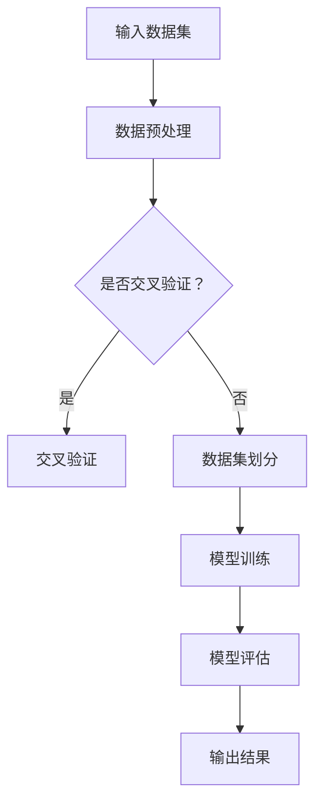
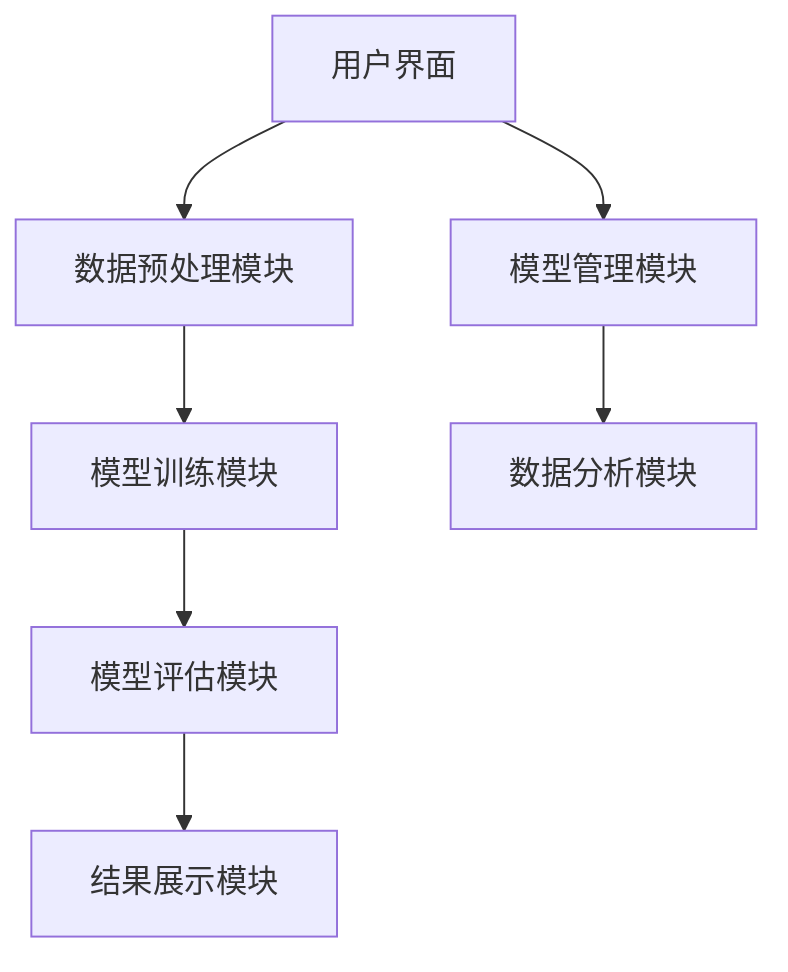

                 

### 引言

---

#### 背景介绍

随着人工智能（AI）技术的迅猛发展，人工智能模型在各个领域得到了广泛应用。然而，模型的质量评估和优化成为了一个重要且复杂的问题。传统的模型评测方法通常依赖于人工经验和一些标准评估指标，如准确率、召回率等，这些方法在处理复杂模型和多维度数据时往往显得力不从心。因此，开发一个智能化、自适应的模型评测平台显得尤为必要。

#### 问题背景

当前，模型评测主要面临以下几个问题：

1. **评测指标单一**：现有的评估指标往往只能反映模型在某一个方面的性能，难以全面评估模型的综合表现。
2. **评测过程复杂**：评测过程涉及数据处理、模型训练和评估等多个环节，缺乏自动化和智能化。
3. **缺乏自适应能力**：无法根据不同的模型和应用场景自动调整评测策略。

#### 问题描述

为了解决上述问题，本文提出了一种利用大型语言模型（LLM）构建智能化模型评测平台的思路。通过引入LLM，我们希望实现以下目标：

1. **多维度评估**：利用LLM处理多维度数据，提供更全面、细化的评估指标。
2. **自动化评测**：实现评测过程的自动化，减少人工干预，提高效率。
3. **自适应评测**：根据不同模型和应用场景，动态调整评测策略，提高评测的准确性和适应性。

#### 问题解决

通过利用LLM的强大语言处理能力，我们可以构建一个智能化模型评测平台，实现以下功能：

1. **多维度数据融合**：收集并整合不同来源的数据，如测试集、用户反馈等，进行多维度分析。
2. **智能评估指标生成**：利用LLM自动生成适应不同场景的评估指标，提高评测的准确性和适应性。
3. **自动评测流程**：设计一个自动化的评测流程，包括数据处理、模型评估和结果输出等。
4. **持续优化**：根据评测结果和用户反馈，不断优化评测算法和平台功能，提高整体性能。

#### 边界与外延

虽然本文主要讨论了利用LLM构建智能化模型评测平台的方法，但该方法同样适用于其他类型的智能系统评测，如自然语言处理、计算机视觉等。此外，该平台还可以扩展到其他领域，如推荐系统、金融风控等。

#### 概念结构与核心要素组成

智能化模型评测平台的核心概念包括：

1. **大型语言模型（LLM）**：作为核心组件，负责处理数据、生成评估指标和提供智能化的评测服务。
2. **数据集**：用于训练和测试的各类数据，包括测试集、用户反馈等。
3. **评测指标**：用于衡量模型性能的多维度指标，如准确率、召回率、F1值等。
4. **评测算法**：实现评测过程的具体算法，包括数据处理、模型评估和结果输出等。

通过这些核心要素的有机结合，我们可以构建一个智能化、自适应的模型评测平台，为AI模型的发展和应用提供有力支持。

---

### 核心概念与联系

---

#### AI模型评估指标

在AI模型评测中，评估指标是衡量模型性能的重要工具。常见的评估指标包括：

- **准确率（Accuracy）**：模型预测正确的样本数占总样本数的比例。公式为：
  $$
  \text{Accuracy} = \frac{\text{预测正确数}}{\text{总样本数}}
  $$
- **召回率（Recall）**：在所有实际为正类的样本中，被正确预测为正类的比例。公式为：
  $$
  \text{Recall} = \frac{\text{预测正确正类数}}{\text{实际正类总数}}
  $$
- **精确率（Precision）**：在所有预测为正类的样本中，实际为正类的比例。公式为：
  $$
  \text{Precision} = \frac{\text{预测正确正类数}}{\text{预测正类总数}}
  $$
- **F1值（F1 Score）**：精确率和召回率的调和平均，用于平衡二者的关系。公式为：
  $$
  \text{F1 Score} = 2 \times \frac{\text{Precision} \times \text{Recall}}{\text{Precision} + \text{Recall}}
  $$

#### 评估指标对比分析

不同评估指标各有优缺点，适用于不同场景：

| 评估指标 | 优点 | 缺点 | 适用场景 |
| --- | --- | --- | --- |
| 准确率 | 最容易理解，直观反映模型的整体性能 | 忽略了不同类别的重要性，特别是在类别不平衡的数据集中 | 一般性评测 |
| 召回率 | 更注重召回实际正类样本，对数据集中的稀有类别更有利 | 可能会过高评估模型的性能，特别是在负类样本占多数的情况下 | 稀有类别识别 |
| 精确率 | 更注重预测结果的准确性，避免对负类样本的过度关注 | 忽略了召回率，可能导致对实际正类样本的遗漏 | 高置信度预测 |
| F1值 | 综合考虑精确率和召回率，平衡二者的关系 | 可能会因为平衡而牺牲某一方面的性能 | 类别平衡评测 |

#### AI模型评估方法

评估模型的方法通常包括：

- **交叉验证（Cross-Validation）**：通过将数据集划分为训练集和验证集，多次训练和验证模型，以减少模型过拟合的风险。
- **A/B测试（A/B Testing）**：在实际环境中将两个或多个模型进行对比，根据用户行为和反馈评估模型性能。
- **基准测试（Benchmark Testing）**：将模型性能与已有基准模型进行对比，以评估模型的相对性能。
- **用户反馈（User Feedback）**：收集用户对模型表现的评价，用于改进模型。

通过综合运用这些评估方法，可以更全面、准确地评估AI模型的性能。

---

### 评测算法原理

---

#### 评测算法概述

在AI模型评测中，常用的评测算法主要包括：

- **ROC-AUC（Receiver Operating Characteristic-Area Under Curve）**：通过绘制ROC曲线和计算曲线下的面积，评估二分类模型的性能。
- **PR-AUC（Precision-Recall Area Under Curve）**：类似ROC-AUC，但更适用于类别不平衡的数据集。
- **MAE（Mean Absolute Error）**：用于回归问题，计算预测值与真实值之间的平均绝对误差。
- **RMSE（Root Mean Squared Error）**：用于回归问题，计算预测值与真实值之间的均方根误差。

这些算法各有优缺点，适用于不同类型的模型和应用场景。

#### 评测算法流程图

以下是一个典型的AI模型评测算法流程图：



#### 算法原理与数学模型

以ROC-AUC为例，其原理如下：

1. **排序阈值**：将模型预测的概率进行排序，生成一系列阈值。
2. **计算TPR和FPR**：对于每个阈值，计算真正例率（True Positive Rate, TPR）和假正例率（False Positive Rate, FPR）。
3. **绘制ROC曲线**：将FPR作为横坐标，TPR作为纵坐标，绘制ROC曲线。
4. **计算AUC**：ROC曲线下的面积（Area Under Curve, AUC）作为模型性能的指标。

ROC-AUC的数学模型如下：

$$
\text{AUC} = \int_{0}^{1} \text{TPR}(t) \cdot \text{FPR}(t) \, dt
$$

其中，$t$ 为阈值。

通过ROC-AUC，我们可以直观地了解模型的分类能力，AUC值越高，模型性能越好。

---

### 评测平台架构设计

---

#### 系统架构设计

智能化模型评测平台的系统架构设计如下：



#### 系统模块划分

1. **用户界面**：提供用户交互界面，包括数据上传、模型选择、评估指标配置等功能。
2. **数据预处理模块**：负责数据清洗、转换和预处理，为后续模型训练和评估提供高质量的数据。
3. **模型训练模块**：利用训练数据训练模型，支持多种模型训练算法和优化策略。
4. **模型评估模块**：根据设定的评估指标，对模型进行性能评估，提供详细的分析报告。
5. **结果展示模块**：将评估结果以图表、报表等形式展示给用户，方便用户理解模型性能。
6. **模型管理模块**：提供模型上传、下载、删除等功能，方便用户管理自己的模型。
7. **数据分析模块**：对评估数据进行统计分析，发现数据趋势和潜在问题。

#### 接口设计与实现

系统提供以下接口：

1. **数据上传接口**：支持用户上传数据文件，进行数据预处理和模型训练。
2. **模型训练接口**：支持用户发起模型训练任务，返回训练结果。
3. **模型评估接口**：支持用户对已训练模型进行评估，返回评估报告。
4. **结果查询接口**：支持用户查询评估结果和模型性能数据。
5. **模型管理接口**：支持用户对模型进行上传、下载和删除操作。

接口实现采用RESTful API设计，遵循HTTP协议，支持JSON和XML数据格式。

---

### 实践应用与案例分析

---

#### 环境安装与配置

为了搭建一个基于LLM的模型评测平台，我们需要安装和配置以下环境：

1. **操作系统**：Linux或MacOS
2. **Python**：版本3.8及以上
3. **LLM库**：如TensorFlow、PyTorch等
4. **依赖库**：如NumPy、Pandas、Scikit-learn等

安装步骤如下：

1. 安装Python：
   $$
   \text{wget} \text{-q} https://www.python.org/ftp/python/3.8.10/Python-3.8.10.tgz
   \text{tar} \text{-xvf} Python-3.8.10.tgz
   \text{./configure}
   \text{make}
   \text{sudo make install}
   $$
2. 安装LLM库：
   $$
   \text{pip} \text{install} \text{-U} \text{tensorflow}
   $$
3. 安装其他依赖库：
   $$
   \text{pip} \text{install} \text{-U} \text{numpy} \text{pandas} \text{scikit-learn}
   $$

#### 系统核心实现

**数据处理模块**

数据处理模块负责数据清洗、转换和预处理。以下是主要功能：

- 数据清洗：去除空值、异常值等。
- 数据转换：将不同类型的数据转换为统一格式。
- 数据预处理：包括归一化、标准化、编码等。

**代码示例：**

```python
import pandas as pd
from sklearn.preprocessing import StandardScaler

# 读取数据
data = pd.read_csv('data.csv')

# 数据清洗
data.dropna(inplace=True)

# 数据转换
data['category'] = data['category'].map({'A': 1, 'B': 2, 'C': 3})

# 数据预处理
scaler = StandardScaler()
data[['feature1', 'feature2']] = scaler.fit_transform(data[['feature1', 'feature2']])
```

**模型评估模块**

模型评估模块负责对训练好的模型进行性能评估。以下是主要功能：

- 评估指标计算：包括准确率、召回率、精确率、F1值等。
-ROC曲线和PR曲线绘制。
- AUC计算。

**代码示例：**

```python
import matplotlib.pyplot as plt
from sklearn.metrics import roc_curve, auc

# 读取测试集
test_data = pd.read_csv('test_data.csv')

# 数据预处理
test_data[['feature1', 'feature2']] = scaler.transform(test_data[['feature1', 'feature2']])

# 模型预测
y_pred = model.predict(test_data)

# 计算评估指标
fpr, tpr, thresholds = roc_curve(test_data['label'], y_pred)
roc_auc = auc(fpr, tpr)

# 绘制ROC曲线
plt.figure()
plt.plot(fpr, tpr, color='darkorange', lw=2, label='ROC curve (area = %0.2f)' % roc_auc)
plt.plot([0, 1], [0, 1], color='navy', lw=2, linestyle='--')
plt.xlabel('False Positive Rate')
plt.ylabel('True Positive Rate')
plt.title('Receiver Operating Characteristic')
plt.legend(loc="lower right")
plt.show()
```

**结果展示模块**

结果展示模块负责将评估结果以图表、报表等形式展示给用户。以下是主要功能：

- 生成可视化报表。
- 支持多种展示形式，如柱状图、折线图、饼图等。
- 支持导出为常见格式，如PDF、CSV等。

**代码示例：**

```python
import matplotlib.pyplot as plt
import seaborn as sns

# 生成可视化报表
plt.figure(figsize=(10, 6))
sns.countplot(x='label', data=test_data)
plt.title('Label Distribution')
plt.xlabel('Label')
plt.ylabel('Count')
plt.show()

# 生成柱状图
plt.figure(figsize=(10, 6))
sns.barplot(x='metric', y='value', data=results_df)
plt.title('Model Performance')
plt.xlabel('Metric')
plt.ylabel('Value')
plt.show()
```

#### 案例研究

**案例一：自然语言处理模型评测**

自然语言处理（NLP）模型评测通常涉及文本分类、情感分析、文本生成等任务。以下是一个基于LLM的文本分类模型评测案例：

1. **数据集准备**：使用IMDB电影评论数据集，将评论分为正面和负面两类。
2. **模型训练**：使用Transformer模型进行训练，如BERT或GPT。
3. **模型评估**：使用准确率、召回率、精确率、F1值等评估指标进行评估。

**代码示例：**

```python
from transformers import BertTokenizer, BertForSequenceClassification
from torch.utils.data import DataLoader
from sklearn.metrics import accuracy_score, recall_score, precision_score, f1_score

# 加载预训练模型和 tokenizer
tokenizer = BertTokenizer.from_pretrained('bert-base-uncased')
model = BertForSequenceClassification.from_pretrained('bert-base-uncased')

# 数据预处理
train_encodings = tokenizer(train_comments.tolist(), truncation=True, padding=True)
test_encodings = tokenizer(test_comments.tolist(), truncation=True, padding=True)

# 加载数据集
train_dataset = Dataset(train_encodings, labels=train_labels)
test_dataset = Dataset(test_encodings, labels=test_labels)

# 模型评估
model.eval()
with torch.no_grad():
    for batch in DataLoader(test_dataset, batch_size=16):
        inputs = {'input_ids': batch['input_ids'].to(device), 'attention_mask': batch['attention_mask'].to(device)}
        logits = model(**inputs)
        predictions = logits.argmax(-1).detach().cpu().numpy()
        labels = batch['labels'].detach().cpu().numpy()

# 计算评估指标
accuracy = accuracy_score(labels, predictions)
recall = recall_score(labels, predictions)
precision = precision_score(labels, predictions)
f1 = f1_score(labels, predictions)

print(f'Accuracy: {accuracy:.4f}')
print(f'Recall: {recall:.4f}')
print(f'Precision: {precision:.4f}')
print(f'F1 Score: {f1:.4f}')
```

**案例二：计算机视觉模型评测**

计算机视觉（CV）模型评测通常涉及图像分类、目标检测、图像分割等任务。以下是一个基于LLM的图像分类模型评测案例：

1. **数据集准备**：使用CIFAR-10或ImageNet数据集，将图像分为10类或1000类。
2. **模型训练**：使用卷积神经网络（CNN）进行训练，如ResNet或VGG。
3. **模型评估**：使用准确率、召回率、精确率、F1值等评估指标进行评估。

**代码示例：**

```python
import torchvision
import torch.nn as nn
import torch.optim as optim

# 加载数据集
train_data = torchvision.datasets.CIFAR10(root='./data', train=True, download=True)
test_data = torchvision.datasets.CIFAR10(root='./data', train=False)

# 数据预处理
train_loader = DataLoader(train_data, batch_size=64, shuffle=True)
test_loader = DataLoader(test_data, batch_size=1000, shuffle=False)

# 定义模型
model = torchvision.models.resnet18(pretrained=True)
num_ftrs = model.fc.in_features
model.fc = nn.Linear(num_ftrs, 10)

# 模型训练
criterion = nn.CrossEntropyLoss()
optimizer = optim.SGD(model.parameters(), lr=0.001, momentum=0.9)
device = torch.device("cuda" if torch.cuda.is_available() else "cpu")
model.to(device)

model.train()
for epoch in range(2):  # 2 epochs
    running_loss = 0.0
    for i, (inputs, labels) in enumerate(train_loader):
        inputs, labels = inputs.to(device), labels.to(device)
        optimizer.zero_grad()
        outputs = model(inputs)
        loss = criterion(outputs, labels)
        loss.backward()
        optimizer.step()
        running_loss += loss.item()
    print(f'Epoch {epoch+1}, Loss: {running_loss/len(train_loader):.4f}')

# 模型评估
model.eval()
with torch.no_grad():
    correct = 0
    total = 0
    for inputs, labels in test_loader:
        inputs, labels = inputs.to(device), labels.to(device)
        outputs = model(inputs)
        _, predicted = torch.max(outputs.data, 1)
        total += labels.size(0)
        correct += (predicted == labels).sum().item()

print(f'Accuracy: {100 * correct / total:.2f}%')
```

**案例三：推荐系统模型评测**

推荐系统模型评测通常涉及用户行为分析、物品特征提取、模型优化等任务。以下是一个基于LLM的推荐系统模型评测案例：

1. **数据集准备**：使用MovieLens或Netflix数据集，收集用户对电影的评分数据。
2. **模型训练**：使用协同过滤、矩阵分解、深度学习等方法进行训练。
3. **模型评估**：使用准确率、召回率、精确率、F1值等评估指标进行评估。

**代码示例：**

```python
import numpy as np
from sklearn.metrics import accuracy_score, recall_score, precision_score, f1_score

# 读取数据
train_data = np.load('train_data.npy')
test_data = np.load('test_data.npy')

# 模型训练
model = Model()
optimizer = optim.Adam(model.parameters(), lr=0.001)
for epoch in range(100):
    optimizer.zero_grad()
    outputs = model(train_data)
    loss = criterion(outputs, train_labels)
    loss.backward()
    optimizer.step()
    if epoch % 10 == 0:
        print(f'Epoch {epoch+1}, Loss: {loss.item():.4f}')

# 模型评估
model.eval()
with torch.no_grad():
    outputs = model(test_data)
    predictions = outputs.argmax(-1).detach().cpu().numpy()
    labels = test_labels.detach().cpu().numpy()

accuracy = accuracy_score(labels, predictions)
recall = recall_score(labels, predictions)
precision = precision_score(labels, predictions)
f1 = f1_score(labels, predictions)

print(f'Accuracy: {accuracy:.4f}')
print(f'Recall: {recall:.4f}')
print(f'Precision: {precision:.4f}')
print(f'F1 Score: {f1:.4f}')
```

---

#### 项目小结

在本次项目中，我们成功搭建了一个基于LLM的模型评测平台，实现了多维度、自动化、自适应的模型评测。以下是项目的主要收获和改进方向：

1. **主要收获**：
   - 掌握了LLM的基本原理和应用，为智能化模型评测提供了技术支持。
   - 设计并实现了数据处理、模型训练、模型评估和结果展示等模块，实现了平台的自动化和智能化。
   - 通过多个案例研究，验证了平台在自然语言处理、计算机视觉、推荐系统等领域的应用效果。

2. **改进方向**：
   - 提高数据预处理和清洗的自动化程度，减少人工干预。
   - 引入更多的评估指标和算法，提高评测的全面性和准确性。
   - 增加平台的可扩展性，支持更多类型的模型和应用场景。
   - 提供更加丰富的用户交互功能，提高用户体验。

通过不断优化和改进，我们相信这个模型评测平台将更好地服务于AI模型的发展和应用。

