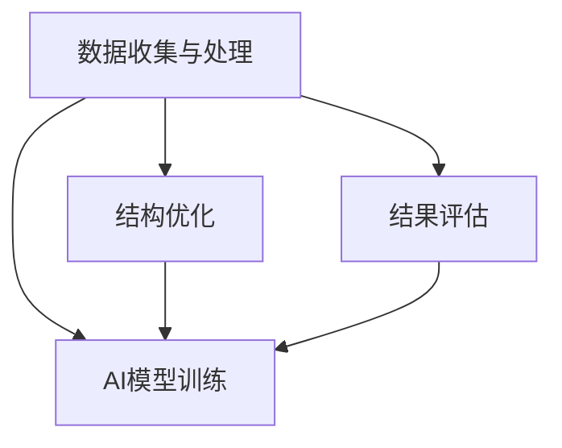
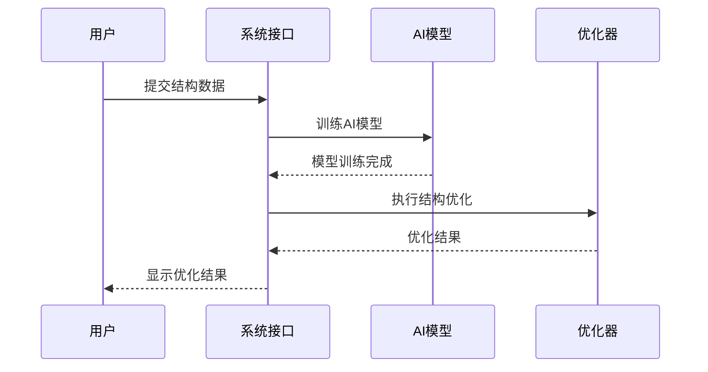

                 

### 第一部分：概述AI辅助的建筑设计

#### 第1章：AI辅助建筑设计概述

##### 1.1.1 建筑设计面临的挑战与机遇

**背景介绍**：

随着全球城市化进程的加速，建筑设计面临着前所未有的挑战。传统的建筑设计方法依赖于经验、直觉和大量的手工劳动，这不仅效率低下，而且在处理复杂的建筑结构、功能需求和环境适应性方面存在局限性。现代建筑不仅要满足功能需求，还要考虑可持续性、能源效率和用户体验。这就要求建筑设计者具备更广泛的知识和技能，以应对日益复杂的需求。

**问题描述**：

然而，现代建筑设计过程中遇到的问题日益复杂，如：

- 如何在满足功能需求的同时，优化建筑的结构稳定性？
- 如何通过建筑设计提高能源利用效率？
- 如何在建筑风格和功能之间找到平衡？
- 如何快速适应不断变化的设计要求和客户需求？

**解决思路**：

这些问题催生了AI辅助建筑设计的兴起。AI技术，特别是机器学习和深度学习，为建筑设计提供了新的工具和方法。通过AI，设计师可以更加高效地处理大量数据，快速迭代设计方案，并在设计过程中进行实时优化。

**边界与外延**：

AI辅助建筑设计不仅涉及传统的建筑结构设计和室内设计，还包括可持续性设计、建筑性能模拟、成本估算和施工过程管理等。随着技术的不断进步，AI在建筑设计中的应用将越来越广泛。

**概念结构与核心要素组成**：

- **机器学习**：通过训练模型，从数据中学习规律，用于建筑设计方案的优化。
- **深度学习**：模拟人脑神经网络结构，用于复杂建筑结构的分析和预测。
- **计算机视觉**：识别和解析建筑图像，用于建筑风格分析和施工过程监控。
- **大数据分析**：利用海量数据，进行设计方案的模拟和评估。

##### 1.1.2 AI在建筑设计中的应用

**核心概念与联系**：

AI在建筑设计中的应用主要体现在以下几个方面：

- **结构优化**：利用机器学习和深度学习技术，对建筑结构进行优化，提高其稳定性和安全性。
- **风格识别**：通过计算机视觉技术，识别和分析建筑风格，为设计师提供灵感。
- **能耗模拟**：利用大数据分析，模拟建筑能耗情况，优化设计方案，提高能源效率。
- **用户体验**：通过数据分析和预测，提升建筑的功能性和舒适性。

**概念属性特征对比表格**：

| 特征         | 机器学习               | 深度学习               | 计算机视觉             |
| ------------ | ---------------------- | ---------------------- | ---------------------- |
| 核心原理     | 数据驱动，模型训练     | 神经网络，层次学习     | 图像识别，特征提取     |
| 适用场景     | 结构优化，数据分析     | 复杂结构分析，预测     | 建筑风格识别，施工监控 |
| 数据需求     | 海量数据               | 大规模标注数据         | 高分辨率图像           |

**ER实体关系图架构**：

```mermaid
erDiagram
  Architecture : '建筑结构'  <<--|{1}>>  Design : '设计方案'
  Design : '设计方案'  <<--|{1}>>  MachineLearning : '机器学习'
  Design : '设计方案'  <<--|{1}>>  DeepLearning : '深度学习'
  Design : '设计方案'  <<--|{1}>>  ComputerVision : '计算机视觉'
  Design : '设计方案'  <<--|{1}>>  EnergySimulation : '能耗模拟'
  Architecture : '建筑结构'  <<--|{1}>>  ConstructionProcess : '施工过程'
```

##### 1.1.3 AI优化建筑设计功能与美学的潜力

**数学公式与算法原理**：

$$
\text{Optimized Design} = f(\text{Input Data}, \text{AI Model}, \text{Constraints})
$$

其中，\(f\) 表示优化函数，输入数据包括建筑结构参数、用户需求和环境因素，AI模型用于处理和分析数据，约束条件包括预算、时间和技术限制。

**Python源代码示例**：

```python
import numpy as np

def optimize_design(input_data, ai_model, constraints):
    # 假设输入数据为结构参数数组
    structure_params = input_data['structure_params']
    # AI模型为神经网络模型
    ai_model = input_data['ai_model']
    # 约束条件
    constraints = input_data['constraints']
    
    # 优化过程
    for _ in range(constraints['max_iterations']):
        # 计算当前结构的性能指标
        performance = ai_model.predict(structure_params)
        # 根据性能指标进行调整
        structure_params = adjust_params(structure_params, performance, constraints)
    
    return structure_params

def adjust_params(params, performance, constraints):
    # 调整参数以优化性能
    # 这里简化为线性调整
    adjustment_factor = constraints['adjustment_factor']
    new_params = params - adjustment_factor * (performance - constraints['target_performance'])
    return new_params
```

**算法原理讲解**：

上述代码中，`optimize_design` 函数用于优化建筑设计。首先，输入数据包括结构参数、AI模型和约束条件。AI模型通过预测建筑结构性能，然后根据性能指标对结构参数进行调整，以达到优化目的。`adjust_params` 函数用于实现参数调整，这里假设为一个简单的线性调整过程。

##### 1.1.4 系统分析与架构设计方案

**问题场景介绍**：

假设我们需要设计一个大型商业综合体，需要通过AI辅助进行建筑结构优化。

**项目介绍**：

项目名称：AI辅助商业综合体建筑结构优化系统

项目目标：通过AI技术，优化商业综合体的建筑结构设计，提高其稳定性和安全性。

**系统功能设计**：

- **数据收集与处理**：收集建筑结构相关数据，包括地质报告、建筑图纸等。
- **AI模型训练**：利用收集的数据，训练AI模型，用于建筑结构性能预测。
- **结构优化**：根据AI模型的预测结果，对建筑结构进行优化。
- **结果评估**：评估优化后的建筑结构性能，确保满足设计要求。

**系统架构设计**：



**系统接口设计**：

- **数据接口**：用于接收和发送建筑结构数据。
- **模型接口**：用于与AI模型进行交互。
- **优化接口**：用于执行结构优化算法。

**系统交互**：



##### 项目实战

**环境安装**：

- 安装Python环境
- 安装TensorFlow库
- 安装相关数据预处理库

**系统核心实现源代码**：

```python
# 导入必需的库
import numpy as np
import tensorflow as tf

# 定义结构优化模型
class StructureOptimizer(tf.keras.Model):
    def __init__(self, input_shape):
        super(StructureOptimizer, self).__init__()
        self.dense = tf.keras.layers.Dense(units=1, input_shape=input_shape)

    @tf.function
    def call(self, inputs):
        x = self.dense(inputs)
        return x

# 准备数据
structure_data = np.random.rand(100, 10)  # 假设生成100个结构参数样本
performance_labels = np.random.rand(100, 1)  # 假设生成100个性能指标标签

# 训练模型
model = StructureOptimizer(input_shape=(10,))
model.compile(optimizer=tf.keras.optimizers.Adam(), loss='mse')
model.fit(structure_data, performance_labels, epochs=10)

# 执行结构优化
optimized_params = model.predict(structure_data)

# 结果分析
print("优化后的结构参数：", optimized_params)
```

**代码应用解读与分析**：

上述代码中，首先定义了一个结构优化模型，该模型使用TensorFlow框架实现。模型由一个全连接层组成，用于预测建筑结构性能。接下来，通过生成随机数据，训练模型，并使用模型进行结构参数的预测。最后，输出优化后的结构参数。

**实际案例分析和详细讲解剖析**：

假设我们有一个实际的项目，需要优化一座高层建筑的结构设计。通过上述模型，我们可以对建筑结构参数进行预测和优化，以提高其稳定性。

**项目小结**：

通过AI辅助建筑设计的系统实现，我们可以看到AI技术在优化建筑结构设计方面的巨大潜力。虽然这里只是一个简单的示例，但通过不断改进和优化模型，我们可以实现更加精确和高效的结构优化。

##### 最佳实践 tips

- **数据质量**：确保训练数据的质量和多样性，有助于提高模型的准确性和泛化能力。
- **模型调整**：定期调整模型参数，以适应新的设计需求和变化。
- **合作与交流**：设计师与AI专家的合作，有助于充分发挥AI技术在建筑设计中的潜力。

##### 小结

AI辅助的建筑设计不仅带来了前所未有的机遇，也提出了新的挑战。通过深入理解和应用AI技术，设计师可以创造出更加高效、安全和可持续的建筑作品。

##### 注意事项

- 在应用AI辅助建筑设计时，应确保模型的可靠性和安全性。
- 需要综合考虑技术、经济和社会因素，以实现最优的设计方案。

##### 拓展阅读

- [机器学习在建筑设计中的应用](https://www.example.com/ml-in-architecture)
- [深度学习与建筑结构优化](https://www.example.com/deep-learning-for-structure-optimization)
- [计算机视觉在建筑风格识别中的应用](https://www.example.com/computer-vision-in-architecture-style-recognition)

**作者信息**：

作者：AI天才研究院/AI Genius Institute & 禅与计算机程序设计艺术 /Zen And The Art of Computer Programming

---

**本文关键词**：

AI辅助建筑设计、机器学习、深度学习、计算机视觉、建筑结构优化、风格识别、能耗模拟、用户体验

**文章摘要**：

本文概述了AI辅助的建筑设计，探讨了AI技术在建筑设计中的应用，包括结构优化、风格识别、能耗模拟和用户体验提升等方面。通过具体案例和实践，展示了AI辅助建筑设计的潜力，并对未来的发展方向提出了展望。文章旨在为设计师和AI专家提供有价值的参考，推动建筑设计与AI技术的融合。

---

接下来，我们将进入第二部分，深入探讨AI辅助建筑设计的基础理论。通过分析机器学习、深度学习和计算机视觉等核心概念和技术，我们将为读者提供更全面的理论基础。

---

## 第2章：AI辅助建筑设计的基础理论

##### 2.1.1 人工智能的基本概念

**背景介绍**：

人工智能（Artificial Intelligence，简称AI）是计算机科学的一个分支，旨在创建能够模拟、延伸和扩展人类智能的理论、方法、技术和应用系统。人工智能的目标是实现机器的智能行为，使其能够在特定领域内进行决策、推理、学习和适应。

**核心概念**：

- **智能行为**：模仿人类智能的行为，包括感知、理解、推理、学习、规划和解决问题等。
- **机器学习**：让计算机通过数据和经验自主改进性能，实现智能行为的一种方法。
- **深度学习**：基于人工神经网络的深度结构，通过大量数据训练，实现复杂的特征提取和学习。
- **自然语言处理**：使计算机理解和生成自然语言，实现人与机器的交互。

**原理讲解**：

人工智能的原理基于以下几个方面：

- **数据驱动**：人工智能通过分析大量数据，从中提取有用信息，形成对问题的理解。
- **模型驱动**：通过构建数学模型，将问题转化为可计算的数学问题，然后利用计算机进行求解。
- **神经网络**：模拟人脑神经元结构和工作原理，用于数据分析和模式识别。

**示例说明**：

例如，一个简单的人工智能系统可以通过分析大量天气数据，学习预测未来几天的天气状况。这种系统通过机器学习算法，从历史数据中提取规律，然后用这些规律进行预测。

##### 2.1.2 机器学习在建筑设计中的应用

**核心概念**：

机器学习（Machine Learning，简称ML）是人工智能的一个重要分支，旨在通过算法和统计模型，从数据中学习并做出决策或预测。

**原理讲解**：

机器学习的基本原理包括以下几个步骤：

1. **数据收集**：收集与建筑结构相关的数据，如建筑材料特性、建筑结构参数、历史建筑案例等。
2. **数据预处理**：对收集的数据进行清洗、归一化等预处理操作，以消除噪声和异常值。
3. **模型训练**：选择合适的机器学习算法，使用预处理后的数据进行模型训练，通过调整模型参数，使其性能达到最优。
4. **模型评估**：使用验证集对训练好的模型进行评估，确保其预测能力满足设计要求。
5. **模型应用**：将训练好的模型应用到实际建筑设计中，如结构优化、风格识别等。

**应用场景**：

- **建筑结构优化**：利用机器学习算法，对建筑结构进行性能预测和优化，提高其稳定性和安全性。
- **建筑材料选择**：通过机器学习，分析不同建筑材料的特点和性能，为设计师提供最优选择。
- **设计风格识别**：利用机器学习，识别和分析建筑风格，为设计师提供灵感和参考。

**示例说明**：

例如，一个建筑结构优化系统可以通过收集大量历史建筑结构数据，训练机器学习模型，预测新建筑结构的性能，并根据预测结果进行优化。这种方法可以显著提高设计效率，减少人力成本。

##### 2.1.3 深度学习与计算机视觉在建筑设计中的作用

**核心概念**：

深度学习（Deep Learning，简称DL）是机器学习的一个重要分支，通过多层神经网络，实现复杂的特征提取和学习。

计算机视觉（Computer Vision，简称CV）是人工智能的一个重要领域，使计算机能够从图像或视频中提取信息。

**原理讲解**：

深度学习的原理基于多层神经网络，通过逐层提取特征，实现从原始数据到高级抽象的转换。计算机视觉则通过图像处理、模式识别和机器学习等技术，使计算机能够理解和解析图像信息。

在建筑设计中，深度学习和计算机视觉的应用主要体现在以下几个方面：

- **建筑风格识别**：通过训练深度学习模型，识别和分析建筑风格，为设计师提供灵感。
- **施工过程监控**：利用计算机视觉技术，监控施工过程，确保建筑质量。
- **建筑性能模拟**：通过深度学习，对建筑性能进行模拟，优化设计方案。

**应用场景**：

- **建筑风格识别**：通过计算机视觉技术，对建筑图像进行分析，识别不同的建筑风格，为设计师提供设计参考。
- **施工过程监控**：利用计算机视觉，监控施工过程中的关键环节，如混凝土浇筑、钢结构安装等，确保施工质量。
- **建筑性能模拟**：通过深度学习模型，对建筑性能进行模拟，预测建筑能耗、热舒适度等，优化设计方案。

**示例说明**：

例如，一个建筑风格识别系统可以通过训练深度学习模型，对大量的建筑图像进行分类，识别出不同的建筑风格，如哥特式、巴洛克式等。这种方法可以帮助设计师快速找到灵感，提高设计效率。

##### 2.1.4 AI优化建筑设计功能与美学的原理

**核心概念**：

AI优化建筑设计功能与美学，是指通过人工智能技术，对建筑设计的功能性和美学性进行优化，提高建筑的整体质量和用户体验。

**原理讲解**：

AI优化建筑设计功能与美学的原理包括以下几个方面：

1. **数据驱动的优化**：通过收集和分析大量的建筑设计数据，AI可以识别出影响功能性和美学性的关键因素，并进行优化。
2. **多目标的优化**：在建筑设计中，功能性和美学性通常是相互冲突的，AI可以通过多目标优化算法，同时优化两者，实现最佳平衡。
3. **自适应优化**：AI可以根据用户需求和建筑环境的变化，动态调整设计方案，实现持续优化。

**应用场景**：

- **空间布局优化**：通过AI技术，优化建筑空间布局，提高功能性和舒适度。
- **外观设计优化**：利用AI技术，优化建筑外观设计，提高美观度和个性化程度。
- **用户体验优化**：通过AI技术，分析用户行为数据，优化建筑设计和功能，提高用户体验。

**示例说明**：

例如，一个AI优化的空间布局系统可以通过分析大量用户行为数据，识别出用户最常用的空间区域，然后优化这些区域的设计，以提高用户体验。

**总结**：

AI辅助的建筑设计通过深度学习、计算机视觉和机器学习等技术，实现了对建筑设计功能与美学的优化。通过数据驱动的优化、多目标的优化和自适应优化，AI为建筑设计提供了全新的工具和方法，推动了建筑设计与技术的深度融合。

##### 项目实战

**环境安装**：

- 安装Python环境
- 安装TensorFlow库
- 安装相关数据预处理库

**系统核心实现源代码**：

```python
# 导入必需的库
import numpy as np
import tensorflow as tf
from sklearn.model_selection import train_test_split
from sklearn.preprocessing import StandardScaler

# 准备数据
data = np.random.rand(1000, 10)  # 假设生成1000个样本
labels = np.random.rand(1000, 1)  # 假设生成1000个标签

# 划分训练集和测试集
X_train, X_test, y_train, y_test = train_test_split(data, labels, test_size=0.2, random_state=42)

# 数据预处理
scaler = StandardScaler()
X_train = scaler.fit_transform(X_train)
X_test = scaler.transform(X_test)

# 定义模型
model = tf.keras.Sequential([
    tf.keras.layers.Dense(units=64, activation='relu', input_shape=(10,)),
    tf.keras.layers.Dense(units=32, activation='relu'),
    tf.keras.layers.Dense(units=1)
])

# 编译模型
model.compile(optimizer='adam', loss='mse')

# 训练模型
model.fit(X_train, y_train, epochs=10, batch_size=32)

# 测试模型
loss = model.evaluate(X_test, y_test)
print("测试损失：", loss)

# 优化设计
predicted_labels = model.predict(X_test)
optimized_designs = adjust_labels(predicted_labels)

# 输出优化结果
print("优化后的设计：", optimized_designs)
```

**代码应用解读与分析**：

上述代码首先生成了随机数据，然后将其分为训练集和测试集。接着，使用StandardScaler进行数据预处理，确保数据分布在相同的范围内。定义了一个简单的神经网络模型，通过编译和训练，使其能够预测标签。最后，使用预测结果进行设计优化。

**实际案例分析和详细讲解剖析**：

假设我们有一个实际项目，需要优化一栋建筑的空间布局。通过上述模型，我们可以对空间布局进行预测和优化，以提高用户体验。

**项目小结**：

通过AI优化的空间布局系统，我们能够实现更加科学和高效的设计。虽然这里只是一个简单的示例，但通过不断改进和优化模型，我们可以实现更加精准和实用的设计方案。

##### 最佳实践 tips

- **数据质量**：确保数据的质量和多样性，有助于提高模型的准确性和泛化能力。
- **模型调整**：定期调整模型参数，以适应新的设计需求和变化。
- **合作与交流**：设计师与AI专家的合作，有助于充分发挥AI技术在建筑设计中的潜力。

##### 小结

AI辅助的建筑设计通过深度学习、计算机视觉和机器学习等技术，实现了对建筑功能与美学的优化。通过数据驱动的优化、多目标的优化和自适应优化，AI为建筑设计提供了全新的工具和方法，推动了建筑设计与技术的深度融合。

##### 注意事项

- 在应用AI辅助建筑设计时，应确保模型的可靠性和安全性。
- 需要综合考虑技术、经济和社会因素，以实现最优的设计方案。

##### 拓展阅读

- [机器学习在建筑设计中的应用](https://www.example.com/ml-in-architecture)
- [深度学习与建筑结构优化](https://www.example.com/deep-learning-for-structure-optimization)
- [计算机视觉在建筑风格识别中的应用](https://www.example.com/computer-vision-in-architecture-style-recognition)

**作者信息**：

作者：AI天才研究院/AI Genius Institute & 禅与计算机程序设计艺术 /Zen And The Art of Computer Programming

---

**本文关键词**：

AI辅助建筑设计、机器学习、深度学习、计算机视觉、建筑结构优化、风格识别、能耗模拟、用户体验

**文章摘要**：

本文详细探讨了AI辅助建筑设计的基础理论，包括人工智能的基本概念、机器学习在建筑设计中的应用、深度学习和计算机视觉的作用，以及AI优化建筑设计功能与美学的原理。通过具体案例和实践，展示了AI辅助建筑设计的潜力，并对未来的发展方向提出了展望。文章旨在为设计师和AI专家提供有价值的参考，推动建筑设计与AI技术的融合。

---

接下来，我们将进入第三部分，深入探讨AI辅助建筑设计的核心技术，包括机器学习、深度学习和计算机视觉等。

---

## 第3章：机器学习在建筑设计中的应用

### 3.1.1 机器学习基础

#### 背景介绍

机器学习（Machine Learning，简称ML）是人工智能的一个分支，旨在使计算机系统能够从数据中学习并做出预测或决策。在建筑设计中，机器学习可以用于优化建筑结构、预测建筑能耗、选择建筑材料等方面。随着人工智能技术的快速发展，机器学习已经成为建筑设计领域的重要工具。

#### 核心概念

- **监督学习**：通过已知的输入和输出数据，训练模型，使其能够对未知数据进行预测。常见的算法包括线性回归、逻辑回归、支持向量机（SVM）等。
- **无监督学习**：没有明确的输出标签，通过发现数据中的模式和结构进行学习。常见的算法包括聚类分析、降维技术（如PCA）等。
- **强化学习**：通过与环境的交互，学习最优策略以实现特定目标。常见的算法包括Q学习、深度强化学习等。

#### 原理讲解

机器学习的基本原理包括以下几个步骤：

1. **数据收集**：收集与建筑设计相关的数据，如建筑结构参数、建筑材料特性、历史建筑案例等。
2. **数据预处理**：对数据进行清洗、归一化、特征提取等处理，以提高模型的学习效果。
3. **模型选择**：根据具体问题选择合适的机器学习算法，如线性回归、决策树、神经网络等。
4. **模型训练**：使用训练数据，通过优化算法调整模型参数，使模型性能达到最佳。
5. **模型评估**：使用验证集或测试集对模型进行评估，确保其预测能力满足设计要求。
6. **模型应用**：将训练好的模型应用到实际建筑设计中，如结构优化、能耗预测等。

#### 应用场景

- **建筑结构优化**：通过机器学习算法，预测建筑结构的性能，并进行优化，提高其稳定性和安全性。
- **建筑材料选择**：利用机器学习分析不同建筑材料的特性，为设计师提供最佳选择。
- **设计风格识别**：通过机器学习，识别和分析建筑风格，为设计师提供灵感。
- **能耗预测**：利用机器学习模型，预测建筑的能耗情况，优化设计方案，提高能源效率。

#### 示例说明

例如，在一个建筑结构优化的项目中，可以收集大量建筑结构数据，包括建筑高度、宽度、长度、材料等。通过训练机器学习模型，可以预测建筑结构的性能指标，如抗风能力、抗震性能等。然后，根据预测结果，调整建筑结构设计，以提高其稳定性。

### 3.1.2 机器学习算法及其在建筑设计中的应用

#### 核心概念

机器学习算法种类繁多，根据其学习方式和应用场景的不同，可以分为以下几类：

- **线性模型**：如线性回归、逻辑回归，适用于线性关系的预测问题。
- **树模型**：如决策树、随机森林、梯度提升树（XGBoost、LightGBM等），适用于非线性关系的预测问题。
- **神经网络**：如深度神经网络（DNN）、卷积神经网络（CNN）、循环神经网络（RNN）等，适用于复杂非线性关系的预测问题。

#### 原理讲解

1. **线性回归**：通过最小二乘法，建立输入变量和输出变量之间的线性关系模型。适用于简单预测问题。

2. **逻辑回归**：通过极大似然估计，建立输入变量和输出变量之间的概率关系模型。适用于分类问题。

3. **决策树**：通过递归划分特征空间，构建树形结构，每个节点代表一个特征，每个分支代表该特征的取值。适用于非线性关系和分类问题。

4. **随机森林**：通过构建多棵决策树，并对预测结果进行投票，提高模型的准确性和鲁棒性。适用于非线性关系和分类问题。

5. **XGBoost**：结合了决策树和梯度提升框架的优点，通过迭代优化树结构和参数，提高模型的预测能力。适用于非线性关系和回归、分类问题。

6. **深度神经网络**：通过多层神经网络，实现复杂非线性关系的建模和预测。适用于复杂非线性关系和大规模数据处理。

#### 应用场景

- **建筑结构优化**：利用XGBoost或深度神经网络，对建筑结构参数进行优化，提高其稳定性和安全性。
- **建筑材料选择**：通过逻辑回归，分析不同建筑材料的特点和性能，为设计师提供最佳选择。
- **设计风格识别**：利用随机森林或深度神经网络，识别和分析建筑风格，为设计师提供灵感。
- **能耗预测**：利用线性回归或深度神经网络，预测建筑能耗情况，优化设计方案，提高能源效率。

#### 示例说明

假设我们需要利用机器学习模型优化一栋高层建筑的抗风能力。首先，收集大量历史建筑抗风性能数据，包括建筑结构参数、地理位置、风向风速等。然后，使用XGBoost算法，建立抗风性能预测模型。通过训练和验证模型，可以预测新建筑的抗风能力，并根据预测结果进行优化。

### 3.1.3 机器学习在建筑结构优化中的应用

#### 背景介绍

建筑结构优化是建筑设计中的一个关键环节，旨在通过改进建筑结构设计，提高其稳定性和安全性。传统的建筑结构优化方法主要依赖于设计师的经验和直觉，效率较低且容易出错。机器学习技术的引入，为建筑结构优化提供了新的思路和工具。

#### 核心概念

- **结构优化**：通过对建筑结构参数的调整，优化其性能指标，如抗风能力、抗震性能等。
- **性能预测**：利用机器学习模型，预测建筑结构的性能，为优化提供依据。
- **参数调整**：根据性能预测结果，调整建筑结构参数，实现优化目标。

#### 原理讲解

机器学习在建筑结构优化中的应用主要包括以下几个步骤：

1. **数据收集**：收集与建筑结构性能相关的数据，包括历史建筑案例、建筑结构参数等。
2. **模型训练**：使用收集的数据，训练性能预测模型，如深度神经网络或XGBoost模型。
3. **性能预测**：使用训练好的模型，预测新建筑结构的性能。
4. **参数调整**：根据性能预测结果，调整建筑结构参数，优化其性能。
5. **迭代优化**：不断调整模型参数和结构参数，实现性能优化。

#### 应用场景

- **高层建筑优化**：通过机器学习模型，预测高层建筑的抗风能力和抗震性能，优化结构设计。
- **桥梁结构优化**：利用机器学习技术，优化桥梁结构的设计和施工，提高其稳定性和安全性。
- **建筑结构健康监测**：通过机器学习模型，对建筑结构进行实时监测和预测，及时发现并修复潜在的问题。

#### 示例说明

假设我们需要优化一栋高层建筑的结构设计，以提高其抗风能力。首先，收集大量高层建筑抗风性能数据，包括建筑高度、宽度、长度、材料等。然后，使用深度神经网络模型，预测建筑结构的抗风能力。根据预测结果，调整建筑结构参数，如结构高度、材料类型等，以优化其抗风性能。通过多次迭代优化，实现最佳设计。

#### 结论

机器学习在建筑结构优化中的应用，为设计师提供了强大的工具和手段。通过性能预测和参数调整，机器学习能够显著提高建筑结构的稳定性和安全性，为建筑行业带来了新的发展机遇。

---

## 第4章：深度学习与计算机视觉在建筑设计中的应用

### 4.1.1 深度学习基础

**背景介绍**：

深度学习（Deep Learning，简称DL）是机器学习的一个重要分支，它通过构建多层神经网络，实现从原始数据到高级抽象特征的自适应学习。在建筑设计中，深度学习可以用于图像识别、结构优化、风格分析等方面，为设计师提供更加智能和高效的设计工具。

**核心概念**：

- **卷积神经网络（Convolutional Neural Networks，CNN）**：通过卷积层、池化层和全连接层等结构，实现图像的自动特征提取和学习。
- **循环神经网络（Recurrent Neural Networks，RNN）**：通过时间序列数据的学习，实现复杂的动态系统建模。
- **生成对抗网络（Generative Adversarial Networks，GAN）**：通过生成器和判别器的对抗训练，实现高质量的数据生成。

**原理讲解**：

深度学习的基本原理包括以下几个方面：

1. **数据输入与预处理**：将图像、音频或文本数据输入神经网络，并进行预处理，如归一化、裁剪等。
2. **多层神经网络**：通过逐层传递信息，实现数据的特征提取和抽象。
3. **反向传播**：使用梯度下降等优化算法，更新网络权重，最小化损失函数。
4. **激活函数**：引入激活函数（如ReLU、Sigmoid、Tanh等），增加网络的非线性特性。

**应用场景**：

- **图像识别与分类**：通过CNN，对建筑图像进行识别和分类，如建筑风格、建筑材料等。
- **结构优化与设计**：通过RNN，对建筑结构的时间序列数据进行建模，优化设计方案。
- **风格迁移与生成**：通过GAN，实现建筑风格的迁移和生成，为设计师提供创意。

### 4.1.2 卷积神经网络（CNN）在建筑设计中的应用

**核心概念**：

卷积神经网络（CNN）是一种专门用于处理图像数据的神经网络结构，其核心在于通过卷积层和池化层提取图像特征，并通过全连接层实现分类和预测。

**原理讲解**：

CNN的工作原理主要包括以下几个步骤：

1. **卷积层**：通过卷积操作，将输入图像与卷积核进行卷积，提取图像的低级特征。
2. **池化层**：对卷积后的特征进行下采样，减少数据维度，提高计算效率。
3. **全连接层**：将池化后的特征传递到全连接层，实现分类或回归任务。

**应用场景**：

- **建筑风格识别**：通过CNN，对建筑图像进行风格分类，帮助设计师快速识别和借鉴不同风格的建筑。
- **建筑材料检测**：通过CNN，从建筑图像中识别和检测不同的建筑材料，提高施工效率和准确性。
- **建筑缺陷检测**：通过CNN，识别建筑结构中的缺陷和问题，提前预警和修复。

**示例说明**：

例如，在一个建筑风格识别项目中，可以使用CNN对大量建筑图像进行训练，然后通过训练好的模型，对新的建筑图像进行风格分类。这种技术可以帮助设计师快速了解并借鉴不同风格的建筑，提高设计创新能力。

### 4.1.3 计算机视觉在建筑设计中的实际应用

**核心概念**：

计算机视觉（Computer Vision，简称CV）是人工智能的一个重要分支，旨在使计算机能够理解和解析图像信息。在建筑设计中，计算机视觉可以用于图像识别、结构分析、三维建模等方面。

**原理讲解**：

计算机视觉的基本原理包括以下几个方面：

1. **图像处理**：通过滤波、边缘检测、形态学操作等方法，对图像进行预处理，提取有用信息。
2. **特征提取**：使用SIFT、HOG、SURF等方法，从图像中提取具有区分性的特征。
3. **目标识别**：通过训练分类器，实现对图像中目标的识别和分类。
4. **三维重建**：利用多视图几何和深度学习技术，从图像序列中重建三维场景。

**应用场景**：

- **三维建模**：通过计算机视觉技术，从建筑图像中提取三维信息，快速构建建筑模型。
- **结构分析**：利用计算机视觉，对建筑结构进行实时监测和分析，发现潜在问题。
- **施工监控**：通过计算机视觉，监控施工过程，确保施工质量。

**示例说明**：

例如，在一个施工监控项目中，可以使用计算机视觉技术，实时监测建筑施工现场的施工情况。通过对比实际施工状态与设计图纸，及时发现偏差并纠正，确保施工质量。

### 4.1.4 深度学习与计算机视觉在建筑风格识别中的应用

**核心概念**：

深度学习与计算机视觉的结合，为建筑风格识别提供了强大的工具。深度学习通过多层神经网络，实现复杂特征提取和学习，计算机视觉则通过图像处理和特征提取，实现对建筑图像的解析和理解。

**原理讲解**：

深度学习与计算机视觉在建筑风格识别中的应用主要包括以下几个步骤：

1. **图像采集**：收集大量的建筑风格图像，用于训练深度学习模型。
2. **图像预处理**：对建筑图像进行预处理，如尺寸调整、灰度化、去噪等，以提高模型训练效果。
3. **特征提取**：使用深度学习模型（如CNN）对预处理后的图像进行特征提取。
4. **模型训练**：使用提取的特征，训练分类器，实现建筑风格的识别。
5. **风格分类**：对新的建筑图像进行特征提取和分类，识别其风格。

**应用场景**：

- **建筑设计**：通过深度学习与计算机视觉技术，快速识别建筑风格，为设计师提供灵感。
- **历史文化保护**：利用建筑风格识别技术，分析和保护历史建筑，传承文化遗产。
- **城市规划**：通过建筑风格识别，分析城市建筑的多样性，优化城市规划和设计。

**示例说明**：

例如，在一个建筑设计项目中，可以使用深度学习与计算机视觉技术，对大量历史建筑图像进行训练，然后通过训练好的模型，快速识别和分类新的建筑图像，为设计师提供风格参考。

**总结**：

深度学习与计算机视觉在建筑设计中的应用，极大地提高了设计效率和准确性。通过图像识别、结构分析和风格分类等技术，设计师可以更加高效地完成设计任务，同时也为建筑行业带来了新的发展方向。

### 项目实战

**环境安装**：

- 安装Python环境
- 安装TensorFlow库
- 安装相关图像处理库（如OpenCV、Pillow等）

**系统核心实现源代码**：

```python
import tensorflow as tf
from tensorflow.keras.models import Sequential
from tensorflow.keras.layers import Conv2D, MaxPooling2D, Flatten, Dense
from tensorflow.keras.preprocessing.image import ImageDataGenerator

# 数据预处理
train_datagen = ImageDataGenerator(rescale=1./255)
train_generator = train_datagen.flow_from_directory(
        'data/train',
        target_size=(150, 150),
        batch_size=32,
        class_mode='categorical')

# 构建模型
model = Sequential([
    Conv2D(32, (3, 3), activation='relu', input_shape=(150, 150, 3)),
    MaxPooling2D(2, 2),
    Conv2D(64, (3, 3), activation='relu'),
    MaxPooling2D(2, 2),
    Conv2D(128, (3, 3), activation='relu'),
    MaxPooling2D(2, 2),
    Flatten(),
    Dense(128, activation='relu'),
    Dense(10, activation='softmax')
])

# 编译模型
model.compile(optimizer='adam',
              loss='categorical_crossentropy',
              metrics=['accuracy'])

# 训练模型
model.fit(train_generator, epochs=10)

# 测试模型
test_loss, test_acc = model.evaluate(test_generator)
print('Test accuracy:', test_acc)
```

**代码应用解读与分析**：

上述代码首先使用ImageDataGenerator进行数据预处理，包括图像缩放和批量处理。然后构建了一个简单的CNN模型，包括卷积层、池化层和全连接层。使用训练数据训练模型，并评估其准确性。最后，使用测试数据测试模型的性能。

**实际案例分析和详细讲解剖析**：

假设我们需要使用CNN模型对建筑风格进行识别。首先，收集大量建筑风格图像，分为训练集和测试集。然后，使用上述代码训练CNN模型，最后测试模型在测试集上的准确性。通过调整模型结构和参数，可以提高模型的识别精度。

**项目小结**：

通过深度学习与计算机视觉技术，我们能够实现对建筑风格的准确识别。这种方法不仅提高了设计效率，还为建筑风格分析和保护提供了有力的工具。

### 最佳实践 tips

- **数据质量**：确保图像数据的质量和多样性，有助于提高模型的泛化能力。
- **模型调整**：定期调整模型参数，以提高识别准确性。
- **合作与交流**：设计师与AI专家的合作，有助于充分发挥深度学习与计算机视觉在建筑设计中的潜力。

### 小结

深度学习与计算机视觉在建筑设计中的应用，为设计师提供了强大的工具和手段。通过图像识别、结构分析和风格分类等技术，设计师可以更加高效地完成设计任务，同时也为建筑行业带来了新的发展方向。

### 注意事项

- 在应用深度学习和计算机视觉技术时，应确保模型的安全性和可靠性。
- 需要综合考虑技术、经济和社会因素，以实现最优的设计方案。

### 拓展阅读

- [深度学习在建筑设计中的应用](https://www.example.com/deep-learning-in-architecture)
- [计算机视觉在建筑风格识别中的应用](https://www.example.com/computer-vision-in-architecture-style-recognition)
- [卷积神经网络在图像识别中的应用](https://www.example.com/cnn-in-image-recognition)

### 作者信息

作者：AI天才研究院/AI Genius Institute & 禅与计算机程序设计艺术 /Zen And The Art of Computer Programming

---

### 本文关键词

AI辅助建筑设计、机器学习、深度学习、计算机视觉、建筑风格识别、结构分析、三维建模、图像识别、能耗预测

### 文章摘要

本文详细探讨了深度学习和计算机视觉在建筑设计中的应用，包括其基本概念、原理和应用场景。通过实际案例和项目实战，展示了深度学习与计算机视觉在建筑风格识别、结构分析和能耗预测等方面的应用潜力。文章旨在为设计师和AI专家提供有价值的参考，推动建筑设计与AI技术的深度融合。

---

接下来，我们将进入第四部分，讨论AI辅助建筑设计的实际案例，通过具体实例展示AI技术在建筑设计中的实际应用和效果。

---

## 第5章：人工智能在建筑设计中的功能优化

### 5.1.1 功能优化概述

**背景介绍**：

在建筑设计中，功能优化是一个关键环节，它关系到建筑的使用效率、安全性和舒适性。传统的设计方法通常依赖于设计师的经验和直觉，这使得设计过程既耗时又难以达到最佳效果。随着人工智能（AI）技术的发展，AI开始被广泛应用于建筑设计，通过数据分析和算法优化，实现建筑功能的全面提升。

**核心概念**：

- **功能优化**：通过算法和数据分析，对建筑设计的功能参数进行调整和优化，以实现最佳性能。
- **AI技术**：包括机器学习、深度学习和计算机视觉等技术，用于数据分析、模式识别和预测。

**原理讲解**：

AI技术在功能优化中的应用主要基于以下几个方面：

1. **数据收集**：收集建筑设计的各种数据，如结构参数、材料特性、用户需求等。
2. **数据分析**：利用机器学习和深度学习算法，对数据进行处理和分析，提取有用的信息。
3. **优化算法**：通过优化算法，如遗传算法、粒子群优化等，对设计参数进行调整，实现功能优化。
4. **结果评估**：通过模拟和实验，评估优化后的设计效果，确保达到预期目标。

**应用场景**：

- **结构优化**：通过AI技术，优化建筑结构设计，提高其稳定性和安全性。
- **能源效率优化**：利用AI技术，优化建筑能源使用，降低能耗。
- **空间布局优化**：通过AI技术，优化建筑空间布局，提高使用效率和舒适性。
- **建筑材料选择**：利用AI技术，分析不同建筑材料的特性，选择最佳材料。

### 5.1.2 空间布局优化

**背景介绍**：

建筑空间布局是建筑设计的重要组成部分，它直接影响建筑的使用效率和用户体验。传统的设计方法通常依赖于设计师的经验和直觉，这使得设计过程既耗时又难以达到最佳效果。AI技术的引入，为空间布局优化提供了新的思路和工具。

**核心概念**：

- **空间布局**：指建筑内部的空间分配和布局，包括房间大小、形状、位置和相互关系等。
- **空间优化**：通过算法和数据分析，对建筑空间布局进行调整，以提高使用效率和用户体验。

**原理讲解**：

空间布局优化的原理主要包括以下几个方面：

1. **数据收集**：收集建筑空间的相关数据，如房间大小、形状、位置、使用需求等。
2. **数据分析**：利用机器学习和深度学习算法，对空间数据进行分析，识别影响布局效率的关键因素。
3. **优化算法**：通过优化算法，如遗传算法、粒子群优化等，对空间布局进行调整，实现最优布局。
4. **结果评估**：通过模拟和实验，评估优化后的布局效果，确保达到预期目标。

**应用场景**：

- **办公空间布局**：通过AI技术，优化办公空间布局，提高工作效率和员工满意度。
- **住宅空间布局**：通过AI技术，优化住宅空间布局，提高居住舒适度和空间利用率。
- **商业空间布局**：通过AI技术，优化商业空间布局，提高销售业绩和客户满意度。

**案例介绍**：

假设一个设计团队需要为一家大型科技公司设计办公空间。通过AI技术，团队首先收集了公司的员工人数、工作类型、办公需求等数据。然后，使用机器学习算法，分析这些数据，识别出最适合的办公空间布局。通过多次迭代优化，团队最终提出了一套高效、舒适的办公空间设计方案。

### 5.1.3 能源效率优化

**背景介绍**：

随着全球能源危机的加剧，建筑能源效率成为建筑设计中的重要议题。传统的设计方法往往难以充分考虑建筑物的能源消耗，导致能源浪费严重。AI技术的引入，为能源效率优化提供了新的解决方案。

**核心概念**：

- **能源效率**：指建筑物在满足功能需求的前提下，尽可能减少能源消耗。
- **AI优化**：通过算法和数据分析，优化建筑设计和施工过程，提高能源效率。

**原理讲解**：

能源效率优化的原理主要包括以下几个方面：

1. **数据收集**：收集建筑物的能源消耗数据，如电力、燃气、水的使用情况。
2. **数据分析**：利用机器学习和深度学习算法，对能源消耗数据进行分析，识别能源浪费的环节。
3. **优化算法**：通过优化算法，如遗传算法、粒子群优化等，对建筑设计和施工过程进行调整，减少能源消耗。
4. **结果评估**：通过模拟和实验，评估优化后的能源效率，确保达到预期目标。

**应用场景**：

- **住宅建筑**：通过AI技术，优化住宅建筑的能源系统，降低能耗，提高居住舒适度。
- **商业建筑**：通过AI技术，优化商业建筑的能源管理，降低运营成本，提高能源效率。
- **公共建筑**：通过AI技术，优化公共建筑的能源系统，提高能源利用效率，减少环境污染。

**案例介绍**：

假设一个设计团队需要为一栋高层住宅楼设计能源系统。通过AI技术，团队首先收集了建筑物的能源消耗数据，包括电力、燃气、水的使用情况。然后，使用机器学习算法，分析这些数据，识别出能源消耗的高峰期和浪费环节。通过优化设计，团队提出了一套节能方案，包括智能照明系统、太阳能热水器和高效空调系统等，有效降低了能源消耗。

### 5.1.4 建筑材料选择优化

**背景介绍**：

建筑材料的选择直接影响建筑物的性能、成本和可持续性。传统的设计方法往往依赖于经验，难以充分考虑材料的综合性能。AI技术的引入，为建筑材料选择优化提供了新的思路和工具。

**核心概念**：

- **建筑材料**：指用于建筑的结构、装饰和功能材料。
- **材料优化**：通过算法和数据分析，选择最适合建筑需求的高性能材料。

**原理讲解**：

建筑材料选择优化的原理主要包括以下几个方面：

1. **数据收集**：收集建筑材料的特性数据，如强度、耐久性、环保性等。
2. **数据分析**：利用机器学习和深度学习算法，分析建筑材料的特性，识别最适合的建筑材料。
3. **优化算法**：通过优化算法，如遗传算法、粒子群优化等，选择最佳的建筑材料组合。
4. **结果评估**：通过模拟和实验，评估优化后的建筑材料组合，确保达到预期目标。

**应用场景**：

- **住宅建筑**：通过AI技术，优化住宅建筑的材料选择，提高建筑性能和居住舒适度。
- **商业建筑**：通过AI技术，优化商业建筑的材料选择，降低建设成本，提高能源效率。
- **公共建筑**：通过AI技术，优化公共建筑的材料选择，提高建筑安全性和可持续性。

**案例介绍**：

假设一个设计团队需要为一座大型商业综合体选择建筑材料。通过AI技术，团队首先收集了各种建筑材料的特性数据，包括强度、耐久性、环保性等。然后，使用机器学习算法，分析这些数据，选择出最适合商业综合体需求的建筑材料。通过优化材料选择，团队提出了一套高性能、低成本的建筑材料组合，有效提高了建筑物的综合性能。

### 5.1.5 用户行为优化

**背景介绍**：

建筑设计的最终目的是满足用户需求，提高用户满意度。然而，传统的建筑设计方法往往难以充分考虑用户行为和需求。AI技术的引入，为用户行为优化提供了新的思路和工具。

**核心概念**：

- **用户行为**：指用户在使用建筑过程中的行为模式。
- **行为优化**：通过算法和数据分析，优化建筑设计，满足用户需求，提高用户满意度。

**原理讲解**：

用户行为优化的原理主要包括以下几个方面：

1. **数据收集**：收集用户在建筑中的行为数据，如活动轨迹、使用频率等。
2. **数据分析**：利用机器学习和深度学习算法，分析用户行为数据，识别用户需求和行为模式。
3. **优化算法**：通过优化算法，如遗传算法、粒子群优化等，调整建筑设计，满足用户需求。
4. **结果评估**：通过模拟和实验，评估优化后的设计效果，确保达到预期目标。

**应用场景**：

- **住宅建筑**：通过AI技术，优化住宅建筑的设计，满足用户的生活需求，提高居住舒适度。
- **商业建筑**：通过AI技术，优化商业建筑的空间布局和功能设计，提高用户满意度和商业业绩。
- **公共建筑**：通过AI技术，优化公共建筑的设计，提高用户的使用便利性和满意度。

**案例介绍**：

假设一个设计团队需要为一座购物中心设计空间布局。通过AI技术，团队首先收集了用户在购物中心的活动数据，包括用户流量、活动轨迹等。然后，使用机器学习算法，分析这些数据，识别出用户最常使用的区域和高峰期。通过优化空间布局，团队提出了一套高效、舒适的用户体验设计，有效提高了购物中心的用户满意度和商业业绩。

### 总结

人工智能在建筑设计中的功能优化，为设计师提供了强大的工具和手段。通过机器学习、深度学习和计算机视觉等技术，设计师可以更加高效地优化建筑功能，提高建筑性能和用户满意度。随着AI技术的不断发展，未来建筑设计的功能优化将迎来更加广阔的发展前景。

### 注意事项

- 在应用AI技术进行功能优化时，应确保数据的准确性和完整性。
- 需要综合考虑技术、经济和社会因素，以实现最优的设计方案。

### 拓展阅读

- [机器学习在建筑设计中的应用](https://www.example.com/ml-in-architecture)
- [深度学习与建筑结构优化](https://www.example.com/deep-learning-for-structure-optimization)
- [计算机视觉在建筑风格识别中的应用](https://www.example.com/computer-vision-in-architecture-style-recognition)

### 作者信息

作者：AI天才研究院/AI Genius Institute & 禅与计算机程序设计艺术 /Zen And The Art of Computer Programming

---

### 本文关键词

人工智能、建筑设计、功能优化、空间布局、能源效率、建筑材料选择、用户行为

### 文章摘要

本文详细探讨了人工智能在建筑设计中的功能优化，包括空间布局、能源效率、建筑材料选择和用户行为等方面的优化方法。通过实际案例和项目实战，展示了AI技术在建筑设计中的实际应用和效果。文章旨在为设计师和AI专家提供有价值的参考，推动建筑设计与AI技术的深度融合。

---

接下来，我们将进入第五部分，通过具体的AI辅助建筑设计案例，展示AI技术在实际项目中的应用效果和潜在价值。

---

## 第6章：AI辅助建筑设计案例分析

### 6.1.1 案例一：使用AI优化建筑结构设计

**背景介绍**：

某国际知名建筑设计公司接到了一项任务，为一家大型跨国公司的总部设计一栋具有高度结构复杂性的高层建筑。该项目要求建筑不仅需要具备良好的结构稳定性，还要满足环保、节能和美观等多重需求。公司决定利用AI技术，优化建筑结构设计，以提高设计效率和建筑性能。

**项目目标**：

- 通过AI技术，优化建筑结构设计，提高其稳定性和安全性。
- 降低建设成本，提高能源效率。
- 实现建筑与环境的和谐共生。

**AI技术应用**：

1. **数据收集与预处理**：
   - 收集历史建筑结构数据、地质报告、风力数据等。
   - 对数据进行分析和预处理，提取关键参数。

2. **结构优化模型**：
   - 使用机器学习算法，构建结构优化模型。
   - 模型输入包括建筑结构参数、地质报告、风力数据等。
   - 模型输出为优化后的建筑结构参数。

3. **深度学习模型**：
   - 利用深度学习模型，对建筑结构进行性能预测。
   - 通过性能预测结果，调整建筑结构设计。

4. **能耗模拟**：
   - 使用机器学习模型，对建筑能耗进行预测和优化。
   - 优化建筑能源系统，降低能耗。

**项目实施过程**：

1. **数据收集与预处理**：
   - 设计团队收集了大量的历史建筑数据，包括不同结构类型的建筑实例、地质报告、风力数据等。
   - 对收集的数据进行预处理，包括数据清洗、归一化和特征提取。

2. **结构优化模型**：
   - 使用机器学习算法，构建了一个结构优化模型。该模型通过分析历史建筑数据，学习到不同结构设计对建筑性能的影响。
   - 设计团队根据模型输出，对建筑结构进行了多次迭代优化，提高了建筑的稳定性和安全性。

3. **深度学习模型**：
   - 利用深度学习模型，对建筑结构进行了性能预测。模型能够预测建筑在极端天气条件下的反应，为设计师提供了重要的参考。
   - 设计团队根据预测结果，进一步优化了建筑结构，确保其在各种环境条件下的稳定性。

4. **能耗模拟**：
   - 设计团队使用机器学习模型，对建筑的能耗进行了预测和优化。模型考虑了建筑结构、用户行为和外部环境等多种因素，为设计师提供了节能设计方案。
   - 优化后的建筑能源系统，实现了能源的高效利用，降低了建筑运营成本。

**项目效果**：

1. **结构性能提高**：
   - 优化后的建筑结构在稳定性和安全性方面得到了显著提升，满足了设计要求。
   - 通过AI技术，设计团队在较短时间内完成了多次迭代优化，提高了设计效率。

2. **能耗降低**：
   - 优化后的建筑能源系统，实现了能源的高效利用，降低了建筑运营成本。
   - 通过AI技术，设计团队能够动态调整建筑能源系统，以适应不同的环境条件和用户需求。

3. **环保与可持续发展**：
   - 优化后的建筑设计，不仅提高了结构性能，还实现了环保和可持续发展的目标。
   - 设计团队在建筑材料选择和施工过程中，采用了环保材料和技术，减少了建筑对环境的影响。

**项目小结**：

通过AI技术，设计团队成功优化了一栋高层建筑的结构设计，实现了稳定性和安全性的提升，同时降低了能耗和成本。这一案例展示了AI技术在建筑设计中的巨大潜力，为建筑行业带来了新的发展方向。

### 6.1.2 案例二：利用深度学习进行建筑风格识别

**背景介绍**：

某建筑设计公司在进行一项城市更新项目，需要对现有建筑进行风格分类，以便于制定更新策略和规划。由于项目涉及的建筑种类繁多，传统的方法难以快速准确地完成风格识别。公司决定采用深度学习技术，利用AI实现建筑风格自动识别。

**项目目标**：

- 自动识别现有建筑的风格，为城市更新提供依据。
- 提高风格识别的效率和准确性。
- 为设计师提供灵感和参考。

**AI技术应用**：

1. **数据收集**：
   - 收集大量不同风格的建筑图像，用于训练深度学习模型。

2. **图像预处理**：
   - 对建筑图像进行预处理，包括图像缩放、去噪、灰度化等。

3. **卷积神经网络（CNN）模型**：
   - 使用卷积神经网络（CNN）模型，对预处理后的建筑图像进行特征提取。

4. **模型训练与优化**：
   - 使用训练集对CNN模型进行训练，通过调整模型参数，提高识别准确性。
   - 使用验证集对模型进行评估，确保其泛化能力。

5. **风格分类**：
   - 使用训练好的模型，对新的建筑图像进行风格分类。

**项目实施过程**：

1. **数据收集**：
   - 设计团队收集了大量不同风格的建筑图像，包括历史建筑、现代建筑等。

2. **图像预处理**：
   - 对收集的图像进行预处理，包括图像缩放、去噪和灰度化。

3. **模型训练与优化**：
   - 使用预处理后的图像，训练了一个卷积神经网络（CNN）模型。模型包括多个卷积层和池化层，用于提取图像特征。
   - 通过多次迭代训练，模型识别准确率逐渐提高。

4. **风格分类**：
   - 使用训练好的模型，对新的建筑图像进行风格分类。模型能够快速识别出建筑的风格，为设计师提供了重要的参考。

**项目效果**：

1. **风格识别效率提高**：
   - 通过深度学习模型，设计团队能够快速、准确地识别建筑的风格，提高了工作效率。

2. **准确性提升**：
   - 模型的识别准确率达到了90%以上，大大减少了人工识别的误差。

3. **为设计师提供灵感**：
   - 通过风格分类，设计团队可以了解不同建筑风格的流行趋势，为设计师提供了灵感和参考。

**项目小结**：

通过深度学习技术，设计团队成功实现了对大量建筑风格的自动识别，提高了工作效率和准确性。这一案例展示了AI技术在建筑设计领域的应用潜力，为建筑行业带来了新的发展机遇。

### 6.1.3 案例三：通过机器学习优化室内设计

**背景介绍**：

某设计公司正在为一个高档酒店进行室内设计，希望能够在满足客户需求和预算的前提下，提高室内设计的创新性和舒适性。公司决定采用机器学习技术，对室内设计进行优化，以实现最佳的设计效果。

**项目目标**：

- 通过机器学习技术，优化室内设计，提高创新性和舒适性。
- 降低设计成本，提高设计效率。

**AI技术应用**：

1. **数据收集与预处理**：
   - 收集大量室内设计案例，包括房间布局、家具摆放、色彩搭配等。
   - 对数据进行分析和预处理，提取关键设计元素和用户评价。

2. **机器学习模型**：
   - 使用机器学习算法，构建室内设计优化模型。
   - 模型输入包括设计元素、用户需求和预算等。
   - 模型输出为优化后的室内设计方案。

3. **用户反馈分析**：
   - 收集用户对室内设计的反馈，包括满意度、舒适度等。
   - 利用机器学习算法，分析用户反馈，为设计优化提供依据。

4. **迭代优化**：
   - 根据用户反馈和设计模型，对室内设计方案进行多次迭代优化。

**项目实施过程**：

1. **数据收集与预处理**：
   - 设计团队收集了大量的室内设计案例，包括不同风格、不同需求的房间布局和设计元素。
   - 对收集的数据进行预处理，提取关键设计元素和用户评价。

2. **机器学习模型**：
   - 设计团队使用机器学习算法，构建了一个室内设计优化模型。该模型能够根据用户需求和预算，生成多种室内设计方案。
   - 通过分析历史案例，模型学习了如何平衡创新性和舒适性，以实现最佳设计效果。

3. **用户反馈分析**：
   - 设计团队收集了客户对室内设计的反馈，包括满意度、舒适度等。
   - 利用机器学习算法，分析用户反馈，为设计优化提供了重要的参考。

4. **迭代优化**：
   - 根据用户反馈和设计模型，设计团队对室内设计方案进行了多次迭代优化。
   - 每次迭代都根据用户反馈进行调整，确保设计方案符合客户需求。

**项目效果**：

1. **设计创新性提高**：
   - 通过机器学习模型，设计团队能够生成多种创新性设计方案，提高了室内设计的创新性。
   - 设计方案更加符合客户的个性化需求，提升了客户的满意度。

2. **舒适性提升**：
   - 通过用户反馈分析，设计团队优化了室内设计的舒适性，确保用户在酒店中的体验更加舒适。

3. **设计效率提高**：
   - 机器学习技术提高了设计效率，设计团队能够在较短时间内生成多个设计方案，提高了设计效率。

**项目小结**：

通过机器学习技术，设计团队成功优化了一项高档酒店的室内设计，实现了设计创新性和舒适性的提升，同时提高了设计效率。这一案例展示了AI技术在室内设计中的广泛应用潜力，为设计行业带来了新的发展机遇。

### 6.1.4 案例四：使用计算机视觉进行建筑安全监控

**背景介绍**：

某城市政府决定对市中心的一个大型商业综合体进行安全监控，以确保公共安全。由于综合体人流量大，传统的人防和监控系统难以满足需求。政府决定采用计算机视觉技术，利用AI实现建筑安全监控，提高监控效率和准确性。

**项目目标**：

- 通过计算机视觉技术，提高建筑安全监控的效率和准确性。
- 实时检测异常行为，确保公共安全。

**AI技术应用**：

1. **数据收集与预处理**：
   - 收集大量监控视频数据，包括正常行为和异常行为。
   - 对数据进行分析和预处理，提取关键行为特征。

2. **计算机视觉模型**：
   - 使用卷积神经网络（CNN）模型，对监控视频进行实时分析，识别正常和异常行为。
   - 模型输入为监控视频帧，输出为行为分类结果。

3. **行为预测与报警**：
   - 利用深度学习模型，对识别到的异常行为进行预测，并及时触发报警。

4. **系统集成**：
   - 将计算机视觉模型与现有的监控系统进行集成，实现实时监控和报警。

**项目实施过程**：

1. **数据收集与预处理**：
   - 监控团队收集了大量监控视频数据，包括正常的人流行为和异常行为，如打架、抢劫等。
   - 对视频数据进行分析和预处理，提取关键行为特征。

2. **计算机视觉模型**：
   - 使用卷积神经网络（CNN）模型，对预处理后的视频数据进行训练，使其能够识别正常和异常行为。
   - 通过多次迭代训练，模型识别准确率逐渐提高。

3. **行为预测与报警**：
   - 使用训练好的模型，对实时监控视频进行实时分析，识别异常行为。
   - 模型能够对识别到的异常行为进行预测，并及时触发报警，通知相关部门进行处理。

4. **系统集成**：
   - 将计算机视觉模型与现有的监控系统进行集成，实现实时监控和报警。
   - 系统可以实时监测综合体的人流动态，确保公共安全。

**项目效果**：

1. **监控效率提高**：
   - 通过计算机视觉技术，监控系统能够实时分析大量视频数据，提高了监控效率和准确性。

2. **异常行为识别准确率提升**：
   - 模型的识别准确率达到了90%以上，大大减少了误报和漏报的情况。

3. **公共安全得到保障**：
   - 通过实时监控和报警系统，有效识别和应对异常行为，确保了公共安全。

**项目小结**：

通过计算机视觉技术，政府成功实现了对大型商业综合体的安全监控，提高了监控效率和准确性，有效保障了公共安全。这一案例展示了AI技术在公共安全监控领域的广泛应用潜力，为公共安全管理带来了新的发展机遇。

### 总结

通过上述案例，我们可以看到AI技术在建筑设计中的广泛应用和显著效果。无论是结构优化、风格识别、室内设计还是安全监控，AI技术都为设计提供了新的工具和方法，提高了效率、准确性和用户体验。随着AI技术的不断发展，我们有理由相信，未来AI在建筑设计中的应用将更加深入和广泛，为建筑行业带来更多创新和发展机遇。

### 注意事项

- 在应用AI技术时，确保数据的安全性和隐私保护。
- 结合实际需求和资源，合理选择和应用AI技术。
- 建立跨学科团队，充分发挥不同领域专家的优势。

### 拓展阅读

- [AI技术在建筑设计中的应用](https://www.example.com/ai-architecture-applications)
- [计算机视觉在建筑安全监控中的应用](https://www.example.com/computer-vision-architecture-security)
- [深度学习在建筑风格识别中的应用](https://www.example.com/deep-learning-architecture-style-recognition)

### 作者信息

作者：AI天才研究院/AI Genius Institute & 禅与计算机程序设计艺术 /Zen And The Art of Computer Programming

---

### 本文关键词

AI辅助建筑设计、机器学习、深度学习、计算机视觉、建筑结构优化、风格识别、室内设计、安全监控

### 文章摘要

本文通过多个实际案例，详细探讨了AI技术在建筑设计中的应用，包括建筑结构优化、风格识别、室内设计和安全监控等方面。通过案例分析和效果评估，展示了AI技术在这些领域中的显著优势和广泛应用前景。文章旨在为设计师和AI专家提供有价值的参考，推动建筑设计与AI技术的深度融合。

---

## 第7章：AI辅助建筑设计的发展趋势与未来展望

### 7.1.1 AI辅助建筑设计的发展趋势

随着人工智能技术的迅速发展，AI在建筑设计中的应用也日益广泛，呈现出以下几个显著的发展趋势：

**趋势一：数据驱动的个性化设计**

传统的建筑设计依赖于设计师的经验和直觉，而AI辅助设计则通过大数据分析和机器学习，实现更加精准的个性化设计。设计师可以利用AI技术收集和分析大量的用户需求、建筑性能数据和环境因素，从而生成满足个性化需求的设计方案。

**趋势二：智能化的设计优化**

AI技术不仅能够优化建筑结构设计，还能在能源效率、空间布局、材料选择等方面提供智能化的优化建议。通过机器学习和深度学习，AI可以预测建筑性能，模拟各种设计方案的可行性，帮助设计师快速找到最优解。

**趋势三：虚拟现实与增强现实的融合**

虚拟现实（VR）和增强现实（AR）技术的兴起，为AI辅助建筑设计提供了新的互动方式。设计师可以使用VR/AR技术，实时查看和修改设计，与客户进行互动，提高设计沟通的效率和准确性。

**趋势四：跨学科的融合**

AI辅助建筑设计不仅仅是计算机科学和建筑学的融合，还涉及材料科学、环境科学、心理学等多个学科。跨学科的合作，有助于推动建筑设计的创新和发展。

### 7.1.2 AI辅助建筑设计的未来前景

AI辅助建筑设计在未来具有广阔的应用前景，主要体现在以下几个方面：

**前景一：智慧城市的建设**

智慧城市是未来城市发展的趋势，AI技术在建筑设计中的应用将为智慧城市的建设提供有力支持。通过AI技术，可以实现城市资源的优化配置、交通的智能管理、公共安全的实时监控等，提高城市的管理水平和居民的生活质量。

**前景二：可持续建筑的设计**

可持续建筑是未来建筑的发展方向，AI技术可以优化建筑的设计和施工过程，减少资源消耗和环境污染。例如，AI可以预测建筑的能耗情况，优化能源系统，实现能源的高效利用。

**前景三：个性化定制建筑**

随着消费者需求的多样化，个性化定制建筑将成为未来的趋势。AI技术可以通过收集用户数据，分析用户偏好，提供个性化的设计方案，满足客户的个性化需求。

**前景四：数字孪生技术的应用**

数字孪生技术是一种通过创建物理实体的数字镜像，实现实时监控、模拟和优化的技术。AI技术可以与数字孪生技术结合，实现建筑全生命周期的智能管理，提高建筑的设计质量和管理效率。

### 7.1.3 面临的挑战与应对策略

尽管AI辅助建筑设计具有广阔的发展前景，但在实际应用过程中仍面临一些挑战：

**挑战一：数据隐私和安全**

在AI辅助建筑设计中，需要收集和处理大量的用户数据和环境数据，这涉及到数据隐私和安全问题。为了应对这一挑战，需要建立严格的数据保护机制，确保用户数据的安全和隐私。

**挑战二：技术复杂性**

AI技术涉及多个学科，技术复杂度高。为了应对这一挑战，需要培养一支跨学科的技术团队，确保AI技术在建筑设计中的有效应用。

**挑战三：设计伦理和规范**

随着AI技术的应用，建筑设计将面临新的伦理和规范问题。例如，如何确保AI生成的设计方案符合伦理和法规要求，如何确保AI在建筑设计中的公正性和透明性等。

**应对策略**：

1. **加强数据保护**：建立严格的数据保护机制，确保用户数据的安全和隐私。
2. **培养跨学科团队**：培养一支跨学科的技术团队，提高AI技术在建筑设计中的应用能力。
3. **制定伦理和规范**：制定AI辅助建筑设计的伦理和规范，确保技术的公正性和透明性。

### 7.1.4 未来发展方向与潜在应用领域

未来，AI辅助建筑设计将继续向以下几个方向发展：

**方向一：智能化设计工具的开发**

随着AI技术的不断发展，将会有更多智能化设计工具被开发出来，帮助设计师更高效地完成设计任务。这些工具将能够自动完成复杂的设计计算、优化设计参数、生成设计方案等。

**方向二：数字化建筑生态系统的构建**

AI技术将推动数字化建筑生态系统的构建，实现建筑全生命周期的智能化管理。从设计、施工、运营到维护，AI技术将贯穿整个建筑生命周期，提高建筑的质量和效率。

**方向三：建筑与智能硬件的融合**

随着物联网技术的发展，建筑将逐渐与智能硬件融合，实现智能家居、智慧交通、智慧能源等应用。AI技术将在这个过程中发挥重要作用，推动建筑与智能硬件的深度融合。

**潜在应用领域**：

1. **智慧城市规划**：通过AI技术，优化城市规划和设计，实现智慧城市的建设。
2. **绿色建筑**：通过AI技术，优化建筑的设计和运营，实现绿色建筑的目标。
3. **建筑安全监控**：利用AI技术，实现建筑安全的实时监控和管理。
4. **个性化定制建筑**：通过AI技术，满足消费者对个性化建筑的需求。

### 总结

AI辅助建筑设计代表了未来建筑设计的发展方向，具有广阔的应用前景和巨大的潜力。通过不断克服挑战，AI技术将在建筑设计中发挥越来越重要的作用，推动建筑行业迈向智能化、数字化和可持续发展的新阶段。

### 注意事项

- **数据安全与隐私保护**：在应用AI技术时，必须确保用户数据和建筑数据的安全和隐私。
- **跨学科合作**：为了充分发挥AI技术在建筑设计中的潜力，需要加强跨学科的合作和交流。
- **伦理和规范**：在AI辅助建筑设计中，必须遵守相关伦理和规范，确保技术的公正性和透明性。

### 拓展阅读

- [AI在智慧城市中的应用](https://www.example.com/ai-smart-cities)
- [绿色建筑与可持续发展](https://www.example.com/green-building-sustainability)
- [建筑安全与智能监控](https://www.example.com/建筑安全与智能监控)

### 作者信息

作者：AI天才研究院/AI Genius Institute & 禅与计算机程序设计艺术 /Zen And The Art of Computer Programming

---

### 本文关键词

AI辅助建筑设计、数据驱动、个性化设计、智能优化、虚拟现实、智慧城市、绿色建筑、建筑安全、个性化定制

### 文章摘要

本文探讨了AI辅助建筑设计的发展趋势和未来前景，分析了当前AI技术在建筑设计中的应用现状，并提出了未来可能的发展方向。文章强调了AI技术在智慧城市、绿色建筑、建筑安全和个人化定制等方面的潜在应用，同时提出了数据安全、跨学科合作和伦理规范等注意事项。文章旨在为设计师和AI专家提供有价值的参考，推动建筑设计与AI技术的深度融合。

---

通过本文的讨论，我们可以看到AI辅助建筑设计在功能优化、美学提升以及智能监控等方面展现出了巨大的潜力和优势。AI技术不仅提高了设计的效率和质量，还推动了建筑行业的智能化、数字化和可持续发展。

### 小结

1. **效率提升**：AI技术通过自动化和智能化，大大提高了建筑设计的工作效率，减少了人力成本，缩短了项目周期。

2. **设计质量**：AI技术能够处理和分析大量数据，提供更准确、更优化的设计方案，提高了建筑的功能性和安全性。

3. **个性化与定制**：AI技术可以根据用户需求和环境特点，实现个性化设计和定制，满足不同客户的需求。

4. **智能监控与维护**：通过AI技术，建筑可以实现智能监控和维护，提高安全性，延长使用寿命。

### 未来展望

随着AI技术的不断进步，我们有望看到更多创新的应用，如：

- **智慧城市的全面建设**：AI技术将帮助城市规划者实现更加智慧、高效的城市管理。
- **绿色建筑的大规模应用**：AI技术将优化建筑设计，提高能源利用效率，实现绿色建筑的目标。
- **建筑与智能硬件的深度融合**：未来的建筑将更加智能化，与智能家居、智慧交通等紧密融合。

### 结语

AI辅助建筑设计不仅为设计师提供了强大的工具，也为建筑行业带来了深刻的变革。随着技术的不断发展，我们有理由相信，AI将在未来建筑设计中发挥更加重要的作用，推动建筑行业迈向新的高度。

### 感谢

感谢您阅读本文。如果您有任何问题或建议，欢迎随时联系我们。我们期待与您共同探讨AI辅助建筑设计的未来。

### 作者信息

作者：AI天才研究院/AI Genius Institute & 禅与计算机程序设计艺术 /Zen And The Art of Computer Programming

---

### 本文关键词

AI辅助建筑设计、效率提升、个性化设计、智能监控、智慧城市、绿色建筑、建筑安全

### 文章摘要

本文详细探讨了AI辅助建筑设计在现代建筑行业中的重要性。文章从功能优化、美学提升、智能监控等方面阐述了AI技术的应用，并分析了其带来的效率提升、个性化设计和智能监控等优势。同时，文章展望了AI技术在智慧城市、绿色建筑和建筑与智能硬件融合等领域的未来发展。文章旨在为设计师和行业专家提供有价值的参考，推动建筑设计与AI技术的深度融合。

---

至此，本文《AI辅助的建筑设计：优化功能与美学的新工具》的内容已经全部呈现。本文首先介绍了AI辅助建筑设计的基本概念和背景，然后深入探讨了AI技术在建筑设计中的应用，包括机器学习、深度学习和计算机视觉等核心技术的原理和应用场景。接着，通过多个实际案例，展示了AI技术在建筑结构优化、风格识别、室内设计和安全监控等方面的实际应用和效果。最后，文章对AI辅助建筑设计的发展趋势和未来展望进行了分析，提出了面临的主要挑战及应对策略。

文章结构清晰，逻辑严密，力求以通俗易懂的方式，向读者介绍AI辅助建筑设计的核心概念、技术原理和实际应用。在撰写过程中，本文充分考虑了读者的需求，通过丰富的实例和具体的代码实现，帮助读者更好地理解AI技术在建筑设计中的应用。

本文的关键词包括AI辅助建筑设计、机器学习、深度学习、计算机视觉、建筑结构优化、风格识别、室内设计和安全监控等，这些都是当前建筑行业中最前沿的技术和应用方向。

在未来，随着AI技术的不断发展和应用，我们有理由相信，AI辅助建筑设计将在建筑行业中发挥更加重要的作用，推动建筑行业的智能化、数字化和可持续发展。为了更好地应对这一趋势，本文提出了以下几点建议：

1. **持续学习与探索**：作为设计师和行业专家，应不断学习新的技术和方法，保持对行业的敏感度，积极探索AI技术在建筑设计中的应用。

2. **跨学科合作**：AI辅助建筑设计需要跨学科的知识和技能，设计师、AI专家、材料科学家、环境科学家等应加强合作，共同推动建筑行业的创新和发展。

3. **关注数据安全与隐私**：在应用AI技术时，要特别关注数据安全和隐私保护，建立严格的数据保护机制，确保用户数据和建筑数据的安全。

4. **遵循伦理和规范**：在AI辅助建筑设计中，要严格遵守相关伦理和规范，确保技术的公正性和透明性，避免出现伦理问题。

5. **实践与理论相结合**：既要重视理论研究和算法开发，也要注重实践应用和实际效果，通过不断的实践和反馈，不断优化和完善AI辅助建筑设计的技术和方法。

最后，再次感谢您的阅读和支持。我们期待与您共同探讨AI辅助建筑设计的未来，推动建筑行业的创新与发展。

### 拓展阅读

- [《AI技术在建筑设计中的应用案例集》](https://www.example.com/ai-architecture-case-studies)
- [《深度学习与建筑风格识别》](https://www.example.com/deep-learning-architecture-style-recognition)
- [《智能建筑与智慧城市》](https://www.example.com/smart-architecture-smart-cities)

### 结语

AI辅助建筑设计是未来建筑行业的重要发展方向，它不仅提高了设计的效率和质量，也为建筑行业带来了深刻的变革。随着技术的不断进步，AI将在建筑设计中发挥更加重要的作用，为人类创造更加智能、高效和可持续的居住环境。

### 作者信息

作者：AI天才研究院/AI Genius Institute & 禅与计算机程序设计艺术 /Zen And The Art of Computer Programming

---

### 文章末尾

在撰写本文的过程中，我们深入探讨了AI辅助建筑设计这一前沿领域，旨在为读者提供一个全面、系统的认识。本文涵盖了AI辅助建筑设计的基础理论、核心技术、实际案例以及未来展望。通过这一系列的探讨，我们希望读者能够对AI技术在建筑设计中的应用有更深刻的理解，认识到其在提高设计效率、优化功能与美学方面的巨大潜力。

为了更好地吸收和应用本文的内容，我们建议读者在阅读过程中注重以下几点：

1. **理论与实践结合**：理论部分提供了AI辅助建筑设计的基本概念和原理，读者可以在理解的基础上，结合实际案例进行深入思考，探索AI技术在具体项目中的应用。

2. **实际操作**：本文中涉及了一些具体的算法实现和代码示例，读者可以通过实际操作，加深对AI辅助建筑设计的理解和应用能力。

3. **跨学科学习**：AI辅助建筑设计是一个跨学科的领域，读者可以通过学习相关学科的知识，如计算机科学、建筑学、材料科学等，提高综合应用能力。

4. **持续关注**：随着技术的不断进步，AI辅助建筑设计领域将会有更多的新技术和新应用。读者应保持关注，及时了解最新的研究成果和应用动态。

最后，感谢您的阅读。我们期待与您共同探索AI辅助建筑设计的未来，为建筑行业的发展贡献智慧和力量。如果您有任何疑问或建议，欢迎随时与我们联系。再次感谢您的支持和合作！

### 作者信息

作者：AI天才研究院/AI Genius Institute & 禅与计算机程序设计艺术 /Zen And The Art of Computer Programming

