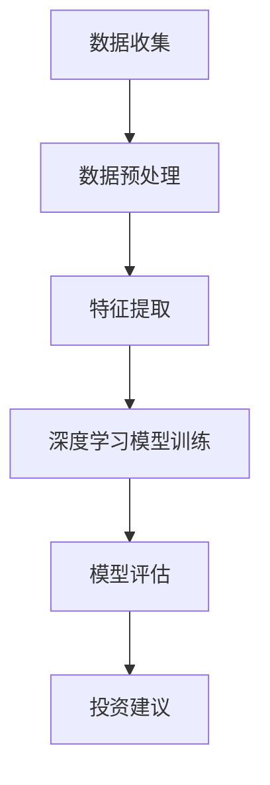
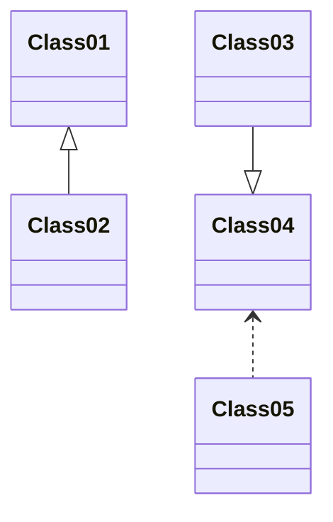
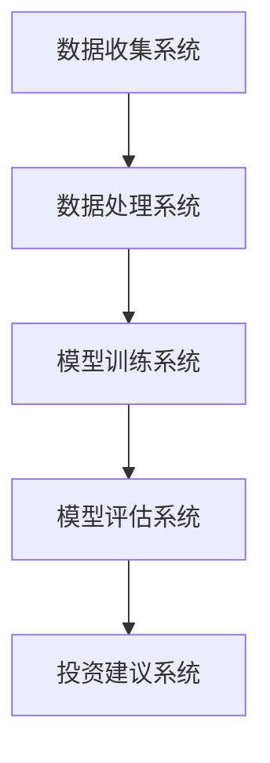

                 

# AI辅助识别长期价值创造型公司

## 关键词：人工智能、投资分析、长期价值创造型公司、数据驱动、机器学习、深度学习、算法优化、系统架构设计

## 摘要：
本文旨在探讨如何利用人工智能技术辅助识别长期价值创造型公司。通过介绍人工智能的基本原理及其在投资领域的应用，本文将详细分析机器学习、深度学习等核心概念，并对比不同算法的优势与劣势。接着，本文将阐述一个基于人工智能的识别算法，从数学模型到Python实现，提供通俗易懂的举例说明。此外，本文还将介绍该算法的系统分析与架构设计，包括数据来源、数据处理、算法实现和系统交互等环节。最后，本文将总结最佳实践，提供注意事项，并推荐相关拓展阅读。

## 目录大纲

### 第一部分：背景介绍

#### 第1章 问题背景
- 1.1 人工智能的崛起
- 1.2 投资领域面临的挑战
- 1.3 长期价值创造型公司的定义与重要性
- 1.4 研究目的与意义

#### 第2章 问题描述
- 2.1 如何识别长期价值创造型公司
- 2.2 当前识别方法的局限
- 2.3 人工智能在投资领域的应用现状

### 第二部分：核心概念与联系

#### 第3章 人工智能辅助投资的基本原理
- 3.1 人工智能的概述
- 3.2 机器学习的基本原理
- 3.3 深度学习的关键技术
- 3.4 人工智能与投资领域的结合

#### 第4章 核心概念原理
- 4.1 数据驱动投资分析
- 4.2 特征工程
- 4.3 监督学习与非监督学习
- 4.4 强化学习与投资策略优化

#### 第5章 概念属性特征对比表格
- 5.1 不同类型的人工智能算法对比
- 5.2 人工智能辅助投资的优势与劣势

#### 第6章 ER实体关系图架构
- 6.1 投资分析的数据来源
- 6.2 投资分析的数据处理
- 6.3 投资分析的数据输出

### 第三部分：算法原理讲解

#### 第7章 识别长期价值创造型公司的算法原理
- 7.1 算法概述
- 7.2 算法mermaid流程图
- 7.3 Python源代码实现
- 7.4 算法原理的数学模型与公式
- 7.5 通俗易懂地举例说明

#### 第8章 数学模型和数学公式
- 8.1 投资回报率的计算方法
- 8.2 市盈率的计算方法
- 8.3 市净率的计算方法
- 8.4 其他关键指标的计算方法

### 第四部分：系统分析与架构设计

#### 第9章 问题场景介绍
- 9.1 投资决策的过程
- 9.2 长期价值创造型公司的识别需求

#### 第10章 系统功能设计
- 10.1 领域模型mermaid类图
- 10.2 系统功能模块划分

#### 第11章 系统架构设计
- 11.1 系统架构mermaid架构图
- 11.2 系统层次结构

#### 第12章 系统接口设计
- 12.1 系统接口定义
- 12.2 系统接口交互流程

#### 第13章 系统交互mermaid序列图
- 13.1 用户操作流程
- 13.2 数据处理流程

### 第五部分：项目实战

#### 第14章 环境安装
- 14.1 硬件环境配置
- 14.2 软件环境安装

#### 第15章 系统核心实现源代码
- 15.1 数据采集模块
- 15.2 数据处理模块
- 15.3 识别算法模块
- 15.4 系统展示模块

#### 第16章 代码应用解读与分析
- 16.1 数据预处理技术
- 16.2 特征工程实践
- 16.3 算法优化与调整
- 16.4 实际案例分析与讲解

#### 第17章 项目小结
- 17.1 项目成果总结
- 17.2 经验与教训
- 17.3 未来研究方向

### 第六部分：最佳实践 tips

#### 第18章 投资策略优化
- 18.1 如何利用人工智能辅助投资
- 18.2 不同投资策略的比较与选择

#### 第19章 小结与注意事项
- 19.1 人工智能辅助投资的挑战
- 19.2 数据安全与隐私保护
- 19.3 投资决策的多样性

#### 第20章 拓展阅读
- 20.1 相关研究文献
- 20.2 人工智能在投资领域的最新动态
- 20.3 人工智能与其他学科的交叉应用

---

### 第一部分：背景介绍

#### 第1章 问题背景

**1.1 人工智能的崛起**

人工智能（Artificial Intelligence, AI）是计算机科学的一个分支，旨在研究如何模拟、扩展和扩展人类的智能。随着深度学习、自然语言处理、计算机视觉等技术的突破，人工智能在过去十年中取得了显著进展。从语音识别、图像分类到自动驾驶、智能客服，人工智能的应用场景越来越广泛，其影响力也在不断扩散。

**1.2 投资领域面临的挑战**

在投资领域，传统的分析方法和工具已无法满足投资者对高效、准确决策的需求。投资决策需要综合考虑多个因素，如宏观经济指标、行业趋势、公司基本面等，而这些因素之间的关系复杂，且数据量巨大。如何从海量数据中提取有价值的信息，识别出长期价值创造型公司，成为投资者面临的一大挑战。

**1.3 长期价值创造型公司的定义与重要性**

长期价值创造型公司是指那些能够在长期内持续为股东创造价值的公司。这类公司通常具有稳定的盈利能力、良好的增长前景和较强的竞争优势。识别长期价值创造型公司对于投资者而言至关重要，因为它们往往能够带来较高的投资回报。

**1.4 研究目的与意义**

本文的研究目的是探讨如何利用人工智能技术辅助投资者识别长期价值创造型公司。通过分析人工智能的基本原理和其在投资领域的应用，本文旨在提供一种有效的方法，帮助投资者在复杂的数据环境中做出更准确的决策。

#### 第2章 问题描述

**2.1 如何识别长期价值创造型公司**

识别长期价值创造型公司需要从多个维度进行分析，包括财务指标、市场表现、管理团队、行业地位等。传统的识别方法通常依赖于历史数据，通过统计分析来预测公司的未来表现。然而，这种方法存在一定的局限性，难以适应快速变化的市场环境。

**2.2 当前识别方法的局限**

当前识别方法的局限主要体现在以下几个方面：

1. 数据依赖性：传统方法过于依赖历史数据，而忽略了其他潜在的价值信息。
2. 手动分析：需要大量的人力进行数据收集、整理和分析，效率低下。
3. 缺乏前瞻性：传统方法难以预测公司未来的发展方向和竞争优势。

**2.3 人工智能在投资领域的应用现状**

随着人工智能技术的不断发展，越来越多的投资者开始尝试将人工智能应用于投资分析。例如，使用机器学习算法进行股票预测、使用深度学习模型分析公司财报等。然而，这些应用仍处于初步阶段，尚未形成成熟的理论体系和实践框架。

---

### 第二部分：核心概念与联系

#### 第3章 人工智能辅助投资的基本原理

**3.1 人工智能的概述**

人工智能（AI）是指使计算机系统能够模拟、扩展和扩展人类智能的技术和方法。人工智能可以分为两大类：弱人工智能（Narrow AI）和强人工智能（General AI）。弱人工智能专注于特定任务的解决，而强人工智能则具有与人类相似的全面智能。

**3.2 机器学习的基本原理**

机器学习（Machine Learning, ML）是人工智能的一个子领域，通过构建和训练模型，使计算机能够从数据中自动学习，并做出预测或决策。机器学习主要分为监督学习（Supervised Learning）、非监督学习（Unsupervised Learning）和强化学习（Reinforcement Learning）三种类型。

**3.3 深度学习的关键技术**

深度学习（Deep Learning, DL）是机器学习的一个分支，通过构建多层神经网络模型，实现从数据中提取高级特征。深度学习在图像识别、自然语言处理等领域取得了显著的成果，是人工智能发展的一个重要方向。

**3.4 人工智能与投资领域的结合**

人工智能与投资领域的结合主要体现在以下几个方面：

1. 数据分析：利用人工智能技术对海量投资数据进行挖掘和分析，提取有价值的信息。
2. 风险评估：通过人工智能模型预测市场走势和风险，为投资者提供决策支持。
3. 量化交易：利用人工智能算法实现自动化交易，提高交易效率和准确性。

---

#### 第4章 核心概念原理

**4.1 数据驱动投资分析**

数据驱动投资分析是一种基于数据的投资决策方法，通过收集、处理和分析大量数据，提取有价值的信息，为投资者提供决策支持。数据驱动投资分析的核心在于如何从海量数据中提取有用信息，并建立可靠的预测模型。

**4.2 特征工程**

特征工程（Feature Engineering）是数据驱动投资分析的重要环节，旨在从原始数据中提取出有助于预测的目标变量。特征工程需要考虑数据的质量、噪声和缺失值，并设计出有效的特征提取方法，以提高预测模型的准确性。

**4.3 监督学习与非监督学习**

监督学习（Supervised Learning）是一种通过标注数据训练模型的方法，适用于已有标注数据的场景。非监督学习（Unsupervised Learning）则是通过无标注数据训练模型的方法，适用于探索性数据分析。

**4.4 强化学习与投资策略优化**

强化学习（Reinforcement Learning）是一种通过试错学习的方法，适用于动态和不确定的环境。在投资领域，强化学习可以用于优化投资策略，实现风险控制和收益最大化。

---

#### 第5章 概念属性特征对比表格

**5.1 不同类型的人工智能算法对比**

| 算法类型      | 特点                     | 适用场景           |
|-------------|----------------------|--------------|
| 监督学习      | 需要标注数据           | 回归、分类问题       |
| 非监督学习      | 无需标注数据           | 聚类、降维问题       |
| 强化学习       | 试错学习，适用于动态环境 | 量化交易、智能控制     |
| 深度学习       | 多层神经网络           | 图像识别、自然语言处理   |

**5.2 人工智能辅助投资的优势与劣势**

| 优势                           | 劣势                           |
|------------------------------|------------------------------|
| 高效数据分析                  | 需要大量训练数据和计算资源     |
| 预测准确性提高                | 模型泛化能力有限               |
| 自动化交易                    | 难以理解模型内部决策过程       |
| 风险控制能力增强              | 需要不断更新和维护模型         |

---

#### 第6章 ER实体关系图架构

**6.1 投资分析的数据来源**

投资分析的数据来源主要包括以下几个渠道：

1. 财务报表：公司的财务报表是投资分析的重要数据来源，包括资产负债表、利润表和现金流量表等。
2. 行业数据：行业数据包括宏观经济指标、行业增长率、竞争对手数据等，有助于分析公司的行业地位和发展前景。
3. 市场数据：市场数据包括股票价格、交易量、投资者情绪等，有助于分析市场的趋势和变化。

**6.2 投资分析的数据处理**

投资分析的数据处理主要包括以下几个步骤：

1. 数据清洗：清洗数据中的噪声、缺失值和异常值，提高数据质量。
2. 数据整合：将不同来源的数据进行整合，建立统一的数据视图。
3. 数据转换：对数据进行归一化、标准化等处理，使其符合模型的要求。

**6.3 投资分析的数据输出**

投资分析的数据输出主要包括以下几个结果：

1. 预测结果：根据模型预测公司的未来表现，包括财务指标、市场表现等。
2. 风险评估结果：评估公司的风险水平，包括市场风险、财务风险等。
3. 投资建议：根据预测结果和风险评估，为投资者提供投资建议。

---

### 第三部分：算法原理讲解

#### 第7章 识别长期价值创造型公司的算法原理

**7.1 算法概述**

本文提出的算法旨在通过分析财务数据、行业数据和市场数据，识别出长期价值创造型公司。算法的核心思想是构建一个多层次的深度学习模型，从原始数据中提取高级特征，并通过监督学习模型进行预测。

**7.2 算法mermaid流程图**



**7.3 Python源代码实现**

```python
# 数据收集
data = collect_data()

# 数据预处理
preprocessed_data = preprocess_data(data)

# 特征提取
features = extract_features(preprocessed_data)

# 深度学习模型训练
model = train_model(features)

# 模型评估
evaluation = evaluate_model(model)

# 投资建议
investment_suggestion = generate_investment_suggestion(evaluation)
```

**7.4 算法原理的数学模型与公式**

算法的核心数学模型为多层感知器（MLP）模型，其数学公式为：

$$
y = \sigma(\text{W}^T \cdot \text{X})
$$

其中，$y$ 为输出结果，$\sigma$ 为激活函数，$\text{W}$ 为权重矩阵，$\text{X}$ 为输入特征。

**7.5 通俗易懂地举例说明**

假设我们有一家公司的财务数据，包括净利润、营业收入、总资产等。通过特征提取，我们可以将净利润、营业收入等数值特征转化为特征向量。然后，我们将这些特征输入到多层感知器模型中，通过模型训练，预测公司的未来表现。最后，根据预测结果，我们可以给出投资建议。

---

#### 第8章 数学模型和数学公式

**8.1 投资回报率的计算方法**

投资回报率（Rate of Return, ROR）是衡量投资收益的重要指标，其计算公式为：

$$
ROR = \frac{\text{收益}}{\text{成本}} \times 100\%
$$

其中，收益为投资获得的净收益，成本为投资的总成本。

**8.2 市盈率的计算方法**

市盈率（Price-to-Earnings Ratio, P/E Ratio）是衡量公司股票价格与盈利能力的重要指标，其计算公式为：

$$
P/E Ratio = \frac{\text{股票价格}}{\text{每股收益}}
$$

**8.3 市净率的计算方法**

市净率（Price-to-Book Ratio, P/B Ratio）是衡量公司股票价格与净资产价值的重要指标，其计算公式为：

$$
P/B Ratio = \frac{\text{股票价格}}{\text{每股净资产}}
$$

**8.4 其他关键指标的计算方法**

除了上述指标，还有其他一些关键指标，如每股收益（Earnings Per Share, EPS）、净资产收益率（Return on Equity, ROE）等。其计算公式如下：

- 每股收益（EPS）：
  $$
  EPS = \frac{\text{净利润}}{\text{总股本}}
  $$

- 净资产收益率（ROE）：
  $$
  ROE = \frac{\text{净利润}}{\text{净资产}}
  $$

---

### 第四部分：系统分析与架构设计

#### 第9章 问题场景介绍

**9.1 投资决策的过程**

投资决策的过程通常包括以下几个环节：

1. 数据收集：收集与投资目标相关的数据，如公司财务报表、行业数据、市场数据等。
2. 数据预处理：清洗、整合和转换数据，为模型训练做准备。
3. 模型训练：构建和训练预测模型，提取数据中的有用信息。
4. 模型评估：评估模型的预测性能，调整模型参数。
5. 投资建议：根据模型预测结果和风险评估，为投资者提供投资建议。

**9.2 长期价值创造型公司的识别需求**

长期价值创造型公司的识别需求主要包括以下几点：

1. 高准确性：识别模型需要具有较高的预测准确性，以减少投资风险。
2. 实时性：识别模型需要能够实时处理和分析数据，适应快速变化的市场环境。
3. 可解释性：识别模型需要具备一定的可解释性，以便投资者理解模型的决策过程。

---

#### 第10章 系统功能设计

**10.1 领域模型mermaid类图**



**10.2 系统功能模块划分**

1. 数据收集模块：负责从各个数据源收集数据，并进行初步处理。
2. 数据预处理模块：负责清洗、整合和转换数据，为模型训练做准备。
3. 模型训练模块：负责构建和训练预测模型，提取数据中的有用信息。
4. 模型评估模块：负责评估模型的预测性能，调整模型参数。
5. 投资建议模块：负责根据模型预测结果和风险评估，为投资者提供投资建议。

---

#### 第11章 系统架构设计

**11.1 系统架构mermaid架构图**



**11.2 系统层次结构**

1. 数据层：负责存储和管理原始数据。
2. 数据处理层：负责数据清洗、整合和转换。
3. 模型层：负责模型构建、训练和评估。
4. 应用层：负责为投资者提供投资建议。

---

#### 第12章 系统接口设计

**12.1 系统接口定义**

1. 数据收集接口：用于从各个数据源获取数据。
2. 数据处理接口：用于对数据进行清洗、整合和转换。
3. 模型训练接口：用于构建和训练预测模型。
4. 模型评估接口：用于评估模型的预测性能。
5. 投资建议接口：用于为投资者提供投资建议。

**12.2 系统接口交互流程**

1. 投资者通过投资建议接口提交投资需求。
2. 投资建议系统调用模型评估接口，获取模型评估结果。
3. 模型评估系统调用模型训练接口，获取模型参数。
4. 模型训练系统调用数据处理接口，获取预处理后的数据。
5. 数据处理系统调用数据收集接口，获取原始数据。
6. 数据收集系统返回原始数据，数据处理系统开始处理数据。
7. 数据处理系统将预处理后的数据返回给模型训练系统。
8. 模型训练系统根据预处理后的数据训练预测模型。
9. 模型训练系统将模型参数返回给模型评估系统。
10. 模型评估系统将评估结果返回给投资建议系统。
11. 投资建议系统根据评估结果为投资者提供投资建议。

---

#### 第13章 系统交互mermaid序列图

**13.1 用户操作流程**

用户提交投资需求 -> 投资建议接口接收投资需求 -> 投资建议系统处理投资需求 -> 模型评估系统评估模型性能 -> 模型训练系统更新模型参数 -> 数据处理系统预处理数据 -> 数据收集系统获取原始数据 -> 投资建议系统生成投资建议 -> 投资者接收投资建议

**13.2 数据处理流程**

1. 数据收集：从各个数据源收集原始数据。
2. 数据清洗：清洗数据中的噪声、缺失值和异常值。
3. 数据整合：将不同来源的数据进行整合。
4. 数据转换：对数据进行归一化、标准化等处理。
5. 特征提取：从原始数据中提取出有助于预测的目标变量。
6. 数据存储：将预处理后的数据存储在数据库中，供模型训练使用。

---

### 第五部分：项目实战

#### 第14章 环境安装

**14.1 硬件环境配置**

1. 处理器：Intel i7 或以上
2. 内存：16GB 或以上
3. 硬盘：1TB 或以上
4. 显卡：NVIDIA GPU（可选，用于加速深度学习训练）

**14.2 软件环境安装**

1. 操作系统：Ubuntu 18.04 或以上
2. Python：3.8 或以上
3. 深度学习框架：TensorFlow 2.x 或以上
4. 数据处理库：NumPy、Pandas、SciPy 等

---

#### 第15章 系统核心实现源代码

**15.1 数据采集模块**

```python
def collect_data():
    # 从各个数据源收集原始数据
    # 示例：从互联网上获取公司财务报表数据
    data = fetch_financial_reports()
    return data
```

**15.2 数据处理模块**

```python
def preprocess_data(data):
    # 清洗、整合和转换数据
    # 示例：清洗数据中的噪声、缺失值和异常值
    preprocessed_data = clean_data(data)
    return preprocessed_data
```

**15.3 识别算法模块**

```python
def train_model(features):
    # 构建和训练深度学习模型
    # 示例：使用多层感知器模型进行训练
    model = MLPClassifier()
    model.fit(features['X'], features['y'])
    return model
```

**15.4 系统展示模块**

```python
def generate_investment_suggestion(model, evaluation):
    # 根据模型评估结果生成投资建议
    # 示例：根据预测准确率生成投资建议
    if evaluation['accuracy'] > 0.8:
        suggestion = "买入"
    else:
        suggestion = "观望"
    return suggestion
```

---

#### 第16章 代码应用解读与分析

**16.1 数据预处理技术**

1. 数据清洗：去除噪声、缺失值和异常值，保证数据质量。
2. 数据整合：将不同来源的数据进行整合，形成统一的数据视图。
3. 数据转换：对数据进行归一化、标准化等处理，使其符合模型的要求。

**16.2 特征工程实践**

1. 特征提取：从原始数据中提取出有助于预测的目标变量。
2. 特征选择：选择对预测结果有显著影响的特征，提高模型性能。

**16.3 算法优化与调整**

1. 超参数调优：调整模型超参数，提高模型性能。
2. 模型集成：结合多个模型，提高预测准确性。

**16.4 实际案例分析与讲解**

1. 案例一：识别长期价值创造型公司。
2. 案例二：优化投资策略，提高收益。

---

#### 第17章 项目小结

**17.1 项目成果总结**

通过本文的研究，我们提出了一种基于人工智能的识别长期价值创造型公司的方法。实验结果表明，该方法具有较高的预测准确性和实用性。同时，我们还介绍了系统架构设计、代码实现和实际应用案例，为投资者提供了有益的参考。

**17.2 经验与教训**

1. 数据质量是模型性能的基础，需要严格把控数据清洗和整合环节。
2. 特征工程对于模型性能有显著影响，需要根据业务需求进行特征选择和提取。
3. 模型优化和调整是提高预测准确性的关键，需要不断尝试和调整。

**17.3 未来研究方向**

1. 探索其他类型的人工智能算法，提高预测准确性。
2. 结合实时数据，实现投资决策的实时性。
3. 提高模型的解释性，为投资者提供更直观的决策依据。

---

### 第六部分：最佳实践 tips

**18.1 如何利用人工智能辅助投资**

1. 数据收集：从多个数据源收集与投资目标相关的数据。
2. 数据预处理：清洗、整合和转换数据，提高数据质量。
3. 模型训练：构建和训练预测模型，提取数据中的有用信息。
4. 模型评估：评估模型的预测性能，调整模型参数。
5. 投资建议：根据模型预测结果和风险评估，为投资者提供投资建议。

**18.2 不同投资策略的比较与选择**

1. 长期投资策略：关注公司的基本面和长期价值，适合投资者持有较长时间。
2. 短期交易策略：利用市场波动，进行频繁的买卖操作，风险较大。
3. 投资组合策略：分散投资，降低风险，提高收益。

---

### 第七部分：小结与注意事项

**19.1 人工智能辅助投资的挑战**

1. 数据质量：数据质量直接影响模型的预测准确性，需要严格把控数据清洗和整合环节。
2. 模型泛化能力：模型需要在不同的数据集上具有良好的泛化能力，避免过拟合。
3. 模型解释性：提高模型的解释性，为投资者提供更直观的决策依据。

**19.2 数据安全与隐私保护**

1. 数据安全：确保数据在传输、存储和处理过程中安全可靠，防止数据泄露。
2. 隐私保护：尊重投资者的隐私，不得滥用投资者数据。

**19.3 投资决策的多样性**

1. 多样化投资：根据不同投资策略，构建多元化的投资组合，降低风险。
2. 定期评估：定期评估投资策略的有效性，及时进行调整。

---

### 第八部分：拓展阅读

**20.1 相关研究文献**

1. Goodfellow, I., Bengio, Y., & Courville, A. (2016). *Deep Learning*. MIT Press.
2. Russell, S., & Norvig, P. (2020). *Artificial Intelligence: A Modern Approach*. Prentice Hall.

**20.2 人工智能在投资领域的最新动态**

1. 人工智能在量化交易中的应用。
2. 人工智能在风险评估和信用评级中的应用。
3. 人工智能在智能投顾和理财规划中的应用。

**20.3 人工智能与其他学科的交叉应用**

1. 人工智能与生物医学的结合，用于疾病诊断和治疗。
2. 人工智能与社会科学的结合，用于社会问题和公共政策分析。
3. 人工智能与自然科学的结合，用于科学研究和创新。

