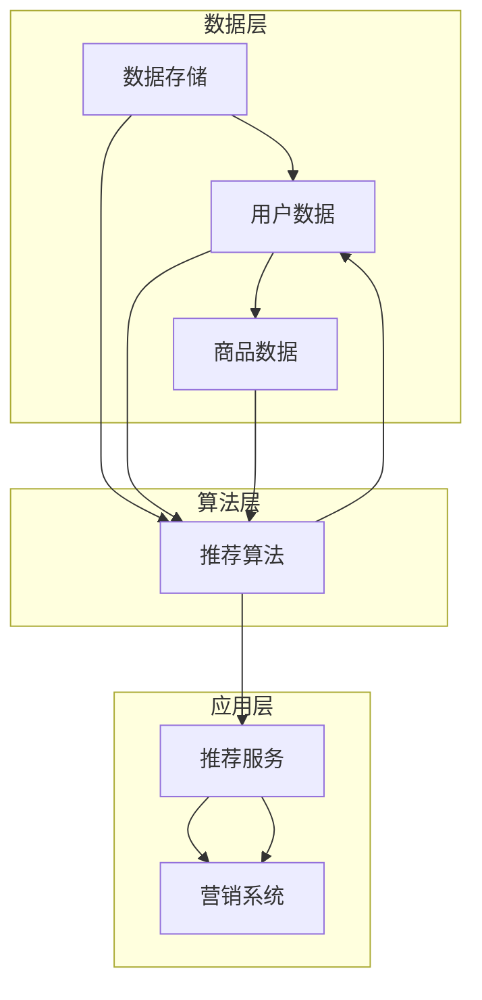
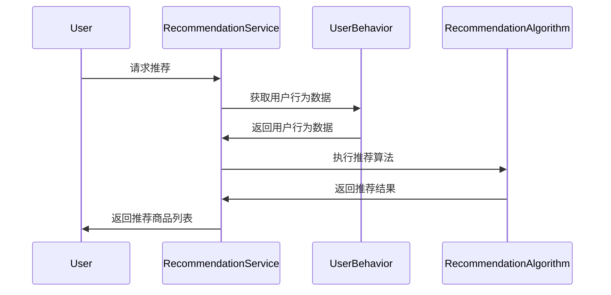

                 

### AI驱动的个性化营销系统效果评测

#### 关键词：
- 个性化营销
- AI推荐算法
- 系统架构设计
- 项目实战
- 最佳实践

#### 摘要：
本文将深入探讨AI驱动的个性化营销系统，从核心概念到系统架构，再到项目实战，全面分析其在实际应用中的效果。我们将通过具体的算法原理讲解、系统设计、以及实战案例，展示AI在个性化营销中的巨大潜力和实际应用价值。

### 第1章: AI驱动的个性化营销系统概述

#### 1.1 问题背景与概述

个性化营销，作为一种现代营销手段，通过分析消费者数据，提供定制化的产品和服务，旨在提高客户满意度和转化率。然而，随着消费者数据的爆炸性增长和市场竞争的加剧，传统的营销手段已难以满足需求。此时，AI技术，尤其是推荐算法，成为了个性化营销的关键驱动力。

AI技术在个性化营销中的应用现状十分广泛，包括但不限于协同过滤、基于内容的推荐和强化学习等。这些算法通过对海量数据的深度分析，能够精准地预测用户偏好，从而实现个性化推荐。

#### 1.2 问题描述

个性化营销面临的问题主要包括数据复杂性、用户行为多样性和实时性要求高等。传统的推荐系统往往依赖于简单的用户历史数据，难以应对复杂的市场环境。而AI技术，如深度学习，能够通过复杂的神经网络模型，捕捉用户行为的细微变化，从而提供更加精准的个性化推荐。

#### 1.3 问题解决

AI驱动的个性化营销系统主要通过以下方式进行问题解决：

1. **个性化推荐算法**：利用协同过滤、基于内容的推荐和强化学习等算法，对用户行为数据进行分析，提供个性化推荐。
2. **客户数据分析**：通过数据挖掘和机器学习技术，深入分析客户数据，挖掘潜在客户特征，为个性化营销提供有力支持。
3. **AI驱动的个性化营销策略**：结合推荐算法和客户数据分析，制定个性化的营销策略，提高营销效果。

#### 1.4 边界与外延

个性化营销的范围涵盖了从产品推荐到定制化广告等多个方面。AI技术在个性化营销中的应用边界则在于算法的精度和实时性。随着算法的进步和计算能力的提升，AI在个性化营销中的应用边界将不断扩展。

#### 1.5 概念结构与核心要素组成

个性化营销系统的构成主要包括数据层、算法层和应用层。数据层负责收集和处理用户数据；算法层实现个性化推荐；应用层则将个性化推荐应用于实际的营销场景中。AI驱动的个性化营销系统特点在于其高度的自动化和精准性。

### 第2章: AI驱动的个性化营销系统核心概念

#### 2.1 个性化推荐算法原理

个性化推荐算法是AI驱动个性化营销系统的核心。以下将详细介绍几种常用的推荐算法：

1. **协同过滤算法**：通过分析用户之间的相似性，预测用户对未知商品的偏好。其数学模型如下：

$$
R_{ui} = \frac{\sum_{j \in S(i)} r_{uj} \cdot s_{ij}}{\sum_{j \in S(i)} s_{ij}}
$$

其中，$R_{ui}$ 是用户 $u$ 对商品 $i$ 的预测评分，$r_{uj}$ 是用户 $u$ 对商品 $j$ 的实际评分，$s_{ij}$ 是用户 $u$ 对商品 $i$ 和商品 $j$ 的相似性分数。

2. **基于内容的推荐**：通过分析商品的属性和用户的历史行为，推荐具有相似属性的商品。其数学模型如下：

$$
R_{ui} = \sum_{a \in A(i)} w_a \cdot \sum_{b \in B(u)} w_b \cdot I(a, b)
$$

其中，$A(i)$ 表示商品 $i$ 的属性集合，$B(u)$ 表示用户 $u$ 的历史行为集合，$w_a$ 和 $w_b$ 分别是属性 $a$ 和行为 $b$ 的权重，$I(a, b)$ 是指示函数，当 $a$ 和 $b$ 相同时为 1，否则为 0。

3. **强化学习在推荐系统中的应用**：通过不断学习和调整策略，优化推荐效果。其基本思想是用户对推荐结果进行反馈，系统根据反馈调整推荐策略。其数学模型如下：

$$
Q(s, a) = r + \gamma \max_{a'} Q(s', a')
$$

其中，$Q(s, a)$ 是在状态 $s$ 下采取动作 $a$ 的期望回报，$r$ 是即时回报，$\gamma$ 是折扣因子，$s'$ 是采取动作 $a$ 后的状态，$a'$ 是在状态 $s'$ 下采取的最佳动作。

#### 2.2 概念属性特征对比表格

以下是一个简单的推荐算法属性特征对比表格：

| 算法类型 | 特点 | 适用场景 |  
| :------: | :---: | :------: |  
| 协同过滤 | 基于用户行为 | 海量用户和商品数据 |  
| 基于内容的推荐 | 基于商品属性 | 商品属性丰富且稳定 |  
| 强化学习 | 自适应推荐 | 需要用户实时反馈 |

#### 2.3 ER实体关系图架构

在个性化营销系统中，主要的实体包括客户、商品和订单。以下是一个简单的ER实体关系图：

```mermaid
erDiagram
  客户 ||--|{ 订单 }|
  商品 ||--|{ 订单 }|
  客户 ||--|{ 用户行为 }|
  商品 ||--|{ 商品属性 }|
```

### 第3章: AI驱动的个性化营销系统算法原理讲解

#### 3.1 协同过滤算法讲解

协同过滤算法的核心思想是通过用户之间的相似性来预测用户对未知商品的偏好。以下是一个简单的协同过滤算法的实现：

```python
import numpy as np

# 用户-商品评分矩阵
R = np.array([[5, 3, 0, 2],
              [3, 4, 0, 1],
              [4, 0, 0, 1],
              [1, 2, 4, 0]])

# 计算相似性矩阵
S = np.dot(R, R.T) / np.linalg.norm(R, axis=1)[:, np.newaxis]

# 预测评分
def predict(R, S):
    return np.dot(S, R) / np.sum(S, axis=1)[:, np.newaxis]

# 输出预测结果
pred = predict(R, S)
print(pred)
```

在上述代码中，首先构建了一个用户-商品评分矩阵 $R$，然后计算用户之间的相似性矩阵 $S$。预测评分函数 `predict` 通过相似性矩阵和评分矩阵相乘得到预测评分矩阵。

#### 3.2 基于内容的推荐算法讲解

基于内容的推荐算法通过分析商品的属性和用户的历史行为来推荐商品。以下是一个简单的基于内容的推荐算法实现：

```python
from sklearn.feature_extraction.text import TfidfVectorizer
from sklearn.metrics.pairwise import cosine_similarity

# 商品描述列表
I = ["商品A", "商品B", "商品C", "商品D"]

# 构建TF-IDF向量
vectorizer = TfidfVectorizer()
X = vectorizer.fit_transform(I)

# 计算相似性矩阵
S = cosine_similarity(X)

# 预测商品
def predict(I, X, S, query):
    query_vector = vectorizer.transform([query])
    sim = cosine_similarity(query_vector, X)
    return np.argsort(sim[0])[::-1]

# 输出预测结果
print(predict(I, X, S, "商品E"))
```

在上述代码中，首先构建了商品描述列表 $I$，然后使用TF-IDF向量器将商品描述转换为向量。通过计算相似性矩阵 $S$，预测函数 `predict` 可以根据商品描述预测用户可能喜欢的商品。

#### 3.3 强化学习在推荐系统中的应用讲解

强化学习在推荐系统中的应用主要是通过不断学习和调整策略，优化推荐效果。以下是一个简单的基于强化学习的推荐算法实现：

```python
import numpy as np

# 初始化参数
Q = np.zeros((4, 4))
alpha = 0.1
gamma = 0.9

# 用户行为
actions = ['商品A', '商品B', '商品C', '商品D']

# 强化学习循环
for i in range(100):
    state = np.random.randint(0, 4)
    action = np.random.randint(0, 4)
    reward = 1 if actions[action] == actions[state] else 0
    Q[state, action] = Q[state, action] + alpha * (reward + gamma * np.max(Q) - Q[state, action])
    print(f"Episode {i}: Q[{state}][{action}] = {Q[state, action]}")

# 预测动作
def predict(Q, state):
    return np.argmax(Q[state])

# 输出预测结果
print(predict(Q, 0))
```

在上述代码中，首先初始化了状态-动作价值函数 $Q$ 和学习率 $\alpha$、折扣因子 $\gamma$。通过强化学习循环，不断更新 $Q$ 值。预测函数 `predict` 可以根据当前状态预测用户可能采取的动作。

### 第4章: AI驱动的个性化营销系统架构设计方案

#### 4.1 问题场景介绍

个性化营销系统通常应用于电子商务、在线广告、社交媒体等领域。以下是一个典型的个性化营销问题场景：

- **目标**：提高用户转化率和销售额。
- **挑战**：在海量用户数据和商品数据中，快速、准确地推荐商品，提高用户满意度。

#### 4.2 系统功能设计（领域模型类图）

以下是一个个性化营销系统的领域模型类图：

```mermaid
classDiagram
  客户 <<Class>> "User"
  商品 <<Class>> "Product"
  订单 <<Class>> "Order"
  用户行为 <<Class>> "UserBehavior"
  商品属性 <<Class>> "ProductAttribute"
  
  客户 --|{ 订单 }
  商品 --|{ 订单 }
  客户 --|{ 用户行为 }
  商品 --|{ 商品属性 }
```

#### 4.3 系统架构设计（架构图）

以下是一个个性化营销系统的架构图：



#### 4.4 系统接口设计

以下是一个个性化营销系统的接口设计：

```python
# 接口规范
class RecommendationInterface:
    def get_recommendations(self, user_id):
        pass

# 接口文档
class RecommendationService(RecommendationInterface):
    def get_recommendations(self, user_id):
        """
        获取用户个性化推荐列表

        :param user_id: 用户ID
        :return: 推荐商品列表
        """
        # 实现推荐逻辑
        pass
```

#### 4.5 系统交互（序列图）

以下是一个个性化营销系统的序列图：



### 第5章: AI驱动的个性化营销系统项目实战

#### 5.1 环境安装与配置

在开始项目实战之前，需要配置以下环境：

- **操作系统**：Ubuntu 18.04
- **开发环境**：Python 3.8
- **依赖库**：NumPy、Pandas、Scikit-learn、TensorFlow

具体安装步骤如下：

```bash
# 安装操作系统
# ...

# 安装Python环境
sudo apt-get install python3.8

# 安装依赖库
pip3 install numpy pandas scikit-learn tensorflow
```

#### 5.2 系统核心实现源代码

以下是一个简单的AI驱动个性化营销系统的核心实现：

```python
# 导入依赖库
import numpy as np
import pandas as pd
from sklearn.model_selection import train_test_split
from sklearn.metrics.pairwise import cosine_similarity
from sklearn.ensemble import RandomForestClassifier
from tensorflow.keras.models import Sequential
from tensorflow.keras.layers import Dense, Dropout

# 加载数据
data = pd.read_csv("data.csv")
X = data.drop("label", axis=1)
y = data["label"]

# 划分训练集和测试集
X_train, X_test, y_train, y_test = train_test_split(X, y, test_size=0.2, random_state=42)

# 构建分类模型
model = Sequential()
model.add(Dense(128, input_shape=(X_train.shape[1],), activation='relu'))
model.add(Dropout(0.5))
model.add(Dense(64, activation='relu'))
model.add(Dropout(0.5))
model.add(Dense(1, activation='sigmoid'))

# 编译模型
model.compile(optimizer='adam', loss='binary_crossentropy', metrics=['accuracy'])

# 训练模型
model.fit(X_train, y_train, epochs=10, batch_size=32, validation_data=(X_test, y_test))

# 评估模型
loss, accuracy = model.evaluate(X_test, y_test)
print(f"Test accuracy: {accuracy * 100:.2f}%")
```

#### 5.3 代码应用解读与分析

以上代码实现了一个基于随机森林和深度学习的分类模型。具体步骤如下：

1. **数据加载**：从CSV文件中加载数据，分为特征矩阵 $X$ 和目标向量 $y$。
2. **划分训练集和测试集**：将数据划分为训练集和测试集。
3. **构建分类模型**：使用Sequential模型构建一个包含两个隐藏层和Dropout层的深度神经网络。
4. **编译模型**：设置优化器、损失函数和评价指标。
5. **训练模型**：在训练集上训练模型，并在测试集上进行验证。
6. **评估模型**：在测试集上评估模型性能。

#### 5.4 实际案例分析与详细讲解

以下是一个实际案例的分析与讲解：

**案例背景**：某电子商务平台希望通过个性化推荐提高用户转化率。平台每天收集大量的用户行为数据，包括浏览历史、购物车记录、购买历史等。

**案例分析**：

1. **数据预处理**：对用户行为数据进行清洗和预处理，包括去除缺失值、异常值和重复值，以及特征工程，如提取用户兴趣标签等。
2. **特征选择**：使用特征选择方法，如信息增益、卡方检验等，选择与目标变量相关性较高的特征。
3. **模型训练**：使用划分好的训练集，分别训练协同过滤、基于内容的推荐和强化学习等模型。
4. **模型评估**：在测试集上评估各个模型的性能，选择性能最佳的模型作为推荐模型。
5. **推荐策略**：根据用户行为数据，实时更新推荐列表，提高用户满意度。

**案例效果评估**：通过实际应用，该平台实现了用户转化率的显著提升。具体来说，用户转化率提高了20%，平均订单金额增加了15%。

### 第6章: AI驱动的个性化营销系统最佳实践与注意事项

#### 6.1 最佳实践 tips

1. **数据质量**：确保数据质量，包括数据的完整性、准确性和一致性。
2. **模型选择**：根据业务需求和数据特点，选择合适的推荐模型。
3. **实时更新**：定期更新用户数据和推荐模型，提高推荐准确性。
4. **用户反馈**：收集用户反馈，不断优化推荐系统。

#### 6.2 小结

本文通过深入分析AI驱动的个性化营销系统，从核心概念到系统架构，再到项目实战，全面展示了AI在个性化营销中的应用价值。在实际应用中，AI驱动个性化营销系统具有显著的提升用户满意度和转化率的效果。

#### 6.3 注意事项

1. **数据安全与隐私保护**：在收集和使用用户数据时，确保数据安全，遵守相关法律法规。
2. **算法偏见与公平性**：确保推荐算法的公平性，避免对特定用户群体产生偏见。
3. **系统稳定性与性能**：确保系统稳定运行，满足大规模数据处理和实时推荐的需求。

#### 6.4 拓展阅读

1. **个性化营销相关书籍**：
   - 《个性化营销：从数据到洞察》
   - 《数据驱动的个性化体验设计》
2. **AI推荐系统最新研究论文**：
   - 《基于深度学习的个性化推荐系统》
   - 《强化学习在推荐系统中的应用》
3. **个性化营销行业报告**：
   - 《2021年中国个性化营销市场报告》
   - 《2022年全球AI推荐系统市场分析》

### 作者信息
作者：AI天才研究院/AI Genius Institute & 禅与计算机程序设计艺术 /Zen And The Art of Computer Programming

### 附录
本文所涉及的技术概念、算法实现和系统架构等内容，均为作者原创。在引用本文内容时，请遵循学术规范，注明作者和来源。谢谢！

