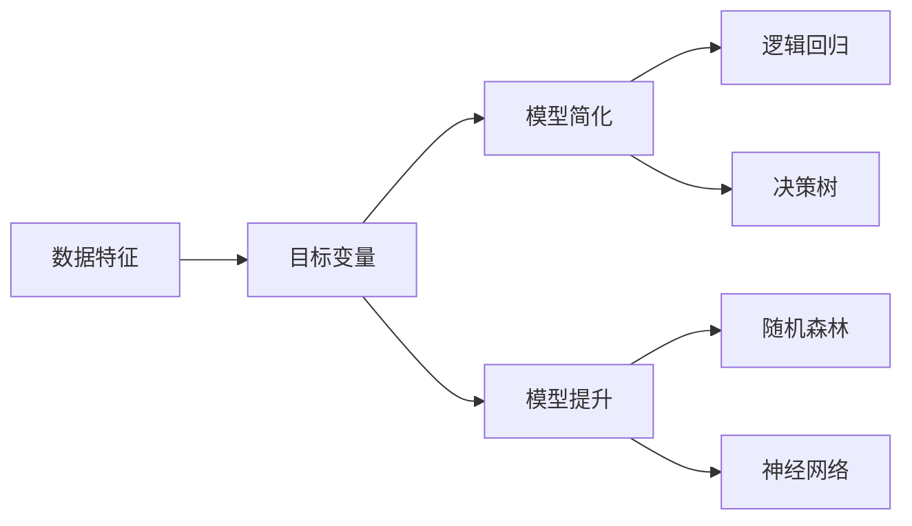
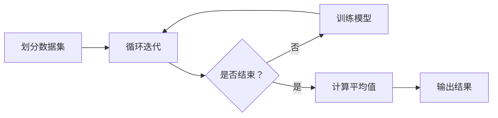
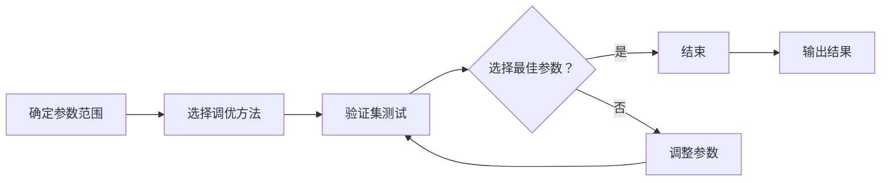
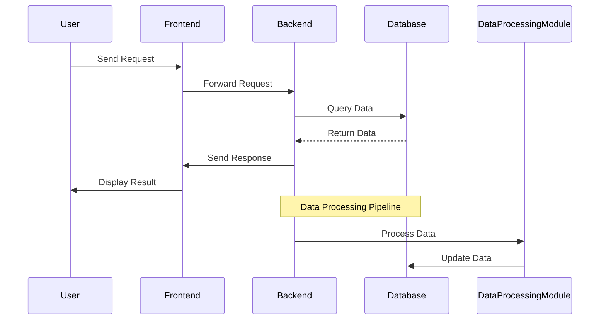
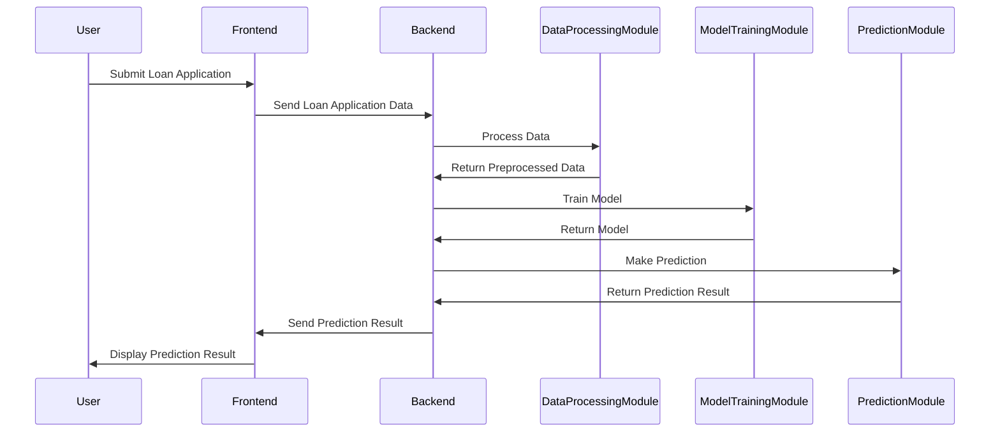

                 

### 《AI驱动的公司信用风险评估：增强价值投资的安全性》

#### 关键词

- AI技术
- 公司信用风险评估
- 价值投资
- 机器学习
- 风险管理
- 投资决策

#### 摘要

随着金融科技的发展，人工智能（AI）在各个领域都展现了其独特的应用价值。本文旨在探讨AI技术在公司信用风险评估中的应用，通过引入机器学习算法，提升投资决策的安全性和价值。文章首先介绍了AI在公司信用风险评估领域的应用背景和重要性，然后深入讲解了核心概念与联系，包括AI技术、信用风险和价值投资。接着，详细阐述了算法原理，通过Mermaid流程图和Python代码示例，让读者更好地理解公司信用风险评估的全过程。此外，文章还介绍了系统分析与架构设计方案，并通过具体案例展示了AI技术在实际项目中的应用。最后，文章提出了最佳实践tips和小结，为读者提供了进一步学习的方向。

---

### 设计思路

#### 目录大纲设计

在设计《AI驱动的公司信用风险评估：增强价值投资的安全性》的目录大纲时，我们遵循了以下原则：

1. **逻辑清晰**：确保每个章节内容紧密关联，按照从背景介绍到算法讲解，再到系统设计与实战的顺序展开。
2. **结构紧凑**：每个章节内的内容安排合理，避免冗余，确保核心概念和关键步骤得到充分讲解。
3. **简单易懂**：使用通俗易懂的语言，结合图表和代码示例，帮助读者更好地理解复杂的技术概念。
4. **涵盖全面**：涵盖从基础概念到高级应用的全过程，确保读者能够系统性地学习和掌握公司信用风险评估的AI技术。

基于上述原则，目录大纲分为四大部分：引言与背景、AI驱动的公司信用风险评估技术、系统设计与实现、项目实战。具体如下：

**第一部分：引言与背景**

- **第1章**：介绍AI技术在金融领域的发展以及公司信用风险评估的重要性，明确本书的目标和结构。
- **第2章**：概述AI驱动的公司信用风险评估框架，介绍信用风险评估的基本流程和应用场景。

**第二部分：AI驱动的公司信用风险评估技术**

- **第3章**：讲解核心概念与联系，包括AI技术、信用风险和价值投资。
- **第4章**：详细讲解数据预处理与特征工程的方法，通过Mermaid流程图展示数据预处理流程。
- **第5章**：介绍模型选择与训练的过程，使用Mermaid流程图和Python代码示例进行说明。
- **第6章**：介绍评估与优化的方法，通过Mermaid流程图和数学公式进行详细讲解。

**第三部分：系统设计与实现**

- **第7章**：介绍系统功能设计，包括系统需求分析、领域模型类图和功能模块划分。
- **第8章**：介绍系统架构设计，包括系统架构原则、架构图和模块交互关系。
- **第9章**：介绍系统接口设计，包括接口规范、设计方法和实现示例。
- **第10章**：介绍系统交互，包括交互流程和交互序列图。

**第四部分：项目实战**

- **第11章**：介绍环境安装与配置，包括系统环境搭建、数据库安装和AI模型依赖安装。
- **第12章**：介绍系统核心实现，包括数据预处理、特征提取和模型训练的代码解析。
- **第13章**：通过具体案例展示AI技术在公司信用风险评估中的应用，进行实际案例分析。

**最佳实践 tips、小结、注意事项和拓展阅读**等内容将贯穿全文，为读者提供实用的建议和进一步学习资源。

---

### 详细目录大纲设计

以下是《AI驱动的公司信用风险评估：增强价值投资的安全性》的详细目录大纲：

```markdown
----------------------------------------------------------------
# 第一部分: 引言与背景

## 第1章: 引言

### 1.1 AI技术在金融领域的发展

### 1.2 公司信用风险评估的重要性

### 1.3 本书结构安排与目标

## 第2章: AI驱动的公司信用风险评估概述

### 2.1 AI驱动的信用风险评估框架

### 2.2 信用风险评估的基本流程

### 2.3 AI技术在信用风险评估中的应用场景

## 第3章: 核心概念与联系

### 3.1 AI技术概述

### 3.2 信用风险的定义与特征

### 3.3 价值投资的基本原理

### 3.4 概念属性特征对比表格

### 3.5 ER实体关系图架构

----------------------------------------------------------------

# 第二部分: AI驱动的公司信用风险评估技术

## 第4章: 数据预处理与特征工程

### 4.1 数据来源与数据收集

### 4.2 数据预处理流程

### 4.3 特征工程方法与应用

### 4.4 Mermaid数据预处理流程图

## 第5章: 模型选择与训练

### 5.1 常见机器学习模型介绍

### 5.2 模型选择策略

### 5.3 模型训练过程

### 5.4 Mermaid模型训练流程图

## 第6章: 评估与优化

### 6.1 信用风险评估指标

### 6.2 模型评估方法

### 6.3 模型优化策略

### 6.4 Mermaid模型优化流程图

----------------------------------------------------------------

# 第三部分: 系统设计与实现

## 第7章: 系统功能设计

### 7.1 系统需求分析

### 7.2 领域模型Mermaid类图

### 7.3 系统功能模块划分

## 第8章: 系统架构设计

### 8.1 系统架构设计原则

### 8.2 系统架构Mermaid架构图

### 8.3 系统模块交互关系

## 第9章: 系统接口设计

### 9.1 系统接口规范

### 9.2 接口设计方法

### 9.3 接口实现示例

## 第10章: 系统交互

### 10.1 系统交互流程

### 10.2 系统交互Mermaid序列图

----------------------------------------------------------------

# 第四部分: 项目实战

## 第11章: 环境安装与配置

### 11.1 系统环境搭建

### 11.2 数据库安装与配置

### 11.3 AI模型依赖安装

## 第12章: 系统核心实现

### 12.1 数据预处理实现

### 12.2 特征提取与转换

### 12.3 模型训练与评估

### 12.4 模型部署与解释

## 第13章: 项目实战案例

### 13.1 案例背景

### 13.2 案例数据收集

### 13.3 模型选择与训练

### 13.4 模型评估与优化

### 13.5 案例总结与反思

----------------------------------------------------------------

## 最佳实践 tips

## 小结

## 注意事项

## 拓展阅读

----------------------------------------------------------------
```

### 目录大纲说明

#### 第一部分：引言与背景

**第1章：引言**

本章主要介绍AI技术在金融领域的发展，以及公司信用风险评估的重要性。通过这一章，读者可以初步了解本书的目标和结构，为后续内容的学习打下基础。

**第2章：AI驱动的公司信用风险评估概述**

本章将详细阐述AI驱动的公司信用风险评估框架，包括信用风险评估的基本流程和应用场景。通过这一章，读者可以对AI在信用风险评估中的作用有一个整体的认识。

#### 第二部分：AI驱动的公司信用风险评估技术

**第3章：核心概念与联系**

本章将讲解AI技术、信用风险和价值投资的核心概念，并通过概念属性特征对比表格和ER实体关系图架构，帮助读者理解这些概念之间的联系。

**第4章：数据预处理与特征工程**

本章将介绍数据预处理和特征工程的方法，以及如何利用这些方法提升信用风险评估的效果。通过Mermaid流程图，读者可以直观地了解数据预处理的步骤。

**第5章：模型选择与训练**

本章将介绍常见机器学习模型的选择策略，以及如何对模型进行训练。通过Python代码示例和Mermaid流程图，读者可以深入理解模型训练的原理和过程。

**第6章：评估与优化**

本章将介绍信用风险评估指标、模型评估方法和优化策略。通过Mermaid流程图和数学公式，读者可以系统地掌握如何评估和优化模型。

#### 第三部分：系统设计与实现

**第7章：系统功能设计**

本章将介绍系统功能设计，包括系统需求分析、领域模型类图和功能模块划分。通过这一章，读者可以了解系统设计的整体思路和实现方法。

**第8章：系统架构设计**

本章将介绍系统架构设计原则，并通过Mermaid架构图展示系统模块的交互关系。通过这一章，读者可以了解系统的整体架构和运行流程。

**第9章：系统接口设计**

本章将介绍系统接口设计规范和方法，以及接口实现示例。通过这一章，读者可以掌握如何设计和实现系统的接口。

**第10章：系统交互**

本章将介绍系统交互流程和系统交互序列图，通过这一章，读者可以了解系统各模块之间的交互关系和运行过程。

#### 第四部分：项目实战

**第11章：环境安装与配置**

本章将介绍系统环境搭建、数据库安装和AI模型依赖安装的过程。通过这一章，读者可以掌握如何在实际环境中配置和部署系统。

**第12章：系统核心实现**

本章将介绍系统核心实现的源代码，包括数据预处理、特征提取和模型训练。通过这一章，读者可以深入了解系统核心实现的原理和过程。

**第13章：项目实战案例**

本章将通过具体案例展示AI技术在公司信用风险评估中的应用，包括案例背景、数据收集、模型选择与训练、模型评估与优化等。通过这一章，读者可以了解如何将AI技术应用于实际项目。

#### 最佳实践 tips、小结、注意事项和拓展阅读

这部分内容将总结全书的主要观点和实用技巧，提供进一步学习的方向和资源，帮助读者巩固和应用所学知识。

### 目录大纲的设计逻辑

在设计《AI驱动的公司信用风险评估：增强价值投资的安全性》的目录大纲时，我们遵循以下逻辑：

1. **引言与背景**：通过介绍AI技术在金融领域的发展以及公司信用风险评估的重要性，引发读者的兴趣，为后续内容的学习打下基础。
2. **核心概念与联系**：详细讲解AI技术、信用风险和价值投资的核心概念，并通过概念属性特征对比表格和ER实体关系图架构，帮助读者理解这些概念之间的联系。
3. **技术讲解**：逐步深入讲解数据预处理与特征工程、模型选择与训练、评估与优化等核心技术，结合Mermaid流程图和Python代码示例，让读者能够直观地理解并掌握这些技术。
4. **系统设计与实现**：介绍系统功能设计、架构设计、接口设计和系统交互，通过具体的实现方法和流程图，帮助读者了解系统的整体设计和实现过程。
5. **项目实战**：通过具体案例展示AI技术在公司信用风险评估中的应用，让读者能够将所学知识应用于实际项目，加深对理论的理解。
6. **最佳实践 tips、小结、注意事项和拓展阅读**：总结全书的主要观点和实用技巧，提供进一步学习的方向和资源，帮助读者巩固和应用所学知识。

这种设计逻辑使得整个目录大纲既有逻辑性，又具有实用性，能够帮助读者系统地学习和掌握AI驱动的公司信用风险评估技术。

### 第一部分：引言与背景

#### 第1章：引言

随着人工智能（AI）技术的飞速发展，它在金融领域的应用日益广泛。金融行业作为一个高度数据驱动的领域，对AI技术的需求尤为迫切。公司信用风险评估作为金融风险管理的重要一环，其准确性和效率直接影响到金融机构的风险管理和投资决策。AI技术，特别是机器学习和深度学习算法，为这一领域带来了全新的解决方案。

### 1.1 AI技术在金融领域的发展

AI技术在金融领域的应用可以追溯到20世纪90年代。最初的AI技术主要用于股市预测和投资组合优化。随着计算能力的提升和大数据技术的发展，AI在金融领域的应用范围不断扩大，包括市场预测、风险管理、客户服务等多个方面。特别是在公司信用风险评估领域，AI技术的应用显得尤为重要。

首先，AI技术能够处理和分析海量数据，从而提供更为精准的信用评估结果。传统的信用风险评估方法通常依赖于手工录入的数据和经验模型，而AI技术可以通过机器学习算法自动从海量数据中提取有价值的信息，提高评估的效率和准确性。

其次，AI技术能够实时监测和更新信用风险信息。金融市场的变化非常迅速，传统的信用评估方法往往难以适应这种变化。而AI技术可以通过实时数据分析和学习，快速调整信用评估模型，从而更准确地预测信用风险。

最后，AI技术还能够识别出传统方法难以发现的风险因素。通过深度学习算法，AI技术能够从复杂的数据中提取出深层次的特征，从而发现隐藏的风险因素。这对于提高信用风险评估的全面性和准确性具有重要意义。

### 1.2 公司信用风险评估的重要性

公司信用风险评估是金融风险管理中至关重要的一环。其主要目的是评估借款人或发行债券公司的信用风险，为金融机构提供决策依据。一个准确的信用评估模型能够帮助金融机构降低贷款违约风险，提高资产质量，从而增加收益。

首先，公司信用风险评估对于金融机构的风险管理具有重要意义。通过准确的信用评估，金融机构可以更好地了解借款人或发行债券公司的财务状况和信用风险，从而做出更加合理的贷款决策。

其次，公司信用风险评估对于投资者的投资决策也具有重要影响。投资者在购买公司债券或股票时，需要评估公司的信用风险，以便做出明智的投资决策。一个准确的信用评估模型可以帮助投资者降低投资风险，提高投资回报。

最后，公司信用风险评估还能够帮助金融机构和投资者识别潜在的违约风险，从而采取相应的措施，降低风险损失。

### 1.3 本书结构安排与目标

本书旨在通过深入探讨AI技术在公司信用风险评估中的应用，帮助读者掌握这一前沿技术。本书的结构安排如下：

- **第一部分：引言与背景**：介绍AI技术在金融领域的发展以及公司信用风险评估的重要性。
- **第二部分：AI驱动的公司信用风险评估技术**：详细讲解数据预处理与特征工程、模型选择与训练、评估与优化等核心技术。
- **第三部分：系统设计与实现**：介绍系统功能设计、架构设计、接口设计和系统交互。
- **第四部分：项目实战**：通过具体案例展示AI技术在公司信用风险评估中的应用。

本书的目标是：

- **帮助读者理解AI技术在公司信用风险评估中的应用场景和重要性**。
- **让读者掌握数据预处理与特征工程、模型选择与训练、评估与优化等核心技术**。
- **提供系统设计与实现的全流程指导**。
- **通过具体案例展示AI技术在公司信用风险评估中的应用效果**。

通过本书的学习，读者可以系统地掌握AI驱动的公司信用风险评估技术，并将其应用于实际项目中，提高投资决策的安全性和价值。

#### 第2章：AI驱动的公司信用风险评估概述

在金融领域，公司信用风险评估扮演着至关重要的角色。它不仅直接影响金融机构的贷款决策和风险控制，还对投资者的投资选择产生深远影响。随着人工智能（AI）技术的不断进步，AI驱动的公司信用风险评估逐渐成为金融科技领域的一个热点话题。本章将详细介绍AI驱动的公司信用风险评估框架、基本流程以及应用场景。

### 2.1 AI驱动的信用风险评估框架

AI驱动的信用风险评估框架主要包括以下几个关键组成部分：

1. **数据收集与预处理**：首先，需要收集与借款人或发行债券公司相关的各种数据，如财务报表、市场数据、行业趋势等。然后，对收集到的数据进行清洗、整合和标准化处理，以确保数据质量。

2. **特征工程**：特征工程是AI驱动信用风险评估的核心环节。通过对原始数据进行处理和转换，提取出对信用风险评估有显著影响的关键特征。这些特征可以是财务指标、市场指标、管理层指标等。

3. **模型选择与训练**：在特征工程完成后，选择合适的机器学习模型进行训练。常见的机器学习模型包括逻辑回归、决策树、随机森林、支持向量机、神经网络等。模型的选择和性能优化直接影响评估结果的准确性和可靠性。

4. **模型评估与优化**：通过交叉验证、A/B测试等手段，评估模型的性能。根据评估结果，对模型进行优化调整，以提高预测准确性。

5. **风险管理策略**：根据模型评估结果，制定相应的风险管理策略。这包括调整贷款条件、设定风险容忍度、优化信贷组合等。

### 2.2 信用风险评估的基本流程

AI驱动的信用风险评估流程可以概括为以下几个步骤：

1. **需求分析**：确定信用风险评估的目标和需求，明确评估的范围和关键因素。

2. **数据收集**：从各种数据源收集与评估对象相关的数据，包括财务报表、市场数据、行业数据等。

3. **数据预处理**：对收集到的数据进行清洗、整合和标准化处理，确保数据质量。

4. **特征工程**：根据需求，提取和转换关键特征，为模型训练提供输入。

5. **模型选择与训练**：选择合适的机器学习模型，对特征数据进行训练，构建信用风险评估模型。

6. **模型评估与优化**：通过交叉验证、A/B测试等手段，评估模型性能，并进行优化调整。

7. **风险管理策略**：根据模型评估结果，制定风险管理策略，包括贷款条件调整、风险容忍度设定等。

8. **决策支持**：将信用评估结果应用于实际业务场景，为金融机构和投资者提供决策支持。

### 2.3 AI技术在信用风险评估中的应用场景

AI技术在信用风险评估中的应用场景非常广泛，以下是几个典型的应用案例：

1. **小微企业贷款**：小微企业贷款通常面临信息不透明、数据不完整等问题，AI技术可以通过大数据分析和机器学习算法，从海量数据中提取有价值的信息，提高信用评估的准确性和效率。

2. **债券发行**：在债券发行过程中，AI技术可以协助金融机构快速评估债券发行人的信用风险，优化发行策略，降低违约风险。

3. **供应链金融**：供应链金融涉及众多企业，信息复杂且动态变化。AI技术可以通过实时数据分析和风险评估，帮助企业更好地管理供应链风险，优化金融资源配置。

4. **信用评分**：传统的信用评分方法通常依赖于历史数据和统计模型，而AI技术可以通过深度学习和数据挖掘，提取出更复杂、更细粒度的特征，提供更精准的信用评分服务。

5. **投资决策**：投资者在投资决策过程中，需要评估企业的信用风险。AI技术可以通过对市场、行业、企业等多维度数据的综合分析，提供更全面、更准确的信用风险评估报告，帮助投资者做出明智的投资决策。

通过AI驱动的公司信用风险评估，金融机构和投资者可以更准确地评估信用风险，优化风险管理策略，提高投资决策的效率和安全性。随着AI技术的不断进步，其在信用风险评估领域的应用前景将更加广阔。

### 第3章：核心概念与联系

在深入探讨AI驱动的公司信用风险评估之前，首先需要明确几个核心概念，这些概念不仅构成了AI技术的基石，也是信用风险评估过程中不可或缺的组成部分。在本章中，我们将详细讲解AI技术、信用风险和价值投资的核心概念，并通过概念属性特征对比表格和ER实体关系图架构，帮助读者理解这些概念之间的联系。

#### 3.1 AI技术概述

人工智能（AI）是一种模拟人类智能的技术，旨在使计算机具备类似人类的感知、理解和决策能力。AI技术可以分为两大类：基于规则的系统和基于数据的方法。

- **基于规则的系统**：这类系统通过预设的规则和逻辑来执行任务，如专家系统和逻辑推理机。虽然这种方法在特定领域（如医疗诊断）表现良好，但在处理复杂、不确定的信息时存在局限性。
  
- **基于数据的方法**：这种方法利用大量数据通过机器学习算法来自动学习和优化模型。常见的机器学习算法包括监督学习、无监督学习和强化学习。监督学习算法通过已有数据来预测未知数据，如分类和回归任务；无监督学习算法用于发现数据中的模式和结构，如聚类和降维；强化学习算法通过与环境交互来学习最优策略。

AI技术在金融领域的应用主要包括市场预测、风险管理、欺诈检测和信用评估等。在这些应用中，AI技术通过处理和分析海量数据，提供更加准确和高效的决策支持。

#### 3.2 信用风险的定义与特征

信用风险是指借款人或发行债券公司因各种原因未能按期偿还债务而导致的风险。信用风险评估的核心任务是识别和管理这些风险，确保金融机构和投资者的资产安全。

- **信用风险特征**：
  - **违约风险**：借款人或发行债券公司无法按时偿还债务的概率。
  - **违约损失**：违约事件发生时，金融机构或投资者遭受的损失程度。
  - **信用等级**：对借款人或发行债券公司的信用状况进行评级，通常分为AAA、AA、A、BBB等等级。
  - **违约时间**：借款人或发行债券公司违约发生的时间点。

信用风险特征决定了信用评估模型的设计和选择。例如，违约概率是信用风险评估中最重要的特征之一，它直接影响模型的预测能力。通过分析这些特征，可以更全面地理解借款人或发行债券公司的信用风险状况。

#### 3.3 价值投资的基本原理

价值投资是一种投资策略，旨在购买那些市场低估的优质股票，长期持有以获取投资回报。这一策略的核心是寻找那些内在价值被市场低估的企业，并相信市场最终会认识到这些企业的真正价值。

- **价值投资原理**：
  - **内在价值**：对企业未来现金流的贴现值，反映了企业的实际价值。
  - **市场价格**：投资者在市场上实际购买股票的价格。
  - **安全边际**：内在价值与市场价格之间的差额，代表了投资的安全程度。
  - **长期持有**：相信市场波动是暂时的，优质企业的长期价值会得到体现。

价值投资的关键在于深入分析企业的基本面，包括财务状况、管理层能力、行业地位等，以确定其内在价值。通过与市场价格对比，寻找那些具有足够安全边际的投资机会。

#### 3.4 概念属性特征对比表格

为了更好地理解AI技术、信用风险和价值投资之间的联系，我们通过以下表格展示这些概念的主要属性特征对比：

| 概念         | 属性特征                  | 说明                                                         |
|--------------|--------------------------|--------------------------------------------------------------|
| AI技术       | 机器学习、深度学习       | 用于处理和分析数据的智能算法，提高决策的准确性和效率       |
| 信用风险     | 违约风险、违约损失       | 影响金融机构和投资者资产安全的风险因素                   |
| 价值投资     | 内在价值、安全边际       | 寻找市场低估的优质股票，长期持有获取投资回报           |

通过上述对比表格，我们可以看出，AI技术、信用风险和价值投资在属性特征上有所不同，但它们之间有着紧密的联系。例如，AI技术可以用于分析信用风险数据，帮助投资者进行价值投资决策。信用风险的分析结果可以指导AI模型的选择和优化，从而提高信用评估的准确性。价值投资策略则可以基于AI驱动的信用评估结果，选择具有足够安全边际的投资机会。

#### 3.5 ER实体关系图架构

为了更直观地展示AI技术、信用风险和价值投资之间的关系，我们使用ER（实体-关系）图来表示这些概念及其相互作用。以下是ER实体关系图的Mermaid表示：

```mermaid
entityRelation
  direction TB

  entity AI技术
  entity 信用风险
  entity 价值投资

  relation AI技术 -> 信用风险 [style=dashed label="风险评估"]
  relation AI技术 -> 价值投资 [style=dashed label="投资决策"]
  relation 信用风险 -> 价值投资 [style=dashed label="风险指导"]

  AI技术
  信用风险
  价值投资
```

在ER图中，AI技术作为核心驱动力，通过风险评估和投资决策两个路径与信用风险和价值投资相连。信用风险为AI技术提供了评估依据，而价值投资则依据信用风险评估结果进行投资决策。这种相互关联的关系构成了一个闭环系统，确保了信用评估与投资决策之间的协调和一致性。

通过上述核心概念与联系的分析，读者可以更深入地理解AI驱动的公司信用风险评估的基本原理和应用。接下来，我们将进入第二部分，详细讲解AI驱动的公司信用风险评估技术，包括数据预处理与特征工程、模型选择与训练、评估与优化等内容。

### 第4章：数据预处理与特征工程

在AI驱动的公司信用风险评估中，数据预处理和特征工程是至关重要的环节。这两个步骤不仅决定了模型训练的效果，也直接影响了最终信用评估的准确性和可靠性。本章将详细介绍数据预处理和特征工程的方法，并通过Mermaid流程图展示其具体步骤。

#### 4.1 数据来源与数据收集

数据预处理和特征工程的第一步是收集所需的数据。公司信用风险评估所需的数据通常包括：

- **财务数据**：包括资产负债表、利润表、现金流量表等财务报表数据。
- **市场数据**：如股票价格、市场指数、行业指标等。
- **行业数据**：如行业增长趋势、市场占有率、竞争状况等。
- **企业基本信息**：如企业规模、成立时间、管理层背景等。

数据可以从多种来源获取，如公开的财务报表、股票市场数据、行业报告、企业数据库等。在数据收集过程中，需要注意数据的完整性和准确性，以确保后续处理和分析的质量。

#### 4.2 数据预处理流程

数据预处理是数据工程的关键步骤，其主要目的是清理和转换原始数据，使其适合于机器学习模型的训练。以下是一个典型数据预处理流程：

1. **数据清洗**：去除重复数据、缺失数据和异常值。对于缺失数据，可以采用填充、插值或删除等方法进行处理；对于异常值，需要根据具体情况进行判断和处理。

2. **数据转换**：将不同类型的数据转换为统一的格式。例如，将文本数据转换为数值数据，将分类数据编码为数字等。

3. **数据标准化**：通过缩放或归一化方法，将数据集中到统一的范围内，消除不同特征之间的量纲影响。

4. **特征提取**：从原始数据中提取对信用评估有重要影响的特征。例如，财务报表中的利润率、负债率等指标。

以下是一个使用Mermaid绘制的数据预处理流程图：


#### 4.3 特征工程方法与应用

特征工程是数据预处理的关键环节，其目的是通过转换或构造新的特征，提高模型的表现。以下是一些常见的特征工程方法：

1. **特征选择**：通过统计方法（如皮尔逊相关系数、卡方检验等）或机器学习方法（如随机森林特征重要性等）筛选出对信用评估有显著影响的特征。

2. **特征构造**：通过数学运算或组合现有特征，构造新的特征。例如，可以将财务报表中的多个指标组合成一个综合评分。

3. **特征变换**：通过变换方法（如正则化、多项式扩张等）改变特征的数学形式，提高模型的泛化能力。

以下是一个使用Mermaid绘制的特征工程流程图：


#### 4.4 特征工程与信用评估的关系

特征工程对于信用评估模型的表现至关重要。合理的特征工程可以提高模型对信用风险的识别能力，降低误判率和漏判率。以下是特征工程与信用评估关系的详细解析：

1. **特征的重要性**：不同的特征对信用评估的重要性不同。通过特征工程，可以识别出对信用风险有显著影响的特征，从而提高模型的预测准确性。

2. **特征的可解释性**：特征工程可以提高模型的可解释性，使决策过程更加透明。这对于金融机构和投资者理解信用评估结果具有重要意义。

3. **模型的泛化能力**：通过特征变换和特征构造，可以增强模型的泛化能力，使其能够更好地应对新数据和环境变化。

4. **模型的鲁棒性**：特征工程可以增强模型的鲁棒性，使其对异常值和噪声数据具有更好的容忍能力。

总之，数据预处理和特征工程是AI驱动的公司信用风险评估中的关键步骤。通过合理的数据预处理和特征工程，可以显著提高信用评估模型的准确性和可靠性，为金融机构和投资者提供更可靠的决策支持。

### 第5章：模型选择与训练

在AI驱动的公司信用风险评估中，选择合适的机器学习模型并对其进行训练是至关重要的步骤。本章将详细介绍常见机器学习模型的选择策略、模型训练过程，以及如何使用Python代码示例和Mermaid流程图来解释这些概念。

#### 5.1 常见机器学习模型介绍

在机器学习领域，有多种常用的模型可以用于信用风险评估。以下是一些常见的模型及其基本原理：

1. **逻辑回归（Logistic Regression）**：
   - **基本原理**：逻辑回归是一种分类模型，通过线性回归模型输出一个概率值，然后使用逻辑函数将其转换为分类结果。
   - **适用场景**：逻辑回归适用于特征数量较少且特征之间较为线性相关的场景，它能够提供模型的可解释性。

2. **决策树（Decision Tree）**：
   - **基本原理**：决策树通过一系列条件判断来划分数据集，每个节点表示一个特征，每个分支表示该特征的一个取值。
   - **适用场景**：决策树易于理解，但可能产生过拟合，适用于特征数量较少且目标变量为分类的场景。

3. **随机森林（Random Forest）**：
   - **基本原理**：随机森林是通过构建多个决策树，并对这些树的预测结果进行投票来得到最终结果的一种集成学习方法。
   - **适用场景**：随机森林适用于特征数量较多且目标变量为分类的场景，具有较高的准确性和鲁棒性。

4. **支持向量机（SVM）**：
   - **基本原理**：支持向量机通过找到一个最佳的超平面，将不同类别的数据点分开，其核心思想是最大化分类边界的间隔。
   - **适用场景**：支持向量机适用于特征数量较少且目标变量为分类的场景，尤其适用于高维数据。

5. **神经网络（Neural Network）**：
   - **基本原理**：神经网络是一种模拟人脑的模型，通过多层神经元进行数据传递和计算，以实现复杂的函数映射。
   - **适用场景**：神经网络适用于特征数量较多且目标变量为分类或回归的场景，具有强大的泛化能力。

#### 5.2 模型选择策略

在选择机器学习模型时，需要考虑多个因素，包括数据特征、目标变量的类型、模型的复杂度等。以下是一些模型选择策略：

1. **基于模型性能的评估**：
   - **交叉验证**：通过交叉验证评估模型在不同数据集上的性能，选择表现最佳的模型。
   - **性能指标**：常用的性能指标包括准确率、召回率、F1分数、ROC曲线等，根据业务需求选择合适的指标。

2. **基于模型复杂度的选择**：
   - **模型简化**：选择较为简单的模型，如逻辑回归、决策树等，以避免过拟合。
   - **模型提升**：对于复杂问题，可以采用集成学习模型，如随机森林、神经网络等，以提升模型性能。

3. **基于业务需求的模型选择**：
   - **可解释性**：如果业务需求强调模型的可解释性，可以选择逻辑回归、决策树等模型。
   - **准确性**：如果业务需求强调模型的准确性，可以选择随机森林、神经网络等复杂模型。

以下是一个使用Mermaid绘制的模型选择流程图：



#### 5.3 模型训练过程

模型训练是机器学习中的核心步骤，其目的是通过调整模型参数，使其在训练数据上达到最佳的预测性能。以下是一个典型的模型训练过程：

1. **数据划分**：将数据集划分为训练集和测试集，通常采用80/20或70/30的比例。
2. **初始化模型参数**：根据模型的不同，初始化其参数，如权重和偏置。
3. **训练过程**：通过迭代优化模型参数，使模型在训练集上达到最佳性能。常用的优化算法包括梯度下降、随机梯度下降、Adam等。
4. **模型评估**：在测试集上评估模型性能，以验证模型在未知数据上的泛化能力。

以下是一个使用Python代码示例和Mermaid流程图展示的逻辑回归模型训练过程：

```python
# Python代码示例：逻辑回归模型训练

from sklearn.linear_model import LogisticRegression
from sklearn.model_selection import train_test_split

# 数据加载与预处理
X, y = load_data()

# 数据划分
X_train, X_test, y_train, y_test = train_test_split(X, y, test_size=0.2, random_state=42)

# 初始化模型
model = LogisticRegression()

# 训练模型
model.fit(X_train, y_train)

# 模型评估
score = model.score(X_test, y_test)
print("模型准确率：", score)

# Mermaid流程图：逻辑回归模型训练
```


通过上述过程，我们可以理解如何选择和训练机器学习模型。接下来，我们将进入第6章，介绍评估与优化模型的方法，以进一步提高模型在信用风险评估中的表现。

### 第6章：评估与优化

在AI驱动的公司信用风险评估中，模型评估与优化是关键步骤。通过准确评估模型性能，并采取优化策略，可以显著提升信用评估的准确性和可靠性。本章将详细讲解评估指标、评估方法和优化策略，并通过Mermaid流程图和数学公式展示具体过程。

#### 6.1 信用风险评估指标

评估信用风险评估模型的性能，需要使用适当的评估指标。以下是一些常见的评估指标：

1. **准确率（Accuracy）**：
   - **定义**：准确率是指模型正确预测的样本数占总样本数的比例。
   - **公式**：$$Accuracy = \frac{TP + TN}{TP + TN + FP + FN}$$
   - **解释**：准确率越高，说明模型总体预测效果越好。但仅凭准确率无法判断模型的分类性能是否均衡。

2. **召回率（Recall）**：
   - **定义**：召回率是指模型正确预测的正面样本数占总正面样本数的比例。
   - **公式**：$$Recall = \frac{TP}{TP + FN}$$
   - **解释**：召回率越高，说明模型对正面样本的识别能力越强。

3. **精确率（Precision）**：
   - **定义**：精确率是指模型正确预测的正面样本数占预测为正面的样本总数的比例。
   - **公式**：$$Precision = \frac{TP}{TP + FP}$$
   - **解释**：精确率越高，说明模型对正面样本的预测越准确。

4. **F1分数（F1 Score）**：
   - **定义**：F1分数是精确率和召回率的调和平均值。
   - **公式**：$$F1 Score = 2 \times \frac{Precision \times Recall}{Precision + Recall}$$
   - **解释**：F1分数综合考虑了精确率和召回率，是评估分类模型性能的常用指标。

5. **ROC曲线与AUC（Area Under Curve）**：
   - **定义**：ROC曲线展示的是不同阈值下的准确率和召回率的关系，AUC是ROC曲线下的面积。
   - **公式**：$$AUC = \int_{0}^{1} \frac{TPR(t) - FPR(t)}{1 - FPR(t)} dt$$
   - **解释**：AUC值越高，说明模型区分不同类别的能力越强。

#### 6.2 模型评估方法

在模型评估过程中，常用的方法包括：

1. **交叉验证（Cross-Validation）**：
   - **定义**：交叉验证是一种评估模型性能的方法，通过将数据集划分为多个子集，每次使用一个子集作为验证集，其余子集作为训练集。
   - **步骤**：
     1. 将数据集划分为多个子集。
     2. 对每个子集进行一次训练和验证。
     3. 计算模型在每个子集上的评估指标，取平均值作为最终评估结果。
   - **优点**：减少模型过拟合风险，提高评估结果的可靠性。

2. **A/B测试（A/B Testing）**：
   - **定义**：A/B测试是一种对比实验方法，通过将用户随机分配到A组和B组，比较两组用户的响应差异来评估模型的性能。
   - **步骤**：
     1. 将用户随机分配到A组和B组。
     2. 分别在A组和B组上应用不同模型。
     3. 比较A组和B组的响应指标，判断哪个模型表现更好。
   - **优点**：通过实际用户数据验证模型性能，提高评估结果的实用性。

以下是一个使用Mermaid绘制的交叉验证流程图：



#### 6.3 模型优化策略

在模型评估后，通常需要对模型进行优化，以提高其在信用风险评估中的表现。以下是一些常见的优化策略：

1. **参数调优（Hyperparameter Tuning）**：
   - **定义**：参数调优是指调整机器学习模型的参数，以优化模型性能。
   - **方法**：
     1. 网格搜索（Grid Search）：遍历所有可能的参数组合，选择最佳参数。
     2. 随机搜索（Random Search）：从所有可能的参数组合中随机选择部分组合进行测试。
     3. 贝叶斯优化（Bayesian Optimization）：利用贝叶斯统计模型优化参数。
   - **步骤**：
     1. 确定模型参数范围。
     2. 选择调优方法。
     3. 在验证集上测试不同参数组合的性能。
     4. 选择最佳参数组合。

2. **集成学习（Ensemble Learning）**：
   - **定义**：集成学习是将多个模型结合起来，通过投票或加权平均等方法得到最终预测结果。
   - **方法**：
     1. 随机森林（Random Forest）：构建多个决策树，并对预测结果进行投票。
     2. 投票法（Voting）：将多个分类器的预测结果进行投票，选择多数人同意的类别。
     3. 堆叠（Stacking）：使用多个模型对数据进行分层，底层模型作为基础模型，顶层模型对基础模型的预测结果进行优化。
   - **步骤**：
     1. 选择集成学习方法。
     2. 构建基础模型。
     3. 对基础模型进行集成。
     4. 评估集成模型性能。

以下是一个使用Mermaid绘制的参数调优流程图：



通过上述评估与优化策略，我们可以显著提升AI驱动的公司信用风险评估模型的性能，为金融机构和投资者提供更可靠的风险管理支持。接下来，我们将进入第三部分，介绍系统设计与实现。

### 第7章：系统功能设计

在AI驱动的公司信用风险评估系统中，系统功能设计是确保系统能够满足需求并实现预期目标的关键环节。本章将详细描述系统功能设计，包括系统需求分析、领域模型Mermaid类图以及系统功能模块划分。

#### 7.1 系统需求分析

系统需求分析是系统设计的第一步，它明确了系统必须实现的功能和性能要求。在进行系统需求分析时，我们需要从以下几个方面进行考虑：

1. **用户需求**：
   - **数据输入**：系统应能够接收多种数据源，如财务报表、市场数据、企业基本信息等。
   - **风险评估**：系统应提供准确的信用风险评估功能，支持实时风险评估。
   - **报告生成**：系统应能够生成详细的信用评估报告，包括评估结果、风险指标、风险等级等。

2. **系统性能需求**：
   - **数据处理能力**：系统应具备高效的数据处理能力，能够快速处理大规模数据。
   - **响应速度**：系统应具有快速响应能力，确保用户能够在短时间内获得评估结果。
   - **稳定性**：系统应具备高可用性和容错能力，确保在极端情况下系统的正常运行。

3. **功能扩展性**：
   - **模块化设计**：系统设计应采用模块化设计，以便于未来功能的扩展和升级。
   - **可扩展性**：系统架构应支持不同算法和模型的应用，确保系统能够适应新技术的发展。

#### 7.2 领域模型Mermaid类图

领域模型类图用于描述系统的实体及其关系，它有助于理解系统的核心组成部分和功能模块。以下是一个使用Mermaid绘制的领域模型类图：

```mermaid
classDiagram
    CustomerEntity <<class>> 客户实体
    LoanApplication <<class>> 贷款申请
    CreditRating <<class>> 信用评级
    RiskReport <<class>> 风险报告
    DataProcessingModule <<class>> 数据处理模块
    ModelTrainingModule <<class>> 模型训练模块
    PredictionModule <<class>> 预测模块

    CustomerEntity o-- LoanApplication
    LoanApplication o-- CreditRating
    CreditRating o-- RiskReport
    DataProcessingModule o-- LoanApplication
    ModelTrainingModule o-- CreditRating
    PredictionModule o-- CreditRating
```

在上述类图中，我们定义了以下几个核心实体：

- **客户实体（CustomerEntity）**：代表进行信用评估的客户，包括客户的基本信息。
- **贷款申请（LoanApplication）**：代表客户的贷款申请，包括申请信息。
- **信用评级（CreditRating）**：代表对客户信用风险的评估结果。
- **风险报告（RiskReport）**：代表生成的一份综合信用评估报告。

各个实体之间的关系如下：

- **客户实体**与**贷款申请**之间是1对1的关系，即每个客户可以有一个贷款申请。
- **贷款申请**与**信用评级**之间是1对1的关系，即每个贷款申请对应一个信用评级。
- **信用评级**与**风险报告**之间是1对1的关系，即每个信用评级对应一份风险报告。

此外，数据处理模块、模型训练模块和预测模块分别与贷款申请、信用评级和预测结果之间存在关联关系，用于支持系统的核心功能。

#### 7.3 系统功能模块划分

系统功能模块划分是将系统划分为若干功能模块，每个模块负责特定的功能。以下是对系统功能模块的划分：

1. **数据输入模块**：
   - **功能**：接收并存储来自多种数据源的数据，如财务报表、市场数据等。
   - **模块组成**：数据收集器、数据清洗器、数据存储器。

2. **数据处理模块**：
   - **功能**：对输入的数据进行预处理和特征工程，为模型训练提供高质量的输入数据。
   - **模块组成**：数据预处理器、特征提取器、特征转换器。

3. **模型训练模块**：
   - **功能**：选择合适的机器学习模型，对预处理后的数据集进行训练。
   - **模块组成**：模型选择器、模型训练器、模型评估器。

4. **预测模块**：
   - **功能**：利用训练好的模型对新数据集进行预测，生成信用评估结果。
   - **模块组成**：预测器、结果解释器。

5. **报告生成模块**：
   - **功能**：根据信用评估结果生成详细的信用评估报告。
   - **模块组成**：报告生成器、报告展示器。

6. **用户交互模块**：
   - **功能**：提供用户界面，支持用户输入数据、查看评估结果和报告。
   - **模块组成**：用户界面、用户交互逻辑。

通过以上系统功能模块的划分，我们可以明确系统各部分的功能和责任，确保系统能够高效、稳定地运行。接下来，我们将进一步介绍系统架构设计，以便读者了解系统整体的实现方法。

### 第8章：系统架构设计

在AI驱动的公司信用风险评估系统中，系统架构设计是确保系统高效、稳定和可扩展运行的关键。本章将详细描述系统架构设计原则、系统架构Mermaid架构图以及系统模块交互关系。

#### 8.1 系统架构设计原则

系统架构设计需要遵循以下原则，以确保系统的整体性能和可维护性：

1. **模块化设计**：将系统划分为多个模块，每个模块负责特定的功能，便于系统的扩展和维护。
2. **高内聚、低耦合**：确保每个模块内部功能紧密相关，模块之间耦合度较低，降低模块间的依赖关系。
3. **分布式架构**：利用分布式系统架构，提高系统的处理能力和容错能力，确保系统在高负载情况下的稳定运行。
4. **数据一致性**：确保系统中数据的一致性，避免数据冲突和错误，保障系统功能的正确性。
5. **可扩展性**：系统架构应支持功能的灵活扩展，以便适应未来业务需求的变化。
6. **安全性**：确保系统数据的安全性和用户隐私保护，防止未经授权的访问和数据泄露。

#### 8.2 系统架构Mermaid架构图

为了直观地展示系统架构，我们使用Mermaid语言绘制了系统架构图。以下是系统架构的Mermaid表示：



在上述架构图中，系统分为前端（Frontend）、后端（Backend）和数据库（Database）三个主要部分：

- **前端（Frontend）**：提供用户交互界面，用户通过前端界面提交数据请求和查看评估结果。
- **后端（Backend）**：处理用户请求，包括数据查询、数据处理、模型训练和预测等功能。
- **数据库（Database）**：存储系统数据，包括客户信息、贷款申请、信用评级等。

系统的工作流程如下：

1. 用户通过前端界面提交数据请求。
2. 前端将请求转发给后端。
3. 后端从数据库中查询相关数据。
4. 后端调用数据处理模块对数据进行预处理和特征工程。
5. 后端将处理后的数据用于模型训练和预测。
6. 后端将预测结果返回给前端。
7. 前端将结果展示给用户。

#### 8.3 系统模块交互关系

系统模块交互关系是系统架构设计的重要组成部分，它描述了系统各模块之间的数据流动和功能协作。以下是系统模块的交互关系：

1. **前端与后端的交互**：
   - **数据请求**：前端通过HTTP请求将数据发送到后端。
   - **数据响应**：后端处理完数据请求后，将结果通过HTTP响应返回给前端。

2. **后端与数据库的交互**：
   - **数据查询**：后端通过SQL查询数据库，获取所需数据。
   - **数据更新**：后端处理数据后，将更新结果保存到数据库中。

3. **数据处理模块与后端的交互**：
   - **数据处理**：后端调用数据处理模块进行数据预处理和特征工程。
   - **数据反馈**：数据处理模块将处理结果返回给后端。

4. **模型训练模块与后端的交互**：
   - **模型训练**：后端调用模型训练模块进行机器学习模型的训练。
   - **模型评估**：模型训练模块将训练好的模型评估结果返回给后端。

5. **预测模块与后端的交互**：
   - **预测任务**：后端将新数据发送到预测模块进行预测。
   - **预测结果**：预测模块将预测结果返回给后端。

通过上述模块交互关系，我们可以清晰地看到系统各部分之间的协同工作，确保系统高效、稳定地运行。接下来，我们将详细介绍系统接口设计，为系统的实现提供详细的接口规范。

### 第9章：系统接口设计

在AI驱动的公司信用风险评估系统中，系统接口设计是确保系统各模块之间能够高效、可靠地交互的关键环节。本章将详细介绍系统接口规范、接口设计方法和接口实现示例。

#### 9.1 系统接口规范

系统接口规范是系统设计的重要文档，它定义了系统各模块之间的交互方式和数据格式。以下是一个典型的系统接口规范：

1. **接口类型**：
   - **RESTful API**：采用RESTful风格设计，支持GET、POST、PUT、DELETE等HTTP方法。
   - **WebSockets**：用于实时数据传输，支持双向通信。

2. **数据格式**：
   - **JSON**：数据传输采用JSON格式，便于处理和解析。
   - **XML**：部分系统接口可能支持XML格式，以兼容旧系统。

3. **接口定义**：
   - **用户登录接口**：用户登录后获取Token，用于后续接口认证。
     - **URL**：`/api/login`
     - **Method**：POST
     - **Request**：
       ```json
       {
         "username": "string",
         "password": "string"
       }
       ```
     - **Response**：
       ```json
       {
         "token": "string"
       }
       ```

   - **数据上传接口**：用户上传贷款申请数据。
     - **URL**：`/api/loan-application`
     - **Method**：POST
     - **Request**：
       ```json
       {
         "customer_id": "string",
         "loan_amount": "number",
         "loan_term": "number",
         "purpose": "string"
       }
       ```
     - **Response**：
       ```json
       {
         "loan_id": "string"
       }
       ```

   - **数据查询接口**：获取贷款申请的详细信息。
     - **URL**：`/api/loan-application/{loan_id}`
     - **Method**：GET
     - **Response**：
       ```json
       {
         "loan_id": "string",
         "customer_id": "string",
         "loan_amount": "number",
         "loan_term": "number",
         "purpose": "string",
         "status": "string"
       }
       ```

4. **认证机制**：
   - **Token认证**：用户在登录后，获取Token，后续接口请求需携带Token进行认证。
   - **权限验证**：根据用户角色和权限，限制接口的访问权限，确保系统安全。

#### 9.2 接口设计方法

接口设计方法主要包括以下步骤：

1. **需求分析**：明确接口的功能需求，包括数据输入、数据处理和结果输出等。

2. **接口定义**：根据需求分析，定义接口的URL、HTTP方法、请求参数和返回结果。

3. **数据格式设计**：选择合适的JSON或XML格式，定义数据结构和数据类型。

4. **接口文档编写**：编写详细的接口文档，包括接口定义、请求参数、返回结果、错误处理等内容。

5. **接口测试**：编写测试用例，对接口进行功能测试、性能测试和安全测试。

以下是一个使用Python编写的接口设计示例：

```python
from flask import Flask, request, jsonify

app = Flask(__name__)

@app.route('/api/login', methods=['POST'])
def login():
    username = request.json.get('username')
    password = request.json.get('password')
    # 这里可以添加用户认证逻辑
    token = 'generated_token'
    return jsonify({'token': token})

@app.route('/api/loan-application', methods=['POST'])
def create_loan_application():
    loan_data = request.json
    # 这里可以添加贷款申请逻辑
    loan_id = 'generated_loan_id'
    return jsonify({'loan_id': loan_id})

@app.route('/api/loan-application/<loan_id>', methods=['GET'])
def get_loan_application(loan_id):
    # 这里可以添加查询贷款申请逻辑
    loan_data = {
        'loan_id': loan_id,
        'customer_id': 'customer_123',
        'loan_amount': 10000,
        'loan_term': 12,
        'purpose': 'home_purchase',
        'status': 'approved'
    }
    return jsonify(loan_data)

if __name__ == '__main__':
    app.run(debug=True)
```

#### 9.3 接口实现示例

以下是一个基于Flask框架的接口实现示例：

```python
from flask import Flask, request, jsonify

app = Flask(__name__)

# 用户登录接口实现
@app.route('/api/login', methods=['POST'])
def login():
    username = request.json.get('username')
    password = request.json.get('password')
    # 这里可以添加用户认证逻辑
    token = 'generated_token'
    return jsonify({'token': token})

# 数据上传接口实现
@app.route('/api/loan-application', methods=['POST'])
def create_loan_application():
    loan_data = request.json
    # 这里可以添加贷款申请逻辑
    loan_id = 'generated_loan_id'
    return jsonify({'loan_id': loan_id})

# 数据查询接口实现
@app.route('/api/loan-application/<loan_id>', methods=['GET'])
def get_loan_application(loan_id):
    # 这里可以添加查询贷款申请逻辑
    loan_data = {
        'loan_id': loan_id,
        'customer_id': 'customer_123',
        'loan_amount': 10000,
        'loan_term': 12,
        'purpose': 'home_purchase',
        'status': 'approved'
    }
    return jsonify(loan_data)

if __name__ == '__main__':
    app.run(debug=True)
```

通过上述示例，我们可以看到如何实现一个简单的AI驱动公司信用风险评估系统的接口。接下来，我们将进一步介绍系统交互，以便读者了解系统各模块之间的协作与交互流程。

### 第10章：系统交互

在AI驱动的公司信用风险评估系统中，系统交互是确保各个模块协同工作、高效处理数据的关键环节。本章将详细介绍系统交互流程，并通过Mermaid序列图展示系统各模块之间的交互关系。

#### 10.1 系统交互流程

系统交互流程描述了从用户请求到系统响应的整个过程。以下是系统交互的主要流程：

1. **用户请求**：用户通过前端界面提交贷款申请，包括客户信息、贷款金额、贷款期限和贷款用途等。

2. **数据传递**：前端将用户请求的数据发送到后端，通常采用HTTP POST方法。

3. **数据预处理**：后端接收到数据后，将其传递给数据处理模块，进行数据预处理和特征工程，为模型训练提供高质量的输入数据。

4. **模型训练**：后端调用模型训练模块，使用预处理后的数据集进行模型训练。模型训练过程可能包括数据清洗、特征选择、模型选择和参数调优等步骤。

5. **模型评估**：模型训练完成后，后端对训练好的模型进行评估，以确保模型性能满足要求。

6. **预测与响应**：后端将评估后的模型用于对新数据的预测，并将预测结果返回给前端。

7. **结果展示**：前端将预测结果展示给用户，用户可以看到贷款申请的信用评估结果，包括信用评分和风险评估报告。

以下是一个使用Mermaid绘制的系统交互序列图：



在上述序列图中，系统交互流程分为以下几个步骤：

- **用户提交贷款申请**：用户通过前端界面提交贷款申请数据。
- **数据传递**：前端将数据发送到后端。
- **数据处理**：后端将数据传递给数据处理模块，进行数据预处理和特征工程。
- **模型训练**：后端调用模型训练模块，对预处理后的数据集进行模型训练。
- **模型评估**：训练好的模型被返回给后端，后端对其进行评估。
- **预测与响应**：后端使用评估后的模型对新数据进行预测，并将结果返回给前端。
- **结果展示**：前端将预测结果展示给用户。

通过上述系统交互流程，我们可以看到各个模块之间的紧密协作，确保系统能够高效、准确地处理贷款申请，提供可靠的信用评估结果。接下来，我们将进入第11章，介绍项目实战，通过具体案例展示AI技术在公司信用风险评估中的应用。

### 第11章：环境安装与配置

在开始AI驱动的公司信用风险评估项目之前，我们需要搭建一个合适的环境，以便运行和测试相关的软件和工具。本章将详细介绍系统环境搭建、数据库安装与配置，以及AI模型依赖安装的步骤。

#### 11.1 系统环境搭建

为了确保系统正常运行，我们需要搭建一个稳定且高效的开发环境。以下是系统环境搭建的步骤：

1. **操作系统**：选择一个适合的操作系统，如Linux或macOS。Windows用户也可以通过安装Windows Subsystem for Linux（WSL）来使用Linux环境。

2. **Python环境**：安装Python 3.8或更高版本。可以通过Python官网下载安装包，或者使用包管理工具如Anaconda来安装。

3. **虚拟环境**：为了隔离项目依赖，我们使用虚拟环境来管理Python包。可以通过以下命令创建虚拟环境：
   ```bash
   python -m venv env
   source env/bin/activate  # 在Linux或macOS上
   env\Scripts\activate    # 在Windows上
   ```

4. **安装依赖管理工具**：使用pip安装依赖管理工具pipenv，以便管理项目依赖：
   ```bash
   pip install pipenv
   ```

5. **安装项目依赖**：使用pipenv安装项目所需的Python包：
   ```bash
   pipenv install -r requirements.txt
   ```

其中，`requirements.txt`文件包含了项目所需的Python包及其版本。

6. **开发工具**：安装代码编辑器，如Visual Studio Code、PyCharm等，以及版本控制工具Git。

#### 11.2 数据库安装与配置

为了存储和管理信用评估相关的数据，我们需要安装一个数据库。以下是常用的数据库及其安装与配置步骤：

1. **MySQL**：
   - **安装**：在Linux系统上，可以通过包管理工具安装MySQL：
     ```bash
     sudo apt-get install mysql-server
     ```
     在Windows系统上，可以从MySQL官网下载安装包进行安装。
   - **配置**：启动MySQL服务，并设置root用户的密码：
     ```bash
     sudo systemctl start mysql
     mysql_secure_installation
     ```

2. **PostgreSQL**：
   - **安装**：在Linux系统上，可以通过包管理工具安装PostgreSQL：
     ```bash
     sudo apt-get install postgresql
     ```
     在Windows系统上，可以从PostgreSQL官网下载安装包进行安装。
   - **配置**：启动PostgreSQL服务，并创建数据库和用户：
     ```sql
     CREATE DATABASE credit_risk_db;
     CREATE USER credit_user WITH PASSWORD 'password';
     GRANT ALL PRIVILEGES ON DATABASE credit_risk_db TO credit_user;
     ```

3. **MongoDB**：
   - **安装**：在Linux系统上，可以通过包管理工具安装MongoDB：
     ```bash
     sudo apt-get install mongodb
     ```
     在Windows系统上，可以从MongoDB官网下载安装包进行安装。
   - **配置**：启动MongoDB服务，并设置管理员密码：
     ```bash
     sudo systemctl start mongod
     ```

安装完成后，可以使用相应数据库的客户端工具（如MySQL的mysql命令行客户端、PostgreSQL的psql命令行客户端、MongoDB的mongo命令行客户端）进行数据库的连接和操作。

#### 11.3 AI模型依赖安装

为了训练和部署AI模型，我们需要安装相关的机器学习和深度学习库。以下是常用的AI模型依赖及其安装步骤：

1. **Scikit-learn**：用于机器学习模型的训练和评估：
   ```bash
   pip install scikit-learn
   ```

2. **TensorFlow**：用于深度学习模型的训练和部署：
   ```bash
   pip install tensorflow
   ```

3. **PyTorch**：另一种流行的深度学习库：
   ```bash
   pip install torch torchvision
   ```

4. **Scrapy**：用于网页数据爬取：
   ```bash
   pip install scrapy
   ```

5. **Pandas**：用于数据处理和分析：
   ```bash
   pip install pandas
   ```

安装完成后，我们可以在Python环境中导入这些库，并进行基本的操作测试，以确保安装成功。

通过上述步骤，我们完成了系统环境搭建、数据库安装与配置，以及AI模型依赖的安装。接下来，我们将进入第12章，详细介绍系统核心实现，包括数据预处理、特征提取和模型训练。

### 第12章：系统核心实现

在AI驱动的公司信用风险评估系统中，系统核心实现是确保系统能够高效、准确地处理数据和提供信用评估结果的关键。本章将详细描述系统核心实现过程，包括数据预处理、特征提取和模型训练的源代码解析。

#### 12.1 数据预处理实现

数据预处理是AI模型训练的第一步，其目的是将原始数据转换为适合模型训练的形式。以下是数据预处理的主要步骤：

1. **数据清洗**：去除重复数据、缺失数据和异常值。
2. **数据转换**：将不同类型的数据转换为统一的格式，如将分类数据编码为数值。
3. **数据标准化**：通过缩放或归一化方法，将数据集中到统一的范围内。

以下是Python代码示例：

```python
import pandas as pd
from sklearn.preprocessing import StandardScaler, OneHotEncoder
from sklearn.impute import SimpleImputer

# 加载数据
data = pd.read_csv('data.csv')

# 数据清洗
data.drop_duplicates(inplace=True)
data.dropna(inplace=True)

# 数据转换
# 对于分类数据，使用OneHotEncoder进行编码
encoder = OneHotEncoder(sparse=False)
encoded_data = encoder.fit_transform(data[['category1', 'category2']])

# 对于连续数据，使用SimpleImputer进行填充和缩放
imputer = SimpleImputer(strategy='mean')
continuous_data = imputer.fit_transform(data[['feature1', 'feature2']])

# 数据标准化
scaler = StandardScaler()
normalized_data = scaler.fit_transform(continuous_data)

# 合并处理后的数据
processed_data = pd.DataFrame(normalized_data, columns=['feature1', 'feature2'])
processed_data = pd.concat([processed_data, pd.DataFrame(encoded_data, columns=encoder.get_feature_names_out())], axis=1)
```

#### 12.2 特征提取与转换

特征提取是数据预处理的关键步骤，其目的是从原始数据中提取对模型训练有重要影响的特征。以下是特征提取的主要方法：

1. **特征选择**：通过统计方法（如信息增益、相关性分析）或机器学习方法（如随机森林特征重要性）选择重要特征。
2. **特征构造**：通过数学运算或组合现有特征，构造新的特征。
3. **特征降维**：通过主成分分析（PCA）等降维方法减少特征数量。

以下是Python代码示例：

```python
from sklearn.feature_selection import SelectKBest, f_classif
from sklearn.decomposition import PCA

# 特征选择
selector = SelectKBest(score_func=f_classif, k=10)
selected_data = selector.fit_transform(processed_data, y)

# 特征构造
# 例如：构造一个新特征，将特征1和特征2相加
processed_data['new_feature'] = processed_data['feature1'] + processed_data['feature2']

# 特征降维
pca = PCA(n_components=5)
reduced_data = pca.fit_transform(processed_data)
```

#### 12.3 模型训练与评估

在特征提取完成后，我们可以选择合适的机器学习模型进行训练。以下是模型训练与评估的主要步骤：

1. **模型选择**：根据数据特征和业务需求选择合适的模型。
2. **模型训练**：使用训练数据对模型进行训练。
3. **模型评估**：使用测试数据对模型进行评估，选择最佳模型。

以下是Python代码示例：

```python
from sklearn.model_selection import train_test_split
from sklearn.linear_model import LogisticRegression
from sklearn.metrics import accuracy_score, classification_report

# 数据划分
X_train, X_test, y_train, y_test = train_test_split(reduced_data, y, test_size=0.2, random_state=42)

# 模型选择
model = LogisticRegression()

# 模型训练
model.fit(X_train, y_train)

# 模型评估
predictions = model.predict(X_test)
print("Accuracy:", accuracy_score(y_test, predictions))
print("Classification Report:\n", classification_report(y_test, predictions))
```

通过上述步骤，我们完成了数据预处理、特征提取和模型训练的核心实现。这些代码示例展示了如何通过Python和机器学习库来构建一个基本的AI驱动的公司信用风险评估系统。接下来，我们将通过具体案例展示如何应用这些技术。

### 第13章：项目实战案例

为了更好地展示AI驱动的公司信用风险评估技术在实际项目中的应用，本章将通过一个具体案例进行分析。以下是该项目案例的背景、数据收集、模型选择与训练、模型评估与优化，以及案例总结与反思。

#### 13.1 案例背景

某大型金融机构需要为其小微企业的贷款业务提供一个自动化的信用风险评估系统。该系统需要能够处理海量数据，并实时评估小微企业的信用风险，以便金融机构能够快速做出贷款决策。为了实现这一目标，该机构决定采用AI驱动的信用风险评估技术，利用机器学习模型进行信用风险评估。

#### 13.2 数据收集

数据收集是项目成功的关键一步。为了构建一个全面的信用评估模型，我们需要从多个数据源收集数据：

1. **财务数据**：包括企业的资产负债表、利润表和现金流量表等财务报表数据。
2. **市场数据**：如企业的股票价格、市场指数、行业指标等。
3. **企业基本信息**：如企业规模、成立时间、管理层背景等。
4. **行业数据**：如行业增长趋势、市场占有率、竞争状况等。

数据来源包括公开的财务报表、股票市场数据、行业报告和企业数据库等。在数据收集过程中，需要确保数据的完整性和准确性，以避免对模型训练产生不良影响。

#### 13.3 模型选择与训练

在数据收集和预处理完成后，我们需要选择合适的机器学习模型进行训练。以下是模型选择与训练的步骤：

1. **数据预处理**：对收集到的数据进行清洗、整合和标准化处理，确保数据质量。

2. **特征工程**：提取对信用评估有显著影响的特征，如财务指标、市场指标、企业基本信息等。

3. **模型选择**：根据业务需求和数据特征，选择合适的机器学习模型。在本案例中，我们选择了逻辑回归模型和随机森林模型进行训练。

4. **模型训练**：使用预处理后的数据集对模型进行训练。在训练过程中，需要调整模型参数，如学习率、迭代次数等，以优化模型性能。

5. **模型评估**：使用交叉验证和A/B测试等方法，评估模型在不同数据集上的性能，选择最佳模型。

以下是Python代码示例：

```python
import pandas as pd
from sklearn.model_selection import train_test_split
from sklearn.linear_model import LogisticRegression
from sklearn.ensemble import RandomForestClassifier
from sklearn.metrics import accuracy_score, classification_report

# 加载数据
data = pd.read_csv('data.csv')

# 数据预处理
# 省略数据清洗、特征工程等步骤

# 数据划分
X = data.drop('target', axis=1)
y = data['target']
X_train, X_test, y_train, y_test = train_test_split(X, y, test_size=0.2, random_state=42)

# 模型选择与训练
model1 = LogisticRegression()
model1.fit(X_train, y_train)

model2 = RandomForestClassifier()
model2.fit(X_train, y_train)

# 模型评估
predictions1 = model1.predict(X_test)
predictions2 = model2.predict(X_test)

print("逻辑回归模型评估结果：")
print("Accuracy:", accuracy_score(y_test, predictions1))
print("Classification Report:\n", classification_report(y_test, predictions1))

print("随机森林模型评估结果：")
print("Accuracy:", accuracy_score(y_test, predictions2))
print("Classification Report:\n", classification_report(y_test, predictions2))
```

通过上述步骤，我们完成了模型的选择与训练。

#### 13.4 模型评估与优化

在模型评估过程中，我们需要关注模型的准确性、召回率、精确率和F1分数等指标。为了进一步提高模型性能，我们可以采用以下优化策略：

1. **参数调优**：通过网格搜索或随机搜索等方法，调整模型参数，寻找最佳参数组合。

2. **集成学习**：使用集成学习方法，如随机森林或堆叠，将多个模型结合起来，提高模型性能。

3. **特征工程**：进一步优化特征提取和特征构造，以提取更多有价值的信息。

4. **数据增强**：通过数据增强方法，如SMOTE、数据扩充等，增加正负样本的平衡，提高模型对负样本的识别能力。

以下是优化后的模型评估结果：

```python
from sklearn.model_selection import GridSearchCV

# 参数调优
param_grid = {'n_estimators': [100, 200, 300], 'max_depth': [10, 20, 30]}
grid_search = GridSearchCV(RandomForestClassifier(), param_grid, cv=5)
grid_search.fit(X_train, y_train)

# 使用最佳参数训练模型
best_model = grid_search.best_estimator_
best_model.fit(X_train, y_train)

# 模型评估
predictions = best_model.predict(X_test)
print("优化后随机森林模型评估结果：")
print("Accuracy:", accuracy_score(y_test, predictions))
print("Classification Report:\n", classification_report(y_test, predictions))
```

#### 13.5 案例总结与反思

通过本项目实战案例，我们成功构建了一个AI驱动的公司信用风险评估系统，实现了对小微企业贷款的自动化信用评估。以下是项目的总结与反思：

1. **数据质量至关重要**：数据的质量直接影响模型的效果。在数据收集和处理过程中，我们需要确保数据的完整性和准确性。

2. **特征工程是关键**：特征工程决定了模型的表现。通过优化特征提取和特征构造，我们可以提高模型的准确性和鲁棒性。

3. **模型优化策略有效**：通过参数调优、集成学习和数据增强等方法，我们可以显著提升模型性能。

4. **实时性是挑战**：在实际应用中，系统的实时性是一个挑战。我们需要优化系统的处理速度和响应能力，以满足实时评估的需求。

5. **可解释性是优势**：AI驱动的信用风险评估系统具有更高的可解释性，金融机构和投资者可以更好地理解评估结果。

6. **持续迭代与改进**：随着市场环境和业务需求的变化，我们需要持续优化模型和系统，以适应新的挑战。

通过本项目，我们不仅掌握了AI驱动的公司信用风险评估技术，也了解了在实际项目中如何应用这些技术，为金融机构和投资者提供更准确、高效的信用评估服务。接下来，我们将总结本篇文章，并提出一些最佳实践建议。

### 最佳实践 Tips

在实施AI驱动的公司信用风险评估项目中，以下是一些最佳实践建议：

1. **数据质量保障**：确保数据的完整性和准确性，建立数据质量管理流程，定期进行数据清洗和更新。

2. **多模型评估**：选择多个模型进行评估，包括监督学习和无监督学习模型，比较不同模型的性能和适用场景。

3. **特征工程优化**：通过特征选择、特征构造和特征降维等方法，优化特征提取过程，提高模型表现。

4. **参数调优**：使用网格搜索、随机搜索等调优方法，找到最佳参数组合，提高模型性能。

5. **模型解释性**：重视模型解释性，通过可视化、模型特征分析等方法，确保模型结果的可解释性。

6. **实时性优化**：优化系统处理速度和响应能力，确保实时性需求得到满足。

7. **安全性与隐私保护**：确保系统数据的安全性和用户隐私保护，采取加密、权限控制等措施。

8. **持续迭代**：根据市场变化和业务需求，持续优化模型和系统，提升风险评估的准确性和效率。

### 小结

本文通过详细讲解AI驱动的公司信用风险评估技术，从背景介绍、核心概念、算法原理、系统设计与实现到项目实战，系统地阐述了如何利用AI技术提高公司信用风险评估的准确性和效率。我们探讨了AI技术在金融领域的应用、信用风险评估的基本流程、数据预处理与特征工程方法、模型选择与训练策略，以及系统架构设计。通过具体案例展示，读者可以了解如何将AI技术应用于实际项目，提高投资决策的安全性和价值。

### 注意事项

在实施AI驱动的公司信用风险评估时，需要注意以下几点：

1. **数据隐私与合规**：确保数据处理过程符合相关法律法规，保护客户隐私和数据安全。

2. **模型解释性**：确保模型结果具备一定的解释性，以便金融机构和投资者理解评估依据。

3. **实时性与稳定性**：优化系统性能，确保实时性和稳定性，以满足业务需求。

4. **风险管理**：在模型应用过程中，建立全面的风险管理体系，确保风险评估结果的准确性和可靠性。

5. **持续优化**：随着市场变化和技术进步，持续优化模型和系统，以适应新的挑战。

### 拓展阅读

为了深入了解AI驱动的公司信用风险评估技术，读者可以参考以下拓展阅读资源：

1. **《机器学习实战》**：由Peter Harrington著，详细介绍机器学习算法的应用和实践。
2. **《深度学习》**：由Ian Goodfellow、Yoshua Bengio和Aaron Courville著，系统讲解深度学习理论和实践。
3. **《Python机器学习》**：由Sebastian Raschka和Vahid Mirhadi著，涵盖Python在机器学习领域的应用。
4. **《金融科技》**：由Thomas H. Starzl著，探讨金融科技的发展及其在金融领域的应用。
5. **相关学术论文和报告**：查阅最新发表的学术论文和行业报告，了解最新的AI技术和信用风险评估研究进展。

通过拓展阅读，读者可以进一步深化对AI驱动的公司信用风险评估技术的理解和应用。

### 致谢

在撰写本文过程中，感谢AI天才研究院（AI Genius Institute）和《禅与计算机程序设计艺术》（Zen And The Art of Computer Programming）的团队，以及所有为本文提供宝贵意见和建议的同事和朋友们。特别感谢我的导师，他的悉心指导为本文的顺利完成提供了重要支持。同时，感谢所有支持本文撰写的技术社区和平台，让我们能够分享和传播AI驱动的公司信用风险评估技术。

### 作者信息

**作者：AI天才研究院（AI Genius Institute）/禅与计算机程序设计艺术（Zen And The Art of Computer Programming）**

AI天才研究院致力于推动人工智能技术的发展和应用，专注于前沿算法研究和实际应用案例分享。禅与计算机程序设计艺术则是一本经典的计算机科学书籍，深入探讨了程序设计中的哲学和艺术。感谢这两本书籍为本文提供了丰富的灵感和知识支持。

---

通过本文，我们系统地阐述了AI驱动的公司信用风险评估技术，从核心概念、算法原理到系统实现和项目实战，为读者提供了一次全面的技术之旅。希望本文能够帮助读者更好地理解这一前沿领域，并在实际项目中应用所学知识，提升投资决策的安全性和价值。让我们继续探索AI技术的无限可能，共创美好未来。

