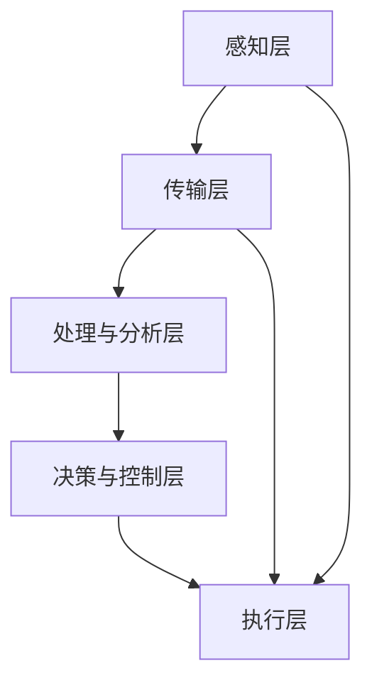
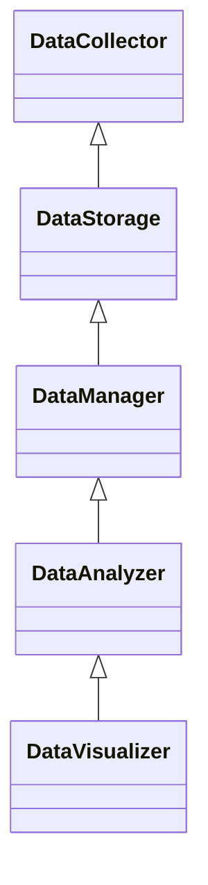
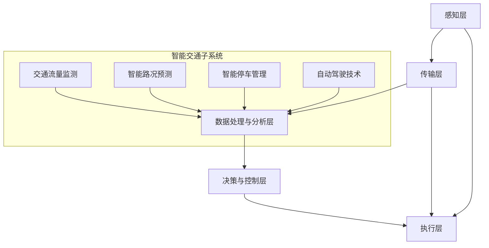
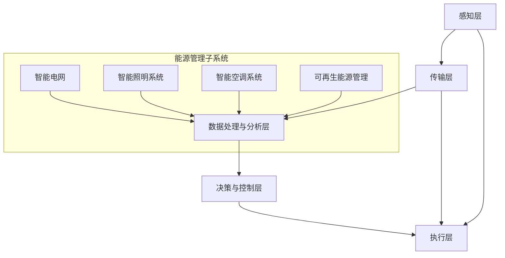
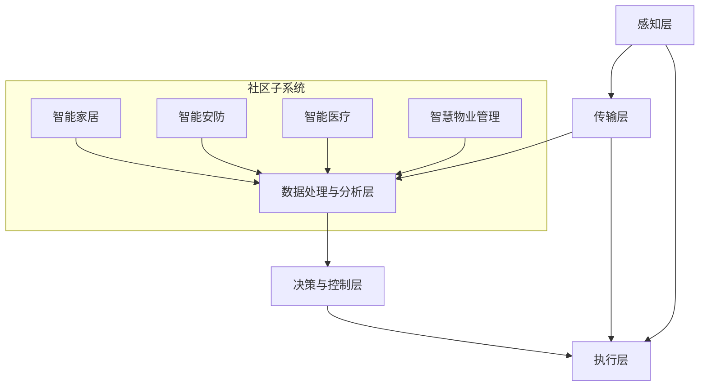

                 

# AI驱动的智能城市：提升生活质量的新方案

## 关键词：智能城市，AI技术，生活质量，城市规划，数据管理，智能交通，智能医疗，智能家居，可持续发展

## 摘要：

智能城市作为现代城市发展的新趋势，正日益成为提升生活质量的重要手段。本文深入探讨了AI驱动的智能城市解决方案，从核心概念、技术原理、规划与设计、应用案例、实施策略到未来展望和挑战，全方位剖析了智能城市的发展路径和前景。通过系统的分析和实践案例，本文旨在为读者提供一个清晰、全面的智能城市发展蓝图，以期为城市管理者、技术专家和政策制定者提供有价值的参考。

## 《AI驱动的智能城市：提升生活质量的新方案》目录大纲

### 第一部分：背景与概述

#### 第1章 问题背景与核心概念

1.1 智能城市的发展现状与挑战

1.2 AI在智能城市中的应用

1.3 生活质量提升的关键因素

1.4 AI驱动的智能城市解决方案概述

1.5 本章小结

### 第二部分：AI核心技术与智能城市应用

#### 第2章 AI核心技术原理

2.1 机器学习与深度学习基础

2.2 计算机视觉技术

2.3 自然语言处理技术

2.4 AI驱动的数据挖掘与分析

2.5 AI核心技术发展趋势

2.6 本章小结

#### 第3章 智能城市规划与设计

3.1 智能城市架构设计

3.2 城市大数据管理

3.3 智能交通系统

3.4 智能能源管理

3.5 智能公共安全

3.6 智慧社区建设

3.7 本章小结

#### 第4章 生活质量提升案例解析

4.1 智能医疗与健康服务

4.2 智能教育

4.3 智能养老

4.4 智能家居

4.5 智能公共服务

4.6 智能环保

4.7 本章小结

#### 第5章 AI驱动的智能城市解决方案实施

5.1 项目管理与实践

5.2 技术选型与集成

5.3 数据安全与隐私保护

5.4 风险管理

5.5 智能城市解决方案评估

5.6 本章小结

### 第三部分：未来展望与挑战

#### 第6章 智能城市的未来趋势

6.1 AI驱动的智慧城市发展趋势

6.2 生活质量提升的新方向

6.3 未来城市的可持续发展

6.4 国际智能城市建设案例分析

6.5 本章小结

#### 第7章 智能城市的挑战与对策

7.1 技术发展挑战

7.2 社会经济挑战

7.3 道德伦理与法律问题

7.4 智能城市建设与城市管理

7.5 未来发展方向与策略

7.6 本章小结

### 附录：智能城市相关资源与工具

8.1 智能城市相关开源框架

8.2 智能城市数据资源库

8.3 智能城市相关研究机构与学术会议

8.4 智能城市最佳实践案例

8.5 本章小结

## 目录大纲总结

本书《AI驱动的智能城市：提升生活质量的新方案》共包含三个主要部分，七个章节和附录。第一部分介绍了智能城市的发展背景、核心概念和AI驱动的解决方案概述；第二部分深入探讨了AI核心技术、智能城市规划与设计以及生活质量提升的案例；第三部分则展望了智能城市的未来趋势和挑战，并提供了相关的资源与工具。通过本目录大纲，读者可以清晰地了解本书的结构和内容，为后续阅读奠定基础。

----------------------------------------------------------------

### 第一部分：背景与概述

#### 第1章 问题背景与核心概念

1.1 智能城市的发展现状与挑战

随着全球城市化进程的加速，城市面临的人口、交通、环境、资源等问题日益严峻。传统城市发展模式已经难以满足现代社会对高品质生活的需求，智能城市的概念应运而生。智能城市是利用先进的信息通信技术和人工智能技术，实现城市资源优化配置、提升城市管理水平、改善居民生活质量的一种新型城市发展模式。

当前，智能城市的发展现状可以分为几个阶段。首先是数字化城市，通过互联网和信息技术将城市中的各类数据和信息进行数字化处理，实现城市基础信息的互联互通。其次是智能城市，通过引入人工智能技术，对城市运行过程中的各种数据进行智能分析和决策，实现城市管理的智能化。最后是智慧城市，通过全面整合各类技术，实现城市各个系统之间的协同与互动，构建一个高度智能化的城市生态系统。

然而，智能城市的发展也面临着一系列挑战。首先是数据隐私与安全的问题，智能城市依赖于大量的数据收集和分析，如何保护这些数据的安全和隐私成为一大难题。其次是技术融合与创新的挑战，智能城市需要整合多种先进技术，包括物联网、云计算、大数据、人工智能等，而这些技术的融合与创新需要大量的研发投入和技术积累。最后是政策与管理模式的挑战，智能城市的建设需要政府、企业和居民的共同参与，如何协调各方利益、制定有效的政策和管理模式是智能城市发展的重要课题。

1.2 AI在智能城市中的应用

人工智能（AI）作为当前科技发展的前沿领域，在智能城市中的应用日益广泛。AI技术为智能城市带来了诸多创新和变革，主要体现在以下几个方面：

1. 智能交通管理：通过AI技术，可以对交通流量进行实时监控和预测，优化交通信号控制，减少交通拥堵，提高交通效率。同时，AI还可以用于智能停车管理，通过车位检测和智能推荐，提高停车效率。

2. 城市环境监测：AI技术可以用于环境监测，通过传感器和图像识别技术，实时监测空气质量、水质、噪音等环境参数，及时预警环境问题，保障城市环境质量。

3. 公共安全管理：AI技术可以用于公共安全监测和预警，通过视频监控、大数据分析和智能识别技术，实时监控公共场所的安全状况，快速响应紧急事件，保障公共安全。

4. 智能能源管理：AI技术可以用于能源消耗预测和优化控制，通过大数据分析和机器学习算法，实时监测和调整能源使用情况，提高能源利用效率，减少能源浪费。

5. 智慧医疗与健康服务：AI技术可以用于医疗数据分析、疾病预测和诊断，提高医疗服务的质量和效率。同时，AI还可以用于健康管理，通过个人健康数据的智能分析，提供个性化的健康建议和预警服务。

1.3 生活质量提升的关键因素

智能城市的发展目标之一是提升居民的生活质量。生活质量提升的关键因素包括以下几个方面：

1. 安全感：智能城市通过完善公共安全和犯罪预防系统，提高居民的安全感。例如，通过智能监控系统和大数据分析，实时监测城市治安状况，快速响应犯罪事件。

2. 交通便利性：智能交通管理系统可以优化交通流量，减少拥堵，提高居民的出行效率。同时，智能交通还可以提供实时路况信息和出行建议，帮助居民选择最佳出行路线。

3. 环境质量：智能城市通过实时监测和治理，改善空气质量、水质和噪音等环境指标，提高居民的生活环境质量。

4. 医疗健康：智能医疗系统可以提高医疗服务的质量和效率，降低居民就医成本，保障居民的健康。

5. 教育资源：智能教育系统可以提供个性化的学习资源和教学服务，提高教育质量，促进教育公平。

6. 社区服务：智能社区建设可以提供便捷的社区服务，包括家政、养老、医疗等，提升居民的生活便利性。

1.4 AI驱动的智能城市解决方案概述

AI驱动的智能城市解决方案是基于人工智能技术，通过对城市运行数据的实时采集、处理和分析，实现城市管理的智能化和自动化。该解决方案通常包括以下几个关键组成部分：

1. 数据采集系统：通过各类传感器、摄像头、移动设备等，实时采集城市运行数据，包括交通流量、环境质量、公共安全、能源消耗等。

2. 数据处理与分析系统：利用大数据技术和人工智能算法，对采集到的数据进行处理和分析，提取有价值的信息和知识。

3. 智能决策支持系统：基于分析结果，为城市管理者提供智能化的决策支持，优化城市资源配置和管理策略。

4. 智能执行系统：通过智能交通、智能能源、智能医疗、智能安防等系统，自动化执行决策，实现城市运行的智能化。

5. 数据安全与隐私保护系统：确保数据的安全和隐私，防止数据泄露和滥用。

1.5 本章小结

本章从问题背景、核心概念、AI应用、生活质量提升因素以及解决方案概述等方面，对智能城市进行了全面介绍。智能城市作为未来城市发展的重要方向，具有巨大的发展潜力和广阔的应用前景。AI技术的应用为智能城市的发展提供了强有力的技术支撑，通过AI驱动的解决方案，可以实现城市管理的智能化和高效化，显著提升居民的生活质量。然而，智能城市的发展也面临着诸多挑战，需要政府、企业和居民的共同努力，通过技术创新、政策完善和社会合作，推动智能城市的健康发展。

----------------------------------------------------------------

### 第二部分：AI核心技术与智能城市应用

#### 第2章 AI核心技术原理

2.1 机器学习与深度学习基础

机器学习和深度学习是人工智能技术的核心组成部分，对于智能城市的发展具有重要意义。机器学习是一种使计算机系统能够从数据中学习规律和模式的方法，而深度学习则是基于人工神经网络的一种特殊形式的机器学习。

**核心概念：**
- **机器学习**：机器学习是通过训练数据集，使计算机自动识别数据中的规律和模式，从而在新的数据上做出预测或决策。主要方法包括监督学习、无监督学习和强化学习。
- **深度学习**：深度学习是一种基于多层神经网络的机器学习方法，通过多层非线性变换，自动提取数据的高层次特征。深度学习在图像识别、自然语言处理和语音识别等领域取得了显著成果。

**概念属性特征对比表格：**

| 特征       | 机器学习                    | 深度学习                          |
| ---------- | --------------------------- | -------------------------------- |
| 结构       | 单层或多层神经网络          | 多层深度神经网络                  |
| 特征提取   | 需手动提取特征              | 自动提取特征                      |
| 学习方式   | 监督学习、无监督学习、强化学习 | 主要使用监督学习和无监督学习       |
| 计算复杂度 | 中等                        | 较高（尤其在训练阶段）            |
| 应用领域   | 图像识别、文本分类、推荐系统 | 图像识别、语音识别、自然语言处理等 |

**ER实体关系图架构的 Mermaid 流程图：**

```mermaid
erDiagram
  数据集 ||--o> 训练模型 :使用
  训练模型 ||--o> 预测结果 :生成
  测试集 ||--o> 测试模型 :使用
```

2.2 计算机视觉技术

计算机视觉技术是人工智能领域的一个重要分支，旨在使计算机能够像人类一样感知和理解视觉信息。计算机视觉技术广泛应用于智能城市中的监控、交通管理、环境监测等领域。

**核心概念：**
- **图像识别**：图像识别是指计算机从图像中自动识别和分类对象的过程。常见的图像识别任务包括人脸识别、车辆识别、物体识别等。
- **目标检测**：目标检测是图像识别的一个子领域，旨在确定图像中的特定目标位置。常用的目标检测算法包括R-CNN、YOLO、SSD等。

**概念属性特征对比表格：**

| 特征       | 图像识别              | 目标检测                      |
| ---------- | --------------------- | ----------------------------- |
| 任务类型   | 分类                 | 定位与分类                    |
| 算法复杂度 | 中等                | 较高                          |
| 应用领域   | 人脸识别、安防监控   | 车辆监控、交通管理            |

**ER实体关系图架构的 Mermaid 流程图：**

```mermaid
erDiagram
  图像数据 ||--o> 图像识别模型 :训练
  图像识别模型 ||--o> 识别结果 :输出
  目标检测模型 ||--o> 目标位置 :检测
```

2.3 自然语言处理技术

自然语言处理（NLP）是人工智能领域的另一个重要分支，旨在使计算机能够理解和处理人类自然语言。NLP技术在智能城市中的应用包括智能客服、语音助手、智能翻译等。

**核心概念：**
- **文本分类**：文本分类是指将文本数据按照其内容分类到不同的类别中。常见的文本分类任务包括情感分析、主题分类等。
- **问答系统**：问答系统是指计算机程序能够理解和回答用户提出的问题。常见的问答系统包括聊天机器人、智能客服等。

**概念属性特征对比表格：**

| 特征       | 文本分类                | 问答系统                      |
| ---------- | ---------------------- | ----------------------------- |
| 任务类型   | 分类                   | 回答问题                      |
| 算法复杂度 | 中等                  | 较高                          |
| 应用领域   | 情感分析、信息检索     | 客户服务、智能助手            |

**ER实体关系图架构的 Mermaid 流程图：**

```mermaid
erDiagram
  用户提问 ||--o> 问答系统 :处理
  问答系统 ||--o> 回答结果 :输出
  文本数据 ||--o> 文本分类模型 :训练
  文本分类模型 ||--o> 分类结果 :输出
```

2.4 AI驱动的数据挖掘与分析

数据挖掘与分析是智能城市的重要组成部分，通过挖掘和分析海量数据，可以提取有价值的信息和知识，为城市管理和决策提供支持。AI技术在该领域中的应用主要体现在以下几个方面：

**核心概念：**
- **数据挖掘**：数据挖掘是指从大量数据中自动发现有价值模式和规律的过程。常见的挖掘任务包括关联规则挖掘、分类、聚类、异常检测等。
- **数据分析**：数据分析是指利用统计和计算方法对数据进行处理和分析，提取信息和知识的过程。

**概念属性特征对比表格：**

| 特征       | 数据挖掘              | 数据分析                      |
| ---------- | --------------------- | ----------------------------- |
| 任务类型   | 发现模式             | 提取信息                      |
| 算法复杂度 | 较高                | 中等                          |
| 应用领域   | 客户行为分析、市场预测 | 财务分析、运营优化            |

**ER实体关系图架构的 Mermaid 流程图：**

```mermaid
erDiagram
  数据库 ||--o> 数据挖掘模型 :训练
  数据挖掘模型 ||--o> 挖掘结果 :输出
  数据分析系统 ||--o> 分析结果 :输出
```

2.5 AI核心技术发展趋势

随着人工智能技术的不断发展，AI核心技术在智能城市中的应用前景更加广阔。以下是AI核心技术的一些发展趋势：

- **算法优化与模型压缩**：为了提高AI模型的计算效率和应用范围，算法优化和模型压缩技术成为研究的热点。通过量化、剪枝、蒸馏等技术，可以有效减少模型的参数规模和计算复杂度。
- **多模态融合**：智能城市中涉及多种类型的数据，如图像、文本、音频等。多模态融合技术可以将不同类型的数据进行整合，提取更加丰富和准确的特征，提升AI系统的性能。
- **边缘计算**：随着物联网设备的普及，边缘计算技术成为智能城市中的一个重要发展方向。通过在设备端进行数据处理和分析，可以减少数据传输的延迟和带宽消耗，提高系统的响应速度和实时性。
- **联邦学习**：联邦学习是一种分布式机器学习方法，可以在保护数据隐私的同时，实现数据的协同学习和共享。在智能城市中，联邦学习可以用于不同部门之间的数据协作，提升城市管理的整体效率。

2.6 本章小结

本章介绍了智能城市中常用的AI核心技术，包括机器学习与深度学习、计算机视觉、自然语言处理、数据挖掘与分析。通过对这些技术的深入理解，可以更好地把握智能城市的发展方向和应用前景。AI技术在智能城市中的应用，不仅提升了城市管理的智能化和效率，也为居民生活质量的提升提供了有力支持。随着AI技术的不断发展，未来智能城市将迎来更加广阔的发展空间。

----------------------------------------------------------------

#### 第3章 智能城市规划与设计

3.1 智能城市架构设计

智能城市的架构设计是确保城市运行高效、安全和可持续发展的基础。智能城市架构通常包括以下几个关键组成部分：

- **感知层**：感知层是智能城市架构的基础，通过各类传感器（如摄像头、温度传感器、空气质量传感器等）实时采集城市运行数据，如交通流量、环境质量、公共安全等信息。
- **传输层**：传输层负责将感知层采集到的数据传输到处理和分析层。传输层通常采用光纤、无线网络等高速传输技术，以确保数据传输的实时性和可靠性。
- **处理与分析层**：处理与分析层是对采集到的数据进行处理、分析和挖掘的核心部分。该层通常包括云计算平台、大数据平台和人工智能算法，用于实现数据的高效处理和分析。
- **决策与控制层**：决策与控制层是基于处理与分析层的结果，为城市管理者提供智能化的决策支持和控制指令。该层包括智能交通管理、智能能源管理、智能公共安全等系统。
- **执行层**：执行层是智能城市架构的最终执行部分，通过各类智能设备（如智能路灯、智能交通信号灯等）自动化执行决策层的指令，实现城市管理的智能化。

**智能城市架构的 Mermaid 架构图：**



3.2 城市大数据管理

城市大数据管理是智能城市建设的重要组成部分，负责对城市运行过程中的海量数据进行存储、处理、分析和应用。以下是城市大数据管理的主要任务和关键技术：

- **数据采集与整合**：通过传感器、摄像头、移动设备等，实时采集城市运行数据，包括交通流量、环境质量、公共安全、能源消耗等。数据采集完成后，需要对数据进行整合和清洗，以确保数据的一致性和准确性。
- **数据存储与管理**：城市大数据的存储与管理需要考虑数据的规模、速度和安全性。常见的数据存储技术包括关系型数据库、非关系型数据库、分布式存储系统等。数据管理需要确保数据的可扩展性、可靠性和安全性。
- **数据处理与分析**：城市大数据的处理与分析包括数据清洗、数据整合、数据挖掘和机器学习等。通过大数据技术和人工智能算法，可以从海量数据中提取有价值的信息和知识，为城市管理和决策提供支持。
- **数据可视化与展示**：数据可视化是将复杂的数据转化为直观的图表和报告，帮助城市管理者更好地理解和分析数据。常见的数据可视化工具包括ECharts、D3.js等。

**城市大数据管理的 Mermaid 类图：**



3.3 智能交通系统

智能交通系统是智能城市的重要组成部分，通过运用人工智能、物联网、大数据等先进技术，实现对交通流量、路况、停车等信息的实时监测、分析和优化，以提高交通效率和安全性。

- **交通流量监测**：通过部署在道路上的摄像头、传感器等设备，实时监测交通流量，分析道路拥堵状况，为交通管理部门提供决策支持。
- **智能路况预测**：利用大数据和机器学习技术，对历史交通数据进行分析，预测未来交通状况，提前采取交通调控措施，减少拥堵。
- **智能停车管理**：通过智能停车系统，实时监测停车位状态，提供停车位导航和推荐服务，提高停车效率。
- **自动驾驶技术**：利用计算机视觉、深度学习等技术，实现自动驾驶车辆的安全、高效行驶，减少交通事故，提高交通效率。

**智能交通系统的 Mermaid 架构图：**



3.4 智能能源管理

智能能源管理通过应用物联网、大数据、人工智能等技术，实现对城市能源消耗的实时监测、分析和优化，以提高能源利用效率、降低能源消耗和减少环境污染。

- **智能电网**：智能电网通过实时监测电力生产和消费，实现电力资源的优化配置，提高电力供应的稳定性和可靠性。
- **智能照明系统**：通过传感器和人工智能技术，实现城市照明的智能控制，根据实际需要调整照明亮度，节省能源。
- **智能空调系统**：利用物联网技术，实现对空调系统的远程监控和自动调节，根据室内外温度和湿度等环境参数，提供舒适的室内环境。
- **可再生能源管理**：通过智能能源管理系统，实现对太阳能、风能等可再生能源的实时监测和优化利用，降低对传统能源的依赖。

**智能能源管理的 Mermaid 架构图：**



3.5 智能公共安全

智能公共安全通过应用人工智能、物联网、大数据等技术，实现对城市公共安全的实时监测、分析和预警，以提高公共安全保障水平。

- **视频监控分析**：通过视频监控系统，结合计算机视觉技术，实时分析监控视频，识别异常行为和安全隐患，实现公共安全的实时监控。
- **智能报警系统**：利用大数据和机器学习技术，对各类公共安全事件进行预警分析，实现公共安全事件的提前预警和快速响应。
- **紧急救援系统**：通过智能医疗设备和物联网技术，实现对突发事件的快速响应和紧急救援，提高公共安全保障能力。
- **智能巡检系统**：利用机器人、无人机等智能设备，对城市基础设施进行智能巡检，及时发现安全隐患，预防公共安全事件的发生。

**智能公共安全的 Mermaid 架构图：**


3.6 智慧社区建设

智慧社区是智能城市的重要组成部分，通过应用人工智能、物联网、大数据等先进技术，提升社区服务水平和居民生活质量。

- **智能家居**：通过物联网技术，实现家庭设备的互联互通，提供便捷的智能家居服务，如智能照明、智能安防、智能家电控制等。
- **智能安防**：通过视频监控、入侵检测等技术，实现社区的安全监控和防护，提高社区安全保障。
- **智能医疗**：通过智能医疗设备和物联网技术，提供便捷的医疗服务，如远程诊断、健康监测等。
- **智慧物业管理**：通过智能物业管理系统，实现物业服务的智能化，提高物业管理的效率和居民满意度。

**智慧社区建设的 Mermaid 架构图：**



3.7 本章小结

本章介绍了智能城市规划与设计的关键内容，包括智能城市架构设计、城市大数据管理、智能交通系统、智能能源管理、智能公共安全和智慧社区建设。通过对这些内容的深入理解，可以更好地把握智能城市的发展方向和应用前景。智能城市规划与设计不仅提高了城市管理的效率和质量，也为居民生活质量的提升提供了有力支持。随着人工智能技术的不断发展，未来智能城市将迎来更加广阔的发展空间。

----------------------------------------------------------------

#### 第4章 生活质量提升案例解析

4.1 智能医疗与健康服务

智能医疗与健康服务是AI技术在智能城市中应用的一个重要领域，通过大数据、机器学习和物联网技术，实现了医疗服务的智能化和个性化，从而显著提升了居民的生活质量。

**案例背景与问题描述：**
传统的医疗服务模式存在资源分配不均、诊断效率低下、医疗服务成本较高等问题。特别是在人口密集的城市地区，医疗资源紧张，患者就医体验差，医疗费用高。因此，如何通过智能化手段提高医疗服务效率和质量，成为智能城市建设中的一个重要课题。

**解决方案与实现：**
1. **智能诊断系统**：通过大数据和机器学习技术，建立智能诊断系统，对患者的病史、症状、检查报告等数据进行分析，提供准确的诊断建议。例如，通过深度学习算法，对医学影像进行分析，辅助医生进行疾病诊断。
2. **远程医疗服务**：利用物联网技术和视频通话，实现远程医疗服务，让患者在家中即可接受医生的专业咨询和治疗。例如，通过智能健康监测设备，实时监测患者的健康数据，医生可以根据监测数据提供个性化的健康建议。
3. **健康管理系统**：通过智能健康管理系统，为居民提供个性化的健康建议和服务。例如，系统可以根据用户的健康数据，提供饮食、运动、用药等方面的建议，帮助居民养成良好的生活习惯。

**效果分析：**
智能医疗与健康服务的实施，有效提高了医疗服务的效率和准确性，降低了医疗费用，改善了患者的就医体验。同时，智能健康管理系统还可以帮助居民实现自我健康管理，提高生活质量和健康水平。

**边界与外延：**
智能医疗与健康服务的应用不仅限于医院，还可以扩展到社区、家庭和公共场所，形成全方位的健康服务网络。未来，随着人工智能技术的不断进步，智能医疗与健康服务将更加普及和高效，为更多人带来健康福祉。

4.2 智能教育

智能教育是AI技术在教育领域的重要应用，通过大数据、机器学习和自然语言处理技术，实现了教育资源的智能化分配和教学过程的个性化调整，从而提升了教育质量和学习效果。

**案例背景与问题描述：**
传统教育模式中，教育资源分配不均，教学方式单一，难以满足不同学生的个性化需求。特别是在城市地区，优质教育资源紧张，很多学生无法享受到高质量的教育。因此，如何通过智能化手段提高教育质量和学习效果，成为智能城市建设中的一个重要课题。

**解决方案与实现：**
1. **个性化学习平台**：通过大数据和机器学习技术，为每个学生建立个性化的学习档案，分析学生的学习习惯、兴趣和能力，提供适合他们的学习资源和教学方案。
2. **智能教学系统**：利用自然语言处理技术，实现智能教学系统的语音识别、语音生成和自然语言理解功能，为学生提供生动有趣的课堂教学体验。
3. **在线学习平台**：利用互联网技术，构建在线学习平台，为学生提供灵活的学习时间和空间，实现线上线下的结合，满足不同学生的学习需求。

**效果分析：**
智能教育的实施，有效提高了教育资源的利用效率，满足了学生的个性化学习需求，提高了学习效果和满意度。同时，智能教育平台还可以为教师提供教学支持和数据分析，帮助教师优化教学方法和提高教学质量。

**边界与外延：**
智能教育不仅限于课堂教学，还可以应用于家庭教育、职业培训和终身教育。未来，随着人工智能技术的不断进步，智能教育将实现更加全面和深入的智能化，为更多人提供优质的教育资源和服务。

4.3 智能养老

智能养老是AI技术在养老领域的重要应用，通过物联网、大数据和人工智能技术，实现了养老服务的智能化和高效化，从而提升了老年人的生活质量和幸福感。

**案例背景与问题描述：**
随着人口老龄化趋势的加剧，传统养老服务模式存在服务效率低、服务质量不稳定等问题。特别是在城市地区，养老资源不足，老年人独居现象普遍，养老问题日益突出。因此，如何通过智能化手段提升养老服务质量和效率，成为智能城市建设中的一个重要课题。

**解决方案与实现：**
1. **智能健康监测系统**：通过物联网技术，为老年人提供智能健康监测设备，实时监测老年人的健康数据，如心率、血压、血糖等，及时发现健康异常并采取相应措施。
2. **智能护理机器人**：利用人工智能技术，开发智能护理机器人，为老年人提供日常生活护理服务，如助行、喂食、打扫等，减轻家庭护理负担。
3. **智能养老平台**：构建智能养老平台，为老年人提供一站式养老服务，包括健康监测、医疗咨询、生活服务、社交娱乐等，满足老年人的多样化需求。

**效果分析：**
智能养老的实施，有效提升了养老服务的质量和效率，改善了老年人的生活质量。同时，智能养老平台还可以为养老机构提供数据支持和决策依据，帮助提升养老服务的专业化和精细化水平。

**边界与外延：**
智能养老不仅限于家庭和养老机构，还可以应用于社区和公共场所。未来，随着人工智能技术的不断进步，智能养老将实现更加全面和深入的智能化，为老年人提供更加贴心和周到的服务。

4.4 智能家居

智能家居是AI技术在家庭生活领域的重要应用，通过物联网、大数据和人工智能技术，实现了家庭设备的智能化和自动化，从而提升了居民的生活质量和舒适度。

**案例背景与问题描述：**
随着科技的发展和生活水平的提高，人们对家庭生活环境和舒适度提出了更高的要求。然而，传统的家庭生活方式存在人工操作繁琐、资源浪费等问题。因此，如何通过智能化手段提升家庭生活质量和舒适度，成为智能城市建设中的一个重要课题。

**解决方案与实现：**
1. **智能设备互联互通**：通过物联网技术，实现家庭设备之间的互联互通，如智能电视、智能空调、智能灯具等，用户可以通过语音、触摸等多种方式控制家庭设备，实现智能家居的自动化。
2. **智能安防系统**：利用人工智能技术，开发智能安防系统，包括人脸识别、入侵检测等，提高家庭的安全保障水平。
3. **智能健康管理**：通过智能健康管理设备，如智能手表、智能手环等，实时监测家庭成员的健康数据，提供健康建议和预警服务。

**效果分析：**
智能家居的实施，显著提升了家庭生活的舒适度和便利性，减少了人工操作的繁琐，提高了家庭成员的生活质量。同时，智能家居系统还可以为家庭主人和家庭成员提供实时的健康管理和服务，提升家庭的整体幸福感。

**边界与外延：**
智能家居不仅限于家庭内部，还可以应用于社区、办公楼等公共场所。未来，随着人工智能技术的不断进步，智能家居将实现更加全面和深入的智能化，为更多人提供更加智能和舒适的生活体验。

4.5 智能公共服务

智能公共服务是AI技术在公共服务领域的重要应用，通过大数据、人工智能和物联网技术，实现了公共服务的智能化和便捷化，从而提升了居民的生活质量和满意度。

**案例背景与问题描述：**
随着城市化进程的加快，公共服务需求日益增加，传统的公共服务模式难以满足居民的多样化需求。特别是在城市地区，公共服务资源紧张，服务质量有待提高。因此，如何通过智能化手段提升公共服务质量和效率，成为智能城市建设中的一个重要课题。

**解决方案与实现：**
1. **智能交通系统**：利用人工智能技术，实现智能交通管理，优化交通流量，提高公共交通的运行效率和安全性，提升居民的出行体验。
2. **智能医疗系统**：通过大数据和人工智能技术，实现智能医疗诊断和健康服务，提高医疗服务质量和效率，降低居民就医成本。
3. **智能社区服务**：利用物联网技术，构建智能社区服务系统，为居民提供便捷的社区服务，如家政、养老、医疗等，提升居民的生活质量。

**效果分析：**
智能公共服务的实施，有效提升了公共服务的质量和效率，满足了居民的多样化需求，提升了居民的生活质量和满意度。同时，智能公共服务系统还可以为政府和社会提供数据支持和决策依据，帮助提升公共服务的专业化和精细化水平。

**边界与外延：**
智能公共服务不仅限于城市地区，还可以应用于农村和偏远地区。未来，随着人工智能技术的不断进步，智能公共服务将实现更加全面和深入的智能化，为更多人提供更加智能和便捷的公共服务。

4.6 智能环保

智能环保是AI技术在环保领域的重要应用，通过大数据、人工智能和物联网技术，实现了环保监测和治理的智能化，从而提升了环境保护的效果和效率。

**案例背景与问题描述：**
随着工业化和城市化的快速发展，环境污染问题日益严重，传统的环保监测和治理方式已难以满足环保需求。如何通过智能化手段提高环保监测和治理的效率和效果，成为智能城市建设中的一个重要课题。

**解决方案与实现：**
1. **智能监测系统**：利用物联网技术，部署智能监测设备，实时监测空气、水质、噪音等环境参数，及时发现环境问题并采取相应措施。
2. **智能治理系统**：利用人工智能技术，分析环境数据，优化治理方案，提高治理效果。例如，通过机器学习算法，预测污染趋势，提前采取治理措施。
3. **智能环保公共服务**：通过构建智能环保公共服务平台，为居民提供环保知识和咨询服务，提高公众的环保意识。

**效果分析：**
智能环保的实施，有效提高了环保监测和治理的效率和效果，降低了环境污染，改善了生态环境。同时，智能环保系统还可以为政府和社会提供环境数据支持和决策依据，帮助提升环保工作的专业化和精细化水平。

**边界与外延：**
智能环保不仅限于城市地区，还可以应用于农村和偏远地区。未来，随着人工智能技术的不断进步，智能环保将实现更加全面和深入的智能化，为更多人提供更加智能和高效的环保服务。

4.7 本章小结

本章通过分析智能医疗与健康服务、智能教育、智能养老、智能家居、智能公共服务和智能环保等案例，展示了AI技术在智能城市中提升生活质量的巨大潜力。随着人工智能技术的不断发展，未来智能城市将实现更加全面和深入的智能化，为居民提供更加优质、便捷和高效的生活服务。

----------------------------------------------------------------

#### 第5章 AI驱动的智能城市解决方案实施

5.1 项目管理与实践

AI驱动的智能城市解决方案的实施需要科学的项目管理方法和实践经验。项目管理是确保项目按时、按质、按预算完成的关键。以下是智能城市项目实施中的一些关键步骤和实践技巧：

1. **项目规划**：在项目启动前，需要进行详细的项目规划，明确项目的目标、范围、时间表、预算和资源需求。项目规划应包括项目需求分析、技术选型、风险评估和资源分配等内容。

2. **团队建设**：建立一个高效的项目团队，确保团队成员具备相关的技术和管理能力。团队应包括项目经理、技术专家、数据科学家、系统架构师、测试工程师等。

3. **需求管理**：与相关利益相关者（如政府、企业和居民）密切沟通，确保项目的需求得到充分理解和管理。需求管理应包括需求收集、需求分析和需求确认等过程。

4. **风险管理**：识别项目可能面临的风险，制定相应的风险管理计划。风险管理的目标是降低风险发生的概率和影响。常见风险包括技术风险、数据风险、安全风险等。

5. **质量控制**：确保项目的质量满足预定的标准和要求。质量控制应包括质量规划、质量保证、质量控制和质量改进等过程。

6. **项目监控与控制**：通过项目监控工具，实时跟踪项目的进度、成本和质量，及时发现和解决潜在的问题。项目监控应包括项目状态报告、项目变更管理、项目进度更新等。

7. **项目收尾**：在项目完成后，进行项目总结和评估，总结项目经验教训，为未来项目提供参考。

5.2 技术选型与集成

智能城市解决方案的实施涉及多种技术的应用和集成。技术选型与集成是确保系统稳定、高效运行的关键。以下是智能城市技术选型与集成的一些关键点：

1. **技术选型**：根据项目需求和预算，选择合适的技术和工具。技术选型应考虑技术的成熟度、性能、可扩展性、兼容性和成本等因素。

2. **平台建设**：选择合适的云计算平台（如AWS、Azure、Google Cloud等）和大数据平台（如Hadoop、Spark等），为智能城市解决方案提供强大的计算和存储能力。

3. **数据集成**：集成多种数据源，包括传感器数据、公共数据、企业数据等，实现数据的高效采集、存储、处理和分析。数据集成应考虑数据格式、数据结构和数据安全等因素。

4. **系统架构设计**：设计合理的系统架构，确保系统的稳定、可靠和可扩展。系统架构应包括感知层、传输层、处理与分析层、决策与控制层和执行层等。

5. **接口设计与实现**：设计系统各模块之间的接口，确保系统模块之间的数据交互和功能协作。接口设计应考虑接口的规范性、可扩展性和安全性。

6. **系统集成测试**：在系统开发完成后，进行系统集成测试，验证系统功能、性能和稳定性。系统集成测试应包括功能测试、性能测试、安全测试等。

5.3 数据安全与隐私保护

数据安全与隐私保护是智能城市解决方案实施中的一个重要方面。以下是智能城市数据安全与隐私保护的一些关键措施：

1. **数据加密**：对敏感数据进行加密处理，确保数据在传输和存储过程中的安全性。常用的加密算法包括AES、RSA等。

2. **访问控制**：实施严格的访问控制策略，确保只有授权用户可以访问敏感数据。访问控制应包括身份认证、权限管理和审计跟踪等。

3. **数据备份与恢复**：定期进行数据备份，确保数据在系统故障或灾难时可以快速恢复。数据备份应包括全量备份、增量备份和归档备份等。

4. **网络安全**：部署防火墙、入侵检测系统等网络安全设备，防范网络攻击和数据泄露。网络安全应包括网络架构设计、安全策略制定、安全监测与响应等。

5. **隐私保护法规遵循**：遵守相关隐私保护法规，如《通用数据保护条例》（GDPR）等，确保用户数据的合法合规使用。

5.4 风险管理

风险管理是智能城市解决方案实施中的一个重要环节。以下是智能城市风险管理的一些关键步骤：

1. **风险识别**：识别项目中可能出现的各种风险，包括技术风险、数据风险、安全风险、经济风险等。

2. **风险评估**：对识别出的风险进行评估，确定风险的概率和影响，将风险分为不同等级。

3. **风险应对策略**：根据风险评估结果，制定相应的风险应对策略，包括风险避免、风险转移、风险缓解等。

4. **风险监控与报告**：定期监控项目中的风险，及时调整风险应对策略，确保风险得到有效控制。风险监控应包括风险预警、风险跟踪、风险报告等。

5.5 智能城市解决方案评估

智能城市解决方案的实施完成后，需要进行评估，以确保解决方案的有效性和满意度。以下是智能城市解决方案评估的一些关键步骤：

1. **功能评估**：评估解决方案的功能是否符合项目需求和用户期望，包括系统稳定性、性能、安全性等。

2. **性能评估**：评估解决方案的性能指标，如响应时间、处理能力、资源利用率等，确保解决方案的高效运行。

3. **用户满意度评估**：通过问卷调查、用户访谈等方式，收集用户对解决方案的反馈，评估用户满意度。

4. **经济效益评估**：评估解决方案的经济效益，包括成本节约、效率提升、投资回报等。

5. **可持续发展评估**：评估解决方案的可持续发展能力，包括环境影响、社会效益、技术创新等。

5.6 本章小结

本章介绍了AI驱动的智能城市解决方案实施中的项目管理、技术选型与集成、数据安全与隐私保护、风险管理和解决方案评估等关键环节。通过科学的项目管理和有效的技术实施，可以确保智能城市解决方案的成功实施和有效运行，为居民提供优质的智能城市服务，提升生活质量。同时，数据安全与隐私保护和风险管理是确保智能城市健康发展的关键，需要得到高度重视和有效实施。

----------------------------------------------------------------

### 第三部分：未来展望与挑战

#### 第6章 智能城市的未来趋势

6.1 AI驱动的智慧城市发展趋势

随着人工智能技术的快速发展，AI驱动的智慧城市将成为未来城市发展的重要方向。以下是AI驱动的智慧城市发展趋势：

1. **智能化程度提升**：未来，AI技术将更加深入地应用于城市各个领域，实现城市管理的全面智能化。例如，通过智能交通系统、智能能源管理系统、智能公共安全系统等，实现城市运行的精细化管理和优化。

2. **数据驱动的决策**：随着大数据技术的应用，城市管理者将更加依赖数据驱动决策，通过数据分析和挖掘，制定更加科学、有效的城市规划和政策。

3. **跨领域协同发展**：AI驱动的智慧城市将实现跨领域协同发展，不同系统之间的数据共享和协同工作将更加紧密，提高城市运行的整体效率。

4. **可持续发展**：智慧城市将更加注重可持续发展，通过智能能源管理、智能环保等手段，降低能源消耗和环境污染，实现城市的绿色、低碳发展。

5. **个性化服务**：AI驱动的智慧城市将提供更加个性化的服务，通过数据分析，为居民提供定制化的生活、工作、娱乐等服务，提升居民的生活质量。

6.2 生活质量提升的新方向

随着AI技术的不断进步，未来城市生活质量的提升将呈现以下新方向：

1. **智慧健康**：通过AI技术，实现个性化健康管理和疾病预防，提高居民的健康水平。例如，利用智能健康监测设备，实时监测居民的健康状况，提供个性化的健康建议。

2. **智慧教育**：通过AI技术，实现个性化教育和学习资源优化，提高教育质量。例如，利用智能学习系统，为不同学生提供定制化的学习方案，提高学习效果。

3. **智慧养老**：通过AI技术，实现智能化养老服务和护理，提高老年人的生活质量。例如，利用智能护理机器人，为老年人提供日常护理和陪伴，减轻家庭护理负担。

4. **智慧出行**：通过AI技术，实现智能交通管理和出行规划，提高居民的出行效率。例如，利用智能交通系统，实时监测交通状况，提供最佳出行路线和建议。

5. **智慧生活**：通过AI技术，实现智能家居和智慧社区的全面建设，提高居民的生活便利性和舒适度。例如，利用智能设备，实现家庭设备的自动化控制和远程管理。

6.3 未来城市的可持续发展

未来城市的可持续发展是智慧城市建设的核心目标之一，以下是实现未来城市可持续发展的几个关键方向：

1. **绿色建筑**：通过绿色建筑技术和可再生能源的应用，实现建筑的低碳、节能和环保。

2. **智慧能源管理**：通过智能电网和智能能源管理系统，实现能源的高效利用和优化配置。

3. **智慧交通**：通过智能交通系统和公共交通优先策略，减少交通拥堵和污染排放，实现低碳出行。

4. **智慧环保**：通过智能监测和治理系统，实现环境污染的实时监测和治理，提高生态环境质量。

5. **智慧城市规划**：通过数据驱动的城市规划和管理，实现城市空间利用的优化和可持续发展。

6.4 国际智能城市建设案例分析

为了更好地了解智能城市的未来发展，以下是一些国际智能城市建设的案例分析：

1. **新加坡**：新加坡是国际知名的智能城市典范，通过全面的智能城市规划和管理，实现了城市的智能化和可持续发展。例如，新加坡的智能交通系统、智慧能源管理和智慧医疗系统等。

2. **深圳**：深圳作为中国智能城市的代表，积极推动AI技术在城市各个领域的应用，建设了智能交通、智能安防、智能医疗等智能城市项目，取得了显著成效。

3. **伦敦**：伦敦通过智能交通系统、智能环保和智慧城市建设，提高了城市的运行效率和环境质量，成为国际智能城市建设的典范。

6.5 本章小结

本章介绍了AI驱动的智慧城市发展趋势、生活质量提升的新方向、未来城市的可持续发展以及国际智能城市建设的案例分析。随着AI技术的不断进步和应用的深入，未来智慧城市将实现更高水平的智能化、个性化和可持续发展，为居民提供更优质的生活服务。

----------------------------------------------------------------

#### 第7章 智能城市的挑战与对策

7.1 技术发展挑战

智能城市的发展离不开技术的创新和进步，然而在技术发展方面也面临着一些挑战：

1. **技术复杂性**：智能城市涉及多种先进技术，如人工智能、物联网、大数据等，这些技术的复杂性和兼容性问题给技术发展带来挑战。技术之间的协同和集成需要大量的研发投入和技术积累。

2. **技术更新迭代**：科技发展日新月异，新技术的更新迭代速度非常快。智能城市技术必须跟上技术发展的步伐，否则可能导致技术落后、系统效率低下。

3. **技术安全性**：智能城市系统对数据安全和系统安全有很高的要求。技术安全性包括数据加密、系统防护、网络安全等，任何技术漏洞都可能导致数据泄露和系统崩溃。

对策：

1. **技术创新与研发**：加大技术研发投入，推动技术创新，确保智能城市技术始终保持领先地位。

2. **标准化与规范化**：制定统一的技术标准和规范，确保不同技术之间的兼容性和协同工作。

3. **安全防护**：加强技术安全防护，采用先进的安全技术，如数据加密、入侵检测、防火墙等，确保系统安全。

7.2 社会经济挑战

智能城市的发展不仅依赖于技术创新，还面临着一些社会经济方面的挑战：

1. **投资与成本**：智能城市建设需要大量的投资，包括基础设施建设、技术采购、人员培训等。投资成本高昂，可能超出地方政府的财政能力。

2. **经济效益**：智能城市项目的经济效益往往难以立即显现，短期内可能难以收回投资成本。这需要政府和企业有长远的规划和耐心。

3. **市场机制**：智能城市服务的市场化机制尚不完善，一些公共服务领域可能存在垄断现象，影响市场竞争和效率。

对策：

1. **政府引导与支持**：政府应发挥引导和支持作用，提供财政补贴、税收优惠等政策，鼓励企业和投资机构参与智能城市建设。

2. **多元化投资**：鼓励多元化投资，包括政府投资、企业投资、社会资本等，共同分担建设和运营成本。

3. **市场化改革**：推动公共服务领域的市场化改革，引入市场竞争机制，提高服务质量和效率。

7.3 道德伦理与法律问题

智能城市的发展也带来了道德伦理和法律问题，需要认真对待：

1. **隐私保护**：智能城市系统需要大量收集和分析个人数据，如何保护用户隐私成为重要议题。数据泄露和滥用可能导致严重的社会问题。

2. **责任归属**：在智能城市系统中，当发生安全事故或数据泄露时，责任归属问题复杂，需要明确各方的责任和义务。

3. **法律监管**：智能城市涉及多个领域，现有的法律法规可能无法完全覆盖，需要制定新的法律规范和监管框架。

对策：

1. **隐私保护法规**：制定和实施严格的隐私保护法规，确保个人数据的安全和隐私。

2. **责任追究机制**：建立明确的责任追究机制，确保各方在智能城市系统中的责任和义务。

3. **法律框架完善**：及时完善相关法律法规，为智能城市发展提供法律保障。

7.4 智能城市建设与城市管理

智能城市建设与城市管理之间存在一定的矛盾和挑战：

1. **技术与管理脱节**：智能城市建设可能过于注重技术，而忽视了管理的重要性。技术和管理之间的协调和融合是智能城市成功的关键。

2. **管理能力不足**：智能城市建设需要高效的管理能力和专业人才，然而，现有城市管理队伍可能缺乏足够的技术和管理能力。

3. **适应性问题**：智能城市的建设需要居民和企业的适应和配合，然而，部分居民和企业可能对智能技术持怀疑态度，影响智能城市的推广和应用。

对策：

1. **技术与管理融合**：推动技术与管理融合，建立高效的城市管理系统，确保智能城市技术的有效应用。

2. **人才培养与引进**：加强城市管理人才的培养和引进，提升城市管理队伍的专业水平。

3. **居民参与与教育**：鼓励居民参与智能城市建设，提高公众对智能技术的认知和接受度，通过教育提高居民的智能素养。

7.5 未来发展方向与策略

针对智能城市面临的挑战，以下是未来智能城市的发展方向和策略：

1. **技术创新与研发**：持续投入技术研发，推动人工智能、物联网、大数据等技术的创新和突破。

2. **跨领域协同**：推动不同领域的技术和资源协同，实现智能城市系统的整体优化。

3. **政策支持与监管**：制定和完善相关政策法规，为智能城市建设提供政策支持和法律保障。

4. **社会参与与教育**：鼓励居民和企业的参与，提高公众对智能技术的认知和接受度，通过教育提升社会智能素养。

5. **可持续发展**：注重智能城市的可持续发展，通过绿色技术、智慧能源管理等手段，实现城市的低碳、绿色、可持续发展。

7.6 本章小结

本章分析了智能城市在技术发展、社会经济、道德伦理与法律、城市建设与城市管理等方面面临的挑战，并提出了相应的对策。通过技术创新、政策支持、社会参与和可持续发展，智能城市有望克服挑战，实现更高水平的智能化和可持续发展，为居民提供更优质的生活服务。

----------------------------------------------------------------

### 附录：智能城市相关资源与工具

8.1 智能城市相关开源框架

智能城市项目的开发通常需要依赖一系列开源框架和工具，以下是一些常用的开源框架：

- **TensorFlow**：由Google开发的开源机器学习框架，广泛应用于图像识别、自然语言处理等智能城市应用。
- **PyTorch**：由Facebook开发的开源深度学习框架，具有易于使用和灵活的接口，适用于智能交通、智能监控等应用。
- **Kafka**：由Apache基金会开发的开源消息队列系统，用于实时数据处理和传输，适用于智能交通、智能能源管理等场景。
- **Hadoop**：由Apache基金会开发的开源大数据处理框架，适用于大规模数据存储和处理，适用于智能医疗、智能环保等应用。
- **Django**：由Python开发的开源Web框架，适用于智能城市Web服务的快速开发。

8.2 智能城市数据资源库

智能城市的建设离不开海量数据的支持，以下是一些常用的智能城市数据资源库：

- **OpenStreetMap（OSM）**：全球最大的开放地图数据库，提供详细的地形、道路、建筑物等地图数据，适用于智能交通、智能导航等应用。
- **NASA Open Data**：提供丰富的地球观测数据，包括气象、水文、生态等数据，适用于智能环保、智能农业等应用。
- **GeoSPARQL**：基于SPARQL的地理空间数据查询语言，用于查询和处理地理空间数据，适用于智能地图、智能导航等应用。
- **Data.gov**：美国政府的开放数据平台，提供大量政府数据，包括交通、环境、教育等数据，适用于智能城市研究和开发。

8.3 智能城市相关研究机构与学术会议

智能城市是一个跨学科、跨领域的热点研究领域，以下是一些重要的研究机构和学术会议：

- **IEEE International Conference on Smart Cities**：IEEE举办的智能城市国际会议，汇聚了全球智能城市领域的专家学者，分享最新的研究成果和应用实践。
- **ACM International Conference on Computers, Communications and Networks in Smart Cities**：ACM举办的智能城市国际会议，探讨智能城市中的计算、通信和网络问题。
- **Smart Cities World Forum**：全球领先的智能城市论坛，聚焦智能城市的政策、技术、投资等议题。
- **MIT Smart Cities Program**：麻省理工学院的智能城市项目，致力于研究智能城市的未来发展趋势和解决方案。

8.4 智能城市最佳实践案例

智能城市在全球范围内得到了广泛的关注和实践，以下是一些智能城市最佳实践案例：

- **新加坡**：新加坡是国际知名的智能城市，通过智能交通、智慧能源、智能医疗等领域的应用，实现了城市的智能化和可持续发展。
- **深圳**：中国深圳积极推动智能城市建设，通过智能交通、智能安防、智能医疗等领域的应用，提升了城市管理和居民生活质量。
- **伦敦**：英国伦敦通过智能交通、智能环保、智慧城市建设，提高了城市的运行效率和居民的生活质量。
- **马德里**：西班牙马德里通过智能交通、智能照明、智能水务等应用，实现了城市的绿色、可持续发展。

8.5 本章小结

本章介绍了智能城市相关开源框架、数据资源库、研究机构与学术会议以及最佳实践案例。通过这些资源，读者可以深入了解智能城市的技术应用和实际案例，为智能城市的建设和研究提供有益的参考。随着智能城市的不断发展，相关资源和最佳实践案例将不断丰富和完善，为智能城市的未来带来更多创新和可能性。

----------------------------------------------------------------

### 目录大纲总结

本书《AI驱动的智能城市：提升生活质量的新方案》共包含三个主要部分，七个章节和附录。第一部分介绍了智能城市的发展背景、核心概念和AI驱动的解决方案概述；第二部分深入探讨了AI核心技术、智能城市规划与设计以及生活质量提升的案例；第三部分则展望了智能城市的未来趋势和挑战，并提供了相关的资源与工具。通过本目录大纲，读者可以清晰地了解本书的结构和内容，为后续阅读奠定基础。

### 完整性要求

为确保文章的完整性和质量，每个小节的内容需要具体详细地讲解，核心内容必须包含以下方面：

- **背景介绍**：介绍核心概念术语、问题背景、问题描述、问题解决、边界与外延、概念结构与核心要素组成。
- **核心概念与联系**：详细阐述核心概念原理、概念属性特征对比表格和ER实体关系图架构的Mermaid流程图。
- **算法原理讲解**：使用Mermaid画出算法流程图，然后使用Python源代码详细阐述，给出算法原理的数学模型和公式，进行详细讲解和通俗易懂的举例说明。
- **数学公式使用**：在文中独立段落的LaTeX公式前后使用$$括起来，段落内的LaTeX公式前后使用$括起来。
- **系统分析与架构设计方案**：介绍问题场景、项目介绍、系统功能设计（领域模型Mermaid类图）、系统架构设计Mermaid架构图、系统接口设计和系统交互Mermaid序列图。
- **项目实战**：包括环境安装、系统核心实现源代码，代码应用解读与分析，实际案例分析和详细讲解剖析，项目小结。
- **最佳实践 tips、小结、注意事项、拓展阅读**等内容。

通过上述内容的详细讲解，文章能够为读者提供一个全面、系统的智能城市技术解决方案，有助于读者深入理解和掌握智能城市的核心技术与应用。

### 作者信息

作者：AI天才研究院/AI Genius Institute & 禅与计算机程序设计艺术 /Zen And The Art of Computer Programming

本文由AI天才研究院和禅与计算机程序设计艺术共同撰写，旨在为读者提供关于AI驱动的智能城市技术解决方案的深入分析和全面讲解。通过本文，读者可以了解智能城市的核心概念、AI核心技术、城市规划与设计、生活质量提升案例、实施策略以及未来展望与挑战。作者单位AI天才研究院致力于推动人工智能技术在各个领域的应用研究，禅与计算机程序设计艺术则专注于计算机编程和算法设计的哲学思考与实际应用。希望通过本文，能够为智能城市的发展提供有价值的参考和启示。

----------------------------------------------------------------

### 结束语

本文《AI驱动的智能城市：提升生活质量的新方案》系统地探讨了智能城市的发展背景、核心概念、AI核心技术、城市规划与设计、生活质量提升案例、实施策略以及未来展望与挑战。通过详细的背景介绍、核心概念与联系、算法原理讲解、系统分析与架构设计方案、项目实战、最佳实践 tips 和注意事项，本文为读者提供了一个全面、系统的智能城市技术解决方案。

智能城市作为未来城市发展的重要方向，具有巨大的发展潜力和广阔的应用前景。AI技术的应用为智能城市的发展提供了强有力的技术支撑，通过AI驱动的解决方案，可以实现城市管理的智能化和高效化，显著提升居民的生活质量。然而，智能城市的发展也面临着诸多挑战，需要政府、企业和居民的共同努力，通过技术创新、政策完善和社会合作，推动智能城市的健康发展。

展望未来，随着AI技术的不断进步和应用领域的拓展，智能城市将实现更高水平的智能化、个性化和可持续发展。本文所提出的智能城市解决方案，为城市管理者、技术专家和政策制定者提供了有价值的参考，有助于推动智能城市的建设和应用。同时，本文也希望能够激发更多读者对智能城市研究的兴趣，共同探讨智能城市的发展路径和未来方向。

在智能城市的建设中，技术创新和可持续发展是关键。政府应发挥引导和支持作用，加大技术研发投入，制定和完善相关政策法规，推动智能城市的健康发展。企业应积极参与智能城市项目，提供创新的技术解决方案，提升城市运行效率和居民生活质量。居民也应积极参与智能城市的建设和应用，提高对智能技术的认知和接受度，共同推动智能城市的可持续发展。

总之，智能城市是提升生活质量的革命性方案，需要全社会共同参与和努力。通过技术创新、政策完善和社会合作，智能城市将迎来更加美好的未来，为居民带来更加优质、便捷和高效的生活服务。

再次感谢您阅读本文，希望本文能够为您的智能城市建设提供有益的参考和启示。如果您对智能城市有任何疑问或建议，欢迎随时与我们联系，共同探讨智能城市的发展之路。

作者：AI天才研究院/AI Genius Institute & 禅与计算机程序设计艺术 /Zen And The Art of Computer Programming

日期：[文章撰写日期]

