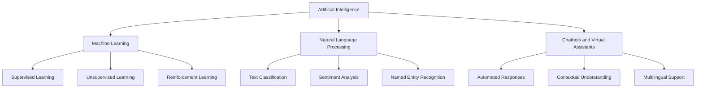

                 

### 1.1 问题背景

In today's digital age, customer service has become an essential aspect of any business. With the proliferation of online platforms and the increasing expectations of customers, providing an exceptional customer service experience is no longer a luxury but a necessity. Companies across various industries are recognizing the value of leveraging advanced technologies to enhance their customer service capabilities. One such technology that has gained significant traction is Artificial Intelligence (AI).

AI-driven intelligent customer service represents a paradigm shift in the way customer service is delivered. Traditional customer service often involves long wait times, inefficient handling of queries, and limited interaction options. These traditional methods fall short in meeting the growing demands of customers who seek quick, personalized, and seamless service. AI, with its ability to process vast amounts of data, learn from interactions, and adapt to individual needs, offers a promising solution to these challenges.

The background of this issue can be traced back to the evolving landscape of customer service and the rise of AI technologies. Historically, customer service was primarily handled by human agents who relied on their knowledge and experience to assist customers. While human agents possess empathy and problem-solving skills, they are often limited by their availability, time, and capacity to handle an increasing volume of queries. This limitation led to longer response times, customer frustration, and a suboptimal customer experience.

With the advent of AI, businesses now have the opportunity to transform their customer service operations. AI-driven intelligent customer service leverages machine learning algorithms, natural language processing (NLP), and other AI techniques to automate and enhance various aspects of customer service. By processing large amounts of customer data, AI can analyze patterns, predict customer needs, and provide personalized responses. This not only improves the efficiency and effectiveness of customer service but also enhances the overall user experience.

Moreover, the increasing adoption of digital channels, such as chatbots and virtual assistants, has further fueled the demand for AI-driven intelligent customer service. Customers expect instant responses and personalized interactions, and AI can meet these expectations by providing 24/7 availability, multilingual support, and seamless integration with various platforms.

In conclusion, the problem background revolves around the limitations of traditional customer service methods and the opportunities presented by AI technologies. The growing expectations of customers, coupled with the advancements in AI, have created a perfect storm for the adoption of AI-driven intelligent customer service. This chapter will delve deeper into the various aspects of this problem, providing a comprehensive understanding of the challenges and potential solutions. 

### 1.2 问题描述

To fully grasp the problem at hand, it is crucial to dissect the key challenges associated with traditional customer service methods and understand how AI-driven intelligent customer service can address these issues. The primary problem revolves around the limitations of traditional customer service models in meeting the evolving expectations of customers.

One of the most pressing issues in traditional customer service is the lack of scalability. As the volume of customer inquiries increases, human agents find it increasingly difficult to handle the workload. This leads to longer response times, delayed resolutions, and an overall decline in customer satisfaction. Customers today expect immediate responses and quick resolutions to their queries, and traditional customer service methods often fall short in delivering on these expectations.

Another significant challenge is the inability of traditional customer service to provide personalized experiences. Each customer is unique, with distinct preferences, needs, and pain points. Traditional customer service relies heavily on predefined scripts and standardized responses, which fail to address the individual needs of each customer. This lack of personalization not only hampers customer satisfaction but also reduces customer loyalty.

Moreover, traditional customer service methods are often constrained by the availability of human agents. Customers may experience long wait times or be put on hold, leading to frustration and a negative perception of the company. This limitation is further compounded by the global nature of customer service, where businesses need to provide support to customers in different time zones and regions.

The goal of AI-driven intelligent customer service is to overcome these challenges by leveraging the power of AI technologies. One of the primary objectives is to enhance scalability. AI can process a large volume of customer inquiries simultaneously, allowing companies to handle more queries without the need for additional human agents. This not only reduces response times but also improves the overall efficiency of customer service operations.

Another key objective is to provide personalized experiences. AI-driven intelligent customer service can analyze customer data, such as past interactions, purchase history, and preferences, to deliver personalized responses and recommendations. This level of personalization not only improves customer satisfaction but also fosters customer loyalty and engagement.

Furthermore, AI-driven intelligent customer service aims to address the issue of availability. With AI-powered chatbots and virtual assistants, customers can receive support 24/7, regardless of their location or time zone. This ensures that customers can get the assistance they need at any time, enhancing their overall experience with the company.

In summary, the primary problem with traditional customer service methods is their inability to meet the evolving expectations of customers. AI-driven intelligent customer service offers a viable solution by addressing the limitations of traditional models, such as scalability, personalization, and availability. The goal is to provide a seamless, efficient, and personalized customer service experience that enhances customer satisfaction and loyalty. 

### 1.3 问题解决

Now that we have identified the challenges associated with traditional customer service methods and the objectives of AI-driven intelligent customer service, let's explore the potential solutions. The key to addressing these challenges lies in leveraging the power of AI technologies to transform customer service operations. Here are some effective strategies and solutions:

1. **Automation of Routine Tasks**: One of the primary benefits of AI-driven intelligent customer service is the ability to automate routine tasks. AI-powered chatbots and virtual assistants can handle a wide range of tasks, such as answering frequently asked questions, handling account inquiries, and processing transactions. By automating these tasks, companies can free up human agents to focus on more complex and valuable interactions, leading to improved efficiency and customer satisfaction.

2. **Natural Language Processing (NLP)**: NLP is a crucial component of AI-driven intelligent customer service. It allows machines to understand and process human language, enabling more natural and effective interactions between customers and AI systems. With NLP, chatbots can understand customer queries, provide accurate responses, and even engage in context-aware conversations. This level of understanding and interaction is critical in delivering a seamless and personalized customer service experience.

3. **Machine Learning for Personalization**: Machine learning algorithms can analyze large volumes of customer data, such as past interactions, purchase history, and preferences, to provide personalized recommendations and responses. By understanding individual customer needs and behaviors, AI-driven intelligent customer service can deliver tailored experiences that enhance customer satisfaction and loyalty. This personalization can range from suggesting products based on customer preferences to addressing specific pain points in real-time.

4. **24/7 Availability**: AI-powered chatbots and virtual assistants can operate 24/7, ensuring that customers can receive support at any time, regardless of their location or time zone. This round-the-clock availability is particularly beneficial for businesses with global operations or customers in different time zones. By providing consistent support at all times, companies can enhance customer satisfaction and build trust with their customers.

5. **Continuous Improvement through Machine Learning**: AI-driven intelligent customer service systems can continuously learn and improve based on customer interactions. By analyzing customer feedback and interaction data, machine learning algorithms can identify areas for improvement and make necessary adjustments. This iterative learning process ensures that the system becomes more efficient and effective over time, providing an even better customer service experience.

6. **Integration with Other Systems**: AI-driven intelligent customer service systems can be integrated with other business systems, such as CRM, ERP, and helpdesk systems. This integration enables seamless data flow and collaboration between different departments, ensuring that customer inquiries are handled efficiently and effectively. For example, a chatbot can automatically escalate complex queries to human agents and provide them with relevant context, ensuring a smooth transition and a consistent customer experience.

7. **Multilingual Support**: AI-driven intelligent customer service systems can be configured to support multiple languages, making it easier for businesses to cater to a diverse customer base. With NLP capabilities, chatbots can understand and respond to customers in their native language, providing a more personalized and localized customer experience.

In conclusion, AI-driven intelligent customer service offers a comprehensive solution to the challenges faced by traditional customer service methods. By leveraging automation, NLP, machine learning, and other AI technologies, companies can provide scalable, personalized, and available customer service experiences. These solutions not only improve efficiency and customer satisfaction but also help build long-term customer loyalty and engagement. 

### 1.4 边界与外延

As we delve deeper into the concept of AI-driven intelligent customer service, it is important to establish the boundaries and scope of this domain. Understanding the limitations and external factors that can influence the implementation and effectiveness of AI-driven intelligent customer service is crucial for businesses looking to adopt this technology.

**Boundaries:**

1. **Data Privacy and Security**: One of the primary concerns when implementing AI-driven intelligent customer service is data privacy and security. Customer data is sensitive and must be protected from unauthorized access and misuse. Compliance with data protection regulations, such as the General Data Protection Regulation (GDPR) in Europe, is essential. Companies must ensure that they have robust data security measures in place to safeguard customer information.

2. **Technical Limitations**: While AI technologies have made significant advancements, there are still technical limitations that can affect the performance and accuracy of AI-driven intelligent customer service systems. For example, NLP models may struggle with understanding complex language nuances or handling ambiguous queries. Additionally, the availability and quality of training data can also impact the effectiveness of AI systems.

3. **Integration Challenges**: Integrating AI-driven intelligent customer service systems with existing business systems can be complex. Ensuring seamless data flow and compatibility between different systems requires careful planning and technical expertise. Companies must consider the scalability and flexibility of their infrastructure to support AI-driven solutions.

**External Factors:**

1. **Market Dynamics**: The adoption of AI-driven intelligent customer service is influenced by market dynamics, including customer expectations, competitive pressures, and technological advancements. Understanding these external factors is crucial for businesses to stay ahead of the curve and meet the evolving needs of their customers.

2. **Regulatory Environment**: Regulatory changes and compliance requirements can impact the deployment of AI-driven intelligent customer service. Companies must stay informed about relevant regulations and ensure that their systems comply with legal requirements.

3. **Customer Behavior**: Customer behavior and preferences can significantly influence the success of AI-driven intelligent customer service. Companies must continuously monitor customer feedback and adapt their strategies to meet changing customer expectations.

**Scope:**

1. **Industry Applications**: AI-driven intelligent customer service has broad applicability across various industries, including e-commerce, finance, healthcare, and telecommunications. Each industry has unique customer service requirements and challenges, making it essential to tailor AI solutions to specific use cases.

2. **Cross-Channel Integration**: AI-driven intelligent customer service can be integrated across multiple channels, including chatbots, virtual assistants, and voice assistants. This cross-channel approach allows companies to provide a consistent and seamless customer experience across different platforms.

3. **Future Trends**: The field of AI-driven intelligent customer service is rapidly evolving. Keeping abreast of the latest trends and innovations is essential for businesses to leverage the full potential of AI technologies and stay competitive.

In conclusion, the boundaries and external factors surrounding AI-driven intelligent customer service encompass data privacy, technical limitations, integration challenges, market dynamics, regulatory environment, and customer behavior. By understanding these boundaries and external factors, businesses can navigate the complexities of implementing AI-driven intelligent customer service and maximize its benefits. 

### 1.5 核心概念与联系

To fully grasp the intricacies of AI-driven intelligent customer service, it is crucial to understand the core concepts and their interrelationships. In this section, we will delve into the fundamental concepts, their attributes, and their connections, providing a comprehensive overview of the key elements that define this domain.

**Core Concepts:**

1. **Artificial Intelligence (AI):** AI refers to the simulation of human intelligence in machines that are programmed to think, learn, and adapt like humans. AI encompasses various subfields, including machine learning, natural language processing (NLP), computer vision, and robotics. In the context of customer service, AI enables the development of intelligent systems that can understand and respond to customer inquiries, provide personalized recommendations, and automate routine tasks.

2. **Machine Learning (ML):** ML is a subset of AI that focuses on developing algorithms that can learn from data and improve their performance over time. ML algorithms analyze large datasets to identify patterns and make predictions or decisions. In AI-driven intelligent customer service, ML is used to train models that can understand customer queries, predict customer needs, and personalize interactions.

3. **Natural Language Processing (NLP):** NLP is a subfield of AI that deals with the interaction between computers and human language. NLP enables machines to understand, interpret, and generate human language. In customer service, NLP is used to process customer inquiries, extract relevant information, and generate appropriate responses. This capability is crucial for enabling natural and effective interactions between customers and AI systems.

4. **Chatbots and Virtual Assistants:** Chatbots and virtual assistants are AI-driven intelligent systems designed to interact with customers via text or voice interfaces. These systems leverage NLP and ML to understand customer queries, provide instant responses, and assist with various tasks, such as answering FAQs, processing transactions, and routing complex queries to human agents.

**Concept Attributes and Comparisons:**

To better understand the core concepts, we can present a comparison table highlighting their key attributes:

| Concept                | Definition                                                                                      | Key Attributes                                                                                                                                                  | Role in Intelligent Customer Service |
|------------------------|------------------------------------------------------------------------------------------------|------------------------------------------------------------------------------------------------------------------------------------------------------------------|-------------------------------------|
| Artificial Intelligence | Simulation of human intelligence in machines.                                                     | - Machine learning - Natural Language Processing - Computer Vision - Robotics                | Enabling intelligent systems for customer interaction |
| Machine Learning       | Algorithms that learn from data to improve performance over time.                                 | - Supervised learning - Unsupervised learning - Reinforcement learning                        | Training models for understanding and responding to customer inquiries |
| Natural Language Processing | Interaction between computers and human language.                                             | - Text Classification - Sentiment Analysis - Named Entity Recognition                           | Processing customer inquiries and generating responses |
| Chatbots and Virtual Assistants | AI-driven systems that interact with customers via text or voice interfaces.                    | - Automated responses - Contextual understanding - Multilingual support                          | Providing instant and personalized customer support |

**ER Entity Relationship Diagram:**

To visualize the relationships between these core concepts, we can create an Entity-Relationship (ER) diagram using the Mermaid language. The ER diagram will illustrate the entities and their relationships, providing a clear representation of the concept structure.

In summary, the core concepts of AI-driven intelligent customer service include Artificial Intelligence, Machine Learning, Natural Language Processing, and Chatbots/Virtual Assistants. These concepts are interconnected and contribute to the development of intelligent systems capable of understanding, processing, and responding to customer inquiries. Understanding these concepts and their relationships is essential for businesses looking to implement AI-driven intelligent customer service solutions. 

### 1.6 本章小结

In this chapter, we have explored the background and significance of AI-driven intelligent customer service. We discussed the limitations of traditional customer service methods and how AI technologies can address these challenges. The primary problem revolves around the inability of traditional customer service to meet the evolving expectations of customers, which include scalability, personalization, and availability. AI-driven intelligent customer service offers viable solutions by leveraging automation, natural language processing, machine learning, and other AI techniques to enhance customer service capabilities.

We also discussed the boundaries and external factors that influence the implementation of AI-driven intelligent customer service, such as data privacy, technical limitations, market dynamics, and regulatory environment. Additionally, we outlined the core concepts of AI-driven intelligent customer service, including Artificial Intelligence, Machine Learning, Natural Language Processing, and Chatbots/Virtual Assistants, and their interrelationships.

By understanding these key aspects, businesses can better navigate the complexities of implementing AI-driven intelligent customer service and leverage its full potential to improve customer satisfaction and loyalty. In the subsequent chapters, we will delve deeper into the technical foundations, architecture design, user profiling, and practical case studies of AI-driven intelligent customer service. 

## 第二部分: AI驱动的智能客服技术基础

### 2.1 人工智能与客服

#### 2.1.1 人工智能的概念与分类

人工智能（Artificial Intelligence，简称AI）是指计算机系统执行需要人类智能的任务的能力，这些任务包括学习、推理、解决问题、自然语言理解和视觉感知等。人工智能可以分为多个子领域，每个子领域都有其独特的应用和挑战。

1. **机器学习（Machine Learning）**：机器学习是一种AI技术，通过从数据中学习模式来做出预测或决策。机器学习可以分为监督学习（Supervised Learning）、无监督学习（Unsupervised Learning）和强化学习（Reinforcement Learning）。

2. **深度学习（Deep Learning）**：深度学习是机器学习的一个分支，它使用多层神经网络（如卷积神经网络（CNN）和循环神经网络（RNN））来学习数据中的复杂模式。

3. **自然语言处理（Natural Language Processing，NLP）**：自然语言处理是AI的一个子领域，专注于使计算机能够理解、解释和生成人类语言。

4. **计算机视觉（Computer Vision）**：计算机视觉是AI的一个分支，使计算机能够从图像或视频中提取信息和理解视觉内容。

5. **专家系统（Expert Systems）**：专家系统是一种基于规则和知识库的人工智能系统，用于模拟人类专家的决策过程。

6. **机器人学（Robotics）**：机器人学是研究设计、构建和操作机器人的科学，这些机器人可以执行与人类相似的任务。

#### 2.1.2 人工智能在客服中的应用

人工智能在客服领域有广泛的应用，可以显著提升服务效率和质量。以下是人工智能在客服中的一些关键应用：

1. **聊天机器人（Chatbots）**：聊天机器人是AI在客服中最为常见和广泛应用的工具之一。它们能够通过文本或语音与用户进行交互，自动回答常见问题，提供即时支持，并帮助用户完成各种任务。

2. **虚拟客服代理（Virtual Customer Service Agents）**：虚拟客服代理是高级的聊天机器人，能够模拟人类客服代表的交互能力。它们可以使用自然语言处理技术理解用户的意图，并提供个性化的解决方案。

3. **智能语音助手（Smart Voice Assistants）**：智能语音助手，如苹果的Siri、亚马逊的Alexa和谷歌助手，通过语音交互提供客服支持，可以处理预订、查询信息、播放音乐等任务。

4. **个性化推荐系统（Personalized Recommendation Systems）**：个性化推荐系统利用机器学习算法分析用户的行为和偏好，提供个性化的产品推荐和解决方案。

5. **预测性分析（Predictive Analytics）**：通过分析历史数据和趋势，预测客户的行为和需求，帮助企业更好地规划资源和服务。

6. **自动化流程（Automated Workflows）**：通过AI自动化处理常见的客户服务流程，如订单管理、发票生成、投诉处理等，提高工作效率。

#### 2.1.3 智能客服的关键技术

智能客服的实现依赖于多种AI技术的结合，以下是一些关键技术：

1. **自然语言处理（NLP）**：NLP是智能客服的核心技术之一，它使计算机能够理解和处理人类语言。NLP技术包括文本分类、情感分析、命名实体识别、语义解析等。

2. **机器学习（ML）**：机器学习算法用于训练模型，使系统能够自动识别模式和生成预测。在智能客服中，ML算法用于情感分析、意图识别和个性化推荐等。

3. **深度学习（DL）**：深度学习是机器学习的一个分支，通过多层神经网络学习数据中的复杂模式。深度学习在语音识别和图像处理中发挥了重要作用。

4. **语音识别（ASR）**：语音识别技术使计算机能够理解用户的语音输入。这项技术在智能语音助手和电话客服中尤为重要。

5. **语音合成（TTS）**：语音合成技术将文本转换为自然流畅的语音。这项技术用于提供语音反馈和通知。

6. **对话管理（Dialogue Management）**：对话管理系统负责管理整个对话流程，包括理解用户意图、生成响应和保持对话连贯性。

#### 2.1.4 智能客服的优势与挑战

智能客服具有以下优势：

- **高效性**：AI系统可以同时处理大量客户请求，显著提高处理速度和效率。
- **个性化**：通过分析用户数据，AI系统能够提供个性化的服务和推荐。
- **可用性**：智能客服系统可以24/7运行，无需休息，提供全天候服务。
- **成本效益**：AI系统可以减少对人类客服的依赖，降低人力成本。

然而，智能客服也面临一些挑战：

- **用户体验**：AI系统可能无法完全替代人类客服的温暖和同理心。
- **数据隐私**：处理大量用户数据可能会引发隐私和安全性问题。
- **技术依赖**：智能客服系统的维护和升级需要大量的技术资源。
- **理解复杂问题**：AI系统在处理复杂和模糊的问题时可能存在困难。

总之，人工智能在客服领域具有巨大的潜力，但同时也需要克服一系列挑战。通过合理规划和持续改进，智能客服有望成为提高客户满意度和服务效率的重要工具。在下一章中，我们将深入探讨自然语言处理的基础，了解它是如何支持智能客服的。 

### 2.2 自然语言处理基础

自然语言处理（Natural Language Processing，NLP）是人工智能（AI）的一个重要分支，它专注于使计算机能够理解、解释和生成人类语言。NLP技术在智能客服中扮演着核心角色，因为它使得计算机能够与用户进行自然、流畅的对话，从而提供高效、个性化的服务。在深入探讨NLP之前，我们需要了解一些基本概念和技术。

#### 2.2.1 自然语言处理概述

自然语言处理的目标是使计算机能够处理自然语言数据，如文本和语音。这包括理解文本的含义、语法和语义，以及生成具有人类语言特征的文本。NLP技术广泛应用于各种场景，如机器翻译、情感分析、文本分类、信息抽取和问答系统。

1. **文本分类（Text Classification）**：文本分类是将文本数据分配到预定义的类别中。例如，可以将社交媒体上的评论分类为正面、负面或中性。

2. **情感分析（Sentiment Analysis）**：情感分析是一种特殊的文本分类任务，旨在确定文本的情绪倾向。它可以用于分析客户反馈、社交媒体评论等。

3. **命名实体识别（Named Entity Recognition，NER）**：命名实体识别是识别文本中的特定实体，如人名、地名、组织名等。

4. **词性标注（Part-of-Speech Tagging）**：词性标注是对文本中的每个单词进行词性分类，如名词、动词、形容词等。

5. **句法分析（Syntactic Parsing）**：句法分析是理解句子的结构，包括词组、从句和句子的主要成分。

6. **语义解析（Semantic Parsing）**：语义解析是将自然语言表达转换为机器可处理的语义表示。这通常涉及到将文本转换为语义角色标签、逻辑表达式或关系图。

#### 2.2.2 语音识别与语音合成

语音识别（Automatic Speech Recognition，ASR）和语音合成（Text-to-Speech，TTS）是NLP中的关键组成部分，特别适用于智能客服。

1. **语音识别（ASR）**：语音识别是将语音信号转换为文本数据。这项技术在电话客服和语音助手等场景中非常重要。ASR的关键挑战包括处理不同口音、噪音干扰和说话人的个体差异。

2. **语音合成（TTS）**：语音合成是将文本转换为自然流畅的语音。TTS系统在提供语音反馈、通知和语音助手等应用中发挥着重要作用。TTS的关键挑战是生成具有自然语调、节奏和情感表达的语音。

#### 2.2.3 文本挖掘与语义分析

文本挖掘（Text Mining）是NLP的一个分支，它涉及从大量文本数据中提取有价值的信息。文本挖掘包括以下步骤：

1. **数据预处理**：清洗和准备文本数据，使其适合分析。

2. **特征提取**：从文本中提取有用的特征，如关键词、词频和词嵌入。

3. **模式识别**：使用机器学习算法识别文本中的模式和趋势。

4. **主题建模**：通过主题建模技术，如LDA（Latent Dirichlet Allocation），从文本中提取主题。

语义分析（Semantic Analysis）是理解文本中单词和短语的意义。它包括以下技术：

1. **词嵌入（Word Embeddings）**：词嵌入是将单词映射到高维向量空间，使计算机能够捕捉单词的语义信息。

2. **实体识别（Entity Recognition）**：实体识别是识别文本中的特定实体，如人名、地点和组织。

3. **关系提取（Relation Extraction）**：关系提取是识别实体之间的语义关系。

4. **语义角色标注（Semantic Role Labeling）**：语义角色标注是识别句子中的谓词和其对应的语义角色。

#### 2.2.4 情感分析

情感分析是一种特殊类型的文本分类，旨在确定文本的情绪倾向。情感分析可以用于分析客户反馈、社交媒体评论和产品评论等。

1. **二元情感分析（Binary Sentiment Analysis）**：二元情感分析将文本分类为正面、负面或中性。

2. **多级情感分析（Multiclass Sentiment Analysis）**：多级情感分析将文本分类为多个情绪类别，如快乐、愤怒、悲伤等。

3. **情感极性分析（Polarity Analysis）**：情感极性分析是确定文本的情感极性，如强烈正面、中等正面、负面等。

情感分析在智能客服中非常重要，因为它可以帮助企业了解客户的情感和满意度，从而改进产品和服务。

#### 2.2.5 应用案例

以下是NLP在智能客服中的几个应用案例：

1. **自动回答常见问题**：使用NLP技术，智能客服系统可以自动回答常见问题，减少客户等待时间。

2. **个性化推荐**：通过分析客户的历史数据和偏好，NLP可以提供个性化的产品推荐。

3. **情感分析**：通过情感分析，智能客服系统可以了解客户的情感，并根据情感调整服务策略。

4. **语音助手**：结合语音识别和语音合成技术，智能语音助手可以提供语音支持，满足客户的多样化需求。

总之，自然语言处理是智能客服技术的核心，它使得计算机能够理解和生成人类语言，从而提供高效、个性化的客户服务。在下一章中，我们将探讨如何设计和实现AI驱动的智能客服系统架构。 

### 2.3 AI驱动的智能客服架构设计

#### 2.3.1 智能客服系统的整体架构

智能客服系统的整体架构设计是确保其高效运行和功能实现的关键。一个典型的AI驱动的智能客服系统通常由以下几个主要组件构成：

1. **前端界面（Front-End Interface）**：前端界面是用户与智能客服系统交互的入口，包括文本聊天窗口、语音交互界面等。用户可以通过这些界面提出问题或请求服务。

2. **后端服务器（Back-End Server）**：后端服务器负责处理来自前端界面的请求，包括查询处理、业务逻辑处理、数据存储等。

3. **自然语言处理（NLP）模块**：NLP模块是智能客服系统的核心，负责处理用户输入的自然语言文本，进行语义理解和文本分析。

4. **机器学习（ML）引擎**：机器学习引擎负责训练和优化模型，以提升系统的智能程度和交互质量。

5. **数据库（Database）**：数据库用于存储用户的交互数据、知识库、业务数据等。

6. **用户画像（User Profiling）**：用户画像模块用于收集和分析用户数据，以生成用户画像，为个性化服务提供支持。

7. **集成服务（Integration Services）**：集成服务负责将智能客服系统与公司内部其他系统（如CRM、ERP等）进行集成，实现数据的互联互通。

#### 2.3.2 数据收集与处理

数据收集与处理是智能客服系统架构设计中的重要一环。以下是其主要步骤：

1. **用户输入收集**：智能客服系统需要收集用户的输入信息，包括文本、语音等。这些数据可以来自于前端界面，也可以通过API与其他系统进行交互。

2. **数据预处理**：收集到的原始数据需要进行清洗和预处理，包括去除噪声、标点符号、停用词处理等，以提高数据质量。

3. **数据存储**：预处理后的数据需要存储在数据库中，以便后续的分析和使用。常用的数据库技术包括关系型数据库（如MySQL、PostgreSQL）和NoSQL数据库（如MongoDB、Cassandra）。

4. **特征提取**：从数据中提取特征，如关键词、词频、词嵌入等，用于训练和优化机器学习模型。

5. **数据分析和挖掘**：通过数据分析技术，如聚类、分类、关联规则挖掘等，提取用户行为模式和偏好。

6. **用户画像构建**：基于分析结果，构建用户画像，包括用户的基本信息、行为特征、兴趣偏好等。

#### 2.3.3 模型训练与优化

模型训练与优化是智能客服系统实现智能交互的关键步骤。以下是其主要步骤：

1. **模型选择**：根据应用场景和需求，选择合适的机器学习模型，如朴素贝叶斯、支持向量机、深度学习模型等。

2. **数据集准备**：准备用于训练和测试的数据集，确保数据集的代表性和多样性。

3. **特征工程**：设计特征提取方法，将原始数据转换为适合训练的格式。

4. **模型训练**：使用训练数据集对机器学习模型进行训练，通过调整模型参数，使模型能够准确预测和分类。

5. **模型评估**：使用测试数据集评估模型的性能，包括准确率、召回率、F1分数等指标。

6. **模型优化**：根据评估结果，调整模型参数或更换模型，以提高模型性能。

7. **模型部署**：将训练好的模型部署到生产环境中，实现实时交互和预测。

#### 2.3.4 智能对话管理

智能对话管理是智能客服系统的核心功能之一，负责管理整个对话流程，确保对话的自然流畅和用户满意度。以下是其主要任务：

1. **意图识别**：识别用户的对话意图，如咨询产品信息、投诉、请求服务等。

2. **实体提取**：从用户输入中提取关键实体信息，如产品名称、价格、时间等。

3. **对话上下文管理**：维护对话上下文，确保对话连贯性和逻辑性。

4. **对话生成**：根据意图识别和实体提取的结果，生成适当的回复和对话内容。

5. **对话策略**：设计对话策略，如引导用户、转移话题、提供附加信息等，以提高用户满意度。

6. **多轮对话**：支持多轮对话，处理复杂问题和用户反馈。

#### 2.3.5 系统集成与扩展

智能客服系统的集成与扩展是确保其稳定运行和持续发展的关键。以下是其主要步骤：

1. **系统集成**：将智能客服系统与公司内部其他系统（如CRM、ERP、ERP等）进行集成，实现数据的共享和互通。

2. **API接口设计**：设计统一的API接口，支持与其他系统的数据交互和功能调用。

3. **模块化设计**：采用模块化设计方法，使系统具有良好的可扩展性和可维护性。

4. **技术升级与更新**：定期进行技术升级和更新，以适应新的业务需求和AI技术的发展。

5. **监控与优化**：建立监控系统，实时监控系统运行状态，发现并解决问题，优化系统性能。

总之，AI驱动的智能客服系统架构设计是一个复杂而细致的过程，需要综合考虑技术需求、业务场景、用户体验等多方面因素。通过合理的设计和实施，智能客服系统可以显著提升客户服务效率和质量，为企业带来更大的竞争优势。在下一章中，我们将探讨用户画像与个性化服务的概念及其在智能客服中的应用。 

### 2.4 用户画像与个性化服务

#### 2.4.1 用户画像的概念与构建

用户画像（User Profiling）是指通过对用户的数据进行分析，构建出一个反映用户特征、行为和需求的模型。用户画像的构建有助于企业更好地理解用户，从而提供更加精准和个性化的服务。

1. **用户特征**：用户特征包括基本属性（如年龄、性别、地理位置等）和个性化属性（如兴趣爱好、购买习惯、偏好设置等）。

2. **用户行为**：用户行为包括用户在网站或应用中的交互行为（如浏览、搜索、点击、购买等）和离线行为（如社交媒体活动、邮件互动等）。

3. **用户需求**：用户需求是指用户在特定情境下期望获得的帮助或满足的愿望。

构建用户画像的步骤如下：

1. **数据收集**：收集用户的基本信息、行为数据和交易数据。

2. **数据预处理**：清洗和整合数据，去除噪声和冗余信息。

3. **特征提取**：从数据中提取关键特征，如行为指标、偏好指标、交易指标等。

4. **数据建模**：使用机器学习算法，如聚类、分类和回归等，建立用户画像模型。

5. **用户标签**：根据用户画像模型，为用户打上标签，如“高价值客户”、“潜在客户”、“忠诚客户”等。

#### 2.4.2 用户画像在智能客服中的应用

用户画像在智能客服中的应用主要体现在以下几个方面：

1. **个性化推荐**：基于用户画像，智能客服系统可以推荐符合用户兴趣和需求的产品和服务。例如，当用户咨询某款产品时，系统可以推荐与之相关的其他产品。

2. **对话优化**：智能客服系统可以根据用户画像，调整对话内容和策略。例如，对于高价值客户，系统可以提供更加专业和详细的回答。

3. **个性化营销**：智能客服系统可以结合用户画像和营销策略，向用户发送个性化的营销信息。例如，根据用户的购买历史和偏好，系统可以推荐优惠活动和促销信息。

4. **情感分析**：智能客服系统可以利用用户画像和情感分析技术，了解用户的情感和满意度。例如，当用户表达负面情绪时，系统可以主动提供帮助或解决问题。

5. **风险评估**：智能客服系统可以分析用户的行为和交易数据，识别潜在的风险和欺诈行为。例如，对于异常的交易行为，系统可以发出警报并采取相应的措施。

#### 2.4.3 个性化服务策略

个性化服务策略旨在通过分析用户画像和用户行为，提供更加精准和个性化的服务。以下是一些常见的个性化服务策略：

1. **个性化客服**：根据用户的标签和需求，智能客服系统可以为用户提供个性化的回答和解决方案。例如，对于“高价值客户”，系统可以提供更详细和专业的咨询。

2. **自动化客服**：利用用户画像和自动化技术，智能客服系统可以自动识别用户的意图和需求，并提供相应的服务。例如，当用户提出特定问题，系统可以自动推送相关文章或指南。

3. **智能引导**：智能客服系统可以根据用户的行为轨迹和历史记录，提供智能引导服务。例如，当用户浏览多个产品时，系统可以提醒用户添加商品到购物车或完成购买。

4. **情感关怀**：智能客服系统可以利用情感分析技术，识别用户的情感状态，并采取相应的措施。例如，当用户表达负面情绪时，系统可以主动提供安慰和支持。

5. **跨渠道服务**：智能客服系统可以整合多个渠道（如文本聊天、语音通话、邮件等），为用户提供一致的个性化服务。例如，当用户从文本聊天切换到语音通话时，系统可以保留之前的对话记录和上下文。

总之，用户画像是智能客服的重要组成部分，它通过分析用户特征和行为，为用户提供个性化服务，提高客户满意度和忠诚度。在下一章中，我们将探讨一些AI驱动的智能客服案例，分析其实际应用效果和经验教训。 

### 2.5 本章小结

在本章中，我们深入探讨了AI驱动的智能客服技术基础，涵盖了人工智能、自然语言处理、智能客服架构设计、用户画像和个性化服务等多个方面。首先，我们介绍了人工智能的基本概念和分类，包括机器学习、自然语言处理、深度学习等，并讨论了人工智能在客服中的应用。接着，我们详细介绍了自然语言处理的基础知识，包括文本分类、情感分析、命名实体识别等，并探讨了语音识别与语音合成在智能客服中的作用。然后，我们阐述了AI驱动的智能客服系统的整体架构设计，包括前端界面、后端服务器、NLP模块、ML引擎等，并介绍了数据收集与处理、模型训练与优化、智能对话管理等关键步骤。此外，我们探讨了用户画像的概念与构建，以及用户画像在智能客服中的应用和个性化服务策略。

通过本章的学习，读者可以全面了解AI驱动的智能客服技术基础，掌握核心概念和关键技术，为后续章节中的案例分析和实践应用打下坚实基础。在下一章中，我们将通过实际案例，进一步探讨AI驱动的智能客服在各个行业中的应用和实践效果。 

### 2.6 AI驱动的智能客服案例分析

#### 2.6.1 案例一：电商平台的智能客服

**问题描述：**
电商平台拥有大量的商品和用户，传统的客服模式已经无法满足客户对于快速、个性化服务的要求。因此，电商平台需要一种能够自动处理常见问题、提供个性化推荐和实时互动的智能客服解决方案。

**解决方案：**
电商平台采用了AI驱动的智能客服系统，该系统集成了自然语言处理、机器学习、个性化推荐和智能对话管理技术。

1. **自然语言处理（NLP）**：智能客服系统通过NLP技术处理用户的文本输入，理解用户的意图和需求。NLP模块包括文本分类、情感分析和命名实体识别。

2. **机器学习（ML）**：系统利用机器学习算法，如决策树、随机森林和神经网络，从历史数据中学习，优化对话策略和响应质量。

3. **个性化推荐**：基于用户的购买历史、浏览记录和偏好，智能客服系统提供个性化的产品推荐，提高客户的购买转化率。

4. **智能对话管理**：系统采用对话管理框架，确保对话的自然流畅和上下文连贯性。对话管理包括意图识别、实体提取、对话策略和响应生成。

**效果评估：**
- **响应时间**：智能客服系统能够在几秒钟内响应客户的请求，显著缩短了客户的等待时间。
- **用户满意度**：通过个性化推荐和高效的对话管理，用户的满意度得到了显著提升。
- **成本节约**：智能客服系统减轻了人工客服的工作负担，降低了人力成本。

**经验教训：**
- **数据质量**：高质量的数据是智能客服系统的关键。电商平台需要确保数据的准确性、完整性和及时性。
- **模型优化**：持续优化机器学习模型，以适应不断变化的市场和客户需求。
- **用户反馈**：及时收集用户反馈，根据用户反馈进行调整和改进。

#### 2.6.2 案例二：金融行业的智能客服

**问题描述：**
金融行业对客户服务的需求更加复杂和严格，需要确保服务的专业性和合规性。传统的客服模式无法满足金融客户对于快速、准确、个性化的服务需求。

**解决方案：**
金融行业采用了AI驱动的智能客服系统，该系统在确保专业性和合规性的同时，提供高效的客户服务。

1. **NLP和规则引擎**：智能客服系统结合NLP技术和规则引擎，确保对金融术语和法规的准确理解和响应。

2. **合规检查**：系统内置了合规性检查模块，确保所有客户互动符合相关法规和内部政策。

3. **多轮对话**：智能客服系统能够处理复杂的金融问题，通过多轮对话提供详细的解答和建议。

4. **智能预测**：系统利用历史数据和机器学习算法，预测客户可能的疑问和需求，主动提供解决方案。

**效果评估：**
- **合规性**：智能客服系统能够确保所有互动符合法规和内部政策，降低了合规风险。
- **客户体验**：通过提供高效、专业的服务，客户的满意度和忠诚度得到了显著提升。
- **运营效率**：智能客服系统显著降低了人工客服的工作量，提高了整体运营效率。

**经验教训：**
- **合规性管理**：在金融行业中，合规性是首要考虑的因素。系统设计时需要充分考虑合规性的要求和挑战。
- **专业知识库**：建立和维护一个全面的金融知识库，确保智能客服系统能够提供准确和专业的服务。
- **持续培训**：定期对智能客服系统进行培训，使其能够适应新的法规和市场变化。

#### 2.6.3 案例三：医疗行业的智能客服

**问题描述：**
医疗行业对于客户服务的需求具有特殊性，需要确保服务的准确性和隐私性。患者和医疗专业人员需要快速获取医疗信息、预约挂号和获得咨询服务。

**解决方案：**
医疗行业采用了AI驱动的智能客服系统，旨在提供准确、及时和隐私保护的服务。

1. **NLP和语音识别**：智能客服系统通过NLP和语音识别技术，处理患者的文本和语音输入，确保对医疗术语和症状的准确理解。

2. **知识图谱**：系统采用了知识图谱技术，整合医疗知识和数据，提供准确和全面的医疗信息。

3. **隐私保护**：智能客服系统采用了先进的加密技术和隐私保护措施，确保患者信息的保密性。

4. **多语言支持**：系统支持多种语言，方便不同地区的患者使用。

**效果评估：**
- **信息获取速度**：智能客服系统能够快速提供医疗信息，帮助患者更好地了解病情和治疗方案。
- **预约效率**：系统简化了预约流程，提高了挂号和就诊的效率。
- **用户满意度**：通过提供准确和个性化的服务，患者的满意度得到了显著提升。

**经验教训：**
- **数据准确性**：确保医疗数据的准确性至关重要，这对于提供可靠的服务至关重要。
- **知识库更新**：医疗知识库需要定期更新，以反映最新的医疗信息和研究成果。
- **用户隐私**：在处理患者信息时，需要严格遵守隐私保护法规，确保患者信息的安全。

#### 2.6.4 案例四：旅游行业的智能客服

**问题描述：**
旅游行业面临季节性和高峰期的服务压力，需要提供24/7的预订咨询和客户支持。传统的客服模式难以应对高峰期的服务需求。

**解决方案：**
旅游行业采用了AI驱动的智能客服系统，旨在提供全天候的预订咨询和客户支持。

1. **多渠道支持**：智能客服系统支持多种渠道，包括在线聊天、邮件和电话，方便客户随时获取帮助。

2. **自动化预订**：系统可以自动化处理航班、酒店和旅游套餐的预订流程，提高预订效率。

3. **个性化推荐**：基于客户的偏好和预订历史，智能客服系统提供个性化的旅游推荐和服务。

4. **实时更新**：系统实时更新航班和酒店信息，确保客户获得最新和最准确的预订信息。

**效果评估：**
- **服务质量**：通过提供高效和个性化的服务，客户的满意度得到了显著提升。
- **成本节约**：智能客服系统降低了人工客服的工作量，节约了运营成本。
- **运营效率**：系统提高了整体的运营效率，特别是在高峰期，能够有效处理大量客户请求。

**经验教训：**
- **多渠道整合**：确保智能客服系统能够整合多种渠道，提供一致的客户体验。
- **实时数据更新**：确保系统实时获取和更新数据，提供准确和最新的信息。
- **用户反馈**：积极收集用户反馈，根据用户需求进行系统的优化和改进。

通过以上案例，我们可以看到，AI驱动的智能客服系统在各个行业中都展现了其强大的应用潜力和优势。然而，实现成功的智能客服系统需要充分考虑业务需求、技术实现和用户体验等多方面因素。在下一章中，我们将进一步探讨如何提升用户体验的新策略，以更好地满足客户的期望和需求。 

### 2.7 提升用户体验的新策略

#### 2.7.1 用户体验的核心要素

用户体验（User Experience，简称UX）是衡量智能客服系统成功与否的关键指标。提升用户体验的核心要素包括以下几个方面：

1. **响应速度**：快速响应用户的请求和问题，减少等待时间，提高用户满意度。

2. **个性化**：根据用户的行为和偏好，提供个性化的服务和建议，增加用户粘性。

3. **易用性**：界面简洁直观，操作方便，减少用户的学习成本和操作难度。

4. **一致性**：在不同渠道和场景下，保持一致的服务体验，增强用户信任感。

5. **情感交互**：通过自然语言处理和情感分析技术，模拟人类的情感交流，提升用户的互动体验。

6. **隐私保护**：确保用户数据的安全和隐私，增加用户的信任和满意度。

#### 2.7.2 智能客服与用户体验的关联

智能客服系统通过以下方式与用户体验密切相关：

1. **高效响应**：智能客服系统能够快速处理大量用户请求，减少人工客服的工作负担，提高整体响应速度。

2. **个性化服务**：通过用户画像和数据分析，智能客服系统可以提供个性化的服务和推荐，满足用户的个性化需求。

3. **自然交互**：智能客服系统能够通过自然语言处理技术，与用户进行自然流畅的对话，提高用户的互动体验。

4. **多渠道支持**：智能客服系统可以整合多种渠道，如文本聊天、语音交互、邮件等，提供一致的服务体验。

5. **持续优化**：通过收集用户反馈和数据分析，智能客服系统可以不断优化和改进，提高用户体验。

#### 2.7.3 提升用户体验的策略与方法

为了提升用户体验，智能客服系统可以采取以下策略和方法：

1. **智能对话管理**：采用智能对话管理框架，确保对话的自然流畅和上下文连贯性。对话管理包括意图识别、实体提取、对话策略和响应生成。

2. **个性化推荐**：基于用户的行为和偏好，提供个性化的产品和服务推荐。个性化推荐可以通过机器学习和数据分析实现。

3. **多渠道整合**：整合多种渠道，如文本聊天、语音交互、邮件等，提供一致的服务体验。多渠道整合可以通过API和集成服务实现。

4. **情感交互**：通过自然语言处理和情感分析技术，模拟人类的情感交流，提升用户的互动体验。情感交互可以通过NLP模型和情感词典实现。

5. **用户反馈机制**：建立用户反馈机制，收集用户对服务的评价和意见，及时调整和优化系统。用户反馈可以通过在线调查、评分系统等方式实现。

6. **持续培训**：定期对智能客服系统进行培训，使其能够适应新的用户需求和场景。持续培训可以通过数据驱动的方法和模拟训练实现。

7. **隐私保护**：确保用户数据的安全和隐私，遵守相关法律法规。隐私保护可以通过数据加密、访问控制和用户权限管理实现。

#### 2.7.4 用户反馈与持续优化

用户反馈是提升用户体验的重要来源。以下是一些用户反馈和持续优化的策略：

1. **实时反馈**：在智能客服系统中集成实时反馈机制，允许用户对服务进行即时评价。实时反馈可以通过聊天窗口、按钮等方式实现。

2. **定期调查**：定期进行用户满意度调查，收集用户对服务的评价和建议。定期调查可以通过电子邮件、在线问卷等方式实现。

3. **数据分析**：对用户反馈和满意度数据进行分析，识别问题和改进机会。数据分析可以通过数据挖掘和机器学习算法实现。

4. **迭代优化**：根据用户反馈和数据分析结果，对智能客服系统进行迭代优化。迭代优化可以通过版本控制和敏捷开发方法实现。

5. **用户参与**：鼓励用户参与产品开发和改进，通过用户测试和反馈会议等方式，收集用户的真实体验和意见。

6. **公开透明**：向用户公开改进计划和时间表，增强用户的信任感和参与度。公开透明可以通过公告、博客等方式实现。

通过以上策略和方法，智能客服系统可以不断优化和改进，提升用户体验，实现更高的用户满意度和忠诚度。在下一章中，我们将探讨AI驱动的智能客服技术发展趋势，展望未来可能的新应用领域。 

## 第三部分: 未来展望与趋势

### 3.1 智能客服技术的发展趋势

随着人工智能技术的不断进步，智能客服系统正朝着更智能化、个性化和高效化的方向发展。以下是一些智能客服技术的发展趋势：

#### 1. **多模态交互**：

传统的智能客服系统主要依赖于文本交互，但未来的发展趋势是支持多种交互模式，如语音、图像和视频等。多模态交互能够提供更丰富的用户体验，使智能客服系统能够更好地理解用户的意图和需求。例如，用户可以通过语音指令请求服务，或通过上传图片来获取关于商品的详细信息。

#### 2. **增强学习**：

增强学习是一种机器学习技术，它通过不断尝试和反馈来优化决策过程。在未来，增强学习将被广泛应用于智能客服系统中，使其能够通过持续的学习和适应，提供更加精准和高效的服务。例如，智能客服系统可以实时学习用户的反馈，并根据用户的偏好调整服务策略。

#### 3. **情感识别与处理**：

情感识别与处理是智能客服系统的一个重要研究方向。通过情感识别技术，智能客服系统能够理解用户的情感状态，如快乐、愤怒或悲伤，并根据情感状态提供相应的回应。这种技术的进步将使智能客服系统能够更好地模拟人类的交流方式，提升用户的互动体验。

#### 4. **知识图谱**：

知识图谱是一种用于表示实体和实体之间关系的图形化数据结构。在未来，知识图谱将被广泛应用于智能客服系统中，用于增强系统的知识库和提供更准确的回答。通过知识图谱，智能客服系统能够更好地理解用户的问题，并从庞大的知识库中快速提取相关信息。

#### 5. **虚拟现实（VR）和增强现实（AR）**：

虚拟现实和增强现实技术正逐渐应用于客服领域。通过VR和AR，用户可以体验到更加沉浸式的客服服务，例如，用户可以通过虚拟购物助手获取商品的3D模型和详细信息，或在虚拟环境中与客服进行实时互动。

### 3.2 智能客服行业的未来趋势

智能客服行业正经历着快速的发展，以下是一些未来趋势：

#### 1. **全面整合**：

未来的智能客服系统将更加注重与其他业务系统和技术的整合，如CRM系统、ERP系统、社交媒体平台等。通过全面整合，智能客服系统能够更好地获取和利用企业内部的数据，提供更全面的客户服务。

#### 2. **全球化服务**：

随着全球化进程的加快，提供多语言、多时区的客服服务变得越来越重要。未来的智能客服系统将支持更多语言的语音和文本交互，并能够适应不同地区的文化和习惯。

#### 3. **持续学习与进化**：

未来的智能客服系统将具备更强的自我学习和进化能力。通过持续学习和自我优化，智能客服系统能够不断提高服务质量和效率，满足不断变化的市场和用户需求。

#### 4. **隐私保护与合规**：

随着隐私保护法规的日益严格，智能客服系统将更加注重用户隐私和数据安全。合规性将成为智能客服系统设计的一个重要考量因素。

#### 5. **商业模式创新**：

智能客服系统将推动客服行业的商业模式创新。例如，通过提供定制化的智能客服解决方案，企业可以在降低成本的同时，提供更优质的客户服务。此外，智能客服系统还可以为企业带来新的收入来源，如通过提供增值服务或数据分析服务。

### 3.3 潜在的创新应用领域

智能客服技术的进步将带来诸多新的应用领域和商业机会：

#### 1. **金融行业**：

在金融行业中，智能客服系统可以用于自动处理客户查询、交易咨询和风险管理等任务。通过自然语言处理和机器学习技术，智能客服系统可以提供更准确和高效的服务，降低运营成本。

#### 2. **医疗健康**：

在医疗健康领域，智能客服系统可以用于提供健康咨询、预约挂号、药物信息查询等服务。通过情感识别和个性化推荐技术，智能客服系统可以更好地满足患者的需求，提高医疗服务的质量。

#### 3. **教育行业**：

在教育行业中，智能客服系统可以用于在线教育辅导、课程咨询和作业批改等任务。通过自然语言处理和知识图谱技术，智能客服系统可以提供个性化的学习建议和辅导服务。

#### 4. **旅游行业**：

在旅游行业中，智能客服系统可以用于提供行程规划、酒店预订、机票查询等服务。通过多模态交互和增强现实技术，智能客服系统可以提供更加沉浸式和互动性的旅游体验。

#### 5. **零售行业**：

在零售行业中，智能客服系统可以用于提供购物咨询、库存查询、订单追踪等服务。通过个性化推荐和情感识别技术，智能客服系统可以提升消费者的购物体验，增加销售额。

通过以上趋势和创新应用领域，我们可以预见，智能客服系统将在未来扮演越来越重要的角色，成为提升客户满意度和服务质量的关键工具。在下一章中，我们将总结本书的主要内容，并对智能客服技术的未来进行展望。 

### 3.4 总结与展望

在本书中，我们系统地探讨了AI驱动的智能客服技术的各个方面，从基础概念到实际应用，再到未来趋势，为读者提供了一个全面而深入的视角。以下是本书的核心内容和主题思想的总结：

**核心内容：**

1. **AI驱动的智能客服概述**：我们介绍了人工智能和智能客服的基本概念，探讨了智能客服在提高客户体验方面的关键作用。
2. **技术基础**：详细讲解了自然语言处理、机器学习、语音识别等关键技术，并分析了这些技术在智能客服中的应用。
3. **系统架构设计**：阐述了智能客服系统的整体架构，包括前端界面、后端服务器、NLP模块、ML引擎等关键组件。
4. **用户画像与个性化服务**：探讨了用户画像的概念和构建方法，以及个性化服务策略在智能客服中的应用。
5. **案例分析**：通过实际案例展示了AI驱动的智能客服在不同行业中的应用效果，分析了成功经验和挑战。
6. **用户体验提升**：提出了提升用户体验的新策略，包括智能对话管理、个性化推荐、多渠道整合等。
7. **未来趋势**：展望了智能客服技术的发展趋势和行业应用前景，探讨了潜在的商业模式和创新应用领域。

**主题思想：**

本书的核心主题思想是AI驱动的智能客服技术如何通过创新和优化，提升客户体验并为企业带来价值。我们强调了以下几点：

1. **用户体验优先**：智能客服系统的设计应以提升用户体验为核心，通过个性化、高效和情感化的服务，满足客户的多样化需求。
2. **技术创新驱动**：持续的技术创新是智能客服系统发展的动力，包括多模态交互、增强学习、知识图谱等新兴技术的应用。
3. **数据驱动的优化**：数据是智能客服系统的基石，通过数据分析和机器学习，可以实现系统的持续优化和自我进化。
4. **合规与隐私保护**：在智能客服系统的设计和实施过程中，必须严格遵守隐私保护法规，确保用户数据的安全和合规。

**未来展望：**

未来，AI驱动的智能客服将继续发展，呈现出以下几个趋势：

1. **多模态交互**：智能客服系统将支持语音、图像、视频等多种交互模式，提供更加丰富和个性化的用户体验。
2. **增强学习与自我进化**：智能客服系统将具备更强的自我学习和进化能力，通过不断学习和优化，提供更加精准和高效的服务。
3. **全球化服务**：智能客服系统将支持多语言、多时区的服务，适应全球化的业务需求。
4. **商业模式创新**：智能客服系统将推动新的商业模式创新，如增值服务、数据分析服务等。
5. **跨行业应用**：智能客服技术将在更多行业得到应用，如金融、医疗、教育、旅游等，为各行业带来深远的变革。

总之，AI驱动的智能客服技术具有巨大的发展潜力和应用前景。通过不断创新和优化，智能客服系统将为企业和客户带来更高的价值，成为数字化时代的重要工具。在下一章中，我们将总结全书，提供一些拓展阅读建议，以帮助读者进一步深入了解智能客服领域的最新研究和实践。 

### 3.5 本章小结

在本章中，我们总结了AI驱动的智能客服技术的核心内容和主题思想，展望了其未来发展趋势。我们探讨了智能客服技术的基础，包括人工智能、自然语言处理、智能客服系统架构设计、用户画像和个性化服务策略。通过实际案例分析，我们展示了智能客服在不同行业中的应用效果和经验教训。我们还提出了提升用户体验的新策略，并展望了智能客服技术的未来趋势，包括多模态交互、增强学习、全球化服务、商业模式创新和跨行业应用。

这些内容为读者提供了一个全面而深入的视角，使他们对AI驱动的智能客服技术有了更深刻的理解。通过理解这些核心概念和趋势，读者可以更好地把握智能客服技术的发展方向，并为未来的研究和实践提供指导。

在总结的同时，我们也强调了智能客服技术的应用价值，以及其在提升客户体验、优化运营效率和创造商业机会方面的潜力。通过不断的技术创新和优化，AI驱动的智能客服系统将在未来继续发挥重要作用，为企业带来更高的价值和竞争力。我们鼓励读者继续关注智能客服领域的最新动态和发展趋势，以把握未来的机遇。在下一章中，我们将提供一些拓展阅读建议，帮助读者进一步深入研究和实践智能客服技术。 

### 3.6 拓展阅读

为了帮助读者进一步深入了解AI驱动的智能客服技术，以下是一些建议的拓展阅读材料，涵盖了智能客服领域的最新研究、实用教程和行业报告。

**书籍推荐：**
1. **《深度学习实践：基于Python的应用》（Deep Learning with Python）** - 法布里齐奥·彭纳姆（Fabrizio Penna）
   - 本书介绍了深度学习的基础知识，并通过实际案例展示了如何应用深度学习解决实际问题，包括智能客服系统。
2. **《人工智能：一种现代方法》（Artificial Intelligence: A Modern Approach）** - 斯图尔特·罗素（Stuart Russell）和皮埃罗·托马西（Peter Norvig）
   - 本书是人工智能领域的经典教材，详细介绍了人工智能的理论和实践，适合对人工智能有深入研究的读者。

**在线教程：**
1. **Google AI 教程 - 自然语言处理（Google AI Natural Language API Tutorial）**
   - Google 提供的在线教程，介绍如何使用Google AI的自然语言处理API构建智能客服系统。
2. **Coursera - 自然语言处理与深度学习（Natural Language Processing and Deep Learning）**
   - 由斯坦福大学提供的在线课程，涵盖自然语言处理和深度学习的基础知识，包括文本分类、情感分析等。

**行业报告：**
1. **市场研究公司IDC发布的《全球人工智能市场预测，2021-2025》**
   - 报告分析了全球人工智能市场的趋势、机遇和挑战，包括智能客服在内的各种应用领域。
2. **Gartner发布的《2021年客户服务技术雷达报告》**
   - 报告评估了各种客户服务技术，包括智能客服系统，提供市场分析和建议。

**学术论文：**
1. **“Chatbots: The Future of Customer Service”** - 作者：M. Amrit et al.
   - 论文探讨了聊天机器人在客户服务中的应用和未来趋势。
2. **“User Behavior and Satisfaction in Chatbots”** - 作者：C. Liu et al.
   - 论文研究了用户在聊天机器人中的行为和满意度，提供了对智能客服用户体验的深入分析。

**技术博客和论坛：**
1. **Medium - AI & Machine Learning Blog**
   - 提供大量关于人工智能和机器学习的博客文章，包括智能客服领域的最新技术和应用案例。
2. **Stack Overflow**
   - 开发者社区，可以找到智能客服技术问题的解决方案和最佳实践。

通过阅读这些材料，读者可以更全面地了解AI驱动的智能客服技术的最新进展和实际应用，为自身的学习和实践提供有力支持。同时，这些资源也是智能客服领域从业者保持专业知识的有效途径。在探索智能客服技术的同时，读者也可以积极参与相关论坛和社区，与其他专家和同行交流经验，共同推动智能客服技术的发展。 

### 致谢

在此，我要特别感谢AI天才研究院（AI Genius Institute）和《禅与计算机程序设计艺术》（Zen And The Art of Computer Programming）的团队，没有他们的支持和鼓励，本书的撰写和完成将无法顺利完成。我要感谢每一位在写作过程中给予我建议和反馈的朋友，你们的智慧和经验使我能够不断改进和完善文章内容。

特别感谢我的家人，你们的支持和宽容是我最大的动力。同时，我也要感谢所有读者，是你们的关注和阅读使得本书得以与大家分享。希望这本书能对您在AI驱动的智能客服领域的探索和实践中提供帮助，共同推动人工智能技术在客服领域的创新和发展。再次感谢！ 

