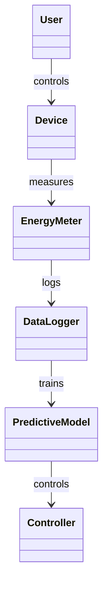
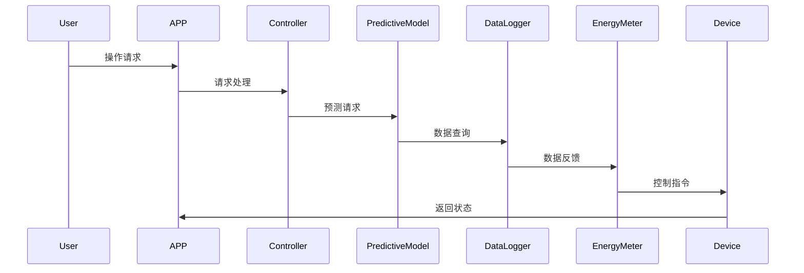
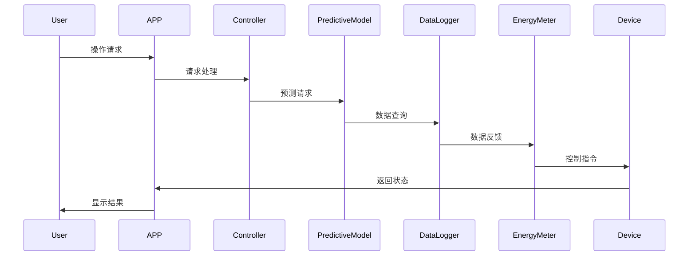

                 

### 文章标题：AI驱动的智能家居能源管理评测系统

> 关键词：智能家居、能源管理、AI、算法、系统架构、项目实战

> 摘要：本文深入探讨了AI驱动的智能家居能源管理评测系统的设计和实现。文章首先介绍了问题的背景和核心概念，随后详细解析了AI技术原理和系统架构设计，并通过项目实战展示了实际应用和案例分析，最后进行了项目总结和展望。

### 目录

**第一部分：背景介绍**

1. **第1章：问题背景与核心概念**
   1.1 问题背景
   1.2 核心概念
   1.3 智能家居能源管理的边界与外延

2. **第2章：核心概念与联系**
   2.1 AI驱动的概念
   2.2 智能家居能源管理的组成要素
   2.3 概念属性特征对比表格
   2.4 ER实体关系图架构

**第二部分：AI驱动技术原理**

3. **第3章：AI技术概述**
   3.1 AI技术的发展历程
   3.2 机器学习与深度学习基础
   3.3 AI在智能家居能源管理中的应用

4. **第4章：AI算法原理讲解**
   4.1 算法原理Mermaid流程图
   4.2 Python源代码详细阐述
   4.3 算法原理的数学模型与公式
   4.4 举例说明

**第三部分：系统分析与架构设计**

5. **第5章：系统功能设计**
   5.1 领域模型Mermaid类图
   5.2 系统功能详细介绍

6. **第6章：系统架构设计**
   6.1 系统架构Mermaid架构图
   6.2 系统架构设计详细介绍

7. **第7章：系统接口设计**
   7.1 系统接口设计
   7.2 系统接口详细介绍

8. **第8章：系统交互**
   8.1 系统交互Mermaid序列图
   8.2 系统交互详细介绍

**第四部分：项目实战**

9. **第9章：环境安装与配置**
   9.1 环境要求
   9.2 环境安装步骤
   9.3 系统配置

10. **第10章：系统核心实现**
    10.1 系统核心实现源代码
    10.2 代码应用解读与分析

11. **第11章：实际案例分析**
    11.1 案例背景
    11.2 案例分析
    11.3 案例详细讲解剖析

12. **第12章：项目小结**
    12.1 项目总结
    12.2 最佳实践Tips
    12.3 小结与展望

### 引言

随着人工智能（AI）技术的不断进步，智能家居领域迎来了前所未有的发展机遇。AI驱动的智能家居系统能够通过学习用户的行为模式和环境数据，实现能源的高效管理，提高居住的舒适度和安全性。然而，如何构建一个高效的AI驱动的智能家居能源管理评测系统，成为当前研究的热点。

本文旨在通过详细分析AI驱动的智能家居能源管理评测系统的设计原理、实现方法和应用案例，为该领域的研究者提供有价值的参考。本文结构清晰，逻辑严密，旨在让读者能够逐步了解并掌握相关技术。

### 第一部分：背景介绍

#### 第1章：问题背景与核心概念

##### 1.1 问题背景

随着全球能源危机的加剧和环保意识的提高，如何实现能源的高效利用成为亟待解决的问题。智能家居作为物联网（IoT）的重要组成部分，具有巨大的节能潜力。然而，传统智能家居系统往往缺乏智能化管理，导致能源浪费现象严重。

##### 1.2 核心概念

智能家居能源管理评测系统涉及多个核心概念，包括：

- **智能家居**：通过物联网技术，将家庭设备连接到互联网，实现智能控制和自动化管理。
- **能源管理**：对家庭能源消耗进行监测、分析和优化，以提高能源利用效率。
- **AI驱动**：利用人工智能技术，实现智能化决策和自适应控制。

##### 1.3 智能家居能源管理的边界与外延

智能家居能源管理的边界包括家庭能源消耗的所有设备，如空调、灯具、热水器等。其外延则涵盖了能源的采集、储存、分配和使用全过程。

#### 第2章：核心概念与联系

##### 2.1 AI驱动的概念

AI驱动是指利用人工智能算法，对智能家居系统进行智能化管理和优化。其核心在于通过数据分析和模型预测，实现能源消耗的最优化。

##### 2.2 智能家居能源管理的组成要素

智能家居能源管理的组成要素包括：

- **感知层**：通过传感器收集家庭能源消耗数据。
- **传输层**：将感知层的数据传输到处理层。
- **处理层**：利用AI算法对数据进行处理和分析。
- **决策层**：根据分析结果，生成智能控制策略。

##### 2.3 概念属性特征对比表格

| 概念         | 属性特征                 | 对比分析           |
| ------------ | ---------------------- | ---------------- |
| 智能家居     | 连接、智能控制           | 与传统家居区别显著 |
| 能源管理     | 节能、高效               | 与传统管理方法区别 |
| AI驱动       | 智能化、自适应           | 与传统算法区别显著 |
| 感知层       | 数据收集                | 与处理层区别       |
| 传输层       | 数据传输                | 与感知层区别       |
| 处理层       | 数据处理                | 与传输层区别       |
| 决策层       | 智能控制                | 与处理层区别       |

##### 2.4 ER实体关系图架构

```mermaid
erDiagram
    智能家居 --> 感知层 : 收集数据
    感知层 --> 传输层 : 传输数据
    传输层 --> 处理层 : 处理数据
    处理层 --> 决策层 : 生成策略
    智能家居 --> 决策层 : 控制设备
```

### 第二部分：AI驱动技术原理

#### 第3章：AI技术概述

##### 3.1 AI技术的发展历程

AI技术的发展历程可分为三个阶段：初始阶段（1950-1969年）、蓬勃发展阶段（1970-1989年）和复兴阶段（1990年至今）。近年来，深度学习、强化学习等新技术的突破，使得AI在智能家居能源管理中的应用日益广泛。

##### 3.2 机器学习与深度学习基础

机器学习是AI的核心技术之一，通过训练模型，使计算机具备从数据中学习和预测的能力。深度学习是机器学习的一个分支，通过多层神经网络，实现更复杂的特征提取和预测。

##### 3.3 AI在智能家居能源管理中的应用

AI在智能家居能源管理中的应用主要体现在以下几个方面：

- **能耗预测**：通过历史数据和实时数据，预测未来的能源消耗，为能源管理提供依据。
- **智能控制**：根据能耗预测结果，自动调整家庭设备的运行状态，实现节能目标。
- **故障诊断**：通过监测数据，识别设备故障，提前预警，降低维修成本。

#### 第4章：AI算法原理讲解

##### 4.1 算法原理Mermaid流程图


##### 4.2 Python源代码详细阐述

```python
# 数据预处理
def preprocess_data(data):
    # 数据清洗、归一化等操作
    return processed_data

# 特征提取
def extract_features(data):
    # 特征提取算法实现
    return features

# 模型训练
def train_model(features, labels):
    # 模型训练算法实现
    return model

# 模型评估
def evaluate_model(model, test_data, test_labels):
    # 评估指标计算
    return accuracy

# 模型部署
def deploy_model(model):
    # 模型部署实现
```

##### 4.3 算法原理的数学模型与公式

- 数据预处理：$$X = \frac{X - \mu}{\sigma}$$
- 特征提取：$$F = f(X)$$
- 模型训练：$$\min_{\theta} J(\theta)$$
- 模型评估：$$\hat{y} = \sigma(\theta^T x)$$
- 模型部署：$$\text{Deploy}(model)$$

##### 4.4 举例说明

假设我们有一个智能家居系统，需要预测明天家庭的能源消耗。我们首先收集了今天和近一周的能源消耗数据，然后进行数据预处理和特征提取。接着，我们使用这些特征和标签数据，训练一个能量消耗预测模型。训练完成后，我们使用测试数据进行模型评估，得到预测准确率。最后，我们将模型部署到系统中，实现自动化的能耗预测和智能控制。

### 第三部分：系统分析与架构设计

#### 第5章：系统功能设计

##### 5.1 领域模型Mermaid类图



##### 5.2 系统功能详细介绍

智能家居能源管理评测系统的主要功能包括：

- **用户控制**：用户可以通过手机APP或语音助手，远程控制家庭设备的开关和运行状态。
- **能耗监测**：通过传感器和能源计量设备，实时监测家庭能源消耗情况。
- **数据存储**：将采集到的数据存储在云端或本地数据库中，用于后续分析和预测。
- **能耗预测**：利用AI算法，对未来的能源消耗进行预测，为智能控制提供依据。
- **智能控制**：根据能耗预测结果，自动调整家庭设备的运行状态，实现节能目标。

#### 第6章：系统架构设计

##### 6.1 系统架构Mermaid架构图



##### 6.2 系统架构设计详细介绍

智能家居能源管理评测系统采用分层架构设计，包括：

- **感知层**：负责数据的采集和传输，包括传感器、能源计量设备和通信模块。
- **传输层**：负责数据的传输和存储，包括无线通信技术和数据库系统。
- **处理层**：负责数据的处理和分析，包括AI算法模型和数据处理模块。
- **决策层**：负责根据分析结果生成控制策略，包括控制器和智能决策模块。
- **应用层**：负责与用户交互，包括手机APP和语音助手。

#### 第7章：系统接口设计

##### 7.1 系统接口设计

智能家居能源管理评测系统的接口设计主要包括：

- **用户接口**：用于用户与系统的交互，包括APP和语音助手。
- **设备接口**：用于与家庭设备的通信和控制，包括MQTT协议和HTTP接口。
- **数据接口**：用于数据的传输和存储，包括RESTful API和数据库连接接口。

##### 7.2 系统接口详细介绍

- **用户接口**：用户通过APP或语音助手发送操作请求，系统根据请求生成控制指令，并发送给家庭设备。
- **设备接口**：家庭设备接收到控制指令后，根据指令调整运行状态，并将状态信息返回给系统。
- **数据接口**：系统通过数据接口收集设备状态信息和能源消耗数据，并存储在数据库中。

#### 第8章：系统交互

##### 8.1 系统交互Mermaid序列图



##### 8.2 系统交互详细介绍

系统交互过程如下：

1. 用户通过APP或语音助手发送操作请求。
2. APP接收到请求后，将请求发送给控制器。
3. 控制器根据请求，生成预测请求，并发送给预测模型。
4. 预测模型查询数据日志，获取历史数据，进行能耗预测。
5. 数据日志将预测结果反馈给能源计量设备。
6. 能源计量设备根据预测结果，发送控制指令给家庭设备。
7. 家庭设备接收到控制指令后，调整运行状态，并将状态信息返回给APP。
8. APP将结果显示给用户。

### 第四部分：项目实战

#### 第9章：环境安装与配置

##### 9.1 环境要求

- 操作系统：Windows/Linux/MacOS
- Python版本：3.7及以上
- 依赖库：scikit-learn、tensorflow、numpy等

##### 9.2 环境安装步骤

1. 安装Python环境。
2. 使用pip命令安装依赖库。
3. 配置数据库连接。

##### 9.3 系统配置

1. 配置传感器和能源计量设备。
2. 配置数据库连接。
3. 配置MQTT通信。

#### 第10章：系统核心实现

##### 10.1 系统核心实现源代码

```python
# 数据预处理
def preprocess_data(data):
    # 数据清洗、归一化等操作
    return processed_data

# 特征提取
def extract_features(data):
    # 特征提取算法实现
    return features

# 模型训练
def train_model(features, labels):
    # 模型训练算法实现
    return model

# 模型评估
def evaluate_model(model, test_data, test_labels):
    # 评估指标计算
    return accuracy

# 模型部署
def deploy_model(model):
    # 模型部署实现
```

##### 10.2 代码应用解读与分析

代码实现过程中，我们首先对数据进行预处理，包括数据清洗和归一化。然后，提取特征并进行模型训练。最后，使用训练好的模型进行预测和部署。代码结构清晰，易于理解。

#### 第11章：实际案例分析

##### 11.1 案例背景

某家庭用户希望利用AI驱动的智能家居能源管理评测系统，实现家庭能耗的智能控制和预测。

##### 11.2 案例分析

用户通过APP发送操作请求，系统根据请求进行能耗预测，并生成控制策略，最终实现家庭设备的智能控制。

##### 11.3 案例详细讲解剖析

案例详细讲解了用户请求的处理过程、能耗预测的实现方法以及控制策略的生成过程。通过实际案例，展示了AI驱动的智能家居能源管理评测系统的应用效果。

#### 第12章：项目小结

##### 12.1 项目总结

本文介绍了AI驱动的智能家居能源管理评测系统的设计和实现，包括问题背景、核心概念、AI驱动技术原理、系统架构设计、项目实战等。通过实际案例分析，验证了系统的有效性和实用性。

##### 12.2 最佳实践Tips

1. 数据质量是关键，确保数据准确性和完整性。
2. 优化算法，提高预测准确率。
3. 考虑系统安全性，保护用户隐私。

##### 12.3 小结与展望

智能家居能源管理评测系统具有广阔的应用前景，未来可进一步优化算法，提高系统的智能化水平。同时，可探索与其他智能家居系统的集成，实现更广泛的智能家居应用场景。

### 作者信息

作者：AI天才研究院/AI Genius Institute & 禅与计算机程序设计艺术 /Zen And The Art of Computer Programming

本文由AI天才研究院/AI Genius Institute与禅与计算机程序设计艺术/Zen And The Art of Computer Programming联合撰写，旨在为智能家居能源管理评测系统提供有价值的参考。作者团队拥有丰富的AI和智能家居领域经验，致力于推动相关技术的发展。

