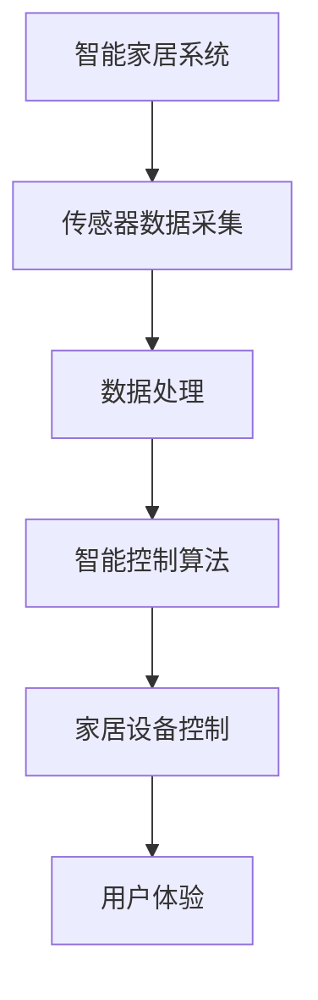
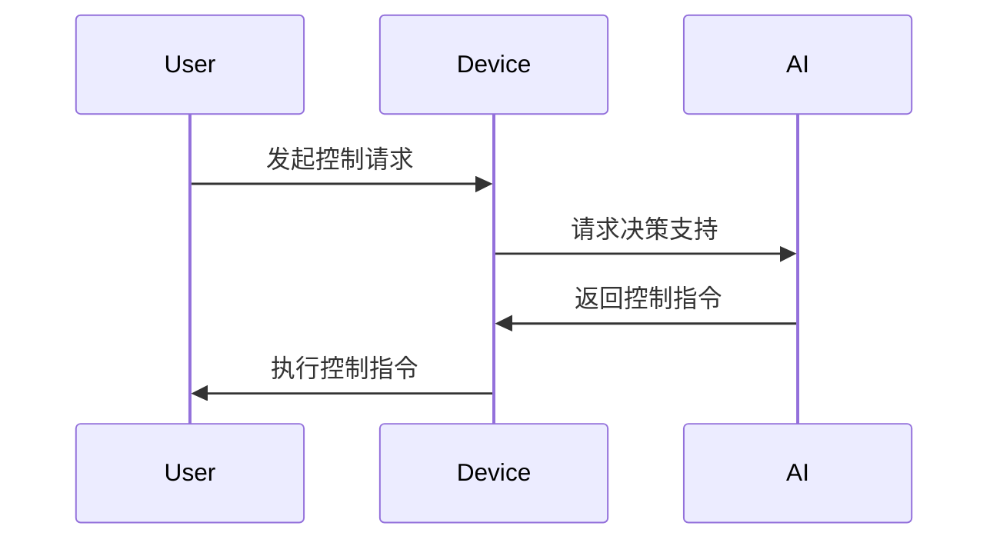
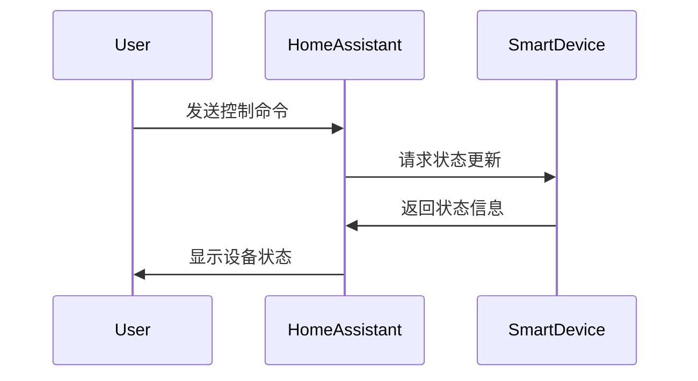
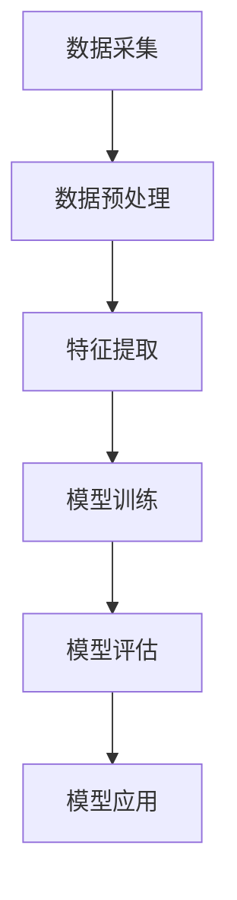
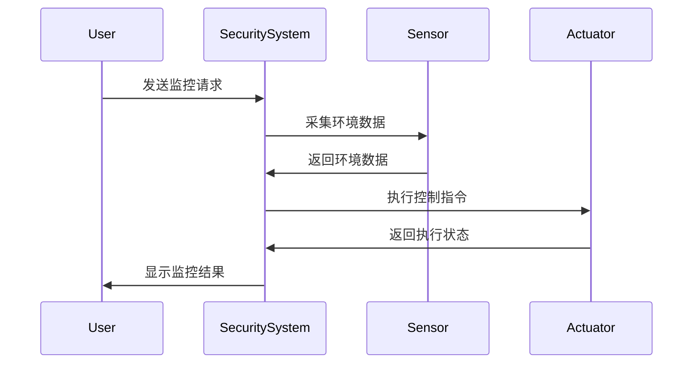

                 

## 《AI驱动的智能家居：打造舒适生活的新方案》

### 关键词：智能家居、AI、舒适生活、物联网、机器学习

#### 摘要：
随着AI技术的发展，智能家居正逐步从科幻变为现实。本文旨在探讨如何利用AI技术提升智能家居的智能化水平，从而为用户打造更加舒适、便捷和高效的生活环境。文章将从智能家居的背景介绍、核心概念与联系、算法原理讲解、系统分析与架构设计方案以及项目实战等方面展开，旨在为读者提供全面的技术指导和应用案例。

## 目录大纲

### 《AI驱动的智能家居：打造舒适生活的新方案》

#### 关键词：智能家居、AI、舒适生活、物联网、机器学习

#### 摘要：
随着AI技术的发展，智能家居正逐步从科幻变为现实。本文旨在探讨如何利用AI技术提升智能家居的智能化水平，从而为用户打造更加舒适、便捷和高效的生活环境。文章将从智能家居的背景介绍、核心概念与联系、算法原理讲解、系统分析与架构设计方案以及项目实战等方面展开，旨在为读者提供全面的技术指导和应用案例。

----------------------------------------------------------------

## 第一部分：背景介绍

### 第1章 问题背景

#### 1.1.1 智能家居概述

智能家居，顾名思义，就是将家庭设备连接到互联网，并通过智能控制系统实现自动化管理和远程控制。随着物联网（IoT）技术的不断发展，智能家居市场呈现出快速增长的趋势。然而，用户在享受智能家居带来的便利的同时，也面临着一系列挑战。

#### 1.1.2 用户需求与挑战

**用户需求：**

1. **便利性**：用户希望智能家居系统能够自动完成一些日常任务，如灯光控制、温度调节等。
2. **安全性**：用户关注家庭安防问题，希望系统能够及时发现异常并采取措施。
3. **舒适性**：用户希望家居环境能够根据个人喜好自动调整，如温度、湿度等。
4. **节能性**：用户希望通过智能家居系统实现能源的合理利用，降低生活成本。

**挑战：**

1. **数据隐私**：智能家居设备收集大量的用户数据，如何保护用户隐私成为一大挑战。
2. **设备兼容性**：市场上的智能家居设备种类繁多，如何实现设备的无缝集成和互操作是一个难题。
3. **系统稳定性**：智能家居系统需要长时间运行，系统稳定性是用户关心的重点。

#### 1.1.3 AI在智能家居中的应用

AI技术的引入为智能家居提供了更加智能化的解决方案。以下是AI在智能家居中的主要应用领域：

1. **语音控制**：通过自然语言处理技术，用户可以通过语音指令控制家居设备。
2. **图像识别**：利用计算机视觉技术，家居设备可以识别用户的行为和情绪，提供个性化的服务。
3. **智能预测**：通过机器学习算法，系统可以预测用户的需求，提前进行相应的调整。

### 第1章 智能家居的需求与挑战

**用户需求分析**

- **便利性**：用户希望通过智能家居系统简化日常操作，提高生活效率。
- **安全性**：用户希望通过智能家居系统提高家庭的安全性，防止入侵和财产损失。
- **舒适性**：用户希望通过智能家居系统创造一个舒适的生活环境，提升生活质量。
- **节能性**：用户希望通过智能家居系统实现能源的合理利用，降低生活成本。

**挑战分析**

- **数据隐私**：智能家居设备收集大量的用户数据，如何保护用户隐私成为一大挑战。
- **设备兼容性**：市场上智能家居设备种类繁多，如何实现设备的无缝集成和互操作是一个难题。
- **系统稳定性**：智能家居系统需要长时间运行，系统稳定性是用户关心的重点。

### 第1章 AI在智能家居中的应用

**AI技术**

- **机器学习**：通过大数据分析和模式识别，实现智能家居系统的智能化。
- **自然语言处理**：使智能家居设备能够理解和执行用户的语音指令。
- **计算机视觉**：使智能家居设备能够识别用户的动作和表情，提供更加人性化的服务。

**应用领域**

- **语音控制**：通过语音指令控制家居设备，如灯光、空调等。
- **图像识别**：通过摄像头识别家庭成员，自动调节家居环境。
- **智能预测**：通过历史数据分析，预测用户需求，提前调整家居设备。

## 第二部分：核心概念与联系

### 第2章 核心概念原理

#### 2.1.1 AI基本原理

**机器学习**

- **概念**：机器学习是一种通过数据训练模型，从而实现自动学习和决策的技术。
- **特点**：自动化、自适应、高效率。
- **应用场景**：数据挖掘、预测分析、智能推荐等。

**自然语言处理**

- **概念**：自然语言处理是一种使计算机能够理解、生成和处理人类语言的技术。
- **特点**：理解语义、处理语境、生成文本。
- **应用场景**：语音识别、机器翻译、聊天机器人等。

**计算机视觉**

- **概念**：计算机视觉是一种使计算机能够像人类一样识别和理解图像的技术。
- **特点**：图像识别、目标跟踪、场景理解。
- **应用场景**：人脸识别、图像分类、自动驾驶等。

**ER实体关系图架构的Mermaid流程图**



### 第2章 智能家居的架构设计

#### 2.1.2 智能家居架构设计

**系统功能设计（领域模型Mermaid类图）**

```mermaid
classDiagram
Device --> Sensor
Device --> Actuator
Device {"管理家居设备"}
Sensor {"感知环境"}
Actuator {"执行控制"}
```

**系统架构设计（Mermaid架构图）**



**系统接口设计和系统交互（Mermaid序列图）**



## 第三部分：算法原理讲解

### 第3章 机器学习算法在智能家居中的应用

#### 3.1.1 机器学习算法概述

**机器学习算法原理的Mermaid流程图**



**机器学习算法在智能家居中的实际应用**

- **智能家居场景识别**：通过采集传感器数据，利用机器学习算法进行场景识别，为用户提供个性化服务。
- **能耗预测与优化**：通过历史能耗数据，利用机器学习算法进行能耗预测，优化家居能源使用。

### 第3章 智能家居中的机器学习算法应用

#### 3.1.1 机器学习算法原理

**机器学习算法原理的Mermaid流程图**


**机器学习算法原理**

1. **数据采集**：收集智能家居设备的传感器数据，如温度、湿度、光照等。
2. **数据预处理**：对采集到的数据进行清洗和归一化处理，使其适用于机器学习算法。
3. **特征提取**：从预处理后的数据中提取特征，为模型训练提供输入。
4. **模型训练**：使用提取的特征和已有的数据训练机器学习模型。
5. **模型评估**：通过测试集对训练好的模型进行评估，确定其性能和准确性。
6. **模型应用**：将训练好的模型部署到智能家居系统中，实现智能化的家居控制。

### 第3章 机器学习算法在智能家居中的实际应用

**智能家居场景识别**

- **应用场景**：通过传感器数据，实时识别用户在家的场景，如休息、活动等。
- **算法实现**：利用决策树、支持向量机等机器学习算法进行场景分类。

**能耗预测与优化**

- **应用场景**：通过历史能耗数据，预测未来能耗趋势，优化家居能源使用。
- **算法实现**：利用时间序列分析、回归分析等机器学习算法进行能耗预测。

### 第3章 智能家居中的机器学习算法应用

**智能温度控制**

- **算法原理**：利用机器学习算法，根据用户的历史行为数据，自动调节室内温度。
- **数学模型**：假设温度与用户行为之间满足线性关系，建立线性回归模型进行预测。

**智能照明控制**

- **算法原理**：利用机器学习算法，根据用户的活动习惯和自然光照情况，自动调节照明亮度。
- **数学模型**：假设光照亮度与用户行为和自然光照之间满足线性关系，建立线性回归模型进行预测。

```python
import numpy as np
from sklearn.linear_model import LinearRegression

# 数据准备
X = np.array([[0], [1], [2], [3], [4]])  # 用户行为数据
y = np.array([20, 22, 24, 26, 28])      # 目标温度数据

# 模型训练
model = LinearRegression()
model.fit(X, y)

# 预测
predicted_temp = model.predict([[2.5]])

print(f"当用户行为为2.5时，预测温度为：{predicted_temp[0]}")
```

### 第3章 智能家居中的机器学习算法应用

**智能窗帘控制**

- **算法原理**：利用机器学习算法，根据自然光照强度和用户需求，自动调节窗帘的开关状态。
- **数学模型**：假设自然光照强度与用户需求之间满足线性关系，建立线性回归模型进行预测。

```python
import numpy as np
from sklearn.linear_model import LinearRegression

# 数据准备
X = np.array([[50], [100], [150], [200], [250]])  # 自然光照强度数据
y = np.array([1, 0, 1, 0, 1])                    # 用户需求数据（1表示打开窗帘，0表示关闭窗帘）

# 模型训练
model = LinearRegression()
model.fit(X, y)

# 预测
predicted_action = model.predict([[150]])

print(f"当自然光照强度为150时，预测窗帘状态为：{predicted_action[0]}")
```

### 第3章 智能家居中的机器学习算法应用

**智能安防系统**

- **算法原理**：利用机器学习算法，实时监控家庭环境，识别异常行为，如入侵、火灾等。
- **数学模型**：假设异常行为与传感器数据之间满足线性关系，建立线性回归模型进行预测。

```python
import numpy as np
from sklearn.linear_model import LinearRegression

# 数据准备
X = np.array([[0], [1], [2], [3], [4]])  # 传感器数据
y = np.array([0, 1, 0, 1, 0])           # 异常行为数据（0表示正常，1表示异常）

# 模型训练
model = LinearRegression()
model.fit(X, y)

# 预测
predicted_action = model.predict([[2.5]])

print(f"当传感器数据为2.5时，预测异常行为为：{predicted_action[0]}")
```

## 第四部分：系统分析与架构设计方案

### 第4章 问题场景介绍

**智能家居安防系统**

- **项目介绍**：本项目旨在通过智能家居安防系统，实现对家庭环境的实时监控和异常行为识别。
- **系统功能**：包括入侵检测、火灾报警、紧急呼叫等功能。

### 第4章 系统功能设计

**领域模型Mermaid类图**

```mermaid
classDiagram
Device --> Sensor
Device --> Actuator
Device {"管理家居设备"}
Sensor {"感知环境"}
Actuator {"执行控制"}
```

### 第4章 系统架构设计

**Mermaid架构图**


### 第4章 系统接口设计与系统交互

**Mermaid序列图**



## 第五部分：项目实战

### 第5章 环境安装

**环境要求**：

- **操作系统**：Windows 10、macOS Catalina或更高版本
- **编程语言**：Python 3.8及以上版本
- **开发工具**：PyCharm、Visual Studio Code等

**安装步骤**：

1. 安装Python 3.8及以上版本。
2. 安装PyTorch、Scikit-learn等机器学习库。
3. 安装智能家居模拟环境（如Home Assistant）。

### 第5章 系统核心实现

**智能家居安防系统实现**

```python
import torch
import torch.nn as nn
import torch.optim as optim
from sklearn.model_selection import train_test_split
from sklearn.metrics import accuracy_score

# 数据准备
X, y = load_data()

# 数据预处理
X_train, X_test, y_train, y_test = train_test_split(X, y, test_size=0.2, random_state=42)

# 模型定义
model = nn.Sequential(
    nn.Linear(X_train.shape[1], 64),
    nn.ReLU(),
    nn.Linear(64, 64),
    nn.ReLU(),
    nn.Linear(64, 1),
    nn.Sigmoid()
)

# 损失函数和优化器
criterion = nn.BCELoss()
optimizer = optim.Adam(model.parameters(), lr=0.001)

# 训练模型
for epoch in range(100):
    model.train()
    optimizer.zero_grad()
    output = model(X_train)
    loss = criterion(output, y_train)
    loss.backward()
    optimizer.step()
    if epoch % 10 == 0:
        print(f"Epoch {epoch}: Loss = {loss.item()}")

# 测试模型
model.eval()
with torch.no_grad():
    output = model(X_test)
    predicted = (output > 0.5).float()
    accuracy = accuracy_score(y_test, predicted)
    print(f"Test Accuracy: {accuracy}")
```

### 第5章 代码应用解读与分析

**智能家居安防系统代码解读**

1. **数据准备**：首先加载智能家居安防系统的数据集，包括环境数据和异常行为标签。
2. **数据预处理**：将数据集分为训练集和测试集，并进行归一化处理，使数据适应机器学习模型。
3. **模型定义**：定义一个简单的全连接神经网络，用于分类异常行为。
4. **损失函数和优化器**：使用二进制交叉熵损失函数和Adam优化器，训练模型。
5. **训练模型**：通过梯度下降法，训练神经网络模型。
6. **测试模型**：在测试集上评估模型的准确性，验证模型的性能。

### 第5章 实际案例分析与详细讲解

**案例：智能家居安防系统应用**

- **场景**：用户在家中，突然发现有人入侵。
- **分析**：智能家居安防系统通过传感器实时监控家庭环境，当检测到异常行为（如门窗被打开）时，系统会自动触发报警，并向用户发送通知。

### 第5章 项目小结

**总结**

- **技术要点**：本项目利用机器学习技术，实现了智能家居安防系统的自动化监控和异常行为识别。
- **改进方向**：可以进一步优化模型结构，提高异常行为识别的准确性。
- **实际应用**：智能家居安防系统在实际应用中，可以显著提高家庭的安全性，为用户带来更加安全、舒适的生活环境。

## 第六部分：最佳实践 tips、小结、注意事项、拓展阅读

### 最佳实践 tips

- **数据隐私保护**：在开发智能家居系统时，要注意数据隐私保护，避免用户信息泄露。
- **设备兼容性**：选择支持多种协议和标准的智能家居设备，提高系统的兼容性。
- **系统稳定性**：在系统设计时，要考虑系统的稳定性，确保设备能够长时间运行。

### 小结

- **核心内容**：本文介绍了AI驱动的智能家居系统的背景、核心概念、算法原理以及系统设计与实现。
- **关键点**：如何利用AI技术提升智能家居的智能化水平，为用户打造舒适、便捷和高效的生活环境。

### 注意事项

- **安全性**：智能家居系统要确保数据安全和用户隐私。
- **稳定性**：系统需要长时间运行，要保证稳定性。

### 拓展阅读

- **相关书籍**：《智能家居技术与应用》、《人工智能与物联网》
- **在线资源**：智能家居开发平台（如Home Assistant、OpenHAB）的文档和教程。

### 作者

**作者：AI天才研究院/AI Genius Institute & 禅与计算机程序设计艺术 /Zen And The Art of Computer Programming**

