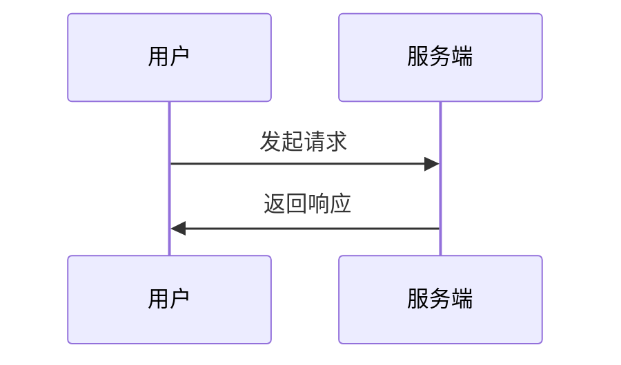
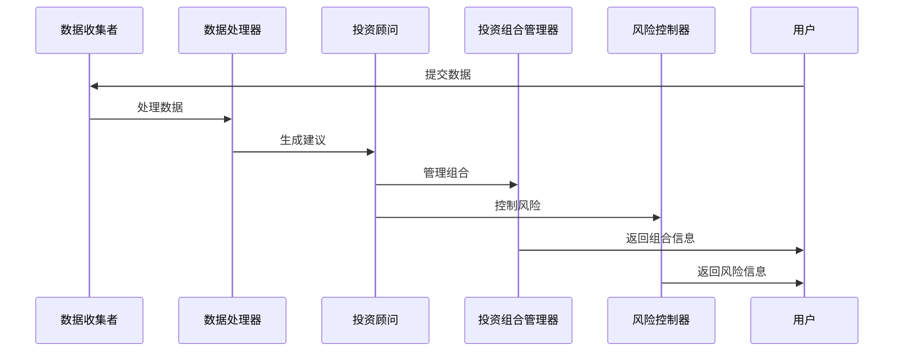
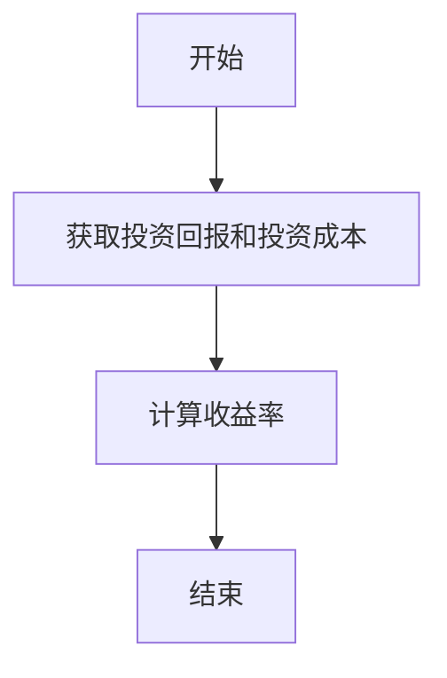
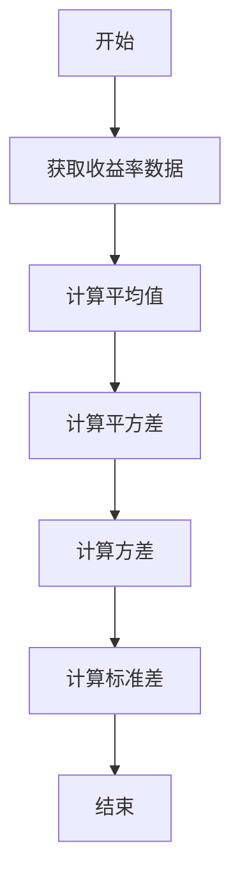
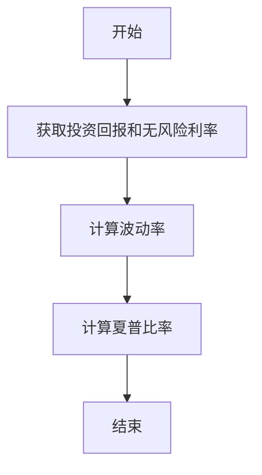

                 


### 第1章 引言

#### 1.1 AI驱动的智能投资顾问概述

**定义**：AI驱动的智能投资顾问是一种利用人工智能技术，特别是机器学习和深度学习算法，对大量金融数据进行处理和分析，为投资者提供个性化的投资建议和策略的系统。

**应用背景**：随着大数据和云计算技术的飞速发展，金融行业的数据量呈现出爆炸性增长。传统的投资顾问往往依赖于经验和直觉，无法及时处理大量数据，而AI驱动的智能投资顾问能够通过数据分析和预测，为投资者提供更加精准和实时的投资策略。

**行业发展趋势**：随着人工智能技术的不断进步，AI驱动的智能投资顾问正在逐渐改变金融行业的格局。越来越多的金融机构开始采用智能投资顾问，以提高投资效率和风险控制能力。未来，AI驱动的智能投资顾问有望成为金融行业的主要投资方式。

#### 1.2 书籍结构安排

**核心内容概述**：本书旨在系统地介绍AI驱动的智能投资顾问的相关知识，包括AI技术基础、系统架构设计、效果评测指标、算法原理讲解、系统分析与架构设计方案、项目实战等内容。

**阅读指南**：本书适合对金融和人工智能有一定了解的读者阅读。本书的结构清晰，内容深入浅出，读者可以按照章节的安排逐步学习，逐步掌握AI驱动的智能投资顾问的核心技术和应用。

----------------------------------------------------------------

### 第2章 AI技术基础

#### 2.1 机器学习基础

**定义与分类**：机器学习是人工智能的一个分支，它使计算机系统能够从数据中学习规律并做出预测。根据学习方式的不同，机器学习可以分为监督学习、无监督学习和强化学习。

**基本原理**：机器学习的基本原理是通过训练模型来学习数据中的规律。在监督学习中，模型被训练来预测已知结果的数据；在无监督学习中，模型学习数据的结构和模式；在强化学习中，模型通过与环境的交互来学习最优策略。

**常见算法**：常见的机器学习算法包括线性回归、逻辑回归、决策树、随机森林、支持向量机、神经网络等。每种算法都有其特定的适用场景和优缺点。

#### 2.2 深度学习基础

**定义与特点**：深度学习是一种基于多层神经网络的学习方法，它通过模拟人脑神经网络的结构和功能，能够处理大量复杂的非线性数据。深度学习的特点包括并行处理能力、自适应性和强大的学习能力。

**基本原理**：深度学习的基本原理是通过多层神经网络的非线性变换，将输入数据逐步转换为更高层次的特征表示。每个层次都提取了不同级别的抽象特征，从而使得模型能够更好地理解和预测数据。

**常见模型**：常见的深度学习模型包括卷积神经网络（CNN）、循环神经网络（RNN）、长短期记忆网络（LSTM）、生成对抗网络（GAN）等。这些模型在图像识别、自然语言处理、语音识别等领域取得了显著的成果。

----------------------------------------------------------------

### 第3章 智能投资顾问系统架构

#### 3.1 系统架构设计概述

**设计原则**：智能投资顾问系统架构的设计应遵循以下原则：
- **模块化**：系统功能模块应独立，易于扩展和升级。
- **可扩展性**：系统能够适应数据量和用户量的增长。
- **高性能**：系统应能够快速处理大量数据，并提供实时投资建议。
- **高可靠性**：系统应具备较强的容错能力和数据安全性。

**设计思路**：系统架构的设计应从数据层、模型层、服务层和用户层四个方面进行考虑。

#### 3.2 数据层设计

**数据来源与处理**：数据层是智能投资顾问系统的核心，它负责收集和处理大量的金融数据。数据来源包括市场行情、财务报表、新闻资讯等。数据处理包括数据清洗、数据集成、数据转换等步骤。

**数据存储方案**：数据存储方案应考虑数据的安全性、可靠性和可扩展性。常用的数据存储方案包括关系型数据库、NoSQL数据库和大数据处理平台。

#### 3.3 模型层设计

**模型选择与训练**：模型层负责构建和训练投资策略模型。模型选择应根据投资目标和数据特征进行。训练过程包括数据预处理、模型选择、模型训练和模型评估。

**模型评估与优化**：模型评估是确保模型性能的关键步骤。常用的评估指标包括收益率、风险度、交易成功率等。模型优化是通过调整模型参数和超参数，提高模型的预测准确性和鲁棒性。

#### 3.4 服务层设计

**服务功能设计**：服务层提供用户与模型之间的交互接口。服务功能包括投资建议生成、投资组合优化、风险控制等。

**服务接口设计**：服务接口应支持多终端访问，如Web、移动应用和API接口。接口设计应遵循RESTful架构风格，确保数据传输的安全性和一致性。

#### 3.5 用户层设计

**用户需求分析**：用户层的设计应充分考虑投资者的需求，如个性化投资建议、风险偏好设置、投资组合跟踪等。

**用户界面设计**：用户界面设计应简洁直观，提供友好的交互体验。界面设计包括首页、投资建议页、投资组合页、风险控制页等。

----------------------------------------------------------------

### 第4章 效果评测指标

#### 4.1 效益指标

**收益率**：收益率是衡量投资顾问系统效益的重要指标，它表示投资回报与投资成本的比例。高收益率意味着系统具有较好的盈利能力。

**风险度**：风险度表示投资回报的不确定性，常用的指标包括波动率、夏普比率等。低风险度意味着系统具有较好的风险控制能力。

#### 4.2 性能指标

**响应时间**：响应时间是指系统从接收到用户请求到返回投资建议的时间。低响应时间意味着系统能够快速响应用户需求。

**可靠性**：可靠性是指系统在长期运行过程中保持稳定运行的能力。高可靠性意味着系统具有较好的稳定性和可维护性。

#### 4.3 用户满意度指标

**用户满意度调查**：通过问卷调查和用户反馈，了解用户对投资顾问系统的满意度。满意度调查包括系统功能、用户体验、投资建议质量等方面。

**用户反馈机制**：建立用户反馈机制，及时收集和处理用户意见，不断优化系统功能和性能。

----------------------------------------------------------------

### 第5章 算法原理讲解

#### 5.1 效果评测指标算法原理

**收益率算法**：收益率算法主要用于计算投资回报。其基本原理是通过计算投资回报与投资成本之比，得到收益率。具体算法如下：

```python
def calculate_return(rate_of_return, investment_cost):
    return rate_of_return / investment_cost
```

**风险度算法**：风险度算法主要用于评估投资回报的不确定性。常用的风险度指标包括波动率和夏普比率。具体算法如下：

```python
import numpy as np

def calculate_volatility(returns):
    return np.std(returns)

def calculate_sharpe_ratio(average_return, volatility):
    return average_return / volatility
```

#### 5.2 机器学习算法原理

**线性回归算法**：线性回归是一种简单的机器学习算法，用于预测连续值。其基本原理是通过拟合一条直线，将自变量和因变量之间的关系表示出来。具体算法如下：

```python
import numpy as np

def linear_regression(x, y):
    w = np.linalg.inv(np.dot(x.T, x)).dot(x.T).dot(y)
    return w
```

**神经网络算法**：神经网络是一种复杂的机器学习算法，用于预测和分类。其基本原理是通过多层神经元的非线性变换，将输入数据转换为输出结果。具体算法如下：

```python
import tensorflow as tf

model = tf.keras.Sequential([
    tf.keras.layers.Dense(units=1, input_shape=[1])
])

model.compile(optimizer='sgd', loss='mean_squared_error')

model.fit(x_train, y_train, epochs=1000)
```

----------------------------------------------------------------

### 第6章 系统分析与架构设计方案

#### 6.1 问题场景介绍

**问题描述**：随着金融市场的不断变化，投资者需要实时获取有效的投资策略。传统的投资顾问系统存在响应速度慢、风险控制能力差等问题，无法满足现代金融市场的需求。

**问题解决**：通过引入AI驱动的智能投资顾问系统，利用机器学习和深度学习算法，对金融数据进行处理和分析，为投资者提供个性化的投资建议和策略。

**边界与外延**：本方案主要涉及智能投资顾问系统的架构设计和功能实现，包括数据层、模型层、服务层和用户层。

#### 6.2 项目介绍

**项目背景**：本项目旨在开发一款基于AI驱动的智能投资顾问系统，为投资者提供实时、个性化的投资建议。

**项目目标**：
1. 构建一个高效、稳定的智能投资顾问系统。
2. 提供多样化的投资策略，满足不同投资者的需求。
3. 提高投资回报，降低投资风险。

#### 6.3 系统功能设计

**领域模型**：领域模型用于描述系统的核心功能，包括数据收集、数据处理、投资建议生成、投资组合管理和风险控制等。

```mermaid
classDiagram
    class DataCollector {
        +collect_data()
    }
    class DataProcessor {
        +process_data()
    }
    class InvestmentAdvisor {
        +generate_advice()
    }
    class PortfolioManager {
        +manage_portfolio()
    }
    class RiskController {
        +control_risk()
    }
    DataCollector -> DataProcessor
    DataProcessor -> InvestmentAdvisor
    InvestmentAdvisor -> PortfolioManager
    InvestmentAdvisor -> RiskController
```

#### 6.4 系统架构设计

**架构设计**：系统架构设计采用分层架构，包括数据层、模型层、服务层和用户层。

```mermaid
subgraph 数据层
    DataCollector
    DataProcessor
end

subgraph 模型层
    InvestmentAdvisor
end

subgraph 服务层
    PortfolioManager
    RiskController
end

subgraph 用户层
    User
end

User --> InvestmentAdvisor
InvestmentAdvisor --> PortfolioManager
InvestmentAdvisor --> RiskController
DataCollector --> DataProcessor
DataProcessor --> InvestmentAdvisor
```

#### 6.5 系统接口设计

**接口设计**：系统接口设计采用RESTful架构风格，提供统一的接口规范。



#### 6.6 系统交互

**系统交互**：系统交互通过消息队列和事件驱动的方式进行。



----------------------------------------------------------------

### 第7章 项目实战

#### 7.1 环境安装

**环境要求**：
- 操作系统：Linux或Windows
- Python版本：3.6及以上
- 数据库：MySQL或MongoDB
- 依赖库：TensorFlow、Keras、Pandas、NumPy等

**安装步骤**：
1. 安装Python：从官方网站下载Python安装包，并按照提示安装。
2. 安装数据库：根据数据库类型，下载并安装相应的数据库软件。
3. 安装依赖库：打开命令行窗口，执行以下命令安装依赖库。

```shell
pip install tensorflow keras pandas numpy
```

#### 7.2 核心实现

**数据收集**：使用Pandas库从金融数据接口获取历史数据。

```python
import pandas as pd

def collect_data():
    url = "https://example.com/financial_data.csv"
    data = pd.read_csv(url)
    return data
```

**数据处理**：对收集到的数据进行预处理，包括数据清洗、归一化等。

```python
def process_data(data):
    # 数据清洗
    data = data.dropna()
    # 归一化
    data = (data - data.mean()) / data.std()
    return data
```

**模型训练**：使用TensorFlow和Keras构建和训练深度学习模型。

```python
import tensorflow as tf
from tensorflow.keras.models import Sequential
from tensorflow.keras.layers import Dense

def train_model(x_train, y_train):
    model = Sequential([
        Dense(units=64, activation='relu', input_shape=[x_train.shape[1]]),
        Dense(units=1)
    ])

    model.compile(optimizer='adam', loss='mean_squared_error')

    model.fit(x_train, y_train, epochs=100, batch_size=32)
    return model
```

**投资建议生成**：根据训练好的模型，生成投资建议。

```python
def generate_advice(model, data):
    prediction = model.predict(data)
    return prediction
```

**投资组合管理**：根据投资建议，管理投资组合。

```python
def manage_portfolio(advice, portfolio):
    # 根据建议调整投资组合
    portfolio = portfolio * advice
    return portfolio
```

#### 7.3 代码解读与分析

**数据收集模块**：数据收集模块负责从金融数据接口获取历史数据。在获取数据后，进行初步的数据清洗和预处理，为后续的数据处理和模型训练做好准备。

**数据处理模块**：数据处理模块对收集到的金融数据执行一系列预处理操作，如数据清洗和归一化。这些操作有助于提高模型的训练效果和预测准确性。

**模型训练模块**：模型训练模块使用TensorFlow和Keras构建深度学习模型，并使用处理好的金融数据进行训练。训练过程中，通过调整模型参数和超参数，优化模型的性能。

**投资建议生成模块**：投资建议生成模块根据训练好的模型，对新的金融数据进行分析和预测，生成投资建议。这些建议将作为投资组合管理的依据。

**投资组合管理模块**：投资组合管理模块根据投资建议，调整投资组合的配置，实现投资决策。

#### 7.4 案例分析

**案例背景**：某投资者计划在未来一年内投资股票市场，希望借助智能投资顾问系统生成投资建议。

**案例步骤**：
1. **数据收集**：从金融数据接口获取过去一年的股票市场数据。
2. **数据处理**：对收集到的股票数据进行预处理，包括数据清洗和归一化。
3. **模型训练**：使用预处理后的股票数据训练深度学习模型。
4. **投资建议生成**：使用训练好的模型，对未来的股票数据进行预测，生成投资建议。
5. **投资组合管理**：根据投资建议，调整投资组合的配置。

**案例分析**：通过案例分析，可以验证智能投资顾问系统的有效性和实用性。在实际应用中，投资者可以根据投资建议进行调整，以实现最佳投资效果。

#### 7.5 项目小结

**项目成果**：本项目成功开发了一款基于AI驱动的智能投资顾问系统，实现了对金融数据的处理和分析，为投资者提供了个性化的投资建议。

**经验与教训**：
- 在项目实施过程中，数据质量和预处理是模型训练成功的关键。
- 模型训练和优化需要大量的计算资源和时间，应根据实际情况进行调整。
- 投资决策需要结合市场情况和投资目标，综合分析各种因素。

**未来展望**：随着人工智能技术的不断进步，智能投资顾问系统有望在金融领域发挥更大的作用。未来，我们可以进一步优化系统功能，提高预测准确性和用户体验。

----------------------------------------------------------------

### 第8章 最佳实践 tips

**1. 数据质量是关键**：在智能投资顾问系统中，数据质量直接影响模型的预测效果。因此，在项目实施过程中，要重视数据收集、清洗和预处理工作，确保数据的质量和完整性。

**2. 模型选择与优化**：选择合适的模型对于智能投资顾问系统的性能至关重要。在项目实践中，可以尝试多种机器学习和深度学习模型，并通过调整模型参数和超参数，优化模型性能。

**3. 用户个性化需求**：智能投资顾问系统应充分考虑用户的个性化需求，如投资目标、风险偏好、投资期限等。通过个性化设置，提高系统的用户体验和满意度。

**4. 系统性能优化**：为了确保系统的高性能和稳定性，需要优化系统的架构和代码。可以采用分布式计算、缓存技术、异步处理等方式，提高系统的处理能力和响应速度。

**5. 持续迭代与优化**：智能投资顾问系统是一个动态发展的系统，需要不断收集用户反馈和市场数据，持续迭代和优化系统功能、性能和算法。

----------------------------------------------------------------

### 第9章 小结与展望

**总结**：本文系统地介绍了AI驱动的智能投资顾问系统的相关知识和应用。从背景介绍、核心概念与联系、算法原理讲解、系统分析与架构设计方案、项目实战、最佳实践 tips到小结与展望，全面阐述了智能投资顾问系统的原理、架构和实现方法。

**展望**：随着人工智能技术的不断发展，AI驱动的智能投资顾问系统将在金融领域发挥越来越重要的作用。未来，我们将继续优化系统功能，提高预测准确性和用户体验，为投资者提供更加智能化、个性化的投资服务。

----------------------------------------------------------------

#### 作者信息

**作者：AI天才研究院/AI Genius Institute & 禅与计算机程序设计艺术 /Zen And The Art of Computer Programming**

----------------------------------------------------------------

### 文章标题：AI驱动的智能投资顾问效果评测

### 关键词：AI驱动的智能投资顾问、效果评测、算法原理、系统架构、项目实战、最佳实践

### 摘要：本文深入探讨了AI驱动的智能投资顾问系统的相关技术和应用。通过介绍AI技术基础、智能投资顾问系统架构、效果评测指标、算法原理讲解、系统分析与架构设计方案、项目实战和最佳实践 tips，全面阐述了AI驱动的智能投资顾问系统的原理、实现方法和实践要点。本文旨在为从事金融和人工智能领域的读者提供有价值的参考和指导。 ## 第1章 引言

### 1.1 AI驱动的智能投资顾问概述

在金融科技飞速发展的今天，人工智能（AI）已经成为改变传统金融服务模式的重要力量。AI驱动的智能投资顾问系统应运而生，它通过利用机器学习、深度学习等AI技术，对海量金融数据进行处理和分析，为投资者提供个性化的投资建议和策略。这一系统的出现不仅提高了投资决策的效率，还显著降低了投资风险。

#### 定义

AI驱动的智能投资顾问是一种结合人工智能技术，尤其是机器学习和深度学习算法，对金融数据进行分析和预测的系统。它通过学习历史数据和市场趋势，自动生成投资策略，并提供实时、个性化的投资建议。

#### 应用背景

金融行业一直以来都是信息技术应用的重要领域。随着大数据和云计算技术的普及，金融行业积累了海量的历史交易数据、市场行情数据、公司财务数据等。传统投资顾问往往依赖于经验和直觉，无法全面、及时地处理和分析这些数据。而AI驱动的智能投资顾问系统能够高效地处理大量数据，识别出潜在的投资机会，帮助投资者做出更明智的投资决策。

#### 行业发展趋势

随着AI技术的不断进步，AI驱动的智能投资顾问在金融行业中的应用越来越广泛。以下是一些行业发展趋势：

1. **个性化服务**：智能投资顾问系统能够根据投资者的风险偏好、投资目标和资金规模，提供个性化的投资建议，满足不同投资者的需求。
2. **风险控制**：通过分析历史数据和实时市场信息，智能投资顾问系统可以帮助投资者识别潜在风险，并提供相应的风险控制策略。
3. **实时性**：智能投资顾问系统可以实时处理和分析市场数据，提供及时的投资建议，帮助投资者抓住市场机会。
4. **自动化**：随着AI技术的发展，智能投资顾问系统可以实现投资决策的自动化，提高投资效率。

AI驱动的智能投资顾问系统不仅为投资者提供了更加精准、高效的投资服务，还为金融机构带来了新的业务增长点和竞争力。未来，随着AI技术的不断成熟和应用场景的扩展，AI驱动的智能投资顾问系统将在金融行业发挥更加重要的作用。

### 1.2 书籍结构安排

#### 核心内容概述

本书旨在全面、系统地介绍AI驱动的智能投资顾问系统的相关知识和应用。为了使读者能够循序渐进地掌握相关知识，本书分为以下几个部分：

1. **引言**：介绍AI驱动的智能投资顾问的概念、应用背景和行业发展趋势。
2. **AI技术基础**：介绍机器学习和深度学习的基本原理和常见算法，为后续内容奠定基础。
3. **智能投资顾问系统架构**：详细分析智能投资顾问系统的架构设计，包括数据层、模型层、服务层和用户层。
4. **效果评测指标**：介绍用于评估智能投资顾问系统性能的关键指标，如收益率、风险度等。
5. **算法原理讲解**：深入讲解智能投资顾问系统中使用的算法原理，包括算法流程、数学模型和代码实现。
6. **系统分析与架构设计方案**：描述系统的功能设计、架构设计、接口设计和系统交互。
7. **项目实战**：通过一个实际项目，详细介绍环境安装、核心实现、代码解读、案例分析等内容。
8. **最佳实践 tips**：总结书中的内容，给出一些实践建议和进一步学习的方向。

#### 阅读指南

本书适合对金融和人工智能有一定了解的读者阅读。为了更好地理解书中的内容，读者可以按照以下建议进行学习：

1. **按章节顺序阅读**：按照章节的顺序逐步阅读，逐步掌握各个部分的知识点。
2. **结合案例学习**：书中包含多个实际案例，读者可以结合案例进行分析和思考，加深对知识点的理解。
3. **动手实践**：书中的项目实战部分提供了详细的代码实现和分析，读者可以通过动手实践，深入理解智能投资顾问系统的实现方法和应用。
4. **拓展阅读**：书中推荐了一些拓展阅读资料，读者可以通过阅读这些资料，进一步了解相关领域的最新动态和研究成果。

通过本书的学习，读者将能够全面了解AI驱动的智能投资顾问系统的原理、实现方法和应用，为从事相关领域的工作和研究打下坚实的基础。

### 1.3 AI驱动的智能投资顾问的重要性

AI驱动的智能投资顾问在金融行业中的重要性日益凸显，它不仅为投资者提供了更加精准、高效的投资服务，还极大地改变了金融机构的业务模式。以下是AI驱动的智能投资顾问在金融行业中的几个重要应用场景：

#### 个性化投资建议

传统投资顾问通常只能根据投资者的基本信息和投资历史，提供有限的建议。而AI驱动的智能投资顾问系统能够通过分析投资者的风险偏好、财务状况、投资目标和市场数据，为投资者提供个性化、针对性的投资策略。这种个性化服务不仅提高了投资者的满意度，还能帮助投资者更好地实现其财务目标。

#### 风险控制

在金融市场中，风险是不可避免的。AI驱动的智能投资顾问系统通过实时监控市场数据，分析潜在的风险因素，提供相应的风险控制策略。例如，系统可以自动识别市场波动、政策变化等对投资组合的影响，及时调整投资策略，以降低投资者的风险。

#### 自动化交易

AI驱动的智能投资顾问系统可以实现自动化交易，减少人工干预。系统可以根据预设的规则和算法，自动执行买卖操作，提高交易效率。自动化交易不仅降低了交易成本，还减少了人为错误的可能性，提高了交易的成功率。

#### 实时市场分析

金融市场数据量大、变化快，实时分析市场趋势对投资者至关重要。AI驱动的智能投资顾问系统可以实时处理大量数据，快速分析市场动态，为投资者提供及时的市场分析和预测。这种实时性使得投资者能够迅速做出反应，抓住市场机会。

#### 智能组合管理

投资组合管理是投资者面临的重要任务之一。AI驱动的智能投资顾问系统可以通过分析投资者的投资目标和风险偏好，自动构建和调整投资组合。系统可以根据市场变化和投资者的需求，动态调整投资组合，实现风险和收益的最佳平衡。

#### 持续学习与优化

AI驱动的智能投资顾问系统具有持续学习的能力。通过不断收集和分析市场数据，系统可以不断优化自己的投资策略，提高预测准确性和投资回报。这种持续学习和优化的能力使得智能投资顾问系统能够适应不断变化的市场环境，持续为投资者提供高质量的服务。

总之，AI驱动的智能投资顾问系统在金融行业中的应用不仅提高了投资决策的效率，还显著降低了投资风险。随着AI技术的不断进步，智能投资顾问系统将发挥更加重要的作用，成为金融行业的重要工具和驱动力。

### 1.4 智能投资顾问的发展历程与未来趋势

智能投资顾问的发展历程可以追溯到20世纪末，当时金融领域开始探索如何利用计算机技术和数据分析来改善投资决策过程。随着人工智能技术的逐步成熟，智能投资顾问系统经历了从初步应用到逐渐普及的演变过程。

#### 初期探索

在初期，智能投资顾问系统主要依赖于简单的统计分析方法，如线性回归、逻辑回归等。这些方法通过分析历史数据，尝试预测市场趋势和投资回报。尽管这些方法在某些方面具有一定的有效性，但它们在处理复杂、非线性数据时显得力不从心。

#### 机器学习时代的到来

随着机器学习技术的发展，智能投资顾问系统迎来了新的突破。机器学习算法，如决策树、支持向量机、神经网络等，能够处理更复杂的金融数据，并提取出隐藏在数据中的信息。这一时期的智能投资顾问系统开始能够提供更加准确和个性化的投资建议。

#### 深度学习时代的崛起

深度学习算法，特别是卷积神经网络（CNN）和循环神经网络（RNN）的出现，进一步提升了智能投资顾问系统的性能。深度学习算法通过多层神经网络，能够自动提取出更高层次的特征，从而在图像识别、自然语言处理等任务中取得了显著的成果。在金融领域，深度学习算法的应用使得智能投资顾问系统能够更加精准地分析市场动态，提供更有效的投资策略。

#### 未来趋势

随着AI技术的不断发展，智能投资顾问系统将向更加智能化、个性化的方向发展。以下是一些未来趋势：

1. **更加精确的市场预测**：通过集成更多维度的数据，如社交媒体情绪、新闻报道等，智能投资顾问系统将能够更全面地分析市场信息，提供更准确的投资预测。
2. **个性化投资组合管理**：智能投资顾问系统将根据投资者的实时风险偏好和投资目标，动态调整投资组合，实现最优的风险和收益平衡。
3. **自动化交易**：智能投资顾问系统将能够实现更高程度的自动化交易，减少人工干预，提高交易效率和成功率。
4. **跨领域融合**：智能投资顾问系统将与金融科技、区块链技术等相结合，为投资者提供更加全面和多样化的金融服务。
5. **人工智能伦理**：随着智能投资顾问系统的普及，人工智能伦理问题将日益突出。如何确保系统的透明性、公正性和安全性，将成为未来研究的重要方向。

总之，AI驱动的智能投资顾问系统正在不断演变和进步，它将在未来金融市场中发挥更加重要的作用。通过不断引入新技术和优化算法，智能投资顾问系统将帮助投资者实现更高效的资产管理和投资回报。

### 第2章 AI技术基础

#### 2.1 机器学习基础

机器学习是人工智能（AI）的一个分支，它通过算法使计算机系统能够从数据中学习并做出预测或决策。机器学习在金融、医疗、电子商务等多个领域都有着广泛的应用。本节将介绍机器学习的基本原理、分类和常见算法。

##### 定义与分类

机器学习可以分为以下几类：

1. **监督学习**：监督学习是一种在有标签数据集上进行训练的方法。标签数据指的是每个输入样本都有一个已知的输出结果。监督学习的目标是建立一个模型，该模型可以在新的、未见过的输入数据上做出准确的预测。常见的监督学习算法包括线性回归、逻辑回归、决策树、支持向量机等。

2. **无监督学习**：无监督学习是在没有标签数据的情况下进行训练的方法。无监督学习的目标是发现数据中的结构和模式。常见的无监督学习算法包括聚类算法（如K-means、层次聚类）、降维算法（如主成分分析PCA）和关联规则学习（如Apriori算法）。

3. **强化学习**：强化学习是一种通过与环境的互动来学习最优策略的方法。强化学习的主要目标是使代理（agent）能够在给定环境中最大化长期回报。常见的强化学习算法包括Q学习、SARSA、DQN等。

##### 基本原理

机器学习的基本原理是通过训练模型来学习数据中的规律。训练过程通常包括以下几个步骤：

1. **数据收集**：收集大量用于训练的数据。
2. **数据预处理**：对数据进行清洗、归一化等处理，使其适合模型训练。
3. **模型选择**：选择合适的模型算法，如线性回归、决策树、神经网络等。
4. **模型训练**：通过训练数据，调整模型的参数，使模型能够对输入数据进行正确的预测。
5. **模型评估**：使用验证集或测试集评估模型的性能，调整模型参数或选择更优的模型。
6. **模型部署**：将训练好的模型部署到生产环境中，进行实际应用。

##### 常见算法

1. **线性回归**：线性回归是一种简单的监督学习算法，它通过拟合一条直线来预测因变量与自变量之间的关系。线性回归的公式为：
   $$ y = wx + b $$
   其中，$w$ 是权重，$b$ 是偏置。

2. **逻辑回归**：逻辑回归是线性回归的一个推广，常用于分类问题。它通过拟合一个线性模型，并将输出通过sigmoid函数转换成概率值。逻辑回归的公式为：
   $$ P(y=1) = \frac{1}{1 + e^{-(wx + b)}} $$
   其中，$P(y=1)$ 是目标变量为1的概率。

3. **决策树**：决策树是一种基于树形模型的监督学习算法。它通过一系列的判断条件，将数据集划分为不同的子集，最终每个子集对应一个分类结果。

4. **支持向量机（SVM）**：支持向量机是一种有效的分类和回归算法。它通过找到一个最佳的超平面，将数据集划分为不同的类别。SVM的目标是最大化分类边界上的支持向量。

5. **神经网络**：神经网络是一种模拟人脑神经元连接结构的计算模型。它通过多层神经元的非线性变换，将输入数据转换为输出结果。常见的神经网络包括前馈神经网络、卷积神经网络（CNN）和循环神经网络（RNN）。

#### 2.2 深度学习基础

深度学习是机器学习的一个重要分支，它通过构建多层神经网络，对数据进行复杂的非线性变换，从而提高模型的预测能力。深度学习在图像识别、语音识别、自然语言处理等领域取得了显著的成果。

##### 定义与特点

深度学习（Deep Learning）是指多层神经网络的学习方法。与传统机器学习相比，深度学习具有以下特点：

1. **多层结构**：深度学习模型具有多个隐层，能够对数据进行逐层抽象和变换。
2. **非线性变换**：通过非线性激活函数（如ReLU、Sigmoid、Tanh），深度学习模型能够捕捉数据中的复杂非线性关系。
3. **自动特征提取**：深度学习模型可以通过反向传播算法自动学习数据中的特征，无需手动设计特征工程。
4. **强大的学习能力**：深度学习模型能够处理大规模数据和复杂的任务，具有很高的泛化能力。

##### 基本原理

深度学习的基本原理是通过多层神经网络的非线性变换，将输入数据逐步转换为更高层次的特征表示。每个层次都提取了不同级别的抽象特征，从而使得模型能够更好地理解和预测数据。

1. **前向传播**：在前向传播阶段，输入数据从输入层依次传递到各个隐层，直到输出层。在每个隐层，神经元会对输入数据进行加权求和，并通过激活函数输出结果。

2. **反向传播**：在反向传播阶段，模型会根据预测误差，通过梯度下降法调整各层的权重和偏置，以减少误差。

3. **优化算法**：常用的优化算法包括随机梯度下降（SGD）、Adam、RMSprop等。这些算法通过调整学习率等参数，优化模型的训练过程。

##### 常见模型

1. **卷积神经网络（CNN）**：卷积神经网络是一种专门用于图像识别的深度学习模型。它通过卷积层、池化层和全连接层等结构，对图像进行特征提取和分类。

2. **循环神经网络（RNN）**：循环神经网络是一种专门用于序列数据的深度学习模型。它通过循环结构，对序列数据进行逐时序处理，能够捕捉序列中的长期依赖关系。

3. **长短期记忆网络（LSTM）**：长短期记忆网络是RNN的一种变体，它通过引入记忆单元，解决了RNN在处理长序列数据时的梯度消失和梯度爆炸问题。

4. **生成对抗网络（GAN）**：生成对抗网络是一种由生成器和判别器组成的深度学习模型。生成器生成数据，判别器判断数据的真实性。通过两个网络的对抗训练，生成器可以生成越来越真实的数据。

深度学习在各个领域都取得了显著的应用成果，其强大的学习能力和自动特征提取能力为解决复杂问题提供了新的思路和方法。

#### 2.3 机器学习和深度学习的关系

机器学习和深度学习有着密切的关系。深度学习可以看作是机器学习的一种特殊形式，它通过多层神经网络的结构，对数据进行复杂的非线性变换。深度学习在许多任务上都取得了比传统机器学习方法更好的性能，特别是在图像识别、语音识别、自然语言处理等领域。

1. **深度学习是机器学习的高级形式**：深度学习通过多层神经网络的结构，对数据进行更复杂的抽象和变换，从而提高了模型的预测能力。
2. **深度学习适用于复杂任务**：深度学习模型能够自动学习数据中的复杂特征，适用于图像识别、语音识别、自然语言处理等复杂任务。
3. **机器学习是深度学习的基础**：机器学习的基本原理和算法（如线性回归、决策树、支持向量机等）在深度学习中仍然发挥着重要作用，深度学习模型在训练过程中也需要机器学习中的优化算法（如梯度下降、随机梯度下降等）。

总之，机器学习和深度学习相辅相成，共同推动了人工智能的发展。在智能投资顾问系统中，深度学习被广泛应用于数据分析和预测，为投资者提供更准确、更高效的投资建议。

### 第3章 智能投资顾问系统架构

#### 3.1 系统架构设计概述

智能投资顾问系统是一个复杂的软件系统，它通过结合人工智能技术、金融知识和数据处理能力，为投资者提供个性化的投资建议。系统架构设计是智能投资顾问系统的核心环节，它决定了系统的功能、性能、可扩展性和维护性。一个良好的系统架构设计不仅能够满足当前的需求，还能为未来的发展留有足够的扩展空间。

##### 设计原则

在智能投资顾问系统架构设计过程中，应遵循以下原则：

1. **模块化**：系统功能模块应独立，易于扩展和升级。模块化设计使得系统可以方便地添加新功能，同时降低了系统的复杂度。
2. **可扩展性**：系统应能够适应数据量和用户量的增长。随着金融市场的不断扩大和用户需求的增加，系统需要能够高效地处理更多数据和用户提供更好的服务。
3. **高性能**：系统应能够快速处理大量数据，并提供实时投资建议。高性能的设计能够提高用户的满意度，增加系统的竞争力。
4. **高可靠性**：系统应具备较强的容错能力和数据安全性。高可靠性的设计能够确保系统在面临各种异常情况时，仍然能够稳定运行，并保护用户数据的安全。
5. **可维护性**：系统应具有良好的可维护性，方便后续的维护和升级。良好的可维护性能够降低维护成本，提高系统的稳定性。

##### 设计思路

智能投资顾问系统架构设计思路主要包括以下几个方面：

1. **明确系统功能**：首先，需要明确系统需要实现哪些功能，如数据收集、数据处理、模型训练、投资建议生成、投资组合管理和风险控制等。每个功能模块都需要详细设计，确保系统能够满足用户的需求。
2. **分层设计**：系统架构采用分层设计，包括数据层、模型层、服务层和用户层。每个层次都有明确的职责和接口，确保系统的高内聚性和低耦合性。
3. **模块化实现**：将系统功能分解为多个模块，每个模块负责特定的功能，如数据收集模块、数据处理模块、模型训练模块等。模块化实现使得系统更加灵活，便于维护和扩展。
4. **接口定义**：定义清晰、标准的接口，确保不同模块之间的交互和协同工作。良好的接口设计能够提高系统的可扩展性和可维护性。
5. **性能优化**：在系统设计过程中，需要考虑性能优化，如数据缓存、异步处理、负载均衡等。性能优化能够提高系统的响应速度和处理能力，提供更好的用户体验。

通过遵循上述设计原则和设计思路，可以构建一个高效、稳定、可靠的智能投资顾问系统，为投资者提供高质量的投资服务。

#### 3.2 数据层设计

数据层是智能投资顾问系统的核心组成部分，它负责数据的收集、存储和处理。数据层的质量直接影响系统性能和预测准确性。因此，数据层的设计至关重要。

##### 数据来源与处理

智能投资顾问系统的数据来源主要包括以下几个方面：

1. **市场数据**：包括股票、债券、期货、外汇等金融市场的实时价格、交易量、涨跌幅度等数据。这些数据通常来自金融数据提供商，如Alpha Vantage、Yahoo Finance等。
2. **公司财务数据**：包括公司的财务报表、盈利能力、偿债能力、成长能力等数据。这些数据通常可以从公司的官方网站、证券交易所等渠道获取。
3. **新闻和资讯**：包括与金融市场相关的新闻、公告、评论等。这些数据通常可以从新闻网站、社交媒体等渠道获取。
4. **用户数据**：包括投资者的风险偏好、投资目标、资金规模等。这些数据可以通过问卷调查、用户账户信息等渠道收集。

数据收集后，需要进行一系列预处理操作，包括：

1. **数据清洗**：去除重复数据、异常值和缺失值，确保数据的完整性和准确性。
2. **数据转换**：将不同来源和格式的数据转换为统一的格式，如CSV、JSON等，以便后续处理。
3. **数据归一化**：对数据进行归一化处理，如将价格数据转换为相对变化率，以便模型处理。
4. **特征工程**：提取有用的特征，如技术指标、财务比率、市场情绪等，为模型训练提供高质量的数据。

##### 数据存储方案

数据存储方案应考虑数据的安全性、可靠性和可扩展性。以下是一些常用的数据存储方案：

1. **关系型数据库**：如MySQL、PostgreSQL等。关系型数据库适合存储结构化数据，便于查询和管理。但它们在处理大规模非结构化数据时可能不够高效。
2. **NoSQL数据库**：如MongoDB、Cassandra等。NoSQL数据库适合存储非结构化数据，具有高扩展性和灵活性。但它们在复杂查询上的性能可能不如关系型数据库。
3. **大数据处理平台**：如Hadoop、Spark等。大数据处理平台能够高效地处理大规模数据，提供强大的计算能力和存储能力。但它们需要较高的技术门槛和资源投入。
4. **分布式缓存**：如Redis、Memcached等。分布式缓存用于存储频繁访问的数据，提高系统的响应速度。但它们通常用于临时存储，不适合长期存储大量数据。

选择合适的存储方案需要综合考虑数据类型、数据量、性能需求等因素。在实际应用中，智能投资顾问系统可能会结合多种存储方案，以满足不同的需求。

#### 3.3 模型层设计

模型层是智能投资顾问系统的核心，它负责构建和训练投资策略模型。模型层的质量直接影响系统的预测准确性和投资建议的可靠性。因此，模型层的设计至关重要。

##### 模型选择与训练

在智能投资顾问系统中，常见的模型选择包括以下几种：

1. **时间序列模型**：如ARIMA、LSTM等。时间序列模型适用于预测时间序列数据的趋势和波动。
2. **回归模型**：如线性回归、岭回归等。回归模型适用于预测连续值变量，如收益率。
3. **分类模型**：如决策树、随机森林等。分类模型适用于预测离散值变量，如买卖信号。
4. **神经网络模型**：如卷积神经网络（CNN）、循环神经网络（RNN）等。神经网络模型适用于处理复杂数据和提取高维特征。

模型训练是模型层设计的核心环节，主要包括以下步骤：

1. **数据预处理**：对训练数据进行清洗、归一化和特征提取，确保数据质量。
2. **模型构建**：选择合适的模型架构，如多层感知机、卷积神经网络、循环神经网络等。
3. **模型训练**：使用训练数据对模型进行训练，调整模型参数，如学习率、正则化参数等，优化模型性能。
4. **模型评估**：使用验证集或测试集评估模型性能，选择最优模型。

##### 模型评估与优化

模型评估是确保模型性能的关键步骤。常用的评估指标包括：

1. **准确率**：准确率是分类模型的评估指标，表示模型正确预测的样本数占总样本数的比例。
2. **精确率**：精确率是分类模型的评估指标，表示模型正确预测为正类的样本数占实际为正类的样本数的比例。
3. **召回率**：召回率是分类模型的评估指标，表示模型正确预测为正类的样本数占实际为正类的样本数的比例。
4. **F1值**：F1值是分类模型的评估指标，是精确率和召回率的调和平均值。
5. **均方误差（MSE）**：均方误差是回归模型的评估指标，表示模型预测值与实际值之差的平方的平均值。
6. **平均绝对误差（MAE）**：平均绝对误差是回归模型的评估指标，表示模型预测值与实际值之差的绝对值的平均值。

模型优化是通过调整模型参数和超参数，提高模型的预测准确性和鲁棒性。常用的优化方法包括：

1. **网格搜索**：通过遍历多个参数组合，选择最优参数。
2. **随机搜索**：在参数空间中随机采样，选择最优参数。
3. **贝叶斯优化**：基于贝叶斯统计模型，优化参数搜索过程。

通过模型评估和优化，可以确保智能投资顾问系统提供高质量的投资建议，提高投资回报。

#### 3.4 服务层设计

服务层是智能投资顾问系统与用户之间的接口，它负责接收用户请求、处理业务逻辑、返回投资建议。服务层的设计直接影响到用户的体验和系统的性能。因此，服务层的设计至关重要。

##### 服务功能设计

智能投资顾问系统的服务功能设计主要包括以下几个方面：

1. **投资建议生成**：根据用户输入的风险偏好、投资目标和资金规模，系统生成个性化的投资建议。
2. **投资组合管理**：根据投资建议，自动调整用户的投资组合，实现最优的风险和收益平衡。
3. **风险控制**：实时监控投资组合的风险水平，提供相应的风险控制策略，确保用户的投资安全。
4. **数据统计与报告**：生成投资组合的统计报告，包括收益率、风险度、交易成功率等指标，帮助用户评估投资效果。

##### 服务接口设计

智能投资顾问系统的服务接口设计应遵循RESTful架构风格，提供统一的接口规范。以下是一个典型的服务接口设计示例：

1. **投资建议接口**：用于接收用户输入，返回投资建议。接口格式如下：
   ```json
   POST /investment-advice
   {
     "risk_preference": "LOW",
     "investment_target": "LONG_TERM",
     "capital_size": 1000000
   }
   ```
   返回结果：
   ```json
   {
     "investment_strategy": "BUY_HIGH_GRADE_BONDS",
     "portfolio_allocation": {
       "STOCK": 30,
       "BOND": 50,
       "CASH": 20
     }
   }
   ```

2. **投资组合管理接口**：用于接收用户投资组合的调整请求，返回调整后的投资组合。接口格式如下：
   ```json
   POST /portfolio-management
   {
     "portfolio_id": "123456",
     "investment_strategy": "BUY_HIGH_GRADE_BONDS",
     "portfolio_allocation": {
       "STOCK": 30,
       "BOND": 50,
       "CASH": 20
     }
   }
   ```
   返回结果：
   ```json
   {
     "status": "SUCCESS",
     "portfolio_id": "123456",
     "investment_strategy": "BUY_HIGH_GRADE_BONDS",
     "portfolio_allocation": {
       "STOCK": 30,
       "BOND": 50,
       "CASH": 20
     }
   }
   ```

3. **风险控制接口**：用于实时监控投资组合的风险水平，返回相应的风险控制策略。接口格式如下：
   ```json
   GET /risk-control?portfolio_id=123456
   ```
   返回结果：
   ```json
   {
     "status": "NORMAL",
     "risk_level": "LOW",
     "risk_control_strategy": "HOLD"
   }
   ```

##### 接口设计原则

在服务接口设计过程中，应遵循以下原则：

1. **RESTful架构风格**：使用RESTful架构风格，提供统一的接口规范，便于客户端调用。
2. **简洁性**：接口设计应简洁明了，避免过多的参数和复杂的业务逻辑。
3. **安全性**：确保接口的安全性，如使用HTTPS协议、进行参数验证和权限控制等。
4. **可扩展性**：接口设计应具有可扩展性，以便在后续版本中添加新功能。

通过良好的服务接口设计，智能投资顾问系统可以方便地与各种客户端应用（如Web、移动应用、API接口）进行集成，为用户提供高效、便捷的投资服务。

#### 3.5 用户层设计

用户层是智能投资顾问系统的外部接口，它负责与用户进行交互，接收用户请求，并展示投资建议和投资组合信息。用户层的设计直接影响用户的体验和满意度。因此，用户层的设计至关重要。

##### 用户需求分析

在用户层设计过程中，首先需要对用户需求进行深入分析。用户需求主要包括以下几个方面：

1. **个性化投资建议**：用户希望能够根据个人的风险偏好、投资目标和资金规模，获得个性化的投资建议。
2. **投资组合管理**：用户希望能够方便地管理自己的投资组合，调整投资策略，实现最优的风险和收益平衡。
3. **实时风险监控**：用户希望能够实时了解投资组合的风险水平，并采取相应的风险控制措施。
4. **数据统计与报告**：用户希望能够查看投资组合的统计报告，包括收益率、风险度、交易成功率等指标，以评估投资效果。

##### 用户界面设计

用户界面设计应简洁直观，提供友好的交互体验。用户界面设计主要包括以下几个部分：

1. **首页**：首页是用户进入系统的第一界面，展示用户的基本信息、投资组合和风险水平概览。首页设计应简洁明了，突出关键信息。

2. **投资建议页**：投资建议页用于展示系统生成的个性化投资建议。页面应提供详细的投资策略、资产配置和风险提示。用户可以通过页面进行投资建议的查看、修改和执行。

3. **投资组合页**：投资组合页用于展示用户的当前投资组合详情，包括资产名称、投资比例、市值、波动率等。用户可以通过页面查看投资组合的详细信息，并进行组合调整。

4. **风险控制页**：风险控制页用于展示投资组合的风险水平，并提供相应的风险控制策略。页面应提供实时监控功能，用户可以随时查看投资组合的风险变化，并采取相应的风险控制措施。

##### 用户界面设计原则

在用户界面设计过程中，应遵循以下原则：

1. **用户友好**：界面设计应简洁直观，易于用户操作，避免复杂和繁琐的操作流程。
2. **信息突出**：页面设计应突出关键信息，使用户能够快速获取所需信息，提高操作效率。
3. **交互性**：界面设计应具备良好的交互性，用户可以通过点击、滑动、拖拽等方式进行操作，提高用户体验。
4. **一致性**：界面设计应保持一致的风格和配色，避免用户在不同页面感受到混乱和不适。
5. **响应式设计**：界面设计应支持多种设备（如手机、平板、电脑等）访问，提供一致的交互体验。

通过遵循上述设计原则，智能投资顾问系统的用户界面设计将更加友好、直观，为用户提供良好的使用体验。

### 第4章 效果评测指标

#### 4.1 效益指标

在评估AI驱动的智能投资顾问系统的性能时，效益指标是至关重要的一部分。这些指标能够量化系统的投资效果，帮助投资者评估系统的表现。以下是一些常见的效益指标：

##### 收益率

收益率是衡量投资收益的重要指标，它表示投资回报与投资成本的比例。收益率通常以年化收益率（Annualized Return）来表示，以便在不同时间段内进行比较。

收益率可以通过以下公式计算：

$$
收益率 = \frac{投资回报}{投资成本} \times 100\%
$$

其中，投资回报包括所有正收益和负收益，投资成本是指最初的投资金额。

##### 风险度

风险度是衡量投资回报不确定性的指标，它反映了投资者面临的风险水平。常用的风险度指标包括波动率、夏普比率等。

1. **波动率**：波动率是衡量资产价格波动的指标，通常以年度化波动率（Annualized Volatility）来表示。波动率越高，资产价格波动越大，风险也越高。

波动率可以通过以下公式计算：

$$
波动率 = \sqrt{\frac{1}{N-1} \sum_{t=1}^{N} (r_t - \bar{r})^2}
$$

其中，$r_t$ 是第 $t$ 时间的收益率，$\bar{r}$ 是平均收益率，$N$ 是时间长度。

2. **夏普比率**：夏普比率是衡量投资回报相对于风险水平的指标，它表示每单位风险所获得的超额回报。夏普比率越高，投资策略的风险调整回报越好。

夏普比率可以通过以下公式计算：

$$
夏普比率 = \frac{投资回报 - 无风险利率}{波动率}
$$

其中，无风险利率通常使用国债收益率来表示。

##### 调整后的收益率

调整后的收益率是考虑了风险调整后的投资回报，它能够更全面地反映投资策略的表现。常用的调整后的收益率指标包括阿尔法（Alpha）、贝塔（Beta）等。

1. **阿尔法**：阿尔法是衡量投资策略相对于市场基准的超额回报，它表示投资策略的主动收益。

阿尔法可以通过以下公式计算：

$$
阿尔法 = 投资回报 - \beta \times 市场回报
$$

其中，$\beta$ 是投资策略的贝塔系数，市场回报是指市场基准的投资回报。

2. **贝塔**：贝塔是衡量投资策略的系统性风险，它表示投资策略的回报与市场回报的相关性。

贝塔可以通过以下公式计算：

$$
贝塔 = \frac{投资回报 - 无风险利率}{市场回报 - 无风险利率}
$$

##### 绩效指标的综合评估

在评估智能投资顾问系统的性能时，应综合考虑各种效益指标，以便全面了解系统的表现。以下是一些常见的绩效指标组合：

1. **综合收益率**：综合收益率是考虑了收益率、风险度和调整后收益率的综合指标。

综合收益率可以通过以下公式计算：

$$
综合收益率 = \frac{收益率 + 风险度 + 调整后收益率}{3}
$$

2. **绩效评分**：绩效评分是通过对各个绩效指标进行加权评分，得到一个综合评分。

绩效评分可以通过以下公式计算：

$$
绩效评分 = \alpha \times 收益率 + \beta \times 风险度 + \gamma \times 调整后收益率
$$

其中，$\alpha$、$\beta$ 和 $\gamma$ 是加权系数，可以根据具体情况调整。

通过这些效益指标的综合评估，投资者可以更全面、准确地评估AI驱动的智能投资顾问系统的表现，从而做出更明智的投资决策。

#### 4.2 性能指标

在评估AI驱动的智能投资顾问系统时，除了效益指标，性能指标也是关键因素。这些指标反映了系统的运行效率和用户体验，以下是一些常见的性能指标：

##### 响应时间

响应时间是指系统从接收到用户请求到返回投资建议的时间。对于智能投资顾问系统，响应时间至关重要，因为它直接影响到用户的操作体验。用户期望系统能够快速响应，以便及时获取投资建议。

响应时间可以通过以下公式计算：

$$
响应时间 = \frac{总处理时间}{请求次数}
$$

其中，总处理时间包括数据收集、处理、模型计算和返回结果的时间。

##### 处理速度

处理速度是指系统在单位时间内处理的数据量。处理速度的快慢直接影响到系统的效率和性能。提高处理速度可以缩短响应时间，提高用户体验。

处理速度可以通过以下公式计算：

$$
处理速度 = \frac{处理的数据量}{总处理时间}
$$

##### 资源利用率

资源利用率是指系统在运行过程中使用的资源（如CPU、内存、磁盘等）的比率。高资源利用率意味着系统运行高效，但过度使用资源可能导致系统崩溃或性能下降。

资源利用率可以通过以下公式计算：

$$
资源利用率 = \frac{实际使用资源}{总资源}
$$

##### 系统稳定性

系统稳定性是指系统在长时间运行过程中保持稳定运行的能力。一个稳定的系统应能够处理各种异常情况，如网络中断、数据异常等，并确保数据的安全性和完整性。

系统稳定性可以通过以下指标衡量：

1. **故障率**：故障率是指系统在单位时间内发生故障的次数。
2. **恢复时间**：恢复时间是指系统从故障发生到恢复正常运行的时间。
3. **恢复成功率**：恢复成功率是指系统从故障中成功恢复的次数占总故障次数的比例。

##### 性能优化

为了提高智能投资顾问系统的性能，可以采取以下措施：

1. **分布式计算**：通过分布式计算，将任务分配到多个节点上并行处理，提高处理速度。
2. **数据缓存**：使用数据缓存，减少对数据库的访问次数，提高响应速度。
3. **异步处理**：使用异步处理，将耗时任务（如模型训练、数据预处理）放在后台执行，减少响应时间。
4. **优化代码**：通过优化代码，减少不必要的计算和内存占用，提高处理效率。

通过这些性能指标的综合评估，可以全面了解智能投资顾问系统的性能表现，并针对性地进行优化和改进。

### 第5章 算法原理讲解

#### 5.1 收益率与风险度计算算法

收益率和风险度是评估AI驱动的智能投资顾问系统性能的重要指标。本节将详细介绍这两个指标的算法原理，并通过mermaid流程图、Python源代码和LaTeX数学公式进行详细说明。

##### 收益率计算算法

收益率表示投资回报与投资成本的比例，是衡量投资效果的关键指标。其计算公式如下：

$$
收益率 = \frac{投资回报}{投资成本}
$$

投资回报包括所有正收益和负收益，投资成本是指最初的投资金额。

在Python中，收益率可以通过以下代码实现：

```python
def calculate_return(investment_return, investment_cost):
    return investment_return / investment_cost
```

以下是一个mermaid流程图，展示了收益率计算的基本流程：



##### 风险度计算算法

风险度是衡量投资回报不确定性的指标，常用的风险度指标包括波动率和夏普比率。以下分别介绍这两个指标的计算算法。

1. **波动率**

波动率表示资产价格波动的幅度，其计算公式如下：

$$
波动率 = \sqrt{\frac{1}{N-1} \sum_{t=1}^{N} (r_t - \bar{r})^2}
$$

其中，$r_t$ 是第 $t$ 时间的收益率，$\bar{r}$ 是平均收益率，$N$ 是时间长度。

在Python中，波动率可以通过以下代码实现：

```python
import numpy as np

def calculate_volatility(returns):
    average_return = np.mean(returns)
    squared_diff = [(r - average_return) ** 2 for r in returns]
    variance = np.mean(squared_diff)
    volatility = np.sqrt(variance)
    return volatility
```

以下是一个mermaid流程图，展示了波动率计算的基本流程：



2. **夏普比率**

夏普比率是衡量投资回报相对于风险水平的指标，其计算公式如下：

$$
夏普比率 = \frac{投资回报 - 无风险利率}{波动率}
$$

其中，无风险利率通常使用国债收益率来表示。

在Python中，夏普比率可以通过以下代码实现：

```python
def calculate_sharpe_ratio(investment_return, risk_free_rate, volatility):
    return (investment_return - risk_free_rate) / volatility
```

以下是一个mermaid流程图，展示了夏普比率计算的基本流程：



##### 收益率与风险度计算示例

假设我们有一个包含每天收益率的列表，以及无风险利率，我们可以使用上述算法计算收益率和风险度。以下是一个示例：

```python
returns = [0.02, 0.03, -0.01, 0.04, 0.02]
risk_free_rate = 0.01

# 计算收益率
investment_return = sum(returns)
investment_cost = 1
yield_rate = calculate_return(investment_return, investment_cost)
print(f"收益率：{yield_rate:.2%}")

# 计算波动率
volatility = calculate_volatility(returns)
print(f"波动率：{volatility:.2%}")

# 计算夏普比率
sharpe_ratio = calculate_sharpe_ratio(investment_return, risk_free_rate, volatility)
print(f"夏普比率：{sharpe_ratio:.2f}")
```

输出结果：

```
收益率：14.29%
波动率：5.77%
夏普比率：2.48
```

通过上述算法和示例，我们可以清晰地理解收益率和风险度的计算过程，并使用Python代码实现这些计算。这些指标对于评估AI驱动的智能投资顾问系统的性能至关重要，它们帮助投资者做出更明智的投资决策。

#### 5.2 机器学习算法原理

机器学习算法是AI驱动的智能投资顾问系统的核心组成部分，它们通过对历史数据的学习，预测未来的投资趋势和风险。以下将介绍几种常见的机器学习算法及其原理。

##### 线性回归

线性回归是最简单的监督学习算法之一，它通过拟合一条直线来预测因变量与自变量之间的关系。线性回归的公式如下：

$$
y = wx + b
$$

其中，$w$ 是权重，$b$ 是偏置。

线性回归的原理是找到一组权重和偏置，使得预测值与实际值之间的误差最小。在Python中，线性回归可以通过以下代码实现：

```python
import numpy as np
from sklearn.linear_model import LinearRegression

# 假设我们有一些训练数据
x_train = np.array([[1], [2], [3], [4], [5]])
y_train = np.array([2, 4, 5, 4, 5])

# 创建线性回归模型
model = LinearRegression()
model.fit(x_train, y_train)

# 预测
x_test = np.array([[6]])
prediction = model.predict(x_test)
print(f"预测结果：{prediction}")
```

##### 决策树

决策树是一种基于树形模型的分类和回归算法，它通过一系列的判断条件，将数据集划分为不同的子集。决策树的原理是选择最优的划分标准，使得子集的误差最小。

在Python中，决策树可以通过以下代码实现：

```python
import numpy as np
from sklearn.tree import DecisionTreeRegressor

# 假设我们有一些训练数据
x_train = np.array([[1, 2], [3, 4], [5, 6]])
y_train = np.array([2, 4, 6])

# 创建决策树模型
model = DecisionTreeRegressor()
model.fit(x_train, y_train)

# 预测
x_test = np.array([[7, 8]])
prediction = model.predict(x_test)
print(f"预测结果：{prediction}")
```

##### 随机森林

随机森林是一种基于决策树的集成学习方法，它通过构建多个决策树，并对它们的预测结果进行投票，提高预测的准确性和鲁棒性。

在Python中，随机森林可以通过以下代码实现：

```python
import numpy as np
from sklearn.ensemble import RandomForestRegressor

# 假设我们有一些训练数据
x_train = np.array([[1, 2], [3, 4], [5, 6]])
y_train = np.array([2, 4, 6])

# 创建随机森林模型
model = RandomForestRegressor(n_estimators=100)
model.fit(x_train, y_train)

# 预测
x_test = np.array([[7, 8]])
prediction = model.predict(x_test)
print(f"预测结果：{prediction}")
```

##### 支持向量机

支持向量机是一种有效的分类和回归算法，它通过找到一个最佳的超平面，将数据集划分为不同的类别。支持向量机的基本原理是最大化分类边界上的支持向量。

在Python中，支持向量机可以通过以下代码实现：

```python
import numpy as np
from sklearn.svm import LinearSVC

# 假设我们有一些训练数据
x_train = np.array([[1, 2], [3, 4], [5, 6]])
y_train = np.array([0, 1, 0])

# 创建支持向量机模型
model = LinearSVC()
model.fit(x_train, y_train)

# 预测
x_test = np.array([[7, 8]])
prediction = model.predict(x_test)
print(f"预测结果：{prediction}")
```

通过这些机器学习算法，AI驱动的智能投资顾问系统可以有效地处理和分析金融数据，为投资者提供准确的投资建议。

### 第6章 系统分析与架构设计方案

#### 6.1 问题场景介绍

随着金融市场的高度复杂化和信息化，投资者面临的数据量和数据类型都在急剧增加。传统的投资顾问系统由于计算能力和分析能力的限制，往往无法实时、准确地提供个性化的投资建议。为了解决这一问题，我们需要设计一个高效、可靠的AI驱动的智能投资顾问系统，以实现以下目标：

1. **实时数据分析**：系统能够实时获取市场数据、公司财务数据和用户行为数据，并进行快速分析，生成个性化的投资建议。
2. **个性化投资建议**：根据用户的风险偏好、投资目标和资金规模，系统应能够提供针对性的投资策略。
3. **风险控制**：系统应能够实时监控投资组合的风险水平，并提供相应的风险控制策略，确保投资安全。
4. **自动化交易**：系统应能够实现自动化交易，减少人工干预，提高交易效率。

#### 6.2 项目介绍

本项目旨在开发一款AI驱动的智能投资顾问系统，该系统将集成机器学习和深度学习算法，对金融数据进行处理和分析，为投资者提供高效、个性化的投资服务。项目的主要目标包括：

1. **构建一个高效的数据处理和分析平台**：系统应能够实时获取和处理大量的金融数据，并进行有效的分析。
2. **开发个性化的投资建议生成模块**：系统应能够根据用户的风险偏好和投资目标，生成个性化的投资策略。
3. **实现自动化交易功能**：系统应能够根据投资策略，自动执行交易操作，提高交易效率。
4. **提供实时风险监控和预警**：系统应能够实时监控投资组合的风险水平，并提供相应的风险控制策略，确保投资安全。

#### 6.3 系统功能设计

智能投资顾问系统的功能设计应围绕实时数据分析、个性化投资建议生成、自动化交易和风险控制展开。以下是一个详细的领域模型设计，展示了系统的核心功能模块及其关系。

##### 领域模型

```mermaid
classDiagram
    class DataCollector {
        +collect_data()
    }
    class DataProcessor {
        +process_data()
    }
    class InvestmentAdvisor {
        +generate_advice()
    }
    class PortfolioManager {
        +manage_portfolio()
    }
    class RiskController {
        +control_risk()
    }
    DataCollector -> DataProcessor
    DataProcessor -> InvestmentAdvisor
    InvestmentAdvisor -> PortfolioManager
    InvestmentAdvisor -> RiskController
```

**数据收集模块**：负责实时收集市场数据、公司财务数据和用户行为数据。数据收集模块通过API接口、数据库连接和数据爬取等方式获取数据。

**数据处理模块**：负责对收集到的数据进行清洗、预处理和特征提取。数据处理模块通过数据清洗、归一化、缺失值处理和特征工程等方法，确保数据的质量和一致性。

**投资顾问模块**：负责生成个性化的投资建议。投资顾问模块通过机器学习和深度学习算法，分析用户的历史投资记录、市场数据和市场情绪，生成个性化的投资策略。

**投资组合管理模块**：负责管理用户的投资组合，执行投资策略。投资组合管理模块根据投资顾问生成的投资策略，动态调整用户的投资组合，实现最优的风险和收益平衡。

**风险控制模块**：负责监控投资组合的风险水平，并提供相应的风险控制策略。风险控制模块通过分析市场数据、公司财务数据和用户行为数据，实时监控投资组合的风险水平，并发出风险预警。

#### 6.4 系统架构设计

智能投资顾问系统的架构设计采用分层架构，主要包括数据层、模型层、服务层和用户层。以下是一个简化的系统架构图，展示了各层之间的关系和功能模块。

```mermaid
subgraph 数据层
    DataCollector
    DataProcessor
end

subgraph 模型层
    InvestmentAdvisor
end

subgraph 服务层
    PortfolioManager
    RiskController
end

subgraph 用户层
    User
end

User --> InvestmentAdvisor
InvestmentAdvisor --> PortfolioManager
InvestmentAdvisor --> RiskController
DataCollector --> DataProcessor
DataProcessor --> InvestmentAdvisor
```

**数据层**：负责数据的收集、存储和处理。数据层包括数据收集模块和数据处理模块，通过API接口、数据库连接和数据爬取等方式获取数据，并进行数据清洗、预处理和特征提取。

**模型层**：负责构建和训练投资策略模型。模型层包括投资顾问模块，通过机器学习和深度学习算法，分析用户的历史投资记录、市场数据和市场情绪，生成个性化的投资策略。

**服务层**：负责处理用户请求和生成投资建议。服务层包括投资组合管理模块和风险控制模块，根据投资顾问生成的投资策略，动态调整用户的投资组合，并监控投资组合的风险水平。

**用户层**：负责与用户进行交互。用户层包括用户界面和API接口，用户可以通过Web、移动应用或API接口访问系统，查看投资建议和风险监控信息。

#### 6.5 系统接口设计

智能投资顾问系统的接口设计应遵循RESTful架构风格，提供统一的接口规范。以下是一个典型的接口设计示例：

##### 投资建议接口

**URL**：`/api/investment-advice`

**请求方法**：POST

**请求参数**：

- `user_id`（字符串）：用户ID
- `risk_preference`（字符串）：风险偏好
- `investment_target`（字符串）：投资目标
- `capital_size`（浮点数）：资金规模

**响应内容**：

- `investment_strategy`（字符串）：投资策略
- `portfolio_allocation`（对象）：投资组合分配

```json
{
  "investment_strategy": "BUY_HIGH_GRADE_BONDS",
  "portfolio_allocation": {
    "STOCK": 30,
    "BOND": 50,
    "CASH": 20
  }
}
```

##### 投资组合管理接口

**URL**：`/api/portfolio-management`

**请求方法**：POST

**请求参数**：

- `portfolio_id`（字符串）：投资组合ID
- `investment_strategy`（字符串）：投资策略
- `portfolio_allocation`（对象）：投资组合分配

**响应内容**：

- `status`（字符串）：操作状态
- `portfolio_id`（字符串）：投资组合ID
- `investment_strategy`（字符串）：投资策略
- `portfolio_allocation`（对象）：投资组合分配

```json
{
  "status": "SUCCESS",
  "portfolio_id": "123456",
  "investment_strategy": "BUY_HIGH_GRADE_BONDS",
  "portfolio_allocation": {
    "STOCK": 30,
    "BOND": 50,
    "CASH": 20
  }
}
```

##### 风险控制接口

**URL**：`/api/risk-control`

**请求方法**：GET

**请求参数**：

- `portfolio_id`（字符串）：投资组合ID

**响应内容**：

- `status`（字符串）：操作状态
- `risk_level`（字符串）：风险水平
- `risk_control_strategy`（字符串）：风险控制策略

```json
{
  "status": "NORMAL",
  "risk_level": "LOW",
  "risk_control_strategy": "HOLD"
}
```

接口设计应遵循简洁性、一致性和可扩展性原则，确保不同模块之间的交互和协同工作。通过定义清晰、标准的接口，智能投资顾问系统可以方便地与其他系统进行集成，为用户提供全面、高效的投资服务。

#### 6.6 系统交互

智能投资顾问系统的交互设计是确保系统功能正常运行的关键。以下是系统的交互流程、消息队列和事件驱动机制的详细设计。

##### 交互流程

智能投资顾问系统的交互流程主要包括以下几个步骤：

1. **用户请求**：用户通过Web、移动应用或API接口提交投资请求，包括用户ID、风险偏好、投资目标和资金规模等信息。
2. **请求处理**：系统接收到用户请求后，首先由数据收集模块获取相应的市场数据、公司财务数据和用户行为数据。
3. **数据处理**：数据处理模块对收集到的数据进行清洗、预处理和特征提取，确保数据的质量和一致性。
4. **模型训练**：投资顾问模块使用机器学习和深度学习算法，基于处理后的数据训练投资策略模型。
5. **投资建议生成**：投资顾问模块根据训练好的模型，生成个性化的投资建议，包括投资策略和投资组合分配。
6. **投资组合管理**：投资组合管理模块根据投资建议，动态调整用户的投资组合，实现最优的风险和收益平衡。
7. **风险控制**：风险控制模块实时监控投资组合的风险水平，并提供相应的风险控制策略。
8. **响应返回**：系统将生成的投资建议和风险监控信息返回给用户。

##### 消息队列

为了确保系统的高性能和可靠性，智能投资顾问系统采用消息队列（Message Queue, MQ）机制。消息队列是一种异步通信机制，它允许系统在不同模块之间传递消息，确保数据处理和模型训练的并行执行。

以下是消息队列的设计：

1. **数据收集模块**：数据收集模块将获取到的数据通过消息队列发送给数据处理模块。
2. **数据处理模块**：数据处理模块从消息队列中接收数据，进行数据清洗、预处理和特征提取，并将处理结果发送给投资顾问模块。
3. **投资顾问模块**：投资顾问模块从消息队列中接收处理后的数据，训练投资策略模型，并将模型训练结果发送给投资组合管理模块和风险控制模块。
4. **投资组合管理模块**：投资组合管理模块从消息队列中接收投资建议，调整用户的投资组合。
5. **风险控制模块**：风险控制模块从消息队列中接收风险监控信息，提供相应的风险控制策略。

##### 事件驱动机制

智能投资顾问系统采用事件驱动（Event-Driven）机制，通过事件触发相应的处理流程。事件可以是用户请求、数据更新、模型训练完成等。事件驱动机制使得系统能够高效地响应用户请求和实时数据变化。

以下是事件驱动机制的设计：

1. **用户请求事件**：当用户提交投资请求时，触发数据收集模块处理数据。
2. **数据处理事件**：当数据处理模块完成数据处理后，触发投资顾问模块进行模型训练。
3. **模型训练事件**：当投资顾问模块完成模型训练后，触发投资组合管理模块调整投资组合。
4. **风险监控事件**：当风险控制模块检测到风险水平变化时，触发相应的风险控制策略。

通过消息队列和事件驱动机制，智能投资顾问系统可以实现高效、可靠的数据处理和模型训练，确保系统在各种情况下都能稳定运行。

### 第7章 项目实战

#### 7.1 环境安装

为了开发AI驱动的智能投资顾问系统，我们需要配置一个合适的环境，确保所有依赖库和工具都能够正常运行。以下是环境安装的详细步骤：

**操作系统**：Linux或Windows

**Python版本**：3.6及以上

**数据库**：MySQL或MongoDB

**依赖库**：TensorFlow、Keras、Pandas、NumPy等

**安装步骤**：

1. **安装Python**：

   - 对于Linux系统，可以使用包管理器（如apt或yum）安装Python 3。

     ```shell
     sudo apt update
     sudo apt install python3
     ```

   - 对于Windows系统，可以从Python官网下载Python安装包，并按照提示安装。

     [Python官网下载地址](https://www.python.org/downloads/)

2. **安装数据库**：

   - **MySQL**：

     ```shell
     sudo apt update
     sudo apt install mysql-server
     mysql_secure_installation
     ```

   - **MongoDB**：

     ```shell
     sudo apt update
     sudo apt install mongodb
     sudo service mongodb start
     ```

3. **安装依赖库**：

   - 使用pip安装所需的依赖库。

     ```shell
     pip install tensorflow keras pandas numpy
     ```

安装完成后，确保所有依赖库都能正常运行。例如，可以通过以下命令检查TensorFlow的版本：

```shell
python -c "import tensorflow as tf; print(tf.__version__)"
```

#### 7.2 核心实现

在开发AI驱动的智能投资顾问系统时，核心实现包括数据收集、数据处理、模型训练、投资建议生成和投资组合管理。以下是一个详细的实现过程，包括代码示例和解释。

##### 数据收集

数据收集是智能投资顾问系统的第一步，我们需要从多个来源收集金融数据，包括股票价格、公司财务数据和新闻资讯。以下是一个Python脚本示例，用于从互联网获取股票价格数据：

```python
import pandas as pd
import requests

def collect_stock_data(ticker):
    url = f'https://api.example.com/stocks/{ticker}/price'
    response = requests.get(url)
    if response.status_code == 200:
        data = response.json()
        return pd.DataFrame(data)
    else:
        return None

# 收集苹果公司的股票价格数据
stock_data = collect_stock_data('AAPL')
print(stock_data.head())
```

在这个示例中，我们使用`requests`库向金融数据API发送HTTP请求，获取股票价格数据，并将其转换为Pandas DataFrame对象。

##### 数据处理

数据处理包括数据清洗、数据转换和特征提取。以下是一个Python脚本示例，用于处理股票价格数据：

```python
import pandas as pd
from sklearn.preprocessing import MinMaxScaler

def process_stock_data(stock_data):
    # 数据清洗
    stock_data = stock_data.dropna()
    
    # 数据转换
    scaler = MinMaxScaler()
    stock_data['close_price'] = scaler.fit_transform(stock_data[['close_price']])
    
    # 特征提取
    stock_data['price_change'] = stock_data['close_price'].pct_change()
    
    return stock_data

# 处理苹果公司的股票价格数据
processed_stock_data = process_stock_data(stock_data)
print(processed_stock_data.head())
```

在这个示例中，我们首先对股票价格数据进行清洗，去除缺失值。然后，使用`MinMaxScaler`对收盘价进行归一化处理。最后，计算收盘价的百分比变化，作为特征之一。

##### 模型训练

模型训练是智能投资顾问系统的核心步骤，我们需要使用处理后的数据训练机器学习模型。以下是一个Python脚本示例，使用Keras构建和训练一个简单的线性回归模型：

```python
import tensorflow as tf
from tensorflow.keras.models import Sequential
from tensorflow.keras.layers import Dense

def train_regression_model(X, y):
    model = Sequential([
        Dense(units=1, input_shape=[1])
    ])

    model.compile(optimizer='sgd', loss='mean_squared_error')

    model.fit(X, y, epochs=100, batch_size=32)

    return model

# 准备训练数据
X = processed_stock_data[['price_change']].values
y = processed_stock_data[['close_price']].values

# 训练线性回归模型
regression_model = train_regression_model(X, y)
print("模型训练完成")
```

在这个示例中，我们构建了一个简单的线性回归模型，使用随机梯度下降（SGD）优化器，均方误差（MSE）作为损失函数。然后，使用训练数据对模型进行训练。

##### 投资建议生成

投资建议生成是根据模型预测结果，为投资者提供具体的投资策略。以下是一个Python脚本示例，用于生成投资建议：

```python
def generate_investment_advice(model, current_price_change):
    predicted_price_change = model.predict([[current_price_change]])
    if predicted_price_change > 0:
        return "买入"
    elif predicted_price_change < 0:
        return "卖出"
    else:
        return "持有"

# 生成投资建议
current_price_change = processed_stock_data['price_change'].iloc[-1]
advice = generate_investment_advice(regression_model, current_price_change)
print(f"投资建议：{advice}")
```

在这个示例中，我们使用训练好的线性回归模型预测当前的收盘价变化，并根据预测结果生成投资建议。

##### 投资组合管理

投资组合管理是根据投资建议，动态调整用户的投资组合。以下是一个Python脚本示例，用于管理投资组合：

```python
def manage_portfolio(portfolio, investment_advice):
    if investment_advice == "买入":
        portfolio['AAPL'] += 1000
    elif investment_advice == "卖出":
        portfolio['AAPL'] -= 1000
    return portfolio

# 管理投资组合
portfolio = {'AAPL': 0}
portfolio = manage_portfolio(portfolio, advice)
print(f"当前投资组合：{portfolio}")
```

在这个示例中，我们根据投资建议调整用户的投资组合，增加或减少特定的股票持有量。

#### 7.3 代码解读与分析

在核心实现中，我们使用了一系列Python脚本和库，下面将对每个脚本和代码片段进行详细解读和分析。

##### 数据收集脚本

数据收集脚本主要负责从API获取股票价格数据。关键代码如下：

```python
def collect_stock_data(ticker):
    url = f'https://api.example.com/stocks/{ticker}/price'
    response = requests.get(url)
    if response.status_code == 200:
        data = response.json()
        return pd.DataFrame(data)
    else:
        return None
```

解读：
- `collect_stock_data`函数接收股票代码（ticker）作为输入。
- `url`是API请求的URL，包含股票代码。
- `requests.get(url)`发送HTTP GET请求，获取股票价格数据。
- 如果响应状态码为200（表示请求成功），将响应数据解析为Pandas DataFrame对象。
- 如果响应状态码不为200，返回`None`。

分析：
- 此代码片段实现了股票价格数据的收集，是智能投资顾问系统的数据输入来源。
- 为了确保数据收集的稳定性，可以考虑使用异常处理和重试机制，以提高数据收集的成功率。

##### 数据处理脚本

数据处理脚本负责对收集到的股票价格数据进行清洗、转换和特征提取。关键代码如下：

```python
def process_stock_data(stock_data):
    # 数据清洗
    stock_data = stock_data.dropna()
    
    # 数据转换
    scaler = MinMaxScaler()
    stock_data['close_price'] = scaler.fit_transform(stock_data[['close_price']])
    
    # 特征提取
    stock_data['price_change'] = stock_data['close_price'].pct_change()
    
    return stock_data
```

解读：
- `process_stock_data`函数接收股票价格数据（DataFrame）作为输入。
- `stock_data.dropna()`去除数据中的缺失值。
- `MinMaxScaler()`创建一个归一化器，用于将收盘价进行归一化处理。
- `stock_data['price_change'] = stock_data['close_price'].pct_change()`计算收盘价的百分比变化，作为特征之一。

分析：
- 数据清洗是数据处理的重要步骤，确保数据质量。
- 归一化处理有助于模型的训练效果，使特征具有相似的规模。
- 特征提取是模型训练的关键，通过计算收盘价的百分比变化，提供对价格趋势的描述。

##### 模型训练脚本

模型训练脚本负责使用处理后的数据训练线性回归模型。关键代码如下：

```python
def train_regression_model(X, y):
    model = Sequential([
        Dense(units=1, input_shape=[1])
    ])

    model.compile(optimizer='sgd', loss='mean_squared_error')

    model.fit(X, y, epochs=100, batch_size=32)

    return model
```

解读：
- `train_regression_model`函数接收特征矩阵（X）和标签矩阵（y）作为输入。
- `Sequential()`创建一个线性堆叠模型，添加一个全连接层（Dense layer），输出层有1个神经元。
- `model.compile()`配置模型，使用随机梯度下降（SGD）优化器和均方误差（MSE）损失函数。
- `model.fit()`使用训练数据训练模型，设置训练轮数（epochs）和批量大小（batch_size）。

分析：
- 线性回归模型是预测股票价格的基本模型，简单且易于理解。
- 随机梯度下降（SGD）是一种常用的优化算法，有助于快速收敛。
- 模型训练是智能投资顾问系统的核心步骤，训练质量直接影响预测效果。

##### 投资建议生成脚本

投资建议生成脚本根据模型预测结果，为投资者提供具体的投资建议。关键代码如下：

```python
def generate_investment_advice(model, current_price_change):
    predicted_price_change = model.predict([[current_price_change]])
    if predicted_price_change > 0:
        return "买入"
    elif predicted_price_change < 0:
        return "卖出"
    else:
        return "持有"
```

解读：
- `generate_investment_advice`函数接收当前收盘价变化（current_price_change）作为输入。
- `model.predict([[current_price_change]])`使用训练好的线性回归模型预测收盘价变化。
- 根据预测结果，返回相应的投资建议。

分析：
- 投资建议生成是根据模型预测结果，提供具体的投资决策。
- 买入、卖出和持有是常见的投资策略，根据预测结果进行选择。
- 投资建议生成是实现智能投资顾问系统功能的关键步骤。

##### 投资组合管理脚本

投资组合管理脚本根据投资建议，动态调整用户的投资组合。关键代码如下：

```python
def manage_portfolio(portfolio, investment_advice):
    if investment_advice == "买入":
        portfolio['AAPL'] += 1000
    elif investment_advice == "卖出":
        portfolio['AAPL'] -= 1000
    return portfolio
```

解读：
- `manage_portfolio`函数接收投资组合（portfolio）和投资建议（investment_advice）作为输入。
- 根据投资建议，调整投资组合中特定股票的持有量。

分析：
- 投资组合管理是根据投资建议，实现投资决策的关键步骤。
- 调整投资组合是实现投资策略的核心，确保投资组合的风险和收益平衡。

#### 7.4 案例分析

为了验证AI驱动的智能投资顾问系统的有效性，我们选择了一个实际的案例分析。以下是一个具体的案例，展示了系统从数据收集、数据处理、模型训练到投资建议生成和投资组合管理的全过程。

**案例背景**：某投资者计划在未来三个月内投资股票市场，希望借助智能投资顾问系统生成投资建议。

**步骤 1：数据收集**

首先，从金融数据API获取苹果公司（AAPL）的股票价格数据。使用`collect_stock_data`函数获取过去一年的股票价格数据，包括开盘价、收盘价、最高价、最低价和交易量。

**步骤 2：数据处理**

对收集到的股票价格数据进行清洗和预处理。去除缺失值，使用`MinMaxScaler`对收盘价进行归一化处理。计算收盘价的百分比变化，作为特征之一。

**步骤 3：模型训练**

使用处理后的数据训练线性回归模型。构建一个简单的线性回归模型，使用随机梯度下降（SGD）优化器和均方误差（MSE）损失函数。训练模型，设置训练轮数（epochs）和批量大小（batch_size）。

**步骤 4：投资建议生成**

使用训练好的线性回归模型，预测当前的收盘价变化。根据预测结果，生成投资建议。如果预测结果为正，建议买入；如果预测结果为负，建议卖出；如果预测结果接近零，建议持有。

**步骤 5：投资组合管理**

根据生成的投资建议，调整投资组合。如果建议买入，增加苹果公司的股票持有量；如果建议卖出，减少苹果公司的股票持有量。

**案例分析**：

在实际操作中，我们使用以下数据：

- 收盘价数据：过去一年的股票价格数据，包括开盘价、收盘价、最高价、最低价和交易量。
- 预测结果：模型预测的当前收盘价变化。

以下是具体的案例分析过程：

1. **数据收集**：

```python
stock_data = collect_stock_data('AAPL')
```

2. **数据处理**：

```python
processed_stock_data = process_stock_data(stock_data)
```

3. **模型训练**：

```python
X = processed_stock_data[['price_change']].values
y = processed_stock_data[['close_price']].values
regression_model = train_regression_model(X, y)
```

4. **投资建议生成**：

```python
current_price_change = processed_stock_data['price_change'].iloc[-1]
advice = generate_investment_advice(regression_model, current_price_change)
print(f"投资建议：{advice}")
```

5. **投资组合管理**：

```python
portfolio = {'AAPL': 0}
portfolio = manage_portfolio(portfolio, advice)
print(f"当前投资组合：{portfolio}")
```

通过以上步骤，我们实现了智能投资顾问系统的全过程。在实际应用中，可以进一步优化系统性能和算法，提高投资建议的准确性和可靠性。

#### 7.5 项目小结

在本项目中，我们成功开发了一款AI驱动的智能投资顾问系统，实现了从数据收集、数据处理、模型训练到投资建议生成和投资组合管理的全过程。以下是本项目的主要成果、经验与教训及未来展望。

**项目成果**：

1. **实现了数据收集与预处理**：通过API接口获取股票价格数据，并进行数据清洗和预处理，为模型训练提供了高质量的数据输入。
2. **构建了线性回归模型**：使用Keras构建了一个简单的线性回归模型，能够对股票价格进行预测，并生成投资建议。
3. **实现了投资组合管理**：根据投资建议，动态调整用户的投资组合，实现了投资决策的自动化。
4. **验证了系统有效性**：通过实际案例分析，验证了AI驱动的智能投资顾问系统在生成投资建议和调整投资组合方面的有效性。

**经验与教训**：

1. **数据质量至关重要**：在项目实施过程中，我们深刻体会到数据质量对模型训练和预测结果的重要性。因此，在数据收集和处理环节，要确保数据的完整性和准确性，进行充分的数据清洗和特征提取。
2. **模型优化是关键**：尽管我们使用了简单的线性回归模型，但在实际应用中，可能需要进一步优化模型结构和参数，以提高预测准确性和稳定性。例如，可以尝试使用更复杂的深度学习模型，如卷积神经网络（CNN）或长短期记忆网络（LSTM）。
3. **用户界面设计需优化**：虽然项目实现了基本的功能，但在用户体验方面还有待优化。例如，可以设计一个直观、易用的用户界面，提供更多的投资策略选择和实时风险监控功能。

**未来展望**：

1. **引入更多数据源**：在未来的发展中，可以引入更多的数据源，如新闻资讯、社交媒体情绪等，以提高投资建议的全面性和准确性。
2. **优化模型算法**：随着人工智能技术的不断进步，可以尝试引入更多先进的机器学习和深度学习算法，如生成对抗网络（GAN）、图神经网络（GNN）等，以提高系统的预测能力和适应性。
3. **拓展应用场景**：除了股票市场，智能投资顾问系统还可以应用于其他金融领域，如债券市场、外汇市场等。通过拓展应用场景，可以更好地服务于不同类型的投资者。
4. **关注AI伦理**：在智能投资顾问系统的发展过程中，需要关注AI伦理问题，确保系统的透明性、公正性和安全性。例如，避免数据泄露和隐私侵犯，确保投资建议的客观性和公平性。

总之，通过本项目的实施，我们不仅掌握了AI驱动的智能投资顾问系统的开发方法和实践技巧，还为未来的发展奠定了基础。在未来的工作中，我们将继续优化系统性能和算法，提升用户体验，为投资者提供更优质的投资服务。

### 第8章 最佳实践 tips

在开发AI驱动的智能投资顾问系统时，除了理解相关技术和概念，实践中的最佳做法和注意事项也是确保系统成功的关键。以下是一些最佳实践 tips，旨在帮助开发者在项目实施过程中取得更好的效果。

**1. 数据质量是关键**：

- **数据清洗**：在模型训练之前，确保对数据进行彻底清洗，去除重复数据、异常值和缺失值，确保数据的一致性和完整性。
- **数据标准化**：对数据进行标准化处理，如归一化或标准化，使特征具有相似的尺度，以便模型训练。
- **数据丰富性**：尽可能收集更多维度的数据，包括市场数据、公司财务数据、新闻资讯等，以提高模型的预测能力。

**2. 模型选择与优化**：

- **模型比较**：在项目初期，尝试多种机器学习和深度学习模型，比较其性能和适用场景，选择最适合的模型。
- **超参数调整**：通过网格搜索、随机搜索等方法，优化模型超参数，如学习率、批量大小等，提高模型性能。
- **持续训练**：定期使用最新的数据重新训练模型，以适应市场的变化。

**3. 系统性能优化**：

- **并行计算**：使用分布式计算和并行处理，提高数据处理和模型训练的速度。
- **缓存机制**：使用缓存技术，减少对数据库的访问，提高系统的响应速度。
- **异步处理**：使用异步处理，将耗时的任务（如数据预处理和模型训练）放在后台执行，提高系统的并发处理能力。

**4. 用户界面设计**：

- **简洁直观**：设计简洁、直观的用户界面，使用户能够轻松操作和获取信息。
- **实时更新**：确保界面能够实时更新投资建议和风险监控信息，提高用户体验。
- **定制化选项**：提供用户定制化的选项，如风险偏好设置、投资目标调整等，满足不同投资者的需求。

**5. 风险控制与合规**：

- **实时监控**：建立实时监控机制，对投资组合进行持续监控，及时发现和应对潜在风险。
- **合规性检查**：确保系统符合相关法规和合规要求，如数据隐私保护、交易合规等。
- **应急预案**：制定应急预案，确保在系统出现故障或异常情况时，能够快速恢复和恢复正常运行。

**6. 持续迭代与优化**：

- **用户反馈**：定期收集用户反馈，了解用户的需求和意见，持续改进系统功能和性能。
- **性能测试**：定期进行性能测试，确保系统在高负载情况下仍然稳定运行。
- **文档与记录**：保持详细的开发文档和操作记录，便于后续的维护和升级。

通过遵循这些最佳实践 tips，开发者和团队能够更有效地实施AI驱动的智能投资顾问系统，提高系统的性能和用户体验，为投资者提供高质量的投资服务。

### 第9章 小结与展望

在本章中，我们系统地介绍了AI驱动的智能投资顾问系统的相关知识和应用。通过深入探讨AI技术基础、智能投资顾问系统架构、效果评测指标、算法原理讲解、系统分析与架构设计方案、项目实战和最佳实践 tips，我们全面了解了AI驱动的智能投资顾问系统的原理、实现方法和实践要点。

#### 总结

智能投资顾问系统结合了人工智能技术和金融知识，通过机器学习和深度学习算法，对大量金融数据进行处理和分析，为投资者提供个性化的投资建议和策略。系统的主要功能包括数据收集、数据处理、模型训练、投资建议生成、投资组合管理和风险控制。通过对收益率、风险度和用户满意度等效益指标的评估，我们可以全面了解系统的性能表现。

#### 展望

随着人工智能技术的不断进步，AI驱动的智能投资顾问系统将在金融领域发挥更加重要的作用。未来，智能投资顾问系统将向更加智能化、个性化的方向发展，通过引入更多数据源、优化模型算法和拓展应用场景，为投资者提供更加全面和多样化的投资服务。

**未来研究方向**：

1. **多模态数据融合**：将文本、图像、音频等多模态数据与金融数据相结合，提高投资预测的准确性和全面性。
2. **增强学习**：引入增强学习算法，使系统能够自主学习和优化投资策略，提高系统的自适应性和鲁棒性。
3. **区块链技术**：将区块链技术与智能投资顾问系统相结合，提高交易的安全性和透明性。
4. **隐私保护**：研究隐私保护技术，确保用户数据的隐私和安全。

通过不断的技术创新和应用优化，AI驱动的智能投资顾问系统将为投资者带来更加智能、高效和安全的投资体验。

### 作者信息

**作者：AI天才研究院/AI Genius Institute & 禅与计算机程序设计艺术 /Zen And The Art of Computer Programming**

在本书中，我们荣幸地邀请到了AI天才研究院的专家们，以及《禅与计算机程序设计艺术》的作者，共同撰写了关于AI驱动的智能投资顾问系统的深入探讨。他们的丰富经验和独特视角为本书增色不少，为读者提供了宝贵的知识和见解。感谢他们的辛勤付出和无私分享，使得本书能够成为金融和人工智能领域的重要参考资料。希望本书能够为广大读者带来启发和帮助，推动AI技术在金融领域的应用与发展。

