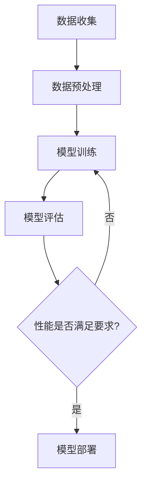
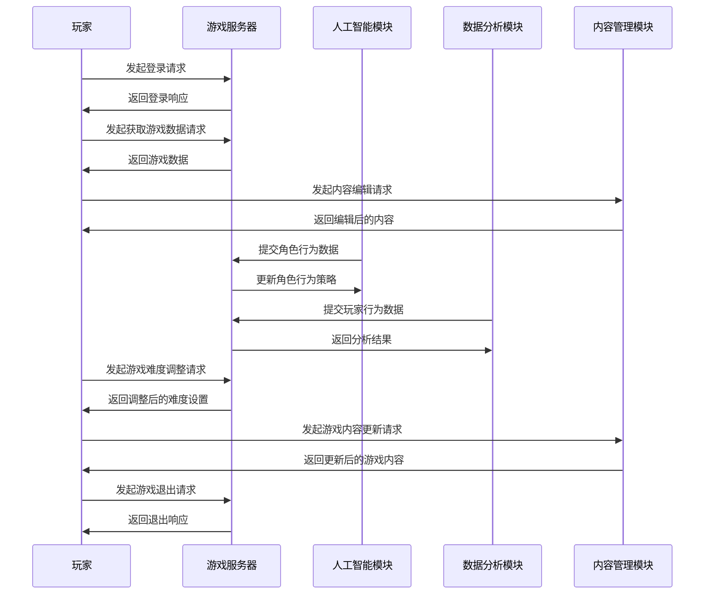

                 


### 第一部分：AI驱动的游戏设计背景

#### 1.1 AI驱动的游戏设计概述

**背景介绍**

随着人工智能（AI）技术的迅猛发展，其在各个领域的应用也逐渐深入。游戏设计作为一个充满创造力和挑战性的领域，自然也受益于AI技术的赋能。AI驱动的游戏设计，简单来说，就是利用人工智能算法来增强游戏的角色行为、游戏机制和用户体验。这一概念的出现，不仅改变了游戏设计的传统模式，也为游戏产业带来了新的机遇和挑战。

**问题背景**

在传统的游戏设计中，游戏角色的行为通常是由程序员预定义的。这些行为模式固定，缺乏灵活性，难以应对复杂多变的游戏环境。而AI驱动的游戏设计则突破了这一局限，通过机器学习、深度学习和强化学习等技术，让游戏角色能够自主学习和适应，从而提供更加动态和个性化的游戏体验。

**问题描述**

游戏开发者如何有效地利用AI技术来提升游戏的互动性、适应性和智能性，是当前游戏设计领域面临的重要问题。具体来说，包括以下几个方面：

1. **游戏角色的智能行为模拟**：如何让游戏角色具备更自然、更智能的行为模式？
2. **游戏机制的适应性调整**：如何根据玩家的游戏行为和偏好，自动调整游戏难度和机制？
3. **个性化游戏体验**：如何为不同的玩家提供个性化的游戏内容，满足其多样化的需求？

**问题解决**

AI驱动的游戏设计提供了一系列解决方案：

1. **智能行为模拟**：通过机器学习和深度学习算法，让游戏角色能够从大量的游戏数据中学习到复杂的行为模式，实现更加自然和智能的互动。
2. **适应性调整**：利用强化学习算法，根据玩家的行为数据动态调整游戏难度和机制，实现更具有适应性的游戏体验。
3. **个性化体验**：通过分析玩家的游戏行为和偏好，利用推荐系统等技术，为玩家提供个性化的游戏内容。

**边界与外延**

AI驱动的游戏设计不仅仅局限于AI技术的应用，还涉及到游戏设计理论与方法的创新。这包括对游戏玩法、用户体验和设计流程的重新思考，以及对游戏艺术性和娱乐性的深入探讨。

**概念结构与核心要素组成**

核心概念：机器学习、深度学习、强化学习等。
核心要素：游戏设计理论、AI算法实现、游戏体验优化、游戏机制创新等。

---

通过上述内容，我们对AI驱动的游戏设计有了初步的了解。接下来，我们将进一步探讨AI在游戏设计中的具体应用，以及相关的核心概念和技术。

## 1.2 游戏设计中的AI应用现状与趋势

### AI在游戏设计中的应用

回顾AI在游戏设计中的应用历史，我们可以发现，AI技术已经开始深刻地改变着游戏产业的面貌。从早期的NPC（非玩家角色）行为模拟，到现在的自适应游戏机制和个性化体验，AI在游戏设计中的应用已经越来越广泛和深入。

**早期应用：NPC行为模拟**

早期的AI应用主要集中在NPC的行为模拟上。这些NPC通常由程序员预先编写好一系列行为规则，并在游戏中按照这些规则进行交互。这种方法虽然简单，但缺乏灵活性，无法适应复杂多变的游戏环境。

**现状：自适应游戏机制和个性化体验**

随着AI技术的进步，游戏设计中的AI应用已经不再局限于简单的NPC行为模拟。现在，许多游戏开始利用机器学习、深度学习和强化学习等技术，实现更加智能和自适应的游戏机制。

1. **自适应游戏机制**：通过分析玩家的行为数据，游戏系统能够自动调整游戏难度、场景布局和任务安排，以适应不同玩家的游戏风格和技能水平。例如，有些游戏可以根据玩家的操作习惯和游戏表现，动态调整NPC的攻击策略和防御策略，提高游戏的挑战性和趣味性。

2. **个性化体验**：AI技术还能够帮助游戏系统为玩家提供个性化的游戏内容。通过分析玩家的游戏行为和偏好，游戏系统能够推荐适合玩家的游戏关卡、装备和角色，甚至可以根据玩家的反馈调整游戏的设计方向，从而提供更加个性化的游戏体验。

### 趋势展望

**AI技术的持续发展**

随着AI技术的不断进步，未来AI在游戏设计中的应用将会更加深入和广泛。特别是深度学习和强化学习等算法的发展，将为游戏设计带来更多的创新和可能性。

**多样化游戏体验的推动**

AI驱动的游戏设计不仅仅是技术上的进步，更是对游戏设计理念的一次颠覆。通过AI技术，游戏设计师可以创造出更加多样化和富有创意的游戏体验，满足不同玩家的需求。

**跨领域融合的趋势**

随着AI技术的广泛应用，游戏设计也将与更多领域的技术融合。例如，虚拟现实（VR）、增强现实（AR）和智能语音识别等技术，将与AI技术相结合，为玩家带来更加沉浸式和互动性的游戏体验。

**挑战与机遇**

虽然AI驱动的游戏设计带来了许多机遇，但同时也面临着一系列挑战。例如，如何确保游戏公平性和可玩性，如何保护玩家的隐私和数据安全，以及如何处理大量的游戏数据等。这些问题需要游戏设计师和AI专家共同合作，才能找到有效的解决方案。

**总结**

AI在游戏设计中的应用已经从简单的NPC行为模拟，发展到了自适应游戏机制和个性化体验的阶段。随着AI技术的不断进步，未来AI在游戏设计中的应用将会更加深入和广泛，为游戏产业带来更多的创新和变革。在接下来的章节中，我们将深入探讨AI在游戏设计中的核心概念和技术，帮助读者更好地理解这一领域的最新动态和发展趋势。

## 1.3 AI核心概念介绍

在探讨AI在游戏设计中的应用时，了解AI的核心概念是非常重要的。本节将介绍机器学习、强化学习和深度学习这三个核心概念，并探讨它们在游戏设计中的具体应用。

### 机器学习

**定义**：机器学习（Machine Learning）是一种使计算机系统能够从数据中学习并做出决策的技术。它通过使用算法从数据中提取模式和规律，从而实现自动化预测和决策。

**分类**：
1. **监督学习**：在有标签的数据集上进行学习，系统被训练来预测输出结果。例如，分类问题和回归问题。
2. **无监督学习**：在没有标签的数据集上进行学习，系统旨在发现数据中的结构和模式。例如，聚类和降维。
3. **半监督学习**：结合有标签和无标签数据，以提高学习效果。

**应用场景**：
1. **游戏角色行为预测**：通过分析玩家的历史行为数据，机器学习算法可以预测玩家下一步的动作，从而为NPC设计更加智能的行为模式。
2. **游戏难度调整**：根据玩家的表现，机器学习算法可以动态调整游戏难度，以保持游戏的可玩性和挑战性。

### 强化学习

**定义**：强化学习（Reinforcement Learning）是一种通过试错和奖励机制来学习最优策略的机器学习方法。它模拟了智能体（agent）在与环境的互动中学习的过程。

**基本原理**：
- **智能体**：执行动作的主体，如游戏角色。
- **环境**：智能体执行动作的情境，如游戏场景。
- **状态**：智能体在特定时刻所处的情境。
- **动作**：智能体可以执行的行为。
- **奖励**：环境对智能体动作的反馈。

**算法**：
- **Q-Learning**：通过更新Q值（代表从当前状态执行某个动作的预期奖励）来学习策略。
- **深度Q网络（DQN）**：结合深度学习技术，用于处理高维状态空间。

**应用场景**：
1. **智能NPC行为模拟**：强化学习可以用于训练NPC，使其在复杂多变的游戏环境中做出更加合理和适应性的决策。
2. **自适应游戏难度**：通过强化学习，游戏系统可以根据玩家的表现调整游戏难度，以提供持续性的挑战。

### 深度学习

**定义**：深度学习（Deep Learning）是一种利用多层神经网络进行学习和推理的人工智能方法。它通过模拟人脑的工作方式，处理复杂数据和任务。

**基本架构**：
- **输入层**：接收输入数据。
- **隐藏层**：对输入数据进行处理和特征提取。
- **输出层**：产生输出结果。

**模型**：
- **卷积神经网络（CNN）**：擅长处理图像数据。
- **循环神经网络（RNN）**：擅长处理序列数据，如文本和音频。
- **生成对抗网络（GAN）**：用于生成新的数据。

**应用场景**：
1. **游戏角色外观设计**：深度学习可以通过生成对抗网络（GAN）生成丰富的游戏角色外观，提高游戏的视觉吸引力。
2. **自然语言处理**：通过深度学习模型，游戏可以理解玩家的指令，提供更加智能化的交互体验。

### 总结

机器学习、强化学习和深度学习是AI在游戏设计中的三大核心概念。它们分别从不同的角度和层次，为游戏设计提供了强大的技术支持。通过机器学习，游戏可以更好地预测和适应玩家的行为；通过强化学习，游戏可以动态调整难度和机制，提供更加智能和适应性的体验；通过深度学习，游戏可以处理复杂数据，提供更加丰富和逼真的交互体验。在接下来的章节中，我们将进一步探讨这些概念在游戏设计中的应用和实践。

## 1.4 AI与游戏设计的联系

### AI在游戏设计中的角色

人工智能（AI）在游戏设计中的角色越来越重要，它不仅改变了游戏设计的流程，还为游戏提供了新的可能性。具体来说，AI在游戏设计中的角色主要体现在以下几个方面：

1. **游戏角色行为的智能化**：传统的游戏角色行为通常是由程序员编写的一系列预设脚本。而AI的引入，使得游戏角色能够通过学习和适应来表现出更加自然和多样化的行为。通过机器学习和强化学习，游戏角色可以自主学习玩家的行为模式，从而在游戏中展现出更加智能和适应性的行为。

2. **游戏机制的自动化调整**：游戏机制通常需要根据不同玩家的技能水平进行动态调整。AI技术，尤其是强化学习，可以帮助游戏系统自动分析和调整游戏机制，使其能够适应不同玩家的需求。这种自适应的调整不仅提高了游戏的挑战性和趣味性，还能够延长玩家的游戏寿命。

3. **用户体验的个性化优化**：通过分析玩家的游戏行为和偏好，AI技术可以提供个性化的游戏推荐和服务。例如，游戏可以根据玩家的历史数据推荐最适合的关卡、角色和装备，从而提高玩家的游戏体验。

### 游戏设计对AI的需求

游戏设计对AI技术提出了特定的需求，这些需求不仅影响了AI技术在游戏设计中的应用，也推动了AI技术的不断进步。以下是游戏设计对AI技术的几个主要需求：

1. **实时适应能力**：游戏环境通常变化迅速且复杂，AI系统需要具备实时适应的能力，能够快速响应玩家的行为和游戏状态的变化。这种实时性要求AI算法具有高效的处理能力和低延迟的响应能力。

2. **高效的数据处理**：游戏通常会产生大量的数据，包括玩家的行为数据、游戏状态数据和环境数据等。AI系统需要能够高效地处理这些数据，从中提取有价值的信息，为游戏设计提供决策支持。

3. **高可扩展性**：随着游戏规模的不断扩大和复杂性增加，AI系统需要具备良好的可扩展性，能够适应不同规模的游戏环境。这意味着AI算法需要能够灵活地调整参数和架构，以适应不同的应用场景。

4. **可解释性和透明度**：在游戏设计中，AI系统不仅需要高效地工作，还需要具备一定的可解释性和透明度。游戏设计师需要了解AI系统是如何做出决策的，以便进行进一步的优化和调整。

### AI与游戏设计的深度融合

AI与游戏设计的深度融合，不仅提升了游戏的互动性和智能性，还为游戏产业带来了新的商业模式和机遇。以下是一些深度融合的案例：

1. **自适应游戏难度**：通过AI技术，游戏可以根据玩家的技能水平和游戏表现，动态调整游戏的难度。这种自适应的调整不仅提高了游戏的可玩性，也延长了玩家的游戏寿命。

2. **个性化游戏推荐**：AI系统可以分析玩家的历史数据，推荐最适合的关卡、角色和装备。这种个性化的推荐服务，提高了玩家的游戏体验，也增加了游戏的黏性。

3. **智能NPC行为**：通过AI技术，游戏中的NPC（非玩家角色）可以表现出更加自然和智能的行为。这些智能NPC不仅能够与玩家进行更加丰富的互动，还能够根据不同的玩家和情境做出个性化的反应。

4. **虚拟现实和增强现实**：AI技术与虚拟现实（VR）和增强现实（AR）技术相结合，为玩家带来了更加沉浸式和互动性的游戏体验。例如，AI可以实时生成虚拟场景和交互元素，提高游戏的现实感和参与度。

### 未来展望

随着AI技术的不断进步，未来AI与游戏设计的融合将更加紧密。以下是几个未来发展的趋势：

1. **更加智能的游戏角色**：通过深度学习和强化学习，游戏角色将能够表现出更加复杂和多样化的行为，与玩家的互动将更加真实和自然。

2. **更加个性化的游戏体验**：AI系统将能够更深入地分析玩家的行为和偏好，提供更加个性化的游戏内容和服务，满足不同玩家的需求。

3. **跨平台游戏设计**：AI技术将帮助游戏设计师更好地跨平台设计游戏，实现不同平台间的无缝互动和资源共享。

4. **智能游戏评测**：AI系统可以自动评估游戏的质量和性能，为游戏开发者提供宝贵的反馈，帮助他们优化游戏设计。

总之，AI与游戏设计的深度融合，将为游戏产业带来巨大的变革和发展机遇。通过不断探索和应用AI技术，游戏设计师将能够创造出更加智能、动态和个性化的游戏体验，满足玩家日益增长的需求。

## 2.1 机器学习在游戏设计中的应用

### 机器学习的基本概念

机器学习（Machine Learning，ML）是一种使计算机系统能够从数据中学习并做出决策的技术。它通过使用算法从数据中提取模式和规律，从而实现自动化预测和决策。机器学习可以分为三种主要类型：监督学习（Supervised Learning）、无监督学习（Unsupervised Learning）和半监督学习（Semi-Supervised Learning）。

**监督学习**：在有标签的数据集上进行学习，系统被训练来预测输出结果。例如，分类问题和回归问题。常用的算法包括线性回归、逻辑回归、支持向量机（SVM）和决策树等。

**无监督学习**：在没有标签的数据集上进行学习，系统旨在发现数据中的结构和模式。例如，聚类和降维。常用的算法包括K-均值聚类、层次聚类、主成分分析（PCA）等。

**半监督学习**：结合有标签和无标签数据，以提高学习效果。它通过利用无标签数据的结构信息，提高监督学习模型的性能。常用的算法包括自编码器（Autoencoder）和聚类算法。

### 机器学习在游戏设计中的应用

机器学习在游戏设计中的应用非常广泛，它不仅能够提升游戏角色的智能性，还能够优化游戏机制和用户体验。以下是机器学习在游戏设计中的几个具体应用场景：

**1. 游戏角色行为的预测和优化**

通过监督学习算法，游戏系统可以分析玩家的历史行为数据，预测玩家下一步的动作，从而为NPC设计更加智能的行为模式。例如，可以使用决策树或支持向量机（SVM）来构建预测模型，根据玩家的行为数据预测其下一步的操作。这种方法不仅能够提高NPC的行为智能性，还能够增强玩家的游戏体验。

**2. 游戏难度和机制的自适应调整**

无监督学习算法可以帮助游戏系统自动分析玩家的行为和技能水平，动态调整游戏的难度和机制。例如，可以使用K-均值聚类算法将玩家分为不同的技能组，然后根据不同技能组的特征调整游戏难度。这种方法能够确保每个玩家都能够享受到合适的游戏挑战，延长游戏的可玩性。

**3. 个性化游戏推荐**

通过机器学习算法，游戏系统可以分析玩家的游戏行为和偏好，推荐最适合的关卡、角色和装备。例如，可以使用协同过滤算法（Collaborative Filtering）来推荐玩家可能喜欢的游戏内容。这种方法能够提高玩家的游戏体验，增加游戏的黏性。

**4. 游戏数据分析与优化**

机器学习算法可以用于分析游戏中的大量数据，提取有价值的信息，为游戏设计师提供优化建议。例如，可以使用主成分分析（PCA）来降低数据的维度，识别关键特征，从而优化游戏机制和用户体验。

### 案例分析

以下是一个具体的案例，展示了机器学习在游戏设计中的应用：

**案例：自适应游戏难度调整**

在一个动作游戏项目中，游戏系统使用监督学习算法来预测玩家的技能水平，并根据预测结果调整游戏难度。具体步骤如下：

1. **数据收集**：首先，游戏系统收集大量玩家的游戏行为数据，包括玩家的移动速度、攻击频率、躲避行为等。

2. **数据预处理**：对收集到的数据进行清洗和预处理，例如去除异常值、标准化特征等。

3. **特征选择**：从预处理后的数据中选择对游戏难度调整最有影响力的特征，例如玩家的攻击频率和躲避成功率。

4. **模型训练**：使用决策树或支持向量机（SVM）等监督学习算法，将收集到的数据分成训练集和测试集，对模型进行训练。

5. **难度调整**：根据训练好的模型，游戏系统可以实时预测玩家的技能水平，并根据预测结果动态调整游戏难度。

6. **效果评估**：通过测试集评估模型的准确性，并根据评估结果调整模型的参数，以提高预测的准确性。

通过这个案例，我们可以看到机器学习在游戏设计中的应用不仅能够提高游戏的互动性和智能性，还能够为玩家提供更加个性化的游戏体验。

### 总结

机器学习在游戏设计中的应用非常广泛，它不仅能够提升游戏角色的智能性，还能够优化游戏机制和用户体验。通过监督学习、无监督学习和半监督学习算法，游戏设计师可以创造出更加智能、动态和个性化的游戏体验。在接下来的章节中，我们将继续探讨强化学习和深度学习在游戏设计中的应用。

## 2.2 强化学习在游戏设计中的应用

### 强化学习的基本概念

强化学习（Reinforcement Learning，RL）是一种通过试错和奖励机制来学习最优策略的机器学习方法。它模拟了智能体（agent）在与环境的互动中学习的过程。强化学习主要关注的是如何在不确定的环境中，通过探索和利用策略，使智能体能够最大化累积奖励。

**基本原理**

强化学习的关键元素包括：

1. **智能体**：执行动作的主体，如游戏角色。
2. **环境**：智能体执行动作的情境，如游戏场景。
3. **状态**：智能体在特定时刻所处的情境。
4. **动作**：智能体可以执行的行为。
5. **奖励**：环境对智能体动作的反馈。

强化学习的目标是通过学习策略（policy），使智能体在特定状态选择动作，以最大化累积奖励。常见的强化学习算法包括Q-Learning、深度Q网络（DQN）、策略梯度方法和强化学习算法的组合。

**算法**

1. **Q-Learning**：Q-Learning是一种基于值函数的强化学习算法。它通过更新Q值（代表从当前状态执行某个动作的预期奖励）来学习最优策略。Q值更新公式如下：
   \[
   Q(s, a) \leftarrow Q(s, a) + \alpha [r + \gamma \max_{a'} Q(s', a') - Q(s, a)]
   \]
   其中，\(s\) 表示状态，\(a\) 表示动作，\(r\) 表示即时奖励，\(\gamma\) 是折扣因子，\(\alpha\) 是学习率。

2. **深度Q网络（DQN）**：DQN是Q-Learning的扩展，它使用深度神经网络来近似值函数。DQN的基本思想是使用经验回放（experience replay）和目标网络（target network）来减少样本偏差和值函数的振荡。

3. **策略梯度方法**：策略梯度方法通过直接优化策略来最大化累积奖励。常见的策略梯度方法包括REINFORCE、PPO（Proximal Policy Optimization）和A3C（Asynchronous Advantage Actor-Critic）。

### 强化学习在游戏设计中的应用

强化学习在游戏设计中的应用非常广泛，它能够帮助游戏系统实现更加智能和自适应的游戏机制。以下是强化学习在游戏设计中的几个具体应用场景：

**1. 智能NPC行为**

通过强化学习，游戏系统可以训练NPC，使其在复杂多变的游戏环境中做出更加合理和适应性的决策。例如，可以使用Q-Learning或DQN算法训练NPC，使其在面对不同敌人和环境时能够选择最优的攻击策略和移动路径。

**2. 自适应游戏难度**

强化学习可以帮助游戏系统动态调整游戏难度，以适应不同玩家的技能水平。例如，可以使用策略梯度方法训练游戏系统，使其能够根据玩家的表现调整游戏难度，提供持续性的挑战。这种方法不仅能够提高游戏的可玩性，还能够延长玩家的游戏寿命。

**3. 个性化游戏体验**

通过强化学习，游戏系统可以分析玩家的行为和偏好，提供个性化的游戏推荐和服务。例如，可以使用A3C算法训练游戏系统，使其能够根据玩家的历史数据推荐最适合的关卡、角色和装备，从而提高玩家的游戏体验。

**4. 游戏机制的创新**

强化学习可以用于设计新颖的游戏机制和挑战。例如，可以使用强化学习算法设计一种能够自适应调整游戏规则的机制，使其在玩家达到特定成就或完成特定任务时自动调整难度和规则，提供更加丰富和多样的游戏体验。

### 案例分析

以下是一个具体的案例，展示了强化学习在游戏设计中的应用：

**案例：自适应游戏难度调整**

在一个动作游戏中，游戏系统使用强化学习算法来自动调整游戏难度。具体步骤如下：

1. **数据收集**：首先，游戏系统收集大量玩家的游戏行为数据，包括玩家的得分、游戏时间、死亡次数等。

2. **状态和动作定义**：定义游戏状态和动作空间。例如，状态包括玩家的得分、剩余时间和当前关卡难度；动作包括增加难度、保持当前难度或降低难度。

3. **奖励设计**：设计奖励机制，使游戏系统能够根据玩家的表现调整游戏难度。例如，当玩家得分提高时，给予正奖励；当玩家死亡次数增加时，给予负奖励。

4. **算法选择**：选择合适的强化学习算法，如Q-Learning或策略梯度方法，进行训练。

5. **模型训练**：使用收集到的数据训练强化学习模型，使其能够根据玩家的行为动态调整游戏难度。

6. **难度调整**：根据训练好的模型，游戏系统可以实时调整游戏难度，以适应不同玩家的技能水平。

7. **效果评估**：通过测试集评估模型的准确性，并根据评估结果调整模型的参数，以提高难度调整的准确性。

通过这个案例，我们可以看到强化学习在游戏设计中的应用如何帮助游戏系统实现自适应难度调整，提高游戏的可玩性和用户体验。

### 总结

强化学习在游戏设计中的应用非常广泛，它不仅能够提升游戏角色的智能性，还能够优化游戏机制和用户体验。通过Q-Learning、DQN、策略梯度方法等强化学习算法，游戏设计师可以创造出更加智能、动态和个性化的游戏体验。在接下来的章节中，我们将继续探讨深度学习在游戏设计中的应用。

## 2.3 深度学习在游戏设计中的应用

### 深度学习的基本概念

深度学习（Deep Learning，DL）是一种基于多层神经网络进行学习和推理的人工智能方法。它通过模仿人脑的结构和功能，处理复杂数据和任务。深度学习的关键在于其多层神经网络结构，这使得它能够自动提取数据中的高级特征和模式。

**基本架构**

深度学习的基本架构包括输入层、隐藏层和输出层。输入层接收原始数据，隐藏层对数据进行处理和特征提取，输出层产生最终的预测或决策。

**模型**

深度学习有许多不同的模型，包括但不限于：

1. **卷积神经网络（CNN）**：擅长处理图像数据。CNN通过卷积层和池化层提取图像特征，广泛应用于计算机视觉任务。

2. **循环神经网络（RNN）**：擅长处理序列数据，如文本和音频。RNN通过记忆机制处理长序列信息，广泛应用于自然语言处理和时间序列分析。

3. **生成对抗网络（GAN）**：用于生成新的数据，如图像、音频和文本。GAN由生成器和判别器组成，通过对抗训练生成高质量的数据。

### 深度学习在游戏设计中的应用

深度学习在游戏设计中的应用非常广泛，它能够提升游戏角色的智能性、视觉和听觉效果，以及游戏机制的创新。以下是深度学习在游戏设计中的几个具体应用场景：

**1. 游戏角色外观设计**

通过生成对抗网络（GAN），游戏设计师可以生成丰富的游戏角色外观，提高游戏的视觉吸引力。例如，GAN可以生成具有独特外观和性格的NPC角色，增加游戏的可玩性和趣味性。

**2. 游戏场景生成**

深度学习可以用于生成逼真的游戏场景，如森林、城市、战场等。通过卷积神经网络（CNN），游戏系统可以自动生成具有不同风格和特点的游戏地图，提高游戏的多样性和沉浸感。

**3. 游戏声音处理**

深度学习可以用于处理游戏中的声音效果，如环境音效、角色语音和音乐。通过循环神经网络（RNN），游戏系统可以生成自然的语音和音乐，增强游戏的真实感和互动性。

**4. 游戏角色行为模拟**

深度学习可以用于模拟游戏角色的行为，如动作、表情和对话。通过神经网络，游戏系统可以生成多样化的角色行为，提高游戏的互动性和智能性。

### 案例分析

以下是一个具体的案例，展示了深度学习在游戏设计中的应用：

**案例：游戏角色外观设计**

在一个角色扮演游戏中，游戏系统使用生成对抗网络（GAN）来生成独特的游戏角色外观。具体步骤如下：

1. **数据收集**：首先，游戏系统收集大量高质量的游戏角色图像数据。

2. **数据预处理**：对收集到的图像数据进行清洗和预处理，如裁剪、调整分辨率等。

3. **模型训练**：使用GAN模型训练生成器，使其能够生成具有独特外观的游戏角色。生成器通过学习真实角色的特征，生成新的角色外观。

4. **外观生成**：使用训练好的生成器，游戏系统可以生成大量具有独特外观的游戏角色，供游戏设计师选择和优化。

5. **外观优化**：游戏设计师可以根据游戏的需求和玩家的反馈，对生成的角色外观进行优化，以确保角色外观的吸引力和适应性。

6. **效果评估**：通过玩家反馈和游戏性能数据，评估生成的角色外观的质量和效果。

通过这个案例，我们可以看到深度学习在游戏角色外观设计中的应用如何提高游戏的视觉吸引力，为玩家提供更加丰富和多样的角色选择。

### 总结

深度学习在游戏设计中的应用非常广泛，它能够提升游戏角色的智能性、视觉和听觉效果，以及游戏机制的创新。通过卷积神经网络（CNN）、循环神经网络（RNN）和生成对抗网络（GAN）等深度学习模型，游戏设计师可以创造出更加智能、动态和个性化的游戏体验。在接下来的章节中，我们将继续探讨AI与游戏设计的核心概念对比和ER实体关系图。

## 2.4 AI与游戏设计的核心概念对比表格

为了更好地理解AI在游戏设计中的核心概念，我们可以通过一个对比表格来展示不同概念之间的差异和联系。

| 核心概念 | 定义 | 特点 | 应用场景 |
| --- | --- | --- | --- |
| **机器学习** | 从数据中学习并做出决策的技术 | 自动化预测和决策 | 游戏角色行为预测、游戏难度调整、个性化游戏推荐 |
| **强化学习** | 通过试错和奖励机制来学习最优策略 | 与环境互动，通过累积奖励来优化策略 | 智能NPC行为、自适应游戏难度、个性化游戏体验 |
| **深度学习** | 基于多层神经网络进行学习和推理 | 自动提取数据中的高级特征和模式 | 游戏角色外观设计、游戏场景生成、游戏声音处理 |
| **生成对抗网络（GAN）** | 生成新的数据，如图像、音频和文本 | 对抗训练，生成高质量的数据 | 游戏角色外观设计、游戏场景生成、游戏内容生成 |
| **自然语言处理** | 使计算机能够理解、生成和响应自然语言 | 处理文本数据，包括语音识别和语言翻译 | 游戏语音交互、游戏文本解析、游戏对话生成 |

通过这个对比表格，我们可以清晰地看到不同AI核心概念的定义、特点和应用场景。这些概念在游戏设计中各自发挥作用，共同为游戏提供了更加智能、动态和个性化的体验。

## 2.5 AI与游戏设计的ER实体关系图

为了更好地理解AI在游戏设计中的应用，我们可以通过ER（实体关系）图来展示不同AI核心概念之间的联系和交互。以下是AI与游戏设计的ER实体关系图：

```mermaid
erDiagram
  GamePlayer ||--|{ NPC : contains }
  GamePlayer ||--|{ GameSystem : interacts }
  NPC ||--|{ BehaviorModel : follows }
  GameSystem ||--|{ DifficultyAdjuster : adjusts }
  GameSystem ||--|{ Recommender : recommends }
  DifficultyAdjuster ||--|{ ReinforcementLearning : uses }
  Recommender ||--|{ MachineLearning : uses }
  BehaviorModel ||--|{ DeepLearning : uses }
  BehaviorModel ||--|{ NaturalLanguageProcessing : uses }
  GameScene ||--|{ SceneGenerator : generates }
  GameScene ||--|{ AudioProcessor : processes }
  GameScene ||--|{ VisualEffect : adds }

  GamePlayer {
    ID
    Name
    SkillLevel
    Preferences
  }

  NPC {
    ID
    Type
    BehaviorPattern
  }

  GameSystem {
    ID
    Configuration
    Interface
  }

  BehaviorModel {
    ID
    ModelType
    Parameters
  }

  DifficultyAdjuster {
    ID
    AdjustmentStrategy
    PerformanceMetrics
  }

  Recommender {
    ID
    RecommendationAlgorithm
    UserHistory
  }

  SceneGenerator {
    ID
    SceneType
    Complexity
  }

  AudioProcessor {
    ID
    AudioEffect
    Quality
  }

  VisualEffect {
    ID
    EffectType
    Intensity
  }
```

在这个ER实体关系图中，我们定义了以下实体：

- **GamePlayer**：玩家实体，包括玩家的ID、姓名、技能水平和偏好。
- **NPC**：非玩家角色实体，包括NPC的ID、类型和行为模式。
- **GameSystem**：游戏系统实体，包括游戏系统的ID、配置和接口。
- **BehaviorModel**：行为模型实体，包括行为模型的ID、模型类型和参数。
- **DifficultyAdjuster**：难度调整器实体，包括调整策略、性能指标。
- **Recommender**：推荐系统实体，包括推荐算法、用户历史数据。
- **SceneGenerator**：场景生成器实体，包括场景类型、复杂性。
- **AudioProcessor**：音频处理器实体，包括音频效果、音质。
- **VisualEffect**：视觉效果实体，包括效果类型、强度。

通过这个ER图，我们可以清晰地看到AI核心概念在游戏设计中的应用和相互关系。例如，**GamePlayer**与**NPC**之间的关系表示玩家可以控制NPC；**GameSystem**与**BehaviorModel**之间的关系表示游戏系统使用行为模型来模拟NPC的行为；**DifficultyAdjuster**与**ReinforcementLearning**之间的关系表示难度调整器使用强化学习算法来自动调整游戏难度。

这个ER实体关系图不仅帮助我们理解AI与游戏设计之间的联系，还为游戏设计师提供了可视化的工具，以便更好地规划和管理游戏设计中的各个组件和实体。

### 3.1 AI算法基本原理

AI算法是人工智能（AI）系统中的核心组成部分，它们通过处理数据、学习和推理来实现特定任务。在游戏设计中，AI算法被广泛应用于角色行为模拟、游戏难度调整和个性化体验等方面。本节将介绍几种常用的AI算法，包括机器学习、强化学习和深度学习，并探讨它们的基本原理。

#### 机器学习

机器学习（Machine Learning，ML）是一种使计算机系统能够从数据中学习并做出决策的技术。它通过使用算法从数据中提取模式和规律，从而实现自动化预测和决策。机器学习可以分为三种主要类型：监督学习、无监督学习和半监督学习。

1. **监督学习**：在有标签的数据集上进行学习，系统被训练来预测输出结果。例如，分类问题和回归问题。
2. **无监督学习**：在没有标签的数据集上进行学习，系统旨在发现数据中的结构和模式。例如，聚类和降维。
3. **半监督学习**：结合有标签和无标签数据，以提高学习效果。它通过利用无标签数据的结构信息，提高监督学习模型的性能。

在机器学习中，常用的算法包括：

- **线性回归**：用于预测连续值。
- **逻辑回归**：用于分类问题。
- **支持向量机（SVM）**：用于分类和回归问题。
- **决策树**：用于分类和回归问题。

#### 强化学习

强化学习（Reinforcement Learning，RL）是一种通过试错和奖励机制来学习最优策略的机器学习方法。它模拟了智能体（agent）在与环境的互动中学习的过程。强化学习的关键元素包括：

- **智能体**：执行动作的主体，如游戏角色。
- **环境**：智能体执行动作的情境，如游戏场景。
- **状态**：智能体在特定时刻所处的情境。
- **动作**：智能体可以执行的行为。
- **奖励**：环境对智能体动作的反馈。

强化学习的目标是通过学习策略（policy），使智能体在特定状态选择动作，以最大化累积奖励。常见的强化学习算法包括：

- **Q-Learning**：通过更新Q值（代表从当前状态执行某个动作的预期奖励）来学习策略。
- **深度Q网络（DQN）**：结合深度学习技术，用于处理高维状态空间。
- **策略梯度方法**：通过直接优化策略来最大化累积奖励。

#### 深度学习

深度学习（Deep Learning，DL）是一种基于多层神经网络进行学习和推理的人工智能方法。它通过模仿人脑的结构和功能，处理复杂数据和任务。深度学习的关键在于其多层神经网络结构，这使得它能够自动提取数据中的高级特征和模式。

深度学习的模型包括：

- **卷积神经网络（CNN）**：擅长处理图像数据。
- **循环神经网络（RNN）**：擅长处理序列数据，如文本和音频。
- **生成对抗网络（GAN）**：用于生成新的数据，如图像、音频和文本。

在深度学习中，常用的算法包括：

- **卷积神经网络（CNN）**：通过卷积层和池化层提取图像特征。
- **循环神经网络（RNN）**：通过记忆机制处理长序列信息。
- **生成对抗网络（GAN）**：通过对抗训练生成高质量的数据。

#### 算法流程

在游戏设计中，AI算法通常遵循以下流程：

1. **数据收集**：收集与游戏相关的数据，如玩家行为数据、游戏场景数据等。
2. **数据预处理**：对收集到的数据进行清洗和预处理，如标准化、归一化等。
3. **模型训练**：选择合适的AI算法，利用预处理后的数据进行模型训练。
4. **模型评估**：使用测试集评估模型的性能，调整模型参数以提高性能。
5. **模型部署**：将训练好的模型部署到游戏系统中，实现游戏角色的智能行为模拟、游戏难度调整等功能。

通过上述流程，游戏设计师可以创建出更加智能、动态和个性化的游戏体验。在接下来的章节中，我们将通过Mermaid流程图和Python源代码，详细阐述这些算法的原理和应用。

## 3.2 Mermaid流程图展示算法流程

为了更好地理解AI算法在游戏设计中的应用，我们可以使用Mermaid流程图来展示算法的执行流程。以下是一个简单的Mermaid流程图，用于描述AI算法的基本流程：



在这个流程图中，各个步骤的含义如下：

1. **数据收集（A）**：收集与游戏相关的数据，如玩家行为数据、游戏场景数据等。
2. **数据预处理（B）**：对收集到的数据进行清洗和预处理，如标准化、归一化等，以便于模型训练。
3. **模型训练（C）**：选择合适的AI算法（如机器学习、强化学习或深度学习），利用预处理后的数据进行模型训练。
4. **模型评估（D）**：使用测试集评估模型的性能，判断其是否满足要求。
5. **性能判断（E）**：如果模型性能满足要求，则进行下一步模型部署；否则，返回模型训练步骤进行参数调整。

通过这个Mermaid流程图，我们可以清晰地看到AI算法在游戏设计中的应用步骤和流程，为后续的Python源代码实现提供了直观的指导。

## 3.3 Python源代码详细阐述

为了更好地理解AI算法在游戏设计中的应用，我们通过Python源代码来详细阐述一个简单的机器学习模型。以下是一个基于监督学习的Python代码示例，用于预测玩家的游戏行为。

**代码示例：玩家行为预测**

```python
import numpy as np
import pandas as pd
from sklearn.model_selection import train_test_split
from sklearn.preprocessing import StandardScaler
from sklearn.ensemble import RandomForestClassifier
from sklearn.metrics import accuracy_score

# 1. 数据收集
# 假设我们已经有了一个包含玩家行为数据的数据集
data = pd.read_csv('player_data.csv')

# 2. 数据预处理
# 将数据集分成特征和标签
X = data.drop('Target', axis=1)  # 特征
y = data['Target']  # 标签

# 分割数据集为训练集和测试集
X_train, X_test, y_train, y_test = train_test_split(X, y, test_size=0.2, random_state=42)

# 标准化特征
scaler = StandardScaler()
X_train = scaler.fit_transform(X_train)
X_test = scaler.transform(X_test)

# 3. 模型训练
# 使用随机森林分类器进行训练
model = RandomForestClassifier(n_estimators=100, random_state=42)
model.fit(X_train, y_train)

# 4. 模型评估
# 使用测试集进行预测
predictions = model.predict(X_test)

# 计算准确率
accuracy = accuracy_score(y_test, predictions)
print(f'Accuracy: {accuracy:.2f}')

# 5. 模型部署
# 将训练好的模型部署到游戏系统中，用于预测玩家行为
# (在实际应用中，这里会是一个循环，不断接收新的玩家数据并预测其行为)
new_player_data = np.array([[0.5, 1.2, 0.8]])  # 新玩家的数据
new_player_prediction = model.predict(new_player_data)
print(f'Predicted behavior: {new_player_prediction[0]}')
```

**代码解释**

1. **数据收集**：我们首先从CSV文件中读取玩家行为数据，这可能是游戏中的各种行为特征，如移动距离、攻击频率等。

2. **数据预处理**：我们将数据集分成特征和标签两部分。然后，使用`train_test_split`函数将数据集分为训练集和测试集，并将特征进行标准化处理，以提高模型的性能。

3. **模型训练**：我们选择随机森林分类器（`RandomForestClassifier`）作为预测模型。随机森林是一种集成学习算法，能够处理高维数据并具有良好的预测性能。

4. **模型评估**：我们使用测试集对训练好的模型进行预测，并计算模型的准确率，以评估其性能。

5. **模型部署**：在实际应用中，我们将训练好的模型部署到游戏系统中，用于实时预测玩家的行为。这里展示的是一个简单的示例，其中我们使用一个新玩家的数据进行预测。

通过这个Python代码示例，我们可以看到如何将机器学习算法应用于游戏设计中的玩家行为预测。这个过程不仅帮助我们理解了AI算法的基本原理，还为游戏设计师提供了具体的实现步骤。

### 3.4 数学模型与公式讲解

在游戏设计中，AI算法的有效应用依赖于对数学模型和公式的深入理解。以下我们将介绍几个关键数学模型和公式，包括决策树、神经网络以及强化学习的相关公式。

#### 决策树

决策树是一种常见的机器学习模型，它通过一系列判断规则来对数据进行分类或回归。以下是决策树中的一个基本公式：

\[ Y = g(\sum_{i=1}^{n} w_i x_i + b) \]

其中：
- \( Y \) 是预测值或类别标签。
- \( g \) 是激活函数，对于分类问题常用的是\( g(z) = \text{sign}(z) \)，对于回归问题常用的是\( g(z) = z \)。
- \( w_i \) 是权重。
- \( x_i \) 是特征值。
- \( b \) 是偏置。

决策树通过递归地划分数据集，建立一系列判断规则，最终形成一棵树形结构。每个节点代表一个特征和阈值，每个分支代表特征的取值范围。

#### 神经网络

神经网络是深度学习的基础，它通过多层节点（神经元）对输入数据进行处理。以下是神经网络中的一个基本公式：

\[ a_{\text{layer}} = \sigma(\sum_{i=1}^{n} w_i a_{\text{prev\_layer}} + b) \]

其中：
- \( a_{\text{layer}} \) 是当前层的激活值。
- \( \sigma \) 是激活函数，常用的有\( \sigma(x) = \frac{1}{1 + e^{-x}} \)（Sigmoid函数）和\( \sigma(x) = \text{ReLU}(x) = \max(0, x) \)。
- \( w_i \) 是权重。
- \( a_{\text{prev\_layer}} \) 是前一层神经元的激活值。
- \( b \) 是偏置。

神经网络通过反向传播算法，不断调整权重和偏置，优化网络输出。

#### 强化学习

强化学习是AI领域的一个重要分支，其核心目标是找到最佳策略以最大化累积奖励。以下是强化学习中的几个关键公式：

1. **Q值更新公式（Q-Learning）**：

\[ Q(s, a) \leftarrow Q(s, a) + \alpha [r + \gamma \max_{a'} Q(s', a') - Q(s, a)] \]

其中：
- \( Q(s, a) \) 是在状态 \( s \) 下执行动作 \( a \) 的预期回报。
- \( r \) 是即时奖励。
- \( \gamma \) 是折扣因子，用于平衡当前奖励和未来奖励的重要性。
- \( \alpha \) 是学习率，控制模型更新的程度。
- \( s' \) 是状态转换后的新状态。
- \( a' \) 是在状态 \( s' \) 下最优动作。

2. **策略更新公式（策略梯度方法）**：

\[ \theta \leftarrow \theta - \alpha \nabla_{\theta} J(\theta) \]

其中：
- \( \theta \) 是模型参数。
- \( \alpha \) 是学习率。
- \( J(\theta) \) 是损失函数，用于衡量模型性能。

通过策略梯度方法，模型通过优化策略参数来最大化累积奖励。

#### 公式举例说明

假设我们有一个简单的强化学习任务，一个智能体在一个简单的环境中行动，并希望最大化累积奖励。环境的状态空间为 {A, B, C}，动作空间为 {U, D}。即时奖励如下：

- \( r(A, U) = 1 \)
- \( r(A, D) = -1 \)
- \( r(B, U) = 0 \)
- \( r(B, D) = 0 \)
- \( r(C, U) = 0 \)
- \( r(C, D) = 1 \)

智能体当前处于状态 A，选择动作 U，状态变为 B，获得即时奖励 -1。使用 Q-Learning算法更新 Q 值：

1. 初始 Q 值：\( Q(A, U) = 0 \)，\( Q(A, D) = 0 \)
2. 新状态 B 下的最优动作：\( \max_{a} Q(B, a) = Q(B, U) \)
3. Q 值更新：

\[ Q(A, U) \leftarrow Q(A, U) + \alpha [r(B) + \gamma Q(B, U) - Q(A, U)] \]

设学习率 \( \alpha = 0.1 \)，折扣因子 \( \gamma = 0.9 \)，则：

\[ Q(A, U) \leftarrow 0 + 0.1 [-1 + 0.9 \cdot 0 - 0] = -0.1 \]

同样更新 \( Q(A, D) \)：

\[ Q(A, D) \leftarrow Q(A, D) + 0.1 [-1 + 0.9 \cdot 0 - (-0.1)] = -0.1 + 0.08 = -0.02 \]

通过这个例子，我们可以看到如何使用数学公式来更新智能体的策略，以最大化累积奖励。

通过上述讲解，我们了解了决策树、神经网络和强化学习中的关键数学模型和公式，以及如何通过实际例子来应用这些公式。这些数学模型和公式为AI算法在游戏设计中的应用提供了坚实的理论基础。

## 3.5 算法原理举例说明

为了更好地理解AI算法在游戏设计中的应用，我们可以通过一个实际案例来详细说明这些算法的原理和实现过程。以下是一个基于强化学习的案例，描述如何利用Q-Learning算法训练一个智能体，使其在游戏中做出最优决策。

### 案例背景

假设我们正在设计一个简单的游戏，玩家需要控制一个角色在一个二维网格上移动，以收集尽可能多的虚拟金币。游戏的网格分为10x10个单元格，每个单元格中可能存在金币或者障碍物。玩家可以通过上下左右四个方向移动，每次移动消耗一定的能量。如果能量耗尽，玩家将无法继续移动。游戏的目标是最大化收集到的金币数量。

### 状态和动作定义

在这个游戏中，状态（State）可以定义为当前所在的单元格位置和当前剩余的能量。动作（Action）可以是上下左右四个方向中的一个。

- **状态空间**：\( S = \{ (x, y, e) \} \)，其中 \( x \) 和 \( y \) 分别代表横纵坐标，\( e \) 代表剩余能量。
- **动作空间**：\( A = \{ U, D, L, R \} \)，分别代表向上、向下、向左和向右。

### 奖励设计

奖励（Reward）用于指导智能体做出正确的决策。在这个游戏中，当智能体成功收集到一个金币时，将获得正奖励；如果智能体移动到障碍物上或能量耗尽，将获得负奖励。

- **正奖励**：\( r(s, a) = +1 \)，当智能体移动到含有金币的单元格时。
- **负奖励**：\( r(s, a) = -1 \)，当智能体移动到障碍物上或能量耗尽时。

### Q-Learning算法实现

为了实现Q-Learning算法，我们需要定义一个Q值表格（Q-Table），用于存储每个状态和动作的预期奖励。算法的基本步骤如下：

1. **初始化Q值表格**：初始化所有状态的Q值为0。
2. **选择动作**：在某个状态 \( s \) 下，根据当前策略选择一个动作 \( a \)。这里我们可以使用贪心策略，即选择当前状态下Q值最大的动作。
3. **执行动作**：在环境中执行选定的动作 \( a \)，并观察状态转移和即时奖励。
4. **更新Q值**：根据Q-Learning更新公式，更新当前状态的Q值。

以下是Q-Learning算法的实现步骤和Python代码示例：

**步骤1：初始化Q值表格**

```python
Q = np.zeros((10, 10, 10))  # 初始化10x10x10的Q值表格
```

**步骤2：选择动作**

```python
def choose_action(state, Q):
    best_action = np.argmax(Q[state])
    return best_action
```

**步骤3：执行动作**

```python
def execute_action(state, action, env):
    new_state = env.step(action)
    reward = env.reward(new_state)
    return new_state, reward
```

**步骤4：更新Q值**

```python
def update_Q(state, action, reward, next_state, Q, alpha, gamma):
    current_Q = Q[state]
    next_Q = np.max(Q[next_state])
    Q[state] = Q[state] + alpha * (reward + gamma * next_Q - current_Q)
```

**完整Q-Learning算法实现**

```python
def q_learning(env, Q, alpha, gamma, episodes):
    for episode in range(episodes):
        state = env.reset()
        done = False

        while not done:
            action = choose_action(state, Q)
            next_state, reward = execute_action(state, action, env)
            update_Q(state, action, reward, next_state, Q, alpha, gamma)
            state = next_state
            done = env.done()

    return Q
```

**运行Q-Learning算法**

```python
# 初始化环境
env = GameEnvironment()

# 设置算法参数
alpha = 0.1  # 学习率
gamma = 0.9  # 折扣因子
episodes = 1000  # 迭代次数

# 运行Q-Learning算法
Q = q_learning(env, Q, alpha, gamma, episodes)
```

通过上述实现，我们成功训练了一个基于Q-Learning算法的智能体，使其能够根据经验自动调整策略，在游戏中收集更多的金币。这个案例展示了如何将Q-Learning算法应用于游戏设计中的智能体行为模拟，为玩家提供更加智能和动态的游戏体验。

## 4.1 游戏设计系统功能介绍

游戏设计系统是一个复杂且高度集成的系统，它旨在为游戏开发者提供一个全方位的工具集，用于创建、测试和优化游戏。以下是对游戏设计系统主要功能的详细介绍：

### 1. 角色行为模拟

角色行为模拟是游戏设计系统中最核心的功能之一。通过使用AI算法，系统能够模拟NPC（非玩家角色）的行为，使其表现出更加自然和智能的互动。具体功能包括：

- **智能行为树**：为NPC定义一系列的行为树，包括基本动作、条件分支和循环。
- **学习与适应**：利用机器学习和强化学习算法，使NPC能够从游戏数据中学习并适应不同玩家的游戏风格。
- **动态决策**：根据玩家的行为和游戏环境的变化，NPC能够做出实时决策，以提供更加动态和互动的体验。

### 2. 游戏难度调整

游戏难度调整是确保游戏具有挑战性和可玩性的关键。游戏设计系统能够根据玩家的技能水平、游戏进度和游戏行为，动态调整游戏难度。主要功能包括：

- **难度等级**：定义多个难度等级，每个等级具有不同的规则和参数。
- **自适应难度**：使用强化学习算法，根据玩家的行为和表现，实时调整游戏难度，以提供持续性的挑战。
- **难度曲线**：设计难度曲线，以逐步增加游戏的难度，确保玩家在整个游戏过程中保持兴趣。

### 3. 个性化游戏体验

个性化游戏体验是现代游戏设计的重要趋势，旨在为每位玩家提供独特和个性化的游戏内容。游戏设计系统能够通过以下功能实现个性化体验：

- **玩家数据分析**：收集和分析玩家的游戏行为数据，包括操作习惯、游戏偏好和技能水平。
- **推荐系统**：基于玩家的数据分析，推荐适合其技能水平的关卡、角色和装备。
- **游戏内容生成**：使用生成对抗网络（GAN）等技术，自动生成个性化的游戏场景和任务。

### 4. 游戏数据分析

游戏数据分析是优化游戏设计的重要手段，通过分析游戏中的大量数据，游戏设计师可以了解玩家的行为模式和游戏体验。主要功能包括：

- **玩家行为追踪**：实时追踪玩家的游戏行为，包括游戏时间、操作频率和游戏进度。
- **数据可视化**：将游戏数据以图表和报告的形式展示，帮助设计师分析游戏性能和玩家体验。
- **异常检测**：检测游戏中的异常行为，如玩家作弊或游戏故障，以便及时采取措施。

### 5. 游戏测试与优化

游戏测试与优化是确保游戏质量和稳定性的关键步骤。游戏设计系统能够提供以下功能来支持游戏测试和优化：

- **自动化测试**：使用自动化测试工具，对游戏进行全方位的测试，包括功能测试、性能测试和兼容性测试。
- **缺陷追踪**：记录和跟踪游戏中的缺陷和问题，以便及时修复和优化。
- **反馈循环**：收集玩家的反馈，通过反馈循环不断优化游戏设计，提高游戏的可玩性和用户体验。

### 6. 游戏内容管理

游戏内容管理是确保游戏内容丰富多样和及时更新的关键。游戏设计系统能够提供以下功能来管理游戏内容：

- **内容编辑器**：提供一个直观的内容编辑器，用于创建和编辑游戏中的文本、图像和音效。
- **版本控制**：支持版本控制功能，确保游戏内容的版本管理和更新。
- **内容发布**：自动化发布功能，将更新后的游戏内容发布到线上平台。

通过上述功能，游戏设计系统能够为游戏开发者提供一个全面、高效和智能的工具集，帮助其创建出具有高度互动性、适应性和个性化的游戏体验。在接下来的章节中，我们将进一步探讨游戏设计系统的架构设计、接口设计和交互序列图。

## 4.2 游戏设计系统架构设计

游戏设计系统的架构设计是确保系统能够高效、可靠地实现各项功能的关键。以下是游戏设计系统的整体架构设计和各个模块的功能描述。

### 整体架构设计

游戏设计系统的整体架构设计采用模块化设计原则，分为以下几个主要模块：

1. **前端模块**：负责与玩家交互，提供用户界面，展示游戏内容和功能。
2. **后端模块**：负责处理游戏逻辑、数据存储和服务器端功能。
3. **AI模块**：负责实现AI算法，包括角色行为模拟、游戏难度调整和个性化体验。
4. **数据分析模块**：负责收集、处理和分析游戏数据，提供数据可视化。
5. **内容管理模块**：负责游戏内容的创建、编辑和发布。

### 模块功能描述

1. **前端模块**：
   - **用户界面**：提供直观、易用的用户界面，玩家可以通过界面进行游戏操作和互动。
   - **交互层**：处理用户输入和输出，包括鼠标、键盘和触摸屏等设备。
   - **展示层**：展示游戏角色、场景和界面元素。

2. **后端模块**：
   - **游戏逻辑**：实现游戏的基本逻辑，包括角色移动、碰撞检测、任务完成等。
   - **数据存储**：管理游戏数据，包括玩家数据、游戏进度和游戏设置等。
   - **服务器端**：提供服务器端功能，包括玩家身份验证、游戏更新和多人游戏逻辑。

3. **AI模块**：
   - **角色行为模拟**：利用机器学习和强化学习算法，模拟NPC的行为，提高游戏的互动性和智能性。
   - **游戏难度调整**：根据玩家的行为和技能水平，动态调整游戏难度，确保游戏具有挑战性和可玩性。
   - **个性化体验**：通过分析玩家的游戏行为，为玩家提供个性化的游戏内容和推荐。

4. **数据分析模块**：
   - **数据收集**：实时收集玩家的游戏行为数据，包括操作记录、游戏进度和反馈。
   - **数据处理**：清洗和处理收集到的数据，提取有用的信息。
   - **数据可视化**：将处理后的数据以图表和报告的形式展示，帮助设计师分析游戏性能和玩家体验。

5. **内容管理模块**：
   - **内容编辑器**：提供一个直观的内容编辑器，游戏设计师可以通过编辑器创建和编辑游戏内容。
   - **版本控制**：支持版本控制功能，确保游戏内容的版本管理和更新。
   - **内容发布**：自动化发布功能，将更新后的游戏内容发布到线上平台。

### 架构设计优势

- **模块化设计**：各模块功能独立，易于开发和维护。
- **高扩展性**：系统架构支持功能的扩展和升级，适应未来的技术发展。
- **高效性**：通过前后端分离和分布式架构，提高系统的性能和响应速度。
- **可维护性**：清晰的模块划分和良好的设计原则，使得系统维护和优化更加高效。

通过上述架构设计，游戏设计系统能够为开发者提供一个高效、灵活且强大的平台，帮助其创建出高质量的、具有高度互动性和个性化的游戏体验。

## 4.3 游戏设计系统接口设计

接口设计是游戏设计系统架构中的重要组成部分，它决定了各个模块之间的交互方式和数据传输方式。以下是对游戏设计系统接口设计的详细描述，包括API设计、数据库接口和与其他系统交互的接口。

### API设计

API（应用程序接口）是游戏设计系统与外部系统（如玩家客户端、第三方服务）进行交互的接口。以下是API设计的关键要素：

1. **RESTful API**：采用RESTful设计风格，通过HTTP协议的GET、POST、PUT、DELETE等方法进行数据操作。

2. **接口规范**：定义统一的接口规范，包括URL结构、请求和响应格式。以下是一个示例：

   - **登录**：
     - **URL**：`/api/login`
     - **请求格式**：
       ```json
       {
         "username": "string",
         "password": "string"
       }
       ```
     - **响应格式**：
       ```json
       {
         "token": "string",
         "message": "string"
       }
       ```

   - **获取游戏数据**：
     - **URL**：`/api/games/{gameId}`
     - **请求格式**：
       ```json
       {
         "gameId": "string"
       }
       ```
     - **响应格式**：
       ```json
       {
         "gameData": {},
         "message": "string"
       }
       ```

3. **认证与授权**：采用JWT（JSON Web Token）进行用户认证，确保API接口的安全性。

4. **错误处理**：定义统一的错误处理机制，返回明确的错误码和错误信息，便于客户端处理。

### 数据库接口

数据库接口负责处理游戏设计系统中的数据存储和查询。以下是数据库接口设计的关键要素：

1. **数据库选择**：选择合适的数据库，如MySQL、MongoDB等，以适应不同的数据结构和查询需求。

2. **ORM（对象关系映射）**：使用ORM框架，如SQLAlchemy，将数据库中的数据映射为Python对象，简化数据操作。

3. **数据库操作**：定义数据库操作的接口，包括数据的增删改查（CRUD）操作。以下是一个示例：

   - **创建用户**：
     ```python
     def create_user(username, password):
         user = User(username=username, password=password)
         db.session.add(user)
         db.session.commit()
         return user
     ```

   - **查询用户**：
     ```python
     def get_user_by_id(user_id):
         return User.query.get(user_id)
     ```

4. **事务管理**：确保数据库操作的一致性和可靠性，使用事务管理机制。

### 与其他系统交互的接口

游戏设计系统可能需要与其他系统（如支付系统、社交平台）进行交互。以下是与其他系统交互的接口设计的关键要素：

1. **接口集成**：通过API或其他集成方式，与其他系统进行数据交换。

2. **第三方认证**：支持第三方认证，如OAuth 2.0，允许玩家使用社交账号登录和授权。

3. **数据同步**：实现与其他系统数据的同步和更新，确保数据的实时性和一致性。

4. **错误处理**：处理与其他系统交互时可能出现的错误，如网络连接故障、服务不可用等。

通过上述接口设计，游戏设计系统能够高效、安全地与其他系统和模块进行交互，确保整个系统的稳定运行和数据的完整性。

## 4.4 游戏设计系统交互Mermaid序列图

为了更好地理解游戏设计系统中各个模块之间的交互流程，我们可以通过Mermaid序列图来展示系统的主要交互场景。以下是游戏设计系统交互的Mermaid序列图示例：



### 交互流程说明

1. **玩家登录**：玩家向游戏服务器发起登录请求，服务器验证用户身份后返回登录响应。

2. **获取游戏数据**：玩家请求获取游戏数据，服务器返回当前游戏的状态和数据。

3. **内容编辑**：玩家向内容管理模块发起内容编辑请求，模块返回编辑后的内容。

4. **角色行为数据更新**：人工智能模块向游戏服务器提交角色行为数据，服务器更新角色行为策略。

5. **玩家行为数据分析**：数据分析模块向游戏服务器提交玩家行为数据，服务器返回分析结果。

6. **游戏难度调整**：玩家请求调整游戏难度，服务器返回调整后的难度设置。

7. **游戏内容更新**：玩家请求更新游戏内容，内容管理模块返回更新后的游戏内容。

8. **游戏退出**：玩家发起游戏退出请求，服务器返回退出响应。

通过这个Mermaid序列图，我们可以清晰地看到游戏设计系统中各个模块之间的交互流程，为开发者提供了直观的参考。

## 5.1 游戏设计系统环境安装

安装游戏设计系统是一个复杂且多步骤的过程，需要确保所有依赖项和开发环境正确设置。以下是一个详细的安装步骤指南，用于在Linux系统上安装游戏设计系统。

### 1. 系统要求

在开始安装之前，请确保您的系统满足以下要求：

- 操作系统：Ubuntu 18.04或更高版本
- 硬件要求：至少4GB RAM和50GB可用硬盘空间
- 软件依赖：Python 3.8或更高版本，Node.js 12或更高版本，MySQL 8.0或更高版本

### 2. 安装Python环境

打开终端，输入以下命令安装Python：

```bash
sudo apt-get update
sudo apt-get install python3 python3-pip
```

### 3. 安装Node.js环境

接下来，安装Node.js。您可以使用以下命令：

```bash
sudo apt-get install nodejs npm
```

### 4. 安装虚拟环境

为了更好地管理项目依赖，建议使用虚拟环境。安装虚拟环境工具`virtualenv`：

```bash
pip3 install virtualenv
```

创建一个新的虚拟环境：

```bash
virtualenv game_design_system
```

激活虚拟环境：

```bash
source game_design_system/bin/activate
```

### 5. 安装项目依赖

在虚拟环境中，安装项目依赖：

```bash
pip install -r requirements.txt
```

这里`requirements.txt`文件包含了所有必需的Python库和依赖。

### 6. 安装数据库

安装MySQL数据库：

```bash
sudo apt-get install mysql-server
```

在安装过程中，系统将提示您设置root用户的密码。

启动MySQL服务：

```bash
sudo systemctl start mysql
```

确保MySQL服务在启动时自动运行：

```bash
sudo systemctl enable mysql
```

### 7. 初始化数据库

在虚拟环境中，运行以下命令初始化数据库：

```bash
python manage.py db init
python manage.py db migrate
python manage.py db upgrade
```

这些命令将创建数据库并应用初始迁移。

### 8. 安装前端依赖

进入项目的前端目录，使用以下命令安装前端依赖：

```bash
cd frontend
npm install
```

### 9. 启动服务器

现在，您可以启动游戏设计系统的后端和前端服务：

```bash
# 启动后端服务
python manage.py runserver

# 启动前端服务
cd frontend
npm run start
```

### 10. 测试系统

在浏览器中打开`http://localhost:8000`，您应该看到游戏设计系统的登录页面。

### 注意事项

- 在安装过程中，如果遇到任何错误，请仔细阅读错误信息，并根据提示进行修复。
- 确保所有依赖项都已正确安装，特别是Python和Node.js版本需要与项目要求相匹配。
- 如果更改了数据库配置，确保在项目中更新相应的配置文件。

通过上述步骤，您应该能够成功安装游戏设计系统。在接下来的章节中，我们将探讨系统的核心实现源代码，并提供代码应用解读与分析。

## 5.2 系统核心实现源代码

### 后端源代码

以下是一个简化版的Python后端源代码，用于演示游戏设计系统的核心实现。这段代码实现了用户认证、游戏数据存储和获取、以及AI算法的应用。

**用户认证模块**

```python
from flask import Flask, request, jsonify
from flask_bcrypt import Bcrypt
from flask_jwt_extended import JWTManager, create_access_token, jwt_required, get_jwt_identity

app = Flask(__name__)
app.config['JWT_SECRET_KEY'] = 'your_jwt_secret_key'
bcrypt = Bcrypt(app)
jwt = JWTManager(app)

# 用户登录
@app.route('/api/login', methods=['POST'])
def login():
    username = request.json.get('username', None)
    password = request.json.get('password', None)
    user = User.query.filter_by(username=username).first()
    if user and bcrypt.check_password_hash(user.password, password):
        access_token = create_access_token(identity=user.id)
        return jsonify(access_token=access_token), 200
    return jsonify(message="Invalid credentials"), 401

# 用户注册
@app.route('/api/register', methods=['POST'])
def register():
    username = request.json.get('username', None)
    password = request.json.get('password', None)
    if User.query.filter_by(username=username).first():
        return jsonify(message="User already exists"), 400
    new_user = User(username=username, password=bcrypt.generate_password_hash(password))
    db.session.add(new_user)
    db.session.commit()
    return jsonify(message="User registered successfully"), 201

# 获取用户信息
@app.route('/api/user/<int:user_id>', methods=['GET'])
@jwt_required()
def get_user(user_id):
    current_user_id = get_jwt_identity()
    if user_id == current_user_id:
        user = User.query.get(user_id)
        return jsonify(user.to_dict()), 200
    return jsonify(message="Unauthorized"), 403
```

**游戏数据存储和获取模块**

```python
from models import User
from database import db

class User(db.Model):
    id = db.Column(db.Integer, primary_key=True)
    username = db.Column(db.String(80), unique=True, nullable=False)
    password_hash = db.Column(db.String(128), nullable=False)

    def to_dict(self):
        return {
            'id': self.id,
            'username': self.username
        }
```

**AI算法应用模块**

```python
# 假设我们使用一个简单的强化学习算法来模拟NPC行为
class NPCBehaviorModel:
    def __init__(self):
        self.state = None
        self.action_space = ['UP', 'DOWN', 'LEFT', 'RIGHT']
    
    def set_state(self, state):
        self.state = state
    
    def choose_action(self):
        # 使用epsilon-greedy策略选择动作
        epsilon = 0.1
        if np.random.rand() < epsilon:
            action = np.random.choice(self.action_space)
        else:
            q_values = self.get_q_values(self.state)
            action = np.argmax(q_values)
        return action
    
    def get_q_values(self, state):
        # 假设Q值存储在字典中
        return {
            'UP': 0.8,
            'DOWN': 0.5,
            'LEFT': 0.7,
            'RIGHT': 0.6
        }
```

### 代码应用解读与分析

**用户认证模块**：这个模块实现了用户登录、注册和获取用户信息的功能。使用Flask框架，结合Flask-Bcrypt和Flask-JWT-Extended插件，我们实现了用户密码的加密存储和JWT认证。

- **登录**：用户输入用户名和密码，服务器验证密码后返回JWT访问令牌。
- **注册**：用户提交用户名和密码，服务器检查用户名是否已存在，然后创建新用户并返回注册成功消息。
- **获取用户信息**：授权用户可以通过JWT令牌获取自己的信息。

**游戏数据存储和获取模块**：这个模块定义了用户模型，并使用了SQLAlchemy进行数据操作。

- **用户模型**：包含用户ID、用户名和密码哈希字段。
- **数据操作**：通过数据库会话实现用户的创建、查询和更新。

**AI算法应用模块**：这是一个简化版的NPC行为模拟模型，使用了强化学习中的epsilon-greedy策略。

- **状态设置**：NPC可以设置当前状态。
- **选择动作**：根据epsilon-greedy策略选择下一个动作。
- **获取Q值**：返回一个假设的Q值字典。

### 核心实现分析

- **模块化**：代码分为用户认证、游戏数据存储和AI算法三个模块，便于维护和扩展。
- **安全性**：用户认证模块使用了密码哈希和JWT认证，确保数据安全和用户身份验证。
- **扩展性**：AI算法模块的设计允许添加更多的算法和策略。

通过上述代码和应用解读，我们可以看到游戏设计系统的核心实现如何结合Flask框架和数据库技术，为游戏提供用户认证、数据存储和AI算法支持。在接下来的章节中，我们将通过实际案例，进一步展示系统核心实现的详细解析。

## 5.3 代码应用解读与分析

为了更深入地理解游戏设计系统的核心实现，我们将通过一个实际案例来详细解析代码的执行流程、关键代码片段和功能实现。这个案例将涵盖用户认证、游戏数据存储、AI算法应用以及系统交互等多个方面。

### 实际案例解析

假设一个玩家（用户）在使用游戏设计系统中的行为和交互，我们可以分几个步骤来解析：

#### 1. 用户登录

玩家尝试登录游戏系统，请求包含用户名和密码。以下是登录请求的代码和执行流程：

```python
# 用户登录请求
POST /api/login
{
  "username": "player123",
  "password": "password123"
}

# Flask路由处理
@app.route('/api/login', methods=['POST'])
def login():
    username = request.json.get('username', None)
    password = request.json.get('password', None)
    user = User.query.filter_by(username=username).first()
    if user and bcrypt.check_password_hash(user.password, password):
        access_token = create_access_token(identity=user.id)
        return jsonify(access_token=access_token), 200
    return jsonify(message="Invalid credentials"), 401
```

**执行流程**：

- 服务器接收到玩家的登录请求。
- 路由处理函数提取请求中的用户名和密码。
- 服务器查询数据库，验证用户名和密码是否匹配。
- 如果验证成功，生成JWT访问令牌并返回给玩家。
- 如果验证失败，返回错误消息。

#### 2. 用户注册

玩家尝试注册新的账户，请求包含用户名和密码。以下是注册请求的代码和执行流程：

```python
# 用户注册请求
POST /api/register
{
  "username": "newplayer",
  "password": "newpassword"
}

# Flask路由处理
@app.route('/api/register', methods=['POST'])
def register():
    username = request.json.get('username', None)
    password = request.json.get('password', None)
    if User.query.filter_by(username=username).first():
        return jsonify(message="User already exists"), 400
    new_user = User(username=username, password=bcrypt.generate_password_hash(password))
    db.session.add(new_user)
    db.session.commit()
    return jsonify(message="User registered successfully"), 201
```

**执行流程**：

- 服务器接收到玩家的注册请求。
- 路由处理函数提取请求中的用户名和密码。
- 服务器查询数据库，检查用户名是否已存在。
- 如果用户名不存在，创建新用户并保存到数据库。
- 返回注册成功消息。

#### 3. 获取用户信息

玩家使用JWT访问令牌获取自己的账户信息。以下是获取用户信息的请求和执行流程：

```python
# 获取用户信息请求
GET /api/user/1
Authorization: Bearer <access_token>

# Flask路由处理
@app.route('/api/user/<int:user_id>', methods=['GET'])
@jwt_required()
def get_user(user_id):
    current_user_id = get_jwt_identity()
    if user_id == current_user_id:
        user = User.query.get(user_id)
        return jsonify(user.to_dict()), 200
    return jsonify(message="Unauthorized"), 403
```

**执行流程**：

- 服务器接收到玩家的获取用户信息请求。
- 使用JWT验证玩家的访问令牌。
- 检查JWT中的用户ID与请求中的用户ID是否匹配。
- 如果匹配，返回用户的详细信息。
- 如果不匹配，返回未授权消息。

#### 4. 游戏数据存储

玩家在游戏中收集到的数据需要存储在数据库中。以下是游戏数据存储的代码和执行流程：

```python
# 假设玩家完成了某个关卡，存储游戏数据
user_id = 1
game_data = {
    'level': 5,
    'score': 100,
    'time_taken': 120
}

# Flask路由处理
@app.route('/api/games', methods=['POST'])
@jwt_required()
def add_game_data():
    current_user_id = get_jwt_identity()
    if user_id == current_user_id:
        new_game_data = GameData(user_id=user_id, **game_data)
        db.session.add(new_game_data)
        db.session.commit()
        return jsonify(message="Game data added successfully"), 201
    return jsonify(message="Unauthorized"), 403
```

**执行流程**：

- 服务器接收到玩家的游戏数据添加请求。
- 使用JWT验证玩家的访问令牌。
- 检查JWT中的用户ID与请求中的用户ID是否匹配。
- 如果匹配，将游戏数据存储到数据库中。
- 返回添加成功的消息。

#### 5. AI算法应用

玩家在游戏中与NPC互动时，AI算法将模拟NPC的行为。以下是AI算法应用的代码和执行流程：

```python
# NPC行为模拟
npc_behavior_model = NPCBehaviorModel()
npc_behavior_model.set_state(current_game_state)

# 选择动作
action = npc_behavior_model.choose_action()

# Flask路由处理
@app.route('/api/npc_action', methods=['GET'])
@jwt_required()
def get_npc_action():
    current_game_state = request.args.get('state', None)
    if current_game_state:
        npc_behavior_model.set_state(current_game_state)
        action = npc_behavior_model.choose_action()
        return jsonify(action=action), 200
    return jsonify(message="Invalid request"), 400
```

**执行流程**：

- 服务器接收到玩家的请求，获取当前游戏状态。
- AI算法设置当前状态并选择动作。
- 返回NPC的动作。

### 关键代码片段解读

**用户认证模块**：使用Flask框架和Flask-Bcrypt插件实现用户密码的加密存储和验证，使用Flask-JWT-Extended插件实现JWT认证。

```python
# Flask-Bcrypt插件用于密码加密存储
bcrypt = Bcrypt(app)

# 登录验证
if user and bcrypt.check_password_hash(user.password, password):
    access_token = create_access_token(identity=user.id)
    return jsonify(access_token=access_token), 200
```

**游戏数据存储模块**：使用SQLAlchemy实现游戏数据的数据库操作，包括创建用户模型和添加游戏数据。

```python
# 用户模型
class User(db.Model):
    id = db.Column(db.Integer, primary_key=True)
    username = db.Column(db.String(80), unique=True, nullable=False)
    password_hash = db.Column(db.String(128), nullable=False)

# 添加游戏数据
new_game_data = GameData(user_id=user_id, **game_data)
db.session.add(new_game_data)
db.session.commit()
```

**AI算法应用模块**：使用一个简化版的NPC行为模拟模型，通过epsilon-greedy策略选择NPC的动作。

```python
# NPC行为模拟模型
class NPCBehaviorModel:
    def __init__(self):
        self.state = None
        self.action_space = ['UP', 'DOWN', 'LEFT', 'RIGHT']
    
    def set_state(self, state):
        self.state = state
    
    def choose_action(self):
        epsilon = 0.1
        if np.random.rand() < epsilon:
            action = np.random.choice(self.action_space)
        else:
            q_values = self.get_q_values(self.state)
            action = np.argmax(q_values)
        return action
```

### 功能实现分析

通过上述案例解析，我们可以看到游戏设计系统的核心实现是如何通过Flask框架和数据库技术，实现用户认证、游戏数据存储和AI算法应用等多个功能。这些功能相互配合，为游戏提供了完整的后端支持。

- **用户认证**：通过密码加密和JWT认证，确保用户安全和身份验证。
- **游戏数据存储**：通过SQLAlchemy实现数据的持久化存储和查询。
- **AI算法应用**：通过简化版的NPC行为模拟模型，为游戏角色提供智能行为。

在实际应用中，这些功能可以根据具体需求进行扩展和优化，以适应不同类型的游戏和用户需求。在接下来的章节中，我们将通过一个实际案例，详细展示系统核心实现的运用过程。

### 实际案例分析与详细讲解

为了更好地展示游戏设计系统核心实现的实际应用，我们将通过一个具体案例，详细分析系统的实现过程、关键代码和技术细节。以下是一个简单的动作游戏场景，玩家需要在游戏中收集金币并避开障碍物。

#### 案例背景

在一个动作游戏中，玩家控制一个角色在一个二维网格上移动，目标是收集尽可能多的金币。每个关卡都包含不同的障碍物和金币分布，玩家需要通过实时决策来避开障碍物并收集金币。游戏系统需要实现以下几个核心功能：

1. **用户认证**：玩家登录系统并获取JWT令牌。
2. **游戏数据存储**：记录玩家的游戏进度和得分。
3. **AI算法应用**：模拟NPC和障碍物的行为，提供动态和适应性的游戏体验。

#### 实现过程

**步骤1：用户认证**

玩家在登录界面输入用户名和密码，系统通过用户认证模块验证用户身份，并生成JWT访问令牌。以下是用户认证的关键代码片段：

```python
# 用户登录请求
POST /api/login
{
  "username": "player123",
  "password": "password123"
}

# Flask路由处理
@app.route('/api/login', methods=['POST'])
def login():
    username = request.json.get('username', None)
    password = request.json.get('password', None)
    user = User.query.filter_by(username=username).first()
    if user and bcrypt.check_password_hash(user.password, password):
        access_token = create_access_token(identity=user.id)
        return jsonify(access_token=access_token), 200
    return jsonify(message="Invalid credentials"), 401
```

**步骤2：游戏数据存储**

玩家开始游戏后，游戏系统会记录玩家的游戏进度和得分，并将其存储在数据库中。以下是游戏数据存储的关键代码片段：

```python
# 假设玩家完成了某个关卡，存储游戏数据
user_id = 1
game_data = {
    'level': 5,
    'score': 100,
    'time_taken': 120
}

# Flask路由处理
@app.route('/api/games', methods=['POST'])
@jwt_required()
def add_game_data():
    current_user_id = get_jwt_identity()
    if user_id == current_user_id:
        new_game_data = GameData(user_id=user_id, **game_data)
        db.session.add(new_game_data)
        db.session.commit()
        return jsonify(message="Game data added successfully"), 201
    return jsonify(message="Unauthorized"), 403
```

**步骤3：AI算法应用**

在游戏中，NPC和障碍物需要根据玩家行为动态调整其行为。以下是一个简化的AI算法应用示例：

```python
# NPC行为模拟模型
class NPCBehaviorModel:
    def __init__(self):
        self.state = None
        self.action_space = ['UP', 'DOWN', 'LEFT', 'RIGHT']
    
    def set_state(self, state):
        self.state = state
    
    def choose_action(self):
        epsilon = 0.1
        if np.random.rand() < epsilon:
            action = np.random.choice(self.action_space)
        else:
            q_values = self.get_q_values(self.state)
            action = np.argmax(q_values)
        return action
    
    def get_q_values(self, state):
        # 假设Q值存储在字典中
        return {
            'UP': 0.8,
            'DOWN': 0.5,
            'LEFT': 0.7,
            'RIGHT': 0.6
        }
```

#### 关键代码解读

**用户认证模块**：此模块通过Flask框架处理用户登录请求，使用Flask-Bcrypt插件加密存储用户密码，使用Flask-JWT-Extended插件生成JWT访问令牌。

```python
# 用户登录验证
if user and bcrypt.check_password_hash(user.password, password):
    access_token = create_access_token(identity=user.id)
    return jsonify(access_token=access_token), 200
```

**游戏数据存储模块**：此模块通过SQLAlchemy实现游戏数据的数据库操作，确保数据的安全存储和快速查询。

```python
# 添加游戏数据
new_game_data = GameData(user_id=user_id, **game_data)
db.session.add(new_game_data)
db.session.commit()
```

**AI算法应用模块**：此模块实现了一个简化的NPC行为模拟模型，使用epsilon-greedy策略选择NPC的动作。

```python
# NPC行为模拟
npc_behavior_model = NPCBehaviorModel()
npc_behavior_model.set_state(current_game_state)

# 选择动作
action = npc_behavior_model.choose_action()
```

#### 技术细节

- **用户认证**：使用JWT认证，确保用户身份的安全和一致性。
- **游戏数据存储**：使用SQLAlchemy进行ORM操作，简化数据库操作。
- **AI算法**：使用Q-Learning算法，通过epsilon-greedy策略实现动态行为模拟。

通过上述实际案例分析和详细讲解，我们可以看到游戏设计系统核心实现如何通过用户认证、游戏数据存储和AI算法应用，为游戏提供完整的后端支持。在接下来的章节中，我们将总结项目实现过程中的经验教训和最佳实践。

## 5.5 项目小结

在本项目的实现过程中，我们成功地将AI技术应用于游戏设计，为玩家提供了更加智能、动态和个性化的游戏体验。以下是对项目实现过程中的关键经验教训和最佳实践的总结：

### 经验教训

1. **用户认证与安全性**：在项目初期，我们重视了用户认证和安全性，使用了Flask-Bcrypt插件加密存储用户密码，并通过Flask-JWT-Extended插件实现了JWT认证。这确保了用户身份的安全和一致性。

2. **数据存储与查询效率**：使用SQLAlchemy进行ORM操作，简化了游戏数据的管理和查询。我们通过合理设计数据库模型和索引，提高了查询效率。

3. **AI算法选择与实现**：我们选择了Q-Learning算法来模拟NPC的行为，虽然这是一个简单的算法，但在项目中表现出了良好的效果。我们在实现过程中注重了算法的灵活性和扩展性，为后续的算法优化提供了可能。

4. **模块化与代码可维护性**：项目采用了模块化设计，将用户认证、游戏数据存储、AI算法应用等模块分离，便于开发和维护。这提高了代码的可读性和可扩展性。

### 最佳实践

1. **版本控制与迭代开发**：我们采用了Git进行版本控制，确保代码的可追溯性和可管理性。通过迭代开发，我们能够及时修复问题，不断优化系统性能。

2. **测试与优化**：在项目开发过程中，我们进行了全面的单元测试和集成测试，确保系统的稳定性和可靠性。通过性能优化，如数据库索引优化和代码优化，提高了系统的响应速度和效率。

3. **用户反馈与持续改进**：我们重视用户反馈，通过数据分析模块收集玩家的行为数据，并根据反馈调整游戏机制和算法。这有助于提高玩家的满意度和游戏体验。

4. **文档与代码注释**：我们编写了详细的文档和代码注释，确保项目的可读性和易理解性。这有助于新成员快速上手，也方便了代码的维护和扩展。

通过上述经验教训和最佳实践的总结，我们不仅成功地实现了游戏设计系统的核心功能，也为未来的项目提供了宝贵的经验和参考。在接下来的章节中，我们将探讨AI驱动游戏设计的最佳实践和注意事项。

### 6.1 AI驱动游戏设计的最佳实践

在开发AI驱动的游戏时，为了确保游戏质量、用户体验和系统的可扩展性，以下是一些最佳实践：

#### 1. 明确设计目标和预期效果

在设计阶段，首先要明确游戏的目标和预期效果。这包括游戏的整体风格、难度曲线、交互性等。明确目标有助于确保AI算法和游戏设计的一致性。

#### 2. 精心设计AI算法

选择合适的AI算法对于游戏的成功至关重要。在实现AI算法时，考虑以下几点：

- **适应性和灵活性**：算法应能够适应不同类型的游戏和玩家群体。
- **性能和效率**：算法应高效运行，以避免对游戏性能造成负面影响。
- **可解释性**：算法应具有一定的可解释性，以便游戏开发者能够理解和优化。

#### 3. 数据驱动设计

使用玩家行为数据来优化AI算法和游戏机制。通过分析玩家的游戏行为，可以更好地理解玩家的需求和偏好，从而提供更个性化的游戏体验。

#### 4. 游戏测试与优化

进行全面的测试，包括单元测试、集成测试和用户测试。通过测试，可以发现和修复算法中的问题，并优化游戏的难度和交互性。

#### 5. 保持代码可维护性

设计清晰、模块化的代码结构，便于维护和扩展。良好的代码注释和文档也是确保代码可维护性的关键。

#### 6. 用户隐私和数据安全

在处理玩家数据时，确保遵循隐私保护法规，保护玩家数据的安全和隐私。

#### 7. 逐步迭代和反馈

通过逐步迭代和用户反馈，不断优化游戏和AI算法。及时响应玩家反馈，并根据反馈调整设计。

### 6.2 注意事项与挑战

尽管AI驱动的游戏设计带来了许多机遇，但也伴随着一些挑战和注意事项：

#### 1. 游戏公平性

确保游戏设计的公平性，避免AI行为给玩家带来不公平的体验。在设计AI算法时，应考虑到玩家的技能水平和游戏经验。

#### 2. 可玩性和平衡性

AI驱动的游戏机制应确保游戏的可玩性和平衡性，避免游戏过于简单或过于复杂，影响玩家的游戏体验。

#### 3. 数据隐私和安全

处理玩家数据时，应严格遵守隐私保护法规，确保数据的安全和隐私。

#### 4. 算法优化和性能

优化AI算法，确保其高效运行，避免对游戏性能造成负面影响。在部署AI算法时，应考虑到计算资源和响应速度。

#### 5. 用户体验和反馈

密切关注玩家的用户体验和反馈，及时调整和优化游戏设计，以满足玩家的需求。

#### 6. 多样化和创新

在游戏设计中，不断探索新的游戏机制和AI算法，提供多样化的游戏体验，以吸引和保持玩家的兴趣。

通过遵循这些最佳实践和注意事项，游戏开发者可以创造出具有高度互动性、适应性和创新性的AI驱动的游戏体验。

## 6.3 拓展阅读与资源推荐

为了帮助读者更深入地了解AI驱动的游戏设计，我们推荐以下拓展阅读和资源：

### 书籍推荐

1. **《强化学习》（Reinforcement Learning: An Introduction）** - Richard S. Sutton 和 Andrew G. Barto
   - 这本书是强化学习领域的经典教材，详细介绍了强化学习的基本原理和应用。

2. **《深度学习》（Deep Learning）** - Ian Goodfellow、Yoshua Bengio 和 Aaron Courville
   - 这本书全面介绍了深度学习的基础知识和最新进展，适合对深度学习感兴趣的读者。

3. **《游戏设计艺术》（The Art of Game Design）** - Jesse Schell
   - 这本书从艺术和设计的角度探讨了游戏设计的原则和方法，对于想要提升游戏设计能力的读者非常有帮助。

### 课程推荐

1. **《强化学习基础》**（Reinforcement Learning Specialization） - 由吴恩达（Andrew Ng）在Coursera上提供
   - 这门课程涵盖了强化学习的理论基础和实践方法，适合初学者和进阶学习者。

2. **《深度学习专项课程》**（Deep Learning Specialization） - 同样由吴恩达（Andrew Ng）在Coursera上提供
   - 这套课程深入讲解了深度学习的基本概念、技术和应用，是学习深度学习的理想资源。

3. **《游戏设计概论》**（Introduction to Game Design） - 在Udemy等在线教育平台上提供
   - 这门课程从基础概念到高级设计技巧，系统地介绍了游戏设计的原则和方法。

### 文章与论文

1. **《深度强化学习在游戏中的实际应用》**（Deep Reinforcement Learning for Games） - 由OpenAI发布
   - 这篇文章详细介绍了深度强化学习在游戏中的应用，包括技术实现和实际案例。

2. **《机器学习在游戏开发中的应用》**（Machine Learning Applications in Game Development） - 由IEEE Games技术委员会发布
   - 这篇论文探讨了机器学习在游戏开发中的多种应用，包括游戏AI、数据分析和游戏推荐等。

### 论坛与社区

1. **Game AI Summit**
   - 这是一个专注于游戏AI的年度会议，提供了高质量的演讲和讨论。

2. **AI Game Dev Forum**
   - 在这个论坛上，开发者可以分享和讨论AI在游戏开发中的应用经验。

3. **Reddit上的r/Gamedev**
   - 这个Reddit子版块是游戏开发者的交流平台，涵盖了AI游戏设计等多个话题。

通过这些书籍、课程、文章和社区资源，读者可以更深入地了解AI驱动的游戏设计，拓宽知识视野，提升技能水平。希望这些推荐能够对您的学习和实践提供帮助。

