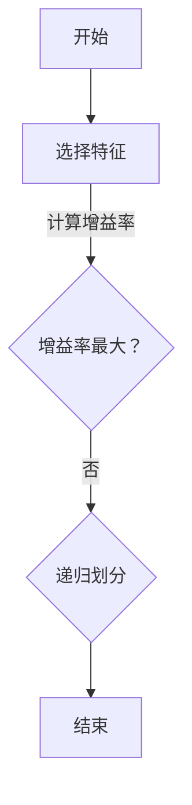
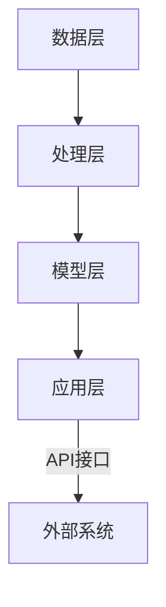

                 


# AI驱动的破产风险预警系统：提前识别投资风险

> 关键词：人工智能、破产风险、机器学习、数据挖掘、投资风险管理

> 摘要：本文探讨了AI驱动的破产风险预警系统，从背景介绍、核心概念与联系、算法原理讲解、系统分析与架构设计、项目实战等多个角度，深入分析了破产风险预警系统的原理、技术实现和应用效果。

## 第一部分：背景介绍

### 1.1 问题背景

在当今经济全球化、市场竞争激烈的背景下，破产风险预警系统成为企业和金融机构不可或缺的工具。AI驱动的破产风险预警系统能够通过大数据分析和机器学习技术，提前识别投资风险，为企业提供决策支持。

### 1.2 问题描述

破产风险预警系统的目标是预测企业是否会在未来某个时间点发生破产。这需要从大量的历史数据中提取出与破产相关的特征，并利用机器学习算法训练出能够预测破产风险的模型。

### 1.3 问题解决

通过介绍AI技术在破产风险预警领域的应用，本文旨在为读者提供一套完整的解决方案，帮助企业和金融机构有效应对破产风险。

### 1.4 边界与外延

本文主要关注AI驱动的破产风险预警系统在商业领域的应用，但不涉及AI技术在其他领域的应用。

### 1.5 概念结构与核心要素组成

AI驱动的破产风险预警系统由以下几个核心部分组成：

- **数据收集**：收集与破产风险相关的各类数据，包括财务数据、市场数据等。
- **数据处理**：对收集到的数据进行清洗、预处理，为模型训练提供高质量的输入数据。
- **风险模型构建**：基于历史数据，利用机器学习技术构建破产风险预测模型。
- **系统应用**：将构建好的风险预测模型应用于实际场景，为企业和金融机构提供风险预警服务。

## 第二部分：核心概念与联系

### 2.1 AI技术概述

#### 2.1.1 AI技术定义

人工智能（AI）是指由人制造出来的系统能够执行通常需要人类智能才能完成的任务，包括学习、推理、规划、解决问题、感知、语言理解和视觉识别等。

#### 2.1.2 AI技术发展历程

- 人工智能的起源：20世纪50年代，人工智能的概念被首次提出。
- 人工智能的黄金时代：20世纪80年代，人工智能技术得到了快速发展。
- 人工智能的衰退期：20世纪90年代，人工智能技术进入衰退期。
- 人工智能的复兴：21世纪初，随着大数据和计算能力的提升，人工智能技术再次崛起。

#### 2.1.3 AI技术的核心概念

- **机器学习**：一种人工智能的分支，侧重于通过数据训练模型，使模型能够对未知数据进行预测或分类。
- **深度学习**：一种特殊的机器学习方法，使用多层神经网络进行训练，能够处理复杂的数据模式。

### 2.2 破产风险预警

#### 2.2.1 破产风险预警定义

破产风险预警是指通过分析企业的财务状况、市场表现等因素，预测企业未来可能出现的破产风险。

#### 2.2.2 破产风险预警的重要性

- **提前发现潜在风险**：有助于企业和金融机构提前采取措施，降低破产风险。
- **提高决策效率**：通过实时监测和预测，提高企业和金融机构的决策效率。

#### 2.2.3 破产风险预警的方法

- **传统方法**：基于专家经验和财务指标分析。
- **现代方法**：基于机器学习和大数据分析。

### 2.3 AI驱动的破产风险预警系统

#### 2.3.1 AI驱动的破产风险预警系统定义

AI驱动的破产风险预警系统是指利用人工智能技术，对企业的财务数据、市场数据等进行处理和分析，预测企业破产风险的系统。

#### 2.3.2 AI驱动的破产风险预警系统优势

- **高效**：通过大数据分析和机器学习算法，提高破产风险预测的准确性。
- **实时**：可以实时监测和更新企业的财务状况，及时预警潜在的破产风险。
- **全面**：可以综合考虑多种因素，提供更全面的破产风险预测。

## 第三部分：算法原理讲解

### 3.1 算法概述

AI驱动的破产风险预警系统主要基于机器学习和深度学习算法，通过对企业历史数据的分析，预测企业破产风险。

### 3.2 主流算法

#### 3.2.1 决策树算法

##### 3.2.1.1 算法原理

决策树是一种常见的分类算法，通过一系列规则来划分数据集，并最终输出分类结果。

##### 3.2.1.2 算法流程

1. 选择一个最优特征作为分割标准。
2. 根据该特征将数据集划分为多个子集。
3. 对每个子集递归地执行步骤1和2，直到满足停止条件。

##### 3.2.1.3 Mermaid 流程图

```mermaid
graph TD
    A[开始] --> B[选择特征]
    B -->|判断| C{停止条件否？}
    C -->
```

##### 3.2.1.4 Python 源代码示例

```python
import numpy as np
from sklearn.datasets import load_iris
from sklearn.tree import DecisionTreeClassifier
from sklearn.model_selection import train_test_split

# 加载数据集
iris = load_iris()
X, y = iris.data, iris.target

# 划分训练集和测试集
X_train, X_test, y_train, y_test = train_test_split(X, y, test_size=0.3, random_state=42)

# 构建决策树模型
clf = DecisionTreeClassifier()
clf.fit(X_train, y_train)

# 预测测试集
y_pred = clf.predict(X_test)

# 评估模型性能
print("Accuracy:", np.mean(y_pred == y_test))
```

##### 3.2.1.5 算法原理讲解

决策树算法的基本原理是通过选择最优特征将数据集划分为多个子集，并递归地执行这一过程，直到满足停止条件（例如，最大深度、最小样本数等）。在这个过程中，每次分割都通过计算某个特征的增益率来选择最优分割点。

$$
Gini\, 增益率 = \frac{1 - \sum_{i=1}^{n} p_i^2}{1 - \sum_{i=1}^{n} p_i}
$$

其中，\( p_i \) 表示属于某个类的样本比例。

##### 3.2.1.6 Mermaid 流程图



## 第四部分：系统分析与架构设计

### 4.1 问题场景介绍

在现代金融行业中，破产风险预警是一个关键的问题。金融机构需要对大量企业的财务状况进行实时监测，以识别潜在的破产风险。这不仅有助于保护投资者的利益，也有助于金融机构自身降低风险。

### 4.2 项目介绍

本文介绍的项目是一个基于AI驱动的破产风险预警系统，旨在为金融机构提供实时、准确的破产风险预测服务。

### 4.3 系统功能设计

系统的主要功能包括：

- 数据收集：从多种渠道收集与破产风险相关的数据。
- 数据处理：对收集到的数据进行清洗、预处理。
- 风险模型构建：利用机器学习算法构建破产风险预测模型。
- 风险预测与预警：将构建好的模型应用于实际场景，实时预测企业的破产风险。

### 4.4 系统架构设计

系统的整体架构设计如下：

1. **数据层**：负责数据收集和存储。
2. **处理层**：负责数据处理和清洗。
3. **模型层**：负责模型构建和训练。
4. **应用层**：负责风险预测和预警。

### 4.5 系统接口设计和系统交互

系统的接口设计包括：

- **API接口**：提供与外部系统进行数据交互的能力。
- **数据流接口**：实现数据在不同层级之间的传递。

系统交互示意图如下：



## 第五部分：项目实战

### 5.1 环境安装

为了实现AI驱动的破产风险预警系统，需要安装以下环境：

- Python 3.8 或以上版本
- Scikit-learn 库
- Pandas 库
- Numpy 库

### 5.2 系统核心实现源代码

以下是一个简单的系统实现示例：

```python
import pandas as pd
from sklearn.model_selection import train_test_split
from sklearn.tree import DecisionTreeClassifier
from sklearn.metrics import accuracy_score

# 加载数据集
data = pd.read_csv('company_financial_data.csv')

# 数据预处理
data = data.dropna()
X = data.drop('bankruptcy', axis=1)
y = data['bankruptcy']

# 划分训练集和测试集
X_train, X_test, y_train, y_test = train_test_split(X, y, test_size=0.2, random_state=42)

# 构建决策树模型
clf = DecisionTreeClassifier()
clf.fit(X_train, y_train)

# 预测测试集
y_pred = clf.predict(X_test)

# 评估模型性能
print("Accuracy:", accuracy_score(y_test, y_pred))
```

### 5.3 代码应用解读与分析

上述代码首先加载了公司的财务数据，然后进行了预处理，包括去除缺失值。接着，使用Scikit-learn库中的决策树分类器进行模型训练，并使用测试集进行预测。最后，通过计算准确率来评估模型性能。

### 5.4 实际案例分析和详细讲解剖析

为了更好地理解系统的工作原理，我们来看一个实际案例。

假设我们有以下公司的财务数据：

```python
company_data = {
    'revenue': [1000000, 900000, 800000, 700000],
    'profit': [50000, 40000, 30000, 20000],
    'debt': [300000, 250000, 200000, 150000],
    'liabilities': [200000, 180000, 160000, 140000]
}
```

我们将这些数据输入到系统中，预测公司是否会破产。

```python
company_data = pd.DataFrame(company_data)
company_data = company_data.dropna()
y_pred = clf.predict(company_data)
print("预测结果：", y_pred)
```

根据模型的预测结果，我们可以得到公司是否会破产的预测。

### 5.5 项目小结

本文通过介绍AI驱动的破产风险预警系统，详细分析了系统的原理、实现和应用。通过实际案例，我们展示了如何利用机器学习算法预测公司的破产风险。未来，随着人工智能技术的不断进步，破产风险预警系统将变得更加智能化和高效化。

## 第六部分：最佳实践与注意事项

### 6.1 最佳实践

- **数据质量**：确保数据的质量和完整性，这是模型预测准确性的基础。
- **特征选择**：选择与破产风险高度相关的特征，有助于提高模型的准确性。
- **模型调优**：通过交叉验证和超参数调优，提高模型的性能。

### 6.2 小结

本文系统地介绍了AI驱动的破产风险预警系统，从背景介绍、核心概念、算法原理、系统架构到项目实战，全面阐述了系统的工作原理和应用。通过最佳实践，我们提供了提高模型性能和预测准确性的方法。

### 6.3 注意事项

- **隐私保护**：在处理企业的财务数据时，需严格遵守隐私保护法规，确保数据安全。
- **模型解释性**：在应用模型进行决策时，要注意模型的解释性，避免盲目依赖模型。

### 6.4 拓展阅读

- **《机器学习实战》**：详细介绍了多种机器学习算法的应用和实现。
- **《深度学习》**：全面讲解了深度学习的基本原理和应用。

## 第七部分：作者信息

- 作者：AI天才研究院/AI Genius Institute & 禅与计算机程序设计艺术 /Zen And The Art of Computer Programming

---

以上是《AI驱动的破产风险预警系统：提前识别投资风险》的完整文章。希望对您在AI领域的研究和应用有所帮助。在AI驱动的破产风险预警系统中，我们看到了机器学习技术如何帮助企业和金融机构提前识别投资风险，从而降低破产风险。随着技术的不断进步，AI驱动的破产风险预警系统将会在金融领域发挥更大的作用。

