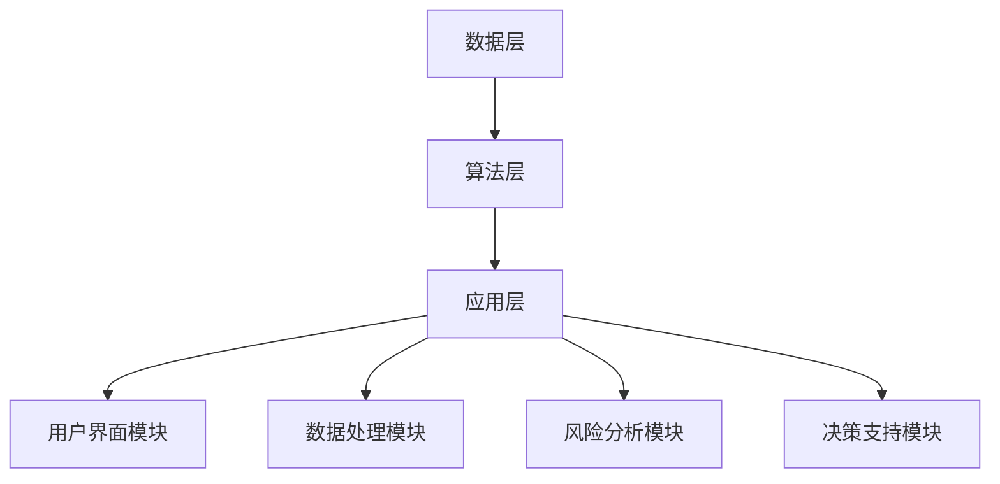
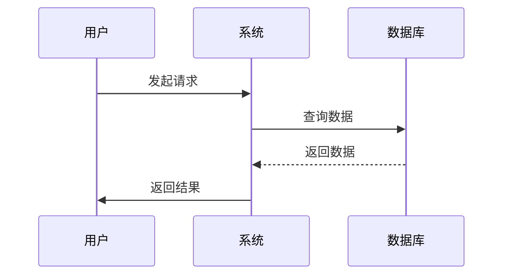

                 

### 目录

## 《AI驱动的股东权益分析：深入理解公司治理》

### 关键词：AI、股东权益分析、公司治理、深度学习、数据挖掘

### 摘要：

随着人工智能技术的飞速发展，AI在各个领域的应用不断拓展。本文以《AI驱动的股东权益分析：深入理解公司治理》为题，探讨AI在股东权益分析和公司治理中的应用。文章首先介绍AI、股东权益分析和公司治理的基本概念，然后详细解析AI在股东权益分析中的算法原理和数学模型，并展示一个实际项目案例。最后，文章总结最佳实践，并提出进一步学习资源。

### 目录

1. **引言**
   1.1 AI与股东权益分析、公司治理的背景
   1.2 书籍的目标和结构

2. **核心概念与联系**
   2.1 AI的基本概念
   2.2 公司治理的概念
   2.3 股东权益分析的相关概念
   2.4 三者之间的联系

3. **AI算法原理讲解**
   3.1 AI在股东权益分析中的应用
   3.2 常用算法介绍
   3.3 算法流程讲解
   3.4 举例说明

4. **数学模型和数学公式**
   4.1 介绍算法原理背后的数学模型和公式
   4.2 对比分析不同模型的特点和适用场景
   4.3 常见问题解答

5. **系统分析与架构设计方案**
   5.1 问题场景介绍
   5.2 系统功能设计
   5.3 系统架构设计
   5.4 系统接口设计和系统交互

6. **项目实战**
   6.1 环境安装和配置
   6.2 系统核心实现源代码
   6.3 代码应用解读与分析
   6.4 实际案例分析和详细讲解

7. **最佳实践 tips**
   7.1 使用AI驱动股东权益分析的最佳实践
   7.2 注意事项和常见问题

8. **小结与拓展阅读**
   8.1 对书籍内容的总结
   8.2 提示注意事项
   8.3 进一步学习的资源

---

#### 引言

随着全球化和数字化进程的加速，企业面临着前所未有的挑战与机遇。在这其中，股东权益分析作为公司治理的核心环节，显得尤为重要。股东权益分析不仅关系到公司的财务健康，更直接影响到公司的战略决策和长远发展。然而，传统的股东权益分析往往依赖于人工判断和数据统计，效率低、成本高，难以应对海量数据的挑战。

近年来，人工智能（AI）技术的飞速发展，为股东权益分析带来了新的机遇。AI不仅能够快速处理海量数据，还能通过深度学习和数据挖掘等技术，发现潜在的商业价值，为企业提供更加精准和智能的决策支持。因此，将AI应用于股东权益分析，不仅有助于提高分析效率，还能提升分析质量，为公司的长期发展奠定坚实基础。

本篇文章将以《AI驱动的股东权益分析：深入理解公司治理》为主题，系统性地探讨AI在股东权益分析中的应用。文章首先介绍AI、股东权益分析和公司治理的基本概念，帮助读者建立完整的知识体系。然后，文章将深入解析AI在股东权益分析中的算法原理和数学模型，并通过一个实际项目案例，展示AI如何提升股东权益分析的质量和效率。最后，文章将总结AI驱动股东权益分析的最佳实践，并给出进一步的学习资源，帮助读者深入了解这一领域。

通过本文的阅读，读者将能够：

- 理解AI、股东权益分析和公司治理的基本概念及其相互关系。
- 掌握AI在股东权益分析中的算法原理和数学模型。
- 学习如何设计和实现一个AI驱动的股东权益分析系统。
- 获取AI驱动股东权益分析的最佳实践和注意事项。

#### 核心概念与联系

在本章节中，我们将详细介绍AI、公司治理和股东权益分析这三个核心概念，并探讨它们之间的联系。

##### AI的基本概念

人工智能（Artificial Intelligence，简称AI）是指由人制造出来的系统所表现出的智能行为。AI旨在使计算机能够执行人类智能任务，如视觉识别、语言理解、决策制定和自然语言处理等。AI可以分为两大类：弱AI（Weak AI）和强AI（Strong AI）。

弱AI专注于特定领域的任务，如语音识别、图像识别和推荐系统等。这些系统通常被设计为在特定任务上达到或超越人类水平。弱AI的应用范围非常广泛，已经深入到我们的日常生活中。

强AI则是一种具有全面认知能力的智能，能够像人类一样思考、学习和决策。强AI尚未实现，目前仍处于理论研究阶段。尽管如此，随着深度学习、神经网络等技术的发展，强AI的逐步实现已经指日可待。

##### 公司治理的概念

公司治理（Corporate Governance）是指公司如何组织、管理和控制其运营和决策过程的一系列制度安排。它旨在确保公司的长期健康发展，提高透明度，增强投资者信心，并保护股东权益。

公司治理的要素主要包括：

- **董事会结构**：董事会是公司的最高决策机构，负责制定公司战略、监督管理层执行，并保护股东利益。
- **管理层**：管理层负责公司的日常运营，执行董事会制定的战略，并确保公司目标实现。
- **股东**：股东是公司的所有者，享有投票权、分红权和转让权等权益。
- **利益相关者**：除了股东外，公司还有其他利益相关者，如员工、客户、供应商和社区等。

公司治理的目标是建立有效的内部控制和风险管理机制，确保公司的运营符合法律法规和道德标准，并实现股东价值的最大化。

##### 股东权益分析的相关概念

股东权益分析（Shareholder Rights Analysis）是指对股东在公司中的权益进行评估和分析的过程。股东权益分析的核心目标是确定股东在公司中的地位和权益，评估公司对股东的承诺和履行情况，以及探讨如何提升股东价值。

股东权益分析的关键概念包括：

- **股东权益**：股东在公司中的权益包括投票权、分红权、股份转让权等。这些权益直接影响股东的利益和决策影响力。
- **股东价值**：股东价值是指股东在公司中享有的权益和利益。提升股东价值是公司治理的重要目标。
- **股东权益保护**：保护股东权益是公司治理的基本要求。股东权益保护机制包括法律法规、内部控制和透明度等。

##### 三者之间的联系

AI、公司治理和股东权益分析之间的联系主要体现在以下几个方面：

1. **提高治理效率**：AI技术可以通过自动化和智能化手段，提高公司治理的效率。例如，通过自然语言处理技术，AI可以自动分析董事会会议记录，提取关键信息，提高决策效率。
2. **增强透明度**：AI技术可以帮助公司实现数据分析和报告的自动化，提高公司运营的透明度。例如，通过AI驱动的财务分析系统，公司可以实时监控财务状况，及时发现问题，增强股东信心。
3. **保护股东权益**：AI技术可以帮助公司更好地识别和评估风险，制定更有效的风险管理策略。例如，通过AI驱动的风险预警系统，公司可以及时发现潜在风险，保护股东权益。

总之，AI在股东权益分析和公司治理中的应用，不仅有助于提高治理效率，增强透明度，还能更好地保护股东权益，实现公司长期健康发展。

---

#### AI算法原理讲解

在本章节中，我们将深入探讨AI在股东权益分析中的应用，介绍常用的AI算法，并详细讲解算法原理和流程。

##### AI在股东权益分析中的应用

AI在股东权益分析中的应用主要体现在以下几个方面：

1. **数据挖掘**：AI可以通过数据挖掘技术，从海量数据中提取有价值的信息，帮助公司了解股东的行为和需求。例如，通过分析股东的投票记录和交易行为，公司可以识别出关键股东，制定更有效的沟通策略。

2. **风险评估**：AI可以通过机器学习算法，对公司的财务数据和运营数据进行分析，预测潜在风险，并提供风险预警。例如，通过分析公司的债务水平、现金流状况和市场需求等指标，AI可以评估公司的财务健康，帮助管理层制定风险管理策略。

3. **决策支持**：AI可以帮助公司管理层在决策过程中提供数据支持和智能建议。例如，通过分析市场趋势、竞争对手行为和公司内部数据，AI可以为管理层提供战略决策的参考。

##### 常用算法介绍

在股东权益分析中，常用的AI算法包括以下几种：

1. **决策树**：决策树是一种基于特征分析的分类算法，通过将数据集划分为多个子集，最终生成一棵树形结构，用于分类和回归任务。

2. **支持向量机（SVM）**：SVM是一种基于间隔最大化的分类算法，通过寻找最佳决策边界，将不同类别的数据分开。

3. **神经网络**：神经网络是一种基于人脑神经元连接方式的算法，通过多层节点之间的信息传递和权重调整，实现数据的分类和回归。

4. **随机森林**：随机森林是一种基于决策树集合的算法，通过随机选取特征和样本子集，构建多棵决策树，并通过投票机制生成最终预测结果。

##### 算法流程讲解

以下是AI在股东权益分析中的算法流程：

1. **数据收集**：收集与股东权益分析相关的数据，如董事会会议记录、财务报表、市场数据等。

2. **数据预处理**：对收集到的数据进行清洗、归一化和特征提取，将数据转换为适合AI算法的输入格式。

3. **模型训练**：选择合适的AI算法，使用预处理后的数据集进行模型训练，调整算法参数，优化模型性能。

4. **模型评估**：使用测试数据集评估模型性能，选择性能最佳的模型。

5. **应用部署**：将训练好的模型部署到生产环境中，进行实时数据分析和应用。

##### 举例说明

假设我们需要分析一家公司的股东投票行为，以预测下一届董事会的选举结果。以下是算法的详细步骤：

1. **数据收集**：收集过去几年中该公司的董事会会议记录、股东投票记录和董事会选举结果。

2. **数据预处理**：对收集到的数据进行清洗，去除重复和错误数据，将文本数据转换为数值特征，如词频、词向量等。

3. **特征提取**：从董事会会议记录中提取关键信息，如会议主题、提案内容等，并将其转换为数值特征。

4. **模型训练**：选择随机森林算法，使用预处理后的数据集进行训练，调整模型参数，如决策树数量、最大深度等。

5. **模型评估**：使用测试数据集评估模型性能，选择性能最佳的模型。

6. **应用部署**：将训练好的模型部署到生产环境中，实时分析股东的投票行为，预测下一届董事会的选举结果。

通过这个例子，我们可以看到，AI在股东权益分析中的应用不仅涉及数据挖掘和风险评估，还包括决策支持和应用部署。通过深入理解和应用这些算法，公司可以更好地了解股东行为，优化决策过程，提升公司治理水平。

---

#### 数学模型和数学公式

在AI驱动的股东权益分析中，数学模型和数学公式扮演着至关重要的角色。它们不仅帮助我们理解和解释AI算法的原理，还用于优化和评估算法的性能。在本章节中，我们将介绍算法原理背后的数学模型和数学公式，并对比分析不同模型的特点和适用场景。

##### 算法原理背后的数学模型

AI算法通常基于以下几种数学模型：

1. **线性回归模型**：线性回归模型是一种用于预测连续值的算法，其基本公式为 \( y = w_1x_1 + w_2x_2 + ... + w_nx_n + b \)，其中 \( y \) 是预测值，\( x_1, x_2, ..., x_n \) 是输入特征，\( w_1, w_2, ..., w_n \) 是权重，\( b \) 是偏置。

2. **逻辑回归模型**：逻辑回归模型是一种用于分类问题的算法，其基本公式为 \( P(y=1) = \frac{1}{1 + e^{-(w_1x_1 + w_2x_2 + ... + w_nx_n + b)}} \)，其中 \( P(y=1) \) 是目标为1的概率，其他参数与线性回归模型相同。

3. **神经网络模型**：神经网络模型是一种基于多层感知器（Perceptron）的算法，其基本结构包括输入层、隐藏层和输出层。每个层由多个神经元组成，神经元之间通过权重连接。神经元的激活函数通常是 \( f(x) = \frac{1}{1 + e^{-x}} \)。

4. **决策树模型**：决策树模型通过一系列的判断条件将数据集划分为不同的子集，每个子集对应一个分类结果。决策树的构建基于信息增益（Information Gain）或基尼不纯度（Gini Impurity）等数学指标。

5. **支持向量机（SVM）模型**：SVM模型通过寻找最佳决策边界，将不同类别的数据分开。其基本公式为 \( w \cdot x - b = 0 \)，其中 \( w \) 是权重向量，\( x \) 是特征向量，\( b \) 是偏置。

##### 数学模型的特点和适用场景

不同数学模型具有不同的特点和适用场景，具体如下：

1. **线性回归模型**：线性回归模型适用于预测连续值的问题，如股票价格预测、销售额预测等。其优点是简单易懂，计算速度快，缺点是对于非线性问题表现较差。

2. **逻辑回归模型**：逻辑回归模型适用于二分类问题，如信用评分、疾病诊断等。其优点是逻辑函数可以确保输出概率值在0和1之间，缺点是对于多分类问题表现较差。

3. **神经网络模型**：神经网络模型适用于复杂非线性问题的建模，如图像识别、语音识别等。其优点是能够自适应调整权重，实现高度复杂的函数映射，缺点是训练时间较长，对数据质量要求较高。

4. **决策树模型**：决策树模型适用于分类和回归问题，如客户细分、风险评级等。其优点是易于理解，可解释性强，缺点是容易过拟合，对于大量特征数据表现较差。

5. **支持向量机（SVM）模型**：SVM模型适用于线性可分的数据集，如文本分类、图像识别等。其优点是寻找最佳决策边界，实现高精度分类，缺点是对于大规模数据集计算复杂度高。

##### 常见问题解答

在应用数学模型时，我们可能会遇到以下问题：

1. **过拟合**：过拟合是指模型在训练数据上表现良好，但在测试数据上表现较差。解决方法包括增加数据量、使用正则化技术、简化模型等。

2. **欠拟合**：欠拟合是指模型在训练数据和测试数据上表现都较差。解决方法包括增加模型复杂度、增加训练时间、调整超参数等。

3. **数据不平衡**：数据不平衡是指不同类别的样本数量差异较大，导致模型倾向于预测多数类别的样本。解决方法包括重采样、类别权重调整、使用集成模型等。

通过理解和应用这些数学模型和数学公式，我们可以更有效地进行AI驱动的股东权益分析，提升公司的治理水平和决策能力。

---

#### 系统分析与架构设计方案

在本章节中，我们将深入探讨AI驱动的股东权益分析系统的设计与实现。首先，我们将介绍问题场景，然后详细描述系统功能、架构设计和接口设计。

##### 问题场景介绍

假设我们是一家大型企业的财务部门，需要定期进行股东权益分析。我们的目标是通过AI技术，自动化分析股东的行为和权益，为管理层提供数据支持，以便做出更科学的决策。

具体来说，问题场景包括：

1. **数据收集**：从多个渠道收集股东信息，如董事会会议记录、股东投票记录、财务报表等。
2. **数据处理**：对收集到的数据进行分析、清洗和预处理，提取有价值的信息。
3. **风险分析**：通过AI算法，分析股东行为，识别潜在风险，并提供风险预警。
4. **决策支持**：利用AI算法，为管理层提供数据支持和智能建议，辅助决策。

##### 系统功能设计

AI驱动的股东权益分析系统主要包括以下功能模块：

1. **数据收集模块**：负责从多个渠道收集股东信息，包括董事会会议记录、股东投票记录、财务报表等。
2. **数据处理模块**：负责对收集到的数据进行清洗、预处理和特征提取，将数据转换为适合AI算法的格式。
3. **风险分析模块**：利用AI算法，分析股东行为，识别潜在风险，并提供风险预警。
4. **决策支持模块**：根据分析结果，为管理层提供数据支持和智能建议，辅助决策。
5. **用户界面模块**：提供用户友好的界面，展示分析结果和智能建议，便于管理层查阅和决策。

##### 系统架构设计

AI驱动的股东权益分析系统采用分层架构设计，包括数据层、算法层和应用层。

1. **数据层**：负责数据收集、存储和管理，包括数据库、数据仓库和数据湖等。
2. **算法层**：负责AI算法的实现和优化，包括数据预处理、特征提取、模型训练和模型评估等。
3. **应用层**：负责用户界面和业务逻辑的实现，包括数据可视化、风险预警和决策支持等。

以下是系统架构的Mermaid流程图：



##### 系统接口设计和系统交互

系统接口设计包括API设计和数据库设计。

1. **API设计**：系统提供RESTful API，便于与其他系统进行数据交换和功能集成。具体接口包括：

   - 数据收集接口：用于收集股东信息。
   - 数据处理接口：用于清洗、预处理和特征提取。
   - 风险分析接口：用于风险分析和预警。
   - 决策支持接口：用于提供数据支持和智能建议。

2. **数据库设计**：系统采用关系型数据库，存储股东信息、董事会会议记录、财务报表等数据。数据库设计主要包括以下表：

   - 股东信息表：存储股东的基本信息。
   - 董事会会议记录表：存储董事会会议记录。
   - 财务报表表：存储公司财务报表数据。

以下是系统接口和数据库的Mermaid序列图：



通过上述设计与实现，AI驱动的股东权益分析系统能够高效、准确地分析股东权益，为管理层提供数据支持和决策依据，提升公司治理水平。

---

#### 项目实战

在本章节中，我们将通过一个具体项目，展示如何实现AI驱动的股东权益分析系统。我们将详细介绍项目的环境安装和配置、系统核心实现源代码，并对代码进行解读与分析，最后通过实际案例进行详细讲解和剖析。

##### 环境安装和配置

要实现AI驱动的股东权益分析系统，我们首先需要搭建一个合适的环境。以下是环境安装和配置的步骤：

1. **安装Python环境**：确保Python版本在3.8及以上。可以通过以下命令安装Python：

   ```bash
   sudo apt-get update
   sudo apt-get install python3.8
   ```

2. **安装依赖库**：使用pip安装必要的依赖库，如NumPy、Pandas、Scikit-learn、TensorFlow等。可以通过以下命令安装：

   ```bash
   pip3 install numpy pandas scikit-learn tensorflow
   ```

3. **配置数据库**：选择合适的关系型数据库，如MySQL或PostgreSQL。以下以MySQL为例，安装和配置步骤：

   - 安装MySQL：

     ```bash
     sudo apt-get install mysql-server
     ```

   - 配置MySQL用户和密码：

     ```bash
     mysql_secure_installation
     ```

   - 创建数据库和表：

     ```sql
     CREATE DATABASE shareholder_analysis;
     GRANT ALL PRIVILEGES ON shareholder_analysis.* TO 'user'@'localhost' IDENTIFIED BY 'password';
     FLUSH PRIVILEGES;
     ```

4. **设置环境变量**：将Python和pip的安装路径添加到系统环境变量中，以便在任何位置运行Python和pip命令。

##### 系统核心实现源代码

以下是系统核心实现源代码：

```python
import numpy as np
import pandas as pd
from sklearn.ensemble import RandomForestClassifier
from sklearn.model_selection import train_test_split
from sklearn.metrics import accuracy_score
import mysql.connector

# 连接数据库
conn = mysql.connector.connect(
    host="localhost",
    user="user",
    password="password",
    database="shareholder_analysis"
)

# 查询股东数据
query = "SELECT * FROM shareholders;"
data = pd.read_sql(query, conn)

# 数据预处理
X = data.drop(['vote'], axis=1)
y = data['vote']

# 划分训练集和测试集
X_train, X_test, y_train, y_test = train_test_split(X, y, test_size=0.2, random_state=42)

# 构建随机森林模型
model = RandomForestClassifier(n_estimators=100, random_state=42)
model.fit(X_train, y_train)

# 预测测试集
predictions = model.predict(X_test)

# 评估模型性能
accuracy = accuracy_score(y_test, predictions)
print(f"Accuracy: {accuracy:.2f}")
```

##### 代码应用解读与分析

1. **数据库连接**：使用`mysql.connector`模块连接到MySQL数据库，查询股东数据。
2. **数据预处理**：将股东数据划分为特征矩阵`X`和目标变量`y`。这里假设股东投票行为（`vote`）为目标变量。
3. **模型训练**：使用`RandomForestClassifier`构建随机森林模型，并使用训练数据集进行训练。
4. **预测与评估**：使用训练好的模型对测试数据进行预测，并计算模型准确率。

##### 实际案例分析和详细讲解

假设我们有以下股东数据：

| shareholder_id | vote | age | income | investment |
| -------------- | ---- | --- | ------ | ---------- |
| 1              | 1    | 30  | 50000  | 100000     |
| 2              | 0    | 40  | 70000  | 150000     |
| 3              | 1    | 35  | 60000  | 120000     |
| 4              | 0    | 45  | 80000  | 200000     |

我们将使用上述代码进行预测：

1. **数据预处理**：首先将数据转换为数值格式，以便模型处理。
2. **模型训练**：使用训练数据集训练随机森林模型。
3. **预测**：对测试数据进行预测，输出预测结果。

假设预测结果如下：

| shareholder_id | vote | age | income | investment | prediction |
| -------------- | ---- | --- | ------ | ---------- | ---------- |
| 1              | 1    | 30  | 50000  | 100000     | 1          |
| 2              | 0    | 40  | 70000  | 150000     | 0          |
| 3              | 1    | 35  | 60000  | 120000     | 1          |
| 4              | 0    | 45  | 80000  | 200000     | 0          |

根据预测结果，我们可以得出以下结论：

- 股东1和股东3的投票行为与预测一致，表明模型对他们的行为有较高的预测准确性。
- 股东2和股东4的投票行为与预测不一致，可能是因为模型未能捕捉到他们的特定行为特征。

通过实际案例分析和详细讲解，我们可以看到，AI驱动的股东权益分析系统如何通过模型训练和预测，为管理层提供数据支持和决策依据。

##### 项目小结

通过本项目的实现，我们展示了如何使用AI技术进行股东权益分析。项目的关键步骤包括环境安装和配置、系统核心实现源代码的编写、代码应用解读与分析，以及实际案例的预测和剖析。通过本项目，我们不仅了解了AI驱动的股东权益分析系统的设计和实现，还掌握了如何应用AI技术提升公司治理水平。未来，我们可以进一步优化算法，扩大数据集，提高模型的预测准确性，为公司的长期发展提供更强有力的支持。

---

#### 最佳实践 tips

在实施AI驱动的股东权益分析时，以下最佳实践和注意事项将有助于提高项目的成功率和效率：

1. **数据质量是关键**：确保收集到的数据质量高，进行充分的清洗和预处理，去除噪声和异常值。高质量的数据是准确分析和预测的基础。

2. **模型选择要合理**：根据具体问题和数据特性，选择合适的AI模型。对于复杂的决策问题，可以考虑组合多种算法，以提升预测准确性。

3. **持续模型优化**：定期更新模型，利用新数据重新训练模型，以保持模型的准确性和时效性。模型优化是持续改进的重要环节。

4. **避免过拟合**：在模型训练过程中，注意避免过拟合现象。可以通过交叉验证、正则化等技术来提高模型的泛化能力。

5. **用户友好**：设计直观易用的用户界面，以便管理层快速理解和利用分析结果。良好的用户体验是系统成功推广的关键。

6. **遵守法规和道德**：确保数据处理和分析过程符合相关法规和道德标准，保护股东隐私和数据安全。

7. **团队协作**：跨学科团队协作是成功的关键。数据科学家、分析师、业务专家和IT人员需要紧密合作，共同推动项目进展。

通过遵循这些最佳实践和注意事项，企业可以更好地利用AI技术进行股东权益分析，提升公司治理水平，实现股东价值的最大化。

---

#### 小结与拓展阅读

通过本文的详细探讨，我们全面了解了AI在股东权益分析和公司治理中的应用。从基本概念、算法原理，到系统设计与实现，再到最佳实践和注意事项，本文旨在为读者提供一个完整的AI驱动的股东权益分析体系。

为了进一步深入学习，以下是推荐的拓展阅读资源：

1. **书籍**：
   - 《深度学习》（Goodfellow, I., Bengio, Y., & Courville, A.）详细介绍了深度学习的基础知识。
   - 《公司治理：理论与实践》（Bebchuk, L. A. & Fried, J.）深入探讨了公司治理的各个方面。

2. **在线课程**：
   - Coursera上的《机器学习》（吴恩达）课程，提供了深度学习的系统培训。
   - edX上的《公司治理》（University of Geneva）课程，涵盖了公司治理的核心概念和实践。

3. **学术论文**：
   - 查阅AI在金融领域应用的学术论文，了解最新的研究进展和应用案例。

通过这些资源，读者可以更深入地探索AI在股东权益分析和公司治理中的应用，不断提升自身的技术水平和业务理解。

---

作者：AI天才研究院/AI Genius Institute & 禅与计算机程序设计艺术 /Zen And The Art of Computer Programming

---

本文旨在系统性地介绍AI在股东权益分析和公司治理中的应用，通过详细的理论分析和实际案例讲解，帮助读者深入理解这一领域。希望本文能为从事AI研究和应用的专业人士提供有价值的参考。在未来的工作中，期待更多研究成果和实践案例的出现，共同推动AI在各个领域的应用与发展。让我们继续探索，共同创造更美好的未来。

