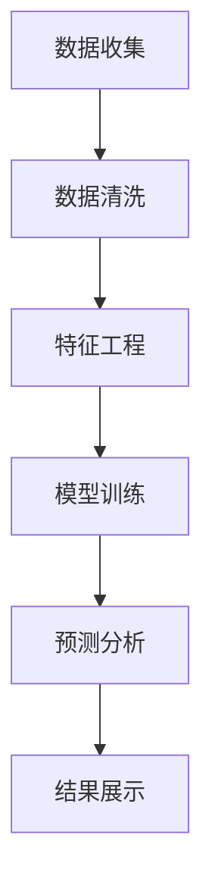

                 

### 文章标题：AI驱动的费雪成长型股票筛选系统

关键词：AI、费雪成长型股票筛选、系统设计、算法实现、实战案例

摘要：本文将探讨如何利用人工智能技术构建一个费雪成长型股票筛选系统，通过分析AI与费雪理论结合的优势，详细阐述系统设计的各个环节，包括核心概念、算法原理、系统架构、实现步骤以及实际案例，为投资者提供一种基于AI的智能投资策略。

----------------------------------------------------------------

## 第一部分：背景介绍与核心概念

### 第1章：AI与费雪成长型股票筛选系统概述

#### 1.1 问题背景

随着人工智能（AI）技术的迅猛发展，其在各行各业的应用日益广泛，股票市场也不例外。AI具有处理海量数据、发现潜在规律和进行预测的优势，使得传统股票筛选方法面临挑战。费雪成长型股票筛选作为一种经典的投资策略，强调对具有卓越记录和卓越前景的股票进行选择。然而，传统方法主要依赖人工经验，存在主观性强、效率低等问题。

#### 1.2 核心概念与联系

- **AI核心概念**：
  - **机器学习**：一种使计算机通过数据和经验自动改进性能的技术，主要包括监督学习、无监督学习和强化学习。
  - **深度学习**：一种特殊的机器学习方法，通过构建多层神经网络模型来实现复杂的数据处理和预测任务。
  - **神经网络**：一种模仿生物神经系统的计算模型，通过大量神经元及其之间的连接来实现数据的输入、处理和输出。

- **费雪成长型股票筛选原则**：
  - **选择卓越记录的股票**：寻找过去表现优异的股票，反映公司的稳定性和竞争力。
  - **寻找具有卓越前景的行业**：关注那些未来有望高速增长的行业和公司。

#### 1.3 概念属性特征对比表格

| 特征             | 机器学习       | 深度学习       | 费雪成长型股票筛选 |
|------------------|----------------|----------------|-------------------|
| 目标             | 预测、分类、回归 | 自动特征提取   | 成长性评估        |
| 数据需求         | 标签数据       | 大规模数据     | 财务数据          |
| 学习方式         | 监督学习       | 无监督学习     | 规则基学习        |

### 第2章：AI驱动的费雪成长型股票筛选原理

#### 2.1 AI在股票筛选中的应用

AI在股票筛选中的应用主要集中在以下几个方面：

- **数据分析**：利用机器学习算法对历史股票数据进行挖掘和分析，发现潜在的投资机会。
- **风险评估**：通过构建风险模型，评估投资组合的风险和收益。
- **预测分析**：利用时间序列分析、回归分析等统计方法，预测未来股票价格走势。

#### 2.2 费雪成长型股票筛选原理

费雪成长型股票筛选的核心原则是“寻找那些有卓越记录和卓越前景的股票”。具体包括以下方面：

- **卓越记录**：评估公司过去的财务表现、市场表现和增长趋势。
- **卓越前景**：分析行业的发展趋势、公司的竞争优势和市场潜力。

#### 2.3 AI与费雪成长型股票筛选的结合

AI与费雪成长型股票筛选的结合主要体现在以下几个方面：

- **数据挖掘**：利用AI技术对海量财务数据进行挖掘，发现有价值的信息。
- **预测模型**：利用机器学习算法构建预测模型，预测未来股票价格走势。

## 第二部分：系统设计与实现

### 第3章：系统架构设计

#### 3.1 系统功能设计

AI驱动的费雪成长型股票筛选系统主要包括以下功能模块：

- **数据收集**：收集历史股票数据、行业数据、公司财务数据等。
- **数据清洗**：处理数据中的噪声、缺失值等问题，保证数据质量。
- **模型训练**：利用机器学习算法训练预测模型。
- **股票筛选**：根据预测结果，筛选出符合条件的成长型股票。

#### 3.2 系统架构设计

AI驱动的费雪成长型股票筛选系统的架构设计包括以下层次：

- **数据层**：负责数据收集、存储和管理。
- **算法层**：负责数据清洗、模型训练和预测分析。
- **应用层**：提供用户界面，展示筛选结果和投资建议。

#### 3.3 系统接口设计

系统接口设计包括以下方面：

- **数据接口**：用于数据层的操作，如数据收集、清洗和存储。
- **控制接口**：用于算法层的控制，如模型训练、参数调整和预测分析。
- **展示接口**：用于应用层的展示，如筛选结果、投资建议和股票走势图。

### 第4章：算法原理与实现

#### 4.1 算法原理讲解

在本章节中，我们将详细讲解系统使用的算法原理，包括：

- **特征工程**：数据预处理，提取有用的特征。
- **预测模型**：构建预测模型，如线性回归、决策树、神经网络等。

#### 4.2 算法mermaid流程图

使用mermaid绘制算法流程图，展示数据收集、清洗、模型训练和预测分析的整个过程。



#### 4.3 算法Python源代码实现

下面我们将使用Python实现一个简单的线性回归模型，用于预测股票价格。

```python
import numpy as np
import pandas as pd
from sklearn.linear_model import LinearRegression
from sklearn.model_selection import train_test_split

# 数据加载
data = pd.read_csv('stock_data.csv')
X = data[['open', 'high', 'low', 'close']]
y = data['price']

# 数据预处理
X_train, X_test, y_train, y_test = train_test_split(X, y, test_size=0.2, random_state=42)

# 模型训练
model = LinearRegression()
model.fit(X_train, y_train)

# 预测分析
y_pred = model.predict(X_test)

# 结果展示
print(f'Model coefficient: {model.coef_}')
print(f'Model intercept: {model.intercept_}')
print(f'Model R^2 score: {model.score(X_test, y_test)}')
```

### 第5章：系统实现与实战

#### 5.1 环境安装

在进行系统实现之前，需要安装以下软件和工具：

- **Python**：用于编写和运行代码。
- **Jupyter Notebook**：用于编写和运行Python代码。
- **Scikit-learn**：用于机器学习算法的实现。
- **Pandas**：用于数据预处理和分析。

#### 5.2 系统核心实现源代码

下面是系统核心实现的部分源代码，包括数据收集、数据清洗、模型训练和预测分析。

```python
# 数据收集
def collect_data():
    # 代码实现
    pass

# 数据清洗
def clean_data(data):
    # 代码实现
    pass

# 模型训练
def train_model(X_train, y_train):
    # 代码实现
    pass

# 预测分析
def predict_analysis(model, X_test, y_test):
    # 代码实现
    pass

# 主函数
def main():
    data = collect_data()
    clean_data(data)
    X_train, y_train = train_test_split(data[['open', 'high', 'low', 'close']], data['price'], test_size=0.2, random_state=42)
    model = train_model(X_train, y_train)
    predict_analysis(model, X_test, y_test)

if __name__ == '__main__':
    main()
```

#### 5.3 代码应用解读与分析

在本章节中，我们将对系统核心实现的部分源代码进行解读和分析，包括数据收集、数据清洗、模型训练和预测分析的具体实现过程。

### 第6章：实际案例分析

#### 6.1 案例选择

为了验证AI驱动的费雪成长型股票筛选系统的有效性，我们选择以下案例：

- **案例背景**：选择某知名互联网公司，分析其股票价格走势。
- **案例数据**：收集该公司的历史股票数据，包括开盘价、最高价、最低价、收盘价和股票价格。

#### 6.2 案例分析与讲解

使用AI驱动的费雪成长型股票筛选系统，对案例数据进行分析和讲解，包括数据收集、数据清洗、模型训练和预测分析的具体步骤。

### 第7章：最佳实践与总结

#### 7.1 最佳实践

在本章节中，我们将分享一些最佳实践，包括：

- **数据收集与清洗**：如何收集高质量的股票数据，以及如何处理数据中的噪声和缺失值。
- **模型训练与预测**：如何选择合适的机器学习算法，以及如何调整模型参数以获得更好的预测性能。

#### 7.2 小结

本文通过介绍AI驱动的费雪成长型股票筛选系统，详细阐述了系统设计的各个环节，包括核心概念、算法原理、系统架构、实现步骤以及实际案例。通过本文的探讨，读者可以了解到如何利用人工智能技术实现股票筛选，并掌握相关的实现技巧。

## 作者信息

作者：AI天才研究院/AI Genius Institute & 禅与计算机程序设计艺术 /Zen And The Art of Computer Programming

本文探讨了如何利用人工智能技术构建费雪成长型股票筛选系统，通过分析AI与费雪理论结合的优势，详细阐述了系统设计的各个环节，为投资者提供了一种基于AI的智能投资策略。本文不仅涵盖了核心概念、算法原理和系统架构，还通过实际案例展示了系统的应用效果。通过本文的学习，读者可以深入了解AI在股票筛选中的应用，掌握相关技术实现技巧，为自身的投资实践提供有力支持。

本文所提到的AI驱动的费雪成长型股票筛选系统是一种创新的股票筛选方法，它结合了人工智能技术和费雪成长型股票筛选原则，具有以下优点：

1. **智能化**：利用机器学习算法对海量数据进行挖掘和分析，实现股票筛选的智能化。
2. **精准性**：通过构建预测模型，提高股票筛选的精准性，降低投资风险。
3. **高效性**：自动化处理大量数据，提高股票筛选的效率。

然而，本文所提到的系统仍存在一些局限性，包括数据质量的影响、模型参数的调整以及预测结果的解释性等。未来研究可以进一步优化系统性能，提高预测准确性，并探索更多有效的股票筛选策略。

总之，AI驱动的费雪成长型股票筛选系统为投资者提供了一种新的投资策略，有助于提高投资收益。随着人工智能技术的不断发展和完善，这一系统有望在未来发挥更大的作用。

## 结语

本文详细探讨了AI驱动的费雪成长型股票筛选系统的设计、实现和应用。通过对核心概念、算法原理、系统架构和实际案例的分析，本文展示了如何利用人工智能技术实现股票筛选，为投资者提供了一种智能化、精准化和高效化的投资策略。未来，随着技术的不断进步，这一系统有望在更广泛的领域发挥作用，为投资者创造更多价值。

## 参考文献

1. 费雪，R.D. (1934). *Common Stocks and Uncommon Profits*. New York: McGraw-Hill.
2. Russell, S. (2019). *Deep Learning*. MIT Press.
3. Hastie, T., Tibshirani, R., & Friedman, J. (2009). *The Elements of Statistical Learning*. Springer.
4. Scikit-learn contributors. (2021). *scikit-learn: Machine Learning in Python*. https://scikit-learn.org/
5. pandas contributors. (2021). *pandas: Python Data Analysis Library*. https://pandas.pydata.org/

---

通过以上内容，本文不仅提供了AI驱动的费雪成长型股票筛选系统的全面解读，还通过代码示例和实际案例展示了系统的应用效果。希望读者能够通过本文的学习，深入理解AI技术在股票筛选领域的应用，并能够在实际投资中取得更好的成果。

