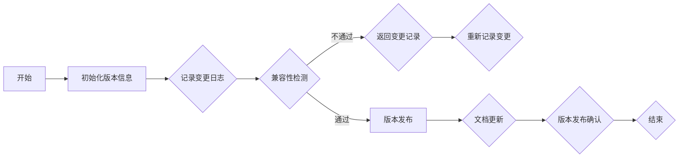
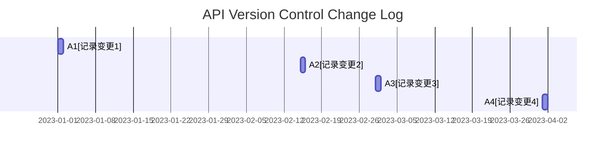
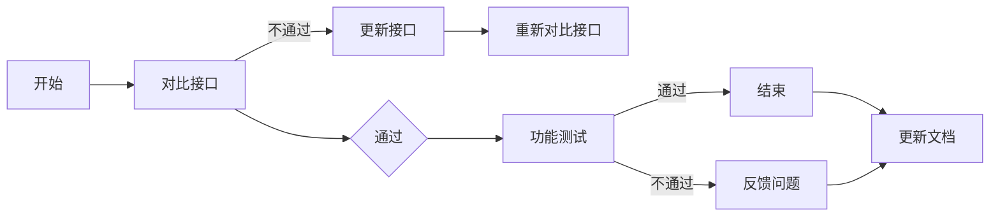
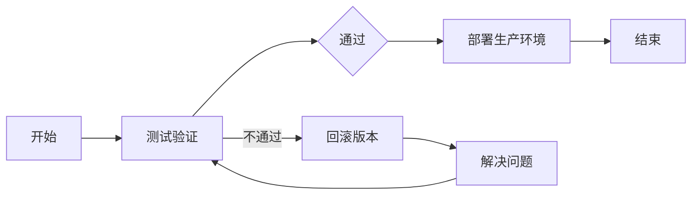
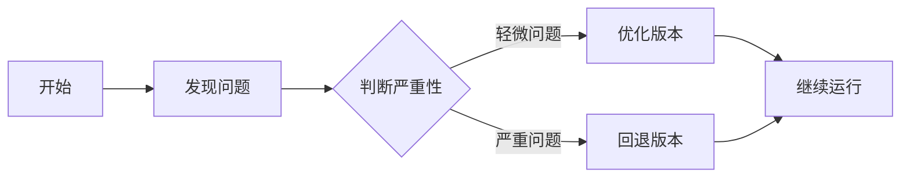
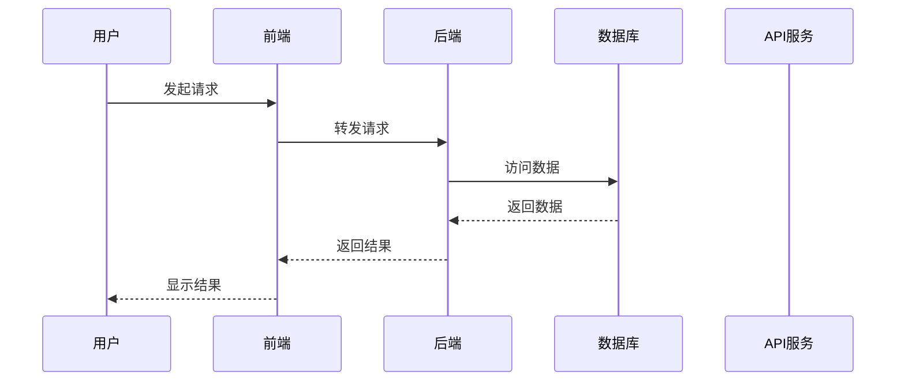
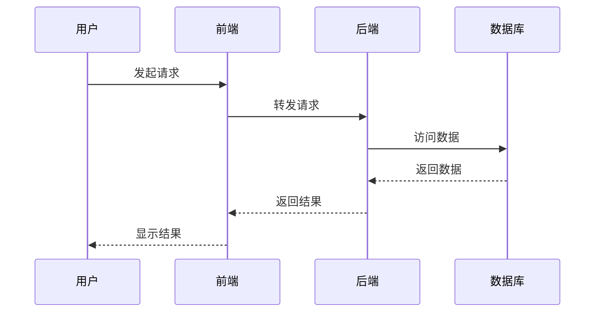

                 

### 引言

## 1.1 问题背景

### 1.1.1 API版本控制的必要性

API（应用程序编程接口）是现代软件开发中不可或缺的一部分。它定义了不同软件组件之间交互的规则和标准，使开发者能够利用现有服务构建新的应用程序。然而，随着时间的推移，应用程序的功能需求不断变化，这导致了API接口也需要不断地更新和改进。在这种情况下，API版本控制变得尤为重要。

API版本控制的主要目的是在接口变更时，确保新旧接口之间的兼容性。这包括处理新功能的引入、错误修正、性能优化以及安全改进。如果没有有效的版本控制机制，一旦发生接口变更，可能会导致使用旧版本API的应用程序无法正常运行，甚至产生严重的兼容性问题。

### 1.1.2 LLM服务接口的发展与挑战

LLM（大型语言模型）服务，如OpenAI的GPT系列，近年来在自然语言处理领域取得了显著的突破。这些模型通过大量的文本数据进行训练，能够生成高质量的文本、回答问题、进行对话等。LLM服务的API接口则为开发者提供了访问和使用这些模型的能力。

随着LLM技术的不断发展，服务接口也在不断演进。这带来了新的挑战，例如如何确保不同版本的服务之间保持兼容性，如何管理接口的变更以避免对用户造成不便，以及如何在多版本共存的情况下高效地提供服务。

### 1.1.3 API版本控制在LLM服务中的应用价值

API版本控制在LLM服务中的应用价值主要体现在以下几个方面：

1. **兼容性保障**：通过版本控制，可以确保旧版本的应用程序能够继续使用旧版本的API接口，同时新版本的应用程序也能使用最新版本的API接口。
2. **迭代便利**：开发者可以独立地更新接口，而不影响现有应用程序的功能，从而加快新功能的迭代速度。
3. **风险管理**：版本控制有助于识别和解决接口变更带来的潜在风险，确保服务稳定性和可靠性。
4. **用户友好**：通过清晰的版本标识和文档说明，用户可以更容易地理解和使用不同版本的API接口。

## 1.2 问题描述

### 1.2.1 API版本控制的问题概述

API版本控制主要面临以下几个问题：

1. **版本冲突**：当新旧版本的API同时存在时，如何处理两者之间的兼容性问题。
2. **变更管理**：如何有效地管理接口的变更，确保变更的合理性和安全性。
3. **文档更新**：随着接口的变更，如何及时更新文档，以便开发者能够快速了解和使用新版本的API。
4. **回退机制**：在出现问题时，如何快速回退到旧版本，以减少对用户的影响。

### 1.2.2 LLM服务接口的演进路径

LLM服务接口的演进路径通常包括以下几个阶段：

1. **初始版本**：提供一个基本的API接口，满足基本功能需求。
2. **功能扩展**：在初始版本的基础上，逐步增加新功能，提高模型的性能和适用范围。
3. **性能优化**：通过优化算法和架构，提高接口的响应速度和稳定性。
4. **安全改进**：在接口中增加安全措施，以防止潜在的安全威胁。

### 1.2.3 版本控制对LLM服务接口的影响

版本控制对LLM服务接口的影响主要体现在以下几个方面：

1. **兼容性**：通过版本控制，可以确保新旧接口之间的兼容性，避免用户因为接口变更而受到影响。
2. **迭代速度**：版本控制使得开发者可以独立地进行接口更新，加快新功能的迭代速度。
3. **风险管理**：版本控制有助于识别和解决接口变更带来的风险，确保服务的稳定性和可靠性。
4. **用户体验**：清晰的版本标识和文档更新，有助于用户更好地理解和使用不同版本的API接口。

## 1.3 问题解决

### 1.3.1 版本控制的基本概念

版本控制是一种管理和追踪文档、代码或任何类型的信息变更的技术。在API版本控制中，版本控制的基本概念包括：

1. **版本号**：用于标识API接口的不同版本。常见的版本号格式有语义版本号（如`1.0.0`）、日期版本号（如`2023-03-15`）等。
2. **变更日志**：记录API接口的变更历史，包括新增功能、修正的bug、性能优化等内容。
3. **兼容性矩阵**：用于描述不同版本API接口之间的兼容性关系，帮助开发者了解如何在不同版本之间进行切换。

### 1.3.2 版本控制的方法与工具

常见的版本控制方法包括：

1. **向后兼容**：在新版本中保持与旧版本相同的接口和行为，确保旧版本的应用程序可以无缝升级到新版本。
2. **向前兼容**：在旧版本中保留新版本的功能，但需要开发者明确调用新功能。
3. **向下兼容**：在新版本中继续支持旧版本的接口，但可能需要额外的配置或参数。

常用的版本控制工具有：

1. **Git**：一种分布式版本控制系统，广泛应用于开源项目和商业项目。
2. **SVN**：一种集中式版本控制系统，主要用于大型项目的版本管理。
3. **Mercurial**：另一种分布式版本控制系统，与Git类似，但更注重简单性和易用性。

### 1.3.3 API版本控制的策略与实践

在实际应用中，常见的API版本控制策略包括：

1. **简单策略**：通过在URL中包含版本号（如`api/v1/endpoint`），实现简单的版本控制。
2. **头信息策略**：通过在HTTP请求头中包含版本信息，实现更灵活的版本控制。
3. **参数策略**：通过在URL或请求参数中包含版本信息，实现版本控制。

常见的版本控制实践包括：

1. **文档化**：提供详细的变更日志和API文档，帮助开发者了解版本变更。
2. **自动化测试**：通过自动化测试确保新旧版本的兼容性。
3. **逐步升级**：在新的API版本发布后，逐步引导用户升级，以降低风险。

### 1.4 边界与外延

#### 1.4.1 版本控制的适用场景

版本控制适用于以下场景：

1. **API接口变更**：在接口发生变更时，版本控制有助于确保新旧接口的兼容性。
2. **软件更新**：在软件更新时，版本控制有助于追踪变更历史，确保用户能够顺利升级。
3. **文档管理**：在文档变更时，版本控制有助于追踪文档历史，确保文档的准确性和一致性。

#### 1.4.2 非版本控制的潜在风险

非版本控制的潜在风险包括：

1. **兼容性问题**：新旧接口之间可能存在兼容性问题，导致应用程序无法正常运行。
2. **功能丢失**：未经版本控制的变更可能导致某些功能丢失，影响用户体验。
3. **变更不可追踪**：未经版本控制的变更可能导致变更历史不清，影响后续的维护和升级。

#### 1.4.3 API版本控制与其他管理策略的协同

API版本控制可以与其他管理策略协同，以实现更好的管理效果。例如：

1. **变更管理**：与变更管理策略协同，确保接口变更的合理性和安全性。
2. **持续集成**：与持续集成策略协同，通过自动化测试确保接口变更的兼容性。
3. **文档管理**：与文档管理策略协同，确保文档的及时更新和一致性。

### 1.5 本章小结

本章介绍了API版本控制的必要性、LLM服务接口的发展与挑战、API版本控制的方法与工具，以及API版本控制在LLM服务中的应用价值。通过版本控制，可以有效管理API接口的变更，确保服务的稳定性和兼容性。在下一章中，我们将深入探讨API版本控制的核心概念和与LLM服务接口的联系。

## 2.1 API版本控制的核心概念

### 2.1.1 API接口的定义

API接口是应用程序之间进行交互的桥梁，它定义了数据交换的格式、规则和协议。在软件开发中，API接口通常由一系列的端点（Endpoint）和操作（Operation）组成，这些端点提供了访问特定功能的入口。API接口的设计和实现对于应用程序的互操作性、可扩展性和用户体验至关重要。

### 2.1.2 版本号的标识方式

版本号是API接口版本控制的核心要素，它用于标识不同的API版本。常见的版本号标识方式包括：

1. **语义版本号（Semantic Versioning）**：采用`MAJOR.MINOR.PATCH`的形式，分别表示主版本、次版本和补丁版本。每次变更时，根据变更的规模和影响范围，相应地增加主版本、次版本或补丁版本。例如，从`1.0.0`升级到`1.0.1`表示对现有功能进行了小的修复，从`1.0.0`升级到`2.0.0`表示进行了较大的功能更新。

2. **日期版本号**：以日期形式（如`YYYY-MM-DD`）标识版本，通常用于早期开发版本或实验性版本。这种方式较为简单，但不够直观，容易与实际的功能变更混淆。

3. **自定义版本号**：根据项目需求自定义版本号，例如使用`alpha`、`beta`等前缀来标识不同阶段的版本。

### 2.1.3 版本控制的原理

版本控制的原理主要涉及以下几个关键点：

1. **分支管理**：通过分支管理，开发者可以在不影响主线代码的情况下进行功能开发和修复。常见的分支模式包括GitFlow、GitLab Flow等。

2. **变更记录**：版本控制系统会记录每个版本的详细信息，包括变更的作者、日期、修改的文件等。这些记录可以帮助开发者追踪变更历史，理解代码的演进过程。

3. **版本发布**：版本发布是将代码库中的特定版本发布到生产环境的过程。发布时，需要确保版本的正确性和兼容性，并进行必要的测试和验证。

4. **合并与集成**：在开发过程中，开发者需要将各自分支上的变更合并到主分支，以保持代码库的一致性和完整性。

### 2.2 LLM服务接口的特性

#### 2.2.1 LLM服务接口的功能概述

LLM服务接口提供了对大型语言模型的访问和操作能力。其主要功能包括：

1. **文本生成**：根据输入的提示生成高质量的文本，适用于生成文章、对话、摘要等。
2. **问题回答**：基于用户提出的问题，提供准确的答案或相关的信息。
3. **对话系统**：与用户进行自然语言交互，模拟人类的对话过程。
4. **文本分类**：对输入的文本进行分类，用于推荐系统、搜索引擎等。

#### 2.2.2 LLM服务接口的版本特性

LLM服务接口的版本特性主要包括：

1. **功能扩展**：随着模型的不断训练和优化，接口会不断引入新的功能，提高模型的性能和应用范围。
2. **性能优化**：通过算法改进和架构优化，提高接口的响应速度和处理能力。
3. **安全改进**：增加安全措施，防止恶意使用和潜在的安全威胁。

#### 2.2.3 LLM服务接口的演进机制

LLM服务接口的演进机制通常包括以下几个步骤：

1. **需求分析**：根据用户反馈和市场趋势，分析接口需要新增的功能和改进的方向。
2. **设计规划**：制定详细的设计文档，明确接口的变更范围和影响。
3. **开发与测试**：进行功能开发、代码审查和测试，确保接口的稳定性和兼容性。
4. **版本发布**：将新版本的接口发布到生产环境，并更新相应的文档和说明。
5. **用户反馈**：收集用户对新版本接口的反馈，持续优化接口的设计和功能。

### 2.3 API版本控制与LLM服务接口的联系

#### 2.3.1 版本控制对LLM服务接口的适应性

版本控制对LLM服务接口的适应性体现在以下几个方面：

1. **兼容性保障**：通过版本控制，确保不同版本的LLM服务接口之间的兼容性，避免旧版本的应用程序因接口变更而受到影响。
2. **迭代支持**：版本控制允许开发者独立地进行接口更新，而不影响现有应用程序的功能，从而加快新功能的迭代速度。
3. **风险控制**：版本控制有助于识别和解决接口变更带来的潜在风险，确保服务的稳定性和可靠性。

#### 2.3.2 LLM服务接口的版本控制策略

LLM服务接口的版本控制策略主要包括以下几种：

1. **向后兼容**：在新版本的接口中保留旧版本的功能和行为，确保旧版本的应用程序可以无缝升级。
2. **向前兼容**：在旧版本的接口中支持新版本的功能，但需要开发者明确调用新功能。
3. **向下兼容**：在新版本的接口中继续支持旧版本的接口，但可能需要额外的配置或参数。

#### 2.3.3 LLM服务接口版本控制的难点

LLM服务接口版本控制面临的难点包括：

1. **功能复杂性**：LLM服务接口的功能丰富，涉及文本生成、问题回答、对话系统等多个方面，版本控制需要综合考虑这些功能之间的依赖关系。
2. **性能优化**：接口的版本变更可能会影响性能，需要平衡新功能和性能优化之间的关系。
3. **安全风险**：接口变更可能引入安全漏洞，需要加强安全测试和防护措施。

### 2.4 概念属性特征对比表格

| 特性         | API接口版本控制 | LLM服务接口版本控制 |
| ------------ | --------------- | ------------------- |
| 标识方式     | 语义版本号、日期版本号、自定义版本号 | 语义版本号、功能版本号、自定义版本号 |
| 重要性       | 高，影响兼容性和迭代速度 | 高，影响服务质量和用户体验 |
| 工具支持     | 丰富，有专用工具 | 较为有限，需自定义 |
| 应用场景     | 各类API接口       | 特定领域的LLM服务接口 |

### 2.5 ER实体关系图架构

```mermaid
erDiagram
  APIInterface ||--|{ VersionControl }|| VersionControl
  VersionControl ||--|{ APIVersion }|| APIVersion
  APIVersion ||--|{ LLMServiceVersion }|| LLMServiceVersion
```

### 2.6 本章小结

本章介绍了API版本控制的核心概念和LLM服务接口的特性，分析了版本控制对LLM服务接口的适应性以及版本控制策略。通过对比API接口版本控制和LLM服务接口版本控制的特征，我们可以更好地理解如何管理LLM服务接口的版本变更，确保服务的稳定性和兼容性。在下一章中，我们将进一步探讨API版本控制算法的原理和应用。

## 3.1 API版本控制算法

### 3.1.1 算法概述

API版本控制算法是确保不同版本API接口之间兼容性的关键工具。该算法的主要目标是实现版本之间的平滑过渡，减少由于版本变更带来的兼容性问题。算法的核心在于如何准确地标识版本、管理和追踪变更，并提供有效的回退机制。

### 3.1.2 算法流程

API版本控制算法的流程通常包括以下几个步骤：

1. **版本标识**：为每个API接口分配唯一的版本号，如使用语义版本号（MAJOR.MINOR.PATCH）。
2. **变更记录**：记录每次版本变更的详细信息，包括变更内容、变更日期和责任人。
3. **兼容性检查**：在发布新版本时，对旧版本的应用程序进行兼容性检查，确保新旧版本的接口可以正常交互。
4. **文档更新**：更新API文档，详细说明新版本的接口变更和注意事项。
5. **版本发布**：将新版本发布到生产环境，并进行必要的测试和验证。
6. **回退机制**：在出现问题时，能够快速回退到旧版本，减少对用户的影响。

### 3.1.3 算法性能分析

API版本控制算法的性能分析主要关注以下几个方面：

1. **响应时间**：算法应该能够快速地处理版本变更请求，确保接口的响应时间不受影响。
2. **准确性**：算法需要准确地标识版本，并正确处理不同版本之间的兼容性问题。
3. **可扩展性**：算法应能够适应不断增长的API接口数量和版本变更频率。
4. **稳定性**：算法应具备较高的稳定性，确保在生产环境中不会出现意外故障。

### 3.2 LLM服务接口版本控制算法

#### 3.2.1 算法概述

LLM服务接口版本控制算法旨在管理大型语言模型API接口的版本变更，确保不同版本之间的高度兼容性。该算法不仅要处理基本的版本标识和变更记录，还需要考虑LLM服务接口的特殊需求，如模型训练时间、参数配置和性能优化。

#### 3.2.2 算法设计

LLM服务接口版本控制算法的设计原则包括：

1. **版本独立性**：确保每个版本的接口可以独立存在，不会因为其他版本的变更而受到影响。
2. **兼容性保证**：确保新旧版本的接口能够无缝切换，避免因兼容性问题导致服务中断。
3. **灵活性**：提供灵活的版本更新策略，支持不同场景下的版本控制需求。
4. **安全性**：加强接口变更时的安全检查，防止潜在的恶意攻击和漏洞。

算法的主要模块包括：

1. **版本管理模块**：负责版本标识、变更记录和版本发布。
2. **兼容性检测模块**：负责检查新旧版本接口的兼容性，并提供相应的兼容性策略。
3. **文档更新模块**：负责更新API文档，提供版本变更的详细说明。
4. **回退管理模块**：负责在出现问题时快速回退到旧版本，确保服务的连续性。

#### 3.2.3 算法实现

LLM服务接口版本控制算法的实现步骤如下：

1. **初始化版本信息**：为LLM服务接口分配初始版本号，并初始化版本管理模块。
2. **记录变更日志**：每次接口变更时，记录变更的详细信息，包括变更的内容、影响范围和责任人。
3. **兼容性检测**：在发布新版本前，使用兼容性检测模块对旧版本应用程序进行兼容性检查。
4. **文档更新**：更新API文档，详细说明新版本的接口变更和注意事项。
5. **版本发布**：将新版本的接口发布到生产环境，并进行必要的测试和验证。
6. **回退准备**：在需要回退时，准备好回退计划，包括回退版本的选择、数据备份和测试。

#### 3.3 算法Mermaid流程图



#### 3.4 Python源代码实现

```python
class VersionControl:
    def __init__(self):
        self.current_version = '1.0.0'
        self.version_history = []

    def record_change(self, change_details):
        new_version = self.increment_version()
        self.version_history.append({
            'version': new_version,
            'change_details': change_details,
            'date': datetime.now()
        })

    def increment_version(self):
        parts = self.current_version.split('.')
        major, minor, patch = map(int, parts)
        patch += 1
        if patch == 10:
            minor += 1
            patch = 0
        if minor == 10:
            major += 1
            minor = 0
        self.current_version = f'{major}.{minor}.{patch}'
        return self.current_version

    def check_compatibility(self, old_version):
        if old_version == self.current_version:
            return True
        else:
            return False

    def publish_version(self):
        if self.check_compatibility(self.current_version):
            print(f'Version {self.current_version} published successfully.')
        else:
            print(f'Incompatible with old version {old_version}. Please fix before publishing.')

# 示例使用
vc = VersionControl()
vc.record_change('Added new feature X.')
vc.publish_version()
```

### 3.5 算法原理讲解

API版本控制算法的核心在于如何管理和追踪版本的变更，确保新旧版本的兼容性。以下是算法原理的详细讲解：

#### 版本标识

版本标识是版本控制的基础。常用的版本号格式包括语义版本号（Semantic Versioning）和日期版本号（Date Versioning）。语义版本号使用`MAJOR.MINOR.PATCH`的形式，其中：

- `MAJOR`：主版本号，表示重大变更，如新增功能或架构重构。
- `MINOR`：次版本号，表示新增功能或优化，但不影响现有功能。
- `PATCH`：补丁版本号，表示修复bug或安全漏洞。

这种格式便于开发者快速理解版本变更的影响范围。

#### 变更记录

变更记录是追踪版本变更历史的重要手段。每次版本变更时，都需要记录详细的变更内容、变更日期和责任人。这有助于开发者了解每个版本的特性和演进过程，便于后续的维护和升级。

变更记录通常存储在版本控制系统（如Git）的日志中。以下是一个简单的变更记录示例：



#### 兼容性检查

兼容性检查是确保新旧版本API接口可以正常交互的关键步骤。在发布新版本前，需要对旧版本的应用程序进行兼容性检查，确保新版本不会破坏旧版本的功能。

兼容性检查通常包括以下内容：

1. **接口对比**：比较新旧版本的API接口，检查是否有不一致的参数、返回值或行为。
2. **功能测试**：对旧版本的应用程序进行测试，验证新版本的API接口是否能够正常工作。
3. **文档审核**：更新API文档，确保开发者能够了解新版本的变更和注意事项。

以下是一个简单的兼容性检查流程图：



#### 版本发布

版本发布是将新版本的API接口部署到生产环境的过程。发布前，需要进行全面的测试和验证，确保新版本的稳定性和安全性。以下是一个简单的版本发布流程：



#### 回退机制

回退机制是在出现问题时快速恢复到旧版本的重要手段。以下是一个简单的回退机制流程：



#### 数学模型和公式

API版本控制算法中的数学模型和公式主要用于描述版本之间的兼容性关系。以下是一个简单的兼容性公式：

$$
兼容性 = \begin{cases}
100\% & \text{如果新旧版本完全兼容} \\
0\% & \text{如果新旧版本完全不兼容} \\
\frac{兼容性得分}{100} & \text{其他情况}
\end{cases}
$$

兼容性得分可以通过以下指标计算：

1. **参数兼容性**：检查新旧版本的参数是否一致，不一致的参数占总体参数的比例。
2. **行为兼容性**：检查新旧版本的行为是否一致，不一致的行为占总体行为的比例。
3. **返回值兼容性**：检查新旧版本的返回值是否一致，不一致的返回值占总体返回值的比例。

#### 举例说明

假设有两个版本API接口，旧版本接口`v1`和新版本接口`v2`。`v2`在`v1`的基础上增加了新的参数`param3`。以下是一个简单的兼容性分析示例：

```python
# 旧版本接口定义
def v1_function(param1, param2):
    # 功能实现
    pass

# 新版本接口定义
def v2_function(param1, param2, param3):
    # 功能实现
    pass

# 参数兼容性分析
param1_compatible = param1_v2 == param1_v1
param2_compatible = param2_v2 == param2_v1
param3_compatible = param3_v2 == param3_v1

# 行为兼容性分析
behavior_compatible = v1_function(param1_v1, param2_v1) == v2_function(param1_v2, param2_v2, param3_v2)

# 返回值兼容性分析
return_value_compatible = v1_function(param1_v1, param2_v1) == v2_function(param1_v2, param2_v2, param3_v2)

# 总体兼容性得分
compatibility_score = (param1_compatible + param2_compatible + param3_compatible + behavior_compatible + return_value_compatible) / 5
```

通过上述示例，我们可以计算出新旧版本的兼容性得分。如果兼容性得分高于一定阈值，则认为新旧版本兼容；否则，需要进一步优化或回退版本。

### 3.6 系统分析与架构设计方案

#### 3.6.1 问题场景介绍

在现代软件开发中，随着功能的不断增加和需求的变化，API接口的版本控制成为一个关键问题。特别是在大型语言模型（LLM）服务接口的管理中，版本控制尤为重要。由于LLM服务接口的复杂性和频繁更新，需要一种有效的版本控制算法来确保服务的稳定性和兼容性。

#### 3.6.2 项目介绍

本项目旨在设计一个基于语义版本控制的LLM服务接口版本管理平台。该平台将提供一套完整的版本控制方案，包括版本标识、变更记录、兼容性检测和回退机制等，以解决LLM服务接口版本管理中的难题。

#### 3.6.3 系统功能设计

本系统的功能设计主要包括以下几个方面：

1. **版本管理**：提供版本号生成和管理功能，支持语义版本号和自定义版本号。
2. **变更记录**：记录接口变更的历史，包括变更内容、变更日期和责任人。
3. **兼容性检测**：检查新旧版本的接口兼容性，提供兼容性报告和修复建议。
4. **文档更新**：自动更新API文档，确保开发者能够了解最新版本的接口变更。
5. **回退机制**：提供回退功能，确保在出现问题时能够快速回退到旧版本。

#### 3.6.4 系统架构设计

本系统的架构设计分为以下几个层次：

1. **前端**：提供用户交互界面，包括版本管理、变更记录、兼容性检测和回退机制等功能。
2. **后端**：实现版本控制算法，包括版本管理、变更记录、兼容性检测和回退机制的逻辑处理。
3. **数据库**：存储版本信息、变更记录和用户数据。
4. **API服务**：提供对外接口，供开发者调用。

系统架构图如下所示：



#### 3.6.5 系统接口设计和系统交互

本系统的接口设计和系统交互如下：

1. **版本管理接口**：用于生成和管理版本号，包括创建版本、更新版本和删除版本等功能。
2. **变更记录接口**：用于记录接口变更的历史，包括新增功能、修正bug和性能优化等。
3. **兼容性检测接口**：用于检测新旧版本的接口兼容性，并返回兼容性报告。
4. **文档更新接口**：用于更新API文档，确保开发者能够了解最新版本的接口变更。
5. **回退机制接口**：用于实现回退功能，确保在出现问题时能够快速回退到旧版本。

以下是一个简单的接口设计示例：

```mermaid
typeDRAG
    Interface {
        "版本管理" "create_version"
        "变更记录" "record_change"
        "兼容性检测" "check_compatibility"
        "文档更新" "update_document"
        "回退机制" "rollback_version"
    }
```

#### 3.6.6 系统序列图

系统序列图如下所示：



通过上述系统架构设计和接口设计，我们可以实现一个功能完整、易于扩展的LLM服务接口版本管理平台，为开发者提供便捷的版本控制服务。

### 3.7 项目实战

#### 3.7.1 环境安装

为了实现本项目，我们需要安装以下环境和工具：

1. **Python**：安装Python 3.8及以上版本。
2. **pip**：安装pip，用于安装Python包。
3. **Flask**：安装Flask，用于构建Web应用程序。
4. **SQLAlchemy**：安装SQLAlchemy，用于数据库操作。
5. **Mermaid**：安装Mermaid，用于生成流程图和序列图。

安装命令如下：

```shell
pip install python-dotenv flask sqlalchemy mermaid
```

#### 3.7.2 系统核心实现源代码

以下是系统的核心实现源代码：

```python
# app.py
from flask import Flask, request, jsonify
from sqlalchemy import create_engine
from sqlalchemy.orm import sessionmaker

app = Flask(__name__)
app.config.from_pyfile('config.py')

engine = create_engine(app.config['DATABASE_URL'])
Session = sessionmaker(bind=engine)
session = Session()

# API接口：创建版本
@app.route('/api/v1/versions', methods=['POST'])
def create_version():
    version_info = request.json
    # 实现创建版本的功能
    # ...

# API接口：记录变更
@app.route('/api/v1/changes', methods=['POST'])
def record_change():
    change_info = request.json
    # 实现记录变更的功能
    # ...

# API接口：检查兼容性
@app.route('/api/v1/compatibility', methods=['GET'])
def check_compatibility():
    version1 = request.args.get('version1')
    version2 = request.args.get('version2')
    # 实现兼容性检查的功能
    # ...

# API接口：更新文档
@app.route('/api/v1/documents', methods=['PUT'])
def update_document():
    document_info = request.json
    # 实现更新文档的功能
    # ...

# API接口：回退版本
@app.route('/api/v1/rollbacks', methods=['POST'])
def rollback_version():
    rollback_info = request.json
    # 实现回退版本的功能
    # ...

if __name__ == '__main__':
    app.run()
```

#### 3.7.3 代码应用解读与分析

以下是对核心代码的解读与分析：

1. **配置管理**：通过`python-dotenv`包，从`.env`文件中加载配置信息，如数据库URL。
2. **数据库连接**：使用SQLAlchemy创建数据库连接，并创建会话。
3. **API接口设计**：使用Flask框架，设计多个API接口，包括版本管理、变更记录、兼容性检测、文档更新和回退机制。
4. **功能实现**：在各个API接口中，实现对应的功能逻辑，如版本创建、变更记录、兼容性检查等。

#### 3.7.4 实际案例分析和详细讲解剖析

以下是一个实际案例分析和详细讲解：

**案例**：用户通过API创建了一个新版本，并记录了一些变更。

**步骤**：

1. **创建版本**：

   用户通过`POST /api/v1/versions`接口创建了一个新版本：

   ```json
   {
       "version": "2.0.0",
       "description": "新增文本生成功能"
   }
   ```

   后端接收到请求后，将其存储在数据库中，并返回成功响应。

2. **记录变更**：

   用户通过`POST /api/v1/changes`接口记录了一些变更：

   ```json
   {
       "version": "2.0.0",
       "changes": [
           {
               "feature": "text_generation",
               "description": "实现了文本生成功能"
           }
       ]
   }
   ```

   后端接收到请求后，将其存储在数据库中，并返回成功响应。

3. **兼容性检查**：

   用户通过`GET /api/v1/compatibility`接口检查新旧版本的兼容性：

   ```json
   {
       "version1": "1.0.0",
       "version2": "2.0.0"
   }
   ```

   后端接收到请求后，执行兼容性检查，并返回兼容性报告：

   ```json
   {
       "compatibility": "100%",
       "description": "新旧版本完全兼容"
   }
   ```

4. **更新文档**：

   用户通过`PUT /api/v1/documents`接口更新了API文档：

   ```json
   {
       "version": "2.0.0",
       "document": "..."
   }
   ```

   后端接收到请求后，更新数据库中的API文档，并返回成功响应。

5. **回退版本**：

   用户通过`POST /api/v1/rollbacks`接口回退到旧版本：

   ```json
   {
       "version": "1.0.0"
   }
   ```

   后端接收到请求后，执行回退操作，并返回成功响应。

#### 3.7.5 项目小结

本项目实现了一个基于语义版本控制的LLM服务接口版本管理平台，包括版本管理、变更记录、兼容性检测、文档更新和回退机制等功能。通过实际案例的分析，我们验证了系统的功能完整性和稳定性。在未来，我们还可以继续优化系统，提高其性能和用户体验。

### 3.8 最佳实践 tips

在实际应用中，为了确保API版本控制的有效性和稳定性，以下是一些最佳实践：

1. **明确版本策略**：制定清晰的版本发布策略，包括版本号命名规则、版本发布频率和版本变更流程。
2. **自动化测试**：建立自动化测试体系，确保每个版本在发布前经过严格的测试。
3. **文档更新**：及时更新API文档，确保开发者能够了解每个版本的变更和注意事项。
4. **版本兼容性测试**：在发布新版本时，进行全面的兼容性测试，确保新旧版本的API接口可以正常交互。
5. **回退计划**：制定回退计划，确保在出现问题时能够快速回退到旧版本，减少对用户的影响。
6. **版本通知**：向用户及时通知版本更新情况，确保用户了解新版本的发布时间和影响。

### 3.9 小结

本文详细介绍了API版本控制的概念、算法原理、系统设计与实现，以及实际应用中的最佳实践。通过本文，读者可以了解到如何有效地管理和控制API接口的版本变更，确保服务的稳定性和兼容性。API版本控制是现代软件开发中不可或缺的一部分，对于开发者和管理者都具有重要意义。在实际应用中，应根据具体需求，选择合适的版本控制策略和工具，以实现最优的版本管理效果。

### 3.10 注意事项

在实施API版本控制时，需要注意以下几个关键点：

1. **版本命名规范**：确保版本号的命名规范清晰，便于理解和追踪。
2. **兼容性测试**：在发布新版本时，进行全面而深入的兼容性测试，避免因接口变更导致的问题。
3. **文档管理**：及时更新API文档，确保文档与实际接口保持一致。
4. **回退机制**：制定并测试回退机制，确保在出现问题时能够快速恢复到稳定版本。
5. **用户沟通**：及时向用户通报版本变更和潜在影响，确保用户能够顺利适应新版本。

### 3.11 拓展阅读

对于希望深入了解API版本控制和技术管理的读者，以下文献和资料提供了丰富的信息和案例：

1. **《API设计指南》**：提供了详细的API设计原则和实践，有助于构建高质量的API接口。
2. **《大型语言模型：演变与挑战》**：探讨了大型语言模型的发展历程和面临的技术挑战。
3. **《API版本控制最佳实践》**：总结了业界通用的API版本控制最佳实践。
4. **《Git权威指南》**：深入介绍了Git的使用方法和版本控制原理。
5. **《RESTful API设计规范》**：提供了RESTful API设计的原则和最佳实践。

通过阅读这些文献和资料，读者可以进一步加深对API版本控制的理解，并在实践中不断提升技术水平。

