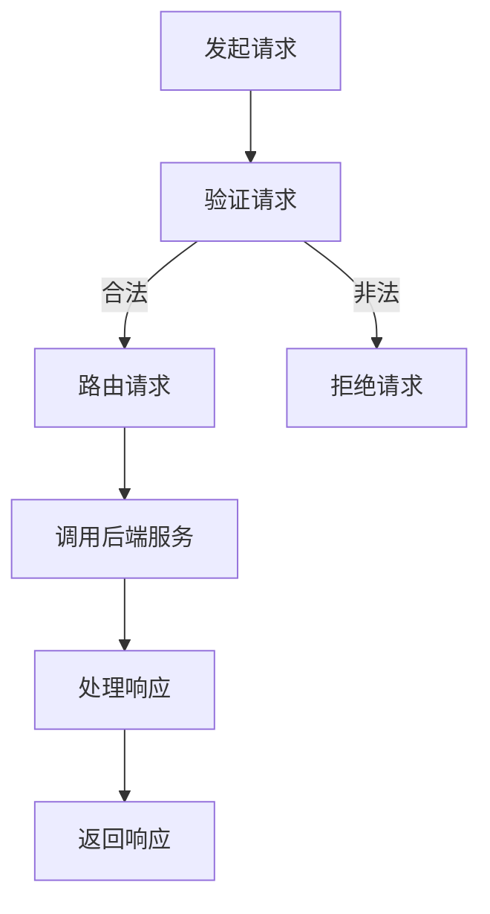
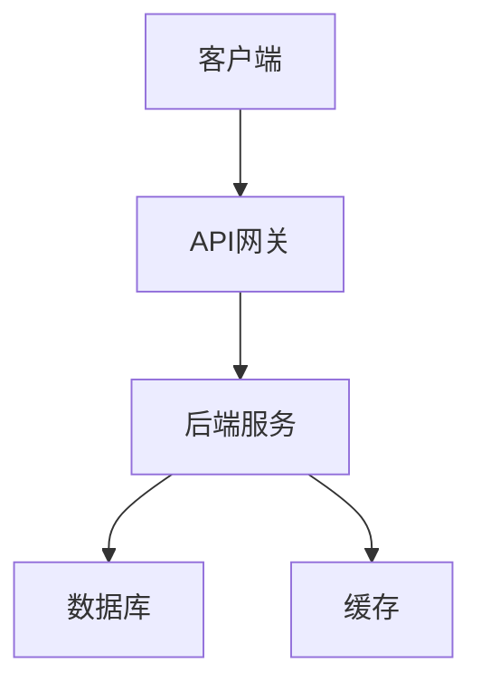
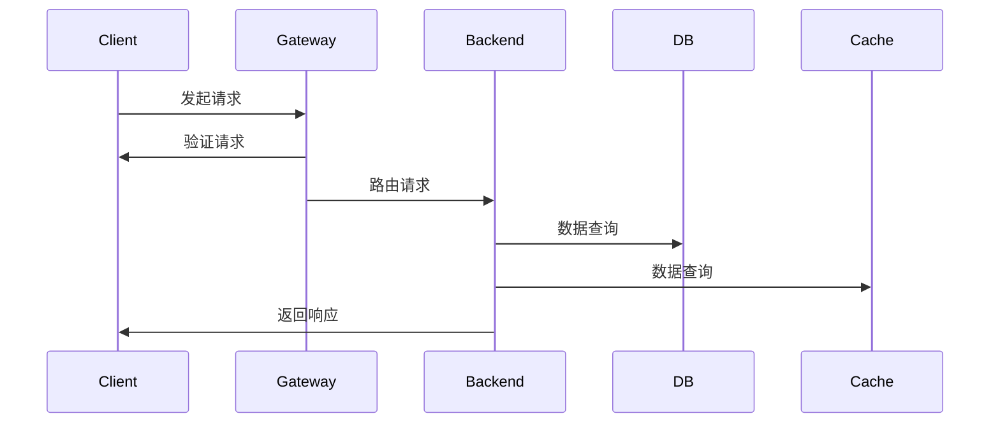

                 


# API网关在LLM应用架构中的角色与实现

## 关键词

- API网关
- LLM应用架构
- 系统设计
- 负载均衡
- 安全防护

## 摘要

本文将深入探讨API网关在大型语言模型（LLM）应用架构中的关键角色与实现细节。通过剖析API网关的定义、功能及其在LLM架构中的应用，本文旨在为开发者提供一套完整的系统设计与最佳实践指南。文章分为五个部分：背景介绍、核心概念与联系、算法原理讲解、系统分析与架构设计方案以及项目实战。最后，本文将总结最佳实践和展望未来发展趋势。

## 第一部分：背景介绍

### 1.1 问题背景

随着云计算和微服务架构的普及，应用程序对API服务的依赖性日益增加。大型语言模型（LLM）作为人工智能领域的核心技术，正逐渐在自然语言处理、智能推荐、自动化问答等领域发挥重要作用。然而，LLM应用架构的复杂性和性能需求给开发者带来了巨大挑战。在这种背景下，API网关作为一种重要的架构组件，成为解决这些问题的关键。

### 1.2 问题解决

API网关的主要作用是统一管理API服务，提供负载均衡、安全防护、路由控制等功能。通过引入API网关，开发者可以实现以下目标：

- **提高系统的可扩展性**：API网关可以根据流量动态分配负载，确保系统在高并发情况下稳定运行。
- **增强系统的安全性**：API网关可以实施访问控制、身份验证、数据加密等安全措施，保护系统免受攻击。
- **简化系统维护**：API网关可以统一管理所有API服务，降低系统复杂度，简化维护工作。

### 1.3 边界与外延

API网关不仅仅局限于LLM应用架构，它可以在各种类型的微服务架构中发挥作用。然而，在LLM应用中，API网关需要特别关注以下几个方面：

- **高并发处理**：LLM应用通常涉及大量文本数据处理，对API网关的并发处理能力有较高要求。
- **响应时间优化**：API网关的响应时间直接影响到LLM应用的性能，需要采取一系列优化措施。
- **安全防护**：由于LLM应用涉及敏感数据，API网关的安全防护措施必须足够强大，以防止数据泄露和攻击。

## 第二部分：核心概念与联系

### 2.1 API网关的核心概念

API网关是负责管理和代理API请求的组件。其主要功能包括路由、负载均衡、缓存、熔断、安全控制等。API网关位于客户端和后端服务之间，充当中间层，提供统一的服务接口。

### 2.2 API网关的属性特征对比表格

| 特性        | 说明                                                   | 对比项目 |
|-------------|--------------------------------------------------------|---------|
| 负载均衡    | 分摊请求到多个后端服务器，提高系统性能                 | 轮询、最小连接数、权重分配 |
| 安全控制    | 实施身份验证、授权、数据加密等安全措施                 | OAuth2、JWT、SSL/TLS |
| 路由控制    | 根据请求路径和参数转发请求到不同的后端服务             | REST、SOAP |
| 缓存        | 缓存API响应，减少后端服务压力                         | Redis、Memcached |
| 熔断保护    | 在后端服务异常时，自动切换到备用服务，防止系统崩溃     | Hystrix、Resilience4j |

### 2.3 API网关与LLM的ER实体关系图架构

```mermaid
erDiagram
  API网关 ||--|{ LLM应用 }|
  LLM应用 ||--|{ 后端服务 }|
  后端服务 ||--|{ 数据库 }|
```

## 第三部分：算法原理讲解

### 3.1 算法流程图



### 3.2 Python源代码

```python
import requests

def handle_request(url, params):
    response = requests.get(url, params=params)
    if response.status_code == 200:
        return response.json()
    else:
        return None

if __name__ == "__main__":
    url = "http://api.example.com/llm"
    params = {"query": "Hello World!"}
    result = handle_request(url, params)
    print(result)
```

### 3.3 数学模型和公式

假设API网关的负载为\(P\)，后端服务的处理能力为\(Q\)，则有：

$$
P \leq Q
$$

### 3.4 详细讲解和举例说明

**详细讲解**：

- **验证请求**：API网关首先会验证请求的合法性，如身份验证、参数校验等。
- **路由请求**：根据请求路径和参数，API网关将请求路由到相应的后端服务。
- **调用后端服务**：API网关向后端服务发送请求，并接收处理结果。
- **返回响应**：API网关将后端服务的响应返回给客户端。

**举例说明**：

假设有100个客户端同时请求LLM服务，API网关通过负载均衡将请求分配到10台后端服务器上。每台服务器处理能力为10Q，则总处理能力为100Q，足以应对100个请求。

## 第四部分：系统分析与架构设计方案

### 4.1 问题场景介绍

假设我们开发了一款基于LLM的智能问答应用，需要处理大量用户请求。为了确保系统的高可用性和高性能，我们引入了API网关作为核心组件。

### 4.2 项目介绍

项目名称：智能问答平台
项目背景：为用户提供24小时在线智能问答服务
项目目标：实现高性能、高可用、安全可靠的系统架构

### 4.3 系统功能设计

- **API网关**：负责统一管理和代理API请求，提供负载均衡、安全防护等功能。
- **后端服务**：包括LLM服务、数据库服务、缓存服务等，负责处理具体业务逻辑。
- **数据库**：存储用户提问和回答等数据。
- **缓存**：缓存热门问题和答案，提高响应速度。

### 4.4 系统架构设计



### 4.5 系统接口设计

- **API接口**：提供统一的API接口，支持GET和POST请求。
- **认证接口**：提供身份验证和授权接口，支持OAuth2和JWT等认证机制。
- **数据接口**：提供数据查询和操作接口，支持RESTful风格。

### 4.6 系统交互



## 第五部分：项目实战

### 5.1 环境安装

1. 安装Docker和Docker-Compose
2. 安装Nginx、Gunicorn等依赖
3. 克隆项目代码到本地

### 5.2 系统核心实现源代码

```python
# api_gateway.py
from flask import Flask, request, jsonify
from service import LLMService

app = Flask(__name__)
llm_service = LLMService()

@app.route('/question', methods=['GET'])
def question():
    query = request.args.get('query')
    response = llm_service.get_response(query)
    return jsonify(response)

if __name__ == '__main__':
    app.run()
```

### 5.3 代码应用解读与分析

1. **API网关实现**：使用Flask框架搭建API网关，处理用户请求。
2. **服务调用**：通过服务类LLMService实现具体业务逻辑。

### 5.4 实际案例分析和详细讲解剖析

假设用户请求：“什么是人工智能？”。

1. 用户发起请求，API网关接收到请求。
2. API网关验证请求，确保请求合法。
3. API网关路由请求到LLM服务。
4. LLM服务查询数据库，获取相关数据。
5. LLM服务生成回答，返回给API网关。
6. API网关将回答返回给用户。

### 5.5 项目小结

通过实际案例，我们可以看到API网关在LLM应用架构中的关键作用。它不仅提高了系统的可扩展性和安全性，还简化了系统维护工作。在开发过程中，我们需要关注API网关的负载均衡、路由策略、安全防护等功能，以确保系统的高性能和高可用性。

## 第六部分：最佳实践、小结、注意事项、拓展阅读

### 6.1 最佳实践

1. **负载均衡**：使用一致性哈希等方法，确保请求均匀分布到后端服务器。
2. **安全防护**：实施SSL/TLS加密、OAuth2认证等安全措施。
3. **监控与报警**：使用Prometheus、Grafana等工具监控API网关性能，及时发现问题。

### 6.2 小结

本文详细介绍了API网关在LLM应用架构中的角色与实现，包括核心概念、算法原理、系统设计与项目实战。通过最佳实践，开发者可以构建高效、安全、稳定的LLM应用架构。

### 6.3 注意事项

1. **性能优化**：合理设置缓存策略，减少后端服务压力。
2. **安全性**：定期更新安全策略，防范潜在风险。

### 6.4 拓展阅读

- 《API网关设计实践》
- 《大型语言模型：原理与应用》
- 《微服务架构实战》

## 第七部分：展望与未来

随着AI技术的不断发展，API网关在LLM应用架构中的重要性将日益凸显。未来，我们将看到更多创新性的API网关解决方案，如基于机器学习的路由策略、自动化安全防护等。开发者应紧跟技术发展趋势，不断提升自身能力，以应对日益复杂的系统架构挑战。

## 作者信息

作者：AI天才研究院/AI Genius Institute & 禅与计算机程序设计艺术 /Zen And The Art of Computer Programming

