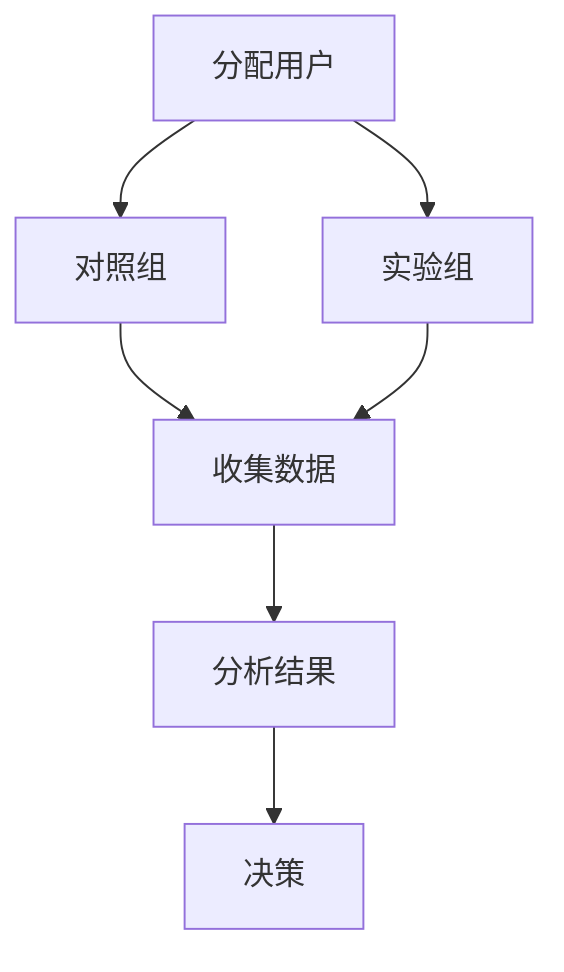

                 

# 《A/B测试集成：对比分析模型迭代效果》

## 关键词：A/B测试，模型迭代，对比分析，效果评估，系统集成

> 摘要：本文旨在深入探讨A/B测试在模型迭代效果评估中的应用，通过逐步分析A/B测试的原理、方法及其在各个阶段的实施策略，为读者提供一个全面的技术指南。文章将涵盖从背景介绍到实际案例解析，最后总结最佳实践和注意事项。

## 目录大纲

### 第一部分：A/B测试基础与原理

#### 第1章 A/B测试概述
#### 第2章 A/B测试核心概念

### 第二部分：算法原理与模型分析

#### 第3章 A/B测试算法原理
#### 第4章 数学模型与统计显著性

### 第三部分：A/B测试集成与实施

#### 第5章 A/B测试集成策略
#### 第6章 A/B测试实战案例

### 第四部分：最佳实践与拓展

#### 第7章 A/B测试最佳实践

### 附录

#### 附录A：A/B测试工具介绍
#### 附录B：LaTeX公式表示指南

## 第一部分：A/B测试基础与原理

### 第1章 A/B测试概述

#### 1.1 问题背景

在互联网时代，产品的快速迭代和优化成为企业成功的关键。然而，如何确保每一次更新都能提升用户体验，同时不影响整体产品的稳定性和性能，成为一个重要课题。A/B测试作为一种科学的方法，可以帮助我们在这个问题上找到答案。

#### 1.2 A/B测试的定义与作用

A/B测试，又称为拆箱测试，是一种将用户随机分配到两个或多个不同版本的流程或功能中，以比较其效果的方法。通过这种对比，我们可以找出哪个版本更能满足用户需求，从而指导产品的迭代方向。

#### 1.3 A/B测试与传统对比实验的差异

传统对比实验通常在受控环境下进行，而A/B测试则在实际用户中开展。这使得A/B测试能够更好地模拟真实环境，提高结果的可靠性。此外，A/B测试还可以实时监控用户行为，为我们提供更为详细的数据支持。

### 第2章 A/B测试核心概念

#### 2.1 A/B测试原理

A/B测试的基本原理是将用户随机分配到对照组（A组）和实验组（B组），然后比较两组用户在特定指标上的表现。通过统计分析，我们可以得出实验结果，从而做出决策。

#### 2.2 A/B测试的优缺点

A/B测试的优点在于其科学性和客观性，能够提供有力的数据支持。然而，其缺点也在于需要大量用户参与，且结果可能受到偶然因素的影响。

#### 2.3 A/B测试框架构建

构建一个有效的A/B测试框架需要考虑多个方面，包括目标设定、用户分组、指标选择和数据监控等。一个完善的框架有助于我们更好地实施A/B测试，提高结果的可靠性。

## 第二部分：算法原理与模型分析

### 第3章 A/B测试算法原理

#### 3.1 设置对照组与实验组

在A/B测试中，首先需要将用户随机分配到对照组和实验组。这个过程中，我们需要确保随机性，以避免任何偏差对结果的影响。

#### 3.2 实验结果评估

实验结果评估是A/B测试的关键环节。我们需要根据设定好的指标，比较对照组和实验组的表现。常见的评估方法包括t检验、置信区间和错误率等。

#### 3.3 Mermaid流程图绘制

为了更好地理解A/B测试的流程，我们可以使用Mermaid绘制流程图。以下是A/B测试的基本流程：



#### 3.4 Python代码实例解析

下面是一个简单的Python代码实例，用于实现A/B测试的基本流程：

```python
import random
import statistics

def ab_test(users, control_group_size, experiment_group_size):
    control_group = random.sample(users, control_group_size)
    experiment_group = random.sample(users, experiment_group_size)

    # 收集数据
    control_data = [evaluate_user(user) for user in control_group]
    experiment_data = [evaluate_user(user) for user in experiment_group]

    # 分析结果
    control_average = statistics.mean(control_data)
    experiment_average = statistics.mean(experiment_data)

    # 输出结果
    print(f"对照组平均评分：{control_average}")
    print(f"实验组平均评分：{experiment_average}")

def evaluate_user(user):
    # 模拟用户评分
    return random.uniform(1, 10)

# 测试
ab_test(users=[1, 2, 3, 4, 5, 6, 7, 8, 9, 10], control_group_size=5, experiment_group_size=5)
```

### 第4章 数学模型与统计显著性

#### 4.1 统计显著性检验

统计显著性检验是A/B测试中至关重要的一环。它可以帮助我们判断实验结果是否具有统计学意义。常见的检验方法包括t检验和卡方检验。

#### 4.2 置信区间计算

置信区间是另一个重要的概念。它可以帮助我们估计实验结果的可靠性。通常，我们使用95%的置信区间来判断实验结果的稳定性。

$$
\text{置信区间} = \bar{X} \pm z_{\alpha/2} \sqrt{\frac{\bar{X}^2}{n} + \frac{\sigma^2}{n}}
$$

其中，$\bar{X}$为样本均值，$z_{\alpha/2}$为标准正态分布的临界值，$n$为样本大小，$\sigma$为样本标准差。

#### 4.3 关键数学公式（LaTeX表示）

$$
\text{P-value} = \text{Pr}(|Z| > \frac{\bar{X} - \mu_0}{\sigma/\sqrt{n}})
$$

$$
\text{置信区间} = \bar{X} \pm z_{\alpha/2} \sqrt{\frac{\bar{X}^2}{n} + \frac{\sigma^2}{n}}
$$

## 第三部分：A/B测试集成与实施

### 第5章 A/B测试集成策略

#### 5.1 A/B测试系统架构设计

为了实现A/B测试，我们需要设计一个高效、可靠的系统架构。这包括数据采集、数据处理和分析展示等多个方面。

#### 5.2 系统接口设计

系统接口设计是A/B测试实施的关键。我们需要设计一组API，用于实现用户分配、数据采集和结果分析等功能。

#### 5.3 数据分析与报告生成

数据分析与报告生成是A/B测试的最后一步。我们需要根据实验结果，生成详细的报告，以帮助团队做出决策。

### 第6章 A/B测试实战案例

#### 6.1 实际案例背景

假设我们是一家电商公司，希望通过A/B测试来优化购物车的设计，以提高用户的购买意愿。

#### 6.2 环境安装与配置

在开始A/B测试之前，我们需要安装和配置相关工具和环境。例如，安装Python和pandas库，配置数据库等。

#### 6.3 核心代码实现

以下是A/B测试的核心代码实现：

```python
import random
import pandas as pd

# 模拟用户数据
users = pd.DataFrame({'user_id': range(1, 101), 'group': ['control'] * 50 + ['experiment'] * 50})

# 分配用户到对照组和实验组
random.shuffle(users['group'])

# 收集数据
control_data = users[users['group'] == 'control']['purchase']
experiment_data = users[users['group'] == 'experiment']['purchase']

# 分析结果
control_average = control_data.mean()
experiment_average = experiment_data.mean()

print(f"对照组平均购买意愿：{control_average}")
print(f"实验组平均购买意愿：{experiment_average}")
```

#### 6.4 代码应用解读与分析

在这段代码中，我们首先模拟了100个用户，并随机将他们分配到对照组和实验组。然后，我们收集了两组用户的购买意愿数据，并计算了它们的平均值。通过对比两组数据的平均值，我们可以得出实验结果。

#### 6.5 案例分析

通过分析实验结果，我们发现实验组的平均购买意愿显著高于对照组。这意味着我们的购物车设计优化是有效的。然而，为了确保结果的可靠性，我们还需要进行更深入的统计分析。

## 第四部分：最佳实践与拓展

### 第7章 A/B测试最佳实践

#### 7.1 实践技巧与注意事项

在实施A/B测试时，我们需要注意以下几点：

1. 确保实验设计合理，避免偏差。
2. 选择合适的指标，以便准确评估实验效果。
3. 考虑实验成本和风险，确保实验的可执行性。
4. 实验结果要及时反馈，以便快速调整。

#### 7.2 注意事项与风险提示

1. 避免过度依赖A/B测试，要结合其他方法进行综合评估。
2. 实验结果可能受到偶然因素的影响，需要多次实验验证。
3. 实验过程中要确保用户隐私和安全。

#### 7.3 拓展阅读推荐

1. 《实验设计：统计学在科学研究和数据分析中的应用》
2. 《数据分析：从入门到精通》
3. 《机器学习实战》

## 附录

### 附录A：A/B测试工具介绍

1. Google Optimize
2. VWO
3. Optimizely

### 附录B：LaTeX公式表示指南

1. 基本公式表示：$$1+1=2$$
2. 段内公式表示：$1<2$

## 结语

通过本文的深入探讨，我们了解了A/B测试在模型迭代效果评估中的应用。从原理到实践，再到最佳实践的总结，相信读者已经对A/B测试有了更为全面的认识。在未来的产品迭代过程中，希望A/B测试能够帮助您做出更为科学的决策。

### 作者：AI天才研究院/AI Genius Institute & 禅与计算机程序设计艺术 /Zen And The Art of Computer Programming

