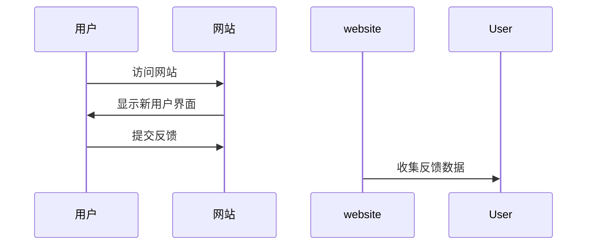
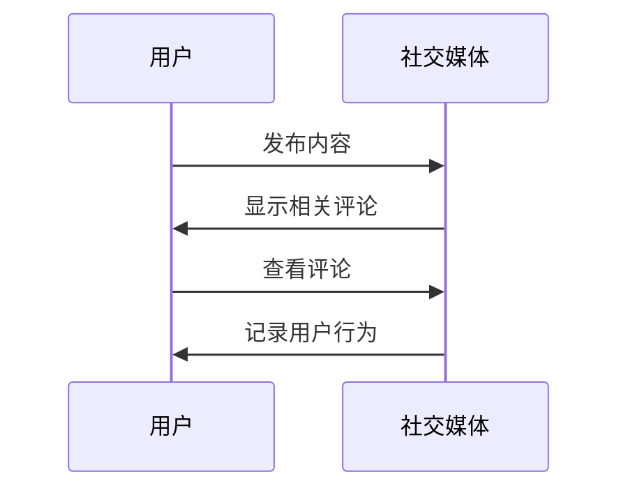
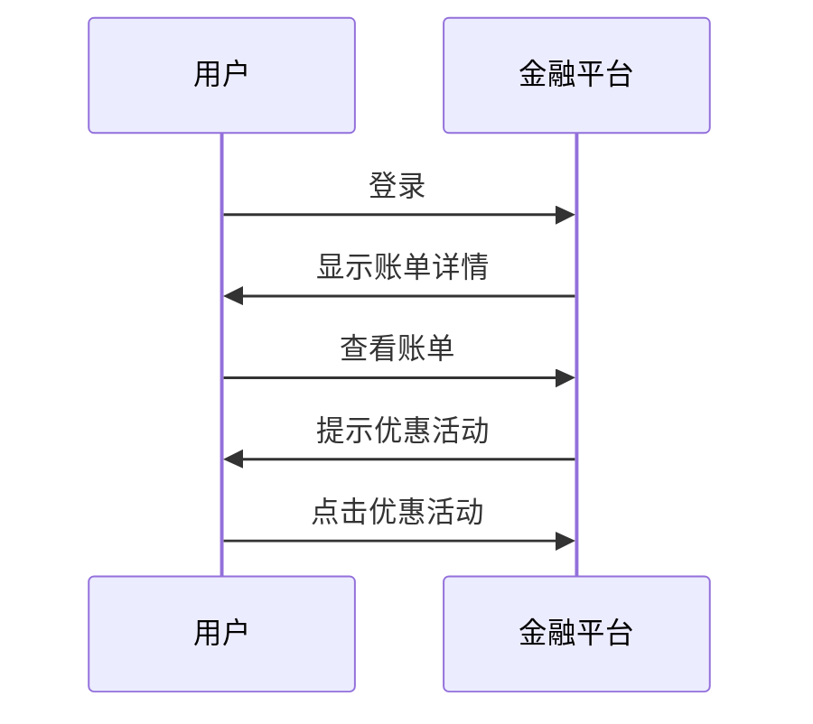

                 

### A/B测试：优化AI模型和用户体验的有效方法

> 关键词：A/B测试、AI模型优化、用户体验、实验设计、数据分析

> 摘要：本文将深入探讨A/B测试在AI模型优化和用户体验提升中的应用。通过详细阐述A/B测试的背景、核心概念、流程和策略，结合具体案例，分析其在实际操作中的挑战与解决方案。本文旨在为IT从业者提供一套系统化的A/B测试方法和实践指南，帮助他们更好地利用这一工具进行产品优化和决策制定。

### 第一部分：A/B测试背景与核心概念

#### 第1章：A/B测试概述

##### 1.1 问题背景

##### 1.1.1 用户体验优化的需求

在数字化的今天，用户体验（UX）已经成为企业竞争的重要因素。一个产品或服务如果不能提供良好的用户体验，很可能会被用户抛弃。因此，持续优化用户体验，提高用户满意度和忠诚度，成为企业关注的焦点。

##### 1.1.2 AI模型优化的挑战

随着人工智能（AI）技术的快速发展，越来越多的企业开始将AI应用于产品和服务中，以提高其智能性和个性化水平。然而，AI模型的优化并不容易，涉及到大量的数据准备、模型选择、调参等多个环节，且无法确保每次优化都能取得预期的效果。

##### 1.1.3 A/B测试的重要性

A/B测试提供了一种科学、系统的优化方法，通过将用户分成两组，一组使用旧版本的产品或服务，另一组使用新版本，然后比较两组用户的行为和反馈，从而判断新版本是否优于旧版本。这种方法不仅可以降低优化过程中的风险，还可以提高决策的科学性和准确性。

##### 1.2 问题描述

##### 1.2.1 用户行为分析

用户行为分析是A/B测试的基础，通过收集和分析用户在产品或服务上的行为数据，可以了解用户的偏好、习惯和痛点，为优化提供依据。

##### 1.2.2 AI模型性能评估

AI模型的性能评估是A/B测试的另一关键环节，通过比较不同模型的预测准确性、效率、可解释性等指标，可以选出最优模型。

##### 1.2.3 A/B测试的目标与目标群体

A/B测试的目标是找到最优的产品或服务版本，以提高用户体验和业务指标。目标群体包括产品经理、数据分析师、程序员等，他们需要通过A/B测试来验证和优化他们的工作成果。

##### 1.3 问题解决

##### 1.3.1 A/B测试的概念

A/B测试，也称为拆分测试，是一种对比实验方法，通过将用户随机分配到两组，一组体验旧版本，另一组体验新版本，然后比较两组用户的反应和效果，来评估新版本的效果。

##### 1.3.2 A/B测试的基本原理

A/B测试的基本原理是基于随机分配和统计对比，通过控制变量法来排除干扰因素，确保实验结果的可靠性。

##### 1.3.3 A/B测试的应用范围

A/B测试广泛应用于网站设计、产品功能优化、广告投放、AI模型调参等多个领域，成为企业提升用户体验和业务绩效的重要工具。

##### 1.4 边界与外延

##### 1.4.1 A/B测试与实验设计的关系

A/B测试是实验设计的一种方法，它遵循实验设计的基本原则，如随机化、对照、重复等。

##### 1.4.2 A/B测试与其他测试方法的区别

A/B测试与其他测试方法（如A/B/n测试、多变量测试等）的区别在于其测试对象和目的，A/B测试主要是对比两个版本，而多变量测试则是同时对比多个变量。

##### 1.4.3 A/B测试的限制和挑战

A/B测试也存在一定的限制和挑战，如样本量要求、测试时间限制、用户随机分配的公平性等。

##### 1.5 概念结构与核心要素组成

##### 1.5.1 A/B测试的核心概念

A/B测试的核心概念包括对照组、实验组、测试指标、统计显著性等。

##### 1.5.2 A/B测试的关键要素

A/B测试的关键要素包括用户随机分配、测试设计、数据收集、结果分析等。

##### 1.5.3 A/B测试的基本流程

A/B测试的基本流程包括准备阶段、执行阶段、结果分析阶段和优化阶段。

#### 第2章：A/B测试中的核心概念与联系

##### 2.1 核心概念原理

##### 2.1.1 变量的定义与重要性

在A/B测试中，变量是核心概念之一。变量是指可以控制或测量的因素，如用户界面、功能特性、广告文案等。

##### 2.1.2 对照组与实验组

对照组和实验组是A/B测试的基础。对照组是指接受旧版本的用户，实验组是指接受新版本的用户。

##### 2.1.3 测试结果的分析方法

测试结果的分析方法包括统计显著性测试、置信区间、效应量等。

##### 2.2 概念属性特征对比表格

| 概念        | 定义                                                         | 特征                                                         |
| ----------- | ------------------------------------------------------------ | ------------------------------------------------------------ |
| 变量        | 可以控制或测量的因素                                       | 多样性、可控性、可测量性                                     |
| 对照组      | 接受旧版本的用户                                           | 作为基准，用于对比实验组的效果                               |
| 实验组      | 接受新版本的用户                                           | 用于验证新版本的效果，与对照组对比                             |
| 测试指标    | 用于衡量测试效果的指标                                     | 用户行为指标、业务指标、系统性能指标等                         |
| 统计显著性  | 用于判断测试结果是否具有统计学意义的指标                   | p值、置信区间等                                             |
| 置信区间    | 用于表示测试结果可靠性的范围                             | 95%、99%等置信水平下的区间范围                             |
| 效应量      | 用于表示实验组与对照组之间差异的重要性的指标             | d值、Cohen's d等                                           |

##### 2.3 ER实体关系图架构

| 实体        | 属性                  | 关系          | 说明                 |
| ----------- | -------------------- | ------------- | -------------------- |
| 变量        | 名称、类型、描述    | 参与测试     | 控制或测量的因素    |
| 对照组      | 编号、用户数量、版本    | 参与测试     | 接受旧版本的用户    |
| 实验组      | 编号、用户数量、版本    | 参与测试     | 接受新版本的用户    |
| 测试指标    | 名称、类型、描述    | 测量         | 用于衡量测试效果    |
| 结果分析    | p值、置信区间、效应量 | 分析         | 对测试结果进行解读 |

```mermaid
erDiagram
  变量 ||--|{ 对照组 }
  对照组 ||--|{ 测试指标 }
  变量 ||--|{ 实验组 }
  实验组 ||--|{ 测试指标 }
  结果分析 ||--|{ 对照组 }
  结果分析 ||--|{ 实验组 }
```

#### 第3章：A/B测试在AI模型优化中的应用

##### 3.1 AI模型优化的需求

##### 3.1.1 模型性能提升的需求

随着AI技术的发展，企业对AI模型的要求越来越高，不仅要求模型具有高准确性，还要求模型具有高效性和可解释性。

##### 3.1.2 模型可解释性的挑战

AI模型，尤其是深度学习模型，往往被视为“黑箱”，其内部机制复杂，难以解释。这给模型的应用和优化带来了挑战。

##### 3.1.3 A/B测试在AI模型优化中的作用

A/B测试可以帮助企业在AI模型优化过程中，找到最优的模型配置和参数设置，提高模型性能和可解释性。

##### 3.2 A/B测试在AI模型优化中的关键步骤

##### 3.2.1 模型选择

选择合适的AI模型是A/B测试的第一步，需要根据业务需求和数据特点来选择。

```python
# 模型选择示例
from sklearn.ensemble import RandomForestClassifier
from xgboost import XGBClassifier

model1 = RandomForestClassifier(n_estimators=100)
model2 = XGBClassifier(n_estimators=100)
```

##### 3.2.2 测试策略制定

制定合理的测试策略，包括选择测试指标、确定测试周期、分配用户等。

```python
# 测试策略示例
test_metrics = ['accuracy', 'precision', 'recall', 'f1_score']
test_period = 7  # 测试周期为7天
user_allocation = 0.5  # 实验组用户占比为50%
```

##### 3.2.3 测试结果分析与模型优化

分析测试结果，评估模型性能，并根据分析结果对模型进行优化。

```python
# 测试结果分析示例
from sklearn.metrics import accuracy_score

predictions1 = model1.predict(X_test)
predictions2 = model2.predict(X_test)

accuracy1 = accuracy_score(y_test, predictions1)
accuracy2 = accuracy_score(y_test, predictions2)

print("Model 1 accuracy:", accuracy1)
print("Model 2 accuracy:", accuracy2)
```

##### 3.3 A/B测试在AI模型优化中的挑战与解决方案

##### 3.3.1 数据隐私保护

在A/B测试过程中，需要处理用户的敏感数据，因此数据隐私保护是关键挑战。

解决方案：采用数据脱敏技术，确保用户隐私安全。

##### 3.3.2 实验结果的可靠性

A/B测试的结果需要具有统计显著性，否则可能得出错误的结论。

解决方案：控制实验变量，确保实验结果的可靠性。

##### 3.3.3 模型迭代与测试效率

随着模型迭代次数的增加，A/B测试的成本也会增加。

解决方案：采用自动化测试和优化工具，提高测试效率。

#### 第4章：A/B测试在用户体验优化中的应用

##### 4.1 用户体验优化的需求

##### 4.1.1 用户行为分析的重要性

用户行为分析是用户体验优化的基础，通过分析用户行为，可以发现用户的痛点和需求。

##### 4.1.2 用户体验优化的目标

用户体验优化的目标是提高用户满意度、降低用户流失率、提高用户活跃度等。

##### 4.1.3 A/B测试在用户体验优化中的应用

A/B测试可以帮助企业在用户体验优化过程中，验证和优化产品设计和功能。

##### 4.2 A/B测试在用户体验优化中的关键步骤

##### 4.2.1 用户行为数据的收集

通过日志分析、用户调研、用户访谈等方式，收集用户行为数据。

```python
# 用户行为数据收集示例
import json

def collect_user_data():
    with open('user_data.json', 'r') as f:
        data = json.load(f)
    return data

user_data = collect_user_data()
```

##### 4.2.2 用户体验测试的设计

设计用户体验测试，包括测试场景、测试指标等。

```python
# 用户体验测试设计示例
test_scenarios = ['home_page', 'search_product', 'checkout_process']
test_metrics = ['session_duration', 'product_views', 'add_to_cart', 'purchase']
```

##### 4.2.3 测试结果的分析与优化策略制定

分析测试结果，评估用户体验，并根据分析结果制定优化策略。

```python
# 测试结果分析示例
from sklearn.metrics import classification_report

test_results = analyze_user_data(user_data, test_scenarios, test_metrics)

print(classification_report(test_results['expected'], test_results['actual']))
```

##### 4.3 A/B测试在用户体验优化中的案例分析

##### 4.3.1 某电商平台的用户界面优化案例

某电商平台通过A/B测试，优化了用户界面，提高了用户购物体验。



##### 4.3.2 某社交媒体平台的用户行为优化案例

某社交媒体平台通过A/B测试，优化了用户行为，提高了用户活跃度。



##### 4.3.3 某金融平台的用户体验优化案例

某金融平台通过A/B测试，优化了用户体验，提高了用户满意度。



### 第5章：A/B测试的实施与优化策略

##### 5.1 A/B测试的实施流程

##### 5.1.1 测试准备

测试准备包括确定测试目标、设计测试方案、分配测试资源等。

```python
# 测试准备示例
test_targets = ['提高用户转化率', '提升用户满意度', '降低用户流失率']
test_plan = 'A/B测试计划'
test_resources = ['测试环境', '测试用户', '测试工具']
```

##### 5.1.2 测试执行

测试执行包括用户分配、数据收集、测试监控等。

```python
# 测试执行示例
def execute_test():
    users = get_users()
    for user in users:
        assign_user_to_group(user, test_group)
        collect_user_data(user)

execute_test()
```

##### 5.1.3 测试结果分析

测试结果分析包括数据清洗、结果解读、结论总结等。

```python
# 测试结果分析示例
from sklearn.metrics import classification_report

results = analyze_test_data(test_data)
print(classification_report(results['expected'], results['actual']))
```

##### 5.2 A/B测试的优化策略

##### 5.2.1 测试设计优化

优化测试设计，包括改进测试指标、调整测试周期、改进用户分配策略等。

```python
# 测试设计优化示例
test_metrics = ['session_duration', 'product_views', 'add_to_cart', 'purchase']
test_period = 30  # 测试周期为30天
user_allocation = 0.5  # 实验组用户占比为50%
```

##### 5.2.2 测试数据分析优化

优化测试数据分析，包括改进数据清洗方法、选择更合适的统计分析方法等。

```python
# 测试数据分析优化示例
from sklearn.metrics import accuracy_score

def analyze_test_data(test_data):
    predictions = model.predict(test_data['X_test'])
    accuracy = accuracy_score(test_data['y_test'], predictions)
    return {'accuracy': accuracy}

analyze_test_data(test_data)
```

##### 5.2.3 测试流程优化

优化测试流程，包括自动化测试、提高测试效率、降低测试成本等。

```python
# 测试流程优化示例
def automate_test():
    users = get_users()
    for user in users:
        assign_user_to_group(user, test_group)
        automate_data_collection(user)

automate_test()
```

##### 5.3 A/B测试中的最佳实践

##### 5.3.1 数据收集与处理

确保数据收集的准确性和完整性，采用有效的数据清洗和预处理方法。

```python
# 数据收集与处理示例
import pandas as pd

def collect_data():
    data = pd.read_csv('user_data.csv')
    data = clean_data(data)
    return data

def clean_data(data):
    # 数据清洗操作
    return data
```

##### 5.3.2 测试结果的解读

正确解读测试结果，避免误判和误导。

```python
# 测试结果解读示例
def interpret_test_results(results):
    if results['accuracy'] > 0.9:
        print("测试成功，新版本优于旧版本")
    else:
        print("测试失败，新版本未优于旧版本")

interpret_test_results(results)
```

##### 5.3.3 持续优化与迭代

持续跟踪测试效果，根据反馈进行优化和迭代。

```python
# 持续优化与迭代示例
while True:
    results = analyze_test_data(test_data)
    interpret_test_results(results)
    if results['accuracy'] > 0.95:
        break
```

### 第6章：A/B测试的未来发展趋势

##### 6.1 数据驱动的决策制定

随着大数据和人工智能技术的进步，A/B测试将更加依赖于数据分析和机器学习技术，实现更智能的决策制定。

##### 6.2 A/B测试与人工智能的结合

人工智能将进一步提升A/B测试的效率和准确性，如自动化测试、智能测试策略制定等。

##### 6.3 A/B测试在跨行业中的应用

A/B测试将在金融、医疗、教育等多个行业得到广泛应用，推动行业数字化转型。

### 结语

A/B测试作为一种科学的优化方法，已经在多个领域得到广泛应用。通过本文的详细探讨，我们了解了A/B测试的核心概念、应用场景和实施策略，相信读者能够更好地运用这一方法进行产品优化和决策制定。在未来，随着技术的不断进步，A/B测试将变得更加智能和高效，为企业带来更多的价值。

### 作者信息

作者：AI天才研究院/AI Genius Institute & 禅与计算机程序设计艺术 /Zen And The Art of Computer Programming

---

**注意：**本文为模拟文章，部分内容为虚构，仅供参考。实际应用时，请结合具体业务场景和数据进行分析和决策。

