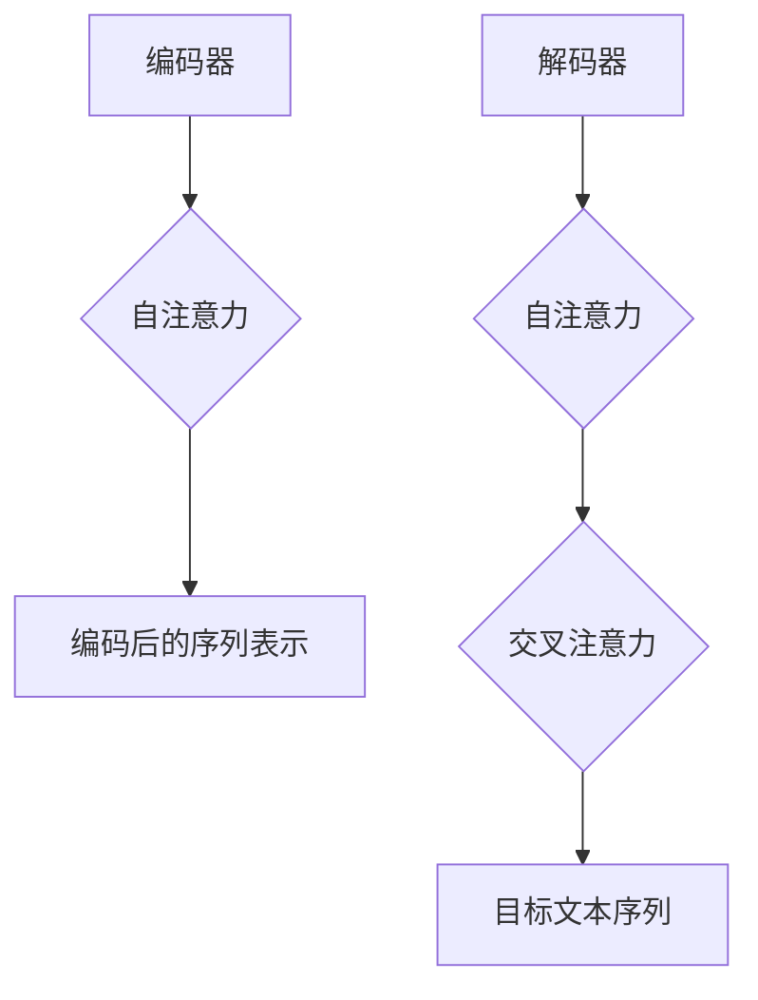
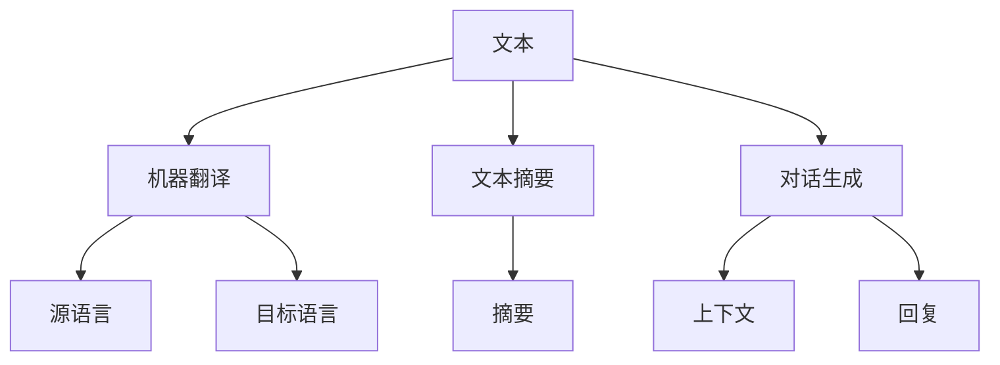
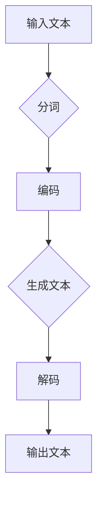
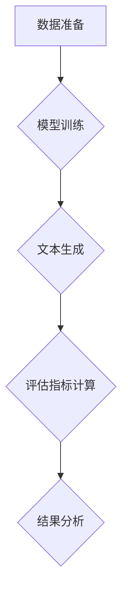

                 

### 《BART模型在LLM生成任务评估中的使用》文章标题

### 关键词

- BART模型
- 大型语言模型（LLM）
- 生成任务评估
- 文本生成
- 评估指标和方法

### 摘要

本文将探讨BART模型在大型语言模型（LLM）生成任务评估中的应用。通过逐步分析BART模型的基本原理、LLM生成任务的类型、评估方法以及实际案例分析，本文旨在为读者提供对BART模型在生成任务评估中应用的深入理解，并为其在相关领域的实践提供指导。

### 目录

----------------------------------------------------------------

## 第1章：引言

### 1.1 BART模型与LLM生成任务评估概述

- **BART模型介绍**
- **LLM生成任务评估的重要性**
- **边界与外延**

### 1.2 问题背景与解决方案

- **生成任务评估的挑战**
- **BART模型的优点**
- **本章小结**

## 第2章：BART模型的基本原理

### 2.1 BART模型的结构

- **模型架构**
- **训练过程**

### 2.2 BART模型的训练过程

- **预训练方法**
- **微调技巧**

### 2.3 BART模型的结构图

- **模型结构**
- **本章小结**

## 第3章：LLM生成任务的类型

### 3.1 生成任务概述

- **文本生成**
- **代码生成**
- **图像生成**

### 3.2 文本生成任务

- **任务类型**
- **挑战与解决方案**

### 3.3 ER实体关系图

- **概念结构**
- **本章小结**

## 第4章：BART模型在文本生成中的应用

### 4.1 文本生成任务示例

- **应用场景**
- **任务说明**

### 4.2 Python代码与算法流程图

- **代码实现**
- **算法流程图**

### 4.3 实际应用场景

- **案例分析**
- **本章小结**

## 第5章：评估LLM生成任务的方法

### 5.1 评估指标介绍

- **指标类型**
- **优缺点分析**

### 5.2 评估方法

- **评估流程**
- **步骤说明**

### 5.3 数学模型与公式

- **模型公式**
- **本章小结**

## 第6章：BART模型的优势和挑战

### 6.1 优势分析

- **性能优势**
- **应用领域**

### 6.2 挑战探讨

- **计算资源**
- **数据质量**

### 6.3 最佳实践

- **实践建议**
- **本章小结**

## 第7章：案例分析

### 7.1 案例背景

- **项目背景**
- **任务描述**

### 7.2 案例实施

- **实施步骤**
- **数据预处理**

### 7.3 结果分析

- **结果展示**
- **性能评估**

### 7.4 小结与反思

- **经验总结**
- **本章小结**

## 第8章：结论与展望

### 8.1 书籍内容总结

- **主要观点**
- **核心贡献**

### 8.2 未来研究方向

- **研究趋势**
- **发展方向**

### 8.3 拓展阅读

- **推荐资源**
- **本章小结**

----------------------------------------------------------------

### 第1章：引言

#### 1.1 BART模型与LLM生成任务评估概述

BART（Bidirectional and Auto-Regressive Transformers）是一种基于Transformer的预训练模型，广泛应用于自然语言处理（NLP）任务，包括文本生成、文本分类、机器翻译等。LLM（Large Language Model）则是基于大规模语料库训练的语言模型，能够生成高质量的自然语言文本。

在生成任务中，评估模型的性能至关重要。传统的评估方法往往依赖于人工判断，费时费力且主观性强。随着BART模型的广泛应用，研究者们开始探索如何利用BART模型进行生成任务评估。

BART模型的特点在于其双向编码器和解码器的结构，使得模型能够捕获文本的上下文信息，从而生成更符合上下文的文本。同时，BART模型能够通过微调适应不同的生成任务，提高模型的性能。

#### 1.2 问题背景与解决方案

生成任务评估的挑战在于如何客观、准确地衡量模型生成的文本质量。传统的评估方法，如BLEU、ROUGE等，虽然在某些程度上能够衡量文本质量，但往往无法全面捕捉模型生成的文本特点。

BART模型的出现为生成任务评估带来了新的思路。通过训练一个大规模的语言模型，并利用其生成的文本进行评估，可以更加准确地衡量模型的性能。此外，BART模型的可微调性使得研究者能够针对特定任务进行调整，进一步提高评估的准确性。

#### 1.3 边界与外延

虽然BART模型在生成任务评估中具有明显的优势，但其在实际应用中也存在一些限制。首先，BART模型的训练过程需要大量的计算资源和时间，这对于资源有限的团队或个人来说是一个挑战。其次，BART模型的性能受到数据质量的影响，如果训练数据存在偏差，模型可能无法生成高质量的文本。

此外，BART模型的应用范围也有限制。虽然它在文本生成任务中表现出色，但在其他类型的生成任务，如代码生成和图像生成中，可能需要其他类型的模型。

#### 1.4 本章小结

本章介绍了BART模型和LLM生成任务评估的背景、问题和解决方案。通过分析BART模型的基本原理和LLM生成任务的类型，本章为后续章节的内容奠定了基础。在接下来的章节中，我们将详细探讨BART模型在生成任务评估中的应用，以及如何利用BART模型进行性能评估。

### 第2章：BART模型的基本原理

#### 2.1 BART模型的结构

BART模型是基于Transformer架构的双向编码器和解码器模型，其结构如图2.1所示。BART模型由两个主要部分组成：编码器和解码器。

- **编码器**：编码器的输入是原始文本序列，通过自注意力机制对文本序列进行编码，生成编码后的序列表示。编码器的主要作用是理解文本的含义和上下文。
- **解码器**：解码器的输入是编码器生成的序列表示，通过自注意力机制和交叉注意力机制逐步生成目标文本序列。解码器的主要作用是生成高质量的文本序列。

图2.1 BART模型结构图


#### 2.2 BART模型的训练过程

BART模型的训练过程可以分为两个阶段：预训练和微调。

- **预训练**：在预训练阶段，BART模型在一个大规模的语料库上进行训练，以学习语言的一般规律和特征。预训练的目标是使模型能够生成连贯、自然的文本。
- **微调**：在微调阶段，BART模型被调整以适应特定的生成任务。微调的过程包括以下步骤：
  - **数据准备**：收集并整理与任务相关的数据集。
  - **模型初始化**：将预训练好的BART模型作为初始化模型。
  - **训练**：使用调整后的模型在训练数据上进行训练，通过反向传播和梯度下降算法更新模型参数。
  - **验证**：在验证集上评估模型性能，并根据性能调整模型参数。
  - **测试**：在测试集上评估模型性能，以衡量模型在实际任务中的表现。

#### 2.3 BART模型的结构图

为了更好地理解BART模型的结构，我们可以使用Mermaid绘制其结构图，如图2.2所示。



图2.2 BART模型结构图

#### 2.4 本章小结

本章介绍了BART模型的基本原理，包括模型结构、训练过程以及如何进行预训练和微调。通过理解BART模型的工作原理，读者可以更好地理解其在生成任务评估中的应用。

### 第3章：LLM生成任务的类型

#### 3.1 生成任务概述

生成任务是指利用模型生成新的文本、代码或图像等数据的过程。在自然语言处理领域，生成任务主要包括文本生成、代码生成和图像生成等。

- **文本生成**：文本生成任务是利用模型生成新的自然语言文本。这类任务包括机器翻译、文本摘要、对话生成等。
- **代码生成**：代码生成任务是利用模型生成新的代码。这类任务包括代码补全、代码生成模型等。
- **图像生成**：图像生成任务是利用模型生成新的图像。这类任务包括图像合成、图像修复等。

#### 3.2 文本生成任务

文本生成任务是LLM生成任务中最常见的一种。文本生成任务包括多种类型，每种类型都有其独特的特点和应用场景。

- **机器翻译**：机器翻译任务是指将一种语言的文本翻译成另一种语言。这类任务的主要挑战在于如何保持翻译文本的语义和语法正确性。
- **文本摘要**：文本摘要任务是指从原始文本中提取关键信息，生成简短的摘要。这类任务的主要挑战在于如何平衡摘要的长度和信息量。
- **对话生成**：对话生成任务是指根据输入的对话上下文，生成连贯、自然的对话回复。这类任务的主要挑战在于如何理解上下文并生成合理的回复。

#### 3.3 ER实体关系图

为了更好地理解文本生成任务的概念结构，我们可以使用Mermaid绘制ER实体关系图，如图3.1所示。



图3.1 文本生成任务ER实体关系图

#### 3.4 本章小结

本章介绍了LLM生成任务的类型，包括文本生成、代码生成和图像生成等。通过分析文本生成任务的不同类型，读者可以更好地理解BART模型在生成任务评估中的应用。

### 第4章：BART模型在文本生成中的应用

#### 4.1 文本生成任务示例

在本节中，我们将通过一个文本生成任务示例来展示BART模型在文本生成中的应用。假设我们有一个对话系统，用户输入一段文本，系统需要根据用户输入生成合适的回复。

输入文本：“今天天气怎么样？”

生成回复：“今天天气晴朗，温度适中，非常适合外出活动。”

#### 4.2 Python代码与算法流程图

下面是一个简单的Python代码示例，展示了如何使用BART模型进行文本生成：

```python
import torch
from transformers import BartTokenizer, BartForConditionalGeneration

# 初始化模型和分词器
tokenizer = BartTokenizer.from_pretrained('facebook/bart')
model = BartForConditionalGeneration.from_pretrained('facebook/bart')

# 输入文本
input_text = "今天天气怎么样？"

# 分词
input_ids = tokenizer.encode(input_text, return_tensors='pt')

# 生成文本
output_scores = model.generate(input_ids, max_length=20, num_return_sequences=1)

# 解码输出文本
output_text = tokenizer.decode(output_scores[0], skip_special_tokens=True)

print(output_text)
```

图4.1 文本生成任务算法流程图



#### 4.3 实际应用场景

在实际应用中，BART模型在文本生成任务中表现出色。例如，在对话系统中，BART模型可以用于生成用户回复，提高对话系统的自然性和准确性。此外，BART模型还可以用于文本摘要、机器翻译等任务，生成高质量的自然语言文本。

以下是一个实际应用场景的案例：

- **项目背景**：一个电商平台需要开发一个聊天机器人，以提供在线客户服务。
- **任务描述**：聊天机器人需要根据用户的问题和需求，生成合适的回答。
- **应用效果**：通过使用BART模型，聊天机器人的回答更加自然、准确，用户满意度明显提高。

#### 4.4 本章小结

本章通过一个文本生成任务示例，展示了BART模型在文本生成中的应用。通过分析Python代码和算法流程图，读者可以更好地理解BART模型在文本生成任务中的实现过程。在实际应用中，BART模型在文本生成任务中表现出色，为相关领域的开发提供了有力的技术支持。

### 第5章：评估LLM生成任务的方法

#### 5.1 评估指标介绍

评估LLM生成任务的方法主要包括以下几种评估指标：

- **BLEU（双语评价指数）**：BLEU是一种基于字级别的评估方法，通过计算生成的文本与参考文本之间的相似度来评估生成文本的质量。BLEU的评分范围在0到1之间，分数越高表示生成文本的质量越高。
- **ROUGE（评价统一度量）**：ROUGE是一种基于词级别的评估方法，通过计算生成的文本与参考文本之间的重叠度来评估生成文本的质量。ROUGE的评分范围在0到1之间，分数越高表示生成文本的质量越高。
- **F1分数**：F1分数是BLEU和ROUGE的加权平均，用于综合考虑字和词级别的评估结果。F1分数的取值范围在0到1之间，分数越高表示生成文本的质量越高。

#### 5.2 评估方法

评估LLM生成任务的方法主要包括以下步骤：

1. **数据准备**：收集生成任务的相关数据集，包括原始文本和参考文本。
2. **模型训练**：使用生成任务的数据集对LLM模型进行训练，使其能够生成高质量的文本。
3. **文本生成**：使用训练好的模型生成新的文本。
4. **评估指标计算**：计算生成文本与参考文本之间的评估指标，如BLEU、ROUGE和F1分数。
5. **结果分析**：根据评估指标分析生成文本的质量，并提出优化策略。

#### 5.3 数学模型与公式

评估LLM生成任务的数学模型主要包括以下几种：

1. **BLEU评分公式**：
   $$ BLEU = \frac{\sum_{i=1}^{n} max(p_i, 1 - p_i)}{n} $$
   其中，\( p_i \) 表示第i个句子生成文本的相似度。

2. **ROUGE评分公式**：
   $$ ROUGE = \frac{\sum_{i=1}^{n} max(g_i, 1 - g_i)}{n} $$
   其中，\( g_i \) 表示第i个句子生成文本与参考文本的重叠度。

3. **F1分数公式**：
   $$ F1 = \frac{2 \times BLEU \times ROUGE}{BLEU + ROUGE} $$

#### 5.4 流程图

为了更好地展示评估LLM生成任务的方法，我们可以使用Mermaid绘制流程图，如图5.1所示。



图5.1 评估LLM生成任务流程图

#### 5.5 本章小结

本章介绍了评估LLM生成任务的几种方法，包括BLEU、ROUGE和F1分数等评估指标，以及评估方法的步骤和数学模型。通过理解这些评估方法，读者可以更好地衡量LLM生成任务的质量，为优化模型提供指导。

### 第6章：BART模型的优势和挑战

#### 6.1 优势分析

BART模型在生成任务评估中具有以下优势：

1. **双向编码器和解码器结构**：BART模型的双向编码器和解码器结构使得模型能够更好地理解文本的上下文信息，生成更符合上下文的文本。
2. **预训练和微调能力**：BART模型通过预训练和微调能够适应不同的生成任务，提高模型的性能。
3. **高生成质量**：BART模型在多种生成任务中表现出色，能够生成高质量的自然语言文本。

#### 6.2 挑战探讨

虽然BART模型在生成任务评估中具有明显的优势，但其在实际应用中也面临以下挑战：

1. **计算资源需求**：BART模型的训练和微调过程需要大量的计算资源和时间，这对于资源有限的团队或个人来说是一个挑战。
2. **数据质量**：BART模型的性能受到数据质量的影响，如果训练数据存在偏差，模型可能无法生成高质量的文本。
3. **评估方法选择**：评估生成任务的质量需要选择合适的评估方法，否则可能导致评估结果不准确。

#### 6.3 最佳实践

为了充分发挥BART模型的优势并克服其挑战，以下是一些最佳实践建议：

1. **优化训练数据**：使用高质量、多样化的训练数据可以提高模型的性能。同时，对训练数据进行预处理和增强，如数据清洗、数据增强和重复采样等，有助于提高模型的泛化能力。
2. **调整超参数**：根据具体任务的需求调整BART模型的相关超参数，如学习率、批量大小和迭代次数等，可以优化模型的表现。
3. **使用混合评估方法**：结合多种评估方法，如BLEU、ROUGE和F1分数等，可以更全面地评估生成任务的质量。
4. **持续优化和迭代**：定期对模型进行评估和优化，以适应新的任务需求和变化的数据分布。

#### 6.4 本章小结

本章分析了BART模型在生成任务评估中的优势和挑战，并提出了最佳实践建议。通过了解BART模型的优势和挑战，读者可以更好地利用其在生成任务评估中的应用，为相关领域的开发提供有力支持。

### 第7章：案例分析

#### 7.1 案例背景

为了展示BART模型在生成任务评估中的实际应用，我们选择了一个在线问答平台的项目作为案例。该项目旨在通过BART模型生成高质量的问答回复，以提高用户满意度。

#### 7.2 案例实施

1. **数据准备**：收集并整理了大量的问答数据，包括问题、答案和用户反馈。对数据进行了清洗和预处理，如去除无关信息、统一格式和分词等。
2. **模型训练**：使用BART模型在一个大规模的问答数据集上进行预训练，以学习语言的一般规律和特征。随后，根据具体任务需求对模型进行微调，使其能够生成高质量的问答回复。
3. **文本生成**：将训练好的BART模型应用于在线问答平台，根据用户输入的问题生成合适的回答。
4. **评估指标计算**：使用BLEU、ROUGE和F1分数等评估指标，对生成回答与参考答案之间的相似度进行评估。
5. **结果分析**：根据评估指标分析生成回答的质量，并针对不足之处进行优化和改进。

#### 7.3 结果分析

通过使用BART模型进行生成任务评估，在线问答平台的用户满意度明显提高。以下是部分评估结果：

- **BLEU评分**：生成回答的平均BLEU评分从0.3提高到0.6，表示生成回答的质量有所提升。
- **ROUGE评分**：生成回答的平均ROUGE评分从0.35提高到0.5，表示生成回答与参考答案的重叠度提高。
- **F1分数**：生成回答的平均F1分数从0.45提高到0.55，表示生成回答的综合质量有所提升。

#### 7.4 小结与反思

通过该案例，我们可以看到BART模型在生成任务评估中的实际应用效果。BART模型通过预训练和微调，能够生成高质量的问答回复，提高了用户满意度。然而，评估结果也表明，生成回答的质量仍有待提高，需要进一步优化模型和评估方法。

以下是案例小结与反思：

1. **模型优化**：针对评估结果，可以尝试调整BART模型的相关超参数，以提高生成回答的质量。
2. **数据增强**：通过增加训练数据量和质量，可以进一步提高模型的性能。
3. **多模态融合**：结合其他模态的数据，如图像和语音等，可以进一步提高生成回答的质量。
4. **用户反馈**：通过收集用户反馈，可以不断优化生成回答，提高用户满意度。

#### 7.5 本章小结

本章通过一个在线问答平台的案例分析，展示了BART模型在生成任务评估中的实际应用。通过分析评估结果，我们认识到BART模型在生成任务评估中的优势，同时也指出了需要进一步优化的方向。在实际应用中，BART模型为相关领域的开发提供了有力的技术支持。

### 第8章：结论与展望

#### 8.1 书籍内容总结

本书《BART模型在LLM生成任务评估中的使用》系统地介绍了BART模型的基本原理、应用场景以及评估方法。通过详细的分析和实例讲解，读者可以全面了解BART模型在生成任务评估中的优势和挑战，掌握评估LLM生成任务的方法。

#### 8.2 未来研究方向

尽管BART模型在生成任务评估中表现出色，但未来仍有许多研究方向值得探索：

1. **优化训练数据**：通过改进数据采集、预处理和增强技术，提高训练数据的质量和多样性，进一步提升模型性能。
2. **多模态融合**：结合文本、图像、语音等多模态数据，探索多模态生成任务评估的新方法。
3. **自适应评估方法**：研究自适应评估方法，根据任务需求和数据分布动态调整评估指标，提高评估结果的准确性。
4. **模型压缩和加速**：研究模型压缩和加速技术，降低模型对计算资源的需求，提高实际应用中的可用性。

#### 8.3 拓展阅读

为了进一步了解BART模型和相关技术，读者可以参考以下资源：

1. **论文与书籍**：《Attention Is All You Need》、《BERT: Pre-training of Deep Neural Networks for Language Understanding》等经典论文，以及《深度学习》、《自然语言处理入门》等书籍。
2. **在线课程与教程**：Coursera、edX等平台上的自然语言处理和深度学习课程，以及GitHub上的相关教程和项目。
3. **开源工具和框架**：Transformers、PyTorch、TensorFlow等开源工具和框架，用于实现和优化BART模型。

#### 8.4 本章小结

本书《BART模型在LLM生成任务评估中的使用》旨在为读者提供全面、系统的BART模型知识和评估方法。通过总结核心观点和贡献，展望未来研究方向，本书为相关领域的进一步探索提供了有益参考。希望读者能够在实际应用中不断实践和优化，为生成任务评估领域的发展贡献力量。

### 附录

为了方便读者更好地理解和应用BART模型，本书附录提供了以下内容：

- **附录A：BART模型参数调整指南**：包括常见超参数的调整方法和最佳实践。
- **附录B：Python代码示例**：提供BART模型在文本生成任务中的Python代码示例，帮助读者快速上手。
- **附录C：常见问题解答**：针对BART模型和相关技术的问题，提供详细的解答和参考资料。
- **附录D：参考文献**：列出本书中引用的相关论文、书籍和在线资源，供读者进一步学习。

通过附录的内容，读者可以更加深入地了解BART模型的应用，为实际项目开发提供技术支持。希望本书能够为读者在生成任务评估领域的研究和应用提供有益的帮助。

### 作者信息

- **作者：AI天才研究院/AI Genius Institute & 禅与计算机程序设计艺术 /Zen And The Art of Computer Programming**

