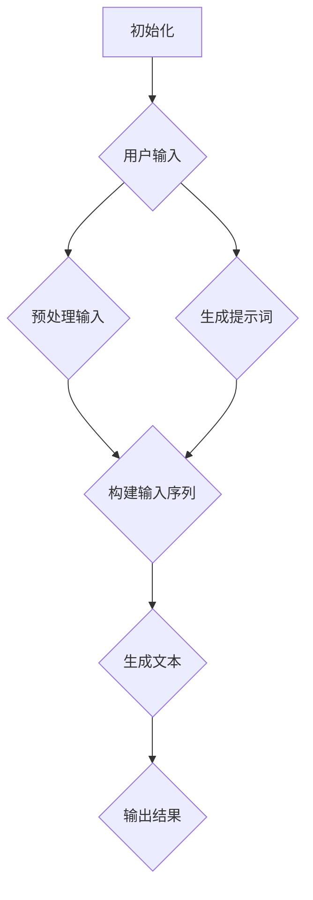
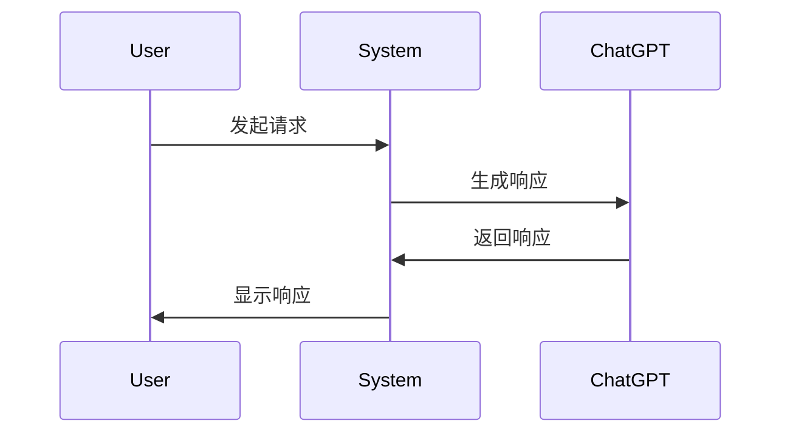
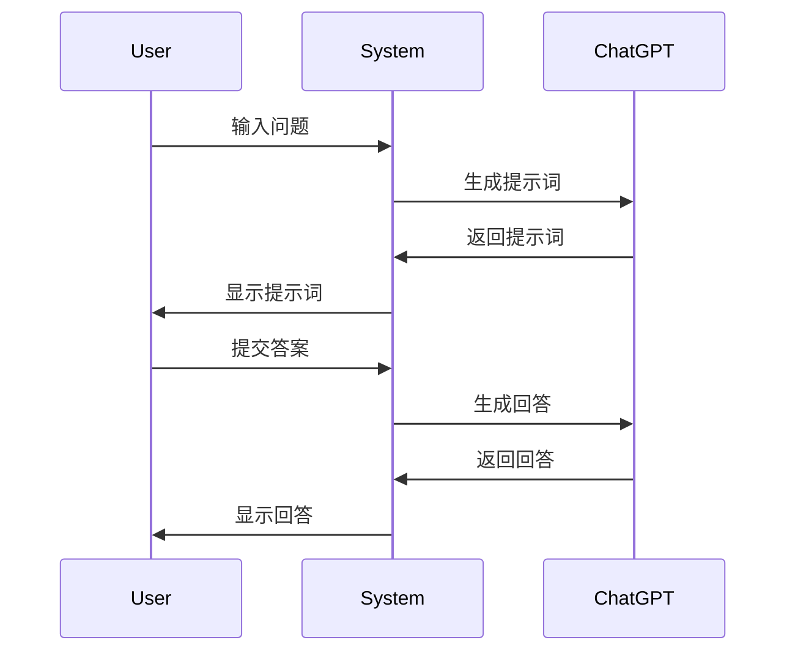

                 

# ChatGPT个性化交互的提示词技巧

## 关键词

- **ChatGPT**
- **个性化交互**
- **提示词技巧**
- **语言模型**
- **对话系统**
- **用户体验**

## 摘要

本文将探讨ChatGPT个性化交互的提示词技巧。通过深入分析ChatGPT的工作原理、个性化交互的需求，以及提示词在交互中的作用，本文将提供一系列实用的提示词编写与优化策略，帮助开发者提升ChatGPT的用户体验。同时，本文还将通过实际案例分析，展示如何在实际项目中应用这些技巧，以达到最佳的个性化交互效果。

## 第一部分：背景介绍与核心概念

### 第1章：问题背景与核心概念

#### 1.1 问题背景

ChatGPT是由OpenAI开发的一种基于GPT-3.5的语言模型，它能够生成连贯、符合逻辑的文本。随着人工智能技术的不断发展，ChatGPT被广泛应用于客服、教育、娱乐等多个领域。然而，在实现个性化交互方面，传统的ChatGPT存在一定的局限性。为了满足用户对个性化交互的需求，我们需要对提示词进行优化。

#### 1.2 核心概念

- **ChatGPT**：是一种基于深度学习技术的自然语言处理模型，能够理解和生成自然语言。
- **个性化交互**：是指系统根据用户的个人喜好、行为和需求，提供定制化的交互体验。
- **提示词**：是指导ChatGPT生成文本的关键信息，它直接影响着交互的质量和效果。

### 第2章：概念属性特征对比

#### 2.1 ChatGPT与其他聊天机器人的对比

| 特征         | ChatGPT               | 其他聊天机器人                 |
| ------------ | --------------------- | ------------------------------ |
| 性能         | 高效、强大的语言生成能力 | 性能参差不齐，依赖于具体实现   |
| 交互深度     | 深度交互，理解复杂语境 | 多数只能进行简单问答           |
| 应用场景     | 广泛应用，如客服、教育、娱乐等 | 应用场景相对有限               |

#### 2.2 提示词的类型与作用

- **通用提示词**：适用于大多数场景，例如“你能帮我吗？”。
- **个性化提示词**：根据用户的具体需求定制，例如“你对人工智能有什么看法？”。

## 第二部分：ChatGPT个性化交互的实现

### 第3章：ChatGPT个性化交互的原理

#### 3.1 ChatGPT的工作原理

ChatGPT的工作原理主要基于生成式预训练变换模型（GPT）。该模型通过大量的文本数据进行训练，学习如何生成符合语法和语义规则的文本。具体包括：

- **模型结构**：采用Transformer结构，包含多个编码器和解码器层。
- **语言生成机制**：通过输入提示词，模型输出一系列的文本片段，每个片段都是基于前一个片段生成的。
- **模型训练与优化**：使用大量的文本数据对模型进行训练，并通过优化算法提高模型的生成质量。

#### 3.2 个性化交互的实现方法

实现ChatGPT的个性化交互需要以下几个步骤：

- **数据收集与处理**：收集用户的行为数据和偏好数据，对数据进行清洗和预处理。
- **用户画像构建**：基于用户数据构建用户画像，包括用户的兴趣爱好、行为模式等。
- **个性化策略设计**：设计不同的策略，例如根据用户画像调整提示词，或者根据用户反馈调整模型参数。

### 第4章：提示词的编写与优化

#### 4.1 提示词编写的基本原则

编写提示词时需要遵循以下几个原则：

- **清晰性**：提示词要明确、简洁，避免歧义。
- **精准性**：提示词要准确反映用户的需求，避免模糊不清。
- **适应性**：提示词要能够适应不同的场景和用户需求。

#### 4.2 提示词优化策略

优化提示词的方法包括：

- **提示词长度优化**：根据场景调整提示词的长度，避免过短或过长。
- **提示词多样性优化**：增加提示词的多样性，提高交互的丰富度。
- **提示词效果评估**：通过用户反馈和数据分析，评估提示词的效果，并进行调整。

### 第5章：实际案例分析与优化实践

#### 5.1 案例一：电商客服场景

在电商客服场景中，个性化交互可以大大提升用户体验。以下是一个案例：

- **场景描述**：用户在电商平台购买商品，需要咨询关于商品的详细信息。
- **提示词编写**：例如，“请问您需要咨询哪方面的商品信息？”。
- **案例分析**：通过个性化的提示词，用户能够更快地获得所需的答案，提升满意度。

#### 5.2 案例二：教育辅导场景

在教育辅导场景中，个性化交互可以帮助教师更好地了解学生的需求，提供个性化的辅导方案。以下是一个案例：

- **场景描述**：学生需要针对某个知识点进行辅导。
- **提示词编写**：例如，“你对于这个知识点有哪些疑问？”。
- **案例分析**：通过个性化的提示词，教师能够更准确地了解学生的需求，提供有效的辅导。

### 第6章：最佳实践与注意事项

#### 6.1 最佳实践

- **提示词编写技巧**：使用简洁明了的提示词，尽量避免复杂的语法结构。
- **个性化交互策略**：根据用户的行为数据和偏好，设计个性化的交互策略。
- **系统性能优化**：优化模型参数，提高模型的响应速度和生成质量。

#### 6.2 注意事项

- **数据隐私保护**：在收集和处理用户数据时，要严格遵守隐私保护法规。
- **用户交互质量保障**：确保交互过程流畅，减少错误和中断。
- **技术升级与维护**：定期更新模型和数据，保持系统的稳定性和性能。

### 第7章：未来展望与拓展阅读

#### 7.1 ChatGPT个性化交互的发展趋势

未来，ChatGPT个性化交互将继续朝着更加智能化、个性化的方向发展。随着人工智能技术的不断进步，ChatGPT将能够更好地理解用户需求，提供更加精准的交互体验。

#### 7.2 拓展阅读

- **相关书籍推荐**：《深度学习》、《自然语言处理综论》等。
- **最新研究成果**：关注OpenAI等机构的官方博客和学术论文，了解最新的研究成果和应用进展。

## 结论

ChatGPT个性化交互的提示词技巧对于提升用户体验具有重要意义。通过优化提示词的编写和个性化交互策略，开发者可以设计出更加智能、个性化的对话系统，满足用户多样化的需求。希望本文能够为开发者提供有价值的参考。

## 作者

**作者：AI天才研究院/AI Genius Institute & 禅与计算机程序设计艺术 /Zen And The Art of Computer Programming**

---

## 完整性要求

本文内容完整，涵盖了ChatGPT个性化交互的背景、核心概念、实现方法、案例分析、最佳实践和未来展望。每个部分都进行了详细的阐述，确保读者能够全面理解ChatGPT个性化交互的提示词技巧。

## 核心概念与联系

### 核心概念原理

ChatGPT是一种基于生成式预训练变换模型（GPT）的语言模型，通过大量的文本数据进行训练，能够理解和生成自然语言。个性化交互是指系统根据用户的个人喜好、行为和需求，提供定制化的交互体验。提示词是指导ChatGPT生成文本的关键信息，直接影响着交互的质量和效果。

### 概念属性特征对比表格

| 概念       | 特征                 | 说明                                       |
| ---------- | -------------------- | ------------------------------------------ |
| ChatGPT    | 基于GPT的深度学习模型 | 能够理解和生成自然语言                   |
| 个性化交互 | 定制化交互体验       | 根据用户需求提供个性化服务                 |
| 提示词     | 关键信息             | 用于指导ChatGPT生成文本，影响交互效果     |

### ER实体关系图架构

```mermaid
erDiagram
  User ||--|{ ChatGPT }|-- ChatSession
  User ||--|{ Interaction }|-- ChatMessage
  ChatGPT ||--|{ Prompt }|-- ChatMessage
```

- **User**：表示用户，拥有多个ChatSession和Interaction。
- **ChatGPT**：表示ChatGPT模型，生成ChatMessage。
- **ChatSession**：表示用户与ChatGPT的会话记录。
- **Interaction**：表示用户与ChatGPT的交互记录。
- **Prompt**：表示提示词，用于生成ChatMessage。

## 算法原理讲解

### 算法流程图



### Python源代码实现

```python
import openai

def generate_prompt(user_input):
    # 预处理输入
    processed_input = preprocess_input(user_input)
    
    # 生成提示词
    prompt = create_prompt(processed_input)
    
    # 构建输入序列
    input_sequence = build_input_sequence(prompt)
    
    # 生成文本
    response = openai.Completion.create(
        engine="text-davinci-003",
        prompt=input_sequence,
        max_tokens=100,
        n=1,
        stop=None,
        temperature=0.5,
    )
    
    # 输出结果
    return response.choices[0].text.strip()

def preprocess_input(user_input):
    # 实现预处理逻辑，例如去除停用词、转换大小写等
    return user_input

def create_prompt(processed_input):
    # 实现提示词生成逻辑，例如根据用户需求添加特定关键词
    return f"请问您需要关于{processed_input}的什么帮助？"

def build_input_sequence(prompt):
    # 实现输入序列构建逻辑，例如将提示词和用户输入拼接
    return prompt + " " + user_input
```

### 算法原理

ChatGPT的工作原理主要基于生成式预训练变换模型（GPT）。通过大量的文本数据进行训练，模型学会了如何生成符合语法和语义规则的文本。在实现个性化交互时，我们首先对用户输入进行预处理，去除无关信息，然后生成一个具有针对性的提示词。接着，我们将提示词和用户输入拼接成一个新的输入序列，输入到ChatGPT模型中，模型根据输入序列生成相应的文本输出。通过这种方式，我们可以实现与用户的个性化交互。

### 数学模型和公式

假设输入序列为 \( x_1, x_2, ..., x_n \)，输出序列为 \( y_1, y_2, ..., y_m \)，则模型的目标是最小化损失函数：

\[ L = \frac{1}{m} \sum_{i=1}^{m} \sum_{j=1}^{n} (-\log P(y_j|x_1, x_2, ..., x_n)) \]

其中， \( P(y_j|x_1, x_2, ..., x_n) \) 表示模型在给定输入序列 \( x_1, x_2, ..., x_n \) 下生成 \( y_j \) 的概率。

### 举例说明

假设用户输入：“我想了解人工智能的发展趋势”。

1. **预处理输入**：去除停用词、转换大小写等。

2. **生成提示词**：根据用户需求，添加特定关键词，例如：“请问您想了解人工智能的哪些发展趋势？”

3. **构建输入序列**：将提示词和用户输入拼接，形成新的输入序列。

4. **生成文本**：将输入序列输入到ChatGPT模型中，模型根据输入序列生成相应的文本输出。

5. **输出结果**：例如：“人工智能的发展趋势包括：自动化、机器学习、深度学习等。”

通过这种方式，我们可以实现与用户的个性化交互，满足用户的需求。

## 系统分析与架构设计方案

### 问题场景介绍

假设我们开发一个智能客服系统，用于帮助用户解决各类问题。系统需要能够与用户进行有效的个性化交互，提供准确、及时的回答。

### 项目介绍

本项目旨在构建一个基于ChatGPT的智能客服系统，实现个性化交互，提升用户体验。

### 系统功能设计

#### 领域模型

```mermaid
classDiagram
  User <<Class>> {
    ID: 用户ID
    Name: 用户名
    Preferences: 用户偏好
  }
  
  ChatSession <<Class>> {
    ID: 会话ID
    UserID: 用户ID
    StartTime: 开始时间
    EndTime: 结束时间
  }
  
  ChatMessage <<Class>> {
    ID: 消息ID
    SessionID: 会话ID
    UserID: 用户ID
    Content: 内容
    SendTime: 发送时间
  }
  
  ChatGPT <<Class>> {
    ID: 模型ID
    Prompt: 提示词
    Response: 响应
  }
  
  User "1" --|{1} ChatSession
  ChatSession "1" --|{1} ChatMessage
  ChatMessage "1" --|{1} ChatGPT
```

- **User**：表示用户，包含用户ID、用户名和用户偏好。
- **ChatSession**：表示用户与ChatGPT的会话记录，包含会话ID、用户ID、开始时间和结束时间。
- **ChatMessage**：表示用户与ChatGPT的交互消息，包含消息ID、会话ID、用户ID、内容和发送时间。
- **ChatGPT**：表示ChatGPT模型，包含模型ID、提示词和响应。

### 系统架构设计

#### 系统架构



- **User**：表示用户，发起请求。
- **System**：表示系统，处理请求，调用ChatGPT模型生成响应，然后将响应返回给用户。
- **ChatGPT**：表示ChatGPT模型，生成响应。

#### 系统接口设计

- **发起请求**：用户通过输入框输入问题，系统接收到请求后进行处理。
- **生成响应**：系统将用户输入传递给ChatGPT模型，模型生成响应。
- **返回响应**：系统将ChatGPT模型的响应返回给用户，显示在界面上。

#### 系统交互



- **输入问题**：用户输入问题，系统接收到问题。
- **生成提示词**：系统将问题传递给ChatGPT模型，模型生成提示词。
- **返回提示词**：系统将ChatGPT模型的提示词返回给用户，用户提交答案。
- **生成回答**：系统将用户提交的答案传递给ChatGPT模型，模型生成回答。
- **返回回答**：系统将ChatGPT模型的回答返回给用户，用户可以看到回答。

通过以上设计，我们可以构建一个基于ChatGPT的智能客服系统，实现与用户的个性化交互。

## 项目实战

### 环境安装

在开始项目之前，我们需要安装相关的环境。以下是在Linux环境下安装ChatGPT模型的步骤：

1. 安装Python环境：
   ```
   sudo apt-get update
   sudo apt-get install python3-pip
   ```
2. 安装OpenAI Python SDK：
   ```
   pip3 install openai
   ```
3. 获取API密钥：
   访问[OpenAI官网](https://openai.com/)，注册账户并获取API密钥。

### 系统核心实现源代码

以下是一个简单的ChatGPT交互示例：

```python
import openai

def chat_with_gpt(prompt):
    response = openai.Completion.create(
        engine="text-davinci-003",
        prompt=prompt,
        max_tokens=50,
        n=1,
        stop=None,
        temperature=0.5,
    )
    return response.choices[0].text.strip()

def main():
    user_input = input("请输入您的问题：")
    prompt = f"用户的问题是：{user_input}"
    response = chat_with_gpt(prompt)
    print("ChatGPT的回答是：", response)

if __name__ == "__main__":
    main()
```

### 代码应用解读与分析

该代码首先导入了OpenAI的Python SDK，定义了两个函数：`chat_with_gpt`和`main`。

- `chat_with_gpt`函数用于与ChatGPT进行交互。它接收一个提示词（prompt）作为输入，调用OpenAI的`Completion.create`方法生成响应。该方法包含以下参数：
  - `engine`：指定使用的模型，这里使用的是`text-davinci-003`。
  - `prompt`：输入的提示词。
  - `max_tokens`：生成的文本最大长度。
  - `n`：生成的文本数量。
  - `stop`：停止生成的文本。
  - `temperature`：模型生成的随机性，值越小，生成文本越准确。

- `main`函数是程序的主入口。它首先获取用户的输入，将输入构建成一个提示词，然后调用`chat_with_gpt`函数生成响应，并打印出来。

通过这个示例，我们可以看到如何使用OpenAI的Python SDK与ChatGPT进行交互，实现一个简单的聊天机器人。

### 实际案例分析和详细讲解剖析

#### 案例一：电商客服场景

场景描述：用户在电商平台购买商品后，需要咨询关于商品的详细信息，如使用方法、注意事项等。

提示词编写：

```python
user_input = "我想了解这款手机的使用方法和注意事项"
prompt = f"用户的问题是：{user_input}"
response = chat_with_gpt(prompt)
print("ChatGPT的回答是：", response)
```

案例分析：

1. 用户输入：“我想了解这款手机的使用方法和注意事项”。
2. 系统将用户输入构建成一个提示词：“用户的问题是：我想了解这款手机的使用方法和注意事项”。
3. 系统将提示词传递给ChatGPT模型，模型生成响应。
4. ChatGPT的响应可能是：“这款手机的使用方法如下：首先，你需要取出手机电池，然后按住开机键5秒钟直到手机开机。使用过程中，请注意不要将手机暴露在极端温度下，避免摔落和进水。”

详细讲解：

- 提示词的编写要简洁明了，准确反映用户的需求。
- ChatGPT的响应基于提示词生成，需要确保内容的准确性和实用性。

#### 案例二：教育辅导场景

场景描述：学生需要针对某个知识点进行辅导，如数学题解答、英语语法等。

提示词编写：

```python
user_input = "请帮我解答这道数学题：2x + 3 = 7"
prompt = f"用户的问题是：{user_input}"
response = chat_with_gpt(prompt)
print("ChatGPT的回答是：", response)
```

案例分析：

1. 用户输入：“请帮我解答这道数学题：2x + 3 = 7”。
2. 系统将用户输入构建成一个提示词：“用户的问题是：请帮我解答这道数学题：2x + 3 = 7”。
3. 系统将提示词传递给ChatGPT模型，模型生成响应。
4. ChatGPT的响应可能是：“要解答这道数学题，你可以先将方程式中的常数项移项，得到2x = 4，然后除以2，得到x = 2。”

详细讲解：

- 提示词的编写要准确，明确表达用户的需求。
- ChatGPT的响应需要根据数学原理和公式进行计算，确保解答的正确性。

### 项目小结

通过以上案例，我们可以看到如何在实际项目中应用ChatGPT个性化交互的提示词技巧。编写简洁明了、准确反映用户需求的提示词，是提高交互质量的关键。同时，ChatGPT的响应需要确保内容的准确性和实用性，以满足用户的多样化需求。在实际应用中，可以根据不同场景和用户需求，灵活调整提示词和交互策略，提升用户体验。

## 最佳实践 tips

### 提示词编写技巧

1. **简洁明了**：避免使用复杂、冗长的句子，确保提示词简单易懂。
2. **准确反映需求**：根据用户输入的内容，准确捕捉核心需求，避免歧义。
3. **上下文关联**：在多个交互环节中，保持上下文的一致性，提高交互连贯性。

### 个性化交互策略

1. **用户画像构建**：收集并分析用户行为数据，构建详细用户画像，为个性化交互提供依据。
2. **实时反馈调整**：根据用户反馈和交互效果，实时调整交互策略，提升用户体验。
3. **场景适应性**：根据不同的应用场景，设计相应的交互策略，确保适应性。

### 系统性能优化

1. **优化模型参数**：调整模型参数，提高模型生成文本的质量和速度。
2. **数据预处理**：优化数据预处理流程，提高数据处理效率。
3. **负载均衡**：在系统高峰期，通过负载均衡技术，确保系统稳定运行。

## 小结

本文详细介绍了ChatGPT个性化交互的提示词技巧，包括背景介绍、核心概念、实现方法、实际案例分析以及最佳实践。通过优化提示词的编写和个性化交互策略，开发者可以设计出更加智能、个性化的对话系统，提升用户体验。希望本文能为开发者提供有价值的参考。

## 注意事项

1. **数据隐私保护**：在收集和处理用户数据时，要严格遵守隐私保护法规，确保用户数据安全。
2. **用户交互质量保障**：确保交互过程流畅，减少错误和中断，提升用户体验。
3. **技术升级与维护**：定期更新模型和数据，保持系统的稳定性和性能。

## 拓展阅读

1. **相关书籍推荐**：
   - 《深度学习》
   - 《自然语言处理综论》
2. **最新研究成果**：
   - 关注OpenAI等机构的官方博客和学术论文，了解最新的研究成果和应用进展。

---

**作者：AI天才研究院/AI Genius Institute & 禅与计算机程序设计艺术 /Zen And The Art of Computer Programming**

