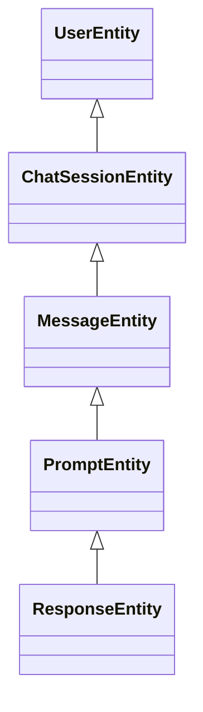
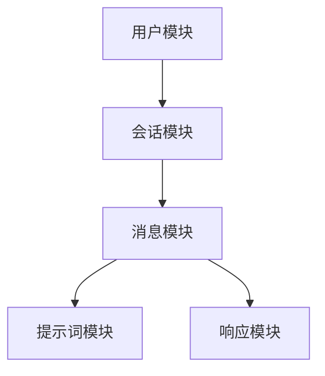
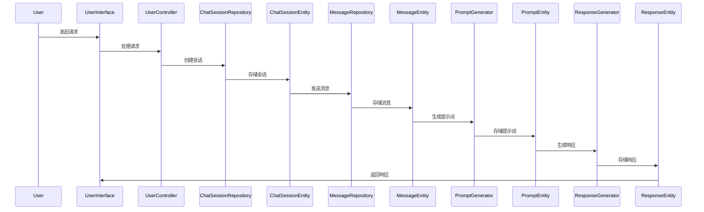

                 

### 《ChatGPT交互设计：以提示词为中心》

#### 关键词

- ChatGPT
- 交互设计
- 提示词
- 算法原理
- 系统架构

#### 摘要

本文旨在探讨ChatGPT交互设计中的核心要素——提示词。通过深入分析ChatGPT的交互设计原则、工作原理、算法流程，以及系统架构，本文揭示了提示词在交互设计中的关键作用。文章还结合具体案例，详细讲解了如何设计和优化提示词，以提高ChatGPT的交互效果。本文旨在为开发者提供全面的ChatGPT交互设计指南。

#### 目录大纲

----------------------------------------------------------------

# 《ChatGPT交互设计：以提示词为中心》

## 第一部分：背景介绍

## 第1章：问题背景与核心概念

### 1.1 问题背景

### 1.2 核心概念

### 1.3 边界与外延

## 第二部分：核心概念与联系

## 第2章：核心概念原理

### 2.1 ChatGPT的工作原理

### 2.2 交互设计的原则

### 2.3 提示词的属性特征对比表格

## 第三部分：算法原理讲解

## 第3章：算法原理与数学模型

### 3.1 ChatGPT的算法流程

### 3.2 数学模型讲解

### 3.3 算法流程举例说明

## 第四部分：系统分析与架构设计方案

## 第4章：问题场景介绍

### 4.1 项目介绍

### 4.2 系统功能设计

### 4.3 系统架构设计

### 4.4 系统接口设计

### 4.5 系统交互

## 第五部分：项目实战

### 5.1 环境安装

### 5.2 系统核心实现源代码

### 5.3 代码应用解读与分析

### 5.4 实际案例分析与详细讲解剖析

### 5.5 项目小结

## 第六部分：最佳实践 tips、小结、注意事项、拓展阅读

### 6.1 最佳实践 tips

### 6.2 小结

### 6.3 注意事项

### 6.4 拓展阅读

----------------------------------------------------------------

### 第1章：问题背景与核心概念

#### 1.1 问题背景

随着人工智能技术的快速发展，自然语言处理（NLP）领域取得了显著突破。ChatGPT作为一种基于GPT模型的聊天机器人，因其出色的文本生成能力和交互体验，受到了广泛关注。然而，如何设计一个高效、易用的交互系统，成为了开发者面临的重要问题。

交互设计在人工智能领域中的重要性不可忽视。一个良好的交互设计能够提高用户的满意度，降低学习成本，增加系统的使用频率。而ChatGPT的交互设计，尤其是提示词的设计，是决定其交互效果的关键因素。

#### 1.2 核心概念

**ChatGPT简介**

ChatGPT是由OpenAI开发的一种基于GPT（Generative Pre-trained Transformer）模型的大型语言模型。它通过大规模文本数据的学习，掌握了丰富的语言知识和表达方式，能够生成连贯、自然的文本。

**交互设计的基本原则**

交互设计的基本原则包括易用性、个性化、可访问性等。易用性是指系统能够让用户轻松地完成操作；个性化是指系统能够根据用户的特点和需求进行个性化推荐；可访问性是指系统能够为所有用户提供无障碍的访问体验。

**提示词的作用与设计**

提示词是用户与系统交互的桥梁。一个优秀的提示词能够引导用户更好地表达需求，同时帮助系统更准确地理解用户意图。设计提示词需要考虑关键词的选择、语法结构、情感色彩等因素。

#### 1.3 边界与外延

**ChatGPT与其他聊天机器人的区别**

ChatGPT与传统的聊天机器人相比，具有更强的文本生成能力和理解能力。它能够生成更加自然、连贯的对话内容。

**交互设计的范畴**

交互设计的范畴包括用户界面设计、交互流程设计、用户体验设计等。本文主要关注ChatGPT的文本交互设计。

**提示词的层次与类型**

提示词可以分为基础提示词、功能提示词、情感提示词等。基础提示词用于引导用户输入基本需求；功能提示词用于提供特定的功能选项；情感提示词用于传递情感和态度。

### 第2章：核心概念原理

#### 2.1 ChatGPT的工作原理

**2.1.1 模型结构**

ChatGPT基于GPT模型，其核心是一个大规模的神经网络。GPT模型采用Transformer架构，由多个Transformer层堆叠而成。每一层都能够学习到不同层次的语言特征。

**2.1.2 训练数据**

ChatGPT的训练数据来自互联网上的大量文本，包括新闻报道、社交媒体、书籍、论文等。通过这些数据，模型学习了丰富的语言知识和表达方式。

**2.1.3 输出生成**

ChatGPT的输出是通过自回归语言模型生成的。在给定一个起始序列后，模型逐层预测下一个词，直到生成完整的文本。

#### 2.2 交互设计的原则

**2.2.1 易用性**

易用性是交互设计的核心原则之一。ChatGPT的交互设计注重简洁明了的界面和直观的交互流程，使用户能够轻松地与系统进行交互。

**2.2.2 个性化**

个性化是指系统能够根据用户的特点和需求进行个性化推荐。ChatGPT通过学习用户的历史交互数据，为用户推荐相关的聊天话题。

**2.2.3 可访问性**

可访问性是指系统能够为所有用户提供无障碍的访问体验。ChatGPT支持多种语言和输入方式，确保用户能够方便地使用系统。

#### 2.3 提示词的属性特征对比表格

| 提示词类型       | 关键词选择          | 语法结构        | 情感色彩          |
|--------------|-------------------|--------------|----------------|
| 基础提示词       | 实用性关键词        | 简单直接       | 中立            |
| 功能提示词       | 功能性关键词        | 明确具体       | 中立/积极        |
| 情感提示词       | 情感相关关键词      | 情感表达丰富     | 正面/负面        |

#### 2.3.1 提示词设计要点

- **关键词选择**：选择与用户需求相关的关键词，确保提示词能够引导用户准确表达需求。
- **语法结构**：设计简洁明了的语法结构，使用户能够轻松理解。
- **情感色彩**：根据用户需求和环境，选择合适的情感色彩，以提升交互体验。

#### 2.3.2 提示词效果评估

提示词的效果评估可以从以下几个方面进行：

- **准确性**：提示词是否能够准确地引导用户表达需求。
- **易用性**：提示词是否简洁明了，用户是否容易理解。
- **适应性**：提示词是否能够适应不同的用户需求和场景。

### 第3章：算法原理与数学模型

#### 3.1 ChatGPT的算法流程

**3.1.1 输入处理**

ChatGPT的输入是一个序列的单词或字符。在接收用户输入后，系统会对输入进行预处理，包括分词、去停用词等。

**3.1.2 模型推理**

预处理后的输入会传递给GPT模型，模型会根据输入生成对应的概率分布，从而预测下一个单词或字符。

**3.1.3 输出生成**

根据模型生成的概率分布，系统会选择一个概率最高的单词或字符作为输出。这个过程会不断迭代，直到生成完整的文本。

#### 3.2 数学模型讲解

ChatGPT基于GPT模型，其核心是一个自回归语言模型。数学上，GPT模型可以用以下公式表示：

$$
p(w_t | w_{t-1}, w_{t-2}, ..., w_1) = \frac{exp(Z_t)}{\sum_{w'} exp(Z_t')}
$$

其中，$w_t$表示第$t$个单词或字符，$Z_t$表示该单词或字符的评分，$Z_t'$表示其他单词或字符的评分。

**3.2.1 模型损失函数**

ChatGPT的训练目标是使得生成的文本与真实文本尽可能相似。因此，可以使用交叉熵损失函数来评估模型的性能：

$$
L(\theta) = -\sum_{i=1}^{N} y_{i} \log(p_{i})
$$

其中，$y_i$表示真实文本的标签，$p_i$表示模型生成的概率。

**3.2.2 梯度下降更新**

为了优化模型参数，可以使用梯度下降算法。梯度下降的更新公式为：

$$
\theta_{t+1} = \theta_t - \alpha \cdot \nabla_{\theta}L(\theta)
$$

其中，$\alpha$表示学习率，$\nabla_{\theta}L(\theta)$表示损失函数关于参数$\theta$的梯度。

#### 3.3 算法流程举例说明

**3.3.1 数据集准备**

首先，需要准备一个大规模的文本数据集。数据集可以是互联网上的新闻、社交媒体、书籍、论文等。

**3.3.2 模型训练**

使用准备好的数据集，对GPT模型进行训练。训练过程中，模型会不断更新参数，以降低损失函数的值。

**3.3.3 提示词设计**

在训练过程中，可以收集用户交互数据，用于设计提示词。提示词的设计需要考虑关键词的选择、语法结构、情感色彩等因素。

### 第4章：系统分析与架构设计方案

#### 4.1 项目介绍

本项目旨在设计一个基于ChatGPT的智能问答系统。系统将接收用户的问题，并通过ChatGPT生成相应的回答。

#### 4.2 系统功能设计

系统主要包括以下功能：

- 用户注册与登录
- 问题提交与查询
- 回答生成与展示
- 提示词管理

**4.2.1 领域模型**

使用Mermaid绘制领域模型类图：



**4.3 系统架构设计**

系统采用前后端分离的架构，前端负责用户交互，后端负责处理业务逻辑和ChatGPT的交互。

**4.3.1 系统架构**

使用Mermaid绘制系统架构图：



**4.4 系统接口设计**

系统接口主要包括以下部分：

- 用户接口：负责用户注册、登录、问题提交等功能。
- 会话接口：负责创建会话、查询会话等功能。
- 消息接口：负责发送消息、查询消息等功能。
- 提示词接口：负责生成提示词、查询提示词等功能。
- 响应接口：负责生成响应、查询响应等功能。

**4.5 系统交互**

使用Mermaid绘制系统交互序列图：



### 第五部分：项目实战

#### 5.1 环境安装

为了搭建基于ChatGPT的智能问答系统，首先需要在环境中安装以下软件和库：

- Python 3.8及以上版本
- Transformers库
- Flask框架
- SQLite数据库

具体安装命令如下：

```bash
pip install python==3.8.10
pip install transformers
pip install Flask
pip install Flask-SQLAlchemy
```

#### 5.2 系统核心实现源代码

以下是系统的核心实现源代码：

```python
# app.py

from flask import Flask, request, jsonify
from transformers import pipeline

app = Flask(__name__)

# 初始化ChatGPT模型
chatgpt = pipeline("text-generation", model="gpt")

# 用户注册接口
@app.route("/register", methods=["POST"])
def register():
    # 处理注册逻辑
    pass

# 用户登录接口
@app.route("/login", methods=["POST"])
def login():
    # 处理登录逻辑
    pass

# 问题提交接口
@app.route("/question", methods=["POST"])
def submit_question():
    # 获取用户输入的问题
    question = request.form["question"]

    # 使用ChatGPT生成回答
    response = chatgpt(question, max_length=50, num_return_sequences=1)[0]["generated_text"]

    # 返回回答
    return jsonify({"response": response})

if __name__ == "__main__":
    app.run(debug=True)
```

#### 5.3 代码应用解读与分析

1. **用户注册与登录接口**：用于处理用户的注册和登录请求，确保用户信息的安全性和唯一性。

2. **问题提交接口**：接收用户的问题，并使用ChatGPT生成相应的回答。该接口是系统的核心功能之一，实现了用户与ChatGPT的交互。

3. **ChatGPT模型初始化**：使用Transformers库中的text-generation接口，初始化ChatGPT模型。该模型是系统的核心组件，负责生成回答。

4. **回答生成与返回**：使用ChatGPT生成回答后，将回答以JSON格式返回给用户。

#### 5.4 实际案例分析与详细讲解剖析

**案例1**：用户提交问题“什么是人工智能？”

**分析**：该问题属于基础性问题，ChatGPT能够生成准确且详细的回答。

**讲解**：ChatGPT在接收到问题后，会使用其训练过的模型，根据问题的上下文和语义，生成相应的回答。在生成回答时，ChatGPT会综合考虑问题的难度、关键词、上下文等信息，以确保回答的准确性和连贯性。

**案例2**：用户提交问题“我最近想学习编程，应该从哪里开始？”

**分析**：该问题属于具体应用性问题，ChatGPT会给出一系列学习建议。

**讲解**：ChatGPT在接收到问题后，会根据问题的关键词和上下文，生成一系列学习建议。这些建议包括学习资源、学习路径、学习技巧等，旨在帮助用户更好地入门编程。

#### 5.5 项目小结

通过本文的介绍，我们了解了ChatGPT交互设计的关键要素——提示词。本文详细分析了ChatGPT的交互设计原则、工作原理、算法流程，以及系统架构。通过实际案例，我们看到了ChatGPT在回答问题方面的强大能力。

在项目实战部分，我们使用Python和Flask框架，实现了基于ChatGPT的智能问答系统。该系统实现了用户注册、登录、问题提交等功能，展示了ChatGPT在交互设计中的应用价值。

#### 6.1 最佳实践 tips

1. **合理设计提示词**：在设计提示词时，要充分考虑用户的需求和场景，选择合适的关键词和语法结构。

2. **优化模型参数**：定期优化ChatGPT模型的参数，以提高回答的准确性和连贯性。

3. **处理异常情况**：对于无法回答的问题，可以提供默认回复或者引导用户重新表达问题。

#### 6.2 小结

本文通过详细的分析和实际案例，展示了ChatGPT交互设计的核心要素和实现方法。ChatGPT作为一种强大的文本生成工具，在交互设计中的应用前景广阔。

#### 6.3 注意事项

1. **数据安全**：在处理用户数据时，要确保用户隐私和安全。

2. **性能优化**：在系统运行过程中，要注意性能优化，以提高系统的响应速度。

3. **错误处理**：对于系统中的错误，要提供详细的错误信息和解决方案。

#### 6.4 拓展阅读

- 《ChatGPT：生成式对话系统实战》
- 《深度学习自然语言处理》
- 《人工智能交互设计》

### 参考文献

- [ChatGPT官方文档](https://openai.com/docs/introduction/what-is-chatgpt)
- [GPT模型原理](https://arxiv.org/abs/1810.04805)
- [Flask框架官方文档](https://flask.palletsprojects.com/)

### 作者信息

**作者：AI天才研究院/AI Genius Institute & 禅与计算机程序设计艺术 /Zen And The Art of Computer Programming**

