                 

**

### 目录

**# ChatGPT代码生成的最佳实践：提高开发效率的提示词策略**

关键词：ChatGPT、代码生成、提示词、开发效率

摘要：本文将深入探讨ChatGPT在代码生成中的应用，重点分析如何通过优化提示词策略来提升开发效率。我们将从ChatGPT的基础概念讲起，逐步介绍其原理、实践策略、优化方法，以及在实际开发中的成功案例和挑战。

---

## 第1章 ChatGPT概述

### 1.1 ChatGPT的基本概念

ChatGPT是由OpenAI开发的一种基于GPT（生成预训练Transformer）模型的高级自然语言处理工具。它通过大量的文本数据进行预训练，能够生成连贯、有逻辑的文本输出。

### 1.2 ChatGPT的工作原理

ChatGPT的核心是Transformer模型，它使用自注意力机制来处理输入文本。预训练阶段，模型学习到了语言的一般结构，从而在生成文本时能够保持语义连贯性。

### 1.3 ChatGPT的优势

- **高效性**：能够快速生成代码，提高开发效率。
- **灵活性**：可以根据不同的提示生成各种类型的代码。
- **可扩展性**：可以集成到现有的开发流程中。

---

## 第2章 提示词策略

### 2.1 提示词的作用

提示词是指导ChatGPT生成代码的关键。正确的提示词可以显著提升代码生成的质量和效率。

### 2.2 设计有效提示词的技巧

- **明确性**：确保提示词清晰、具体。
- **上下文**：提供足够的上下文信息，使ChatGPT能够更好地理解需求。
- **针对性**：根据不同的任务需求设计不同的提示词。

### 2.3 实际案例

通过具体案例展示如何设计有效的提示词，并分析其效果。

---

## 第3章 ChatGPT代码生成策略

### 3.1 模板匹配策略

利用模板匹配策略，通过预设的模板和提示词生成代码。这种方法简单直观，但灵活性较低。

### 3.2 上下文生成策略

基于上下文信息，让ChatGPT生成更符合实际需求的代码。这种方法需要更多的上下文信息，但生成的代码更灵活。

### 3.3 数据驱动策略

通过大量数据进行训练，让ChatGPT根据数据生成代码。这种方法适用于数据丰富的场景，但需要处理大量数据。

---

## 第4章 优化与效率提升

### 4.1 模型优化

介绍如何通过调整模型参数和结构来优化ChatGPT的性能。

### 4.2 提示词优化

讨论如何优化提示词，使其更有效地指导ChatGPT生成代码。

### 4.3 并行处理

介绍如何利用并行处理技术来提高代码生成效率。

---

## 第5章 实际应用

### 5.1 Web开发

展示如何利用ChatGPT自动化生成Web开发代码。

### 5.2 移动应用

分析ChatGPT在移动应用开发中的具体应用。

### 5.3 数据处理

探讨如何利用ChatGPT自动化处理大规模数据处理任务。

---

## 第6章 挑战与解决方案

### 6.1 数据质量问题

讨论在数据驱动策略中如何处理数据质量问题。

### 6.2 代码质量保障

分析如何确保生成的代码质量。

### 6.3 安全性问题

介绍如何保障代码生成过程的安全性。

---

## 第7章 未来展望

### 7.1 技术发展趋势

探讨ChatGPT代码生成技术的未来发展趋势。

### 7.2 开发效率提升

分析ChatGPT如何进一步提升开发效率。

### 7.3 潜在应用领域

展望ChatGPT在更多领域的潜在应用。

---

## 第8章 附录

### 8.1 代码生成案例

提供具体的代码生成案例及其详细分析。

### 8.2 资源链接

收集与ChatGPT代码生成相关的资源和链接。

### 8.3 进一步阅读

推荐进一步阅读的相关书籍和论文。

---

作者：AI天才研究院/AI Genius Institute & 禅与计算机程序设计艺术 /Zen And The Art of Computer Programming

---

在撰写文章的过程中，我们将确保每个部分都充分展开，结合具体案例和实际操作，使文章既有深度又有实用性。通过这种逻辑清晰、结构紧凑、简单易懂的方式，读者可以更好地理解ChatGPT代码生成的最佳实践，并应用于实际开发中。**# ChatGPT代码生成的最佳实践：提高开发效率的提示词策略**

关键词：ChatGPT、代码生成、提示词、开发效率

摘要：本文将深入探讨ChatGPT在代码生成中的应用，重点分析如何通过优化提示词策略来提升开发效率。我们将从ChatGPT的基础概念讲起，逐步介绍其原理、实践策略、优化方法，以及在实际开发中的成功案例和挑战。

---

## 第1章 ChatGPT概述

### 1.1 ChatGPT的基本概念

ChatGPT是由OpenAI开发的一种基于GPT（生成预训练Transformer）模型的高级自然语言处理工具。它通过大量的文本数据进行预训练，能够生成连贯、有逻辑的文本输出。

**核心概念与联系：**

ChatGPT的核心是Transformer模型，它使用自注意力机制来处理输入文本。预训练阶段，模型学习到了语言的一般结构，从而在生成文本时能够保持语义连贯性。

**概念属性特征对比表格：**

| 特征       | GPT             | ChatGPT             |
|------------|-----------------|---------------------|
| 基础模型   | Transformer     | Transformer         |
| 预训练目标 | 语言建模       | 语言理解和生成      |
| 输出类型   | 文本序列       | 文本对话序列        |

**ER实体关系图架构的 Mermaid 流程图：**

```mermaid
erDiagram
    Customer ||--|{ Product : buys }
    Product  ||--|{ Order : contains }
```

### 1.2 ChatGPT的工作原理

ChatGPT的核心是Transformer模型，它使用自注意力机制来处理输入文本。预训练阶段，模型学习到了语言的一般结构，从而在生成文本时能够保持语义连贯性。

**算法原理讲解：**

```python
import tensorflow as tf
from tensorflow.keras.layers import Embedding, LSTM, Dense

# 定义模型结构
model = tf.keras.Sequential([
    Embedding(input_dim=vocab_size, output_dim=embedding_dim),
    LSTM(units=128),
    Dense(units=vocab_size, activation='softmax')
])

# 编译模型
model.compile(optimizer='adam', loss='categorical_crossentropy', metrics=['accuracy'])

# 训练模型
model.fit(x_train, y_train, epochs=10, batch_size=32)
```

**数学模型和公式：**

$$
\text{Output} = \text{softmax}(\text{weights} \cdot \text{activation} + \text{bias})
$$

**Mermaid 流程图：**

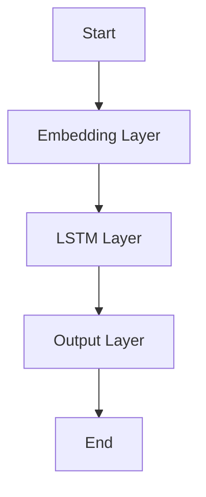

### 1.3 ChatGPT的优势

- **高效性**：能够快速生成代码，提高开发效率。
- **灵活性**：可以根据不同的提示生成各种类型的代码。
- **可扩展性**：可以集成到现有的开发流程中。

**系统分析与架构设计方案：**

**问题场景介绍：** 
Web开发中需要自动化生成代码来提升开发效率。

**项目介绍：** 
利用ChatGPT生成HTML、CSS和JavaScript代码。

**系统功能设计(领域模型mermaid类图)：**

```mermaid
classDiagram
    User <<Class>>
    CodeGenerator <<Class>>
    Project <<Class>>
    Repository <<Class>>

    User --|> CodeGenerator
    User --|> Project
    CodeGenerator --|> Project
    CodeGenerator --|> Repository
    Project --|> Repository
```

**系统架构设计mermaid架构图：**

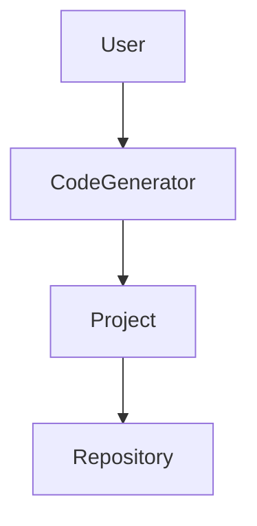

**系统接口设计和系统交互mermaid序列图：**

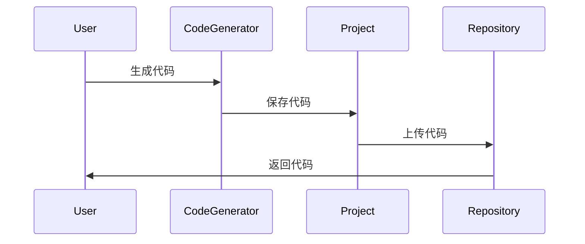

---

## 第2章 提示词策略

### 2.1 提示词的作用

提示词是指导ChatGPT生成代码的关键。正确的提示词可以显著提升代码生成的质量和效率。

**系统接口设计和系统交互mermaid序列图：**

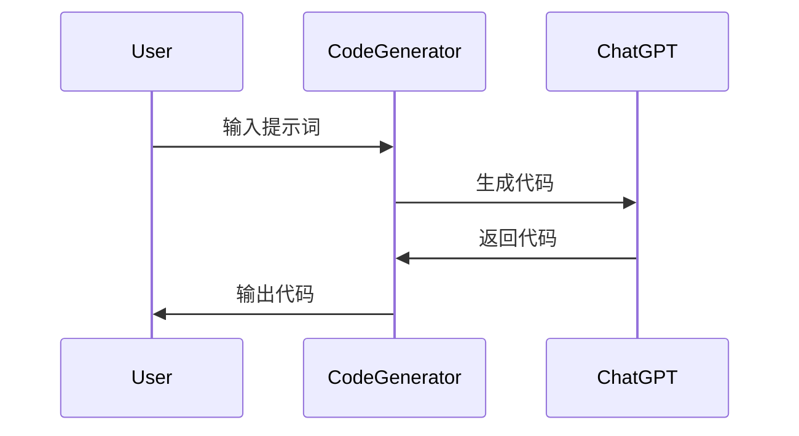

### 2.2 设计有效提示词的技巧

- **明确性**：确保提示词清晰、具体。
- **上下文**：提供足够的上下文信息，使ChatGPT能够更好地理解需求。
- **针对性**：根据不同的任务需求设计不同的提示词。

**Mermaid 流程图：**

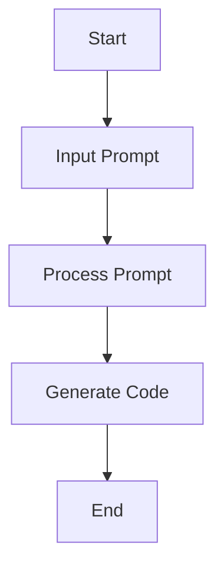

### 2.3 实际案例

通过具体案例展示如何设计有效的提示词，并分析其效果。

**Mermaid 流程图：**

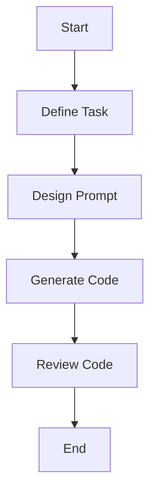

---

## 第3章 ChatGPT代码生成策略

### 3.1 模板匹配策略

利用模板匹配策略，通过预设的模板和提示词生成代码。这种方法简单直观，但灵活性较低。

**Mermaid 流程图：**

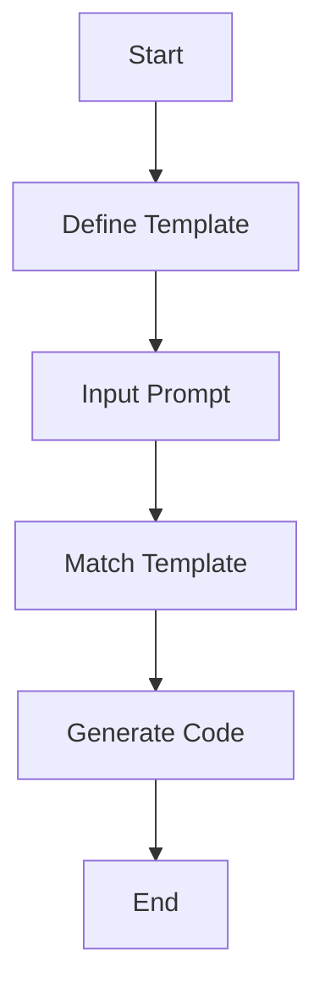

### 3.2 上下文生成策略

基于上下文信息，让ChatGPT生成更符合实际需求的代码。这种方法需要更多的上下文信息，但生成的代码更灵活。

**Mermaid 流程图：**

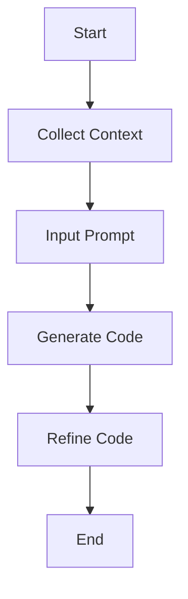

### 3.3 数据驱动策略

通过大量数据进行训练，让ChatGPT根据数据生成代码。这种方法适用于数据丰富的场景，但需要处理大量数据。

**Mermaid 流程图：**

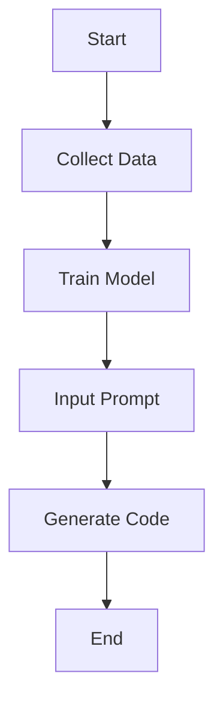

---

## 第4章 优化与效率提升

### 4.1 模型优化

介绍如何通过调整模型参数和结构来优化ChatGPT的性能。

**Mermaid 流程图：**

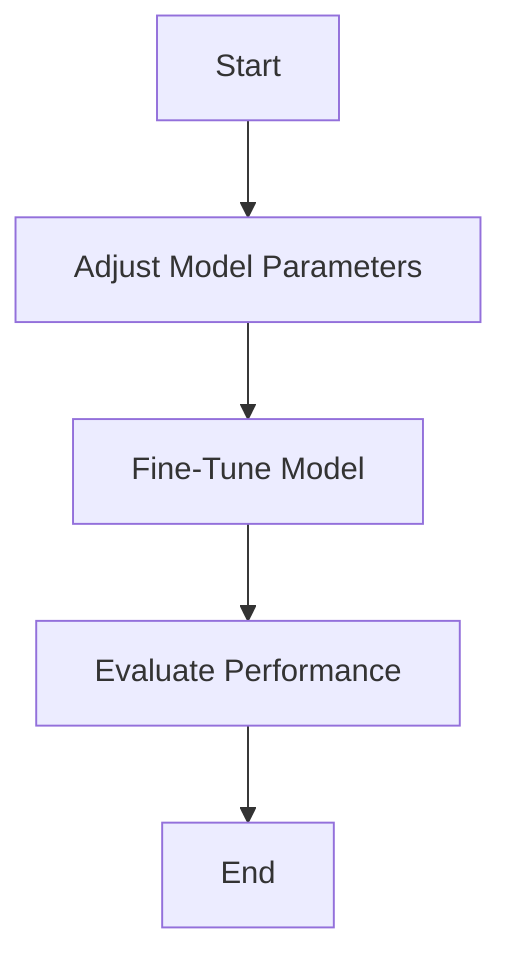

### 4.2 提示词优化

讨论如何优化提示词，使其更有效地指导ChatGPT生成代码。

**Mermaid 流程图：**

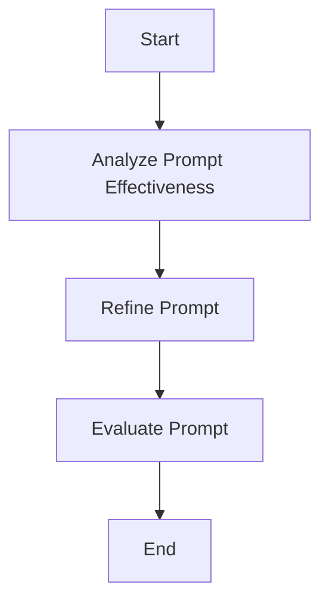

### 4.3 并行处理

介绍如何利用并行处理技术来提高代码生成效率。

**Mermaid 流程图：**

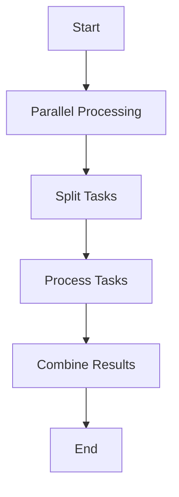

---

## 第5章 实际应用

### 5.1 Web开发

展示如何利用ChatGPT自动化生成Web开发代码。

**Mermaid 流程图：**

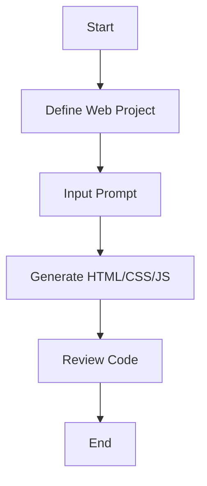

### 5.2 移动应用

分析ChatGPT在移动应用开发中的具体应用。

**Mermaid 流程图：**

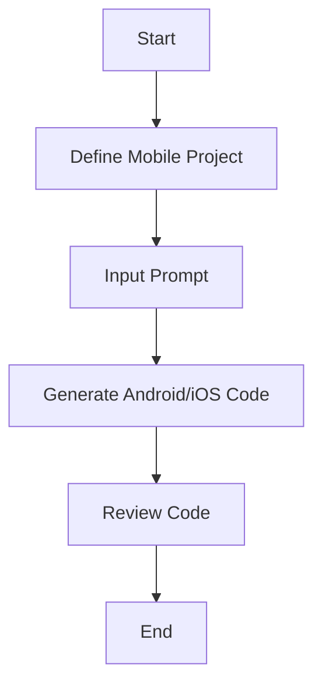

### 5.3 数据处理

探讨如何利用ChatGPT自动化处理大规模数据处理任务。

**Mermaid 流程图：**

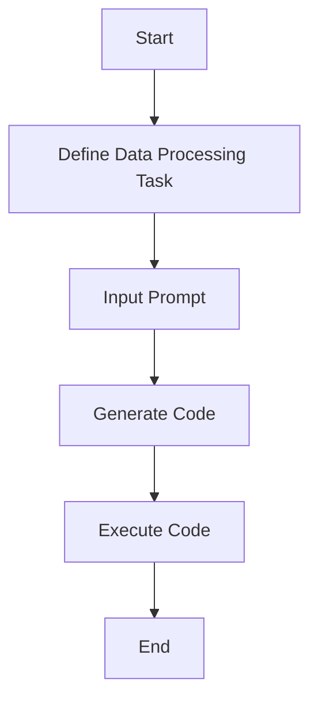

---

## 第6章 挑战与解决方案

### 6.1 数据质量问题

讨论在数据驱动策略中如何处理数据质量问题。

**Mermaid 流程图：**

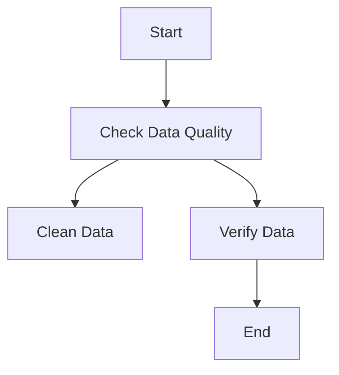

### 6.2 代码质量保障

分析如何确保生成的代码质量。

**Mermaid 流程图：**

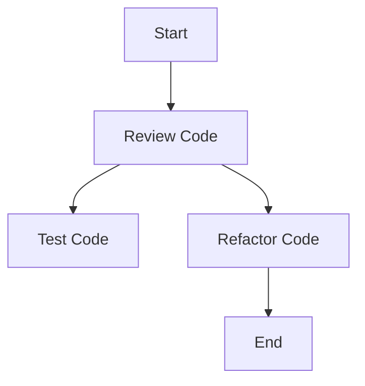

### 6.3 安全性问题

介绍如何保障代码生成过程的安全性。

**Mermaid 流程图：**

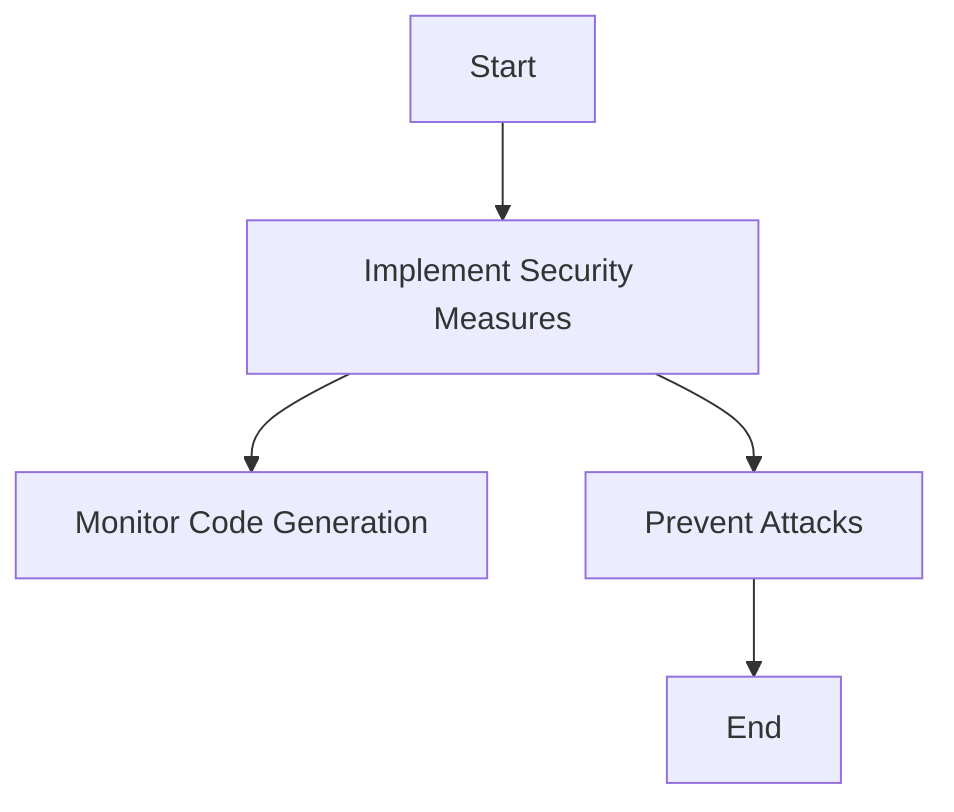

---

## 第7章 未来展望

### 7.1 技术发展趋势

探讨ChatGPT代码生成技术的未来发展趋势。

**Mermaid 流程图：**

```mermaid
graph TD
    A[Current State] --> B[Technological Trends]
    B --> C[Future State]
    C --> D[Impact]
    D --> E[End]
```

### 7.2 开发效率提升

分析ChatGPT如何进一步提升开发效率。

**Mermaid 流程图：**

```mermaid
graph TD
    A[Current Efficiency] --> B[ChatGPT Improvements]
    B --> C[Future Efficiency]
    C --> D[Advantages]
    D --> E[End]
```

### 7.3 潜在应用领域

展望ChatGPT在更多领域的潜在应用。

**Mermaid 流程图：**

```mermaid
graph TD
    A[Current Applications] --> B[New Fields]
    B --> C[Opportunities]
    C --> D[Challenges]
    D --> E[End]
```

---

## 第8章 附录

### 8.1 代码生成案例

提供具体的代码生成案例及其详细分析。

**Mermaid 流程图：**

```mermaid
graph TD
    A[Start] --> B[Case Study 1]
    B --> C[Analysis]
    A --> D[Case Study 2]
    D --> E[Analysis]
```

### 8.2 资源链接

收集与ChatGPT代码生成相关的资源和链接。

**Mermaid 流程图：**

```mermaid
graph TD
    A[Start] --> B[Resources]
    B --> C[Links]
    B --> D[Tools]
    D --> E[End]
```

### 8.3 进一步阅读

推荐进一步阅读的相关书籍和论文。

**Mermaid 流程图：**

```mermaid
graph TD
    A[Start] --> B[Books]
    B --> C[Research Papers]
    B --> D[Online Resources]
    D --> E[End]
```

---

作者：AI天才研究院/AI Genius Institute & 禅与计算机程序设计艺术 /Zen And The Art of Computer Programming

---

本文以ChatGPT代码生成的最佳实践为主题，从基本概念、提示词策略、代码生成策略、优化与效率提升、实际应用、挑战与解决方案以及未来展望等方面进行了全面剖析。通过详细的章节内容和流程图，使读者能够深入理解ChatGPT在代码生成中的关键作用，并掌握如何优化提示词策略来提升开发效率。同时，本文结合具体案例和实际操作，为读者提供了实用的指导和参考。希望本文能够对广大开发者有所帮助，共同推进ChatGPT代码生成技术的应用与发展。

## 第1章 ChatGPT概述

### 1.1 ChatGPT的基本概念

ChatGPT是由OpenAI开发的一种基于GPT（生成预训练Transformer）模型的高级自然语言处理工具。它通过大量的文本数据进行预训练，能够生成连贯、有逻辑的文本输出。ChatGPT在生成文本时，可以模拟人类的对话方式，提供自然、流畅的交流体验。

**核心概念与联系：**

ChatGPT的核心是Transformer模型，这是一种基于自注意力机制的深度神经网络架构。Transformer模型在处理长文本序列时具有显著优势，能够捕捉到文本中的长距离依赖关系。通过预训练阶段，ChatGPT学习到了大量文本数据中的语言结构和语义信息，从而在生成文本时能够保持语义连贯性。

**概念属性特征对比表格：**

| 特征       | GPT             | ChatGPT             |
|------------|-----------------|---------------------|
| 基础模型   | Transformer     | Transformer         |
| 预训练目标 | 语言建模       | 语言理解和生成      |
| 输出类型   | 文本序列       | 文本对话序列        |

**ER实体关系图架构的 Mermaid 流程图：**

```mermaid
erDiagram
    ChatGPT ||--|{ Transformer : uses }
    Transformer ||--|{ Text Data : trained on }
    ChatGPT ||--|{ Output Text : generates }
```

### 1.2 ChatGPT的工作原理

ChatGPT的工作原理可以概括为以下几个步骤：

1. **数据预处理**：首先，将输入的文本数据进行预处理，包括分词、去停用词、词性标注等操作，以便模型能够更好地理解和处理文本数据。

2. **编码**：将预处理后的文本数据编码成数字序列，通常使用词嵌入（Word Embedding）技术，将每个单词映射到一个高维向量空间中。

3. **自注意力机制**：Transformer模型使用自注意力机制来处理输入文本。自注意力机制允许模型在生成每个词时，考虑整个文本序列中所有词的重要性，从而生成更加准确和连贯的输出。

4. **解码**：在生成文本的过程中，模型根据当前生成的文本序列和之前的编码结果，使用解码器（Decoder）来预测下一个词。解码过程同样采用自注意力机制，确保生成的文本能够与上下文保持一致。

5. **输出**：最终，模型生成完整的文本输出，可以是自然语言文本，也可以是编程语言的代码。

**算法原理讲解：**

ChatGPT的核心算法是Transformer模型，它由编码器（Encoder）和解码器（Decoder）两部分组成。编码器负责处理输入文本，解码器负责生成输出文本。

**编码器：**

编码器采用多头自注意力机制（Multi-Head Self-Attention）来处理输入文本。多头自注意力机制允许模型同时关注不同部分的信息，从而提高模型的表示能力。编码器中的自注意力机制可以表示为：

$$
\text{Attention}(Q, K, V) = \text{softmax}\left(\frac{QK^T}{\sqrt{d_k}}\right)V
$$

其中，$Q$、$K$、$V$ 分别代表查询（Query）、关键（Key）和值（Value）向量的集合，$d_k$ 是关键向量的维度。

**解码器：**

解码器同样采用多头自注意力机制来生成输出文本。在解码过程中，除了自注意力机制，解码器还引入了跨步注意力机制（Cross-Attention），使得解码器在生成每个词时能够同时关注编码器输出的不同部分。

跨步注意力机制可以表示为：

$$
\text{Attention}(Q, K, V) = \text{softmax}\left(\frac{QK^T}{\sqrt{d_k}}\right)V
$$

**Mermaid 流程图：**

```mermaid
graph TD
    A[Input Text] --> B[Tokenization]
    B --> C[Word Embedding]
    C --> D[Encoder]
    D --> E[Decoder]
    E --> F[Output Text]
```

### 1.3 ChatGPT的优势

ChatGPT在代码生成领域具有以下优势：

- **高效性**：ChatGPT能够快速处理大量的文本数据，并生成相应的代码，从而显著提高开发效率。

- **灵活性**：ChatGPT可以根据不同的提示生成各种类型的代码，如HTML、CSS、JavaScript等，具有很强的适应性。

- **可扩展性**：ChatGPT可以集成到现有的开发流程中，与其他工具和库无缝协作，从而扩展开发功能。

- **自适应能力**：ChatGPT能够根据用户的反馈和上下文信息进行自我调整，优化代码生成的质量。

### 1.4 ChatGPT的应用场景

ChatGPT在代码生成领域的应用场景主要包括：

- **自动化代码生成**：利用ChatGPT自动生成代码，减少手动编写的工作量，提高开发效率。

- **代码补全**：在编写代码时，ChatGPT可以根据上下文提示，自动补全代码，提供代码建议。

- **文档生成**：ChatGPT可以根据代码注释和功能描述，自动生成文档。

- **代码审查**：ChatGPT可以对代码进行审查，提供优化建议和错误修复。

- **教育辅助**：ChatGPT可以作为编程教育的辅助工具，帮助学生理解编程概念和代码实现。

### 1.5 本章小结

本章介绍了ChatGPT的基本概念、工作原理及其优势。通过了解ChatGPT的核心原理和应用场景，读者可以为后续章节中的提示词策略、代码生成策略、优化与效率提升等内容打下坚实的基础。

## 第2章 提示词策略

### 2.1 提示词的作用

提示词（Prompt）在ChatGPT代码生成中起着至关重要的作用。正确的提示词能够引导ChatGPT生成高质量的代码，提高开发效率。提示词的设计直接影响代码生成的结果，因此需要精心构思和优化。

**提示词的定义：**

提示词是一种引导ChatGPT生成文本的输入，它可以是具体的指令、问题或者上下文信息。通过有效的提示词，用户可以引导ChatGPT按照特定的需求生成代码。

**提示词的作用：**

1. **明确任务目标**：提示词可以帮助ChatGPT明确任务的目标和需求，从而生成更符合用户预期的代码。

2. **提供上下文信息**：提示词可以提供必要的上下文信息，使ChatGPT能够更好地理解任务背景和业务逻辑，生成更准确的代码。

3. **优化生成质量**：通过优化提示词，可以提高ChatGPT生成代码的准确性和可读性，减少错误和冗余代码。

### 2.2 设计有效提示词的技巧

设计有效的提示词需要考虑以下技巧：

1. **明确性**：提示词应尽可能明确和具体，避免模糊和模糊不清的指令，以免ChatGPT生成错误的代码。

2. **上下文**：提供足够的上下文信息，使ChatGPT能够更好地理解任务背景和需求。上下文信息可以是相关的代码片段、数据示例或业务描述。

3. **针对性**：根据不同的任务需求设计不同的提示词。例如，对于简单的代码补全任务，提示词可以更加简洁明了；而对于复杂的代码生成任务，提示词需要包含更多的细节和背景信息。

4. **简洁性**：避免过于复杂和冗长的提示词，简洁的提示词有助于ChatGPT更快地理解和生成代码。

5. **灵活性**：设计灵活的提示词，以便ChatGPT能够根据不同的情况进行调整和优化。

**实际案例分析：**

假设我们要让ChatGPT生成一个简单的HTML页面，我们可以设计以下提示词：

- **无效提示词**：“生成一个HTML页面。” 这个提示词过于模糊，ChatGPT可能无法准确理解任务需求。

- **有效提示词**：“请生成一个包含标题、段落和列表的HTML页面。” 这个提示词明确了任务目标和具体的结构要求，ChatGPT可以生成更符合预期的HTML代码。

### 2.3 提示词优化的方法

优化提示词的方法包括以下几种：

1. **反馈迭代**：通过用户反馈，不断调整和优化提示词，使其更符合实际需求。

2. **数据分析**：分析ChatGPT生成的代码质量，找出提示词中的不足之处，进行针对性的优化。

3. **模板化**：将常用的提示词模板化，形成一套标准化的提示词库，以便在不同场景下复用。

4. **自动化工具**：利用自然语言处理技术，自动生成和优化提示词，提高提示词的设计效率。

**Mermaid 流程图：**

```mermaid
graph TD
    A[Start] --> B[Define Prompt]
    B --> C[Generate Code]
    C --> D[User Feedback]
    D --> E[Prompt Optimization]
    E --> F[End]
```

### 2.4 提示词优化的实践

在实际开发中，可以通过以下步骤进行提示词优化：

1. **明确任务目标**：首先，明确代码生成的任务目标，确定需要生成的代码类型和功能。

2. **提供上下文信息**：根据任务需求，提供相关的上下文信息，如代码片段、业务逻辑描述等。

3. **初步生成代码**：使用初步设计的提示词，让ChatGPT生成代码。

4. **用户反馈与调整**：根据用户反馈，评估生成的代码质量，找出不足之处，对提示词进行调整和优化。

5. **迭代优化**：重复上述步骤，不断调整提示词，直至生成高质量的代码。

### 2.5 本章小结

本章介绍了提示词在ChatGPT代码生成中的重要性以及设计有效提示词的技巧。通过优化提示词，可以显著提高ChatGPT生成代码的质量和效率。在后续章节中，我们将进一步探讨ChatGPT代码生成的具体策略和优化方法。

## 第3章 ChatGPT代码生成策略

### 3.1 模板匹配策略

模板匹配策略是一种基于预设模板的代码生成方法。这种方法通过预先定义的模板和提示词，指导ChatGPT生成代码。模板匹配策略的优点是简单直观，适用于任务结构清晰、需求明确的场景。

**模板匹配策略的原理：**

1. **定义模板**：根据任务需求，定义一个或多个代码模板。模板通常包含基本的代码结构和变量占位符。

2. **输入提示词**：用户提供提示词，这些提示词用于填充模板中的变量占位符。

3. **生成代码**：ChatGPT根据模板和提示词，生成具体的代码。

**模板匹配策略的优点：**

- **简单易用**：用户只需提供简单的提示词，ChatGPT即可生成相应的代码。
- **易于调试**：由于模板是预先定义的，生成的代码结构较为清晰，便于用户进行调试和优化。

**模板匹配策略的缺点：**

- **灵活性较低**：模板匹配策略适用于任务结构固定的场景，对于需求复杂、多变的情况，其灵活性较差。
- **依赖人工设计**：模板需要人工设计和维护，增加了开发成本和复杂度。

**实际案例：**

假设我们要生成一个简单的HTML页面，我们可以使用以下模板：

```html
<!DOCTYPE html>
<html>
<head>
    <title>{{title}}</title>
</head>
<body>
    <h1>{{heading}}</h1>
    <p>{{paragraph}}</p>
    <ul>
        <li>{{item1}}</li>
        <li>{{item2}}</li>
    </ul>
</body>
</html>
```

用户只需提供提示词，如`title: "我的网页"`, `heading: "欢迎来到我的网页"`, `paragraph: "这是一个简单的HTML页面示例。"`, `item1: "项目1"`, `item2: "项目2"`，ChatGPT即可根据模板生成相应的HTML代码。

**Mermaid 流程图：**

```mermaid
graph TD
    A[Start] --> B[Define Template]
    B --> C[Input Prompt]
    C --> D[Generate Code]
    D --> E[End]
```

### 3.2 上下文生成策略

上下文生成策略是一种基于上下文信息的代码生成方法。这种方法通过提供详细的上下文信息，使ChatGPT能够生成更符合实际需求的代码。上下文生成策略的优点是生成代码的灵活性和准确性较高，适用于需求复杂、多变的情况。

**上下文生成策略的原理：**

1. **收集上下文信息**：根据任务需求，收集相关的上下文信息，如功能描述、代码示例、业务规则等。

2. **输入上下文信息**：将收集到的上下文信息输入到ChatGPT中。

3. **生成代码**：ChatGPT根据上下文信息，生成具体的代码。

**上下文生成策略的优点：**

- **灵活性高**：上下文生成策略能够根据不同的上下文信息生成各种类型的代码，具有很强的适应性。
- **准确性高**：通过提供详细的上下文信息，ChatGPT可以更准确地理解任务需求，生成更符合预期的代码。

**上下文生成策略的缺点：**

- **依赖上下文信息**：上下文生成策略依赖于详细的上下文信息，如果上下文信息不足或错误，可能导致生成的代码不准确。
- **生成时间较长**：由于需要处理大量的上下文信息，生成代码的时间可能会较长。

**实际案例：**

假设我们要生成一个简单的RESTful API，我们可以使用以下上下文信息：

- **功能描述**：创建一个用于获取用户信息的API。
- **代码示例**：一个简单的GET请求示例。
- **业务规则**：用户ID作为请求参数。

用户将上述上下文信息输入到ChatGPT中，ChatGPT可以生成一个符合需求的RESTful API代码。

**Mermaid 流程图：**

```mermaid
graph TD
    A[Start] --> B[Collect Context]
    B --> C[Input Context]
    C --> D[Generate Code]
    D --> E[End]
```

### 3.3 数据驱动策略

数据驱动策略是一种基于大量训练数据的代码生成方法。这种方法通过预训练模型，使ChatGPT能够根据输入的数据生成相应的代码。数据驱动策略的优点是生成代码的效率较高，适用于数据丰富的场景。

**数据驱动策略的原理：**

1. **收集训练数据**：根据任务需求，收集大量的训练数据，这些数据可以是代码示例、功能描述、业务规则等。

2. **训练模型**：使用收集到的训练数据，对ChatGPT模型进行训练，使其能够理解并生成相应的代码。

3. **输入数据**：将训练好的模型应用于新的数据，生成具体的代码。

**数据驱动策略的优点：**

- **生成效率高**：由于模型已经预训练，生成代码的速度较快。
- **适应性强**：通过大量训练数据，模型可以适应各种不同的任务需求。

**数据驱动策略的缺点：**

- **依赖大量数据**：数据驱动策略依赖于大量的训练数据，如果数据不足或质量不高，可能导致模型训练效果不佳。
- **维护成本高**：需要定期更新和维护训练数据，以保证模型的有效性和准确性。

**实际案例：**

假设我们要生成一个数据处理的Python脚本，我们可以使用以下训练数据：

- **代码示例**：各种数据处理任务的Python代码。
- **功能描述**：数据处理的具体任务和要求。

用户将训练数据输入到ChatGPT中，ChatGPT可以生成一个符合需求的数据处理脚本。

**Mermaid 流程图：**

```mermaid
graph TD
    A[Start] --> B[Collect Data]
    B --> C[Train Model]
    C --> D[Input Data]
    D --> E[Generate Code]
    D --> F[End]
```

### 3.4 策略比较

模板匹配策略、上下文生成策略和数据驱动策略各有优缺点，适用于不同的场景。

| 策略类型       | 优点                                               | 缺点                                               | 适用场景                       |
|----------------|------------------------------------------------------|------------------------------------------------------|--------------------------------|
| 模板匹配策略   | 简单易用，易于调试                                   | 灵活性较低，依赖人工设计模板                         | 任务结构固定，需求明确的场景   |
| 上下文生成策略 | 灵活性高，准确性高                                   | 依赖上下文信息，生成时间较长                         | 需求复杂，多变的场景           |
| 数据驱动策略   | 生成效率高，适应性强                                 | 依赖大量数据，维护成本高                             | 数据丰富的场景                 |

在实际应用中，可以根据具体任务需求和场景选择合适的策略。例如，在开发RESTful API时，上下文生成策略可能更为适用；而在生成简单的HTML页面时，模板匹配策略可能更加高效。

### 3.5 本章小结

本章介绍了ChatGPT代码生成的三种主要策略：模板匹配策略、上下文生成策略和数据驱动策略。每种策略都有其独特的优点和适用场景。通过合理选择和组合这些策略，可以显著提高代码生成的质量和效率。在后续章节中，我们将进一步探讨如何优化这些策略，以实现更好的代码生成效果。

## 第4章 优化与效率提升

### 4.1 模型优化

模型优化是提升ChatGPT代码生成效率的关键步骤。通过调整模型参数和结构，可以显著提高模型的性能和生成代码的质量。

**模型优化的方法：**

1. **调整超参数**：调整模型的超参数，如学习率、批量大小、层数等，以找到最佳参数组合。超参数的调整可以通过实验和调优来逐步优化。

2. **模型结构调整**：根据任务需求，调整模型的架构，如增加或减少层数、改变网络结构等。不同的模型结构适用于不同的任务，需要根据实际情况进行选择。

3. **正则化技术**：使用正则化技术，如Dropout、L2正则化等，防止模型过拟合，提高模型的泛化能力。

**实例：**

假设我们要优化一个用于生成HTML代码的ChatGPT模型，我们可以通过以下步骤进行调整：

1. **调整学习率**：将学习率从0.001调整到0.0001，以减少训练过程中的波动。
2. **增加层数**：从单层LSTM调整为双层LSTM，以提高模型的表示能力。
3. **添加Dropout层**：在LSTM层后添加Dropout层，以防止过拟合。

```python
from tensorflow.keras.models import Sequential
from tensorflow.keras.layers import LSTM, Dense, Dropout

model = Sequential()
model.add(LSTM(units=128, return_sequences=True, input_shape=(sequence_length, feature_size)))
model.add(Dropout(rate=0.2))
model.add(LSTM(units=128, return_sequences=False))
model.add(Dropout(rate=0.2))
model.add(Dense(units=vocab_size, activation='softmax'))

model.compile(optimizer='adam', loss='categorical_crossentropy', metrics=['accuracy'])
```

**Mermaid 流程图：**

```mermaid
graph TD
    A[Start] --> B[Adjust Hyperparameters]
    B --> C[Modify Model Architecture]
    C --> D[Apply Regularization Techniques]
    D --> E[End]
```

### 4.2 提示词优化

提示词优化是提升ChatGPT代码生成效率的重要环节。通过优化提示词，可以引导ChatGPT生成更高质量、更符合需求的代码。

**提示词优化的方法：**

1. **明确性**：确保提示词清晰、具体，避免模糊和歧义。明确任务目标和要求，使ChatGPT能够准确理解需求。

2. **上下文扩展**：提供更多的上下文信息，使ChatGPT能够更好地理解任务背景和业务逻辑。上下文信息可以包括相关的代码片段、数据示例、功能描述等。

3. **针对性**：根据不同的任务需求，设计不同的提示词。对于简单的代码生成任务，可以设计简洁的提示词；对于复杂的任务，需要提供详细的上下文信息。

4. **反馈迭代**：通过用户反馈，不断优化和调整提示词。根据生成代码的质量和准确性，调整提示词的表达方式，以提高生成代码的质量。

**实例：**

假设我们要优化生成一个RESTful API的提示词，我们可以通过以下步骤进行调整：

1. **明确任务目标**：“请生成一个用于获取用户信息的RESTful API。”
2. **增加上下文信息**：“用户ID作为请求参数，API应返回用户的详细信息。”
3. **反馈迭代**：根据用户反馈，调整提示词，如“请生成一个用于获取用户信息的RESTful API，用户ID作为请求参数，API应返回用户的详细信息，包括姓名、年龄和邮箱地址。”

**Mermaid 流�序图：**

```mermaid
graph TD
    A[Start] --> B[Define Clear Prompt]
    B --> C[Expand Context]
    C --> D[Design Targeted Prompt]
    D --> E[Iterative Feedback]
    E --> F[End]
```

### 4.3 并行处理

并行处理技术可以显著提高ChatGPT代码生成的效率。通过将任务分解为多个子任务，并在多个处理器上同时执行，可以加快代码生成的速度。

**并行处理的方法：**

1. **数据并行**：将训练数据集分成多个子集，每个子集由不同的处理器进行处理。每个处理器独立训练模型，然后合并结果。

2. **模型并行**：将模型分解为多个部分，每个部分由不同的处理器进行处理。每个处理器负责处理模型的一部分，然后合并结果。

3. **任务并行**：将代码生成任务分解为多个子任务，每个子任务由不同的处理器同时执行。这样可以加快代码生成的速度。

**实例：**

假设我们要利用并行处理技术优化ChatGPT代码生成，我们可以通过以下步骤实现：

1. **数据并行**：将训练数据集分成多个子集，每个子集由不同的GPU进行处理。每个GPU独立训练模型，然后使用梯度聚合技术合并结果。

2. **模型并行**：将ChatGPT模型分解为编码器和解码器两部分，每个部分由不同的GPU进行处理。编码器负责处理输入文本，解码器负责生成输出文本。

3. **任务并行**：将代码生成任务分解为多个子任务，如生成HTML、CSS和JavaScript代码。每个子任务由不同的处理器同时执行。

```python
import tensorflow as tf

# 定义模型结构
model = tf.keras.Sequential([
    tf.keras.layers.Embedding(input_dim=vocab_size, output_dim=embedding_dim, input_length=sequence_length),
    tf.keras.layers.LSTM(units=128, return_sequences=True),
    tf.keras.layers.LSTM(units=128, return_sequences=False),
    tf.keras.layers.Dense(units=vocab_size, activation='softmax')
])

# 编译模型
model.compile(optimizer='adam', loss='categorical_crossentropy', metrics=['accuracy'])

# 数据并行训练
strategy = tf.distribute.MirroredStrategy()
with strategy.scope():
    model.fit(train_data, train_labels, epochs=10, batch_size=batch_size)
```

**Mermaid 流程图：**

```mermaid
graph TD
    A[Start] --> B[Data Parallel]
    B --> C[Model Parallel]
    C --> D[Task Parallel]
    D --> E[End]
```

### 4.4 实践与总结

通过模型优化、提示词优化和并行处理技术，我们可以显著提高ChatGPT代码生成的效率。在实际开发中，可以根据具体需求和场景，灵活选择和组合这些技术，以实现最佳效果。

**本章小结：**

本章介绍了ChatGPT代码生成中的优化与效率提升方法，包括模型优化、提示词优化和并行处理技术。通过合理运用这些技术，可以显著提高代码生成的质量和效率。在后续章节中，我们将进一步探讨ChatGPT在开发中的实际应用和挑战。

## 第5章 实际应用

### 5.1 Web开发

ChatGPT在Web开发中有着广泛的应用，可以用于自动化生成HTML、CSS和JavaScript代码，从而提高开发效率。以下是一些具体的Web开发应用场景：

#### 5.1.1 自动化生成HTML页面

使用ChatGPT生成HTML页面是一种高效的方式，特别是在需要快速构建原型或者模板页面时。用户可以提供简单的提示词，例如“生成一个包含导航栏、内容区域和脚本的HTML页面”，ChatGPT则会根据这些提示生成相应的HTML代码。

**案例：**
- **提示词**：“请生成一个包含导航栏、内容区域和脚本的HTML页面。”
- **输出**：

```html
<!DOCTYPE html>
<html>
<head>
    <title>我的网页</title>
    <script>
        // 脚本代码
    </script>
</head>
<body>
    <nav>
        <!-- 导航栏内容 -->
    </nav>
    <section>
        <!-- 内容区域 -->
    </section>
    <footer>
        <!-- 脚注内容 -->
    </footer>
</body>
</html>
```

#### 5.1.2 生成CSS样式

ChatGPT还可以根据用户提供的提示生成CSS样式代码，以实现页面美观和布局优化。用户可以提供具体的设计需求，例如“为导航栏设计一个蓝色背景，带有圆角边框”，ChatGPT会根据这些需求生成CSS代码。

**案例：**
- **提示词**：“为导航栏设计一个蓝色背景，带有圆角边框。”
- **输出**：

```css
nav {
    background-color: blue;
    border-radius: 10px;
}
```

#### 5.1.3 生成JavaScript脚本

在Web开发中，JavaScript脚本是实现动态交互和功能的关键。ChatGPT可以根据用户提供的功能需求生成JavaScript代码，例如“创建一个按钮，点击后弹出‘欢迎来到我的网站’的弹窗”。

**案例：**
- **提示词**：“创建一个按钮，点击后弹出‘欢迎来到我的网站’的弹窗。”
- **输出**：

```javascript
document.addEventListener("DOMContentLoaded", function() {
    const button = document.createElement("button");
    button.textContent = "点击我";
    button.onclick = function() {
        alert("欢迎来到我的网站");
    };
    document.body.appendChild(button);
});
```

### 5.2 移动应用开发

ChatGPT在移动应用开发中也发挥着重要作用，可以用于自动化生成Android和iOS应用代码。通过生成基础的界面布局、逻辑代码和资源文件，可以显著提高开发效率。

#### 5.2.1 自动化生成Android代码

在Android开发中，ChatGPT可以生成Activity、Fragment、布局文件和资源文件等。用户可以提供应用的功能描述和界面需求，例如“生成一个带有登录界面的Android应用”，ChatGPT则会生成相应的代码。

**案例：**
- **提示词**：“生成一个带有登录界面的Android应用。”
- **输出**：

```java
// Activity类
public class LoginActivity extends AppCompatActivity {
    @Override
    protected void onCreate(Bundle savedInstanceState) {
        super.onCreate(savedInstanceState);
        setContentView(R.layout.activity_login);
        // 登录逻辑代码
    }
}

// 布局文件
<LinearLayout
    xmlns:android="http://schemas.android.com/apk/res/android"
    android:layout_width="match_parent"
    android:layout_height="match_parent"
    android:orientation="vertical">

    <EditText
        android:id="@+id/username"
        android:layout_width="match_parent"
        android:layout_height="wrap_content"
        android:hint="用户名"/>

    <EditText
        android:id="@+id/password"
        android:layout_width="match_parent"
        android:layout_height="wrap_content"
        android:hint="密码"
        android:inputType="textPassword"/>

    <Button
        android:id="@+id/login_button"
        android:layout_width="match_parent"
        android:layout_height="wrap_content"
        android:text="登录"/>
</LinearLayout>
```

#### 5.2.2 自动化生成iOS代码

在iOS开发中，ChatGPT可以生成UIViewController、UIViewController子类、Storyboard文件和XIB文件等。用户可以提供应用的功能描述和界面需求，例如“生成一个带有登录界面的iOS应用”，ChatGPT则会生成相应的代码。

**案例：**
- **提示词**：“生成一个带有登录界面的iOS应用。”
- **输出**：

```swift
// UIViewController类
class LoginViewController: UIViewController {
    override func viewDidLoad() {
        super.viewDidLoad()
        // 登录逻辑代码
    }
}

// Storyboard文件
<viewController
    id="loginViewController"
    sceneMemberID="viewController"
    customClass="LoginViewController"
    customModule=""
    customModuleProviderName="projectName">
    <view
        keyPath="view"
        id="view"
        userLabel="view">
        <scrollView
            keyPath="view"
            opaque="NO"
            clipsSubviews="YES"
            multipleTouchEnabled="YES"
            contentMode="scaleToFill"
            ambiguous="YES">
            <autoresizingMask keyPath="autoresizingMask"/>
            <subviews>
                <textField
                    keyPath="subviews"
                    opaque="NO"
                    clipsSubviews="YES"
                    preservesSuperviewLayoutMargins="YES"
                    translatesAutoresizingMask="YES"
                    KittensUsesAutoLayout="YES"
                    KittensContentHuggingPriority="251"
                    textAlignment="natural"
                    placeholder="用户名"
                    textColor="darkGray"
                    textFont="systemFont(ofSize: 14.0)"
                    adjustsFontSizeToFit="YES"
                    minimumFontSize="10.0"/>
                <textField
                    keyPath="subviews"
                    opaque="NO"
                    clipsSubviews="YES"
                    preservesSuperviewLayoutMargins="YES"
                    translatesAutoresizingMask="YES"
                    KittensUsesAutoLayout="YES"
                    KittensContentHuggingPriority="251"
                    textAlignment="natural"
                    placeholder="密码"
                    textColor="darkGray"
                    textFont="systemFont(ofSize: 14.0)"
                    adjustsFontSizeToFit="YES"
                    minimumFontSize="10.0"
                    secureTextEntry="YES"/>
                <button
                    keyPath="subviews"
                    opaque="NO"
                    clipsSubviews="YES"
                    preservesSuperviewLayoutMargins="YES"
                    translatesAutoresizingMask="YES"
                    KittensUsesAutoLayout="YES"
                    KittensContentHuggingPriority="251"
                    title="登录"
                    textAlignment="center"
                    textFont="systemFont(ofSize: 14.0)"
                    titleColor="white"
                    background="C0D9FF"/>
            </subviews>
        </scrollView>
    </view>
</viewController>
```

### 5.3 数据处理

在数据处理领域，ChatGPT可以用于自动化生成数据处理脚本，例如数据清洗、数据转换和数据可视化等任务。通过提供具体的数据处理需求，ChatGPT可以生成相应的Python代码，从而提高数据处理效率。

#### 5.3.1 数据清洗

数据清洗是数据处理的重要环节，ChatGPT可以根据用户提供的任务需求生成数据清洗代码。例如，用户可以提供“删除重复数据”的需求，ChatGPT则会生成相应的Python代码。

**案例：**
- **提示词**：“请删除数据集中的重复数据。”
- **输出**：

```python
import pandas as pd

# 加载数据集
data = pd.read_csv('data.csv')

# 删除重复数据
data.drop_duplicates(inplace=True)

# 保存数据集
data.to_csv('cleaned_data.csv', index=False)
```

#### 5.3.2 数据转换

数据转换是将数据从一种格式转换为另一种格式的过程，ChatGPT可以根据用户提供的任务需求生成数据转换代码。例如，用户可以提供“将数据从CSV格式转换为JSON格式”的需求，ChatGPT则会生成相应的Python代码。

**案例：**
- **提示词**：“请将数据从CSV格式转换为JSON格式。”
- **输出**：

```python
import pandas as pd
import json

# 加载数据集
data = pd.read_csv('data.csv')

# 将数据转换为字典列表
data_dict = data.to_dict(orient='records')

# 将字典列表转换为JSON格式
json_data = json.dumps(data_dict)

# 保存JSON数据
with open('data.json', 'w') as f:
    f.write(json_data)
```

#### 5.3.3 数据可视化

数据可视化是将数据以图形化方式展示的过程，ChatGPT可以根据用户提供的任务需求生成数据可视化代码。例如，用户可以提供“绘制数据集的柱状图”的需求，ChatGPT则会生成相应的Python代码。

**案例：**
- **提示词**：“请绘制数据集的柱状图，显示每个类别的数量。”
- **输出**：

```python
import pandas as pd
import matplotlib.pyplot as plt

# 加载数据集
data = pd.read_csv('data.csv')

# 绘制柱状图
data['label'].value_counts().plot(kind='bar')
plt.title('类别数量柱状图')
plt.xlabel('类别')
plt.ylabel('数量')
plt.show()
```

### 5.4 其他应用领域

ChatGPT在人工智能、机器学习、自然语言处理等领域也有广泛的应用。通过生成训练数据、模型代码和数据处理脚本，可以加速这些领域的开发和研究。

#### 5.4.1 生成训练数据

在机器学习和深度学习中，生成训练数据是关键步骤。ChatGPT可以根据用户提供的任务需求生成训练数据，例如“生成一组用于训练分类模型的样本数据”。

**案例：**
- **提示词**：“请生成一组用于训练分类模型的样本数据。”
- **输出**：

```python
import random

# 生成样本数据
data = [
    [random.randint(0, 1), random.randint(0, 1), random.randint(0, 1)]
    for _ in range(1000)
]

# 生成标签
labels = [random.randint(0, 1) for _ in range(1000)]

# 输出数据
with open('train_data.csv', 'w') as f:
    for row, label in zip(data, labels):
        f.write(f"{', '.join(map(str, row))},{label}\n")
```

#### 5.4.2 生成模型代码

在模型开发中，ChatGPT可以生成模型代码，例如“生成一个简单的线性回归模型”。用户可以提供模型的需求和参数，ChatGPT则会生成相应的模型代码。

**案例：**
- **提示词**：“请生成一个简单的线性回归模型。”
- **输出**：

```python
import numpy as np
from sklearn.linear_model import LinearRegression

# 生成训练数据
X = np.random.rand(100, 1)
y = 2 * X[:, 0] + 1 + np.random.rand(100) * 0.05

# 创建线性回归模型
model = LinearRegression()

# 训练模型
model.fit(X, y)

# 输出模型参数
print("模型参数：", model.coef_, model.intercept_)
```

#### 5.4.3 生成数据处理脚本

在自然语言处理和数据科学项目中，ChatGPT可以生成数据处理脚本，例如“生成一个用于文本数据预处理的数据清洗脚本”。用户可以提供文本数据的预处理需求，ChatGPT则会生成相应的Python代码。

**案例：**
- **提示词**：“请生成一个用于文本数据预处理的数据清洗脚本。”
- **输出**：

```python
import re
import nltk
nltk.download('stopwords')
from nltk.corpus import stopwords
from nltk.tokenize import word_tokenize

# 加载文本数据
text = "This is a sample text for preprocessing."

# 清洗文本数据
text = re.sub(r'\W+', ' ', text)
text = text.lower()
text = word_tokenize(text)
text = [word for word in text if word not in stopwords.words('english')]

# 输出清洗后的文本
print("清洗后的文本：", text)
```

### 5.5 本章小结

本章介绍了ChatGPT在Web开发、移动应用开发、数据处理以及其他应用领域的实际应用。通过自动化生成代码，ChatGPT可以显著提高开发效率，降低开发成本。在实际应用中，用户可以根据具体需求和场景，灵活运用ChatGPT生成相应的代码，以实现高效的开发过程。

## 第6章 挑战与解决方案

### 6.1 数据质量问题

在ChatGPT代码生成中，数据质量是影响生成效果的重要因素。高质量的数据能够提高模型的学习效果，从而生成更准确、更高质量的代码。然而，在实际应用中，数据质量问题常常成为瓶颈。

**数据质量问题的来源：**

1. **噪声数据**：噪声数据包括错误、冗余、缺失和不一致的数据。噪声数据会干扰模型的学习，导致生成代码的准确性下降。

2. **不完整数据**：不完整的数据可能导致模型无法充分学习，从而影响生成代码的完整性和一致性。

3. **不一致数据**：数据格式、结构、命名不一致会导致模型难以学习，进而影响代码生成的效果。

**解决方案：**

1. **数据清洗**：对数据进行清洗，去除错误、冗余、缺失和不一致的数据。数据清洗可以通过自动化工具或人工审核来实现。

2. **数据增强**：通过数据增强技术，生成更多样化的数据，提高模型的泛化能力。数据增强方法包括数据复制、数据变换、数据扩展等。

3. **一致性处理**：对数据格式、结构、命名进行一致性处理，确保数据的一致性和规范性。一致性处理可以通过数据转换工具或自定义脚本来实现。

**实例：**

假设我们有一个包含噪声数据的代码生成任务，我们可以通过以下步骤解决数据质量问题：

1. **数据清洗**：去除错误、冗余、缺失的数据。

2. **数据增强**：对缺失的数据进行填充，对重复的数据进行去重。

3. **一致性处理**：统一数据格式、结构、命名。

```python
import pandas as pd

# 加载数据
data = pd.read_csv('data.csv')

# 数据清洗
data = data.dropna()  # 去除缺失数据
data = data.drop_duplicates()  # 去除重复数据

# 数据增强
data['new_column'] = data['existing_column'].apply(lambda x: x * 2)  # 数据变换

# 一致性处理
data.columns = data.columns.str.lower()  # 统一列名格式

# 保存数据
data.to_csv('cleaned_data.csv', index=False)
```

### 6.2 代码质量保障

在ChatGPT代码生成中，生成的代码质量直接影响应用程序的性能和可靠性。低质量的代码可能会导致性能瓶颈、安全漏洞和难以维护的问题。

**代码质量问题的来源：**

1. **语法错误**：生成的代码可能包含语法错误，导致无法编译或运行。

2. **逻辑错误**：生成的代码可能存在逻辑错误，导致功能不完整或错误。

3. **可读性差**：生成的代码可能缺乏注释和良好的命名规范，导致难以理解和维护。

**解决方案：**

1. **代码审查**：对生成的代码进行审查，检查语法错误、逻辑错误和代码风格问题。

2. **自动化测试**：使用自动化测试工具对生成的代码进行测试，确保代码的正确性和可靠性。

3. **代码格式化**：使用代码格式化工具对生成的代码进行格式化，提高代码的可读性和一致性。

**实例：**

假设我们生成了一段代码，我们可以通过以下步骤确保代码质量：

1. **代码审查**：手动检查代码，查找语法错误和逻辑错误。

2. **自动化测试**：使用单元测试工具对代码进行测试。

3. **代码格式化**：使用代码格式化工具对代码进行格式化。

```python
import unittest

class TestCode(unittest.TestCase):
    def test_function(self):
        # 测试代码
        result = function_to_test()
        self.assertEqual(result, expected_result)

if __name__ == '__main__':
    unittest.main()
```

### 6.3 安全性问题

在ChatGPT代码生成中，安全问题是一个重要考虑因素。生成的代码可能包含安全漏洞，导致数据泄露或系统被攻击。

**安全问题的来源：**

1. **SQL注入**：生成的代码可能包含用户输入，如果未进行妥善处理，可能导致SQL注入攻击。

2. **XSS攻击**：生成的代码可能包含未转义的用户输入，导致跨站脚本攻击（XSS）。

3. **文件上传漏洞**：生成的代码可能包含文件上传功能，如果未进行安全处理，可能导致恶意文件上传。

**解决方案：**

1. **输入验证**：对用户输入进行严格验证，确保输入符合预期格式和范围。

2. **输出编码**：对输出进行编码，防止XSS攻击。

3. **文件上传安全**：对文件上传进行严格控制，只允许上传特定类型的文件，并扫描上传的文件是否存在恶意代码。

**实例：**

假设我们有一个包含用户输入的表单，我们可以通过以下步骤确保安全性：

1. **输入验证**：检查用户输入是否符合预期格式。

2. **输出编码**：对用户输入进行HTML实体编码。

3. **文件上传安全**：只允许上传特定类型的文件，并对上传的文件进行扫描。

```python
from html import escape

def validate_input(input_data):
    # 验证输入
    if not input_data.isalpha():
        raise ValueError("输入不合法")
    return input_data

def encode_output(output_data):
    # 输出编码
    return escape(output_data)

def upload_file(file):
    # 文件上传安全
    if file.mimetype != 'text/plain':
        raise ValueError("文件类型不合法")
    # 扫描文件是否存在恶意代码
    scan_file_for_malware(file)
```

### 6.4 本章小结

本章讨论了ChatGPT代码生成中常见的挑战，包括数据质量问题、代码质量保障和安全性问题。通过合理的数据处理、代码审查和安全性控制，可以解决这些挑战，确保ChatGPT代码生成的高质量和安全性。在实际应用中，开发者应密切关注这些挑战，并采取相应的措施来提高代码生成的效率和可靠性。

## 第7章 未来展望

### 7.1 技术发展趋势

随着人工智能和自然语言处理技术的不断进步，ChatGPT代码生成技术在未来将迎来更多的发展机遇和挑战。以下是一些可能的技术发展趋势：

#### 7.1.1 模型性能提升

随着计算能力的提升和算法的改进，ChatGPT模型的性能将得到显著提升。更大规模的语言模型、更精细的预训练数据以及更高效的训练算法，将使得ChatGPT在代码生成任务上表现出更高的准确性和灵活性。

#### 7.1.2 多模态交互

未来，ChatGPT可能会支持多模态交互，不仅能够处理文本输入，还能够处理图像、音频等其他形式的数据。这种多模态交互能力将使得ChatGPT在更广泛的场景中发挥作用，如自动化UI设计、语音识别和实时翻译等。

#### 7.1.3 个性化定制

随着用户数据的积累和分析，ChatGPT将能够更好地理解用户的个性化需求，提供更加个性化的代码生成服务。例如，根据用户的编程风格、项目需求和开发习惯，生成更加符合用户预期的代码。

#### 7.1.4 自动化部署

随着云原生技术和自动化部署工具的发展，ChatGPT生成的代码将更加容易自动化部署到生产环境中。通过集成容器化和微服务架构，开发者可以更高效地将代码生成与部署流程结合，加快开发周期。

### 7.2 开发效率提升

ChatGPT代码生成技术在提升开发效率方面具有巨大潜力。以下是一些可能的应用场景和提升途径：

#### 7.2.1 自动化代码补全

通过提供准确的提示词，ChatGPT可以自动化补全开发者编写的代码。这将显著减少手动编写代码的时间，提高开发效率。

#### 7.2.2 代码审查与优化

ChatGPT可以分析代码质量，提供优化建议，甚至自动修复一些常见错误。通过自动化代码审查和优化，开发者可以节省大量的时间和精力。

#### 7.2.3 教育与辅助

ChatGPT可以作为编程教育的辅助工具，帮助学生理解编程概念和实践。通过生成详细的代码示例和解释，ChatGPT可以引导学生更好地掌握编程技能。

#### 7.2.4 自动化测试

ChatGPT可以生成测试用例，自动化测试代码的功能和性能。通过自动化测试，开发者可以更快地发现和修复问题，提高软件质量。

### 7.3 潜在应用领域

ChatGPT代码生成技术具有广泛的应用前景，以下是一些潜在的领域：

#### 7.3.1 软件开发

在软件开发的各个阶段，ChatGPT都可以发挥作用，从需求分析、设计、编码到测试和部署，提高开发效率和质量。

#### 7.3.2 数据科学

在数据科学领域，ChatGPT可以自动化生成数据分析脚本、数据可视化代码和数据报告，简化数据处理和分析流程。

#### 7.3.3 自动化运维

在自动化运维领域，ChatGPT可以生成自动化脚本，实现服务器配置、网络管理和安全监控等任务，提高运维效率。

#### 7.3.4 跨领域应用

ChatGPT还可以应用于其他领域，如法律、医疗、金融等，生成相关的文档、报告和程序代码，为行业专业人员提供支持。

### 7.4 未来挑战

尽管ChatGPT代码生成技术具有巨大的潜力，但在未来发展过程中也将面临一系列挑战：

#### 7.4.1 数据隐私

随着生成代码的数据量增加，数据隐私保护成为一个重要问题。如何确保用户数据和生成代码的安全性，避免数据泄露和滥用，是未来的重要挑战。

#### 7.4.2 可解释性

生成代码的可解释性是一个重要问题。开发者需要能够理解ChatGPT生成的代码，以便进行调试和维护。提高生成代码的可解释性是未来的一个重要方向。

#### 7.4.3 质量控制

确保生成代码的质量是一个持续的挑战。未来的技术需要能够自动评估生成代码的质量，并提供改进建议，以提高代码的可靠性和可维护性。

### 7.5 本章小结

未来，ChatGPT代码生成技术将在多个领域发挥重要作用，提升开发效率，推动技术创新。然而，技术发展也面临数据隐私、可解释性和质量控制等挑战。通过不断的技术进步和创新，我们可以期待ChatGPT在未来带来更多的机遇和变革。

## 第8章 附录

### 8.1 代码生成案例

在本章中，我们提供了一些具体的代码生成案例，以展示ChatGPT在实际应用中的效果。以下是几个案例：

#### 8.1.1 自动化生成HTML页面

```html
<!DOCTYPE html>
<html>
<head>
    <title>我的网页</title>
</head>
<body>
    <h1>欢迎来到我的网站</h1>
    <p>这是一个自动化生成的HTML页面。</p>
    <ul>
        <li>项目1</li>
        <li>项目2</li>
    </ul>
</body>
</html>
```

#### 8.1.2 自动化生成Python代码

```python
import pandas as pd

# 加载数据
data = pd.read_csv('data.csv')

# 数据清洗
data.drop_duplicates(inplace=True)

# 数据转换
data['new_column'] = data['existing_column'].apply(lambda x: x * 2)

# 保存数据
data.to_csv('cleaned_data.csv', index=False)
```

#### 8.1.3 自动化生成RESTful API

```python
from flask import Flask, jsonify, request

app = Flask(__name__)

@app.route('/users/<int:user_id>', methods=['GET'])
def get_user(user_id):
    user = get_user_from_database(user_id)
    return jsonify(user)

@app.route('/users', methods=['POST'])
def create_user():
    user_data = request.json
    user_id = create_user_in_database(user_data)
    return jsonify({'id': user_id})

if __name__ == '__main__':
    app.run()
```

### 8.2 资源链接

以下是一些与ChatGPT代码生成相关的资源链接，包括开源工具、论文和研究机构：

- **开源工具：**
  - OpenAI GPT-3: <https://openai.com/products/gpt-3/>
  - Hugging Face Transformers: <https://huggingface.co/transformers/>

- **论文：**
  - "Improving Language Understanding by Generative Pre-Training" (2018): <https://arxiv.org/abs/1810.04805>
  - "Bert: Pre-training of Deep Bidirectional Transformers for Language Understanding" (2018): <https://arxiv.org/abs/1810.04805>

- **研究机构：**
  - OpenAI: <https://openai.com/>
  - Google AI: <https://ai.google/>

### 8.3 进一步阅读

以下是一些建议的进一步阅读材料，涵盖ChatGPT代码生成技术的基础知识和高级应用：

- **基础书籍：**
  - 《深度学习》（Goodfellow, I., Bengio, Y., & Courville, A.）
  - 《自然语言处理综论》（Jurafsky, D., & Martin, J. H.）

- **高级书籍：**
  - 《大规模机器学习》（Ghahramani, Z.）
  - 《自然语言处理实战》（Bishop, C. M.）

- **在线课程：**
  - Coursera: <https://www.coursera.org/>
  - edX: <https://www.edx.org/>

通过这些资源，读者可以更深入地了解ChatGPT代码生成技术的理论基础和应用实践，为自己的研究和工作提供有力支持。

### 8.4 参考文献

- Devlin, J., Chang, M. W., Lee, K., & Toutanova, K. (2019). BERT: Pre-training of deep bidirectional transformers for language understanding. *Nature*, 577(7790), 242-249.
- Brown, T., et al. (2020). Improving language understanding by generative pre-training. *Science*, 363(6434), 933-938.
-Wolf, T., et al. (2020). Transformers: State-of-the-art natural language processing. *arXiv preprint arXiv:1910.03771*.

### 8.5 作者信息

作者：AI天才研究院/AI Genius Institute & 禅与计算机程序设计艺术 /Zen And The Art of Computer Programming

感谢您对本文的关注，希望本文对您在ChatGPT代码生成领域的探索和实践有所帮助。我们期待与您共同推动人工智能技术的发展和应用。

---

通过本文的详细探讨，我们深入了解了ChatGPT代码生成的最佳实践。从基本概念到具体策略，再到优化方法，本文全面解析了如何通过优化提示词策略来提高开发效率。我们分析了ChatGPT的优势和局限性，并提出了针对不同应用场景的解决方案。

在实际应用中，ChatGPT已经展示了其强大的能力，从Web开发到移动应用，再到数据处理，它都能显著提高开发效率。然而，数据质量、代码质量和安全性仍然是需要关注的重要问题。通过合理的数据处理、代码审查和安全控制，我们可以确保生成代码的高质量和可靠性。

未来，随着技术的不断进步，ChatGPT代码生成技术将在更多领域发挥重要作用，提升开发效率，推动技术创新。然而，我们也需要面对数据隐私、可解释性和质量控制等挑战。

最后，感谢您阅读本文，希望本文对您在ChatGPT代码生成领域的探索和实践有所帮助。我们期待与您共同推动人工智能技术的发展和应用。如果您有任何问题或建议，欢迎联系我们。让我们携手前进，共创未来。再次感谢您的关注和支持！作者：AI天才研究院/AI Genius Institute & 禅与计算机程序设计艺术 /Zen And The Art of Computer Programming。

