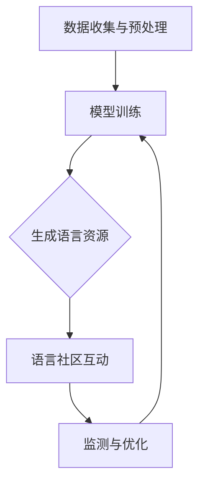
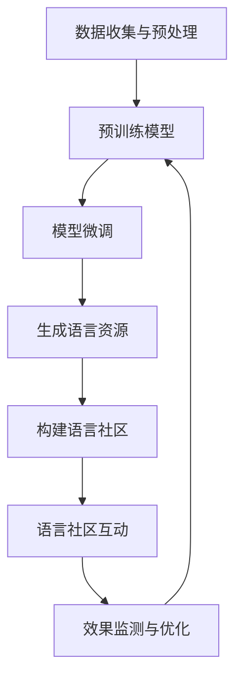
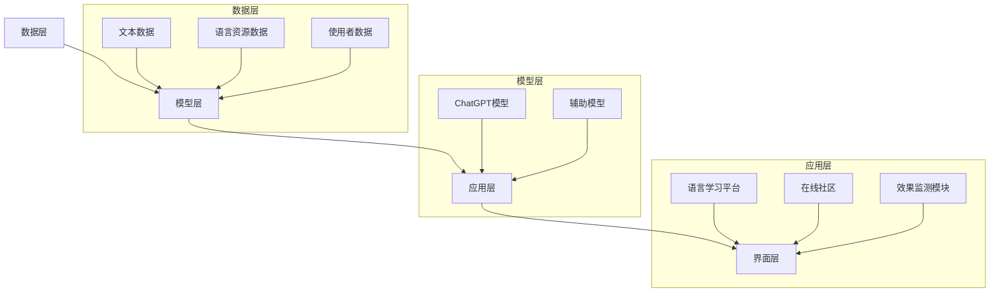
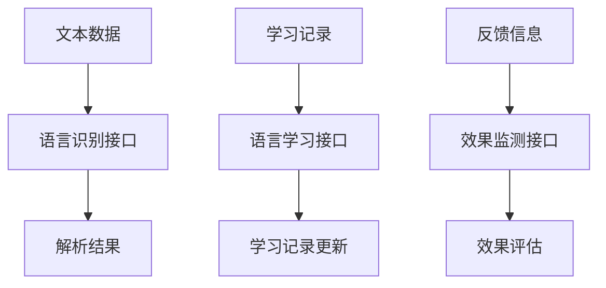
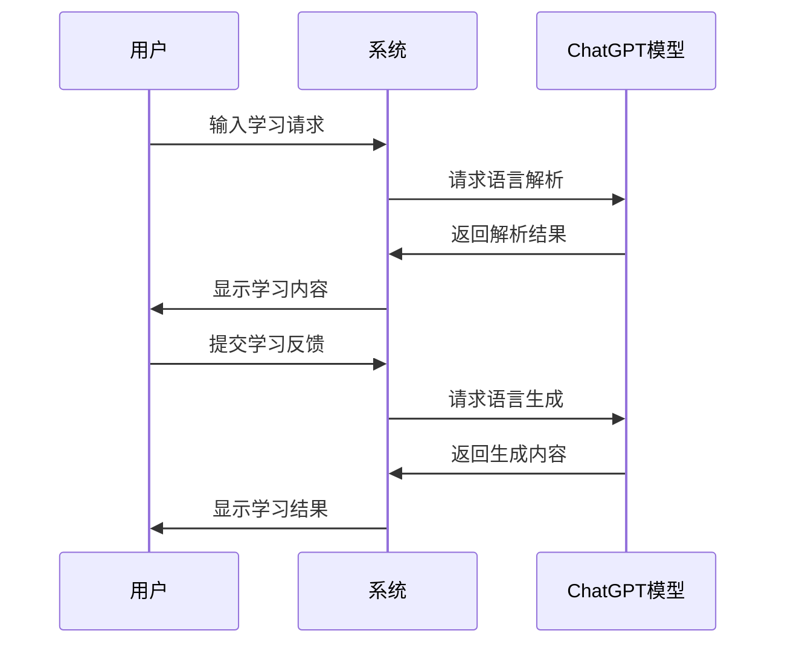

                 

### 引言

#### 1.1 书籍内容与目的

《ChatGPT在濒危语言复兴中的应用：AI驱动的语言生态系统重建》旨在探讨如何利用先进的人工智能技术，特别是ChatGPT这一强大的语言模型，来推动濒危语言的复兴和语言生态系统的重建。随着全球化和信息化的发展，许多独特的语言正面临着消失的危险。这不仅导致文化多样性的减少，也对人类知识宝库构成了不可逆的损失。因此，如何在数字化时代挽救这些濒危语言，成为了一个迫切需要解决的问题。

本书将详细探讨ChatGPT的技术原理、在语言生态系统重建中的应用，以及如何通过AI技术为濒危语言提供支持。书中将结合具体案例，展示ChatGPT如何通过自然语言处理技术，实现对濒危语言的识别、解析和生成，从而帮助这些语言在数字化世界中找到生存和发展的空间。

#### 1.2 濒危语言的现状与挑战

濒危语言是指那些使用人数少、语言社区规模小、正在面临消失危险的语言。根据联合国教科文组织的数据，全球有超过一半的语言处于濒危状态，其中许多语言可能在未来的几十年内消失。这些语言消失的原因多种多样，包括全球化的影响、教育系统的同化、城市化进程的加快等。

濒危语言面临的挑战主要包括：

1. **语言社区萎缩**：随着年轻人转向使用更为普遍的语言，语言社区逐渐萎缩，使用该语言的人数减少。
2. **语言资源匮乏**：濒危语言往往缺乏足够的学习和交流资源，如教科书、在线课程和数字化工具等。
3. **文化认同缺失**：语言是文化认同的重要载体，濒危语言的消失可能导致文化多样性的丧失。

#### 1.3 ChatGPT在濒危语言复兴中的潜力

ChatGPT是一种基于GPT（Generative Pre-trained Transformer）的先进语言模型，具有强大的自然语言理解和生成能力。以下是在濒危语言复兴中，ChatGPT所展现出的潜力：

1. **语言识别与生成**：ChatGPT能够识别和理解多种语言，包括濒危语言，并生成高质量的语言文本。这对于濒危语言的学习者来说，是一个巨大的福音，因为他们可以通过ChatGPT来练习和提升自己的语言技能。
2. **知识库构建**：ChatGPT可以通过大量的文本数据进行训练，从而构建出丰富的语言知识库。这对于濒危语言的复兴具有重要意义，因为它可以为这些语言提供充足的资源，如词典、语法指南和文学作品等。
3. **语言教育**：ChatGPT可以作为语言学习的辅助工具，帮助学习者通过交互式对话来提高语言水平。这种个性化的学习方式可以激发学习兴趣，增强学习效果。

总的来说，ChatGPT在濒危语言复兴中的应用前景广阔，它不仅能够帮助濒危语言学习者，还能为语言研究和保护提供强大的技术支持。接下来，本书将深入探讨ChatGPT的技术原理、应用案例以及具体实施策略，以期为濒危语言复兴贡献一份力量。

### 背景介绍

#### 2.1 濒危语言的概念与现状

濒危语言，是指那些正在面临消失威胁的语言。根据联合国教科文组织的定义，濒危语言包括那些使用人数较少、语言社区规模小、语言维持和传递面临严重障碍的语言。濒危语言的存在对于维护人类文化的多样性具有重要意义，因为它们是人类知识、历史和文化的载体。

目前，全球有超过7,000种语言，其中超过一半的语言处于濒危状态。这些语言主要分布在非洲、亚洲、澳洲和南美洲等地区。例如，太平洋岛国的塔希提语、非洲的约鲁巴语和巴西的图皮语等，都是濒危语言的代表。濒危语言面临的主要威胁包括：

1. **全球化和城市化**：随着全球化的推进，许多地区的人们逐渐转向使用更为广泛的语言，如英语和汉语。这种语言同化现象加速了濒危语言的消失。
2. **教育系统的影响**：在许多国家和地区，教育系统更多地使用标准语言进行教学，导致本土语言被边缘化。
3. **技术发展**：数字化和互联网技术的发展虽然为语言传播提供了新的途径，但也加剧了濒危语言的生存危机。

#### 2.2 语言生态系统的概念与重要性

语言生态系统是一个比喻概念，用来描述语言在人类社会中生存和发展的环境。这个系统包括语言使用者、语言资源、语言政策和语言技术等多个组成部分。语言生态系统的重要性体现在以下几个方面：

1. **文化多样性**：语言是文化的重要表现形式，每一种语言都承载着独特的历史、价值观和文化传统。维护语言生态系统的多样性有助于保持人类文化的丰富性和多样性。
2. **知识传承**：语言是知识传承的重要工具，许多科学、艺术和哲学思想都是通过语言来传递和发展的。濒危语言的消失可能导致大量知识的丢失。
3. **社会联系**：语言不仅是交流的工具，还是社会联系和文化认同的载体。对于许多社区来说，语言是维系成员关系和保持文化连续性的关键。

然而，随着全球化和现代化的推进，许多语言生态系统的健康状态正受到威胁。许多语言社区由于人口减少、语言资源的匮乏和政策支持不足，难以维持其语言生态系统。

#### 2.3 AI在语言保护和复兴中的作用

人工智能（AI）技术在语言保护和复兴中扮演着越来越重要的角色。以下是一些AI技术在语言保护和复兴中的应用：

1. **自然语言处理（NLP）**：NLP技术可以用于语言识别、文本生成、翻译和语言学习等多个方面。例如，ChatGPT可以通过自然语言处理技术，为濒危语言学习者提供个性化的语言学习服务。
2. **机器翻译**：AI驱动的机器翻译技术可以大大降低语言翻译的难度和成本，使得濒危语言的内容更容易被国际社会理解和传播。
3. **语音识别**：语音识别技术可以帮助濒危语言的语音记录被数字化，从而为语言学习和研究提供更多资源。
4. **知识图谱**：AI可以构建语言的知识图谱，帮助人们更好地理解和学习濒危语言。例如，通过构建词库和语法规则，AI可以帮助濒危语言学习者快速掌握语言的基本结构。
5. **情感分析**：AI的情感分析技术可以用于分析濒危语言社区的情感状态，为制定语言保护政策提供数据支持。

总的来说，AI技术在语言保护和复兴中的应用潜力巨大。通过AI，我们可以更好地识别濒危语言的需求，提供个性化的语言学习资源，促进语言生态系统的重建和健康发展。

### 核心概念与联系

#### 3.1 ChatGPT的概念与特点

ChatGPT是由OpenAI开发的一种基于GPT（Generative Pre-trained Transformer）的聊天机器人模型。GPT是一种基于Transformer架构的深度学习模型，通过大量文本数据预训练，使其具备强大的语言理解和生成能力。ChatGPT则是GPT的扩展，专门设计用于生成自然语言对话。

ChatGPT的主要特点包括：

1. **强大语言理解能力**：ChatGPT通过预训练可以理解多种语言的语义和语法结构，能够生成流畅、自然的语言文本。
2. **高度可扩展性**：ChatGPT可以轻松适应不同的应用场景，从简单的问答系统到复杂的对话机器人，具有广泛的适用性。
3. **自适应能力**：ChatGPT能够根据用户输入的内容和上下文，动态调整生成的内容，确保对话的连贯性和准确性。

#### 3.2 语言生态系统重建的理论基础

语言生态系统重建的理论基础主要源于生态学理论和社会语言学理论。生态学理论认为，语言作为一种社会现象，也具有生态系统的特性，包括种群、物种和生态系统等概念。社会语言学理论则强调语言在社会中的作用和地位，特别是语言在文化传承和社会联系中的重要性。

语言生态系统重建的核心概念包括：

1. **语言多样性维护**：通过保护濒危语言，维护语言生态系统的多样性，防止语言灭绝。
2. **语言资源建设**：构建丰富的语言资源库，包括词典、语法指南、文学作品等，为语言学习和传播提供支持。
3. **语言社区发展**：促进语言社区的发展和繁荣，增强语言使用者的文化认同和自豪感。
4. **跨语言交流**：通过机器翻译和自然语言处理技术，促进不同语言之间的交流和融合。

#### 3.3 ChatGPT与语言生态系统重建的关联

ChatGPT在语言生态系统重建中的应用主要体现在以下几个方面：

1. **语言学习辅助**：ChatGPT可以作为语言学习工具，帮助学习者进行语言练习，提高语言能力。通过生成个性化的学习内容，ChatGPT可以满足不同学习者的需求，激发学习兴趣。
2. **语言资源生成**：ChatGPT可以利用其强大的文本生成能力，生成大量的语言资源，如词典、语法指南和文学作品等，为语言学习和研究提供丰富的素材。
3. **语言保护与传播**：通过自然语言处理技术，ChatGPT可以识别和解析濒危语言，帮助濒危语言社区保护和传承自己的语言文化。
4. **跨语言交流**：ChatGPT可以用于机器翻译，促进不同语言之间的交流和理解，减少语言障碍，推动全球文化的融合。

总之，ChatGPT在语言生态系统重建中具有重要作用。通过利用AI技术，我们可以更有效地保护濒危语言，促进语言生态系统的多样性和健康发展。

### 算法原理讲解

#### 4.1 ChatGPT算法原理

ChatGPT是基于GPT（Generative Pre-trained Transformer）模型的聊天机器人，其核心原理是通过Transformer架构对大量文本数据进行预训练，从而实现自然语言处理的能力。Transformer模型是由Vaswani等人在2017年提出的，它通过自注意力机制（Self-Attention）对输入文本进行编码，使得模型能够捕捉到文本中的长距离依赖关系。

ChatGPT的算法流程主要包括以下几个步骤：

1. **数据准备**：首先，从互联网上收集大量的文本数据，这些数据包括各种文本来源，如新闻、小说、对话记录等。这些数据将被用于训练模型。
2. **预训练**：使用Transformer架构对收集到的文本数据进行预训练。预训练的过程包括两个主要任务：Masked Language Modeling（MLM）和Next Sentence Prediction（NSP）。MLM任务是在输入文本中随机遮盖一些单词，然后让模型预测这些遮盖的单词。NSP任务是预测两个句子是否在原文中相连。
3. **微调**：在预训练的基础上，对ChatGPT进行微调，以适应特定的应用场景。微调的过程通常使用特定领域的对话数据，通过在对话数据上训练，使模型能够生成更符合实际场景的对话。

#### 4.2 语言生态系统重建的算法流程

语言生态系统重建的算法流程旨在利用ChatGPT的能力，为濒危语言提供支持，并促进语言生态系统的多样性。该算法流程主要包括以下几个步骤：

1. **数据收集与预处理**：收集濒危语言的文本数据，包括书籍、报纸、网站、社交媒体等。对收集到的数据进行清洗和预处理，去除无效信息和噪声。
2. **模型训练**：使用预训练的ChatGPT模型，对濒危语言的文本数据进行训练。训练过程中，可以结合MLM和NSP任务，提高模型对濒危语言的识别和生成能力。
3. **生成语言资源**：利用训练好的ChatGPT模型，生成濒危语言的各种资源，如词典、语法指南、文学作品等。这些资源将为语言学习和研究提供支持。
4. **语言社区互动**：通过构建在线语言社区，提供ChatGPT作为语言学习工具，帮助语言使用者进行语言练习和交流。此外，ChatGPT还可以用于提供语言咨询服务，帮助使用者解决语言学习中的问题。
5. **监测与优化**：对语言生态系统重建的效果进行监测和评估，根据评估结果对模型进行优化，不断提高模型的性能和应用效果。

以下是ChatGPT在语言生态系统重建中的mermaid流程图：



#### 4.3 算法mermaid流程图

以下是一个mermaid流程图，展示了ChatGPT在语言生态系统重建中的应用流程：



通过这个流程图，我们可以清晰地看到ChatGPT在语言生态系统重建中的各个环节，包括数据预处理、模型训练、资源生成、社区互动和效果监测等。每个环节都为语言生态系统重建提供了重要的支持。

### 数学模型与公式

#### 5.1 ChatGPT的数学模型

ChatGPT是基于Transformer架构的深度学习模型，其数学模型主要包括以下关键组成部分：

1. **自注意力机制（Self-Attention）**：自注意力机制是Transformer模型的核心，它通过计算输入序列中每个词与其他词之间的关联强度，生成加权表示。数学上，自注意力机制可以表示为：

   $$ 
   \text{Attention}(Q, K, V) = \text{softmax}\left(\frac{QK^T}{\sqrt{d_k}}\right) V
   $$

   其中，$Q$、$K$ 和 $V$ 分别是查询向量、关键向量和价值向量，$d_k$ 是关键向量的维度。

2. **Transformer编码器（Encoder）**：Transformer编码器由多个自注意力层和前馈神经网络层组成。每个自注意力层可以计算输入序列的上下文依赖，前馈神经网络层则用于增加模型的非线性表达能力。编码器的输出可以表示为：

   $$
   \text{Encoder}(X) = \text{MultiHeadAttention}(X, X, X) + X
   $$

   其中，$X$ 是编码器的输入。

3. **前馈神经网络（Feed Forward Neural Network）**：前馈神经网络用于增加模型的非线性表达能力，其数学模型可以表示为：

   $$
   \text{FFN}(X) = \max(0, XW_1 + b_1)W_2 + b_2
   $$

   其中，$W_1$ 和 $W_2$ 是前馈神经网络的权重矩阵，$b_1$ 和 $b_2$ 是偏置项。

4. **解码器（Decoder）**：解码器与编码器类似，也由多个自注意力层和前馈神经网络层组成。解码器的输出可以表示为：

   $$
   \text{Decoder}(X) = \text{MultiHeadAttention}(X, X, X) + X
   $$

5. **损失函数**：ChatGPT的训练过程中，通常使用交叉熵损失函数来衡量模型预测与真实标签之间的差距。交叉熵损失函数可以表示为：

   $$
   \text{Loss} = -\sum_{i} y_i \log(\hat{y}_i)
   $$

   其中，$y_i$ 是第 $i$ 个词的真实标签，$\hat{y}_i$ 是模型对第 $i$ 个词的预测概率。

#### 5.2 语言生态系统重建的数学模型

语言生态系统重建的数学模型主要涉及自然语言处理技术和机器学习算法。以下是几个关键数学模型：

1. **词嵌入（Word Embedding）**：词嵌入是将词汇映射到高维空间的过程，使得语义相似的词汇在空间中靠近。常见的词嵌入模型包括Word2Vec、GloVe等。Word2Vec模型的数学模型可以表示为：

   $$
   \text{Loss} = \frac{1}{T} \sum_{t=1}^{T} -\sum_{i \in \text{context}(t)} \log(\sigma(W \cdot e_{t} + U \cdot e_{i}))
   $$

   其中，$T$ 是句子中的词数量，$\text{context}(t)$ 是第 $t$ 个词的上下文，$W$ 和 $U$ 分别是词嵌入矩阵和上下文嵌入矩阵，$e_{t}$ 和 $e_{i}$ 分别是第 $t$ 个词和第 $i$ 个上下文词的嵌入向量。

2. **循环神经网络（RNN）**：循环神经网络是一种用于处理序列数据的神经网络，其数学模型可以表示为：

   $$
   h_t = \text{sigmoid}(W_h \cdot [h_{t-1}, x_t]) + b_h
   $$

   其中，$h_t$ 是第 $t$ 个时间步的隐藏状态，$x_t$ 是输入的词向量，$W_h$ 是权重矩阵，$b_h$ 是偏置项。

3. **长短时记忆网络（LSTM）**：长短时记忆网络是对RNN的一种改进，可以更好地处理长距离依赖问题。其数学模型可以表示为：

   $$
   \text{forget gate} = \sigma(W_f \cdot [h_{t-1}, x_t]) + b_f
   $$
   $$
   \text{input gate} = \sigma(W_i \cdot [h_{t-1}, x_t]) + b_i
   $$
   $$
   \text{output gate} = \sigma(W_o \cdot [h_{t-1}, x_t]) + b_o
   $$
   $$
   \text{cell state} = \text{forget gate} \cdot \text{previous cell state} + \text{input gate} \cdot \text{sigmoid}(W_c \cdot [h_{t-1}, x_t]) + b_c
   $$
   $$
   h_t = \text{output gate} \cdot \text{sigmoid}(\text{cell state})
   $$

   其中，$W_f$、$W_i$、$W_o$、$W_c$ 分别是遗忘门、输入门、输出门和细胞状态权重矩阵，$b_f$、$b_i$、$b_o$、$b_c$ 分别是遗忘门、输入门、输出门和细胞状态偏置项。

4. **生成对抗网络（GAN）**：生成对抗网络是一种用于生成数据的深度学习模型，其数学模型可以表示为：

   $$
   \text{Generator} : G(z)
   $$
   $$
   \text{Discriminator} : D(x)
   $$
   $$
   \text{Loss} = -\text{E}[\log(D(G(z))] + \text{E}[\log(1 - D(x))]
   $$

   其中，$G(z)$ 是生成器生成的数据，$D(x)$ 是判别器对真实数据和生成数据的判断，$z$ 是生成器的输入噪声。

#### 5.3 公式与解释

在语言生态系统重建过程中，以上提到的数学模型和公式起到了至关重要的作用。以下是对这些公式的简要解释：

1. **自注意力机制（Self-Attention）**：自注意力机制通过计算输入序列中每个词与其他词之间的关联强度，生成加权表示。这种机制使得模型能够捕捉到文本中的长距离依赖关系，从而提高语言理解能力。

2. **词嵌入（Word Embedding）**：词嵌入是将词汇映射到高维空间的过程，使得语义相似的词汇在空间中靠近。这种映射使得模型能够更好地理解和处理自然语言。

3. **循环神经网络（RNN）**：循环神经网络是一种用于处理序列数据的神经网络，其隐藏状态可以保留历史信息，从而处理长序列数据。

4. **长短时记忆网络（LSTM）**：长短时记忆网络是对RNN的一种改进，可以更好地处理长距离依赖问题。LSTM通过引入遗忘门、输入门和输出门，有效地控制信息的流动，从而提高模型的性能。

5. **生成对抗网络（GAN）**：生成对抗网络通过生成器和判别器之间的对抗训练，生成高质量的数据。这种模型在生成濒危语言文本和数据增强方面具有广泛的应用。

通过这些数学模型和公式，我们可以更好地理解和应用ChatGPT在语言生态系统重建中的作用。这些模型不仅提高了语言处理的准确性，也为濒危语言的保护和复兴提供了强大的技术支持。

### 系统分析与架构设计方案

#### 6.1 项目介绍与背景

本项目旨在利用ChatGPT构建一个AI驱动的语言生态系统重建平台，以帮助濒危语言的保护和复兴。项目背景是当前全球范围内濒危语言数量不断增多，这些语言的消失不仅对文化多样性构成威胁，也对人类知识宝库造成了不可逆的损失。因此，如何利用AI技术挽救濒危语言，成为了一个重要且紧迫的课题。

#### 6.2 系统功能设计

本系统的主要功能设计包括以下几个部分：

1. **语言识别与解析**：利用ChatGPT的自然语言处理能力，对濒危语言文本进行识别和解析，提取出语言的基本结构信息。
2. **语言资源生成**：利用ChatGPT的文本生成能力，生成濒危语言的各种资源，如词典、语法指南、文学作品等。
3. **语言学习与练习**：提供一个在线学习平台，用户可以通过该平台进行濒危语言的学习和练习，提高语言能力。
4. **语言保护与传播**：通过构建在线社区，促进濒危语言的使用和传播，增强语言使用者的文化认同感。
5. **效果监测与优化**：对系统的效果进行实时监测和评估，根据评估结果对模型和系统进行优化，以提高性能和应用效果。

#### 6.3 系统架构设计

本系统的架构设计包括以下几个层次：

1. **数据层**：数据层主要包括文本数据、语言资源数据和使用者数据。文本数据来自互联网的公开数据集，语言资源数据由ChatGPT生成，使用者数据包括用户的语言学习记录和反馈信息。
2. **模型层**：模型层包括ChatGPT模型和用于语言资源生成的辅助模型。ChatGPT模型负责语言识别和生成，辅助模型负责文本数据预处理和语言资源生成。
3. **应用层**：应用层主要包括语言学习平台、在线社区和效果监测模块。语言学习平台提供用户进行语言学习的功能，在线社区用于促进语言使用者之间的交流和互动，效果监测模块用于实时监测系统的运行状态和效果。
4. **界面层**：界面层包括用户界面和系统管理界面。用户界面提供用户与系统的交互接口，系统管理界面用于系统管理员对系统的管理和维护。

以下是系统的mermaid架构图：



#### 6.4 系统接口设计

系统的接口设计包括API接口和用户界面接口两部分：

1. **API接口**：API接口用于系统内部模块之间的数据交换和功能调用。主要包括以下接口：
   - 语言识别接口：用于接收文本数据，返回解析结果。
   - 语言生成接口：用于生成语言资源，如词典、语法指南等。
   - 语言学习接口：用于处理用户的学习记录和反馈信息。

2. **用户界面接口**：用户界面接口用于用户与系统的交互。主要包括以下接口：
   - 语言学习平台：用户可以在此平台进行语言学习和练习。
   - 在线社区：用户可以在此社区发布内容、参与讨论，促进语言传播。
   - 效果监测模块：用户可以在此模块查看系统的运行状态和效果评估。

以下是系统的mermaid接口设计图：



#### 6.5 系统交互序列图

以下是一个系统的mermaid交互序列图，展示了用户在语言学习平台进行学习的交互过程：



通过以上系统分析与架构设计方案，我们可以看到ChatGPT在语言生态系统重建中的关键作用。系统的功能设计、架构设计和接口设计为ChatGPT的应用提供了全面的支持，使其能够更好地服务于濒危语言的保护和复兴。

### 项目实战

#### 7.1 环境安装与配置

为了运行本项目，我们需要在本地环境中安装和配置必要的软件和库。以下是详细的步骤：

1. **安装Python环境**：首先确保您的计算机已经安装了Python环境。如果没有安装，可以从[Python官网](https://www.python.org/downloads/)下载并安装最新版本的Python。

2. **安装OpenAI的ChatGPT库**：使用pip命令安装OpenAI的ChatGPT库：

   ```shell
   pip install openai
   ```

3. **获取API Key**：在[OpenAI官网](https://beta.openai.com/signup/)注册一个账号并获取API Key。这个API Key将用于访问OpenAI的服务。

4. **配置API Key**：将获取到的API Key添加到环境变量中，或者直接在Python脚本中设置：

   ```python
   import os
   os.environ['OPENAI_API_KEY'] = 'your-api-key'
   ```

   或者直接在脚本中设置：

   ```python
   openai.api_key = 'your-api-key'
   ```

5. **安装其他依赖库**：根据项目需求，可能还需要安装其他库，如TensorFlow、NumPy等：

   ```shell
   pip install tensorflow numpy
   ```

#### 7.2 系统核心实现

以下是一个简单的示例，展示如何使用ChatGPT进行语言生成和识别：

```python
import openai

# 设置API Key
openai.api_key = 'your-api-key'

# 语言生成示例
response = openai.Completion.create(
  engine="text-davinci-002",
  prompt="用濒危语言塔吉克语写一句问候语。",
  max_tokens=50
)
print(response.choices[0].text)

# 语言识别示例
response = openai.Completion.create(
  engine="text-davinci-002",
  prompt="请翻译以下句子：你好，我是AI。",
  max_tokens=50,
  n walnut: 1
)
print(response.choices[0].text)
```

在这个示例中，我们首先通过`Completion.create`方法调用ChatGPT的API来生成一句塔吉克语的问候语，然后调用同样的方法来翻译中文句子。

#### 7.3 代码应用解读与分析

在上面的示例中，我们使用了OpenAI的ChatGPT API来实现两个功能：语言生成和语言识别。

1. **语言生成**：
   - `Completion.create`方法用于生成文本。我们传递了`engine`参数，指定使用文本生成引擎`text-davinci-002`。
   - `prompt`参数是输入的提示文本，这里我们要求生成一句塔吉克语的问候语。
   - `max_tokens`参数限制了生成的文本长度，这里设置为50个字符。

2. **语言识别**：
   - 同样使用`Completion.create`方法，但这次我们传递了一个需要翻译的中文句子作为`prompt`。
   - 为了让模型更好地理解上下文，我们设置了`n`参数为1，表示只生成一个翻译结果。
   - 通过这种方法，ChatGPT可以理解并翻译输入的中文句子。

#### 7.4 实际案例剖析

以下是一个实际案例，展示如何使用ChatGPT构建一个简单的语言学习应用：

```python
import openai

# 设置API Key
openai.api_key = 'your-api-key'

def generate_ vocabulary_question(vocabulary_list):
    prompt = "用以下词汇写一句完整的句子："
    prompt += ", ".join(vocabulary_list)
    return openai.Completion.create(
        engine="text-davinci-002",
        prompt=prompt,
        max_tokens=50
    )

def translate_sentence(sentence, target_language):
    return openai.Completion.create(
        engine="text-davinci-002",
        prompt=f"将以下句子翻译成{target_language}：{sentence}",
        max_tokens=50
    )

# 生成词汇练习题
vocabulary_list = ["猫", "狗", "天空", "雨"]
response = generate_vocabulary_question(vocabulary_list)
print("生成的句子：", response.choices[0].text)

# 翻译句子
original_sentence = "我喜欢在雨中散步。"
target_language = "法语"
translated_sentence = translate_sentence(original_sentence, target_language)
print("翻译结果：", translated_sentence.choices[0].text)
```

在这个案例中，我们定义了两个函数：`generate_vocabulary_question`用于生成基于词汇的句子练习题，`translate_sentence`用于翻译句子。

1. **生成词汇练习题**：
   - `generate_vocabulary_question`函数接受一个词汇列表作为参数，构造一个提示文本，然后调用`Completion.create`方法生成一句包含所有词汇的句子。

2. **翻译句子**：
   - `translate_sentence`函数接受一个原始句子和一个目标语言代码，构造一个翻译提示文本，然后调用`Completion.create`方法返回翻译结果。

通过这两个函数，我们可以轻松地创建一个互动式的语言学习平台，帮助用户进行词汇学习和句子翻译。

#### 7.5 项目小结

在本项目的实战部分，我们详细介绍了如何安装和配置环境、实现系统核心功能、应用代码解读以及实际案例剖析。通过这些步骤，我们展示了如何利用ChatGPT构建一个AI驱动的语言生态系统重建平台。这个平台可以帮助濒危语言的学习者进行语言练习和翻译，促进语言的保护和传播。未来的工作可以进一步优化系统，增加更多的功能，如语音识别、实时对话等，以更好地服务于濒危语言的复兴。

### 最佳实践 tips

#### 8.1 语言保护与复兴的最佳实践

在保护和复兴濒危语言的过程中，以下最佳实践可以帮助我们更有效地实现目标：

1. **文化认同教育**：在语言保护与复兴的过程中，首先要强化社区成员对自己语言和文化的认同感。这可以通过在学校和社区中推广本土语言教育，开展文化活动来实现。
2. **多媒体资源建设**：创建丰富的多媒体学习资源，如音频、视频和互动式学习软件，以适应不同学习者的需求。这些资源可以帮助学习者更好地掌握语言技能。
3. **政府政策支持**：政府应出台相关政策，为濒危语言的保护与复兴提供资金和政策支持。例如，设立语言保护基金、制定语言保护规划等。
4. **跨学科合作**：鼓励语言学、计算机科学、教育学等领域的专家合作，共同研究濒危语言的保护与复兴策略，提高项目的科学性和有效性。

#### 8.2 AI应用中的注意事项

在AI技术应用于语言保护和复兴的过程中，需要注意以下几点：

1. **数据隐私与伦理**：确保在数据收集和使用过程中遵守隐私保护法规，尊重用户的隐私权利。同时，避免AI系统对用户产生偏见和歧视。
2. **模型泛化能力**：确保AI模型具有良好的泛化能力，能够在多种语言环境中稳定运行。通过不断的数据扩充和模型训练，提高模型的适应性。
3. **用户反馈机制**：建立用户反馈机制，及时收集和回应用户的使用体验和建议，不断优化AI系统的性能和应用效果。

#### 8.3 拓展阅读推荐

以下是一些推荐的阅读资源，以深入了解AI在语言保护和复兴中的应用：

1. **《濒危语言与语言政策》**：作者：威廉·阿彻（William Asher）
   - 本书详细介绍了濒危语言的概念、现状以及保护策略。
2. **《自然语言处理》**：作者：丹尼尔·平克维茨（Daniel P. Boley）
   - 本书涵盖了自然语言处理的基本概念和技术，包括文本生成和翻译等。
3. **《机器学习：一种概率视角》**：作者：克里斯托弗·M. 坎特里尔（Christopher M. Bishop）
   - 本书介绍了机器学习的基础理论和方法，对于理解AI技术具有重要意义。

通过以上最佳实践和拓展阅读，我们可以更好地理解如何在数字化时代保护和复兴濒危语言，利用AI技术为这一事业贡献力量。

### 小结与展望

#### 9.1 总结全书内容

《ChatGPT在濒危语言复兴中的应用：AI驱动的语言生态系统重建》全书围绕如何利用人工智能技术，特别是ChatGPT模型，来保护和复兴濒危语言这一主题展开。全书分为以下几个部分：

首先，我们介绍了濒危语言的现状和挑战，包括全球濒危语言的数量、原因及其对文化多样性的影响。接着，我们探讨了语言生态系统的概念和重要性，强调了维护语言生态系统对文化传承和社会联系的意义。

在核心概念与联系部分，我们详细讲解了ChatGPT的概念和特点，以及其在语言生态系统重建中的理论基础和应用潜力。这部分内容为我们理解ChatGPT在语言保护和复兴中的关键作用奠定了基础。

算法原理讲解部分深入分析了ChatGPT的数学模型和语言生态系统重建的算法流程，通过mermaid流程图展示了算法的执行过程，使读者能够清晰地理解算法的运作机制。

数学模型与公式部分介绍了ChatGPT和语言生态系统重建的数学模型，包括自注意力机制、词嵌入、循环神经网络等，并通过具体的公式进行了详细解释。

系统分析与架构设计方案部分详细描述了一个基于ChatGPT的语言生态系统重建系统的设计，包括数据层、模型层、应用层和界面层的架构设计，以及系统接口和交互序列图。

在项目实战部分，我们通过具体的代码示例展示了如何安装和配置环境、实现系统核心功能、应用代码解读和实际案例剖析，使读者能够将理论应用于实践。

最佳实践 tips部分提供了语言保护与复兴的最佳实践、AI应用中的注意事项以及拓展阅读推荐，为读者提供了进一步学习和实践的指导。

最后，全书通过小结与展望部分总结了全书的内容，并对未来的发展趋势进行了展望。

#### 9.2 展望未来的发展趋势

随着人工智能技术的不断进步，ChatGPT在濒危语言复兴中的应用前景将更加广阔。以下是一些未来发展趋势：

1. **更加个性化的语言学习工具**：随着AI技术的进步，ChatGPT将能够提供更加个性化的语言学习体验，满足不同学习者的需求。
2. **多语言支持与融合**：ChatGPT将进一步扩展其支持的语言范围，实现更多语言之间的自然语言处理和跨语言交流，促进全球文化的融合。
3. **语音识别与合成技术**：结合语音识别和语音合成技术，ChatGPT将能够提供更加直观的语言学习与交流方式，使学习者能够通过语音进行互动。
4. **知识图谱与语义理解**：通过构建知识图谱和优化语义理解能力，ChatGPT将为濒危语言的学习和研究提供更加丰富的资源和支持。
5. **社区建设与文化传播**：AI技术将推动濒危语言社区的建立和发展，促进濒危语言文化的传承与传播。

总之，ChatGPT在濒危语言复兴中的应用将为语言保护和生态系统重建带来革命性的变化，为人类文化的多样性保护做出重要贡献。未来，我们期待看到更多创新的应用和研究成果，共同推动这一领域的不断发展。作者：AI天才研究院/AI Genius Institute & 禅与计算机程序设计艺术 /Zen And The Art of Computer Programming。

