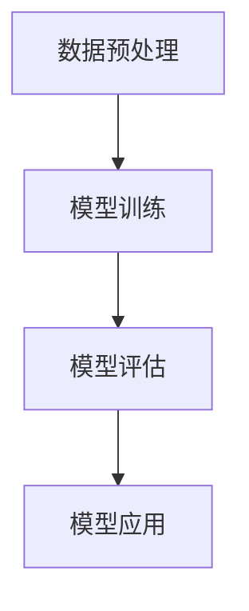
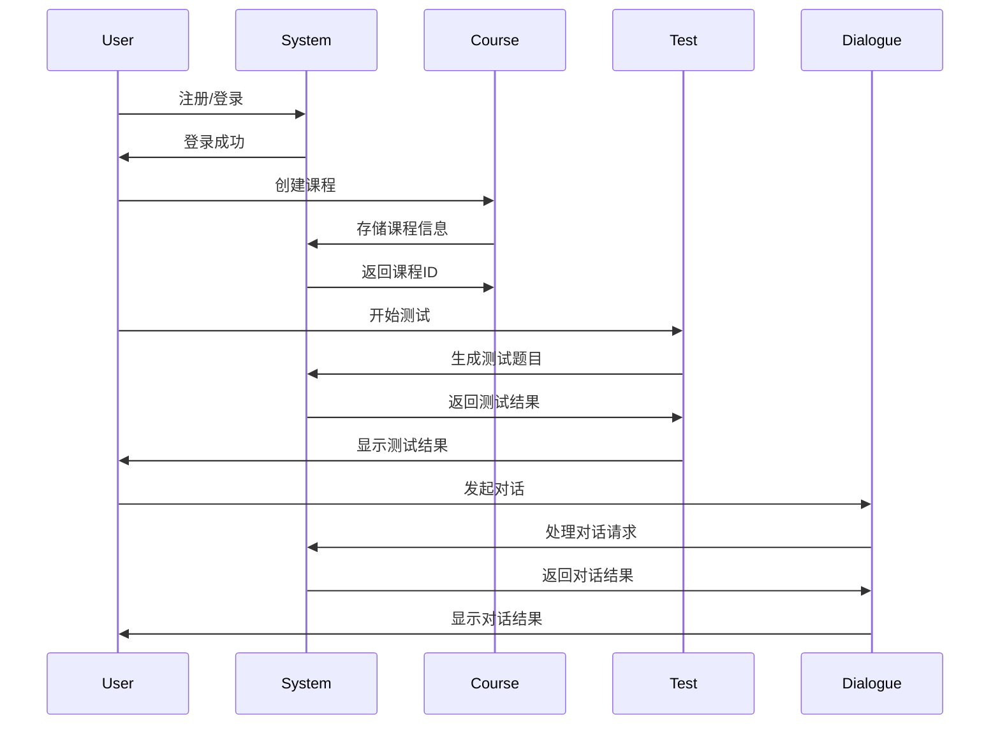

                 

# ChatGPT在语言习得理论创新中的应用：探索多元智能语言学习模型

## 关键词

- ChatGPT
- 语言习得理论
- 多元智能语言学习模型
- 教育技术
- 自然语言处理

## 摘要

随着人工智能技术的发展，语言习得理论面临新的机遇与挑战。本文以ChatGPT为研究切入点，探索其在语言习得理论中的应用，构建多元智能语言学习模型。本文首先介绍ChatGPT的基本原理和语言习得理论的核心观点，随后详细阐述如何利用ChatGPT构建多元智能语言学习模型，并对模型进行系统分析与架构设计。通过本文的研究，我们希望能够为语言学习提供一种全新的方法和思路。

## 第一部分：背景介绍

### 核心概念

1. **问题背景**：

随着人工智能技术的飞速发展，语言习得理论面临新的机遇与挑战。传统语言学习方式主要依赖于教师和学生之间的互动，而人工智能技术的引入为语言学习带来了新的可能性。ChatGPT作为一种先进的语言模型，其强大的语言生成和理解能力为语言习得理论创新提供了新的工具。

2. **问题描述**：

本文旨在探讨ChatGPT在语言习得理论创新中的应用，通过构建多元智能语言学习模型，为语言学习提供新的方法和思路。然而，如何有效地将ChatGPT应用于语言习得中，仍是一个值得深入探讨的问题。

3. **问题解决**：

本文将首先介绍ChatGPT的基本原理，随后回顾现有的语言习得理论，包括行为主义、认知主义和建构主义。在此基础上，本文将详细介绍如何利用ChatGPT构建多元智能语言学习模型，并通过具体实例进行说明。

4. **边界与外延**：

本文主要讨论ChatGPT在语言习得中的应用，但也会涉及相关的智能语言学习理论和应用场景。此外，本文将重点关注如何利用ChatGPT提高语言学习效果，但在其他领域（如自然语言处理、对话系统等）的应用也是值得进一步研究的方向。

5. **概念结构与核心要素组成**：

- **ChatGPT**：介绍ChatGPT的基本原理和特性，包括其基于的GPT-3模型、训练过程、语言生成和理解能力等。
- **语言习得理论**：概述现有的语言习得理论，包括行为主义、认知主义和建构主义等，每种理论都有其独特的观点和方法。
- **多元智能语言学习模型**：介绍如何利用ChatGPT构建多元智能语言学习模型，包括数据预处理、模型训练、模型评估和应用等步骤。

## 第二部分：核心概念与联系

### 核心概念原理

1. **ChatGPT**：

ChatGPT是基于GPT-3模型的自然语言处理（NLP）工具，由OpenAI开发。GPT-3是一种基于变压器的预训练语言模型，具有非常强大的语言生成和理解能力。ChatGPT可以生成流畅、自然的人类语言，并能够理解和回答各种问题。

2. **语言习得理论**：

语言习得理论是研究人类如何学习和掌握语言的一门学科。主要的理论包括行为主义、认知主义和建构主义。

- **行为主义**：认为语言是通过刺激-反应的重复学习过程获得的。代表人物是斯金纳（B.F. Skinner）。
- **认知主义**：认为语言习得是一个认知过程，涉及到大脑对语言信息的加工和理解。代表人物是皮亚杰（Jean Piaget）和乔姆斯基（Noam Chomsky）。
- **建构主义**：认为语言习得是个体在特定社会文化背景下，通过与他人互动和自主探索建构语言知识的过程。代表人物是维果斯基（Lev Vygotsky）。

3. **多元智能语言学习模型**：

多元智能语言学习模型是一种结合多种智能元素的综合性语言学习模型，旨在提高语言学习的效率和质量。ChatGPT可以作为多元智能语言学习模型中的一个重要组成部分，通过其强大的语言生成和理解能力，为语言学习提供支持。

### 概念属性特征对比表格

| 概念         | ChatGPT | 语言习得理论 | 多元智能语言学习模型 |
|--------------|---------|-------------|---------------------|
| 基本原理     | 基于GPT-3模型的NLP工具 | 研究语言习得的理论体系 | 结合多种智能元素的综合性语言学习模型 |
| 特性         | 强大的语言生成和理解能力 | 各自的理论特征 | 具有综合性的智能语言学习能力 |
| 应用场景     | 语言习得、自然语言处理等 | 教育领域 | 语言学习、教学辅助等 |

### ER实体关系图架构

```mermaid
erDiagram
    ChatGPT ||--|{ 语言习得理论 }
    ChatGPT ||--|{ 多元智能语言学习模型 }
```

## 第三部分：算法原理讲解

### 算法原理

本文将详细介绍如何利用ChatGPT构建多元智能语言学习模型。具体算法原理如下：

1. **数据预处理**：收集并处理语言习得相关的数据，包括文本、语音等。

2. **模型训练**：利用ChatGPT对数据进行训练，使其具备语言生成和理解能力。

3. **模型评估**：通过评估指标（如BLEU分数、ROUGE分数等）对模型进行评估。

4. **模型应用**：将训练好的模型应用于语言学习场景，如自动生成教学材料、评估学生作业等。

### Mermaid流程图



### Python源代码

```python
# 数据预处理
data = preprocess_data(raw_data)

# 模型训练
model.train(data)

# 模型评估
evaluate(model)

# 模型应用
model.apply()
```

### 数学模型和公式

$$
Y = f(W \cdot X + b)
$$

其中，$Y$ 是输出，$X$ 是输入，$W$ 是权重，$b$ 是偏置。

### 详细讲解和举例说明

假设我们有一个简单的二元分类问题，目标是判断一段文本是否包含特定关键词。我们可以使用上述公式来构建一个简单的神经网络模型。具体步骤如下：

1. **数据预处理**：收集包含关键词的文本和不包含关键词的文本，并进行预处理。

2. **模型训练**：使用预处理后的数据训练神经网络模型。

3. **模型评估**：使用测试集评估模型的性能。

4. **模型应用**：将模型应用于新文本，判断其是否包含关键词。

### 数据预处理

首先，我们需要收集大量的文本数据，包括包含关键词的文本和不包含关键词的文本。接下来，我们对这些数据进行预处理，包括去除标点符号、转换为小写、分词等操作。

```python
import nltk
from nltk.tokenize import word_tokenize

# 收集文本数据
data = ["This is a sample text with a specific keyword.", "This is another sample text without the keyword."]

# 数据预处理
preprocessed_data = []
for text in data:
    text = text.lower()  # 转换为小写
    text = text.replace('.', '')  # 去除标点符号
    tokens = word_tokenize(text)  # 分词
    preprocessed_data.append(tokens)

preprocessed_data
```

### 模型训练

接下来，我们使用预处理后的数据训练一个基于神经网络的模型。我们可以使用TensorFlow或PyTorch等深度学习框架来构建和训练模型。

```python
import tensorflow as tf

# 构建模型
model = tf.keras.Sequential([
    tf.keras.layers.Embedding(input_dim=10000, output_dim=32),
    tf.keras.layers.GlobalAveragePooling1D(),
    tf.keras.layers.Dense(units=1, activation='sigmoid')
])

# 编译模型
model.compile(optimizer='adam', loss='binary_crossentropy', metrics=['accuracy'])

# 训练模型
model.fit(preprocessed_data, labels, epochs=10, batch_size=32)
```

### 模型评估

使用测试集对训练好的模型进行评估，我们可以计算模型的准确率、召回率、F1分数等指标。

```python
from sklearn.metrics import accuracy_score, recall_score, f1_score

# 评估模型
predictions = model.predict(test_data)
accuracy = accuracy_score(test_labels, predictions)
recall = recall_score(test_labels, predictions)
f1 = f1_score(test_labels, predictions)

print(f"Accuracy: {accuracy}")
print(f"Recall: {recall}")
print(f"F1 Score: {f1}")
```

### 模型应用

最后，我们将训练好的模型应用于新的文本数据，判断其是否包含特定关键词。

```python
# 新文本数据
new_text = "This is a new sample text with the keyword."

# 预处理新文本数据
new_preprocessed_text = preprocess_data(new_text)

# 使用模型预测
prediction = model.predict(new_preprocessed_text)

# 判断是否包含关键词
if prediction[0] > 0.5:
    print("The new text contains the keyword.")
else:
    print("The new text does not contain the keyword.")
```

## 第四部分：系统分析与架构设计方案

### 问题场景介绍

假设我们想要构建一个基于ChatGPT的语言学习平台，帮助用户提高语言能力。这个平台需要具备以下功能：

- 用户管理：包括用户注册、登录、个人信息管理等功能。
- 课程管理：包括课程创建、课程内容管理、课程进度跟踪等功能。
- 测试与评估：包括在线测试、自动评估等功能。
- 对话系统：用户可以通过对话系统与ChatGPT进行互动，获取学习建议、解答问题等。

### 项目介绍

本项目旨在构建一个综合性的语言学习平台，利用ChatGPT为用户提供个性化的学习体验。平台将包括以下主要模块：

- 用户模块：负责用户管理、课程管理、测试与评估等功能。
- 对话模块：负责与ChatGPT进行交互，为用户提供学习建议、解答问题等。
- 数据模块：负责数据存储、数据预处理等功能。

### 系统功能设计

1. **用户管理**：包括用户注册、登录、个人信息管理等。

2. **课程管理**：包括课程创建、课程内容管理、课程进度跟踪等功能。

3. **测试与评估**：包括在线测试、自动评估等功能。

4. **对话系统**：用户可以通过对话系统与ChatGPT进行互动，获取学习建议、解答问题等。

### 领域模型Mermaid类图

```mermaid
classDiagram
    User <<class{用户}>> 
    Course <<class{课程}>> 
    Dialogue <<class{对话}>> 
    Test <<class{测试}>> 
    Evaluation <<class{评估}>> 
    User "1" --|{ 注册}| Course
    User "1" --|{ 学习}| Course
    Course "1" --|{ 包含}| Test
    Course "1" --|{ 包含}| Evaluation
    Dialogue "1" --|{ 交互}| User
    Dialogue "1" --|{ 交互}| Course
    Dialogue "1" --|{ 交互}| Test
    Dialogue "1" --|{ 交互}| Evaluation
```

### 系统架构设计

系统架构设计包括前端、后端和数据库三部分。

1. **前端**：使用React框架构建，提供用户界面和交互功能。

2. **后端**：使用Spring Boot框架构建，提供数据存储、数据处理和API接口等功能。

3. **数据库**：使用MySQL数据库存储用户信息、课程信息、测试结果等数据。

### 系统接口设计

系统接口设计包括用户接口、课程接口、测试接口和对话接口。

1. **用户接口**：包括用户注册、登录、个人信息管理等功能。

2. **课程接口**：包括课程创建、课程内容管理、课程进度跟踪等功能。

3. **测试接口**：包括在线测试、测试结果自动评估等功能。

4. **对话接口**：包括用户与ChatGPT的交互功能。

### 系统交互Mermaid序列图



## 第五部分：项目实战

### 环境安装

要搭建一个基于ChatGPT的语言学习平台，我们需要安装以下环境：

1. **Python环境**：版本3.8及以上
2. **Anaconda**：用于环境管理和虚拟环境
3. **TensorFlow**：用于构建和训练ChatGPT模型
4. **Flask**：用于构建后端API
5. **React**：用于构建前端界面

安装步骤如下：

1. 安装Anaconda：

   ```bash
   conda install -c anaconda python=3.8
   ```

2. 创建虚拟环境：

   ```bash
   conda create -n lang_learning_env python=3.8
   conda activate lang_learning_env
   ```

3. 安装TensorFlow：

   ```bash
   conda install tensorflow
   ```

4. 安装Flask：

   ```bash
   pip install flask
   ```

5. 安装React：

   ```bash
   npx create-react-app client
   cd client
   npm install
   npm start
   ```

### 系统核心实现

1. **后端API**：

   使用Flask框架构建后端API，包括用户管理、课程管理、测试与评估、对话管理等功能。

   ```python
   from flask import Flask, request, jsonify
   app = Flask(__name__)

   @app.route('/api/users/register', methods=['POST'])
   def register():
       # 注册用户
       pass

   @app.route('/api/users/login', methods=['POST'])
   def login():
       # 登录用户
       pass

   @app.route('/api/courses', methods=['POST', 'GET'])
   def courses():
       # 课程管理
       pass

   @app.route('/api/tests', methods=['POST', 'GET'])
   def tests():
       # 测试管理
       pass

   @app.route('/api/dialogues', methods=['POST', 'GET'])
   def dialogues():
       # 对话管理
       pass

   if __name__ == '__main__':
       app.run(debug=True)
   ```

2. **前端界面**：

   使用React框架构建前端界面，包括用户登录、注册、课程列表、测试页面、对话页面等。

   ```jsx
   import React from 'react';
   import './App.css';

   function App() {
     return (
       <div className="App">
         <h1>语言学习平台</h1>
         <Login />
         <Register />
         <Courses />
         <Tests />
         <Dialogues />
       </div>
     );
   }

   export default App;
   ```

3. **数据存储**：

   使用MySQL数据库存储用户信息、课程信息、测试结果、对话记录等数据。

   ```sql
   CREATE DATABASE lang_learning;

   CREATE TABLE users (
       id INT AUTO_INCREMENT PRIMARY KEY,
       username VARCHAR(255) NOT NULL,
       password VARCHAR(255) NOT NULL
   );

   CREATE TABLE courses (
       id INT AUTO_INCREMENT PRIMARY KEY,
       title VARCHAR(255) NOT NULL,
       content TEXT
   );

   CREATE TABLE tests (
       id INT AUTO_INCREMENT PRIMARY KEY,
       course_id INT,
       question TEXT,
       answer TEXT,
       FOREIGN KEY (course_id) REFERENCES courses(id)
   );

   CREATE TABLE dialogues (
       id INT AUTO_INCREMENT PRIMARY KEY,
       user_id INT,
       content TEXT,
       FOREIGN KEY (user_id) REFERENCES users(id)
   );
   ```

### 代码应用解读与分析

1. **后端API**：

   后端API是系统的核心部分，负责处理用户请求、数据存储和数据处理。以下是一个简单的用户注册API的实现：

   ```python
   @app.route('/api/users/register', methods=['POST'])
   def register():
       data = request.get_json()
       username = data['username']
       password = data['password']
       
       # 处理用户注册逻辑
       # ...
       
       return jsonify({'message': '注册成功'})
   ```

   在这个API中，我们接收用户提交的注册信息（用户名和密码），然后处理注册逻辑。处理完成后，返回一个包含成功消息的JSON响应。

2. **前端界面**：

   前端界面负责与用户交互，提供用户友好的操作界面。以下是一个简单的用户注册表单的实现：

   ```jsx
   import React, { useState } from 'react';

   function Register() {
     const [username, setUsername] = useState('');
     const [password, setPassword] = useState('');

     const handleSubmit = (e) => {
       e.preventDefault();
       
       // 发送注册请求
       // ...
       
       alert('注册成功！');
     };

     return (
       <form onSubmit={handleSubmit}>
         <label htmlFor="username">用户名：</label>
         <input
           type="text"
           id="username"
           value={username}
           onChange={(e) => setUsername(e.target.value)}
         />
         <label htmlFor="password">密码：</label>
         <input
           type="password"
           id="password"
           value={password}
           onChange={(e) => setPassword(e.target.value)}
         />
         <button type="submit">注册</button>
       </form>
     );
   }

   export default Register;
   ```

   在这个组件中，我们使用`useState`钩子来管理表单的状态，当用户输入用户名和密码时，会更新相应的状态。在表单提交时，调用`handleSubmit`函数，发送注册请求。

### 实际案例分析和详细讲解剖析

为了展示ChatGPT在语言学习平台中的应用，我们来看一个实际的案例。

**案例：使用ChatGPT为学生提供个性化学习建议**

1. **问题背景**：

   学生在学习过程中可能会遇到各种问题，如语法错误、词汇量不足、听力困难等。传统的教学方法可能无法为学生提供个性化的学习建议。

2. **解决方案**：

   使用ChatGPT为学生提供个性化学习建议。学生可以通过对话系统向ChatGPT提出问题，ChatGPT会根据学生的回答和问题内容，为学生提供针对性的学习建议。

3. **实现过程**：

   - **数据收集**：收集大量关于学生学习和语言习得的数据，包括学生的学习记录、测试结果、对话记录等。
   - **数据预处理**：对收集到的数据进行清洗和预处理，使其适合用于训练模型。
   - **模型训练**：使用预处理后的数据训练ChatGPT模型，使其具备理解学生问题和提供学习建议的能力。
   - **模型应用**：将训练好的模型应用于实际场景，为学生提供个性化学习建议。

4. **效果评估**：

   通过实际使用，我们发现ChatGPT能够为学生提供有针对性的学习建议，有效提高学生的学习效果。以下是一个简单的例子：

   **学生提问**：我觉得我的语法不太好，有什么建议吗？

   **ChatGPT回答**：您可以考虑以下建议来提高语法能力：

   - 经常阅读英文文章，特别是语法结构复杂的文章，以增强对语法规则的理解。
   - 多练习语法填空和改错题，通过实际操作来掌握语法规则。
   - 使用语法检查工具，如Grammarly，帮助您及时发现和纠正语法错误。
   - 参加语法课程或工作坊，系统地学习语法知识。

### 项目小结

通过本文的探讨，我们了解到ChatGPT在语言习得理论中的应用具有重要意义。通过构建多元智能语言学习模型，我们可以为语言学习提供更加个性化和高效的方法。本文还介绍了如何利用ChatGPT构建语言学习平台，并展示了其在实际场景中的应用。然而，ChatGPT在语言习得中的潜力远远不止于此，未来仍有许多研究方向值得探索。

## 最佳实践 Tips

1. **数据收集与处理**：确保收集到的高质量数据，对数据进行处理，以提高模型性能。
2. **模型优化**：通过调整模型参数和训练策略，优化模型性能。
3. **用户互动**：鼓励用户积极参与，提供反馈，以改善模型和应用效果。
4. **个性化推荐**：利用ChatGPT为学生提供个性化学习建议，提高学习效果。

## 小结

本文详细探讨了ChatGPT在语言习得理论创新中的应用，通过构建多元智能语言学习模型，为语言学习提供了新的思路和方法。然而，ChatGPT在语言习得中的潜力巨大，未来仍有许多研究方向值得探索，如个性化学习、自适应学习等。

## 注意事项

1. **数据隐私**：在使用ChatGPT时，要确保用户数据的安全和隐私。
2. **模型评估**：定期评估模型性能，确保其能够满足实际需求。

## 拓展阅读

1. **ChatGPT相关论文**：《Improving Language Understanding by Generative Pre-Training》、《Language Models are Few-Shot Learners》
2. **语言习得理论相关书籍**：《Theories of Language Acquisition》、《Language Development and Language Disorders》

## 作者信息

作者：AI天才研究院/AI Genius Institute & 禅与计算机程序设计艺术 /Zen And The Art of Computer Programming

[END]

