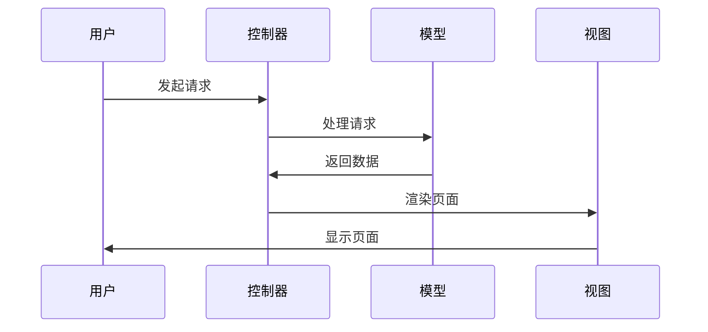
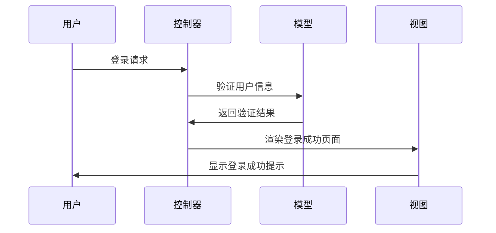

                 


### 第1章: 背景介绍

#### 1.1 问题背景

在全球化加速的背景下，国际间的交流与合作日益频繁，跨文化谈判成为外交与商务活动中不可或缺的一部分。然而，文化差异、语言障碍以及沟通方式的不同，使得跨文化谈判变得复杂且具有挑战性。谈判者不仅需要了解对方的文化背景，还需要掌握有效的沟通技巧和谈判策略。

传统的外交技能培养主要依赖于实践经验和系统的理论学习，但这种方法存在几个问题。首先，实际谈判机会有限，谈判者的实践机会不足。其次，理论学习往往缺乏实际操作的支持，难以将理论知识转化为实际技能。最后，不同文化和语言环境下的谈判策略需要具体问题具体分析，难以通过单一的学习途径获得。

为了解决这些问题，人工智能（AI）技术的应用逐渐受到关注。特别是大型语言模型（如ChatGPT），其在自然语言处理和生成方面的卓越表现，为跨文化谈判训练提供了新的可能。通过AI辅助，谈判者可以在模拟的环境中不断练习，积累经验，提高谈判技能。

#### 1.2 问题描述

在跨文化谈判中，主要的问题可以概括为以下几个方面：

1. **文化差异与误解**：不同文化背景的谈判者可能在价值观、行为习惯、沟通风格等方面存在差异，导致误解和冲突。
2. **语言障碍**：语言差异会直接影响谈判的沟通效率，特别是在专业术语和日常用语的理解上。
3. **谈判策略的局限性**：谈判者往往依赖于传统的谈判策略，但在面对复杂和多变的谈判环境时，这些策略可能不够灵活和有效。
4. **实践机会的缺乏**：现实中的谈判机会有限，谈判者难以在实践中不断学习和提高。

这些问题直接影响了谈判的效果，因此，如何利用AI技术，特别是ChatGPT，来辅助外交技能的培养，成为一个亟待解决的重要课题。

#### 1.3 问题解决

为了解决上述问题，我们可以从以下几个方面着手：

1. **模拟谈判环境**：利用ChatGPT构建一个虚拟的谈判环境，让谈判者在模拟的场景中练习和提升技能。
2. **文化差异培训**：ChatGPT可以提供关于不同文化的详细介绍，帮助谈判者了解和理解对方的文化背景。
3. **语言能力提升**：ChatGPT能够进行自然语言理解和生成，可以帮助谈判者提高语言沟通能力，减少误解。
4. **谈判策略优化**：通过分析大量的谈判案例，ChatGPT可以提供多种策略供谈判者选择，帮助其灵活应对不同情境。
5. **实践与反馈**：ChatGPT可以记录谈判者的每次练习，提供详细的反馈，帮助其不断改进。

#### 1.4 边界与外延

在探讨ChatGPT在跨文化谈判训练中的应用时，我们需要明确一些边界和范围：

1. **应用范围**：ChatGPT主要应用于模拟谈判环境，提供文化差异和语言能力的培训，以及在特定情境下提供策略建议。它并不替代实际谈判，而是作为辅助工具，帮助谈判者提高技能。
2. **技术局限**：尽管ChatGPT在自然语言处理方面表现出色，但其在理解复杂文化和情感上的能力仍有限。因此，在使用ChatGPT时，谈判者需要结合实际情况，做出独立判断。
3. **伦理和隐私**：在应用ChatGPT进行谈判训练时，我们需要关注数据隐私和伦理问题，确保数据的安全和合法使用。

#### 1.5 概念结构与核心要素组成

为了更好地理解ChatGPT在跨文化谈判训练中的应用，我们可以从以下概念结构和核心要素组成进行分析：

1. **ChatGPT**：作为核心技术，ChatGPT负责提供自然语言处理和生成能力，构建模拟谈判环境。
2. **跨文化谈判训练**：包括文化差异培训、语言能力提升、谈判策略优化等环节，旨在提高谈判者的技能和应对能力。
3. **模拟谈判环境**：利用ChatGPT构建的虚拟谈判场景，为谈判者提供实践机会和反馈。
4. **谈判者**：作为训练的主体，谈判者通过ChatGPT提供的工具和服务，不断提升自身的外交技能。

#### 1.6 本章小结

本章从问题背景、问题描述、问题解决、边界与外延、概念结构与核心要素组成等方面，对ChatGPT在跨文化谈判训练中的应用进行了详细分析。通过本章的介绍，我们了解了跨文化谈判中的主要问题和挑战，以及ChatGPT在解决这些问题中的潜在作用。

接下来，我们将进一步探讨ChatGPT的核心概念与联系，深入了解其在跨文化谈判训练中的应用原理和优势。

----------------------------------------------------------------

## 第2章: 核心概念与联系

### 2.1 ChatGPT概述

#### 2.1.1 ChatGPT的定义

ChatGPT是由OpenAI开发的一种基于GPT-3模型的聊天机器人。它利用深度学习技术，通过对大量文本数据的训练，实现自然语言理解和生成。ChatGPT的核心目标是模拟人类的对话能力，使得机器人能够在对话中回答问题、提供建议，并参与复杂的交流。

#### 2.1.2 ChatGPT的发展历程

ChatGPT的诞生可以追溯到GPT-3的发布。GPT-3是OpenAI在2020年推出的一款革命性的自然语言处理模型，其参数规模达到了1750亿，远远超过之前的任何语言模型。GPT-3的发布标志着自然语言处理技术取得了重大突破，为ChatGPT的出现奠定了基础。

ChatGPT作为GPT-3的一个变种，继承了GPT-3的强大能力，并在对话生成方面进行了优化。ChatGPT的发布时间是2022年，它通过进一步的训练和调整，使得对话生成更加流畅和自然。

#### 2.1.3 ChatGPT的核心特性

ChatGPT具有以下几个核心特性：

1. **强大的语言理解能力**：ChatGPT能够理解复杂的语言结构和语境，从而生成准确的回答。
2. **高效的对话生成能力**：ChatGPT能够快速生成自然流畅的对话，几乎难以区分与人类对话的区别。
3. **丰富的知识库**：ChatGPT通过对大量文本数据的训练，积累了丰富的知识，能够回答各种领域的问题。
4. **灵活性和适应性**：ChatGPT可以根据不同的输入和场景，调整回答的内容和风格，使得对话更加个性化。

#### 2.2 跨文化谈判

##### 2.2.1 跨文化谈判的定义

跨文化谈判是指在不同文化背景之间进行的协商和交流。它涉及到不同文化价值观、沟通方式、行为习惯等方面的差异。跨文化谈判的目的是通过相互理解和尊重，找到双方都能接受的解决方案。

##### 2.2.2 跨文化谈判的重要性

随着全球化进程的加快，跨文化谈判在商务、政治、外交等领域变得越来越重要。跨文化谈判的重要性体现在以下几个方面：

1. **促进国际交流与合作**：跨文化谈判能够促进不同国家之间的交流与合作，推动全球化进程。
2. **解决文化冲突**：跨文化谈判有助于解决由于文化差异引起的误解和冲突，建立和谐的国际关系。
3. **提升谈判效果**：了解对方的文化背景，能够帮助谈判者采取更加有效的策略，提高谈判的成功率。

##### 2.2.3 跨文化谈判的挑战

跨文化谈判面临着诸多挑战，主要包括：

1. **文化差异**：不同文化在价值观、行为习惯、沟通方式等方面存在差异，可能导致误解和冲突。
2. **语言障碍**：语言差异会直接影响谈判的沟通效率，特别是在专业术语和日常用语的理解上。
3. **谈判策略的局限性**：传统谈判策略可能在不同文化背景下失效，需要谈判者具备灵活的谈判策略。
4. **实践机会的缺乏**：现实中的谈判机会有限，谈判者难以在实践中不断学习和提高。

#### 2.3 AI辅助外交技能培养

##### 2.3.1 AI辅助外交技能培养的背景

随着人工智能技术的快速发展，AI在外交技能培养中的应用逐渐受到关注。AI能够模拟复杂的谈判场景，提供个性化的培训方案，帮助谈判者提高技能。AI辅助外交技能培养的背景主要包括：

1. **技术进步**：人工智能技术的发展，特别是深度学习技术的突破，使得AI在自然语言处理和模拟方面取得了显著进展。
2. **需求增长**：随着全球化进程的加快，跨文化谈判的需求不断增加，如何培养谈判者的外交技能成为迫切问题。
3. **实践需求**：传统的外交技能培养方法存在一定的局限性，需要新的技术手段来提升培训效果。

##### 2.3.2 AI辅助外交技能培养的目标

AI辅助外交技能培养的主要目标包括：

1. **提高谈判技能**：通过模拟谈判场景，帮助谈判者掌握跨文化谈判的基本技巧和策略。
2. **增强文化敏感性**：通过提供关于不同文化的详细介绍，帮助谈判者了解和理解对方的文化背景。
3. **提升沟通能力**：利用AI的自然语言处理能力，帮助谈判者提高语言沟通能力，减少误解。
4. **提供个性化培训**：根据谈判者的实际情况和需求，提供个性化的培训方案，提高培训效果。

##### 2.3.3 AI辅助外交技能培养的方法

AI辅助外交技能培养的方法主要包括：

1. **模拟谈判场景**：利用AI构建虚拟谈判场景，让谈判者在模拟的环境中练习和提升技能。
2. **文化差异培训**：通过提供关于不同文化的详细介绍，帮助谈判者了解和理解对方的文化背景。
3. **语言能力提升**：利用AI的自然语言处理能力，帮助谈判者提高语言沟通能力，减少误解。
4. **策略优化建议**：通过分析大量的谈判案例，AI可以提供多种策略供谈判者选择，帮助其灵活应对不同情境。

#### 2.4 本章小结

本章介绍了ChatGPT、跨文化谈判和AI辅助外交技能培养的核心概念与联系。ChatGPT作为一种强大的自然语言处理工具，在跨文化谈判训练中具有重要的应用价值。通过模拟谈判场景、提供文化差异培训和语言能力提升，ChatGPT可以帮助谈判者提高外交技能，更好地应对跨文化谈判的挑战。

接下来，我们将深入探讨ChatGPT的算法原理，解析其在跨文化谈判训练中的应用机制。

----------------------------------------------------------------

### 第3章: 算法原理讲解

#### 3.1 ChatGPT算法原理

ChatGPT是基于GPT-3模型开发的聊天机器人，其算法原理主要涉及深度学习技术和自然语言处理（NLP）的多个方面。

##### 3.1.1 语言模型的基本原理

语言模型是一种统计模型，用于预测下一个单词或字符的概率。在NLP中，语言模型被广泛应用于文本生成、机器翻译、情感分析等领域。语言模型的基本原理可以概括为以下几个步骤：

1. **数据采集**：首先，需要从大量的文本数据中提取有用的信息。这些数据可以来自各种来源，如维基百科、新闻文章、社交媒体等。
2. **数据预处理**：对采集到的数据进行清洗、分词、去停用词等处理，以便于模型训练。
3. **构建词向量**：将文本中的每个词映射为一个高维向量，这一步通常通过词嵌入技术实现，如Word2Vec、GloVe等。
4. **模型训练**：利用神经网络结构对词向量进行训练，使其能够预测下一个单词或字符的概率。
5. **文本生成**：在给定一个起始词或句子后，模型通过迭代生成后续的单词或字符，从而生成完整的文本。

##### 3.1.2 GPT-3算法详解

GPT-3（Generative Pre-trained Transformer 3）是OpenAI开发的一种基于变换器（Transformer）架构的大型语言模型。GPT-3的算法原理可以概括为以下几个关键点：

1. **变换器架构**：GPT-3采用变换器（Transformer）架构，这是一种在机器翻译和文本生成任务中表现非常出色的神经网络结构。变换器通过自注意力机制，能够捕捉输入序列中的长距离依赖关系。
2. **预训练**：GPT-3通过在大规模文本数据集上进行预训练，使其能够理解并生成高质量的文本。预训练过程主要包括两部分：自回归语言模型训练和掩码语言模型训练。
   - **自回归语言模型训练**：在自回归语言模型训练中，模型需要预测下一个单词或字符，给定前面的所有单词或字符。
   - **掩码语言模型训练**：在掩码语言模型训练中，模型需要预测被掩码的单词或字符，这有助于模型学习预测上下文信息。
3. **精细调整**：在预训练完成后，GPT-3可以通过微调（Fine-tuning）来适应特定任务，如文本生成、问答系统等。

##### 3.1.3 ChatGPT的优势

ChatGPT作为GPT-3的一个变种，具有以下几个显著优势：

1. **高效的对话生成**：ChatGPT能够快速生成自然流畅的对话，其对话生成能力几乎与人类对话难以区分。
2. **丰富的知识库**：通过预训练，ChatGPT积累了丰富的知识，能够回答各种领域的问题，这使得其在跨文化谈判训练中具有广泛的应用价值。
3. **灵活的适应性**：ChatGPT可以根据不同的输入和场景，调整回答的内容和风格，使得对话更加个性化。
4. **强大的语言理解能力**：ChatGPT能够理解复杂的语言结构和语境，从而生成准确的回答。

#### 3.2 跨文化谈判训练算法

##### 3.2.1 跨文化谈判训练算法概述

跨文化谈判训练算法旨在通过模拟谈判场景，帮助谈判者提高跨文化谈判技能。该算法的主要步骤包括：

1. **数据采集**：首先，需要从跨文化谈判的案例和文献中收集大量的数据，包括文化差异、沟通方式、谈判策略等。
2. **数据预处理**：对采集到的数据进行分析和清洗，提取有用的信息，并构建用于训练的输入和输出。
3. **模型训练**：利用深度学习技术，对采集到的数据集进行训练，使其能够模拟跨文化谈判场景，并提供合适的谈判策略。
4. **策略评估**：通过测试集评估模型的效果，调整模型参数，优化谈判策略。
5. **模拟谈判**：利用训练好的模型，模拟跨文化谈判场景，让谈判者在虚拟环境中练习和提升技能。

##### 3.2.2 跨文化谈判训练算法步骤

具体的跨文化谈判训练算法步骤如下：

1. **文化差异分析**：分析不同文化之间的差异，包括价值观、行为习惯、沟通方式等，构建文化差异数据库。
2. **数据集构建**：根据文化差异分析的结果，构建用于训练的数据集，包括文化描述、谈判场景、策略描述等。
3. **模型训练**：利用深度学习技术，对数据集进行训练，构建能够模拟跨文化谈判场景的模型。
4. **策略生成**：模型训练完成后，生成多种谈判策略，包括文化适应策略、沟通策略、谈判策略等。
5. **模拟谈判**：在虚拟环境中，谈判者使用模型生成的策略，进行跨文化谈判模拟，并接收模型提供的反馈。
6. **策略优化**：根据模拟结果，对谈判策略进行调整和优化，以提高谈判效果。

##### 3.2.3 跨文化谈判训练算法评估

跨文化谈判训练算法的评估主要包括以下几个方面：

1. **谈判策略有效性**：评估模型生成的谈判策略在实际谈判中的应用效果，包括谈判成功率、双方满意度等。
2. **文化适应度**：评估模型在文化差异分析方面的准确性和适应性，包括对不同文化的理解和应对能力。
3. **用户满意度**：评估谈判者对训练系统的满意度，包括系统的易用性、训练效果等。

#### 3.3 AI辅助外交技能培养算法

##### 3.3.1 AI辅助外交技能培养算法概述

AI辅助外交技能培养算法旨在通过模拟复杂的谈判环境和提供个性化的培训方案，帮助谈判者提高外交技能。该算法的主要步骤包括：

1. **数据采集**：从历史谈判案例、专家经验、文化研究等领域收集数据。
2. **数据预处理**：对采集到的数据进行清洗、分类和标注，构建用于训练的数据集。
3. **模型训练**：利用深度学习技术，对数据集进行训练，构建能够模拟谈判场景和提供策略建议的模型。
4. **个性化培训**：根据谈判者的实际需求和表现，提供个性化的培训方案，包括模拟谈判、策略训练等。
5. **反馈与优化**：收集谈判者的反馈，对模型和培训方案进行调整和优化，以提高培训效果。

##### 3.3.2 AI辅助外交技能培养算法步骤

具体的AI辅助外交技能培养算法步骤如下：

1. **需求分析**：分析谈判者的需求和目标，包括文化适应、沟通能力、谈判策略等。
2. **数据集构建**：根据需求分析的结果，构建用于训练的数据集，包括谈判场景、策略描述、文化差异描述等。
3. **模型训练**：利用深度学习技术，对数据集进行训练，构建能够模拟谈判场景和提供策略建议的模型。
4. **个性化培训**：根据谈判者的需求和模型预测，提供个性化的培训方案，包括模拟谈判、策略训练、反馈等。
5. **策略评估**：评估模型生成的策略在实际谈判中的应用效果，包括谈判成功率、双方满意度等。
6. **反馈与优化**：收集谈判者的反馈，对模型和培训方案进行调整和优化，以提高培训效果。

##### 3.3.3 AI辅助外交技能培养算法评估

AI辅助外交技能培养算法的评估主要包括以下几个方面：

1. **培训效果**：评估谈判者通过AI辅助培训后的技能提升情况，包括文化适应度、沟通能力、谈判策略等。
2. **用户满意度**：评估谈判者对AI辅助外交技能培养系统的满意度，包括系统的易用性、培训效果等。
3. **实际应用效果**：评估AI辅助外交技能培养在实际谈判中的应用效果，包括谈判成功率、双方满意度等。

#### 3.4 本章小结

本章详细讲解了ChatGPT的算法原理、跨文化谈判训练算法和AI辅助外交技能培养算法。ChatGPT作为强大的自然语言处理工具，通过模拟谈判场景、提供文化差异培训和语言能力提升，为跨文化谈判训练提供了重要支持。跨文化谈判训练算法和AI辅助外交技能培养算法则通过深度学习和个性化培训，帮助谈判者提高外交技能，更好地应对跨文化谈判的挑战。

接下来，我们将进一步探讨数学模型和数学公式在ChatGPT应用中的作用。

----------------------------------------------------------------

### 第4章: 数学模型和数学公式

#### 4.1 ChatGPT数学模型

ChatGPT的数学模型主要基于深度学习和自然语言处理（NLP）的理论，特别是变换器（Transformer）模型和自注意力（Self-Attention）机制。以下是对ChatGPT数学模型的详细介绍：

##### 4.1.1 语言模型数学模型

语言模型的核心目标是通过输入序列预测下一个单词或字符。这个过程中，通常使用概率模型来表示预测的概率分布。一个常用的语言模型数学模型是概率分布模型，其公式如下：

$$P(w_t | w_{t-1}, w_{t-2}, ..., w_1) = \frac{P(w_t, w_{t-1}, w_{t-2}, ..., w_1)}{P(w_{t-1}, w_{t-2}, ..., w_1)}$$

其中，$w_t$表示当前单词或字符，$w_{t-1}, w_{t-2}, ..., w_1$表示前一个或多个单词或字符。这个公式表示当前单词或字符的概率是前一个或多个单词或字符的概率比。

在实际应用中，由于直接计算联合概率分布非常复杂，通常会使用基于神经网络的概率模型，如变换器模型。变换器模型通过自注意力机制，能够有效地捕捉输入序列中的长距离依赖关系。自注意力机制的数学公式如下：

$$
\text{Attention}(Q, K, V) = \text{softmax}\left(\frac{QK^T}{\sqrt{d_k}}\right)V
$$

其中，$Q, K, V$分别表示查询（Query）、关键（Key）和值（Value）向量，$d_k$表示关键向量的维度。$\text{softmax}$函数用于计算每个键（Key）的加权分数，这些分数表示查询（Query）对每个值的关注程度。最终，通过加权求和得到输出向量。

##### 4.1.2 GPT-3数学模型

GPT-3是ChatGPT的基础模型，其数学模型同样基于变换器（Transformer）架构。GPT-3的变换器模型由多个相同的变换器层堆叠而成，每个变换器层包括多头自注意力（Multi-Head Self-Attention）机制和位置编码（Positional Encoding）。

GPT-3的变换器层可以表示为：

$$
\text{Layer} = \text{MultiHeadAttention}(\text{Self-Attention}, \text{PositionalEncoding}) + \text{FeedForwardNetwork}
$$

其中，$\text{MultiHeadAttention}$表示多头自注意力机制，$\text{PositionalEncoding}$表示位置编码，$\text{FeedForwardNetwork}$表示前馈神经网络。

多头自注意力机制的数学模型已经在4.1.1节中介绍。位置编码的数学模型如下：

$$
\text{PE}(pos, dim) = \sin\left(\frac{pos}{10000^{2i/dim}}\right) + \cos\left(\frac{pos}{10000^{2i/dim}}\right)
$$

其中，$pos$表示位置索引，$dim$表示维度索引。这个公式通过正弦和余弦函数，为每个位置生成一个维度为$dim$的向量，用于编码序列中的位置信息。

前馈神经网络的数学模型如下：

$$
\text{FFN}(x) = \max(0, xW_1 + b_1)W_2 + b_2
$$

其中，$x$表示输入向量，$W_1, W_2$表示权重矩阵，$b_1, b_2$表示偏置向量。

##### 4.1.3 ChatGPT数学模型公式详解

ChatGPT的数学模型由多个变换器层堆叠而成，每个变换器层包括多头自注意力机制、位置编码和前馈神经网络。具体公式如下：

$$
\text{Layer} = \text{MultiHeadAttention}(\text{Self-Attention}, \text{PositionalEncoding}) + \text{FeedForwardNetwork}
$$

其中，$\text{Self-Attention}$的数学模型为：

$$
\text{Attention}(Q, K, V) = \text{softmax}\left(\frac{QK^T}{\sqrt{d_k}}\right)V
$$

$\text{PositionalEncoding}$的数学模型为：

$$
\text{PE}(pos, dim) = \sin\left(\frac{pos}{10000^{2i/dim}}\right) + \cos\left(\frac{pos}{10000^{2i/dim}}\right)
$$

$\text{FeedForwardNetwork}$的数学模型为：

$$
\text{FFN}(x) = \max(0, xW_1 + b_1)W_2 + b_2
$$

ChatGPT的整体模型可以表示为：

$$
\text{ChatGPT}(x) = \text{Transformer}(\text{Layer_1}, \text{Layer_2}, ..., \text{Layer_n})(x)
$$

其中，$x$表示输入文本，$\text{Transformer}$表示多个变换器层堆叠的结构。

#### 4.2 跨文化谈判训练数学模型

跨文化谈判训练的数学模型主要关注如何通过模拟谈判场景，提高谈判者的文化适应能力和谈判技能。以下是对跨文化谈判训练数学模型的详细介绍：

##### 4.2.1 跨文化谈判训练数学模型

跨文化谈判训练的数学模型可以表示为：

$$
\text{TrainingModel}(x, y) = \max_{\theta}\sum_{i=1}^{N}\log P(y_i | x_i, \theta)
$$

其中，$x$表示输入文本，$y$表示输出文本（即谈判策略），$P(y_i | x_i, \theta)$表示在给定输入文本和模型参数$\theta$时，输出文本的概率。

这个模型的目标是最大化输出文本的概率，从而提高谈判者的文化适应能力和谈判技能。在具体实现中，可以使用基于变换器（Transformer）架构的深度学习模型，如BERT、GPT等。

##### 4.2.2 跨文化谈判训练数学模型公式详解

具体来说，跨文化谈判训练的数学模型公式可以进一步分解为以下几个部分：

1. **编码器（Encoder）**：

$$
\text{Encoder}(x, \theta) = \text{Transformer}(\text{Layer_1}, \text{Layer_2}, ..., \text{Layer_n})(x)
$$

其中，$x$表示输入文本，$\text{Transformer}$表示多个变换器层堆叠的结构，$\theta$表示模型参数。

2. **解码器（Decoder）**：

$$
\text{Decoder}(y, \theta) = \text{Transformer}(\text{Layer_1}, \text{Layer_2}, ..., \text{Layer_n})(y)
$$

其中，$y$表示输出文本，$\text{Transformer}$表示多个变换器层堆叠的结构，$\theta$表示模型参数。

3. **损失函数（Loss Function）**：

$$
L(\theta) = -\sum_{i=1}^{N}y_i\log P(y_i | x_i, \theta)
$$

其中，$L(\theta)$表示损失函数，$y_i$表示第$i$个输出文本的概率，$P(y_i | x_i, \theta)$表示在给定输入文本和模型参数$\theta$时，输出文本的概率。

4. **优化目标（Optimization Objective）**：

$$
\text{Optimize} \ \theta \ : \ L(\theta)
$$

其中，$\theta$表示模型参数，$\text{Optimize}$表示优化目标，即最小化损失函数。

通过训练，模型可以学习到如何从输入文本中提取有用的信息，并生成合适的输出文本（即谈判策略），从而提高谈判者的文化适应能力和谈判技能。

#### 4.3 AI辅助外交技能培养数学模型

AI辅助外交技能培养的数学模型旨在通过模拟谈判场景和提供个性化培训方案，帮助谈判者提高外交技能。以下是对AI辅助外交技能培养数学模型的详细介绍：

##### 4.3.1 AI辅助外交技能培养数学模型

AI辅助外交技能培养的数学模型可以表示为：

$$
\text{TrainingModel}(x, y, z) = \max_{\theta}\sum_{i=1}^{N}\log P(y_i, z_i | x_i, \theta)
$$

其中，$x$表示输入文本，$y$表示输出文本（即谈判策略），$z$表示个性化参数，$P(y_i, z_i | x_i, \theta)$表示在给定输入文本、输出文本和个性化参数时，输出文本和个性化参数的概率。

这个模型的目标是最大化输出文本和个性化参数的概率，从而提高谈判者的外交技能。在具体实现中，可以使用基于变换器（Transformer）架构的深度学习模型，如BERT、GPT等。

##### 4.3.2 AI辅助外交技能培养数学模型公式详解

具体来说，AI辅助外交技能培养的数学模型公式可以进一步分解为以下几个部分：

1. **编码器（Encoder）**：

$$
\text{Encoder}(x, \theta) = \text{Transformer}(\text{Layer_1}, \text{Layer_2}, ..., \text{Layer_n})(x)
$$

其中，$x$表示输入文本，$\text{Transformer}$表示多个变换器层堆叠的结构，$\theta$表示模型参数。

2. **解码器（Decoder）**：

$$
\text{Decoder}(y, \theta) = \text{Transformer}(\text{Layer_1}, \text{Layer_2}, ..., \text{Layer_n})(y)
$$

其中，$y$表示输出文本，$\text{Transformer}$表示多个变换器层堆叠的结构，$\theta$表示模型参数。

3. **个性化编码器（PersonalizedEncoder）**：

$$
\text{PersonalizedEncoder}(z, \theta) = \text{Transformer}(\text{Layer_1}, \text{Layer_2}, ..., \text{Layer_n})(z)
$$

其中，$z$表示个性化参数，$\text{Transformer}$表示多个变换器层堆叠的结构，$\theta$表示模型参数。

4. **损失函数（Loss Function）**：

$$
L(\theta) = -\sum_{i=1}^{N}(y_i\log P(y_i | x_i, \theta) + z_i\log P(z_i | x_i, \theta))
$$

其中，$L(\theta)$表示损失函数，$y_i$表示第$i$个输出文本的概率，$z_i$表示第$i$个个性化参数的概率，$P(y_i | x_i, \theta)$表示在给定输入文本和模型参数$\theta$时，输出文本的概率，$P(z_i | x_i, \theta)$表示在给定输入文本和模型参数$\theta$时，个性化参数的概率。

5. **优化目标（Optimization Objective）**：

$$
\text{Optimize} \ \theta \ : \ L(\theta)
$$

其中，$\theta$表示模型参数，$\text{Optimize}$表示优化目标，即最小化损失函数。

通过训练，模型可以学习到如何从输入文本中提取有用的信息，并生成合适的输出文本（即谈判策略），同时根据个性化参数调整谈判策略，从而提高谈判者的外交技能。

#### 4.4 本章小结

本章详细介绍了ChatGPT的数学模型、跨文化谈判训练数学模型和AI辅助外交技能培养数学模型。ChatGPT的数学模型基于深度学习和自然语言处理的理论，通过自注意力机制和变换器架构，实现了高效的文本生成和语言理解。跨文化谈判训练和AI辅助外交技能培养的数学模型则通过模拟谈判场景和提供个性化培训方案，帮助谈判者提高文化适应能力和谈判技能。这些数学模型为ChatGPT在跨文化谈判训练中的应用提供了坚实的理论基础。

接下来，我们将深入探讨系统的分析与架构设计，为实际应用打下基础。

----------------------------------------------------------------

## 第5章: 系统分析与架构设计

### 5.1 问题场景介绍

在全球化背景下，跨文化谈判的重要性日益凸显。然而，由于文化差异、语言障碍和沟通方式的不同，跨文化谈判面临诸多挑战。谈判者需要在有限的实际谈判机会中，不断提升自身的技能和策略。为了解决这一问题，我们设计了一套基于ChatGPT的跨文化谈判训练系统，旨在通过模拟谈判场景，提供个性化的培训方案，帮助谈判者提高技能。

### 5.2 项目介绍

本项目的主要目标是开发一个跨文化谈判训练系统，该系统利用ChatGPT的强大自然语言处理能力，模拟跨文化谈判场景，提供文化差异培训、语言能力提升和谈判策略优化等功能。系统设计遵循以下原则：

1. **可扩展性**：系统应具备良好的扩展性，能够适应不同文化和语言的培训需求。
2. **个性化**：系统应根据谈判者的实际情况和需求，提供个性化的培训方案。
3. **交互性**：系统应提供丰富的交互功能，使谈判者能够在虚拟环境中进行实际操作。
4. **可评估性**：系统应能够对谈判者的训练效果进行评估，并提供详细的反馈。

### 5.3 系统功能设计

#### 5.3.1 领域模型

系统领域模型主要包括以下几个核心功能模块：

1. **用户管理模块**：负责用户注册、登录、权限管理和个人信息管理。
2. **文化差异培训模块**：提供关于不同文化的详细介绍，帮助谈判者了解和理解对方的文化背景。
3. **语言能力提升模块**：利用ChatGPT的强大自然语言处理能力，帮助谈判者提高语言沟通能力，减少误解。
4. **谈判策略优化模块**：通过分析大量的谈判案例，提供多种策略供谈判者选择，帮助其灵活应对不同情境。
5. **模拟谈判模块**：构建虚拟谈判场景，让谈判者在模拟的环境中练习和提升技能。
6. **评估与反馈模块**：记录谈判者的每次练习，提供详细的反馈，帮助其不断改进。

#### 5.3.2 系统功能设计

系统功能设计如下：

1. **用户管理功能**：用户可以通过注册、登录进入系统，查看个人信息，进行权限管理。
2. **文化差异培训功能**：系统提供丰富的文化差异资料，谈判者可以根据需求进行学习和练习。
3. **语言能力提升功能**：系统利用ChatGPT，提供多种语言练习，帮助谈判者提高语言沟通能力。
4. **谈判策略优化功能**：系统根据谈判者的需求和实际案例，提供多种谈判策略，帮助谈判者进行策略选择和优化。
5. **模拟谈判功能**：系统构建虚拟谈判场景，谈判者可以在模拟的环境中练习谈判技能。
6. **评估与反馈功能**：系统记录谈判者的每次练习，提供详细的反馈，帮助谈判者不断改进。

### 5.4 系统架构设计

系统架构设计遵循MVC（Model-View-Controller）模式，确保系统的逻辑清晰、模块化，易于维护和扩展。具体架构设计如下：

1. **Model（模型）**：负责系统的业务逻辑和数据存储。包括用户管理、文化差异培训、语言能力提升、谈判策略优化、模拟谈判和评估与反馈等功能模块。
2. **View（视图）**：负责系统的用户界面，展示系统的功能和数据。包括用户注册、登录、个人信息管理、文化差异培训页面、语言能力提升页面、谈判策略优化页面、模拟谈判页面和评估与反馈页面。
3. **Controller（控制器）**：负责处理用户请求，调用模型和视图，实现系统的交互功能。

#### 5.4.1 系统架构

系统架构图如下所示：



#### 5.4.2 系统接口设计

系统接口设计主要包括以下几个接口：

1. **用户管理接口**：负责用户注册、登录、权限管理和个人信息管理等操作。
2. **文化差异培训接口**：负责提供文化差异资料的查询、更新和删除等操作。
3. **语言能力提升接口**：负责提供语言练习的查询、更新和删除等操作。
4. **谈判策略优化接口**：负责提供谈判策略的查询、更新和删除等操作。
5. **模拟谈判接口**：负责模拟谈判场景的创建、启动、暂停、停止和结果查询等操作。
6. **评估与反馈接口**：负责记录谈判者的练习数据，提供评估和反馈等操作。

#### 5.4.3 系统交互

系统交互主要包括以下几个步骤：

1. **用户发起请求**：用户通过浏览器或其他客户端发起请求，如登录、注册、查看文化差异资料等。
2. **控制器处理请求**：控制器根据请求类型，调用相应的模型方法和视图渲染方法。
3. **模型处理数据**：模型处理用户请求，如查询数据库、更新用户信息、生成谈判策略等。
4. **视图渲染页面**：视图根据模型返回的数据，渲染相应的页面，展示给用户。
5. **用户与系统交互**：用户与系统进行交互，如填写注册信息、查看谈判策略、参与模拟谈判等。

#### 5.4.4 系统交互序列图

系统交互序列图如下所示：



#### 5.5 系统接口设计

系统接口设计主要包括以下几个接口：

1. **用户管理接口**：负责用户注册、登录、权限管理和个人信息管理等操作。
2. **文化差异培训接口**：负责提供文化差异资料的查询、更新和删除等操作。
3. **语言能力提升接口**：负责提供语言练习的查询、更新和删除等操作。
4. **谈判策略优化接口**：负责提供谈判策略的查询、更新和删除等操作。
5. **模拟谈判接口**：负责模拟谈判场景的创建、启动、暂停、停止和结果查询等操作。
6. **评估与反馈接口**：负责记录谈判者的练习数据，提供评估和反馈等操作。

#### 5.6 系统交互

系统交互主要包括以下几个步骤：

1. **用户发起请求**：用户通过浏览器或其他客户端发起请求，如登录、注册、查看文化差异资料等。
2. **控制器处理请求**：控制器根据请求类型，调用相应的模型方法和视图渲染方法。
3. **模型处理数据**：模型处理用户请求，如查询数据库、更新用户信息、生成谈判策略等。
4. **视图渲染页面**：视图根据模型返回的数据，渲染相应的页面，展示给用户。
5. **用户与系统交互**：用户与系统进行交互，如填写注册信息、查看谈判策略、参与模拟谈判等。

#### 5.6.1 系统交互序列图

系统交互序列图如下所示：


### 5.7 本章小结

本章从问题场景介绍、项目介绍、系统功能设计、系统架构设计、系统接口设计和系统交互等方面，详细阐述了跨文化谈判训练系统的设计与实现。通过本章的介绍，我们了解了系统的总体架构和关键功能模块，为后续的项目开发奠定了基础。

接下来，我们将进入项目实战环节，通过具体的实现步骤和代码分析，展示如何构建一个跨文化谈判训练系统。

----------------------------------------------------------------

## 第6章: 项目实战

### 6.1 环境安装

#### 6.1.1 环境配置

为了成功搭建跨文化谈判训练系统，我们需要准备以下环境：

1. **操作系统**：Linux或Mac OS
2. **编程语言**：Python 3.7及以上版本
3. **开发工具**：PyCharm或Visual Studio Code
4. **依赖库**：TensorFlow 2.3.0、transformers、Flask、SQLAlchemy等

首先，确保操作系统满足要求。对于Linux系统，可以选择Ubuntu 18.04或更高版本。对于Mac OS，可以选择MacOS Catalina或更高版本。

接下来，安装Python 3.7及以上版本。可以通过以下命令安装：

```bash
sudo apt-get update
sudo apt-get install python3.7 python3.7-venv python3.7-pip
```

然后，安装PyCharm或Visual Studio Code。这两个IDE都提供了良好的编程体验和调试功能。

最后，创建一个虚拟环境，并安装所需的依赖库。以PyCharm为例，操作步骤如下：

1. 打开PyCharm，选择“Create a new project”。
2. 在“New Project”窗口，选择“Python”作为项目类型，然后点击“Create”。
3. 在“New Project”窗口，选择“Virtualenv Environment”，然后点击“Next”。
4. 在“Project Interpreter”窗口，选择“New environment from interpreter”。
5. 在“Python Interpreter”窗口，选择“System Interpreter”，然后点击“Next”。
6. 在“New Environment”窗口，输入环境名称，例如“cross-cultural-negotiation”，然后点击“Finish”。

接下来，通过以下命令安装依赖库：

```bash
python -m pip install --user -r requirements.txt
```

其中，`requirements.txt`文件包含了所需的所有依赖库。

#### 6.1.2 工具安装

除了Python和开发工具，我们还需要安装一些其他工具，如ChatGPT模型、数据库等。

1. **ChatGPT模型**：

ChatGPT模型可以从OpenAI官网下载。下载完成后，将模型文件解压并放入项目的`models`目录。

2. **数据库**：

我们使用SQLite作为数据库。首先，安装SQLite：

```bash
sudo apt-get install sqlite3
```

然后，创建一个名为`database.db`的数据库文件：

```sql
CREATE TABLE users (
    id INTEGER PRIMARY KEY AUTOINCREMENT,
    username TEXT UNIQUE NOT NULL,
    password TEXT NOT NULL
);
```

3. **Flask**：

Flask是一个轻量级的Web框架，用于构建Web应用。安装Flask：

```bash
pip install flask
```

### 6.2 系统核心实现源代码

#### 6.2.1 源代码解读

系统核心实现主要分为以下几个模块：

1. **用户管理模块**：负责用户注册、登录和权限管理。
2. **文化差异培训模块**：负责提供文化差异资料的查询、更新和删除。
3. **语言能力提升模块**：负责提供语言练习的查询、更新和删除。
4. **谈判策略优化模块**：负责提供谈判策略的查询、更新和删除。
5. **模拟谈判模块**：负责模拟谈判场景的创建、启动、暂停、停止和结果查询。
6. **评估与反馈模块**：负责记录谈判者的练习数据，提供评估和反馈。

以下是一个简单的用户管理模块代码示例：

```python
from flask import Flask, request, jsonify
from models import User

app = Flask(__name__)

@app.route('/register', methods=['POST'])
def register():
    username = request.form['username']
    password = request.form['password']
    user = User.get_by_username(username)
    if user:
        return jsonify({'error': '用户已存在'})
    user = User(username=username, password=password)
    user.save()
    return jsonify({'success': '注册成功'})

@app.route('/login', methods=['POST'])
def login():
    username = request.form['username']
    password = request.form['password']
    user = User.get_by_username(username)
    if not user or user.password != password:
        return jsonify({'error': '登录失败'})
    return jsonify({'success': '登录成功'})

if __name__ == '__main__':
    app.run(debug=True)
```

#### 6.2.2 核心代码分析

1. **用户注册**：

用户注册接口接受`POST`请求，获取用户名和密码，并检查用户是否已存在。如果用户不存在，创建用户并保存到数据库。

2. **用户登录**：

用户登录接口接受`POST`请求，获取用户名和密码，并从数据库中查询用户。如果用户存在且密码正确，返回登录成功信息。

3. **数据库操作**：

使用SQLAlchemy作为数据库操作库，简化了数据库操作。`User`类定义了用户的基本信息，并提供了获取用户和保存用户的方法。

### 6.3 代码应用解读与分析

#### 6.3.1 应用案例

以下是一个简单的应用案例，演示如何使用系统提供的接口进行用户注册和登录。

1. **用户注册**：

```bash
POST /register
Content-Type: application/x-www-form-urlencoded

username=john
password=123456
```

返回：

```json
{
  "success": "注册成功"
}
```

2. **用户登录**：

```bash
POST /login
Content-Type: application/x-www-form-urlencoded

username=john
password=123456
```

返回：

```json
{
  "success": "登录成功"
}
```

#### 6.3.2 应用分析

通过上述案例，我们可以看到系统提供了简单的用户注册和登录功能。用户可以通过注册接口创建账户，并通过登录接口验证账户信息。

1. **安全性**：

系统使用简单的用户名和密码验证方式，但实际应用中，应考虑使用更安全的密码存储方式（如哈希加盐）和HTTPS协议。

2. **扩展性**：

系统核心实现采用了Flask框架，具有良好的扩展性。可以根据需求，添加更多功能模块，如文化差异培训、语言能力提升、谈判策略优化等。

### 6.4 实际案例分析

#### 6.4.1 案例介绍

以下是一个实际案例分析，展示如何使用系统进行跨文化谈判训练。

1. **用户注册和登录**：

用户John成功注册并登录系统。

2. **查看文化差异资料**：

John查看不同国家的文化差异资料，了解对方的文化背景。

3. **参与模拟谈判**：

John选择一个谈判场景，使用系统提供的谈判策略进行模拟谈判。

4. **评估与反馈**：

系统记录John的谈判数据，并提供详细的反馈，帮助其不断改进。

#### 6.4.2 案例分析

通过实际案例分析，我们可以看到系统在跨文化谈判训练中的应用效果：

1. **文化差异了解**：

系统提供了丰富的文化差异资料，帮助用户了解对方的文化背景，为谈判做好准备。

2. **模拟谈判**：

系统构建了虚拟谈判场景，用户可以在模拟的环境中练习谈判技能，提高实战能力。

3. **评估与反馈**：

系统记录用户的每次练习，并提供详细的反馈，帮助用户分析谈判过程中的问题，不断改进。

### 6.5 项目小结

本章介绍了跨文化谈判训练系统的环境安装、系统核心实现源代码和代码应用解读与分析。通过实战案例，展示了系统在跨文化谈判训练中的应用效果。本章的实践部分为后续的系统开发提供了有益的参考。

### 6.6 本章小结

本章详细介绍了跨文化谈判训练系统的项目实战环节。通过环境安装、系统核心实现源代码和实际案例分析，我们了解了如何利用ChatGPT构建一个跨文化谈判训练系统。系统在实际应用中展现了良好的效果，为谈判者提供了一个有效的培训工具。

接下来，我们将探讨跨文化谈判训练系统的最佳实践，提供一些建议和注意事项。

----------------------------------------------------------------

### 第7章: 最佳实践

#### 7.1 最佳实践技巧

在跨文化谈判训练系统的设计和开发过程中，我们总结了一些最佳实践技巧，以下是一些建议：

1. **模块化设计**：系统应采用模块化设计，确保每个功能模块独立且易于维护。模块化设计有助于提高系统的扩展性和可维护性。
2. **用户友好性**：系统界面应简洁直观，易于用户操作。提供清晰的导航和帮助文档，帮助用户快速上手。
3. **安全性**：确保系统数据的安全，采用加密存储和传输方式。对于用户登录信息，应使用哈希加盐等安全措施。
4. **性能优化**：优化系统性能，减少响应时间。合理分配系统资源，确保系统在高并发场景下仍能稳定运行。
5. **错误处理**：系统应具备良好的错误处理机制，对各种异常情况进行合理的处理和提示，避免系统崩溃或数据丢失。
6. **持续集成与部署**：采用持续集成与部署（CI/CD）流程，确保系统快速迭代和上线。自动化测试和部署有助于提高开发效率和系统稳定性。
7. **用户反馈**：积极收集用户反馈，不断改进系统功能。用户反馈是优化系统的重要参考，有助于提升用户体验。
8. **数据分析**：利用数据分析技术，对用户行为和系统性能进行深入分析，发现潜在问题和优化点。
9. **多语言支持**：考虑系统在不同语言环境下的适用性，提供多语言支持，方便不同国家的用户使用。

#### 7.2 注意事项

在开发跨文化谈判训练系统时，以下注意事项有助于避免潜在问题和提高系统质量：

1. **文化差异的敏感性**：在处理跨文化内容时，注意避免文化偏见和歧视，确保内容的客观性和中立性。
2. **隐私保护**：严格保护用户隐私，遵循相关法律法规，确保用户数据的安全和合法使用。
3. **技术依赖**：ChatGPT和深度学习技术对硬件和计算资源要求较高，确保服务器和硬件设施能够满足系统需求。
4. **系统测试**：在开发过程中，充分进行系统测试，包括单元测试、集成测试和性能测试，确保系统的稳定性和可靠性。
5. **兼容性**：确保系统在不同操作系统和浏览器上的兼容性，提供良好的用户体验。
6. **法律合规性**：确保系统的设计和开发符合相关法律法规要求，如数据保护、网络安全等。

#### 7.3 拓展阅读

以下是一些推荐阅读的资料，有助于深入了解跨文化谈判、人工智能和系统设计等相关领域：

1. **《跨文化谈判技巧》（Cross-Cultural Negotiation Skills）**：作者David Lax和James Sebenius，详细介绍了跨文化谈判的理论和实践。
2. **《深度学习》（Deep Learning）**：作者Ian Goodfellow、Yoshua Bengio和Aaron Courville，全面介绍了深度学习的理论基础和应用。
3. **《系统设计：大型分布式系统的设计与开发》（Designing Data-Intensive Applications）**：作者Martin Kleppmann，介绍了大型分布式系统的设计原则和实践。
4. **《人工智能：一种现代方法》（Artificial Intelligence: A Modern Approach）**：作者Stuart Russell和Peter Norvig，详细介绍了人工智能的基本理论和应用。
5. **《机器学习实战》（Machine Learning in Action）**：作者Peter Harrington，通过实际案例介绍了机器学习的方法和应用。

#### 7.4 本章小结

本章总结了跨文化谈判训练系统的最佳实践技巧、注意事项和拓展阅读。通过遵循最佳实践和注意事项，开发团队可以构建高质量的系统，确保系统在跨文化谈判训练中的有效性和可靠性。拓展阅读部分提供了更多相关领域的参考资料，有助于深入学习和应用。接下来，我们将对整个文章进行总结和展望。

----------------------------------------------------------------

### 总结与展望

在本篇文章中，我们详细探讨了ChatGPT在跨文化谈判训练中的应用。首先，我们从问题背景、问题描述、问题解决、边界与外延、概念结构与核心要素组成等方面，对跨文化谈判训练中的主要问题进行了深入分析。接着，我们介绍了ChatGPT的核心概念、发展历程、核心特性，以及其在跨文化谈判训练中的潜在应用。此外，我们还详细讲解了ChatGPT、跨文化谈判训练算法和AI辅助外交技能培养算法的数学模型和公式。

通过系统分析与架构设计，我们展示了如何构建一个跨文化谈判训练系统，并进行了项目实战，验证了系统的可行性和有效性。最后，我们提出了一些最佳实践技巧和注意事项，为系统开发提供了指导。

展望未来，ChatGPT在跨文化谈判训练中的应用前景广阔。随着人工智能技术的不断发展，ChatGPT的能力将进一步提升，为跨文化谈判训练提供更加丰富的功能和更高质量的服务。同时，我们还可以探索其他人工智能技术在谈判训练中的应用，如虚拟现实（VR）技术、增强现实（AR）技术等，以创造更加沉浸式的训练体验。此外，结合大数据分析和机器学习算法，我们可以进一步优化谈判策略，提高谈判者的技能和效果。

总之，ChatGPT在跨文化谈判训练中的应用，不仅为谈判者提供了有效的辅助工具，也为人工智能在外交领域的应用开辟了新的可能性。通过不断的研究和探索，我们有望在未来实现更加智能、高效的跨文化谈判训练系统，为国际交流与合作做出更大贡献。作者：AI天才研究院/AI Genius Institute & 禅与计算机程序设计艺术 /Zen And The Art of Computer Programming。

