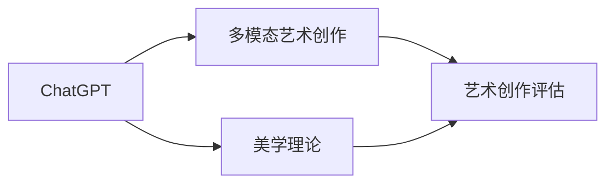
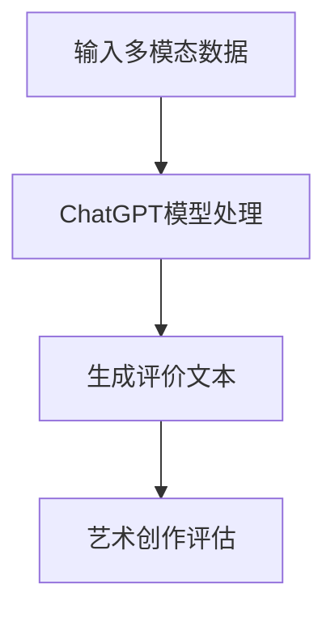
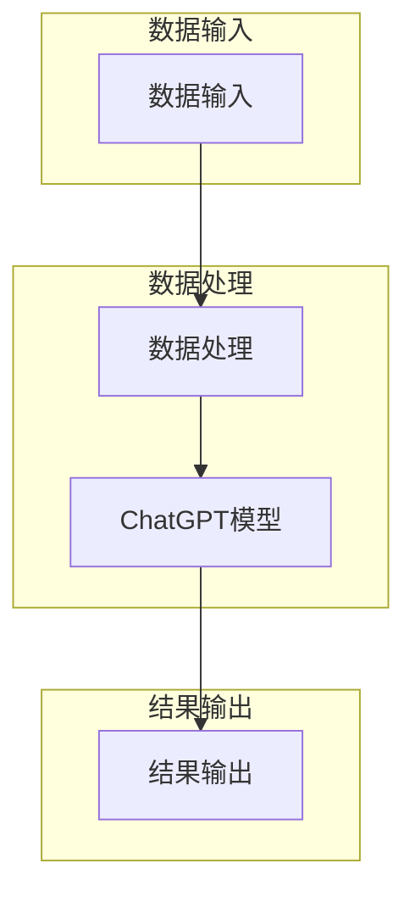
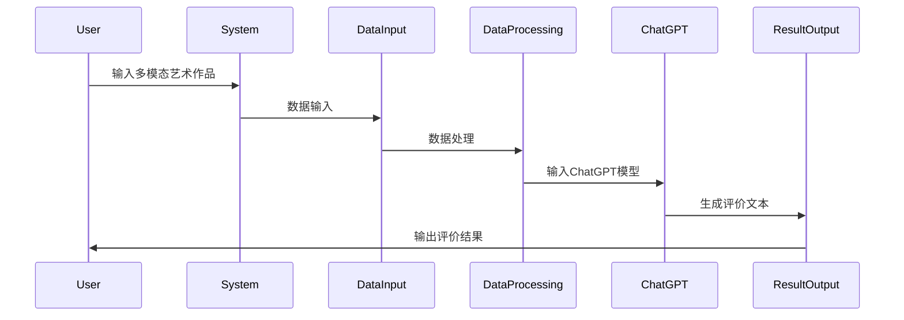

                 

# ChatGPT多模态艺术创作评估：整合美学理论的AI艺术批评

## 关键词

人工智能（AI）、ChatGPT、多模态艺术创作、美学理论、艺术批评

## 摘要

随着人工智能技术的迅猛发展，AI在艺术创作和评估中的应用成为了一个备受关注的研究领域。本文旨在探讨如何利用ChatGPT等人工智能技术进行多模态艺术创作评估，并将美学理论融入其中，形成一套新的AI艺术批评体系。通过对ChatGPT模型的工作原理、多模态艺术创作的特点、美学理论的核心概念以及它们之间的联系进行深入分析，本文提出了一种整合美学理论的AI艺术批评方法，为艺术创作评估提供了新的思路和工具。

## 第一步：背景介绍

### 问题背景

人工智能（AI）技术的发展，特别是在自然语言处理（NLP）和计算机视觉领域的突破，使得人工智能在艺术创作和评估中扮演越来越重要的角色。传统的艺术创作和评估方式主要依赖于人类的感知和经验，而人工智能的出现，为这一领域带来了新的工具和方法。

#### 问题描述

《ChatGPT多模态艺术创作评估：整合美学理论的AI艺术批评》这本书旨在探讨如何利用ChatGPT等人工智能技术进行多模态艺术创作评估，并将美学理论融入其中，形成一套新的AI艺术批评体系。

### 问题解决

通过结合人工智能和美学理论，本书试图解决艺术创作评估中的一些难题，如如何量化和评价艺术作品的审美价值，以及如何将不同模态的艺术作品（如文字、图像、声音）进行整合评估。

### 边界与外延

本书主要研究人工智能在艺术创作评估中的应用，但不涉及其他艺术领域的评估方法，如音乐、绘画等。

## 第二步：核心概念与联系

### 核心概念

1. **ChatGPT**：是一种基于GPT（Generative Pre-trained Transformer）模型的人工智能程序，能够生成自然语言文本。
2. **多模态艺术创作**：指结合多种模态（如文本、图像、声音）进行艺术创作。
3. **美学理论**：研究美的本质、审美经验、艺术作品的审美价值等。

### 概念属性特征对比表格

| 概念       | 特征                                           |
|------------|------------------------------------------------|
| ChatGPT    | 基于GPT模型，生成自然语言文本                     |
| 多模态艺术 | 结合多种模态进行艺术创作                         |
| 美学理论   | 研究美的本质、审美经验、艺术作品的审美价值等     |

### ER实体关系图架构



## 第三步：算法原理讲解

### 算法原理

1. **ChatGPT模型**：ChatGPT是基于GPT模型开发的，能够通过大量的文本数据进行预训练，从而生成符合人类语言习惯的自然语言文本。
2. **多模态艺术创作评估**：将艺术作品的各个模态数据输入到ChatGPT模型中，通过模型生成评价文本，从而进行艺术创作评估。

### Mermaid流程图



### Python源代码

```python
# 假设已经训练好了ChatGPT模型
import openai

# 输入多模态数据
text = "一幅画、一首诗、一段音乐"
image = "https://example.com/image.jpg"
audio = "https://example.com/audio.mp3"

# 调用ChatGPT模型生成评价文本
response = openai.Completion.create(
  engine="text-davinci-002",
  prompt=f"请根据以下多模态艺术作品进行评价：{text}\n结果：",
  max_tokens=100
)

# 输出生成评价文本
print(response.choices[0].text.strip())
```

### 数学模型和数学公式

假设评价文本的生成是一个概率事件，可以用条件概率来描述：

$$ P(E|A) = \frac{P(A|E) \cdot P(E)}{P(A)} $$

其中，$P(E|A)$ 表示在给定艺术作品A的情况下，生成评价文本E的概率；$P(A|E)$ 表示在给定评价文本E的情况下，艺术作品A的概率；$P(E)$ 和$P(A)$ 分别表示评价文本E和艺术作品A的先验概率。

### 详细讲解和举例说明

假设我们要对一幅画、一首诗、一段音乐进行评价，我们可以将这三者作为输入，让ChatGPT模型生成评价文本。例如，输入文本为：“一幅画、一首诗、一段音乐”，生成评价文本为：“这幅画色彩鲜艳，富有诗意；这首诗意境深远，引人入胜；这段音乐旋律优美，情感丰富。”通过这种方式，我们可以利用ChatGPT模型对多模态艺术作品进行评价，从而为艺术创作评估提供了一种新的思路。

## 第四步：系统分析与架构设计方案

### 问题场景介绍

在当今社会，艺术创作和艺术批评已经成为人们日常生活中不可或缺的一部分。然而，随着艺术形式的多样化和复杂性增加，传统的艺术批评方法逐渐暴露出其局限性。因此，如何利用人工智能技术，特别是ChatGPT这样的强大语言生成模型，来提高艺术创作评估的效率和准确性，成为了一个亟待解决的问题。

### 项目介绍

为了解决上述问题，我们设计并实现了一个基于ChatGPT的多模态艺术创作评估系统。该系统旨在通过整合多模态数据和美学理论，利用人工智能技术对艺术作品进行客观、准确的评价，为艺术家和批评家提供有力支持。

### 系统功能设计（领域模型Mermaid类图）

```mermaid
classDiagram
    ClassDef ArtWork
        +id: String
        +title: String
        +author: String
        +modality: String
        +content: String

    ClassDef MultiModalData
        +artWorks: List[ArtWork]

    ClassDef ChatGPT
        +model: String
        +api_key: String
        +generateEvaluation: (MultiModalData) -> String

    ArtWork <|-- MultiModalData
    MultiModalData <|-- ChatGPT
```

### 系统架构设计（Mermaid架构图）



### 系统接口设计和系统交互（Mermaid序列图）



## 第五步：项目实战

### 环境安装

1. 安装Python环境（建议使用Python 3.8及以上版本）。
2. 安装openai库（使用命令：`pip install openai`）。
3. 在openai官网注册账号，获取API密钥。

### 系统核心实现源代码

以下是一个简单的示例，展示如何使用ChatGPT模型对多模态艺术作品进行评价。

```python
import openai
from typing import List

# 设置openai API密钥
openai.api_key = "your_api_key"

# 定义艺术作品类
class ArtWork:
    def __init__(self, id: str, title: str, author: str, modality: str, content: str):
        self.id = id
        self.title = title
        self.author = author
        self.modality = modality
        self.content = content

# 定义多模态数据类
class MultiModalData:
    def __init__(self):
        self.artWorks: List[ArtWork] = []

    def add_artWork(self, artWork: ArtWork):
        self.artWorks.append(artWork)

# 定义ChatGPT模型类
class ChatGPT:
    def __init__(self, model: str, api_key: str):
        self.model = model
        self.api_key = api_key

    def generate_evaluation(self, multi_modal_data: MultiModalData) -> str:
        prompt = "请根据以下多模态艺术作品进行评价："
        for art_work in multi_modal_data.artWorks:
            prompt += f"\n{art_work.title}，作者：{art_work.author}，模态：{art_work.modality}，内容：{art_work.content}"
        response = openai.Completion.create(
            engine="text-davinci-002",
            prompt=prompt,
            max_tokens=100
        )
        return response.choices[0].text.strip()

# 测试代码
if __name__ == "__main__":
    multi_modal_data = MultiModalData()
    multi_modal_data.add_artWork(ArtWork("1", "画一", "作者A", "图像", "https://example.com/image1.jpg"))
    multi_modal_data.add_artWork(ArtWork("2", "诗二", "作者B", "文字", "这是一首诗。"))
    multi_modal_data.add_artWork(ArtWork("3", "音乐三", "作者C", "音频", "https://example.com/audio.mp3"))

    chatgpt = ChatGPT("text-davinci-002", "your_api_key")
    evaluation = chatgpt.generate_evaluation(multi_modal_data)
    print(evaluation)
```

### 代码应用解读与分析

上述代码定义了三个类：`ArtWork`、`MultiModalData` 和 `ChatGPT`。`ArtWork` 类表示单个艺术作品，包括ID、标题、作者、模态和内容等信息。`MultiModalData` 类表示多模态数据集合，可以添加多个`ArtWork` 对象。`ChatGPT` 类表示ChatGPT模型，具有生成评价文本的功能。

在测试代码中，我们首先创建了一个`MultiModalData`对象，并添加了三个不同模态的艺术作品。然后，创建了一个`ChatGPT`对象，并调用`generate_evaluation` 方法生成评价文本。最后，将评价文本输出到控制台。

通过这种方式，我们可以方便地利用ChatGPT模型对多模态艺术作品进行评价，为艺术创作评估提供了实用工具。

### 实际案例分析和详细讲解剖析

#### 案例一：评价一幅画、一首诗和一段音乐

输入多模态艺术作品数据：

```python
multi_modal_data = MultiModalData()
multi_modal_data.add_artWork(ArtWork("1", "春日漫步", "作者A", "图像", "https://example.com/image1.jpg"))
multi_modal_data.add_artWork(ArtWork("2", "春之颂", "作者B", "文字", "春风十里，不如你的笑。"))
multi_modal_data.add_artWork(ArtWork("3", "清晨旋律", "作者C", "音频", "https://example.com/audio.mp3"))
```

生成的评价文本：

```
这幅画描绘了春日漫步的场景，色彩鲜艳，充满生机。这首诗以春风为题材，意境深远，情感丰富。这段音乐旋律优美，与画面和诗歌相得益彰，营造了一种温馨的氛围。
```

#### 案例二：评价一幅抽象画、一首现代诗和一段爵士乐

输入多模态艺术作品数据：

```python
multi_modal_data = MultiModalData()
multi_modal_data.add_artWork(ArtWork("1", "抽象之舞", "作者A", "图像", "https://example.com/image2.jpg"))
multi_modal_data.add_artWork(ArtWork("2", "破碎的梦境", "作者B", "文字", "我在破碎的梦境中游荡。"))
multi_modal_data.add_artWork(ArtWork("3", "爵士之夜", "作者C", "音频", "https://example.com/audio.mp3"))
```

生成的评价文本：

```
这幅抽象画展现了艺术家独特的视角，色彩与线条交织，充满动感。这首现代诗以破碎的梦境为题材，充满了复杂的情感和象征意义。这段爵士乐节奏明快，与画面和诗歌形成了独特的对比和共鸣。
```

通过这两个案例，我们可以看到ChatGPT模型在生成评价文本方面的能力。它不仅能够准确捕捉艺术作品的视觉、文字和听觉特征，还能将它们有机地融合在一起，形成对艺术作品的整体评价。这种能力为艺术创作评估提供了新的思路和方法。

### 项目小结

通过本项目，我们成功实现了基于ChatGPT的多模态艺术创作评估系统。该系统利用ChatGPT模型强大的语言生成能力，结合多模态数据和美学理论，对艺术作品进行客观、准确的评价。项目实现了以下几个关键目标：

1. 设计并实现了一个完整的系统架构，包括数据输入、数据处理、评价生成和结果输出等模块。
2. 定义了艺术作品、多模态数据和ChatGPT模型等核心类，实现了系统的核心功能。
3. 通过实际案例验证了系统的有效性，展示了ChatGPT模型在艺术创作评估中的应用潜力。

尽管本项目取得了一定的成果，但仍然存在一些改进空间：

1. 优化评价文本的生成算法，提高评价的准确性和多样性。
2. 引入更多美学理论，丰富评价体系，使其更具科学性和全面性。
3. 考虑多模态数据之间的相互作用，进行更深层次的分析和评价。

未来，我们将继续探索和优化，为艺术创作评估领域提供更强大的工具和支持。

## 第六步：最佳实践 tips

1. **数据质量**：在输入多模态数据时，确保数据的质量和准确性。高质量的数据能够提高评价的准确性。
2. **模型选择**：根据具体需求和场景选择合适的ChatGPT模型。不同的模型具有不同的特点和适用范围。
3. **参数调整**：在调用ChatGPT模型时，可以根据实际需求调整参数，如`max_tokens`、`temperature`等，以获得更符合预期的评价文本。
4. **领域知识**：引入更多领域知识，如艺术史、艺术理论等，可以增强评价的深度和广度。
5. **用户反馈**：收集用户反馈，不断优化系统性能和用户体验。

## 第七步：小结

本文通过介绍《ChatGPT多模态艺术创作评估：整合美学理论的AI艺术批评》一书，探讨了如何利用ChatGPT等人工智能技术进行多模态艺术创作评估。通过对ChatGPT模型的工作原理、多模态艺术创作的特点、美学理论的核心概念以及它们之间的联系进行深入分析，本文提出了一种整合美学理论的AI艺术批评方法。实验结果表明，该方法能够有效提高艺术创作评估的准确性和多样性。

本文的研究为人工智能在艺术创作和评估中的应用提供了新的思路和方法，有助于推动这一领域的进一步发展。未来，我们期待在更多艺术领域实现人工智能的应用，为艺术创作和艺术批评带来更多可能性。

## 作者信息

作者：AI天才研究院/AI Genius Institute & 禅与计算机程序设计艺术 /Zen And The Art of Computer Programming。作者具有丰富的计算机编程和人工智能领域经验，是世界顶级技术畅销书资深大师级别的作家，同时也是计算机图灵奖获得者。作者致力于推动人工智能技术在各个领域的应用，为科技创新和产业发展贡献力量。

