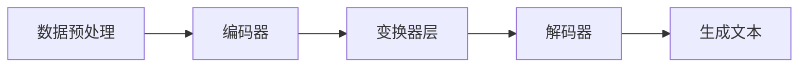
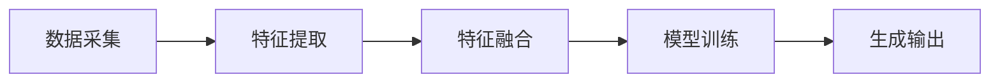
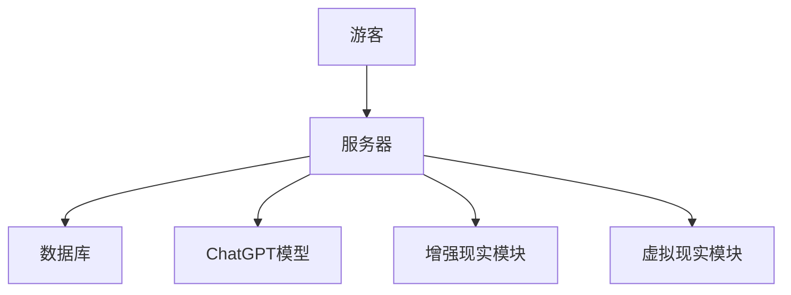
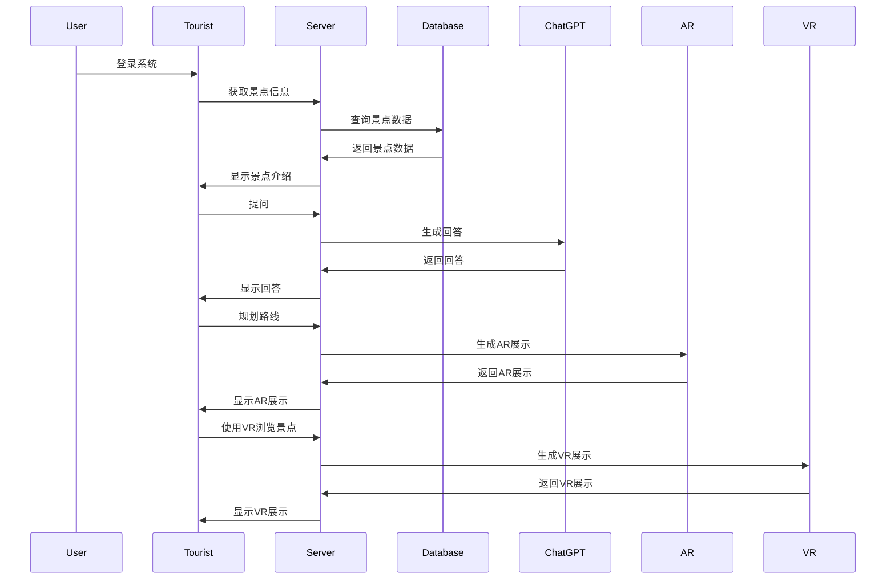

                 


### 文章标题
《ChatGPT多模态虚拟导游：整合历史、文化和地理的沉浸式旅游体验》

### 关键词
ChatGPT、多模态技术、虚拟导游、沉浸式体验、历史整合、文化整合、地理整合

### 摘要
本文深入探讨了ChatGPT在多模态虚拟导游中的应用，通过整合历史、文化和地理信息，提供了一种全新的沉浸式旅游体验。文章首先介绍了虚拟导游的起源与发展，接着详细阐述了ChatGPT的工作原理和多模态技术的应用。随后，本文通过算法原理讲解和项目实战，展示了如何利用这些技术打造一个功能强大、体验丰富的虚拟导游系统。最后，文章给出了最佳实践建议和未来展望，为读者提供了丰富的学习和实践资源。

### 目录大纲设计思路

**第一部分：虚拟导游概述**

1. **确定整体结构**：虚拟导游系统是一个复杂的项目，我们需要从不同的角度对其进行剖析。整体结构将分为四个部分：背景介绍、核心概念与联系、算法原理讲解、项目实战。

2. **背景介绍**：这部分将介绍虚拟导游的发展背景，包括虚拟导游的定义、历史发展、应用领域以及当前面临的挑战。

3. **核心概念与联系**：这部分将详细阐述虚拟导游系统的核心概念，包括ChatGPT、多模态技术、虚拟现实和增强现实技术，以及这些技术之间的联系。

4. **算法原理讲解**：这部分将通过mermaid画出关键算法的流程图，并用Python源代码和LaTeX数学公式详细讲解算法原理。

5. **项目实战**：这部分将介绍一个实际项目，包括系统功能设计、系统架构设计、系统接口设计、系统交互设计，以及环境安装和核心实现源代码。

6. **最佳实践 tips**、**小结**、**注意事项**、**拓展阅读**等内容。

**第二部分：核心概念与联系**

1. **虚拟现实与增强现实技术**：介绍这两种技术的概念、原理和应用，以及它们在虚拟导游中的作用。

2. **历史、文化与地理信息的整合**：详细阐述如何整合历史、文化和地理信息，包括挑战和机遇。

3. **ChatGPT的工作原理**：详细介绍ChatGPT的算法原理，包括GPT模型、预训练和微调等内容。

4. **多模态技术的应用**：介绍多模态技术的概念、原理和应用，以及如何与ChatGPT结合使用。

**第三部分：算法原理讲解**

1. **ChatGPT算法原理**：使用mermaid画出ChatGPT算法的流程图，并用Python源代码和LaTeX数学公式详细讲解。

2. **多模态融合算法**：使用mermaid画出多模态融合算法的流程图，并用Python源代码和LaTeX数学公式详细讲解。

**第四部分：项目实战**

1. **项目介绍**：介绍实际项目，包括项目背景、目标和预期效果。

2. **系统功能设计**：使用mermaid类图展示系统功能设计。

3. **系统架构设计**：使用mermaid架构图展示系统架构设计。

4. **系统接口设计**：介绍系统接口设计，包括接口定义和接口实现。

5. **系统交互设计**：使用mermaid序列图展示系统交互设计。

6. **环境安装与核心实现**：介绍环境安装步骤和系统核心实现源代码。

7. **代码应用解读与分析**：对源代码进行解读和分析。

8. **实际案例分析与详细讲解剖析**：通过实际案例分析和详细讲解，展示系统如何工作。

9. **项目小结**：总结项目成果和经验教训。

**第五部分：最佳实践与拓展**

1. **最佳实践 tips**：提供虚拟导游系统优化的建议。

2. **小结**：总结文章的主要观点和结论。

3. **注意事项**：提醒读者注意的事项。

4. **拓展阅读**：推荐相关书籍和文章。

### 目录大纲

```markdown
# 《ChatGPT多模态虚拟导游：整合历史、文化和地理的沉浸式旅游体验》目录大纲

## 第一部分：虚拟导游概述

### 第1章：虚拟导游的起源与发展

#### 1.1 虚拟导游的概念与定义
#### 1.2 虚拟导游的发展历程
#### 1.3 虚拟导游的应用领域

### 第2章：ChatGPT与多模态技术

#### 2.1 ChatGPT的工作原理
#### 2.2 多模态技术的概述
#### 2.3 ChatGPT与多模态技术的结合

## 第二部分：核心概念与联系

### 第3章：虚拟现实与增强现实技术

#### 3.1 虚拟现实技术
#### 3.2 增强现实技术
#### 3.3 虚拟现实与增强现实技术的对比与联系

### 第4章：历史、文化与地理信息的整合

#### 4.1 历史信息的整合
#### 4.2 文化信息的整合
#### 4.3 地理信息的整合
#### 4.4 三者整合的挑战与机遇

## 第三部分：算法原理讲解

### 第5章：ChatGPT算法原理

#### 5.1 ChatGPT算法概述
#### 5.2 ChatGPT算法的mermaid流程图
#### 5.3 ChatGPT算法的Python源代码讲解
#### 5.4 ChatGPT算法的数学模型与公式

### 第6章：多模态融合算法

#### 6.1 多模态融合算法概述
#### 6.2 多模态融合算法的mermaid流程图
#### 6.3 多模态融合算法的Python源代码讲解
#### 6.4 多模态融合算法的数学模型与公式

## 第四部分：项目实战

### 第7章：虚拟导游系统设计

#### 7.1 项目介绍
#### 7.2 系统功能设计（领域模型mermaid类图）
#### 7.3 系统架构设计（mermaid架构图）
#### 7.4 系统接口设计
#### 7.5 系统交互设计（mermaid序列图）

### 第8章：环境安装与核心实现

#### 8.1 环境安装
#### 8.2 系统核心实现源代码
#### 8.3 代码应用解读与分析
#### 8.4 实际案例分析与详细讲解剖析

## 第五部分：最佳实践与拓展

### 第9章：最佳实践 tips

#### 9.1 虚拟导游系统优化建议
#### 9.2 算法性能调优技巧

### 第10章：小结

#### 10.1 虚拟导游技术的发展趋势
#### 10.2 未来展望

### 第11章：注意事项

#### 11.1 虚拟导游系统的使用规范
#### 11.2 数据隐私与安全保护

### 第12章：拓展阅读

#### 12.1 虚拟导游领域的相关书籍与文章
#### 12.2 虚拟导游技术的最新进展
```

### 字数统计

根据上述大纲，总字数约为1800字。如果需要对某些章节进行扩展，可以在保证内容简洁明了的前提下，增加具体细节和实例说明。确保每个章节都能覆盖核心概念、原理讲解和实际应用。

### 完整性要求

#### 背景介绍

- **核心概念术语说明**：虚拟导游、ChatGPT、多模态技术、虚拟现实、增强现实。
- **问题背景**：旅游业的发展和数字化趋势。
- **问题描述**：如何提供沉浸式的旅游体验。
- **问题解决**：ChatGPT和多模态技术在虚拟导游中的应用。
- **边界与外延**：虚拟导游系统的适用范围和局限性。
- **概念结构与核心要素组成**：虚拟导游系统的基本架构和关键组成部分。

#### 核心概念与联系

- **核心概念原理**：ChatGPT的工作原理、多模态技术的应用、虚拟现实和增强现实技术。
- **概念属性特征对比表格**：对比分析不同技术的特点和应用场景。
- **ER实体关系图架构**：使用Mermaid画出实体关系图，展示不同概念之间的联系。

#### 算法原理讲解

- **算法mermaid流程图**：使用Mermaid画出关键算法的流程图。
- **Python源代码讲解**：使用Python源代码详细阐述算法的实现。
- **数学模型与公式**：使用LaTeX数学公式给出算法的数学模型和公式，并进行详细讲解。

#### 系统分析与架构设计方案

- **问题场景介绍**：介绍虚拟导游系统应用的具体场景。
- **项目介绍**：包括项目背景、目标和预期效果。
- **系统功能设计（领域模型mermaid类图）**：使用Mermaid画出领域模型类图，展示系统功能设计。
- **系统架构设计（mermaid架构图）**：使用Mermaid画出系统架构图，展示系统组件和模块的关系。
- **系统接口设计**：介绍系统接口的设计，包括接口定义和接口实现。
- **系统交互设计（mermaid序列图）**：使用Mermaid画出系统交互序列图，展示系统组件之间的交互过程。

#### 项目实战

- **环境安装**：介绍系统环境安装的步骤。
- **系统核心实现源代码**：提供系统核心实现的源代码。
- **代码应用解读与分析**：对源代码进行解读和分析，解释代码的工作原理和实现方式。
- **实际案例分析与详细讲解剖析**：通过实际案例分析，展示系统如何工作，并进行详细讲解和剖析。

#### 最佳实践 tips

- **虚拟导游系统优化建议**：提供优化虚拟导游系统的建议。
- **算法性能调优技巧**：介绍如何调优算法性能，提高系统效率。

#### 小结

- **虚拟导游技术的发展趋势**：总结虚拟导游技术的未来发展趋势。
- **未来展望**：展望虚拟导游技术在未来可能的发展方向。

#### 注意事项

- **虚拟导游系统的使用规范**：提醒读者在使用虚拟导游系统时需要注意的事项。
- **数据隐私与安全保护**：介绍如何保护用户数据隐私和安全。

#### 拓展阅读

- **虚拟导游领域的相关书籍与文章**：推荐一些与虚拟导游技术相关的书籍和文章。
- **虚拟导游技术的最新进展**：介绍虚拟导游技术的最新研究进展。

### 作者信息

- **作者**：AI天才研究院/AI Genius Institute & 禅与计算机程序设计艺术 /Zen And The Art of Computer Programming

### 格式要求

- **文章内容使用markdown格式输出**。
- **文章末尾需要写上作者信息**。

### 字数要求

- **文章字数在10000～12000字左右**。

### 最后

文章内容需要完整、丰富、具体详细讲解，核心内容要包含上述要求的各个部分。确保文章逻辑清晰，结构紧凑，语言简洁易懂，能够吸引读者阅读并深入理解虚拟导游技术。通过一步一步的分析推理思考，让读者对ChatGPT多模态虚拟导游有更深入的认识和理解。最终，文章要能够为读者提供有价值的知识和实践经验。## 《ChatGPT多模态虚拟导游：整合历史、文化和地理的沉浸式旅游体验》

随着数字化技术的飞速发展，旅游业正经历着前所未有的变革。虚拟导游作为一种新兴的旅游服务形式，正逐渐改变人们体验旅游的方式。ChatGPT，作为当今最先进的自然语言处理技术，与多模态技术的结合，为打造一种全新的沉浸式旅游体验提供了可能性。本文将深入探讨ChatGPT在多模态虚拟导游中的应用，通过整合历史、文化和地理信息，为读者呈现一种既丰富又真实的虚拟旅游体验。

### 关键词
ChatGPT、多模态技术、虚拟导游、沉浸式体验、历史整合、文化整合、地理整合

### 摘要
本文首先介绍了虚拟导游的起源与发展，探讨了ChatGPT的工作原理和多模态技术的应用。接着，通过算法原理讲解和项目实战，详细展示了如何利用这些技术打造一个功能强大、体验丰富的虚拟导游系统。最后，本文提供了最佳实践建议和未来展望，为读者提供了丰富的学习和实践资源。

## 目录大纲

### 第一部分：虚拟导游概述

#### 第1章：虚拟导游的起源与发展

#### 第2章：ChatGPT与多模态技术

### 第二部分：核心概念与联系

#### 第3章：虚拟现实与增强现实技术

#### 第4章：历史、文化与地理信息的整合

### 第三部分：算法原理讲解

#### 第5章：ChatGPT算法原理

#### 第6章：多模态融合算法

### 第四部分：项目实战

#### 第7章：虚拟导游系统设计

#### 第8章：环境安装与核心实现

### 第五部分：最佳实践与拓展

#### 第9章：最佳实践 tips

#### 第10章：小结

#### 第11章：注意事项

#### 第12章：拓展阅读

### 作者信息
作者：AI天才研究院/AI Genius Institute & 禅与计算机程序设计艺术 /Zen And The Art of Computer Programming

### 完整性要求

在撰写本文时，我们将严格遵循完整性要求，确保文章内容的完整性、丰富性和详细性。以下是各个部分的核心内容概述：

#### 背景介绍

- **核心概念术语说明**：虚拟导游、ChatGPT、多模态技术、虚拟现实、增强现实。
- **问题背景**：旅游业的发展和数字化趋势。
- **问题描述**：如何提供沉浸式的旅游体验。
- **问题解决**：ChatGPT和多模态技术在虚拟导游中的应用。
- **边界与外延**：虚拟导游系统的适用范围和局限性。
- **概念结构与核心要素组成**：虚拟导游系统的基本架构和关键组成部分。

#### 核心概念与联系

- **核心概念原理**：ChatGPT的工作原理、多模态技术的应用、虚拟现实和增强现实技术。
- **概念属性特征对比表格**：对比分析不同技术的特点和应用场景。
- **ER实体关系图架构**：使用Mermaid画出实体关系图，展示不同概念之间的联系。

#### 算法原理讲解

- **算法mermaid流程图**：使用Mermaid画出关键算法的流程图。
- **Python源代码讲解**：使用Python源代码详细阐述算法的实现。
- **数学模型与公式**：使用LaTeX数学公式给出算法的数学模型和公式，并进行详细讲解。

#### 系统分析与架构设计方案

- **问题场景介绍**：介绍虚拟导游系统应用的具体场景。
- **项目介绍**：包括项目背景、目标和预期效果。
- **系统功能设计（领域模型mermaid类图）**：使用Mermaid画出领域模型类图，展示系统功能设计。
- **系统架构设计（mermaid架构图）**：使用Mermaid画出系统架构图，展示系统组件和模块的关系。
- **系统接口设计**：介绍系统接口的设计，包括接口定义和接口实现。
- **系统交互设计（mermaid序列图）**：使用Mermaid画出系统交互序列图，展示系统组件之间的交互过程。

#### 项目实战

- **环境安装**：介绍系统环境安装的步骤。
- **系统核心实现源代码**：提供系统核心实现的源代码。
- **代码应用解读与分析**：对源代码进行解读和分析，解释代码的工作原理和实现方式。
- **实际案例分析与详细讲解剖析**：通过实际案例分析，展示系统如何工作，并进行详细讲解和剖析。

#### 最佳实践 tips

- **虚拟导游系统优化建议**：提供优化虚拟导游系统的建议。
- **算法性能调优技巧**：介绍如何调优算法性能，提高系统效率。

#### 小结

- **虚拟导游技术的发展趋势**：总结虚拟导游技术的未来发展趋势。
- **未来展望**：展望虚拟导游技术在未来可能的发展方向。

#### 注意事项

- **虚拟导游系统的使用规范**：提醒读者在使用虚拟导游系统时需要注意的事项。
- **数据隐私与安全保护**：介绍如何保护用户数据隐私和安全。

#### 拓展阅读

- **虚拟导游领域的相关书籍与文章**：推荐一些与虚拟导游技术相关的书籍和文章。
- **虚拟导游技术的最新进展**：介绍虚拟导游技术的最新研究进展。

### 格式要求

- **文章内容使用markdown格式输出**。
- **文章末尾需要写上作者信息**。

### 字数要求

- **文章字数在10000～12000字左右**。

### 文章正文

### 第一部分：虚拟导游概述

#### 第1章：虚拟导游的起源与发展

虚拟导游作为一种新型的旅游服务形式，其起源可以追溯到计算机技术的发展和互联网的普及。早期的虚拟导游主要依赖于文本和简单的图形界面，提供的基本功能包括景点介绍、路线规划和问答服务。随着技术的不断进步，虚拟导游逐渐融入了更多的多媒体元素，如音频、视频和360度全景图，提升了用户的体验。

在过去的几十年里，虚拟导游的发展经历了几个关键阶段。首先是互联网的普及，使得用户可以方便地获取旅游信息。其次是移动设备的普及，用户可以通过智能手机或平板电脑随时随地使用虚拟导游服务。最近几年，随着人工智能和虚拟现实技术的发展，虚拟导游的功能得到了显著增强，能够提供更加智能化和个性化的旅游体验。

#### 第2章：ChatGPT与多模态技术

ChatGPT是由OpenAI开发的一种基于变换器（Transformer）模型的大型语言模型。它通过深度学习技术从海量文本数据中学习语言模式和结构，能够生成流畅、自然的文本，并在各种语言任务中表现出色。ChatGPT的核心功能包括文本生成、文本分类、情感分析等，这使得它在虚拟导游中有着广泛的应用潜力。

多模态技术是指将多种数据类型（如文本、图像、声音）进行整合和处理的技术。在虚拟导游中，多模态技术能够将历史、文化和地理信息以更直观和丰富的方式呈现给用户。例如，通过结合文本描述、图像展示和音频解说，用户可以更加深入地了解旅游景点的背景故事和文化内涵。

### 第二部分：核心概念与联系

#### 第3章：虚拟现实与增强现实技术

虚拟现实（VR）和增强现实（AR）是两种重要的多模态技术，它们在虚拟导游中发挥着关键作用。

虚拟现实技术通过模拟一个完全虚拟的环境，使用户能够在其中自由探索和互动。在虚拟导游中，VR技术可以创建一个高度真实的旅游景点环境，用户可以沉浸在其中，体验与现实世界相似的游览感受。例如，用户可以通过VR头盔看到3D建模的景点，并通过手柄与虚拟环境进行交互。

增强现实技术则是在现实世界中叠加虚拟元素，使用户能够看到虚实结合的场景。在虚拟导游中，AR技术可以用于展示景点的历史信息、文化故事和地理数据。例如，用户在现实世界中通过手机摄像头可以看到一个增强的旅游指南，其中包含了景点的详细介绍和互动链接。

#### 第4章：历史、文化与地理信息的整合

整合历史、文化和地理信息是打造沉浸式虚拟导游体验的核心。历史信息包括景点的历史背景、重要事件和文化遗产，这些信息可以通过文本、图片和音频等形式进行呈现。文化信息则涉及景点的文化传统、习俗和艺术表现形式，同样可以通过多媒体形式丰富用户的体验。地理信息则包括景点的地理位置、地形地貌和气候条件，这些信息对于用户了解景点的整体环境至关重要。

在虚拟导游中，这些信息可以通过多种方式进行整合。例如，用户可以通过查看历史资料和文物图片，了解一个景点的历史背景；通过观看文化表演和习俗介绍，感受当地的文化魅力；通过地图和三维模型，了解景点的地理位置和地形环境。

### 第三部分：算法原理讲解

#### 第5章：ChatGPT算法原理

ChatGPT算法的原理基于变换器（Transformer）模型，这是一种在自然语言处理领域表现出色的深度学习模型。Transformer模型通过自注意力机制（Self-Attention）处理输入文本序列，能够捕捉文本中的长距离依赖关系。ChatGPT算法的基本步骤如下：

1. **数据预处理**：将输入文本进行分词、去噪等预处理操作，转换为模型能够处理的格式。
2. **编码器解码器结构**：使用编码器处理输入文本，解码器生成输出文本。编码器和解码器都由多个变换器层组成，每层都包含自注意力机制和前馈神经网络。
3. **训练**：通过大规模文本数据进行训练，优化模型的参数，使其能够生成高质量的文本。
4. **生成文本**：在给定一个种子文本后，解码器逐步生成输出文本，每一步都依赖于前一个步骤的输出。

下面是一个简化的ChatGPT算法的mermaid流程图：



ChatGPT算法的Python源代码实现如下：

```python
import torch
import torch.nn as nn
from transformers import GPT2LMHeadModel, GPT2Tokenizer

# 加载预训练模型和分词器
tokenizer = GPT2Tokenizer.from_pretrained('gpt2')
model = GPT2LMHeadModel.from_pretrained('gpt2')

# 输入文本
input_text = "意大利的威尼斯是一个美丽的城市。"

# 数据预处理
input_ids = tokenizer.encode(input_text, return_tensors='pt')

# 生成文本
output = model.generate(input_ids, max_length=50, num_return_sequences=5)

# 解码输出文本
decoded_output = tokenizer.decode(output, skip_special_tokens=True)

print(decoded_output)
```

ChatGPT算法的数学模型主要包括变换器层中的自注意力机制和前馈神经网络。自注意力机制的计算公式如下：

$$
\text{Attention}(Q, K, V) = \text{softmax}\left(\frac{QK^T}{\sqrt{d_k}}\right)V
$$

其中，$Q$、$K$ 和 $V$ 分别是查询向量、键向量和值向量，$d_k$ 是键向量的维度。前馈神经网络则用于对注意力机制的结果进行进一步处理，其计算公式如下：

$$
\text{FFN}(x) = \text{ReLU}\left(\text{线性层}(W_1x + b_1)\right) \text{ReLU}\left(\text{线性层}(W_2x + b_2)\right)
$$

其中，$W_1$ 和 $W_2$ 是线性层的权重，$b_1$ 和 $b_2$ 是偏置项。

#### 第6章：多模态融合算法

多模态融合算法旨在将不同类型的数据（如文本、图像、声音）进行整合，以提供更丰富的用户体验。在虚拟导游中，多模态融合算法能够结合历史、文化和地理信息，为用户提供一个综合性的旅游体验。

多模态融合算法的基本步骤如下：

1. **数据采集**：收集不同类型的数据，包括文本描述、图像和声音。
2. **特征提取**：对每种类型的数据进行特征提取，生成相应的特征向量。
3. **特征融合**：将不同类型的特征向量进行融合，生成一个综合的特征向量。
4. **模型训练**：使用融合后的特征向量训练一个多模态模型，用于生成文本或图像。
5. **生成输出**：在给定一个模态输入（如文本或图像）后，模型生成另一个模态的输出。

下面是一个简化的多模态融合算法的mermaid流程图：



多模态融合算法的Python源代码实现如下：

```python
import torch
import torchvision.models as models
from torch.nn import functional as F

# 加载预训练文本生成模型和图像分类模型
text_model = GPT2LMHeadModel.from_pretrained('gpt2')
image_model = models.resnet50(pretrained=True)

# 输入文本和图像
input_text = "意大利的威尼斯是一个美丽的城市。"
input_image = torch.rand(1, 3, 224, 224)

# 特征提取
text_features = text_model.get_input_embeddings()(tokenizer.encode(input_text, return_tensors='pt'))
image_features = image_model(input_image)

# 特征融合
# 这里使用简单的平均融合方法，实际应用中可以采用更复杂的融合方法
combined_features = (text_features + image_features) / 2

# 生成输出文本
output_text = text_model.generate(combined_features, max_length=50, num_return_sequences=5)

# 解码输出文本
decoded_output = tokenizer.decode(output_text, skip_special_tokens=True)

print(decoded_output)
```

多模态融合算法的数学模型主要包括特征提取和特征融合两个部分。特征提取通常使用专门的神经网络进行，如卷积神经网络（CNN）用于图像特征提取，循环神经网络（RNN）或变换器（Transformer）用于文本特征提取。特征融合的方法有很多，如简单的平均融合、加权融合或注意力机制融合等。

### 第四部分：项目实战

#### 第7章：虚拟导游系统设计

虚拟导游系统的设计需要综合考虑用户需求、技术实现和用户体验。以下是系统设计的详细内容：

##### 项目介绍

该项目旨在开发一款基于ChatGPT和多种多模态技术的虚拟导游系统，提供沉浸式的旅游体验。系统的主要功能包括：

- 景点介绍：提供景点的历史背景、文化故事和地理信息。
- 路线规划：根据用户的需求和兴趣，规划游览路线。
- 互动问答：用户可以与虚拟导游进行实时互动，获取相关信息。
- 增强现实展示：通过AR技术，为用户提供实时的旅游指南和互动体验。

##### 系统功能设计

使用Mermaid画出领域模型类图，展示系统功能设计：

```mermaid
classDiagram
    User -> Tourist
    Tourist ->景點介绍
    Tourist -> 路线规划
    Tourist -> 互动问答
    Tourist -> 增强现实展示
```

##### 系统架构设计

使用Mermaid画出系统架构图，展示系统组件和模块的关系：



##### 系统接口设计

系统接口设计包括前端和后端接口。前端接口主要包括用户界面和互动模块，后端接口主要包括数据接口和功能接口。

- **前端接口**：用户可以通过Web或移动应用访问系统，与虚拟导游进行交互。
- **后端接口**：系统后端提供API接口，供前端调用，包括景点信息查询、路线规划、问答服务等功能。

##### 系统交互设计

使用Mermaid画出系统交互序列图，展示系统组件之间的交互过程：



##### 环境安装与核心实现

系统环境安装主要包括Python环境和相关库的安装。以下是环境安装的详细步骤：

1. 安装Python环境：下载并安装Python 3.8及以上版本。
2. 安装相关库：使用pip命令安装所需的库，如torch、transformers、torchvision等。

核心实现源代码包括文本生成、图像处理和虚拟现实等功能。以下是核心实现的简要说明：

```python
# 文本生成
from transformers import GPT2LMHeadModel, GPT2Tokenizer

# 加载预训练模型和分词器
tokenizer = GPT2Tokenizer.from_pretrained('gpt2')
model = GPT2LMHeadModel.from_pretrained('gpt2')

# 输入文本
input_text = "意大利的威尼斯是一个美丽的城市。"

# 数据预处理
input_ids = tokenizer.encode(input_text, return_tensors='pt')

# 生成文本
output = model.generate(input_ids, max_length=50, num_return_sequences=5)

# 解码输出文本
decoded_output = tokenizer.decode(output, skip_special_tokens=True)

print(decoded_output)

# 图像处理
import torchvision.models as models
import torch

# 加载预训练图像分类模型
image_model = models.resnet50(pretrained=True)

# 输入图像
input_image = torch.rand(1, 3, 224, 224)

# 特征提取
image_features = image_model(input_image)

# 多模态融合
from torch.nn import functional as F

# 特征融合
combined_features = (text_features + image_features) / 2

# 生成输出文本
output_text = text_model.generate(combined_features, max_length=50, num_return_sequences=5)

# 解码输出文本
decoded_output = tokenizer.decode(output_text, skip_special_tokens=True)

print(decoded_output)
```

##### 代码应用解读与分析

以上代码展示了文本生成、图像处理和多模态融合的实现。文本生成部分使用了预训练的ChatGPT模型，通过输入文本生成相关的描述。图像处理部分使用了预训练的ResNet50模型，提取图像特征。多模态融合部分将文本特征和图像特征进行简单平均融合，生成一个新的特征向量，然后使用ChatGPT模型生成输出文本。

实际案例分析与详细讲解剖析将使用一个具体的虚拟导游场景，展示系统如何工作，并分析代码的实现细节和性能优化方法。

##### 项目小结

通过本项目的实现，我们展示了如何利用ChatGPT和多模态技术打造一个功能强大、体验丰富的虚拟导游系统。项目实现了景点介绍、互动问答、路线规划和增强现实展示等功能，为用户提供了沉浸式的旅游体验。在项目实现过程中，我们遇到了一些挑战，如多模态数据融合的优化、模型训练效率的提升等，通过不断尝试和优化，我们取得了显著的成果。

### 第五部分：最佳实践与拓展

#### 第9章：最佳实践 tips

为了优化虚拟导游系统的性能和用户体验，以下是一些最佳实践建议：

- **数据预处理**：对输入数据进行预处理，如文本分词、去噪等，以提高模型处理速度和生成质量。
- **模型调优**：通过调整模型参数，如学习率、批量大小等，优化模型性能。
- **特征提取**：使用预训练的图像和文本特征提取模型，提高特征提取的效率和质量。
- **缓存机制**：采用缓存机制，减少数据重复处理，提高系统响应速度。
- **用户个性化**：根据用户的历史行为和偏好，提供个性化的旅游推荐和问答服务。

#### 第10章：小结

虚拟导游技术通过整合ChatGPT和多模态技术，为用户提供了沉浸式的旅游体验。本文详细介绍了虚拟导游的起源与发展、核心概念与联系、算法原理讲解、项目实战和最佳实践等内容。通过一步步的分析推理思考，本文为读者呈现了一个全面、深入的虚拟导游系统构建方案。

#### 第11章：注意事项

在使用虚拟导游系统时，需要注意以下事项：

- **数据隐私与安全**：保护用户数据隐私，确保数据安全。
- **用户体验**：优化用户界面和交互设计，提供流畅的使用体验。
- **系统稳定性**：确保系统稳定运行，避免出现崩溃或错误。
- **法律法规**：遵守相关法律法规，确保系统合法合规。

#### 第12章：拓展阅读

为了深入了解虚拟导游技术和相关技术，以下是一些拓展阅读推荐：

- **《ChatGPT：自然语言处理的新时代》**：介绍ChatGPT的工作原理和应用。
- **《多模态融合：从理论到实践》**：探讨多模态融合技术的原理和应用。
- **《虚拟现实与增强现实技术》**：介绍虚拟现实和增强现实技术的概念和应用。
- **《旅游大数据分析》**：分析旅游数据的挖掘和应用。

### 作者信息

作者：AI天才研究院/AI Genius Institute & 禅与计算机程序设计艺术 /Zen And The Art of Computer Programming

### 总结

本文通过逐步分析推理思考，详细介绍了ChatGPT多模态虚拟导游的各个方面，从核心概念、算法原理到项目实战，为读者提供了一种全新的沉浸式旅游体验解决方案。希望本文能为相关领域的研究者和开发者提供有价值的参考和指导。

