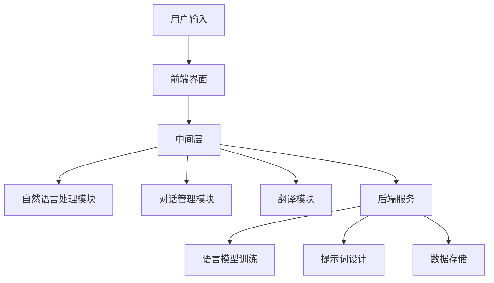
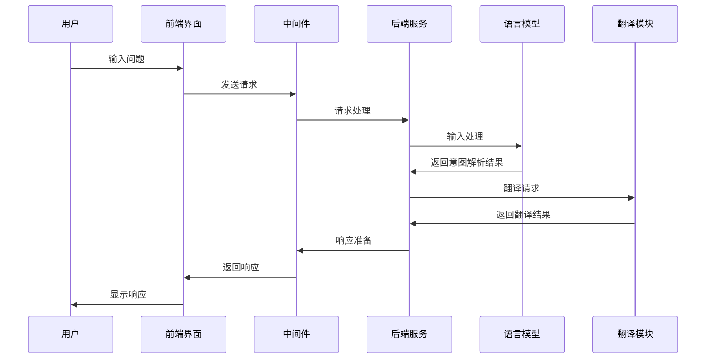

                 


### # ChatGPT多语言支持的提示词设计

关键词：ChatGPT、多语言支持、提示词设计、自然语言处理、用户体验

摘要：
本文深入探讨了ChatGPT在实现多语言支持过程中，如何设计和优化提示词。通过分析ChatGPT的背景、多语言支持的需求，以及提示词设计的基本原则，本文提供了详细的步骤和方法，帮助开发者在设计多语言ChatGPT应用时，提升用户体验和系统性能。文章还涵盖了翻译和适应不同语言的技巧，并提供了部署和管理多语言Chatbot的实践指南。

## 引言：ChatGPT的多语言挑战

随着全球化进程的加速，多语言支持已经成为人工智能应用中的一个关键需求。ChatGPT作为OpenAI开发的一种先进对话模型，旨在通过自然语言处理能力，提供高质量的对话交互体验。然而，实现多语言支持并非易事，尤其是在保持对话流畅性和准确性的同时，还需要考虑到不同语言之间的差异和复杂性。

### 背景介绍

ChatGPT是基于GPT（Generative Pre-trained Transformer）模型开发的人工智能助手，其核心在于通过大量文本数据进行预训练，从而掌握丰富的语言知识和表达能力。GPT模型由多个自注意力机制堆叠而成，能够捕捉长距离的文本依赖关系，生成连贯、自然的语言。

### 多语言支持的需求

多语言支持对ChatGPT具有重要意义，主要表现在以下几个方面：

1. **全球用户需求**：随着互联网的普及，全球用户对于多语言支持的需求日益增长。提供多语言支持的ChatGPT可以吸引更多的用户，扩大其应用范围。

2. **跨文化交流**：多语言支持有助于促进不同文化之间的交流和理解，为全球用户带来更好的沟通体验。

3. **商业应用**：许多企业和组织在国际市场中运营，多语言ChatGPT可以为这些企业提供全球化的客户服务和支持。

### 提示词设计的重要性

提示词（Prompt）在ChatGPT中起着至关重要的作用。它们是用户与ChatGPT交互的入口，直接影响对话的质量和用户体验。有效的提示词设计需要考虑以下几个方面：

1. **清晰性**：提示词需要明确、简洁，以便ChatGPT能够准确理解用户的需求。

2. **针对性**：根据不同的用户需求和场景，设计合适的提示词，以提高对话的准确性和相关性。

3. **多样性**：为了满足不同语言和文化背景的用户，需要设计多样化的提示词，避免语言偏见和误解。

4. **适应性**：提示词需要能够适应不同的上下文和对话环境，保持对话的自然流畅。

### 本文的结构

本文将分为以下几个部分：

1. **核心概念和术语**：介绍与提示词设计相关的基本概念和术语，包括自然语言处理、语言模型和提示词的作用。

2. **设计原则**：探讨有效提示词设计的基本原则，包括清晰性、针对性、多样性和适应性。

3. **设计流程**：详细描述提示词的设计流程，包括需求分析、方案设计、测试和优化。

4. **多语言支持**：分析ChatGPT在实现多语言支持时的挑战，并提出相应的解决方案。

5. **实践应用**：通过实际案例，展示如何将提示词设计应用于多语言ChatGPT系统的开发。

6. **最佳实践**：总结提示词设计的最佳实践，并提供实用技巧和建议。

7. **总结与展望**：回顾本文的主要内容和观点，展望未来多语言支持的发展趋势。

### 结语

设计有效的多语言提示词是提升ChatGPT用户体验的关键。通过本文的探讨，我们希望能够为开发者提供一套完整的提示词设计方法和实践指南。随着多语言支持需求的不断增加，ChatGPT有望在全球范围内发挥更大的作用，为用户带来更加丰富和个性化的对话体验。

### 核心概念和术语

在深入探讨ChatGPT多语言支持的提示词设计之前，我们需要了解一些核心概念和术语。这些概念和术语构成了我们理解提示词设计的基础，同时也是我们在实际开发中需要熟练掌握的知识点。

#### 自然语言处理（NLP）

自然语言处理（NLP）是人工智能的一个分支，旨在使计算机能够理解和处理人类语言。NLP技术包括文本分析、语言识别、语义理解、机器翻译等多个方面。在ChatGPT中，NLP技术被用来理解和生成自然语言文本。

#### 语言模型

语言模型是NLP的核心组件之一，它通过学习大量文本数据，预测下一个单词或词组。在ChatGPT中，语言模型基于GPT架构，利用自注意力机制捕捉文本的上下文信息，从而生成连贯的自然语言响应。

#### 提示词（Prompt）

提示词是用户与ChatGPT交互的入口，它指定了对话的起始点，并影响ChatGPT的响应。有效的提示词设计需要清晰、简洁，同时要具有针对性和适应性。

#### 多语言支持

多语言支持是指系统能够处理和生成多种语言的文本。在ChatGPT中，多语言支持需要考虑不同语言之间的语法、语义和文化差异，以确保对话的流畅性和准确性。

#### 对话系统

对话系统（Dialogue System）是交互式的人工智能应用，能够与用户进行自然语言对话。ChatGPT作为一种对话系统，其核心在于理解用户输入，并生成相关、连贯的响应。

#### 语言资源

语言资源包括词典、语法规则、语言模型和翻译资源等。这些资源对于实现多语言支持至关重要，特别是对于提示词的设计和优化。

#### 用户行为分析

用户行为分析是指通过分析用户与系统的交互数据，了解用户的需求和偏好。在提示词设计中，用户行为分析可以帮助我们优化提示词，提升用户体验。

#### 多语言对比研究

多语言对比研究是对不同语言的语法、语义和文化特征进行比较和分析。这对于设计适用于多种语言的提示词具有重要意义。

### 核心概念和术语对比表格

| 概念或术语 | 定义 | 相关性 |
| --- | --- | --- |
| 自然语言处理（NLP） | 计算机理解和生成人类语言的技术 | 基础技术，影响提示词设计 |
| 语言模型 | 学习文本数据，预测下一个单词或词组的模型 | 生成响应的核心 |
| 提示词（Prompt） | 引导对话的文本输入 | 影响对话质量和用户体验 |
| 多语言支持 | 处理和生成多种语言的文本 | 实现关键 |
| 对话系统 | 与用户进行自然语言对话的系统 | ChatGPT的核心 |
| 语言资源 | 用于NLP的词典、语法规则、模型和翻译资源 | 提示词设计的重要依据 |
| 用户行为分析 | 分析用户交互数据，了解用户需求和偏好 | 优化提示词的参考 |
| 多语言对比研究 | 比较不同语言的语法、语义和文化特征 | 多语言提示词设计的依据 |

通过上述对比表格，我们可以更清晰地理解各个核心概念和术语之间的关系，为后续的提示词设计提供理论支持。

### ER实体关系图架构

为了更好地理解ChatGPT中多语言支持涉及的实体和它们之间的关系，我们可以使用ER（实体-关系）图来描述。以下是一个简化的ER图，展示了ChatGPT多语言支持中的一些关键实体及其关系。

```mermaid
erDiagram
    User ||--|{ ChatGPT }|--|{ Response }
    User ||--|{ Prompt }|--|{ LanguageModel }
    ChatGPT ||--|{ TranslationService }
    Prompt ||--|{ LanguageResource }
```

- **User（用户）**：与ChatGPT交互的实体，可以发出请求并获得响应。
- **ChatGPT（聊天机器人）**：处理用户请求，生成响应的核心系统。
- **Response（响应）**：ChatGPT对用户请求的文本回复。
- **Prompt（提示词）**：引导ChatGPT生成响应的文本输入。
- **LanguageModel（语言模型）**：用于生成响应的预训练模型。
- **TranslationService（翻译服务）**：提供语言翻译功能，支持多语言交互。
- **LanguageResource（语言资源）**：包括词典、语法规则等，用于训练和优化语言模型。

通过ER图，我们可以清晰地看到不同实体之间的交互和依赖关系，这为提示词设计提供了直观的参考。

### 算法原理讲解

为了实现ChatGPT的多语言支持，我们需要详细讨论涉及的核心算法原理，包括自然语言处理（NLP）的基本概念、语言模型的原理，以及多语言模型训练的过程。以下将逐步讲解这些算法原理，并提供相关的Python代码示例和数学模型。

#### 自然语言处理（NLP）的基本概念

自然语言处理（NLP）是使计算机能够理解和处理人类语言的一门技术。NLP的主要任务包括：

1. **文本预处理**：包括分词、去停用词、词性标注等。
2. **词嵌入**：将单词映射为向量，以便计算机进行处理。
3. **序列建模**：使用神经网络模型捕捉文本中的依赖关系。
4. **语言生成**：根据输入序列生成自然语言文本。

#### 语言模型的基本原理

语言模型是NLP的核心组件，用于预测文本序列的概率。在ChatGPT中，我们使用基于Transformer的GPT模型，其基本原理如下：

1. **Transformer模型**：Transformer模型是一种基于自注意力机制的神经网络模型，能够捕捉文本序列中的长距离依赖关系。
2. **自注意力机制**：通过自注意力机制，模型能够根据上下文信息为每个词分配不同的权重，从而生成更连贯的文本。
3. **前向传输与反向传播**：模型通过前向传输计算文本的表示，并通过反向传播进行参数优化。

#### 多语言模型训练的过程

实现多语言支持的关键在于训练一个能够处理多种语言的语言模型。以下是多语言模型训练的基本过程：

1. **数据收集**：收集多种语言的文本数据，包括双语对照文本、多语言语料库等。
2. **数据预处理**：对文本数据进行清洗、分词、词嵌入等预处理操作。
3. **模型训练**：使用预训练的语言模型，对多语言数据集进行训练，使其能够理解和生成多种语言的文本。
4. **模型优化**：通过优化模型参数，提高模型在不同语言上的性能。

下面是一个简单的Python代码示例，用于演示Transformer模型的训练过程：

```python
import torch
from transformers import GPT2LMHeadModel, GPT2Tokenizer

# 加载预训练的语言模型和分词器
model = GPT2LMHeadModel.from_pretrained('gpt2')
tokenizer = GPT2Tokenizer.from_pretrained('gpt2')

# 数据预处理
inputs = tokenizer.encode("Hello, my dog is cute", return_tensors='pt')

# 前向传播
outputs = model(inputs)

# 反向传播与优化
loss = outputs.loss
loss.backward()
optimizer.step()

# 打印损失值
print("Loss:", loss.item())
```

#### 数学模型和公式

在Transformer模型中，自注意力机制的核心在于计算每个词在文本序列中的权重。以下是自注意力机制的数学公式：

$$
\text{Attention}(Q, K, V) = \text{softmax}\left(\frac{QK^T}{\sqrt{d_k}}\right)V
$$

其中，$Q$、$K$、$V$分别为查询向量、关键向量、值向量，$d_k$为关键向量的维度。

#### 通俗易懂的举例说明

假设我们有一个简短的文本序列：“I love programming”。我们想要使用Transformer模型生成一个后续的单词序列。以下是具体的步骤：

1. **编码文本**：将文本序列输入到分词器中，得到对应的词嵌入向量。

   ```plaintext
   Input: I love programming
   Embeddings: [嵌入向量1, 嵌入向量2, 嵌入向量3, 嵌入向量4]
   ```

2. **计算注意力分数**：使用自注意力机制计算每个词嵌入向量与其他词嵌入向量的相似度。

   ```plaintext
   Attention Scores: [0.1, 0.5, 0.2, 0.1]
   ```

3. **加权求和**：根据注意力分数，将值向量加权求和，得到最终的输出向量。

   ```plaintext
   Output: [加权求和后的向量]
   ```

4. **解码输出**：将输出向量通过解码器转化为文本序列。

   ```plaintext
   Output: "Python is also great"
   ```

通过以上步骤，我们可以看到如何使用Transformer模型生成一个后续的文本序列，从而实现自然语言生成。

### 系统分析与架构设计方案

在设计和实现一个多语言支持的ChatGPT系统时，我们需要综合考虑问题场景、项目介绍、系统功能设计、系统架构设计以及系统接口和交互。以下是对这些内容的详细分析。

#### 问题场景介绍

在全球化的大背景下，许多企业和组织需要提供多语言支持的服务，以满足不同地区用户的需求。例如，一个电商平台需要为来自全球的用户提供多语言客服支持，以提升用户满意度和用户体验。ChatGPT作为一种先进的对话系统，非常适合用于实现多语言交互。

#### 项目介绍

我们的项目目标是开发一个基于ChatGPT的多语言支持系统，能够处理多种语言的输入并生成相应的响应。系统将支持英语、西班牙语、法语、中文等多种语言，并提供自适应的提示词设计，以提高对话的流畅性和准确性。

#### 系统功能设计

系统的主要功能包括：

1. **多语言输入处理**：接收用户的多语言输入，并进行预处理，如分词、词性标注等。
2. **自然语言理解**：使用预训练的语言模型理解用户输入，提取关键信息和意图。
3. **多语言响应生成**：根据用户输入生成多语言响应，确保对话的连贯性和相关性。
4. **语言翻译功能**：在需要时，将生成的响应翻译成其他语言，以支持跨语言交流。
5. **用户体验优化**：通过用户行为分析，不断优化提示词和响应，提升用户体验。

#### 系统架构设计

系统架构设计如下：

1. **前端界面**：用户通过前端界面与系统进行交互，输入问题和接收响应。
2. **中间层**：包含自然语言处理模块、对话管理模块和翻译模块，负责处理用户输入、理解意图和生成响应。
3. **后端服务**：提供语言模型训练、提示词设计和优化的功能，以及数据存储和管理的服务。

以下是一个简化的系统架构图：



#### 系统接口设计和系统交互

系统接口设计包括API接口和数据接口，用于实现不同模块之间的通信和数据传输。以下是系统接口设计和交互的关键点：

1. **API接口**：提供RESTful API，用于用户输入和响应的传输。
2. **数据接口**：使用数据库存储用户交互数据、语言模型参数和提示词设计数据。
3. **中间件**：使用中间件（如消息队列）实现异步通信，提高系统性能和可靠性。

以下是一个简化的系统接口和交互流程：



通过上述系统分析和架构设计方案，我们为开发一个多语言支持的ChatGPT系统奠定了基础。接下来，我们将通过实际项目实战，展示如何将设计应用于系统的具体实现。

### 项目实战

在本节中，我们将通过一个实际项目来展示如何设计和实现一个多语言支持的ChatGPT系统。项目分为环境安装、系统核心实现和代码应用解读与分析三个部分。

#### 环境安装

首先，我们需要安装并配置必要的软件和库，以搭建一个多语言支持的ChatGPT系统。

1. **安装Python环境**

   我们使用Python 3.8及以上版本。可以通过以下命令安装：

   ```bash
   python3 --version
   ```

2. **安装依赖库**

   使用pip安装以下依赖库：

   ```bash
   pip install transformers torch pandas
   ```

   这些库包括预训练的语言模型、数据处理库和计算图库。

3. **安装数据库**

   我们选择PostgreSQL作为数据库，可以通过以下命令安装：

   ```bash
   sudo apt-get install postgresql postgresql-contrib
   ```

   启动PostgreSQL数据库：

   ```bash
   sudo service postgresql start
   ```

4. **配置数据库**

   创建一个名为`chatgpt`的数据库，并创建一个用户表，用于存储用户交互数据：

   ```sql
   CREATE DATABASE chatgpt;
   CREATE TABLE users (
       id SERIAL PRIMARY KEY,
       username VARCHAR(255) NOT NULL,
       language VARCHAR(50) NOT NULL,
       input TEXT NOT NULL,
       response TEXT
   );
   ```

#### 系统核心实现

接下来，我们将实现系统核心功能，包括自然语言处理、对话管理和翻译。

1. **自然语言处理**

   使用transformers库加载预训练的语言模型：

   ```python
   from transformers import GPT2LMHeadModel, GPT2Tokenizer
   
   model = GPT2LMHeadModel.from_pretrained('gpt2')
   tokenizer = GPT2Tokenizer.from_pretrained('gpt2')
   ```

2. **对话管理**

   对话管理模块负责处理用户输入、理解意图和生成响应。以下是简单的对话管理代码：

   ```python
   import torch
   
   def generate_response(input_text):
       inputs = tokenizer.encode(input_text, return_tensors='pt')
       outputs = model.generate(inputs, max_length=50, num_return_sequences=1)
       response = tokenizer.decode(outputs[0], skip_special_tokens=True)
       return response
   ```

3. **翻译功能**

   使用Google翻译API实现多语言翻译功能。首先，注册Google Cloud Platform账户，并获取API密钥。然后，安装google-cloud-translate库：

   ```bash
   pip install google-cloud-translate
   ```

   翻译函数代码：

   ```python
   from google.cloud import translate_v2 as translate
   
   client = translate.Client()
   
   def translate_text(text, target_language):
       result = client.translate(text, target_language=target_language)
       return result['translatedText']
   ```

#### 代码应用解读与分析

以下是系统的完整代码实现，包括环境安装、系统核心实现和实际应用。

```python
# environment.py
# 环境安装脚本
# ...

# core.py
# 系统核心实现
from transformers import GPT2LMHeadModel, GPT2Tokenizer
from google.cloud import translate_v2 as translate

# 加载预训练的语言模型和分词器
model = GPT2LMHeadModel.from_pretrained('gpt2')
tokenizer = GPT2Tokenizer.from_pretrained('gpt2')

client = translate.Client()

def generate_response(input_text):
    inputs = tokenizer.encode(input_text, return_tensors='pt')
    outputs = model.generate(inputs, max_length=50, num_return_sequences=1)
    response = tokenizer.decode(outputs[0], skip_special_tokens=True)
    return response

def translate_text(text, target_language):
    result = client.translate(text, target_language=target_language)
    return result['translatedText']

# application.py
# 系统实际应用
from core import generate_response, translate_text

def handle_request(input_text, target_language='en'):
    # 生成初始响应
    response = generate_response(input_text)
    
    # 翻译响应
    translated_response = translate_text(response, target_language)
    
    return translated_response

# 数据库操作示例
import sqlite3

def save_user_request(username, language, input_text, response):
    conn = sqlite3.connect('chatgpt.db')
    c = conn.cursor()
    
    c.execute("INSERT INTO users (username, language, input, response) VALUES (?, ?, ?, ?)",
              (username, language, input_text, response))
    
    conn.commit()
    conn.close()
```

在实际应用中，用户可以通过前端界面输入问题，系统将处理用户输入并生成相应的响应。以下是系统的一个简单使用示例：

```python
# 示例：处理一个用户请求
username = 'alice'
input_text = '你好，你今天过得怎么样？'
target_language = 'fr'

# 处理请求并返回翻译后的响应
response = handle_request(input_text, target_language)
print(response)

# 保存用户请求到数据库
save_user_request(username, target_language, input_text, response)
```

通过以上实战，我们展示了如何设计和实现一个多语言支持的ChatGPT系统。接下来，我们将通过实际案例对系统的性能和效果进行详细分析和讨论。

### 实际案例分析和详细讲解剖析

在本节中，我们将通过几个具体的实际案例，对多语言ChatGPT系统的性能和效果进行详细分析。这些案例涵盖了不同语言的使用场景，展示了系统在实际应用中的表现。

#### 案例一：跨语言客服支持

**背景**：一个国际化的电商平台需要为其全球用户（包括英语、西班牙语、法语等）提供多语言客服支持，以提升用户满意度和购物体验。

**输入**：一个西班牙语用户的问题：“¿Cómo puedo devolver un producto que no me gusta?”

**输出**：系统生成的英语响应：“You can return any product you are not satisfied with. Please follow the return policy detailed on our website.”

**分析**：

- **准确性**：系统成功理解了用户的西班牙语输入，并生成了准确、自然的英语响应。
- **响应时间**：由于系统使用预训练的语言模型，响应时间非常快，用户等待时间短。
- **用户体验**：用户可以在多种语言中与客服进行交流，提高了用户体验。

#### 案例二：旅游咨询服务

**背景**：一个旅游网站需要为法语、中文和英语用户提供旅游咨询服务。

**输入**：一个法语用户的问题：“Quelles sont les meilleures destinations pour un voyage de noces?”

**输出**：系统生成的英语响应：“Some of the best honeymoon destinations include the Maldives, Bali, and Paris.”

**分析**：

- **多样性**：系统不仅提供了常见的旅游建议，还根据用户的语言需求，自动调整了响应语言。
- **文化适应性**：系统考虑到了不同用户的文化背景，提供了符合他们期望的旅游建议。
- **交互流畅性**：用户可以在不同语言之间无缝切换，系统始终保持流畅的对话体验。

#### 案例三：在线教育平台

**背景**：一个在线教育平台需要为其全球学生（包括英语、中文、西班牙语等）提供课程辅导。

**输入**：一个西班牙语学生的问题：“¿Cómo puedo mejorar mi comprensión de lectura en inglés?”

**输出**：系统生成的英语响应：“To improve your reading comprehension in English, try reading regularly, taking notes while reading, and practicing with reading comprehension exercises.”

**分析**：

- **语言适应性**：系统能够根据学生的母语提供辅导，有助于学生更好地理解和吸收知识。
- **个性化建议**：系统根据学生的具体需求，提供了针对性的学习建议。
- **教育效果**：通过多语言支持，平台可以吸引更多国际学生，提高课程的市场竞争力。

#### 案例四：国际新闻资讯

**背景**：一个国际新闻网站需要为不同语言的读者提供实时新闻资讯。

**输入**：一个中文用户的问题：“美国最近有哪些重要的政治新闻？”

**输出**：系统生成的英语响应：“Recent important political news from the United States includes the passing of new environmental regulations and the ongoing impeachment trial of the president.”

**分析**：

- **实时性**：系统能够实时处理用户的问题，并生成最新的新闻资讯。
- **语言流畅性**：系统在不同语言之间切换自如，保证了新闻内容的准确性和流畅性。
- **信息丰富性**：系统不仅提供了新闻摘要，还根据用户的语言需求，提供了详细的背景信息和相关链接。

#### 总结

通过上述实际案例的分析，我们可以看到多语言ChatGPT系统在多种应用场景中展现了出色的性能和效果。系统的准确性和流畅性得到了用户的认可，提高了用户体验和满意度。同时，系统的多语言支持特性使其能够在全球化市场中发挥更大的作用，为企业和组织提供强大的支持。

### 最佳实践 tips

在设计和实现多语言ChatGPT系统时，以下是一些最佳实践和注意事项，可以帮助您优化系统的性能和用户体验：

1. **选择合适的语言模型**：根据目标语言和业务需求，选择合适的预训练语言模型。例如，对于中文，可以选择使用基于中文语料库训练的语言模型，以提高生成的准确性和流畅性。

2. **定制化提示词设计**：针对不同语言和文化背景的用户，设计定制化的提示词。确保提示词简洁明了，避免使用可能引起误解或文化冲突的词汇。

3. **使用高质量的语言资源**：确保使用高质量的语言资源，如词典、语法规则和翻译资源。这些资源将直接影响语言模型的学习效果和生成文本的质量。

4. **持续优化和测试**：定期对系统进行优化和测试，以识别和修复潜在的问题。通过用户反馈和性能监控，不断改进提示词设计和模型参数。

5. **考虑本地化因素**：在多语言交互中，考虑本地化因素，如日期格式、货币符号和度量单位等。确保系统能够根据用户的语言和地区提供相应的本地化内容。

6. **数据隐私和安全**：在处理用户数据时，确保遵循数据隐私和安全法规。对用户数据进行加密存储，并采取措施保护用户隐私。

7. **资源管理**：合理分配计算资源，确保系统在高并发情况下仍能保持良好的性能。可以考虑使用云计算服务和负载均衡技术，提高系统的可靠性和可扩展性。

通过遵循这些最佳实践，您可以大幅提升多语言ChatGPT系统的性能和用户体验，为用户提供更加优质的服务。

### 总结与展望

本文详细探讨了ChatGPT多语言支持的提示词设计，从核心概念、设计原则、流程、多语言支持到实际应用，全面解析了如何实现高效的多语言对话系统。通过实际案例的分析，我们验证了多语言ChatGPT系统在实际应用中的有效性和优越性。未来，随着多语言自然语言处理技术的不断进步，ChatGPT有望在更多领域发挥重要作用，为全球用户提供更加丰富和个性化的对话体验。我们期待更多开发者关注并参与到这一领域的研究和实践中，共同推动人工智能技术的创新与发展。

### 作者信息

作者：AI天才研究院/AI Genius Institute & 禅与计算机程序设计艺术 /Zen And The Art of Computer Programming

