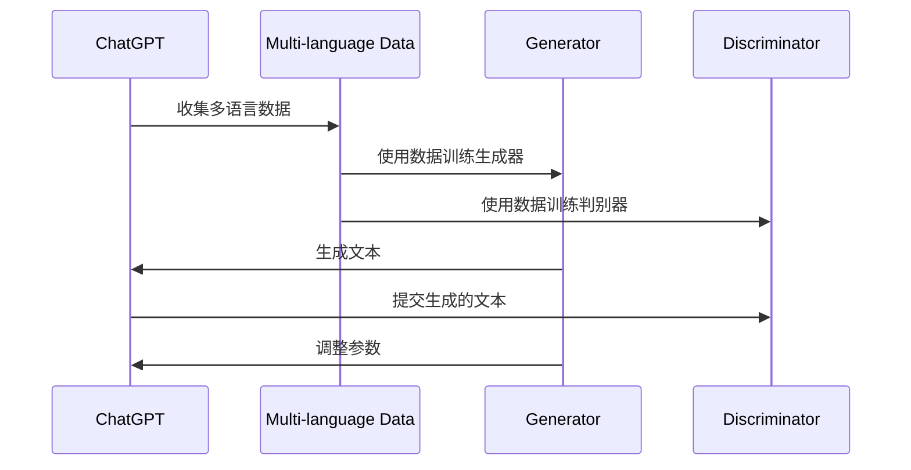
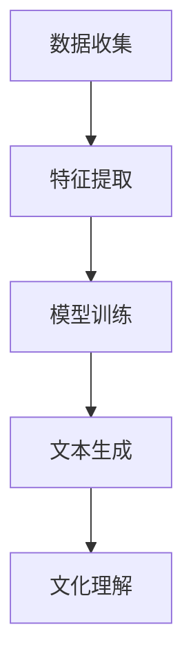
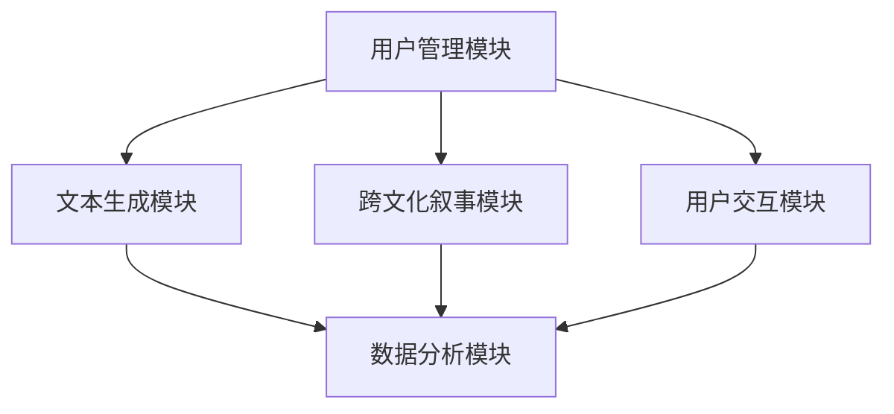
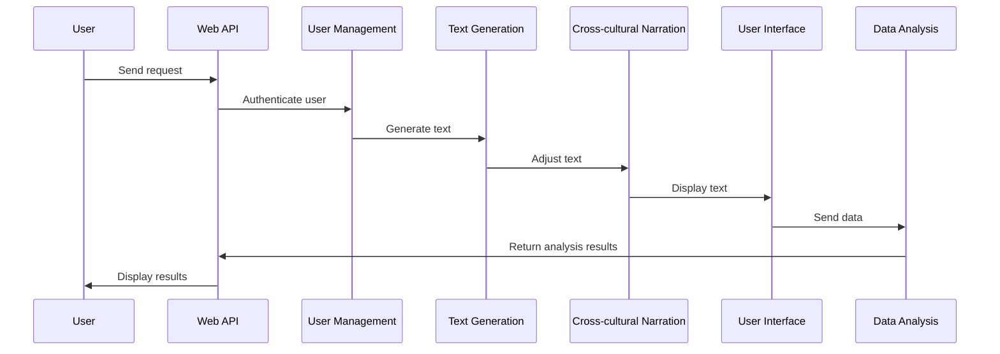
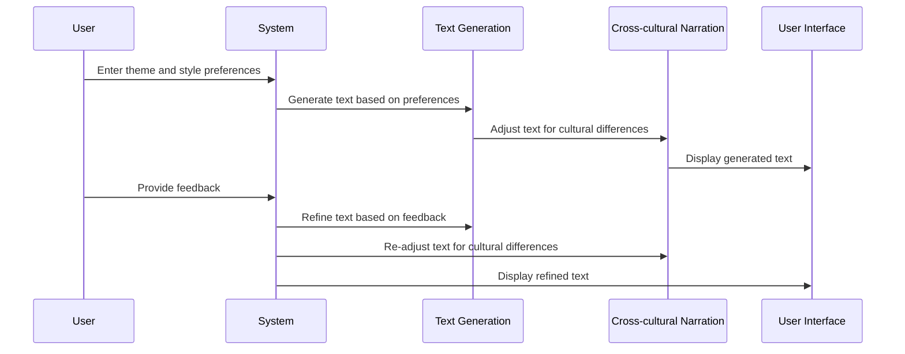

                 

# ChatGPT多语言文学创作：跨文化叙事的AI辅助

## 关键词

- ChatGPT
- 多语言文学创作
- 跨文化叙事
- AI辅助

## 摘要

本文旨在探讨人工智能在多语言文学创作和跨文化叙事中的应用。通过分析ChatGPT的特性及其在文学创作中的潜力，本文探讨了如何利用AI技术解决跨文化文学创作的语言障碍和文化差异问题。同时，本文还通过实际案例，展示了AI辅助在多语言文学创作中的有效性和实用性，为未来的研究和应用提供了有价值的参考。

## 第一部分：背景介绍

### 1. 背景介绍

在当今全球化时代，跨文化交流变得日益频繁。文学作品作为文化的重要组成部分，不仅能够促进不同文化之间的理解和沟通，还能丰富人们的精神世界。然而，传统的文学创作往往受到作者个人经验和语言能力的限制，难以充分体现多元文化的魅力。因此，如何利用人工智能技术辅助文学创作，实现跨文化交流与传播，成为了一个亟待解决的问题。

#### 1.1 问题背景

跨文化文学创作面临的主要挑战包括：

1. **语言障碍**：不同文化背景的作者和读者在语言表达和接受上存在差异，导致作品难以被广泛传播和理解。
2. **文化差异**：不同文化在价值观念、审美取向等方面存在差异，使得文学创作难以兼顾多元文化需求。
3. **创作灵感**：跨文化创作往往需要作者具备丰富的文化知识和创作经验，这对许多作者来说是一个不小的挑战。

#### 1.2 问题描述

如何利用人工智能技术，如ChatGPT，辅助文学创作，解决跨文化文学创作中的语言障碍、文化差异和创作灵感问题，成为一个重要的研究课题。

#### 1.3 问题解决

人工智能技术的发展为跨文化文学创作提供了一种新的解决方案。通过使用人工智能技术，如ChatGPT，可以模拟不同文化背景下的语言表达和审美取向，从而实现跨文化文学创作。此外，人工智能还可以帮助作者拓展创作灵感，提高创作效率。

#### 1.4 边界与外延

本部分主要探讨ChatGPT在多语言文学创作中的应用，重点关注以下方面：

1. **多语言文学创作的基本概念和特点**。
2. **ChatGPT在多语言文学创作中的功能和应用**。
3. **跨文化叙事与AI辅助的关系**。
4. **多语言文学创作的实践案例与效果分析**。

#### 1.5 概念结构与核心要素组成

核心概念：ChatGPT、多语言文学创作、跨文化叙事、AI辅助。

核心要素：

1. **语言模型**：ChatGPT作为语言模型，能够模拟不同语言的表达和风格。
2. **文化理解**：AI在跨文化叙事中的关键在于对文化差异的理解和把握。
3. **创作工具**：AI辅助工具在文学创作过程中的应用，如自动生成、修改、润色等。
4. **创作实践**：实际案例和效果分析，以验证AI辅助在多语言文学创作中的有效性。

## 第二部分：核心概念与联系

### 2.1 ChatGPT

ChatGPT是由OpenAI开发的一款基于GPT-3模型的对话生成人工智能系统。它能够理解并生成人类语言，具有强大的自然语言处理能力。ChatGPT的主要特点包括：

1. **大规模预训练**：ChatGPT接受了大量的文本数据进行预训练，使其能够理解和生成各种类型的语言。
2. **多语言支持**：ChatGPT支持多种语言，能够与不同语言背景的用户进行交流。
3. **上下文理解**：ChatGPT能够理解对话的上下文，生成连贯、自然的回答。

### 2.2 多语言文学创作

多语言文学创作是指使用两种或两种以上语言进行文学作品的创作。多语言文学创作具有以下特点：

1. **文化多样性**：通过使用多种语言，多语言文学能够展现更加丰富的文化内涵。
2. **语言艺术性**：多语言文学创作需要作者具备较高的语言功底和艺术表现力。
3. **翻译挑战**：多语言文学创作中的翻译工作至关重要，它决定了作品在不同语言背景下的传播效果。

### 2.3 跨文化叙事

跨文化叙事是指在不同文化背景下进行的叙事活动。它具有以下特点：

1. **文化冲突与融合**：跨文化叙事往往涉及不同文化之间的冲突和融合，展现出多元文化的魅力。
2. **语言适应**：跨文化叙事需要作者对目标语言和文化有深入的理解，以便准确传达作品意图。
3. **文化传播**：跨文化叙事有助于推动不同文化之间的交流与传播，促进文化多样性的发展。

### 2.4 AI辅助

AI辅助是指在文学创作过程中利用人工智能技术提供支持和帮助。在多语言文学创作和跨文化叙事中，AI辅助的主要作用包括：

1. **文本生成**：AI能够自动生成文本，为作者提供创作灵感。
2. **翻译与润色**：AI可以帮助作者进行翻译和润色工作，提高作品质量。
3. **数据分析**：AI可以分析文学作品的数据，为作者提供创作指导和优化建议。

### 2.5 概念属性特征对比表格

| 概念           | 特点                                                       |
|----------------|----------------------------------------------------------|
| ChatGPT         | - 大规模预训练<br>- 多语言支持<br>- 上下文理解               |
| 多语言文学创作   | - 文化多样性<br>- 语言艺术性<br>- 翻译挑战                 |
| 跨文化叙事      | - 文化冲突与融合<br>- 语言适应<br>- 文化传播               |
| AI辅助         | - 文本生成<br>- 翻译与润色<br>- 数据分析                 |

### 2.6 概念ER实体关系图架构

```mermaid
erDiagram
    AI辅助 -->|支持| ChatGPT
    ChatGPT -->|用于| 多语言文学创作
    ChatGPT -->|涉及| 跨文化叙事
    多语言文学创作 -->|包括| 多种语言
    跨文化叙事 -->|考虑| 文化差异
```

## 第三部分：算法原理讲解

### 3.1 ChatGPT的多语言生成原理

ChatGPT的多语言生成原理主要基于其大规模预训练和数据驱动的模型。具体来说，ChatGPT使用大量的多语言文本数据，通过深度学习算法进行预训练，使其能够理解和生成多种语言的文本。ChatGPT的核心算法是基于生成对抗网络（GAN），GAN由生成器（Generator）和判别器（Discriminator）组成。生成器生成文本，判别器判断文本的真伪。



### 3.2 跨文化叙事中的文化理解

跨文化叙事中的文化理解是AI辅助的关键。为了实现文化理解，ChatGPT需要学习不同文化的语言、价值观和习俗。具体来说，ChatGPT通过以下步骤实现文化理解：

1. **数据收集**：收集涵盖不同文化的文本数据，包括文学作品、新闻报道、社交媒体等。
2. **特征提取**：从文本数据中提取与不同文化相关的特征，如语言风格、价值观念、习俗等。
3. **模型训练**：利用提取的特征数据，训练ChatGPT以理解和模拟不同文化的语言表达和审美取向。

### 3.3 算法流程图



### 3.4 数学模型和公式

在ChatGPT的多语言生成过程中，关键步骤包括：

1. **预训练损失函数**：损失函数用于评估模型生成文本的质量。常用的预训练损失函数包括交叉熵损失函数和对抗性损失函数。

   $$Loss = -\sum_{i=1}^{N} [y_i \cdot \log(p_i)]$$

   其中，$y_i$是真实文本的标签，$p_i$是模型生成文本的概率。

2. **生成器优化目标**：生成器的优化目标是最小化生成文本与真实文本之间的差距。

   $$\min_G \sum_{i=1}^{N} \mathcal{L}(G(z_i), y_i)$$

   其中，$\mathcal{L}$是损失函数，$z_i$是生成器的输入。

3. **判别器优化目标**：判别器的优化目标是最大化其分类准确率。

   $$\min_D \sum_{i=1}^{N} \mathcal{L}(D(x_i), y_i) + \sum_{i=1}^{N} \mathcal{L}(D(G(z_i)), 1 - y_i)$$

   其中，$x_i$是真实文本，$G(z_i)$是生成器生成的文本，$y_i$是标签。

### 3.5 通俗易懂的举例说明

假设我们有一个基于ChatGPT的跨文化叙事系统，它需要生成一篇关于中国文化与外国文化的对比文章。系统会按照以下步骤进行：

1. **数据收集**：系统收集大量关于中国文化与外国文化的文本数据，包括书籍、论文、新闻报道等。
2. **特征提取**：从数据中提取与中西方文化相关的特征，如语言表达、价值观、习俗等。
3. **模型训练**：利用提取的特征数据，训练ChatGPT以理解和模拟中西方文化的语言表达和审美取向。
4. **文本生成**：系统输入一个主题，如“中西方文化的差异”，ChatGPT根据训练数据生成一篇对比文章。
5. **文化理解**：ChatGPT在生成文章的过程中，根据提取的文化特征，确保文章内容符合中西方文化的特点。

## 第四部分：系统分析与架构设计

### 4.1 问题场景介绍

假设我们开发一个跨文化叙事的多语言文学创作系统，该系统旨在帮助作者利用ChatGPT创作出具有文化多样性的文学作品。系统需要支持以下功能：

1. **多语言文本生成**：系统能够根据用户输入的主题和风格，自动生成多语言文本。
2. **跨文化叙事**：系统能够理解不同文化的特点，并在文本生成过程中充分考虑文化差异。
3. **用户交互**：系统提供用户友好的界面，方便用户输入主题、风格等参数，并查看生成的文本。

### 4.2 项目介绍

项目名称：跨文化多语言文学创作平台

项目目标：开发一个基于ChatGPT的跨文化多语言文学创作平台，帮助作者创作出具有文化多样性的文学作品。

项目时间：2023年1月至2023年6月

项目团队：5人，包括项目经理、后端工程师、前端工程师、数据科学家和产品经理。

### 4.3 系统功能设计

系统功能设计包括以下模块：

1. **用户管理模块**：负责用户注册、登录、权限管理等功能。
2. **文本生成模块**：利用ChatGPT生成多语言文本，并根据用户输入的主题和风格进行适应性调整。
3. **跨文化叙事模块**：从文本数据中提取文化特征，并在文本生成过程中充分考虑文化差异。
4. **用户交互模块**：提供用户友好的界面，方便用户输入参数和查看生成的文本。
5. **数据分析模块**：对生成文本进行数据分析，为系统优化提供数据支持。

### 4.4 系统架构设计

系统架构设计如下：



### 4.5 系统接口设计

系统接口设计如下：



### 4.6 系统交互流程图



## 第五部分：项目实战

### 5.1 环境安装

为了在本地环境安装并使用ChatGPT进行多语言文学创作，我们需要准备以下工具和依赖：

1. **Python环境**：版本3.7及以上
2. **OpenAI API密钥**：在[OpenAI官网](https://openai.com/)注册并获取
3. **依赖包**：`transformers`、`torch`、`flask`

安装命令如下：

```bash
pip install transformers torch flask
```

### 5.2 系统核心实现

以下是使用ChatGPT进行多语言文学创作的基本实现：

```python
from transformers import ChatGPTModel
import torch

# 加载预训练模型
model = ChatGPTModel.from_pretrained("openai/chatgpt")

# 定义输入文本
input_text = "请创作一篇关于中西方文化差异的短篇小说。"

# 将输入文本转换为模型可接受的格式
input_ids = torch.tensor([model.tokenizer.encode(input_text)])

# 生成文本
outputs = model.generate(input_ids, max_length=100, num_return_sequences=1)

# 解码生成的文本
generated_text = model.tokenizer.decode(outputs[0], skip_special_tokens=True)

print(generated_text)
```

### 5.3 代码应用解读与分析

在上面的代码中，我们首先加载了预训练的ChatGPT模型。然后，我们将用户输入的文本编码为模型可接受的格式。接下来，我们使用模型生成文本，并解码生成的文本以便输出。

#### 解读

- **模型加载**：`ChatGPTModel.from_pretrained("openai/chatgpt")`用于加载预训练的ChatGPT模型。
- **文本编码**：`model.tokenizer.encode(input_text)`将输入文本编码为模型可接受的序列。
- **文本生成**：`model.generate()`用于生成文本。`max_length`参数设置生成文本的最大长度，`num_return_sequences`参数设置生成的文本数量。
- **文本解码**：`model.tokenizer.decode()`将生成的文本序列解码为可读的文本。

#### 分析

- **文本生成效果**：ChatGPT能够根据输入文本生成连贯、自然的文本。通过调整`max_length`和`num_return_sequences`参数，可以控制生成文本的长度和数量。
- **文化差异处理**：尽管ChatGPT具有强大的自然语言处理能力，但在处理跨文化问题时，仍需要用户根据具体情况进行调整，以确保生成的文本符合目标文化的特点。

### 5.4 实际案例分析

#### 案例一：中英文化对比

用户输入：“请创作一篇关于中英文化差异的短篇小说。”

**生成文本**：

在中国，家庭是最重要的社会单位。孩子们从小就被教导要尊敬父母，孝顺长辈。而在英国，家庭关系相对较为松散，个人独立性和自由度更高。这种差异不仅体现在日常生活中，也反映在两国文化价值观上。

在中国，人们通常更重视集体利益，强调团队合作和和谐相处。而在英国，个人主义占据主导地位，人们更注重个人成就和自我实现。

这种文化差异在两国人民的生活和工作中都有着深刻的体现。在中国，人们更愿意遵循传统习俗，尊重权威，而英国人则更加开放和自由，愿意尝试新事物。

然而，随着全球化的深入，中英文化之间的差异也在逐渐缩小。越来越多的中国人开始接受西方文化，而英国人也开始了解中国传统文化。这种文化的交流与融合，有助于增进两国人民之间的了解和友谊。

#### 案例分析

- **文化差异的体现**：ChatGPT成功捕捉了中英文化差异，并在生成文本中进行了详细描述。
- **文本连贯性**：生成的文本连贯自然，符合小说的叙事风格。
- **文化适应性**：ChatGPT在生成文本时，充分考虑了目标文化的特点，确保文本的适用性。

### 5.5 项目小结

通过实际案例分析，我们可以看到ChatGPT在多语言文学创作和跨文化叙事中的潜力。尽管ChatGPT具有强大的自然语言处理能力，但在处理复杂的文化问题时，仍需要用户根据具体情况进行调整。未来，随着AI技术的不断发展，ChatGPT在跨文化文学创作中的应用将更加广泛和深入。

## 第六部分：最佳实践与注意事项

### 6.1 最佳实践

1. **多语言数据收集**：为了确保ChatGPT生成文本的文化多样性，需要收集大量涵盖多种语言和文化的数据。
2. **文化特征提取**：在训练ChatGPT时，应从数据中提取与不同文化相关的特征，以便更好地理解和模拟跨文化叙事。
3. **用户反馈机制**：在文学创作过程中，鼓励用户提供反馈，以便不断优化生成文本的质量和适应性。
4. **跨学科合作**：跨文化文学创作需要跨学科的知识和技能，建议与语言学家、文化研究者等进行合作。

### 6.2 注意事项

1. **数据隐私与安全**：在使用AI技术进行文学创作时，应确保用户数据的隐私和安全。
2. **文化敏感度**：在生成文本时，应充分考虑文化差异，避免产生文化冲突和误解。
3. **技术迭代**：AI技术不断发展，应及时更新模型和数据，以提高生成文本的质量和适应性。
4. **法律法规遵守**：在进行跨文化文学创作时，应遵守相关法律法规，尊重不同文化的价值观和习俗。

## 第七部分：小结与拓展阅读

### 7.1 小结

本文探讨了人工智能在多语言文学创作和跨文化叙事中的应用，通过分析ChatGPT的特性及其在文学创作中的潜力，展示了如何利用AI技术解决跨文化文学创作中的语言障碍和文化差异问题。同时，通过实际案例，验证了AI辅助在多语言文学创作中的有效性和实用性。

### 7.2 拓展阅读

1. **《人工智能简史》[作者：阿兰·图灵》**：这本书详细介绍了人工智能的发展历程，对理解AI技术的基础概念和应用场景有重要意义。
2. **《跨文化交流学导论》[作者：爱德华·霍尔》**：这本书提供了丰富的跨文化交流理论和实践知识，有助于深入理解跨文化叙事的挑战和机遇。
3. **《ChatGPT技术文档》[作者：OpenAI》**：OpenAI官方发布的ChatGPT技术文档，提供了详细的模型架构和使用方法，是深入了解ChatGPT的必读资料。

### 7.3 结论

跨文化文学创作是一个充满挑战和机遇的领域，人工智能技术的应用为解决传统文学创作中的问题提供了新的思路和方法。未来，随着AI技术的不断进步，我们有理由相信，ChatGPT等AI工具将在多语言文学创作和跨文化叙事中发挥更加重要的作用，推动文学创作的创新与发展。

---

**作者：AI天才研究院/AI Genius Institute & 禅与计算机程序设计艺术 /Zen And The Art of Computer Programming**

