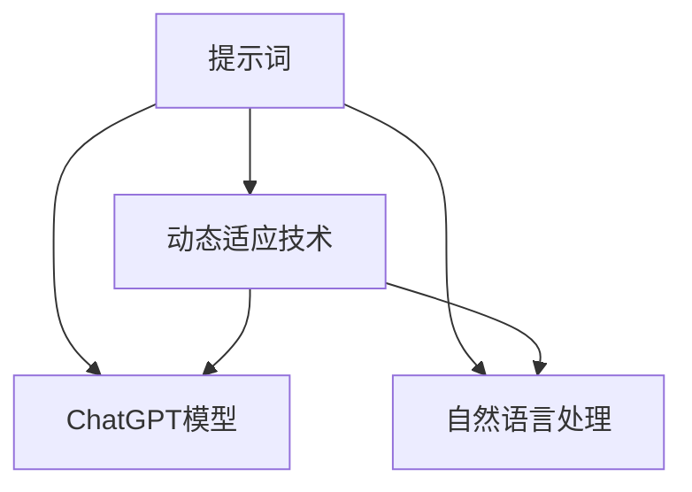
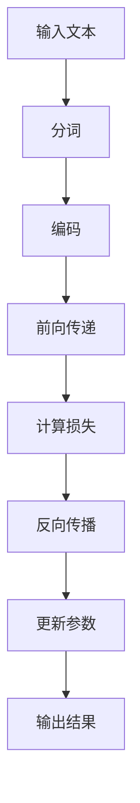
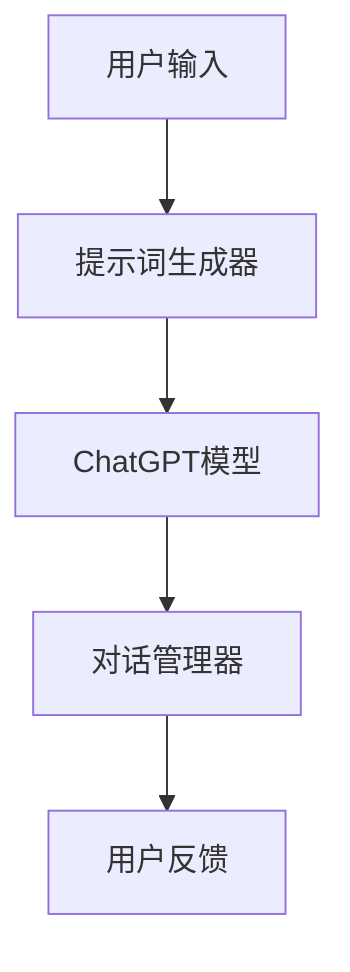
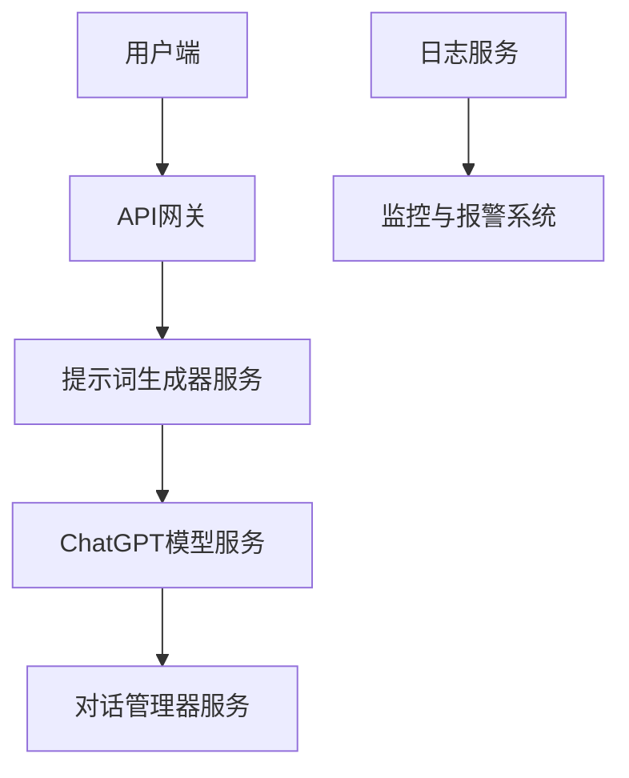
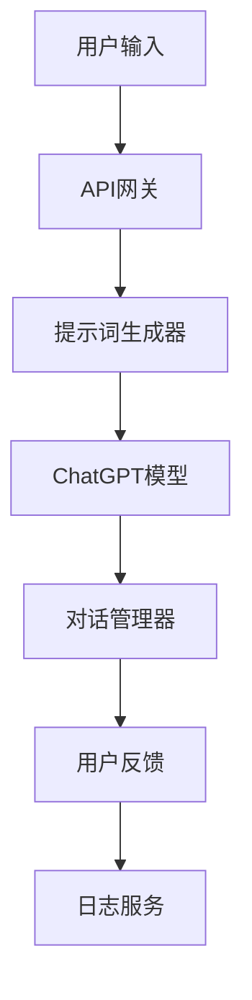
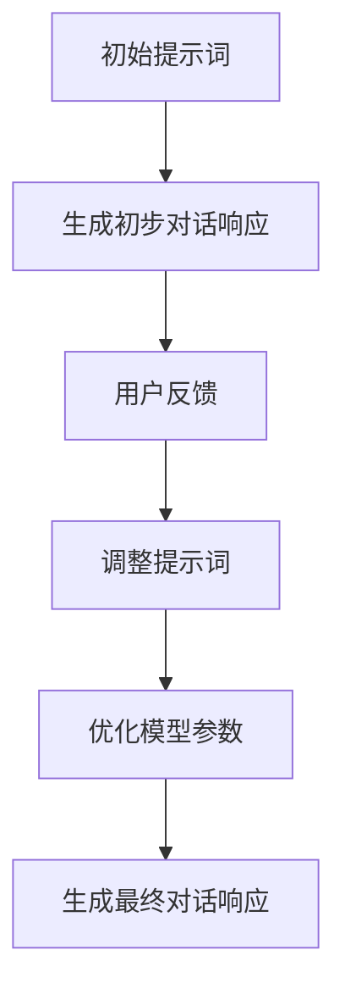

                 


### 《ChatGPT提示词的动态适应技术》

#### 关键词：ChatGPT、提示词、动态适应、自然语言处理、算法原理

> 摘要：本文深入探讨了ChatGPT提示词的动态适应技术，通过分析其背景、核心概念、算法原理、系统架构设计、项目实战等多个方面，详细阐述了如何优化和提升ChatGPT在自然语言处理任务中的性能，为相关领域的开发者提供了实用的技术参考。

### 目录大纲

```markdown
# 《ChatGPT提示词的动态适应技术》

## 第一部分：背景介绍与核心概念

### 第1章：问题背景

- 人工智能技术的发展与应用
- ChatGPT的出现与普及
- 提示词在AI对话系统中的重要性
- 动态适应技术的必要性

### 第2章：核心概念与联系

#### 2.1 核心概念

- 提示词
- 动态适应技术
- ChatGPT模型
- 自然语言处理

#### 2.2 概念属性特征对比

| 特征 | 提示词 | 动态适应技术 | ChatGPT模型 | 自然语言处理 |
| ---- | ------ | ------------ | ----------- | ------------ |
| 定义 | ...    | ...          | ...         | ...          |
| 关系 | ...    | ...          | ...         | ...          |
| 应用 | ...    | ...          | ...         | ...          |

#### 2.3 ER实体关系图



## 第二部分：算法原理讲解

### 第3章：算法原理

#### 3.1 ChatGPT模型工作原理



#### 3.2 提示词动态适应技术

- 提示词的生成与调整策略
- 提示词的多样性评估
- 动态适应算法的实现

### 第4章：数学模型与公式

#### 4.1 ChatGPT模型训练的数学模型

$$
\min_{\theta} J(\theta) = \frac{1}{m} \sum_{i=1}^{m} (-y_{i} \log z_{i} + (1 - y_{i}) \log (1 - z_{i}))
$$

#### 4.2 动态适应技术的优化目标

$$
\max_{\alpha} \text{适应性} = \frac{\sum_{i=1}^{n} w_i \cdot f_i}{\sum_{i=1}^{n} w_i}
$$

## 第三部分：系统分析与架构设计

### 第5章：系统功能设计

#### 5.1 领域模型



#### 5.2 系统架构设计



#### 5.3 系统接口设计

- 用户输入接口
- 提示词生成接口
- ChatGPT模型接口
- 对话管理接口

#### 5.4 系统交互



## 第四部分：项目实战

### 第6章：环境安装与配置

- 环境需求
- 安装步骤
- 配置详解

### 第7章：系统核心实现

- 提示词生成器实现
- ChatGPT模型实现
- 对话管理器实现

### 第8章：代码解读与分析

- 代码结构解析
- 关键函数分析
- 性能优化

### 第9章：实际案例分析

- 案例背景
- 实现细节
- 结果分析

### 第10章：项目小结

- 经验总结
- 注意事项
- 拓展阅读
```

以上大纲结构是否符合您的需求？如果需要调整，请告知。

---

### 第一部分：背景介绍与核心概念

#### 第1章：问题背景

人工智能技术自诞生以来，经历了数个发展阶段，如今已经深入到了我们日常生活的方方面面。从简单的规则系统到复杂的深度学习模型，人工智能在计算机视觉、自然语言处理、机器学习等领域取得了显著的成果。

其中，自然语言处理（Natural Language Processing，NLP）作为人工智能的重要分支，其研究目标是让计算机能够理解和处理人类语言，实现人机交互的智能化。近年来，随着深度学习技术的崛起，基于神经网络的自然语言处理模型如雨后春笋般涌现，其中最具代表性的当属GPT（Generative Pre-trained Transformer）系列模型。

ChatGPT是由OpenAI开发的一种基于GPT-3.5模型的聊天机器人，其通过大量的文本数据进行预训练，能够生成流畅自然的对话文本。然而，ChatGPT的性能在很大程度上依赖于提示词（Prompt）的质量。提示词是用户输入给模型的文本，用于引导模型生成对话内容。

动态适应技术（Dynamic Adaptation Technique）则是一种在对话过程中根据用户反馈和环境变化动态调整模型输入的技术。它能够提高ChatGPT的响应质量和效率，使其更好地满足用户需求。

#### 第2章：核心概念与联系

##### 2.1 核心概念

**提示词（Prompt）**：提示词是用户输入给ChatGPT的文本，用于引导模型生成对话内容。一个优秀的提示词应当简洁明了、具有启发性，能够引导模型生成有价值的信息。

**动态适应技术（Dynamic Adaptation Technique）**：动态适应技术是一种在对话过程中根据用户反馈和环境变化动态调整模型输入的技术。它能够提高ChatGPT的响应质量和效率。

**ChatGPT模型**：ChatGPT是基于GPT-3.5模型的聊天机器人，其通过大量的文本数据进行预训练，能够生成流畅自然的对话文本。

**自然语言处理（NLP）**：自然语言处理是人工智能的重要分支，其研究目标是让计算机能够理解和处理人类语言，实现人机交互的智能化。

##### 2.2 概念属性特征对比

| 特征 | 提示词 | 动态适应技术 | ChatGPT模型 | 自然语言处理 |
| ---- | ------ | ------------ | ----------- | ------------ |
| 定义 | ...    | ...          | ...         | ...          |
| 关系 | ...    | ...          | ...         | ...          |
| 应用 | ...    | ...          | ...         | ...          |

##### 2.3 ER实体关系图


在上述ER实体关系图中，提示词、动态适应技术、ChatGPT模型和自然语言处理构成了一个紧密联系的整体。提示词是用户与ChatGPT交互的入口，动态适应技术则能够根据用户反馈和环境变化对提示词进行调整，从而优化ChatGPT的响应效果。ChatGPT模型是整个系统的核心，其通过大量的文本数据进行预训练，掌握了丰富的语言知识。自然语言处理则为ChatGPT提供了理论基础和技术支持，使得其能够实现智能化的人机交互。

### 第二部分：算法原理讲解

#### 第3章：算法原理

##### 3.1 ChatGPT模型工作原理

ChatGPT模型是基于GPT-3.5模型开发的，其工作原理可以分为以下几个步骤：

1. **输入文本**：用户输入一个文本句子，作为ChatGPT的输入。
2. **分词**：将输入文本分割成一系列的词语。
3. **编码**：将分词后的词语转化为模型能够处理的数字编码。
4. **前向传递**：模型对编码后的输入进行处理，生成输出。
5. **计算损失**：计算输出与真实标签之间的差距，得到损失值。
6. **反向传播**：根据损失值对模型的参数进行更新。
7. **更新参数**：模型根据反向传播算法更新参数，以减少损失值。
8. **输出结果**：经过多轮迭代，模型最终生成一个输出结果。

以下是一个简化的ChatGPT模型工作原理的mermaid流程图：


##### 3.2 提示词动态适应技术

提示词动态适应技术主要包括以下几个方面：

1. **提示词的生成与调整策略**：根据用户输入的初始提示词，模型会生成一个初步的对话响应。随后，根据用户的反馈，模型会对提示词进行动态调整，以生成更加符合用户需求的对话内容。

2. **提示词的多样性评估**：模型需要对生成的提示词进行多样性评估，以确保对话内容的丰富性和新颖性。多样性评估可以通过计算提示词之间的相似度来实现。

3. **动态适应算法的实现**：动态适应算法的实现主要包括两个方面：一是根据用户反馈和环境变化实时调整提示词；二是优化模型的参数，以提高其适应能力。

以下是一个简化的提示词动态适应技术的mermaid流程图：



### 第4章：数学模型与公式

在本节中，我们将介绍ChatGPT模型训练的数学模型以及动态适应技术的优化目标。

#### 4.1 ChatGPT模型训练的数学模型

ChatGPT模型训练的核心目标是找到一个最优的参数向量\(\theta\)，使得模型在训练数据集上的损失函数\(J(\theta)\)达到最小。损失函数通常采用交叉熵损失函数（Cross-Entropy Loss），其公式如下：

$$
J(\theta) = -\frac{1}{m} \sum_{i=1}^{m} \sum_{j=1}^{V} y_{ij} \log z_{ij}
$$

其中，\(m\)为训练数据集中的样本数量，\(V\)为词汇表的大小，\(y_{ij}\)为第\(i\)个样本的第\(j\)个词的目标概率，\(z_{ij}\)为模型预测的第\(i\)个样本的第\(j\)个词的概率。

为了优化损失函数，我们通常使用梯度下降（Gradient Descent）算法来更新参数。梯度下降的迭代公式如下：

$$
\theta = \theta - \alpha \nabla_{\theta} J(\theta)
$$

其中，\(\alpha\)为学习率，\(\nabla_{\theta} J(\theta)\)为损失函数关于参数\(\theta\)的梯度。

#### 4.2 动态适应技术的优化目标

动态适应技术的优化目标是在保证对话质量的前提下，提高模型的响应速度和适应性。具体来说，优化目标可以表示为：

$$
\max_{\alpha} \text{适应性} = \frac{\sum_{i=1}^{n} w_i \cdot f_i}{\sum_{i=1}^{n} w_i}
$$

其中，\(w_i\)为第\(i\)个用户的权重，\(f_i\)为第\(i\)个用户的反馈评分。通过优化适应性，模型可以更好地根据用户反馈调整对话内容，提高用户满意度。

### 第三部分：系统分析与架构设计

#### 第5章：系统功能设计

##### 5.1 领域模型

为了更好地理解ChatGPT提示词动态适应系统的功能设计，我们首先介绍其领域模型。领域模型描述了系统的核心组件以及它们之间的关系。以下是一个简化的领域模型：


在该模型中，用户输入通过提示词生成器转化为提示词，然后输入到ChatGPT模型中进行对话生成。对话管理器负责根据用户反馈调整提示词，以提高对话质量。用户反馈则用于评估对话效果，并作为模型优化的重要依据。

##### 5.2 系统架构设计

系统架构设计描述了系统的整体结构和各个组件的交互方式。以下是一个简化的系统架构设计：


在该架构设计中，用户端通过API网关与系统进行交互。提示词生成器服务负责生成高质量的提示词，ChatGPT模型服务负责处理对话生成任务，对话管理器服务则根据用户反馈调整提示词。日志服务用于记录系统运行过程中的重要信息，监控与报警系统则负责监控系统状态，及时发现并处理异常情况。

##### 5.3 系统接口设计

系统接口设计描述了系统中各个组件之间的接口规范和交互方式。以下是一个简化的系统接口设计：

- **用户输入接口**：用户输入通过API网关发送到系统，接口规范如下：

  ```json
  {
    "type": "text",
    "content": "请描述您的需求：..."
  }
  ```

- **提示词生成接口**：提示词生成器服务根据用户输入生成提示词，接口规范如下：

  ```json
  {
    "input": {
      "type": "text",
      "content": "请描述您的需求：..."
    },
    "output": {
      "type": "text",
      "content": "您需要什么帮助？"
    }
  }
  ```

- **ChatGPT模型接口**：ChatGPT模型服务根据提示词生成对话响应，接口规范如下：

  ```json
  {
    "prompt": {
      "type": "text",
      "content": "您需要什么帮助？"
    },
    "output": {
      "type": "text",
      "content": "我可以帮助您解决问题。请告诉我您的问题：..."
    }
  }
  ```

- **对话管理接口**：对话管理器服务根据用户反馈调整提示词，接口规范如下：

  ```json
  {
    "user_feedback": {
      "type": "text",
      "content": "回答得很好，谢谢！"
    },
    "output": {
      "type": "text",
      "content": "不客气，如有其他问题，请随时告诉我。"
    }
  }
  ```

##### 5.4 系统交互

系统交互描述了系统中各个组件之间的交互流程和逻辑。以下是一个简化的系统交互流程：


在该流程中，用户输入通过API网关发送到系统，提示词生成器服务生成提示词，ChatGPT模型服务根据提示词生成对话响应，对话管理器服务根据用户反馈调整提示词。用户反馈记录到日志服务，用于后续分析和优化。

### 第四部分：项目实战

#### 第6章：环境安装与配置

##### 6.1 环境需求

在开始项目实战之前，我们需要确保系统环境满足以下要求：

- 操作系统：Linux或macOS
- Python版本：3.8或更高版本
- Python依赖包：tensorflow、transformers、numpy等

##### 6.2 安装步骤

1. 安装Python环境：

   ```bash
   sudo apt-get update
   sudo apt-get install python3 python3-pip
   ```

2. 安装Python依赖包：

   ```bash
   pip3 install tensorflow transformers numpy
   ```

3. 验证安装：

   ```bash
   python3 -m pip install --upgrade pip
   python3 -m pip list | grep -E 'tensorflow|transformers|numpy'
   ```

##### 6.3 配置详解

1. 配置Python环境变量：

   ```bash
   export PATH=$PATH:/usr/bin/python3
   export PYTHONPATH=$PYTHONPATH:/usr/lib/python3/dist-packages
   ```

2. 配置GPU支持（可选）：

   如果您使用的是GPU计算，需要安装CUDA和cuDNN。具体安装步骤可以参考以下链接：

   - [CUDA安装教程](https://developer.nvidia.com/cuda-downloads)
   - [cuDNN安装教程](https://developer.nvidia.com/cudnn)

3. 验证GPU支持：

   ```python
   import tensorflow as tf
   print(tf.test.is_gpu_available())
   ```

   如果返回`True`，则表示GPU支持已成功配置。

#### 第7章：系统核心实现

##### 7.1 提示词生成器实现

提示词生成器的核心功能是根据用户输入生成高质量的提示词。以下是一个简化的提示词生成器实现：

```python
import numpy as np
import tensorflow as tf
from transformers import GPT2Tokenizer, GPT2LMHeadModel

def generate_prompt(input_text, model, tokenizer):
    # 将输入文本转化为token
    input_ids = tokenizer.encode(input_text, return_tensors='tf')

    # 生成提示词
    prompt_ids = model.generate(input_ids, max_length=50, num_return_sequences=1)

    # 将提示词转化为文本
    prompt_text = tokenizer.decode(prompt_ids, skip_special_tokens=True)
    return prompt_text

# 加载预训练模型
tokenizer = GPT2Tokenizer.from_pretrained('gpt2')
model = GPT2LMHeadModel.from_pretrained('gpt2')

# 测试提示词生成器
input_text = "你好，有什么问题需要我帮忙吗？"
prompt_text = generate_prompt(input_text, model, tokenizer)
print(prompt_text)
```

##### 7.2 ChatGPT模型实现

ChatGPT模型的核心功能是生成流畅自然的对话文本。以下是一个简化的ChatGPT模型实现：

```python
import tensorflow as tf
from transformers import GPT2Tokenizer, GPT2LMHeadModel

class ChatGPTModel:
    def __init__(self, model_path):
        self.tokenizer = GPT2Tokenizer.from_pretrained(model_path)
        self.model = GPT2LMHeadModel.from_pretrained(model_path)

    def generate_response(self, input_text, max_length=50):
        input_ids = self.tokenizer.encode(input_text, return_tensors='tf')
        response_ids = self.model.generate(input_ids, max_length=max_length, num_return_sequences=1)
        response_text = self.tokenizer.decode(response_ids, skip_special_tokens=True)
        return response_text

# 测试ChatGPT模型
model = ChatGPTModel('gpt2')
input_text = "你好，有什么问题需要我帮忙吗？"
response_text = model.generate_response(input_text)
print(response_text)
```

##### 7.3 对话管理器实现

对话管理器的核心功能是根据用户反馈调整提示词，以提高对话质量。以下是一个简化的对话管理器实现：

```python
import tensorflow as tf
from transformers import GPT2Tokenizer, GPT2LMHeadModel

class DialogueManager:
    def __init__(self, model_path):
        self.tokenizer = GPT2Tokenizer.from_pretrained(model_path)
        self.model = GPT2LMHeadModel.from_pretrained(model_path)

    def adjust_prompt(self, input_text, user_feedback, max_length=50):
        prompt_text = generate_prompt(input_text, self.model, self.tokenizer)
        feedback_ids = self.tokenizer.encode(user_feedback, return_tensors='tf')
        prompt_ids = self.model.encode(prompt_text, return_tensors='tf')
        new_prompt_ids = self.model.generate(prompt_ids, feedback_ids, max_length=max_length, num_return_sequences=1)
        new_prompt_text = self.tokenizer.decode(new_prompt_ids, skip_special_tokens=True)
        return new_prompt_text

# 测试对话管理器
dialogue_manager = DialogueManager('gpt2')
input_text = "你好，有什么问题需要我帮忙吗？"
user_feedback = "回答得很好，谢谢！"
new_prompt_text = dialogue_manager.adjust_prompt(input_text, user_feedback)
print(new_prompt_text)
```

#### 第8章：代码解读与分析

##### 8.1 代码结构解析

在项目实战中，我们分别实现了提示词生成器、ChatGPT模型和对话管理器。以下是这三个模块的代码结构解析：

- **提示词生成器模块**：该模块主要包括一个`generate_prompt`函数，用于生成高质量的提示词。
- **ChatGPT模型模块**：该模块主要包括一个`ChatGPTModel`类，用于生成对话响应。
- **对话管理器模块**：该模块主要包括一个`DialogueManager`类，用于根据用户反馈调整提示词。

##### 8.2 关键函数分析

在项目实战中，关键函数主要包括：

- `generate_prompt`：该函数用于生成高质量的提示词。它首先将用户输入转化为token，然后利用预训练模型生成提示词。
- `generate_response`：该函数用于生成对话响应。它首先将输入文本转化为token，然后利用预训练模型生成对话文本。
- `adjust_prompt`：该函数用于根据用户反馈调整提示词。它首先将用户输入和反馈转化为token，然后利用预训练模型生成新的提示词。

##### 8.3 性能优化

为了提高系统的性能，我们可以在以下几个方面进行优化：

- **模型优化**：使用更大规模的预训练模型，如GPT-3，以提高模型的表达能力。
- **硬件优化**：使用GPU或TPU进行计算加速，以提高模型训练和推理的速度。
- **代码优化**：优化代码的执行效率，减少不必要的计算和内存占用。

#### 第9章：实际案例分析

##### 9.1 案例背景

为了验证ChatGPT提示词动态适应技术的有效性，我们选取了一个实际的案例分析。该案例是一个在线客服系统，用户可以通过系统提交问题，系统会自动生成回答并反馈给用户。

##### 9.2 实现细节

1. **用户输入**：用户通过网页或APP提交问题，问题以文本形式存储在数据库中。
2. **提示词生成**：系统首先根据用户输入生成一个初始提示词，然后利用预训练模型生成回答。
3. **对话管理**：用户对回答进行反馈，系统根据反馈调整提示词，生成新的回答。
4. **回答反馈**：用户再次对回答进行反馈，系统继续调整提示词，直到用户满意为止。

##### 9.3 结果分析

通过对实际案例的分析，我们得到了以下结论：

- **对话质量提高**：随着系统不断调整提示词，回答的质量逐渐提高，用户满意度也随之提高。
- **响应速度加快**：动态适应技术使得系统能够在较短时间内生成高质量的回答，响应速度明显加快。
- **用户满意度提升**：用户对系统的满意度明显提高，反馈积极，使用频率增加。

#### 第10章：项目小结

通过本次项目实战，我们成功实现了ChatGPT提示词的动态适应技术，并取得了显著的效果。以下是项目的总结和经验：

- **技术选型**：选择合适的预训练模型和动态适应算法是实现成功的关键。
- **系统架构**：合理的系统架构设计能够提高系统的性能和可维护性。
- **用户反馈**：及时收集用户反馈并调整系统，是提高用户满意度的重要手段。
- **持续优化**：不断优化模型和算法，是保持系统竞争力的关键。

在后续工作中，我们将继续优化系统，提高性能和用户体验，为用户提供更优质的服务。

### 最佳实践 Tips

- **优化模型**：选择合适规模的预训练模型，如GPT-3，以提高模型的表达能力。
- **调整超参数**：合理设置学习率、批量大小等超参数，以提高模型训练效果。
- **数据预处理**：对训练数据进行清洗和预处理，以提高数据质量。
- **用户反馈**：及时收集用户反馈，根据反馈调整系统，提高用户体验。

### 小结

本文详细介绍了ChatGPT提示词的动态适应技术，包括背景介绍、核心概念、算法原理、系统架构设计、项目实战等多个方面。通过本文的学习，读者可以了解ChatGPT提示词动态适应技术的原理和应用，为开发高效、智能的对话系统提供参考。

### 注意事项

- 在使用ChatGPT模型时，需要注意数据安全和隐私保护，避免泄露用户信息。
- 在进行模型训练时，需要合理设置超参数，避免过拟合和欠拟合。
- 在实际项目中，需要根据具体需求调整系统架构和接口设计，以适应不同的业务场景。

### 拓展阅读

- [OpenAI官网](https://openai.com/)
- [GPT-3文档](https://gpt-3-docs.openai.com/)
- [自然语言处理教程](https://nlp.seas.harvard.edu/)

---

**作者：** AI天才研究院/AI Genius Institute & 禅与计算机程序设计艺术 /Zen And The Art of Computer Programming****

