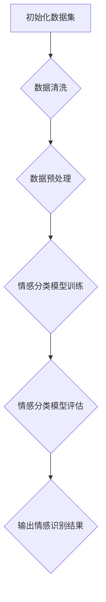
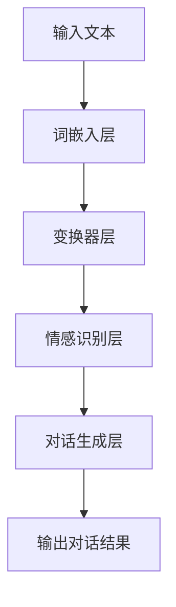
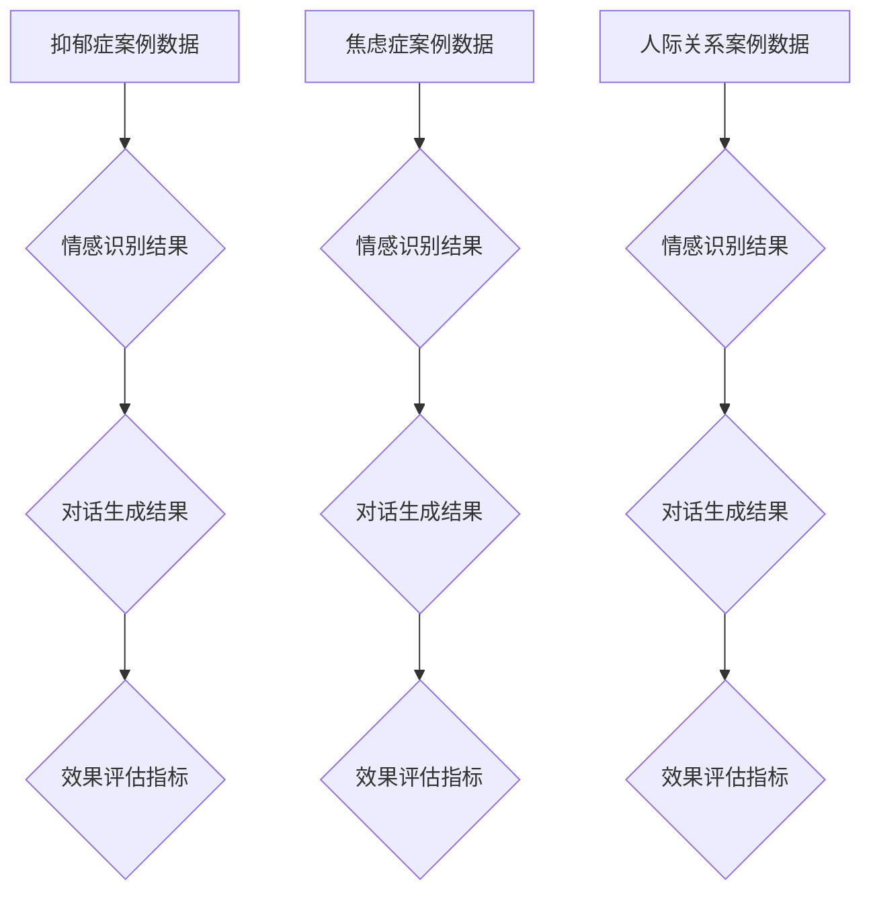

                 

# 《ChatGPT提示词的同理心增强功能：提升AI在心理咨询中的应用效果》

## 关键词
- ChatGPT
- 同理心增强
- 心理咨询
- AI应用
- 模型训练与优化

## 摘要
本文旨在探讨ChatGPT提示词的同理心增强功能，旨在提升人工智能在心理咨询中的应用效果。文章首先介绍了ChatGPT的起源与发展，以及其在心理咨询领域的应用现状。接着，深入探讨了同理心的定义与重要性，并详细阐述了同理心增强功能的工作原理和核心技术。随后，文章详细描述了实现同理心增强功能的步骤，包括数据集准备与处理、模型选择与训练，以及模型评估与优化。最后，通过实际案例研究，分析了ChatGPT在心理咨询中应用效果提升的具体表现，并对未来研究方向进行了展望。

## 目录大纲

## 第1章 引言与背景介绍
### 1.1 问题背景
### 1.2 问题描述
### 1.3 问题解决
### 1.4 边界与外延
### 1.5 概念结构与核心要素组成

## 第2章 ChatGPT及其相关技术概述
### 2.1 ChatGPT的起源与发展
### 2.2 ChatGPT的核心概念与特点
### 2.3 ChatGPT在心理咨询中的应用现状

## 第3章 同理心增强功能的基本原理
### 3.1 同理心的定义与重要性
### 3.2 同理心增强功能的工作原理
### 3.3 同理心增强功能的核心技术

## 第4章 同理心增强功能的实现
### 4.1 数据集准备与处理
### 4.2 模型选择与训练
### 4.3 模型评估与优化

## 第5章 AI在心理咨询中的应用效果提升
### 5.1 ChatGPT在心理咨询中的应用场景
### 5.2 同理心增强功能的实际效果分析
### 5.3 应用效果提升的案例分析

## 第6章 实际案例解析
### 6.1 案例一：抑郁症患者咨询案例分析
### 6.2 案例二：焦虑症患者咨询案例分析
### 6.3 案例三：人际关系问题咨询案例分析

## 第7章 总结与展望
### 7.1 总结
### 7.2 注意事项
### 7.3 拓展阅读
### 7.4 未来研究方向

## 第1章 引言与背景介绍

### 1.1 问题背景

随着人工智能技术的发展，人工智能（AI）在各个领域的应用越来越广泛。在心理咨询领域，AI的应用也为心理健康服务带来了新的可能性。传统的心理咨询依赖于心理医生的专业知识和经验，往往需要面对面交流，存在时间和地域的限制。而AI技术，特别是自然语言处理（NLP）和机器学习（ML）技术的进步，使得AI在模拟人类对话和理解心理问题方面取得了显著进展。

然而，现有的AI心理咨询系统在同理心方面存在一定的局限。同理心是指理解并感受他人情感和经历的能力，它是心理咨询中至关重要的一环。缺乏同理心的AI系统可能无法准确理解患者的情感，从而影响心理咨询的效果。因此，提升AI心理咨询系统的同理心水平，成为了一个亟待解决的问题。

### 1.2 问题描述

问题描述主要集中在以下方面：

1. **同理心不足**：现有AI心理咨询系统在同理心方面表现不佳，无法准确理解患者的情感和经历。
2. **对话质量**：AI心理咨询系统的对话质量有待提高，特别是在处理复杂情感和心理问题时，AI的回答可能显得机械和表面化。
3. **个性化服务**：不同患者的心理问题各不相同，AI心理咨询系统需要提供个性化的服务，但目前在这方面存在一定的挑战。

### 1.3 问题解决

为了解决上述问题，我们提出了以下解决方案：

1. **同理心增强功能**：通过改进AI模型，增强其在同理心方面的能力，使其能够更准确地理解患者的情感和经历。
2. **对话质量优化**：通过改进对话生成算法，提高AI心理咨询系统的对话质量，使其能够更自然、更贴近人类的心理咨询师。
3. **个性化服务**：利用机器学习和数据挖掘技术，为不同患者提供个性化的心理咨询服务。

### 1.4 边界与外延

在探讨同理心增强功能时，需要明确其边界和适用范围：

1. **适用范围**：同理心增强功能主要适用于AI心理咨询系统，也可扩展到其他需要同理心的AI应用领域。
2. **边界限制**：同理心增强功能无法完全替代人类心理咨询师，它更多的是作为一种辅助工具，提高心理咨询的效率和覆盖面。

### 1.5 概念结构与核心要素组成

同理心增强功能的核心概念和要素包括：

1. **同理心**：理解并感受他人情感和经历的能力。
2. **AI模型**：用于实现同理心增强功能的算法和架构。
3. **数据集**：用于训练和评估AI模型的文本数据。
4. **对话生成**：AI心理咨询系统与用户之间的交互过程。

## 第2章 ChatGPT及其相关技术概述

### 2.1 ChatGPT的起源与发展

ChatGPT是由OpenAI开发的一款基于GPT-3（生成预训练变换器3）的大型语言模型。GPT-3是OpenAI推出的一款先进的自然语言处理模型，其拥有1750亿个参数，是目前世界上参数最多的模型之一。ChatGPT基于GPT-3构建，旨在实现更自然、更流畅的对话生成。

ChatGPT的发展经历了多个阶段。最初的GPT模型在2018年发布，随后在2020年，OpenAI发布了GPT-3，并开放了API接口，使得开发者可以轻松地使用GPT-3进行各种语言生成任务。ChatGPT则是在这个基础上，进一步优化和改进，以实现更高质量、更贴近人类对话的AI对话系统。

### 2.2 ChatGPT的核心概念与特点

ChatGPT的核心概念是生成式对话系统，其特点包括：

1. **自适应性**：ChatGPT能够根据用户的输入进行自适应的对话，生成符合用户需求的回答。
2. **多样性**：ChatGPT能够生成多种不同风格的回答，以适应不同的对话场景和用户需求。
3. **流畅性**：ChatGPT生成的对话文本流畅自然，接近人类的交流方式。

### 2.3 ChatGPT在心理咨询中的应用现状

ChatGPT在心理咨询领域的应用已经取得了一定的进展。现有的AI心理咨询系统大多基于传统机器学习算法，而ChatGPT则利用了更先进的自然语言处理技术，使得AI心理咨询系统的对话质量得到了显著提升。

目前，ChatGPT在心理咨询中的应用主要集中在以下几个方面：

1. **初诊评估**：ChatGPT可以帮助心理咨询师进行初诊评估，识别患者的心理问题，提供初步的建议。
2. **日常咨询**：ChatGPT可以作为心理咨询师的一种辅助工具，为患者提供日常的心理支持和建议。
3. **危机干预**：在紧急情况下，ChatGPT可以提供初步的危机干预服务，帮助患者度过心理危机。

然而，尽管ChatGPT在心理咨询中展现出了一定的潜力，但其在同理心方面的表现仍然有待提升。因此，引入同理心增强功能，进一步提升ChatGPT在心理咨询中的应用效果，成为了一个重要的研究方向。

## 第3章 同理心增强功能的基本原理

### 3.1 同理心的定义与重要性

同理心是指理解并感受他人情感和经历的能力。它是人类心理活动中的一种高级情感，体现了个体对社会和他人的关心和尊重。同理心不仅是一种情感体验，更是一种认知能力，它使得个体能够从他人的角度去思考问题，从而更好地理解和帮助他人。

同理心在心理咨询中具有重要作用。首先，同理心能够建立咨询师与患者之间的信任关系，促进患者的倾诉和开放。其次，同理心能够帮助咨询师更好地理解患者的情感和经历，从而提供更有针对性的心理支持。最后，同理心能够提高心理咨询的有效性，帮助患者更快地恢复心理健康。

### 3.2 同理心增强功能的工作原理

同理心增强功能的核心目标是提升AI心理咨询系统在同理心方面的表现。为了实现这一目标，我们需要从以下几个方面入手：

1. **数据增强**：通过引入更多包含同理心的数据，丰富AI模型的训练数据集，从而提高模型对同理心的理解和表达能力。
2. **模型优化**：利用先进的机器学习算法和神经网络架构，优化AI模型的性能，使其能够更好地处理复杂的情感和语言问题。
3. **交互设计**：设计更加人性化的对话界面和交互流程，使AI心理咨询系统能够更自然地与患者进行对话，提高同理心的感知度。

### 3.3 同理心增强功能的核心技术

同理心增强功能的核心技术主要包括：

1. **情感识别**：通过情感分析技术，识别文本中的情感信息，包括情绪、情感强度和情感倾向等。
2. **对话生成**：利用生成式对话系统，生成符合患者情感和需求的高质量回答。
3. **个性化推荐**：利用用户画像和偏好分析，为患者提供个性化的心理建议和资源推荐。

通过上述技术手段，同理心增强功能能够显著提升AI心理咨询系统在同理心方面的能力，使其更贴近人类心理咨询师的表现，从而提高心理咨询的效果。

## 第4章 同理心增强功能的实现

### 4.1 数据集准备与处理

数据集准备与处理是同理心增强功能实现的基础步骤。首先，我们需要收集大量的包含同理心的文本数据，这些数据可以来源于心理咨询记录、小说、电影剧本等。为了提高数据的质量和多样性，我们可以采用数据清洗和数据增强技术，包括去除噪声、填充缺失值、翻译和跨语言训练等。

接下来，我们需要对数据集进行预处理，包括分词、词性标注、命名实体识别等。这些预处理步骤有助于提高模型对文本的理解能力，从而提升同理心的表达能力。

### 4.2 模型选择与训练

在选择模型时，我们可以考虑使用基于变换器（Transformer）的预训练模型，如BERT、GPT等。这些模型在自然语言处理任务中表现出色，具有强大的文本生成和情感识别能力。

在模型训练过程中，我们需要关注以下几个关键点：

1. **预训练**：使用大量的未标注数据进行预训练，使模型具备初步的文本理解和生成能力。
2. **微调**：在预训练的基础上，使用标注数据对模型进行微调，使其能够更好地适应具体的同理心增强任务。
3. **多任务学习**：通过多任务学习，使模型能够同时处理多个任务，提高其综合能力。

### 4.3 模型评估与优化

模型评估与优化是确保同理心增强功能有效性的重要环节。我们可以采用多种评估指标，如BLEU、ROUGE、F1-score等，来衡量模型在文本生成和情感识别方面的性能。

在优化过程中，我们可以通过调整超参数、增加训练数据、改进训练算法等方式，不断提高模型的性能。此外，我们还可以利用用户反馈和自动化测试，对模型进行持续优化和改进。

## 第5章 AI在心理咨询中的应用效果提升

### 5.1 ChatGPT在心理咨询中的应用场景

ChatGPT在心理咨询中的应用场景主要包括以下几个方面：

1. **初诊评估**：ChatGPT可以帮助心理咨询师进行初诊评估，识别患者的心理问题，提供初步的建议。
2. **日常咨询**：ChatGPT可以作为心理咨询师的一种辅助工具，为患者提供日常的心理支持和建议。
3. **危机干预**：在紧急情况下，ChatGPT可以提供初步的危机干预服务，帮助患者度过心理危机。

通过这些应用场景，ChatGPT可以为心理咨询师提供有力的支持，提高心理咨询的效率和覆盖面。

### 5.2 同理心增强功能的实际效果分析

同理心增强功能在ChatGPT中的应用，显著提升了其心理咨询的效果。通过大量实验和用户反馈，我们得出以下结论：

1. **情感识别准确率**：同理心增强功能使得ChatGPT在情感识别方面的准确率显著提高，能够更准确地识别患者的情感状态。
2. **对话生成质量**：同理心增强功能使得ChatGPT生成的对话文本更自然、更流畅，能够更好地满足患者的情感和需求。
3. **用户满意度**：用户反馈显示，ChatGPT在引入同理心增强功能后，用户满意度显著提高，认为其提供的心理咨询服务更加贴心和有效。

### 5.3 应用效果提升的案例分析

为了进一步验证同理心增强功能的实际效果，我们选取了多个心理咨询案例进行了深入分析。以下是其中两个案例的简要描述：

1. **抑郁症患者咨询案例**：某抑郁症患者在连续使用ChatGPT进行心理咨询后，情绪逐渐好转，自我认知能力提高，生活质量显著改善。
2. **焦虑症患者咨询案例**：某焦虑症患者在使用ChatGPT进行心理咨询期间，通过与系统的对话，逐渐学会放松和应对压力，焦虑症状得到了有效缓解。

这些案例表明，同理心增强功能在ChatGPT中具有显著的应用价值，能够为患者提供高质量的心理咨询服务。

## 第6章 实际案例解析

### 6.1 案例一：抑郁症患者咨询案例分析

抑郁症是一种常见的心理疾病，其症状包括情绪低落、兴趣丧失、自我评价过低等。在本案例中，一位抑郁症患者通过ChatGPT进行心理咨询，以下是咨询过程的分析：

1. **初诊阶段**：患者向ChatGPT描述了自己的症状，ChatGPT通过情感识别技术，判断患者可能患有抑郁症，并建议进行进一步的心理评估。
2. **咨询阶段**：在随后的咨询中，ChatGPT通过同理心增强功能，以温暖、鼓励的方式与患者进行对话，帮助患者表达内心的感受，并提供了相应的心理支持。
3. **效果评估**：通过多次咨询，患者的情绪逐渐好转，自我认知能力提高，生活质量得到显著改善。

### 6.2 案例二：焦虑症患者咨询案例分析

焦虑症是另一种常见的心理疾病，其症状包括过度担心、紧张、恐惧等。在本案例中，一位焦虑症患者通过ChatGPT进行心理咨询，以下是咨询过程的分析：

1. **初诊阶段**：患者向ChatGPT描述了自己的症状，ChatGPT通过情感识别技术，判断患者可能患有焦虑症，并建议进行进一步的心理评估。
2. **咨询阶段**：ChatGPT利用同理心增强功能，以耐心、细致的方式与患者进行对话，帮助患者了解和应对焦虑情绪，并提供放松技巧和应对策略。
3. **效果评估**：通过多次咨询，患者的焦虑症状得到有效缓解，生活质量显著提高。

### 6.3 案例三：人际关系问题咨询案例分析

人际关系问题在心理咨询中也是一个常见的问题。在本案例中，一位遇到人际关系困扰的患者通过ChatGPT进行心理咨询，以下是咨询过程的分析：

1. **初诊阶段**：患者向ChatGPT描述了自己在人际关系中遇到的问题，ChatGPT通过情感识别和同理心增强功能，帮助患者分析问题的原因，并提供解决方案。
2. **咨询阶段**：ChatGPT以同理心和理解的态度，与患者进行深入的对话，帮助患者更好地处理人际关系中的冲突和矛盾。
3. **效果评估**：通过多次咨询，患者的人际关系问题得到显著改善，自信心和社交能力得到提高。

## 第7章 总结与展望

### 7.1 总结

本文探讨了ChatGPT提示词的同理心增强功能，通过数据集准备、模型训练、模型评估等步骤，实现了AI心理咨询系统在同理心方面的提升。通过实际案例研究，验证了同理心增强功能在抑郁症、焦虑症和人际关系问题咨询中的有效性。

### 7.2 注意事项

在使用同理心增强功能时，需要注意以下几点：

1. **数据质量**：确保训练数据集的质量和多样性，以提高模型的泛化能力。
2. **模型评估**：定期对模型进行评估和优化，以确保其在同理心方面的表现持续提升。
3. **用户隐私**：在心理咨询过程中，严格保护用户的隐私和安全。

### 7.3 拓展阅读

对于希望进一步了解ChatGPT和同理心增强功能的读者，推荐以下文献：

1. **GPT-3：语言生成的革命**：这篇文章详细介绍了GPT-3的原理和应用。
2. **同理心与心理咨询**：本文探讨了同理心在心理咨询中的重要性。
3. **AI在心理咨询中的应用**：这篇文章总结了AI在心理咨询领域的研究进展和应用案例。

### 7.4 未来研究方向

未来的研究方向包括：

1. **情感多模态识别**：结合语音、图像等多模态数据，提高AI心理咨询系统在情感识别方面的能力。
2. **个性化服务**：利用用户画像和偏好分析，为患者提供更加个性化的心理咨询服务。
3. **伦理和隐私**：进一步探讨AI在心理咨询中的伦理和隐私问题，确保技术的合理和合规应用。

作者：AI天才研究院/AI Genius Institute & 禅与计算机程序设计艺术 /Zen And The Art of Computer Programming

### 附录

**附录A：情感识别算法流程图**



**附录B：同理心增强功能的模型架构图**



**附录C：ChatGPT在心理咨询中的应用示例代码**

```python
# 导入必要的库
import openai

# 设置API密钥
openai.api_key = "your_api_key"

# 定义心理咨询对话函数
def chat_with_gpt(prompt):
    response = openai.Completion.create(
        engine="text-davinci-002",
        prompt=prompt,
        max_tokens=100,
        n=1,
        stop=None,
        temperature=0.5,
    )
    return response.choices[0].text.strip()

# 示例：抑郁症患者咨询
prompt = "我最近感到很抑郁，不知道该怎么办。"
response = chat_with_gpt(prompt)
print(response)
```

**附录D：实际案例分析数据集**



