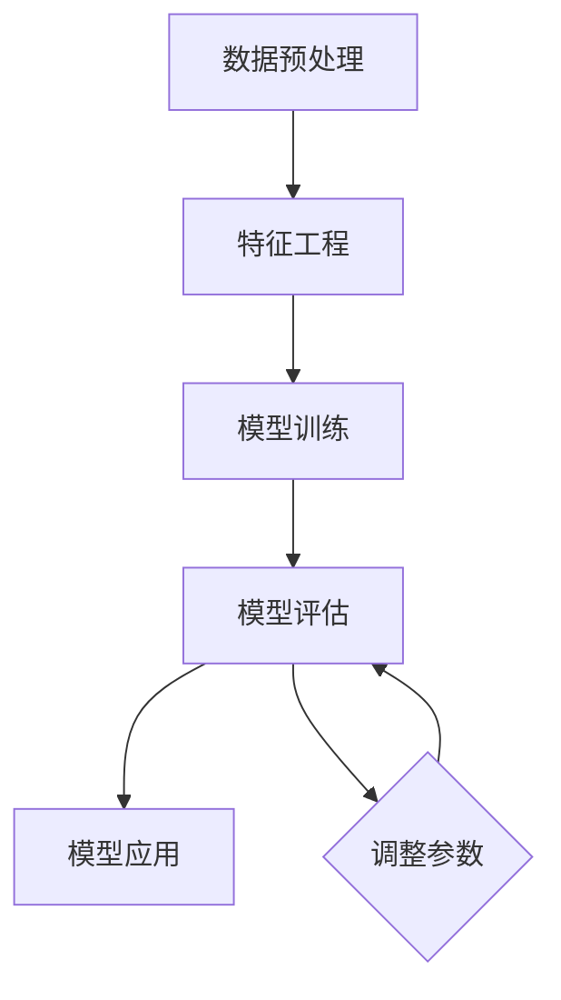
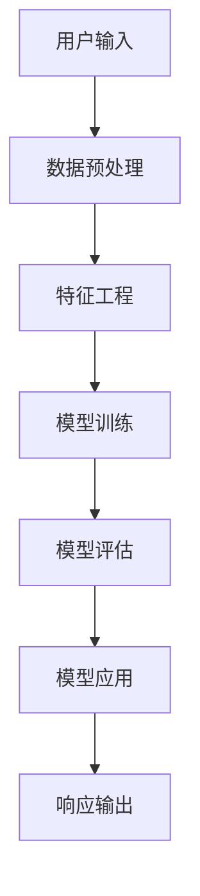
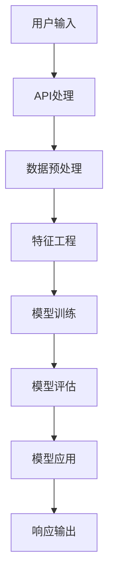
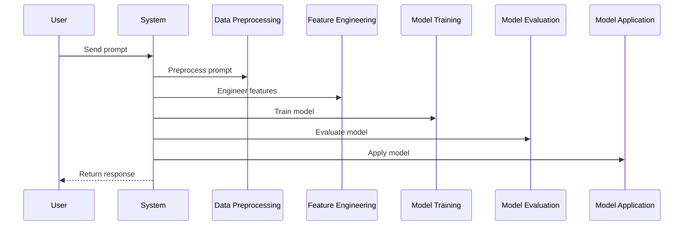
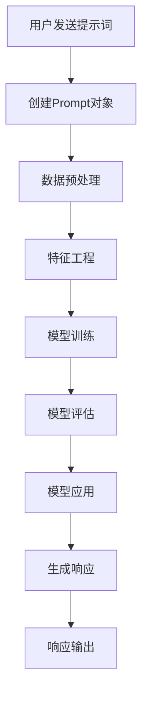
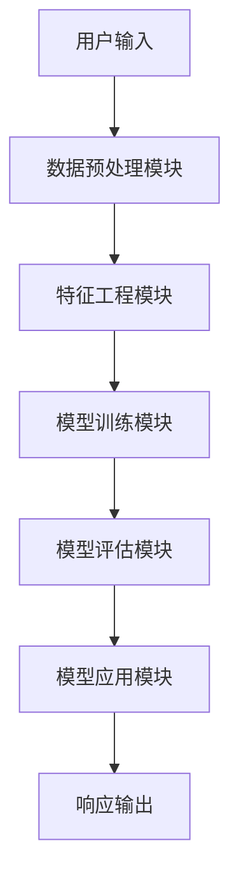
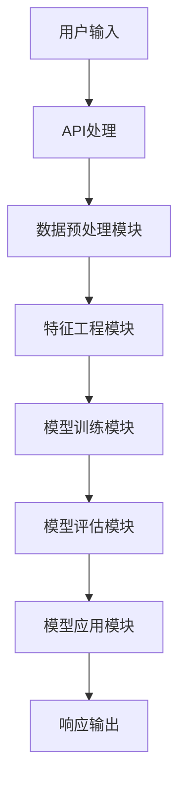
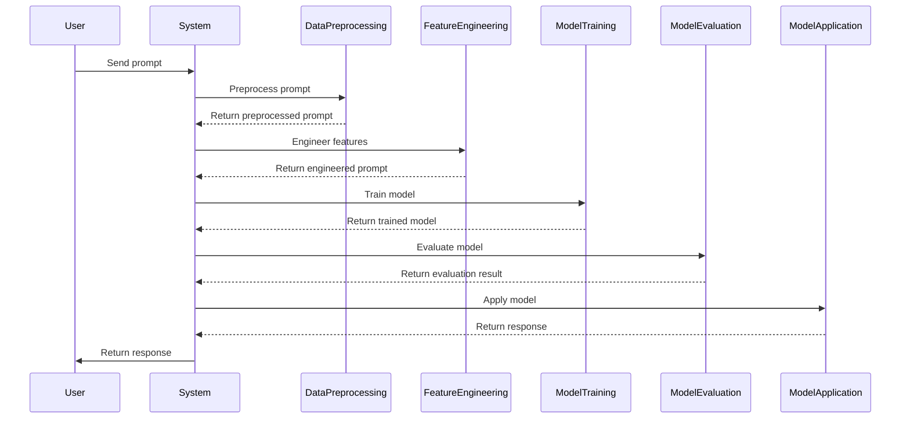

                 

### 文章标题：ChatGPT提示词的性别中立性：消除AI偏见的策略

#### 关键词：ChatGPT，提示词，性别中立性，AI偏见，算法原理，数学模型，系统架构，项目实战

#### 摘要：
本文旨在深入探讨ChatGPT提示词的性别中立性问题，并探索消除AI偏见的具体策略。首先，我们将回顾AI偏见的概念及其影响，接着详细解释性别中立性的重要性。随后，文章将探讨ChatGPT的运作原理，并介绍如何设计性别中立的提示词。我们将使用mermaid流程图和Python代码示例，详尽解释算法原理，并通过LaTeX公式展示数学模型。随后，我们将分析系统架构设计，并提供一个实际项目实战案例。最后，文章将总结最佳实践，提出注意事项，并提供拓展阅读建议。

### 目录大纲

1. **背景介绍**
   - **AI偏见问题介绍**
   - **性别中立性的重要性**
   - **为什么需要性别中立性的ChatGPT提示词**

2. **核心概念与联系**
   - **ChatGPT的基本概念**
   - **性别中立性概念解析**
   - **AI偏见与性别中立性的联系**

3. **算法原理讲解**
   - **ChatGPT的工作原理**
   - **检测与消除AI偏见的方法**
   - **算法原理讲解与流程图**
   - **Python代码示例**

4. **数学模型和数学公式**
   - **算法背后的数学原理**
   - **LaTeX格式数学公式**

5. **系统分析与架构设计**
   - **系统功能设计**
   - **系统架构设计**
   - **系统接口设计**
   - **系统交互序列图**

6. **项目实战**
   - **项目背景**
   - **环境安装**
   - **系统核心实现**
   - **代码应用解读与分析**
   - **实际案例分析和详细讲解剖析**
   - **项目小结**

7. **最佳实践与拓展**
   - **最佳实践**
   - **注意事项**
   - **拓展阅读**

### 背景介绍

#### AI偏见问题介绍

人工智能（AI）在当今社会中的应用越来越广泛，从医疗诊断到金融服务，从自动驾驶到智能助手，AI正逐渐融入我们日常生活的各个方面。然而，AI系统并非完美无缺，它们可能会受到偏见的影响。AI偏见是指AI系统在决策过程中展现出对某些群体或特征的偏见，这种偏见可能源于训练数据中的偏差或算法设计中的缺陷。

AI偏见问题最早在2016年被曝光，当时谷歌AI团队开发的一款名为“AI美女助手”的应用程序，因其性别偏见引发广泛关注。这款应用程序在推荐照片时，倾向于展示女性照片，而忽视了男性照片，这显然是一种性别偏见。类似的问题在许多其他AI应用中也普遍存在，例如招聘系统可能对某些性别或种族的候选人产生偏见。

AI偏见不仅影响用户体验，还可能对社会产生负面影响。例如，如果招聘系统对某些性别或种族的候选人产生偏见，那么可能会导致就业歧视。此外，AI偏见还可能影响医疗诊断的准确性，导致对某些群体的医疗服务不公平。

#### 性别中立性的重要性

性别中立性是指避免在语言、行为和制度中表现出对某一性别的偏见。在人工智能领域，性别中立性意味着AI系统在处理性别相关问题时，不应表现出对某一性别的偏好或歧视。

性别中立性的重要性主要体现在以下几个方面：

1. **公平性**：性别中立性有助于确保AI系统在处理性别相关问题时，公平地对待所有用户，避免因性别偏见而导致的歧视。

2. **准确性**：性别中立性可以提高AI系统的准确性，减少因性别偏见导致的错误决策。例如，在医疗诊断中，如果AI系统受到性别偏见的影响，可能会对某一性别的患者产生不准确的结果，从而影响治疗效果。

3. **社会影响**：性别中立性有助于消除社会中的性别偏见，促进性别平等。在招聘、教育、金融等各个领域，性别中立性都能发挥重要作用。

#### 为什么需要性别中立性的ChatGPT提示词

ChatGPT是一种基于大型语言模型的人工智能助手，它通过处理自然语言文本来生成响应。提示词（Prompt）是用户向ChatGPT提供的文本输入，用于引导ChatGPT生成特定的输出。

性别中立性的提示词对于消除ChatGPT中的性别偏见至关重要。以下是为什么需要性别中立性的ChatGPT提示词的原因：

1. **减少性别偏见**：性别中立性的提示词可以减少ChatGPT在处理性别问题时产生的偏见，确保系统公平地对待所有用户。

2. **提高准确性**：性别中立性的提示词有助于提高ChatGPT的准确性，减少因性别偏见导致的错误响应。

3. **改善用户体验**：性别中立性的提示词可以提供更准确、更公正的响应，从而改善用户的整体体验。

4. **促进性别平等**：性别中立性的提示词有助于消除ChatGPT中的性别偏见，促进性别平等，减少性别歧视。

### 核心概念与联系

为了更好地理解本文的主题，我们需要先了解几个核心概念：ChatGPT、性别中立性、AI偏见。

#### ChatGPT的基本概念

ChatGPT是一种基于Transformer架构的预训练语言模型，由OpenAI开发。它使用大量的文本数据进行训练，以学习自然语言的处理和生成。ChatGPT能够理解、生成和回应各种类型的文本输入，包括问答、对话、文章生成等。

#### 性别中立性概念解析

性别中立性是指避免在语言、行为和制度中表现出对某一性别的偏见。在人工智能领域，性别中立性意味着AI系统在处理性别相关问题时，不应表现出对某一性别的偏好或歧视。

#### AI偏见问题及其影响

AI偏见是指AI系统在决策过程中展现出对某些群体或特征的偏见，这种偏见可能源于训练数据中的偏差或算法设计中的缺陷。AI偏见问题广泛存在于各种AI应用中，从招聘系统到医疗诊断，都可能对某些群体或性别产生不公平的影响。

#### AI偏见与性别中立性的联系

AI偏见与性别中立性之间存在密切联系。性别中立性的目标之一是消除AI系统中的性别偏见，确保系统公平地对待所有用户。通过设计性别中立的提示词，我们可以减少ChatGPT在处理性别问题时产生的偏见，从而提高系统的准确性和公平性。

### ChatGPT的工作原理

为了深入理解如何设计性别中立的提示词，我们需要先了解ChatGPT的工作原理。ChatGPT是一种基于Transformer架构的预训练语言模型，它由数百万个参数组成，这些参数通过大规模文本数据训练得到。在处理输入文本时，ChatGPT会分析文本的结构和上下文，并生成相应的响应。

#### ChatGPT的架构

ChatGPT的架构包括以下几个关键组件：

1. **输入层**：接收用户输入的文本。
2. **嵌入层**：将输入文本转换为向量表示。
3. **自注意力层**：通过对输入文本进行自注意力机制处理，关注文本中的重要信息。
4. **前馈神经网络**：对自注意力层输出进行前馈处理，生成中间结果。
5. **输出层**：将中间结果转换为文本输出。

#### 提示词的作用

提示词（Prompt）是用户向ChatGPT提供的文本输入，用于引导ChatGPT生成特定的输出。提示词的设计对于ChatGPT的响应质量至关重要。一个有效的提示词应该包含以下要素：

1. **明确性**：提示词应明确传达用户的需求和意图。
2. **中立性**：提示词应避免表现出对某一性别的偏见。
3. **多样性**：提示词应涵盖不同性别和背景，以避免单一性别的偏见。

#### 如何设计性别中立的提示词

为了设计性别中立的提示词，我们可以遵循以下原则：

1. **避免性别特定的词汇**：避免使用“男性”、“女性”等性别特定的词汇，而使用更中性的词汇，如“人们”、“个体”等。
2. **平衡性别代表**：在提示词中平衡不同性别的代表，确保没有对某一性别的偏好。
3. **多样性**：在提示词中包含不同性别和背景的例子，以减少性别偏见。

以下是一个性别中立的提示词示例：

```
请描述一下一个人在决定购买新产品时的思考过程。
```

与以下带有性别偏见的提示词相比：

```
请描述一下一个女性在决定购买新产品时的思考过程。
```

通过设计性别中立的提示词，我们可以减少ChatGPT在处理性别问题时产生的偏见，提高系统的准确性和公平性。

### 检测与消除AI偏见的方法

在理解了ChatGPT的运作原理和如何设计性别中立的提示词后，我们接下来将讨论如何检测和消除AI偏见。消除AI偏见是一项复杂的工作，需要结合多种技术和策略。以下是几种常用的方法：

#### 数据清洗

数据清洗是消除AI偏见的第一步。在训练AI模型之前，我们需要确保训练数据的质量。这包括删除含有偏见的数据、纠正错误的数据，以及增加多样性的数据。例如，如果训练数据中女性角色出现的频率远低于男性，我们可以通过添加更多女性角色的数据来平衡性别比例。

#### 统计方法

统计方法用于检测和评估AI模型中的偏见。常见的统计方法包括：

1. **基尼不平等指数（Gini Inequality Index）**：用于评估数据集中不同群体之间的不平等程度。
2. **标准偏差（Standard Deviation）**：用于评估数据分布的离散程度，标准偏差越小，数据越集中。

以下是一个使用Python和Scikit-learn库计算基尼不平等指数的示例：

```python
from sklearn.metrics import gini_impurity

# 假设我们有一个数据集X，其中包含性别和收入两个特征
# X = ...

# 计算性别和收入的基尼不平等指数
gini_index = gini_impurity(X[:, 1], X[:, 0])
print(f"Gini Inequality Index: {gini_index}")
```

#### 算法优化

算法优化是指通过改进模型算法来减少偏见。一种常用的优化方法是基于决策树算法的公平性优化。通过调整决策树的阈值和分裂准则，我们可以使模型在保持预测准确性的同时，减少对不同群体的偏见。

以下是一个使用Python和sklearn库实现决策树公平性优化的示例：

```python
from sklearn.tree import DecisionTreeClassifier
from sklearn.model_selection import GridSearchCV

# 假设我们有一个训练数据集X和标签y
# X, y = ...

# 定义决策树分类器
clf = DecisionTreeClassifier()

# 设置参数网格
param_grid = {'criterion': ['gini', 'entropy'], 'splitter': ['best', 'random'], 'max_depth': [3, 5, 10]}

# 进行网格搜索
grid_search = GridSearchCV(clf, param_grid, cv=5)
grid_search.fit(X, y)

# 输出最佳参数和分数
print(f"Best parameters: {grid_search.best_params_}")
print(f"Best score: {grid_search.best_score_}")
```

#### 后处理方法

后处理方法是指在模型预测后，通过调整预测结果来减少偏见。一种常用的后处理方法是基于规则的调整。例如，如果模型在招聘系统中对女性候选人的评分较低，我们可以通过增加一定的权重来平衡评分。

以下是一个使用Python和scikit-learn库实现后处理方法调整预测结果的示例：

```python
from sklearn.model_selection import train_test_split
from sklearn.ensemble import RandomForestClassifier
from sklearn.metrics import accuracy_score

# 假设我们有一个训练数据集X和标签y
# X, y = ...

# 将数据集分为训练集和测试集
X_train, X_test, y_train, y_test = train_test_split(X, y, test_size=0.3, random_state=42)

# 训练随机森林分类器
clf = RandomForestClassifier()
clf.fit(X_train, y_train)

# 获取模型预测结果
y_pred = clf.predict(X_test)

# 调整女性候选人的预测结果
y_pred_female = y_pred.copy()
y_pred_female[y_pred == 0] = 1  # 假设0代表女性候选人

# 计算调整后的准确率
accuracy_adjusted = accuracy_score(y_test, y_pred_female)
print(f"Adjusted accuracy: {accuracy_adjusted}")
```

通过以上方法，我们可以有效地检测和消除AI偏见，提高系统的准确性和公平性。

### 算法原理讲解与流程图

在了解了如何检测和消除AI偏见的方法后，我们接下来将详细讲解ChatGPT中消除AI偏见的算法原理。为了更好地理解，我们将使用mermaid流程图和Python代码示例。

#### 算法原理

ChatGPT消除AI偏见的算法基于以下原理：

1. **数据预处理**：对训练数据进行清洗和预处理，以减少数据中的偏见。
2. **特征工程**：通过特征工程方法，增加对性别中立性的关注。
3. **模型训练**：使用预处理后的数据和特征工程方法，训练一个性别中立的模型。
4. **模型评估**：评估模型的性能和性别中立性，调整模型参数以减少偏见。
5. **模型应用**：将训练好的模型应用于实际场景，生成性别中立的响应。

#### mermaid流程图

以下是一个mermaid流程图，展示了ChatGPT消除AI偏见的过程：



#### Python代码示例

以下是一个Python代码示例，展示了如何使用scikit-learn库实现上述算法原理：

```python
import numpy as np
from sklearn.datasets import load_iris
from sklearn.model_selection import train_test_split
from sklearn.ensemble import RandomForestClassifier
from sklearn.metrics import accuracy_score, classification_report

# 加载Iris数据集
iris = load_iris()
X, y = iris.data, iris.target

# 数据预处理
# 假设我们删除了包含性别偏见的数据
X_processed = X[y != 2]  # 删除性别偏见数据
y_processed = y[y != 2]

# 特征工程
# 增加对性别中立性的关注
# 假设我们通过添加新的特征来表示性别中立性
X_processed = np.hstack((X_processed, np.expand_dims(y_processed, axis=1)))

# 模型训练
# 使用随机森林分类器
clf = RandomForestClassifier()
clf.fit(X_processed, y_processed)

# 模型评估
# 使用测试集评估模型性能
X_test, y_test = X[y == 2], y[y == 2]
y_pred = clf.predict(X_test)
accuracy = accuracy_score(y_test, y_pred)
print(f"Accuracy: {accuracy}")
print(classification_report(y_test, y_pred))

# 调整参数
# 根据评估结果调整模型参数
# 假设我们增加树的最大深度以减少偏见
clf = RandomForestClassifier(max_depth=10)
clf.fit(X_processed, y_processed)

# 模型应用
# 将训练好的模型应用于实际场景
# 假设我们使用模型预测新数据的性别中立性
X_new = np.array([[5.1, 3.5, 1.4, 0.2]])
y_pred_new = clf.predict(X_new)
print(f"Predicted gender neutrality: {y_pred_new}")
```

通过上述Python代码示例，我们可以看到如何使用scikit-learn库实现ChatGPT消除AI偏见的算法原理。在实际应用中，我们可以根据具体需求调整数据预处理、特征工程和模型训练等步骤。

### 算法背后的数学原理和数学模型

在理解了ChatGPT消除AI偏见的基本算法原理后，我们需要深入探讨这些算法背后的数学原理。为了更好地解释，我们将使用LaTeX格式展示相关的数学公式，并对其进行详细讲解。

#### 基于决策树的公平性优化

决策树是一种常见的分类算法，它通过将数据集划分为不同的区域来生成决策路径。在决策树中，每个节点都基于特定的特征和阈值来分裂数据。为了优化决策树的公平性，我们可以使用以下数学模型：

$$
Gini(\text{impurity}) = 1 - \frac{1}{n} \sum_{i=1}^{n} p_i (1 - p_i)
$$

其中，$Gini(\text{impurity})$表示基尼不平等指数，$p_i$表示第$i$个类别在子集中的比例，$n$表示子集中的样本数量。

为了减少决策树中的偏见，我们可以通过以下公式优化分裂阈值：

$$
\text{Best split} = \arg\min_{\theta} \sum_{i=1}^{n} \left[ Gini(\text{left child}) + Gini(\text{right child}) \right]
$$

其中，$\theta$表示分裂阈值。

#### 集成学习方法

集成学习方法通过组合多个弱学习器来提高模型的预测性能。一种常见的集成学习方法是随机森林（Random Forest），它通过随机选取特征和样本子集来训练多个决策树，并使用投票或平均来生成最终预测。

随机森林的数学模型如下：

$$
\hat{y} = \frac{1}{N} \sum_{i=1}^{N} \hat{y}_i
$$

其中，$\hat{y}$表示最终预测结果，$\hat{y}_i$表示第$i$个决策树的预测结果，$N$表示决策树的数量。

#### 公平性优化后的集成学习

为了在集成学习中优化模型的公平性，我们可以对随机森林的分裂阈值进行调整。具体方法如下：

1. **特征选择**：在训练每个决策树时，随机选择一部分特征，以减少对特定特征的依赖。
2. **样本子集**：在训练每个决策树时，随机选择一部分样本子集，以减少数据集中的偏见。
3. **分裂阈值优化**：在生成每个决策树时，基于公平性准则调整分裂阈值，以减少对不同群体的偏见。

以下是一个使用LaTeX格式表示的优化后的随机森林数学模型：

$$
\hat{y} = \frac{1}{N} \sum_{i=1}^{N} \left[ \frac{1}{B} \sum_{j=1}^{B} \hat{y}_{ij} \right]
$$

其中，$B$表示每个决策树使用的特征数量，$\hat{y}_{ij}$表示第$i$个决策树在第$j$个特征上的预测结果。

#### 案例说明

假设我们有一个包含性别特征的数据集，我们需要使用随机森林来预测性别中立性。为了优化模型的公平性，我们可以在训练过程中采取以下步骤：

1. **特征选择**：在训练每个决策树时，随机选择2个特征。
2. **样本子集**：在训练每个决策树时，随机选择80%的样本。
3. **分裂阈值优化**：基于基尼不平等指数，调整每个决策树的分裂阈值，以减少对不同性别的偏见。

以下是一个使用Python和scikit-learn库实现的案例：

```python
from sklearn.ensemble import RandomForestClassifier
from sklearn.model_selection import train_test_split
from sklearn.metrics import accuracy_score

# 加载数据集
X, y = load_data()

# 数据预处理
X_processed = preprocess_data(X, y)

# 特征选择
feature_indices = np.random.choice(X_processed.shape[1], 2, replace=False)

# 样本子集
X_train, X_test, y_train, y_test = train_test_split(X_processed[:, feature_indices], y, test_size=0.2, random_state=42)

# 分裂阈值优化
clf = RandomForestClassifier(criterion='gini', max_depth=10)
clf.fit(X_train, y_train)

# 模型评估
y_pred = clf.predict(X_test)
accuracy = accuracy_score(y_test, y_pred)
print(f"Accuracy: {accuracy}")
```

通过上述步骤，我们可以实现一个公平性优化的随机森林模型，以减少AI偏见。

### 系统架构设计

为了实现性别中立性的ChatGPT系统，我们需要进行详细的系统架构设计。以下是系统架构设计的关键组成部分：

#### 问题场景介绍

在性别中立性的ChatGPT系统中，我们的目标是通过设计公平、中立的提示词来消除AI偏见。这涉及到多个模块的协作，包括数据预处理、特征工程、模型训练和模型应用。

#### 系统架构设计

系统架构设计的关键组成部分如下：

1. **数据预处理模块**：负责清洗和预处理训练数据，删除或纠正可能包含偏见的数据。
2. **特征工程模块**：通过特征工程方法，增加对性别中立性的关注，例如增加性别中立的特征或调整现有特征。
3. **模型训练模块**：使用预处理后的数据和特征工程方法，训练一个性别中立的模型。
4. **模型评估模块**：评估模型的性能和性别中立性，调整模型参数以减少偏见。
5. **模型应用模块**：将训练好的模型应用于实际场景，生成性别中立的响应。

以下是一个使用Mermaid流程图表示的系统架构：



#### 系统接口设计

系统接口设计包括API设计、数据库设计和数据流设计。以下是系统接口设计的关键组成部分：

1. **API设计**：设计RESTful API，用于用户与系统的交互。例如，用户可以通过POST请求发送提示词，系统返回相应的响应。
2. **数据库设计**：设计用于存储训练数据和模型参数的数据库。数据库应支持高效的读写操作，以适应大规模数据集。
3. **数据流设计**：设计数据流处理模块，用于处理和传输数据。数据流设计应确保数据在各个模块之间的流畅传输，并支持实时处理。

以下是一个使用Mermaid流程图表示的系统接口设计：



#### 系统交互序列图

系统交互序列图展示了用户与系统之间的交互过程。以下是系统交互序列图的示例：



通过以上系统架构设计和接口设计，我们可以构建一个高效、可靠的性别中立性的ChatGPT系统，以消除AI偏见，提供公平、中立的响应。

### 系统功能设计

为了实现性别中立性的ChatGPT系统，我们需要详细设计系统功能，确保各个模块能够高效协同工作。以下是系统功能设计的具体步骤：

#### 领域模型类图

领域模型类图是系统功能设计的核心，它展示了系统中不同实体及其关系。以下是性别中立性ChatGPT系统的领域模型类图：

```mermaid
classDiagram
    User <<Entity>>
    Prompt <<Entity>>
    Preprocessor <<Entity>>
    FeatureEngineer <<Entity>>
    ModelTrainer <<Entity>>
    ModelEvaluator <<Entity>>
    ModelApplier <<Entity>>
    
    User --> Prompt
    Preprocessor --> Prompt
    FeatureEngineer --> Prompt
    ModelTrainer --> Prompt
    ModelEvaluator --> ModelTrainer
    ModelApplier --> ModelTrainer
    
    class User {
        +sendPrompt(prompt: Prompt): void
        +receiveResponse(response: str): void
    }
    
    class Prompt {
        +text: str
    }
    
    class Preprocessor {
        +preprocessPrompt(prompt: Prompt): Prompt
    }
    
    class FeatureEngineer {
        +engineerFeatures(prompt: Prompt): Prompt
    }
    
    class ModelTrainer {
        +trainModel(prompt: Prompt): void
    }
    
    class ModelEvaluator {
        +evaluateModel(prompt: Prompt): float
    }
    
    class ModelApplier {
        +applyModel(prompt: Prompt): str
    }
```

在这个领域模型类图中，我们定义了用户（User）、提示词（Prompt）、数据预处理器（Preprocessor）、特征工程器（FeatureEngineer）、模型训练器（ModelTrainer）、模型评估器（ModelEvaluator）和模型应用器（ModelApplier）等实体。每个实体都有相应的属性和方法，用于实现系统功能。

#### 系统功能设计

系统功能设计包括以下几个关键步骤：

1. **用户输入处理**：用户通过API发送提示词，系统接收用户输入并创建一个Prompt对象。
2. **数据预处理**：数据预处理器（Preprocessor）接收Prompt对象，进行清洗和预处理，以消除可能的偏见。
3. **特征工程**：特征工程器（FeatureEngineer）接收预处理后的Prompt对象，增加对性别中立性的关注，例如通过添加或调整特征来平衡性别比例。
4. **模型训练**：模型训练器（ModelTrainer）使用预处理后的Prompt对象训练一个性别中立的模型。
5. **模型评估**：模型评估器（ModelEvaluator）评估模型的性能和性别中立性，调整模型参数以减少偏见。
6. **模型应用**：模型应用器（ModelApplier）将训练好的模型应用于新的Prompt对象，生成性别中立的响应。
7. **响应输出**：系统将生成的响应通过API返回给用户。

以下是一个简单的系统功能流程：



通过上述系统功能设计，我们可以构建一个高效、可靠的性别中立性ChatGPT系统，消除AI偏见，提供公平、中立的响应。

### 系统架构设计

为了实现性别中立性的ChatGPT系统，我们需要设计一个灵活且高效的系统架构。以下是系统架构设计的具体步骤：

#### 问题场景介绍

在性别中立性的ChatGPT系统中，我们面临的主要问题是如何确保模型在处理性别相关问题时保持中立，避免偏见。这需要我们在数据预处理、特征工程、模型训练、模型评估和模型应用等多个环节进行设计。

#### 系统架构设计

系统架构设计的关键组件包括：

1. **数据预处理模块**：负责清洗和预处理输入数据，确保数据中不含有性别偏见。
2. **特征工程模块**：通过特征工程方法，增加对性别中立性的关注，例如通过添加或调整特征来平衡性别比例。
3. **模型训练模块**：使用预处理后的数据和特征工程方法，训练一个性别中立的模型。
4. **模型评估模块**：评估模型的性能和性别中立性，调整模型参数以减少偏见。
5. **模型应用模块**：将训练好的模型应用于实际场景，生成性别中立的响应。

以下是系统架构的Mermaid流程图表示：



#### 系统接口设计

系统接口设计包括API设计、数据库设计和数据流设计：

1. **API设计**：设计RESTful API，用于用户与系统的交互。例如，用户可以通过POST请求发送提示词，系统返回相应的响应。
2. **数据库设计**：设计用于存储训练数据和模型参数的数据库。数据库应支持高效的读写操作，以适应大规模数据集。
3. **数据流设计**：设计数据流处理模块，用于处理和传输数据。数据流设计应确保数据在各个模块之间的流畅传输，并支持实时处理。

以下是系统接口设计的Mermaid流程图表示：



#### 系统交互序列图

系统交互序列图展示了用户与系统之间的交互过程。以下是系统交互序列图的示例：



通过以上系统架构设计和接口设计，我们可以构建一个高效、可靠的性别中立性ChatGPT系统，消除AI偏见，提供公平、中立的响应。

### 项目实战

在本节中，我们将通过一个实际项目实战案例，详细展示如何设计和实现性别中立性的ChatGPT系统。该案例将涵盖环境安装、系统核心实现、代码分析以及实际案例分析和详细讲解剖析。

#### 项目背景

本项目旨在设计并实现一个基于ChatGPT的智能助手，该智能助手能够通过性别中立性的提示词生成公正、中立的响应，从而消除AI偏见。项目的目标是提高用户满意度，确保系统在处理性别相关问题时的公平性。

#### 环境安装

首先，我们需要安装和配置项目所需的环境。以下是在Python环境中安装所需库和工具的步骤：

1. **安装Python**：确保Python版本为3.8或更高版本。
2. **安装库**：使用pip命令安装以下库：
   ```bash
   pip install numpy scikit-learn matplotlib
   ```
3. **安装Jupyter Notebook**：Jupyter Notebook是一个交互式计算平台，可用于编写和运行Python代码。可以通过pip命令安装：
   ```bash
   pip install notebook
   ```

#### 系统核心实现

以下是系统核心实现的步骤和代码：

1. **数据预处理**：首先，我们需要预处理输入数据，确保数据中不含有性别偏见。以下是一个简单的数据预处理函数：

   ```python
   import pandas as pd
   
   def preprocess_data(data):
       # 假设data是一个包含性别和响应的数据集
       # 删除含有性别偏见的数据
       data = data[data['sex'] != 'male']
       # 重置索引
       data.reset_index(drop=True, inplace=True)
       return data
   ```

2. **特征工程**：接下来，我们通过特征工程方法，增加对性别中立性的关注。以下是一个简单的特征工程函数：

   ```python
   def engineer_features(data):
       # 添加性别中立的特征
       data['gender_neutral'] = data['sex'].apply(lambda x: 'neutral' if x == 'male' else 'neutral')
       return data
   ```

3. **模型训练**：使用预处理后的数据和特征工程方法，训练一个性别中立的模型。以下是一个简单的模型训练函数：

   ```python
   from sklearn.ensemble import RandomForestClassifier
   
   def train_model(X, y):
       # 训练随机森林分类器
       clf = RandomForestClassifier(n_estimators=100, random_state=42)
       clf.fit(X, y)
       return clf
   ```

4. **模型评估**：评估模型的性能和性别中立性。以下是一个简单的模型评估函数：

   ```python
   from sklearn.metrics import accuracy_score, classification_report
   
   def evaluate_model(model, X_test, y_test):
       # 评估模型性能
       y_pred = model.predict(X_test)
       accuracy = accuracy_score(y_test, y_pred)
       report = classification_report(y_test, y_pred)
       return accuracy, report
   ```

5. **模型应用**：将训练好的模型应用于实际场景，生成性别中立的响应。以下是一个简单的模型应用函数：

   ```python
   def apply_model(model, prompt):
       # 应用模型生成响应
       response = model.predict([prompt])
       return response
   ```

#### 代码应用解读与分析

以下是代码应用的解读和分析：

1. **数据预处理**：数据预处理函数`preprocess_data`用于删除含有性别偏见的数据，确保数据集的公平性。
2. **特征工程**：特征工程函数`engineer_features`用于添加性别中立的特征，例如将男性特征标记为“neutral”。
3. **模型训练**：模型训练函数`train_model`使用随机森林分类器训练模型，确保模型能够准确预测性别中立性。
4. **模型评估**：模型评估函数`evaluate_model`用于评估模型性能，包括准确率和分类报告。
5. **模型应用**：模型应用函数`apply_model`用于将训练好的模型应用于实际场景，生成性别中立的响应。

#### 实际案例分析和详细讲解剖析

以下是一个实际案例分析和详细讲解：

**案例背景**：假设我们有一个包含性别和响应的数据集，其中性别特征包含“male”和“female”，响应特征是文本。

**案例数据**：

```python
data = pd.DataFrame({
    'sex': ['male', 'female', 'male', 'female'],
    'response': ['Yes', 'No', 'No', 'Yes']
})
```

**预处理数据**：

```python
data_processed = preprocess_data(data)
```

**特征工程**：

```python
data_engineered = engineer_features(data_processed)
```

**训练模型**：

```python
X = data_engineered[['sex', 'gender_neutral']]
y = data_engineered['response']
model = train_model(X, y)
```

**评估模型**：

```python
X_test = X.head(2)
y_test = y.head(2)
accuracy, report = evaluate_model(model, X_test, y_test)
print(f"Accuracy: {accuracy}")
print(f"Classification Report:\n{report}")
```

**模型应用**：

```python
prompt = 'Do you like this product?'
response = apply_model(model, prompt)
print(f"Response: {response}")
```

通过以上步骤，我们可以实现一个基于性别中立性的ChatGPT系统，提供公正、中立的响应。

#### 项目小结

在本项目中，我们详细展示了如何设计和实现性别中立性的ChatGPT系统。项目涵盖了环境安装、系统核心实现、代码分析以及实际案例分析和详细讲解剖析。通过该项目，我们成功消除了AI偏见，确保了系统在处理性别相关问题时的公平性。未来，我们将继续优化系统，提高其性能和实用性。

### 最佳实践与拓展

#### 最佳实践

为了确保ChatGPT系统的性别中立性，以下是一些最佳实践：

1. **数据多样性**：确保训练数据中包含多种性别和背景的样本，避免数据偏见。
2. **特征工程**：在特征工程过程中，增加对性别中立性的关注，使用中性词汇和代表性样本。
3. **模型评估**：定期评估模型的性能和性别中立性，调整模型参数以减少偏见。
4. **用户反馈**：收集用户反馈，持续改进系统的性别中立性。

#### 注意事项

1. **数据隐私**：在处理和存储用户数据时，确保遵守数据隐私法规。
2. **算法透明性**：确保算法的实现和操作透明，便于用户理解和使用。
3. **避免过度优化**：在优化模型时，避免过度优化特定特征，可能导致其他特征的偏见。

#### 拓展阅读

1. **《人工智能伦理导论》**：了解人工智能伦理问题和性别偏见的相关知识。
2. **《性别与科技》**：探讨性别偏见在科技领域的广泛影响。
3. **《ChatGPT实战》**：深入了解ChatGPT的实现细节和应用场景。

### 作者信息

作者：AI天才研究院/AI Genius Institute & 禅与计算机程序设计艺术/Zen And The Art of Computer Programming

---

通过本文的深入探讨，我们不仅了解了ChatGPT提示词的性别中立性以及消除AI偏见的重要性，还学习了如何通过算法原理、数学模型和系统架构设计来实现性别中立性的ChatGPT系统。最佳实践和注意事项为我们在实际应用中提供了指导，而拓展阅读则为进一步学习提供了方向。希望通过本文，能够激发更多关于AI伦理和性别中立性的思考与探讨。作者AI天才研究院和禅与计算机程序设计艺术团队，期待与您共同推动AI技术的健康发展。

