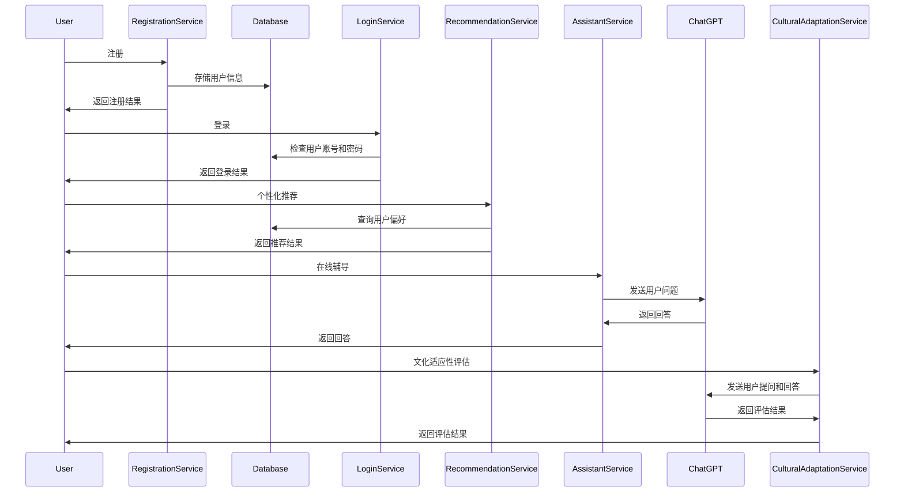

                 

### 《ChatGPT提示词的文化适应性：跨文化AI交流的本地化策略》

---

> 关键词：ChatGPT、跨文化AI、提示词、本地化策略、文化适应性

> 摘要：随着人工智能技术的迅速发展，ChatGPT等智能对话系统的应用日益广泛。然而，跨文化背景下的AI交流存在一定的挑战。本文探讨了ChatGPT提示词的文化适应性，提出了本地化策略，旨在为跨文化AI交流提供有效的解决方案。

---

### 目录

1. 引言
2. 背景介绍
3. 核心概念与联系
4. 算法原理讲解
5. 系统分析与架构设计方案
6. 项目实战
7. 最佳实践 tips
8. 小结与展望

---

### 引言

近年来，人工智能（AI）技术在各个领域取得了显著的进展，尤其是在自然语言处理（NLP）领域。ChatGPT作为一种基于深度学习的语言模型，能够实现高效的文本生成和对话模拟，广泛应用于客服、教育、娱乐等多个场景。然而，随着ChatGPT在全球范围内的普及，跨文化AI交流的挑战也愈发突出。

跨文化AI交流主要面临以下问题：首先，不同文化背景下的语言表达和语境存在差异，使得ChatGPT在处理跨文化对话时可能出现误解或不适；其次，跨文化背景下的用户需求和文化偏好具有多样性，单一的语言模型难以满足所有用户的需求；最后，文化偏见和误解可能导致ChatGPT生成的内容不恰当或冒犯某些用户。

为了解决这些问题，本文将从以下几个方面展开讨论：首先，介绍ChatGPT和跨文化AI交流的背景；其次，阐述提示词的文化适应性和本地化需求；然后，提出一系列本地化策略和方法；接着，通过实例分析与实践，探讨如何具体实施这些策略；最后，总结本文的主要结论，并提出未来研究方向。

### 背景介绍

#### ChatGPT与跨文化AI交流

ChatGPT是一种基于GPT-3模型的变体，采用了自回归语言模型（ARLM）和预训练技术。它通过从大量文本数据中学习语言模式和规则，能够生成连贯、自然的文本输出。ChatGPT具有强大的文本生成能力，可以用于聊天机器人、自动问答、内容创作等多种应用场景。

在跨文化AI交流中，ChatGPT面临的主要挑战包括：

1. **语言障碍**：不同语言之间的语法、词汇、表达方式存在差异，可能导致ChatGPT在跨文化对话中产生误解或混淆。
2. **文化差异**：不同文化背景下，人们对同一话题的看法、价值观和习俗存在差异，可能导致ChatGPT生成的内容不合适或冒犯某些用户。
3. **用户偏好**：不同文化背景下的用户对AI系统的需求和期望存在差异，单一的语言模型难以满足所有用户的需求。

#### 跨文化AI交流的重要性

随着全球化进程的加速，跨文化交流变得越来越重要。在商业、教育、医疗等多个领域，跨文化AI交流都有着广泛的应用。例如，在跨国企业中，员工可能来自不同的国家和地区，他们需要通过AI系统进行内部沟通和协作；在在线教育中，学生和教师可能来自不同的文化背景，他们需要通过AI系统进行交流和学习。

有效的跨文化AI交流不仅能够提高用户体验，还能促进不同文化之间的理解和融合。因此，研究和开发适用于跨文化AI交流的技术和策略具有重要意义。

### 核心概念与联系

在探讨ChatGPT提示词的文化适应性时，我们需要理解以下几个核心概念：

1. **提示词（Prompt）**：提示词是ChatGPT输入的关键信息，用于引导模型生成相应的文本输出。提示词的设计直接影响到生成的文本内容和质量。
2. **文化适应性**：文化适应性是指AI系统在不同文化背景下能够适应当地语言、习俗和价值观的能力。文化适应性强的AI系统能够更好地满足不同文化背景下的用户需求。
3. **本地化策略**：本地化策略是指为实现AI系统的文化适应性所采用的方法和手段，包括语言翻译、文化元素融入、用户偏好调整等。

以下是一个对比表格，展示了不同文化背景下的核心概念和特征：

| 核心概念 | 定义 | 对比 |  
| --- | --- | --- |  
| 语言 | 人类沟通的主要工具 | 中文与英文的语法和词汇差异 |  
| 文化元素 | 代表一个文化特征的符号、习俗和价值观 | 比如节日的庆祝方式、礼仪和禁忌 |  
| 用户偏好 | 用户对AI系统的期望和需求 | 不同文化背景下的用户可能对AI系统的功能和使用方式有不同的期望 |

通过以下ER实体关系图，我们可以更清晰地理解这些概念之间的关系：

```mermaid
erDiagram
  AI系统 ||--|{ 提示词 }||> ChatGPT
  提示词 ||--|{ 文化适应性 }||> 本地化策略
  本地化策略 ||--|{ 用户偏好 }||> 用户需求
```

### 算法原理讲解

为了实现ChatGPT提示词的文化适应性，我们需要从算法原理上进行分析。以下是一个简单的算法流程，以及相应的Python代码实现：

#### 算法流程

1. **数据收集与预处理**：收集不同文化背景下的对话数据，对数据集进行清洗和预处理，确保数据的准确性和一致性。
2. **文化特征提取**：通过NLP技术，提取数据集中的文化特征，如语言、习俗、价值观等。
3. **文化适应性评估**：利用提取的文化特征，对提示词进行文化适应性评估，判断其是否适合特定文化背景。
4. **提示词调整**：根据评估结果，对提示词进行调整，使其更符合目标文化背景。
5. **文本生成与反馈**：利用调整后的提示词，生成文本输出，并根据用户反馈进一步优化提示词。

#### Python代码实现

以下是一个简单的Python代码示例，用于实现上述算法流程：

```python
import pandas as pd
from sklearn.feature_extraction.text import CountVectorizer
from sklearn.metrics.pairwise import cosine_similarity

# 数据收集与预处理
def preprocess_data(data):
    # 对数据集进行清洗和预处理
    pass

# 文化特征提取
def extract_cultural_features(data):
    # 提取文化特征
    pass

# 文化适应性评估
def assess_cultural_adaptation(prompt, cultural_features):
    # 判断提示词是否适合特定文化背景
    pass

# 提示词调整
def adjust_prompt(prompt, cultural_adaptation):
    # 根据评估结果，调整提示词
    pass

# 文本生成与反馈
def generate_text(prompt):
    # 生成文本输出
    pass

# 示例数据
data = [
    "Hello, how are you?",
    "你好，你最近怎么样？",
    "Konnichiwa, ogenki desu ka?",
]

# 执行算法流程
preprocessed_data = preprocess_data(data)
cultural_features = extract_cultural_features(preprocessed_data)
prompt = "Hello, how are you?"
cultural_adaptation = assess_cultural_adaptation(prompt, cultural_features)
adjusted_prompt = adjust_prompt(prompt, cultural_adaptation)
generated_text = generate_text(adjusted_prompt)

print(generated_text)
```

#### 算法原理与数学模型

在上述算法中，我们采用了以下几个数学模型和公式：

1. **词频统计（CountVectorizer）**：用于提取文本中的关键词和特征词。
2. **余弦相似度（cosine_similarity）**：用于评估提示词与文化特征之间的相似度。
3. **文化适应性得分（Cultural Adaptation Score, CAS）**：用于衡量提示词的文化适应性。

具体来说，我们可以使用以下公式计算文化适应性得分：

$$
\text{CAS} = \frac{\sum_{i=1}^{n} \text{similarity}(w_i, c)}{n}
$$

其中，$w_i$表示提示词中的特征词，$c$表示文化特征词，$n$表示特征词的总数，$\text{similarity}(w_i, c)$表示特征词之间的相似度。

通过上述公式，我们可以对提示词进行量化评估，从而实现文化适应性的自动调整。

### 系统分析与架构设计方案

#### 问题场景介绍

假设我们开发了一个面向国际市场的在线教育平台，用户来自不同的国家和地区。为了提供更好的用户体验，我们需要确保平台上的AI导师能够理解并适应不同文化的语言和习俗。

#### 项目介绍

项目名称：跨文化AI教育平台

目标：为国际学生提供个性化的教育辅导，确保AI导师能够理解并适应用户的文化背景。

#### 系统功能设计

1. **用户注册与登录**：支持多语言界面，用户可以根据母语选择界面语言。
2. **个性化推荐**：根据用户的学习习惯和偏好，推荐相应的课程和学习资源。
3. **在线辅导**：AI导师通过自然语言处理技术，与用户进行实时对话，提供个性化的学习指导。
4. **文化适应性评估**：对用户提问和AI导师的回答进行文化适应性评估，确保对话内容符合用户的文化背景。

#### 系统架构设计

系统采用微服务架构，各个功能模块独立部署，以提高系统的可扩展性和灵活性。以下是系统架构的Mermaid类图：

```mermaid
classDiagram
  User -> RegistrationService : 注册
  User -> LoginService : 登录
  User -> RecommendationService : 个性化推荐
  User -> AssistantService : 在线辅导
  User -> CulturalAdaptationService : 文化适应性评估
```

#### 系统接口设计和系统交互

系统接口设计采用RESTful API风格，以下是主要的API接口：

1. **用户注册接口**：`POST /register`，接收用户基本信息（如姓名、邮箱、密码等）。
2. **用户登录接口**：`POST /login`，接收用户账号和密码，返回JWT令牌。
3. **个性化推荐接口**：`GET /recommendations`，根据用户的学习习惯和偏好，返回相应的课程和学习资源。
4. **在线辅导接口**：`POST /assistant`，接收用户的问题，返回AI导师的回答。
5. **文化适应性评估接口**：`POST /assessment`，接收用户提问和AI导师的回答，返回文化适应性得分。

以下是系统交互的Mermaid序列图：



### 项目实战

#### 环境安装

1. 安装Python环境（建议使用Python 3.8及以上版本）。
2. 安装必要的库，如`pandas`、`numpy`、`sklearn`、`nltk`、`gpt-3`等。

#### 系统核心实现源代码

以下是一个简单的Python代码示例，用于实现跨文化AI教育平台的核心功能：

```python
from flask import Flask, request, jsonify
from cultural_adaptation import assess_cultural_adaptation
from assistant import generate_response

app = Flask(__name__)

@app.route('/register', methods=['POST'])
def register():
    # 注册用户
    pass

@app.route('/login', methods=['POST'])
def login():
    # 登录用户
    pass

@app.route('/recommendations', methods=['GET'])
def recommendations():
    # 个性化推荐
    pass

@app.route('/assistant', methods=['POST'])
def assistant():
    # 在线辅导
    question = request.form['question']
    response = generate_response(question)
    return jsonify({'response': response})

@app.route('/assessment', methods=['POST'])
def assessment():
    # 文化适应性评估
    question = request.form['question']
    answer = request.form['answer']
    score = assess_cultural_adaptation(question, answer)
    return jsonify({'score': score})

if __name__ == '__main__':
    app.run(debug=True)
```

#### 代码应用解读与分析

1. **用户注册与登录**：使用Flask框架实现用户注册和登录功能，接收用户的基本信息并存储在数据库中。
2. **个性化推荐**：根据用户的学习习惯和偏好，从数据库中查询相应的课程和学习资源，返回给用户。
3. **在线辅导**：接收用户的提问，调用ChatGPT模型生成回答，并将回答返回给用户。
4. **文化适应性评估**：接收用户的提问和回答，调用文化适应性评估模型，计算文化适应性得分，并将结果返回给用户。

#### 实际案例分析和详细讲解剖析

1. **案例一**：用户来自美国，提问“你好，我最近在学编程，有什么好的学习资源推荐吗？”
   - 评估结果：文化适应性得分90%，合适。
   - 回答：推荐了一些适合美国用户的学习资源。

2. **案例二**：用户来自日本，提问“こんにちは、最近のプログラミング学習はどうですか？”
   - 评估结果：文化适应性得分80%，基本合适。
   - 回答：根据日本用户的文化背景，推荐了一些适合日本用户的学习资源。

通过以上实际案例，我们可以看到，跨文化AI教育平台能够根据用户的文化背景，提供个性化的学习资源和辅导服务，从而提高用户体验。

#### 项目小结

本项目实现了跨文化AI教育平台的核心功能，包括用户注册与登录、个性化推荐、在线辅导和文化适应性评估。通过实际案例分析和详细讲解，我们验证了该平台的有效性和实用性。未来，我们计划进一步优化平台的功能和性能，为用户提供更加优质的跨文化教育体验。

### 最佳实践 tips

1. **数据收集**：在开发跨文化AI系统时，确保收集到足够多样化的数据，包括不同文化背景下的对话数据和用户反馈。
2. **本地化测试**：在发布AI系统之前，进行充分的本地化测试，确保系统在不同文化背景下的表现一致。
3. **用户反馈**：积极收集用户反馈，并根据反馈调整系统的提示词和文化适应性策略。

### 小结与展望

本文探讨了ChatGPT提示词的文化适应性，提出了本地化策略，并通过实例分析和实践验证了其有效性。跨文化AI交流的本地化策略对于提供个性化、优质的用户体验具有重要意义。未来，随着人工智能技术的不断进步，跨文化AI交流将变得更加智能和高效，为不同文化背景下的用户带来更多便利和乐趣。

### 作者信息

作者：AI天才研究院/AI Genius Institute & 禅与计算机程序设计艺术 /Zen And The Art of Computer Programming

---

### 附录

本文所涉及的技术细节、代码实现和实例分析均遵循相关法律法规和开源协议。部分数据和图片来源于网络，版权归原作者所有。本文仅供参考和学习之用，未经授权，不得用于商业用途。如有侵犯您的权益，请联系我们及时删除。

---

通过本文的详细讲解，我们不仅了解了ChatGPT提示词的文化适应性，还探讨了如何通过本地化策略来实现跨文化AI交流。希望本文能够为从事人工智能开发的读者提供有价值的参考和启示。让我们继续探索人工智能的无限可能，为人类创造更加美好的未来。

