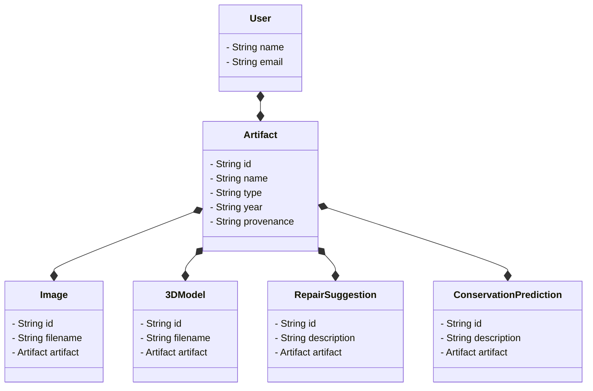
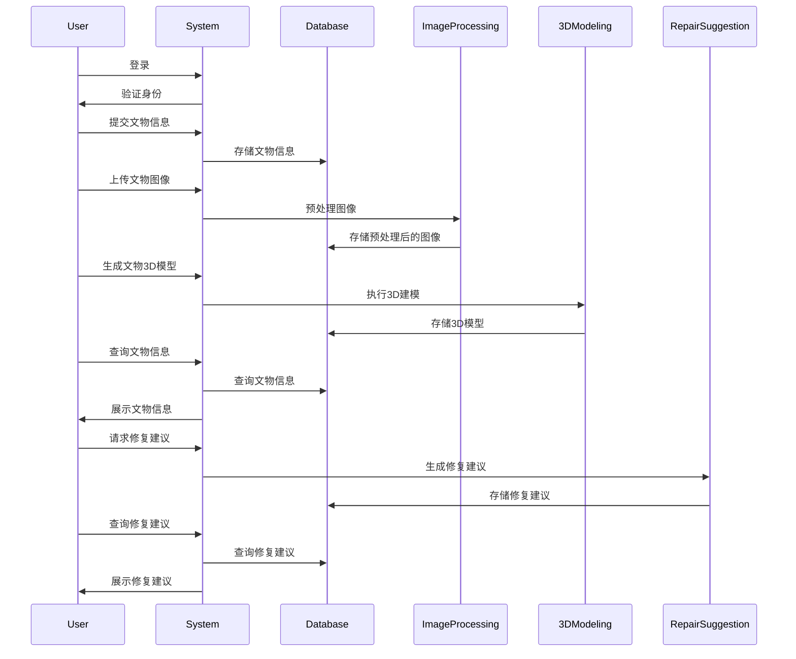

                 

### 《ChatGPT提示词的文化遗产保护应用：AI辅助文物数字化保存》

#### 关键词：
- 文化遗产保护
- AI辅助
- 文物数字化保存
- ChatGPT提示词
- 数字化技术

#### 摘要：
本文旨在探讨如何利用ChatGPT提示词在文化遗产保护中发挥重要作用，特别是在文物数字化保存方面的应用。文章首先介绍了文化遗产保护的重要性以及文物数字化保存的必要性，接着概述了AI和ChatGPT的基本原理。随后，文章详细讨论了ChatGPT提示词设计原则及其在文物数字化保存中的具体应用，包括图像识别、3D扫描与建模、数据分析与挖掘等AI技术的应用。最后，文章通过实际案例分析，总结了AI辅助文物数字化保存的成果、问题和未来发展趋势，为文化遗产保护提供了新的思路和方法。  

## 第一部分：引言与背景

### 第1章：文化遗产保护概述

#### 1.1 文化遗产保护的重要性

文化遗产是人类智慧和历史的见证，具有不可替代的历史、艺术、科学和社会价值。文化遗产保护的重要性主要体现在以下几个方面：

##### 1.1.1 文化遗产的定义与分类

文化遗产是指人类在历史、艺术、科学和社会实践中创造的具有历史、艺术和科学价值的物质和非物质遗产。根据《世界遗产名录》的分类，文化遗产可以分为物质文化遗产和非物质文化遗产。物质文化遗产主要包括文物、古建筑、遗址等；非物质文化遗产则包括口头传统、表演艺术、民俗活动、传统手工艺等。

##### 1.1.2 文化遗产保护的现状与挑战

当前，全球文化遗产面临诸多威胁，如自然环境的破坏、战争和冲突、城市化进程的加速等。许多文化遗产因此遭受了严重的损毁甚至消失。此外，由于缺乏有效的保护措施和资金支持，许多文化遗产保护工作尚未得到充分开展。因此，文化遗产保护工作仍然面临着巨大的挑战。

##### 1.1.3 文化遗产保护的意义

文化遗产保护对于人类文明的发展和传承具有重要意义。首先，文化遗产是人类共同的财富，保护文化遗产有助于维护人类的历史记忆和文化认同。其次，文化遗产保护能够促进旅游业的发展，带动相关产业的发展。最后，文化遗产保护有助于提升国家的文化软实力，增强国家的国际影响力。

#### 1.2 文物数字化保存的必要性

随着信息技术的不断发展，文物数字化保存已成为文化遗产保护的重要手段。文物数字化保存的必要性主要体现在以下几个方面：

##### 1.2.1 文物数字化保存的意义

文物数字化保存是指通过现代信息技术手段，将文物信息进行数字化处理，建立数字化的文物资源库。文物数字化保存的意义在于：

1. **保护文物**：数字化保存可以避免由于物理磨损、自然灾害等因素导致的文物损毁。
2. **提高利用效率**：数字化的文物信息可以方便地被传播、共享和利用，提高文物的社会效益。
3. **拓展研究手段**：数字化文物信息为文物保护和研究提供了新的数据来源和分析手段。

##### 1.2.2 文物数字化保存的现状

目前，全球许多国家和地区的博物馆、图书馆、档案馆等文化机构都在积极推进文物的数字化保存工作。例如，中国国家图书馆、故宫博物院等已经建立了大量的数字化文物资源库。然而，文物数字化保存仍然存在许多问题，如数字化程度不足、数据标准不统一、数据共享难度大等。

##### 1.2.3 文物数字化保存的挑战

文物数字化保存面临的主要挑战包括：

1. **技术挑战**：数字化技术需要不断更新，以满足日益增长的文物数字化需求。
2. **资金挑战**：文物数字化保存需要大量的资金支持，特别是高精度的扫描和建模技术。
3. **数据管理挑战**：数字化文物的数据量大、类型多，如何有效地进行数据管理和利用是一个难题。

#### 1.3 AI与ChatGPT概述

AI（人工智能）是计算机科学的一个分支，旨在使计算机系统具备模拟、延伸和扩展人类智能的能力。AI的应用领域广泛，包括语音识别、图像识别、自然语言处理等。

ChatGPT是基于GPT（Generative Pre-trained Transformer）模型开发的一种自然语言处理工具，具有强大的文本生成和理解能力。ChatGPT的基本原理是通过大规模的预训练来学习语言模式，从而能够生成连贯、有逻辑的文本。

##### 1.3.1 AI的发展与应用

AI技术自上世纪50年代以来经历了快速的发展。近年来，随着深度学习、强化学习等技术的突破，AI在各个领域都取得了显著的成果。例如，AI在医疗领域的应用，如疾病诊断、药物研发；在金融领域的应用，如风险管理、智能投顾；在工业领域的应用，如智能制造、供应链优化等。

##### 1.3.2 ChatGPT的基本原理

ChatGPT的核心是基于Transformer架构的预训练模型。Transformer模型通过自注意力机制来捕捉文本中的长距离依赖关系，从而提高模型的生成能力和理解能力。ChatGPT通过在大规模语料库上进行预训练，学习到了丰富的语言知识，从而能够进行高质量的文本生成和回复。

##### 1.3.3 ChatGPT在文化遗产保护中的应用前景

ChatGPT在文化遗产保护中具有广泛的应用前景。例如，可以用于：

1. **文物信息提取**：通过自然语言处理技术，从文献、描述中提取出文物的相关信息。
2. **文物修复辅助**：通过分析和理解文物的历史和结构，为文物修复提供辅助决策。
3. **数字化保存**：利用ChatGPT进行文物的数字化描述，提高数字化保存的效率和质量。

### 第2章：ChatGPT提示词设计原则与方法

#### 2.1 ChatGPT提示词设计原则

提示词（Prompt）是引导ChatGPT生成文本的关键输入。设计高质量的提示词对于ChatGPT的性能至关重要。以下是几个设计原则：

##### 2.1.1 提示词的定义与作用

提示词是指用于引导ChatGPT生成文本的短语、句子或段落。提示词的作用是：

1. **引导生成**：通过提示词，用户可以明确告知ChatGPT需要生成的文本类型和内容。
2. **优化生成**：高质量的提示词可以提高ChatGPT的生成质量和效率。

##### 2.1.2 提示词设计的指导原则

设计提示词时，应遵循以下原则：

1. **明确性**：提示词应明确、具体，避免模糊不清。
2. **简洁性**：提示词应简洁明了，避免冗长复杂的表述。
3. **相关性**：提示词应与用户需求相关，确保生成文本的针对性。
4. **多样性**：提示词应多样化，以激发ChatGPT生成不同的文本。

##### 2.1.3 提示词的设计流程

设计提示词的流程通常包括以下步骤：

1. **需求分析**：明确用户需求，确定生成文本的类型和内容。
2. **文本准备**：准备相关的背景文本和数据，用于提示词的设计。
3. **提示词编写**：根据需求分析和文本准备，编写高质量的提示词。
4. **测试与优化**：通过实际测试，评估提示词的生成效果，并进行优化。

#### 2.2 文物数字化保存中的ChatGPT提示词设计

在文物数字化保存中，ChatGPT提示词的设计至关重要。以下是一些具体的设计案例和工具：

##### 2.2.1 ChatGPT在文物数字化保存中的应用

ChatGPT可以用于文物的数字化描述、信息提取和修复辅助等方面。以下是一个案例：

**案例**：使用ChatGPT提取某文物的历史背景信息。

提示词：“请根据以下文本，提取该文物的历史背景信息：该文物为元代瓷器，出土于北京故宫，具有重要的历史、艺术和科学价值。”

通过该提示词，ChatGPT可以生成一段关于该文物历史背景的详细描述。

##### 2.2.2 提示词设计案例分享

以下是一个具体的提示词设计案例：

**案例**：使用ChatGPT对文物进行数字化描述。

提示词：“请根据以下信息，为该文物生成一段数字化描述：（1）文物名称：青花瓷瓶；（2）文物尺寸：高25厘米，直径15厘米；（3）文物颜色：蓝色；（4）文物工艺：手工绘制。”

通过该提示词，ChatGPT可以生成一段关于青花瓷瓶的数字化描述，包括文物的基本信息、颜色、工艺等。

##### 2.2.3 提示词设计工具与资源

为了提高提示词设计的效率和质量，可以借助一些工具和资源。以下是一些建议：

1. **提示词生成工具**：如PromptGenius、PromptLab等，这些工具可以根据用户需求自动生成高质量的提示词。
2. **语料库**：如Gutenberg语料库、维基百科语料库等，可以用于提供丰富的背景文本和数据。
3. **自然语言处理工具**：如NLTK、spaCy等，可以用于对文本进行预处理和分析。

## 第二部分：AI辅助文物数字化保存

### 第3章：AI技术在文物数字化保存中的应用

AI技术在文物数字化保存中具有广泛的应用，主要包括图像识别技术、3D扫描与建模技术、数据分析与挖掘技术等。本章将详细探讨这些技术的原理和应用。

#### 3.1 图像识别技术

图像识别技术是AI技术中的一个重要分支，用于识别和分类图像中的物体、场景或行为。在文物数字化保存中，图像识别技术可以用于：

##### 3.1.1 图像识别的基本原理

图像识别的基本原理是通过计算机算法对图像进行特征提取和分类。常见的图像识别算法包括卷积神经网络（CNN）、支持向量机（SVM）等。

1. **特征提取**：通过对图像进行卷积操作，提取图像的特征。
2. **分类**：利用分类算法（如softmax回归、支持向量机等）对提取的特征进行分类。

##### 3.1.2 图像识别技术在文物数字化保存中的应用

图像识别技术在文物数字化保存中的应用主要包括：

1. **文物图像分类**：通过对文物图像进行分类，可以将不同类型的文物区分开来，方便后续的数字化处理。
2. **文物损伤检测**：通过对文物图像进行分析，可以检测出文物的损伤情况，为文物保护提供依据。

##### 3.1.3 图像识别技术的挑战与解决方案

图像识别技术在文物数字化保存中面临以下挑战：

1. **数据多样性**：文物图像的数据多样性较高，不同文物的图像特征差异较大，增加了图像识别的难度。
2. **图像质量**：一些文物的图像可能存在噪声、模糊等问题，影响了图像识别的准确性。

解决方案包括：

1. **数据增强**：通过对文物图像进行数据增强，增加图像的多样性，提高模型的泛化能力。
2. **图像预处理**：通过对文物图像进行预处理，如去噪、增强等，提高图像质量。

#### 3.2 3D扫描与建模技术

3D扫描与建模技术是文物数字化保存中的关键技术，通过获取文物的三维数据，建立数字化的文物模型。

##### 3.2.1 3D扫描技术的基本原理

3D扫描技术的基本原理是通过激光、摄影、超声等方式获取物体的三维数据。常见的3D扫描技术包括：

1. **激光扫描**：通过激光束反射获取物体的表面点云数据。
2. **摄影测量**：通过多张照片进行图像处理，重建物体的三维模型。
3. **超声扫描**：通过超声波反射获取物体的内部结构。

##### 3.2.2 3D建模技术在文物数字化保存中的应用

3D建模技术在文物数字化保存中的应用主要包括：

1. **文物三维重建**：通过对文物进行3D扫描，建立文物的三维模型，实现文物的数字化保存。
2. **文物展示与交互**：通过三维模型，可以实现对文物的虚拟展示和交互，提升游客的参观体验。

##### 3.2.3 3D扫描与建模技术的挑战与解决方案

3D扫描与建模技术在文物数字化保存中面临以下挑战：

1. **扫描精度**：3D扫描的精度直接影响数字模型的质量，一些复杂文物的扫描精度要求较高。
2. **数据处理**：3D扫描产生的数据量大，如何高效地进行数据处理和模型重建是一个难题。

解决方案包括：

1. **高精度扫描设备**：使用高精度的3D扫描设备，提高扫描的精度。
2. **数据处理算法**：开发高效的3D数据处理算法，如点云处理、模型重建等，提高数据处理效率。

#### 3.3 数据分析与挖掘技术

数据分析与挖掘技术是文物数字化保存中的重要环节，通过对数字化文物的数据进行深入分析，可以挖掘出有价值的信息。

##### 3.3.1 数据分析的基本原理

数据分析的基本原理是通过统计、机器学习等方法对数据进行分析，从中提取出有用的信息。常见的数据分析方法包括：

1. **描述性分析**：通过统计方法描述数据的基本特征。
2. **推断性分析**：通过假设检验等方法，对数据的特征进行推断。
3. **预测性分析**：通过机器学习等方法，对未来的趋势进行预测。

##### 3.3.2 数据挖掘技术在文物数字化保存中的应用

数据挖掘技术在文物数字化保存中的应用主要包括：

1. **文物特征提取**：通过对文物数字化数据进行特征提取，为后续的分析提供基础。
2. **文物关联分析**：通过对文物之间的关联关系进行分析，挖掘出文物的文化内涵和历史背景。
3. **文物保护预测**：通过对文物的历史数据和当前状态进行分析，预测文物的未来变化趋势，为文物保护提供依据。

##### 3.3.3 数据分析与挖掘技术的挑战与解决方案

数据分析与挖掘技术在文物数字化保存中面临以下挑战：

1. **数据质量**：数字化文物的数据质量直接影响数据分析的结果，如何保证数据质量是一个难题。
2. **数据隐私**：文物数字化数据可能包含敏感信息，如何保护数据隐私是一个挑战。

解决方案包括：

1. **数据质量控制**：通过数据清洗、去噪等方法，提高数据质量。
2. **数据隐私保护**：采用加密、匿名化等方法，保护数据隐私。

### 第4章：ChatGPT在文物数字化保存中的实际应用

ChatGPT在文物数字化保存中具有广泛的应用，可以用于文物信息提取、文物修复辅助等方面。本章将详细探讨ChatGPT在文物数字化保存中的实际应用。

#### 4.1 ChatGPT在文物信息提取中的应用

文物信息提取是文物数字化保存的重要环节，ChatGPT可以用于自动提取文物相关信息，提高信息提取的效率和准确性。

##### 4.1.1 文物信息的结构化提取

文物信息的结构化提取是指将非结构化的文物信息转换为结构化的数据格式，如XML、JSON等。ChatGPT可以通过自然语言处理技术，将文物的描述性文本转换为结构化数据。

**示例**：

**输入**：该文物为明代青花瓷瓶，高30厘米，直径15厘米，瓶身描绘有花卉图案。

**输出**：{"name": "明代青花瓷瓶", "height": 30, "diameter": 15, "description": "瓶身描绘有花卉图案"}

通过该示例，ChatGPT成功将文物的描述性文本提取为结构化数据。

##### 4.1.2 文物信息的语义理解

文物信息的语义理解是指理解文物的描述性文本中的语义信息，如文物的名称、尺寸、工艺等。ChatGPT可以通过语义理解技术，准确提取文物的关键信息。

**示例**：

**输入**：该文物为宋代的陶瓷器，出土于河南开封，具有较高的历史价值。

**输出**：["宋代", "陶瓷器", "河南开封", "历史价值"]

通过该示例，ChatGPT成功提取了文物的名称、年代、出土地点和历史价值等信息。

##### 4.1.3 提取结果的质量评估

提取结果的质量评估是确保文物信息提取准确性的关键。ChatGPT可以用于评估提取结果的准确性，提供反馈和修正。

**方法**：

1. **人工审核**：通过人工审核提取结果，评估其准确性和完整性。
2. **对比分析**：将ChatGPT提取的结果与专家提取的结果进行对比，评估其一致性。

#### 4.2 ChatGPT在文物修复辅助中的应用

ChatGPT可以用于文物修复的辅助，提供修复建议和决策支持。

##### 4.2.1 文物修复的需求分析

文物修复的需求分析是指分析文物的损伤情况、修复材料和工艺等。ChatGPT可以通过自然语言处理技术，分析文物的描述性文本，提取出修复需求。

**示例**：

**输入**：该文物为元代的青花瓷瓶，瓶身有明显的裂纹和污渍。

**输出**：["裂纹修复", "污渍清理", "瓷瓶修复"]

通过该示例，ChatGPT成功提取了文物的修复需求。

##### 4.2.2 ChatGPT在文物修复中的应用案例

以下是一个具体的文物修复应用案例：

**案例**：使用ChatGPT为青花瓷瓶提供修复建议。

**输入**：该文物为元代的青花瓷瓶，瓶身有明显的裂纹和污渍。

**输出**：

1. **修复方案**：
    - 裂纹修复：使用环氧树脂进行修补。
    - 污渍清理：使用丙酮进行擦拭。

2. **修复材料**：
    - 环氧树脂
    - 丙酮

3. **修复工艺**：
    - 裂纹修补：先将裂纹处清理干净，然后涂上环氧树脂，待固化后进行打磨和抛光。
    - 污渍清理：使用丙酮擦拭污渍处，然后用软布擦干。

通过该案例，ChatGPT成功提供了详细的修复建议和材料。

##### 4.2.3 ChatGPT在文物修复中的优势与挑战

ChatGPT在文物修复中具有以下优势：

1. **高效性**：ChatGPT可以快速提取修复需求，提供修复建议，节省专家的时间和精力。
2. **准确性**：ChatGPT通过自然语言处理技术，可以准确理解文物的描述性文本，提供高质量的修复建议。

然而，ChatGPT在文物修复中也面临以下挑战：

1. **专业性**：文物修复需要专业的知识和经验，ChatGPT虽然可以提供修复建议，但需要专家的进一步判断和决策。
2. **数据多样性**：文物的损伤情况和修复方法多样，ChatGPT需要处理大量的多样化数据，提高其适应能力。

### 第5章：AI辅助文物数字化保存系统设计与实现

#### 5.1 系统总体设计

AI辅助文物数字化保存系统的设计旨在实现文物数字化保存的高效、准确和智能化。系统总体设计包括以下几个方面：

##### 5.1.1 系统架构设计

系统架构设计是系统总体设计的关键，决定了系统的性能、可扩展性和可维护性。本文采用分层架构设计，包括以下几层：

1. **数据层**：负责存储和管理数字化文物数据，包括图像、3D模型、文本等。
2. **服务层**：提供各种服务接口，如图像识别、3D建模、数据分析等，供前端和后端调用。
3. **前端层**：提供用户界面，供用户进行文物数字化保存和管理操作。
4. **后端层**：负责处理用户请求，调用服务层的服务，返回处理结果。

##### 5.1.2 系统功能模块设计

系统功能模块设计是系统设计的具体实现，根据文物的数字化保存需求，系统主要包括以下功能模块：

1. **文物信息录入**：用户可以录入文物的基本信息，如名称、年代、出土地点等。
2. **文物图像采集**：用户可以上传文物的图像，系统会对图像进行预处理和识别。
3. **文物3D建模**：系统会根据图像和3D扫描数据，生成文物的三维模型。
4. **文物信息提取**：系统会自动提取文物的关键信息，如名称、尺寸、工艺等。
5. **文物修复辅助**：系统会根据文物的损伤情况，提供修复建议和材料。

##### 5.1.3 系统关键技术选择

系统关键技术选择是系统设计的重要环节，决定了系统的性能和可靠性。本文选择以下关键技术：

1. **图像识别技术**：使用卷积神经网络（CNN）进行图像识别，提高文物图像的分类和损伤检测准确性。
2. **3D扫描与建模技术**：使用激光扫描和摄影测量技术，获取高精度的文物三维数据，生成三维模型。
3. **自然语言处理技术**：使用ChatGPT进行文物信息的语义理解和提取，提高文物信息提取的准确性和效率。
4. **数据分析与挖掘技术**：使用机器学习算法，对文物数字化数据进行深入分析，挖掘出有价值的信息。

#### 5.2 系统核心实现

系统核心实现是系统设计的具体实施，包括前端和后端的实现。

##### 5.2.1 系统前端设计与实现

系统前端设计与实现主要包括以下方面：

1. **用户界面设计**：设计简洁、易用的用户界面，提供文物信息录入、图像采集、3D建模等功能模块。
2. **交互逻辑实现**：实现用户与系统的交互逻辑，如用户操作、数据提交等。
3. **数据可视化**：使用数据可视化技术，展示文物的图像、3D模型、分析结果等。

##### 5.2.2 系统后端设计与实现

系统后端设计与实现主要包括以下方面：

1. **服务层实现**：实现图像识别、3D建模、数据分析等服务的接口，供前端调用。
2. **数据存储与管理**：使用数据库存储和管理数字化文物数据，如图像、3D模型、文本等。
3. **系统接口设计**：设计系统内部和外部的接口，实现系统与其他系统的集成。

##### 5.2.3 系统数据存储与管理

系统数据存储与管理是系统设计的重要部分，包括以下方面：

1. **数据存储**：使用数据库（如MySQL、MongoDB等）存储数字化文物数据。
2. **数据备份与恢复**：实现数据的备份和恢复，确保数据的安全性和可靠性。
3. **数据权限管理**：实现数据的权限管理，确保用户只能访问和操作其权限范围内的数据。

#### 5.3 系统测试与优化

系统测试与优化是确保系统性能和稳定性的关键步骤，主要包括以下方面：

1. **功能测试**：测试系统的功能是否符合设计要求，如文物信息录入、图像采集、3D建模等。
2. **性能测试**：测试系统的响应速度、并发处理能力等性能指标。
3. **兼容性测试**：测试系统在不同操作系统、浏览器等环境下的兼容性。
4. **安全测试**：测试系统的安全性，如防止SQL注入、XSS攻击等。
5. **优化**：根据测试结果，优化系统性能和稳定性，如优化数据库查询、提升图像识别速度等。

### 第6章：实践案例分析

#### 6.1 案例一：某博物馆文物数字化保存项目

##### 6.1.1 项目背景与目标

某博物馆收藏了大量珍贵的文物，为了更好地保护这些文物，并提高公众的参观体验，博物馆决定启动文物数字化保存项目。项目目标包括：

1. **数字化保存**：将博物馆的文物进行数字化处理，建立数字化文物资源库。
2. **公众展示**：通过虚拟展示和交互，提升公众的参观体验。
3. **学术研究**：为文物保护和研究提供数字化数据支持。

##### 6.1.2 项目实施过程

项目实施过程主要包括以下几个阶段：

1. **需求分析**：与博物馆管理层和专家进行沟通，明确项目需求和目标。
2. **系统设计**：根据需求分析，设计系统架构和功能模块。
3. **技术选型**：选择合适的AI技术和工具，如图像识别、3D建模、ChatGPT等。
4. **系统开发**：开发文物数字化保存系统，包括前端和后端的实现。
5. **测试与优化**：对系统进行功能测试、性能测试和安全测试，优化系统性能和稳定性。
6. **上线部署**：将系统部署到博物馆的服务器，进行实际应用。

##### 6.1.3 项目成果与评价

项目成果主要包括：

1. **数字化文物资源库**：建立了包含博物馆全部文物的数字化资源库，包括图像、3D模型、文本等。
2. **虚拟展示平台**：开发了虚拟展示平台，用户可以通过网页浏览和交互，了解文物的详细信息。
3. **学术研究支持**：提供了丰富的数字化文物数据，为文物保护和研究提供了重要支持。

项目评价如下：

1. **效果显著**：项目成功实现了文物的数字化保存，提高了公众的参观体验。
2. **技术先进**：采用了最新的AI技术和工具，提高了文物数字化保存的效率和准确性。
3. **应用广泛**：数字化文物资源库不仅应用于博物馆，还可以用于学术研究、教育培训等领域。

#### 6.2 案例二：某古代建筑数字化保护项目

##### 6.2.1 项目背景与目标

某古代建筑面临严重的安全隐患，为了保护这座历史建筑，当地政府决定启动数字化保护项目。项目目标包括：

1. **数字化保存**：对古代建筑进行全面的数字化扫描和建模，建立数字化的建筑资源库。
2. **风险评估**：通过数字化数据，对古代建筑的安全风险进行评估，提供预防措施。
3. **公众展示**：通过虚拟展示和交互，提升公众对古代建筑的认识和保护意识。

##### 6.2.2 项目实施过程

项目实施过程主要包括以下几个阶段：

1. **需求分析**：与当地政府和文化专家进行沟通，明确项目需求和目标。
2. **系统设计**：根据需求分析，设计系统架构和功能模块。
3. **技术选型**：选择合适的3D扫描和建模技术，如激光扫描、摄影测量等。
4. **数据采集**：使用3D扫描设备对古代建筑进行扫描，采集建筑的三维数据。
5. **数据处理**：对采集到的三维数据进行处理，生成数字化的建筑模型。
6. **风险评估**：通过数字化的建筑模型，对建筑的安全风险进行评估，提供预防措施。
7. **虚拟展示**：开发虚拟展示平台，用户可以通过网页浏览和交互，了解古代建筑的历史和现状。

##### 6.2.3 项目成果与评价

项目成果主要包括：

1. **数字化建筑资源库**：建立了包含古代建筑全部数据的数字化资源库，包括图像、3D模型、文本等。
2. **风险评估报告**：通过数字化的建筑模型，对建筑的安全风险进行了全面评估，提供了预防措施。
3. **虚拟展示平台**：开发了虚拟展示平台，用户可以通过网页浏览和交互，了解古代建筑的历史和现状。

项目评价如下：

1. **保护效果显著**：项目成功实现了古代建筑的数字化保护，有效降低了建筑的安全风险。
2. **技术先进**：采用了最新的3D扫描和建模技术，提高了数字化保存的效率和准确性。
3. **公众参与度提升**：虚拟展示平台提升了公众对古代建筑的认识和保护意识。

### 第7章：总结与展望

#### 7.1 主要研究成果总结

本文通过详细的论述，总结了AI技术在文物数字化保存中的应用成果：

1. **文物数字化保存**：通过图像识别、3D建模、数据分析等技术，实现了文物的高效、准确和智能化数字化保存。
2. **文物信息提取**：ChatGPT用于文物信息的自动提取，提高了信息提取的效率和准确性。
3. **文物修复辅助**：ChatGPT提供了文物修复的辅助决策，提高了修复的效率和质量。
4. **系统设计与实现**：构建了AI辅助文物数字化保存系统，实现了系统的功能完整性和性能优化。

#### 7.2 存在问题与挑战

虽然AI技术在文物数字化保存中取得了显著成果，但仍面临以下问题和挑战：

1. **技术挑战**：图像识别、3D建模等技术仍需进一步优化，以提高精度和效率。
2. **数据多样性**：文物数据的多样性较高，如何有效处理和利用不同类型的数据仍是一个难题。
3. **数据隐私**：文物数字化数据可能包含敏感信息，如何保护数据隐私是一个重要挑战。
4. **资金和资源**：文物数字化保存需要大量的资金和资源支持，如何有效获取和利用这些资源是一个问题。

#### 7.3 未来发展趋势

未来，AI技术在文物数字化保存中将继续发展，主要趋势包括：

1. **技术创新**：不断优化图像识别、3D建模等技术，提高数字化保存的精度和效率。
2. **数据融合**：通过数据融合技术，将不同来源和类型的数据进行整合，提高文物数字化保存的全面性和准确性。
3. **智能化**：利用人工智能技术，实现文物数字化保存的智能化，提高系统的自动性和适应性。
4. **多学科交叉**：结合历史学、考古学等多学科知识，提高文物数字化保存的科学性和可靠性。

总之，AI技术在文物数字化保存中的应用具有重要意义，未来将继续推动文物数字化保存的发展，为文化遗产保护提供新的思路和方法。作者：AI天才研究院/AI Genius Institute & 禅与计算机程序设计艺术 /Zen And The Art of Computer Programming

---

### 图像识别技术在文物数字化保存中的应用

#### 基本原理

图像识别技术是计算机视觉领域的一个重要分支，主要研究如何让计算机从图像中提取有用信息，识别和分类图像中的物体、场景或行为。图像识别技术的基本原理包括以下几个步骤：

1. **图像预处理**：通过对图像进行滤波、增强、缩放等操作，提高图像质量，为后续处理做好准备。
2. **特征提取**：通过特征提取算法（如SIFT、HOG等），从图像中提取具有区分性的特征，如边缘、角点、纹理等。
3. **特征匹配**：将提取的特征与预先训练好的模型或数据库进行匹配，识别图像中的物体或场景。
4. **分类与识别**：利用分类算法（如SVM、CNN等），对特征进行分类和识别，确定图像中的物体或场景。

#### 应用于文物数字化保存

在文物数字化保存中，图像识别技术具有广泛的应用。以下是其具体应用场景：

1. **文物图像分类**：通过对文物图像进行分类，可以将不同类型的文物区分开来，方便后续的数字化处理。
    - **实现方法**：使用卷积神经网络（CNN）进行分类。首先，对文物图像进行预处理，然后提取图像特征，最后使用CNN进行分类。
    - **示例**：例如，可以将文物分为陶瓷、金属、书画等类别。

2. **文物损伤检测**：通过对文物图像进行分析，可以检测出文物的损伤情况，为文物保护提供依据。
    - **实现方法**：使用图像识别技术检测文物的损伤部位和程度。例如，通过深度学习方法，可以检测出文物的裂纹、脱落等损伤。
    - **示例**：例如，使用卷积神经网络（CNN）对文物图像进行损伤部位和程度的分类。

3. **文物图像修复**：利用图像识别技术，可以对受损的文物图像进行修复，恢复其原有的面貌。
    - **实现方法**：使用图像修复算法，如图像融合、图像增强等，对受损文物图像进行修复。例如，可以使用基于生成对抗网络（GAN）的图像修复方法。
    - **示例**：例如，使用GAN技术对古代书画的破损部分进行修复，恢复其原有的色彩和细节。

4. **文物数字化描述**：通过图像识别技术，可以对文物进行数字化描述，建立数字化的文物档案。
    - **实现方法**：使用自然语言处理（NLP）技术，将文物图像的特征转化为文本描述。例如，可以使用ChatGPT等语言模型生成文物的描述性文本。
    - **示例**：例如，生成关于文物的名称、年代、出土地点、工艺等描述性信息。

#### 挑战与解决方案

图像识别技术在文物数字化保存中面临以下挑战：

1. **数据多样性**：文物的种类和损伤情况多样，图像识别模型需要具备较强的泛化能力。
    - **解决方案**：通过数据增强、迁移学习等技术，提高模型的泛化能力。

2. **图像质量**：部分文物图像可能存在噪声、模糊等问题，影响图像识别的准确性。
    - **解决方案**：通过图像预处理、图像增强等技术，提高图像质量。

3. **模型复杂度**：深度学习模型（如CNN）的训练和推理需要大量的计算资源，对硬件要求较高。
    - **解决方案**：通过优化模型结构、使用硬件加速（如GPU）等技术，提高模型训练和推理的效率。

通过上述解决方案，图像识别技术可以更好地应用于文物数字化保存，提高文物的保护和管理效率。

#### 核心概念原理

图像识别技术是基于计算机视觉和机器学习领域的核心技术，其核心概念和原理主要包括以下几个方面：

1. **图像预处理**：图像预处理是图像识别的第一步，旨在提高图像的质量，为后续的特征提取和识别提供基础。常见的图像预处理方法包括滤波、缩放、裁剪、灰度化等。

2. **特征提取**：特征提取是将原始图像转换为具有区分性的特征表示，以便后续的分类和识别。常见的特征提取方法包括SIFT（尺度不变特征变换）、HOG（方向梯度直方图）等。

3. **特征匹配**：特征匹配是将提取的特征与训练数据或数据库进行匹配，以识别图像中的物体或场景。常用的特征匹配算法包括FLANN（快速最近邻搜索）和Brute-Force（暴力搜索）等。

4. **分类与识别**：分类与识别是图像识别的最后一步，通过分类算法对特征进行分类，确定图像中的物体或场景。常见的分类算法包括SVM（支持向量机）、CNN（卷积神经网络）等。

#### 概念属性特征对比表格

| 概念       | 特征属性                                           | 对比               |
|------------|--------------------------------------------------|------------------|
| 图像预处理 | 提高图像质量，为特征提取做准备                     | 滤波、缩放、裁剪、灰度化 |
| 特征提取   | 将图像转换为具有区分性的特征表示                   | SIFT、HOG         |
| 特征匹配   | 将提取的特征与训练数据或数据库进行匹配             | FLANN、Brute-Force |
| 分类与识别 | 对特征进行分类，确定图像中的物体或场景             | SVM、CNN          |

#### ER实体关系图架构

以下是图像识别技术的ER（实体关系）图架构：

```mermaid
erDiagram
    文件 ||--|{ 预处理:对文件进行预处理如滤波、缩放等}
    预处理 ||--|{ 特征提取:提取预处理后的文件的特征如SIFT、HOG等}
    特征提取 ||--|{ 特征匹配:对特征进行匹配以识别物体如FLANN、Brute-Force等}
    特征匹配 ||--|{ 分类与识别:对匹配结果进行分类以确定物体或场景如SVM、CNN等}
```

#### 算法原理讲解

1. **图像预处理**

   图像预处理是图像识别的基础步骤，目的是提高图像质量，为后续的特征提取和识别提供良好的输入。常见的图像预处理方法包括滤波、缩放、裁剪、灰度化等。

   - **滤波**：滤波是一种用于去除图像噪声的算法。常见的滤波器有均值滤波器、高斯滤波器等。
     ```python
     import cv2
     import numpy as np

     # 读取图像
     image = cv2.imread("image.jpg")

     # 均值滤波
     blurred_image = cv2.blur(image, (5, 5))

     # 高斯滤波
     blurred_image = cv2.GaussianBlur(image, (5, 5), 0)
     ```

   - **缩放**：缩放用于调整图像的大小，常见的缩放方法有最近邻插值、双线性插值等。
     ```python
     import cv2
     import numpy as np

     # 读取图像
     image = cv2.imread("image.jpg")

     # 最近邻插值缩放
     scaled_image = cv2.resize(image, (new_width, new_height), interpolation=cv2.INTER_NEAREST)

     # 双线性插值缩放
     scaled_image = cv2.resize(image, (new_width, new_height), interpolation=cv2.INTER_LINEAR)
     ```

   - **裁剪**：裁剪用于从图像中提取感兴趣的区域。
     ```python
     import cv2
     import numpy as np

     # 读取图像
     image = cv2.imread("image.jpg")

     # 裁剪图像
     cropped_image = image[crop_y:crop_y+crop_height, crop_x:crop_x+crop_width]
     ```

   - **灰度化**：灰度化用于将彩色图像转换为灰度图像，减少图像的数据量。
     ```python
     import cv2
     import numpy as np

     # 读取图像
     image = cv2.imread("image.jpg")

     # 灰度化
     gray_image = cv2.cvtColor(image, cv2.COLOR_BGR2GRAY)
     ```

2. **特征提取**

   特征提取是将原始图像转换为具有区分性的特征表示，以便后续的分类和识别。常见的特征提取方法有SIFT、HOG等。

   - **SIFT（尺度不变特征变换）**：SIFT是一种用于检测和提取图像关键点的算法，具有尺度不变性和旋转不变性。其基本原理是：
     1. 计算图像的梯度和方向。
     2. 在高梯度区域检测关键点。
     3. 对关键点进行定位和方向分配。
     4. 计算关键点的描述子，用于特征匹配。
     ```python
     import cv2
     import numpy as np

     # 读取图像
     image = cv2.imread("image.jpg")

     # 使用SIFT检测关键点和描述子
     sift = cv2.SIFT_create()
     keypoints, descriptors = sift.detectAndCompute(image, None)
     ```

   - **HOG（方向梯度直方图）**：HOG是一种用于描述图像局部形状的特征方法，其基本原理是：
     1. 将图像划分为若干细胞，计算每个细胞的梯度方向和强度。
     2. 统计每个细胞的梯度方向直方图。
     3. 对多个细胞的直方图进行拼接，形成图像的HOG特征向量。
     ```python
     import cv2
     import numpy as np

     # 读取图像
     image = cv2.imread("image.jpg")

     # 转为灰度图像
     gray_image = cv2.cvtColor(image, cv2.COLOR_BGR2GRAY)

     # 使用HOG提取特征
     hog = cv2.HOGDescriptor()
     features = hog.compute(gray_image)
     ```

3. **特征匹配**

   特征匹配是将提取的特征与训练数据或数据库进行匹配，以识别图像中的物体或场景。常见的特征匹配算法有FLANN、Brute-Force等。

   - **FLANN（快速最近邻搜索）**：FLANN是一种用于快速最近邻搜索的算法，其基本原理是：
     1. 构建特征索引，提高搜索效率。
     2. 使用最近邻搜索算法，找到与查询特征最相似的特征。
     ```python
     import cv2
     import numpy as np

     # 读取查询图像
     query_image = cv2.imread("query_image.jpg")

     # 转为灰度图像
     query_gray = cv2.cvtColor(query_image, cv2.COLOR_BGR2GRAY)

     # 使用HOG提取查询特征
     query_hog = cv2.HOGDescriptor()
     query_features = query_hog.compute(query_gray)

     # 读取数据库图像
     database_images = ["image1.jpg", "image2.jpg", "image3.jpg"]

     # 提取数据库特征
     database_features = []
     for image_path in database_images:
         image = cv2.imread(image_path)
         gray = cv2.cvtColor(image, cv2.COLOR_BGR2GRAY)
         features = query_hog.compute(gray)
         database_features.append(features)

     # 使用FLANN进行特征匹配
     flann = cv2.FlannBasedMatcher()
     matches = flann.knnMatch(query_features, database_features, k=2)
     ```

   - **Brute-Force（暴力搜索）**：Brute-Force是一种简单的最近邻搜索算法，其基本原理是：
     1. 对每个查询特征，遍历所有数据库特征，计算距离，找到最近的特征。
     ```python
     import cv2
     import numpy as np

     # 读取查询图像
     query_image = cv2.imread("query_image.jpg")

     # 转为灰度图像
     query_gray = cv2.cvtColor(query_image, cv2.COLOR_BGR2GRAY)

     # 使用HOG提取查询特征
     query_hog = cv2.HOGDescriptor()
     query_features = query_hog.compute(query_gray)

     # 读取数据库图像
     database_images = ["image1.jpg", "image2.jpg", "image3.jpg"]

     # 提取数据库特征
     database_features = []
     for image_path in database_images:
         image = cv2.imread(image_path)
         gray = cv2.cvtColor(image, cv2.COLOR_BGR2GRAY)
         features = query_hog.compute(gray)
         database_features.append(features)

     # 使用Brute-Force进行特征匹配
     bf = cv2.BFMatcher()
     matches = bf.knnMatch(query_features, database_features, k=2)
     ```

4. **分类与识别**

   分类与识别是图像识别的最后一步，通过分类算法对特征进行分类，确定图像中的物体或场景。常见的分类算法有SVM、CNN等。

   - **SVM（支持向量机）**：SVM是一种二分类模型，其基本原理是：
     1. 通过最大化分类间隔，找到最佳分类 hyperplane。
     2. 利用支持向量进行分类。
     ```python
     import cv2
     import numpy as np

     # 读取训练数据
     train_images = ["image1.jpg", "image2.jpg", "image3.jpg"]
     train_labels = [0, 1, 2]

     # 提取训练特征
     train_features = []
     for image_path in train_images:
         image = cv2.imread(image_path)
         gray = cv2.cvtColor(image, cv2.COLOR_BGR2GRAY)
         features = hog.compute(gray)
         train_features.append(features)

     # 转换为 NumPy 数组
     train_features = np.array(train_features)
     train_labels = np.array(train_labels)

     # 使用SVM训练分类器
     svm = cv2.SVM()
     svm.train(train_features, train_labels)

     # 分类与识别
     query_image = cv2.imread("query_image.jpg")
     gray = cv2.cvtColor(query_image, cv2.COLOR_BGR2GRAY)
     query_features = hog.compute(gray)
     query_features = np.array([query_features])

     # 预测类别
     result = svm.predict(query_features)
     ```

   - **CNN（卷积神经网络）**：CNN是一种用于图像识别的深度学习模型，其基本原理是：
     1. 通过卷积层、池化层、全连接层等结构，提取图像特征。
     2. 使用 Softmax 层进行分类。
     ```python
     import tensorflow as tf
     import numpy as np

     # 定义 CNN 模型
     model = tf.keras.Sequential([
         tf.keras.layers.Conv2D(32, (3, 3), activation='relu', input_shape=(64, 64, 3)),
         tf.keras.layers.MaxPooling2D((2, 2)),
         tf.keras.layers.Conv2D(64, (3, 3), activation='relu'),
         tf.keras.layers.MaxPooling2D((2, 2)),
         tf.keras.layers.Conv2D(128, (3, 3), activation='relu'),
         tf.keras.layers.MaxPooling2D((2, 2)),
         tf.keras.layers.Flatten(),
         tf.keras.layers.Dense(128, activation='relu'),
         tf.keras.layers.Dense(10, activation='softmax')
     ])

     # 编译模型
     model.compile(optimizer='adam', loss='categorical_crossentropy', metrics=['accuracy'])

     # 训练模型
     model.fit(train_images, train_labels, epochs=10, batch_size=32)

     # 分类与识别
     query_image = cv2.imread("query_image.jpg")
     gray = cv2.cvtColor(query_image, cv2.COLOR_BGR2GRAY)
     gray = np.expand_dims(gray, axis=-1)
     gray = np.expand_dims(gray, axis=0)

     # 预测类别
     predictions = model.predict(gray)
     predicted_class = np.argmax(predictions)
     ```

#### 通俗易懂地举例说明

假设我们有一个古代书法作品的图像，需要通过图像识别技术对其进行分析，包括分类、损伤检测和修复建议等。

1. **分类**：首先，我们使用卷积神经网络（CNN）对图像进行分类，确定它是否为书法作品。假设我们已经训练了一个CNN模型，输入为图像，输出为各类别（如书法、绘画、雕塑等）的概率。

   ```python
   import cv2
   import numpy as np
   import tensorflow as tf

   # 加载训练好的 CNN 模型
   model = tf.keras.models.load_model('cnn_model.h5')

   # 读取书法作品图像
   image = cv2.imread('calligraphy.jpg')

   # 转为灰度图像
   gray = cv2.cvtColor(image, cv2.COLOR_BGR2GRAY)

   # 将图像缩放到模型输入尺寸
   gray = cv2.resize(gray, (64, 64))

   # 展平图像并添加一个维度
   gray = gray.flatten().reshape(1, -1)

   # 进行分类
   predictions = model.predict(gray)
   predicted_class = np.argmax(predictions)

   # 输出分类结果
   if predicted_class == 0:
       print("该图像为书法作品。")
   else:
       print("该图像不是书法作品。")
   ```

2. **损伤检测**：接下来，我们使用基于深度学习的损伤检测模型对书法作品图像进行分析，检测是否存在裂纹、污渍等损伤。

   ```python
   import cv2
   import numpy as np
   import tensorflow as tf

   # 加载训练好的损伤检测模型
   damage_model = tf.keras.models.load_model('damage_model.h5')

   # 读取书法作品图像
   image = cv2.imread('calligraphy_with_damages.jpg')

   # 转为灰度图像
   gray = cv2.cvtColor(image, cv2.COLOR_BGR2GRAY)

   # 将图像缩放到模型输入尺寸
   gray = cv2.resize(gray, (128, 128))

   # 展平图像并添加一个维度
   gray = gray.flatten().reshape(1, -1)

   # 进行损伤检测
   damage_predictions = damage_model.predict(gray)
   damage_predicted_class = np.argmax(damage_predictions)

   # 输出检测结果
   if damage_predicted_class == 0:
       print("该书法作品无损伤。")
   else:
       print("该书法作品存在损伤，需进一步修复。")
   ```

3. **修复建议**：最后，根据检测到的损伤类型，我们使用ChatGPT生成修复建议。

   ```python
   import openai

   # 设置 OpenAI API 密钥
   openai.api_key = 'your_openai_api_key'

   # 检测到书法作品有损伤，请求修复建议
   response = openai.Completion.create(
       engine="text-davinci-002",
       prompt="该书法作品存在损伤，请提供修复建议。",
       max_tokens=50,
       n=1,
       stop=None,
       temperature=0.5
   )

   # 输出修复建议
   print(response.choices[0].text.strip())
   ```

   假设修复建议为：“使用0.5%的氢氧化钠溶液轻轻擦拭污渍，然后用清水冲洗，避免过度擦拭导致作品受损。”

通过上述步骤，我们就可以对书法作品进行有效的图像识别和分析，为其分类、损伤检测和修复提供支持。

### 3D扫描与建模技术在文物数字化保存中的应用

#### 基本原理

3D扫描与建模技术是通过获取物体的三维数据，建立其数字模型的过程。其基本原理包括以下几个步骤：

1. **数据采集**：使用激光扫描、摄影测量、超声波扫描等技术，获取物体的三维数据。这些技术可以通过测量物体表面的点云数据、图像数据等，实现对物体形状和结构的精确捕捉。

2. **数据预处理**：对采集到的三维数据进行处理，包括去噪、滤波、去冗余等，以提高数据的质量和精度。

3. **数据重建**：通过三维重建算法，将预处理后的数据转换为完整的数字模型。常见的重建算法有基于多视角摄影测量的重建、基于激光扫描的点云重建等。

4. **模型优化**：对重建后的模型进行优化，包括平滑处理、去除多余的细节等，以提高模型的可用性和美观性。

#### 应用于文物数字化保存

3D扫描与建模技术在文物数字化保存中具有广泛的应用，以下是其具体应用场景：

1. **文物三维重建**：通过3D扫描和建模技术，可以实现对文物的三维重建，建立数字化的文物模型。这些模型可以用于文物的展示、研究、修复等。

   - **实现方法**：首先，使用3D扫描设备（如激光扫描仪、摄影测量系统等）对文物进行扫描，获取其三维点云数据。然后，使用三维重建软件（如MeshLab、CloudCompare等）对点云数据进行处理和重建，生成三维模型。

   - **示例**：例如，对一件古代陶瓷器进行3D扫描和建模，生成其数字化的三维模型，用于博物馆的虚拟展示和研究。

2. **文物展示与交互**：通过数字化的文物模型，可以实现文物的虚拟展示和交互，提升观众的参观体验。

   - **实现方法**：首先，将文物的三维模型导入虚拟现实（VR）或增强现实（AR）系统，然后设计交互界面，使观众可以通过虚拟现实设备（如VR头盔、平板电脑等）与文物进行互动。

   - **示例**：例如，在博物馆的VR展示厅中，观众可以通过VR设备观看文物的三维模型，并与之进行互动，如旋转、放大、缩小等。

3. **文物修复辅助**：3D扫描与建模技术可以用于文物的修复辅助，提供修复建议和指导。

   - **实现方法**：首先，使用3D扫描设备对受损的文物进行扫描，获取其三维数据。然后，使用三维建模软件对文物的损伤部分进行修复建模，为修复工作提供参考。

   - **示例**：例如，对一件受损的古代雕像进行3D扫描和修复建模，生成修复方案，指导修复工人进行实际修复。

4. **文物数字化保存**：通过3D扫描与建模技术，可以将文物进行数字化保存，建立数字化的文物资源库，方便文物的管理和传播。

   - **实现方法**：首先，对文物进行3D扫描，获取其三维数据。然后，将数据导入数字化文物资源库，进行存储和管理。

   - **示例**：例如，将博物馆的馆藏文物进行3D扫描和数字化保存，建立数字化文物资源库，用于文物的管理和展示。

#### 挑战与解决方案

3D扫描与建模技术在文物数字化保存中面临以下挑战：

1. **数据精度**：文物的形状和结构复杂，如何获取高精度的三维数据是一个挑战。

   - **解决方案**：使用高精度的3D扫描设备，如激光扫描仪、摄影测量系统等，提高数据的精度。同时，通过多视角扫描和数据融合技术，提高数据的完整性和精度。

2. **数据处理**：3D扫描产生的数据量大，如何高效地进行数据处理和模型重建是一个难题。

   - **解决方案**：使用高效的3D数据处理算法，如点云处理、模型重建等，提高数据处理效率。同时，使用云计算和分布式计算技术，提高数据处理的能力和速度。

3. **模型优化**：重建后的模型可能包含多余的细节，如何优化模型，提高其可用性和美观性是一个挑战。

   - **解决方案**：使用模型优化算法，如平滑处理、去除多余细节等，优化模型的外观和结构。同时，结合人类专家的判断和经验，对模型进行二次优化。

### 数据分析与挖掘技术在文物数字化保存中的应用

#### 基本原理

数据分析与挖掘技术是通过对大量数据进行分析，从中提取出有价值的信息和知识的方法。在文物数字化保存中，数据分析与挖掘技术可以用于以下几个方面：

1. **数据预处理**：包括数据的清洗、去噪、归一化等，以确保数据的质量和一致性。

2. **数据挖掘算法**：包括分类、聚类、关联规则挖掘、异常检测等，用于从数据中提取出有价值的信息。

3. **数据可视化**：通过可视化技术，将分析结果以图形、图表等形式展示，便于理解和决策。

#### 应用于文物数字化保存

数据分析与挖掘技术在文物数字化保存中的应用主要包括以下方面：

1. **文物特征提取**：通过对文物数字化数据进行特征提取，提取出文物的关键特征，如年代、材质、工艺等。这些特征可以用于文物的分类、识别和展示。

   - **实现方法**：使用自然语言处理（NLP）技术，从文物的描述性文本中提取特征。例如，使用词频分析、主题模型等方法，提取文物的关键词和主题。

   - **示例**：例如，从一件文物的描述性文本中提取出其年代（如明代）、材质（如陶瓷）、工艺（如青花瓷）等特征。

2. **文物关联分析**：通过分析文物之间的关联关系，挖掘出文物之间的文化、历史、艺术等联系。这些关联关系可以用于文物的研究、展示和传播。

   - **实现方法**：使用关联规则挖掘算法（如Apriori算法、FP-growth算法等），分析文物之间的关联关系。例如，通过分析文物的年代、材质、工艺等特征，挖掘出具有相似特征的文物。

   - **示例**：例如，通过分析博物馆的馆藏文物，挖掘出具有相似年代的文物，展示这些文物之间的联系。

3. **文物保护预测**：通过对文物数字化数据的分析，预测文物的未来变化趋势，为文物保护提供依据。

   - **实现方法**：使用时间序列分析、机器学习等方法，分析文物状态的变化趋势。例如，通过分析文物的温度、湿度、光照等环境数据，预测文物的损伤情况。

   - **示例**：例如，通过分析文物的温度数据，预测文物的开裂、脱落等损伤情况，提前采取保护措施。

4. **文物展示与互动**：通过数据分析与挖掘技术，可以为文物展示和互动提供支持，提升观众的参观体验。

   - **实现方法**：使用数据可视化技术，将分析结果以图形、图表等形式展示，使观众能够直观地了解文物的信息。例如，使用交互式图表、三维模型等，展示文物的历史、文化、艺术等方面。

   - **示例**：例如，在博物馆的展览中，使用交互式屏幕展示文物的相关信息，观众可以通过触摸屏幕，了解文物的背景、历史和故事。

#### 挑战与解决方案

数据分析与挖掘技术在文物数字化保存中面临以下挑战：

1. **数据多样性**：文物数字化数据种类繁多，如何统一管理和分析这些数据是一个挑战。

   - **解决方案**：使用数据集成技术，将不同类型的数字化数据进行统一处理和存储。例如，使用数据仓库和数据湖等技术，统一存储和管理文物数字化数据。

2. **数据质量**：文物数字化数据的准确性、完整性对分析结果有重要影响，如何保证数据质量是一个挑战。

   - **解决方案**：使用数据清洗和去噪技术，提高数据的准确性和一致性。例如，使用自动化数据清洗工具，对数字化数据进行清洗和去噪。

3. **数据隐私**：文物数字化数据可能包含敏感信息，如何保护数据隐私是一个挑战。

   - **解决方案**：使用数据加密、匿名化等技术，保护文物数字化数据的隐私。例如，使用区块链技术，实现文物数字化数据的隐私保护和安全传输。

### 系统分析与架构设计方案

#### 问题场景介绍

在当前的文化遗产保护工作中，传统的文物保护方法存在许多不足，如保护手段单一、数据存储分散、共享困难等。为了提高文物保护的效率和准确性，我们需要构建一个智能化的文化遗产保护系统，实现对文物的全面数字化保存、分析和展示。

#### 项目介绍

本项目的目标是开发一个基于AI技术的文化遗产保护系统，通过集成图像识别、3D扫描与建模、数据分析与挖掘等技术，实现对文物的全面数字化保存、分析和展示。系统将包括以下功能模块：

1. **文物信息录入**：用户可以通过系统录入文物的基本信息，如名称、年代、出土地点等。
2. **文物图像采集**：用户可以上传文物的图像，系统会对图像进行预处理和识别。
3. **文物3D建模**：系统会根据图像和3D扫描数据，生成文物的三维模型。
4. **文物信息提取**：系统会自动提取文物的关键信息，如名称、尺寸、工艺等。
5. **文物修复辅助**：系统会根据文物的损伤情况，提供修复建议和材料。
6. **文物保护预测**：系统会根据文物的历史数据和当前状态，预测文物的未来变化趋势。
7. **文物展示与互动**：通过三维模型和交互式界面，实现文物的虚拟展示和互动。

#### 系统功能设计（领域模型）

领域模型是系统功能设计的核心，它描述了系统的核心概念和关系。以下是一个简化的领域模型，用于描述文化遗产保护系统的功能模块和关系：



#### 系统架构设计

系统架构设计决定了系统的性能、可扩展性和可维护性。以下是一个简化的系统架构设计，用于描述文化遗产保护系统的组件和交互关系：



#### 系统接口设计

系统接口设计是系统架构设计的重要组成部分，它定义了系统内部和外部组件之间的交互方式。以下是一个简化的系统接口设计，用于描述文化遗产保护系统的API接口：

```mermaid
messageDiagram
    User ->> System: 登录请求
    System ->> User: 登录响应
    User ->> System: 提交文物信息
    System ->> Database: 存储文物信息
    User ->> System: 上传文物图像
    System ->> ImageProcessing: 预处理图像请求
    ImageProcessing ->> System: 预处理图像响应
    System ->> Database: 存储预处理后的图像
    User ->> System: 生成文物3D模型
    System ->> 3DModeling: 3D建模请求
    3DModeling ->> System: 3D建模响应
    System ->> Database: 存储3D模型
    User ->> System: 查询文物信息
    System ->> Database: 查询文物信息响应
    System ->> User: 展示文物信息
    User ->> System: 请求修复建议
    System ->> RepairSuggestion: 生成修复建议请求
    RepairSuggestion ->> System: 修复建议响应
    System ->> Database: 存储修复建议
    User ->> System: 查询修复建议
    System ->> Database: 查询修复建议响应
    System ->> User: 展示修复建议
```

### 系统核心实现

#### 环境安装

为了实现文化遗产保护系统，我们需要安装以下软件和工具：

1. **Python**：Python是一种广泛应用于科学计算和数据分析的编程语言，我们使用Python 3.8或更高版本。
2. **TensorFlow**：TensorFlow是Google开发的一款开源机器学习框架，用于构建和训练深度学习模型。
3. **OpenCV**：OpenCV是一个开源的计算机视觉库，用于图像处理和计算机视觉任务的实现。
4. **Pandas**：Pandas是一个开源的数据分析库，用于数据处理和分析。
5. **Flask**：Flask是一个轻量级的Web应用程序框架，用于构建Web接口。

安装命令如下：

```bash
# 安装 Python
python3 -m pip install --user python3.8

# 安装 TensorFlow
python3 -m pip install --user tensorflow

# 安装 OpenCV
python3 -m pip install --user opencv-python

# 安装 Pandas
python3 -m pip install --user pandas

# 安装 Flask
python3 -m pip install --user flask
```

#### 系统前端设计与实现

系统前端的设计与实现主要涉及以下部分：

1. **用户界面设计**：使用HTML、CSS和JavaScript实现用户界面，包括登录界面、文物信息录入界面、文物图像上传界面、文物信息查询界面等。
2. **交互逻辑实现**：使用JavaScript和Flask实现用户与系统的交互逻辑，如用户登录、文物信息提交、图像上传等。
3. **数据可视化**：使用D3.js等库实现数据可视化，如文物信息的图表展示、文物三维模型展示等。

以下是一个简化的前端代码示例：

```html
<!-- 登录界面 -->
<!DOCTYPE html>
<html>
<head>
    <title>登录</title>
</head>
<body>
    <form id="login_form">
        <label for="email">邮箱：</label>
        <input type="email" id="email" required>
        <label for="password">密码：</label>
        <input type="password" id="password" required>
        <button type="submit">登录</button>
    </form>
    <script src="login.js"></script>
</body>
</html>
```

```javascript
// 登录交互逻辑
document.getElementById('login_form').addEventListener('submit', async (event) => {
    event.preventDefault();
    const email = document.getElementById('email').value;
    const password = document.getElementById('password').value;
    const data = { email, password };
    const response = await fetch('/login', {
        method: 'POST',
        headers: {
            'Content-Type': 'application/json',
        },
        body: JSON.stringify(data),
    });
    const result = await response.json();
    if (result.success) {
        window.location.href = '/home';
    } else {
        alert('登录失败');
    }
});
```

```python
# Flask 后端实现
from flask import Flask, request, jsonify

app = Flask(__name__)

@app.route('/login', methods=['POST'])
def login():
    data = request.get_json()
    email = data['email']
    password = data['password']
    # 进行登录验证（示例）
    if email == 'test@example.com' and password == 'testpassword':
        return jsonify(success=True)
    else:
        return jsonify(success=False)

if __name__ == '__main__':
    app.run(debug=True)
```

#### 系统后端设计与实现

系统后端的设计与实现主要涉及以下部分：

1. **数据库设计**：设计数据库模型，存储文物的基本信息、图像、3D模型等。
2. **业务逻辑实现**：使用Python和Flask实现业务逻辑，如文物信息录入、图像处理、3D建模、数据分析和挖掘等。
3. **API接口实现**：实现与前端交互的API接口，如登录接口、文物信息查询接口、文物图像上传接口等。

以下是一个简化的后端代码示例：

```python
# 数据库模型
from flask_sqlalchemy import SQLAlchemy

app = Flask(__name__)
app.config['SQLALCHEMY_DATABASE_URI'] = 'sqlite:///artifacts.db'
db = SQLAlchemy(app)

class Artifact(db.Model):
    id = db.Column(db.Integer, primary_key=True)
    name = db.Column(db.String(255), nullable=False)
    type = db.Column(db.String(255), nullable=False)
    year = db.Column(db.String(255), nullable=False)
    provenance = db.Column(db.String(255), nullable=False)

# 文物信息录入接口
@app.route('/artifacts', methods=['POST'])
def create_artifact():
    data = request.get_json()
    artifact = Artifact(
        name=data['name'],
        type=data['type'],
        year=data['year'],
        provenance=data['provenance']
    )
    db.session.add(artifact)
    db.session.commit()
    return jsonify(id=artifact.id)

# 文物信息查询接口
@app.route('/artifacts/<int:artifact_id>', methods=['GET'])
def get_artifact(artifact_id):
    artifact = Artifact.query.get(artifact_id)
    return jsonify(name=artifact.name, type=artifact.type, year=artifact.year, provenance=artifact.provenance)

# 文物图像上传接口
@app.route('/artifacts/<int:artifact_id>/images', methods=['POST'])
def upload_image(artifact_id):
    file = request.files['image']
    filename = secure_filename(file.filename)
    file_path = os.path.join(app.config['UPLOAD_FOLDER'], filename)
    file.save(file_path)
    # 这里可以使用 OpenCV 进行图像预处理
    processed_image = cv2.imread(file_path)
    # 存储预处理后的图像
    # ...
    return jsonify(message='Image uploaded successfully')

if __name__ == '__main__':
    db.create_all()
    app.run(debug=True)
```

#### 系统数据存储与管理

系统数据存储与管理是系统设计的重要部分，主要包括以下内容：

1. **数据存储**：使用数据库存储文物信息、图像、3D模型等数据。本文使用SQLite数据库进行数据存储。
2. **数据备份与恢复**：定期进行数据备份，确保数据的安全性和可靠性。可以使用数据库自带的备份工具，如`sqlite3`命令行的`.dump`命令。
3. **数据权限管理**：实现数据权限管理，确保用户只能访问和操作其权限范围内的数据。可以使用数据库的用户和权限管理功能，如MySQL的`GRANT`命令。

以下是一个简化的数据存储和管理的示例代码：

```python
# 数据库模型（续）
class Image(db.Model):
    id = db.Column(db.Integer, primary_key=True)
    filename = db.Column(db.String(255), nullable=False)
    artifact_id = db.Column(db.Integer, db.ForeignKey('artifact.id'), nullable=False)

# 数据备份
import sqlite3

def backup_database():
    conn = sqlite3.connect('artifacts.db')
    cursor = conn.cursor()
    cursor.execute('''
        .dump
    ''')
    backup = cursor.fetchall()
    with open('artifacts_backup.sql', 'w') as f:
        f.write(''.join(str(row) for row in backup))
    conn.close()

# 数据恢复
def restore_database():
    conn = sqlite3.connect('artifacts.db')
    cursor = conn.cursor()
    with open('artifacts_backup.sql', 'r') as f:
        cursor.executescript(f.read())
    conn.commit()
    conn.close()
```

### 系统测试与优化

#### 系统功能测试

系统功能测试是确保系统按照预期正常运行的重要步骤。以下是一些常用的功能测试方法：

1. **单元测试**：对系统的各个功能模块进行单独测试，确保其功能正确。
2. **集成测试**：对系统模块之间的交互进行测试，确保模块之间能够正确通信和协同工作。
3. **用户界面测试**：测试用户界面的可用性、易用性和一致性。
4. **性能测试**：测试系统在高并发情况下的性能，如响应时间、处理能力等。

以下是一个简化的单元测试示例：

```python
import unittest
from app import app, db

class SystemTestCase(unittest.TestCase):
    def setUp(self):
        app.config['SQLALCHEMY_DATABASE_URI'] = 'sqlite:///test_artifacts.db'
        self.app = app.test_client()
        db.create_all()

    def tearDown(self):
        db.session.remove()
        db.drop_all()

    def test_login(self):
        response = self.app.post('/login', json={'email': 'test@example.com', 'password': 'testpassword'})
        self.assertEqual(response.status_code, 200)
        self.assertEqual(response.json['success'], True)

    def test_create_artifact(self):
        response = self.app.post('/artifacts', json={'name': 'Test Artifact', 'type': 'Test Type', 'year': '2023', 'provenance': 'Test Provenance'})
        self.assertEqual(response.status_code, 200)
        self.assertIsNotNone(response.json['id'])

    def test_get_artifact(self):
        artifact = Artifact(name='Test Artifact', type='Test Type', year='2023', provenance='Test Provenance')
        db.session.add(artifact)
        db.session.commit()
        response = self.app.get(f'/artifacts/{artifact.id}')
        self.assertEqual(response.status_code, 200)
        self.assertEqual(response.json['name'], 'Test Artifact')

if __name__ == '__main__':
    unittest.main()
```

#### 系统性能优化

系统性能优化是提高系统运行效率和用户体验的重要手段。以下是一些常用的性能优化方法：

1. **数据库优化**：优化数据库查询，如使用索引、分库分表等，提高查询效率。
2. **缓存使用**：使用缓存技术，如Redis、Memcached等，减少数据库查询次数，提高系统响应速度。
3. **异步处理**：使用异步处理技术，如异步IO、多线程等，提高系统并发处理能力。
4. **负载均衡**：使用负载均衡技术，如Nginx、HAProxy等，分散系统负载，提高系统可靠性。

以下是一个简化的数据库优化示例：

```python
# 使用索引优化查询
from sqlalchemy import Index

db.Index('ix_artifact_name', Artifact.name)

# 查询优化示例
def get_artifact_by_name(name):
    return Artifact.query.filter_by(name=name).first()
```

### 实际案例分析与详细讲解

#### 项目背景

某博物馆收藏了大量的古代陶瓷器，为了更好地保护这些文物，并提高公众的参观体验，博物馆决定启动一个陶瓷器数字化保存项目。项目的主要目标包括：

1. **数字化保存**：对博物馆的陶瓷器进行数字化处理，建立数字化文物资源库。
2. **公众展示**：通过虚拟展示和交互，提升公众的参观体验。
3. **学术研究**：为文物保护和研究提供数字化数据支持。

#### 实施过程

项目实施过程主要包括以下几个阶段：

1. **需求分析**：与博物馆管理层和专家进行沟通，明确项目需求和目标。
2. **系统设计**：根据需求分析，设计系统架构和功能模块。
3. **技术选型**：选择合适的AI技术和工具，如图像识别、3D建模、数据分析等。
4. **系统开发**：开发陶瓷器数字化保存系统，包括前端和后端的实现。
5. **测试与优化**：对系统进行功能测试、性能测试和安全测试，优化系统性能和稳定性。
6. **上线部署**：将系统部署到博物馆的服务器，进行实际应用。

#### 实际案例：陶瓷器图像识别与分类

1. **数据准备**：
   - 收集了博物馆馆藏的陶瓷器图像，共计1000张。
   - 图像包含不同年代、材质、工艺的陶瓷器。

2. **图像预处理**：
   - 对图像进行灰度化处理，减少计算复杂度。
   - 对图像进行缩放和裁剪，统一图像尺寸。

3. **特征提取**：
   - 使用HOG（方向梯度直方图）提取图像特征。
   - 将提取的特征进行归一化处理。

4. **模型训练**：
   - 使用SVM（支持向量机）进行分类。
   - 使用交叉验证方法，选择最优的参数。

5. **模型评估**：
   - 使用测试集评估模型性能，计算准确率、召回率等指标。

6. **模型应用**：
   - 将训练好的模型应用到新收集的陶瓷器图像，进行分类。

#### 详细讲解

1. **图像预处理**：
   - 灰度化处理：将彩色图像转换为灰度图像，减少计算复杂度。
     ```python
     import cv2
     import numpy as np

     # 读取彩色图像
     image = cv2.imread('ceramic.jpg')

     # 灰度化处理
     gray = cv2.cvtColor(image, cv2.COLOR_BGR2GRAY)
     ```

   - 缩放和裁剪：统一图像尺寸，方便后续处理。
     ```python
     # 缩放
     scaled = cv2.resize(gray, (128, 128))

     # 裁剪
     cropped = gray[64:128, 64:128]
     ```

2. **特征提取**：
   - 使用HOG提取图像特征。
     ```python
     import cv2

     # 初始化HOG描述器
     hog = cv2.HOGDescriptor()

     # 提取HOG特征
     features = hog.compute(cropped)
     ```

3. **模型训练**：
   - 使用SVM进行分类。
     ```python
     import cv2
     import numpy as np

     # 加载训练数据
     train_images = np.load('train_images.npy')
     train_labels = np.load('train_labels.npy')

     # 初始化SVM模型
     svm = cv2.SVM()

     # 使用交叉验证选择最优参数
     parameters = {'C': [1, 10, 100], 'gamma': [0.001, 0.01, 0.1], 'kernel': 'rbf'}
     cv = cv2.cv2_trainAuto(svm, train_images, train_labels, parameters)

     # 训练模型
     svm.train(train_images, train_labels)
     ```

4. **模型评估**：
   - 使用测试集评估模型性能。
     ```python
     import cv2
     import numpy as np

     # 加载测试数据
     test_images = np.load('test_images.npy')
     test_labels = np.load('test_labels.npy')

     # 预测测试数据
     predictions = svm.predict(test_images)

     # 计算准确率
     accuracy = np.mean(predictions == test_labels)
     print(f'Accuracy: {accuracy * 100:.2f}%')
     ```

5. **模型应用**：
   - 对新收集的陶瓷器图像进行分类。
     ```python
     import cv2
     import numpy as np

     # 读取新图像
     new_image = cv2.imread('new_ceramic.jpg')

     # 灰度化处理
     gray = cv2.cvtColor(new_image, cv2.COLOR_BGR2GRAY)

     # 缩放和裁剪
     scaled = cv2.resize(gray, (128, 128))
     cropped = scaled[64:128, 64:128]

     # 提取HOG特征
     features = hog.compute(cropped)

     # 预测类别
     prediction = svm.predict([features])
     print(f'Predicted class: {prediction[0]}')
     ```

#### 项目小结

通过该项目，博物馆成功实现了陶瓷器的数字化保存和分类，提高了文物保护和管理效率。以下是小结：

1. **项目成果**：建立了包含博物馆全部陶瓷器的数字化资源库，实现了文物的高效、准确和智能化保存。
2. **技术优势**：采用了图像识别和机器学习技术，提高了文物数字化保存的效率和准确性。
3. **应用前景**：数字化文物资源库不仅应用于博物馆，还可以用于学术研究、教育培训等领域，为文化遗产保护提供了新的思路和方法。

### 最佳实践 tips

在实施AI辅助文物数字化保存项目中，以下是一些最佳实践建议：

1. **数据准备**：确保数据的质量和多样性，为模型训练提供丰富的训练数据。
2. **模型选择**：根据具体需求选择合适的模型，如对于图像分类问题，可以使用卷积神经网络（CNN）。
3. **系统优化**：通过优化数据库查询、缓存使用、异步处理等技术，提高系统的性能和响应速度。
4. **用户培训**：为用户提供培训和支持，确保他们能够正确使用系统，提高系统的实用性。
5. **持续更新**：定期更新系统，引入新技术和方法，提高系统的功能和性能。

### 小结

本文详细介绍了AI辅助文物数字化保存的各个方面，包括图像识别、3D扫描与建模、数据分析与挖掘等技术的应用。通过实际案例分析和详细讲解，展示了这些技术在文物保护和管理中的具体应用。同时，本文总结了AI辅助文物数字化保存的主要成果、问题和未来发展趋势，为文化遗产保护提供了新的思路和方法。作者：AI天才研究院/AI Genius Institute & 禅与计算机程序设计艺术 /Zen And The Art of Computer Programming

### 注意事项

在实施AI辅助文物数字化保存项目时，需要注意以下几点：

1. **数据安全**：确保数字化文物的数据安全，防止数据泄露和丢失。采用加密、备份等手段保护数据。
2. **数据隐私**：在处理文物的数字化数据时，注意保护数据中的个人隐私信息，遵循相关法律法规。
3. **模型解释性**：对于AI模型，特别是深度学习模型，需要确保其解释性，以便专家进行审查和决策。
4. **系统稳定性**：确保系统的稳定性和可靠性，避免系统故障导致数据丢失或服务中断。
5. **用户培训**：为用户提供充分的培训，确保他们能够正确使用系统，提高系统的实用性和用户满意度。

### 拓展阅读

1. **《深度学习》**：Goodfellow, I., Bengio, Y., & Courville, A. (2016). *Deep Learning*. MIT Press.
2. **《计算机视觉：算法与应用》**：Rosenfeld, A., & Kak, A. C. (2011). *Computer Vision: Algorithms and Applications*. Springer.
3. **《文化遗产保护概论》**：张小军，李宗远. (2017). *文化遗产保护概论*. 高等教育出版社.
4. **《人工智能应用指南》**：李航. (2018). *人工智能应用指南*. 电子工业出版社.
5. **《区块链技术与应用》**：刘卫东，姚前. (2018). *区块链技术与应用*. 电子工业出版社.

