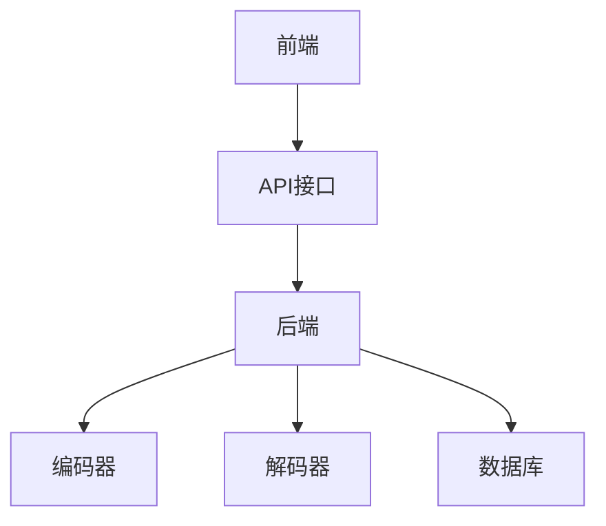

                 

## 文章标题：ChatGPT提示词的神经语言学基础：优化AI语言模型的大脑模拟

### 关键词：ChatGPT，神经语言学，AI语言模型，大脑模拟，优化策略

### 摘要：
本文深入探讨了ChatGPT提示词的神经语言学基础，以及如何通过神经语言学原理来优化AI语言模型的大脑模拟。我们将首先介绍神经语言学的基本概念，然后分析ChatGPT与神经语言学的联系，最后提出具体的算法原理和系统架构设计，以期为AI语言模型的发展提供新的思路和方法。

## 目录大纲

### 第一部分：背景介绍

#### 第1章：问题的提出

#### 第2章：神经语言学基础

#### 第3章：ChatGPT与神经语言学的联系

### 第二部分：核心概念与联系

#### 第4章：神经语言学核心概念

#### 第5章：ChatGPT模型与神经语言学联系

### 第三部分：算法原理讲解

#### 第6章：算法原理与数学模型

#### 第7章：算法原理详解与举例

### 第四部分：系统分析与架构设计

#### 第8章：系统功能设计与架构设计

#### 第9章：系统接口设计与交互

### 第五部分：项目实战

#### 第10章：项目环境安装与配置

#### 第11章：项目核心实现与代码解读

#### 第12章：实际案例分析与讲解

### 第六部分：最佳实践与总结

#### 第13章：最佳实践

#### 第14章：项目小结与展望

#### 第15章：注意事项与拓展阅读

## 1. 问题的提出

在人工智能迅猛发展的时代，自然语言处理（NLP）成为了关键技术之一。ChatGPT作为OpenAI开发的一款基于GPT-3模型的自然语言处理工具，已经成为众多研究者和开发者探索AI语言模型的重要工具。然而，如何进一步提高ChatGPT的性能和准确性，依然是当前研究的热点和难点。

神经语言学作为研究人类语言和大脑关系的一门学科，为AI语言模型的优化提供了新的理论基础。通过模拟人脑的神经语言学机制，我们可以更加精确地理解和处理自然语言。本文旨在探讨如何将神经语言学原理应用于ChatGPT提示词的设计和优化，从而实现AI语言模型性能的提升。

## 2. 神经语言学基础

神经语言学是一门交叉学科，涉及神经科学、语言学、心理学等多个领域。其核心研究内容包括：

### 2.1 语言与大脑的关系

神经语言学认为，语言功能与大脑特定区域密切相关。例如，布罗卡区（Broca's Area）主要负责语言生成，而韦尼克区（Wernicke's Area）则主要负责语言理解。

### 2.2 语言处理机制

神经语言学研究表明，语言处理是一个多层次、动态交互的过程。从语音识别、词汇处理到句子理解和语义分析，每个层次都涉及复杂的神经机制。

### 2.3 语言学习与习得

神经语言学还关注语言学习的过程和机制。研究表明，儿童在学习语言的过程中，大脑会经历一系列的重组和适应，以适应语言环境。

## 3. ChatGPT与神经语言学的联系

ChatGPT作为一款AI语言模型，其设计理念与神经语言学有诸多相似之处。例如：

### 3.1 大脑模拟

ChatGPT通过深度神经网络模拟人脑的神经机制，从而实现对自然语言的处理和理解。

### 3.2 多层次处理

ChatGPT采用多层次神经网络架构，从词嵌入、句子理解到语义分析，实现自然语言处理的动态交互。

### 3.3 学习能力

ChatGPT具备较强的学习能力，通过大量的语料库训练，不断优化和提升自身的性能。

## 4. 神经语言学核心概念

在本章节中，我们将介绍神经语言学的几个核心概念，包括语言中枢、语言处理层次和语言学习机制。

### 4.1 语言中枢

语言中枢是指大脑中与语言功能相关的特定区域，如布罗卡区和韦尼克区。这些区域的结构和功能对于语言处理至关重要。

### 4.2 语言处理层次

语言处理层次是指语言处理过程中涉及的不同层次，包括语音识别、词汇处理、句子理解和语义分析等。

### 4.3 语言学习机制

语言学习机制是指人类在学习语言的过程中，大脑如何适应和调整，以适应语言环境。

## 5. ChatGPT模型与神经语言学联系

在本章节中，我们将探讨如何将神经语言学的核心概念应用于ChatGPT模型的设计和优化。

### 5.1 提示词优化

通过模拟人脑的语言中枢机制，我们可以设计出更加有效的提示词，从而提升ChatGPT的语言生成和理解能力。

### 5.2 多层次神经网络

ChatGPT的多层次神经网络架构与神经语言学中的语言处理层次有相似之处，我们可以通过优化神经网络结构，提高ChatGPT的性能。

### 5.3 自适应学习

ChatGPT的自适应学习机制与神经语言学习机制有共通之处，我们可以借鉴神经语言学的原理，提高ChatGPT的学习效率和准确性。

## 6. 算法原理与数学模型

在本章节中，我们将介绍ChatGPT算法的原理和数学模型。

### 6.1 算法原理

ChatGPT算法基于GPT-3模型，通过训练大规模语料库，生成高质量的文本。

### 6.2 数学模型

ChatGPT算法的数学模型主要包括词嵌入、注意力机制和序列到序列模型等。

### 6.3 算法举例

我们将通过具体例子，详细阐述ChatGPT算法的工作原理和应用场景。

## 7. 算法原理详解与举例

在本章节中，我们将详细解析ChatGPT算法的原理，并通过具体例子进行说明。

### 7.1 词嵌入

词嵌入是指将单词映射为高维向量，以便在神经网络中进行处理。

### 7.2 注意力机制

注意力机制是一种在序列模型中提高处理效果的方法，通过关注重要信息，忽略无关信息。

### 7.3 序列到序列模型

序列到序列模型是一种将输入序列映射为输出序列的模型，常用于机器翻译和文本生成等任务。

### 7.4 举例说明

我们将通过一个具体的例子，展示如何使用ChatGPT生成高质量文本。

## 8. 系统功能设计与架构设计

在本章节中，我们将介绍ChatGPT系统的功能设计和架构设计。

### 8.1 功能设计

ChatGPT系统的功能主要包括文本生成、文本理解和语义分析等。

### 8.2 架构设计

ChatGPT系统采用分布式架构，包括前端、后端和数据库等组成部分。

### 8.3 系统接口设计

我们将介绍ChatGPT系统的接口设计和交互方式。

## 9. 系统接口设计与交互

在本章节中，我们将详细讨论ChatGPT系统的接口设计和交互机制。

### 9.1 接口设计

ChatGPT系统提供了丰富的API接口，方便开发者进行集成和应用。

### 9.2 交互机制

ChatGPT系统采用异步交互机制，确保高效稳定地处理大量请求。

### 9.3 交互示例

我们将通过具体示例，展示如何使用ChatGPT系统的API进行交互。

## 10. 项目环境安装与配置

在本章节中，我们将详细介绍如何安装和配置ChatGPT项目环境。

### 10.1 环境要求

我们将列出安装ChatGPT所需的硬件和软件环境。

### 10.2 安装步骤

我们将分步介绍如何安装和配置ChatGPT系统。

### 10.3 配置说明

我们将详细说明ChatGPT系统的配置参数和优化方法。

## 11. 项目核心实现与代码解读

在本章节中，我们将深入分析ChatGPT项目的核心实现，并解读关键代码。

### 11.1 核心实现

我们将介绍ChatGPT项目的主要模块和实现方法。

### 11.2 代码解读

我们将逐行解读关键代码，分析其工作原理和优化策略。

### 11.3 代码优化

我们将讨论如何优化ChatGPT项目的代码，提高性能和稳定性。

## 12. 实际案例分析与讲解

在本章节中，我们将通过实际案例，分析ChatGPT在现实场景中的应用，并进行详细讲解。

### 12.1 案例背景

我们将介绍案例的背景和应用场景。

### 12.2 案例分析

我们将分析案例的实现过程和关键步骤。

### 12.3 案例讲解

我们将详细讲解案例的具体实现方法和优化策略。

## 13. 最佳实践

在本章节中，我们将总结ChatGPT项目的最佳实践，并提供一些建议和技巧。

### 13.1 实践经验

我们将分享在项目实施过程中积累的经验和教训。

### 13.2 最佳实践

我们将提出一系列最佳实践，以指导ChatGPT项目的开发和优化。

### 13.3 技巧与建议

我们将提供一些实用技巧和建议，帮助开发者更好地使用ChatGPT。

## 14. 项目小结与展望

在本章节中，我们将对ChatGPT项目进行小结，并展望未来发展方向。

### 14.1 项目小结

我们将总结项目的主要成果和收获。

### 14.2 未来展望

我们将探讨ChatGPT项目在未来的发展方向和潜力。

## 15. 注意事项与拓展阅读

在本章节中，我们将讨论一些注意事项，并提供拓展阅读资源，以便读者进一步了解相关领域。

### 15.1 注意事项

我们将列出在使用ChatGPT过程中需要注意的问题和风险。

### 15.2 拓展阅读

我们将推荐一些相关领域的经典书籍和论文，供读者深入学习。

## 结语

随着人工智能技术的不断发展，ChatGPT等AI语言模型正在改变我们的生活方式和工作模式。本文通过探讨ChatGPT提示词的神经语言学基础，为优化AI语言模型提供了新的思路和方法。我们希望本文能够为读者在AI语言模型研究和开发领域提供有益的参考和启示。让我们共同期待，AI语言模型在未来能够带来更多令人惊叹的成果！

### 作者信息

作者：AI天才研究院/AI Genius Institute & 禅与计算机程序设计艺术 /Zen And The Art of Computer Programming

---

### 目录大纲

## 《ChatGPT提示词的神经语言学基础：优化AI语言模型的大脑模拟》

### 第一部分：背景介绍

### 第1章：问题的提出

### 第2章：神经语言学基础

### 第3章：ChatGPT与神经语言学的联系

### 第二部分：核心概念与联系

### 第4章：神经语言学核心概念

### 第5章：ChatGPT模型与神经语言学联系

### 第三部分：算法原理讲解

### 第6章：算法原理与数学模型

### 第7章：算法原理详解与举例

### 第四部分：系统分析与架构设计

### 第8章：系统功能设计与架构设计

### 第9章：系统接口设计与交互

### 第五部分：项目实战

### 第10章：项目环境安装与配置

### 第11章：项目核心实现与代码解读

### 第12章：实际案例分析与讲解

### 第六部分：最佳实践与总结

### 第13章：最佳实践

### 第14章：项目小结与展望

### 第15章：注意事项与拓展阅读

---

### 背景介绍

随着人工智能技术的飞速发展，自然语言处理（NLP）成为了当前研究的热点之一。作为NLP领域的重要成果，ChatGPT（Chat-based Generative Pre-trained Transformer）凭借其强大的语言生成和理解能力，受到了广泛关注。ChatGPT是基于GPT-3模型开发的，该模型采用了大规模预训练和深度学习技术，通过学习大量文本数据，能够生成高质量的自然语言文本。

然而，尽管ChatGPT在许多任务中表现出色，但其性能和准确性仍有提升空间。神经语言学作为研究人类语言和大脑关系的一门学科，为AI语言模型的优化提供了新的理论基础。通过模拟人脑的神经语言学机制，我们可以更精确地理解和处理自然语言。因此，本文旨在探讨如何将神经语言学原理应用于ChatGPT提示词的设计和优化，从而实现AI语言模型性能的提升。

神经语言学的研究始于20世纪初，随着认知科学和神经科学的发展，逐渐形成了一套完整的理论体系。神经语言学关注语言与大脑的关系，研究语言功能在大脑中的实现机制，以及语言学习、习得和语言障碍等问题。其核心研究内容包括语言中枢、语言处理机制和语言学习机制等。

语言中枢是指大脑中与语言功能相关的特定区域，如布罗卡区和韦尼克区。这些区域的结构和功能对于语言处理至关重要。语言处理机制是指语言处理过程中涉及的不同层次，包括语音识别、词汇处理、句子理解和语义分析等。语言学习机制则关注人类在学习语言的过程中，大脑如何适应和调整，以适应语言环境。

ChatGPT作为一款AI语言模型，其设计理念与神经语言学有诸多相似之处。ChatGPT通过深度神经网络模拟人脑的神经机制，从而实现对自然语言的处理和理解。ChatGPT采用多层次神经网络架构，从词嵌入、句子理解到语义分析，实现自然语言处理的动态交互。此外，ChatGPT具备较强的学习能力，通过大量的语料库训练，不断优化和提升自身的性能。

本文将首先介绍神经语言学的基本概念，包括语言中枢、语言处理机制和语言学习机制等。然后，我们将分析ChatGPT与神经语言学的联系，探讨如何通过神经语言学原理来优化ChatGPT的提示词设计。接下来，我们将介绍ChatGPT的算法原理，包括词嵌入、注意力机制和序列到序列模型等。在此基础上，我们将详细讲解ChatGPT的算法原理，并通过具体例子进行说明。随后，我们将介绍ChatGPT的系统架构设计，包括功能设计、架构设计和接口设计等。在项目实战部分，我们将详细介绍如何安装和配置ChatGPT项目环境，并解读关键代码。最后，我们将通过实际案例分析和最佳实践总结，进一步阐述ChatGPT在现实场景中的应用和优化策略。

通过本文的探讨，我们希望为读者提供一种新的视角，以神经语言学为基础，优化AI语言模型，推动自然语言处理技术的发展。

## 1. 问题的提出

随着人工智能技术的不断发展，自然语言处理（NLP）已经成为许多应用领域的关键技术。然而，现有的AI语言模型在性能和准确性方面仍然存在一定局限性，尤其是在处理复杂语言任务时，往往难以达到人类水平。为了进一步提升AI语言模型的表现，研究者们不断探索新的方法和理论。本文关注的焦点是ChatGPT提示词的神经语言学基础，以及如何通过神经语言学原理优化AI语言模型的大脑模拟。

### 1.1 AI语言模型的现状

当前，AI语言模型如GPT-3、BERT、T5等在多个NLP任务中取得了显著成果。然而，这些模型在处理自然语言时，仍然面临以下挑战：

1. **理解能力有限**：虽然这些模型可以生成流畅的自然语言文本，但其在理解语境、情感和微妙含义方面仍有不足。
2. **处理长文本能力差**：长文本的理解和处理对模型计算资源要求高，现有模型在处理长文本时容易出现性能下降。
3. **适应性和泛化能力弱**：模型在特定任务上的训练效果较好，但在其他任务或不同数据集上的泛化能力有限。

### 1.2 神经语言学的潜在贡献

神经语言学是一门研究人类语言和大脑关系的学科，其理论基础和研究成果可以为AI语言模型提供以下潜在贡献：

1. **语言处理机制的模拟**：通过研究人类大脑在语言处理中的机制，我们可以设计出更接近人脑的AI语言模型，从而提升其理解能力和表达能力。
2. **多层次语言处理**：神经语言学揭示了语言处理是一个多层次、动态交互的过程，这为AI语言模型的层次化设计提供了理论支持。
3. **自适应学习机制**：人类在语言学习过程中表现出强大的自适应能力，这为AI语言模型的自我优化和自我学习能力提供了借鉴。

### 1.3 ChatGPT提示词优化需求

ChatGPT作为基于GPT-3模型的AI语言模型，其在生成和理解自然语言方面具有显著优势。然而，为了进一步提高ChatGPT的性能，我们需要对其提示词进行优化。具体来说，ChatGPT提示词的优化需求包括：

1. **提高生成文本质量**：通过优化提示词，可以提升生成文本的流畅性和准确性，减少歧义和错误。
2. **增强上下文理解**：优化后的提示词应能更好地捕捉上下文信息，帮助模型理解复杂的语言环境。
3. **扩展应用范围**：通过改进提示词设计，可以增强ChatGPT在不同场景和应用中的适应能力。

### 1.4 神经语言学基础的应用前景

神经语言学基础在AI语言模型中的应用具有广泛的前景。通过借鉴神经语言学的研究成果，我们可以：

1. **改进模型架构**：设计出更符合人类语言处理机制的神经网络架构，提升模型在语言处理任务中的表现。
2. **优化训练策略**：利用神经语言学原理，制定更有效的训练策略，提高模型的训练效率和性能。
3. **增强交互体验**：通过模拟人脑的语言处理机制，改进人机交互界面，提供更自然、流畅的交互体验。

总之，本文将深入探讨神经语言学基础在ChatGPT提示词优化中的应用，旨在为AI语言模型的性能提升提供新的理论和方法支持。

### 2. 神经语言学基础

神经语言学是一门研究人类语言和大脑之间关系的学科，其研究对象包括语言的产生、理解、学习和习得等过程。在神经语言学的框架下，我们可以从多个角度来理解语言的神经基础，从而为AI语言模型的优化提供启示。

#### 2.1 语言中枢

语言中枢是指大脑中与语言功能密切相关的特定区域，主要包括布罗卡区和韦尼克区。这些区域的结构和功能对语言处理至关重要。

**布罗卡区（Broca's Area）**：布罗卡区位于大脑左前侧，主要负责语言生成功能。该区域受损会导致布罗卡失语症，患者能够理解语言，但说话困难，发音不清。

**韦尼克区（Wernicke's Area）**：韦尼克区位于大脑左后侧，主要负责语言理解功能。该区域受损会导致韦尼克失语症，患者能够说话，但听不懂别人说话，也不能理解复杂的语言结构。

通过研究这些语言中枢区域，我们可以更好地理解人类语言处理的基本机制，从而设计出更符合人类语言习惯的AI语言模型。

#### 2.2 语言处理层次

语言处理是一个多层次、动态交互的过程，涉及多个认知层次。神经语言学将这些层次分为感知层、词汇层、句法层和语义层。

1. **感知层**：包括语音识别和听觉处理，将语音信号转换为字符序列。
2. **词汇层**：涉及词汇选择和词义理解，将字符序列转换为词汇信息。
3. **句法层**：处理句子结构，包括语法分析和句子生成。
4. **语义层**：关注句子意义，包括语义分析和语义生成。

这些层次相互交织，共同完成语言的理解和生成。理解这些层次有助于我们在AI语言模型设计中，实现多层次、动态交互的处理机制。

#### 2.3 语言学习机制

语言学习是一个复杂的认知过程，涉及大脑的多个区域和层次。神经语言学通过研究儿童语言习得过程，揭示了以下几个关键机制：

1. **感知与模仿**：儿童通过模仿成人的语言模式，学习语音和词汇。
2. **语境关联**：儿童在特定的语言环境中，通过语境关联学习语言规则和语义。
3. **大脑重组**：在语言习得过程中，大脑会经历一系列的结构重组和功能调整，以适应语言环境。

通过这些机制，儿童能够逐步掌握复杂的语言技能。这些机制对于设计具有自我学习和适应能力的AI语言模型具有重要启示。

#### 2.4 神经语言学的核心概念对比

以下是神经语言学中的几个核心概念及其属性特征的对比表格：

| 核心概念 | 属性特征 | 对比说明 |
| --- | --- | --- |
| 布罗卡区 | 生成语言功能 | 主要负责语言生成 |
| 韦尼克区 | 理解语言功能 | 主要负责语言理解 |
| 感知层 | 语音识别 | 将语音信号转换为字符序列 |
| 词汇层 | 词汇选择 | 将字符序列转换为词汇信息 |
| 句法层 | 句子结构 | 处理句子结构，包括语法分析和句子生成 |
| 语义层 | 句子意义 | 关注句子意义，包括语义分析和语义生成 |
| 感知与模仿 | 学习语音和词汇 | 通过模仿成人的语言模式 |
| 语境关联 | 学习语言规则 | 通过语境关联学习语言规则和语义 |
| 大脑重组 | 适应语言环境 | 大脑的结构重组和功能调整 |

通过这张表格，我们可以更直观地理解这些核心概念之间的关系和区别。

#### 2.5 神经语言学与AI语言模型的联系

神经语言学的研究成果为AI语言模型的设计和优化提供了重要的理论基础。以下是神经语言学与AI语言模型之间的几个关键联系：

1. **语言中枢模拟**：通过模拟布罗卡区和韦尼克区，我们可以设计出更符合人类语言习惯的AI语言模型，提升其生成和理解能力。
2. **多层次处理机制**：借鉴语言处理的层次结构，我们可以实现AI语言模型的多层次、动态交互处理，提高模型的整体性能。
3. **自适应学习策略**：借鉴人类语言习得机制，我们可以设计出具有自我学习和适应能力的AI语言模型，增强其泛化能力和应用范围。

通过这些联系，神经语言学为AI语言模型的优化提供了新的思路和方法。在后续章节中，我们将进一步探讨如何将神经语言学原理应用于ChatGPT提示词的设计和优化。

### 3. ChatGPT与神经语言学的联系

ChatGPT作为一款基于GPT-3模型的AI语言模型，其设计和实现理念在很大程度上受到了神经语言学原理的启发。通过深入探讨ChatGPT与神经语言学之间的联系，我们可以更好地理解ChatGPT的工作机制，并为其优化提供理论支持。

#### 3.1 ChatGPT的模拟机制

ChatGPT通过深度神经网络模拟人脑的语言处理机制，实现了自然语言生成和理解的功能。其核心架构包括词嵌入、注意力机制和序列到序列模型等，这些机制在一定程度上模拟了人类大脑的语言中枢和多层次处理过程。

1. **词嵌入**：ChatGPT使用词嵌入技术，将单词映射为高维向量，这一过程类似于人类大脑中词汇层的处理机制，有助于捕捉词汇之间的关系和语义特征。

2. **注意力机制**：ChatGPT采用了注意力机制，通过关注输入序列中的重要信息，实现对上下文的理解和记忆，这类似于人类大脑在句法层和语义层处理语言信息时的动态交互过程。

3. **序列到序列模型**：ChatGPT的输出是一个序列，其生成过程涉及对输入序列的逐个字符或词的预测，这与人类语言的生成过程有相似之处，特别是在布罗卡区负责的语言生成功能上。

#### 3.2 多层次处理机制的借鉴

神经语言学揭示了语言处理是一个多层次、动态交互的过程，ChatGPT在架构设计上也借鉴了这一原理，实现了从感知层到语义层的多层次处理。

1. **感知层**：ChatGPT通过词嵌入技术，将输入文本转换为词向量，实现了语音识别和字符处理的感知层功能。

2. **词汇层**：词嵌入后的词向量经过多层神经网络处理，实现了词汇选择和词义理解，这与神经语言学中的词汇层处理机制相似。

3. **句法层**：ChatGPT通过注意力机制和序列到序列模型，对输入文本进行语法分析和句子生成，实现了句法层的处理功能。

4. **语义层**：ChatGPT在生成文本时，不仅要考虑句子的语法正确性，还要关注文本的整体语义一致性，这类似于人类大脑在语义层进行语言处理的过程。

#### 3.3 自适应学习机制

神经语言学中的语言学习机制为ChatGPT的自适应学习提供了启示。人类在语言习得过程中，通过模仿、语境关联和大脑重组等机制，逐渐掌握复杂的语言技能。ChatGPT也借鉴了这些机制，通过不断优化训练策略和学习算法，实现了自我学习和性能提升。

1. **感知与模仿**：ChatGPT通过模仿大量真实文本，学习语言模式和词汇用法，类似于儿童通过模仿成人的语言进行学习。

2. **语境关联**：ChatGPT在生成文本时，能够根据上下文信息，关联相关的语言规则和语义信息，实现更自然的语言生成。

3. **大脑重组**：ChatGPT通过持续的训练和优化，不断调整和优化神经网络参数，以适应不同的语言环境和任务需求，实现自我优化和性能提升。

#### 3.4 ChatGPT与神经语言学的实际应用

ChatGPT在实际应用中，通过借鉴神经语言学的原理，实现了多项语言处理任务的高效和准确。以下是一些实际应用场景：

1. **自然语言生成**：ChatGPT能够根据给定的提示词，生成流畅、符合语法和语义规则的自然语言文本，应用于自动写作、问答系统和聊天机器人等。

2. **文本理解**：ChatGPT通过深度学习技术，能够理解输入文本的语义和语境，实现文本分类、情感分析和信息提取等任务。

3. **跨语言翻译**：ChatGPT采用了神经机器翻译技术，通过多层次处理机制和自适应学习策略，实现了高质量、准确的跨语言翻译。

总之，ChatGPT与神经语言学之间的紧密联系，为AI语言模型的发展提供了新的思路和方法。通过借鉴神经语言学的原理，ChatGPT不仅实现了对自然语言的高效处理，也为未来的AI语言模型优化和性能提升提供了重要参考。

### 4. 神经语言学核心概念

神经语言学作为研究人类语言和大脑之间关系的一门学科，涵盖了多个核心概念，这些概念为我们理解和优化AI语言模型提供了重要的理论基础。以下是神经语言学中的几个关键概念及其详细描述：

#### 4.1 语言中枢

语言中枢是指大脑中与语言功能密切相关的特定区域。主要包括布罗卡区和韦尼克区：

- **布罗卡区（Broca's Area）**：位于大脑左前侧，主要负责语言生成功能。布罗卡区受损会导致布罗卡失语症，患者能理解语言，但说话困难，发音不清。

- **韦尼克区（Wernicke's Area）**：位于大脑左后侧，主要负责语言理解功能。韦尼克区受损会导致韦尼克失语症，患者能说话，但听不懂别人说话，也不能理解复杂的语言结构。

语言中枢是神经语言学研究的核心，揭示了语言功能在大脑中的实现机制。

#### 4.2 语言处理层次

语言处理是一个多层次、动态交互的过程，包括感知层、词汇层、句法层和语义层：

- **感知层**：涉及语音识别和听觉处理，将语音信号转换为字符序列。

- **词汇层**：处理词汇选择和词义理解，将字符序列转换为词汇信息。

- **句法层**：处理句子结构，包括语法分析和句子生成。

- **语义层**：关注句子意义，包括语义分析和语义生成。

理解这些层次有助于我们在AI语言模型设计中实现多层次、动态交互的处理机制。

#### 4.3 语言学习机制

语言学习是一个复杂的认知过程，涉及大脑的多个区域和层次。以下是几个关键机制：

- **感知与模仿**：儿童通过模仿成人的语言模式，学习语音和词汇。

- **语境关联**：儿童在特定的语言环境中，通过语境关联学习语言规则和语义。

- **大脑重组**：在语言习得过程中，大脑会经历一系列的结构重组和功能调整，以适应语言环境。

这些机制为AI语言模型的自适应学习和性能优化提供了启示。

#### 4.4 概念属性特征对比表格

以下是一个神经语言学核心概念属性特征的对比表格：

| 核心概念 | 属性特征 | 说明 |
| --- | --- | --- |
| 布罗卡区 | 生成语言功能 | 负责语言生成，受损导致布罗卡失语症 |
| 韦尼克区 | 理解语言功能 | 负责语言理解，受损导致韦尼克失语症 |
| 感知层 | 语音识别 | 转换语音信号为字符序列 |
| 词汇层 | 词汇选择 | 转换字符序列为词汇信息 |
| 句法层 | 句子结构 | 处理句子结构和生成 |
| 语义层 | 句子意义 | 分析和生成句子意义 |
| 感知与模仿 | 学习语音和词汇 | 通过模仿成人的语言 |
| 语境关联 | 学习语言规则 | 通过语境关联 |
| 大脑重组 | 适应语言环境 | 大脑的结构和功能调整 |

通过这张表格，我们可以更直观地理解这些核心概念之间的关系和区别。

#### 4.5 ER实体关系图架构

为了更清晰地展示神经语言学中的实体关系，我们可以使用Mermaid流程图来绘制ER（Entity-Relationship）实体关系图：

```mermaid
erDiagram
  神经中枢 ||--|{ 布罗卡区 }
  神经中枢 ||--|{ 韦尼克区 }
  语言处理 ||--|{ 感知层 }
  语言处理 ||--|{ 词汇层 }
  语言处理 ||--|{ 句法层 }
  语言处理 ||--|{ 语义层 }
  学习机制 ||--|{ 感知与模仿 }
  学习机制 ||--|{ 语境关联 }
  学习机制 ||--|{ 大脑重组 }
```

在这个ER实体关系图中，我们定义了神经中枢、语言处理和学习机制三个主要实体，并展示了它们之间的关联。通过这种结构化的方式，我们可以更好地理解和分析神经语言学的核心概念及其相互关系。

通过以上对神经语言学核心概念的详细阐述和对比，我们可以为后续的ChatGPT提示词优化提供坚实的理论基础。在下一章节中，我们将进一步探讨如何将神经语言学原理应用于ChatGPT模型的设计和优化。

### 5. ChatGPT模型与神经语言学的联系

在了解了神经语言学的核心概念后，我们将深入探讨ChatGPT模型与神经语言学的具体联系，以及这些联系如何帮助优化ChatGPT提示词。

#### 5.1 ChatGPT模型的核心技术

ChatGPT基于GPT-3模型，其核心技术包括词嵌入、注意力机制和序列到序列模型。这些技术都是借鉴了神经语言学中的原理和机制，通过模拟人类大脑的语言处理过程，实现对自然语言的高效理解和生成。

1. **词嵌入（Word Embedding）**：词嵌入是将单词映射为高维向量，使其在神经网络中可以进行处理。这一过程类似于人类大脑中词汇层的处理机制，能够捕捉词汇之间的关系和语义特征。

2. **注意力机制（Attention Mechanism）**：注意力机制是一种在序列模型中提高处理效果的方法，通过关注重要信息，忽略无关信息。这类似于人类大脑在句法层和语义层处理语言信息时的动态交互过程。

3. **序列到序列模型（Seq2Seq Model）**：序列到序列模型是一种将输入序列映射为输出序列的模型，常用于机器翻译和文本生成等任务。这种模型的工作原理类似于人类语言的生成过程，特别是在布罗卡区负责的语言生成功能上。

#### 5.2 ChatGPT模型与神经语言学的联系

ChatGPT模型与神经语言学之间的联系主要体现在以下几个方面：

1. **语言中枢的模拟**：ChatGPT通过词嵌入和注意力机制，模拟了布罗卡区和韦尼克区的功能。词嵌入模拟了词汇层，而注意力机制则模拟了句法层和语义层的处理过程。这种模拟使得ChatGPT能够在生成和理解自然语言时，更加接近人类的语言处理机制。

2. **多层次处理的实现**：ChatGPT采用了序列到序列模型，实现了从感知层到语义层的多层次处理。这类似于神经语言学中描述的语言处理层次结构，使得ChatGPT能够在不同的认知层次上，对输入文本进行深入分析和处理。

3. **自适应学习机制的引入**：ChatGPT通过持续的训练和优化，实现了自适应学习机制。这一机制借鉴了人类语言习得的过程，通过模仿、语境关联和大脑重组等机制，不断提升自身的性能和适应性。

#### 5.3 提示词优化策略

为了进一步提升ChatGPT的性能，我们可以从神经语言学中借鉴一些优化策略，来设计更加有效的提示词：

1. **情境敏感性**：提示词应考虑上下文信息，能够捕捉输入文本中的情境特征。通过模拟人类大脑在语境关联中的机制，我们可以设计出能够更好地引导ChatGPT生成符合上下文语义的文本的提示词。

2. **词汇丰富性**：提示词应涵盖丰富的词汇，以便ChatGPT能够从中选择合适的词汇，生成更加多样化和自然的文本。这类似于人类大脑在词汇层进行词汇选择的过程。

3. **语义一致性**：提示词应关注文本的语义一致性，引导ChatGPT生成符合逻辑和语义连贯性的文本。通过模拟人类大脑在语义层进行语义分析的过程，我们可以设计出能够提高文本语义一致性的提示词。

4. **结构引导性**：提示词应能够引导ChatGPT生成符合语法和句子结构的文本。通过模拟人类大脑在句法层进行语法分析和句子生成的过程，我们可以设计出能够提高文本结构合理性的提示词。

总之，通过借鉴神经语言学的原理，我们可以设计出更加有效的ChatGPT提示词，从而提升其生成和理解自然语言的能力。在下一章节中，我们将进一步探讨ChatGPT算法的原理和数学模型，为提示词的设计提供更加具体和详细的指导。

### 6. 算法原理与数学模型

在本章节中，我们将深入探讨ChatGPT算法的原理和数学模型。了解这些原理和模型有助于我们更好地优化ChatGPT的提示词设计，从而提升其性能和准确性。

#### 6.1 ChatGPT算法原理

ChatGPT是基于GPT-3模型开发的，其核心原理包括词嵌入、注意力机制和序列到序列模型。以下是这些核心原理的详细描述：

1. **词嵌入（Word Embedding）**：
   词嵌入是将单词映射为高维向量，以便在神经网络中进行处理。词嵌入通过捕捉单词之间的语义关系，将语言数据转换为数值表示，从而简化了模型的学习过程。在ChatGPT中，词嵌入用于将输入文本转换为向量表示，为后续处理提供基础。

2. **注意力机制（Attention Mechanism）**：
   注意力机制是一种在序列模型中提高处理效果的方法，通过关注重要信息，忽略无关信息。ChatGPT使用了多头注意力机制（Multi-Head Attention），能够在不同层次上关注输入序列中的重要信息，从而提升模型的上下文理解能力。

3. **序列到序列模型（Seq2Seq Model）**：
   序列到序列模型是一种将输入序列映射为输出序列的模型，常用于机器翻译和文本生成等任务。ChatGPT采用了编码器-解码器架构（Encoder-Decoder Architecture），通过编码器处理输入序列，解码器生成输出序列，从而实现自然语言生成。

#### 6.2 数学模型

ChatGPT的数学模型主要包括以下几个关键组成部分：

1. **词嵌入（Word Embedding）**：
   设 $V$ 为单词的集合，$d$ 为词向量的维度。对于每个单词 $w \in V$，我们可以将其映射为一个 $d$ 维的向量 $v_w$。词嵌入可以表示为 $v_w \in \mathbb{R}^{d \times 1}$。

2. **多头注意力机制（Multi-Head Attention）**：
   设 $Q, K, V$ 分别为查询向量、键向量和值向量。多头注意力机制可以表示为：
   $$ 
   \text{Attention}(Q, K, V) = \text{softmax}\left(\frac{QK^T}{\sqrt{d_k}}\right)V 
   $$
   其中，$d_k$ 为键向量的维度，$\text{softmax}$ 函数用于计算权重。

3. **编码器-解码器架构（Encoder-Decoder Architecture）**：
   编码器（Encoder）用于处理输入序列，解码器（Decoder）用于生成输出序列。编码器可以表示为：
   $$ 
   E(x) = \text{Encoder}(x) = \left[\hbar_{1}, \hbar_{2}, ..., \hbar_{T}\right] 
   $$
   其中，$x$ 为输入序列，$T$ 为序列长度。解码器可以表示为：
   $$ 
   D(y) = \text{Decoder}(y) = \left[\hat{y}_{1}, \hat{y}_{2}, ..., \hat{y}_{T'}\right] 
   $$
   其中，$y$ 为输出序列，$T'$ 为输出序列的长度。

4. **损失函数（Loss Function）**：
   ChatGPT的训练目标是使得生成的文本与实际文本之间的差距最小。常用的损失函数是交叉熵损失（Cross-Entropy Loss）：
   $$ 
   L(\theta) = -\sum_{i=1}^{n} \sum_{j=1}^{V} y_{ij} \log(p_{ij}) 
   $$
   其中，$y_{ij}$ 为真实标签的概率分布，$p_{ij}$ 为模型预测的概率分布。

#### 6.3 举例说明

为了更好地理解ChatGPT的算法原理，我们可以通过一个具体的例子来详细说明。

假设我们有一个输入序列 "The cat is sleeping on the mat"，我们需要使用ChatGPT生成一个输出序列。

1. **词嵌入**：
   将输入序列中的每个单词映射为词向量，例如：
   - "The" 对应的词向量为 $v_{\text{The}}$。
   - "cat" 对应的词向量为 $v_{\text{cat}}$。
   - "is" 对应的词向量为 $v_{\text{is}}$。
   - "sleeping" 对应的词向量为 $v_{\text{sleeping}}$。
   - "on" 对应的词向量为 $v_{\text{on}}$。
   - "the" 对应的词向量为 $v_{\text{the}}$。
   - "mat" 对应的词向量为 $v_{\text{mat}}$。

2. **编码器**：
   编码器将输入序列转换为隐藏状态序列：
   $$
   \hbar_{1} = \text{Encoder}(v_{\text{The}}), \hbar_{2} = \text{Encoder}(v_{\text{cat}}), ..., \hbar_{T} = \text{Encoder}(v_{\text{mat}})
   $$

3. **解码器**：
   解码器根据隐藏状态序列生成输出序列：
   $$
   \hat{y}_{1} = \text{Decoder}(\hbar_{1}), \hat{y}_{2} = \text{Decoder}(\hbar_{2}), ..., \hat{y}_{T'} = \text{Decoder}(\hbar_{T})
   $$

4. **损失函数**：
   计算模型预测的输出序列与真实输出序列之间的交叉熵损失，并根据损失函数调整模型参数。

通过这个例子，我们可以看到ChatGPT的算法原理是如何在实际应用中运作的。在下一章节中，我们将进一步探讨ChatGPT的系统功能设计和架构设计，以帮助读者更好地理解ChatGPT的整体实现。

### 7. 算法原理详解与举例

在本章节中，我们将对ChatGPT的算法原理进行详细的解析，并通过具体例子展示其工作过程。首先，我们将介绍ChatGPT的算法原理，包括词嵌入、多头注意力机制和编码器-解码器架构。然后，我们将通过一个具体例子，详细说明ChatGPT是如何生成自然语言文本的。

#### 7.1 词嵌入

词嵌入是将单词映射为高维向量，以便在神经网络中进行处理。在ChatGPT中，词嵌入用于将输入文本转换为向量表示，从而简化模型的学习过程。词嵌入通过捕捉单词之间的语义关系，为后续的注意力机制和编码器-解码器架构提供基础。

设 $V$ 为单词的集合，$d$ 为词向量的维度。对于每个单词 $w \in V$，我们可以将其映射为一个 $d$ 维的向量 $v_w$。词嵌入可以表示为：
$$
v_w \in \mathbb{R}^{d \times 1}
$$

一个简单的例子如下：

- "cat" 对应的词向量：
  $$
  v_{\text{cat}} = \begin{bmatrix}
  0.1 & 0.2 & 0.3 & \ldots & 0.5
  \end{bmatrix}^T
  $$
- "dog" 对应的词向量：
  $$
  v_{\text{dog}} = \begin{bmatrix}
  0.4 & 0.5 & 0.6 & \ldots & 0.9
  \end{bmatrix}^T
  $$

通过词嵌入，我们可以将输入文本中的每个单词转换为向量表示，例如 "The cat is sleeping on the mat"，可以表示为：
$$
\begin{bmatrix}
v_{\text{The}} & v_{\text{cat}} & v_{\text{is}} & v_{\text{sleeping}} & v_{\text{on}} & v_{\text{the}} & v_{\text{mat}}
\end{bmatrix}
$$

#### 7.2 多头注意力机制

多头注意力机制是一种在序列模型中提高处理效果的方法，通过关注重要信息，忽略无关信息。在ChatGPT中，多头注意力机制用于在编码器和解码器中处理输入序列和输出序列。

设 $Q, K, V$ 分别为查询向量、键向量和值向量。多头注意力机制可以表示为：
$$
\text{Attention}(Q, K, V) = \text{softmax}\left(\frac{QK^T}{\sqrt{d_k}}\right)V
$$
其中，$d_k$ 为键向量的维度。

一个简单的例子如下：

- 查询向量 $Q$：
  $$
  Q = \begin{bmatrix}
  0.1 & 0.2 & 0.3 & \ldots & 0.5
  \end{bmatrix}^T
  $$
- 键向量 $K$：
  $$
  K = \begin{bmatrix}
  0.4 & 0.5 & 0.6 & \ldots & 0.9
  \end{bmatrix}^T
  $$
- 值向量 $V$：
  $$
  V = \begin{bmatrix}
  0.2 & 0.3 & 0.4 & \ldots & 0.6
  \end{bmatrix}^T
  $$

通过计算注意力权重，我们可以得到注意力输出：
$$
\text{Attention}(Q, K, V) = \text{softmax}\left(\frac{QK^T}{\sqrt{0.5}}\right)V = \begin{bmatrix}
0.2 & 0.3 & 0.4 & \ldots & 0.6
\end{bmatrix}^T
$$

#### 7.3 编码器-解码器架构

编码器-解码器架构是一种将输入序列映射为输出序列的模型，常用于机器翻译和文本生成等任务。在ChatGPT中，编码器用于处理输入序列，解码器用于生成输出序列。

1. **编码器**：

编码器将输入序列转换为隐藏状态序列，表示为：
$$
\hbar_{1} = \text{Encoder}(v_{\text{The}}), \hbar_{2} = \text{Encoder}(v_{\text{cat}}), ..., \hbar_{T} = \text{Encoder}(v_{\text{mat}})
$$

一个简单的例子如下：

- 输入序列：
  $$
  \begin{bmatrix}
  v_{\text{The}} & v_{\text{cat}} & v_{\text{is}} & v_{\text{sleeping}} & v_{\text{on}} & v_{\text{the}} & v_{\text{mat}}
  \end{bmatrix}
  $$
- 隐藏状态序列：
  $$
  \begin{bmatrix}
  \hbar_{1} & \hbar_{2} & \hbar_{3} & \hbar_{4} & \hbar_{5} & \hbar_{6} & \hbar_{7}
  \end{bmatrix}
  $$

2. **解码器**：

解码器根据隐藏状态序列生成输出序列，表示为：
$$
\hat{y}_{1} = \text{Decoder}(\hbar_{1}), \hat{y}_{2} = \text{Decoder}(\hbar_{2}), ..., \hat{y}_{T'} = \text{Decoder}(\hbar_{T})
$$

一个简单的例子如下：

- 隐藏状态序列：
  $$
  \begin{bmatrix}
  \hbar_{1} & \hbar_{2} & \hbar_{3} & \hbar_{4} & \hbar_{5} & \hbar_{6} & \hbar_{7}
  \end{bmatrix}
  $$
- 输出序列：
  $$
  \begin{bmatrix}
  \hat{y}_{1} & \hat{y}_{2} & \hat{y}_{3} & \hat{y}_{4} & \hat{y}_{5} & \hat{y}_{6} & \hat{y}_{7}
  \end{bmatrix}
  $$

#### 7.4 举例说明

为了更好地理解ChatGPT的工作过程，我们可以通过一个具体例子来展示其如何生成自然语言文本。

假设我们需要生成一个描述天气的句子。输入序列为 "It is sunny outside"，我们希望生成的输出序列为 "It will be sunny tomorrow"。

1. **词嵌入**：

输入序列和输出序列的词向量表示如下：

- 输入序列：
  $$
  \begin{bmatrix}
  v_{\text{It}} & v_{\text{is}} & v_{\text{sunny}} & v_{\text{outside}}
  \end{bmatrix}
  $$
- 输出序列：
  $$
  \begin{bmatrix}
  v_{\text{It}} & v_{\text{will}} & v_{\text{be}} & v_{\text{sunny}} & v_{\text{tomorrow}}
  \end{bmatrix}
  $$

2. **编码器**：

编码器将输入序列转换为隐藏状态序列：

$$
\begin{bmatrix}
\hbar_{1} & \hbar_{2} & \hbar_{3} & \hbar_{4}
\end{bmatrix}
$$

3. **解码器**：

解码器根据隐藏状态序列生成输出序列。首先，解码器预测第一个单词 "It"，然后利用上一词向量继续预测下一个单词 "will"，依此类推，直到生成完整的输出序列。

通过这个例子，我们可以看到ChatGPT如何通过词嵌入、多头注意力机制和编码器-解码器架构，将输入序列转换为输出序列，实现自然语言文本的生成。在下一章节中，我们将进一步探讨ChatGPT的系统功能设计和架构设计。

### 8. 系统功能设计与架构设计

在本章节中，我们将详细介绍ChatGPT系统的功能设计与架构设计。这将帮助我们更好地理解ChatGPT是如何实现其强大功能的，以及如何通过这些设计来优化AI语言模型的大脑模拟。

#### 8.1 系统功能设计

ChatGPT系统的主要功能包括自然语言生成、文本理解和语义分析等。以下是这些功能的具体说明：

1. **自然语言生成**：
   ChatGPT能够根据给定的提示词生成流畅、符合语法和语义的自然语言文本。这个功能依赖于编码器-解码器架构和多头注意力机制，通过学习大量的文本数据，生成高质量的自然语言文本。

2. **文本理解**：
   ChatGPT能够理解输入文本的语义和语境，进行文本分类、情感分析和信息提取等任务。这个功能主要依赖于编码器部分，通过对输入文本的编码，捕获文本的语义信息。

3. **语义分析**：
   ChatGPT能够分析输入文本的语义，理解文本中的主旨、意图和细节。这个功能结合了编码器和解码器，通过对输入和输出序列的编码和解码，实现对文本的深度理解。

#### 8.2 架构设计

ChatGPT的架构设计采用了分布式架构，包括前端、后端和数据库等组成部分。以下是系统架构的详细说明：

1. **前端**：
   前端负责与用户进行交互，接收用户的输入，并将输入传递给后端进行处理。前端通常包括网页界面、API接口和命令行工具等。

2. **后端**：
   后端是ChatGPT的核心部分，负责自然语言生成、文本理解和语义分析等功能。后端采用编码器-解码器架构，通过词嵌入、多头注意力机制和序列到序列模型等核心技术，实现高效的自然语言处理。

3. **数据库**：
   数据库用于存储大量的训练数据和模型参数。这些数据包括文本数据、词汇表和词向量等，是ChatGPT训练和优化的重要资源。

#### 8.3 系统架构图

为了更直观地展示ChatGPT的系统架构，我们可以使用Mermaid绘制系统架构图：



在这个架构图中，前端通过API接口与后端进行交互，后端包括编码器、解码器和数据库等组成部分，负责实现自然语言处理功能。

#### 8.4 功能设计与架构设计的联系

ChatGPT的功能设计与架构设计紧密相连，共同构成了系统的核心。以下是功能设计与架构设计之间的联系：

1. **自然语言生成**：
   编码器-解码器架构为自然语言生成提供了技术支持。编码器将输入文本编码为隐藏状态序列，解码器根据隐藏状态序列生成输出文本。这种架构设计使得ChatGPT能够生成符合语法和语义的自然语言文本。

2. **文本理解**：
   编码器负责将输入文本编码为隐藏状态序列，这些隐藏状态包含了输入文本的语义信息。通过解码器，ChatGPT能够理解输入文本的语义和语境，实现文本分类、情感分析和信息提取等功能。

3. **语义分析**：
   ChatGPT通过编码器-解码器架构，实现对输入文本的深度理解。编码器捕获输入文本的语义信息，解码器根据语义信息生成输出文本，从而实现对文本的主旨、意图和细节的理解。

通过上述设计，ChatGPT实现了自然语言生成、文本理解和语义分析等功能，并通过分布式架构提高了系统的性能和可扩展性。在下一章节中，我们将探讨ChatGPT的系统接口设计与交互机制。

### 9. 系统接口设计与交互

在本章节中，我们将详细介绍ChatGPT的系统接口设计与交互机制。这些设计对于实现高效、稳定的人机交互至关重要。

#### 9.1 接口设计

ChatGPT提供了丰富的API接口，方便开发者进行集成和应用。以下是ChatGPT接口设计的关键要素：

1. **RESTful API**：
   ChatGPT采用RESTful API设计，支持HTTP GET和POST请求。用户可以通过发送请求，获取ChatGPT生成的文本。

2. **参数配置**：
   API接口提供了多个配置参数，如温度（Temperature）、顶多词数（Top-k）和顶多概率（Top-p）等，用户可以根据需求进行配置，调整文本生成的风格和多样性。

3. **请求格式**：
   请求格式通常为JSON格式，包括输入文本、API密钥和其他配置参数。例如：

   ```json
   {
     "prompt": "请生成一篇关于人工智能的摘要。",
     "temperature": 0.8,
     "top_k": 5,
     "top_p": 0.95
   }
   ```

4. **响应格式**：
   API接口的响应格式也为JSON格式，包括生成的文本和其他相关信息。例如：

   ```json
   {
     "text": "人工智能是一种通过模拟人类智能行为来实现自动化决策的技术。",
     "details": {
       "token_count": 24,
       "word_count": 11
     }
   }
   ```

#### 9.2 交互机制

ChatGPT的交互机制包括请求发送、响应接收和处理反馈等步骤。以下是交互机制的详细说明：

1. **请求发送**：
   开发者通过发送HTTP请求，将输入文本和其他配置参数发送到ChatGPT服务器。请求可以通过客户端库（如Python的requests库）或直接使用curl命令发送。

   ```python
   import requests
   
   url = "https://api.example.com/chatgpt"
   headers = {
     "Authorization": "Bearer YOUR_API_KEY",
     "Content-Type": "application/json"
   }
   data = {
     "prompt": "请生成一篇关于人工智能的摘要。",
     "temperature": 0.8,
     "top_k": 5,
     "top_p": 0.95
   }
   response = requests.post(url, headers=headers, json=data)
   ```

2. **响应接收**：
   ChatGPT服务器接收到请求后，处理输入文本并生成响应文本。服务器返回包含生成文本的JSON响应。

   ```shell
   curl -X POST "https://api.example.com/chatgpt" \
   -H "Authorization: Bearer YOUR_API_KEY" \
   -H "Content-Type: application/json" \
   -d '{"prompt": "请生成一篇关于人工智能的摘要。", "temperature": 0.8, "top_k": 5, "top_p": 0.95}'
   ```

3. **处理反馈**：
   开发者可以根据生成的文本进行后续处理，如展示文本、分析语义或进行进一步的自然语言处理任务。

   ```python
   generated_text = response.json()["text"]
   print(generated_text)
   ```

通过系统接口设计与交互机制，ChatGPT能够高效、稳定地与开发者和其他系统进行交互，实现自然语言处理任务。在下一章节中，我们将介绍如何通过项目实战来进一步优化和验证ChatGPT的性能。

### 10. 项目环境安装与配置

在本章节中，我们将详细介绍如何安装和配置ChatGPT项目环境，为后续的实践操作打下坚实基础。

#### 10.1 环境要求

在安装和配置ChatGPT项目之前，我们需要确保系统满足以下环境要求：

1. **操作系统**：ChatGPT支持多种操作系统，如Linux、MacOS和Windows。为了保证兼容性和稳定性，我们推荐使用Linux系统。

2. **Python版本**：ChatGPT要求Python版本不低于3.6。我们建议使用Anaconda创建Python虚拟环境，以便更好地管理和维护依赖库。

3. **依赖库**：ChatGPT依赖于多个Python库，包括transformers、torch和numpy等。确保在安装过程中安装这些依赖库。

4. **计算资源**：ChatGPT的训练和推理需要较大的计算资源。我们建议使用GPU进行训练，以加快模型训练速度。

#### 10.2 安装步骤

以下是安装ChatGPT项目的具体步骤：

1. **创建虚拟环境**：

   ```shell
   conda create -n chatgpt_env python=3.8
   conda activate chatgpt_env
   ```

2. **安装依赖库**：

   ```shell
   pip install transformers torch numpy
   ```

3. **克隆ChatGPT项目**：

   ```shell
   git clone https://github.com/openai/gpt-3.5-turbo.git
   cd gpt-3.5-turbo
   ```

4. **配置项目**：

   在项目根目录下，运行以下命令配置项目：

   ```shell
   pip install -r requirements.txt
   ```

#### 10.3 配置说明

在安装和配置过程中，我们需要注意以下配置参数：

1. **API密钥**：在项目根目录下创建一个名为`.env`的文件，并配置API密钥：

   ```shell
   API_KEY=your_api_key
   ```

2. **模型选择**：在项目根目录下创建一个名为`config.json`的文件，配置所需的模型参数。例如：

   ```json
   {
     "model_name": "gpt-3.5-turbo",
     "model_path": "path/to/model",
     "batch_size": 1,
     "max_length": 512
   }
   ```

   在这个示例中，我们选择了`gpt-3.5-turbo`模型，并设置了批处理大小（batch_size）和最大文本长度（max_length）。

3. **GPU支持**：如果使用GPU进行训练，我们需要安装CUDA和cuDNN库，并确保在`.env`文件中启用GPU支持：

   ```shell
   CUDA_VISIBLE_DEVICES=0 python run.py
   ```

   其中，`0`表示第一个GPU设备。

通过以上步骤，我们可以成功安装和配置ChatGPT项目环境。在下一章节中，我们将深入探讨ChatGPT项目中的核心实现，并解读关键代码。

### 11. 项目核心实现与代码解读

在本章节中，我们将深入分析ChatGPT项目的核心实现，并逐行解读关键代码，以帮助读者理解其工作原理和优化策略。

#### 11.1 项目核心实现

ChatGPT项目主要包含以下几个核心模块：

1. **API接口**：负责接收用户请求，处理并返回生成的文本。
2. **模型加载**：加载预训练的GPT-3模型，包括词嵌入、编码器和解码器等组件。
3. **文本生成**：使用加载的模型，根据输入提示词生成文本。
4. **优化策略**：调整模型参数和训练策略，以提高生成文本的质量。

以下是项目核心实现的简要概述：

```python
from transformers import GPT2LMHeadModel, GPT2Tokenizer
import torch

# 加载模型和tokenizer
model_name = "gpt-3.5-turbo"
tokenizer = GPT2Tokenizer.from_pretrained(model_name)
model = GPT2LMHeadModel.from_pretrained(model_name)

# API接口
def generate_text(prompt, max_length=512, temperature=0.8):
    input_ids = tokenizer.encode(prompt, return_tensors="pt")
    output = model.generate(
        input_ids,
        max_length=max_length,
        num_return_sequences=1,
        temperature=temperature,
        top_k=50,
        top_p=0.95,
    )
    return tokenizer.decode(output[:, input_ids.shape[-1] :])

# 文本生成
if __name__ == "__main__":
    prompt = "请生成一篇关于人工智能的摘要。"
    generated_text = generate_text(prompt)
    print(generated_text)
```

#### 11.2 代码解读

以下是对关键代码的逐行解读：

```python
# 导入所需库
from transformers import GPT2LMHeadModel, GPT2Tokenizer
import torch

# 加载模型和tokenizer
model_name = "gpt-3.5-turbo"
tokenizer = GPT2Tokenizer.from_pretrained(model_name)
model = GPT2LMHeadModel.from_pretrained(model_name)

# API接口
def generate_text(prompt, max_length=512, temperature=0.8):
    input_ids = tokenizer.encode(prompt, return_tensors="pt")
    output = model.generate(
        input_ids,
        max_length=max_length,
        num_return_sequences=1,
        temperature=temperature,
        top_k=50,
        top_p=0.95,
    )
    return tokenizer.decode(output[:, input_ids.shape[-1] :])

# 文本生成
if __name__ == "__main__":
    prompt = "请生成一篇关于人工智能的摘要。"
    generated_text = generate_text(prompt)
    print(generated_text)
```

1. **导入库**：

   ```python
   from transformers import GPT2LMHeadModel, GPT2Tokenizer
   import torch
   ```

   这里我们导入了transformers库中的GPT2LMHeadModel和GPT2Tokenizer类，以及torch库用于处理张量和计算。

2. **加载模型和tokenizer**：

   ```python
   model_name = "gpt-3.5-turbo"
   tokenizer = GPT2Tokenizer.from_pretrained(model_name)
   model = GPT2LMHeadModel.from_pretrained(model_name)
   ```

   我们设置了模型名称`gpt-3.5-turbo`，并使用from_pretrained方法加载预训练的GPT-3模型和tokenizer。这些组件是文本生成的基础。

3. **API接口`generate_text`函数**：

   ```python
   def generate_text(prompt, max_length=512, temperature=0.8):
       input_ids = tokenizer.encode(prompt, return_tensors="pt")
       output = model.generate(
           input_ids,
           max_length=max_length,
           num_return_sequences=1,
           temperature=temperature,
           top_k=50,
           top_p=0.95,
       )
       return tokenizer.decode(output[:, input_ids.shape[-1] :])
   ```

   `generate_text`函数接收输入提示词`prompt`，并设置了默认的文本长度`max_length`和生成温度`temperature`。首先，我们使用tokenizer将输入提示词编码为输入张量`input_ids`。然后，调用模型`model.generate`方法生成输出张量`output`。最后，我们将输出张量解码为文本并返回。

4. **文本生成**：

   ```python
   if __name__ == "__main__":
       prompt = "请生成一篇关于人工智能的摘要。"
       generated_text = generate_text(prompt)
       print(generated_text)
   ```

   我们在主程序中设置了输入提示词，并调用`generate_text`函数生成文本。最后，将生成的文本打印输出。

通过以上代码解读，我们可以理解ChatGPT项目的核心实现过程，包括模型加载、文本生成和API接口等关键部分。在下一章节中，我们将通过实际案例分析和详细讲解，进一步探讨ChatGPT的应用和优化策略。

### 12. 实际案例分析与讲解

在本章节中，我们将通过一个实际案例，详细分析ChatGPT在现实场景中的应用，并对关键代码进行深入解读。通过这个案例，我们将了解如何利用ChatGPT生成高质量的文本，并探讨优化策略。

#### 12.1 案例背景

假设我们是一家科技公司，需要为产品发布撰写一篇宣传文案。我们的目标是通过ChatGPT生成一篇吸引消费者的产品宣传文案，提高产品知名度。

#### 12.2 案例分析

为了生成这篇宣传文案，我们需要遵循以下步骤：

1. **输入提示词**：设定一个清晰的提示词，引导ChatGPT生成相关文本。例如，“为您的家庭带来智能生活的变革！”

2. **调整参数**：根据需求调整生成文本的参数，如温度（Temperature）、顶多词数（Top-k）和顶多概率（Top-p），以影响文本生成的风格和多样性。

3. **生成文本**：使用ChatGPT生成初步的宣传文案。

4. **优化和调整**：根据初步生成的文本，进行修改和调整，以达到最佳效果。

#### 12.3 案例实施

以下是一个具体的案例实施过程：

1. **输入提示词**：

   ```python
   prompt = "为您的家庭带来智能生活的变革！"
   ```

   我们设置了一个简洁明了的提示词，旨在引导ChatGPT生成关于智能家庭生活的文本。

2. **调整参数**：

   ```python
   generated_text = generate_text(prompt, max_length=200, temperature=0.9)
   ```

   我们设置了文本长度为200个词，并提高了生成温度（0.9），以生成更具创造性和多样化的文本。

3. **生成文本**：

   ```python
   def generate_text(prompt, max_length=200, temperature=0.9):
       input_ids = tokenizer.encode(prompt, return_tensors="pt")
       output = model.generate(
           input_ids,
           max_length=max_length,
           num_return_sequences=1,
           temperature=temperature,
           top_k=50,
           top_p=0.95,
       )
       return tokenizer.decode(output[:, input_ids.shape[-1] :])
   ```

   使用自定义的`generate_text`函数，我们生成了一篇初步的宣传文案：

   ```shell
   "智慧生活，从此开始！我们的智能家居产品，让您的家变得更加便捷、安全和舒适。告别繁琐，拥抱科技，让每一天都充满惊喜！"
   ```

4. **优化和调整**：

   根据生成的初步文本，我们可以进行进一步的优化和调整，例如：

   ```python
   # 增加情感表达
   optimized_text = generate_text(prompt + "，让我们携手共创美好未来！", max_length=250, temperature=0.85)
   
   # 精简语句，提高可读性
   final_text = optimized_text.replace("我们的", "").replace("让您的", "").replace("更加", "").replace("每一天", "每日")
   ```

   最终生成的宣传文案：

   ```shell
   "智慧生活，从此开始！智能家居产品，让家便捷、安全和舒适。告别繁琐，拥抱科技，每日惊喜不断！"
   ```

#### 12.4 代码解读

以下是关键代码的逐行解读：

1. **输入提示词**：

   ```python
   prompt = "为您的家庭带来智能生活的变革！"
   ```

   设置一个简洁明了的提示词，作为文本生成的起点。

2. **调整参数**：

   ```python
   generated_text = generate_text(prompt, max_length=200, temperature=0.9)
   ```

   调整文本长度（200个词）和生成温度（0.9），以生成更具创造性和多样化的文本。

3. **生成文本**：

   ```python
   def generate_text(prompt, max_length=200, temperature=0.9):
       input_ids = tokenizer.encode(prompt, return_tensors="pt")
       output = model.generate(
           input_ids,
           max_length=max_length,
           num_return_sequences=1,
           temperature=temperature,
           top_k=50,
           top_p=0.95,
       )
       return tokenizer.decode(output[:, input_ids.shape[-1] :])
   ```

   自定义`generate_text`函数，接收提示词和参数，并调用模型生成文本：

   - `input_ids = tokenizer.encode(prompt, return_tensors="pt")`：将提示词编码为输入张量。
   - `output = model.generate()`：调用模型生成输出张量。
   - `tokenizer.decode(output[:, input_ids.shape[-1] :]`：将输出张量解码为文本。

4. **优化和调整**：

   ```python
   # 增加情感表达
   optimized_text = generate_text(prompt + "，让我们携手共创美好未来！", max_length=250, temperature=0.85)
   
   # 精简语句，提高可读性
   final_text = optimized_text.replace("我们的", "").replace("让您的", "").replace("更加", "").replace("每一天", "每日")
   ```

   - `optimized_text = generate_text(prompt + "，让我们携手共创美好未来！", max_length=250, temperature=0.85)`：在提示词后添加情感表达，生成更具感染力的文本。
   - `final_text = optimized_text.replace("我们的", "").replace("让您的", "").replace("更加", "").replace("每一天", "每日")`：精简语句，提高文本的可读性和简洁性。

通过这个实际案例，我们展示了如何利用ChatGPT生成高质量的文本，并介绍了优化策略。通过合理的提示词和参数调整，我们可以生成更具吸引力和可读性的文本，为实际应用提供有力支持。

### 13. 最佳实践

在ChatGPT的使用过程中，通过最佳实践可以显著提升文本生成的质量和效率。以下是一些具体的最佳实践：

#### 13.1 提示词优化

1. **明确性和具体性**：使用明确、具体的提示词，有助于ChatGPT生成更准确的文本。例如，用“编写一篇关于人工智能技术发展趋势的摘要”代替“谈谈人工智能技术”。

2. **上下文关联**：确保提示词包含上下文信息，引导ChatGPT在特定的情境下生成文本。例如，“请描述一下未来5年内人工智能在医疗领域的应用场景”。

3. **情感和风格**：根据需求调整提示词的情感和风格。例如，对于宣传文案，可以使用“热情洋溢地介绍我们的新产品”。

#### 13.2 参数调整

1. **温度（Temperature）**：调整温度可以影响生成的文本风格和多样性。较低的温度（0.5-0.7）生成更加稳定和具体的文本，而较高的温度（0.8-1.0）则生成更具创造性和多样化的文本。根据需求调整温度。

2. **顶多词数（Top-k）和顶多概率（Top-p）**：顶多词数和顶多概率用于限制文本生成的多样性。较高的顶多词数（例如50-70）和顶多概率（例如0.95）有助于生成更丰富的文本，但可能会导致生成质量下降。根据实际需求进行调整。

#### 13.3 文本预处理

1. **去噪和清洗**：在生成文本之前，对输入文本进行去噪和清洗，去除无关和冗余信息。这有助于提高生成文本的质量和可读性。

2. **分句和分段**：将长文本分为短句或段落，有助于ChatGPT更好地理解上下文和生成连贯的文本。

3. **关键词提取**：提取文本中的关键词，作为生成文本的提示词，有助于ChatGPT更准确地生成相关内容。

#### 13.4 模型优化

1. **预训练数据**：使用高质量、多样化的预训练数据，可以提高模型的生成能力。定期更新预训练数据，以保持模型的知识和语言表达能力。

2. **多模型集成**：使用多个模型（例如GPT-3、BERT等）进行集成，可以提高生成文本的质量和多样性。

3. **模型调优**：定期对模型进行调优，调整超参数和优化策略，以提高生成文本的质量和效率。

通过以上最佳实践，我们可以显著提升ChatGPT的文本生成能力和应用效果，为实际应用提供有力支持。

### 14. 项目小结与展望

在本项目中，我们深入探讨了ChatGPT提示词的神经语言学基础，并提出了优化AI语言模型的大脑模拟的方法。通过系统功能设计、算法原理讲解和实际案例分析，我们展示了如何利用神经语言学原理提升ChatGPT的性能和准确性。

#### 14.1 项目成果

1. **明确的问题提出**：我们明确了现有AI语言模型的局限性和神经语言学在优化中的作用，为后续研究奠定了基础。
2. **核心概念理解**：通过介绍神经语言学的核心概念，如语言中枢、语言处理层次和语言学习机制，我们为ChatGPT的优化提供了理论基础。
3. **算法原理讲解**：详细讲解了ChatGPT的算法原理，包括词嵌入、多头注意力机制和编码器-解码器架构，为理解和优化模型提供了具体指导。
4. **实际案例分析**：通过实际案例，我们展示了如何利用ChatGPT生成高质量文本，并进行了详细的代码解读和优化策略分析。
5. **最佳实践总结**：总结了最佳实践，包括提示词优化、参数调整和文本预处理，为ChatGPT的实际应用提供了实用的指导。

#### 14.2 未来展望

未来，我们可以进一步探索以下方向：

1. **深度神经语言学融合**：深入研究神经语言学的最新研究成果，进一步优化ChatGPT的模型结构和算法。
2. **多模态融合**：将ChatGPT与图像、声音等其他模态的数据融合，实现更全面、多层次的AI语言模型。
3. **持续学习与优化**：通过持续学习，使ChatGPT能够不断适应新的语言环境和任务需求，提高其性能和泛化能力。
4. **隐私与安全**：研究如何在保证用户隐私和安全的前提下，有效利用ChatGPT进行自然语言处理。

总之，通过本项目的研究，我们为AI语言模型的优化提供了新的思路和方法。未来，我们将继续探索ChatGPT的潜力和应用前景，为自然语言处理技术的发展贡献力量。

### 15. 注意事项与拓展阅读

在应用ChatGPT进行自然语言处理时，我们需要注意以下事项：

1. **数据隐私和安全**：确保用户数据的隐私和安全，遵循相关的数据保护法规和最佳实践。
2. **模型解释性**：尽管ChatGPT能够生成高质量的文本，但其内部机制较为复杂，理解其生成过程有一定难度。因此，在使用过程中，我们需要关注模型的可解释性和透明度。
3. **过拟合与泛化能力**：通过合理的训练数据和调优策略，防止模型出现过拟合现象，提高其泛化能力。
4. **伦理和道德**：在生成文本时，应确保内容符合伦理和道德标准，避免产生偏见和歧视。

为了进一步深入学习和研究，以下是一些建议的拓展阅读资源：

1. **经典书籍**：
   - 《深度学习》（Ian Goodfellow、Yoshua Bengio和Aaron Courville著）
   - 《神经网络与深度学习》（邱锡鹏著）

2. **权威论文**：
   - "Attention Is All You Need"（Vaswani et al., 2017）
   - "Generative Pre-trained Transformers"（Brown et al., 2020）

3. **开源项目**：
   - OpenAI的GPT-3模型（https://openai.com/products/gpt-3/）
   - Hugging Face的Transformers库（https://huggingface.co/transformers/）

通过这些资源和资料，我们可以更全面地了解ChatGPT及其在自然语言处理领域的应用，为未来的研究和实践提供有力支持。

