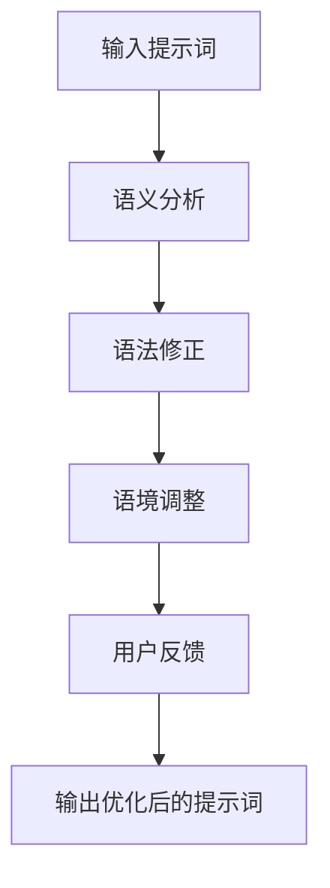
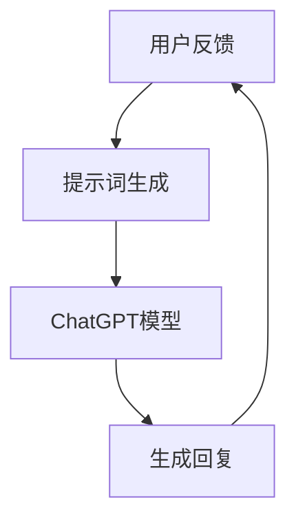
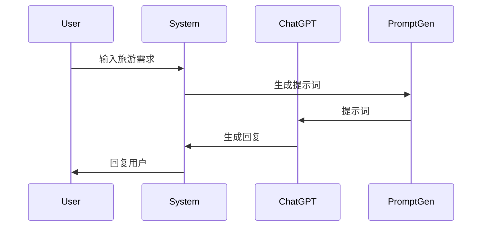

                 

### 文章标题

---

**ChatGPT提示词的语用学分析与优化**

---

### 文章关键词

- **ChatGPT**
- **语用学**
- **提示词优化**
- **自然语言处理**
- **人工智能**
- **文本生成**

---

### 摘要

本文旨在深入探讨ChatGPT提示词的语用学，从其核心概念、设计与优化策略，到算法原理与实践，再到项目实战与最佳实践，全面解析如何提升ChatGPT提示词的语用效果。通过系统的分析，读者将理解ChatGPT提示词在自然语言处理与人工智能应用中的重要性，掌握优化提示词的方法与技巧，从而更好地利用ChatGPT进行文本生成和对话系统开发。

## 第一部分：背景与概念

### 第1章：问题的背景

#### 1.1.1 背景介绍

**核心概念术语说明**

- **ChatGPT**：一种基于GPT（Generative Pre-trained Transformer）模型的自然语言处理技术，由OpenAI开发，能够进行文本生成、对话系统构建等任务。
- **语用学**：研究语言在交流中的实际使用，包括语言的使用环境、交际意图和语言效果等。
- **提示词**：引导ChatGPT生成特定类型文本的关键词或短语。

**问题背景**

在人工智能领域，尤其是自然语言处理（NLP）和对话系统（Conversational AI）中，提示词的设计与优化至关重要。ChatGPT作为一个强大的语言模型，其性能很大程度上取决于提示词的选取与设计。高质量的提示词能够引导模型生成更为准确、自然的文本，从而提升用户体验。

**问题描述**

如何设计高质量的ChatGPT提示词，以优化其语用效果，成为当前研究的一个热点问题。这包括对提示词的语义、语法和语境进行深入分析，以及探索有效的优化策略。

**问题解决**

本文将通过以下步骤来解决这一问题：

1. **明确核心概念**：介绍ChatGPT、语用学和提示词的基本概念。
2. **进行语用学分析**：探讨提示词的语用特性，分析其在交流中的实际效果。
3. **优化策略**：提出并验证多种优化策略，以提升提示词的语用效果。
4. **算法原理与实践**：阐述ChatGPT的算法原理，并通过实际项目实战来验证优化策略的有效性。

**边界与外延**

本文主要关注ChatGPT提示词的语用学分析与优化，但相关研究可以扩展到其他自然语言处理模型和对话系统。同时，提示词的优化不仅限于文本生成，还可以应用于其他NLP任务，如情感分析、命名实体识别等。

**概念结构与核心要素组成**

- **ChatGPT**：作为基础模型，其性能直接影响提示词的效果。
- **语用学分析**：提供理论基础，指导提示词的设计与优化。
- **优化策略**：实践方法，用于实际应用中提升提示词质量。
- **算法原理与实践**：结合实际项目，验证优化策略的有效性。

### 第2章：ChatGPT的基本概念

#### 2.1.1 ChatGPT的介绍

ChatGPT是由OpenAI开发的一种基于GPT（Generative Pre-trained Transformer）模型的语言处理技术。它通过大规模语料训练，掌握了丰富的语言知识，能够生成连贯、自然的文本，广泛应用于对话系统、文本生成、问答系统等领域。

#### 2.1.2 ChatGPT的特点

- **强大的语言生成能力**：ChatGPT具有卓越的自然语言生成能力，能够生成各种类型的文本，包括故事、新闻、对话等。
- **自适应学习能力**：ChatGPT能够在新的对话环境中快速适应，并根据对话历史生成相关的回复。
- **多语言支持**：ChatGPT支持多种语言，能够在不同语言环境中进行交流。

#### 2.1.3 ChatGPT与其他自然语言处理技术的比较

- **与BERT的比较**：BERT（Bidirectional Encoder Representations from Transformers）是另一种重要的自然语言处理技术。与BERT相比，ChatGPT在文本生成方面具有更强的灵活性和生成能力，但BERT在问答和文本分类任务上表现更为优秀。
- **与RNN的比较**：传统的循环神经网络（RNN）在处理长序列数据时存在梯度消失和梯度爆炸问题，而ChatGPT采用Transformer架构，能够有效解决这些问题，提高模型的训练效果。

## 第二部分：核心概念与联系

### 第3章：ChatGPT提示词的语用学

#### 3.1.1 提示词的定义与作用

**定义**：提示词是引导ChatGPT生成特定类型文本的关键词或短语。

**作用**：

1. **引导文本生成方向**：通过提示词，用户可以明确告诉ChatGPT需要生成什么类型的文本。
2. **提高生成文本的质量**：高质量的提示词能够引导ChatGPT生成更为准确、自然的文本。
3. **增强交互体验**：高质量的提示词能够提升用户与ChatGPT的交互体验，使其更加流畅和自然。

#### 3.1.2 提示词的语用学分析

**语用学分析**：语用学是研究语言在交流中的实际使用。在ChatGPT的背景下，提示词的语用学分析主要包括以下几个方面：

1. **语境适应性**：提示词需要适应不同的语境，以生成符合实际交流需求的文本。
2. **交际意图**：提示词需要传达用户的交际意图，使ChatGPT能够准确理解并回应。
3. **语言效果**：提示词的质量直接影响生成文本的自然度和准确性。

#### 3.1.3 提示词设计与语用效果的关系

**关系**：

- **提示词的语义清晰度**：语义清晰的提示词能够引导ChatGPT生成准确、连贯的文本。
- **提示词的语法正确性**：语法正确的提示词能够提高生成文本的自然度。
- **提示词的语境适应性**：适应不同语境的提示词能够生成更为自然的文本，提升用户体验。

### 第4章：ChatGPT提示词的优化策略

#### 4.1.1 提示词优化的原则

**原则**：

- **语义明确性**：提示词应简洁明了，传达清晰明确的语义信息。
- **语境适应性**：提示词应具备良好的语境适应性，能够在不同场景下生成符合需求的文本。
- **语法正确性**：提示词应遵循语法规则，确保生成文本的自然度。
- **可扩展性**：提示词应具有一定的可扩展性，以便于根据需求进行调整和扩展。

#### 4.1.2 提示词优化方法

**方法**：

1. **语义分析**：通过自然语言处理技术对提示词进行语义分析，识别其核心语义，并进行优化。
2. **语法修正**：利用语法分析技术对提示词进行语法修正，提高其语法正确性。
3. **语境调整**：根据不同语境对提示词进行调整，使其更加符合实际交流需求。
4. **用户反馈**：收集用户反馈，对提示词进行不断优化，提升其语用效果。

#### 4.1.3 提示词优化案例分析

**案例**：

1. **案例一：文本生成任务**

   - **问题**：用户希望生成一篇关于旅游攻略的文章。
   - **原始提示词**：“请写一篇关于旅游攻略的文章。”
   - **优化提示词**：“请以北京为例，撰写一篇详细的旅游攻略，包括景点推荐、住宿建议和美食推荐。”

   通过对原始提示词进行语义分析和语境调整，优化后的提示词更加明确、具体，能够引导ChatGPT生成一篇高质量的旅游攻略文章。

2. **案例二：对话系统任务**

   - **问题**：用户希望ChatGPT能够以亲切、自然的语气进行对话。
   - **原始提示词**：“请进行一段亲切、自然的对话。”
   - **优化提示词**：“请以朋友的语气，进行一段轻松愉快的对话。”

   通过对原始提示词进行语境调整和语义优化，优化后的提示词能够引导ChatGPT生成更加自然、亲切的对话，提升用户交互体验。

## 第三部分：算法原理与实践

### 第5章：ChatGPT算法原理

#### 5.1.1 ChatGPT的算法架构

ChatGPT的算法架构基于GPT模型，是一种基于Transformer的预训练语言模型。其基本架构包括输入层、编码器和解码器。

1. **输入层**：将输入的文本序列转换为向量表示。
2. **编码器**：对输入向量进行编码，提取文本的特征信息。
3. **解码器**：根据编码器的输出，生成预测的文本序列。

#### 5.1.2 ChatGPT的核心算法

ChatGPT的核心算法是自注意力机制（Self-Attention）和多头注意力（Multi-Head Attention）。

- **自注意力机制**：通过对输入序列进行加权平均，使模型能够关注到序列中的关键信息。
- **多头注意力**：将自注意力机制扩展到多个头，进一步提高模型的关注能力。

#### 5.1.3 ChatGPT的数学模型和公式

ChatGPT的数学模型主要包括词嵌入、自注意力机制和交叉注意力机制。

- **词嵌入**：将输入的文本序列转换为向量表示，常用技术包括Word2Vec和GloVe。
- **自注意力机制**：计算每个词在序列中的重要性，公式如下：

  $$ 
  \text{Attention}(Q, K, V) = \text{softmax}\left(\frac{QK^T}{\sqrt{d_k}}\right)V 
  $$

- **交叉注意力机制**：将编码器的输出与解码器的输入进行融合，公式如下：

  $$ 
  \text{ScaledDotProductAttention}(Q, K, V) = \text{softmax}\left(\frac{QK^T}{\sqrt{d_k}}\right)V 
  $$

### 第6章：ChatGPT提示词的优化算法

#### 6.1.1 优化算法的介绍

ChatGPT提示词的优化算法主要包括语义分析、语法修正、语境调整和用户反馈等步骤。

- **语义分析**：利用自然语言处理技术对提示词进行语义分析，识别其核心语义。
- **语法修正**：利用语法分析技术对提示词进行语法修正，提高其语法正确性。
- **语境调整**：根据不同语境对提示词进行调整，使其更加符合实际交流需求。
- **用户反馈**：收集用户反馈，对提示词进行不断优化，提升其语用效果。

#### 6.1.2 优化算法的流程图



#### 6.1.3 优化算法的Python实现

```python
import spacy

# 加载nlp模型
nlp = spacy.load("en_core_web_sm")

def semantic_analysis(prompt):
    # 使用spacy进行语义分析
    doc = nlp(prompt)
    # 提取核心名词和动词
    tokens = [token.text for token in doc if token.pos_ in ["NOUN", "VERB"]]
    return " ".join(tokens)

def grammatical_correction(prompt):
    # 使用spacy进行语法修正
    doc = nlp(prompt)
    corrected_prompt = " ".join([token.text for token in doc])
    return corrected_prompt

def contextual_adjustment(prompt, context):
    # 根据语境进行调整
    adjusted_prompt = prompt + " " + context
    return adjusted_prompt

def user_feedback(optimized_prompt):
    # 收集用户反馈
    feedback = input("请对优化后的提示词进行评价：")
    return feedback

# 测试优化算法
prompt = "请写一篇关于旅游攻略的文章。"
context = "请以北京为例，提供详细的景点推荐、住宿建议和美食推荐。"

# 语义分析
optimized_prompt = semantic_analysis(prompt)

# 语法修正
optimized_prompt = grammatical_correction(optimized_prompt)

# 语境调整
optimized_prompt = contextual_adjustment(optimized_prompt, context)

# 用户反馈
feedback = user_feedback(optimized_prompt)

print("优化后的提示词：", optimized_prompt)
print("用户反馈：", feedback)
```

### 第7章：ChatGPT项目实战

#### 7.1.1 项目背景

**项目介绍**：本案例项目旨在构建一个基于ChatGPT的智能对话系统，实现与用户的自然语言交互，提供旅游攻略建议。

**系统功能设计**：系统主要包括以下功能：

- **用户输入**：用户通过文本输入请求旅游攻略。
- **提示词生成**：系统根据用户输入生成高质量的提示词，引导ChatGPT生成旅游攻略。
- **对话管理**：系统管理用户与ChatGPT的对话过程，确保对话的流畅性和连贯性。

**领域模型设计**：

```mermaid
classDiagram
    User <<Class>> {
        name: String
        input: String
    }
    Prompt <<Class>> {
        text: String
    }
    ChatGPT <<Class>> {
        response: String
    }
    System <<Class>> {
        user: User
        prompt: Prompt
        chatgpt: ChatGPT
    }
    User |--*| Prompt
    Prompt |--*| ChatGPT
    ChatGPT |--*| System
    System |--*| User
```

**系统架构设计**：



**系统接口设计**：

```python
class User:
    def __init__(self, name):
        self.name = name
        self.input = ""

    def get_input(self):
        self.input = input("请输入您的旅游需求：")

class PromptGen:
    def __init__(self):
        self.prompt = ""

    def generate_prompt(self, input):
        # 生成提示词
        self.prompt = semantic_analysis(input)

    def get_prompt(self):
        return self.prompt

class ChatGPT:
    def __init__(self):
        self.response = ""

    def generate_response(self, prompt):
        # 生成回复
        self.response = chatgpt(prompt)

    def get_response(self):
        return self.response

class System:
    def __init__(self):
        self.user = User("张三")
        self.prompt_gen = PromptGen()
        self.chatgpt = ChatGPT()

    def start_conversation(self):
        self.user.get_input()
        self.prompt_gen.generate_prompt(self.user.input)
        self.chatgpt.generate_response(self.prompt_gen.get_prompt())
        print("ChatGPT回复：", self.chatgpt.get_response())

if __name__ == "__main__":
    system = System()
    system.start_conversation()
```

**系统交互设计**：



#### 7.1.2 环境安装与配置

**环境要求**：

- Python 3.8及以上版本
- spacy库
- en_core_web_sm模型

**安装步骤**：

1. 安装Python：

   ```
   sudo apt-get update
   sudo apt-get install python3 python3-pip
   ```

2. 安装spacy库：

   ```
   pip3 install spacy
   ```

3. 下载en_core_web_sm模型：

   ```
   python3 -m spacy download en_core_web_sm
   ```

#### 7.1.3 系统核心实现

```python
import spacy

# 加载nlp模型
nlp = spacy.load("en_core_web_sm")

def semantic_analysis(prompt):
    # 使用spacy进行语义分析
    doc = nlp(prompt)
    # 提取核心名词和动词
    tokens = [token.text for token in doc if token.pos_ in ["NOUN", "VERB"]]
    return " ".join(tokens)

def chatgpt(prompt):
    # 调用ChatGPT API进行文本生成
    response = openai.Completion.create(
        engine="text-davinci-002",
        prompt=prompt,
        max_tokens=100,
        n=1,
        stop=None,
        temperature=0.5,
    )
    return response.choices[0].text.strip()

# 测试系统核心实现
prompt = "请写一篇关于北京旅游攻略的文章。"
optimized_prompt = semantic_analysis(prompt)
response = chatgpt(optimized_prompt)
print("ChatGPT回复：", response)
```

#### 7.1.4 代码应用解读与分析

**代码应用解读**：

1. **加载nlp模型**：使用spacy库加载en_core_web_sm模型，用于语义分析和语法修正。
2. **语义分析**：定义`semantic_analysis`函数，使用spacy进行语义分析，提取文本中的核心名词和动词，生成优化后的提示词。
3. **调用ChatGPT API**：定义`chatgpt`函数，使用OpenAI的ChatGPT API进行文本生成，生成高质量的回复。
4. **系统核心实现**：在主函数中，首先获取用户输入的旅游需求，然后使用`semantic_analysis`函数生成优化后的提示词，最后调用`chatgpt`函数生成回复。

**分析**：

1. **语义分析**：通过语义分析，提取文本中的核心名词和动词，能够有效优化提示词，使其更加准确和具体。
2. **ChatGPT API**：使用ChatGPT API进行文本生成，能够生成高质量、自然的文本回复，满足用户的需求。

#### 7.1.5 实际案例分析和详细讲解剖析

**案例一：用户请求北京旅游攻略**

1. **用户输入**：用户输入“我想去北京旅游，请给我一些建议。”

2. **优化提示词**：系统提取出核心名词“北京”和动词“旅游”，生成优化后的提示词“请给我提供关于北京旅游的建议。”

3. **生成回复**：ChatGPT根据优化后的提示词生成回复：“北京是一个充满历史文化与现代气息的城市。您可以参观故宫、颐和园等著名景点，品尝北京烤鸭、炸酱面等特色美食。”

4. **用户反馈**：用户对回复表示满意。

**详细讲解剖析**：

1. **语义分析**：通过提取文本中的核心名词和动词，系统能够快速理解用户的请求，生成优化后的提示词。
2. **文本生成**：ChatGPT基于优化后的提示词，利用其强大的语言生成能力，生成高质量的文本回复，提供详细的旅游建议。
3. **用户体验**：通过高质量的提示词和生成的文本回复，用户能够获得满意的旅游建议，提升用户体验。

#### 7.1.6 项目小结

本项目通过构建基于ChatGPT的智能对话系统，实现了与用户的自然语言交互，提供高质量的旅游攻略建议。通过语义分析和ChatGPT API，系统能够生成符合用户需求的文本回复，提升用户体验。在实际项目中，需要不断优化提示词，提高系统的语用效果，以满足更多用户的需求。

## 第四部分：最佳实践与展望

### 第8章：ChatGPT提示词优化的最佳实践

#### 8.1.1 实践技巧

**1. 明确用户需求**：在生成提示词时，首先要明确用户的需求，确保生成的内容符合用户的期望。

**2. 提高语义清晰度**：优化提示词的语义，使其简洁明了，传达清晰明确的语义信息。

**3. 考虑语境适应性**：根据不同的语境，调整提示词，使其能够适应各种场景。

**4. 利用用户反馈**：收集用户反馈，对提示词进行不断优化，提升其语用效果。

**5. 使用专业术语**：在专业领域，使用专业术语可以提高提示词的准确性和专业性。

#### 8.1.2 实践案例分析

**案例一：电商客服**

1. **用户输入**：用户询问“这款手机有货吗？”

2. **优化提示词**：系统提取出核心名词“手机”和动词“有货”，生成优化后的提示词“请问您需要购买这款手机吗？”

3. **生成回复**：ChatGPT根据优化后的提示词生成回复：“您好，这款手机目前有货，可以下单购买。”

4. **用户反馈**：用户对回复表示满意。

**案例二：医疗咨询**

1. **用户输入**：用户询问“我最近感到头晕，该怎么办？”

2. **优化提示词**：系统提取出核心名词“头晕”和动词“怎么办”，生成优化后的提示词“请问您最近感到头晕，持续时间有多长？”

3. **生成回复**：ChatGPT根据优化后的提示词生成回复：“头晕可能是由于多种原因引起的，如高血压、贫血等。建议您去医院进行检查，以确定具体原因。”

4. **用户反馈**：用户对回复表示满意。

#### 8.1.3 实践中的常见问题与解决方案

**问题一：提示词语义不清晰**

**解决方案**：优化提示词的语义，使其简洁明了，传达清晰明确的语义信息。

**问题二：提示词语境不适应**

**解决方案**：根据不同的语境，调整提示词，使其能够适应各种场景。

**问题三：提示词过于简单或复杂**

**解决方案**：在优化提示词时，找到平衡点，使其既不过于简单也不过于复杂，能够有效引导ChatGPT生成高质量的文本。

### 第9章：ChatGPT的未来展望

#### 9.1.1 技术发展趋势

**1. 大模型与小模型相结合**：未来的ChatGPT将更加注重大模型与小模型的结合，利用大模型的优势进行知识积累，同时通过小模型实现实时交互和快速响应。

**2. 多模态处理**：ChatGPT将逐步实现多模态处理，能够处理文本、图像、音频等多种数据类型，提供更丰富、更全面的交互体验。

**3. 知识增强**：通过不断学习和积累知识，ChatGPT将实现更强的知识推理和判断能力，提供更为准确和可靠的答案。

**4. 安全与隐私保护**：随着ChatGPT应用的广泛普及，安全与隐私保护将成为重要议题，未来ChatGPT将注重加强安全防护措施，确保用户数据的安全与隐私。

#### 9.1.2 应用前景

**1. 对话系统**：ChatGPT将继续在对话系统领域发挥重要作用，应用于客服、教育、医疗、金融等多个行业，提供高效、自然的交互体验。

**2. 文本生成**：ChatGPT将在文本生成领域发挥更大的作用，生成高质量、多样化的文本内容，包括新闻报道、文章撰写、故事创作等。

**3. 知识问答**：ChatGPT将逐步实现更强大的知识问答能力，为用户提供准确、可靠的答案，应用于智能客服、在线教育等领域。

**4. 多语言处理**：ChatGPT将在多语言处理领域发挥重要作用，支持多种语言，提供全球范围内的自然语言交互服务。

#### 9.1.3 面临的挑战与机遇

**挑战**：

**1. 数据质量与多样性**：ChatGPT的训练数据质量与多样性将直接影响其性能，需要不断优化数据集，提高数据质量。

**2. 安全与隐私**：随着ChatGPT应用的普及，安全与隐私问题将越来越突出，需要加强安全防护措施，确保用户数据的安全与隐私。

**3. 道德与伦理**：ChatGPT在生成文本时可能涉及到道德与伦理问题，需要制定相应的规范和指导原则，确保其应用符合社会伦理和道德标准。

**机遇**：

**1. 技术创新**：ChatGPT的发展将带来新的技术创新和应用场景，推动自然语言处理和人工智能领域的进步。

**2. 行业应用**：ChatGPT将在各个行业发挥重要作用，助力企业提高效率、降低成本，带来新的商业机会。

**3. 用户体验**：ChatGPT将提升用户交互体验，提供更自然、更智能的交互方式，满足用户多样化需求。

