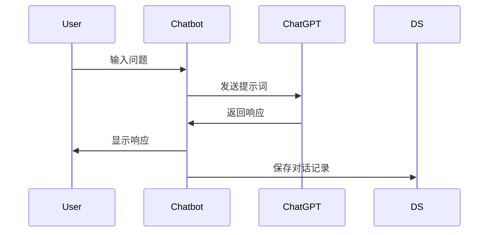

                 


### ChatGPT提示词的跨平台兼容性设计

#### 关键词

- ChatGPT
- 提示词设计
- 跨平台兼容性
- 算法原理
- 系统架构设计
- 数学模型

#### 摘要

本文将深入探讨ChatGPT提示词的跨平台兼容性设计。我们将从背景介绍、核心概念与联系、算法原理讲解、系统分析与架构设计方案、项目实战以及最佳实践与总结六个方面逐步分析，以期为开发者在实现ChatGPT应用时提供有价值的参考。

---

## 第一部分：背景介绍

### 第1章：问题背景与定义

#### 1.1 问题背景

ChatGPT（Generative Pre-trained Transformer）是由OpenAI开发的一种基于变换器模型的自然语言处理工具。由于其出色的性能和广泛的应用前景，ChatGPT受到了全球开发者的青睐。然而，随着ChatGPT应用的推广，如何在不同的平台和操作系统上实现兼容性成为了一个亟待解决的问题。

#### 1.1.1 ChatGPT的发展与应用现状

自2018年发布以来，ChatGPT在自然语言处理领域取得了显著的成就。它被广泛应用于聊天机器人、文本生成、机器翻译、对话系统等领域。然而，随着应用的扩展，如何在不同的硬件和软件环境下确保ChatGPT的稳定运行和高效性能，成为了一个重要的研究课题。

#### 1.1.2 跨平台兼容性的重要性

跨平台兼容性是指软件在不同的操作系统、硬件平台和软件环境下能够正常运行的能力。对于ChatGPT这样的自然语言处理工具，跨平台兼容性尤为重要。一方面，它可以确保ChatGPT在不同平台上的一致性；另一方面，它可以提高开发效率，降低维护成本。

#### 1.2 定义与概念

##### 1.2.1 ChatGPT提示词

ChatGPT提示词（Prompt）是触发ChatGPT进行对话或生成文本的关键输入。它通常包含一个或多个引导性问题或指令，用以引导ChatGPT生成特定的回答或输出。

##### 1.2.2 跨平台兼容性

跨平台兼容性（Cross-Platform Compatibility）是指软件在不同操作系统、硬件平台和软件环境下能够正常运行的能力。实现跨平台兼容性通常需要考虑操作系统差异、硬件差异和软件环境的兼容性。

#### 1.3 边界与外延

##### 1.3.1 提示词设计的核心要素

提示词设计的核心要素包括：语义清晰、结构合理、引导性明确。这些要素对于ChatGPT的准确理解和有效生成至关重要。

##### 1.3.2 跨平台兼容性的挑战

跨平台兼容性面临的挑战包括：操作系统差异、硬件差异、软件环境差异、网络环境差异等。如何应对这些挑战是实现跨平台兼容性的关键。

---

## 第二部分：核心概念与联系

### 第2章：核心概念与联系

#### 2.1 核心概念原理

##### 2.1.1 提示词设计原理

提示词设计的核心原理是确保输入的语义明确，引导ChatGPT生成期望的输出。这通常需要结合自然语言处理技术和对话系统设计原理。

##### 2.1.2 跨平台兼容性原理

跨平台兼容性的核心原理是确保软件在不同操作系统、硬件平台和软件环境下的一致性和稳定性。这通常需要采用跨平台开发框架和标准化技术。

#### 2.2 概念属性特征对比表格

##### 2.2.1 ChatGPT提示词属性特征

| 属性       | 描述                                     |
| ---------- | ---------------------------------------- |
| 语义明确   | 提示词应能够清晰地传达用户意图。         |
| 结构合理   | 提示词应具有合理的语法和结构，便于理解。  |
| 引导性明确 | 提示词应明确引导ChatGPT生成期望的输出。  |

##### 2.2.2 跨平台兼容性属性特征

| 属性       | 描述                                     |
| ---------- | ---------------------------------------- |
| 操作系统兼容性 | 软件在不同操作系统（如Windows、Linux、macOS）上能够正常运行。 |
| 硬件兼容性 | 软件在不同硬件平台上（如不同CPU架构、GPU架构）上能够正常运行。 |
| 软件环境兼容性 | 软件在不同软件环境（如不同编程语言版本、库版本）下能够正常运行。 |

#### 2.3 ER实体关系图架构

##### 2.3.1 ChatGPT提示词实体关系

```mermaid
classDiagram
    Prompt <|-- ChatGPT
    Prompt o---> UserInput
    Prompt o---> Response
```

##### 2.3.2 跨平台兼容性实体关系

```mermaid
classDiagram
    SoftwareApp <|-- CrossPlatformCompatibility
    SoftwareApp o---> OS
    SoftwareApp o---> Hardware
    SoftwareApp o---> SoftwareEnvironment
```

---

## 第三部分：算法原理讲解

### 第3章：算法原理与数学模型

#### 3.1 提示词生成算法

##### 3.1.1 算法原理

提示词生成算法的核心原理是基于预训练的变换器模型（如GPT-3）对输入文本进行分析，并根据分析结果生成提示词。该算法通常包括以下几个步骤：

1. 对输入文本进行预处理，如分词、去停用词等。
2. 使用预训练变换器模型对输入文本进行编码。
3. 根据编码结果生成提示词。

##### 3.1.2 数学模型

提示词生成算法的数学模型主要基于变换器模型。变换器模型的核心思想是使用多层神经网络对输入文本进行编码和解码。数学模型可以表示为：

$$
\text{Output} = \text{Decoder}(\text{Encoder}(\text{Input}))
$$

其中，Encoder和Decoder分别表示编码和解码网络，Input表示输入文本，Output表示生成的提示词。

##### 3.1.3 举例说明

假设输入文本为“今天天气很好，适合户外活动。”，我们可以通过以下步骤生成提示词：

1. 对输入文本进行预处理，得到分词结果：["今天", "天气", "很好", "，", "适合", "户外", "活动", "。"]
2. 使用预训练变换器模型对分词结果进行编码，得到编码结果。
3. 根据编码结果生成提示词：“今天天气很好，适合户外活动。”

#### 3.2 跨平台兼容性算法

##### 3.2.1 算法原理

跨平台兼容性算法的核心原理是确保软件在不同操作系统、硬件平台和软件环境下的一致性和稳定性。该算法通常包括以下几个步骤：

1. 识别目标平台，如操作系统、硬件平台、软件环境等。
2. 根据目标平台的特点进行适配，如调整系统参数、替换硬件驱动等。
3. 在目标平台上运行软件，并进行性能测试。

##### 3.2.2 数学模型

跨平台兼容性算法的数学模型主要基于概率模型。概率模型的核心思想是使用概率分布来描述软件在不同平台上的行为。数学模型可以表示为：

$$
P(\text{Platform}|\text{Software}) = \frac{P(\text{Software}|\text{Platform}) \cdot P(\text{Platform})}{P(\text{Software})}
$$

其中，Platform表示平台，Software表示软件，P(Platform|Software)表示软件在平台上的概率，P(Software|Platform)表示平台上的软件的概率，P(Platform)表示平台的概率。

##### 3.2.3 举例说明

假设我们有一个软件需要在Windows、Linux和macOS三个平台上运行，我们可以通过以下步骤实现跨平台兼容性：

1. 识别目标平台，如Windows、Linux和macOS。
2. 根据目标平台的特点，调整系统参数，如设置不同的系统环境变量。
3. 在目标平台上运行软件，并进行性能测试，以确保软件在不同平台上的稳定性和一致性。

---

## 第四部分：系统分析与架构设计方案

### 第4章：系统分析与架构设计方案

#### 4.1 问题场景介绍

假设我们需要开发一个基于ChatGPT的聊天机器人，该机器人需要支持Windows、Linux和macOS三个平台。为了实现跨平台兼容性，我们需要设计一个合适的系统架构。

#### 4.2 系统功能设计

##### 4.2.1 领域模型Mermaid类图

```mermaid
classDiagram
    Chatbot <<interface>> ChatGPT
    Chatbot o---> UserInterface
    Chatbot o---> DataStore
    ChatGPT o---> PromptGenerator
    ChatGPT o---> ResponseGenerator
```

#### 4.3 系统架构设计

##### 4.3.1 Mermaid架构图

```mermaid
graph TB
    subgraph Chatbot
        Chatbot[Chatbot]
        UI[UserInterface]
        DS[DataStore]
    end
    subgraph ChatGPT
        GPT[ChatGPT]
        PG[PromptGenerator]
        RG[ResponseGenerator]
    end
    Chatbot -->|Input| GPT
    GPT -->|Generate| PG
    PG -->|Generate| RG
    RG -->|Output| UI
    UI -->|Input| DS
```

#### 4.4 系统接口设计

系统接口设计包括以下部分：

1. 用户接口（UI）：用于接收用户输入和显示机器人输出。
2. 数据存储（DS）：用于存储用户数据和历史对话记录。
3. ChatGPT接口：用于与ChatGPT进行通信，发送提示词和接收响应。

#### 4.5 系统交互Mermaid序列图



---

## 第五部分：项目实战

### 第5章：环境安装与系统核心实现

#### 5.1 环境安装

为了实现跨平台兼容性，我们选择使用Python作为开发语言，并使用TensorFlow作为后端模型库。以下是环境安装步骤：

1. 安装Python 3.8及以上版本。
2. 安装TensorFlow 2.6及以上版本。
3. 安装其他依赖库，如NumPy、Pandas等。

#### 5.2 系统核心实现源代码

以下是一个简单的ChatGPT聊天机器人实现示例：

```python
import tensorflow as tf
from transformers import ChatGPT

# 初始化ChatGPT模型
model = ChatGPT.from_pretrained("openai/chatgpt")

# 定义聊天机器人
class Chatbot:
    def __init__(self):
        self.chatgpt = model

    def get_response(self, input_text):
        response = self.chatgpt.generate(input_text)
        return response

# 测试
chatbot = Chatbot()
user_input = "你好，今天天气如何？"
response = chatbot.get_response(user_input)
print("机器人回复：", response)
```

#### 5.3 代码应用解读与分析

1. 首先，我们从Hugging Face模型库中加载预训练的ChatGPT模型。
2. 然后，我们定义了一个Chatbot类，该类有一个get_response方法，用于接收用户输入并返回机器人响应。
3. 在测试部分，我们创建了一个Chatbot实例，并使用用户输入调用get_response方法，获取并打印机器人响应。

#### 5.4 实际案例分析与详细讲解剖析

在实际应用中，我们需要考虑如何实现跨平台兼容性。以下是几个关键点：

1. **模型加载**：我们需要确保在不同平台上加载相同的模型权重。这可以通过在云端训练模型并使用模型权重共享来实现。
2. **接口兼容性**：我们需要确保Chatbot类的接口在不同平台上保持一致。这可以通过使用抽象接口或设计模式来实现。
3. **依赖管理**：我们需要确保在不同平台上安装相同的依赖库。这可以通过使用容器化技术（如Docker）来实现。

#### 5.5 项目小结

通过本文的探讨，我们了解了ChatGPT提示词的跨平台兼容性设计。在实际项目中，我们需要考虑模型加载、接口兼容性和依赖管理等方面的问题，以确保ChatGPT在不同平台上的稳定运行。

---

## 第六部分：最佳实践与总结

### 第6章：最佳实践 Tips

#### 6.1 提示词设计最佳实践

1. **语义清晰**：确保提示词能够准确传达用户意图。
2. **结构合理**：确保提示词的语法和结构合理，易于理解。
3. **引导性明确**：确保提示词能够引导ChatGPT生成期望的输出。

#### 6.2 跨平台兼容性最佳实践

1. **使用跨平台开发框架**：如Flutter、React Native等，可以简化跨平台开发。
2. **容器化技术**：如Docker，可以确保在不同平台上安装相同的依赖库和环境。
3. **自动化测试**：编写自动化测试脚本，确保在不同平台上测试软件的一致性。

### 第7章：小结与注意事项

#### 7.1 总结

本文深入探讨了ChatGPT提示词的跨平台兼容性设计。我们从背景介绍、核心概念与联系、算法原理讲解、系统分析与架构设计方案、项目实战以及最佳实践与总结等方面进行了详细分析。

#### 7.2 注意事项

1. 在实现跨平台兼容性时，务必确保模型加载、接口兼容性和依赖管理。
2. 跨平台兼容性测试应覆盖不同操作系统、硬件平台和软件环境。
3. 提示词设计应注重语义清晰、结构合理和引导性明确。

#### 7.3 拓展阅读

1. [OpenAI ChatGPT官方文档](https://openai.com/docs/)
2. [跨平台开发框架介绍](https://flutter.dev/docs/get-started/overview)
3. [Docker容器化技术](https://www.docker.com/products/docker-desktop)

---

作者：AI天才研究院/AI Genius Institute & 禅与计算机程序设计艺术 /Zen And The Art of Computer Programming

