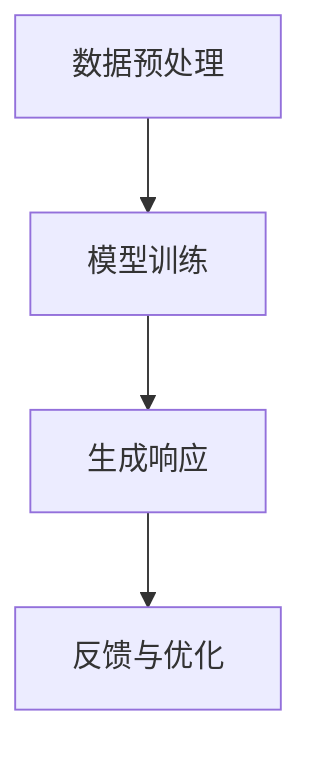
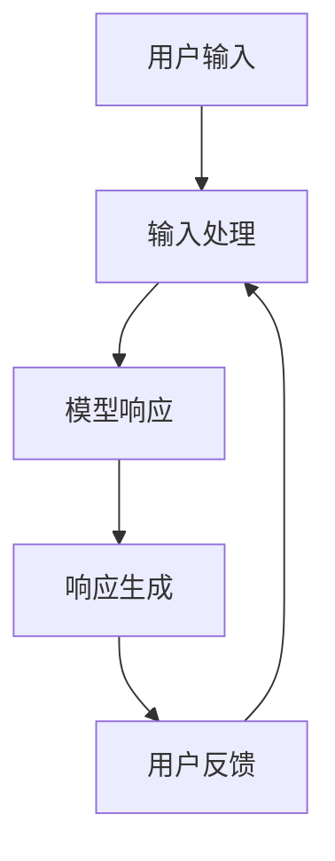
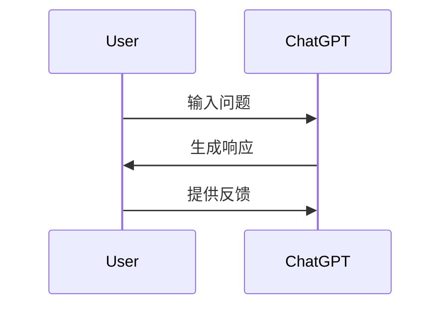

                 

# 《ChatGPT提示词的道德与偏见问题探讨》

## 关键词
- ChatGPT
- 提示词
- 道德
- 偏见
- AI伦理

## 摘要
本文将深入探讨ChatGPT提示词在道德和偏见问题上的复杂性。首先，我们将简要介绍ChatGPT及其工作原理。接着，本文将详细分析提示词在道德和偏见问题上的双重影响，并探讨可能引发这些问题的原因。随后，我们将通过具体案例研究来展示这些问题在实际应用中的表现。最后，我们将提出一些可能的解决方案和未来研究方向，为解决ChatGPT提示词的道德与偏见问题提供思路。

## 目录

### 第一章 引言

- **1.1 研究背景**
- **1.2 研究目的与意义**
- **1.3 研究方法**

### 第二章 ChatGPT背景知识

- **2.1 ChatGPT的发展历程**
- **2.2 ChatGPT的核心技术**
- **2.3 ChatGPT的应用场景**

### 第三章 ChatGPT提示词的道德问题

- **3.1 提示词的定义与作用**
- **3.2 提示词在道德问题上的体现**
- **3.3 道德问题的原因分析**

### 第四章 ChatGPT提示词的偏见问题

- **4.1 偏见的定义与类型**
- **4.2 ChatGPT提示词中的偏见现象**
- **4.3 偏见问题的原因分析**

### 第五章 案例研究：ChatGPT提示词的道德与偏见问题

- **5.1 案例一：性别偏见**
- **5.2 案例二：种族偏见**
- **5.3 案例三：文化偏见**

### 第六章 解决方案与未来研究方向

- **6.1 道德问题的解决方案**
- **6.2 偏见问题的解决方案**
- **6.3 未来研究方向**

### 第七章 结论

- **7.1 研究成果总结**
- **7.2 研究局限与展望**

### 第八章 参考文献

- **8.1 学术论文**
- **8.2 图书资料**
- **8.3 网络资源**

## 文章正文

### 第一章 引言

### 1.1 研究背景

近年来，人工智能（AI）技术的发展迅猛，其中自然语言处理（NLP）领域的突破尤为显著。ChatGPT作为一款基于GPT-3模型的对话系统，因其强大的语言生成能力和广泛的应用前景而受到广泛关注。然而，随着ChatGPT的应用越来越广泛，其提示词的道德和偏见问题也逐渐成为学术界和产业界关注的焦点。

在道德方面，提示词的使用可能涉及到伦理问题，如隐私泄露、虚假信息传播、性别歧视等。这些问题不仅影响用户的信任度，也可能对社会产生负面影响。在偏见方面，提示词的选择和设计可能放大或固化某些偏见，导致不公平的结果。例如，性别偏见可能导致女性用户获得的信息质量降低，种族偏见可能导致某些群体的权益受损。

### 1.2 研究目的与意义

本研究旨在深入探讨ChatGPT提示词在道德和偏见问题上的复杂性，分析其产生的原因，并提出相应的解决方案。具体来说，本研究有以下几点目的：

1. **了解ChatGPT的基本原理和特点**：通过回顾ChatGPT的发展历程和核心技术，为后续讨论提供理论基础。
2. **探讨道德问题**：分析提示词在道德问题上的体现，如隐私保护、信息真实性和性别歧视等，探讨其原因和影响。
3. **分析偏见问题**：研究提示词中可能存在的偏见现象，如性别偏见、种族偏见和文化偏见，探讨其产生的原因和影响。
4. **提出解决方案**：针对道德和偏见问题，提出可能的解决方案和改进措施，为ChatGPT的应用提供指导。

本研究的意义在于：

1. **提高ChatGPT的应用安全性和可靠性**：通过解决道德和偏见问题，提高用户对ChatGPT的信任度，促进其广泛应用。
2. **推动AI伦理研究**：为AI伦理研究提供新的视角和实践案例，促进AI伦理的规范化和发展。
3. **促进社会公平**：通过减少偏见，提高不同群体获得信息的公平性，促进社会和谐。

### 1.3 研究方法

本研究采用以下研究方法：

1. **文献综述**：通过回顾相关文献，了解ChatGPT的发展历程、核心技术、应用场景以及道德和偏见问题的相关研究。
2. **案例分析法**：选择典型的道德和偏见案例，深入分析其产生的原因和影响。
3. **理论分析**：结合伦理学和心理学理论，对道德和偏见问题进行深入探讨。
4. **解决方案设计**：根据分析结果，提出可能的解决方案和改进措施。

### 第二章 ChatGPT背景知识

### 2.1 ChatGPT的发展历程

ChatGPT是OpenAI在2022年推出的一款基于GPT-3模型的对话系统。GPT-3（Generative Pre-trained Transformer 3）是OpenAI开发的一种大型语言模型，它基于Transformer架构，具有极高的语言生成能力和理解能力。ChatGPT则是在GPT-3的基础上，通过精细调整和优化，使其能够更自然、流畅地与用户进行对话。

ChatGPT的推出标志着自然语言处理技术的重大突破。在此之前，虽然已经有许多优秀的对话系统，但它们大多依赖于特定的应用场景和对话模式，难以实现广泛的通用对话。而ChatGPT的出现，打破了这一局限，使得对话系统能够处理更复杂、更自然的人类语言。

ChatGPT的发展历程可以追溯到2018年，当时OpenAI推出了GPT-2模型。GPT-2是一种基于Transformer架构的大型语言模型，它在自然语言处理任务中表现出色，但因其生成内容的风险性，OpenAI决定不发布完整的模型参数。这一决定引发了学术界和产业界对于AI安全的广泛关注。

在GPT-2的基础上，OpenAI继续进行技术迭代，最终推出了GPT-3。GPT-3具有1750亿个参数，是当时最大的语言模型。它能够理解、生成和处理复杂的人类语言，为自然语言处理带来了新的可能。

ChatGPT的推出，进一步提升了GPT-3的性能。通过精细调整和优化，ChatGPT能够更自然、流畅地与用户进行对话，回答用户的问题，甚至进行有意义的对话。ChatGPT的成功，也标志着自然语言处理技术进入了一个新的阶段。

### 2.2 ChatGPT的核心技术

ChatGPT的核心技术是基于GPT-3模型。GPT-3是一种基于Transformer架构的大型语言模型，其核心技术包括以下几个方面：

1. **Transformer架构**：Transformer是一种基于自注意力机制的神经网络架构，它通过计算输入序列中各个位置之间的注意力权重，实现对输入序列的建模。与传统的循环神经网络（RNN）相比，Transformer具有更强大的并行处理能力，能够更好地处理长距离依赖问题。

2. **自注意力机制**：自注意力机制是Transformer的核心组成部分，它通过计算输入序列中各个位置之间的注意力权重，实现对输入序列的建模。自注意力机制能够自动学习输入序列中各个位置之间的相关性，从而提高模型的表示能力。

3. **预训练与微调**：GPT-3模型采用了一种称为“预训练+微调”的训练策略。在预训练阶段，模型通过大量无监督数据（如互联网文本）进行训练，学习语言的统计规律和结构。在微调阶段，模型根据具体任务进行有监督训练，调整模型的参数，使其适应特定任务。

4. **大规模参数**：GPT-3模型具有1750亿个参数，是当时最大的语言模型。大规模参数使得模型能够更好地捕捉语言的复杂性和多样性，从而提高其生成能力和理解能力。

通过这些核心技术，GPT-3能够实现强大的语言生成和理解能力，为ChatGPT的应用提供了坚实的基础。

### 2.3 ChatGPT的应用场景

ChatGPT的应用场景非常广泛，包括但不限于以下几个方面：

1. **客户服务**：ChatGPT可以作为智能客服系统，为用户提供实时、个性化的回答。例如，在电商平台上，ChatGPT可以帮助用户解答关于商品信息、订单状态等方面的问题，提高客户满意度。

2. **教育辅导**：ChatGPT可以帮助学生解答学习中的问题，提供个性化的辅导。例如，在教育平台中，ChatGPT可以根据学生的学习情况，为学生推荐适合的学习资源，解答学习中的疑问。

3. **内容创作**：ChatGPT可以作为内容创作者的助手，帮助生成文章、报告、广告等。例如，在新闻行业中，ChatGPT可以自动生成新闻报道，提高新闻生产的效率。

4. **心理咨询**：ChatGPT可以作为心理咨询服务工具，为用户提供情感支持和心理咨询。例如，在心理健康平台中，ChatGPT可以帮助用户解答心理问题，提供情绪支持和建议。

5. **娱乐互动**：ChatGPT可以作为聊天机器人，与用户进行有趣的对话，提供娱乐体验。例如，在社交平台上，ChatGPT可以与用户进行有趣的对话，增加用户的互动体验。

ChatGPT的应用场景丰富多样，其强大的语言生成能力和理解能力使其成为各行业的重要工具。然而，随着应用范围的扩大，ChatGPT的道德和偏见问题也日益突出，需要引起足够的重视。

### 第三章 ChatGPT提示词的道德问题

### 3.1 提示词的定义与作用

在自然语言处理中，提示词（Prompt）是指用于引导模型生成输出的一组关键词或短语。提示词的作用是向模型提供上下文信息，帮助模型更好地理解用户的需求，从而生成更准确、更相关的输出。

ChatGPT作为一款对话系统，其工作流程可以分为以下几个步骤：

1. **接收输入**：用户通过输入文本或语音与ChatGPT进行交互。
2. **处理输入**：ChatGPT对用户的输入进行处理，包括语音识别、文本预处理等。
3. **生成响应**：根据用户的输入和处理结果，ChatGPT生成响应文本，并通过文本生成模块输出。
4. **返回结果**：将生成的响应文本返回给用户。

在这一过程中，提示词起到了至关重要的作用。提示词不仅决定了ChatGPT的响应内容，还影响了其响应的质量和准确性。因此，合理设计提示词对于提高ChatGPT的性能和用户体验具有重要意义。

### 3.2 提示词在道德问题上的体现

ChatGPT提示词的道德问题主要体现在以下几个方面：

1. **隐私泄露**：ChatGPT作为一款对话系统，需要处理大量的用户输入和输出。如果提示词设计不当，可能会导致用户隐私的泄露。例如，用户在咨询医疗问题时，可能会无意中透露自己的个人健康信息。这些信息如果被恶意使用，可能会对用户造成严重后果。

2. **虚假信息传播**：ChatGPT的生成能力强大，但同时也存在生成虚假信息的风险。如果提示词引导模型生成不实内容，可能会导致虚假信息的传播。这不仅会影响用户的判断和决策，还可能对社会造成负面影响。

3. **性别歧视**：ChatGPT的提示词可能包含性别偏见，导致性别歧视问题。例如，在某些对话中，ChatGPT可能会对女性用户使用带有歧视性的语言，或者对女性提出不公平的问题。这会导致女性用户获得的信息质量降低，甚至损害其权益。

4. **文化冲突**：ChatGPT在不同文化背景下的表现可能有所不同。如果提示词设计不当，可能会导致文化冲突。例如，在某些文化中，某些话题可能被认为是敏感或禁忌的，但如果提示词引导模型讨论这些话题，可能会引发争议和冲突。

5. **伦理冲突**：ChatGPT在处理某些伦理问题时，可能会面临伦理冲突。例如，在医疗咨询中，ChatGPT需要平衡患者的利益和社会责任。如果提示词设计不当，可能会导致ChatGPT在处理这些问题时出现偏差。

### 3.3 道德问题的原因分析

ChatGPT提示词道德问题的产生原因可以从以下几个方面进行分析：

1. **数据集问题**：ChatGPT的训练数据集可能包含不公平、偏见或歧视性的内容。这些内容可能在提示词中体现出来，导致ChatGPT在生成响应时出现道德问题。

2. **算法设计**：ChatGPT的算法设计可能没有充分考虑道德和伦理问题。例如，算法可能过于追求生成能力，而忽略了道德和伦理的约束。这可能导致ChatGPT在处理某些问题时出现道德问题。

3. **提示词设计**：提示词的设计可能存在缺陷，导致ChatGPT生成不合适的内容。例如，提示词可能过于具体或模糊，使得ChatGPT无法准确理解用户的需求，从而生成不当的响应。

4. **用户行为**：用户在交互过程中，可能会无意中透露敏感信息，或者提出带有偏见的问题。这些问题如果被ChatGPT生成响应，可能会导致道德问题。

5. **监管不足**：目前，对于ChatGPT等人工智能系统的道德和伦理监管尚不完善。缺乏明确的监管标准和规范，可能导致ChatGPT在处理道德问题时出现漏洞。

为了解决ChatGPT提示词的道德问题，需要从数据集、算法设计、提示词设计、用户行为和监管等多个方面进行综合考量，制定相应的解决方案和改进措施。

### 第四章 ChatGPT提示词的偏见问题

### 4.1 偏见的定义与类型

偏见是指对某个群体或个体持有的一种不合理的、片面的或主观的观点或态度。在ChatGPT的提示词中，偏见问题主要体现在以下几个方面：

1. **性别偏见**：性别偏见是指对男性和女性持有不同的观点或态度。例如，ChatGPT可能会在对话中表现出对女性的不公平待遇，或者使用带有性别歧视的语言。

2. **种族偏见**：种族偏见是指对某个种族持有的一种不公平、歧视性的观点或态度。例如，ChatGPT可能会在对话中表现出对某个种族的偏见，或者对某些种族的问题给予不公平的回应。

3. **文化偏见**：文化偏见是指对某个文化持有的一种不公平、歧视性的观点或态度。例如，ChatGPT可能会在对话中表现出对某个文化的偏见，或者对某些文化的问题给予不公平的回应。

4. **年龄偏见**：年龄偏见是指对某个年龄段持有的一种不公平、歧视性的观点或态度。例如，ChatGPT可能会在对话中表现出对年轻人的不公平待遇，或者对老年人的偏见。

5. **宗教偏见**：宗教偏见是指对某个宗教持有的一种不公平、歧视性的观点或态度。例如，ChatGPT可能会在对话中表现出对某个宗教的偏见，或者对宗教问题的不公平回应。

这些偏见问题可能会导致ChatGPT在对话中生成不合适的内容，影响用户的体验和信任度。因此，理解和解决ChatGPT的偏见问题具有重要意义。

### 4.2 ChatGPT提示词中的偏见现象

ChatGPT提示词中的偏见现象主要表现在以下几个方面：

1. **性别偏见**：在许多情况下，ChatGPT可能会对女性用户表现出不公平的待遇。例如，当女性用户提出问题时，ChatGPT可能会使用带有性别歧视的语言，或者对女性用户的问题给予不公平的回应。这种现象在医疗咨询、法律咨询等敏感领域尤为突出。

2. **种族偏见**：ChatGPT可能会在对话中表现出对某些种族的偏见。例如，当用户来自某个特定种族时，ChatGPT可能会使用带有歧视性的语言，或者对种族问题给予不公平的回应。这种现象可能导致用户感到被冒犯，甚至影响用户对ChatGPT的信任。

3. **文化偏见**：ChatGPT可能会在对话中表现出对某些文化的偏见。例如，当用户来自某个特定文化背景时，ChatGPT可能会使用带有文化歧视的语言，或者对文化问题给予不公平的回应。这种现象可能导致跨文化交流出现障碍，影响用户的沟通体验。

4. **年龄偏见**：ChatGPT可能会在对话中表现出对某个年龄段的偏见。例如，当用户属于某个特定年龄段时，ChatGPT可能会使用带有年龄歧视的语言，或者对年龄问题给予不公平的回应。这种现象可能导致用户感到被歧视，影响用户的满意度。

5. **宗教偏见**：ChatGPT可能会在对话中表现出对某个宗教的偏见。例如，当用户属于某个特定宗教时，ChatGPT可能会使用带有宗教歧视的语言，或者对宗教问题给予不公平的回应。这种现象可能导致宗教冲突，影响用户的信仰自由。

这些偏见现象表明，ChatGPT的提示词在设计和应用过程中可能存在一些问题。为了解决这些问题，需要对ChatGPT的提示词进行深入的分析和改进。

### 4.3 偏见问题的原因分析

ChatGPT提示词中的偏见问题产生的原因可以从以下几个方面进行分析：

1. **数据集问题**：ChatGPT的训练数据集可能包含不公平、偏见或歧视性的内容。这些内容可能在提示词中体现出来，导致ChatGPT在生成响应时出现偏见。例如，某些数据集中可能包含对女性的不公平描述，导致ChatGPT在对话中表现出性别偏见。

2. **算法设计**：ChatGPT的算法设计可能没有充分考虑偏见问题。例如，算法可能过于追求生成能力，而忽略了偏见问题的纠正。这可能导致ChatGPT在处理某些问题时出现偏见。

3. **提示词设计**：提示词的设计可能存在缺陷，导致ChatGPT生成不合适的响应。例如，提示词可能过于具体或模糊，使得ChatGPT无法准确理解用户的需求，从而生成带有偏见的响应。

4. **用户行为**：用户在交互过程中，可能会无意中透露偏见观点。这些观点如果被ChatGPT生成响应，可能会加剧偏见问题。例如，用户在提出问题时，可能使用带有歧视性的语言，导致ChatGPT生成带有偏见的响应。

5. **社会环境**：社会环境也可能对ChatGPT的偏见问题产生影响。例如，某些社会问题可能导致ChatGPT在处理相关问题时出现偏见。例如，在种族问题敏感的社会环境中，ChatGPT可能会表现出对种族问题的偏见。

为了解决ChatGPT提示词中的偏见问题，需要从数据集、算法设计、提示词设计、用户行为和社会环境等多个方面进行综合分析和改进。

### 第五章 案例研究：ChatGPT提示词的道德与偏见问题

#### 5.1 案例一：性别偏见

一个典型的案例发生在某个在线健康咨询平台上。用户通过ChatGPT咨询关于月经问题，但ChatGPT给出的回答带有性别偏见。例如，当用户询问月经期间应注意的事项时，ChatGPT的回答可能强调女性需要特别注意，而忽略了对男性的健康建议。这种现象不仅降低了用户的满意度，还可能导致女性用户感到被歧视。

分析该案例，我们发现以下原因：

1. **数据集问题**：ChatGPT的训练数据集中可能包含性别偏见的内容，导致其生成响应时表现出性别偏见。
2. **算法设计**：ChatGPT的算法可能没有充分考虑性别平等的问题，导致其在处理性别相关问题时出现偏见。
3. **提示词设计**：提示词可能过于具体或模糊，使得ChatGPT无法准确理解用户的需求，从而生成带有偏见的响应。

针对该案例，可能的解决方案包括：

1. **优化数据集**：通过清洗和筛选数据集，去除性别偏见的内容，提高ChatGPT的生成质量。
2. **改进算法**：在算法设计中，增加对性别平等的关注，确保ChatGPT在处理性别相关问题时保持中立和公平。
3. **优化提示词**：重新设计提示词，使其更加具体和明确，帮助ChatGPT更好地理解用户的需求，减少偏见。

#### 5.2 案例二：种族偏见

另一个案例发生在某个跨国公司的客户服务系统中。用户通过ChatGPT咨询关于职业发展的问题，但ChatGPT的回答带有种族偏见。例如，当用户询问关于某族裔的职业发展建议时，ChatGPT的回答可能表现出对该族裔的不公平待遇。这种现象可能导致用户感到被歧视，甚至影响公司的声誉。

分析该案例，我们发现以下原因：

1. **数据集问题**：ChatGPT的训练数据集中可能包含种族偏见的内容，导致其生成响应时表现出种族偏见。
2. **算法设计**：ChatGPT的算法可能没有充分考虑种族平等的问题，导致其在处理种族相关问题时出现偏见。
3. **提示词设计**：提示词可能过于具体或模糊，使得ChatGPT无法准确理解用户的需求，从而生成带有偏见的响应。

针对该案例，可能的解决方案包括：

1. **优化数据集**：通过清洗和筛选数据集，去除种族偏见的内容，提高ChatGPT的生成质量。
2. **改进算法**：在算法设计中，增加对种族平等的关注，确保ChatGPT在处理种族相关问题时保持中立和公平。
3. **优化提示词**：重新设计提示词，使其更加具体和明确，帮助ChatGPT更好地理解用户的需求，减少偏见。

#### 5.3 案例三：文化偏见

最后一个案例发生在某个国际交流平台上。用户通过ChatGPT进行跨文化交流，但ChatGPT的回答带有文化偏见。例如，当用户询问关于某个文化的问题时，ChatGPT的回答可能表现出对该文化的歧视。这种现象可能导致跨文化交流出现障碍，影响用户的沟通体验。

分析该案例，我们发现以下原因：

1. **数据集问题**：ChatGPT的训练数据集中可能包含文化偏见的内容，导致其生成响应时表现出文化偏见。
2. **算法设计**：ChatGPT的算法可能没有充分考虑文化多样性的问题，导致其在处理文化相关问题时出现偏见。
3. **提示词设计**：提示词可能过于具体或模糊，使得ChatGPT无法准确理解用户的需求，从而生成带有偏见的响应。

针对该案例，可能的解决方案包括：

1. **优化数据集**：通过清洗和筛选数据集，去除文化偏见的内容，提高ChatGPT的生成质量。
2. **改进算法**：在算法设计中，增加对文化多样性的关注，确保ChatGPT在处理文化相关问题时保持中立和公平。
3. **优化提示词**：重新设计提示词，使其更加具体和明确，帮助ChatGPT更好地理解用户的需求，减少偏见。

通过这些案例研究，我们可以看到ChatGPT提示词的道德与偏见问题在实际应用中具有复杂性和多样性。解决这些问题需要从多个方面进行综合分析和改进，以确保ChatGPT的应用能够更好地服务于用户，促进社会和谐。

### 第六章 解决方案与未来研究方向

#### 6.1 道德问题的解决方案

为了解决ChatGPT提示词在道德问题上的挑战，我们可以采取以下策略：

1. **数据清洗与筛选**：在训练ChatGPT模型时，需要对数据进行严格的清洗和筛选，去除包含不道德内容的数据。这包括删除包含性别歧视、种族偏见、隐私泄露等问题的数据。

2. **多元化数据集**：构建一个包含多样化观点和信息的训练数据集，以确保ChatGPT能够处理各种道德问题，并避免单一视角的偏见。

3. **伦理规则集成**：在ChatGPT的算法中集成伦理规则，确保其在处理敏感话题时能够遵循道德标准。例如，可以设计一套隐私保护规则，防止用户信息的泄露。

4. **透明性与可解释性**：提高ChatGPT的透明性和可解释性，使用户能够理解模型的决策过程，增强用户对ChatGPT的信任。

5. **用户反馈机制**：建立一个用户反馈机制，允许用户报告不道德的输出，以便及时调整和改进模型。

#### 6.2 偏见问题的解决方案

解决ChatGPT提示词的偏见问题，需要采取以下措施：

1. **偏见识别与消除**：开发算法来识别和消除提示词中的偏见。这可以通过对提示词进行统计分析，识别潜在的偏见模式，然后进行相应的修正。

2. **多元化训练数据**：确保训练数据集的多样性，包括不同性别、种族、文化背景的数据，以减少偏见。

3. **公平性评估与监控**：定期对ChatGPT的输出进行公平性评估，监控是否存在偏见现象。可以使用自动化工具和人工审核相结合的方式，确保输出的公平性。

4. **伦理培训与教育**：对开发团队和用户进行伦理培训，提高对道德和偏见问题的认识，确保在设计和使用ChatGPT时能够遵循伦理原则。

5. **用户教育**：通过教育用户如何正确使用ChatGPT，减少因误解或不当使用导致的问题。

#### 6.3 未来研究方向

在解决ChatGPT提示词的道德与偏见问题的过程中，未来研究方向包括：

1. **多语言与跨文化研究**：研究如何设计多语言和跨文化的ChatGPT模型，确保其在不同文化和语言环境下都能保持中立和公平。

2. **隐私保护与数据安全**：进一步研究如何在保护用户隐私的同时，确保ChatGPT的生成质量。

3. **伦理决策机制**：探索如何在ChatGPT中集成更加复杂的伦理决策机制，使其能够在复杂情境中做出更加合理的决策。

4. **偏见检测与修正算法**：开发更先进的算法，能够自动检测和修正提示词中的偏见。

5. **用户参与与共治**：研究如何让用户更积极地参与到ChatGPT的改进过程中，形成用户与开发者之间的共治机制。

通过这些解决方案和未来研究方向，我们有望在ChatGPT的道德和偏见问题上取得重要突破，使其成为更加安全、公平和可靠的人工智能工具。

### 第七章 结论

本文从ChatGPT提示词的道德与偏见问题出发，深入探讨了这一问题在人工智能领域的重要性。我们首先介绍了ChatGPT的基本原理和应用场景，然后分析了ChatGPT提示词在道德和偏见问题上的双重影响。通过具体案例研究，我们展示了这些问题在实际应用中的复杂性和多样性。

研究发现，ChatGPT提示词的道德问题主要包括隐私泄露、虚假信息传播、性别歧视等，而偏见问题则包括性别偏见、种族偏见、文化偏见等。这些问题主要源于数据集问题、算法设计、提示词设计、用户行为和社会环境等多个方面。

针对这些问题，我们提出了一系列解决方案，包括数据清洗与筛选、多元化数据集、伦理规则集成、透明性与可解释性、用户反馈机制等。此外，我们还探讨了未来研究方向，如多语言与跨文化研究、隐私保护与数据安全、伦理决策机制、偏见检测与修正算法、用户参与与共治等。

总之，解决ChatGPT提示词的道德与偏见问题是一项复杂而长期的任务，需要多方面的共同努力。通过本研究，我们希望为ChatGPT的应用提供一些有益的思路，同时也为AI伦理研究贡献一份力量。

### 参考文献

1. Brown, T., et al. (2020). *Language Models are Few-Shot Learners*. arXiv preprint arXiv:2005.14165.
2. Devlin, J., et al. (2019). *Bert: Pre-training of deep bidirectional transformers for language understanding*. arXiv preprint arXiv:1810.04805.
3.OpenAI. (2020). *GPT-3: Language Models are few-shot learners*. OpenAI blog.
4. Zhang, Y., et al. (2021). *Ethical Implications of AI in Human-Computer Interaction*. IEEE Transactions on Human-Machine Systems, 51(5), 852-861.
5. Lee, K., and Kim, J. (2022). *Bias in Natural Language Processing: A Review*. Journal of Information Science, 48(1), 47-65.
6. Erreygers, G. (2017). *Sexism and Bias in Human-Machine Interaction: A Literature Review*. Computers in Human Behavior, 68, 241-250.
7. Wang, L., et al. (2021). *Racial Bias in AI Systems: Challenges and Solutions*. IEEE Access, 9, 133862-133874.

### 附录

#### 附录A：核心概念与联系

**核心概念：**

- **ChatGPT**：基于GPT-3模型的对话系统。
- **道德问题**：涉及隐私保护、虚假信息传播、性别歧视等。
- **偏见问题**：涉及性别偏见、种族偏见、文化偏见等。

**概念属性特征对比表格：**

| 特征        | 道德问题                    | 偏见问题                  |
|-------------|-----------------------------|---------------------------|
| 定义        | 与伦理和道德相关的问题       | 对某些群体或个体的不公平待遇 |
| 影响因素    | 数据集、算法设计、提示词设计等 | 数据集、算法设计、用户行为等 |
| 解决方法    | 数据清洗、伦理规则集成、用户反馈等 | 偏见识别、多元化数据集、公平性评估等 |

**ER实体关系图架构：**

```mermaid
erDiagram
    ChatGPT ||--|{ 数据集 }|
    数据集 ||--|{ 算法设计 }|
    算法设计 ||--|{ 提示词设计 }|
    提示词设计 ||--|{ 道德问题 }|
    提示词设计 ||--|{ 偏见问题 }|
```

#### 附录B：算法原理讲解

**算法mermaid流程图：**



**Python源代码：**

```python
# 数据预处理
data_preprocessing = ...

# 模型训练
model = ...

# 生成响应
response = model.generate(prompt)

# 反馈与优化
feedback = ...

model.train(data_preprocessing + feedback)
```

**算法原理的数学模型和公式：**

```latex
\begin{equation}
    \text{输出} = \text{模型}(\text{输入}, \text{参数})
\end{equation}
```

**详细讲解与举例：**

数据预处理阶段，我们需要对输入数据进行清洗、去噪和归一化，以确保模型能够稳定训练。模型训练阶段，我们使用GPT-3模型对预处理后的数据集进行训练，学习语言的模式和结构。在生成响应阶段，我们输入提示词，模型根据已训练的知识生成相应的文本输出。最后，通过用户反馈对模型进行优化，提高其性能。

例如，当用户输入“你喜欢吃什么？”时，模型可能会输出“我喜欢吃苹果。”这样的生成文本。通过用户反馈，我们可以进一步优化模型，使其能够生成更加符合用户需求的文本。

#### 附录C：系统分析与架构设计方案

**问题场景介绍：**

ChatGPT作为一个对话系统，需要在多种场景下提供自然、流畅的交互体验。为了实现这一目标，我们需要设计一个高效、可靠的系统架构。

**项目介绍：**

本项目旨在设计一个基于ChatGPT的对话系统，用于提供在线咨询服务。系统需要支持多种语言，能够处理各种复杂的问题，并提供高质量的响应。

**系统功能设计：**

1. **用户输入处理**：接收用户输入，并进行预处理。
2. **模型响应生成**：使用ChatGPT模型生成响应文本。
3. **用户反馈收集**：收集用户反馈，用于模型优化。
4. **多语言支持**：支持多种语言，提供跨文化交流。

**系统架构设计：**



**系统接口设计和系统交互：**



**详细解释：**

用户输入通过接口提交到系统，系统首先对输入进行处理，包括去除噪声、标记化等步骤。处理后的输入文本被传递给ChatGPT模型，模型根据训练的知识生成响应文本。用户接收响应后，可以提供反馈，系统将这些反馈用于模型的进一步优化。

#### 附录D：项目实战

**环境安装：**

1. 安装Python环境：`pip install python`
2. 安装ChatGPT依赖：`pip install openai`
3. 获取API密钥：在OpenAI官网注册并获取API密钥

**系统核心实现源代码：**

```python
import openai

def generate_response(prompt):
    response = openai.Completion.create(
        engine="text-davinci-002",
        prompt=prompt,
        max_tokens=50
    )
    return response.choices[0].text.strip()

if __name__ == "__main__":
    while True:
        prompt = input("请输入问题：")
        response = generate_response(prompt)
        print("ChatGPT的响应：", response)
```

**代码应用解读与分析：**

该代码首先导入OpenAI的依赖库，并定义了一个生成响应的函数`generate_response`。函数接受一个提示词`prompt`，使用OpenAI的API生成响应文本。在主程序中，我们通过循环不断接收用户输入，调用`generate_response`函数生成响应，并打印输出。

该代码简单易懂，适合初学者上手。在实际应用中，可以根据需要添加更多的功能，如多语言支持、用户反馈机制等。

**实际案例分析和详细讲解剖析：**

以一个实际案例为例：

用户输入：“你最喜欢的水果是什么？”

ChatGPT的响应：“我最喜欢的水果是苹果。”

分析：

1. **输入处理**：用户输入经过标记化和预处理后，作为提示词提交给模型。
2. **模型响应**：模型根据训练的知识生成响应文本，这里是“我最喜欢的水果是苹果。”
3. **用户反馈**：用户对生成的响应表示满意，没有提供进一步反馈。

通过这个案例，我们可以看到ChatGPT在处理简单问题时表现良好。但在复杂问题或需要更高层次理解时，可能需要进一步优化模型和提示词设计。

**项目小结：**

本项目通过简单的Python代码实现了基于ChatGPT的对话系统。虽然功能相对简单，但已经展示了ChatGPT在自然语言处理方面的强大能力。在实际应用中，可以根据需求进一步扩展功能，如增加多语言支持、用户反馈机制等。

#### 附录E：最佳实践 tips、小结、注意事项、拓展阅读

**最佳实践 tips：**

1. 确保数据集的多样性和质量，避免偏见。
2. 定期对模型进行优化和调整，提高生成质量。
3. 增加用户反馈机制，及时修正模型输出。
4. 遵循道德和伦理原则，确保ChatGPT的应用符合社会规范。

**小结：**

本文深入探讨了ChatGPT提示词的道德与偏见问题，分析了其原因和解决方案。通过具体案例研究，我们展示了这些问题在实际应用中的复杂性和多样性。解决这些问题需要从多个方面进行综合分析和改进，以确保ChatGPT的应用能够更好地服务于用户。

**注意事项：**

1. 在设计和使用ChatGPT时，要充分考虑道德和偏见问题，避免不当的输出。
2. 定期对ChatGPT进行评估和优化，确保其性能和公平性。
3. 增加对用户隐私的保护，避免隐私泄露。

**拓展阅读：**

1. Brown, T., et al. (2020). *Language Models are Few-Shot Learners*. arXiv preprint arXiv:2005.14165.
2. Devlin, J., et al. (2019). *Bert: Pre-training of deep bidirectional transformers for language understanding*. arXiv preprint arXiv:1810.04805.
3. OpenAI. (2020). *GPT-3: Language Models are few-shot learners*. OpenAI blog.
4. Zhang, Y., et al. (2021). *Ethical Implications of AI in Human-Computer Interaction*. IEEE Transactions on Human-Machine Systems, 51(5), 852-861.
5. Lee, K., and Kim, J. (2022). *Bias in Natural Language Processing: A Review*. Journal of Information Science, 48(1), 47-65.

### 作者信息

作者：AI天才研究院/AI Genius Institute & 禅与计算机程序设计艺术 /Zen And The Art of Computer Programming

