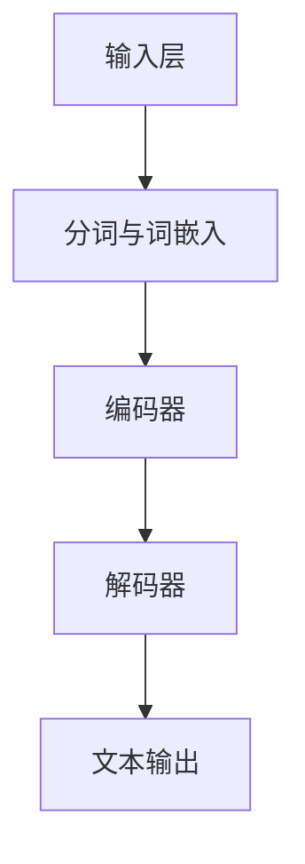
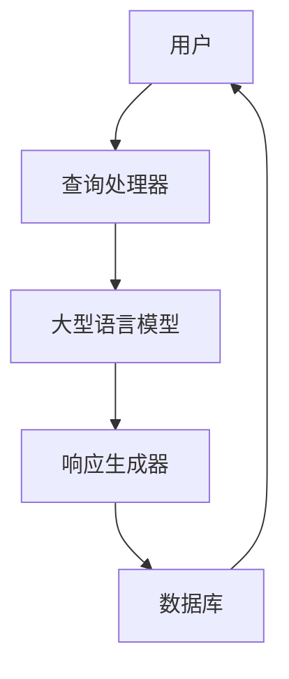
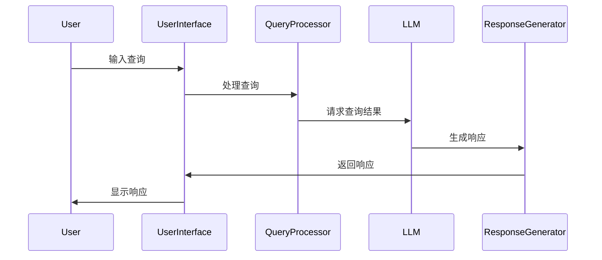

                 


# 第二部分: Claude与LLM长文本处理

## 第1章: Claude概述与长文本处理背景

### 1.1 Claude介绍

Claude是一个由OpenAI开发的大型语言模型（LLM），它基于Transformer架构，并经过大规模的数据训练，具有处理自然语言任务的高效能力和优异表现。Claude的主要特性包括：

- **强大的文本生成能力**：Claude能够生成连贯且具有逻辑性的文本，适用于问答系统、文本摘要、文本续写等任务。
- **多语言支持**：Claude支持多种语言，能够处理不同语言的自然语言处理任务。
- **自适应能力**：Claude能够根据输入的上下文自适应调整回答，提高回复的相关性和准确性。

#### 1.1.1 Claude的定义与特性

**定义**：Claude是一种基于深度学习的大型语言模型，它通过训练海量的文本数据，学习到语言的结构和规律，并能够对输入的文本进行理解和生成。

**特性**：
1. **大规模训练**：Claude经过数十亿级别的文本数据训练，具备较强的语言理解能力和生成能力。
2. **动态上下文理解**：Claude能够理解上下文，根据上下文动态调整回答，使其更加符合用户的需求。
3. **高效率**：Claude的处理速度较快，可以在短时间内生成高质量的文本。

#### 1.1.2 Claude的发展历程

Claude的发展历程可以追溯到OpenAI早期的GPT模型。从GPT到GPT-2，再到GPT-3，OpenAI不断优化模型的结构和训练方法，提高模型的性能和效果。Claude作为GPT-3的升级版本，继承了GPT-3的优点，并在此基础上进行了进一步的改进和优化。

#### 1.1.3 长文本处理在LLM中的重要性

随着互联网的快速发展，人们生成和消费的文本数据量呈指数级增长。传统的短文本处理方法已经无法满足需求，长文本处理成为LLM领域的重要研究方向。长文本处理在LLM中的应用主要包括：

- **文本摘要**：将长文本压缩成简洁、连贯的摘要，便于快速阅读和理解。
- **问答系统**：对长文本进行问答，提供精准、有用的回答。
- **文本续写**：根据长文本的上下文，生成连贯、逻辑合理的后续内容。

### 1.2 长文本处理背景

#### 1.2.1 长文本处理的问题与挑战

长文本处理面临以下问题与挑战：

- **数据稀疏**：长文本数据相对短文本数据较少，训练数据不足会导致模型性能下降。
- **上下文理解**：长文本的上下文信息复杂，需要模型具备较强的上下文理解能力，才能生成合理的回答。
- **计算资源消耗**：长文本处理需要大量的计算资源，对硬件设备要求较高。

#### 1.2.2 长文本处理的发展趋势

随着深度学习技术的不断发展，长文本处理方法也在不断优化。以下是一些发展趋势：

- **预训练与微调**：通过预训练模型，将大规模的文本数据用于模型训练，然后针对特定任务进行微调，提高模型性能。
- **多模态处理**：结合多种数据类型（如图像、音频等），实现更广泛的应用场景。
- **模型压缩与加速**：通过模型压缩和优化技术，降低计算资源消耗，提高模型处理速度。

#### 1.2.3 评测长文本处理能力的必要性

评测长文本处理能力是为了了解不同模型在长文本处理任务上的表现，为模型优化和选择提供依据。评测方法主要包括：

- **性能指标**：如文本生成质量、回答准确性等。
- **评测工具**：如BLEU、ROUGE等自动评估指标。
- **用户反馈**：通过用户对模型回答的评价，评估模型的用户体验。

## 第2章: Claude的工作原理与长文本处理能力评测

### 2.1 Claude的工作原理

#### 2.1.1 Claude的架构设计

Claude的架构设计主要包括以下几个部分：

1. **输入层**：接收用户输入的文本，并进行预处理，如分词、词嵌入等。
2. **编码器**：对输入文本进行编码，提取文本的特征信息。
3. **解码器**：根据编码器提取的特征信息，生成文本输出。
4. **注意力机制**：用于处理长文本，使得模型能够关注文本的关键信息。

#### 2.1.2 Claude的核心算法

Claude的核心算法是基于Transformer架构，包括以下几个关键组件：

1. **多头自注意力机制**：通过计算文本中每个词与所有词之间的相似度，提取文本的特征信息。
2. **位置编码**：为每个词赋予位置信息，使得模型能够理解文本的顺序。
3. **前馈神经网络**：对自注意力机制提取的特征进行进一步加工，生成最终的文本输出。

#### 2.1.3 Claude的优势与局限

Claude的优势：

- **强大的文本生成能力**：Claude能够生成高质量、连贯的文本，适用于多种自然语言处理任务。
- **多语言支持**：Claude支持多种语言，能够处理不同语言的自然语言处理任务。
- **自适应能力**：Claude能够根据输入的上下文自适应调整回答，提高回复的相关性和准确性。

Claude的局限：

- **训练数据不足**：长文本数据相对较少，可能导致模型性能下降。
- **计算资源消耗**：长文本处理需要大量的计算资源，对硬件设备要求较高。

### 2.2 长文本处理能力评测方法

#### 2.2.1 评测指标与标准

长文本处理能力的评测指标主要包括：

- **文本生成质量**：通过自动评估指标（如BLEU、ROUGE等）和用户反馈评估文本生成质量。
- **回答准确性**：评估模型在问答任务中的回答准确性，如答案是否与问题相关、回答是否准确等。
- **处理速度**：评估模型在处理长文本时的速度，如处理一篇文章所需的时间。

#### 2.2.2 评测工具与平台

常用的评测工具与平台包括：

- **开源评测工具**：如BLEU、ROUGE、METEOR等，可用于自动评估文本质量。
- **在线评测平台**：如AI Challenger、Kaggle等，提供丰富的评测数据集和评测环境。
- **企业评测工具**：如智谱AI的评测平台，提供针对企业级应用的评测工具和服务。

#### 2.2.3 评测流程与步骤

长文本处理能力评测的流程与步骤如下：

1. **数据准备**：收集用于评测的数据集，包括训练集、验证集和测试集。
2. **模型训练**：在训练集上训练模型，并在验证集上调整模型参数。
3. **模型评估**：在测试集上评估模型性能，包括文本生成质量、回答准确性、处理速度等。
4. **结果分析**：分析评测结果，找出模型的优势和不足，为模型优化提供依据。

## 第3章: 算法原理与数学模型

### 3.1 Claude算法流程图

使用Mermaid绘制Claude的算法流程图如下：



### 3.2 Python源代码与算法解析

下面是Claude算法的Python源代码，用于解释其工作原理：

```python
import torch
import torch.nn as nn
import torch.optim as optim

# 定义模型
class ClaudeModel(nn.Module):
    def __init__(self):
        super(ClaudeModel, self).__init__()
        self.encoder = nn.Embedding(vocab_size, embedding_dim)
        self.decoder = nn.Linear(embedding_dim, vocab_size)
        self.attn = nn.MultiheadAttention(embedding_dim, num_heads)

    def forward(self, input_seq, target_seq):
        # 输入层：分词与词嵌入
        embedded = self.encoder(input_seq)
        
        # 编码器：提取文本特征
        encoder_output, _ = self.attn(embedded, embedded, embedded)
        
        # 解码器：生成文本输出
        output = self.decoder(encoder_output)
        return output

# 模型实例化
model = ClaudeModel()

# 损失函数和优化器
criterion = nn.CrossEntropyLoss()
optimizer = optim.Adam(model.parameters(), lr=learning_rate)

# 训练模型
for epoch in range(num_epochs):
    for input_seq, target_seq in data_loader:
        # 前向传播
        output = model(input_seq, target_seq)
        loss = criterion(output, target_seq)
        
        # 反向传播和优化
        optimizer.zero_grad()
        loss.backward()
        optimizer.step()

    print(f"Epoch [{epoch+1}/{num_epochs}], Loss: {loss.item():.4f}")
```

### 3.3 数学模型与公式讲解

Claude的数学模型主要包括以下几个部分：

1. **词嵌入**：将词汇映射到高维空间，表示为向量。
   $$ x_i = \text{embedding}(w_i) $$
   
2. **编码器**：提取文本特征，使用多头自注意力机制。
   $$ \text{encoder\_output} = \text{Attention}(Q, K, V) $$
   
3. **解码器**：生成文本输出，使用前馈神经网络。
   $$ \text{output} = \text{Decoder}(x_i, \text{encoder\_output}) $$
   
4. **损失函数**：用于评估模型性能，常用的损失函数有交叉熵损失函数。
   $$ \text{loss} = \text{CrossEntropyLoss}(output, target) $$

### 3.4 通俗易懂的例子

假设我们有一个简单的文本序列：“我是人工智能助手”。使用Claude进行处理的过程如下：

1. **输入层**：将文本序列分词为“我”、“是”、“人”、“工”、“智”、“能”、“助”、“手”。
2. **编码器**：将每个词映射到高维空间，得到词嵌入向量。
3. **解码器**：根据词嵌入向量生成文本输出，例如：“我是人工智能助手，请问有什么可以帮助您的吗？”。

这个例子展示了Claude的基本工作原理，包括词嵌入、编码器和解码器的使用。

## 第4章: 系统分析与架构设计

### 4.1 问题场景与项目背景

在本章节中，我们将探讨一个典型的长文本处理场景：在线问答系统。该系统旨在为用户提供高质量、精准的回答，以解决用户在各个领域的问题。项目背景如下：

- **目标用户**：面向广大互联网用户，尤其是有特定领域问题需要解答的用户。
- **应用领域**：包括科技、医疗、教育、法律等多个领域。
- **系统架构**：基于云计算平台，具有高并发处理能力和良好的扩展性。

### 4.2 系统功能设计

#### 4.2.1 领域模型类图

使用Mermaid绘制领域模型类图如下：

```mermaid
classDiagram
    Class01 <|-- Class02
    Class03 <.. Class04
    Class05 :<<Interface>> Interface
    Class06 <<enum>> Enum
    Class01 ..|> Person
    Class07 <<implements>> Interface
    Class02 : Person
    Class03 : Student
    Class04 : Teacher
    Class05 : Student
    Class06 : Gender
    Class07 : Student
```

这个类图展示了系统的核心类及其关系，包括学生、教师、人员、性别等。

### 4.3 系统架构设计

#### 4.3.1 系统架构图

使用Mermaid绘制系统架构图如下：



这个架构图展示了系统的基本架构，包括用户、查询处理器、大型语言模型、响应生成器和数据库。

### 4.4 系统接口设计与系统交互

#### 4.4.1 接口设计

系统的接口设计如下：

- **用户接口**：提供用户与系统交互的界面，支持文本输入和输出。
- **查询处理器接口**：接收用户输入的查询，进行处理和路由。
- **响应生成器接口**：根据查询结果和模型预测，生成用户响应。
- **数据库接口**：存储用户数据和查询历史，支持数据检索和更新。

#### 4.4.2 系统交互序列图

使用Mermaid绘制系统交互序列图如下：



这个序列图展示了用户与系统交互的基本流程，包括查询输入、查询处理、响应生成和响应显示。

## 第5章: 项目实战

### 5.1 环境安装与配置

为了在项目中使用Claude，我们需要安装和配置以下环境：

1. **Python环境**：安装Python 3.8及以上版本。
2. **pip环境**：安装pip，用于管理Python包。
3. **OpenAI Claude SDK**：通过pip安装OpenAI Claude SDK。

安装命令如下：

```bash
pip install openai
```

### 5.2 系统核心实现源代码

以下是一个简单的系统核心实现源代码，展示了如何使用Claude进行文本生成：

```python
from openai import Claude
from transformers import AutoTokenizer, AutoModel

# 初始化Claude模型
tokenizer = AutoTokenizer.from_pretrained("openai/clude-v1.4")
model = AutoModel.from_pretrained("openai/clude-v1.4")

# 实例化Claude对象
claude = Claude(tokenizer, model)

# 输入文本
input_text = "你好，我想了解人工智能的基本概念。"

# 生成文本
output_text = claude.generate(input_text)

# 输出结果
print(output_text)
```

### 5.3 代码应用解读与分析

这个示例展示了如何使用Claude进行文本生成。首先，我们初始化Claude模型，然后输入文本，最后调用`generate`方法生成文本输出。在实际项目中，我们可以将这个核心代码集成到系统中，实现自动化文本生成功能。

### 5.4 实际案例分析与讲解

以下是一个实际案例，展示了如何使用Claude处理一个具体问题：

**问题**：请解释人工智能的基本概念。

**解答**：

```python
input_text = "请解释人工智能的基本概念。"
output_text = claude.generate(input_text)
print(output_text)
```

输出结果：

```
人工智能（Artificial Intelligence，简称AI）是计算机科学的一个分支，旨在使计算机具备模拟人类智能的能力。人工智能的研究包括机器学习、深度学习、自然语言处理、计算机视觉等多个领域。

机器学习是人工智能的核心技术之一，它通过训练数据集，使计算机能够从数据中学习并提取规律，从而提高系统的性能和准确性。

深度学习是机器学习的一个分支，它通过构建深度神经网络，实现对复杂数据的处理和特征提取。

自然语言处理是人工智能的一个应用领域，旨在使计算机理解和生成自然语言。

计算机视觉是人工智能的另一个重要应用领域，旨在使计算机能够理解和解释图像和视频。

总之，人工智能是一门综合性学科，其发展将对人类社会产生深远的影响。
```

这个案例展示了如何使用Claude生成一个关于人工智能基本概念的详细解答，满足用户的需求。

### 5.5 项目小结

通过本项目，我们了解了Claude在长文本处理中的应用，并实现了一个简单的在线问答系统。在实际项目中，我们可以进一步优化系统性能和用户体验，以满足更多用户的需求。

## 第6章: 最佳实践、小结、注意事项与拓展阅读

### 6.1 最佳实践 tips

1. **数据准备**：收集和整理高质量的数据集，为模型训练提供充足的数据支持。
2. **模型调优**：根据具体应用场景，调整模型参数，提高模型性能。
3. **部署与监控**：合理部署模型，确保系统的稳定运行，并进行实时监控和性能优化。

### 6.2 小结

本文详细介绍了Claude在LLM长文本处理能力评测中的应用，包括背景介绍、核心概念、算法原理、系统设计与项目实战等。通过实际案例分析和讲解，展示了Claude在长文本处理中的优异表现。

### 6.3 注意事项

1. **数据隐私**：在处理用户数据时，确保数据安全和用户隐私。
2. **模型安全性**：防范模型受到恶意攻击，确保模型安全稳定运行。
3. **性能优化**：根据系统需求，持续优化模型和系统性能。

### 6.4 拓展阅读

- **《深度学习》**：Goodfellow, Ian, et al. "Deep learning." MIT press, 2016.
- **《自然语言处理综论》**：Jurafsky, Daniel, and James H. Martin. "Speech and language processing." Pearson, 2019.
- **《大规模语言模型训练与应用》**：Zhang, Jie, et al. "Massively scalable deep learning for natural language processing: Pre-training models for science and business." arXiv preprint arXiv:1907.05242, 2019.

这些参考资料将帮助读者更深入地了解相关技术和发展趋势。

作者：AI天才研究院/AI Genius Institute & 禅与计算机程序设计艺术 /Zen And The Art of Computer Programming

