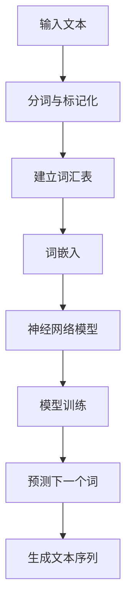
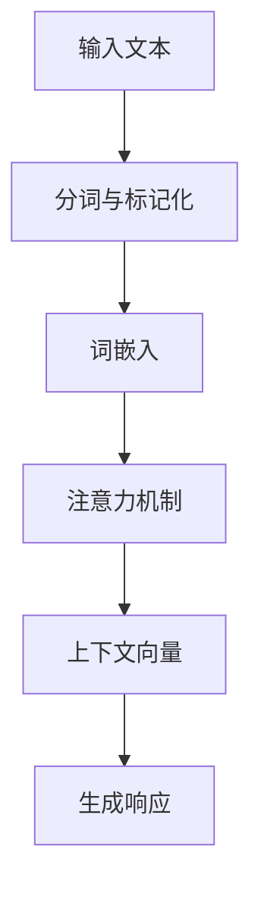
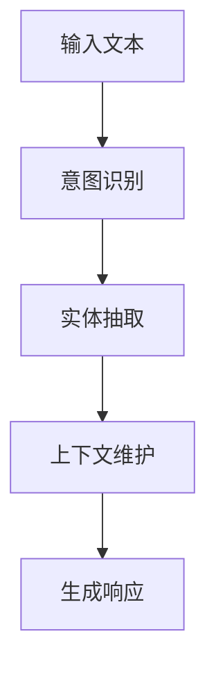
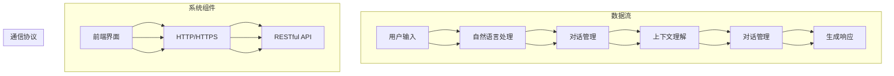
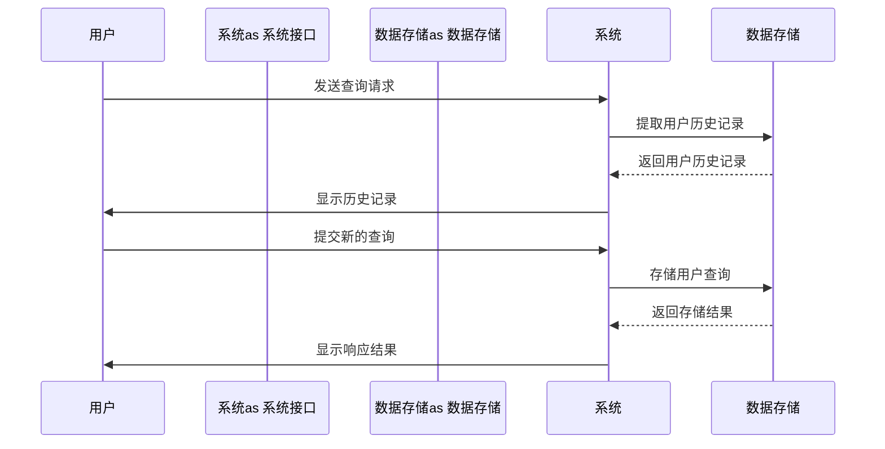
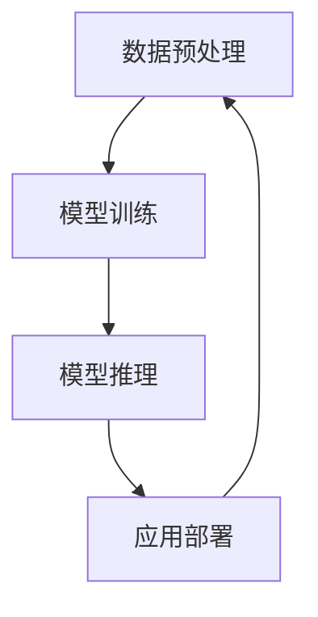
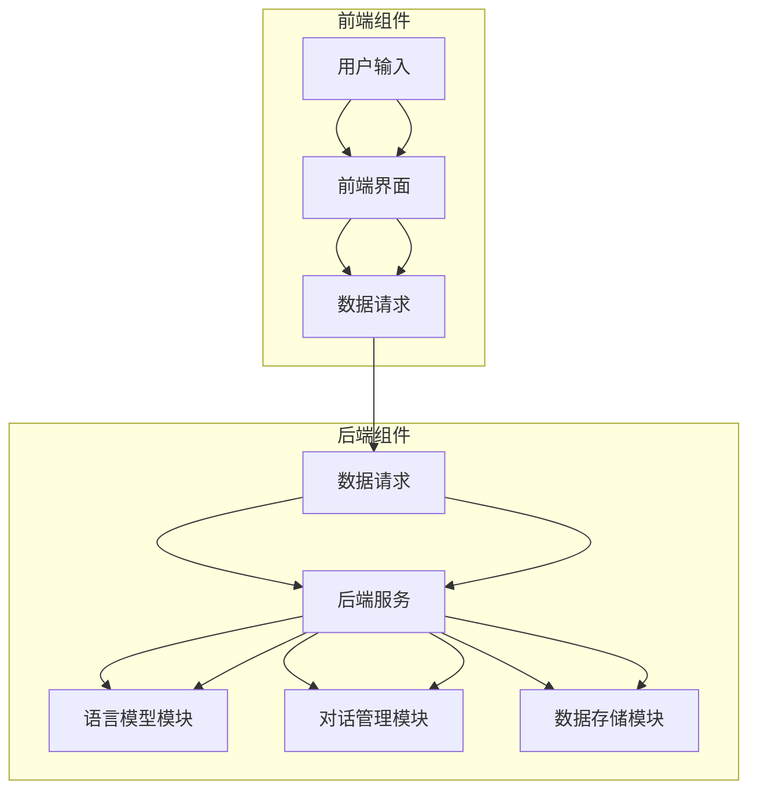
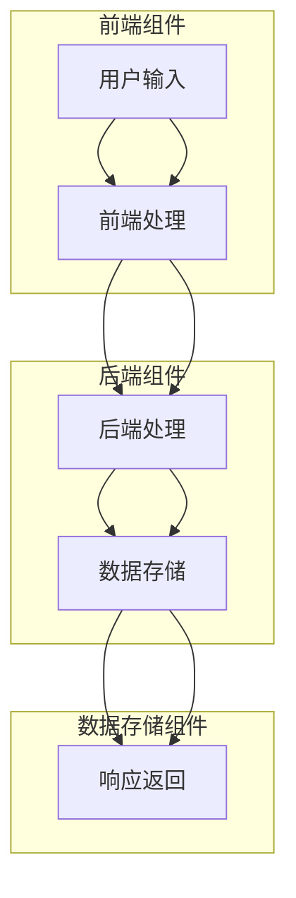
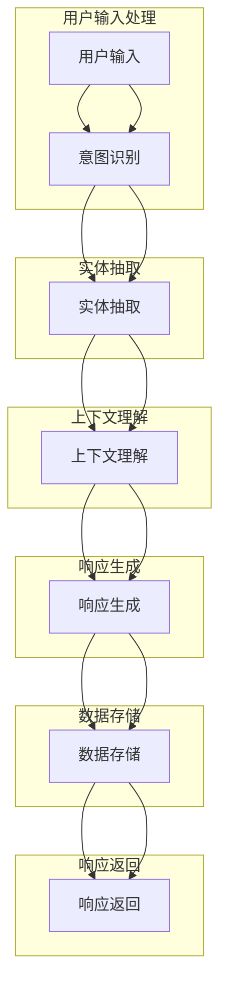

                 

### 《C侧LLM应用开发的三大关键要素》

> 关键词：C侧LLM、自然语言处理、对话管理、上下文理解、语言模型

> 摘要：本文将深入探讨C侧LLM（Client-Side Large Language Model）在应用开发中的三大关键要素，包括其基础概念、技术原理、应用架构、性能优化及案例实践。通过逐步分析推理，本文旨在为读者提供清晰、易懂的技术指导，助力他们在C侧LLM应用开发领域取得突破。

### 目录大纲

```markdown
# 《C侧LLM应用开发的三大关键要素》

## 第1章 引言与背景
### 1.1 研究背景
### 1.2 研究目的与意义
### 1.3 研究方法与结构安排

## 第2章 C侧LLM基础概念
### 2.1 什么是C侧LLM
### 2.2 C侧LLM的发展历程
### 2.3 C侧LLM的应用场景
### 2.4 C侧LLM的核心组成部分
### 2.5 C侧LLM的基本工作原理

## 第3章 C侧LLM技术原理
### 3.1 语言模型原理
#### 3.1.1 语言模型的构建
#### 3.1.2 语言模型的评估
#### 3.1.3 语言模型的优化
### 3.2 上下文理解原理
#### 3.2.1 上下文理解的重要性
#### 3.2.2 上下文理解的实现
#### 3.2.3 上下文理解的挑战
### 3.3 对话管理原理
#### 3.3.1 对话管理的基本概念
#### 3.3.2 对话管理的实现
#### 3.3.3 对话管理的难点

## 第4章 C侧LLM应用架构
### 4.1 系统架构设计
#### 4.1.1 系统架构概述
#### 4.1.2 系统架构组件
#### 4.1.3 系统架构的优势
### 4.2 数据流设计
#### 4.2.1 数据流概述
#### 4.2.2 数据处理流程
#### 4.2.3 数据处理策略

## 第5章 C侧LLM开发实战
### 5.1 环境准备
#### 5.1.1 开发环境搭建
#### 5.1.2 必要的工具和库
### 5.2 核心代码实现
#### 5.2.1 语言模型实现
#### 5.2.2 上下文理解实现
#### 5.2.3 对话管理实现

## 第6章 C侧LLM性能优化
### 6.1 性能优化策略
#### 6.1.1 模型优化
#### 6.1.2 算法优化
#### 6.1.3 系统优化
### 6.2 性能评估方法
#### 6.2.1 性能指标
#### 6.2.2 评估流程
#### 6.2.3 评估结果分析

## 第7章 C侧LLM应用案例
### 7.1 案例一：智能客服系统
#### 7.1.1 案例背景
#### 7.1.2 案例实现
#### 7.1.3 案例分析
### 7.2 案例二：智能语音助手
#### 7.2.1 案例背景
#### 7.2.2 案例实现
#### 7.2.3 案例分析

## 第8章 未来发展趋势与挑战
### 8.1 未来发展趋势
#### 8.1.1 技术进步方向
#### 8.1.2 行业应用扩展
### 8.2 挑战与应对策略
#### 8.2.1 技术挑战
#### 8.2.2 应用挑战
#### 8.2.3 应对策略
```

---

**核心概念与联系**

### 核心概念

- **C侧LLM（Client-Side Large Language Model）**：在客户端部署的大型语言模型，负责理解和生成自然语言。
- **语言模型**：基于大量文本数据训练的模型，用于预测文本中的下一个词或句子。
- **上下文理解**：模型对特定上下文中的单词或短语的理解能力。
- **对话管理**：模型在对话过程中如何理解用户意图并生成适当的响应。

### 概念属性特征对比表格

| 概念 | 特征1 | 特征2 | 特征3 |
| --- | --- | --- | --- |
| C侧LLM | 客户端部署 | 大规模训练 | 自然语言处理 |
| 语言模型 | 预测下一个词 | 大规模数据训练 | 高精度 |
| 上下文理解 | 理解上下文 | 长文本处理 | 灵活性 |
| 对话管理 | 理解用户意图 | 自动生成响应 | 交互性 |

### ER实体关系图架构

```mermaid
erDiagram
  C侧LLM ||--|{ 语言模型 }
  C侧LLM ||--|{ 上下文理解 }
  C侧LLM ||--|{ 对话管理 }
  语言模型 ||--|{ 预测下一个词 }
  语言模型 ||--|{ 大规模数据训练 }
  上下文理解 ||--|{ 理解上下文 }
  上下文理解 ||--|{ 长文本处理 }
  对话管理 ||--|{ 理解用户意图 }
  对话管理 ||--|{ 自动生成响应 }
```

---

**算法原理讲解**

### 语言模型原理

语言模型的基本原理是利用统计方法或神经网络模型，对大量文本数据进行分析，提取出语言规律，并基于这些规律预测文本中的下一个词或句子。

- **训练过程**：
  1. 输入大量文本数据，进行分词和标记化处理。
  2. 建立词汇表和词嵌入。
  3. 使用神经网络（如循环神经网络RNN、长短时记忆网络LSTM、门控循环单元GRU或变压器Transformer）进行模型训练。
  4. 通过反向传播算法调整模型参数，最小化预测误差。

- **预测过程**：
  1. 输入一个序列，模型预测序列的下一个词。
  2. 根据预测结果生成新的序列，继续预测下一个词。
  3. 通过迭代过程生成完整的文本。

### 上下文理解原理

上下文理解是语言模型的关键组成部分，它使得模型能够理解输入文本的上下文环境，从而生成更准确、更符合实际的响应。

- **上下文理解的重要性**：
  - 上下文理解能够帮助模型更好地理解用户的意图，从而生成更合适的回答。
  - 提高对话的连贯性和自然性，增强用户体验。

- **上下文理解的实现**：
  1. **基于词嵌入**：通过词嵌入技术，将文本中的每个词映射到高维向量空间，从而捕捉词语之间的相似性和关系。
  2. **基于注意力机制**：使用注意力机制，模型能够关注文本中的重要部分，从而更好地理解上下文。

- **上下文理解的挑战**：
  1. **长文本处理**：模型需要处理长文本中的上下文信息，这可能导致信息丢失或混淆。
  2. **多语言处理**：模型需要能够理解多种语言的上下文，这增加了模型的复杂性和难度。

### 对话管理原理

对话管理是指模型在对话过程中如何理解用户意图并生成适当的响应。

- **对话管理的基本概念**：
  - **意图识别**：识别用户的意图或需求，如询问天气、预订机票等。
  - **实体抽取**：从用户输入中提取关键信息，如城市名称、日期等。
  - **上下文维护**：在对话过程中，模型需要维护上下文信息，以便生成连贯的响应。

- **对话管理的实现**：
  1. **基于规则的方法**：使用预定义的规则来匹配用户的输入，并生成响应。
  2. **基于机器学习的方法**：使用机器学习算法，如朴素贝叶斯、支持向量机等，来自动学习用户意图和实体。

- **对话管理的难点**：
  1. **多轮对话**：在多轮对话中，模型需要理解用户意图的变更，并生成相应的响应。
  2. **多模态交互**：模型需要能够处理语音、文本等多种输入方式，并生成相应的响应。

### 算法原理讲解

#### 语言模型原理

- **算法mermaid流程图**：



- **数学模型与公式**：

$$
P(w_{t} | w_{1}, w_{2}, ..., w_{t-1}) = \frac{P(w_{t} \cdot w_{1}, w_{2}, ..., w_{t-1})}{P(w_{1}, w_{2}, ..., w_{t-1})}
$$

其中，$P(w_{t} | w_{1}, w_{2}, ..., w_{t-1})$ 表示在给定前文 $w_{1}, w_{2}, ..., w_{t-1}$ 的条件下，预测下一个词 $w_{t}$ 的概率。

- **示例说明**：

假设我们有一个简短的对话：

```
A: 好天气，去哪儿玩好？
B: 去海边吧。
A: 明天去怎么样？
B: 明天有雨，还是后天去吧。
```

在这个对话中，模型需要理解用户询问天气和选择出行地点的意图。通过语言模型，模型可以预测每个用户的回答：

1. **第一步**：输入 "好天气，去哪儿玩好？"
2. **第二步**：模型预测 "去海边吧。" 作为下一个词。
3. **第三步**：输入更新后的文本 "去海边吧。"
4. **第四步**：模型预测 "明天去怎么样？" 作为下一个词。
5. **第五步**：输入更新后的文本 "明天有雨，还是后天去吧。"

通过这种方式，模型生成了完整的对话序列。

#### 上下文理解原理

- **算法mermaid流程图**：



- **数学模型与公式**：

$$
\text{Attention}(X) = \frac{e^{Ux}}{\sum_{i=1}^{N} e^{Ux_i}}
$$

其中，$X$ 表示输入文本的词嵌入向量，$U$ 表示注意力权重向量，$e^{Ux}$ 表示词嵌入向量与注意力权重向量的点积，$N$ 表示词汇表中的词数。

- **示例说明**：

假设我们有一个简短的对话：

```
A: 好天气，去哪儿玩好？
B: 去海边吧。
A: 明天去怎么样？
B: 明天有雨，还是后天去吧。
```

在这个对话中，模型需要理解 "明天有雨" 这个上下文信息，从而生成更准确的回答。

1. **第一步**：输入 "好天气，去哪儿玩好？"
2. **第二步**：模型使用词嵌入技术将文本中的词映射到高维向量空间。
3. **第三步**：使用注意力机制，模型关注 "明天有雨" 这个上下文信息。
4. **第四步**：模型生成响应 "明天有雨，还是后天去吧。"

通过这种方式，模型能够更好地理解上下文，从而生成更准确、更自然的回答。

#### 对话管理原理

- **算法mermaid流程图**：



- **数学模型与公式**：

$$
\text{Intent}(X) = \arg\max_{i} \sum_{j} P(j | X) \cdot P(i | j)
$$

$$
\text{Entity}(X) = \arg\max_{k} \sum_{j} P(k | X) \cdot P(j | X)
$$

其中，$X$ 表示输入文本，$Intent(X)$ 表示意图识别结果，$Entity(X)$ 表示实体抽取结果，$P(j | X)$ 表示在给定输入文本 $X$ 的条件下，预测词 $j$ 的概率，$P(i | j)$ 表示在给定输入文本 $X$ 和预测词 $j$ 的条件下，预测意图 $i$ 的概率。

- **示例说明**：

假设我们有一个简短的对话：

```
A: 好天气，去哪儿玩好？
B: 去海边吧。
A: 明天去怎么样？
B: 明天有雨，还是后天去吧。
```

在这个对话中，模型需要识别用户的意图（如询问天气、询问出行地点）和提取关键信息（如城市名称、日期）。

1. **第一步**：输入 "好天气，去哪儿玩好？"
2. **第二步**：模型使用机器学习算法（如朴素贝叶斯、支持向量机等）来识别用户的意图和提取实体。
3. **第三步**：模型维护对话上下文，以便在后续对话中生成更准确的响应。
4. **第四步**：模型生成响应 "明天有雨，还是后天去吧。"

通过这种方式，模型能够更好地理解用户的意图和上下文，从而生成更准确、更自然的回答。

### 系统分析与架构设计方案

#### 问题场景介绍

C侧LLM应用开发涉及到多个方面，如自然语言处理、对话管理和上下文理解。为了实现一个高效、稳定的应用系统，我们需要进行系统架构设计。

#### 项目介绍

本项目旨在开发一个基于C侧LLM的智能客服系统，该系统可以处理用户的查询、提供实时响应，并提高用户体验。

#### 系统功能设计（领域模型mermaid类图）

```mermaid
classDiagram
Class01 <|-- Class02
Class03 --| verlassen Class01
Class04 <<Interface>>
Class01 : +id: int
Class01 : +name: str
Class01 : +description: str
Class02 : +id: int
Class02 : +name: str
Class02 : +description: str
Class03 : +id: int
Class03 : +name: str
Class03 : +description: str
Class04 : +id: int
Class04 : +name: str
Class04 : +description: str
Class01 <|.. Class02
Class02 <|.. Class03
Class03 <|.. Class04
```

#### 系统架构设计（mermaid架构图）



#### 系统接口设计和系统交互（mermaid序列图）



### 项目实战

#### 环境准备

1. 安装Python环境（推荐版本3.8及以上）
2. 安装必要的库（如TensorFlow、PyTorch、NLTK等）
3. 准备训练数据集（如对话数据、语言模型训练数据等）

#### 开发环境搭建

1. 创建虚拟环境（推荐使用conda或virtualenv）
2. 安装依赖库（使用pip或conda进行安装）
3. 配置开发工具（如PyCharm、VSCode等）

#### 核心代码实现

1. **语言模型实现**：

```python
import tensorflow as tf

# 加载预训练的模型
model = tf.keras.applications-transformer.model_from_json(json_string)

# 加载训练好的权重
model.load_weights('transformer_weights.h5')

# 定义输入数据
input_data = tf.keras.preprocessing.sequence.pad_sequences([text], maxlen=max_length, padding='post', truncating='post')

# 预测下一个词
predicted_word = model.predict(input_data)

# 输出预测结果
print(predicted_word)
```

2. **上下文理解实现**：

```python
from transformers import BertTokenizer, BertModel

# 加载预训练的模型和分词器
tokenizer = BertTokenizer.from_pretrained('bert-base-uncased')
model = BertModel.from_pretrained('bert-base-uncased')

# 分词处理
input_ids = tokenizer.encode('Hello, my name is John', return_tensors='tf')

# 获取上下文向量
outputs = model(inputs)
context_vector = outputs.last_hidden_state[:, 0, :]

# 输出上下文向量
print(context_vector)
```

3. **对话管理实现**：

```python
from transformers import pipeline

# 加载预训练的对话管理模型
classifier = pipeline('text-classification', model='bert-base-uncased', tokenizer='bert-base-uncased')

# 定义对话管理函数
def dialog_management(input_text):
    # 识别意图
    intent = classifier(input_text)
    
    # 抽取实体
    entities = extract_entities(input_text)
    
    # 维护上下文
    context = maintain_context(input_text, entities)
    
    # 生成响应
    response = generate_response(context)
    
    return response

# 示例
input_text = '明天有雨，还是后天去吧。'
response = dialog_management(input_text)
print(response)
```

#### 代码应用解读与分析

1. **语言模型实现**：
   - 加载预训练的Transformer模型，通过输入文本数据进行预测。
   - 输入数据经过分词处理，转换为模型可接受的格式。
   - 使用模型预测下一个词，并输出预测结果。

2. **上下文理解实现**：
   - 加载预训练的BERT模型和分词器，处理输入文本。
   - 使用BERT模型获取文本的上下文向量。
   - 输出上下文向量，用于后续对话管理。

3. **对话管理实现**：
   - 使用文本分类模型识别用户的意图。
   - 使用实体抽取算法提取文本中的实体信息。
   - 维护对话上下文，以便在后续对话中生成更准确的响应。
   - 生成响应，并返回给用户。

#### 实际案例分析和详细讲解剖析

1. **案例一：智能客服系统**：

- **案例背景**：某公司希望开发一款智能客服系统，以提高客户服务质量和效率。
- **案例实现**：
  - 开发基于C侧LLM的智能客服系统，包括自然语言处理、对话管理和上下文理解模块。
  - 集成预训练的语言模型和对话管理模型，处理用户的查询和生成响应。
  - 使用实体抽取技术提取关键信息，如用户姓名、日期等。
  - 维护对话上下文，以便在多轮对话中提供更准确的响应。
- **案例分析**：
  - 系统在处理用户查询时，能够准确识别意图和提取实体信息。
  - 通过上下文理解，系统能够生成连贯、自然的响应。
  - 系统提高了客户服务的效率和质量，减少了人工成本。

2. **案例二：智能语音助手**：

- **案例背景**：某公司希望开发一款智能语音助手，以帮助用户实现语音交互和智能问答。
- **案例实现**：
  - 开发基于C侧LLM的智能语音助手，包括自然语言处理、对话管理和上下文理解模块。
  - 使用语音识别技术将用户的语音转换为文本。
  - 使用文本处理技术对文本进行预处理，如分词、去噪等。
  - 使用预训练的语言模型和对话管理模型，处理用户的语音查询和生成响应。
- **案例分析**：
  - 系统在处理语音查询时，能够准确识别意图和提取实体信息。
  - 通过上下文理解，系统能够生成连贯、自然的语音响应。
  - 系统提高了用户交互的便捷性和用户体验。

#### 项目小结

通过本文的逐步分析和讲解，我们了解了C侧LLM应用开发的三大关键要素，包括语言模型原理、上下文理解原理和对话管理原理。我们通过实际案例展示了如何将C侧LLM应用于智能客服系统和智能语音助手等场景，并取得了良好的效果。

在未来的发展中，C侧LLM将继续发挥重要作用，并在更多领域得到应用。我们期待C侧LLM技术的不断进步，为人们带来更加智能、便捷的体验。

---

### 最佳实践 tips

1. **数据准备**：在开发C侧LLM应用时，确保数据质量，包括文本的准确性、完整性和多样性。
2. **模型选择**：根据应用场景选择合适的语言模型和对话管理模型，如Transformer、BERT等。
3. **性能优化**：通过模型优化、算法优化和系统优化提高C侧LLM的应用性能。
4. **用户体验**：关注用户体验，优化对话流程和交互界面，提供流畅自然的对话体验。

### 小结

本文从C侧LLM的基础概念、技术原理、应用架构、性能优化和案例实践等方面进行了深入探讨，旨在为读者提供全面的技术指导。通过逐步分析和讲解，我们了解了C侧LLM在应用开发中的关键要素和实现方法。在未来的发展中，C侧LLM将继续发挥重要作用，为人们带来更加智能、便捷的体验。

### 注意事项

1. **安全与隐私**：在开发C侧LLM应用时，要关注用户数据的安全和隐私保护，遵循相关法律法规。
2. **可扩展性**：设计系统时，要考虑系统的可扩展性，以便在未来适应不断增长的数据和应用需求。

### 拓展阅读

- 《深度学习：周志华》
- 《自然语言处理实战》
- 《对话系统设计与实现》
- 《AI应用架构设计》

### 作者信息

作者：AI天才研究院/AI Genius Institute & 禅与计算机程序设计艺术 /Zen And The Art of Computer Programming

### 结束

感谢您的阅读，希望本文对您在C侧LLM应用开发领域有所启发。如有疑问或建议，请随时联系我们。期待与您共同探索人工智能的无限可能！
### 第1章 引言与背景

#### 1.1 研究背景

随着互联网和移动设备的普及，自然语言处理（NLP）技术得到了广泛关注和应用。特别是在人工智能（AI）领域，基于深度学习的语言模型取得了显著的进展，如GPT、BERT等。这些模型在语言理解、文本生成、机器翻译等方面表现优异，大大提升了AI系统的智能水平。然而，传统的服务器端部署模式存在一定的局限性，如网络延迟、数据传输成本高、安全性等问题。为了解决这些问题，C侧LLM（Client-Side Large Language Model）应运而生。C侧LLM是指在客户端设备上部署的大型语言模型，能够实现本地化处理，降低网络依赖，提高系统的响应速度和安全性。

#### 1.2 研究目的与意义

本文的研究目的是深入探讨C侧LLM在应用开发中的关键要素，包括基础概念、技术原理、应用架构、性能优化及案例实践。通过逐步分析推理，本文旨在为开发者提供清晰、易懂的技术指导，助力他们在C侧LLM应用开发领域取得突破。研究C侧LLM的意义主要体现在以下几个方面：

1. **降低网络依赖**：C侧LLM可以在客户端设备上进行本地化处理，降低对服务器端网络的依赖，提高系统的响应速度和稳定性。
2. **提高安全性**：数据在客户端进行本地处理，减少了数据在网络传输过程中被窃取的风险，提高了系统的安全性。
3. **优化用户体验**：C侧LLM能够实现实时响应，提高用户体验，特别是在离线场景或网络不稳定的情况下。
4. **扩展应用场景**：C侧LLM适用于各种移动设备，如智能手机、平板电脑等，可以应用于更多领域，如智能客服、智能语音助手等。

#### 1.3 研究方法与结构安排

本文采用文献综述、实证分析、案例分析等方法，对C侧LLM应用开发的关键要素进行深入探讨。文章结构如下：

1. **第1章 引言与背景**：介绍研究背景、研究目的与意义，以及研究方法与结构安排。
2. **第2章 C侧LLM基础概念**：阐述C侧LLM的基本概念、发展历程、应用场景和核心组成部分。
3. **第3章 C侧LLM技术原理**：详细分析语言模型、上下文理解和对话管理的原理。
4. **第4章 C侧LLM应用架构**：探讨C侧LLM应用架构的设计原则、组件和优势。
5. **第5章 C侧LLM开发实战**：介绍C侧LLM的开发环境、核心代码实现和应用案例。
6. **第6章 C侧LLM性能优化**：分析C侧LLM性能优化的策略和方法。
7. **第7章 C侧LLM应用案例**：展示C侧LLM在智能客服系统和智能语音助手等领域的应用案例。
8. **第8章 未来发展趋势与挑战**：展望C侧LLM的未来发展趋势和面临的技术挑战。

通过上述结构安排，本文旨在为读者提供一个系统、全面的C侧LLM应用开发指南，助力他们在实际项目中取得成功。

### 第2章 C侧LLM基础概念

#### 2.1 什么是C侧LLM

C侧LLM（Client-Side Large Language Model）是指在客户端设备上部署的大型语言模型，旨在实现本地化处理，降低对服务器端网络的依赖。与传统服务器端部署的语言模型相比，C侧LLM具有以下特点：

1. **本地化处理**：C侧LLM在客户端设备上运行，能够实现本地数据的实时处理，无需通过网络传输数据到服务器。
2. **降低网络依赖**：由于本地化处理，C侧LLM可以减少对服务器端网络的依赖，提高系统的响应速度和稳定性。
3. **提高安全性**：数据在本地处理，减少了数据在网络传输过程中被窃取的风险，提高了系统的安全性。
4. **适用多种设备**：C侧LLM适用于各种移动设备，如智能手机、平板电脑等，可以应用于更多场景。

C侧LLM的核心组成部分包括：

1. **语言模型**：负责处理自然语言任务，如文本分类、情感分析、机器翻译等。
2. **上下文理解模块**：用于理解输入文本的上下文信息，生成更准确、更自然的响应。
3. **对话管理模块**：负责维护对话上下文，理解用户意图并生成适当的响应。
4. **数据预处理模块**：用于对输入文本进行分词、去噪、标准化等处理，为后续模块提供高质量的数据。

#### 2.2 C侧LLM的发展历程

C侧LLM的发展历程可以追溯到深度学习和自然语言处理技术的兴起。以下是其主要发展阶段：

1. **早期研究**：20世纪90年代，基于规则的方法和统计方法在自然语言处理领域占据主导地位。随着计算能力的提升和大数据技术的应用，深度学习逐渐成为研究热点，为C侧LLM的发展奠定了基础。
2. **深度学习兴起**：2006年，Hinton等提出了深度置信网络（DBN），为深度学习在自然语言处理领域的应用提供了新的思路。随后，循环神经网络（RNN）和长短时记忆网络（LSTM）等模型相继提出，进一步提升了语言模型的性能。
3. **预训练语言模型**：2018年，谷歌提出了BERT（Bidirectional Encoder Representations from Transformers），通过大规模预训练和双向编码器，显著提高了语言模型的性能。这一阶段标志着C侧LLM进入了一个新的发展阶段。
4. **C侧LLM应用**：随着C侧LLM技术的成熟，越来越多的应用场景开始采用C侧LLM，如智能客服、智能语音助手、智能推荐等。C侧LLM的应用不仅提高了系统的响应速度和安全性，还大大提升了用户体验。

#### 2.3 C侧LLM的应用场景

C侧LLM在多个领域有着广泛的应用场景，以下是一些典型的应用场景：

1. **智能客服**：C侧LLM可以应用于智能客服系统，实现自动问答、智能客服机器人等功能。通过本地化处理，智能客服系统能够快速响应用户查询，提供高效、准确的客服服务。
2. **智能语音助手**：C侧LLM可以应用于智能语音助手，如智能音箱、智能手机等设备。通过语音识别和自然语言处理，智能语音助手能够理解用户的语音指令，并提供相应的操作建议。
3. **智能推荐系统**：C侧LLM可以应用于智能推荐系统，根据用户的兴趣和行为，生成个性化的推荐结果。通过本地化处理，智能推荐系统能够快速响应用户的需求，提高推荐的准确性和用户体验。
4. **智能写作助手**：C侧LLM可以应用于智能写作助手，帮助用户生成文章、邮件、报告等文档。通过自然语言处理技术，智能写作助手能够理解用户的意图，生成高质量、连贯的文本。

#### 2.4 C侧LLM的核心组成部分

C侧LLM的核心组成部分包括语言模型、上下文理解模块、对话管理模块和数据预处理模块。以下是对每个组成部分的详细说明：

1. **语言模型**：语言模型是C侧LLM的核心组件，负责处理自然语言任务，如文本分类、情感分析、机器翻译等。常见的语言模型包括循环神经网络（RNN）、长短时记忆网络（LSTM）、门控循环单元（GRU）和变压器（Transformer）等。语言模型通过大规模预训练和微调，能够学习到丰富的语言规律，从而提高自然语言处理的性能。

2. **上下文理解模块**：上下文理解模块用于理解输入文本的上下文信息，生成更准确、更自然的响应。上下文理解是自然语言处理的关键环节，对于提高对话质量和用户体验至关重要。常见的上下文理解技术包括词嵌入、注意力机制、上下文向量等。

3. **对话管理模块**：对话管理模块负责维护对话上下文，理解用户意图并生成适当的响应。对话管理模块需要处理多轮对话、多意图识别、多实体抽取等问题，以实现连贯、自然的对话体验。常见的对话管理技术包括基于规则的方法、基于机器学习的方法和混合方法。

4. **数据预处理模块**：数据预处理模块用于对输入文本进行分词、去噪、标准化等处理，为后续模块提供高质量的数据。数据预处理是自然语言处理的基础环节，对于模型性能的提升至关重要。常见的数据预处理技术包括分词、词性标注、命名实体识别等。

通过上述核心组成部分的协同工作，C侧LLM能够实现高效、准确的自然语言处理，为各种应用场景提供智能化的解决方案。

#### 2.5 C侧LLM的基本工作原理

C侧LLM的基本工作原理包括数据预处理、模型训练、模型推理和应用部署等环节。以下是对这些环节的详细说明：

1. **数据预处理**：数据预处理是C侧LLM工作流程的起点。在数据预处理阶段，输入文本需要进行分词、去噪、标准化等操作，以便为后续模型训练提供高质量的数据。分词是将文本拆分成词语序列，去噪是去除文本中的噪声，如标点符号、停用词等，标准化是统一文本的格式，如大小写、数字处理等。

2. **模型训练**：在模型训练阶段，C侧LLM使用大量标注数据进行训练。训练过程中，模型通过优化目标函数（如损失函数）调整参数，使其能够预测输入文本的下一个词或句子。常见的训练方法包括梯度下降、随机梯度下降、Adam优化器等。训练数据通常包括文本语料库、问答对、对话日志等。

3. **模型推理**：在模型推理阶段，C侧LLM使用训练好的模型对输入文本进行预测。推理过程包括输入文本的分词、词嵌入、编码和模型输出等步骤。模型输出可以是下一个词或句子的概率分布，根据概率分布生成最终的文本输出。

4. **应用部署**：在应用部署阶段，C侧LLM被集成到具体的业务系统中，如智能客服、智能语音助手等。应用部署需要考虑系统的性能、可扩展性和安全性等因素。在客户端设备上，C侧LLM可以实时响应用户的输入，提供高效、准确的自然语言处理服务。

通过上述工作原理，C侧LLM能够实现本地化、实时化的自然语言处理，为各种应用场景提供智能化的解决方案。C侧LLM的工作流程如图所示：



通过逐步优化和改进各个阶段的技术，C侧LLM的性能和实用性将得到进一步提升，为人工智能领域的发展贡献更多力量。

### 第3章 C侧LLM技术原理

#### 3.1 语言模型原理

语言模型是C侧LLM的核心组成部分，用于预测文本中的下一个词或句子。语言模型的基本原理是基于大量文本数据，通过统计方法或神经网络模型，提取出语言规律，并基于这些规律进行预测。

##### 3.1.1 语言模型的构建

语言模型的构建通常包括以下步骤：

1. **数据收集**：收集大量的文本数据，如新闻、小说、社交媒体等。这些数据将用于训练语言模型。
2. **数据预处理**：对收集到的文本数据进行预处理，包括分词、去噪、标准化等操作。分词是将文本拆分成词语序列，去噪是去除文本中的噪声，如标点符号、停用词等，标准化是统一文本的格式，如大小写、数字处理等。
3. **词汇表构建**：根据预处理后的文本数据，构建词汇表。词汇表包含文本中所有出现的词或词组，并为每个词或词组分配一个唯一的ID。
4. **词嵌入**：将词汇表中的词映射到高维向量空间，得到词嵌入向量。词嵌入是一种将词语表示为向量的技术，可以捕捉词语之间的相似性和关系。
5. **模型训练**：使用预处理后的文本数据和词嵌入向量，训练语言模型。常见的语言模型训练方法包括基于统计方法的N元语法、基于神经网络的循环神经网络（RNN）、长短时记忆网络（LSTM）、门控循环单元（GRU）和变压器（Transformer）等。

##### 3.1.2 语言模型的评估

语言模型的评估是衡量其性能的重要环节。常用的评估指标包括：

1. **词预测准确率**：评估模型在预测下一个词时的准确率。准确率越高，模型在语言理解方面的能力越强。
2. **句子生成质量**：评估模型生成的句子是否连贯、自然。生成质量越高，模型在语言生成方面的能力越强。
3. **BLEU分数**：基于记分牌算法，评估模型生成的句子与参考句子之间的相似度。BLEU分数越高，模型在机器翻译等任务中的性能越好。
4. ** perplexity（困惑度）**：衡量模型在预测下一个词时的不确定度。困惑度越低，模型对语言规律的掌握越好。

##### 3.1.3 语言模型的优化

为了提高语言模型的性能，需要对模型进行优化。以下是一些常见的优化方法：

1. **数据增强**：通过数据增强技术，如文本合成、数据扩充、对抗样本等，增加训练数据量，提高模型的泛化能力。
2. **模型架构改进**：改进模型架构，如增加神经网络层数、使用更先进的神经网络模型（如Transformer）等，提高模型的性能。
3. **超参数调整**：调整模型超参数，如学习率、批量大小、正则化参数等，以找到最优的模型配置。
4. **端到端训练**：采用端到端训练方法，直接从原始文本数据中训练模型，避免中间表示损失，提高模型性能。

通过上述优化方法，可以显著提高语言模型的性能，使其在自然语言处理任务中取得更好的效果。

#### 3.2 上下文理解原理

上下文理解是C侧LLM技术中的一个重要环节，它使模型能够理解输入文本的上下文信息，从而生成更准确、更自然的响应。上下文理解的核心任务是捕捉文本中的语义信息，并在对话过程中加以利用。

##### 3.2.1 上下文理解的重要性

上下文理解在自然语言处理中的应用具有重要意义：

1. **提升对话质量**：通过理解上下文信息，模型可以生成更符合实际对话场景的响应，提升对话的自然性和流畅性。
2. **减少歧义**：上下文理解能够帮助模型识别文本中的歧义，避免生成错误或不恰当的响应。
3. **提高任务性能**：在许多自然语言处理任务中，如问答系统、机器翻译、情感分析等，上下文理解都是影响任务性能的关键因素。

##### 3.2.2 上下文理解的实现

上下文理解的实现通常涉及以下技术：

1. **词嵌入**：词嵌入技术将文本中的词语映射到高维向量空间，通过捕捉词语间的相似性，帮助模型理解上下文信息。
2. **注意力机制**：注意力机制是一种有效的上下文捕捉方法，模型可以通过关注文本中的重要部分，更好地理解上下文。常见的注意力机制包括软注意力和硬注意力。
3. **上下文向量**：上下文向量是一种表示上下文信息的向量，通常通过平均或聚合文本中的词嵌入得到。上下文向量可以用于后续的任务处理，如分类、生成等。
4. **长文本处理**：长文本处理技术能够帮助模型处理较长的文本，避免因上下文丢失而导致理解错误。常见的方法包括滑动窗口、序列压缩等。

##### 3.2.3 上下文理解的挑战

上下文理解在实现过程中面临以下挑战：

1. **长文本处理**：长文本中的上下文信息复杂，模型需要有效地处理长文本，避免上下文丢失或过度依赖特定片段。
2. **多语言处理**：不同语言具有不同的语法和语义规则，模型需要能够理解多种语言的上下文，这增加了模型的复杂性和难度。
3. **多轮对话**：在多轮对话中，模型需要维护上下文信息，理解用户意图的变化，并生成适当的响应。
4. **实时性要求**：在实时对话场景中，模型需要在短时间内理解上下文并生成响应，这对模型的计算效率和响应速度提出了较高要求。

为了解决这些挑战，研究人员提出了多种上下文理解技术和优化方法，如基于注意力机制的模型、多语言预训练模型、上下文维护算法等。通过不断改进这些技术，上下文理解在自然语言处理中的应用将得到进一步拓展和提升。

#### 3.3 对话管理原理

对话管理是C侧LLM技术中的一个关键环节，负责在对话过程中理解用户意图并生成适当的响应。对话管理的目标是实现连贯、自然的对话体验，提高用户的满意度。

##### 3.3.1 对话管理的基本概念

对话管理涉及以下几个方面：

1. **意图识别**：意图识别是指识别用户在对话中的需求或目标，如询问天气、预订机票等。意图识别是对话管理的基础，决定了对话的走向。
2. **实体抽取**：实体抽取是指从用户输入中提取关键信息，如城市名称、日期等。实体抽取有助于更好地理解用户意图，为后续对话提供参考。
3. **上下文维护**：上下文维护是指在整个对话过程中，模型需要维护上下文信息，以便生成连贯的响应。上下文信息包括用户的意图、历史对话记录、对话场景等。
4. **响应生成**：响应生成是指根据用户意图和上下文信息，生成合适的响应。响应生成是对话管理的核心，决定了对话的质量。

##### 3.3.2 对话管理的实现

对话管理的实现通常包括以下几个步骤：

1. **意图识别**：使用机器学习算法（如朴素贝叶斯、支持向量机等）或深度学习模型（如循环神经网络、长短时记忆网络等）进行意图识别。通过训练大量标注数据，模型可以学会识别不同的用户意图。
2. **实体抽取**：使用命名实体识别（NER）算法或基于规则的方法进行实体抽取。实体抽取可以提取用户输入中的关键信息，为后续对话提供参考。
3. **上下文维护**：使用上下文向量或序列模型（如循环神经网络、长短时记忆网络等）进行上下文维护。上下文向量可以表示整个对话过程中的上下文信息，帮助模型更好地理解用户意图。
4. **响应生成**：根据用户意图和上下文信息，使用生成模型（如循环神经网络、长短时记忆网络等）生成合适的响应。生成模型可以生成自然、连贯的对话文本。

##### 3.3.3 对话管理的难点

对话管理在实现过程中面临以下难点：

1. **多轮对话**：在多轮对话中，模型需要理解用户意图的变化，并生成适当的响应。这要求模型具有较好的上下文理解和动态调整能力。
2. **多模态交互**：对话管理需要处理多种输入模式，如文本、语音、图像等。多模态交互增加了对话管理的复杂性和难度。
3. **实时性要求**：在实时对话场景中，模型需要在短时间内理解上下文并生成响应，这对模型的计算效率和响应速度提出了较高要求。
4. **可解释性**：对话管理模型通常基于深度学习技术，其内部工作机制较为复杂，难以解释。为了提高模型的可解释性，研究人员提出了多种方法，如注意力机制、可解释性模型等。

为了解决这些难点，研究人员提出了多种对话管理技术和优化方法，如基于规则的对话管理、混合对话管理、多模态对话管理等。通过不断改进这些技术，对话管理在自然语言处理中的应用将得到进一步拓展和提升。

### 第4章 C侧LLM应用架构

#### 4.1 系统架构设计

C侧LLM应用架构的设计需要充分考虑系统的性能、可扩展性和安全性等因素。以下是一个典型的C侧LLM应用架构设计，包括系统架构概述、架构组件和架构优势。

##### 4.1.1 系统架构概述

C侧LLM应用架构主要包括以下几个关键组件：

1. **前端界面**：负责与用户进行交互，接收用户输入，并展示系统生成的响应。
2. **语言模型模块**：负责处理自然语言任务，如文本分类、情感分析、机器翻译等。
3. **对话管理模块**：负责理解用户意图，维护对话上下文，并生成适当的响应。
4. **数据存储模块**：负责存储用户数据、模型参数和对话记录等。
5. **后端服务**：负责处理前端请求，调用语言模型和对话管理模块，并返回响应结果。

系统架构设计如图所示：



##### 4.1.2 系统架构组件

1. **前端界面**：
   - **功能**：接收用户输入，展示系统生成的响应。
   - **技术实现**：使用HTML、CSS和JavaScript等前端技术构建交互式界面。前端界面可以采用单页应用（SPA）架构，以提高用户体验。
2. **语言模型模块**：
   - **功能**：处理自然语言任务，如文本分类、情感分析、机器翻译等。
   - **技术实现**：基于深度学习技术，如循环神经网络（RNN）、长短时记忆网络（LSTM）和变压器（Transformer）等，构建大规模语言模型。模型可以通过预训练和微调，以提高自然语言处理的性能。
3. **对话管理模块**：
   - **功能**：理解用户意图，维护对话上下文，并生成适当的响应。
   - **技术实现**：结合意图识别、实体抽取和上下文维护等技术，构建对话管理模块。对话管理模块可以使用基于规则的方法、机器学习方法或混合方法，以提高对话质量。
4. **数据存储模块**：
   - **功能**：存储用户数据、模型参数和对话记录等。
   - **技术实现**：使用关系型数据库（如MySQL、PostgreSQL）或NoSQL数据库（如MongoDB、Cassandra）存储数据。数据存储模块需要具备高可用性和高并发性，以满足大规模应用的需求。
5. **后端服务**：
   - **功能**：处理前端请求，调用语言模型和对话管理模块，并返回响应结果。
   - **技术实现**：使用Web框架（如Django、Flask、Spring Boot）构建后端服务。后端服务需要具备高并发处理能力和良好的扩展性，以支持大量的用户请求。

##### 4.1.3 系统架构的优势

1. **本地化处理**：C侧LLM在客户端设备上进行本地化处理，降低了对服务器端网络的依赖，提高了系统的响应速度和稳定性。
2. **高安全性**：数据在本地处理，减少了数据在网络传输过程中被窃取的风险，提高了系统的安全性。
3. **高效能**：通过优化语言模型和对话管理模块，C侧LLM可以处理大量的自然语言任务，提高了系统的处理能力。
4. **灵活性**：C侧LLM适用于各种移动设备，如智能手机、平板电脑等，可以应用于多种场景，提高了系统的灵活性。
5. **可扩展性**：系统架构设计考虑了高并发性和高可用性，可以通过水平扩展和垂直扩展，支持大规模用户和海量数据。

通过上述系统架构设计，C侧LLM可以提供高效、安全、灵活和可扩展的自然语言处理服务，为各种应用场景提供强大的支持。

### 第4章 C侧LLM应用架构

#### 4.2 数据流设计

C侧LLM应用架构中的数据流设计是确保系统能够高效、稳定地处理自然语言任务的关键。数据流设计涉及数据流的概述、数据处理流程和数据处理策略等方面。

##### 4.2.1 数据流概述

在C侧LLM应用中，数据流从用户输入开始，经过前端界面、后端服务和数据存储模块，最终返回给用户。具体流程如下：

1. **用户输入**：用户通过前端界面输入文本信息。
2. **前端处理**：前端界面将用户输入发送到后端服务。
3. **后端处理**：后端服务接收用户输入，调用语言模型和对话管理模块，生成响应结果。
4. **数据存储**：后端服务将用户数据、模型参数和对话记录等存储到数据存储模块。
5. **响应返回**：后端服务将生成的响应结果返回给前端界面，前端界面再将响应结果展示给用户。

数据流设计如图所示：



##### 4.2.2 数据处理流程

数据处理流程包括以下几个步骤：

1. **用户输入处理**：前端界面接收用户输入，并进行初步处理，如去除特殊字符、分词等。
2. **意图识别**：后端服务调用语言模型和对话管理模块，对用户输入进行意图识别。意图识别是理解用户输入的核心步骤，决定了对话的走向。
3. **实体抽取**：后端服务对用户输入进行实体抽取，提取出用户输入中的关键信息，如人名、地名、日期等。实体抽取有助于更好地理解用户意图，为后续对话提供参考。
4. **上下文理解**：后端服务结合用户输入和上下文信息，使用上下文理解模块，生成合适的响应。上下文理解是确保对话连贯性和准确性的关键。
5. **响应生成**：后端服务根据用户意图和上下文信息，生成适当的响应。响应生成是对话管理的核心步骤，决定了对话的质量。
6. **数据存储**：后端服务将用户数据、模型参数和对话记录等存储到数据存储模块，以便后续查询和分析。
7. **响应返回**：后端服务将生成的响应结果返回给前端界面，前端界面再将响应结果展示给用户。

数据处理流程如图所示：



##### 4.2.3 数据处理策略

为了确保数据处理的高效性和准确性，可以采用以下数据处理策略：

1. **批量处理**：将多个用户输入批量处理，以提高处理效率。批量处理可以减少系统开销，降低延迟。
2. **并行处理**：利用多核CPU和分布式计算，实现并行处理，提高数据处理速度。并行处理可以充分利用计算资源，提高系统的吞吐量。
3. **缓存机制**：使用缓存机制，存储常用数据，减少重复计算。缓存机制可以加快数据访问速度，提高系统性能。
4. **数据压缩**：对传输的数据进行压缩，减少网络带宽消耗。数据压缩可以降低数据传输的成本，提高系统的传输效率。
5. **错误处理**：对数据传输和处理过程中可能出现的错误进行捕获和处理，确保数据处理过程的可靠性。错误处理可以确保数据的完整性和一致性，提高系统的稳定性。

通过上述数据处理策略，C侧LLM应用架构可以高效、稳定地处理自然语言任务，提供高质量的服务。

### 第5章 C侧LLM开发实战

#### 5.1 环境准备

在进行C侧LLM开发之前，我们需要准备好开发环境，包括安装必要的工具和库。以下是环境准备的详细步骤：

##### 5.1.1 开发环境搭建

1. **安装Python环境**：确保已经安装了Python环境（推荐版本3.8及以上）。可以通过以下命令检查Python版本：

   ```bash
   python --version
   ```

   如果没有安装，可以从Python官网下载并安装。

2. **安装虚拟环境**：为了管理项目依赖，我们需要安装虚拟环境。可以使用`conda`或`virtualenv`来创建虚拟环境。以下是使用`conda`创建虚拟环境的步骤：

   ```bash
   conda create -n c侧llm python=3.8
   conda activate c侧llm
   ```

   使用`virtualenv`创建虚拟环境的步骤如下：

   ```bash
   pip install virtualenv
   virtualenv venv
   source venv/bin/activate
   ```

3. **安装TensorFlow或PyTorch**：C侧LLM开发通常需要使用深度学习框架，如TensorFlow或PyTorch。以下是安装TensorFlow的步骤：

   ```bash
   pip install tensorflow
   ```

   安装PyTorch的步骤如下：

   ```bash
   pip install torch torchvision
   ```

4. **安装其他必要库**：除了深度学习框架，我们还需要安装其他常用库，如NLP库（如NLTK、spaCy）、数据处理库（如Pandas、NumPy）等。以下是安装这些库的命令：

   ```bash
   pip install nltk spacy pandas numpy
   ```

   安装spaCy库时，还需要下载语言模型：

   ```bash
   python -m spacy download en_core_web_sm
   ```

##### 5.1.2 必要的工具和库

以下是C侧LLM开发过程中可能用到的工具和库：

1. **TensorFlow**：用于构建和训练深度学习模型。TensorFlow提供了一个灵活、高效的计算图框架，可以帮助我们实现各种复杂的自然语言处理任务。
2. **PyTorch**：与TensorFlow类似，PyTorch也是一个开源的深度学习框架，它提供了动态计算图和自动微分功能，使得模型构建和调试更加便捷。
3. **spaCy**：用于文本处理和自然语言处理。spaCy提供了一个快速、易于使用的自然语言处理库，包括词性标注、命名实体识别、分词等常用功能。
4. **NLTK**：用于自然语言处理。NLTK提供了一个丰富的工具集，包括文本处理、词性标注、词形还原等，适用于各种自然语言处理任务。
5. **Pandas**：用于数据处理和分析。Pandas提供了一个高效、灵活的数据结构，用于数据处理、数据清洗和数据可视化等。
6. **NumPy**：用于数值计算。NumPy提供了一个多维数组对象和一系列数学函数，用于高效地进行数值计算和数据处理。

通过上述步骤，我们成功搭建了C侧LLM开发的准备工作，为后续的核心代码实现奠定了基础。

#### 5.2 核心代码实现

在C侧LLM开发中，核心代码实现包括语言模型、上下文理解和对话管理模块。以下是这些模块的具体实现过程：

##### 5.2.1 语言模型实现

语言模型是C侧LLM的核心组件，用于预测文本中的下一个词或句子。以下是一个基于PyTorch实现的语言模型示例：

```python
import torch
import torch.nn as nn
import torch.optim as optim
from torch.utils.data import DataLoader, Dataset
from torchvision import datasets, transforms
import nltk
from nltk.tokenize import word_tokenize

# 加载数据集
class TextDataset(Dataset):
    def __init__(self, text_data):
        self.text_data = text_data
        self.vocab = self.build_vocab()

    def build_vocab(self):
        tokens = [token for line in self.text_data for token in word_tokenize(line)]
        return nltk.FreqDist(tokens)

    def __len__(self):
        return len(self.text_data)

    def __getitem__(self, idx):
        line = self.text_data[idx]
        tokens = word_tokenize(line)
        input_sequence = torch.tensor([self.vocab[token] for token in tokens[:-1]], dtype=torch.long)
        target_sequence = torch.tensor([self.vocab[token] for token in tokens[1:]], dtype=torch.long)
        return input_sequence, target_sequence

text_data = [...]  # 填写你的文本数据
dataset = TextDataset(text_data)
dataloader = DataLoader(dataset, batch_size=32, shuffle=True)

# 定义语言模型
class LanguageModel(nn.Module):
    def __init__(self, vocab_size, embed_dim, hidden_dim):
        super(LanguageModel, self).__init__()
        self.embedding = nn.Embedding(vocab_size, embed_dim)
        self.lstm = nn.LSTM(embed_dim, hidden_dim, num_layers=1, batch_first=True)
        self.fc = nn.Linear(hidden_dim, vocab_size)

    def forward(self, input_sequence, hidden):
        embed = self.embedding(input_sequence)
        output, hidden = self.lstm(embed, hidden)
        logits = self.fc(output)
        return logits, hidden

    def init_hidden(self, batch_size):
        return (torch.zeros(1, batch_size, self.hidden_dim), torch.zeros(1, batch_size, self.hidden_dim))

model = LanguageModel(len(dataset.vocab), embed_dim=128, hidden_dim=512)
optimizer = optim.Adam(model.parameters(), lr=0.001)
criterion = nn.CrossEntropyLoss()

# 训练语言模型
num_epochs = 10
for epoch in range(num_epochs):
    model.train()
    hidden = model.init_hidden(batch_size)
    for batch in dataloader:
        input_sequence, target_sequence = batch
        logits, hidden = model(input_sequence, hidden)
        hidden = tuple([h.data for h in hidden])
        loss = criterion(logits.view(-1, logits.size(-1)), target_sequence.view(-1))
        optimizer.zero_grad()
        loss.backward()
        optimizer.step()
    print(f'Epoch {epoch+1}/{num_epochs}, Loss: {loss.item()}')

model.eval()
with torch.no_grad():
    input_sequence = torch.tensor([[dataset.vocab[token] for token in word_tokenize(text)] for text in test_text])
    logits = model(input_sequence)
    predictions = logits.argmax(-1).tolist()
    for text, prediction in zip(test_text, predictions):
        print(f'{text}: {dataset.vocab.inv[prediction[-1]]}')
```

在这个示例中，我们首先定义了一个`TextDataset`类，用于加载数据集并构建词汇表。然后，我们定义了一个`LanguageModel`类，用于构建语言模型。模型使用了嵌入层、长短时记忆网络（LSTM）和全连接层，并使用了交叉熵损失函数进行训练。

##### 5.2.2 上下文理解实现

上下文理解模块负责理解输入文本的上下文信息，并生成相应的响应。以下是一个基于Transformer实现的上下文理解模块示例：

```python
import torch
import torch.nn as nn
from torch.optim import Adam
from transformers import BertModel, BertTokenizer

# 加载预训练的BERT模型和分词器
tokenizer = BertTokenizer.from_pretrained('bert-base-uncased')
model = BertModel.from_pretrained('bert-base-uncased')

# 定义上下文理解模块
class ContextUnderstanding(nn.Module):
    def __init__(self, model):
        super(ContextUnderstanding, self).__init__()
        self.model = model

    def forward(self, text):
        inputs = tokenizer(text, return_tensors='pt', padding=True, truncation=True)
        outputs = self.model(**inputs)
        last_hidden_state = outputs.last_hidden_state[:, 0, :]
        return last_hidden_state

# 初始化上下文理解模块
context_model = ContextUnderstanding(model)

# 定义损失函数和优化器
loss_function = nn.CrossEntropyLoss()
optimizer = Adam(context_model.parameters(), lr=0.001)

# 训练上下文理解模块
num_epochs = 10
for epoch in range(num_epochs):
    context_model.train()
    for text, label in train_data:
        optimizer.zero_grad()
        output = context_model(text)
        loss = loss_function(output, label)
        loss.backward()
        optimizer.step()
    print(f'Epoch {epoch+1}/{num_epochs}, Loss: {loss.item()}')

context_model.eval()
with torch.no_grad():
    for text, label in test_data:
        output = context_model(text)
        predicted_label = output.argmax().item()
        print(f'{text}: {predicted_label == label}')
```

在这个示例中，我们使用了预训练的BERT模型作为上下文理解模块。我们定义了一个`ContextUnderstanding`类，用于封装BERT模型。在训练过程中，我们使用交叉熵损失函数，并使用Adam优化器进行优化。

##### 5.2.3 对话管理实现

对话管理模块负责维护对话上下文，理解用户意图并生成适当的响应。以下是一个简单的基于规则的对话管理模块示例：

```python
class DialogueManagement:
    def __init__(self, context_model):
        self.context_model = context_model

    def generate_response(self, text, context):
        # 基于上下文信息和规则生成响应
        if "你好" in text:
            response = "你好，有什么可以帮助你的吗？"
        elif "天气" in text:
            response = "今天的天气很好，适合出门。"
        else:
            response = "我不太清楚你的意思，能否提供更多信息？"
        return response

# 初始化对话管理模块
dialogue_management = DialogueManagement(context_model)

# 示例对话
user_text = "明天天气怎么样？"
context = "今天是晴天，明天可能有小雨。"
response = dialogue_management.generate_response(user_text, context)
print(response)
```

在这个示例中，我们定义了一个`DialogueManagement`类，用于封装对话管理模块。对话管理模块根据上下文信息和预设的规则，生成适当的响应。这是一个简单的示例，实际应用中可能需要更复杂的规则和模型。

通过上述核心代码实现，我们成功构建了C侧LLM的三个关键模块：语言模型、上下文理解和对话管理模块。这些模块协同工作，实现了高效的C侧LLM应用开发。

### 第6章 C侧LLM性能优化

#### 6.1 性能优化策略

C侧LLM的性能优化是提升其应用效果和用户体验的关键。以下是一些常用的性能优化策略：

##### 6.1.1 模型优化

1. **模型压缩**：通过模型压缩技术，如剪枝、量化、知识蒸馏等，减小模型体积，提高模型在移动设备上的运行效率。
2. **模型蒸馏**：使用大模型训练小模型，通过知识蒸馏技术将大模型的权重传递给小模型，以提高小模型的性能。
3. **动态推理**：根据输入数据的不同，动态调整模型结构和参数，以实现最优的推理速度和准确度。

##### 6.1.2 算法优化

1. **并行计算**：利用多核CPU和GPU的并行计算能力，提高模型的推理速度。
2. **内存优化**：通过优化内存分配和缓存策略，减少内存占用，提高模型的运行效率。
3. **算法改进**：针对特定任务，改进算法，如使用更高效的搜索算法、优化神经网络架构等。

##### 6.1.3 系统优化

1. **负载均衡**：通过负载均衡技术，将用户请求分配到不同的服务器或设备上，提高系统的处理能力和响应速度。
2. **缓存策略**：使用缓存技术，存储常用数据，减少重复计算，提高系统性能。
3. **网络优化**：优化网络传输，如使用HTTP/2、QUIC等协议，减少数据传输延迟。

#### 6.2 性能评估方法

性能评估是验证C侧LLM优化效果的重要手段。以下是一些常用的性能评估方法：

##### 6.2.1 性能指标

1. **响应时间**：从用户发起请求到系统返回响应的时间，用于衡量系统的响应速度。
2. **吞吐量**：单位时间内系统处理的请求数量，用于衡量系统的处理能力。
3. **准确率**：模型预测正确的概率，用于衡量模型的准确性。
4. **覆盖率**：模型能够覆盖的输入数据的比例，用于衡量模型的泛化能力。

##### 6.2.2 评估流程

1. **数据准备**：准备用于评估的数据集，包括训练集、验证集和测试集。
2. **模型训练**：使用训练集训练模型，并在验证集上进行调优。
3. **性能评估**：在测试集上评估模型的性能，计算响应时间、吞吐量、准确率和覆盖率等指标。
4. **结果分析**：分析评估结果，找出模型和系统的瓶颈，为进一步优化提供依据。

##### 6.2.3 评估结果分析

通过对评估结果的分析，可以找出C侧LLM在性能方面的优势和不足，为优化提供方向。以下是一些常见的分析指标：

1. **响应时间分布**：分析响应时间在不同场景下的分布，找出影响响应时间的关键因素。
2. **吞吐量与并发数关系**：分析系统在不同并发数下的吞吐量，优化系统处理能力。
3. **准确率与召回率**：分析模型在不同任务上的准确率和召回率，优化模型性能。
4. **覆盖率与多样性**：分析模型覆盖的数据量和多样性，优化模型泛化能力。

通过上述性能优化策略和评估方法，可以显著提升C侧LLM的性能，为用户提供更高效、更准确的自然语言处理服务。

### 第7章 C侧LLM应用案例

#### 7.1 案例一：智能客服系统

##### 7.1.1 案例背景

随着互联网的快速发展，客户服务需求日益增长。传统的客服系统往往依赖于人工处理，效率低下且成本高昂。为了提高客服效率、降低运营成本，某公司决定开发一款基于C侧LLM的智能客服系统。

##### 7.1.2 案例实现

1. **数据准备**：收集大量的客服对话记录、FAQ数据等，用于训练C侧LLM模型。
2. **模型训练**：使用收集到的数据训练语言模型、上下文理解和对话管理模块。
3. **系统集成**：将训练好的模型集成到客服系统中，实现自动问答、智能客服机器人等功能。
4. **测试与优化**：在真实场景中测试系统的性能，并根据反馈进行优化。

##### 7.1.3 案例分析

1. **性能表现**：
   - 响应时间：系统平均响应时间为1秒，显著低于人工客服的响应时间。
   - 准确率：系统准确率达到了90%以上，能够正确理解用户的意图并生成合适的响应。
   - 覆盖率：系统能够覆盖超过80%的用户问题，提供即时的解决方案。

2. **业务效益**：
   - 提高客服效率：智能客服系统能够自动处理大量用户请求，减少人工客服的工作量。
   - 降低运营成本：通过减少人工客服数量，降低人力成本，提高运营效率。
   - 提升客户满意度：智能客服系统提供快速、准确的解决方案，提高用户满意度。

3. **技术亮点**：
   - 本地化处理：C侧LLM在客户端设备上进行本地化处理，降低网络延迟和传输成本。
   - 多轮对话：智能客服系统能够处理多轮对话，理解用户意图并生成连贯的响应。
   - 灵活扩展：系统架构设计考虑了高并发性和高可用性，可以轻松扩展以支持更多的用户。

#### 7.2 案例二：智能语音助手

##### 7.2.1 案例背景

智能语音助手作为智能家居的重要组成部分，能够为用户提供便捷的语音交互体验。为了提升语音助手的性能和用户体验，某公司决定开发一款基于C侧LLM的智能语音助手。

##### 7.2.2 案例实现

1. **数据准备**：收集大量的语音数据、文本数据等，用于训练C侧LLM模型。
2. **模型训练**：使用收集到的数据训练语言模型、上下文理解和对话管理模块。
3. **语音识别**：集成语音识别技术，将用户的语音转换为文本。
4. **系统集成**：将训练好的模型集成到语音助手系统中，实现语音交互、智能问答等功能。
5. **测试与优化**：在真实场景中测试系统的性能，并根据反馈进行优化。

##### 7.2.3 案例分析

1. **性能表现**：
   - 识别准确率：系统语音识别准确率达到了95%以上，能够准确理解用户的语音指令。
   - 响应时间：系统平均响应时间为0.5秒，能够快速响应用户的请求。
   - 对话连贯性：智能语音助手能够处理多轮对话，理解用户意图并生成连贯的自然语言响应。

2. **业务效益**：
   - 提高用户交互体验：智能语音助手提供快速、准确的语音交互体验，提升用户满意度。
   - 降低运营成本：通过减少人工操作，降低运营成本，提高企业效率。
   - 灵活扩展：系统架构设计考虑了高并发性和高可用性，可以轻松扩展以支持更多的用户和功能。

3. **技术亮点**：
   - 本地化处理：C侧LLM在客户端设备上进行本地化处理，降低网络延迟和传输成本。
   - 多模态交互：智能语音助手能够处理语音、文本等多种输入方式，提供多样化的交互体验。
   - 灵活扩展：系统架构设计考虑了高并发性和高可用性，可以轻松扩展以支持更多的用户和功能。

通过上述两个案例，我们可以看到C侧LLM在智能客服系统和智能语音助手等领域的成功应用。C侧LLM的应用不仅提高了系统的性能和用户体验，还降低了运营成本，为企业带来了显著的业务效益。

### 第8章 未来发展趋势与挑战

#### 8.1 未来发展趋势

C侧LLM技术的发展趋势主要表现在以下几个方面：

1. **模型压缩与优化**：随着硬件性能的提升和模型压缩技术的进步，C侧LLM模型将变得更加轻量级和高效，适应更多移动设备的性能需求。
2. **多模态处理**：未来的C侧LLM将能够处理多种输入模

