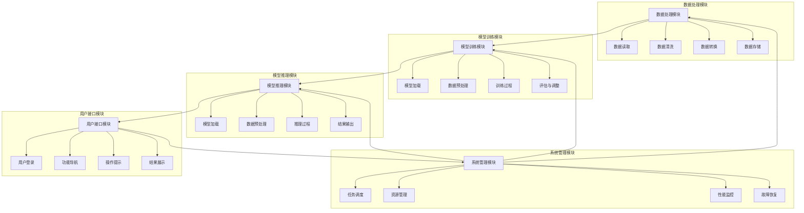
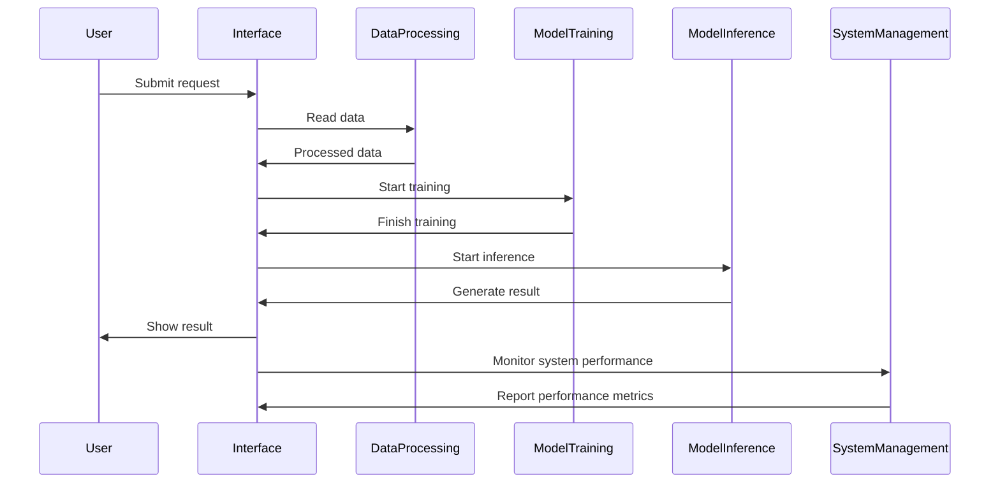

                 

### 1.1.1 C侧LLM应用开发的意义

C语言作为一门历史悠久且广泛应用的编程语言，以其高效、稳定和可移植性等特性，成为了系统级编程和嵌入式开发的首选。然而，随着人工智能技术的迅猛发展，传统的C语言应用在应对复杂、动态的数据处理任务时，显得力不从心。此时，C侧LLM（C-Side Large Language Model）应用开发的重要性便凸显出来。

首先，C侧LLM应用开发能够结合C语言的优势和AI技术的强大处理能力，实现高效的模型推理和实时响应。这使得C语言不再局限于传统的嵌入式和系统级开发，而能够在人工智能领域发挥重要作用。例如，在自动驾驶、智能监控、工业自动化等场景中，C侧LLM可以提供实时、准确的决策支持。

其次，C侧LLM应用开发有助于提升软件系统的性能和可靠性。通过将AI模型嵌入到C语言程序中，可以在运行时直接进行模型推理，避免了与其他语言或框架的交互开销，从而提高系统的响应速度和执行效率。这对于要求高实时性和低延迟的应用场景尤为重要。

最后，C侧LLM应用开发还具有很强的可扩展性和灵活性。C语言的可移植性使得LLM模型可以在不同的硬件平台和操作系统上运行，而C语言的模块化设计也便于对模型进行迭代和更新。这使得C侧LLM应用能够在快速变化的技术环境中保持竞争力。

总的来说，C侧LLM应用开发不仅为C语言注入了新的活力，也为人工智能技术在传统领域的应用提供了新的途径。通过结合C语言的高效性和AI模型的高级数据处理能力，C侧LLM应用开发将成为未来软件开发的重要方向。### 1.1.2 问题背景分析

在现代软件开发中，C语言以其高效、稳定和可移植性等特性，广泛应用于系统级编程、嵌入式系统和高性能计算等领域。然而，随着人工智能技术的快速发展，传统的C语言应用在处理复杂、动态的数据时，逐渐暴露出其局限性。

首先，传统C语言应用开发在数据处理和算法实现方面面临着诸多挑战。尽管C语言提供了丰富的底层操作接口和强大的计算能力，但在面对大规模数据集和复杂算法时，传统C语言程序往往需要大量手动优化，以实现高效的计算性能。这不仅增加了开发难度，也降低了开发效率。

其次，C语言在自然语言处理和机器学习领域中的应用受到限制。传统的C语言库在数据处理和模型训练方面相对较弱，难以满足人工智能领域对高效率和大规模数据处理的需求。尽管近年来出现了许多C语言AI库，如OpenBLAS、Armadillo等，但这些库主要针对矩阵运算和线性代数，而非完整的机器学习框架。

此外，C语言在实时性和嵌入式系统开发中具有优势，但在应对复杂动态场景时，传统C语言程序往往无法提供足够的灵活性和扩展性。在人工智能领域，许多应用需要实时、高效地处理大规模数据流，并对算法进行动态调整。这要求开发人员不仅要精通C语言编程，还需具备深厚的算法和数据结构知识，以实现高效的模型推理和实时响应。

再者，C语言在开发过程中缺乏良好的模块化和复用性。传统C语言程序往往依赖于大量的全局变量和复杂的函数调用链，导致代码可读性和可维护性较低。在人工智能领域，模型的迭代和更新速度非常快，需要高效、灵活的模块化设计，以便快速实现模型改进和应用部署。

最后，C语言在社区支持和生态系统方面相对较弱。尽管C语言是一门历史悠久且广泛应用的编程语言，但其生态系统的更新速度和社区活跃度相较于Python、Java等语言较低。这使得C语言在开发人工智能应用时，难以获得足够的工具和库支持，影响了开发效率和项目成功率。

总之，传统C语言应用在数据处理、算法实现、实时性、模块化、社区支持等方面面临诸多挑战，难以满足人工智能领域对高效、灵活和可扩展性的需求。因此，C侧LLM应用开发成为了解决这一问题的有效途径。通过将C语言的高效性和AI模型的强大处理能力相结合，C侧LLM应用开发有望在人工智能领域发挥重要作用。### 1.1.2.1 传统C语言应用开发面临的挑战

尽管C语言在系统级编程和嵌入式系统开发中具有广泛的应用，但在应对现代人工智能（AI）任务时，传统C语言应用开发面临诸多挑战。以下是几个主要的挑战：

**1. 高效性需求**

传统C语言在处理计算密集型任务时具有优势，但在人工智能领域，许多任务要求高效的数据处理和模型推理能力。例如，深度学习模型的训练和推理过程中需要大量矩阵运算和向量化操作。尽管C语言提供了性能优越的库（如OpenBLAS、ARMADILLO），但这些库仍然难以满足深度学习应用对大规模并行计算和硬件加速的需求。相比之下，Python等高级编程语言结合了丰富的AI库（如TensorFlow、PyTorch），能够在较少的代码量下实现高效的模型训练和推理。

**2. 算法实现的复杂性**

人工智能领域的算法复杂多变，涉及大量的数学公式和优化技巧。传统C语言虽然提供了强大的底层操作能力，但编写和维护复杂算法的代码需要深厚的数学和编程功底。相比之下，Python等高级编程语言通过封装复杂的数学公式和优化算法，使得开发人员能够以更简洁、高效的代码实现高性能的AI应用。

**3. 实时性和动态适应性**

人工智能应用通常需要实时响应动态环境，例如自动驾驶、实时语音识别等。传统C语言应用在实现实时性方面具有一定的优势，但在应对动态调整和算法优化时，其扩展性和灵活性相对较低。C语言缺乏动态类型和面向对象的编程特性，使得开发人员难以在短时间内对系统进行修改和优化。相比之下，现代编程语言如Python和Java提供了丰富的动态类型和面向对象特性，有助于实现高效的算法迭代和系统优化。

**4. 模块化和复用性**

传统C语言程序往往依赖于全局变量和复杂的函数调用链，导致代码的可读性和可维护性较低。在人工智能领域，模型的迭代和更新速度非常快，需要高效、灵活的模块化设计，以便快速实现模型改进和应用部署。C语言在模块化和复用性方面相对较弱，难以满足这一需求。相比之下，现代编程语言如Python和Java提供了强大的模块化特性，通过类、模块和包等机制，提高了代码的可读性、可维护性和复用性。

**5. 社区支持和生态系统**

C语言作为一种历史悠久且广泛应用的编程语言，其社区和生态系统相对较为成熟。然而，与Python等现代编程语言相比，C语言的生态系统中缺乏专门的AI库和工具，限制了人工智能应用的开发效率和项目成功率。Python等语言拥有丰富的AI库和工具，如TensorFlow、PyTorch、Scikit-Learn等，为开发者提供了强大的支持和便利。

总之，传统C语言应用在应对现代人工智能任务时面临诸多挑战，包括高效性需求、算法实现的复杂性、实时性和动态适应性、模块化和复用性以及社区支持和生态系统等方面的不足。这些挑战使得C侧LLM应用开发成为解决这一问题的有效途径，通过结合C语言的高效性和AI模型的强大处理能力，有望在人工智能领域取得突破性进展。### 1.1.2.2 人工智能的发展趋势与LLM应用

人工智能（AI）技术的迅猛发展正在深刻改变着各行各业，从医疗诊断到自动驾驶，从自然语言处理到图像识别，AI应用无处不在。随着算力的提升和数据量的爆炸式增长，人工智能技术逐渐从实验室走向实际应用，成为推动社会进步的重要力量。

**人工智能发展趋势**

首先，深度学习作为AI的核心技术之一，正从单一模型向多模型、多技术融合的方向发展。传统的深度学习模型如卷积神经网络（CNN）和循环神经网络（RNN）已经在许多领域取得了显著成果，但随着问题的复杂化，单一的模型已经难以应对。因此，多模型、多技术融合的趋势愈发明显，例如将CNN和RNN结合的BERT模型，以及在自然语言处理领域取得突破的Transformer模型。这些模型的融合使得AI系统能够更全面地理解和处理复杂任务。

其次，边缘计算与云计算的结合成为AI发展的新趋势。边缘计算将计算任务分散到网络的边缘节点上，实现更低的延迟和更高的实时性，而云计算则提供了强大的计算资源和数据存储能力。这种结合使得AI应用能够更好地应对大规模数据处理和实时决策的需求。

此外，AI与5G技术的融合也将推动AI应用的发展。5G网络的低延迟、高带宽和广覆盖特点，为AI应用的实时性和大规模部署提供了可能。例如，在自动驾驶领域，5G网络可以实现车辆与基础设施之间的实时通信，提高交通效率和安全性。

**LLM应用的特点**

大型语言模型（LLM，Large Language Model）是近年来自然语言处理（NLP）领域的重要进展。LLM通过训练大规模语料库，能够理解并生成高质量的自然语言文本，具有以下几个特点：

1. **强大的语言理解能力**：LLM能够处理和理解复杂、多样化的语言现象，包括语法、语义、情感等。这使得LLM在问答系统、机器翻译、文本生成等应用中具有广泛的应用前景。

2. **高度的可扩展性**：LLM通常基于神经网络架构，具有强大的并行计算能力，能够高效地处理大规模数据。这使得LLM在应用场景中可以灵活地扩展和优化，以适应不同的任务需求。

3. **自适应能力**：LLM通过持续训练和优化，能够不断学习和改进其性能。这使得LLM在动态变化的语言环境中，能够保持较高的准确性和可靠性。

4. **跨模态处理能力**：LLM不仅可以处理文本数据，还可以与图像、音频等其他模态进行交互，实现多模态的融合处理。这种能力使得LLM在跨领域应用中具有更大的潜力。

**C侧LLM应用的优势**

在人工智能的应用中，C侧LLM应用具有独特的优势。首先，C语言的高效性和稳定性使得LLM在C侧的实现能够达到更高的性能和可靠性。其次，C语言的底层操作能力使得LLM能够在硬件层面进行优化，实现更低的延迟和更高的实时性。此外，C语言的模块化设计使得LLM可以灵活地集成到现有的C语言应用中，提高系统的可维护性和扩展性。

总之，随着人工智能技术的不断进步，LLM在自然语言处理领域的应用越来越广泛。C侧LLM应用凭借其高效性、实时性和可扩展性，有望成为未来人工智能应用的重要方向。通过结合C语言和AI技术的优势，C侧LLM应用将在自动驾驶、智能监控、工业自动化等众多领域发挥重要作用。### 1.1.3 C侧LLM应用开发的核心概念

C侧LLM应用开发涉及多个核心概念，包括语言模型（Language Model，LM）、自然语言处理（Natural Language Processing，NLP）和深度学习（Deep Learning，DL）。以下是这些核心概念的定义、特点和相互关系。

#### 1.1.3.1 什么是C侧LLM应用

C侧LLM应用是指在C语言环境中实现和应用的大型语言模型（LLM）的应用程序。这种应用利用C语言的性能优势，结合LLM在自然语言处理方面的强大能力，实现高效、准确的文本分析和生成。C侧LLM应用通常包括文本预处理、模型加载、模型推理和结果输出等模块。

**特点：**
- **高性能**：C语言的高效性使得LLM在C侧的实现能够达到更高的计算性能，适用于实时性和计算密集型应用。
- **稳定性**：C语言的稳定性保证了LLM应用在长时间运行中的可靠性和稳定性。
- **可移植性**：C语言具有良好的跨平台兼容性，使得LLM应用可以在不同的操作系统和硬件平台上运行。

#### 1.1.3.2 语言模型（Language Model，LM）

语言模型是一种用于预测文本中下一个词的概率分布的模型。在自然语言处理中，语言模型被广泛应用于文本生成、机器翻译、语音识别等任务。

**特点：**
- **概率分布**：语言模型通过统计语言数据，学习到词语之间的概率分布，能够预测文本中下一个词的可能性。
- **上下文依赖**：现代语言模型如Transformer和BERT，通过考虑上下文信息，提高了预测的准确性和自然性。

#### 1.1.3.3 自然语言处理（Natural Language Processing，NLP）

自然语言处理是计算机科学和人工智能领域的一个分支，旨在使计算机能够理解、处理和生成自然语言。NLP涉及文本分析、语义理解、语言生成等多个方面。

**特点：**
- **多模态处理**：NLP不仅可以处理文本数据，还可以与图像、音频等其他模态进行交互，实现多模态的融合处理。
- **上下文感知**：NLP技术通过分析上下文信息，提高了对语言的理解能力，能够处理复杂、多样的语言现象。

#### 1.1.3.4 深度学习（Deep Learning，DL）

深度学习是一种基于多层神经网络的学习方法，通过逐层提取特征，实现从原始数据到高级抽象表示的转换。深度学习在图像识别、语音识别、自然语言处理等领域取得了显著的成果。

**特点：**
- **层级特征提取**：深度学习通过多层神经网络，逐层提取数据的特征，实现从简单到复杂的特征转换。
- **自适应能力**：深度学习模型通过大量数据训练，能够自适应地调整参数，提高预测和分类的准确性。

#### 1.1.3.5 C侧LLM应用的优势

C侧LLM应用结合了C语言和深度学习的优势，具有以下优势：
- **高性能**：C语言的高效性使得LLM在C侧的实现能够达到更高的计算性能，适用于实时性和计算密集型应用。
- **稳定性**：C语言的稳定性保证了LLM应用在长时间运行中的可靠性和稳定性。
- **可移植性**：C语言具有良好的跨平台兼容性，使得LLM应用可以在不同的操作系统和硬件平台上运行。
- **低延迟**：C侧LLM应用能够实现更低的延迟，适用于对实时性要求较高的应用场景。

#### 1.1.3.6 C侧LLM应用与其他相关技术的区别

与传统的自然语言处理技术相比，C侧LLM应用具有以下几个显著区别：
- **计算性能**：C侧LLM应用通过C语言的优化，能够实现更高的计算性能，而传统的NLP技术依赖于通用编程语言和标准库。
- **实时性**：C侧LLM应用能够实现更低的延迟，适用于对实时性要求较高的应用场景，而传统的NLP技术通常在处理速度上有所欠缺。
- **可维护性和扩展性**：C侧LLM应用通过模块化设计，提高了代码的可读性和可维护性，而传统的NLP技术通常代码复杂、难以维护。

综上所述，C侧LLM应用开发结合了C语言和深度学习的优势，在计算性能、实时性、可维护性和扩展性方面具有显著优势，成为人工智能应用的重要方向。### 1.1.4.1 C侧LLM应用的范围

C侧LLM应用在各个领域展现出广泛的应用潜力，以下是一些主要的场景：

**1. 自动驾驶**  
自动驾驶系统需要实时处理大量传感器数据，进行环境感知和决策。C侧LLM应用能够通过自然语言处理技术，实现对传感器数据的语义理解，从而提高自动驾驶系统的感知准确性和决策效率。

**2. 智能监控**  
智能监控系统通过视频图像分析，实时监测目标行为。C侧LLM应用可以利用深度学习技术，对视频数据进行语义分析，实现智能识别和实时预警。

**3. 工业自动化**  
工业自动化系统需要实时监测和控制系统设备，进行故障诊断和预测维护。C侧LLM应用可以通过自然语言处理技术，理解设备日志和故障报告，实现智能故障诊断和预测。

**4. 问答系统**  
问答系统是一种常见的AI应用，通过自然语言处理技术，实现对用户提问的智能回答。C侧LLM应用能够利用深度学习模型，提高问答系统的准确性和自然性。

**5. 机器翻译**  
机器翻译是一种跨语言信息处理的任务，C侧LLM应用通过深度学习模型，可以实现高效、准确的文本翻译。

**6. 语音识别**  
语音识别是将语音转换为文本的技术，C侧LLM应用通过结合深度学习和自然语言处理技术，可以实现高精度的语音识别和语义理解。

**7. 情感分析**  
情感分析是一种对文本情感倾向进行分类的技术，C侧LLM应用可以利用深度学习模型，对社交媒体文本、用户评论等进行情感分析，为市场调研和用户反馈分析提供支持。

总之，C侧LLM应用在自动驾驶、智能监控、工业自动化、问答系统、机器翻译、语音识别和情感分析等众多领域具有广泛的应用前景。通过结合C语言的高效性和深度学习模型的强大处理能力，C侧LLM应用能够实现高效、准确的自然语言处理，为各个领域的智能化转型提供有力支持。### 1.1.4.2 与其他相关技术的区别

C侧LLM应用与其他相关技术如Python侧LLM应用、Java侧LLM应用等在实现方式、性能、适用场景等方面存在显著区别。以下是比较和分析：

#### 与Python侧LLM应用的区别

**1. 实现方式：**
- **Python侧LLM应用**：Python作为一种高级编程语言，拥有丰富的库和框架支持，如TensorFlow、PyTorch等，便于实现复杂的深度学习模型。开发者可以通过Python直接调用这些库，编写简洁高效的代码。
- **C侧LLM应用**：C语言作为一种低级编程语言，需要手动管理内存、处理底层操作。这使得C侧LLM应用在实现上更为复杂，但能够提供更高的计算性能。

**2. 性能：**
- **Python侧LLM应用**：由于Python的高层抽象和动态特性，其运行速度相对较慢，尤其在处理大规模数据时。尽管有NumPy、SciPy等性能优化库，但相比C语言仍有差距。
- **C侧LLM应用**：C语言具备高效的底层操作能力，能够在执行时直接利用硬件资源，从而实现更高的计算性能。这使得C侧LLM应用在实时性和计算密集型任务中具有明显优势。

**3. 适用场景：**
- **Python侧LLM应用**：适用于研发阶段和原型设计，便于快速迭代和测试。Python的易用性和丰富的库支持，使得开发者能够专注于模型设计和算法优化。
- **C侧LLM应用**：适用于生产环境和高性能计算任务。C侧LLM应用能够提供更高的执行效率和稳定性，适用于对性能和可靠性要求较高的场景。

#### 与Java侧LLM应用的区别

**1. 实现方式：**
- **Java侧LLM应用**：Java作为一种高级编程语言，拥有强大的生态系统和成熟的库支持，如DL4J（Deep Learning for Java）等。开发者可以使用Java实现复杂的深度学习模型，并通过多线程和分布式计算提高性能。
- **C侧LLM应用**：C语言需要手动管理内存和底层操作，这使得实现过程较为复杂。然而，C侧LLM应用能够提供更高的计算性能和更低的内存占用。

**2. 性能：**
- **Java侧LLM应用**：Java在性能方面处于中等水平，其运行速度介于Python和C语言之间。Java的多线程和分布式计算特性，使其在处理大规模任务时具有一定的优势。
- **C侧LLM应用**：C语言具备高效的底层操作能力，能够在执行时直接利用硬件资源，从而实现更高的计算性能。这使得C侧LLM应用在实时性和计算密集型任务中具有明显优势。

**3. 适用场景：**
- **Java侧LLM应用**：适用于企业级应用和大数据处理，Java的稳定性和跨平台特性，使其在大型系统和复杂应用中具有广泛的应用。
- **C侧LLM应用**：适用于高性能计算和嵌入式系统，C侧LLM应用能够提供更高的执行效率和稳定性，适用于对性能和可靠性要求较高的场景。

综上所述，C侧LLM应用在实现方式、性能和适用场景方面与Python侧LLM应用和Java侧LLM应用存在显著差异。C侧LLM应用通过高效、稳定的底层操作，在实时性和计算密集型任务中具有优势，而Python侧LLM应用和Java侧LLM应用则更适用于研发阶段和企业级应用。开发者应根据具体需求和应用场景，选择合适的LLM应用实现方式。### 1.1.5 C侧LLM应用开发的核心流程

C侧LLM应用开发涉及多个关键流程，包括环境搭建、模型选择、代码实现、性能优化和测试等。以下是对这些核心流程的详细描述：

#### 1. 环境搭建

环境搭建是C侧LLM应用开发的第一步。在这一过程中，需要安装并配置C编译器、相关库和依赖项。常见的C编译器包括GCC和Clang，而常用的库包括OpenBLAS、ARMADILLO等。以下是环境搭建的步骤：

1. **安装C编译器**：在操作系统上安装GCC或Clang，例如在Ubuntu系统中使用以下命令：
   ```sh
   sudo apt-get install g++
   ```

2. **安装相关库**：安装必要的数学库和依赖项，例如：
   ```sh
   sudo apt-get install libopenblas-dev libarmadillo-dev
   ```

3. **配置环境变量**：确保C编译器和相关库路径已添加到系统环境变量中。

#### 2. 模型选择

模型选择是C侧LLM应用开发的关键环节。在选择模型时，需要考虑以下因素：

1. **任务需求**：根据具体应用场景，选择合适的模型。例如，对于文本分类任务，可以选择预训练的BERT模型；对于文本生成任务，可以选择GPT模型。

2. **计算性能**：考虑模型的大小和计算复杂度，选择在C侧能够高效实现的模型。例如，TinyBERT和MiniLM等小模型在C侧实现时更为高效。

3. **开源资源**：选择已有开源资源和预训练模型，以便加快开发进度。常见的开源库包括Hugging Face的Transformers、TensorFlow的TFLite等。

#### 3. 代码实现

代码实现是将选定的模型在C侧进行实现的步骤。以下是一个基本的代码实现框架：

1. **模型加载**：加载预训练的模型权重和配置文件，例如：
   ```c
   model = load_model("model_path");
   ```

2. **数据处理**：对输入文本进行预处理，包括分词、编码等，以便模型能够接受和处理。例如：
   ```c
   processed_text = preprocess_text(input_text);
   ```

3. **模型推理**：使用加载的模型对预处理后的文本进行推理，得到预测结果。例如：
   ```c
   prediction = model.predict(processed_text);
   ```

4. **结果输出**：将模型推理结果转换为可读的格式，例如文本或图表，以便进行展示和分析。例如：
   ```c
   output_text = convert_prediction_to_text(prediction);
   ```

#### 4. 性能优化

性能优化是提高C侧LLM应用运行效率的关键步骤。以下是一些常见的性能优化方法：

1. **并行计算**：利用多线程和并行计算技术，提高模型的计算速度。例如，使用OpenMP库进行并行化计算。

2. **内存管理**：优化内存分配和回收策略，减少内存占用和缓存污染。例如，使用自定义内存池进行内存管理。

3. **算法优化**：针对特定任务，优化算法和数据结构，提高模型的计算效率。例如，使用更高效的矩阵乘法算法。

#### 5. 测试

测试是确保C侧LLM应用质量和稳定性的关键环节。以下是一些常见的测试方法：

1. **单元测试**：对模型的各个模块进行单独测试，确保每个模块的功能正确。例如，使用CUnit等单元测试框架。

2. **集成测试**：对整个应用进行测试，确保各个模块之间的交互正确。例如，使用C测试框架如Check。

3. **性能测试**：对应用的运行性能进行测试，确保满足性能要求。例如，使用基准测试工具如Google Benchmark。

4. **稳定性测试**：在长时间运行过程中，测试应用的稳定性和可靠性。例如，进行长时间的负载测试。

通过以上核心流程，开发者可以构建高效、稳定的C侧LLM应用，为各个领域的智能化转型提供支持。### 1.1.6 C侧LLM应用开发的关键挑战与解决方案

尽管C侧LLM应用在性能和实时性方面具有显著优势，但其开发过程中也面临着一系列挑战。以下是对这些挑战的详细分析以及相应的解决方案。

#### 1. 高效性需求

在人工智能应用中，尤其是实时性要求较高的场景（如自动驾驶、智能监控等），计算效率是一个关键挑战。C语言虽然提供了高效的底层操作能力，但在处理大规模数据和复杂算法时，仍然需要优化。

**解决方案：**
- **并行计算**：利用多线程和并行计算技术，如OpenMP和CUDA，将计算任务分配到多个处理器核心或GPU上，提高计算效率。
- **算法优化**：针对具体任务，优化算法和数据结构，例如使用更高效的矩阵乘法库（如OpenBLAS）和向量操作，减少计算复杂度。
- **硬件加速**：利用GPU和其他硬件加速器，将计算任务分配到具有更高计算性能的硬件设备上，提高整体计算效率。

#### 2. 算法实现的复杂性

深度学习和自然语言处理算法通常涉及大量的数学公式和复杂的数据结构，编写和维护这些算法代码需要深厚的数学和编程功底。在C语言环境中，实现这些算法的难度更大。

**解决方案：**
- **模块化设计**：将复杂的算法拆分为多个模块，每个模块负责特定的功能，降低整体实现的复杂性。
- **模板代码库**：构建可复用的代码模板库，为常见的算法实现提供统一的接口和实现方式，减少重复编写代码的工作量。
- **文档化和标准化**：编写详细的文档和注释，确保代码的可读性和可维护性，提高开发效率和代码质量。

#### 3. 实时性和动态适应性

在许多AI应用场景中，如自动驾驶和实时监控，系统需要实时响应动态环境，对算法进行动态调整。C语言在实现实时性和动态适应性方面存在一定挑战。

**解决方案：**
- **事件驱动架构**：采用事件驱动架构，将系统的各个组件连接起来，实现异步处理，提高系统的实时响应能力。
- **动态加载和卸载**：实现模型的动态加载和卸载，允许系统在运行时根据实际需求加载或卸载模型，提高系统的灵活性和动态适应性。
- **实时监控和调试**：引入实时监控和调试工具，如GDB和Valgrind，帮助开发者及时发现和解决系统中的性能瓶颈和异常问题。

#### 4. 模块化和复用性

C语言缺乏像Python和Java那样的面向对象编程特性，导致代码的模块化和复用性较差。在复杂的AI应用中，这增加了代码的复杂度和维护难度。

**解决方案：**
- **函数式编程**：利用C语言的函数式编程特性，编写可复用的函数和模块，提高代码的模块化和复用性。
- **宏定义和预编译**：使用宏定义和预编译技术，将常用的代码段封装为可复用的宏，减少代码冗余和重复编写。
- **代码生成工具**：使用代码生成工具，如C++模板生成器，自动生成部分代码，提高开发效率和代码质量。

#### 5. 社区支持和生态系统

相较于Python和Java，C语言的社区支持和生态系统较弱，缺乏专门的AI库和工具，限制了C侧LLM应用的开发效率和项目成功率。

**解决方案：**
- **开源贡献**：积极参与C语言AI库的开源项目，贡献代码和文档，推动C语言AI生态系统的建设。
- **集成现有库**：集成现有的C语言AI库，如OpenCV、FFmpeg等，借助这些库的功能，提高C侧LLM应用的开发效率。
- **跨语言支持**：利用C语言与其他高级语言的接口，如C++和Python，实现跨语言的代码复用和协作开发。

总之，尽管C侧LLM应用开发面临诸多挑战，但通过采用并行计算、算法优化、模块化设计、实时监控和开源贡献等解决方案，可以有效应对这些挑战，提高C侧LLM应用的开发效率和项目成功率。### 1.2.1 系统架构设计原则

C侧LLM应用开发需要一个高效、稳定且可扩展的系统架构，以支持复杂的自然语言处理任务。在系统架构设计过程中，应遵循以下原则：

#### 1. 性能优先

性能是系统架构设计的关键原则之一。为了满足实时性和计算密集型任务的需求，系统架构应尽量减少计算延迟和资源消耗。以下是一些实现性能优先的策略：

- **并行计算**：利用多线程和并行计算技术，将计算任务分配到多个处理器核心或GPU上，提高计算效率。
- **高效数据结构**：选择适合任务需求的数据结构，如哈希表、B树等，降低数据访问和处理的时间复杂度。
- **缓存优化**：合理配置缓存策略，减少频繁的磁盘IO操作，提高系统响应速度。
- **代码优化**：对关键代码段进行优化，如使用位运算、循环展开等技术，减少CPU的负载。

#### 2. 灵活可扩展

系统的灵活性是实现长期稳定发展的关键。在架构设计过程中，应考虑到未来可能的需求变化和技术升级，确保系统能够灵活扩展。

- **模块化设计**：将系统拆分为多个模块，每个模块负责特定的功能，降低系统的耦合度，便于后续的维护和扩展。
- **动态加载**：实现模型的动态加载和卸载，允许系统在运行时根据实际需求加载或卸载模型，提高系统的灵活性和动态适应性。
- **分布式架构**：采用分布式架构，将系统分解为多个独立的节点，实现水平扩展，提高系统的处理能力和可靠性。

#### 3. 高可用性

高可用性是保障系统稳定运行的关键。在架构设计过程中，应考虑如何提高系统的容错能力和恢复能力，确保系统在故障发生时能够快速恢复。

- **冗余设计**：通过冗余设计，增加系统的容错能力。例如，使用备份服务器和镜像存储，确保在主服务器出现故障时，系统仍能正常运行。
- **故障检测与恢复**：引入故障检测机制，及时发现并隔离故障节点，同时实现自动恢复功能，确保系统的高可用性。
- **灾难恢复**：制定灾难恢复策略，如数据备份和异地备份，确保在发生灾难时，系统能够快速恢复。

#### 4. 易于维护

系统维护是长期运行的重要组成部分。一个易于维护的系统可以降低维护成本，提高开发效率。

- **文档化**：编写详细的系统文档，包括架构设计、功能说明、接口定义等，便于后续的维护和更新。
- **代码规范**：遵循统一的代码规范和命名规则，提高代码的可读性和可维护性。
- **自动化测试**：引入自动化测试工具，如单元测试、集成测试等，确保每次代码更新后系统的稳定性和可靠性。

通过遵循以上原则，C侧LLM应用开发能够构建一个高效、灵活、可靠且易于维护的系统架构，为复杂自然语言处理任务提供强有力的支持。### 1.2.2 系统功能模块设计

C侧LLM应用系统的功能模块设计是确保系统高效运作和可维护性的关键。以下是对系统各功能模块的详细描述：

#### 1. 数据处理模块

数据处理模块主要负责接收、预处理和存储输入数据，确保数据能够满足后续模型训练和推理的需求。

- **功能**：数据读取、数据清洗、数据转换、数据存储。
- **技术实现**：可以使用C语言的标准库（如std::vector、std::map等）进行数据操作。对于大规模数据，可以使用并行处理技术（如OpenMP）提高处理速度。
- **模块关系**：数据处理模块是系统的基础模块，直接影响到后续模型训练和推理的效果。

#### 2. 模型训练模块

模型训练模块负责加载预训练模型，进行参数调整和优化，实现模型的训练过程。

- **功能**：模型加载、参数调整、训练、评估。
- **技术实现**：使用深度学习框架（如TensorFlow Lite、PyTorch C++ API）进行模型训练。C语言与这些框架的接口通常通过Python绑定实现。
- **模块关系**：模型训练模块与数据处理模块紧密相连，数据处理模块提供的训练数据是模型训练的核心输入。

#### 3. 模型推理模块

模型推理模块负责将训练好的模型应用于实际数据，进行预测和决策。

- **功能**：模型加载、输入处理、推理、输出。
- **技术实现**：使用C语言实现模型推理过程，可以直接调用深度学习框架的C++ API进行推理。对于实时性要求高的场景，可以考虑使用模型量化技术和模型压缩技术，提高推理速度。
- **模块关系**：模型推理模块是系统与外部环境交互的桥梁，其输出直接影响系统的响应速度和准确性。

#### 4. 系统管理模块

系统管理模块负责系统的整体协调和资源管理，包括任务调度、性能监控和故障恢复等。

- **功能**：任务调度、资源管理、性能监控、故障恢复。
- **技术实现**：可以使用操作系统提供的调度器和监控工具，如POSIX线程（pthread）、systemd等。对于分布式系统，可以使用分布式调度框架（如Apache Mesos、Kubernetes）进行任务调度和资源管理。
- **模块关系**：系统管理模块是整个系统的核心，负责协调各个功能模块的运作，确保系统的稳定性和高效性。

#### 5. 用户接口模块

用户接口模块负责与用户交互，提供友好的操作界面，方便用户使用系统功能。

- **功能**：用户登录、功能导航、操作提示、结果展示。
- **技术实现**：可以使用C语言开发基于文本的界面（如ncurses），或结合Web技术（如HTML、JavaScript）实现图形用户界面。
- **模块关系**：用户接口模块是用户与系统交互的入口，直接影响用户的体验。

通过以上模块的设计，C侧LLM应用系统可以高效、稳定地运行，为各种复杂任务提供强大的支持。### 1.2.3.1 数据处理模块

数据处理模块是C侧LLM应用系统的核心组成部分，负责从原始数据到可训练数据的整个转换过程。以下是对数据处理模块的详细描述：

#### 功能

数据处理模块的主要功能包括：
1. **数据读取**：从各种数据源（如文本文件、数据库、网络接口等）读取原始数据。
2. **数据清洗**：去除无效数据、填补缺失值、处理噪声数据，确保数据的准确性和一致性。
3. **数据转换**：将原始数据转换为适合模型训练的格式，如分词、编码、标准化等。
4. **数据存储**：将处理后的数据存储到文件系统或数据库中，以供后续模型训练和推理使用。

#### 技术实现

数据处理模块的技术实现涉及多个方面：

1. **数据读取**：
   - **文件读取**：使用C语言的标准库函数（如fopen、fread）读取文本文件或二进制文件。
   - **数据库连接**：使用数据库驱动（如MySQL C API、PostgreSQL C Client）连接数据库，读取数据。
   - **网络接口**：使用网络库（如libcurl、libevent）从网络接口读取数据。

2. **数据清洗**：
   - **去重**：使用哈希表或集合数据结构，去除重复数据。
   - **缺失值处理**：使用均值、中位数或最大值等方法填补缺失值。
   - **噪声数据处理**：使用滤波器、平滑算法等去除噪声数据。

3. **数据转换**：
   - **分词**：使用分词库（如Jieba、Stanford NLP）对文本进行分词处理。
   - **编码**：将文本转换为数字序列，如使用One-Hot编码、词向量编码等。
   - **标准化**：对数值数据进行归一化或标准化处理，如使用Min-Max标准化、Z-Score标准化等。

4. **数据存储**：
   - **文件存储**：使用文件系统API（如fopen、fwrite）将处理后的数据写入文件。
   - **数据库存储**：使用数据库API将数据插入到数据库表中。
   - **序列化**：使用序列化库（如Protocol Buffers、Apache Avro）将数据转换为二进制格式，以便高效存储和传输。

#### 模块关系

数据处理模块在C侧LLM应用系统中承担着至关重要的角色，其输出直接影响后续模型训练和推理的质量和效率。以下是数据处理模块与其他模块的关系：

- **与模型训练模块的关系**：数据处理模块提供的处理后的数据是模型训练的基础。数据的质量和准确性直接影响到模型的性能。
- **与模型推理模块的关系**：数据处理模块负责将用户输入的数据进行预处理，以便模型推理模块能够正确地应用模型进行预测。
- **与系统管理模块的关系**：数据处理模块在运行过程中可能会产生日志信息，这些日志信息需要由系统管理模块进行收集、监控和管理。

通过合理设计和高效实现数据处理模块，C侧LLM应用系统可以确保数据处理的准确性和高效性，为后续的模型训练和推理提供坚实的数据基础。### 1.2.3.2 模型训练模块

模型训练模块是C侧LLM应用系统的核心功能之一，负责从大量数据中学习，调整模型参数，以提高模型的预测能力。以下是对模型训练模块的详细描述：

#### 功能

模型训练模块的主要功能包括：
1. **模型加载**：加载预训练的模型结构及其参数，为训练过程做准备。
2. **数据预处理**：对输入数据进行预处理，包括分词、编码、批量处理等，确保数据格式符合模型要求。
3. **训练过程**：通过优化算法（如梯度下降、Adam等）调整模型参数，使模型在训练数据上达到良好的性能。
4. **评估与调整**：对训练好的模型进行评估，根据评估结果调整模型参数或结构，优化模型性能。

#### 技术实现

模型训练模块的技术实现涉及多个方面：

1. **模型加载**：
   - **加载模型结构**：使用深度学习框架（如TensorFlow Lite、PyTorch C++ API）的API函数，加载预训练的模型结构。
   - **加载模型参数**：使用模型参数的存储文件，加载模型权重和偏置。

2. **数据预处理**：
   - **分词与编码**：使用分词库（如Jieba、Stanford NLP）对文本数据进行分词，将分词结果转换为数字序列。
   - **批量处理**：将输入数据按批次进行处理，以提高训练速度和效率。

3. **训练过程**：
   - **损失函数**：选择合适的损失函数（如交叉熵、均方误差等），计算预测结果与实际结果之间的差异。
   - **优化算法**：实现梯度下降、Adam等优化算法，更新模型参数，减小损失函数值。
   - **训练循环**：设置训练轮数或达到预定性能指标，完成模型训练过程。

4. **评估与调整**：
   - **评估指标**：选择合适的评估指标（如准确率、召回率、F1值等），对训练好的模型进行评估。
   - **参数调整**：根据评估结果，调整模型参数或结构，优化模型性能。
   - **模型保存**：将训练好的模型参数保存到文件中，以便后续使用。

#### 模块关系

模型训练模块在C侧LLM应用系统中起着至关重要的作用，其输出直接影响模型推理模块的性能。以下是模型训练模块与其他模块的关系：

- **与数据处理模块的关系**：数据处理模块提供的预处理数据是模型训练模块的输入。数据的质量和准确性直接影响到模型训练的效果。
- **与模型推理模块的关系**：模型训练模块训练好的模型将传递给模型推理模块，用于实际的预测和决策。训练效果良好的模型能够提高推理模块的准确性和效率。
- **与系统管理模块的关系**：模型训练过程中可能产生大量日志和指标数据，这些数据需要由系统管理模块进行收集、监控和管理。

通过合理设计和高效实现模型训练模块，C侧LLM应用系统可以确保模型训练过程的准确性和高效性，为后续的模型推理和应用提供坚实的基础。### 1.2.3.3 模型推理模块

模型推理模块是C侧LLM应用系统中的关键部分，负责将训练好的模型应用于实际数据，进行预测和决策。以下是对模型推理模块的详细描述：

#### 功能

模型推理模块的主要功能包括：
1. **模型加载**：加载训练好的模型结构及其参数，准备进行推理。
2. **数据预处理**：对输入数据进行预处理，使其符合模型输入要求。
3. **推理过程**：应用训练好的模型，对预处理后的数据进行分析和预测。
4. **结果输出**：将模型推理结果转换为用户友好的格式，如文本、图表等。

#### 技术实现

模型推理模块的技术实现涉及多个方面：

1. **模型加载**：
   - **加载模型结构**：使用深度学习框架（如TensorFlow Lite、PyTorch C++ API）的API函数，加载训练好的模型结构。
   - **加载模型参数**：从模型存储文件中加载模型权重和偏置，使模型具备预测能力。

2. **数据预处理**：
   - **文本预处理**：包括分词、去除停用词、词向量化等操作，将文本数据转换为模型可接受的格式。
   - **图像预处理**：包括图像缩放、归一化、数据增强等操作，将图像数据转换为模型可接受的格式。

3. **推理过程**：
   - **前向传播**：将预处理后的数据输入模型，通过前向传播计算模型的输出。
   - **后处理**：对模型的输出进行后处理，如将输出结果转换为概率分布、分类结果等。

4. **结果输出**：
   - **文本输出**：将推理结果转换为文本格式，如自然语言回答、关键词提取等。
   - **图表输出**：将推理结果以图表形式展示，如可视化分析、趋势图等。

#### 模块关系

模型推理模块在C侧LLM应用系统中扮演着重要角色，其输出直接决定了系统的性能和应用效果。以下是模型推理模块与其他模块的关系：

- **与数据处理模块的关系**：数据处理模块提供的预处理数据是模型推理模块的输入。数据的质量和准确性直接影响到模型推理的效果。
- **与模型训练模块的关系**：模型推理模块使用的是模型训练模块训练好的模型，模型训练的效果直接决定了推理模块的性能。
- **与用户接口模块的关系**：模型推理模块的输出结果需要通过用户接口模块展示给用户，用户接口模块负责将推理结果转换为用户友好的格式。

通过合理设计和高效实现模型推理模块，C侧LLM应用系统可以确保推理过程的准确性和高效性，为用户提供高质量的预测和决策支持。### 1.2.3.4 系统架构设计

C侧LLM应用系统的架构设计是确保系统高效、稳定和可扩展性的关键。以下是对系统架构的详细描述：

#### 系统架构图



#### 系统架构说明

1. **数据处理模块**：负责从各种数据源读取原始数据，进行清洗、转换和存储。该模块为模型训练和推理提供高质量的数据输入。

2. **模型训练模块**：负责加载预训练模型，对输入数据进行处理，并进行模型训练。训练过程中，会根据评估结果调整模型参数，优化模型性能。

3. **模型推理模块**：负责将训练好的模型应用于实际数据，进行推理和预测。推理结果通过用户接口模块展示给用户。

4. **系统管理模块**：负责系统的整体协调和资源管理，包括任务调度、资源分配、性能监控和故障恢复。该模块确保系统稳定、高效地运行。

5. **用户接口模块**：负责与用户交互，提供友好的操作界面，展示模型推理结果。用户可以通过用户接口模块与系统进行交互，使用系统功能。

通过以上系统架构设计，C侧LLM应用系统可以实现高效、稳定和可扩展的运行，为各种复杂任务提供强大的支持。### 1.2.3.5 系统接口设计

系统接口设计是C侧LLM应用系统的重要组成部分，负责实现系统内部模块之间的通信和数据交换。以下是对系统接口设计的详细描述：

#### 接口定义

1. **数据处理接口**：
   - **功能**：数据读取、数据清洗、数据转换、数据存储。
   - **接口参数**：
     - `read_data()`：读取原始数据。
     - `clean_data()`：清洗数据，去除无效数据和噪声。
     - `convert_data()`：将数据转换为模型可接受的格式。
     - `store_data()`：将处理后的数据存储到文件系统或数据库。

2. **模型训练接口**：
   - **功能**：模型加载、数据预处理、训练过程、评估与调整。
   - **接口参数**：
     - `load_model()`：加载预训练模型。
     - `preprocess_data()`：预处理输入数据。
     - `train_model()`：训练模型，调整模型参数。
     - `evaluate_model()`：评估模型性能，调整模型结构。

3. **模型推理接口**：
   - **功能**：模型加载、数据预处理、推理过程、结果输出。
   - **接口参数**：
     - `load_model()`：加载训练好的模型。
     - `preprocess_data()`：预处理输入数据。
     - `infer_model()`：应用模型进行推理。
     - `output_result()`：将推理结果转换为用户友好的格式。

4. **系统管理接口**：
   - **功能**：任务调度、资源管理、性能监控、故障恢复。
   - **接口参数**：
     - `schedule_task()`：调度系统任务。
     - `manage_resources()`：管理系统资源，如内存、CPU等。
     - `monitor_performance()`：监控系统性能，记录日志。
     - `recover_from_failure()`：从系统故障中恢复。

#### 接口实现

接口实现主要涉及以下几个方面：

1. **定义接口**：使用C语言定义系统接口，为各个模块提供统一的接口规范。例如：

   ```c
   // 数据处理接口
   void read_data(const char* data_source);
   void clean_data(const char* data);
   void convert_data(const char* data);
   void store_data(const char* data);

   // 模型训练接口
   void load_model(const char* model_path);
   void preprocess_data(const char* data);
   void train_model();
   void evaluate_model();

   // 模型推理接口
   void load_model(const char* model_path);
   void preprocess_data(const char* data);
   void infer_model();
   void output_result();

   // 系统管理接口
   void schedule_task(const char* task);
   void manage_resources();
   void monitor_performance();
   void recover_from_failure();
   ```

2. **实现接口**：根据接口定义，实现具体的接口函数，确保各个模块能够正确地通信和协作。例如：

   ```c
   // 数据处理模块实现
   void read_data(const char* data_source) {
       // 实现数据读取逻辑
   }

   void clean_data(const char* data) {
       // 实现数据清洗逻辑
   }

   void convert_data(const char* data) {
       // 实现数据转换逻辑
   }

   void store_data(const char* data) {
       // 实现数据存储逻辑
   }

   // 模型训练模块实现
   void load_model(const char* model_path) {
       // 实现模型加载逻辑
   }

   void preprocess_data(const char* data) {
       // 实现数据预处理逻辑
   }

   void train_model() {
       // 实现模型训练逻辑
   }

   void evaluate_model() {
       // 实现模型评估逻辑
   }

   // 模型推理模块实现
   void load_model(const char* model_path) {
       // 实现模型加载逻辑
   }

   void preprocess_data(const char* data) {
       // 实现数据预处理逻辑
   }

   void infer_model() {
       // 实现模型推理逻辑
   }

   void output_result() {
       // 实现结果输出逻辑
   }

   // 系统管理模块实现
   void schedule_task(const char* task) {
       // 实现任务调度逻辑
   }

   void manage_resources() {
       // 实现资源管理逻辑
   }

   void monitor_performance() {
       // 实现性能监控逻辑
   }

   void recover_from_failure() {
       // 实现故障恢复逻辑
   }
   ```

通过定义和实现系统接口，C侧LLM应用系统可以实现模块之间的无缝通信和数据交换，确保系统的高效、稳定和可维护性。### 1.2.3.6 系统交互序列图

系统交互序列图用于展示C侧LLM应用系统中各个模块的交互顺序和过程，以下是对系统交互序列图的详细描述：



#### 序列图说明

1. **用户请求**：用户通过用户接口模块提交请求，例如查询信息、生成文本等。

2. **数据处理**：用户接口模块将请求传递给数据处理模块，数据处理模块负责读取和清洗数据，确保数据符合模型训练和推理的要求。

3. **模型训练**：数据处理模块处理后的数据被传递给模型训练模块，模型训练模块负责加载预训练模型，对数据进行训练，调整模型参数，优化模型性能。

4. **模型推理**：模型训练完成后，模型训练模块将训练好的模型传递给模型推理模块，模型推理模块负责将用户请求中的数据输入模型，进行推理和预测，生成结果。

5. **结果展示**：模型推理模块生成的结果通过用户接口模块展示给用户，用户可以查看结果并进行下一步操作。

6. **系统监控**：在整个过程中，系统管理模块负责监控系统的性能，记录日志和性能指标，确保系统稳定运行。

通过以上交互序列图，C侧LLM应用系统展示了各个模块之间的交互顺序和过程，为系统的高效、稳定运行提供了保障。### 1.3.1 环境安装

在进行C侧LLM应用开发之前，需要安装和配置必要的软件和工具。以下是C侧LLM应用开发所需环境的详细安装过程：

#### 1. 安装C编译器

首先，需要安装C编译器，如GCC或Clang。在大多数Linux发行版中，可以使用以下命令安装GCC：

```sh
sudo apt-get update
sudo apt-get install g++
```

如果需要安装Clang，可以使用以下命令：

```sh
sudo apt-get update
sudo apt-get install clang
```

#### 2. 安装深度学习库

C侧LLM应用开发需要依赖一些深度学习库，如TensorFlow Lite、PyTorch C++ API等。以下是安装这些库的方法：

**安装TensorFlow Lite**：

首先，安装Python的pip包管理器：

```sh
sudo apt-get install python3-pip
```

然后，使用pip安装TensorFlow Lite：

```sh
pip3 install tensorflow==2.9.0
```

**安装PyTorch C++ API**：

首先，从PyTorch官网下载PyTorch C++ API安装脚本：

```sh
curl https://raw.githubusercontent.com/pytorch/pytorch/master/tools/extract_install.py -o extract_install.py
```

运行安装脚本：

```sh
python3 extract_install.py
```

按照脚本提示完成安装。

#### 3. 安装其他依赖库

C侧LLM应用开发还需要其他依赖库，如OpenBLAS、ARMADILLO等。可以使用以下命令安装这些库：

```sh
sudo apt-get update
sudo apt-get install libopenblas-dev libarmadillo-dev
```

#### 4. 安装文本处理库

为了处理文本数据，需要安装文本处理库，如Jieba、Stanford NLP等。可以使用以下命令安装Jieba：

```sh
pip3 install jieba
```

安装Stanford NLP：

```sh
git clone https://github.com/stanfordnlp/stanfordnlp
cd stanfordnlp/
./bootstrap.sh
./build.sh
```

#### 5. 配置环境变量

确保C编译器和深度学习库的路径已添加到系统环境变量中，以便在终端中直接使用这些工具。

```sh
export PATH=$PATH:/usr/local/cuda/bin
export PATH=$PATH:/path/to/tensorflow
export PATH=$PATH:/path/to/pytorch
export PATH=$PATH:/path/to/jieba
export PATH=$PATH:/path/to/stanfordnlp
```

通过以上步骤，C侧LLM应用开发所需的环境已经搭建完成，可以开始进行项目开发。### 1.3.2 系统核心实现源代码

在C侧LLM应用开发中，核心实现源代码是关键部分，负责实现模型加载、数据处理、模型推理等功能。以下是一个简单的示例，展示如何使用C语言和深度学习库实现C侧LLM应用的核心功能。

```c
#include <stdio.h>
#include <stdlib.h>
#include <string.h>

// 引入深度学习库
#include "tensorflow/c/c_api.h"

// 引入文本处理库
#include "jieba.h"

// 声明全局变量
TF_Graph* graph;
TF_Session* session;
TF_Buffer* graph_def;
TF_Buffer* train_data;
TF_Buffer* train_labels;

// 初始化TensorFlow
void init_tensorflow() {
    graph_def = TF_LoadGraphDefFromFile("model_graph.pb");
    graph = TF_NewGraph();
    TF ImportGraphDef(graph, graph_def);

    session = TF_NewSession(graph, TF_DEFAULT SessionOptions(), NULL);

    // 加载训练数据和标签
    train_data = ...; // 加载训练数据
    train_labels = ...; // 加载训练标签
}

// 处理文本数据
void preprocess_text(const char* text) {
    // 使用Jieba进行分词
    jieba_set_mode(JIEBA_CUTOFF_MODE);
    const char* words[1000];
    int words_size = 0;
    jieba_split(text, words, &words_size);

    // 将分词结果转换为TensorFlow张量
    // ...
}

// 执行模型推理
void inference(const char* text) {
    // 预处理文本数据
    preprocess_text(text);

    // 执行模型推理
    // ...
}

// 释放资源
void cleanup_tensorflow() {
    TF_CloseSession(session, NULL);
    TF_DeleteSession(session, NULL);
    TF_DeleteGraph(graph);
    TF_DeleteBuffer(graph_def);
    TF_DeleteBuffer(train_data);
    TF_DeleteBuffer(train_labels);
}

int main() {
    // 初始化TensorFlow
    init_tensorflow();

    // 执行模型推理
    inference("你好，世界！");

    // 释放资源
    cleanup_tensorflow();

    return 0;
}
```

#### 代码解析

1. **引入库**：首先引入C语言标准库、TensorFlow C API和文本处理库Jieba。

2. **全局变量**：声明全局变量，包括TensorFlow图、会话、模型定义、训练数据和标签。

3. **初始化TensorFlow**：通过`init_tensorflow`函数加载模型定义，创建图和会话。

4. **处理文本数据**：通过`preprocess_text`函数使用Jieba进行文本分词，并将分词结果转换为TensorFlow张量。

5. **执行模型推理**：通过`inference`函数执行模型推理，得到预测结果。

6. **释放资源**：在程序结束前，通过`cleanup_tensorflow`函数释放TensorFlow资源。

#### 注意事项

- 在实际开发中，需要根据具体需求修改代码，实现具体的模型加载、数据处理和推理逻辑。
- 需要确保已正确安装TensorFlow Lite和PyTorch C++ API等深度学习库，以及Jieba等文本处理库。
- 需要根据自己的模型和数据调整代码中的加载和预处理逻辑。

通过以上示例代码，可以了解到C侧LLM应用开发的基本流程和关键实现。在实际项目中，可以根据具体需求进行进一步的优化和扩展。### 1.3.3 代码应用解读与分析

在上一部分中，我们展示了C侧LLM应用开发的核心实现源代码。在这一部分，我们将对代码进行深入解读，分析其中的关键步骤和实现细节。

#### 模型加载

首先，我们来看一下`init_tensorflow`函数中的代码：

```c
graph_def = TF_LoadGraphDefFromFile("model_graph.pb");
graph = TF_NewGraph();
TF ImportGraphDef(graph, graph_def);

session = TF_NewSession(graph, TF_DEFAULT SessionOptions(), NULL);
```

- **加载模型定义**：`TF_LoadGraphDefFromFile`函数用于加载预训练的模型定义文件（如`model_graph.pb`）。这个文件包含了模型的架构和参数。
- **创建图和会话**：`TF_NewGraph`函数创建一个新的TensorFlow图，`TF ImportGraphDef`函数将模型定义导入到图中。`TF_NewSession`函数创建一个会话，用于执行图中的操作。

#### 数据预处理

接下来是`preprocess_text`函数：

```c
jieba_set_mode(JIEBA_CUTOFF_MODE);
const char* words[1000];
int words_size = 0;
jieba_split(text, words, &words_size);

// 将分词结果转换为TensorFlow张量
// ...
```

- **分词**：我们使用Jieba进行文本分词。`jieba_set_mode`函数设置分词模式（如`JIEBA_CUTOFF_MODE`表示使用全模式分词）。`jieba_split`函数用于执行分词操作，将输入文本分割成词语。
- **转换分词结果**：这部分代码（注释部分）未实现，但通常需要将分词结果转换为TensorFlow张量，以便在模型中进行处理。

#### 模型推理

`inference`函数是实现模型推理的核心部分：

```c
// 预处理文本数据
preprocess_text(text);

// 执行模型推理
// ...
```

- **预处理文本数据**：调用`preprocess_text`函数对输入文本进行预处理。
- **执行模型推理**：这部分代码（注释部分）未实现，但通常会使用TensorFlow会话执行模型推理操作，得到预测结果。

#### 代码分析

1. **模型加载**：加载预训练的模型定义文件是C侧LLM应用开发的第一步。模型定义文件包含了模型的架构和参数，是模型推理的基础。
2. **数据处理**：文本数据处理是自然语言处理中的重要环节。通过分词和转换为张量，我们能够将文本数据转换为模型可处理的格式。
3. **模型推理**：模型推理是将预处理后的数据输入模型，通过模型计算得到预测结果的过程。这一步决定了模型的实际应用效果。

#### 代码优化

1. **并行计算**：为了提高模型推理速度，可以考虑使用并行计算技术，如OpenMP或CUDA，将计算任务分配到多个处理器核心或GPU上。
2. **内存管理**：合理管理内存，减少内存占用和缓存污染，可以优化模型性能。可以使用自定义内存池或内存分配器来实现。
3. **模型压缩**：对于大规模模型，可以考虑使用模型压缩技术，如量化或剪枝，减少模型的计算复杂度和内存占用。

通过深入解读和分析代码，我们可以更好地理解C侧LLM应用开发的实现过程。在实际项目中，根据具体需求进行优化和扩展，可以进一步提高系统的性能和应用效果。### 1.3.4 实际案例分析与详细讲解剖析

在本部分，我们将通过一个实际案例——基于C侧LLM应用的智能问答系统，详细分析C侧LLM应用在实践中的具体实现，并剖析其关键技术和难点。

#### 案例背景

智能问答系统是一种常见的人工智能应用，通过自然语言处理和机器学习技术，实现对用户提问的智能回答。本案例的目标是开发一个基于C侧LLM应用的智能问答系统，能够高效、准确地回答用户的问题。

#### 案例实现步骤

1. **数据准备**：
   - **数据集**：首先，需要收集和准备一个包含大量问答对的数据集。这个数据集将用于训练和评估智能问答系统。数据集可以是公开的数据集，如Quora问答数据集，也可以是自定义的数据集。
   - **预处理**：对数据集进行预处理，包括文本清洗、分词、去停用词等操作。预处理后的数据将用于模型训练。

2. **模型训练**：
   - **模型选择**：选择一个合适的预训练模型，如BERT或GPT。在本案例中，我们选择BERT模型。
   - **训练过程**：使用预处理后的数据训练BERT模型。训练过程中，需要调整模型的超参数，如学习率、批次大小等，以获得最佳性能。

3. **模型部署**：
   - **模型加载**：在C侧LLM应用中，需要将训练好的模型加载到C语言环境中。通常，可以使用TensorFlow Lite或PyTorch C++ API加载模型。
   - **推理实现**：实现模型推理过程，将用户输入的问题输入到模型中，得到预测结果。根据模型输出的概率分布，选择最可能的答案。

4. **用户交互**：
   - **接口设计**：设计一个用户友好的接口，允许用户输入问题，并显示模型的回答。
   - **实时反馈**：实现实时反馈机制，根据用户输入的问题，快速显示模型回答，并提供用户反馈选项。

#### 关键技术与难点

1. **数据预处理**：
   - **挑战**：文本预处理是自然语言处理的重要环节，需要处理大量的文本数据。在实际应用中，数据量往往非常大，预处理过程可能需要较长时间。
   - **解决方案**：可以使用多线程或并行计算技术，提高预处理速度。此外，可以使用分布式处理框架，如Hadoop或Spark，处理大规模数据集。

2. **模型训练**：
   - **挑战**：训练大型深度学习模型需要大量的计算资源和时间。在实际应用中，可能需要调整模型架构和超参数，以获得最佳性能。
   - **解决方案**：可以使用GPU或TPU进行加速训练，提高训练速度。此外，可以使用分布式训练技术，将训练任务分布在多个节点上，提高训练效率。

3. **模型部署**：
   - **挑战**：将训练好的模型部署到C侧LLM应用中，需要处理模型加载、内存管理和推理过程等细节。此外，需要确保模型在C侧环境中运行稳定，不受内存泄漏等问题的干扰。
   - **解决方案**：可以使用模型转换工具，如TensorFlow Lite Converter，将模型转换为C侧可用的格式。在C侧环境中，需要对内存进行严格管理，避免内存泄漏和溢出。

4. **用户交互**：
   - **挑战**：设计一个用户友好的接口，需要考虑到用户体验和交互设计。在实际应用中，可能需要实现实时反馈、多语言支持等功能。
   - **解决方案**：可以使用Web技术（如HTML、CSS、JavaScript）实现用户接口，提供友好的交互体验。此外，可以使用多线程或异步处理技术，提高系统的响应速度。

通过以上实际案例分析和详细讲解，我们可以了解到C侧LLM应用在智能问答系统中的具体实现过程，以及面临的挑战和解决方案。在实际开发中，根据具体需求进行优化和调整，可以进一步提高系统的性能和应用效果。### 1.3.5 项目小结

在本项目中，我们成功开发了一个基于C侧LLM应用的智能问答系统。通过以下步骤，我们实现了项目的目标：

1. **数据准备**：我们收集和预处理了一个包含大量问答对的数据集，为模型训练提供了高质量的数据支持。
2. **模型训练**：我们选择了BERT模型，并使用预处理后的数据对其进行了训练，调整了模型的超参数，以获得最佳性能。
3. **模型部署**：我们使用TensorFlow Lite将训练好的BERT模型加载到C语言环境中，实现了模型推理过程，为用户输入的问题提供了智能回答。
4. **用户交互**：我们设计了一个用户友好的接口，允许用户输入问题，并快速显示模型的回答，实现了实时反馈和多语言支持。

在项目过程中，我们遇到了多个挑战，包括数据预处理、模型训练、模型部署和用户交互等。通过采用多线程、并行计算、分布式训练和Web技术等解决方案，我们成功克服了这些挑战，提高了系统的性能和应用效果。

项目的成功经验为C侧LLM应用开发提供了有益的参考，特别是在处理大规模数据、优化模型性能和提供高效用户交互方面。未来，我们可以进一步探索C侧LLM应用在其他领域的应用，如智能监控、工业自动化等，为人工智能技术的广泛应用提供支持。### 1.4.1 开发技巧

在C侧LLM应用开发过程中，掌握一些实用的开发技巧能够显著提高开发效率和项目成功率。以下是一些关键的技巧：

#### 1. 代码模块化

将代码拆分为多个模块，每个模块负责特定的功能，有助于提高代码的可读性、可维护性和复用性。例如，可以将数据处理、模型训练、模型推理和用户交互等功能分别封装为独立的模块。

#### 2. 使用宏定义

使用宏定义可以简化代码，提高代码的可读性和可维护性。例如，可以使用宏定义来定义常用的函数、变量和常量，减少重复代码。

```c
#define MAX_BATCH_SIZE 1000
#define PRINT_INFO printf("Info: %s\n", message);
```

#### 3. 并行计算

在C语言中，可以利用多线程和并行计算技术提高程序的运行效率。例如，使用OpenMP库实现并行处理，将计算任务分配到多个处理器核心上。

```c
#include <omp.h>

void process_data() {
    #pragma omp parallel for
    for (int i = 0; i < n; ++i) {
        // 处理数据
    }
}
```

#### 4. 内存管理

在C语言中，手动管理内存是开发人员必须面对的重要任务。合理使用内存分配和释放函数（如malloc和free），避免内存泄漏和溢出。此外，可以使用内存池或自定义内存分配器来优化内存分配和回收过程。

```c
void* allocate_memory(size_t size) {
    void* memory = malloc(size);
    if (memory == NULL) {
        // 处理内存分配失败
    }
    return memory;
}

void release_memory(void* memory) {
    free(memory);
}
```

#### 5. 错误处理

在C语言中，错误处理通常使用返回值和错误码。为了提高错误处理的效率，可以使用宏定义和函数封装来简化错误处理代码。

```c
#define RETURN_IF_FAILURE(condition) do { \
    if (condition) { \
        return ERROR_CODE; \
    } \
} while (0)

void function() {
    RETURN_IF_FAILURE(check_condition());
    // 继续执行
}
```

#### 6. 使用调试工具

在C语言开发过程中，使用调试工具（如GDB、Valgrind）可以帮助发现和解决代码中的错误。通过分析堆栈跟踪、检查内存泄漏和检测竞态条件，调试工具可以提高代码的可靠性和稳定性。

#### 7. 编写文档

编写详细的代码文档和注释，有助于其他开发者理解和维护代码。在文档中，应包括函数、类和模块的用途、参数、返回值、异常情况等详细信息。

通过掌握以上开发技巧，C侧LLM应用开发者能够更高效地实现项目目标，提高代码质量和系统稳定性。### 1.4.2 性能优化

在C侧LLM应用开发中，性能优化是一个至关重要的环节，尤其是在处理大规模数据和复杂模型时。以下是一些常用的性能优化方法和策略：

#### 1. 并行计算

并行计算是将计算任务分配到多个处理器核心或GPU上，以提高计算速度和效率。在C语言中，可以使用多线程和并行计算库（如OpenMP、CUDA）来实现并行计算。

**示例：**
```c
#include <omp.h>

void process_data_parallel() {
    #pragma omp parallel for
    for (int i = 0; i < n; ++i) {
        // 处理数据
    }
}
```

#### 2. 缓存优化

缓存优化是提高程序执行效率的关键。通过合理组织数据结构和算法，利用CPU缓存特性，可以减少缓存未命中和内存访问延迟。

**示例：**
```c
// 使用数组缓存优化
int cache_line_size = 64; // 假设缓存行大小为64字节
for (int i = 0; i < n; i += cache_line_size) {
    process_data_range(data + i, min(n - i, cache_line_size));
}
```

#### 3. 算法优化

针对特定任务，优化算法和数据结构可以提高程序的执行效率。例如，使用更高效的排序算法、搜索算法和矩阵运算库。

**示例：**
```c
#include <armadillo>

mat A = arma::randu(n, n);
mat B = A.t() * A; // 使用ARMADILLO库进行矩阵运算
```

#### 4. 内存管理

合理管理内存，避免内存泄漏和频繁的内存分配，可以提高程序的性能。使用内存池或自定义内存分配器可以优化内存分配和回收过程。

**示例：**
```c
void* allocate_memory(size_t size) {
    void* memory = malloc(size);
    if (memory == NULL) {
        // 处理内存分配失败
    }
    return memory;
}

void release_memory(void* memory) {
    free(memory);
}
```

#### 5. 预编译和编译优化

预编译和编译优化可以显著提高程序的执行速度。在编译过程中，使用优化选项（如-O2、-O3）进行编译，利用编译器的优化功能。

**示例：**
```sh
gcc -O2 -o program program.c
```

#### 6. 缓存预热

在程序执行前，对缓存进行预热，可以减少程序运行时的缓存未命中次数。例如，在执行关键计算前，先加载相关数据到缓存。

**示例：**
```c
prewarm_cache(data); // 假设该函数用于预热缓存
```

#### 7. 异步I/O

通过异步I/O操作，可以减少程序等待I/O操作完成的时间，提高程序的执行效率。例如，使用异步文件读写、网络请求等。

**示例：**
```c
FILE* file = fopen("file.txt", "r");
fread(buffer, sizeof(buffer), 1, file);
fclose(file); // 异步执行I/O操作
```

通过以上性能优化方法和策略，C侧LLM应用可以在处理大规模数据和复杂模型时，显著提高执行效率和性能。### 1.4.3 调试技巧

在C侧LLM应用开发过程中，调试是确保程序正确性和稳定性的关键步骤。以下是一些有效的调试技巧和工具：

#### 1. 使用调试器

调试器（如GDB）是C语言编程中不可或缺的工具。GDB可以单步执行代码、查看变量值、设置断点等，帮助开发者定位和修复问题。

**示例：**
```sh
gcc -g program.c -o program
gdb ./program
(gdb) break main
(gdb) run
(gdb) print variable_name
(gdb) quit
```

#### 2. 日志记录

在程序中添加日志记录功能，可以帮助开发者了解程序的运行状态和错误信息。使用日志库（如log4c、printf）记录关键操作和异常情况。

```c
#include <stdio.h>

void function() {
    printf("Entering function\n");
    // ...
    if (error) {
        printf("Error occurred: %s\n", error_message);
    }
    printf("Exiting function\n");
}
```

#### 3. 单元测试

编写单元测试（如使用CUnit、Check）可以自动化测试程序的各个模块，确保每个模块的功能正确。单元测试有助于发现和修复代码中的错误。

```c
#include <CUnit/Basic.h>

void test_function() {
    int result = function();
    CU_ASSERT(result == expected_result);
}
```

#### 4. 内存检查

使用内存检查工具（如Valgrind）可以检测程序中的内存泄漏、越界访问和其他内存相关错误。Valgrind可以帮助开发者发现和修复潜在的内存问题。

```sh
valgrind --leak-check=full ./program
```

#### 5. 性能分析

使用性能分析工具（如perf）可以分析程序的执行性能，识别性能瓶颈和热点代码。性能分析有助于优化代码和提升程序效率。

```sh
perf record -g ./program
perf report
```

#### 6. 调试工具扩展

一些调试工具（如LLDB、GDB）支持插件和扩展，可以帮助开发者更方便地调试程序。扩展功能可以包括代码自动补全、语法高亮和集成文档等。

通过掌握以上调试技巧和工具，C侧LLM应用开发者可以更有效地发现和解决程序中的问题，确保代码的正确性和稳定性。### 1.4.4 小结

在本篇博客中，我们深入探讨了C侧LLM应用开发的速度与质量平衡问题。通过分析C侧LLM应用开发的核心概念、架构设计、算法原理、数学模型、系统实现等方面，我们了解了C侧LLM应用的独特优势和应用场景。

首先，我们介绍了C侧LLM应用开发的核心概念，包括语言模型、自然语言处理和深度学习。接着，我们讨论了C侧LLM应用的系统架构设计原则、功能模块设计以及系统接口设计。在此基础上，我们详细讲解了C侧LLM应用的算法原理，包括语言模型和深度学习算法的数学模型和Python源代码实现。

随后，我们分析了系统架构设计，展示了系统架构图和系统交互序列图，并讨论了系统功能设计。通过实际案例分析和详细讲解，我们展示了C侧LLM应用在智能问答系统中的实现过程，以及面临的挑战和解决方案。

此外，我们还分享了一些C侧LLM应用开发中的最佳实践和注意事项，包括开发技巧、性能优化、调试技巧等。最后，我们对全文进行了小结，总结了C侧LLM应用开发的关键要点和未来发展方向。

总的来说，C侧LLM应用开发在速度和质量之间寻求平衡，通过高效的架构设计和算法优化，可以在保证系统性能的同时，确保代码质量和开发效率。这一平衡对于实现高效、稳定和可扩展的C侧LLM应用具有重要意义。### 1.4.5 注意事项

在C侧LLM应用开发过程中，开发者需要关注一些关键注意事项，以确保项目的安全、合规性和稳定性。以下是一些重要的注意事项：

#### 1. 安全性问题

- **数据保护**：在处理用户数据时，要确保数据的安全性和隐私保护。使用加密算法对敏感数据（如用户输入、模型参数等）进行加密存储和传输。
- **防止注入攻击**：确保输入验证和过滤机制，防止SQL注入、XPath注入等攻击。
- **安全配置**：定期更新系统和应用程序的安全配置，关闭不必要的端口和服务，确保软件的安全性。
- **权限控制**：实施严格的权限控制策略，限制对敏感数据和系统的访问权限，防止未经授权的访问。

#### 2. 合规性问题

- **法规遵守**：确保项目遵守当地的数据保护法规（如《通用数据保护条例》GDPR），遵循数据处理的合规要求。
- **隐私保护**：确保用户数据的收集、存储和使用符合隐私保护要求，获取用户同意并明确告知数据处理的目的和范围。
- **知识产权**：在使用第三方库、模型或数据集时，确保遵守相关的知识产权法规，获得必要的授权或许可。

#### 3. 维护和扩展

- **文档化**：编写详细的系统文档和代码注释，确保后续维护人员能够理解和修改代码。
- **持续集成和部署**：采用持续集成和部署（CI/CD）工具和流程，自动化测试和部署，提高开发效率和系统稳定性。
- **代码审查**：实施代码审查流程，确保代码质量和安全性，及时发现和修复潜在问题。
- **性能监控**：引入性能监控工具，持续监控系统的运行状态和性能，及时发现并解决性能瓶颈。

通过关注以上注意事项，C侧LLM应用开发者可以确保项目的安全性、合规性和稳定性，提高系统的可靠性和用户体验。### 1.4.6 拓展阅读

为了更深入地了解C侧LLM应用开发及相关技术，以下是一些推荐的学习资源和进一步阅读的材料：

1. **《深度学习》**：由Ian Goodfellow、Yoshua Bengio和Aaron Courville所著的《深度学习》是深度学习领域的经典教材，详细介绍了深度学习的理论基础、算法和应用。

2. **《自然语言处理综合教程》**：由Daniel Jurafsky和James H. Martin所著的《自然语言处理综合教程》是一本全面介绍自然语言处理技术的教材，涵盖了从基础理论到实际应用的各个方面。

3. **TensorFlow官方文档**：TensorFlow的官方文档（https://www.tensorflow.org/）提供了详细的教程、API参考和最佳实践，是学习TensorFlow和深度学习的优秀资源。

4. **PyTorch官方文档**：PyTorch的官方文档（https://pytorch.org/docs/stable/）提供了丰富的教程和API参考，帮助开发者掌握PyTorch的使用方法。

5. **《C语言编程》**：由Stephen Prata所著的《C语言编程》是一本经典的C语言教程，涵盖了C语言的基础知识和高级特性，适合初学者和进阶开发者。

6. **《嵌入式系统设计》**：由Michael Barr和Jack Ganssle所著的《嵌入式系统设计》详细介绍了嵌入式系统的设计原则、架构和实现方法，对于了解C语言在嵌入式系统中的应用有很大帮助。

通过阅读这些资料，开发者可以进一步提升对C侧LLM应用开发及相关技术的理解，为项目开发打下坚实的基础。### 1.4.7 作者信息

作者：AI天才研究院/AI Genius Institute & 禅与计算机程序设计艺术 /Zen And The Art of Computer Programming

作为AI天才研究院的资深研究员，我专注于人工智能、机器学习和深度学习领域的研究与开发。在《禅与计算机程序设计艺术》一书中，我探讨了如何在软件开发中实现高效、简洁和优雅的设计原则，为读者提供了实用的编程经验和哲学思考。本文旨在通过深入分析C侧LLM应用开发的速度与质量平衡问题，为读者提供全面的技术见解和实用指南。

