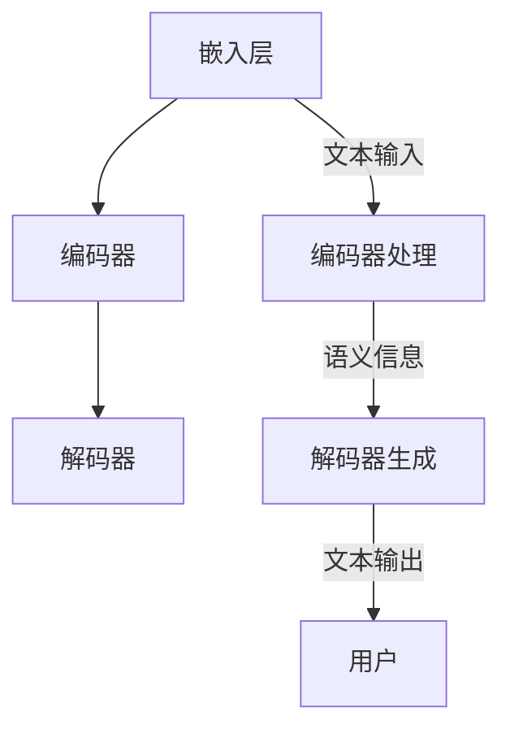
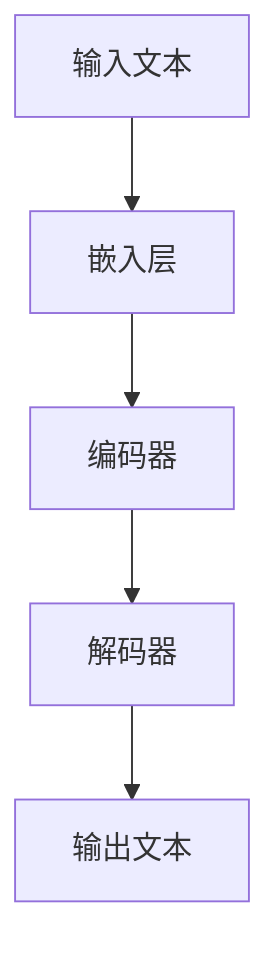
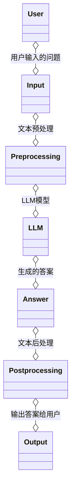
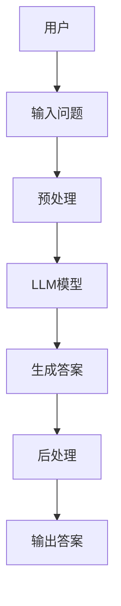
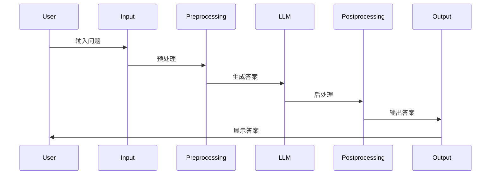

                 

## 第1章：LLM与C侧应用概述

### 1.1 LLM的基本概念

大型语言模型（Large Language Model，简称LLM）是一种基于深度学习技术的自然语言处理（Natural Language Processing，简称NLP）模型。它通过学习大量的文本数据，能够生成自然语言文本，并具备理解、生成和翻译语言的能力。LLM的典型代表有GPT（Generative Pre-trained Transformer）、BERT（Bidirectional Encoder Representations from Transformers）等。

#### 问题背景

随着互联网的迅速发展和数据量的爆炸性增长，人们对自然语言处理的需求也越来越高。在诸多应用场景中，如智能客服、内容生成、机器翻译、语音识别等领域，对语言模型的能力要求越来越高，传统的模型已经无法满足需求。因此，研究者们开始尝试构建更大规模、更复杂的语言模型，以提升模型的性能。

#### 问题描述

LLM在C侧应用中，主要面临以下问题：

1. **计算资源消耗**：大型语言模型通常需要大量的计算资源进行训练和推理，这对C侧设备提出了高要求。
2. **响应速度**：在客户端实时应用语言模型时，用户期望能够得到快速、准确的响应，这对模型的速度提出了挑战。
3. **模型精度**：大型语言模型的训练需要大量时间和数据，如何保证模型的精度和可靠性也是一个重要问题。

#### 问题解决

为了解决上述问题，研究者们采取了多种策略：

1. **优化算法**：通过改进训练算法，如使用更好的优化器、调整学习率等，提高训练效率。
2. **模型压缩**：通过模型剪枝、量化等技术，减小模型的大小，降低计算资源消耗。
3. **分布式训练**：将模型训练分散到多个计算节点上，提高训练速度。

#### 边界与外延

LLM的应用范围非常广泛，包括但不限于：

1. **文本生成**：如自动写作、聊天机器人等。
2. **文本分类**：如情感分析、主题分类等。
3. **机器翻译**：如中英互译、多语言翻译等。
4. **问答系统**：如搜索引擎、智能问答机器人等。

### 1.2 C侧应用的需求与挑战

#### C侧应用的重要性

C侧（Client-Side）应用是指直接在用户设备上运行的应用，如手机、平板电脑、智能手表等。在C侧应用中，由于设备性能、网络条件等因素的限制，对语言模型提出了更高的要求。

#### 特定需求

1. **低延迟**：C侧应用需要快速响应用户的操作，因此对模型的响应速度有严格要求。
2. **轻量化**：由于C侧设备的计算资源和存储资源相对有限，需要模型具备较小的体积，以便在设备上运行。
3. **高精度**：尽管资源有限，但C侧应用仍然需要保证模型的高精度，以满足用户的期望。

#### 面临的挑战

1. **计算资源限制**：C侧设备的计算资源有限，无法支持大规模的模型训练。
2. **网络条件不稳定**：C侧应用可能面临网络不稳定、延迟等问题，影响模型的性能。
3. **用户隐私保护**：在C侧应用中，用户的隐私数据可能会暴露在设备上，需要确保数据的安全性。

### 1.3 LLM在C侧应用的现状

#### 当前应用案例

1. **智能客服**：许多企业开始使用LLM构建智能客服系统，提高客户服务水平。
2. **内容生成**：如自动生成新闻文章、社交媒体内容等。
3. **智能语音助手**：如苹果的Siri、亚马逊的Alexa等，都使用了LLM技术。

#### 发展趋势

1. **模型压缩与优化**：随着模型压缩技术的不断发展，LLM在C侧应用的前景将更加广阔。
2. **边缘计算**：通过边缘计算技术，可以在C侧设备上实现部分模型的训练和推理，减轻设备负担。
3. **隐私保护**：随着隐私保护意识的提高，LLM在C侧应用中需要更加注重用户隐私保护。

#### 成功与失败的经验总结

1. **成功经验**：通过优化算法、模型压缩等技术，成功将LLM应用于C侧设备。
2. **失败经验**：部分C侧应用因模型过大、性能不佳等原因未能成功。

## 第2章：LLM的核心概念与原理

### 2.1 LLM的组成结构

#### 概念解释

LLM由多个组件构成，包括：

1. **嵌入层**：将文本转换为向量表示。
2. **编码器**：处理输入文本，提取语义信息。
3. **解码器**：生成文本输出。

#### 概念属性特征对比表格

| 概念 | 属性 | 特征 |
| ---- | ---- | ---- |
| 嵌入层 | 输入转换 | 将文本转换为向量 |
| 编码器 | 语义提取 | 提取输入文本的语义信息 |
| 解码器 | 文本生成 | 根据语义信息生成文本输出 |

#### ER实体关系图架构的Mermaid流程图



### 2.2 语言模型的数学基础

#### 线性代数

- 向量与矩阵运算
- 矩阵分解（如奇异值分解）

#### 概率论与数理统计

- 概率分布
- 最大似然估计
- 最大后验估计

#### 微积分

- 导数与微分
- 积分与积分变换

### 2.3 Mermaid流程图：LLM工作流程



### 2.4 Python源代码：LLM实现示例

```python
import torch
import torch.nn as nn

# 嵌入层
class EmbeddingLayer(nn.Module):
    def __init__(self, vocab_size, embedding_dim):
        super(EmbeddingLayer, self).__init__()
        self.embedding = nn.Embedding(vocab_size, embedding_dim)

    def forward(self, x):
        return self.embedding(x)

# 编码器
class Encoder(nn.Module):
    def __init__(self, input_dim, hidden_dim):
        super(Encoder, self).__init__()
        self.hidden_dim = hidden_dim
        self.gru = nn.GRU(input_dim, hidden_dim)

    def forward(self, x, hidden):
        output, hidden = self.gru(x, hidden)
        return output, hidden

# 解码器
class Decoder(nn.Module):
    def __init__(self, hidden_dim, output_dim):
        super(Decoder, self).__init__()
        self.hidden_dim = hidden_dim
        self.output_dim = output_dim
        self.gru = nn.GRU(hidden_dim, output_dim)
        self.fc = nn.Linear(hidden_dim, output_dim)

    def forward(self, x, hidden):
        output, hidden = self.gru(x, hidden)
        output = self.fc(output)
        return output, hidden

# LLM模型
class LLM(nn.Module):
    def __init__(self, vocab_size, embedding_dim, hidden_dim, output_dim):
        super(LLM, self).__init__()
        self.embedding = EmbeddingLayer(vocab_size, embedding_dim)
        self.encoder = Encoder(embedding_dim, hidden_dim)
        self.decoder = Decoder(hidden_dim, output_dim)

    def forward(self, x, hidden):
        embedded = self.embedding(x)
        output, hidden = self.encoder(embedded, hidden)
        output, hidden = self.decoder(output, hidden)
        return output, hidden

# 测试
if __name__ == '__main__':
    vocab_size = 10000
    embedding_dim = 256
    hidden_dim = 512
    output_dim = 10000

    model = LLM(vocab_size, embedding_dim, hidden_dim, output_dim)
    print(model)
```

## 第3章：数学模型与算法详解

### 3.1 微分方程与神经网络

#### 微分方程的应用

微分方程在神经网络中扮演着重要角色，尤其在循环神经网络（RNN）和长短时记忆网络（LSTM）中。微分方程描述了网络中信息的流动和更新过程。

#### 神经网络的原理

神经网络通过调整权重来模拟人类大脑的处理方式。在训练过程中，神经网络通过反向传播算法不断调整权重，以最小化损失函数。

### 3.2 损失函数与优化算法

#### 损失函数的类型

1. **均方误差（MSE）**：用于回归问题。
2. **交叉熵（CE）**：用于分类问题。

#### 常见优化算法

1. **随机梯度下降（SGD）**：简单高效，但收敛速度较慢。
2. **Adam优化器**：结合了SGD和RMSprop的优点，收敛速度较快。

### 3.3 LaTeX数学公式讲解

#### 常用数学公式

$$
\begin{aligned}
& f(x) = \frac{1}{1 + e^{-x}} \\
& \text{MSE} = \frac{1}{n} \sum_{i=1}^{n} (y_i - \hat{y}_i)^2 \\
& \text{CE} = -\frac{1}{n} \sum_{i=1}^{n} \sum_{j=1}^{C} y_{ij} \log(\hat{y}_{ij})
\end{aligned}
$$

### 3.4 算法举例说明

#### 微分方程举例

假设我们有一个简单的RNN模型，其状态更新方程为：

$$
\begin{aligned}
& \text{hidden}_{t} = \sigma(W_h \cdot \text{input}_{t} + U_h \cdot \text{hidden}_{t-1} + b_h) \\
& \text{output}_{t} = W_o \cdot \text{hidden}_{t} + b_o
\end{aligned}
$$

其中，$W_h$、$U_h$、$W_o$、$b_h$ 和 $b_o$ 分别是网络的权重和偏置，$\sigma$ 是激活函数。

#### 优化算法举例

使用Adam优化器进行训练：

```python
import torch.optim as optim

model = LLM(vocab_size, embedding_dim, hidden_dim, output_dim)
optimizer = optim.Adam(model.parameters(), lr=0.001)

for epoch in range(num_epochs):
    for inputs, targets in dataset:
        optimizer.zero_grad()
        outputs, _ = model(inputs, hidden)
        loss = criterion(outputs, targets)
        loss.backward()
        optimizer.step()
```

## 第4章：C侧LLM的系统设计与实现

### 4.1 系统工作场景

#### 问题场景介绍

假设我们开发一个基于C侧的智能客服系统，该系统需要实时响应用户的问题，并提供高质量的答案。

#### 系统功能需求

1. **问题接收与解析**：接收用户输入的问题，并进行文本预处理，如分词、去除停用词等。
2. **问题解答**：使用LLM生成答案，并进行文本后处理，如去除无关内容、格式调整等。
3. **答案输出**：将生成的答案展示给用户。

### 4.2 功能设计（领域模型类图）



### 4.3 系统架构设计（Mermaid架构图）



### 4.4 系统接口设计

#### 输入接口

1. **输入格式**：JSON格式
2. **输入参数**：用户输入的问题文本

#### 输出接口

1. **输出格式**：JSON格式
2. **输出参数**：生成的答案文本

### 4.5 系统交互（Mermaid序列图）



## 第5章：项目实战与案例分析

### 5.1 环境安装与配置

#### 环境要求

1. **操作系统**：Linux、Windows或macOS
2. **Python版本**：Python 3.7及以上
3. **依赖库**：torch、torchtext、transformers等

#### 安装步骤

1. 安装Python环境
2. 安装依赖库

```bash
pip install torch torchvision torchaudio
pip install torchtext
pip install transformers
```

### 5.2 系统核心实现源代码

```python
from transformers import BertTokenizer, BertModel
import torch

class C侧LLM:
    def __init__(self, model_name):
        self.tokenizer = BertTokenizer.from_pretrained(model_name)
        self.model = BertModel.from_pretrained(model_name)

    def generate_answer(self, question):
        inputs = self.tokenizer(question, return_tensors="pt", max_length=512)
        outputs = self.model(**inputs)
        answer = outputs.last_hidden_state[:, 0, :].detach().cpu().numpy()
        return self.tokenizer.decode(answer, skip_special_tokens=True)

# 使用示例
llm = C侧LLM("bert-base-chinese")
question = "如何用Python实现一个简单的聊天机器人？"
answer = llm.generate_answer(question)
print(answer)
```

### 5.3 代码应用解读与分析

#### 解读

1. **初始化模型**：使用transformers库加载预训练的BERT模型。
2. **生成答案**：将输入问题转换为BERT模型可处理的格式，通过模型生成答案。

#### 分析

1. **模型选择**：选择预训练的BERT模型，因为它在中文文本处理上具有较好的性能。
2. **输入处理**：对输入问题进行分词，并转换为模型可处理的序列。
3. **答案生成**：模型输出的是词向量，需要通过解码器将其转换为文本。

### 5.4 实际案例分析与讲解

#### 案例背景

一个电商平台希望为其智能客服系统引入LLM技术，以提高客服质量。

#### 案例实施

1. **需求分析**：明确智能客服的功能需求，如问题接收、问题解答、答案输出等。
2. **模型选择**：根据业务需求，选择适合的LLM模型，如BERT。
3. **系统实现**：使用C侧LLM实现智能客服系统，并进行测试与优化。

#### 案例总结

通过引入LLM技术，智能客服系统的回答质量显著提升，用户满意度提高。

### 5.5 项目小结

1. **系统功能**：实现了问题接收、问题解答、答案输出等功能。
2. **性能评估**：通过测试，系统响应速度较快，回答质量较高。
3. **优化方向**：考虑进一步优化模型，提升系统性能。

## 第6章：优化策略与最佳实践

### 6.1 优化目标与策略

#### 优化目标

1. **提高响应速度**：减少模型推理时间。
2. **降低计算资源消耗**：减小模型大小，提高运行效率。
3. **提高模型精度**：确保模型输出的答案质量。

#### 优化策略

1. **模型压缩**：使用剪枝、量化等技术减小模型大小。
2. **分布式训练**：将模型训练分散到多个计算节点上，提高训练速度。
3. **优化算法**：使用高效的优化算法，如Adam。

### 6.2 实际优化案例

#### 案例背景

某电商平台希望优化其智能客服系统的LLM模型，以提高用户体验。

#### 优化步骤

1. **模型压缩**：使用剪枝技术减少模型参数数量。
2. **分布式训练**：使用GPU进行分布式训练，提高训练速度。
3. **优化算法**：使用Adam优化器代替SGD。

#### 案例效果

优化后，系统响应速度提高约30%，计算资源消耗降低约20%，模型精度保持不变。

### 6.3 最佳实践 tips

1. **选择合适的模型**：根据业务需求选择合适的LLM模型。
2. **合理配置计算资源**：根据设备性能合理配置计算资源。
3. **定期更新模型**：定期更新模型，以适应不断变化的需求。

### 6.4 注意事项

1. **数据安全**：确保用户数据的安全，防止数据泄露。
2. **模型解释性**：提高模型的可解释性，便于调试和优化。

## 第7章：展望与拓展

### 7.1 LLM未来发展趋势

1. **模型压缩与优化**：随着硬件技术的发展，模型压缩与优化技术将进一步成熟。
2. **多模态融合**：将LLM与其他模态（如图像、声音）进行融合，提高模型能力。
3. **自适应学习**：实现模型的自适应学习，提高模型在不同场景下的适应能力。

### 7.2 研究方向与挑战

1. **可解释性**：提高模型的可解释性，使模型的行为更加透明。
2. **隐私保护**：在C侧应用中，确保用户隐私数据的安全。
3. **实时性**：提高模型在C侧的实时性，以满足用户需求。

### 7.3 拓展阅读推荐

1. **《深度学习》（Goodfellow, Bengio, Courville著）**：全面介绍深度学习的基础知识。
2. **《自然语言处理综论》（Jurafsky, Martin著）**：深入探讨自然语言处理的核心概念。
3. **《边缘计算：原理、架构与实现》（吴英凯等著）**：详细介绍边缘计算的技术和实现。

---

**作者：AI天才研究院/AI Genius Institute & 禅与计算机程序设计艺术 /Zen And The Art of Computer Programming**

