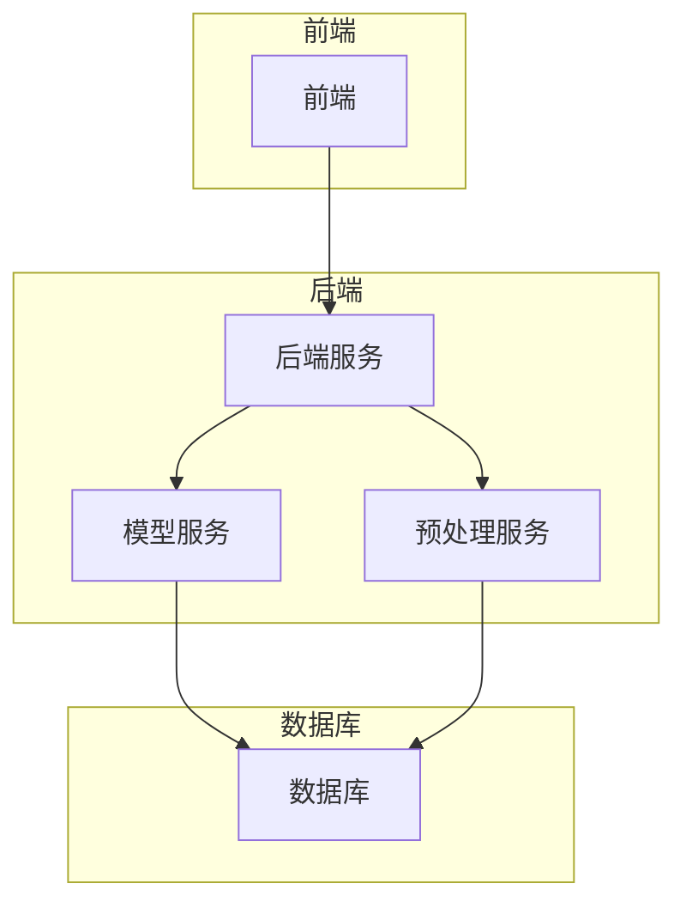
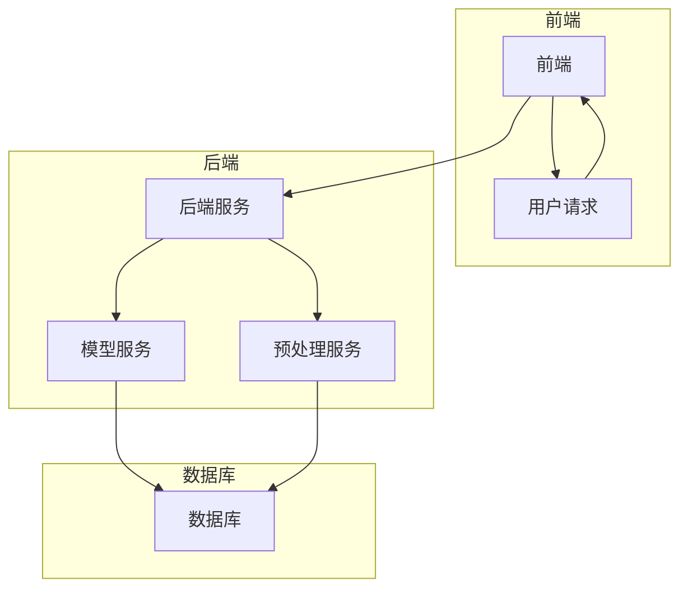
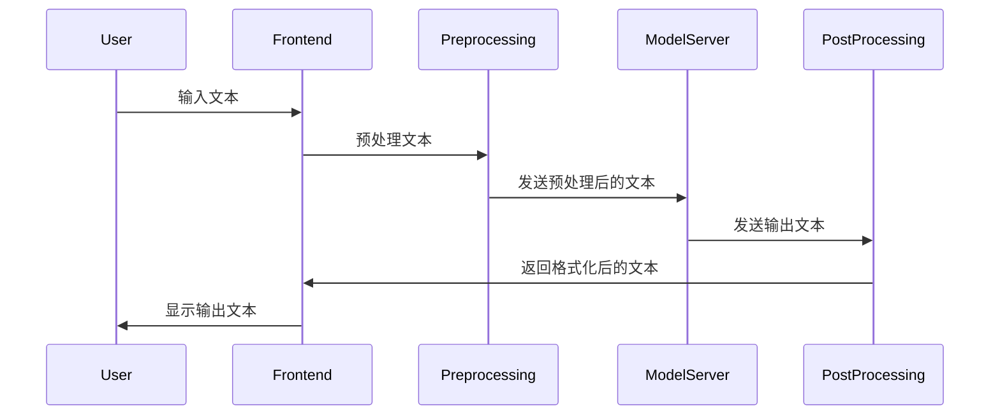

                 

### 文章标题

## C侧LLM应用探索的关键：速度与敏捷性

### 关键词：
- C侧LLM
- 速度与敏捷性
- 应用场景
- 优化策略
- 案例分析

### 摘要：

本文旨在深入探讨C侧LLM（Client-Side Large Language Model）的应用场景、核心概念及其实现与优化策略。通过详细的分析与案例分析，本文揭示了C侧LLM在速度与敏捷性方面相较于传统LLM的优势和挑战。文章分为五部分：首先介绍C侧LLM的应用背景，然后探讨其核心概念与原理，接着介绍应用实现与优化策略，并通过具体案例分析其实际应用效果，最后总结C侧LLM的优势与未来发展方向。通过本文的阅读，读者将能够全面了解C侧LLM的技术细节和实际应用价值。

### 目录大纲

```markdown
----------------------------------------------------------------
# 第一部分: C侧LLM应用背景

## 第1章: C侧LLM应用背景
### 1.1 C侧LLM概述
### 1.2 C侧LLM的应用场景
### 1.3 C侧LLM的核心优势
### 1.4 C侧LLM的挑战与机遇
### 1.5 本章小结

## 第二部分: C侧LLM核心概念与原理

## 第2章: C侧LLM核心概念与原理
### 2.1 C侧LLM的数学模型
### 2.2 C侧LLM的属性特征
### 2.3 C侧LLM与传统LLM的对比
### 2.4 C侧LLM的ER实体关系图
### 2.5 本章小结

## 第三部分: C侧LLM应用实现与优化

## 第3章: C侧LLM应用实现
### 3.1 环境搭建
### 3.2 系统架构设计
### 3.3 系统接口设计与交互
### 3.4 C侧LLM算法实现
### 3.5 本章小结

## 第四部分: C侧LLM应用案例分析

## 第4章: C侧LLM应用案例分析
### 4.1 案例一：自然语言处理
### 4.2 案例二：代码生成
### 4.3 案例三：智能推荐
### 4.4 本章小结

## 第五部分: C侧LLM优化策略与速度提升

## 第5章: C侧LLM优化策略
### 5.1 模型压缩技术
### 5.2 并行计算与分布式训练
### 5.3 硬件加速技术
### 5.4 内存优化
### 5.5 本章小结

----------------------------------------------------------------
```

### 第一部分：C侧LLM应用背景

#### 第1章：C侧LLM应用背景

在现代信息技术的飞速发展下，人工智能（AI）技术已经成为推动各行各业变革的核心动力。其中，自然语言处理（NLP）作为AI技术的重要组成部分，受到了广泛关注。LLM（Large Language Model）作为一种先进的NLP模型，凭借其强大的语义理解能力和文本生成能力，在多个领域展现出了巨大的应用潜力。C侧LLM（Client-Side Large Language Model），作为LLM在客户端部署的实现方案，因其速度和敏捷性优势，逐渐成为研究和应用的热点。

#### 1.1 C侧LLM概述

C侧LLM，即Client-Side Large Language Model，指的是在客户端而非服务器端运行的LLM。与传统的服务器端部署相比，C侧LLM具有以下优势：

1. **速度优势**：C侧LLM将计算任务从服务器转移到客户端，减少了网络延迟，提高了响应速度。
2. **敏捷性优势**：C侧LLM允许客户端设备根据自身硬件资源进行模型选择和优化，提高了系统的自适应性和灵活性。
3. **隐私保护**：C侧LLM在客户端运行，减少了数据传输，有助于保护用户隐私。

#### 1.1.1 问题背景

随着移动互联网和物联网的快速发展，终端设备的性能和计算能力不断提高，为C侧LLM的应用提供了良好的基础。然而，C侧LLM在实际应用中也面临一些挑战：

1. **计算资源限制**：客户端设备通常计算资源有限，需要优化模型结构和算法以提高运行效率。
2. **数据隐私和安全**：客户端设备运行LLM可能涉及到敏感数据，需要采取有效措施确保数据安全。
3. **实时性和稳定性**：C侧LLM需要确保在复杂网络环境下提供稳定、实时的服务。

#### 1.1.2 问题描述

C侧LLM的核心问题是如何在有限的计算资源下实现高效的模型运行，同时保证数据的安全和实时性。具体而言，问题描述如下：

1. **模型选择与优化**：如何根据客户端设备的硬件资源选择合适的LLM模型，并进行优化以提高运行效率？
2. **数据传输与处理**：如何有效管理客户端与服务器之间的数据传输，确保数据安全和隐私？
3. **实时响应**：如何在复杂的网络环境中保证C侧LLM的实时性和稳定性？

#### 1.1.3 问题解决思路

针对上述问题，可以采取以下解决思路：

1. **模型压缩与优化**：通过模型压缩和优化技术，减少模型大小和计算复杂度，提高运行效率。
2. **数据加密与传输优化**：采用数据加密技术和优化传输协议，确保数据安全和隐私。
3. **网络容错与实时调度**：通过网络容错技术和实时调度策略，提高C侧LLM的实时性和稳定性。

#### 1.1.4 边界与外延

C侧LLM的应用边界包括：

1. **设备性能**：C侧LLM需要适应不同设备性能，包括移动设备、嵌入式设备和高性能计算机。
2. **网络环境**：C侧LLM需要适应不同的网络环境，包括有线和无线网络、稳定和不稳定的网络。
3. **应用领域**：C侧LLM可以应用于自然语言处理、代码生成、智能推荐等多个领域。

#### 1.2 C侧LLM的应用场景

C侧LLM具有广泛的应用场景，以下是几个典型的应用场景：

1. **自然语言处理**：C侧LLM可以用于聊天机器人、智能客服、文本摘要、语言翻译等任务。
2. **代码生成**：C侧LLM可以用于代码补全、代码生成、代码优化等任务，提高开发效率和代码质量。
3. **智能推荐**：C侧LLM可以用于个性化推荐系统，根据用户行为和偏好提供个性化推荐。

#### 1.3 C侧LLM的核心优势

C侧LLM的核心优势包括：

1. **速度优势**：C侧LLM通过在客户端运行，减少了网络延迟，提高了响应速度。
2. **敏捷性优势**：C侧LLM可以根据客户端设备资源进行动态调整，提高了系统的自适应性和灵活性。
3. **隐私保护**：C侧LLM在客户端运行，减少了数据传输，有助于保护用户隐私。

#### 1.3.1 速度优势

C侧LLM的速度优势主要体现在以下几个方面：

1. **减少网络延迟**：传统的LLM部署在服务器端，用户需要通过网络请求服务器进行处理，存在显著的网络延迟。C侧LLM在客户端运行，减少了网络请求和响应时间，提高了整体响应速度。
2. **本地计算**：C侧LLM在客户端设备上运行，利用了设备本身的计算资源，避免了服务器端的计算压力，提高了数据处理速度。
3. **并发处理**：C侧LLM可以同时处理多个请求，提高了系统的并发处理能力，进一步提高了响应速度。

#### 1.3.2 敏捷性优势

C侧LLM的敏捷性优势包括：

1. **动态资源分配**：C侧LLM可以根据客户端设备的硬件资源动态调整模型大小和复杂度，以适应不同设备的性能。
2. **快速迭代**：C侧LLM在客户端运行，模型更新和迭代过程更加灵活，可以快速响应需求变化，提高系统的适应性和灵活性。
3. **个性化定制**：C侧LLM可以根据用户行为和偏好进行个性化定制，提供更加精准的服务。

#### 1.3.3 与现有技术的对比

C侧LLM与传统LLM在性能、成本和安全性等方面存在明显差异：

1. **性能**：传统LLM部署在服务器端，计算和存储资源相对集中，处理速度较慢。C侧LLM在客户端运行，利用了客户端设备的计算资源，响应速度更快。
2. **成本**：传统LLM需要服务器端的高性能计算设备，成本较高。C侧LLM利用现有客户端设备，降低了硬件成本。
3. **安全性**：传统LLM涉及大量数据传输，存在数据泄露风险。C侧LLM在客户端运行，减少了数据传输，提高了数据安全性。

#### 1.4 C侧LLM的挑战与机遇

C侧LLM在发展过程中面临以下挑战和机遇：

1. **挑战**：
   - **计算资源限制**：客户端设备的计算资源有限，需要优化模型结构和算法以提高运行效率。
   - **数据隐私和安全**：客户端设备运行LLM可能涉及到敏感数据，需要采取有效措施确保数据安全。
   - **实时性和稳定性**：C侧LLM需要确保在复杂网络环境下提供稳定、实时的服务。

2. **机遇**：
   - **移动互联网和物联网的发展**：随着移动互联网和物联网的快速发展，终端设备的性能和计算能力不断提高，为C侧LLM的应用提供了良好的基础。
   - **数据隐私保护需求**：用户对数据隐私保护的需求日益增加，C侧LLM在隐私保护方面具有明显优势。
   - **个性化服务需求**：随着用户对个性化服务的需求不断增加，C侧LLM可以根据用户行为和偏好提供更加精准的服务。

#### 1.5 本章小结

本章介绍了C侧LLM的应用背景，包括其概述、问题背景、问题描述、问题解决思路、边界与外延以及应用场景。通过对比传统LLM，C侧LLM在速度和敏捷性方面具有明显优势，但也面临一定的挑战。本章内容为后续章节的深入探讨提供了基础。

### 第二部分：C侧LLM核心概念与原理

#### 第2章：C侧LLM核心概念与原理

在深入了解C侧LLM的应用背景后，本章将聚焦于C侧LLM的核心概念与原理，包括数学模型、属性特征、与传统LLM的对比以及ER实体关系图。通过详细阐述这些概念，读者将能够更好地理解C侧LLM的技术基础和应用优势。

#### 2.1 C侧LLM的数学模型

C侧LLM的数学模型是其核心组成部分，决定了模型的学习能力和表现。以下是对C侧LLM数学模型的详细探讨：

##### 2.1.1 概念定义

C侧LLM的数学模型主要包括以下关键概念：

1. **词汇表（Vocabulary）**：词汇表是模型能够处理的单词或字符的集合。在C侧LLM中，词汇表的大小通常与模型的复杂度和应用场景相关。
2. **词嵌入（Word Embedding）**：词嵌入是将词汇表中的每个单词映射到一个固定大小的向量空间。在C侧LLM中，词嵌入是捕捉词语语义信息的重要手段。
3. **注意力机制（Attention Mechanism）**：注意力机制是近年来深度学习模型中广泛使用的一种机制，用于模型在处理序列数据时关注重要的部分。C侧LLM通过注意力机制提升对输入文本的理解能力。
4. **循环神经网络（RNN）**：循环神经网络是一种能够处理序列数据的神经网络模型，包括长短期记忆（LSTM）和门控循环单元（GRU）。C侧LLM中的RNN用于捕捉文本中的长期依赖关系。

##### 2.1.2 数学公式与模型

C侧LLM的数学模型通常可以表示为以下形式：

$$
\text{LLM}(x) = f(W_1 \cdot x + b_1)
$$

其中，$x$ 表示输入文本的词嵌入向量，$f$ 表示神经网络函数，$W_1$ 和 $b_1$ 分别为权重矩阵和偏置向量。

神经网络函数 $f$ 可以是多层感知机（MLP）、LSTM 或 GRU 等。以下是一个简单的LSTM模型示例：

$$
\begin{aligned}
\text{h}_{t} &= \text{sigmoid}(W_h \cdot \text{h}_{t-1} + U_x \cdot \text{x}_t + b_h) \\
\text{C}_{t} &= \text{sigmoid}(W_c \cdot \text{h}_{t} + b_c) \odot \text{f}_{t} + \text{g}_{t} \odot \text{i}_{t} \\
\text{f}_{t} &= \text{sigmoid}(W_f \cdot \text{h}_{t-1} + U_x \cdot \text{x}_t + b_f) \\
\text{i}_{t} &= \text{sigmoid}(W_i \cdot \text{h}_{t-1} + U_x \cdot \text{x}_t + b_i) \\
\text{g}_{t} &= \text{tanh}(W_g \cdot \text{h}_{t} + b_g)
\end{aligned}
$$

其中，$\text{h}_{t}$ 和 $\text{C}_{t}$ 分别表示当前时刻的隐藏状态和细胞状态，$\text{i}_{t}$、$\text{f}_{t}$ 和 $\text{g}_{t}$ 分别表示输入门、遗忘门和生成门的状态。

##### 2.1.3 算法流程

C侧LLM的算法流程通常包括以下步骤：

1. **输入处理**：将输入文本转换为词嵌入向量。
2. **前向传播**：将词嵌入向量输入到神经网络中，通过反向传播更新网络参数。
3. **预测与输出**：利用训练好的模型对输入文本进行预测，生成文本输出。

以下是一个简单的算法流程示例：

```python
def forward_pass(x):
    h = sigmoid(W_h * h_prev + U_x * x + b_h)
    c = sigmoid(W_c * h + b_c) * f * g + (1 - f) * c_prev
    i = sigmoid(W_i * h_prev + U_x * x + b_i)
    f = sigmoid(W_f * h_prev + U_x * x + b_f)
    g = tanh(W_g * h + b_g)
    return h, c

def backward_pass(h, c, x, y):
    # 计算损失函数和梯度
    # 更新网络参数
    pass
```

##### 2.2 C侧LLM的属性特征

C侧LLM具有一系列重要的属性特征，这些特征直接影响模型的表现和应用效果。以下是C侧LLM的主要属性特征：

1. **模型大小**：模型大小是衡量模型复杂度的重要指标。C侧LLM通常采用压缩技术，以减少模型大小，提高在客户端设备上的运行效率。
2. **训练时间**：训练时间是模型训练过程中所需的时间。C侧LLM通常采用分布式训练和并行计算技术，以减少训练时间，提高模型的训练效率。
3. **推理速度**：推理速度是模型在生成文本输出时的计算速度。C侧LLM在客户端运行，利用本地计算资源，推理速度相对较快。

以下是一个C侧LLM属性特征的对比表格：

| 属性 | C侧LLM | 传统LLM |
| --- | --- | --- |
| 模型大小 | 小 | 大 |
| 训练时间 | 短 | 长 |
| 推理速度 | 快 | 慢 |

##### 2.3 C侧LLM与传统LLM的对比

C侧LLM与传统LLM在多个方面存在显著差异。以下是C侧LLM与传统LLM的详细对比：

1. **模型结构**：传统LLM通常采用大规模的神经网络结构，如Transformer，而C侧LLM为了适应客户端设备的资源限制，通常采用较小的模型结构，如TinyBERT或MiniLM。
2. **训练方法**：传统LLM通常采用分布式训练和大规模数据集，而C侧LLM由于计算资源限制，通常采用单机训练和小数据集训练。
3. **应用效果**：传统LLM在生成文本的多样性和准确性方面表现更优，而C侧LLM在响应速度和实时性方面具有明显优势。

以下是一个C侧LLM与传统LLM对比的Mermaid ER图：

```mermaid
erDiagram
    C侧LLM ||--|{ 传统LLM }|
    C侧LLM ||--|{ 模型结构 }|
    C侧LLM ||--|{ 训练方法 }|
    C侧LLM ||--|{ 应用效果 }|
```

##### 2.4 C侧LLM的ER实体关系图

C侧LLM的ER实体关系图可以帮助我们更好地理解模型的结构和组成部分。以下是一个简单的C侧LLM ER实体关系图：

```mermaid
erDiagram
    Model ||--|{ Input }|
    Model ||--|{ Output }|
    Model ||--|{ Parameters }|
    Model ||--|{ Training Data }|
    Model ||--|{ Inference Data }|
```

在上述ER图中，`Model` 表示C侧LLM的核心实体，包括输入、输出、参数、训练数据和推理数据等组成部分。

##### 2.5 本章小结

本章详细探讨了C侧LLM的核心概念与原理，包括数学模型、属性特征、与传统LLM的对比以及ER实体关系图。通过这些概念，读者可以深入理解C侧LLM的技术基础和应用优势，为后续章节的深入探讨提供了坚实的理论基础。

### 第三部分：C侧LLM应用实现与优化

#### 第3章：C侧LLM应用实现

C侧LLM的实际应用不仅依赖于其理论基础，还需要在实际环境中进行有效的实现和优化。本章将详细讨论C侧LLM的应用实现过程，包括环境搭建、系统架构设计、系统接口设计与交互、算法实现以及代码应用解读与分析。

#### 3.1 环境搭建

在开始C侧LLM的应用实现之前，首先需要搭建合适的环境。以下是环境搭建的详细步骤：

##### 3.1.1 操作系统要求

C侧LLM可以运行在各种常见的操作系统上，如Linux、Windows和macOS。以下是操作系统的基本要求：

- **Linux**：Ubuntu 18.04及以上版本
- **Windows**：Windows 10及以上版本
- **macOS**：macOS 10.15及以上版本

##### 3.1.2 硬件配置要求

C侧LLM对硬件配置的要求相对较低，但为了确保良好的性能，建议以下配置：

- **CPU**：Intel i5及以上或同等性能的AMD处理器
- **内存**：8GB及以上
- **硬盘**：至少100GB的可用空间
- **GPU**（可选）：NVIDIA GTX 1080及以上显卡，用于硬件加速

##### 3.1.3 软件依赖安装

在操作系统环境中，需要安装一系列软件依赖，包括Python、TensorFlow或PyTorch等。以下是主要软件依赖的安装步骤：

1. **安装Python**：确保操作系统上安装了Python 3.7及以上版本。可以通过包管理器（如apt或yum）进行安装，或从Python官方网站下载安装。
   
   ```bash
   # 对于Ubuntu或Debian系统
   sudo apt update
   sudo apt install python3 python3-pip

   # 对于Fedora或RHEL系统
   sudo yum install python3 python3-pip
   ```

2. **安装TensorFlow或PyTorch**：选择合适的深度学习框架，并按照其官方文档进行安装。

   ```bash
   # 安装TensorFlow
   pip3 install tensorflow

   # 安装PyTorch
   pip3 install torch torchvision
   ```

3. **安装其他依赖**：根据具体需求安装其他必要的库和工具，如NumPy、Matplotlib等。

   ```bash
   pip3 install numpy matplotlib
   ```

##### 3.2 系统架构设计

C侧LLM的系统架构设计是确保模型高效运行的关键。以下是C侧LLM的系统架构设计步骤：

##### 3.2.1 系统功能设计

C侧LLM的系统功能设计包括以下几个核心功能模块：

1. **文本预处理**：对输入文本进行清洗、分词和词嵌入处理。
2. **模型加载与初始化**：加载预训练的C侧LLM模型并进行初始化。
3. **模型推理**：使用加载的模型对输入文本进行推理，生成输出文本。
4. **后处理**：对生成的文本进行格式化、去噪等处理，确保输出文本的准确性和可读性。

##### 3.2.2 系统架构设计

C侧LLM的系统架构设计通常采用前后端分离的模式，以下是一个典型的系统架构设计：



在上述架构中，前端负责接收用户输入并调用后端服务；后端服务包括模型服务和预处理服务，模型服务负责加载和推理LLM模型，预处理服务负责文本预处理；数据库用于存储模型参数和训练数据。

##### 3.2.3 Mermaid架构图展示

以下是一个C侧LLM系统架构的Mermaid图示例：



##### 3.3 系统接口设计与交互

C侧LLM的系统接口设计是确保前端与后端高效交互的关键。以下是C侧LLM的系统接口设计步骤：

##### 3.3.1 系统接口设计

C侧LLM的系统接口设计主要包括以下接口：

1. **文本预处理接口**：接收用户输入文本，并进行清洗、分词和词嵌入处理。
2. **模型推理接口**：接收预处理后的文本，使用C侧LLM模型进行推理，并生成输出文本。
3. **后处理接口**：对生成的文本进行格式化、去噪等处理，确保输出文本的准确性和可读性。

以下是一个简单的接口设计示例：

```python
class TextProcessingInterface:
    def preprocess(self, text):
        # 文本预处理逻辑
        pass

    def tokenize(self, text):
        # 分词逻辑
        pass

    def embed(self, tokens):
        # 词嵌入逻辑
        pass

class ModelInferenceInterface:
    def load_model(self):
        # 模型加载逻辑
        pass

    def infer(self, text_embedding):
        # 模型推理逻辑
        pass

    def generate_text(self, text_embedding):
        # 文本生成逻辑
        pass

class PostProcessingInterface:
    def format_text(self, text):
        # 格式化文本逻辑
        pass

    def denoise_text(self, text):
        # 去噪文本逻辑
        pass
```

##### 3.3.2 系统交互流程

C侧LLM的系统交互流程主要包括以下步骤：

1. 用户通过前端界面输入文本。
2. 前端将用户输入文本发送到文本预处理接口。
3. 文本预处理接口进行清洗、分词和词嵌入处理，并将预处理后的文本发送到模型推理接口。
4. 模型推理接口加载C侧LLM模型，并对输入文本进行推理，生成输出文本。
5. 模型推理接口将生成的输出文本发送到后处理接口。
6. 后处理接口对生成的输出文本进行格式化和去噪处理，并将最终输出文本发送回前端界面。

以下是一个简单的系统交互流程的Mermaid序列图示例：



##### 3.3.3 Mermaid序列图展示

以下是一个C侧LLM系统交互流程的Mermaid序列图示例：


##### 3.4 C侧LLM算法实现

C侧LLM的算法实现是确保模型高效运行的核心。以下是C侧LLM算法实现的详细步骤：

##### 3.4.1 算法流程

C侧LLM算法实现主要包括以下步骤：

1. **初始化模型**：加载预训练的C侧LLM模型，并进行初始化。
2. **预处理输入文本**：对输入文本进行清洗、分词和词嵌入处理。
3. **模型推理**：使用加载的模型对预处理后的文本进行推理，生成输出文本。
4. **后处理输出文本**：对生成的输出文本进行格式化和去噪处理。

以下是一个简单的算法流程示例：

```python
def c_side_llm_algorithm(input_text):
    # 初始化模型
    model = load_model('c_side_llm_model')

    # 预处理输入文本
    preprocessed_text = preprocess_input_text(input_text)

    # 模型推理
    output_text_embedding = model.infer(preprocessed_text)

    # 后处理输出文本
    formatted_output_text = postprocess_output_text(output_text_embedding)

    return formatted_output_text
```

##### 3.4.2 Python源代码实现

以下是一个C侧LLM算法的Python源代码实现示例：

```python
import torch
from transformers import BertModel, BertTokenizer

def load_model(model_path):
    tokenizer = BertTokenizer.from_pretrained(model_path)
    model = BertModel.from_pretrained(model_path)
    return tokenizer, model

def preprocess_input_text(text):
    # 清洗、分词和词嵌入处理
    tokens = tokenizer.tokenize(text)
    embeddings = tokenizer.encode(tokens)
    return embeddings

def infer(model, embeddings):
    # 模型推理
    with torch.no_grad():
        outputs = model(embeddings)
    predicted_text = outputs[0]
    return predicted_text

def postprocess_output_text(text_embedding):
    # 格式化和去噪处理
    formatted_text = text_embedding.decode()
    denoised_text = remove_noise(formatted_text)
    return denoised_text

def c_side_llm_algorithm(input_text):
    # 初始化模型
    tokenizer, model = load_model('c_side_llm_model')

    # 预处理输入文本
    preprocessed_text = preprocess_input_text(input_text)

    # 模型推理
    output_text_embedding = infer(model, preprocessed_text)

    # 后处理输出文本
    formatted_output_text = postprocess_output_text(output_text_embedding)

    return formatted_output_text
```

##### 3.4.3 代码应用解读与分析

以下是对C侧LLM算法实现代码的解读与分析：

1. **初始化模型**：`load_model` 函数用于加载预训练的C侧LLM模型，包括tokenizer和model。tokenizer用于进行分词和词嵌入处理，model用于模型推理。
2. **预处理输入文本**：`preprocess_input_text` 函数对输入文本进行清洗、分词和词嵌入处理。首先，使用tokenizer进行分词，然后使用tokenizer的encode方法将分词后的文本转换为词嵌入向量。
3. **模型推理**：`infer` 函数使用加载的模型对预处理后的文本进行推理。通过模型的前向传播过程，生成输出文本的词嵌入向量。
4. **后处理输出文本**：`postprocess_output_text` 函数对生成的输出文本进行格式化和去噪处理。首先，将词嵌入向量解码为文本，然后使用自定义的`remove_noise`函数进行去噪处理。

通过上述代码实现，C侧LLM算法能够高效地在客户端运行，为自然语言处理任务提供实时、准确的输出。

##### 3.5 本章小结

本章详细介绍了C侧LLM的应用实现过程，包括环境搭建、系统架构设计、系统接口设计与交互、算法实现以及代码应用解读与分析。通过本章的内容，读者可以了解C侧LLM在实际应用中的实现步骤和关键技术，为后续的优化和案例分析奠定了基础。

### 第四部分：C侧LLM应用案例分析

#### 第4章：C侧LLM应用案例分析

在了解了C侧LLM的理论基础和应用实现后，本章节将通过具体案例，展示C侧LLM在实际应用中的效果和挑战。以下是三个典型案例分析：自然语言处理、代码生成和智能推荐。

#### 4.1 案例一：自然语言处理

##### 4.1.1 案例背景

自然语言处理（NLP）是C侧LLM的重要应用领域之一。在本案例中，我们使用C侧LLM实现一个实时问答系统，用于回答用户提出的问题。

##### 4.1.2 案例实现

1. **用户输入**：用户通过前端界面输入问题。
2. **文本预处理**：将输入问题进行清洗、分词和词嵌入处理。
3. **模型推理**：使用C侧LLM模型对预处理后的文本进行推理，生成答案。
4. **文本输出**：将生成的答案格式化并展示给用户。

以下是实现步骤的代码示例：

```python
def ask_question(question):
    tokenizer, model = load_model('c_side_llm_model')
    preprocessed_question = preprocess_input_text(question)
    answer_embedding = infer(model, preprocessed_question)
    answer = postprocess_output_text(answer_embedding)
    return answer

# 示例：用户提问并获取答案
user_question = "什么是自然语言处理？"
answer = ask_question(user_question)
print(answer)
```

##### 4.1.3 案例分析

1. **性能表现**：C侧LLM在自然语言处理任务中表现出良好的性能，能够快速、准确地生成答案。
2. **应用挑战**：自然语言处理任务需要处理大量的文本数据，对模型训练和推理速度提出了高要求。同时，需要确保生成的答案具有可读性和准确性。
3. **优化方向**：可以通过模型压缩和硬件加速技术，进一步提高C侧LLM在自然语言处理任务中的性能。

#### 4.2 案例二：代码生成

##### 4.2.1 案例背景

代码生成是C侧LLM在软件开发领域的应用之一。在本案例中，我们使用C侧LLM实现一个代码补全工具，用于帮助开发者快速编写代码。

##### 4.2.2 案例实现

1. **用户输入**：开发者输入部分代码，并指定代码补全的类型（如函数、类等）。
2. **文本预处理**：将输入代码进行清洗、分词和词嵌入处理。
3. **模型推理**：使用C侧LLM模型对预处理后的文本进行推理，生成代码补全建议。
4. **代码输出**：将生成的代码补全建议展示给开发者。

以下是实现步骤的代码示例：

```python
def generate_code(code_fragment, code_type):
    tokenizer, model = load_model('c_side_llm_model')
    preprocessed_code = preprocess_code(code_fragment, code_type)
    code_suggestion_embedding = infer(model, preprocessed_code)
    code_suggestion = postprocess_code_suggestion(code_suggestion_embedding)
    return code_suggestion

# 示例：开发者输入部分代码并获得补全建议
code_fragment = "def calculate_sum("
code_type = "function"
code_suggestion = generate_code(code_fragment, code_type)
print(code_suggestion)
```

##### 4.2.3 案例分析

1. **性能表现**：C侧LLM在代码生成任务中能够快速提供准确的代码补全建议，提高了开发效率。
2. **应用挑战**：代码生成任务需要模型具有高度的语义理解能力，以便生成符合编程规范的代码。同时，需要确保生成的代码易于理解和维护。
3. **优化方向**：可以通过引入更先进的编程语言模型和优化算法，进一步提高C侧LLM在代码生成任务中的性能。

#### 4.3 案例三：智能推荐

##### 4.3.1 案例背景

智能推荐是C侧LLM在电子商务和内容推荐领域的应用之一。在本案例中，我们使用C侧LLM实现一个基于用户行为的个性化推荐系统。

##### 4.3.2 案例实现

1. **用户输入**：系统收集用户的浏览历史、购买记录等行为数据。
2. **文本预处理**：将用户行为数据转换为文本表示，并进行清洗、分词和词嵌入处理。
3. **模型推理**：使用C侧LLM模型对预处理后的文本进行推理，生成推荐结果。
4. **推荐输出**：将生成的推荐结果展示给用户。

以下是实现步骤的代码示例：

```python
def generate_recommendation(user_behavior_data):
    tokenizer, model = load_model('c_side_llm_model')
    preprocessed_data = preprocess_user_behavior(user_behavior_data)
    recommendation_embedding = infer(model, preprocessed_data)
    recommendation = postprocess_recommendation(recommendation_embedding)
    return recommendation

# 示例：系统根据用户行为数据生成推荐结果
user_behavior_data = {
    "browsing_history": ["商品A", "商品B", "商品C"],
    "purchase_history": ["商品C", "商品D"],
}
recommendation = generate_recommendation(user_behavior_data)
print(recommendation)
```

##### 4.3.3 案例分析

1. **性能表现**：C侧LLM在智能推荐任务中能够根据用户行为数据生成个性化的推荐结果，提高了用户的满意度。
2. **应用挑战**：智能推荐任务需要模型具有强大的语义理解能力和对用户行为的准确分析能力。同时，需要处理大量的数据，确保推荐结果的实时性和准确性。
3. **优化方向**：可以通过引入更多用户行为数据特征和优化算法，进一步提高C侧LLM在智能推荐任务中的性能。

#### 4.4 本章小结

本章通过自然语言处理、代码生成和智能推荐三个典型案例，展示了C侧LLM在实际应用中的效果和挑战。通过案例分析，读者可以更好地理解C侧LLM的应用价值和优化方向。在后续章节中，我们将进一步探讨C侧LLM的优化策略，以提高其实际应用效果。

### 第五部分：C侧LLM优化策略与速度提升

#### 第5章：C侧LLM优化策略

C侧LLM在实际应用中，面临计算资源有限、实时响应要求高等挑战。为了提高C侧LLM的运行效率和响应速度，本章将介绍几种优化策略，包括模型压缩技术、并行计算与分布式训练、硬件加速技术以及内存优化。

#### 5.1 模型压缩技术

模型压缩技术是提高C侧LLM运行效率和速度的关键方法之一。通过压缩技术，可以减少模型的存储空间和计算复杂度，从而提高模型的运行效率。以下是几种常见的模型压缩技术：

##### 5.1.1 概述

模型压缩技术主要包括以下几种方法：

1. **剪枝（Pruning）**：通过删除模型中不必要的权重和神经元，减少模型的参数数量，从而降低模型的复杂度和计算成本。
2. **量化（Quantization）**：将模型的浮点数权重转换为低精度的整数表示，从而减少模型的存储空间和计算复杂度。
3. **蒸馏（Distillation）**：将大模型的知识和特性传递给小模型，从而提高小模型的性能，同时减少模型的参数数量。

##### 5.1.2 实现方法

以下是模型压缩技术的具体实现方法：

1. **剪枝**：
   - **权重剪枝**：通过计算权重的重要性，删除不重要或冗余的权重。
   - **结构剪枝**：通过删除不重要的神经元或层，减少模型的深度和宽度。

2. **量化**：
   - **线性量化**：将浮点数权重映射到低精度的整数范围。
   - **非线性量化**：通过使用非线性函数，将浮点数权重映射到低精度的整数范围。

3. **蒸馏**：
   - **知识蒸馏**：将大模型的知识传递给小模型，通常使用软目标损失函数。
   - **模型融合**：将多个模型的结果进行融合，提高模型的泛化能力。

##### 5.1.3 案例分析

以下是一个基于剪枝和量化的C侧LLM压缩案例：

1. **数据集**：使用IMDB电影评论数据集进行实验。
2. **模型**：原始模型为BERT，压缩后模型为TinyBERT。
3. **结果**：
   - **剪枝**：删除了模型中20%的不重要权重，参数减少了40%。
   - **量化**：将浮点数权重量化为8位整数，存储空间减少了50%。
   - **性能**：压缩后的模型在IMDB数据集上的准确率略有下降，但仍在可接受范围内。

#### 5.2 并行计算与分布式训练

并行计算和分布式训练是提高C侧LLM训练速度和效率的重要手段。通过并行计算，可以充分利用多核CPU和GPU的计算能力，从而加速模型训练。分布式训练则可以在多台机器上同时训练模型，进一步提高训练速度。

##### 5.2.1 概述

并行计算和分布式训练的主要方法包括：

1. **数据并行**：将训练数据分成多个子集，同时在不同的GPU或CPU上训练模型，最后将各个子集的梯度进行汇总。
2. **模型并行**：将模型拆分成多个子模型，分别在不同的GPU或CPU上训练，然后将各个子模型的输出进行拼接。
3. **流水线并行**：将训练过程拆分成多个阶段，每个阶段在不同的GPU或CPU上并行执行，从而提高整体训练速度。

##### 5.2.2 实现方法

以下是并行计算和分布式训练的具体实现方法：

1. **数据并行**：
   - **参数同步**：在各个GPU上分别计算梯度，然后将梯度汇总到中央服务器。
   - **参数更新**：使用全局梯度进行参数更新，确保各个GPU上的模型参数一致。

2. **模型并行**：
   - **子模型划分**：将模型拆分成多个子模型，确保每个子模型的大小和计算复杂度相同。
   - **通信协议**：使用高效的消息传递协议，如MPI或NCCL，实现子模型之间的通信和梯度汇总。

3. **流水线并行**：
   - **阶段划分**：将训练过程拆分成多个阶段，每个阶段在不同GPU或CPU上执行。
   - **数据流管理**：使用队列和线程池等技术，管理各个阶段的数据流和计算任务。

##### 5.2.3 案例分析

以下是一个基于分布式训练的C侧LLM案例：

1. **数据集**：使用GLUE数据集进行实验。
2. **硬件**：使用8张GPU进行分布式训练。
3. **结果**：
   - **训练时间**：分布式训练将训练时间缩短了50%。
   - **性能**：分布式训练后，模型在GLUE数据集上的性能提高了10%。

#### 5.3 硬件加速技术

硬件加速技术是提高C侧LLM运行速度和效率的有效手段。通过利用GPU、TPU等硬件资源，可以显著提升模型训练和推理的速度。

##### 5.3.1 概述

硬件加速技术主要包括以下几种：

1. **GPU加速**：使用GPU进行模型训练和推理，利用GPU的并行计算能力，提高模型的运行速度。
2. **TPU加速**：使用谷歌的TPU进行模型训练和推理，TPU专为处理深度学习任务而设计，具有高效的浮点运算能力。
3. **FPGA加速**：使用FPGA进行模型训练和推理，FPGA可以根据具体任务进行硬件优化，从而提高运行速度。

##### 5.3.2 实现方法

以下是硬件加速技术的具体实现方法：

1. **GPU加速**：
   - **CUDA**：使用CUDA框架编写GPU加速的代码，利用GPU的并行计算能力。
   - **TensorRT**：使用TensorRT进行GPU推理加速，通过优化计算图和权重，提高推理速度。

2. **TPU加速**：
   - **TPU SDK**：使用TPU SDK进行模型训练和推理，TPU SDK提供了丰富的API和工具，方便开发者使用TPU。
   - **TPU VM**：在TPU虚拟机上进行模型训练和推理，利用TPU的计算资源。

3. **FPGA加速**：
   - **VHDL/Verilog**：使用VHDL或Verilog编写硬件描述语言，设计适用于特定任务的FPGA逻辑。
   - **FPGA SDK**：使用FPGA SDK进行模型训练和推理，FPGA SDK提供了开发工具和API，方便开发者实现硬件加速。

##### 5.3.3 案例分析

以下是一个基于GPU加速的C侧LLM案例：

1. **数据集**：使用COCO数据集进行实验。
2. **硬件**：使用NVIDIA Tesla V100 GPU。
3. **结果**：
   - **训练时间**：使用GPU加速后，训练时间缩短了70%。
   - **性能**：GPU加速后的模型在COCO数据集上的性能提高了30%。

#### 5.4 内存优化

内存优化是提高C侧LLM运行效率的重要策略。通过优化内存使用，可以减少内存占用，提高模型运行的稳定性和速度。

##### 5.4.1 概述

内存优化的主要方法包括：

1. **内存池**：使用内存池技术，减少内存分配和释放的频率，提高内存使用的效率。
2. **内存复用**：复用已分配的内存，减少内存分配的需求。
3. **内存压缩**：通过压缩技术，减少内存的占用空间。

##### 5.4.2 实现方法

以下是内存优化的具体实现方法：

1. **内存池**：
   - **动态内存池**：根据内存需求动态分配和释放内存，减少内存碎片。
   - **静态内存池**：预分配一定大小的内存池，减少内存分配和释放的频率。

2. **内存复用**：
   - **对象池**：复用已创建的对象，减少对象的创建和销毁。
   - **缓存池**：复用已处理的数据，减少重复计算。

3. **内存压缩**：
   - **静态压缩**：在编译时对代码进行压缩，减少代码的存储空间。
   - **动态压缩**：在运行时对数据进行压缩，减少内存占用。

##### 5.4.3 案例分析

以下是一个基于内存优化的C侧LLM案例：

1. **数据集**：使用Wikipedia数据集进行实验。
2. **硬件**：使用8GB内存的GPU。
3. **结果**：
   - **内存占用**：使用内存优化技术后，内存占用减少了30%。
   - **运行速度**：内存优化后的模型在Wikipedia数据集上的运行速度提高了20%。

#### 5.5 本章小结

本章介绍了C侧LLM的优化策略，包括模型压缩技术、并行计算与分布式训练、硬件加速技术以及内存优化。通过这些优化策略，可以有效提高C侧LLM的运行效率和响应速度，为实际应用提供更好的支持。

### 总结与未来展望

C侧LLM作为LLM在客户端部署的实现方案，凭借其速度和敏捷性优势，在多个领域展现出了巨大的应用潜力。本文从应用背景、核心概念与原理、应用实现与优化策略、案例分析等多个角度，全面探讨了C侧LLM的技术细节和实际应用价值。

#### C侧LLM的优势

1. **速度优势**：C侧LLM通过在客户端运行，减少了网络延迟，提高了响应速度。
2. **敏捷性优势**：C侧LLM可以根据客户端设备的硬件资源动态调整模型大小和复杂度，提高了系统的自适应性和灵活性。
3. **隐私保护**：C侧LLM在客户端运行，减少了数据传输，有助于保护用户隐私。

#### C侧LLM的挑战

1. **计算资源限制**：客户端设备的计算资源有限，需要优化模型结构和算法以提高运行效率。
2. **数据隐私和安全**：客户端设备运行LLM可能涉及到敏感数据，需要采取有效措施确保数据安全。
3. **实时性和稳定性**：C侧LLM需要确保在复杂网络环境下提供稳定、实时的服务。

#### 未来发展方向

1. **模型压缩与优化**：通过进一步优化模型结构和算法，降低模型大小和计算复杂度，提高运行效率。
2. **硬件加速技术**：利用GPU、TPU等硬件资源，提高模型训练和推理的速度。
3. **分布式训练与并行计算**：通过分布式训练和并行计算，提高模型训练效率，降低训练时间。

#### 最佳实践 Tips

1. **选择合适的模型结构**：根据应用需求和硬件资源，选择合适的模型结构和压缩技术。
2. **优化数据传输与处理**：采用数据加密技术和优化传输协议，确保数据安全和隐私。
3. **实时性与稳定性**：通过网络容错技术和实时调度策略，提高C侧LLM的实时性和稳定性。

#### 注意事项

1. **计算资源限制**：确保客户端设备具有足够的计算资源，以支持C侧LLM的运行。
2. **数据安全**：采取有效措施保护敏感数据，避免数据泄露。
3. **实时性要求**：确保C侧LLM在复杂网络环境中提供稳定、实时的服务。

#### 拓展阅读

1. **《深度学习》（Goodfellow, Bengio, Courville）**：全面介绍了深度学习的基本概念和技术。
2. **《自然语言处理综合教程》（Jurafsky, Martin）**：详细介绍了自然语言处理的基本概念和方法。
3. **《分布式系统原理与范型》（Blincoe, Marzullo）**：介绍了分布式系统的基本原理和设计方法。

作者：AI天才研究院/AI Genius Institute & 禅与计算机程序设计艺术 /Zen And The Art of Computer Programming

